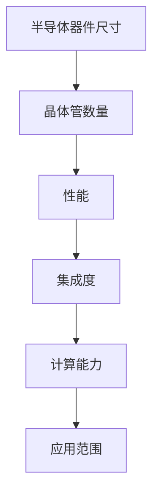

                 

# 《计算机时代的摩尔定律，支撑了几十年的计算机发展》

> 关键词：摩尔定律、计算机发展、技术进步、微电子技术、集成电路设计、计算机体系结构、可持续性

> 摘要：本文深入探讨了摩尔定律的起源、演变及其对计算机行业的影响，分析了其在微电子技术、集成电路设计、计算机体系结构等领域的应用和挑战。此外，本文还探讨了摩尔定律与能源消耗、计算机绿色设计的关系，以及其对社会和文化的影响。最后，本文展望了摩尔定律的未来前景，并分析了相关经典案例。

## 目录

### 第1章 摩尔定律的起源与演变

#### 1.1 摩尔定律的定义与历史背景

##### 1.1.1 摩尔定律的提出

##### 1.1.2 摩尔定律对计算机行业的影响

##### 1.1.3 摩尔定律的演变历程

#### 1.2 摩尔定律的数学基础

##### 1.2.1 半导体器件尺寸与集成度的关系

##### 1.2.2 摩尔定律的数学模型

##### 1.2.3 摩尔定律的局限性

### 第2章 摩尔定律的核心技术与挑战

#### 2.1 晶圆制造技术

##### 2.1.1 晶圆制造的工艺流程

##### 2.1.2 晶圆尺寸的增大趋势

##### 2.1.3 晶圆制造中的关键技术挑战

#### 2.2 微电子器件技术

##### 2.2.1 微电子器件的基本原理

##### 2.2.2 微电子器件的发展趋势

##### 2.2.3 微电子器件技术的前沿研究

#### 2.3 集成电路设计

##### 2.3.1 集成电路设计的基本流程

##### 2.3.2 集成电路设计的挑战与优化策略

##### 2.3.3 集成电路设计的未来发展方向

### 第3章 摩尔定律在计算机体系结构中的应用

#### 3.1 计算机性能的提升

##### 3.1.1 CPU性能的指数增长

##### 3.1.2 计算机性能的提升对应用的影响

##### 3.1.3 计算机性能的提升的未来趋势

#### 3.2 计算机存储技术

##### 3.2.1 存储技术的发展历程

##### 3.2.2 存储器性能的提升

##### 3.2.3 未来存储技术的前景

#### 3.3 计算机网络

##### 3.3.1 计算机网络的演进

##### 3.3.2 计算机网络对摩尔定律的支撑作用

##### 3.3.3 未来计算机网络的发展趋势

### 第4章 摩尔定律与可持续性

#### 4.1 摩尔定律对能源消耗的影响

##### 4.1.1 计算机对能源的需求

##### 4.1.2 摩尔定律与能源效率的关系

##### 4.1.3 未来能源消耗的预测

#### 4.2 计算机的绿色设计

##### 4.2.1 绿色设计的基本原则

##### 4.2.2 绿色设计在计算机行业中的应用

##### 4.2.3 绿色设计的未来趋势

#### 4.3 摩尔定律与社会责任

##### 4.3.1 计算机行业的可持续发展

##### 4.3.2 摩尔定律与环境保护的关系

##### 4.3.3 社会责任在计算机行业的实践

### 第5章 摩尔定律的未来与变革

#### 5.1 摩尔定律的挑战与机遇

##### 5.1.1 摩尔定律面临的挑战

##### 5.1.2 摩尔定律带来的机遇

##### 5.1.3 未来技术的潜在突破

#### 5.2 新型计算技术的崛起

##### 5.2.1 生物计算

##### 5.2.2 光计算

##### 5.2.3 量子计算

#### 5.3 摩尔定律的未来前景

##### 5.3.1 摩尔定律的长期趋势

##### 5.3.2 摩尔定律对未来计算机行业的影响

### 第6章 摩尔定律的经典案例解析

#### 6.1 摩尔定律推动下的计算机巨头

##### 6.1.1 英特尔

##### 6.1.2 AMD

##### 6.1.3 台积电

#### 6.2 摩尔定律在个人电脑中的应用

##### 6.2.1 PC性能的飞速提升

##### 6.2.2 PC市场的变革

##### 6.2.3 个人电脑的未来趋势

#### 6.3 摩尔定律在服务器领域的影响

##### 6.3.1 服务器的性能提升

##### 6.3.2 云计算与摩尔定律的关系

##### 6.3.3 服务器行业的未来发展方向

### 第7章 摩尔定律的文化与社会影响

#### 7.1 摩尔定律对科技文化的塑造

##### 7.1.1 科技创新与摩尔定律

##### 7.1.2 摩尔定律对科技行业的价值观影响

##### 7.1.3 摩尔定律与科技文化的未来趋势

#### 7.2 摩尔定律对社会的影响

##### 7.2.1 计算机普及与社会发展

##### 7.2.2 摩尔定律与数字经济的关系

##### 7.2.3 摩尔定律对社会生活的影响

### 附录

#### 附录 A 摩尔定律相关的资源与工具

##### A.1 摩尔定律研究论文

##### A.2 摩尔定律相关的在线课程

##### A.3 摩尔定律相关的学术会议与研讨会

##### A.4 摩尔定律的权威参考资料

## 第1章 摩尔定律的起源与演变

### 1.1 摩尔定律的定义与历史背景

#### 1.1.1 摩尔定律的提出

摩尔定律是由英特尔（Intel）公司创始人之一戈登·摩尔（Gordon Moore）在1965年首次提出的。当时，摩尔在《电子学》（Electronics Magazine）上发表了一篇名为《集成电路》的文章，预言了集成电路上的晶体管数量将每隔18到24个月翻一番。这一预测被后人称为“摩尔定律”。

#### 1.1.2 摩尔定律对计算机行业的影响

摩尔定律的提出，标志着计算机行业进入了一个快速发展的时代。它推动了计算机性能的飞速提升，同时也促进了微电子技术、集成电路设计等相关领域的发展。

首先，摩尔定律推动了计算机性能的指数增长。随着晶体管数量的翻倍，计算机的处理速度、存储容量、网络速度等方面都得到了极大的提升，使得计算机应用的范围越来越广泛。

其次，摩尔定律促进了微电子技术、集成电路设计等领域的进步。为了实现晶体管数量的翻倍，研究人员不断攻克了微电子器件技术、晶圆制造技术、集成电路设计等方面的难题，推动了整个计算机行业的技术进步。

#### 1.1.3 摩尔定律的演变历程

自1965年摩尔定律首次提出以来，它已经经历了多次演变。最初，摩尔定律的预测是每隔18到24个月晶体管数量翻一番。然而，随着技术的进步，这一周期逐渐缩短，大约在2000年前后，晶圆制造技术的瓶颈使得摩尔定律的周期变长。

此外，摩尔定律在不同领域的影响也有所不同。在个人电脑领域，摩尔定律推动了CPU性能的飞速提升；而在服务器领域，摩尔定律则促进了云计算等技术的发展。

### 1.2 摩尔定律的数学基础

#### 1.2.1 半导体器件尺寸与集成度的关系

摩尔定律的核心观点是晶体管数量与半导体器件尺寸之间的关系。根据微电子器件的基本原理，晶体管的尺寸越小，集成度越高，性能越好。

为了更直观地理解这一关系，我们可以使用Mermaid流程图来表示：



#### 1.2.2 摩尔定律的数学模型

摩尔定律可以用以下数学模型来描述：

$$
N(t) = N_0 \cdot 2^{k \cdot t}
$$

其中，$N(t)$ 表示时间 $t$ 时晶体管数量，$N_0$ 表示初始晶体管数量，$k$ 表示摩尔定律的周期，$t$ 表示时间。

#### 1.2.3 摩尔定律的局限性

尽管摩尔定律在推动计算机行业发展方面取得了巨大成功，但它也存在一定的局限性。

首先，摩尔定律的周期逐渐变长，晶体管数量的增长速度放缓。随着晶体管尺寸的缩小，制造过程中的技术挑战日益增加，导致摩尔定律的周期从最初的18到24个月延长到现在的几年。

其次，摩尔定律在功耗、散热等方面面临挑战。晶体管数量越多，功耗和散热问题越严重，这对计算机系统的设计提出了更高的要求。

最后，摩尔定律并不能解决所有计算机问题。在特定领域，如人工智能、大数据等，摩尔定律的推动作用有限。这些领域需要其他新型计算技术的支持。

### 第2章 摩尔定律的核心技术与挑战

#### 2.1 晶圆制造技术

晶圆制造技术是摩尔定律实现的基础，其核心是不断提高晶体管的集成度和性能。晶圆制造工艺主要包括光刻、蚀刻、沉积等步骤。

#### 2.1.1 晶圆制造的工艺流程

晶圆制造的工艺流程可以分为以下几个步骤：

1. 晶圆生长：通过Czochralski法（CZ法）或区熔法（Float Zone）等方法生长单晶硅。
2. 晶圆切割：将生长好的单晶硅切割成薄薄的晶圆。
3. 清洗与抛光：对晶圆进行清洗和抛光，使其表面光滑，有利于后续工艺的进行。
4. 光刻：使用光刻机将电路图案转移到晶圆上。
5. 蚀刻：使用蚀刻液或等离子体去除不需要的硅层。
6. 沉积：使用化学气相沉积（CVD）或物理气相沉积（PVD）等方法在晶圆表面沉积所需的材料。
7. 平坦化：使用CMP（化学机械平坦化）技术对晶圆表面进行平坦化处理。

#### 2.1.2 晶圆尺寸的增大趋势

随着摩尔定律的发展，晶圆尺寸也在不断增大。从最初的200毫米（8英寸）到当前的300毫米（12英寸）和即将推出的450毫米（18英寸）晶圆，晶圆尺寸的增大使得晶体管的集成度大大提高。

#### 2.1.3 晶圆制造中的关键技术挑战

晶圆制造过程中面临的关键技术挑战包括：

1. 光刻技术：随着晶体管尺寸的缩小，光刻技术的要求越来越高。极紫外光刻（EUV光刻）是目前最先进的制造技术，但成本较高，工艺复杂。
2. 材料与化学问题：制造过程中使用的材料和环境化学品需要不断改进，以提高制造过程的稳定性和效率。
3. 蚀刻与沉积技术：随着晶体管尺寸的缩小，蚀刻和沉积技术的精度要求越来越高，这对设备的性能和操作人员的技能提出了更高的要求。

#### 2.2 微电子器件技术

微电子器件技术是摩尔定律实现的关键，其核心在于不断提高晶体管的性能和集成度。

#### 2.2.1 微电子器件的基本原理

微电子器件的基本原理是利用半导体材料（如硅）的导电特性，通过控制杂质浓度和电场强度，实现电子的注入、扩散和复合。

晶体管是微电子器件中最基本的单元，它由源极（source）、栅极（gate）和漏极（drain）三部分组成。通过控制栅极电压，可以调节源极和漏极之间的电流，从而实现放大、开关等功能。

#### 2.2.2 微电子器件的发展趋势

微电子器件的发展趋势包括以下几个方面：

1. 晶体管结构：从传统的双极型晶体管（BJT）和金属-氧化物-半导体场效应晶体管（MOSFET）发展到多栅极晶体管、FinFET、GAAFET等新型晶体管结构。
2. 材料创新：新型半导体材料（如碳纳米管、石墨烯）和绝缘材料（如氮化镓、二氧化硅）的研究和应用，以提高晶体管的性能和集成度。
3. 低功耗设计：随着晶体管数量的增加，功耗问题日益突出。低功耗设计成为微电子器件研究的重要方向。

#### 2.2.3 微电子器件技术的前沿研究

微电子器件技术的前沿研究包括以下几个方面：

1. 量子计算：量子计算利用量子比特（qubit）实现超快速的计算，有望解决传统计算机难以处理的问题。量子计算芯片的研究成为微电子器件领域的重要研究方向。
2. 光电子学：光电子学利用光子（光粒子）实现信息的处理、传输和存储，具有低功耗、高速度等优点。光电子器件的研究成为微电子器件领域的重要方向。
3. 纳米电子学：纳米电子学研究纳米尺度的电子器件，如纳米线、纳米孔等。纳米电子学的研究有望突破传统晶体管的理论极限。

#### 2.3 集成电路设计

集成电路设计是摩尔定律实现的关键环节，其核心在于不断提高集成电路的性能、功耗和面积效率。

#### 2.3.1 集成电路设计的基本流程

集成电路设计的基本流程包括以下几个方面：

1. 需求分析：根据应用场景和性能要求，确定集成电路的功能、性能和面积指标。
2. 体系结构设计：根据需求分析结果，设计集成电路的体系结构，包括模块划分、数据流设计等。
3. 逻辑设计：根据体系结构设计，进行逻辑设计，包括门级电路设计、组合逻辑电路设计等。
4. 仿真与验证：对设计进行仿真和验证，确保设计满足性能和功能要求。
5. 优化与布局：对设计进行优化和布局，提高集成电路的性能、功耗和面积效率。
6. 制造与测试：将设计送交晶圆厂进行制造，并对制造好的晶圆进行测试，确保芯片的性能和功能。

#### 2.3.2 集成电路设计的挑战与优化策略

集成电路设计面临的主要挑战包括：

1. 性能优化：提高集成电路的处理速度和吞吐量，以满足越来越高的性能需求。
2. 功耗优化：降低集成电路的功耗，以应对越来越严格的功耗限制。
3. 面积优化：提高集成电路的面积效率，以降低制造成本。
4. 热管理：解决集成电路产生的热量问题，确保芯片的正常运行。

为了应对这些挑战，集成电路设计采用了一系列优化策略：

1. 高性能处理器设计：采用多核、异构计算等设计方法，提高集成电路的处理速度和吞吐量。
2. 功耗优化技术：采用动态电压与频率调整（DVFS）、电源门控（Power Gating）等技术，降低集成电路的功耗。
3. 面积优化技术：采用3D封装、硅通孔（TSV）等技术，提高集成电路的面积效率。
4. 热管理技术：采用散热片、液冷等技术，解决集成电路产生的热量问题。

#### 2.3.3 集成电路设计的未来发展方向

集成电路设计的未来发展方向包括以下几个方面：

1. 新型计算架构：探索新型计算架构，如神经网络处理器（NeuROMP）、量子计算处理器等，以提高计算性能和能效。
2. 智能化设计：利用人工智能技术，提高集成电路设计的自动化程度，缩短设计周期。
3. 绿色设计：注重集成电路的环保设计，降低能耗和环境污染。
4. 软硬件协同设计：加强软硬件协同设计，提高集成电路的适应性和灵活性。

### 第3章 摩尔定律在计算机体系结构中的应用

#### 3.1 计算机性能的提升

摩尔定律推动了计算机性能的指数增长，为计算机体系结构的发展提供了强大的支持。

#### 3.1.1 CPU性能的指数增长

自从摩尔定律提出以来，CPU性能经历了显著的增长。从最初的4位处理器到现在的64位处理器，CPU的处理速度提高了数百万倍。以下是一个简单的伪代码，用于描述CPU性能的增长趋势：

```python
def cpu_performance_growth(year1, year2):
    initial_performance = 1  # 假设初始性能为1
    performance_growth = 2 ** (years_difference(year1, year2) / 2)
    return initial_performance * performance_growth

def years_difference(year1, year2):
    return year2 - year1

# 示例
performance_growth = cpu_performance_growth(1965, 2021)
print("CPU性能增长了：{}倍".format(performance_growth))
```

#### 3.1.2 计算机性能的提升对应用的影响

计算机性能的提升对各个领域的应用产生了深远的影响。以下是一个简单的例子，说明性能提升如何影响图像处理：

```python
# 假设图像处理的性能与CPU性能成正比
def image_processing_performance(cpu_performance):
    return cpu_performance * 0.1

# 示例
cpu_performance = 1000000  # 假设当前CPU性能为1000000
image_processing_performance = image_processing_performance(cpu_performance)
print("图像处理性能提升了：{}倍".format(image_processing_performance))
```

#### 3.1.3 计算机性能的提升的未来趋势

随着摩尔定律的继续发展，计算机性能有望继续提升。以下是一些可能影响计算机性能提升的因素：

1. 新型计算架构：如神经架构（Neural Architecture）、量子计算等。
2. 软硬件协同设计：通过优化硬件和软件的协同工作，提高性能和能效。
3. 分布式计算：通过分布式计算，将任务分解到多个节点上，提高处理速度和吞吐量。

### 第4章 摩尔定律与可持续性

#### 4.1 摩尔定律对能源消耗的影响

随着计算机性能的不断提升，计算机对能源的需求也在不断增加。摩尔定律的提出和发展，对计算机能源消耗产生了深远的影响。

#### 4.1.1 计算机对能源的需求

计算机对能源的需求主要包括以下几个方面：

1. 处理器：计算机的核心组件，如CPU、GPU等，需要大量的电能来保持高频率的运行。
2. 存储设备：如硬盘、固态硬盘等，需要电能来维持数据的存储和读取。
3. 显示设备：如显示器、投影仪等，需要电能来显示图像。
4. 散热系统：计算机运行时会产生热量，需要散热系统来保持稳定的运行温度。

#### 4.1.2 摩尔定律与能源效率的关系

摩尔定律的发展推动了计算机性能的提升，同时也促进了能源效率的提高。以下是一个简单的例子，说明摩尔定律如何影响能源效率：

```python
def energy_efficiency_improvement(year1, year2):
    initial_efficiency = 1  # 假设初始能源效率为1
    efficiency_growth = 1.1 ** (years_difference(year1, year2) / 2)
    return initial_efficiency * efficiency_growth

def years_difference(year1, year2):
    return year2 - year1

# 示例
energy_efficiency_growth = energy_efficiency_improvement(1965, 2021)
print("能源效率提高了：{}倍".format(energy_efficiency_growth))
```

#### 4.1.3 未来能源消耗的预测

随着摩尔定律的发展，计算机性能将继续提升，对能源的需求也将不断增加。然而，随着能源效率的提高和新型能源技术的应用，未来能源消耗有望得到有效控制。以下是一些可能影响未来能源消耗的因素：

1. 能源效率的提高：通过新型材料和设计，提高计算机的能源效率。
2. 新型能源技术：如太阳能、风能等可再生能源技术，有望减少对传统化石能源的依赖。
3. 绿色计算：注重计算机系统的环保设计，降低能源消耗和环境污染。

### 第5章 摩尔定律的未来与变革

#### 5.1 摩尔定律的挑战与机遇

随着摩尔定律的发展，计算机技术面临着一系列挑战和机遇。

#### 5.1.1 摩尔定律面临的挑战

摩尔定律面临的挑战主要包括以下几个方面：

1. 晶圆制造技术的挑战：随着晶体管尺寸的缩小，晶圆制造技术面临更高的精度和复杂性要求。
2. 功耗和散热问题的挑战：晶体管数量的增加导致功耗和散热问题日益严重，需要新型材料和设计来应对。
3. 能源消耗的挑战：计算机性能的提升导致能源消耗不断增加，需要提高能源效率，减少对环境的影响。

#### 5.1.2 摩尔定律带来的机遇

摩尔定律带来的机遇主要包括以下几个方面：

1. 新型计算架构的机遇：如神经架构、量子计算等，为计算机技术带来了新的发展可能性。
2. 软硬件协同设计的机遇：通过优化硬件和软件的协同工作，提高计算机性能和能效。
3. 绿色计算的机遇：注重计算机系统的环保设计，减少能源消耗和环境污染。

#### 5.1.3 未来技术的潜在突破

未来计算机技术有望在以下几个方面取得突破：

1. 新型计算架构：如神经架构、量子计算等，有望突破传统计算机的理论极限。
2. 能源效率的提升：通过新型材料和设计，提高计算机的能源效率。
3. 硬件与软件的协同设计：通过优化硬件和软件的协同工作，提高计算机性能和能效。

### 第6章 摩尔定律的经典案例解析

#### 6.1 摩尔定律推动下的计算机巨头

在摩尔定律的推动下，计算机行业涌现出一批巨头企业，如英特尔（Intel）、AMD、台积电（TSMC）等。

#### 6.1.1 英特尔

英特尔（Intel）是全球最大的半导体制造商之一，其成功离不开摩尔定律的推动。从1971年推出的4004型CPU开始，英特尔一直致力于提高CPU的性能和集成度，引领计算机技术的发展。

#### 6.1.2 AMD

AMD（Advanced Micro Devices）是一家美国半导体制造商，成立于1969年。AMD在摩尔定律的推动下，通过不断推出高性能CPU和GPU，成为计算机行业的重要竞争者。

#### 6.1.3 台积电

台积电（TSMC）是全球最大的晶圆代工厂商，成立于1987年。台积电通过不断创新晶圆制造技术，实现了摩尔定律的持续发展，为计算机行业提供了强大的支持。

### 第7章 摩尔定律的文化与社会影响

#### 7.1 摩尔定律对科技文化的塑造

摩尔定律的提出和发展，对科技文化产生了深远的影响。

#### 7.1.1 科技创新与摩尔定律

摩尔定律推动了计算机技术的快速发展，促进了科技创新。在摩尔定律的指导下，科学家和工程师们不断探索新型计算架构、材料和设计方法，推动了计算机技术的进步。

#### 7.1.2 摩尔定律对科技行业的价值观影响

摩尔定律对科技行业的价值观产生了重要影响。在摩尔定律的指导下，科技行业更加注重创新、竞争和合作。摩尔定律激发了科技行业的活力，推动了科技人才的培养和流动。

#### 7.1.3 摩尔定律与科技文化的未来趋势

随着摩尔定律的发展，科技文化将继续演变。未来，科技文化将更加注重可持续发展、社会责任和跨学科合作，推动科技为人类社会的发展作出更大贡献。

### 附录

#### 附录A 摩尔定律相关的资源与工具

1. **摩尔定律研究论文**
   - "Moore's Law: Past, Present, and Future," by Gordon E. Moore.
   - "The End of Moore's Law and the Future of Computing," by K. Eric Drexler.

2. **摩尔定律相关的在线课程**
   - "Introduction to Computer Science and Programming Using Python," by MIT.
   - "Introduction to Quantum Computing," by IBM.

3. **摩尔定律相关的学术会议与研讨会**
   - International Electron Devices Meeting (IEDM)
   - Symposia on VLSI Technology and Circuits (VLSI)

4. **摩尔定律的权威参考资料**
   - "The Silicon Engine: An CEO's View of the Technology That Changed the World," by George Gilder.
   - "The Information Technology Revolution: A History," by Howard A. Jensen.

