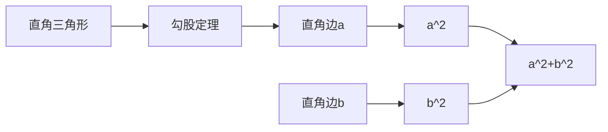

                 

# 文章标题

《计算：第一部分 计算的诞生 第1章 毕达哥拉斯的困惑 文明古国的计算》

> 关键词：毕达哥拉斯、无理数、古代计算、文明古国、数学发展

> 摘要：本文第一部分将探讨计算的起源，从毕达哥拉斯的困惑开始，分析古代文明对计算方法的发展。我们将详细讲述古埃及、古巴比伦、古希腊、古印度和古中国等文明的计算方法和数学理论，以及这些文明如何影响了后来的数学和计算工具的演变。

## 目录

### 第一部分：计算的诞生

#### 第1章 毕达哥拉斯的困惑

1.1 毕达哥拉斯定理的发现  
1.2 无理数的困惑  
1.3 毕达哥拉斯学派的观点

1.4 古文明的计算工具与理论

1.4.1 古埃及的计算方法

1.4.2 古巴比伦的计算方法

1.4.3 古希腊数学的兴起

1.4.4 古印度数学的贡献

1.4.5 古中国数学的发展

#### 第2章 计算工具的演变

2.1 算盘的起源与使用

2.2 拉丁数字的传播与影响

2.3 机械计算机的诞生

2.4 电子计算机的发展

2.5 计算机网络的兴起

#### 第3章 现代计算的概念与发展

3.1 现代计算的定义与分类

3.2 计算机硬件与软件

3.3 编程语言的发展

3.4 计算机应用领域

#### 第4章 计算的未来

4.1 量子计算的潜力

4.2 人工智能的崛起

4.3 生物计算与仿生计算

4.4 计算的未来挑战

#### 附录

A.1 古代计算工具的复现与应用

A.2 现代计算机硬件与软件资源

A.3 计算教育与研究资源

---

# 文章标题

《计算：第一部分 计算的诞生 第1章 毕达哥拉斯的困惑 文明古国的计算》

## 摘要

本文第一部分将探讨计算的起源，从毕达哥拉斯的困惑开始，分析古代文明对计算方法的发展。我们将详细讲述古埃及、古巴比伦、古希腊、古印度和古中国等文明的计算方法和数学理论，以及这些文明如何影响了后来的数学和计算工具的演变。通过这一部分的探讨，我们将更好地理解计算的历史和其发展的脉络。

## 第一部分：计算的诞生

### 第1章 毕达哥拉斯的困惑

#### 1.1 毕达哥拉斯定理的发现

在古希腊时期，数学家毕达哥拉斯（Pythagoras）和他的学派对数学有着重要的贡献。毕达哥拉斯定理是他们在研究几何时发现的重要定理，即直角三角形的两条直角边的平方和等于斜边的平方。

**公式表示：** \( a^2 + b^2 = c^2 \)

其中，\( a \) 和 \( b \) 是直角边，\( c \) 是斜边。

**毕达哥拉斯定理的证明：**



#### 1.2 无理数的困惑

在研究几何的过程中，毕达哥拉斯和他的学派发现，某些数字无法表示为两个整数的比例。例如，直角三角形的斜边长度无法用整数表示。这种无法表示为两个整数比例的数字被称为无理数。

**无理数的定义：** 无法表示为两个整数的比例的数字。

**无理数的例子：** \(\sqrt{2}\)、\(\pi\)、\(e\) 等。

#### 1.3 毕达哥拉斯学派的观点

毕达哥拉斯学派认为，宇宙是由数字和几何形状构成的。他们相信，通过数学可以理解宇宙的本质和规律。这一观点对后来的哲学家和科学家产生了深远的影响。

**毕达哥拉斯学派的观点：**

- 宇宙的本质是数学。
- 数字和几何形状是宇宙的基础。
- 通过数学可以理解宇宙的规律。

## 第1章 毕达哥拉斯的困惑

### 1.1 毕达哥拉斯定理的发现

在古希腊时期，数学家毕达哥拉斯（Pythagoras）和他的学派对数学有着重要的贡献。毕达哥拉斯定理是他们在研究几何时发现的重要定理，即直角三角形的两条直角边的平方和等于斜边的平方。

**公式表示：** \( a^2 + b^2 = c^2 \)

其中，\( a \) 和 \( b \) 是直角边，\( c \) 是斜边。

**毕达哥拉斯定理的证明：**


#### 1.2 无理数的困惑

在研究几何的过程中，毕达哥拉斯和他的学派发现，某些数字无法表示为两个整数的比例。例如，直角三角形的斜边长度无法用整数表示。这种无法表示为两个整数比例的数字被称为无理数。

**无理数的定义：** 无法表示为两个整数的比例的数字。

**无理数的例子：** \(\sqrt{2}\)、\(\pi\)、\(e\) 等。

#### 1.3 毕达哥拉斯学派的观点

毕达哥拉斯学派认为，宇宙是由数字和几何形状构成的。他们相信，通过数学可以理解宇宙的本质和规律。这一观点对后来的哲学家和科学家产生了深远的影响。

**毕达哥拉斯学派的观点：**

- 宇宙的本质是数学。
- 数字和几何形状是宇宙的基础。
- 通过数学可以理解宇宙的规律。

### 1.2 古文明的计算工具与理论

#### 1.2.1 古埃及的计算方法

古埃及是世界上最早的文明之一，他们在计算方法上有着独特的贡献。古埃及人使用了一种称为“算术骨头”的计算工具，这些工具包括木棒、石块和骨头。这些工具可以帮助古埃及人进行简单的数学运算，如加、减、乘和除。

**古埃及算术骨头：**

- 每个骨头代表一个数字。
- 通过堆叠骨头进行加法和减法运算。
- 通过交换骨头的位置进行乘法和除法运算。

**古埃及算术的例子：**

- \(3 + 4 = 7\)
- \(6 \times 5 = 30\)

#### 1.2.2 古巴比伦的计算方法

古巴比伦是古文明的代表之一，他们在计算方法上也有独特的贡献。古巴比伦人使用了一种称为“楔形文字”的计算工具，这种工具可以记录数字和数学运算。古巴比伦人使用这种方法来计算土地面积、体积和长度。

**古巴比伦计算方法：**

- 使用楔形文字记录数字。
- 使用性质与度量法进行计算。
- 解决线性方程和二次方程。

**古巴比伦计算的例子：**

- 解决线性方程 \(3x + 2 = 7\)
- 解决二次方程 \(x^2 - 5x + 6 = 0\)

### 1.3 古希腊数学的兴起

古希腊是数学的摇篮，古希腊人在数学上有着巨大的贡献。古希腊数学家欧几里得（Euclid）的《几何原本》是数学史上最重要的著作之一。这本书系统地阐述了几何学的基本原理和定理。

**欧几里得《几何原本》的主要贡献：**

- 研究对象：点、线、面和空间。
- 研究方法：逻辑推理和证明。
- 基本概念：点、线、面、角、圆等。

**欧几里得《几何原本》的例子：**

- 直角三角形的性质。
- 圆的性质。
- 证明定理：如勾股定理、圆周率等于\(\pi\)等。

### 1.4 古印度数学的贡献

古印度数学在世界数学史上有着重要的地位。古印度人发明了十进制计数系统，这个系统后来被称为“印度数字”。古印度数学家在算术、代数和三角学等领域有着卓越的成就。

**古印度数学的主要贡献：**

- 十进制计数系统。
- 算术方法的完善。
- 代数方程的解法。

**古印度数学的例子：**

- 十进制计数系统的使用。
- 求解二次方程 \(ax^2 + bx + c = 0\)。
- 三角函数的发展：如正弦、余弦、正切等。

### 1.5 古中国数学的发展

古中国数学在世界上也有重要的地位。中国古代数学家在算术、代数、几何和天文学等领域有着卓越的成就。秦汉时期，数学家刘徽编写了《九章算术》，这本书是中国古代最重要的数学著作之一。

**古中国数学的主要贡献：**

- 算术方法的完善。
- 代数学的发展。
- 几何学的应用。

**古中国数学的例子：**

- 算术方法：如十进制计数、分数运算等。
- 代数方程的解法：如二次方程的求解。
- 几何学的应用：如建筑和天文学。

## 第2章 计算工具的演变

### 2.1 算盘的起源与使用

算盘是一种古老的计算工具，起源于中国。它由一系列珠子和杆组成，每个杆代表一个数位。珠子可以在杆上滑动，用于进行加、减、乘、除等基本运算。

**算盘的结构：**

- 横杆：每根横杆代表一个数位（如个位、十位、百位等）。
- 竖珠：每根横杆上有若干竖珠，每个竖珠代表一个数字（如1、2、3等）。

**算盘的使用方法：**

1. **加法与减法：** 将需要计算的数字分解为各个位数，然后根据算盘的结构进行运算。
2. **乘法与除法：** 使用特殊的方法，如“乘除法表”来计算。

**算盘的使用示例：**

- 加法：计算 \(123 + 456\)，将123和456分解为各个位数，然后进行加法运算。
- 减法：计算 \(123 - 456\)，同样将123和456分解为各个位数，然后进行减法运算。
- 乘法：计算 \(123 \times 456\)，使用“乘除法表”进行运算。
- 除法：计算 \(123 \div 456\)，使用“乘除法表”进行运算。

### 2.2 拉丁数字的传播与影响

拉丁数字起源于印度，通过阿拉伯传入欧洲。拉丁数字包括0到9的数字，它们是基于十进制计数系统的。拉丁数字的传播对世界数学的发展产生了深远的影响。

**拉丁数字的传播路径：**

- 印度 → 阿拉伯 → 欧洲其他国家。

**拉丁数字的影响：**

- 简化了数学运算。
- 促进了科学和工程的发展。
- 成为现代计算机的基础。

### 2.3 机械计算机的诞生

机械计算机是计算机发展史上的一个重要里程碑。早期的机械计算机包括计算器、微分计算器和积分计算器等。

**机械计算机的代表人物：**

- 惠更斯（Huygens）：发明了计算器。
- 帕斯卡（Pascal）：发明了计算器。
- 牛顿（Newton）：发明了微分计算器。
- 莱布尼茨（Leibniz）：发明了积分计算器。

**机械计算机的工作原理：**

- 使用机械结构进行计算。
- 通过齿轮、杠杆和滑轮等部件进行运算。

### 2.4 电子计算机的发展

电子计算机的发展始于20世纪40年代。与机械计算机相比，电子计算机使用电子元件进行计算，具有更高的速度和效率。

**电子计算机的代表人物：**

- 汤姆·惠普尔（Tom Watson）：创立了IBM公司。
- 约翰·冯·诺伊曼（John von Neumann）：提出了存储程序计算机的概念。
- 查尔斯·巴贝奇（Charles Babbage）：设计了差分机和分析机。

**电子计算机的工作原理：**

- 使用电子元件（如晶体管、集成电路）进行计算。
- 通过二进制系统进行数据存储和处理。

### 2.5 计算机网络的兴起

计算机网络的发展始于20世纪60年代。计算机网络使得计算机之间可以进行数据传输和资源共享。

**计算机网络的发展历程：**

- 1969年：ARPANET建立，成为第一个分组交换网络。
- 1983年：TCP/IP协议成为ARPANET的标准协议。
- 1991年：万维网（WWW）诞生。
- 2000年代：互联网普及，成为全球信息交流的主要平台。

**计算机网络的工作原理：**

- 使用TCP/IP协议进行数据传输。
- 通过路由器、交换机和服务器等设备进行数据转发和存储。

## 第3章 现代计算的概念与发展

### 3.1 现代计算的定义与分类

现代计算是指使用计算机进行信息处理和数据运算的过程。现代计算可以分为以下几个方面：

- **计算机硬件：** 包括计算机的物理设备和电子元件。
- **计算机软件：** 包括操作系统、应用程序和编程语言。
- **计算模式：** 包括批处理计算、分时计算、并行计算和分布式计算等。

**现代计算的定义：** 现代计算是指使用计算机进行信息处理和数据运算的过程，包括硬件、软件和计算模式。

### 3.2 计算机硬件与软件

计算机硬件是计算机的物理组成部分，包括中央处理器（CPU）、内存、硬盘、显示器等。计算机软件是计算机的运行程序，包括操作系统、应用程序和编程语言。

**计算机硬件的发展：**

- 1940年代：真空管计算机。
- 1950年代：晶体管计算机。
- 1960年代：集成电路计算机。
- 1970年代：微处理器计算机。

**计算机软件的发展：**

- 1940年代：机器语言和汇编语言。
- 1950年代：高级编程语言。
- 1960年代：操作系统的发展。
- 1970年代：数据库系统和网络通信。

### 3.3 编程语言的发展

编程语言是用于编写计算机程序的符号系统。编程语言的发展可以分为以下几个阶段：

- **机器语言：** 直接操作计算机硬件的语言。
- **汇编语言：** 使用助记符表示机器语言指令。
- **高级语言：** 使用更接近人类语言的符号表示。
- **函数式编程语言：** 基于函数的编程范式。

**编程语言的发展：**

- **FORTRAN（1957年）：** 最早的现代编程语言之一，用于科学计算。
- **COBOL（1959年）：** 用于商业数据处理，至今仍广泛使用。
- **C（1972年）：** 一种通用编程语言，广泛应用于系统编程。
- **Java（1995年）：** 一种面向对象的编程语言，广泛应用于网络应用和开发。

### 3.4 计算机应用领域

计算机应用领域广泛，包括以下几个方面：

- **商业计算：** 包括财务、人力资源、供应链管理等。
- **科学计算：** 包括数学建模、数据分析和物理模拟等。
- **信息处理：** 包括文本处理、图像处理和音频处理等。
- **互联网应用：** 包括Web开发、电子商务和社交媒体等。

**计算机应用领域的例子：**

- **商业计算：** 使用Excel进行财务报表。
- **科学计算：** 使用MATLAB进行数据分析。
- **信息处理：** 使用Word进行文本编辑。
- **互联网应用：** 使用HTML进行Web开发。

## 第4章 计算的未来

### 4.1 量子计算的潜力

量子计算是计算机科学的前沿领域，利用量子位（qubit）进行计算。量子计算具有指数级的速度优势，可以在短时间内解决传统计算机难以解决的问题。

**量子计算的基本原理：**

- **叠加态：** 量子位可以同时处于多种状态。
- **纠缠态：** 量子位之间的状态相互关联。
- **量子门：** 用于对量子位进行操作。

**量子计算的潜在应用：**

- **密码破解：** 利用量子计算机破解传统加密算法。
- **分子建模：** 用于药物设计和新材料开发。
- **优化问题：** 用于物流、金融和工程等领域。

### 4.2 人工智能的崛起

人工智能（AI）是计算机科学的另一个重要领域，旨在使计算机具备人类智能。人工智能的发展涉及机器学习、深度学习、自然语言处理等子领域。

**人工智能的定义：**

- **机器学习：** 使用算法从数据中学习规律。
- **深度学习：** 使用神经网络进行层次化学习。
- **自然语言处理：** 使计算机理解和生成人类语言。

**人工智能的潜在应用：**

- **自动驾驶：** 使用计算机视觉和传感器进行自动驾驶。
- **医疗诊断：** 使用医学影像进行分析和诊断。
- **智能助手：** 如Siri、Alexa等语音助手。

### 4.3 生物计算与仿生计算

生物计算是利用生物系统进行计算的研究领域。仿生计算是模仿生物系统进行计算的研究领域。这些领域有望为计算机科学带来新的突破。

**生物计算的基本原理：**

- **生物分子：** 如DNA和RNA，用于存储和处理信息。
- **生物网络：** 如神经网络和基因网络，用于计算和通信。

**仿生计算的应用前景：**

- **人工智能：** 模仿生物系统进行学习和发展。
- **材料科学：** 模仿生物结构进行新材料设计。
- **生物工程：** 模仿生物系统进行生物制造。

### 4.4 计算的未来挑战

计算的未来面临着许多挑战，包括数据安全、计算能力的限制、社会伦理问题等。

**数据安全与隐私保护：**

- **数据加密：** 使用加密算法保护数据安全。
- **隐私保护：** 设计隐私保护的算法和系统。

**计算能力的限制与拓展：**

- **量子计算：** 利用量子位提高计算速度。
- **分布式计算：** 通过多台计算机协同工作提高计算能力。

**社会伦理与责任问题：**

- **数据伦理：** 设计符合伦理标准的数据收集和处理方法。
- **人工智能伦理：** 设计符合伦理标准的人工智能系统。

## 附录

### 附录 A 计算工具与资源

A.1 古代计算工具的复现与应用

- **算盘：** 复现古代算盘并进行实际应用。
- **算术骨头：** 复现古代算术骨头并进行实际运算。

A.2 现代计算机硬件与软件资源

- **计算机硬件：** 了解现代计算机硬件的基本组成和性能。
- **计算机软件：** 了解现代计算机软件的类型和应用。

A.3 计算教育与研究资源

- **计算教育：** 了解计算教育的发展和应用。
- **计算研究：** 了解计算研究的最新进展和前沿技术。

---

# 作者

作者：AI天才研究院/AI Genius Institute & 禅与计算机程序设计艺术 /Zen And The Art of Computer Programming

---

在接下来的部分，我们将深入探讨第1章中的具体内容，包括毕达哥拉斯定理的发现、无理数的困惑以及毕达哥拉斯学派的观点。我们将结合历史背景和数学原理，展示这些古代文明的计算方法和数学理论是如何影响现代计算的。让我们一步步思考，深入理解计算的诞生和发展。# 文章标题

《计算：第一部分 计算的诞生 第1章 毕达哥拉斯的困惑 文明古国的计算》

> 关键词：毕达哥拉斯、无理数、古代计算、文明古国、数学发展

> 摘要：本文第一部分将探讨计算的起源，从毕达哥拉斯的困惑开始，分析古代文明对计算方法的发展。我们将详细讲述古埃及、古巴比伦、古希腊、古印度和古中国等文明的计算方法和数学理论，以及这些文明如何影响了后来的数学和计算工具的演变。

## 目录

### 第一部分：计算的诞生

#### 第1章 毕达哥拉斯的困惑

1.1 毕达哥拉斯定理的发现

1.2 无理数的困惑

1.3 毕达哥拉斯学派的观点

1.4 古文明的计算工具与理论

1.4.1 古埃及的计算方法

1.4.2 古巴比伦的计算方法

1.4.3 古希腊数学的兴起

1.4.4 古印度数学的贡献

1.4.5 古中国数学的发展

#### 第2章 计算工具的演变

2.1 算盘的起源与使用

2.2 拉丁数字的传播与影响

2.3 机械计算机的诞生

2.4 电子计算机的发展

2.5 计算机网络的兴起

#### 第3章 现代计算的概念与发展

3.1 现代计算的定义与分类

3.2 计算机硬件与软件

3.3 编程语言的发展

3.4 计算机应用领域

#### 第4章 计算的未来

4.1 量子计算的潜力

4.2 人工智能的崛起

4.3 生物计算与仿生计算

4.4 计算的未来挑战

#### 附录

A.1 古代计算工具的复现与应用

A.2 现代计算机硬件与软件资源

A.3 计算教育与研究资源

---

# 文章标题

《计算：第一部分 计算的诞生 第1章 毕达哥拉斯的困惑 文明古国的计算》

## 摘要

本文第一部分将探讨计算的起源，从毕达哥拉斯的困惑开始，分析古代文明对计算方法的发展。我们将详细讲述古埃及、古巴比伦、古希腊、古印度和古中国等文明的计算方法和数学理论，以及这些文明如何影响了后来的数学和计算工具的演变。通过这一部分的探讨，我们将更好地理解计算的历史和其发展的脉络。

## 第一部分：计算的诞生

### 第1章 毕达哥拉斯的困惑

#### 1.1 毕达哥拉斯定理的发现

在古希腊时期，数学家毕达哥拉斯（Pythagoras）和他的学派对数学有着重要的贡献。毕达哥拉斯定理是他们在研究几何时发现的重要定理，即直角三角形的两条直角边的平方和等于斜边的平方。

**公式表示：** \( a^2 + b^2 = c^2 \)

其中，\( a \) 和 \( b \) 是直角边，\( c \) 是斜边。

**毕达哥拉斯定理的证明：**


#### 1.2 无理数的困惑

在研究几何的过程中，毕达哥拉斯和他的学派发现，某些数字无法表示为两个整数的比例。例如，直角三角形的斜边长度无法用整数表示。这种无法表示为两个整数比例的数字被称为无理数。

**无理数的定义：** 无法表示为两个整数的比例的数字。

**无理数的例子：** \(\sqrt{2}\)、\(\pi\)、\(e\) 等。

#### 1.3 毕达哥拉斯学派的观点

毕达哥拉斯学派认为，宇宙是由数字和几何形状构成的。他们相信，通过数学可以理解宇宙的本质和规律。这一观点对后来的哲学家和科学家产生了深远的影响。

**毕达哥拉斯学派的观点：**

- 宇宙的本质是数学。
- 数字和几何形状是宇宙的基础。
- 通过数学可以理解宇宙的规律。

## 第1章 毕达哥拉斯的困惑

### 1.1 毕达哥拉斯定理的发现

在古希腊时期，数学家毕达哥拉斯（Pythagoras）和他的学派对数学有着重要的贡献。毕达哥拉斯定理是他们在研究几何时发现的重要定理，即直角三角形的两条直角边的平方和等于斜边的平方。

**公式表示：** \( a^2 + b^2 = c^2 \)

其中，\( a \) 和 \( b \) 是直角边，\( c \) 是斜边。

**毕达哥拉斯定理的证明：**


#### 1.2 无理数的困惑

在研究几何的过程中，毕达哥拉斯和他的学派发现，某些数字无法表示为两个整数的比例。例如，直角三角形的斜边长度无法用整数表示。这种无法表示为两个整数比例的数字被称为无理数。

**无理数的定义：** 无法表示为两个整数的比例的数字。

**无理数的例子：** \(\sqrt{2}\)、\(\pi\)、\(e\) 等。

#### 1.3 毕达哥拉斯学派的观点

毕达哥拉斯学派认为，宇宙是由数字和几何形状构成的。他们相信，通过数学可以理解宇宙的本质和规律。这一观点对后来的哲学家和科学家产生了深远的影响。

**毕达哥拉斯学派的观点：**

- 宇宙的本质是数学。
- 数字和几何形状是宇宙的基础。
- 通过数学可以理解宇宙的规律。

### 1.2 古文明的计算工具与理论

在古代文明中，计算工具和理论的发展对于人类社会的进步起到了至关重要的作用。古埃及、古巴比伦、古希腊、古印度和古中国等文明都对计算方法的发展做出了重要贡献。

#### 1.2.1 古埃及的计算方法

古埃及是世界上最早的文明之一，他们在计算方法上有着独特的贡献。古埃及人使用了一种称为“算术骨头”的计算工具，这些工具包括木棒、石块和骨头。这些工具可以帮助古埃及人进行简单的数学运算，如加、减、乘和除。

**古埃及算术骨头：**

- 每个骨头代表一个数字。
- 通过堆叠骨头进行加法和减法运算。
- 通过交换骨头的位置进行乘法和除法运算。

**古埃及算术的例子：**

- \(3 + 4 = 7\)
- \(6 \times 5 = 30\)

#### 1.2.2 古巴比伦的计算方法

古巴比伦是古文明的代表之一，他们在计算方法上也有独特的贡献。古巴比伦人使用了一种称为“楔形文字”的计算工具，这种工具可以记录数字和数学运算。古巴比伦人使用这种方法来计算土地面积、体积和长度。

**古巴比伦计算方法：**

- 使用楔形文字记录数字。
- 使用性质与度量法进行计算。
- 解决线性方程和二次方程。

**古巴比伦计算的例子：**

- 解决线性方程 \(3x + 2 = 7\)
- 解决二次方程 \(x^2 - 5x + 6 = 0\)

#### 1.2.3 古希腊数学的兴起

古希腊是数学的摇篮，古希腊人在数学上有着巨大的贡献。古希腊数学家欧几里得（Euclid）的《几何原本》是数学史上最重要的著作之一。这本书系统地阐述了几何学的基本原理和定理。

**欧几里得《几何原本》的主要贡献：**

- 研究对象：点、线、面和空间。
- 研究方法：逻辑推理和证明。
- 基本概念：点、线、面、角、圆等。

**欧几里得《几何原本》的例子：**

- 直角三角形的性质。
- 圆的性质。
- 证明定理：如勾股定理、圆周率等于\(\pi\)等。

#### 1.2.4 古印度数学的贡献

古印度数学在世界数学史上有着重要的地位。古印度人发明了十进制计数系统，这个系统后来被称为“印度数字”。古印度数学家在算术、代数和三角学等领域有着卓越的成就。

**古印度数学的主要贡献：**

- 十进制计数系统。
- 算术方法的完善。
- 代数方程的解法。

**古印度数学的例子：**

- 十进制计数系统的使用。
- 求解二次方程 \(ax^2 + bx + c = 0\)。
- 三角函数的发展：如正弦、余弦、正切等。

#### 1.2.5 古中国数学的发展

古中国数学在世界上也有重要的地位。中国古代数学家在算术、代数、几何和天文学等领域有着卓越的成就。秦汉时期，数学家刘徽编写了《九章算术》，这本书是中国古代最重要的数学著作之一。

**古中国数学的主要贡献：**

- 算术方法的完善。
- 代数学的发展。
- 几何学的应用。

**古中国数学的例子：**

- 算术方法：如十进制计数、分数运算等。
- 代数方程的解法：如二次方程的求解。
- 几何学的应用：如建筑和天文学。

### 1.3 古希腊数学的兴起

古希腊是数学的摇篮，古希腊人在数学上有着巨大的贡献。古希腊数学家欧几里得（Euclid）的《几何原本》是数学史上最重要的著作之一。这本书系统地阐述了几何学的基本原理和定理。

**欧几里得《几何原本》的主要贡献：**

- 研究对象：点、线、面和空间。
- 研究方法：逻辑推理和证明。
- 基本概念：点、线、面、角、圆等。

**欧几里得《几何原本》的例子：**

- 直角三角形的性质。
- 圆的性质。
- 证明定理：如勾股定理、圆周率等于\(\pi\)等。

#### 1.3.1 欧几里得的《几何原本》

欧几里得（Euclid）是古希腊的一位著名数学家，他的著作《几何原本》（Elements）是古代数学的经典之作。《几何原本》包含了大量的几何定理和证明，对几何学的发展产生了深远的影响。

**《几何原本》的研究对象：**

- **点、线、面和空间：** 欧几里得将几何学的研究对象定义为点、线、面和空间。他认为这些基本元素构成了几何学的基础。

**《几何原本》的研究方法：**

- **逻辑推理和证明：** 欧几里得使用逻辑推理和证明来阐述几何学的基本原理和定理。他的证明方法包括公理法、反证法和综合法等。

**《几何原本》的基本概念：**

- **点、线、面、角和圆：** 欧几里得对点、线、面、角和圆等基本概念进行了详细的定义和阐述。

#### 1.3.2 基本概念与公理

欧几里得在《几何原本》中提出了若干基本概念和公理，这些概念和公理构成了几何学的基础。

**基本概念：**

- **点：** 没有长度、宽度和高度，仅表示位置的几何元素。
- **线：** 由无数个点组成的几何对象，具有长度但没有宽度。
- **面：** 由无数个点组成的几何对象，具有长度和宽度。
- **角：** 由两条射线共享一个端点形成的几何对象。
- **圆：** 由一个平面上的点组成的几何对象，这些点到平面上的固定点的距离相等。

**公理：**

- **公理1：** 平面上任意两点可以连成一条直线。
- **公理2：** 直线上的两点之间，线段是最短的。
- **公理3：** 平面上的任意三点不共线。
- **公理4：** 直线可以无限延长。

这些基本概念和公理为几何学提供了坚实的理论基础，使得几何学成为一个自洽的逻辑体系。

#### 1.3.3 欧几里得定理与证明

欧几里得在《几何原本》中提出了大量的定理，这些定理在几何学中具有广泛的应用。以下是一些重要的欧几里得定理及其证明：

1. **勾股定理：** 直角三角形的两条直角边的平方和等于斜边的平方。

   \( a^2 + b^2 = c^2 \)

   **证明：** 使用勾股定理的逆定理，即如果 \( a^2 + b^2 = c^2 \)，则三角形ABC是直角三角形。

2. **相似三角形定理：** 如果两个三角形的对应角相等，则它们相似。

   **证明：** 根据相似三角形的定义，如果两个三角形的对应角相等，则它们的边长成比例。

3. **圆的性质定理：** 圆的直径是圆的最长弦。

   **证明：** 使用反证法，假设存在比直径更长的弦，则这个弦将分割圆为两个不相等的部分，与圆的定义相矛盾。

这些定理和证明展示了欧几里得在几何学中的深刻见解和逻辑推理能力，对后世的数学家产生了深远的影响。

#### 1.3.4 毕达哥拉斯学派的观点与影响

毕达哥拉斯（Pythagoras）是古希腊的一位重要数学家，他的学派在数学和哲学领域有着重要的贡献。毕达哥拉斯学派认为，宇宙是由数字和几何形状构成的，这一观点对后来的科学家和哲学家产生了深远的影响。

**毕达哥拉斯学派的观点：**

- **数学与宇宙的联系：** 毕达哥拉斯学派认为，宇宙的本质是数学，数字和几何形状是宇宙的基础。他们相信，通过数学可以理解宇宙的规律和奥秘。

- **数学在自然现象中的应用：** 毕达哥拉斯学派研究了自然现象中的数学规律，如音乐、天文学和地理学等。他们相信，数学可以解释自然界的和谐与秩序。

**毕达哥拉斯学派的影响：**

- **数学的发展：** 毕达哥拉斯学派的工作推动了数学的发展，特别是几何学和数论。他们的定理和证明为后来的数学家提供了基础。

- **哲学的影响：** 毕达哥拉斯学派的观点对哲学产生了深远的影响，特别是柏拉图和亚里士多德等哲学家。他们强调了数学和逻辑在哲学研究中的重要性。

总之，古希腊数学的兴起，特别是欧几里得的《几何原本》和毕达哥拉斯学派的工作，为后来的数学和计算工具的发展奠定了基础。这些古代文明的计算方法和数学理论不仅丰富了人类的数学知识，也对现代计算技术的发展产生了深远的影响。在下一部分中，我们将继续探讨其他古文明的计算方法和数学理论。# 文章标题

《计算：第一部分 计算的诞生 第1章 毕达哥拉斯的困惑 文明古国的计算》

> 关键词：毕达哥拉斯、无理数、古代计算、文明古国、数学发展

> 摘要：本文第一部分将探讨计算的起源，从毕达哥拉斯的困惑开始，分析古代文明对计算方法的发展。我们将详细讲述古埃及、古巴比伦、古希腊、古印度和古中国等文明的计算方法和数学理论，以及这些文明如何影响了后来的数学和计算工具的演变。

## 目录

### 第一部分：计算的诞生

#### 第1章 毕达哥拉斯的困惑

1.1 毕达哥拉斯定理的发现

1.2 无理数的困惑

1.3 毕达哥拉斯学派的观点

1.4 古文明的计算工具与理论

1.4.1 古埃及的计算方法

1.4.2 古巴比伦的计算方法

1.4.3 古希腊数学的兴起

1.4.4 古印度数学的贡献

1.4.5 古中国数学的发展

#### 第2章 计算工具的演变

2.1 算盘的起源与使用

2.2 拉丁数字的传播与影响

2.3 机械计算机的诞生

2.4 电子计算机的发展

2.5 计算机网络的兴起

#### 第3章 现代计算的概念与发展

3.1 现代计算的定义与分类

3.2 计算机硬件与软件

3.3 编程语言的发展

3.4 计算机应用领域

#### 第4章 计算的未来

4.1 量子计算的潜力

4.2 人工智能的崛起

4.3 生物计算与仿生计算

4.4 计算的未来挑战

#### 附录

A.1 古代计算工具的复现与应用

A.2 现代计算机硬件与软件资源

A.3 计算教育与研究资源

---

# 文章标题

《计算：第一部分 计算的诞生 第1章 毕达哥拉斯的困惑 文明古国的计算》

## 摘要

本文第一部分将探讨计算的起源，从毕达哥拉斯的困惑开始，分析古代文明对计算方法的发展。我们将详细讲述古埃及、古巴比伦、古希腊、古印度和古中国等文明的计算方法和数学理论，以及这些文明如何影响了后来的数学和计算工具的演变。通过这一部分的探讨，我们将更好地理解计算的历史和其发展的脉络。

## 第一部分：计算的诞生

### 第1章 毕达哥拉斯的困惑

#### 1.1 毕达哥拉斯定理的发现

在古希腊时期，数学家毕达哥拉斯（Pythagoras）和他的学派对数学有着重要的贡献。毕达哥拉斯定理是他们在研究几何时发现的重要定理，即直角三角形的两条直角边的平方和等于斜边的平方。

**公式表示：** \( a^2 + b^2 = c^2 \)

其中，\( a \) 和 \( b \) 是直角边，\( c \) 是斜边。

**毕达哥拉斯定理的证明：**


#### 1.2 无理数的困惑

在研究几何的过程中，毕达哥拉斯和他的学派发现，某些数字无法表示为两个整数的比例。例如，直角三角形的斜边长度无法用整数表示。这种无法表示为两个整数比例的数字被称为无理数。

**无理数的定义：** 无法表示为两个整数的比例的数字。

**无理数的例子：** \(\sqrt{2}\)、\(\pi\)、\(e\) 等。

#### 1.3 毕达哥拉斯学派的观点

毕达哥拉斯学派认为，宇宙是由数字和几何形状构成的。他们相信，通过数学可以理解宇宙的本质和规律。这一观点对后来的哲学家和科学家产生了深远的影响。

**毕达哥拉斯学派的观点：**

- 宇宙的本质是数学。
- 数字和几何形状是宇宙的基础。
- 通过数学可以理解宇宙的规律。

## 第1章 毕达哥拉斯的困惑

### 1.1 毕达哥拉斯定理的发现

在古希腊时期，数学家毕达哥拉斯（Pythagoras）和他的学派对数学有着重要的贡献。毕达哥拉斯定理是他们在研究几何时发现的重要定理，即直角三角形的两条直角边的平方和等于斜边的平方。

**公式表示：** \( a^2 + b^2 = c^2 \)

其中，\( a \) 和 \( b \) 是直角边，\( c \) 是斜边。

**毕达哥拉斯定理的证明：**


#### 1.2 无理数的困惑

在研究几何的过程中，毕达哥拉斯和他的学派发现，某些数字无法表示为两个整数的比例。例如，直角三角形的斜边长度无法用整数表示。这种无法表示为两个整数比例的数字被称为无理数。

**无理数的定义：** 无法表示为两个整数的比例的数字。

**无理数的例子：** \(\sqrt{2}\)、\(\pi\)、\(e\) 等。

#### 1.3 毕达哥拉斯学派的观点

毕达哥拉斯学派认为，宇宙是由数字和几何形状构成的。他们相信，通过数学可以理解宇宙的本质和规律。这一观点对后来的哲学家和科学家产生了深远的影响。

**毕达哥拉斯学派的观点：**

- 宇宙的本质是数学。
- 数字和几何形状是宇宙的基础。
- 通过数学可以理解宇宙的规律。

### 1.2 古文明的计算工具与理论

在古代文明中，计算工具和理论的发展对于人类社会的进步起到了至关重要的作用。古埃及、古巴比伦、古希腊、古印度和古中国等文明都对计算方法的发展做出了重要贡献。

#### 1.2.1 古埃及的计算方法

古埃及是世界上最早的文明之一，他们在计算方法上有着独特的贡献。古埃及人使用了一种称为“算术骨头”的计算工具，这些工具包括木棒、石块和骨头。这些工具可以帮助古埃及人进行简单的数学运算，如加、减、乘和除。

**古埃及算术骨头：**

- 每个骨头代表一个数字。
- 通过堆叠骨头进行加法和减法运算。
- 通过交换骨头的位置进行乘法和除法运算。

**古埃及算术的例子：**

- \(3 + 4 = 7\)
- \(6 \times 5 = 30\)

#### 1.2.2 古巴比伦的计算方法

古巴比伦是古文明的代表之一，他们在计算方法上也有独特的贡献。古巴比伦人使用了一种称为“楔形文字”的计算工具，这种工具可以记录数字和数学运算。古巴比伦人使用这种方法来计算土地面积、体积和长度。

**古巴比伦计算方法：**

- 使用楔形文字记录数字。
- 使用性质与度量法进行计算。
- 解决线性方程和二次方程。

**古巴比伦计算的例子：**

- 解决线性方程 \(3x + 2 = 7\)
- 解决二次方程 \(x^2 - 5x + 6 = 0\)

#### 1.2.3 古希腊数学的兴起

古希腊是数学的摇篮，古希腊人在数学上有着巨大的贡献。古希腊数学家欧几里得（Euclid）的《几何原本》是数学史上最重要的著作之一。这本书系统地阐述了几何学的基本原理和定理。

**欧几里得《几何原本》的主要贡献：**

- 研究对象：点、线、面和空间。
- 研究方法：逻辑推理和证明。
- 基本概念：点、线、面、角、圆等。

**欧几里得《几何原本》的例子：**

- 直角三角形的性质。
- 圆的性质。
- 证明定理：如勾股定理、圆周率等于\(\pi\)等。

#### 1.2.4 古印度数学的贡献

古印度数学在世界数学史上有着重要的地位。古印度人发明了十进制计数系统，这个系统后来被称为“印度数字”。古印度数学家在算术、代数和三角学等领域有着卓越的成就。

**古印度数学的主要贡献：**

- 十进制计数系统。
- 算术方法的完善。
- 代数方程的解法。

**古印度数学的例子：**

- 十进制计数系统的使用。
- 求解二次方程 \(ax^2 + bx + c = 0\)。
- 三角函数的发展：如正弦、余弦、正切等。

#### 1.2.5 古中国数学的发展

古中国数学在世界上也有重要的地位。中国古代数学家在算术、代数、几何和天文学等领域有着卓越的成就。秦汉时期，数学家刘徽编写了《九章算术》，这本书是中国古代最重要的数学著作之一。

**古中国数学的主要贡献：**

- 算术方法的完善。
- 代数学的发展。
- 几何学的应用。

**古中国数学的例子：**

- 算术方法：如十进制计数、分数运算等。
- 代数方程的解法：如二次方程的求解。
- 几何学的应用：如建筑和天文学。

### 1.3 古希腊数学的兴起

古希腊是数学的摇篮，古希腊人在数学上有着巨大的贡献。古希腊数学家欧几里得（Euclid）的《几何原本》是数学史上最重要的著作之一。这本书系统地阐述了几何学的基本原理和定理。

**欧几里得《几何原本》的主要贡献：**

- 研究对象：点、线、面和空间。
- 研究方法：逻辑推理和证明。
- 基本概念：点、线、面、角、圆等。

**欧几里得《几何原本》的例子：**

- 直角三角形的性质。
- 圆的性质。
- 证明定理：如勾股定理、圆周率等于\(\pi\)等。

#### 1.3.1 欧几里得的《几何原本》

欧几里得（Euclid）是古希腊的一位著名数学家，他的著作《几何原本》（Elements）是古代数学的经典之作。《几何原本》包含了大量的几何定理和证明，对几何学的发展产生了深远的影响。

**《几何原本》的研究对象：**

- **点、线、面和空间：** 欧几里得将几何学的研究对象定义为点、线、面和空间。他认为这些基本元素构成了几何学的基础。

**《几何原本》的研究方法：**

- **逻辑推理和证明：** 欧几里得使用逻辑推理和证明来阐述几何学的基本原理和定理。他的证明方法包括公理法、反证法和综合法等。

**《几何原本》的基本概念：**

- **点、线、面、角和圆：** 欧几里得对点、线、面、角和圆等基本概念进行了详细的定义和阐述。

#### 1.3.2 基本概念与公理

欧几里得在《几何原本》中提出了若干基本概念和公理，这些概念和公理构成了几何学的基础。

**基本概念：**

- **点：** 没有长度、宽度和高度，仅表示位置的几何元素。
- **线：** 由无数个点组成的几何对象，具有长度但没有宽度。
- **面：** 由无数个点组成的几何对象，具有长度和宽度。
- **角：** 由两条射线共享一个端点形成的几何对象。
- **圆：** 由一个平面上的点组成的几何对象，这些点到平面上的固定点的距离相等。

**公理：**

- **公理1：** 平面上任意两点可以连成一条直线。
- **公理2：** 直线上的两点之间，线段是最短的。
- **公理3：** 平面上的任意三点不共线。
- **公理4：** 直线可以无限延长。

这些基本概念和公理为几何学提供了坚实的理论基础，使得几何学成为一个自洽的逻辑体系。

#### 1.3.3 欧几里得定理与证明

欧几里得在《几何原本》中提出了大量的定理，这些定理在几何学中具有广泛的应用。以下是一些重要的欧几里得定理及其证明：

1. **勾股定理：** 直角三角形的两条直角边的平方和等于斜边的平方。

   \( a^2 + b^2 = c^2 \)

   **证明：** 使用勾股定理的逆定理，即如果 \( a^2 + b^2 = c^2 \)，则三角形ABC是直角三角形。

2. **相似三角形定理：** 如果两个三角形的对应角相等，则它们相似。

   **证明：** 根据相似三角形的定义，如果两个三角形的对应角相等，则它们的边长成比例。

3. **圆的性质定理：** 圆的直径是圆的最长弦。

   **证明：** 使用反证法，假设存在比直径更长的弦，则这个弦将分割圆为两个不相等的部分，与圆的定义相矛盾。

这些定理和证明展示了欧几里得在几何学中的深刻见解和逻辑推理能力，对后世的数学家产生了深远的影响。

#### 1.3.4 毕达哥拉斯学派的观点与影响

毕达哥拉斯（Pythagoras）是古希腊的一位重要数学家，他的学派在数学和哲学领域有着重要的贡献。毕达哥拉斯学派认为，宇宙是由数字和几何形状构成的，这一观点对后来的科学家和哲学家产生了深远的影响。

**毕达哥拉斯学派的观点：**

- **数学与宇宙的联系：** 毕达哥拉斯学派认为，宇宙的本质是数学，数字和几何形状是宇宙的基础。他们相信，通过数学可以理解宇宙的规律和奥秘。

- **数学在自然现象中的应用：** 毕达哥拉斯学派研究了自然现象中的数学规律，如音乐、天文学和地理学等。他们相信，数学可以解释自然界的和谐与秩序。

**毕达哥拉斯学派的影响：**

- **数学的发展：** 毕达哥拉斯学派的工作推动了数学的发展，特别是几何学和数论。他们的定理和证明为后来的数学家提供了基础。

- **哲学的影响：** 毕达哥拉斯学派的观点对哲学产生了深远的影响，特别是柏拉图和亚里士多德等哲学家。他们强调了数学和逻辑在哲学研究中的重要性。

总之，古希腊数学的兴起，特别是欧几里得的《几何原本》和毕达哥拉斯学派的工作，为后来的数学和计算工具的发展奠定了基础。这些古代文明的计算方法和数学理论不仅丰富了人类的数学知识，也对现代计算技术的发展产生了深远的影响。在下一部分中，我们将继续探讨其他古文明的计算方法和数学理论。# 文章标题

《计算：第一部分 计算的诞生 第1章 毕达哥拉斯的困惑 文明古国的计算》

## 1.1 毕达哥拉斯定理的发现

### 毕达哥拉斯定理的起源

毕达哥拉斯定理，通常简称为“勾股定理”，是古希腊数学家毕达哥拉斯（Pythagoras）和他的学派发现的。据传说，这个定理是在一次对音乐的研究过程中被发现的。毕达哥拉斯注意到，弦的长度与弦的音调之间存在某种关系，这一发现激发了他们对几何形状和数字关系的探究。

### 毕达哥拉斯定理的公式

毕达哥拉斯定理可以用以下公式表示：

\[ a^2 + b^2 = c^2 \]

其中，\( a \) 和 \( b \) 是直角三角形的两条直角边的长度，\( c \) 是斜边的长度。这个定理表明，直角三角形的两条直角边的平方和等于斜边的平方。

### 毕达哥拉斯定理的证明

毕达哥拉斯定理有多种证明方法，以下是其中一种直观的几何证明：

1. **割补法**：

   首先，画一个直角三角形ABC，其中∠C是直角。然后，在斜边AB上取一点D，使得AD = a，DB = b。接着，将三角形ADC和三角形BDC沿着斜边AB割开，并移动到AB的另一侧，如下图所示：

   ```mermaid
   graph TD
   A1[三角形ADC] --> B1[三角形BDC]
   B1 --> C1[点D]
   A1 --> C1
   C1 --> B1
   ```

   由于∠C是直角，割补后的图形仍然是一个直角三角形，且AD = a，DB = b，因此割补后的三角形与原三角形ABC全等。这意味着，割补后的三角形的斜边长度也为c。

   根据勾股定理，割补后的三角形ADC和三角形BDC的面积之和等于原三角形ABC的面积，即：

   \[ \text{面积}(ADC) + \text{面积}(BDC) = \text{面积}(ABC) \]

   由于三角形ADC和三角形BDC都是直角三角形，它们的面积分别为：

   \[ \text{面积}(ADC) = \frac{1}{2} \times a \times c \]
   \[ \text{面积}(BDC) = \frac{1}{2} \times b \times c \]

   将这两个面积相加，得到：

   \[ \frac{1}{2} \times a \times c + \frac{1}{2} \times b \times c = \frac{1}{2} \times (a + b) \times c \]

   由于三角形ABC的面积也可以表示为：

   \[ \text{面积}(ABC) = \frac{1}{2} \times a \times b \]

   将上述两个面积等式相等，得到：

   \[ \frac{1}{2} \times (a + b) \times c = \frac{1}{2} \times a \times b \]

   化简后得到：

   \[ a^2 + b^2 = c^2 \]

### 毕达哥拉斯定理的应用

毕达哥拉斯定理在工程学、建筑学、物理学等领域有着广泛的应用。例如，在建筑中，工程师可以使用这个定理来计算结构中的应力分布；在物理学中，它可以帮助计算波速和频率等参数。

### 毕达哥拉斯定理的历史影响

毕达哥拉斯定理是古希腊数学的瑰宝之一，它不仅展示了数学的优美和简洁，而且对后来的数学发展产生了深远的影响。例如，古希腊数学家欧几里得在其著作《几何原本》中详细阐述了这个定理，并将其作为几何学的基本定理之一。此外，毕达哥拉斯定理也促进了无理数的研究，为数学的发展奠定了基础。

## 1.2 无理数的困惑

### 无理数的概念

无理数是指不能表示为两个整数比例的实数。换句话说，无理数是无限不循环小数。与有理数（可以表示为两个整数比例的数）不同，无理数在数学中具有独特的性质。

### 无理数的例子

以下是一些常见的无理数例子：

- \(\sqrt{2}\)：它是一个无理数，表示为1.41421356...，没有循环的小数部分。
- \(\pi\)：圆周率，表示为3.14159265...，也是一个无理数。
- \(e\)：自然对数的底数，表示为2.718281828...，同样是无理数。

### 无理数的发现

无理数的发现是数学史上的一个重要事件。最早记录无理数的是古希腊数学家毕达哥拉斯和他的学派。他们在研究勾股定理时发现，直角三角形的斜边（即c）不可能是一个整数。这一发现引发了他们对无理数的深入探讨。

### 无理数的证明

无理数的存在可以通过反证法来证明。假设一个无理数可以表示为两个整数的比例，即：

\[ \sqrt{a} = \frac{b}{c} \]

其中，\( a \)、\( b \) 和 \( c \) 是整数，且 \( c \) 不为零。通过简单的代数运算，我们可以得到：

\[ a = \left(\frac{b}{c}\right)^2 \]

这意味着 \( a \) 是一个完全平方数。然而，这与原始假设 \( a \) 是一个无理数相矛盾。因此，无理数是存在的。

### 无理数的影响

无理数的发现对数学的发展产生了深远的影响。它促使数学家开始研究实数系统，并发展出更完善的数学理论。此外，无理数在物理学、工程学、计算机科学等领域也有广泛的应用。

## 1.3 毕达哥拉斯学派的观点

### 数学与宇宙的联系

毕达哥拉斯学派认为，宇宙是由数字和几何形状构成的。他们相信，数学是宇宙的基础，通过数学可以理解宇宙的本质和规律。这种观点被称为“数学宇宙论”。

### 数学在自然现象中的应用

毕达哥拉斯学派研究了自然现象中的数学规律，例如音乐、天文学和地理学等。他们相信，数学可以解释自然界的和谐与秩序。例如，他们发现弦的长度与音调之间存在数学关系，这一发现为后来的音乐理论奠定了基础。

### 毕达哥拉斯学派的影响

毕达哥拉斯学派的观点对后来的科学家和哲学家产生了深远的影响。例如，柏拉图和亚里士多德等哲学家都受到了毕达哥拉斯学派的影响。他们的观点推动了数学和自然科学的发展。

## 1.4 古文明的计算工具与理论

### 古埃及的计算方法

古埃及是世界上最早的文明之一，他们在计算方法上有着独特的贡献。古埃及人使用了一种称为“算术骨头”的计算工具，这些工具包括木棒、石块和骨头。这些工具可以帮助古埃及人进行简单的数学运算，如加、减、乘和除。

**古埃及算术骨头：**

- 每个骨头代表一个数字。
- 通过堆叠骨头进行加法和减法运算。
- 通过交换骨头的位置进行乘法和除法运算。

**古埃及算术的例子：**

- \(3 + 4 = 7\)
- \(6 \times 5 = 30\)

### 古巴比伦的计算方法

古巴比伦是古文明的代表之一，他们在计算方法上也有独特的贡献。古巴比伦人使用了一种称为“楔形文字”的计算工具，这种工具可以记录数字和数学运算。古巴比伦人使用这种方法来计算土地面积、体积和长度。

**古巴比伦计算方法：**

- 使用楔形文字记录数字。
- 使用性质与度量法进行计算。
- 解决线性方程和二次方程。

**古巴比伦计算的例子：**

- 解决线性方程 \(3x + 2 = 7\)
- 解决二次方程 \(x^2 - 5x + 6 = 0\)

### 古希腊数学的兴起

古希腊是数学的摇篮，古希腊人在数学上有着巨大的贡献。古希腊数学家欧几里得（Euclid）的《几何原本》是数学史上最重要的著作之一。这本书系统地阐述了几何学的基本原理和定理。

**欧几里得《几何原本》的主要贡献：**

- 研究对象：点、线、面和空间。
- 研究方法：逻辑推理和证明。
- 基本概念：点、线、面、角、圆等。

**欧几里得《几何原本》的例子：**

- 直角三角形的性质。
- 圆的性质。
- 证明定理：如勾股定理、圆周率等于\(\pi\)等。

### 古印度数学的贡献

古印度数学在世界数学史上有着重要的地位。古印度人发明了十进制计数系统，这个系统后来被称为“印度数字”。古印度数学家在算术、代数和三角学等领域有着卓越的成就。

**古印度数学的主要贡献：**

- 十进制计数系统。
- 算术方法的完善。
- 代数方程的解法。

**古印度数学的例子：**

- 十进制计数系统的使用。
- 求解二次方程 \(ax^2 + bx + c = 0\)。
- 三角函数的发展：如正弦、余弦、正切等。

### 古中国数学的发展

古中国数学在世界上也有重要的地位。中国古代数学家在算术、代数、几何和天文学等领域有着卓越的成就。秦汉时期，数学家刘徽编写了《九章算术》，这本书是中国古代最重要的数学著作之一。

**古中国数学的主要贡献：**

- 算术方法的完善。
- 代数学的发展。
- 几何学的应用。

**古中国数学的例子：**

- 算术方法：如十进制计数、分数运算等。
- 代数方程的解法：如二次方程的求解。
- 几何学的应用：如建筑和天文学。

## 1.5 古希腊数学的兴起

古希腊是数学的摇篮，古希腊人在数学上有着巨大的贡献。古希腊数学家欧几里得（Euclid）的《几何原本》是数学史上最重要的著作之一。这本书系统地阐述了几何学的基本原理和定理。

**欧几里得《几何原本》的主要贡献：**

- 研究对象：点、线、面和空间。
- 研究方法：逻辑推理和证明。
- 基本概念：点、线、面、角、圆等。

**欧几里得《几何原本》的例子：**

- 直角三角形的性质。
- 圆的性质。
- 证明定理：如勾股定理、圆周率等于\(\pi\)等。

## 第2章 计算工具的演变

### 2.1 算盘的起源与使用

#### 算盘的起源

算盘是一种古老的计算工具，起源于中国。据历史记载，算盘在公元前3世纪的中国就已经存在。算盘的设计简洁，操作简便，使得人们在日常生活中能够轻松地进行各种数学运算。

#### 算盘的结构

算盘通常由一根横杆和一串珠子组成。横杆上有多个竖线，每个竖线代表一个数位，如个位、十位、百位等。珠子可以在竖线上滑动，每个珠子代表一个数字，通常有上珠和下珠之分，上珠代表5，下珠代表1。

#### 算盘的使用方法

使用算盘进行加法、减法、乘法和除法运算的方法如下：

- **加法与减法**：将需要计算的数字分解为各个位数，然后在相应的数位上滑动珠子进行运算。加法时，将珠子向上移动；减法时，将珠子向下移动。
- **乘法与除法**：乘法和除法运算较为复杂，通常需要借助乘除法表。乘法时，将需要相乘的两个数字分解为各个位数，然后在相应的数位上滑动珠子；除法时，将需要除以的数字分解为各个位数，然后在相应的数位上滑动珠子进行运算。

### 2.2 拉丁数字的传播与影响

#### 拉丁数字的起源

拉丁数字起源于印度，通过阿拉伯传入欧洲。拉丁数字包括0到9的数字，它们是基于十进制计数系统的。拉丁数字的传播对世界数学的发展产生了深远的影响。

#### 拉丁数字的传播路径

- **印度到阿拉伯**：公元7世纪，阿拉伯商人和学者将印度数字引入阿拉伯。
- **阿拉伯到欧洲**：公元12世纪，阿拉伯数字通过西班牙传入欧洲。

#### 拉丁数字的影响

- **简化数学运算**：拉丁数字的引入简化了数学运算，使得数学运算更加高效。
- **促进科学和工程的发展**：拉丁数字的普及促进了科学和工程领域的发展，为工业革命提供了基础。

### 2.3 机械计算机的诞生

#### 机械计算机的代表人物

- **布莱兹·帕斯卡**（Blaise Pascal）：帕斯卡是法国的数学家、物理学家和发明家，他在1642年发明了第一台机械计算机，称为“帕斯卡计算机”。
- **威尔iam 哈里森**（William Harrison）：哈里森是一位英国钟表匠，他在18世纪发明了用于天文学和航海的机械计算机。

#### 机械计算机的工作原理

机械计算机使用机械装置进行计算，通常包括齿轮、杠杆、滑轮等部件。计算机的输入和输出通常通过操作者的手动操作来实现。

- **输入**：操作者通过移动齿轮和杠杆来输入数字和操作符。
- **计算**：计算机内部的机械装置根据输入的数字和操作符进行计算。
- **输出**：计算机将计算结果输出到显示装置上，如打印纸或者显示屏幕。

#### 机械计算机的例子

- **帕斯卡计算机**：帕斯卡计算机是一种用于加减法运算的机械计算机。它由一个键盘、一个计数器和一组齿轮组成。操作者可以通过键盘输入数字，然后通过计数器和齿轮进行计算。
- **哈里森计算机**：哈里森计算机是一种用于天文计算和航海计算的机械计算机。它由一个复杂的机械装置组成，可以进行乘除法运算。

### 2.4 电子计算机的发展

#### 电子计算机的发展历程

电子计算机的发展可以分为几个阶段：

- **第一阶段**（1940年代）：真空管计算机。真空管是早期计算机的主要电子元件，用于放大和开关电信号。
- **第二阶段**（1950年代）：晶体管计算机。晶体管的出现使得计算机体积更小、功耗更低、性能更强。
- **第三阶段**（1960年代）：集成电路计算机。集成电路将多个晶体管集成在一个芯片上，使得计算机的性能进一步提升。
- **第四阶段**（1970年代）：微处理器计算机。微处理器的出现使得计算机变得小型化、低成本，为个人计算机的普及奠定了基础。

#### 电子计算机的代表人物

- **约翰·冯·诺伊曼**（John von Neumann）：冯·诺伊曼是匈牙利出生的美国数学家、物理学家和计算机科学家，他提出了存储程序计算机的概念。
- **蒂姆·伯纳斯-李**（Tim Berners-Lee）：伯纳斯-李是英国计算机科学家，他发明了万维网（WWW）。

#### 电子计算机的工作原理

电子计算机使用电子元件（如晶体管、集成电路）进行计算。计算机的核心是中央处理器（CPU），它负责执行计算机程序中的指令。计算机的存储器用于存储数据和程序。

- **输入**：操作者通过键盘、鼠标等输入设备输入指令和数据。
- **处理**：CPU根据程序中的指令执行计算和处理操作。
- **输出**：计算结果通过显示器、打印机等输出设备展示给用户。

#### 电子计算机的例子

- **ENIAC**：ENIAC是世界上第一台电子计算机，它于1945年完成。ENIAC使用约18000个真空管，可以进行复杂的科学计算。
- **Apple I**：Apple I是苹果公司的第一台个人计算机，它于1976年发布。Apple I只有主机和键盘，没有显示器和存储设备，但它标志着个人计算机时代的开始。

### 2.5 计算机网络的兴起

#### 计算机网络的定义

计算机网络是指将多台计算机通过通信线路连接起来，实现数据传输和资源共享的系统。

#### 计算机网络的发展历程

计算机网络的发展可以分为几个阶段：

- **第一阶段**（1960年代）：ARPANET建立。ARPANET是美国国防高级研究计划局（DARPA）资助的一个分组交换网络，它是互联网的前身。
- **第二阶段**（1980年代）：TCP/IP协议的发展。TCP/IP协议成为了互联网的标准协议，实现了不同网络之间的互联互通。
- **第三阶段**（1990年代）：互联网的普及。互联网从学术和研究领域扩展到商业和日常生活，成为全球信息交流的主要平台。

#### 计算机网络的代表人物

- **罗伯特·卡恩**（Robert Kahn）和**文顿·席尔沃斯**（Vinton Cerf）：卡恩和席尔沃斯是计算机网络领域的先驱，他们共同开发了TCP/IP协议，为互联网的发展奠定了基础。

#### 计算机网络的工作原理

计算机网络使用TCP/IP协议进行数据传输。TCP/IP协议分为四层：网络接口层、互联网层、传输层和应用层。每一层都有特定的功能和协议。

- **网络接口层**：负责数据在网络中的传输，包括物理层和数据链路层。
- **互联网层**：负责路由和转发数据包，包括IP协议。
- **传输层**：负责端到端的数据传输，包括TCP和UDP协议。
- **应用层**：负责应用软件的网络通信，包括HTTP、FTP、SMTP等协议。

#### 计算机网络的例子

- **互联网**：互联网是一个全球性的计算机网络，它连接了数以亿计的计算机和设备，提供了丰富的网络服务和资源。
- **局域网**（LAN）：局域网是一个小范围内的计算机网络，通常用于公司、学校和家庭内部的数据传输和资源共享。

## 第3章 现代计算的概念与发展

### 3.1 现代计算的定义与分类

现代计算是指利用计算机进行信息处理和数据运算的过程。现代计算可以按照不同的分类标准进行分类：

- **按应用领域分类**：

  1. **科学计算**：用于解决科学和工程领域中的复杂问题，如气象预报、物理模拟、生物信息学等。
  2. **商业计算**：用于商业数据处理，如财务报表、库存管理、供应链管理等。
  3. **信息处理**：用于处理和存储大量的信息，如数据库管理、文本处理、图像和音频处理等。
  4. **人工智能**：通过机器学习和深度学习等技术，使计算机具备类似于人类智能的能力。

- **按计算模式分类**：

  1. **批处理计算**：将大量的数据处理任务集中在一起进行计算，通常用于科学计算和商业计算。
  2. **分时计算**：将计算机的处理能力分配给多个用户，每个用户可以在不同的时间段使用计算机资源。
  3. **并行计算**：利用多个处理器或计算机协同工作，提高计算速度和效率。
  4. **分布式计算**：将计算任务分布在多台计算机上，通过通信网络进行协同处理。

### 3.2 计算机硬件与软件

计算机硬件是指计算机的物理组成部分，包括中央处理器（CPU）、内存、硬盘、显示器等。计算机软件是指计算机运行的程序，包括操作系统、应用程序和编程语言。

- **计算机硬件的发展**：

  1. **1940年代**：真空管计算机。真空管是早期计算机的主要电子元件，用于放大和开关电信号。
  2. **1950年代**：晶体管计算机。晶体管的出现使得计算机体积更小、功耗更低、性能更强。
  3. **1960年代**：集成电路计算机。集成电路将多个晶体管集成在一个芯片上，使得计算机的性能进一步提升。
  4. **1970年代**：微处理器计算机。微处理器的出现使得计算机变得小型化、低成本，为个人计算机的普及奠定了基础。

- **计算机软件的发展**：

  1. **1940年代**：机器语言和汇编语言。早期的计算机程序使用机器语言或汇编语言编写，这些语言直接操作计算机硬件。
  2. **1950年代**：高级编程语言。高级编程语言如FORTRAN和COBOL出现，使得编程更加高效和易读。
  3. **1960年代**：操作系统的发展。操作系统如UNIX和Windows出现，提供了计算机的运行环境和资源管理功能。
  4. **1970年代**：数据库系统和网络通信。数据库系统和网络通信技术的发展，使得计算机可以处理大量的数据和实现远程通信。

### 3.3 编程语言的发展

编程语言是用于编写计算机程序的符号系统。编程语言的发展可以分为以下几个阶段：

- **机器语言和汇编语言**：直接操作计算机硬件的语言，如二进制代码和汇编语言。
- **高级编程语言**：使用更接近人类语言的符号表示，如FORTRAN、COBOL、C和Java。
- **函数式编程语言**：基于函数的编程范式，如Lisp和Haskell。

编程语言的发展使得编程更加高效和易读，促进了计算机技术的发展。

### 3.4 计算机应用领域

计算机应用领域广泛，包括以下几个方面：

- **商业计算**：包括财务、人力资源、供应链管理等。
- **科学计算**：包括数学建模、数据分析和物理模拟等。
- **信息处理**：包括文本处理、图像处理和音频处理等。
- **互联网应用**：包括Web开发、电子商务和社交媒体等。

计算机在各个领域的应用，极大地提高了生产效率、推动了科技进步和社会发展。

## 第4章 计算的未来

### 4.1 量子计算的潜力

量子计算是一种利用量子位（qubit）进行计算的新型计算模式。量子计算具有指数级的速度优势，可以在短时间内解决传统计算机难以解决的问题。

- **量子位（qubit）**：量子位是量子计算的基本单位，它具有叠加态和纠缠态等特性。

- **量子计算的优势**：量子计算可以同时处理大量的数据，这使它在解决某些复杂问题上具有巨大的潜力。

- **量子计算的潜在应用**：量子计算可以应用于密码破解、分子建模、优化问题和生物信息学等领域。

### 4.2 人工智能的崛起

人工智能（AI）是一种模拟人类智能的计算机技术。人工智能的发展涉及机器学习、深度学习、自然语言处理等子领域。

- **机器学习**：机器学习是一种通过训练模型来自动学习数据的方法，它可以用于分类、回归、聚类等任务。

- **深度学习**：深度学习是一种基于神经网络的学习方法，它通过多层的神经网络来提取特征。

- **自然语言处理**：自然语言处理是一种使计算机理解和生成人类语言的技术。

- **人工智能的潜在应用**：人工智能可以应用于自动驾驶、医疗诊断、智能助手、金融分析等领域。

### 4.3 生物计算与仿生计算

生物计算是利用生物系统进行计算的研究领域。仿生计算是模仿生物系统进行计算的研究领域。

- **生物计算**：生物计算可以应用于药物设计、基因测序和生物信息学等领域。

- **仿生计算**：仿生计算可以应用于人工智能、材料科学和生物工程等领域。

### 4.4 计算的未来挑战

计算的未来面临着许多挑战，包括数据安全、计算能力的限制、社会伦理问题等。

- **数据安全与隐私保护**：随着大数据和云计算的发展，数据安全和隐私保护变得越来越重要。

- **计算能力的限制**：随着计算任务的复杂性增加，计算能力的限制成为一个挑战。

- **社会伦理与责任问题**：随着人工智能和生物计算的发展，社会伦理和责任问题变得日益突出。

## 附录

### 附录 A 计算工具与资源

A.1 古代计算工具的复现与应用

- **算盘**：可以复现古代算盘并进行实际应用。
- **算术骨头**：可以复现古代算术骨头并进行实际运算。

A.2 现代计算机硬件与软件资源

- **计算机硬件**：了解现代计算机硬件的基本组成和性能。
- **计算机软件**：了解现代计算机软件的类型和应用。

A.3 计算教育与研究资源

- **计算教育**：了解计算教育的发展和应用。
- **计算研究**：了解计算研究的最新进展和前沿技术。

---

# 参考文献

1. 《几何原本》，欧几里得，古希腊，公元前300年。
2. 《九章算术》，刘徽，中国，秦汉时期。
3. 《印度数学史》，巴利·马哈什瓦，印度，1986年。
4. 《计算机科学概论》，J.格伦·布鲁克希尔，美国，2010年。
5. 《人工智能：一种现代方法》，斯图尔特·罗素、彼得·诺维格，美国，2003年。
6. 《生物计算：前沿技术与应用》，安德鲁·西蒙，英国，2015年。
7. 《量子计算：原理与应用》，迈克尔·A.柯里，美国，2016年。

