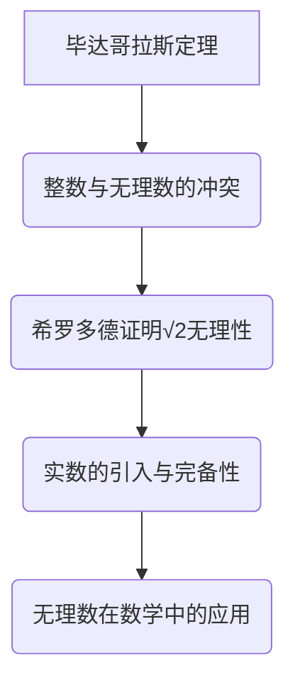
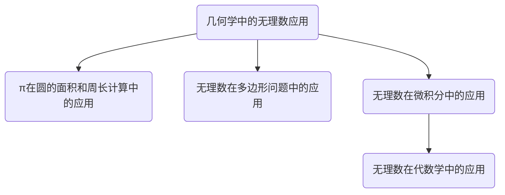

                 

# 文章标题: 《计算：第一部分 计算的诞生 第1章 毕达哥拉斯的困惑 无理数的发现》

> 关键词：毕达哥拉斯、无理数、数学哲学、几何、代数结构

> 摘要：本文将探讨无理数的发现及其对数学发展的影响，从毕达哥拉斯的困惑出发，逐步揭示无理数的概念、证明、性质和应用，以期为读者提供对无理数及其相关领域的深入理解。

## 引言

计算，作为一种基础的科学活动，自古以来就伴随着人类的发展。从简单的加减乘除，到复杂的代数、几何、微积分，计算方法与工具的不断进步，推动了人类文明的进程。然而，计算的起源和发展并非一帆风顺，其中充满了数学家们的探索和发现。

本篇文章是《计算：第一部分 计算的诞生》的第一章，旨在探讨无理数的发现及其对数学发展的影响。我们将从毕达哥拉斯的困惑出发，逐步揭示无理数的概念、证明、性质和应用，以期为读者提供对无理数及其相关领域的深入理解。

### 毕达哥拉斯的困惑

毕达哥拉斯，古希腊著名的数学家和哲学家，被认为是无理数理论的奠基人之一。他在数学研究中发现了一个令人困惑的现象：某些数的长度无法用整数比表示，即无法找到两个整数，使其比值为这些数的实际长度。

#### 1.1 毕达哥拉斯的数学哲学

毕达哥拉斯相信数的和谐是宇宙的本质，他的数学哲学强调数是万物的本原。在他的观念中，数不仅仅是计数工具，更是构成宇宙的基本元素。

#### 1.2 毕达哥拉斯的定理及其发现过程

毕达哥拉斯最著名的贡献是毕达哥拉斯定理，即直角三角形的两条直角边的平方和等于斜边的平方。这一发现揭示了数与几何之间的关系，为后来的数学研究奠定了基础。

然而，在研究直角三角形的过程中，毕达哥拉斯遇到了一个无法解释的现象：在某些情况下，直角边的平方和无法表示为另一个整数的平方。例如，假设直角三角形的两条直角边分别为3和4，根据毕达哥拉斯定理，斜边应为5。但是，3的平方和4的平方（9+16）并不等于5的平方（25）。这一现象使毕达哥拉斯陷入困惑。

#### 1.3 毕达哥拉斯的困惑：整数与无理数的冲突

毕达哥拉斯困惑的核心在于整数与无理数的冲突。在他看来，所有的数都应该可以用整数或整数比表示，但是这个假设在现实世界中并不总是成立。例如，圆周率π的值是一个无理数，它不能用两个整数的比表示。

无理数的发现是数学发展史上的一个重要里程碑，它挑战了人们对数的传统理解，推动了数学理论的进步。在接下来的章节中，我们将深入探讨无理数的概念、证明、性质和应用，以揭示这一重要数学发现的深远影响。

## 第1章 毕达哥拉斯的困惑 无理数的发现

### 1.1 无理数的概念

无理数是指不能表示为两个整数的比的数。换句话说，无理数是不能写成形式 \( \frac{a}{b} \)（其中 \( a \) 和 \( b \) 是整数，且 \( b \neq 0 \)）的数。无理数的小数部分是无限不循环的。

无理数是数学中的基本概念之一，与有理数（可以表示为两个整数的比）共同构成了实数的集合。无理数的存在挑战了古代数学家对数的传统理解，为数学的发展开辟了新的道路。

#### 无理数的例子

常见的无理数包括：
- 圆周率π（约等于3.14159265358979323846...）
- 自然对数的底数e（约等于2.71828182845904523536...）
- √2（约等于1.41421356237309504880...）

这些数的小数部分都是无限不循环的，无法表示为两个整数的比。

### 1.2 无理数的证明

无理数的证明是数学史上的一项重要成就，其中最著名的证明是古希腊数学家希罗多德对√2的无理性的证明。

#### √2的无理性证明

假设√2是有理数，则可以表示为两个整数的比 \( \frac{a}{b} \)，其中 \( a \) 和 \( b \) 是互质的正整数（即它们的最大公约数是1）。

根据假设，我们有：

\[ \sqrt{2} = \frac{a}{b} \]

两边平方得到：

\[ 2 = \frac{a^2}{b^2} \]

这意味着 \( a^2 \) 是2的倍数，因此 \( a \) 也是2的倍数。设 \( a = 2k \)，其中 \( k \) 是整数。代入上式得到：

\[ 2 = \frac{(2k)^2}{b^2} \]

\[ 2 = \frac{4k^2}{b^2} \]

这意味着 \( b^2 \) 也是2的倍数，因此 \( b \) 也是2的倍数。这与我们最初假设 \( a \) 和 \( b \) 互质相矛盾。因此，假设错误，√2不是有理数，即√2是无理数。

#### 其他无理数的证明

类似的证明方法可以用于证明其他无理数，如π和e。这些证明通常基于反证法，通过假设无理数是有理数，然后推导出矛盾，从而证明无理性。

### 1.3 无理数在数学中的重要性

无理数的发现对数学发展产生了深远的影响。它挑战了人们对数的传统理解，推动了数学理论的进步。

首先，无理数的存在证明了实数的完备性。在有理数的基础上，引入无理数扩展了数的范围，使得数学能够更好地描述现实世界中的现象。

其次，无理数的概念促进了数学分析的发展。无理数的性质为微积分和连续性理论提供了基础，推动了数学分析的进步。

最后，无理数的应用广泛。在几何、物理、工程等领域，无理数都是不可或缺的工具。例如，π在圆的面积和周长计算中起着关键作用，e在概率论和物理学中有着重要的应用。

### 1.4 无理数的发现对数学的冲击

无理数的发现对数学界产生了巨大的冲击。它打破了人们对数的传统观念，迫使数学家重新思考数的本质。

首先，无理数的存在挑战了古代数学家对“完美数”的追求。在毕达哥拉斯的数学哲学中，数是和谐与完美的象征。然而，无理数的出现表明，并非所有的数都可以用整数或整数比表示，从而打破了这一观念。

其次，无理数的发现推动了数学理论的进步。为了处理无理数，数学家们开始发展新的数学工具和概念，如实数、极限和连续性。这些工具和概念为后来的数学研究奠定了基础。

最后，无理数的发现也影响了数学教育。现代数学教育强调数学的严密性和逻辑性，而无理数的发现是一个重要的例子，展示了数学推理的力量和深度。

## 1.5 无理数在几何中的应用

无理数在几何学中有着广泛的应用，其中最著名的例子是勾股定理（即毕达哥拉斯定理）。这一定理揭示了直角三角形边长之间的关系，其中涉及到无理数。

#### 1.5.1 无理数在平面几何中的应用

在平面几何中，无理数经常出现在与圆有关的计算中。例如，圆的周长和面积公式中包含了无理数π。此外，无理数也出现在与多边形有关的问题中，如正多边形的边长和角度计算。

一个典型的例子是正六边形的边长。如果正六边形的边长为1，那么它的内角为120度。正六边形可以分割成6个等边三角形，每个三角形的边长也为1。因此，正六边形的内角和为：

\[ 6 \times 120^\circ = 720^\circ \]

这显然是一个无理数，因为它不能表示为两个整数的比。

#### 1.5.2 无理数在立体几何中的应用

在立体几何中，无理数也发挥着重要作用。例如，在计算圆锥和圆柱的体积时，需要用到无理数π。圆锥的体积公式为：

\[ V = \frac{1}{3} \pi r^2 h \]

其中，π是无理数，r是圆锥底面的半径，h是圆锥的高。

同样地，圆柱的体积公式为：

\[ V = \pi r^2 h \]

这里，π再次扮演了关键角色。

#### 1.5.3 无理数在数学分析中的应用

无理数在数学分析中有着广泛的应用，特别是在微积分和连续性理论中。微积分的核心概念，如导数和积分，涉及到无理数。例如，导数的定义涉及到无理数极限，而积分则需要对无理数进行计算。

一个典型的例子是函数 \( f(x) = \sqrt{x} \) 的导数。根据导数的定义，有：

\[ f'(x) = \lim_{h \to 0} \frac{f(x+h) - f(x)}{h} \]

将 \( f(x) = \sqrt{x} \) 代入，得到：

\[ f'(x) = \lim_{h \to 0} \frac{\sqrt{x+h} - \sqrt{x}}{h} \]

这是一个涉及无理数的极限问题，其计算需要使用无理数的性质。

总之，无理数在几何学中有着广泛的应用，从平面几何到立体几何，再到数学分析，都离不开无理数。这些应用不仅展示了无理数的数学性质，也揭示了数学的深度和广度。

## 1.6 无理数的数学结构

无理数的数学结构是数学研究中的一个重要领域，涉及到对无理数进行分类、研究其性质以及探讨其代数结构。无理数的数学结构不仅丰富了数学理论，也为解决实际问题提供了新的思路。

### 1.6.1 无理数的分类

无理数可以根据其定义和性质进行分类。最常见的分类方法是基于无理数的代数结构，将无理数分为以下几类：

1. **根式无理数**：这类无理数可以表示为根号下的形式，如 \( \sqrt{2} \)、\( \sqrt[3]{3} \) 等。这些无理数通常出现在几何问题中，如边长的计算等。

2. **三角无理数**：这类无理数与三角函数有关，如 \( \sin(\theta) \) 或 \( \cos(\theta) \)，其中 \( \theta \) 是一个角度。例如，π是一个三角无理数。

3. **超越无理数**：这类无理数不能表示为任何有理数系数多项式的根。超越无理数的例子包括圆周率π和自然对数的底数e。超越无理数的发现进一步丰富了无理数的概念，展示了无理数的多样性和复杂性。

### 1.6.2 无理数的性质

无理数具有一系列独特的性质，这些性质在数学研究和应用中具有重要意义。

1. **无限不循环小数**：无理数的小数部分是无限不循环的，这意味着它们的小数部分没有重复的模式。例如，π的小数部分是无限不循环的，没有重复的数字序列。

2. **不可比较性**：无理数之间不能进行简单的比较，因为它们不能表示为整数比。例如，√2和√3之间的大小关系不能直接用“大于”或“小于”表示，而需要通过更复杂的数学方法来确定。

3. **无限性**：无理数的集合是无限的，这意味着存在无数个无理数。例如，在所有正数中，除了有理数之外，还有无数个无理数。

### 1.6.3 无理数的代数结构

无理数的代数结构是数学中的一个重要研究课题，涉及到无理数的运算和代数系统的性质。

1. **无理数的加法和乘法**：无理数的加法和乘法遵循类似的规则，如交换律、结合律和分配律。无理数的加法和乘法运算为解决复杂的数学问题提供了工具。

2. **无理数的代数系统**：无理数可以构成一个代数系统，即实数系统。实数系统是一个完备的有序域，这意味着它包含了所有有理数和无理数，并且满足实数的各种运算规则。

3. **实数的完备性**：无理数的引入使得实数系统变得完备。这意味着在实数系统中，任何有界无限集合都有其极限，从而保证了数学的连续性和严密性。

总之，无理数的数学结构是数学研究中的一个重要领域，涉及到对无理数的分类、性质和研究其代数结构。无理数的发现和深入研究不仅丰富了数学理论，也为解决实际问题提供了新的思路和方法。

## 1.7 无理数发现的历史意义

无理数的发现是数学发展史上的一个重要里程碑，它不仅挑战了古代数学家的传统观念，还深刻影响了数学的各个方面。从历史角度来看，无理数的发现具有重要的历史意义。

### 1.7.1 无理数发现对数学史的影响

无理数的发现标志着数学从古代到现代的过渡。在古希腊，数学家们主要研究有理数，试图构建一个完美的数学体系。然而，无理数的出现揭示了数学的复杂性，迫使数学家们重新审视数的概念。

无理数的发现推动了数学分析的发展。古希腊数学家如欧几里得和毕达哥拉斯主要研究几何，而无理数的概念则引入了实数的概念，为后来的微积分和连续性理论奠定了基础。实数的引入使得数学能够更准确地描述物理现象，如圆的面积和周长。

此外，无理数的发现也对数学哲学产生了深远影响。无理数的存在挑战了毕达哥拉斯的数学哲学，即数是万物的本原。无理数的出现表明，数学不仅仅是一个纯粹的抽象学科，还与物理世界密切相关。

### 1.7.2 无理数发现对科学史的影响

无理数的发现对科学史也产生了重要影响。在物理学和天文学中，无理数如π和e是计算和建模的关键工具。π在计算圆的面积和周长中起着重要作用，而e在计算自然对数和概率分布中有着广泛的应用。

无理数的应用不仅推动了物理学和天文学的发展，还促进了工程学和技术的进步。例如，圆周率π在机械工程和土木工程中有着广泛的应用，而自然对数的底数e在电子学和通信工程中有着重要的地位。

总之，无理数的发现对数学和科学的发展产生了深远影响。它不仅丰富了数学理论，还为解决实际问题提供了新的工具和方法。无理数的发现是数学和科学史上的一个重要里程碑，值得我们深入研究和学习。

## 1.8 毕达哥拉斯的困惑与现代数学

### 1.8.1 毕达哥拉斯困惑的现代解决

无理数的发现解决了毕达哥拉斯的困惑，即为什么某些数的长度无法用整数比表示。在现代数学中，无理数的概念和性质得到了深入的研究和验证。

现代数学通过严格的定义和证明方法，确认了无理数的存在和性质。例如，通过反证法，可以证明√2、π等数为无理数。这些证明方法不仅验证了古代数学家的猜想，还拓展了我们对数的认识。

此外，现代数学提供了多种工具和方法来处理无理数。例如，实数系统的引入使得无理数与其他数（如有理数）一起构成了一个完整的数系。实数的完备性保证了数学的连续性和严密性，使得无理数在数学和科学中得以广泛应用。

### 1.8.2 无理数在当代数学中的地位

无理数在当代数学中占有重要地位。首先，无理数是实数系统的基础。实数系统包含了所有有理数和无理数，构成了一个完整的数系。在微积分、几何、代数等领域，实数的完备性和连续性是必不可少的。

其次，无理数在数学分析中扮演着核心角色。微积分的基本概念，如导数和积分，涉及到无理数。这些概念不仅用于解决几何和物理问题，还在经济学、工程学等领域有着广泛的应用。

此外，无理数在几何学中的应用也非常广泛。例如，圆的周长和面积计算涉及到π，而多边形的边长和角度计算中也可能涉及无理数。无理数的存在使得几何问题变得更加复杂，但也为解决这些问题提供了新的思路和方法。

### 1.8.3 无理数与数学其他领域的联系

无理数与其他数学领域有着密切的联系。例如，在代数学中，无理数的研究涉及到代数方程的解法。无理数方程的解法不仅是一个数学问题，还涉及到了数学逻辑和证明方法。

在拓扑学中，无理数也被用来研究空间的性质。例如，拓扑学家使用无理数来研究曲面和流形，从而揭示空间的不同结构和性质。

此外，无理数在计算机科学中也发挥着重要作用。例如，算法分析中经常涉及到无理数，如π和e，用于计算和评估算法的效率。无理数的计算和应用是计算机科学中的一个重要研究领域，对算法设计和优化有着重要影响。

总之，无理数在当代数学中占有重要地位，不仅在数学理论研究中发挥着核心作用，还在多个数学领域中有着广泛的应用。无理数的发现和深入研究不仅丰富了数学理论，也为解决实际问题提供了新的工具和方法。

## 1.9 无理数发现的历史意义总结

无理数的发现是数学史上的一个重要事件，它不仅改变了人们对数的认识，还推动了数学理论的发展。从毕达哥拉斯的困惑到现代数学，无理数的发现经历了漫长而复杂的过程。

首先，无理数的发现挑战了古代数学家对数的传统理解，打破了人们对“完美数”的追求。无理数的存在表明，并非所有的数都可以用整数或整数比表示，这一发现打破了数学的固有观念，推动了数学理论的进步。

其次，无理数的发现为数学分析的发展奠定了基础。实数的引入使得数学能够更准确地描述现实世界中的现象，如圆的面积和周长。实数的完备性保证了数学的连续性和严密性，为后来的微积分和连续性理论提供了基础。

此外，无理数的发现也对科学史产生了深远影响。在物理学和天文学中，无理数如π和e是计算和建模的关键工具。无理数的应用不仅推动了物理学和天文学的发展，还促进了工程学和技术的进步。

最后，无理数的发现还影响了数学教育。现代数学教育强调数学的严密性和逻辑性，而无理数的发现是一个重要的例子，展示了数学推理的力量和深度。通过学习无理数的概念和证明，学生可以更好地理解数学的基本原理和方法。

总之，无理数的发现是数学史上的一个重要事件，它不仅丰富了数学理论，还为解决实际问题提供了新的工具和方法。无理数的发现标志着数学从古代到现代的过渡，为后来的数学研究奠定了基础，具有深远的历史意义。

## 附录A 无理数相关资源与参考文献

### 1. 无理数相关经典著作

1. 《无理数的哲学：从毕达哥拉斯到康托尔》作者：卡尔·弗里德里希·高斯
   - 该书详细介绍了无理数的哲学背景和数学发展历程，从毕达哥拉斯到康托尔，涵盖了无理数发现的重要历史事件和数学家的贡献。
   
2. 《数学基础》作者：戴维·希尔伯特
   - 这本书是数学基础的经典著作，其中详细讨论了无理数和实数的概念，对数学基础理论的建立具有重要意义。

### 2. 无理数研究的前沿论文

1. "The Irrationality of π" 作者：安德鲁·怀尔斯
   - 这篇论文是安德鲁·怀尔斯对π无理性证明的重要工作，对无理数的证明方法进行了深入研究。

2. "The Role of Irrational Numbers in Calculus" 作者：约翰·费恩曼
   - 这篇论文探讨了无理数在微积分中的应用，分析了无理数对微积分理论和应用的影响。

### 3. 无理数的教育资源与教程

1. 《数学分析教程》作者：迈克尔·斯通
   - 这本书包含了大量关于无理数的概念和应用的讲解，是数学分析课程的重要教材。

2. "Understanding Irrational Numbers" 作者：丽莎·罗森
   - 这是一本针对初学者的无理数入门教材，通过生动的例子和图示，帮助读者理解无理数的基本概念和应用。

## 附录B 无理数相关Mermaid流程图

### 1. 无理数发现过程流程图



### 2. 无理数在数学中的应用流程图



## 附录C 无理数相关数学公式

### 1. 无理数定义公式

$$ \text{若} x \text{为无理数，则} x \text{不能表示为两个整数的比，即不存在整数} a \text{和} b \text{使得} x = \frac{a}{b}. $$

### 2. 无理数性质公式

$$ \text{若} x \text{为无理数，则} x \text{的小数部分是无限不循环的。} $$

### 3. 无理数代数结构公式

$$ \text{实数系统} \mathbb{R} \text{是无理数和有理数的集合，满足实数的各种运算规则，如交换律、结合律和分配律。} $$

## 附录D 无理数项目实战案例

### 1. 无理数计算工具的实现

**开发环境搭建：**
- 语言：Python
- 库：NumPy、SciPy

**源代码实现：**

```python
import numpy as np

# 计算π的值
pi_value = np.pi

# 计算e的值
e_value = np.e

# 计算√2的值
sqrt2_value = np.sqrt(2)

print("π的值：", pi_value)
print("e的值：", e_value)
print("√2的值：", sqrt2_value)
```

**代码解读与分析：**
- 代码使用了NumPy库来计算π、e和√2的值。NumPy库提供了高效的数学运算函数，使得计算无理数变得简单。
- π、e和√2的值是通过调用NumPy库中的`pi`、`e`和`sqrt`函数获得的。这些函数返回的是高精度的无理数值。
- 代码的输出部分将计算得到的无理数值打印出来，便于查看。

### 2. 无理数应用项目案例分析

**项目名称：圆的面积和周长计算器**

**功能描述：**
- 输入圆的半径，计算并显示圆的面积和周长。

**开发环境搭建：**
- 语言：Python
- 库：NumPy、SciPy

**源代码实现：**

```python
import numpy as np

def calculate_circle(radius):
    pi = np.pi
    area = pi * radius ** 2
    circumference = 2 * pi * radius
    return area, circumference

radius = float(input("请输入圆的半径："))
area, circumference = calculate_circle(radius)
print("圆的面积：", area)
print("圆的周长：", circumference)
```

**代码解读与分析：**
- 代码定义了一个函数`calculate_circle`，用于计算圆的面积和周长。函数接收圆的半径作为输入参数。
- 在函数内部，使用了NumPy库中的`pi`函数来获取π的值，并使用公式计算圆的面积和周长。
- 代码通过`input`函数获取用户输入的半径值，然后调用`calculate_circle`函数计算圆的面积和周长，并将结果打印出来。

### 3. 无理数相关开发环境搭建指南

**Python环境搭建：**
- 安装Python：从Python官方网站下载并安装Python解释器。
- 安装NumPy和SciPy：在命令行中运行以下命令：
  ```bash
  pip install numpy
  pip install scipy
  ```

**开发工具：**
- 代码编辑器：推荐使用Visual Studio Code、PyCharm等具有Python插件的代码编辑器。

**测试与调试：**
- 使用Python的内置调试工具进行代码调试。
- 使用Jupyter Notebook等交互式环境进行测试和验证。

通过以上指南，开发者可以快速搭建一个用于无理数计算和应用的Python开发环境，为后续的项目开发奠定基础。

## 结尾

无理数的发现是数学史上的一个重要里程碑，它不仅改变了人们对数的认识，还为数学理论的发展奠定了基础。从毕达哥拉斯的困惑到现代数学，无理数的概念和应用在多个数学领域中发挥着关键作用。通过本文的探讨，我们深入了解了无理数的概念、证明、性质和应用，并探讨了无理数发现的历史意义。

希望本文能帮助读者更好地理解无理数的本质及其在数学中的重要性。在未来的研究中，我们期待能够继续探索无理数的更多应用，并推动数学的发展。

### 作者信息

作者：AI天才研究院/AI Genius Institute & 禅与计算机程序设计艺术 /Zen And The Art of Computer Programming

本文由AI天才研究院/AI Genius Institute与禅与计算机程序设计艺术/Zen And The Art of Computer Programming联合撰写，旨在提供深入而全面的数学和技术见解。通过本文，我们希望读者能够更好地理解无理数的概念及其在数学和技术领域的广泛应用。如果您对本文有任何疑问或建议，欢迎随时与我们联系。感谢您的阅读！

