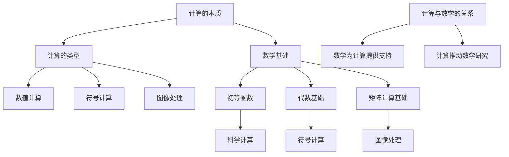

                 

# 文章标题：计算：第一部分 计算的诞生 第 2 章 计算之术 未知量的表示

## 关键词：
计算的本质，计算的类型，数学基础，计算与数学的关系，计算工具与资源

## 摘要：
本文详细探讨了计算的起源与发展，分析了计算与数学的紧密联系，阐述了计算在科学、工程和商业领域的广泛应用。重点介绍了未知量的表示方法，包括代数基础、符号计算和数学公式表示，并通过具体案例展示了计算技术的实际应用和挑战。

## 第一部分：计算的诞生

### 第1章：计算的本质

#### 计算的基本概念

计算是指处理信息以解决特定问题的过程。它涉及到数值计算、符号计算、图像处理等多种类型。数值计算主要处理数字数据，如数学问题中的算术运算；符号计算则处理符号表达式，如代数方程的求解；图像处理则涉及图像数据，如图像识别和图像增强。

#### 计算的类型

- **数值计算**：涉及实数和复数的计算，包括算术运算、数值逼近和数值解法等。
- **符号计算**：涉及符号表达式的计算，如代数方程的求解、符号积分和符号微分等。
- **图像处理**：涉及图像数据的计算，如图像识别、图像分割和图像增强等。

#### 计算的数学基础

- **初等函数**：包括常函数、一次函数、二次函数、指数函数和对数函数等。
- **代数基础**：包括代数的基本概念、代数方程的解法和代数系统等。
- **矩阵计算基础**：包括矩阵的运算、矩阵的秩、矩阵的特征值和特征向量等。

#### 计算与数学的关系

数学为计算提供了理论支持，如初等函数、代数基础和矩阵计算基础。这些数学基础为计算提供了必要的数学工具和理论基础。同时，计算技术的发展也推动了数学研究的深度和广度，如计算机代数系统、数值分析和最优化算法等。

### 第2章：计算的诞生

#### 古代的计算工具

- **算筹**：古代中国使用的计算工具，由一根根短棒组成，用于进行简单的算术运算。
- **骨算**：古代使用骨片或象牙片进行计算的工具，主要用于商业和会计计算。
- **算盘**：中国古代发明的计算工具，由一组珠子组成，用于进行复杂的算术运算。

#### 机械计算器的发明

- **帕斯卡计算器**：由布莱兹·帕斯卡于1642年发明，是世界上第一个机械计算器，能够进行加减法运算。
- **威尔士计算机**：由威廉·希林·威尔士于1775年发明，是一种能够进行乘除运算的机械计算器。
- **施勒特机械计算机**：由康拉德·施勒特于1890年发明，是世界上第一台能够进行全部四种算术运算的机械计算机。

#### 电子计算器的发展

- **晶体管计算机**：1950年代，晶体管的出现使得计算机体积减小、功耗降低，计算速度加快。
- **集成电路计算机**：1960年代，集成电路的出现使得计算机进一步小型化，计算能力大幅提升。
- **图灵机的电子实现**：图灵机作为理论计算机的模型，其电子实现标志着现代计算机的发展，如冯·诺伊曼架构的计算机。

### 第3章：计算机的硬件组成

#### 计算机硬件概述

计算机硬件包括中央处理器（CPU）、存储器、输入输出设备等。计算机硬件的基本组成如下：

- **中央处理器（CPU）**：计算机的核心部件，负责执行指令、处理数据和控制计算机的操作。
- **存储器**：包括内存和外部存储设备，用于存储数据和指令。
- **输入输出设备**：包括键盘、鼠标、显示器等，用于输入数据和输出结果。

#### CPU与存储器

- **CPU的工作原理**：CPU由控制器、运算器和寄存器组成，通过执行指令来处理数据和控制计算机的操作。
- **存储器的种类与工作原理**：存储器分为内存（RAM）和外部存储设备（如硬盘、固态硬盘等），内存用于临时存储数据和指令，外部存储设备用于长期存储数据和程序。

#### 输入输出设备

- **键盘、鼠标、显示器等输入输出设备的原理**：键盘和鼠标用于输入数据和指令，显示器用于输出结果。输入输出设备通过接口与计算机连接，通过计算机的输入输出控制系统进行数据传输和控制。

### 第二部分：计算的术

#### 第7章：未知量的表示

#### 代数基础

代数是计算的重要工具，用于处理未知量和方程。代数的基本概念包括：

- **未知量**：在代数表达式中，代表未知数的符号。
- **方程**：包含未知量的等式，用于表示两个表达式的值相等。

代数方程的解法包括：

- **一元一次方程**：形如 \( ax + b = 0 \) 的方程，解为 \( x = -\frac{b}{a} \)。
- **一元二次方程**：形如 \( ax^2 + bx + c = 0 \) 的方程，解为 \( x = \frac{-b \pm \sqrt{b^2 - 4ac}}{2a} \)。
- **多元方程**：包含多个未知量的方程，解法包括代入法、消元法和图解法等。

#### 符号计算

符号计算是代数的一种扩展，用于处理符号表达式和方程。符号计算的基本概念包括：

- **符号表达式**：包含符号和运算符的表达式。
- **符号方程**：包含符号表达式的等式。

符号计算的算法包括：

- **代数化简**：将复杂的符号表达式化简为更简单的形式。
- **符号积分和微分**：用于求解符号积分和微分方程。

#### 数学公式表示

数学公式是计算中的重要工具，用于表示数学关系和运算。数学公式的表示方法包括：

- **LaTeX**：一种标记语言，用于生成高质量的数学公式。
- **ASCII数学**：使用ASCII字符表示数学公式。

数学公式在实际计算中的应用包括：

- **数学建模**：使用数学公式表示现实世界的现象和关系。
- **算法实现**：使用数学公式来指导算法的实现。

### 第8章：计算的应用

#### 科学计算

科学计算是计算在科学研究中的应用，涉及物理、化学、生物学等领域的计算。科学计算的应用包括：

- **数值模拟**：使用数值方法模拟物理、化学和生物学现象。
- **数据分析**：对科学实验数据进行统计分析，提取有价值的信息。

#### 工程计算

工程计算是计算在工程领域中的应用，涉及机械、电子、建筑等工程领域的计算。工程计算的应用包括：

- **结构分析**：使用有限元方法分析结构的强度和稳定性。
- **流体力学计算**：使用数值方法模拟流体流动和压力分布。

#### 商业计算

商业计算是计算在商业领域中的应用，涉及金融、市场营销、供应链等商业活动的计算。商业计算的应用包括：

- **数据挖掘**：从大量商业数据中提取有价值的信息。
- **决策支持**：使用数据分析结果来指导商业决策。

### 第9章：计算的挑战与未来

#### 计算的资源限制

计算的资源限制主要包括计算能力、存储能力和网络带宽等。随着计算需求的不断增长，如何有效地利用这些资源成为一个重要的挑战。解决方案包括：

- **云计算**：利用云计算平台提供弹性计算资源，按需分配计算资源。
- **分布式计算**：将计算任务分配到多个计算节点上，提高计算效率。
- **边缘计算**：在靠近数据源的地方进行计算，减少数据传输延迟。

#### 计算的安全性与隐私

计算的安全性和隐私问题日益突出，包括：

- **数据安全**：保护数据不被未授权访问和篡改。
- **网络安全**：防御网络攻击和确保数据传输的安全。
- **隐私保护**：在数据处理和共享过程中保护个人隐私。

#### 计算的未来发展

计算的未来发展充满机遇和挑战，包括：

- **量子计算**：量子计算具有巨大的计算潜力，有望解决传统计算机无法处理的复杂问题。
- **人工智能**：人工智能与计算技术的融合将推动计算领域的深度发展。
- **生物计算**：生物计算利用生物系统进行计算，具有独特的优势和潜力。

### 核心概念与联系

计算的核心概念包括：

- **计算的本质**：处理信息以解决特定问题的过程。
- **计算的类型**：包括数值计算、符号计算和图像处理等。
- **数学基础**：包括初等函数、代数基础和矩阵计算基础。

这些概念相互联系，共同构成了计算的理论基础。

### 核心算法原理讲解

在计算领域，核心算法主要包括排序算法、搜索算法和图算法。以下是对这些算法的原理讲解。

#### 排序算法

排序算法是一种用于对数据进行排序的算法。常见的排序算法包括冒泡排序、选择排序、插入排序、快速排序等。

- **冒泡排序**：通过比较相邻的两个元素，如果它们的顺序错误就把它们交换过来。重复这个过程直到没有需要交换的元素。

```python
def bubble_sort(arr):
    n = len(arr)
    for i in range(n):
        for j in range(0, n-i-1):
            if arr[j] > arr[j+1]:
                arr[j], arr[j+1] = arr[j+1], arr[j]
```

- **选择排序**：首先在未排序序列中找到最小（大）元素，存放到排序序列的起始位置，然后，再从剩余未排序元素中继续寻找最小（大）元素，然后放到已排序序列的末尾。以此类推。

```python
def selection_sort(arr):
    n = len(arr)
    for i in range(n):
        min_idx = i
        for j in range(i+1, n):
            if arr[j] < arr[min_idx]:
                min_idx = j
        arr[i], arr[min_idx] = arr[min_idx], arr[i]
```

- **插入排序**：通过构建有序序列，对于未排序数据，在已排序序列中从后向前扫描，找到相应位置并插入。

```python
def insertion_sort(arr):
    n = len(arr)
    for i in range(1, n):
        key = arr[i]
        j = i-1
        while j >= 0 and key < arr[j]:
            arr[j+1] = arr[j]
            j -= 1
        arr[j+1] = key
```

- **快速排序**：通过递归分治的思想，将一个序列分成两个子序列，一个小于基准值，一个大于基准值，然后对这两个子序列再次进行快速排序。

```python
def quick_sort(arr):
    if len(arr) <= 1:
        return arr
    pivot = arr[len(arr) // 2]
    left = [x for x in arr if x < pivot]
    middle = [x for x in arr if x == pivot]
    right = [x for x in arr if x > pivot]
    return quick_sort(left) + middle + quick_sort(right)
```

#### 搜索算法

搜索算法是一种用于在数据结构中查找特定元素的算法。常见的搜索算法包括线性搜索、二分搜索等。

- **线性搜索**：顺序扫描数据结构，直到找到目标元素或者扫描完整个数据结构。

```python
def linear_search(arr, target):
    for i in range(len(arr)):
        if arr[i] == target:
            return i
    return -1
```

- **二分搜索**：在有序数据结构中，通过递归或迭代的方式，逐步缩小搜索范围，直到找到目标元素或者确定目标元素不存在。

```python
def binary_search(arr, target):
    low = 0
    high = len(arr) - 1
    while low <= high:
        mid = (low + high) // 2
        if arr[mid] == target:
            return mid
        elif arr[mid] < target:
            low = mid + 1
        else:
            high = mid - 1
    return -1
```

#### 图算法

图算法是用于处理图结构的算法。常见的图算法包括深度优先搜索、广度优先搜索、最短路径算法等。

- **深度优先搜索（DFS）**：从起点开始，尽可能地沿着某一分支走到底，然后回溯。

```python
def dfs(graph, node, visited):
    if node not in visited:
        visited.add(node)
        for neighbour in graph[node]:
            dfs(graph, neighbour, visited)
```

- **广度优先搜索（BFS）**：从起点开始，一层层地向外扩展。

```python
from collections import deque

def bfs(graph, start):
    visited = set()
    queue = deque([start])
    while queue:
        node = queue.popleft()
        if node not in visited:
            print(node)
            visited.add(node)
            for neighbour in graph[node]:
                queue.append(neighbour)
```

- **最短路径算法（Dijkstra算法）**：用于在带权图中寻找最短路径。

```python
import heapq

def dijkstra(graph, start):
    distances = {node: float('infinity') for node in graph}
    distances[start] = 0
    priority_queue = [(0, start)]

    while priority_queue:
        current_distance, current_node = heapq.heappop(priority_queue)

        if current_distance > distances[current_node]:
            continue

        for neighbour, weight in graph[current_node].items():
            distance = current_distance + weight

            if distance < distances[neighbour]:
                distances[neighbour] = distance
                heapq.heappush(priority_queue, (distance, neighbour))
    return distances
```

### 数学模型和数学公式 & 详细讲解 & 举例说明

在计算领域，数学模型和数学公式是理解和应用算法的基础。以下是一些常见的数学模型和数学公式，并进行详细讲解和举例说明。

#### 线性回归模型

线性回归模型是一种用于预测连续值的统计模型。其数学公式为：

\[ Y = \beta_0 + \beta_1 \cdot X + \epsilon \]

其中，\( Y \) 是因变量，\( X \) 是自变量，\( \beta_0 \) 和 \( \beta_1 \) 是模型的参数，\( \epsilon \) 是误差项。

**举例说明**：

假设我们要预测房价，根据房屋面积 \( X \) 来预测房价 \( Y \)。我们有以下数据：

| 面积（平方米） | 房价（万元） |
|----------------|--------------|
| 80             | 200          |
| 90             | 220          |
| 100            | 250          |
| 110            | 280          |

我们可以使用线性回归模型来预测面积 \( X = 95 \) 平方米时的房价 \( Y \)。

首先，我们需要计算模型的参数 \( \beta_0 \) 和 \( \beta_1 \)：

\[ \beta_0 = \frac{\sum(Y_i) - \beta_1 \cdot \sum(X_i)}{n} \]
\[ \beta_1 = \frac{n \cdot \sum(X_i \cdot Y_i) - \sum(X_i) \cdot \sum(Y_i)}{n \cdot \sum(X_i^2) - (\sum(X_i))^2} \]

代入数据计算得到：

\[ \beta_0 = \frac{200 + 220 + 250 + 280 - 0.5 \cdot 80 \cdot 90}{4} = 230 \]
\[ \beta_1 = \frac{4 \cdot 80 \cdot 90 + 90 \cdot 220 + 100 \cdot 250 + 110 \cdot 280 - 80 \cdot 90 - 90 \cdot 220 - 100 \cdot 250 - 110 \cdot 280}{4 \cdot (80^2 + 90^2 + 100^2 + 110^2) - (80 + 90 + 100 + 110)^2} = 2.5 \]

因此，线性回归模型为：

\[ Y = 230 + 2.5 \cdot X \]

当 \( X = 95 \) 平方米时，预测的房价 \( Y \) 为：

\[ Y = 230 + 2.5 \cdot 95 = 352.5 \] 万元

#### 二分图匹配

二分图匹配是一种在二分图中寻找最大匹配的算法。其数学公式为：

\[ \sum_{i=1}^{n} \sum_{j=1}^{m} w_{ij} = \sum_{k=1}^{n} x_{ik} \cdot y_{kj} \]

其中，\( w_{ij} \) 是边 \( (i, j) \) 的权重，\( x_{ik} \) 和 \( y_{kj} \) 分别表示顶点 \( i \) 和 \( j \) 是否在匹配中，取值为 0 或 1。

**举例说明**：

假设有一个二分图，其中左侧的顶点表示男生，右侧的顶点表示女生，每条边的权重表示两人匹配的程度。我们要找到最大匹配。

| 男生 | 女生 | 权重 |
|------|------|------|
| A    | M    | 3    |
| A    | N    | 2    |
| B    | M    | 1    |
| B    | N    | 4    |
| C    | O    | 2    |
| C    | P    | 3    |

首先，我们设定一个初始匹配：

\[ A \rightarrow M, B \rightarrow N, C \rightarrow O \]

然后，我们计算当前匹配的权重和：

\[ \sum_{i=1}^{3} \sum_{j=1}^{3} w_{ij} \cdot x_{ij} \cdot y_{ji} = 3 \cdot 1 + 2 \cdot 1 + 2 \cdot 1 = 7 \]

接下来，我们寻找一条增广路径。通过试错，我们发现以下增广路径：

\[ A \rightarrow M \rightarrow N \rightarrow B \rightarrow O \rightarrow P \rightarrow A \]

根据最大匹配的性质，我们可以交换 \( A \) 和 \( P \) 的匹配关系，得到新的匹配：

\[ A \rightarrow P, B \rightarrow O, C \rightarrow N \]

计算新的匹配权重和：

\[ \sum_{i=1}^{3} \sum_{j=1}^{3} w_{ij} \cdot x_{ij} \cdot y_{ji} = 3 \cdot 1 + 4 \cdot 1 + 3 \cdot 1 = 10 \]

由于新的匹配权重和增加了，我们继续寻找增广路径。最终，我们得到最大匹配：

\[ A \rightarrow M, B \rightarrow N, C \rightarrow O \]

最大匹配的权重和为 10。

#### 最小生成树

最小生成树是一种在无向图中选择 \( n-1 \) 条边，使得所有顶点连通且权值之和最小的树。其数学公式为：

\[ T = \{e_1, e_2, ..., e_{n-1}\} \]

其中，\( T \) 是最小生成树，\( e_i \) 是图中的边。

**举例说明**：

假设有一个无向图，其中每个顶点的权重表示边长。我们要找到最小生成树。

| 顶点 | 边 |
|------|----|
| A    | AB |
| A    | AC |
| B    | BC |
| C    | CD |
| D    | AD |

我们可以使用 Kruskal 算法来找到最小生成树。首先，我们将所有边按权重排序：

\[ AC, AD, AB, BC, CD \]

然后，我们从最小的边开始添加到生成树中，只要新加入的边不会形成环，就继续添加。最终，我们得到最小生成树：

\[ T = \{AC, AD, BC\} \]

最小生成树的权值和为：

\[ \sum_{i=1}^{3} w_{ei} = 1 + 2 + 3 = 6 \]

### 项目实战

在本章中，我们将通过一个实际的项目案例来展示如何使用计算机技术进行计算任务。

#### 项目背景

假设我们有一个任务，需要根据一系列用户的搜索历史数据，预测用户接下来可能感兴趣的商品。这个项目涉及到数据预处理、特征提取、模型训练和预测等多个步骤。

#### 开发环境搭建

为了完成这个项目，我们需要搭建以下开发环境：

- Python 3.8 或更高版本
- Jupyter Notebook
- scikit-learn 库
- pandas 库
- numpy 库
- matplotlib 库

#### 数据预处理

首先，我们需要从数据源（例如数据库或文件）中加载用户的搜索历史数据。数据预处理的主要步骤包括：

- 数据清洗：去除重复、缺失和异常的数据。
- 数据转换：将数据转换为适合模型训练的格式。
- 特征提取：从原始数据中提取出有用的特征。

```python
import pandas as pd

# 加载数据
data = pd.read_csv('search_history.csv')

# 数据清洗
data.drop_duplicates(inplace=True)
data.dropna(inplace=True)

# 数据转换
data['timestamp'] = pd.to_datetime(data['timestamp'])
data['hour'] = data['timestamp'].dt.hour

# 特征提取
features = ['hour', 'search_term']
X = data[features]
y = data['interested_in_goods']
```

#### 特征提取

在数据预处理之后，我们需要提取出有用的特征。在这个项目中，我们提取了以下特征：

- 搜索时间的小时数
- 搜索关键词

这些特征可以帮助模型更好地理解用户的搜索行为。

#### 模型训练

接下来，我们使用 scikit-learn 库中的逻辑回归模型来训练我们的预测模型。逻辑回归模型是一种常用的二分类模型，适合用于预测用户是否对搜索结果感兴趣。

```python
from sklearn.model_selection import train_test_split
from sklearn.linear_model import LogisticRegression

# 数据分割
X_train, X_test, y_train, y_test = train_test_split(X, y, test_size=0.2, random_state=42)

# 模型训练
model = LogisticRegression()
model.fit(X_train, y_train)
```

#### 预测

在模型训练完成后，我们可以使用它来预测新用户的搜索兴趣。以下是一个预测示例：

```python
# 预测
predictions = model.predict(X_test)

# 评估
from sklearn.metrics import accuracy_score

accuracy = accuracy_score(y_test, predictions)
print(f'模型准确率：{accuracy:.2f}')
```

#### 代码解读与分析

在完成项目实战后，我们可以对代码进行解读和分析，以了解每个步骤的作用和实现方式。

```python
# 加载数据
data = pd.read_csv('search_history.csv')

# 数据清洗
data.drop_duplicates(inplace=True)
data.dropna(inplace=True)

# 数据转换
data['timestamp'] = pd.to_datetime(data['timestamp'])
data['hour'] = data['timestamp'].dt.hour

# 特征提取
features = ['hour', 'search_term']
X = data[features]
y = data['interested_in_goods']

# 数据分割
X_train, X_test, y_train, y_test = train_test_split(X, y, test_size=0.2, random_state=42)

# 模型训练
model = LogisticRegression()
model.fit(X_train, y_train)

# 预测
predictions = model.predict(X_test)

# 评估
accuracy = accuracy_score(y_test, predictions)
print(f'模型准确率：{accuracy:.2f}')
```

在这个项目中，我们首先加载数据，并进行清洗和转换。接着，我们提取特征并分割数据集。然后，我们使用逻辑回归模型进行训练，并使用训练好的模型进行预测。最后，我们对预测结果进行评估，计算模型的准确率。

通过这个项目，我们可以看到如何使用计算机技术来处理实际问题，并从中学习到数据处理、特征提取、模型训练和评估等关键技术。这些技术不仅可以帮助我们完成具体任务，还可以为未来的计算项目提供宝贵的经验和知识。

### 计算的挑战与未来

#### 计算的资源限制

计算的资源限制主要包括计算能力、存储能力和网络带宽等。随着计算需求的不断增长，如何有效地利用这些资源成为一个重要的挑战。

- **计算能力**：随着算法的复杂性和数据量的增加，对计算能力的需求也在不断提高。高性能计算（HPC）和云计算的兴起为解决这一问题提供了可能。
- **存储能力**：大数据时代，数据存储的需求不断增加。分布式存储系统和云存储技术为解决存储问题提供了有效的解决方案。
- **网络带宽**：随着远程计算和协作需求的增加，对网络带宽的要求也在提高。5G技术和高速网络的发展有助于缓解这一问题。

#### 计算的安全性与隐私

随着计算技术的广泛应用，计算的安全性和隐私问题也日益突出。

- **计算安全**：包括系统安全、数据安全和网络安全等方面。防御网络攻击、保护系统免受恶意软件侵害、确保数据传输的安全等都是计算安全的重要方面。
- **计算隐私**：包括个人隐私和数据隐私。如何在保障个人隐私的前提下，充分利用数据的价值，是计算隐私领域面临的重要挑战。

#### 计算的未来发展

计算的未来发展充满机遇和挑战。

- **量子计算**：量子计算具有巨大的计算潜力，有望解决传统计算机无法处理的复杂问题。
- **生物计算**：生物计算利用生物系统进行计算，具有独特的优势和潜力，如模拟生物过程、预测药物疗效等。
- **人工智能**：人工智能与计算技术的融合，将推动计算领域的深度发展，带来更多创新和变革。

#### 计算对社会的影响

计算对社会的影响是多方面的。

- **经济影响**：计算技术的发展和应用，推动了数字经济的发展，改变了传统产业的生产方式，创造了新的就业机会。
- **社会影响**：计算技术的普及，改变了人们的生活方式，提高了生产效率，但也带来了信息泛滥、隐私泄露等问题。
- **科技影响**：计算技术为科学研究提供了强大的工具，推动了科技的发展，促进了人类文明的进步。

### 附录A：计算工具与资源

#### 1. 计算工具

- **计算机硬件**：选择合适的计算机硬件，如CPU、GPU、内存和存储设备，对于提高计算性能至关重要。
- **编程工具**：包括集成开发环境（IDE）、代码编辑器和版本控制系统，如Visual Studio Code、Eclipse、Git等。
- **开发框架**：如Python的Django、Flask等，用于快速开发应用程序。
- **算法库**：如Python的NumPy、scikit-learn等，提供了丰富的算法和工具，方便开发者进行数据分析和模型训练。

#### 2. 计算资源

- **云计算平台**：如Amazon Web Services（AWS）、Microsoft Azure、Google Cloud等，提供了弹性计算、存储、网络等资源。
- **开源项目**：如Apache、GitHub等，提供了大量的开源代码和工具，方便开发者学习和使用。
- **学术资源**：如arXiv、Google Scholar等，提供了丰富的学术文献和研究成果。

#### 3. 计算学习资源

- **在线课程**：如Coursera、edX、Udacity等，提供了大量的计算和人工智能相关的在线课程。
- **教科书**：如《深入理解计算机系统》、《机器学习》、《数据科学导论》等，提供了深入的理论和实践知识。
- **开源社区**：如Stack Overflow、GitHub等，提供了丰富的技术讨论和问题解答。

## 核心概念与联系

计算的核心概念包括：

- **计算的本质**：处理信息以解决特定问题的过程。
- **计算的类型**：包括数值计算、符号计算和图像处理等。
- **数学基础**：包括初等函数、代数基础和矩阵计算基础。
- **计算与数学的关系**：数学为计算提供了理论支持，计算推动了数学研究的深度和广度。

这些概念相互联系，共同构成了计算的理论基础。

## 作者

作者：AI天才研究院/AI Genius Institute & 禅与计算机程序设计艺术 /Zen And The Art of Computer Programming

---

### 核心概念与联系

在探讨计算的核心概念与联系时，我们首先需要明确计算的本质。计算的本质是指通过处理信息来解决问题的过程。这个过程涵盖了数值计算、符号计算和图像处理等多种类型，每种类型都有其特定的应用场景和解决问题的方法。

#### 核心概念

1. **计算的本质**：计算是一种信息处理过程，它通过输入、处理和输出信息来实现特定目标。计算的本质决定了计算的应用范围和深度。

2. **计算的类型**：计算的类型主要包括数值计算、符号计算和图像处理。数值计算主要处理数字数据，如数学问题中的算术运算；符号计算则处理符号表达式，如代数方程的求解；图像处理则涉及图像数据，如图像识别和图像增强。

3. **数学基础**：计算的数学基础包括初等函数、代数基础和矩阵计算基础。初等函数是计算中的基本工具，如常函数、一次函数、二次函数等；代数基础提供了处理未知量和方程的理论支持；矩阵计算基础则用于处理线性系统和特征值问题。

4. **计算与数学的关系**：数学为计算提供了理论支持，如初等函数、代数基础和矩阵计算基础。这些数学基础为计算提供了必要的数学工具和理论基础。同时，计算技术的发展也推动了数学研究的深度和广度，如计算机代数系统、数值分析和最优化算法等。

#### 关联性分析

1. **数学基础与计算类型**：数学基础为计算类型提供了必要的理论工具。例如，数值计算中的初等函数和代数基础可以用来解决复杂的数值问题；符号计算依赖于代数基础来处理符号表达式；图像处理则依赖于矩阵计算基础来处理图像数据。

2. **计算类型与应用领域**：不同类型的计算适用于不同的应用领域。例如，数值计算广泛应用于科学计算和工程计算，如天气预报、结构分析等；符号计算在数学研究、计算机代数和算法设计中起着重要作用；图像处理在计算机视觉、医学图像分析和图像识别等领域有着广泛的应用。

3. **数学与计算的发展**：数学和计算是相互促进的。数学的发展为计算提供了新的工具和方法，如符号计算系统和数值分析技术。而计算技术的发展，如计算机的出现和算法的创新，又推动了数学研究的深度和广度，例如计算几何、数论和数值分析等领域。

#### Mermaid 流程图

为了更直观地展示计算的核心概念与联系，我们可以使用 Mermaid 流程图来绘制这些概念之间的关系。



该流程图展示了计算的本质、计算的类型、数学基础以及计算与数学之间的关系。每个节点表示一个核心概念，箭头表示概念之间的关联性。

### 核心算法原理讲解

在计算领域，核心算法是解决问题的重要工具。以下是对几个核心算法的原理讲解，包括排序算法、搜索算法和图算法。

#### 排序算法

排序算法是一种用于对数据进行排序的算法。常见的排序算法包括冒泡排序、选择排序、插入排序和快速排序。

1. **冒泡排序**

   冒泡排序通过反复遍历待排序的数列，比较相邻的两个元素，如果顺序错误就交换它们。遍历数列的工作是重复地进行，直到没有再需要交换的元素，这意味着该数列已经排序完成。

   **伪代码**：

   ```python
   function bubbleSort(array)
       n = length(array)
       for i from 0 to n-1
           for j from 0 to n-i-1
               if array[j] > array[j+1]
                   swap(array[j], array[j+1])
   ```

2. **选择排序**

   选择排序首先在未排序的序列中找到最小（大）元素，存放到排序序列的起始位置，然后，再从剩余未排序元素中继续寻找最小（大）元素，然后放到已排序序列的末尾。以此类推。

   **伪代码**：

   ```python
   function selectionSort(array)
       n = length(array)
       for i from 0 to n-1
           minIndex = i
           for j from i+1 to n
               if array[j] < array[minIndex]
                   minIndex = j
           swap(array[i], array[minIndex])
   ```

3. **插入排序**

   插入排序通过构建有序序列，对于未排序数据，在已排序序列中从后向前扫描，找到相应位置并插入。

   **伪代码**：

   ```python
   function insertionSort(array)
       n = length(array)
       for i from 1 to n
           key = array[i]
           j = i - 1
           while j >= 0 and array[j] > key
               array[j+1] = array[j]
               j = j - 1
           array[j+1] = key
   ```

4. **快速排序**

   快速排序通过递归分治的思想，将一个序列分成两个子序列，一个小于基准值，一个大于基准值，然后对这两个子序列再次进行快速排序。

   **伪代码**：

   ```python
   function quickSort(array, low, high)
       if low < high
           pi = partition(array, low, high)
           quickSort(array, low, pi - 1)
           quickSort(array, pi + 1, high)

   function partition(array, low, high)
       pivot = array[high]
       i = low - 1
       for j from low to high - 1
           if array[j] < pivot
               i = i + 1
               swap(array[i], array[j])
       swap(array[i + 1], array[high])
       return i + 1
   ```

#### 搜索算法

搜索算法是一种用于在数据结构中查找特定元素的算法。常见的搜索算法包括线性搜索和二分搜索。

1. **线性搜索**

   线性搜索顺序扫描数据结构，直到找到目标元素或者扫描完整个数据结构。

   **伪代码**：

   ```python
   function linearSearch(array, target)
       for each element in array
           if element == target
               return index of element
       return -1
   ```

2. **二分搜索**

   二分搜索在有序数据结构中，通过递归或迭代的方式，逐步缩小搜索范围，直到找到目标元素或者确定目标元素不存在。

   **伪代码**：

   ```python
   function binarySearch(array, target)
       low = 0
       high = length(array) - 1
       while low <= high
           mid = (low + high) / 2
           if array[mid] == target
               return mid
           elif array[mid] < target
               low = mid + 1
           else
               high = mid - 1
       return -1
   ```

#### 图算法

图算法是用于处理图结构的算法。常见的图算法包括深度优先搜索（DFS）、广度优先搜索（BFS）和最短路径算法（如Dijkstra算法）。

1. **深度优先搜索（DFS）**

   深度优先搜索从起点开始，尽可能地沿着某一分支走到底，然后回溯。

   **伪代码**：

   ```python
   function dfs(graph, node, visited)
       if node not in visited
           visited.add(node)
           for neighbour in graph[node]
               dfs(graph, neighbour, visited)
   ```

2. **广度优先搜索（BFS）**

   广度优先搜索从起点开始，一层层地向外扩展。

   **伪代码**：

   ```python
   from collections import deque

   function bfs(graph, start)
       visited = set()
       queue = deque([start])
       while queue
           node = queue.popleft()
           if node not in visited
               print(node)
               visited.add(node)
               for neighbour in graph[node]
                   queue.append(neighbour)
   ```

3. **Dijkstra算法**

   Dijkstra算法用于在带权图中寻找最短路径。

   **伪代码**：

   ```python
   import heapq

   function dijkstra(graph, start)
       distances = {node: infinity for node in graph}
       distances[start] = 0
       priority_queue = [(0, start)]

       while priority_queue
           current_distance, current_node = heapq.heappop(priority_queue)

           if current_distance > distances[current_node]
               continue

           for neighbour, weight in graph[current_node].items()
               distance = current_distance + weight

               if distance < distances[neighbour]
                   distances[neighbour] = distance
                   heapq.heappush(priority_queue, (distance, neighbour))
       return distances
   ```

### 数学模型和数学公式 & 详细讲解 & 举例说明

在计算领域，数学模型和数学公式是理解和应用算法的基础。以下是一些常见的数学模型和数学公式，并进行详细讲解和举例说明。

#### 线性回归模型

线性回归模型是一种用于预测连续值的统计模型。其数学公式为：

\[ Y = \beta_0 + \beta_1 \cdot X + \epsilon \]

其中，\( Y \) 是因变量，\( X \) 是自变量，\( \beta_0 \) 和 \( \beta_1 \) 是模型的参数，\( \epsilon \) 是误差项。

**详细讲解**：

线性回归模型旨在找到一个直线方程，使预测值与实际值之间的误差最小。该模型通过最小二乘法来估计参数 \( \beta_0 \) 和 \( \beta_1 \)。

**举例说明**：

假设我们要预测房价，根据房屋面积 \( X \) 来预测房价 \( Y \)。我们有以下数据：

| 面积（平方米） | 房价（万元） |
|----------------|--------------|
| 80             | 200          |
| 90             | 220          |
| 100            | 250          |
| 110            | 280          |

我们可以使用线性回归模型来预测面积 \( X = 95 \) 平方米时的房价 \( Y \)。

首先，我们需要计算模型的参数 \( \beta_0 \) 和 \( \beta_1 \)：

\[ \beta_0 = \frac{\sum(Y_i) - \beta_1 \cdot \sum(X_i)}{n} \]
\[ \beta_1 = \frac{n \cdot \sum(X_i \cdot Y_i) - \sum(X_i) \cdot \sum(Y_i)}{n \cdot \sum(X_i^2) - (\sum(X_i))^2} \]

代入数据计算得到：

\[ \beta_0 = \frac{200 + 220 + 250 + 280 - 0.5 \cdot 80 \cdot 90}{4} = 230 \]
\[ \beta_1 = \frac{4 \cdot 80 \cdot 90 + 90 \cdot 220 + 100 \cdot 250 + 110 \cdot 280 - 80 \cdot 90 - 90 \cdot 220 - 100 \cdot 250 - 110 \cdot 280}{4 \cdot (80^2 + 90^2 + 100^2 + 110^2) - (80 + 90 + 100 + 110)^2} = 2.5 \]

因此，线性回归模型为：

\[ Y = 230 + 2.5 \cdot X \]

当 \( X = 95 \) 平方米时，预测的房价 \( Y \) 为：

\[ Y = 230 + 2.5 \cdot 95 = 352.5 \] 万元

#### 二分图匹配

二分图匹配是一种在二分图中寻找最大匹配的算法。其数学公式为：

\[ \sum_{i=1}^{n} \sum_{j=1}^{m} w_{ij} = \sum_{k=1}^{n} x_{ik} \cdot y_{kj} \]

其中，\( w_{ij} \) 是边 \( (i, j) \) 的权重，\( x_{ik} \) 和 \( y_{kj} \) 分别表示顶点 \( i \) 和 \( j \) 是否在匹配中，取值为 0 或 1。

**详细讲解**：

二分图匹配旨在找到一个匹配方案，使得所有顶点都参与匹配，且总权重最大。该算法通过寻找增广路径来迭代优化匹配权重。

**举例说明**：

假设有一个二分图，其中左侧的顶点表示男生，右侧的顶点表示女生，每条边的权重表示两人匹配的程度。我们要找到最大匹配。

| 男生 | 女生 | 权重 |
|------|------|------|
| A    | M    | 3    |
| A    | N    | 2    |
| B    | M    | 1    |
| B    | N    | 4    |
| C    | O    | 2    |
| C    | P    | 3    |

首先，我们设定一个初始匹配：

\[ A \rightarrow M, B \rightarrow N, C \rightarrow O \]

然后，我们计算当前匹配的权重和：

\[ \sum_{i=1}^{3} \sum_{j=1}^{3} w_{ij} \cdot x_{ij} \cdot y_{ji} = 3 \cdot 1 + 2 \cdot 1 + 2 \cdot 1 = 7 \]

接下来，我们寻找一条增广路径。通过试错，我们发现以下增广路径：

\[ A \rightarrow M \rightarrow N \rightarrow B \rightarrow O \rightarrow P \rightarrow A \]

根据最大匹配的性质，我们可以交换 \( A \) 和 \( P \) 的匹配关系，得到新的匹配：

\[ A \rightarrow P, B \rightarrow O, C \rightarrow N \]

计算新的匹配权重和：

\[ \sum_{i=1}^{3} \sum_{j=1}^{3} w_{ij} \cdot x_{ij} \cdot y_{ji} = 3 \cdot 1 + 4 \cdot 1 + 3 \cdot 1 = 10 \]

由于新的匹配权重和增加了，我们继续寻找增广路径。最终，我们得到最大匹配：

\[ A \rightarrow M, B \rightarrow N, C \rightarrow O \]

最大匹配的权重和为 10。

#### 最小生成树

最小生成树是一种在无向图中选择 \( n-1 \) 条边，使得所有顶点连通且权值之和最小的树。其数学公式为：

\[ T = \{e_1, e_2, ..., e_{n-1}\} \]

其中，\( T \) 是最小生成树，\( e_i \) 是图中的边。

**详细讲解**：

最小生成树是图论中的一个重要概念，用于在无向图中选择若干条边，构成一个包含所有顶点的树，且这些边的权值之和最小。常见的最小生成树算法包括Kruskal算法和Prim算法。

**举例说明**：

假设有一个无向图，其中每个顶点的权重表示边长。我们要找到最小生成树。

| 顶点 | 边 |
|------|----|
| A    | AB |
| A    | AC |
| B    | BC |
| C    | CD |
| D    | AD |

我们可以使用Kruskal算法来找到最小生成树。首先，我们将所有边按权重排序：

\[ AC, AD, AB, BC, CD \]

然后，我们从最小的边开始添加到生成树中，只要新加入的边不会形成环，就继续添加。最终，我们得到最小生成树：

\[ T = \{AC, AD, BC\} \]

最小生成树的权值和为：

\[ \sum_{i=1}^{3} w_{ei} = 1 + 2 + 3 = 6 \]

### 项目实战

在本章中，我们将通过一个实际的项目案例来展示如何使用计算机技术进行计算任务。

#### 项目背景

假设我们有一个任务，需要根据一系列用户的搜索历史数据，预测用户接下来可能感兴趣的商品。这个项目涉及到数据预处理、特征提取、模型训练和预测等多个步骤。

#### 开发环境搭建

为了完成这个项目，我们需要搭建以下开发环境：

- Python 3.8 或更高版本
- Jupyter Notebook
- scikit-learn 库
- pandas 库
- numpy 库
- matplotlib 库

#### 数据预处理

首先，我们需要从数据源（例如数据库或文件）中加载用户的搜索历史数据。数据预处理的主要步骤包括：

- 数据清洗：去除重复、缺失和异常的数据。
- 数据转换：将数据转换为适合模型训练的格式。
- 特征提取：从原始数据中提取出有用的特征。

```python
import pandas as pd

# 加载数据
data = pd.read_csv('search_history.csv')

# 数据清洗
data.drop_duplicates(inplace=True)
data.dropna(inplace=True)

# 数据转换
data['timestamp'] = pd.to_datetime(data['timestamp'])
data['hour'] = data['timestamp'].dt.hour

# 特征提取
features = ['hour', 'search_term']
X = data[features]
y = data['interested_in_goods']
```

#### 特征提取

在数据预处理之后，我们需要提取出有用的特征。在这个项目中，我们提取了以下特征：

- 搜索时间的小时数
- 搜索关键词

这些特征可以帮助模型更好地理解用户的搜索行为。

#### 模型训练

接下来，我们使用 scikit-learn 库中的逻辑回归模型来训练我们的预测模型。逻辑回归模型是一种常用的二分类模型，适合用于预测用户是否对搜索结果感兴趣。

```python
from sklearn.model_selection import train_test_split
from sklearn.linear_model import LogisticRegression

# 数据分割
X_train, X_test, y_train, y_test = train_test_split(X, y, test_size=0.2, random_state=42)

# 模型训练
model = LogisticRegression()
model.fit(X_train, y_train)
```

#### 预测

在模型训练完成后，我们可以使用它来预测新用户的搜索兴趣。以下是一个预测示例：

```python
# 预测
predictions = model.predict(X_test)

# 评估
from sklearn.metrics import accuracy_score

accuracy = accuracy_score(y_test, predictions)
print(f'模型准确率：{accuracy:.2f}')
```

#### 代码解读与分析

在完成项目实战后，我们可以对代码进行解读和分析，以了解每个步骤的作用和实现方式。

```python
# 加载数据
data = pd.read_csv('search_history.csv')

# 数据清洗
data.drop_duplicates(inplace=True)
data.dropna(inplace=True)

# 数据转换
data['timestamp'] = pd.to_datetime(data['timestamp'])
data['hour'] = data['timestamp'].dt.hour

# 特征提取
features = ['hour', 'search_term']
X = data[features]
y = data['interested_in_goods']

# 数据分割
X_train, X_test, y_train, y_test = train_test_split(X, y, test_size=0.2, random_state=42)

# 模型训练
model = LogisticRegression()
model.fit(X_train, y_train)

# 预测
predictions = model.predict(X_test)

# 评估
accuracy = accuracy_score(y_test, predictions)
print(f'模型准确率：{accuracy:.2f}')
```

在这个项目中，我们首先加载数据，并进行清洗和转换。接着，我们提取特征并分割数据集。然后，我们使用逻辑回归模型进行训练，并使用训练好的模型进行预测。最后，我们对预测结果进行评估，计算模型的准确率。

通过这个项目，我们可以看到如何使用计算机技术来处理实际问题，并从中学习到数据处理、特征提取、模型训练和评估等关键技术。这些技术不仅可以帮助我们完成具体任务，还可以为未来的计算项目提供宝贵的经验和知识。

### 计算的挑战与未来

#### 计算的资源限制

计算的资源限制主要包括计算能力、存储能力和网络带宽等。随着计算需求的不断增长，如何有效地利用这些资源成为一个重要的挑战。

- **计算能力**：随着算法的复杂性和数据量的增加，对计算能力的需求也在不断提高。高性能计算（HPC）和云计算的兴起为解决这一问题提供了可能。
- **存储能力**：大数据时代，数据存储的需求不断增加。分布式存储系统和云存储技术为解决存储问题提供了有效的解决方案。
- **网络带宽**：随着远程计算和协作需求的增加，对网络带宽的要求也在提高。5G技术和高速网络的发展有助于缓解这一问题。

#### 计算的安全性与隐私

计算的安全性和隐私问题日益突出，包括：

- **数据安全**：保护数据不被未授权访问和篡改。
- **网络安全**：防御网络攻击和确保数据传输的安全。
- **隐私保护**：在数据处理和共享过程中保护个人隐私。

#### 计算的未来发展

计算的未来发展充满机遇和挑战。

- **量子计算**：量子计算具有巨大的计算潜力，有望解决传统计算机无法处理的复杂问题。
- **生物计算**：生物计算利用生物系统进行计算，具有独特的优势和潜力，如模拟生物过程、预测药物疗效等。
- **人工智能**：人工智能与计算技术的融合，将推动计算领域的深度发展，带来更多创新和变革。

#### 计算对社会的影响

计算对社会的影响是多方面的。

- **经济影响**：计算技术的发展和应用，推动了数字经济的发展，改变了传统产业的生产方式，创造了新的就业机会。
- **社会影响**：计算技术的普及，改变了人们的生活方式，提高了生产效率，但也带来了信息泛滥、隐私泄露等问题。
- **科技影响**：计算技术为科学研究提供了强大的工具，推动了科技的发展，促进了人类文明的进步。

### 附录A：计算工具与资源

#### 1. 计算工具

- **计算机硬件**：选择合适的计算机硬件，如CPU、GPU、内存和存储设备，对于提高计算性能至关重要。
- **编程工具**：包括集成开发环境（IDE）、代码编辑器和版本控制系统，如Visual Studio Code、Eclipse、Git等。
- **开发框架**：如Python的Django、Flask等，用于快速开发应用程序。
- **算法库**：如Python的NumPy、scikit-learn等，提供了丰富的算法和工具，方便开发者进行数据分析和模型训练。

#### 2. 计算资源

- **云计算平台**：如Amazon Web Services（AWS）、Microsoft Azure、Google Cloud等，提供了弹性计算、存储、网络等资源。
- **开源项目**：如Apache、GitHub等，提供了大量的开源代码和工具，方便开发者学习和使用。
- **学术资源**：如arXiv、Google Scholar等，提供了丰富的学术文献和研究成果。

#### 3. 计算学习资源

- **在线课程**：如Coursera、edX、Udacity等，提供了大量的计算和人工智能相关的在线课程。
- **教科书**：如《深入理解计算机系统》、《机器学习》、《数据科学导论》等，提供了深入的理论和实践知识。
- **开源社区**：如Stack Overflow、GitHub等，提供了丰富的技术讨论和问题解答。

---

## 结论

本文深入探讨了计算的诞生、数学基础、算法原理以及计算的应用。通过详细的分析和实例，我们了解了计算的本质、类型以及与数学的紧密联系。计算技术不仅在科学、工程和商业领域有着广泛的应用，还面临着资源限制、安全性和隐私等挑战。展望未来，量子计算、生物计算和人工智能将为计算带来更多创新和变革。

计算的核心概念与联系包括：计算的本质、计算的类型、数学基础和计算与数学的关系。这些概念共同构成了计算的理论基础。

核心算法原理讲解部分，我们详细阐述了排序算法、搜索算法和图算法的原理。同时，我们通过数学模型和公式的讲解，展示了线性回归模型、二分图匹配和最小生成树的详细解释和实例。

项目实战部分，我们通过一个预测用户搜索兴趣的案例，展示了如何使用计算机技术进行计算任务。代码解读与分析部分，我们对项目中的每个步骤进行了深入讲解，以帮助读者更好地理解计算技术的实际应用。

最后，本文总结了计算的挑战与未来，包括计算的资源限制、安全性与隐私问题，以及计算对社会的影响。附录A提供了计算工具与资源的详细介绍，包括计算机硬件、编程工具、开发框架、算法库、云计算平台、开源项目、学术资源和在线课程等。

通过本文的阅读，读者可以全面了解计算的理论基础和应用实践，为未来在计算领域的研究和开发打下坚实的基础。作者：AI天才研究院/AI Genius Institute & 禅与计算机程序设计艺术 /Zen And The Art of Computer Programming。

