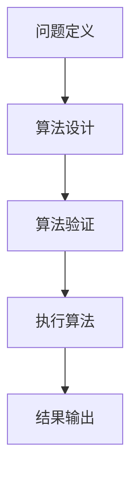
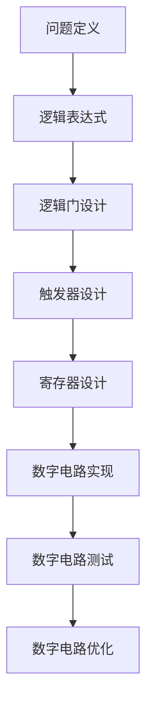
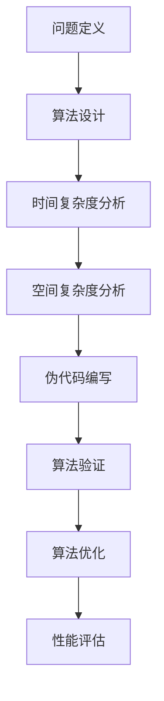
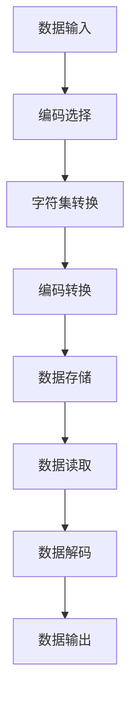
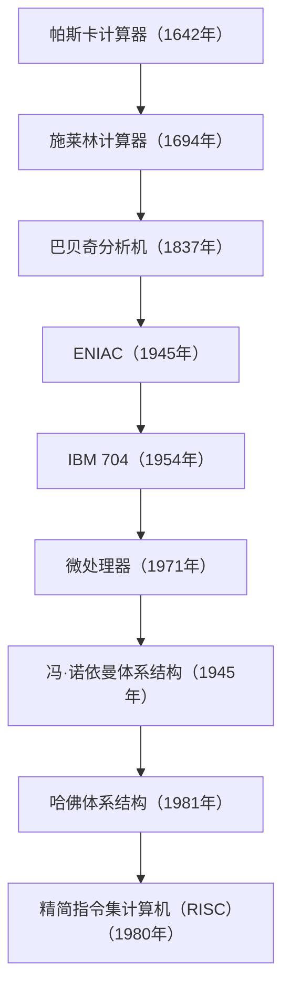
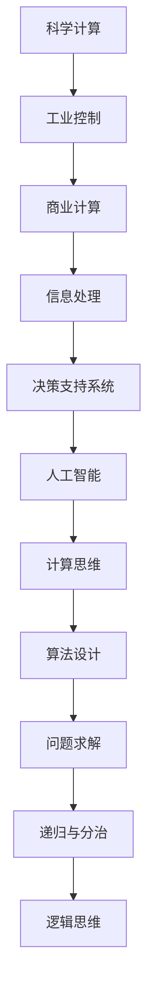
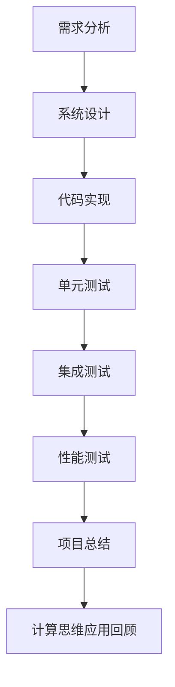

                 

### 文章标题

# 《计算：第一部分 计算的诞生 第 2 章 计算之术 面向机器的计算思维》

### 关键词

- 计算之术
- 计算思维
- 面向机器的计算思维
- 算法设计
- 递归
- 分而治之策略

### 摘要

本文作为《计算：第一部分 计算的诞生 第 2 章 计算之术 面向机器的计算思维》的详细解析，旨在深入探讨计算之术以及面向机器的计算思维。文章首先回顾了人类计算的历史，阐述了机械计算器的诞生和算法的基本概念。随后，重点介绍了计算思维的定义与特点，详细分析了面向机器的计算思维，包括逻辑思维与算法设计、问题求解与递归、分而治之策略等核心内容。此外，文章还运用Mermaid流程图，展示了计算思维的流程表示和数字电路设计与实现流程。通过本文的阅读，读者将对计算之术和计算思维有更深入的理解，为未来在计算机科学领域的探索奠定坚实基础。

### 目录大纲

1. **第一部分：计算的诞生**
   1.1 人类计算的历史回顾
   1.2 机械计算器的诞生
   1.3 算法的概念与分类
   1.4 计算机科学的基本概念
2. **第二部分：计算之术**
   2.1 计算思维的定义与特点
   2.2 面向机器的计算思维
      2.2.1 逻辑思维与算法设计
      2.2.2 问题求解与递归
      2.2.3 分而治之策略
   2.3 Mermaid流程图：计算思维的流程表示
3. **第三部分：数字计算基础**
   3.1 数字系统的基本概念
   3.2 数字电路的基本原理
   3.3 布尔代数与逻辑门
   3.4 Mermaid流程图：数字电路设计与实现流程
4. **第四部分：算法分析**
   4.1 算法的时间复杂度分析
   4.2 算法的空间复杂度分析
   4.3 伪代码编写与算法验证
   4.4 Mermaid流程图：算法分析与优化流程
5. **第五部分：编码与数据表示**
   5.1 编码的基本概念
   5.2 常见编码方法介绍
   5.3 数据表示与存储
   5.4 Mermaid流程图：数据编码与表示流程
6. **第六部分：计算模型的发展**
   6.1 机械计算器的演进
   6.2 电子计算器的出现
   6.3 计算机体系结构的发展
   6.4 Mermaid流程图：计算模型发展历程
7. **第七部分：计算机的应用领域**
   7.1 科学计算
   7.2 工业控制
   7.3 商业计算
   7.4 信息处理
   7.5 决策支持系统
   7.6 人工智能
   7.7 Mermaid流程图：计算机应用领域与计算思维的关系
8. **第二部分：实践与拓展**
   8.1 项目实战：计算思维在软件开发中的应用
      8.1.1 项目背景与目标
      8.1.2 需求分析与设计
      8.1.3 代码实现与调试
      8.1.4 项目总结与反思
      8.1.5 Mermaid流程图：项目实施流程与计算思维应用
9. **附录**
   9.1 计算机技术相关资源与工具
      9.1.1 编程语言与开发工具
      9.1.2 计算机科学经典教材
      9.1.3 在线学习平台与课程资源
      9.1.4 开源社区与技术论坛

### 第一部分：计算的诞生

#### 第1章：计算的起源

#### 1.1 人类计算的历史回顾

人类计算的历史可以追溯到古代，当时人们依靠简单的工具和技巧进行数学运算。从最早的算筹、算盘，到中世纪的数学家使用的各种计算工具，人类一直在不断探索如何更高效地进行计算。然而，这些工具和方法在处理复杂问题时往往显得力不从心。

随着工业革命的到来，机械计算器应运而生。18世纪的法国数学家布莱兹·帕斯卡（Blaise Pascal）发明了第一台机械计算器，这台计算器能够进行简单的加减法运算。随后，德国数学家威尔赫姆·施莱林（Wilhelm Schickard）和英国发明家查尔斯·巴贝奇（Charles Babbage）分别设计了更复杂的机械计算器，这些计算器已经具备了现代计算机的雏形。

进入19世纪末，随着电子技术的发展，电子计算器开始出现。1924年，美国工程师哈里·图灵（Harry Turing）提出了图灵机的概念，这是一种抽象的计算模型，为后来的计算机科学奠定了理论基础。

#### 1.2 机械计算器的诞生

机械计算器的诞生是人类计算史上的重要里程碑。最早的机械计算器是由帕斯卡在1642年发明的，这种计算器能够进行简单的加减运算。帕斯卡的计算器使用了八个旋钮，每个旋钮代表一个数字位，通过旋转旋钮和拨动杠杆来进行计算。

随后，施莱林在1694年设计了一台更复杂的机械计算器，这台计算器能够进行乘除运算。施莱林的计算器使用了齿轮和机械结构来实现数学运算，这种结构在当时是一种创新。

19世纪，巴贝奇设计了分析机，这是一种更为复杂的机械计算器，具有存储数据和程序的能力。虽然巴贝奇的分析机未能实现，但其设计思想对后来的计算机科学产生了深远影响。

#### 1.3 算法的概念与分类

算法是一种解决问题的方法或步骤，通常用伪代码或程序代码表示。算法具有以下几个基本特征：

- **确定性**：算法的每一步都有明确的定义和执行路径。
- **有穷性**：算法在执行有限的步骤后能够得到结果。
- **有效性**：算法在执行过程中所需的资源（时间、空间）是可接受的。

根据算法的应用场景和特点，算法可以分为以下几类：

- **确定性算法**：在相同的输入下，每一步都有确定的执行路径，例如排序算法。
- **随机算法**：在执行过程中包含随机元素，例如蒙特卡罗算法。
- **贪婪算法**：在每一步选择当前最优解，但不保证全局最优解，例如最短路径算法。
- **动态规划算法**：将复杂问题分解为多个子问题，并存储子问题的解以避免重复计算，例如背包问题。

#### 1.4 计算机科学的基本概念

计算机科学是一门研究计算机系统设计、开发、应用和理论的学科。计算机科学的基本概念包括：

- **计算机系统**：由硬件和软件组成，能够执行程序并处理数据。
- **算法与数据结构**：算法是解决问题的方法，数据结构是数据组织和存储的方式。
- **编程语言**：用于编写程序的语法和语义规则，例如C、Python等。
- **软件工程**：研究如何设计、开发、测试和维护高质量的软件系统。
- **人工智能**：研究如何使计算机模拟人类的智能行为，包括机器学习、自然语言处理等。

计算机科学的发展推动了人类社会的进步，从科学计算到商业计算，从工业自动化到人工智能，计算机已经深入到我们生活的方方面面。

### 第二部分：计算之术

#### 第2章：计算之术

#### 2.1 计算思维的定义与特点

计算思维是一种解决问题的方法，它强调逻辑推理、抽象思维和算法设计。计算思维具有以下几个特点：

- **逻辑性**：计算思维依赖于逻辑推理，通过一系列逻辑步骤解决问题。
- **抽象性**：计算思维能够将复杂问题抽象为简单的模型和算法。
- **系统性**：计算思维注重系统的整体性和结构，通过分解和组合来解决问题。
- **创新性**：计算思维鼓励创新和探索，通过不同的算法和策略寻找最优解。

#### 2.2 面向机器的计算思维

面向机器的计算思维是一种基于计算机科学原理和方法解决问题的思维方式。它具有以下核心概念：

- **逻辑思维与算法设计**：逻辑思维是计算思维的基础，算法设计是解决问题的核心。通过逻辑推理和算法设计，可以将复杂问题转化为计算机可执行的步骤。
- **问题求解与递归**：问题求解是计算思维的核心，递归是一种常用的解决问题的策略。递归可以将复杂问题分解为更简单的子问题，并通过递归调用解决。
- **分而治之策略**：分而治之是一种常用的算法设计策略，它将复杂问题分解为多个子问题，分别解决后再合并。这种策略可以提高算法的效率和可维护性。

#### 2.2.1 逻辑思维与算法设计

逻辑思维是计算思维的核心，它依赖于逻辑推理和判断。在算法设计中，逻辑思维体现在以下几个方面：

- **条件判断**：通过条件判断来选择执行不同的操作，例如if-else语句。
- **循环结构**：通过循环结构来重复执行某些操作，例如for循环和while循环。
- **递归**：递归是一种常用的算法设计策略，它通过递归调用解决子问题，最终解决原问题。

算法设计是计算思维的具体体现，它包括以下几个步骤：

1. **问题分析**：理解问题的要求和限制，确定问题的输入和输出。
2. **算法设计**：根据问题分析的结果，设计解决问题的算法。
3. **算法验证**：验证算法的正确性和效率，通过测试数据来验证算法的结果。

#### 2.2.2 问题求解与递归

问题求解是计算思维的核心，递归是一种常用的解决问题的策略。递归可以分为以下几种类型：

- **直接递归**：直接调用自身函数解决问题，例如阶乘计算。
- **间接递归**：通过多层调用实现递归，例如八皇后问题。
- **尾递归**：递归调用是函数执行的最后一项操作，可以优化为迭代计算。

递归问题求解的步骤如下：

1. **递归定义**：确定递归函数的定义和终止条件。
2. **递归调用**：通过递归调用解决子问题。
3. **递归返回**：将子问题的解返回到上一层递归调用。

递归的优点包括：

- **简洁性**：递归算法通常比迭代算法更简洁，易于理解和实现。
- **灵活性**：递归算法可以处理更复杂的问题，例如树形结构。

递归的缺点包括：

- **性能问题**：递归算法可能会出现栈溢出等问题，影响性能。
- **可维护性**：递归算法可能难以理解和维护。

#### 2.2.3 分而治之策略

分而治之是一种常用的算法设计策略，它将复杂问题分解为多个子问题，分别解决后再合并。分而治之策略可以分为以下几种类型：

- **二分法**：将问题分解为两个子问题，分别解决后再合并，例如二分搜索。
- **分治递归**：将问题分解为多个子问题，分别解决后再合并，例如快速排序。
- **分治迭代**：将问题分解为多个子问题，通过迭代解决，例如K-means聚类。

分而治之策略的优点包括：

- **效率**：分而治之策略可以提高算法的效率，减少计算复杂度。
- **可扩展性**：分而治之策略可以处理更复杂的问题，具有良好的可扩展性。

分而治之策略的缺点包括：

- **空间复杂度**：分而治之策略可能会导致较大的空间复杂度，影响性能。

#### 2.3 Mermaid流程图：计算思维的流程表示

为了更好地理解计算思维，我们可以使用Mermaid流程图来表示计算思维的过程。以下是一个简单的计算思维的Mermaid流程图示例：



在这个流程图中，问题定义是计算思维的第一步，随后进行算法设计，然后验证算法的正确性，执行算法并最终输出结果。

通过使用Mermaid流程图，我们可以更直观地理解计算思维的过程，这有助于我们更好地应用计算思维解决实际问题。

### 第三部分：数字计算基础

#### 第3章：数字计算基础

#### 3.1 数字系统的基本概念

数字系统是计算机科学的基础，它涉及数字的表示、运算和存储。数字系统的基本概念包括：

- **二进制**：二进制是计算机中常用的数字表示方法，它使用0和1两个数字来表示所有信息。
- **补码**：补码是一种表示负数的方法，它通过将正数的二进制表示取反并加1来得到负数。
- **浮点数**：浮点数是一种表示实数的方法，它由符号、指数和尾数三部分组成。
- **数字运算**：数字运算包括加法、减法、乘法和除法等基本运算。

#### 3.2 数字电路的基本原理

数字电路是计算机中的基本组成部分，它使用逻辑门和存储单元来实现数字逻辑操作。数字电路的基本原理包括：

- **逻辑门**：逻辑门是实现基本逻辑操作的电路元件，包括与门、或门、非门等。
- **触发器**：触发器是一种存储电路，它能够存储一个二进制位的信息。
- **寄存器**：寄存器是一种能够存储多个二进制位的存储电路，它通常用于数据缓存和寄存器传输。

#### 3.3 布尔代数与逻辑门

布尔代数是数字电路的基础，它是一种形式化的数学系统，用于描述逻辑关系。布尔代数的基本概念包括：

- **布尔变量**：布尔变量是布尔代数的基本元素，它只有两个可能的取值：真（1）和假（0）。
- **布尔运算**：布尔运算包括与、或、非等基本运算，它们可以组合成复杂的逻辑表达式。
- **逻辑门**：逻辑门是布尔运算的物理实现，例如与门、或门和非门。

#### 3.4 Mermaid流程图：数字电路设计与实现流程

为了更好地理解数字电路的设计与实现流程，我们可以使用Mermaid流程图来表示。以下是一个简单的数字电路设计与实现流程的Mermaid流程图示例：



在这个流程图中，问题定义是数字电路设计与实现的第一步，随后进行逻辑表达式设计，接着进行逻辑门设计、触发器设计和寄存器设计。完成这些设计后，进行数字电路实现、测试和优化。

通过使用Mermaid流程图，我们可以更直观地理解数字电路的设计与实现过程，这有助于我们更好地应用数字电路解决实际问题。

### 第四部分：算法分析

#### 第4章：算法分析

#### 4.1 算法的时间复杂度分析

算法的时间复杂度分析是评估算法性能的重要方法，它描述了算法在输入规模增长时所需时间的增长速度。时间复杂度通常用大O符号（O）来表示，常见的时间复杂度包括：

- **常数时间复杂度（O(1)）**：算法所需时间与输入规模无关，例如查找数组中的特定元素。
- **线性时间复杂度（O(n)）**：算法所需时间与输入规模成正比，例如遍历数组或链表。
- **对数时间复杂度（O(log n)）**：算法所需时间与输入规模的以2为底的对数成正比，例如二分搜索。
- **多项式时间复杂度（O(n^k)，k为常数）**：算法所需时间与输入规模的某个多项式成正比，例如快速排序。
- **指数时间复杂度（O(2^n)）**：算法所需时间与输入规模的指数成正比，例如穷举搜索。

时间复杂度分析可以帮助我们比较不同算法的性能，选择最优的算法解决实际问题。

#### 4.2 算法的空间复杂度分析

算法的空间复杂度分析是评估算法所需存储空间的大小，它与时间复杂度分析相辅相成。空间复杂度也通常用大O符号（O）来表示，常见空间复杂度包括：

- **常数空间复杂度（O(1)）**：算法所需空间与输入规模无关，例如查找数组中的特定元素。
- **线性空间复杂度（O(n)）**：算法所需空间与输入规模成正比，例如链表和栈。
- **多项式空间复杂度（O(n^k)，k为常数）**：算法所需空间与输入规模的某个多项式成正比，例如哈希表。
- **指数空间复杂度（O(2^n)）**：算法所需空间与输入规模的指数成正比，例如生成所有可能的子集。

空间复杂度分析可以帮助我们评估算法的存储需求，选择最优的算法实现。

#### 4.3 伪代码编写与算法验证

伪代码是一种用自然语言描述算法的方法，它不需要遵循特定的编程语言语法，但能够清晰地表达算法的逻辑和步骤。伪代码通常包括以下组成部分：

- **变量声明**：声明算法中使用的变量和其初始值。
- **输入输出**：描述算法的输入和输出。
- **控制结构**：包括条件判断、循环等控制结构。
- **函数调用**：描述算法中使用的函数和其参数。

以下是一个简单的排序算法（冒泡排序）的伪代码示例：

```
procedure bubbleSort(A : list of comparable elements)
    n = length(A)
    for i = 1 to n-1 do
        for j = 1 to n-i do
            if A[j] > A[j+1] then
                swap(A[j], A[j+1])
            end if
        end for
    end for
end procedure
```

算法验证是确保算法正确性的过程，通常通过以下方法进行：

- **数学证明**：使用数学方法证明算法的正确性，例如归纳法。
- **测试数据**：使用不同规模的测试数据验证算法的正确性，包括边界条件和异常情况。
- **逻辑分析**：分析算法的每一步操作，确保不会出现逻辑错误。

#### 4.4 Mermaid流程图：算法分析与优化流程

为了更好地理解算法分析与优化流程，我们可以使用Mermaid流程图来表示。以下是一个简单的算法分析与优化流程的Mermaid流程图示例：



在这个流程图中，问题定义是算法分析与优化的第一步，随后进行算法设计、时间复杂度分析和空间复杂度分析。完成这些分析后，编写伪代码并进行算法验证。最后，根据性能评估结果进行算法优化。

通过使用Mermaid流程图，我们可以更直观地理解算法分析与优化过程，这有助于我们更好地选择和优化算法，提高其性能。

### 第五部分：编码与数据表示

#### 第5章：编码与数据表示

#### 5.1 编码的基本概念

编码是将信息转换为特定格式的过程，以便于存储、传输和处理。在计算机科学中，编码的基本概念包括：

- **编码方式**：编码方式是将数据转换为二进制序列的方法，常见的编码方式有ASCII、UTF-8等。
- **字符集**：字符集是编码系统中使用的字符集合，常见的字符集有ASCII、Unicode等。
- **编码效率**：编码效率是编码方式的优劣指标，它表示编码后数据的长度和原始数据长度之比。

#### 5.2 常见编码方法介绍

常见的编码方法包括：

- **ASCII编码**：ASCII编码是最早的字符编码标准，它使用7位二进制数表示128个字符，包括英文字母、数字和常用符号。
- **UTF-8编码**：UTF-8编码是一种可变长度的编码方式，它使用1到4个字节表示一个字符。UTF-8编码具有较好的兼容性和扩展性，能够表示全球所有字符。
- **Unicode编码**：Unicode编码是一种字符编码标准，它使用16位或32位二进制数表示字符。Unicode编码能够表示全球所有字符，但相比UTF-8编码，它通常需要更多的存储空间。

#### 5.3 数据表示与存储

数据表示与存储是计算机科学中的重要内容，它涉及数据的组织、存储和访问。数据表示与存储的基本概念包括：

- **位**：位是最小的数据单位，它只有两个可能的取值：0和1。
- **字节**：字节是计算机中常用的数据单位，它由8位组成。
- **数据类型**：数据类型是数据在计算机中的表示形式，常见的有整数、浮点数、字符等。
- **内存分配**：内存分配是计算机系统将内存分配给程序的过程，它包括栈分配和堆分配等。

#### 5.4 Mermaid流程图：数据编码与表示流程

为了更好地理解数据编码与表示流程，我们可以使用Mermaid流程图来表示。以下是一个简单的数据编码与表示流程的Mermaid流程图示例：



在这个流程图中，数据输入是数据编码与表示的第一步，随后进行编码选择、字符集转换和编码转换。完成这些步骤后，数据被存储在内存或磁盘上。当需要读取数据时，进行数据读取、解码和数据输出。

通过使用Mermaid流程图，我们可以更直观地理解数据编码与表示过程，这有助于我们更好地处理和存储数据。

### 第六部分：计算模型的发展

#### 第6章：计算模型的发展

#### 6.1 机械计算器的演进

机械计算器的演进是计算模型发展的重要阶段，它标志着人类从手工计算向自动化计算的转变。以下是一些重要的机械计算器及其演进过程：

- **帕斯卡计算器（1642年）**：帕斯卡计算器是第一台能够进行加减运算的机械计算器，它由帕斯卡发明。
- **施莱林计算器（1694年）**：施莱林计算器是第一台能够进行乘除运算的机械计算器，它由施莱林设计。
- **巴贝奇分析机（1837年）**：巴贝奇分析机是第一台具有存储程序和输入输出功能的机械计算器，它由巴贝奇设计。

机械计算器的演进提高了计算效率，为后来的电子计算器奠定了基础。

#### 6.2 电子计算器的出现

电子计算器的出现标志着计算模型的又一次重大变革，它将计算速度和精度提升到了新的水平。以下是一些重要的电子计算器及其特点：

- **ENIAC（1945年）**：ENIAC是第一台电子数字计算机，它由美国科学家设计。ENIAC使用了大量的电子管，能够在几分钟内完成手工计算需要几天的计算任务。
- **IBM 704（1954年）**：IBM 704是第一台使用晶体管的计算机，它由IBM公司研制。IBM 704具有更高的速度和更低的功耗，为科学计算和工业控制提供了强大的计算能力。
- **微处理器（1971年）**：英特尔公司推出了4004微处理器，这是第一台商业化的微处理器。微处理器的出现使得计算机变得更小、更便宜、更可靠，为个人计算机的普及奠定了基础。

电子计算器的出现推动了计算机技术的发展，使得计算机应用从科学计算扩展到商业计算、工业控制、信息处理等领域。

#### 6.3 计算机体系结构的发展

计算机体系结构的发展是计算模型演变的重要方面，它涉及计算机内部各个部件的组织和连接方式。以下是一些重要的计算机体系结构及其特点：

- **冯·诺依曼体系结构（1945年）**：冯·诺依曼体系结构是第一台电子计算机的架构，它由冯·诺依曼提出。冯·诺依曼体系结构将程序和数据存储在同一存储器中，通过指令流控制计算机的运行。
- **哈佛体系结构（1981年）**：哈佛体系结构是另一种计算机体系结构，它将程序和数据存储在不同存储器中。哈佛体系结构可以提高程序的执行效率，适用于某些特定的应用场景。
- **精简指令集计算机（RISC）（1980年）**：精简指令集计算机是一种新型计算机体系结构，它采用简化的指令集，通过高速缓存和流水线技术提高执行效率。RISC架构在嵌入式系统和高性能计算领域得到了广泛应用。

计算机体系结构的发展不断推动计算机性能的提升，为现代计算机系统的构建提供了丰富的理论基础和实践经验。

#### 6.4 Mermaid流程图：计算模型发展历程

为了更好地理解计算模型的发展历程，我们可以使用Mermaid流程图来表示。以下是一个简单的计算模型发展历程的Mermaid流程图示例：



在这个流程图中，帕斯卡计算器标志着机械计算器的开始，随后是施莱林计算器、巴贝奇分析机、ENIAC、IBM 704、微处理器、冯·诺依曼体系结构、哈佛体系结构和精简指令集计算机。这些重要的计算模型发展节点展示了计算模型的演变过程。

通过使用Mermaid流程图，我们可以更直观地理解计算模型的发展历程，这有助于我们更好地把握计算模型的发展趋势和关键技术。

### 第七部分：计算机的应用领域

#### 第7章：计算机的应用领域

计算机技术的广泛应用已经深刻改变了我们的生活方式和社会结构。以下将详细探讨计算机在几个关键领域的应用：

#### 7.1 科学计算

科学计算是计算机技术的核心应用之一，特别是在复杂物理模拟、天文观测、气候预测等领域。计算机能够处理大量的数据，进行复杂的数学运算，从而帮助科学家们解决许多传统方法难以应对的问题。

- **物理模拟**：计算机模拟在粒子物理学、流体动力学等领域发挥着重要作用。例如，通过模拟粒子碰撞，科学家们能够预测新的基本粒子的存在。
- **天文观测**：计算机在处理天文观测数据方面发挥着关键作用。大型天文望远镜收集的数据量巨大，计算机能够对这些数据进行快速处理和分析，帮助科学家们发现新的天体和现象。
- **气候预测**：气候模型需要大量的计算资源来模拟大气、海洋和地面的相互作用。计算机科学的发展使得气候预测的精度不断提高，为应对气候变化提供了科学依据。

#### 7.2 工业控制

工业控制是计算机技术在制造业和工业自动化中的关键应用。计算机控制系统（CSC）通过实时监控和自动调节，提高了生产效率和产品质量。

- **自动化生产线**：计算机控制系统被广泛应用于自动化生产线，从零部件制造到组装，各个环节都可以通过计算机进行控制和优化。
- **机器人技术**：工业机器人是计算机控制的典型应用，它们能够在危险、繁重或精密的工作环境中替代人类，提高生产效率和安全性。
- **过程控制**：计算机控制系统用于监测和控制各种工业过程，如化工、冶金、电力等，确保生产过程的安全和稳定。

#### 7.3 商业计算

商业计算是计算机技术在企业管理、财务分析、供应链管理等方面的应用，它极大地提高了企业的运营效率和决策能力。

- **企业管理系统**：企业资源计划（ERP）系统集成了财务、人力资源、供应链等多个模块，通过计算机技术实现企业内部信息的集成和共享。
- **数据分析**：商业智能（BI）工具利用计算机技术对大量商业数据进行处理和分析，帮助企业管理者做出更准确的决策。
- **电子商务**：电子商务平台通过计算机技术实现在线购物、支付、物流等环节，改变了传统的商业模式，提高了消费者的购物体验。

#### 7.4 信息处理

信息处理是计算机技术的核心应用之一，它涉及数据的收集、存储、处理和传输。

- **数据库技术**：数据库管理系统（DBMS）用于存储和管理大量数据，支持数据的快速检索和分析。
- **搜索引擎**：搜索引擎技术通过计算机算法对大量网页进行索引和搜索，提供高效的信息检索服务。
- **大数据分析**：大数据技术利用计算机处理大量数据，从中提取有价值的信息，支持企业、政府和研究机构进行决策和科学研究。

#### 7.5 决策支持系统

决策支持系统（DSS）是计算机技术在决策过程中的重要应用，它通过数据分析和模型模拟，帮助决策者做出更合理的决策。

- **数据分析**：DSS利用数据分析工具，对历史数据和当前数据进行分析，提供决策支持。
- **模拟与预测**：DSS通过模拟和预测模型，评估不同决策方案的结果，帮助决策者选择最优方案。
- **智能决策**：结合人工智能技术，DSS可以实现智能决策，提高决策的效率和准确性。

#### 7.6 人工智能

人工智能（AI）是计算机技术的最新发展方向，它通过模拟人类智能，实现机器的自我学习和自主决策。

- **机器学习**：机器学习是一种利用计算机算法进行自我学习和预测的方法，广泛应用于图像识别、语音识别等领域。
- **自然语言处理**：自然语言处理技术通过计算机模拟人类语言，实现语言的理解和生成，支持智能客服、智能助手等应用。
- **智能机器人**：智能机器人结合计算机视觉、语音识别等技术，实现自主移动、人机交互等功能，广泛应用于服务、医疗等领域。

#### 7.7 Mermaid流程图：计算机应用领域与计算思维的关系

为了更好地理解计算机应用领域与计算思维的关系，我们可以使用Mermaid流程图来表示。以下是一个简单的计算机应用领域与计算思维关系的Mermaid流程图示例：



在这个流程图中，计算机应用领域包括科学计算、工业控制、商业计算、信息处理、决策支持系统和人工智能。计算思维贯穿于这些应用领域，通过算法设计、问题求解、递归与分治和逻辑思维等方法，实现计算机在各个领域的应用。

通过使用Mermaid流程图，我们可以更直观地理解计算机应用领域与计算思维的关系，这有助于我们更好地利用计算思维解决实际问题。

### 第二部分：实践与拓展

#### 第8章：项目实战：计算思维在软件开发中的应用

#### 8.1 项目背景与目标

在现代社会，软件系统已经成为各种行业和领域不可或缺的工具。本项目旨在通过实际案例展示计算思维在软件开发中的应用，帮助开发人员理解和运用计算思维解决复杂问题。项目目标包括：

1. **需求分析与设计**：明确软件系统的功能需求，设计合理的系统架构。
2. **代码实现与调试**：编写高质量的代码，实现系统功能，并进行调试。
3. **项目总结与反思**：总结项目经验，反思计算思维在软件开发中的应用。

#### 8.2 需求分析与设计

项目需求分析是软件开发的第一步，它包括确定软件系统的功能需求和非功能需求。以下是一个简单的需求分析示例：

**功能需求**：

- 用户注册与登录
- 数据存储与管理
- 数据查询与统计
- 用户权限管理

**非功能需求**：

- 系统安全性
- 系统可扩展性
- 系统性能

根据需求分析的结果，设计合理的系统架构。常见的系统架构包括：

- **MVC架构**：模型-视图-控制器（MVC）架构将系统划分为模型、视图和控制器三个部分，实现数据、显示和业务逻辑的分离。
- **微服务架构**：微服务架构将系统划分为多个独立的微服务，每个微服务负责特定的业务功能，通过API进行通信。

#### 8.3 代码实现与调试

代码实现是软件开发的核心环节，它包括编写程序代码、配置开发环境、执行测试用例等步骤。以下是一个简单的代码实现示例：

**编程语言**：Python

**实现步骤**：

1. **用户注册与登录**：

```python
# 用户注册
def register(username, password):
    # 存储用户信息到数据库
    pass

# 用户登录
def login(username, password):
    # 验证用户信息，返回登录结果
    pass
```

2. **数据存储与管理**：

```python
# 数据存储
def store_data(data):
    # 存储数据到数据库
    pass

# 数据查询
def query_data(key):
    # 从数据库中查询数据
    pass
```

3. **用户权限管理**：

```python
# 用户权限验证
def verify_permission(user, action):
    # 验证用户权限，返回验证结果
    pass
```

代码实现后，需要进行调试。调试过程包括：

- **单元测试**：编写测试用例，测试各个模块的功能。
- **集成测试**：将各个模块集成到一起，测试系统整体功能。
- **性能测试**：测试系统的性能，包括响应时间、并发处理能力等。

#### 8.4 项目总结与反思

项目总结是软件开发的重要环节，它包括回顾项目过程中的经验教训，总结计算思维在软件开发中的应用。以下是一些项目总结和反思：

1. **计算思维在需求分析中的应用**：计算思维帮助开发人员从整体上理解和分析需求，确保软件系统能够满足用户需求。
2. **计算思维在系统设计中的应用**：计算思维帮助开发人员设计合理的系统架构，提高系统的可扩展性和可维护性。
3. **计算思维在代码实现中的应用**：计算思维帮助开发人员编写高质量的代码，提高代码的可读性和可维护性。
4. **计算思维在调试中的应用**：计算思维帮助开发人员快速定位和解决代码中的问题，提高开发效率。

通过项目实战，开发人员可以更深入地理解计算思维在软件开发中的应用，为今后的开发工作奠定坚实基础。

#### 8.5 Mermaid流程图：项目实施流程与计算思维应用

为了更好地展示项目实施流程和计算思维的应用，我们可以使用Mermaid流程图。以下是一个简单的项目实施流程与计算思维应用的Mermaid流程图示例：



在这个流程图中，项目实施流程包括需求分析、系统设计、代码实现、单元测试、集成测试、性能测试和项目总结。计算思维贯穿于整个项目过程，从需求分析到系统设计、代码实现和调试，帮助开发人员高效地解决复杂问题。

通过使用Mermaid流程图，我们可以更直观地理解项目实施流程和计算思维的应用，这有助于我们更好地运用计算思维进行软件开发。

### 附录

#### 附录 A：计算机技术相关资源与工具

A.1 **编程语言与开发工具**

- **编程语言**：Python、Java、C++、JavaScript、Go等。
- **集成开发环境（IDE）**：Visual Studio Code、Eclipse、IntelliJ IDEA等。
- **版本控制系统**：Git、Subversion等。
- **调试工具**：GDB、PyCharm Debugger等。

A.2 **计算机科学经典教材**

- **《算法导论》（Introduction to Algorithms）**：Thomas H. Cormen等著，是一本经典的算法教材。
- **《计算机程序设计艺术》（The Art of Computer Programming）**：Donald E. Knuth著，是一部关于算法设计的经典著作。
- **《计算机网络》（Computer Networking: A Top-Down Approach）**：James F. Kurose等著，是一本关于计算机网络的基本教材。

A.3 **在线学习平台与课程资源**

- **Coursera**：提供各种计算机科学课程，包括算法、数据结构、机器学习等。
- **edX**：由哈佛大学和麻省理工学院创办，提供高质量的计算机科学课程。
- **Udacity**：提供实践驱动的计算机科学课程，包括人工智能、大数据等。

A.4 **开源社区与技术论坛**

- **GitHub**：全球最大的开源代码托管平台，许多重要的计算机科学项目都在这里开源。
- **Stack Overflow**：全球最大的开发者问答社区，解决编程问题和技术难题。
- **Reddit**：包含多个计算机科学相关的子论坛，如r/programming、r/learnprogramming等。

这些资源与工具为计算机科学的学习和实践提供了丰富的支持，读者可以根据自己的需求选择合适的学习材料和工具。

