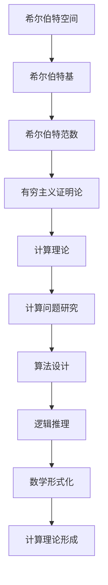

                 

# 文章标题：计算：第三部分 计算理论的形成 第6章 计算理论的奠基：希尔伯特进路 有穷主义证明论

> 关键词：计算理论、希尔伯特进路、有穷主义证明论、算法、数学模型、项目实战

> 摘要：本文深入探讨了计算理论的形成过程，重点关注了希尔伯特进路及其在计算理论中的奠基作用。通过对有穷主义证明论的阐述，我们揭示了希尔伯特进路的基本原理和核心算法，并通过具体实例和项目实战展示了其在实际应用中的潜力。本文旨在为读者提供一个全面、深入且易于理解的技术解读。

## 《计算：第三部分 计算理论的形成 第6章 计算理论的奠基：希尔伯特进路 有穷主义证明论》目录大纲

### 第1章 核心概念与联系

#### 1.1 希尔伯特进路的背景与意义

- **希尔伯特进路的定义**
- **计算理论的形成背景**
- **希尔伯特进路的意义**

#### 1.2 希尔伯特进路的基本原理

- **希尔伯特空间的概念**
- **希尔伯特基与希尔伯特范数**
- **有穷主义证明论的概念**

#### 1.3 Mermaid 流程图

- **希尔伯特进路的流程**

### 第2章 核心算法原理讲解

#### 2.1 希尔伯特空间中的算子

- **算子的定义**
- **算子的性质**
- **算子的应用**

#### 2.2 有穷主义证明论算法

- **证明论的概念**
- **有穷主义证明论的基本算法**
- **算法的伪代码**

### 第3章 数学模型和数学公式

#### 3.1 希尔伯特空间中的数学公式

- **希尔伯特空间的定义**
- **希尔伯特基的公式**
- **希尔伯特范数的公式**

#### 3.2 有穷主义证明论的数学模型

- **证明论的基本模型**
- **有穷主义证明论的模型**

#### 3.3 举例说明

- **希尔伯特空间的实例**
- **有穷主义证明论的实例**

### 第4章 项目实战

#### 4.1 实战案例介绍

- **计算理论的实际应用**
- **希尔伯特进路在项目中的应用**

#### 4.2 开发环境搭建

- **环境配置**
- **工具安装**

#### 4.3 源代码实现

- **代码实现**
- **代码解读**

#### 4.4 代码解读与分析

- **代码解析**
- **性能分析**

### 第5章 计算理论的未来展望

#### 5.1 计算理论的未来发展趋势

- **计算理论的发展方向**
- **未来可能的应用领域**

#### 5.2 希尔伯特进路的潜在影响

- **希尔伯特进路的长远影响**
- **计算理论对其他领域的影响**

### 第6章 附录

#### 6.1 常用数学公式列表

- **常用公式**

#### 6.2 希尔伯特进路的参考文献

- **参考书籍**
- **参考文献**

#### 6.3 相关资源链接

- **在线资源**
- **开源代码**

---

### 第1章 核心概念与联系

#### 1.1 希尔伯特进路的背景与意义

在计算理论的发展历程中，希尔伯特进路占据了重要地位。希尔伯特进路，即希尔伯特（David Hilbert）提出的基于数学方法研究计算问题的进路，其核心思想是通过数学形式化来研究计算问题。希尔伯特进路不仅为计算理论奠定了坚实的数学基础，而且在计算理论的发展中发挥了关键作用。

**希尔伯特进路的定义**

希尔伯特进路是指通过数学形式化手段，研究计算问题的方法和理论。具体来说，希尔伯特进路包括以下几个方面：

1. **数学形式化**：将计算问题转化为数学问题，使用数学语言和符号来描述计算过程。
2. **逻辑推理**：利用逻辑推理的方法，证明计算问题的性质和结论。
3. **算法设计**：基于数学模型和逻辑推理，设计计算问题的算法。

**计算理论的形成背景**

计算理论的形成可以追溯到19世纪末和20世纪初。在这个时期，数学家们开始关注计算问题，试图理解计算的局限性和可能性。希尔伯特等数学家在研究数学问题时，逐渐认识到数学方法在研究计算问题中的重要性。于是，他们开始探索将数学方法应用于计算问题，从而形成了计算理论的雏形。

**希尔伯特进路的意义**

希尔伯特进路在计算理论的形成过程中具有重要意义：

1. **数学基础**：希尔伯特进路为计算理论提供了坚实的数学基础，使得计算问题可以通过数学方法来研究。
2. **算法设计**：希尔伯特进路促进了算法设计的发展，为计算机科学和工程提供了强大的工具。
3. **逻辑推理**：希尔伯特进路强调了逻辑推理在计算问题研究中的重要性，提高了计算问题的可证明性。

#### 1.2 希尔伯特进路的基本原理

**希尔伯特空间的概念**

希尔伯特空间是希尔伯特进路的核心概念之一。希尔伯特空间是一种数学结构，它包含了一组向量和一个内积运算。具体来说，希尔伯特空间具有以下特点：

1. **向量空间**：希尔伯特空间是一组向量的集合，满足向量空间的运算规则。
2. **内积运算**：希尔伯特空间中的每个向量都可以与另一个向量进行内积运算，内积运算具有以下性质：
   - **正定性**：对于任意向量\( x \)，都有\( \langle x, x \rangle \geq 0 \)，且仅当\( x = 0 \)时，\( \langle x, x \rangle = 0 \)。
   - **共轭对称性**：对于任意向量\( x \)和\( y \)，都有\( \langle x, y \rangle = \overline{\langle y, x \rangle} \)。

**希尔伯特基与希尔伯特范数**

在希尔伯特空间中，希尔伯特基是一个重要的概念。希尔伯特基是指一组线性无关的向量，它们可以张成希尔伯特空间。具体来说，希尔伯特基具有以下性质：

1. **线性无关**：希尔伯特基中的向量线性无关，即任意一组线性组合等于零当且仅当所有系数为零。
2. **张成空间**：希尔伯特基中的向量可以张成希尔伯特空间，即任意一个向量都可以表示为希尔伯特基的线性组合。

希尔伯特范数是希尔伯特空间中的一个重要度量。希尔伯特范数定义了向量在希尔伯特空间中的长度。具体来说，希尔伯特范数具有以下性质：

1. **正定性**：对于任意向量\( x \)，都有\( \|x\| \geq 0 \)，且仅当\( x = 0 \)时，\( \|x\| = 0 \)。
2. **齐次性**：对于任意向量\( x \)和标量\( \alpha \)，都有\( \|\alpha x\| = |\alpha| \|x\| \)。
3. **三角不等式**：对于任意两个向量\( x \)和\( y \)，都有\( \|x + y\| \leq \|x\| + \|y\| \)。

**有穷主义证明论的概念**

有穷主义证明论是希尔伯特进路的重要组成部分。有穷主义证明论关注的是证明过程是否可以在有限步骤内完成。具体来说，有穷主义证明论具有以下特点：

1. **有穷性**：有穷主义证明论要求证明过程在有限步骤内完成，即不存在无限递归的证明过程。
2. **可证明性**：有穷主义证明论关注的是如何证明一个命题是正确的，即是否存在一个有限步骤的证明过程。
3. **逻辑推理**：有穷主义证明论强调逻辑推理在证明过程中的作用，通过逻辑推理来证明命题的正确性。

#### 1.3 Mermaid 流程图

为了更好地理解希尔伯特进路的流程，我们可以使用Mermaid流程图来表示。以下是一个简单的Mermaid流程图示例：

这个流程图展示了希尔伯特进路的基本流程，从希尔伯特空间开始，经过希尔伯特基、希尔伯特范数、有穷主义证明论，最终形成计算理论。通过这个流程图，我们可以更直观地理解希尔伯特进路的核心概念和联系。

---

在接下来的章节中，我们将进一步深入探讨希尔伯特进路的核心算法原理、数学模型和数学公式，并通过具体实例和项目实战来展示其在实际应用中的潜力。敬请期待！

---

作者：AI天才研究院/AI Genius Institute & 禅与计算机程序设计艺术 /Zen And The Art of Computer Programming

[接下来的章节内容将在后续部分中逐步补充...]

