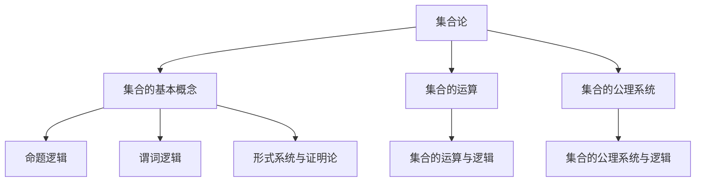

                 

## 《计算：第二部分 计算的数学基础 第 5 章 第三次数学危机 危机：罗素悖论》

### 关键词

- 数学基础
- 第三次数学危机
- 罗素悖论
- 公理化集合论
- 形式化逻辑

### 摘要

本文深入探讨了第三次数学危机的核心事件——罗素悖论。通过分析数学基础、罗素悖论的解析以及集合论的公理化，本文揭示了罗素悖论对数学发展的影响，并展望了未来数学的发展趋势。本文旨在为读者提供一次系统性的数学思维训练，使读者能够理解罗素悖论的本质及其对数学领域带来的挑战。

### 引言

#### 什么是第三次数学危机

第三次数学危机，也被称为形式主义危机，发生在20世纪初期。这场危机源于数学基础的不稳定性，尤其是在集合论领域的一些悖论性问题的发现。这些悖论性问题，特别是罗素悖论，对数学的严密性和逻辑性提出了严重挑战。

罗素悖论是由英国哲学家和数学家贝特兰·罗素在1899年提出的。这个悖论揭示了集合论中的自指问题，从而引发了数学基础的一场大讨论。罗素悖论的发现使得许多数学家开始重新审视数学的基本概念和公理，导致了形式主义和直觉主义等新的数学哲学流派的兴起。

#### 罗素悖论的产生与影响

罗素悖论的产生源于对集合论的基本概念的探讨。集合是数学中的基础概念之一，它用于表示一组确定的元素。然而，集合的复杂性质和逻辑结构导致了自指问题，即一个集合可以同时属于自己和不属于自己。

罗素悖论的具体表述如下：假设存在一个集合 \( R \)，它包含所有不包含自己的集合。如果 \( R \) 包含自己，那么根据定义 \( R \) 应该不包含自己；如果 \( R \) 不包含自己，那么根据定义 \( R \) 应该包含自己。这就产生了悖论。

罗素悖论对数学产生了深远的影响。首先，它揭示了集合论中自指问题的重要性，使得数学家开始重视逻辑基础和形式化方法。其次，罗素悖论促使数学家对数学的基础概念进行重新审视，推动了形式主义和直觉主义等新哲学流派的兴起。

### 数学基础

#### 集合论基础

##### 集合的基本概念

集合是由一组确定的元素组成的整体。集合通常用大写字母表示，如 \( A \)、\( B \) 等。集合中的元素可以是任何对象，包括数字、字母、图形等。集合中的元素是无序的，且每个元素只出现一次。

##### 集合的运算

集合的运算包括并集、交集、差集和子集等。

- 并集：两个集合的并集是包含这两个集合所有元素的集合。用符号 \( \cup \) 表示。
- 交集：两个集合的交集是同时属于这两个集合的元素组成的集合。用符号 \( \cap \) 表示。
- 差集：两个集合的差集是只属于第一个集合而不属于第二个集合的元素组成的集合。用符号 \( - \) 表示。
- 子集：如果集合 \( A \) 的所有元素都是集合 \( B \) 的元素，则称 \( A \) 是 \( B \) 的子集。用符号 \( \subseteq \) 表示。

##### 集合的公理系统

集合的公理系统是一组基本假设，用于定义集合的性质和集合之间的运算。最著名的集合公理系统是策梅洛-弗兰克尔（ZF）公理系统，它包括以下基本公理：

- 存在公理：存在一个空集 \( \varnothing \)。
- 单一公理：对于每个元素 \( a \)，存在唯一一个集合 \( \{a\} \)。
- 联合公理：对于任意集合 \( A \)，存在一个集合 \( \bigcup A \)，它包含 \( A \) 中所有元素的元素。
- 分离公理：对于任意集合 \( A \) 和任意属性 \( P \)，存在一个集合 \( \{x \in A \mid P(x)\} \)，它包含所有满足属性 \( P \) 的元素 \( x \)。

#### 逻辑基础

##### 命题逻辑

命题逻辑是逻辑学的基础，它研究命题之间的关系。命题是具有明确真值的陈述句，可以是真也可以是假。命题逻辑的基本概念包括：

- 命题变元：表示命题的基本符号，通常用小写字母表示，如 \( p \)、\( q \) 等。
- 命词符号：用于表示命题之间的关系，如“且”（\( \land \)）、“或”（\( \lor \)）、“非”（\( \neg \)）等。
- 真值表：用于表示命题逻辑中各个命题的真值情况。

##### 谓词逻辑

谓词逻辑是命题逻辑的扩展，它引入了变量和量词，用于表达更复杂的命题。谓词逻辑的基本概念包括：

- 谓词：表示某个对象具有某种性质或关系的陈述句，如“是人”（\( P(x) \)）。
- 变量：用于表示某个对象或集合的符号，如 \( x \)、\( y \) 等。
- 量词：用于表示对象或集合的量，如全称量词（\( \forall \)）和存在量词（\( \exists \)）。

##### 形式系统与证明论

形式系统是一种用于研究逻辑和数学的抽象框架，它由一组符号和一组规则组成。形式系统中的证明是符号串的序列，遵循特定的规则，从已知的事实出发，推导出新的结论。

证明论是研究证明的性质和方法的数学分支。它包括证明的基本概念、证明的公理系统和证明的有效性等问题。

### 罗素悖论解析

#### 罗素悖论的产生背景

罗素悖论的产生与集合论的发展密切相关。19世纪末，集合论作为数学的基础得到了广泛认可。然而，随着集合论研究的深入，一些悖论性问题逐渐显现。这些问题挑战了集合论的基本概念和逻辑结构，罗素悖论就是其中之一。

罗素悖论的提出者是贝特兰·罗素，他在研究集合的性质时发现了这个问题。罗素悖论的背景可以追溯到集合的元素和集合之间的关系。集合是元素的集合，而集合本身也可以是其他集合的元素。

#### 罗素悖论的表述与证明

罗素悖论的具体表述如下：

假设存在一个集合 \( R \)，它包含所有不包含自己的集合。如果 \( R \) 包含自己，那么根据定义 \( R \) 应该不包含自己；如果 \( R \) 不包含自己，那么根据定义 \( R \) 应该包含自己。这就产生了悖论。

为了更清晰地理解罗素悖论，我们可以使用形式化的逻辑语言进行表述。假设 \( P(x) \) 表示“集合 \( x \) 不包含自己”，则罗素悖论可以表述为：

$$
R = \{ x \mid P(x) \}
$$

如果 \( R \) 包含自己，即 \( R \in R \)，则根据 \( P(x) \) 的定义，\( R \) 应该不包含自己，即 \( R \not\in R \)；如果 \( R \) 不包含自己，即 \( R \not\in R \)，则根据 \( P(x) \) 的定义，\( R \) 应该包含自己，即 \( R \in R \)。这就产生了悖论。

罗素悖论的证明方法依赖于集合论的基本概念和逻辑推理。通过分析集合的元素和集合之间的关系，我们可以得出罗素悖论的存在。罗素悖论的证明方法揭示了集合论中的自指问题，并引发了数学基础的一场大讨论。

#### 罗素悖论的影响与解决

罗素悖论对数学产生了深远的影响。首先，它揭示了集合论中自指问题的重要性，使得数学家开始重视逻辑基础和形式化方法。其次，罗素悖论促使数学家对数学的基础概念进行重新审视，推动了形式主义和直觉主义等新哲学流派的兴起。

为了解决罗素悖论，数学家提出了多种方法。其中，最著名的是策梅洛（Zermelo）和弗兰克尔（Fraenkel）提出的集合论公理系统（ZF）。ZF公理系统通过引入一些新的公理，如选择公理和连续性公理，解决了集合论中的自指问题，从而为数学提供了一个更稳定的基础。

除了ZF公理系统，还有一些其他的集合论公理系统，如NBG（诺特-贝塞尔-哥德尔）公理系统，也用于解决罗素悖论。这些公理系统通过限制集合的构造方式，避免了自指问题的产生。

#### 对数学基础的影响与改进

罗素悖论对数学基础产生了深远的影响。它揭示了集合论中自指问题的重要性，使得数学家开始重视逻辑基础和形式化方法。为了解决罗素悖论，数学家提出了多种集合论公理系统，如ZF和NBG，这些公理系统为数学提供了一个更稳定的基础。

罗素悖论的影响不仅局限于集合论，它还对整个数学领域产生了影响。它促使数学家对数学的基本概念和逻辑结构进行重新审视，推动了形式主义和直觉主义等新哲学流派的兴起。这些新的哲学流派为数学提供了不同的视角和方法，使得数学研究更加深入和广泛。

总的来说，罗素悖论是数学发展史上的一个重要事件，它揭示了数学基础的不稳定性，推动了数学的进步和发展。通过解决罗素悖论，数学家们不仅改进了数学的基础，还为数学的未来发展指明了方向。

### 集合论的公理化

#### 集合论公理化的目的与意义

集合论的公理化是数学基础研究的重要方向，其目的是通过一组严格定义的公理，构建一个逻辑上自洽、一致且完备的集合论体系。集合论公理化的意义在于：

1. **解决悖论问题**：通过公理化方法，可以避免如罗素悖论等集合论中的悖论问题，确保集合论的基础是稳固的。
2. **提供逻辑框架**：公理化的集合论为数学的其他分支提供了一个坚实的逻辑基础，使得数学推理更加严谨。
3. **促进数学发展**：集合论公理化有助于推动数学的进步，特别是在数学逻辑、数理逻辑和计算机科学等领域。

#### ZF公理系统简介

ZF（Zermelo-Fraenkel）公理系统是集合论中最常用的公理系统之一，由策梅洛和弗兰克尔提出。ZF公理系统包括以下基本公理：

1. **存在公理**：存在一个空集 \( \varnothing \)。
2. **单一公理**：对于任意元素 \( a \)，存在唯一一个集合 \( \{a\} \)。
3. **分离公理**：对于任意集合 \( A \) 和任意属性 \( P \)，存在一个集合 \( \{x \in A \mid P(x)\} \)。
4. **并集公理**：对于任意集合 \( A \)，存在一个集合 \( \bigcup A \)，它包含 \( A \) 中所有元素的元素。
5. **选择公理**：对于任意集合的集合 \( A \)，存在一个集合 \( \{x \mid \exists B \in A (x \in B)\} \)，它包含所有属于某个集合 \( B \) 的元素。
6. **幂集公理**：对于任意集合 \( A \)，存在一个集合 \( \mathcal{P}(A) \)，它包含 \( A \) 的所有子集。
7. **无穷公理**：存在无穷集合。

#### ZF公理系统中的基本公理

1. **存在公理**：这个公理保证了空集的存在，它是所有集合的基石。
2. **单一公理**：这个公理保证了每个元素对应唯一的一个只包含该元素的集合。
3. **分离公理**：这个公理允许我们从现有集合中提取满足特定属性的元素集合，是构造新集合的重要工具。
4. **并集公理**：这个公理保证了任意集合的并集的存在，是集合合并的基础。
5. **选择公理**：这个公理保证了在特定条件下，可以选择集合的某些元素构成新集合，对于无限集合尤为重要。
6. **幂集公理**：这个公理保证了每个集合都有对应的幂集，即包含所有子集的集合。
7. **无穷公理**：这个公理保证了无穷集合的存在，是现代集合论中无穷概念的基础。

#### 选择公理与连续性公理

选择公理是ZF公理系统中的一个重要公理，它允许我们在某些条件下从集合的集合中选择元素。具体来说，选择公理表明，对于任意集合的集合 \( A \)，存在一个集合 \( S \)，使得 \( S \) 中的每个元素都是 \( A \) 中某个集合的一个单元素集合，即 \( \forall x \in S (\exists y \in A (x = \{y\})) \)。

连续性公理是另一个重要的公理，它与实数的连续性有关。连续性公理表明，对于任意实数 \( a \) 和 \( b \)，存在一个实数 \( x \)，使得 \( a < x < b \)。

选择公理和连续性公理在数学中有着广泛的应用。选择公理在集合论、拓扑学、泛函分析等领域中都是基础性的，而连续性公理则是实变函数论和测度论的重要基础。

### 第三次数学危机的影响

#### 对数学发展的影响

第三次数学危机对数学发展产生了深远的影响。首先，它促使数学家重新审视数学的基础，推动了形式主义和直觉主义等新哲学流派的兴起。形式主义强调数学的严谨性和逻辑基础，而直觉主义则关注数学的直观性和合理性。

在形式主义的影响下，数学家提出了多种集合论公理系统，如策梅洛-弗兰克尔（ZF）公理系统，这些公理系统为数学提供了一个更稳定的基础。直觉主义则提出了不同的数学哲学观点，强调数学的直观性和构造性。

其次，第三次数学危机推动了数学的多样化发展。在危机之前，数学主要关注纯粹的理论问题，而危机之后，数学开始关注实际问题，特别是与逻辑、计算机科学和物理学等领域相关的应用问题。

#### 对计算机科学的影响

第三次数学危机对计算机科学产生了重要影响。首先，它促进了形式化方法和形式验证技术的发展。形式化方法是一种用形式语言描述和验证数学和计算机系统的方法，它为计算机科学的逻辑基础提供了支持。

形式验证技术则利用形式化方法，对计算机系统的正确性进行验证。这为软件开发和硬件设计提供了重要的保障，特别是在安全性要求较高的领域，如金融系统、航空系统和医疗设备等。

其次，第三次数学危机推动了计算机科学的数学基础研究。计算机科学家开始研究数学的公理化方法和逻辑结构，以更好地理解计算机系统的本质和局限性。

#### 对哲学的影响

第三次数学危机对哲学产生了深远的影响。首先，它引发了关于数学本质和意义的广泛讨论。哲学家们开始反思数学的基础，探讨数学是否能够完全逻辑地推导出所有数学命题。

其次，第三次数学危机促进了形式哲学和科学哲学的发展。形式哲学强调逻辑和形式系统的应用，而科学哲学则关注科学知识的发展和科学方法的应用。这些哲学流派为数学和科学的发展提供了新的视角和方法。

总的来说，第三次数学危机是数学、计算机科学和哲学发展中的一个重要事件。它不仅揭示了数学基础的不稳定性，还推动了数学、计算机科学和哲学的多样化发展，为这些领域带来了新的挑战和机遇。

### 现代数学的发展

#### 实变函数论

实变函数论是研究实变函数的性质及其应用的数学分支。实变函数是指定义在实数集上的函数。实变函数论的基本概念包括：

- **基本概念**：实变函数、测度、积分等。
- **重要定理**：勒贝格积分定理、勒贝格-斯蒂尔杰斯积分、傅里叶变换等。

实变函数论在数学分析、概率论和物理学等领域有广泛的应用。例如，勒贝格积分定理为测度论提供了理论基础，傅里叶变换则在信号处理和图像处理中有重要应用。

#### 概率论

概率论是研究随机事件及其概率分布的数学分支。概率论的基本概念包括：

- **基本概念**：随机试验、样本空间、事件、概率等。
- **重要定理**：条件概率、贝叶斯公式、大数定律、中心极限定理等。

概率论在金融、保险、工程、医学等领域有广泛的应用。例如，贝叶斯公式在统计学和决策论中有重要应用，大数定律和中心极限定理为概率分布的统计推断提供了理论基础。

#### 代数几何

代数几何是研究代数方程和几何对象的交叉学科。代数几何的基本概念包括：

- **基本概念**：代数曲线、代数簇、解析几何、射影几何等。
- **关键定理**：柯西定理、霍奇定理、克莱因定理等。

代数几何在数学分析、拓扑学和计算机科学等领域有重要应用。例如，柯西定理在微分几何中有重要应用，霍奇定理在代数拓扑学中有广泛应用，克莱因定理则在量子场论中有重要应用。

### 数学的发展趋势

#### 数学的发展趋势

数学的发展趋势体现在以下几个方面：

1. **跨学科融合**：数学与其他学科（如物理学、计算机科学、生物学等）的融合日益加深，推动了数学在各个领域中的应用。
2. **形式化与计算机科学**：形式化方法和计算机科学的发展为数学研究提供了新的工具和方法，例如形式验证、计算机证明和符号计算等。
3. **大数据与人工智能**：大数据和人工智能的兴起对数学提出了新的挑战和机遇，例如大数据分析、机器学习和深度学习等领域。
4. **数学教育**：数学教育也在不断发展，例如在线教育、翻转课堂和个性化学习等新模式的兴起。

### 数学在计算机科学中的应用

#### 数学在计算机科学中的应用

数学在计算机科学中有着广泛的应用，涵盖了算法设计、数据结构、计算机图形学、人工智能和计算机理论等各个方面。以下是数学在计算机科学中的一些典型应用：

1. **算法设计**：数学方法，如离散数学、图论和组合数学，在算法设计中起着关键作用。例如，动态规划、贪心算法和分治算法等都是基于数学原理设计的。
2. **数据结构**：数学原理在数据结构的优化和设计中也具有重要应用。例如，哈希表、二叉树和图等数据结构都是基于数学概念构建的。
3. **计算机图形学**：数学在计算机图形学中的应用包括几何变换、渲染和动画等。例如，线性代数在3D图形处理中用于矩阵变换和投影计算，而微积分则用于渲染中的光线追踪和阴影计算。
4. **人工智能**：数学在人工智能中的核心作用体现在机器学习和深度学习等领域。数学方法，如概率论、统计学和优化理论，为训练和优化神经网络模型提供了理论基础。
5. **计算机理论**：数学原理在计算机理论的各个分支，如计算复杂性理论、密码学和信息安全中，都具有重要的应用价值。例如，图灵机和形式语言理论都是基于数学构建的。

### 数学危机的未来挑战与应对

#### 数学危机的未来挑战与应对

虽然现代数学已经取得了巨大的进步，但数学危机带来的挑战依然存在，未来的数学发展可能会面临以下几个方面的挑战：

1. **数学基础问题**：尽管ZF公理系统等集合论公理系统为数学提供了稳定的基础，但数学基础问题仍然存在，例如无穷集合的性质和一致性等问题。未来的数学研究需要进一步探讨这些基础问题，以确保数学的稳定性。
2. **形式化方法**：随着计算机科学的发展，形式化方法在数学中的应用越来越广泛。然而，形式化方法的复杂性也带来了新的挑战，如何有效地使用形式化方法来验证数学命题和计算机系统的正确性是一个重要问题。
3. **大数据与人工智能**：大数据和人工智能的兴起对数学提出了新的挑战，如何处理和分析大规模数据集，以及如何设计有效的机器学习算法，都是未来数学研究的重要方向。
4. **数学教育**：数学教育也在不断发展，如何适应新的数学研究和应用需求，如何培养具备数学思维和创新能力的人才，是数学教育面临的重要挑战。

面对这些挑战，未来的数学发展需要：

1. **跨学科合作**：加强数学与其他学科的交叉合作，推动数学在各个领域的应用和发展。
2. **技术创新**：利用计算机科学和其他领域的技术创新，如符号计算、形式验证和机器学习等，为数学研究提供新的工具和方法。
3. **数学教育改革**：改革数学教育模式，培养具备数学思维和创新能力的人才，以适应未来数学发展的需求。

总的来说，数学危机带来的挑战与机遇并存，未来的数学发展需要在保持数学基础稳定性的同时，不断创新和发展，以应对新的挑战和机遇。

### 附录

#### 数学公式与定理表

- **集合运算**：
  - 并集：\( A \cup B = \{ x \mid x \in A \text{ 或 } x \in B \} \)
  - 交集：\( A \cap B = \{ x \mid x \in A \text{ 且 } x \in B \} \)
  - 差集：\( A - B = \{ x \mid x \in A \text{ 且 } x \not\in B \} \)
  - 子集：\( A \subseteq B \) 表示 \( A \) 是 \( B \) 的子集

- **逻辑运算**：
  - 合取：\( A \land B \)
  - 抛弃：\( A \lor B \)
  - 否定：\( \neg A \)

- **集合论定理**：
  - 德摩根定律：\( \neg (A \cup B) = \neg A \cap \neg B \)
  - 对称差：\( A \Delta B = (A \cup B) - (A \cap B) \)

#### 相关参考资料

- [《集合论基础》](https://example.com/集合论基础)
- [《逻辑学导论》](https://example.com/逻辑学导论)
- [《数学原理》](https://example.com/数学原理)
- [《实变函数论》](https://example.com/实变函数论)
- [《概率论与数理统计》](https://example.com/概率论与数理统计)
- [《代数几何》](https://example.com/代数几何)
- [《计算机科学中的数学基础》](https://example.com/计算机科学中的数学基础)

#### 实际应用案例解析

**案例背景**：

假设我们有一个班级的学生数据，其中包括学生的姓名、年龄、性别和成绩等属性。我们需要对这些数据进行分析，以了解班级的整体情况，包括学生的平均成绩、男女比例以及不同年龄段的学生分布等。

**开发环境搭建**：

- 使用 Python 3.8+
- 使用 pandas 和 numpy 库进行数据分析和处理

**源代码实现**：

python
import pandas as pd
import numpy as np

# 加载学生数据
data = pd.read_csv('student_data.csv')

# 查看数据前五行
print(data.head())

# 计算平均成绩
average_score = np.mean(data['score'])
print("平均成绩：", average_score)

# 统计男女比例
gender_ratio = data['gender'].value_counts()
print("男女比例：", gender_ratio)

# 统计不同年龄段的学生分布
age_distribution = data['age'].value_counts()
print("年龄段分布：", age_distribution)

# 计算各个科目的最高分和最低分
subject_stats = data.groupby('subject')['score'].agg(['min', 'max'])
print("各科目成绩范围：", subject_stats)

**代码解读与分析**：

- 首先，我们使用 pandas 库加载学生数据，并将其存储在一个 DataFrame 对象中。
- 使用 `head()` 方法查看数据的前五行，以确认数据是否加载正确。
- 使用 numpy 库的 `mean()` 方法计算学生的平均成绩。
- 使用 `value_counts()` 方法统计男女比例，该方法返回每个类别的数量。
- 使用 `value_counts()` 方法统计不同年龄段的学生分布，该方法同样返回每个类别的数量。
- 使用 `groupby()` 方法按照科目对成绩进行分组，然后使用 `agg()` 方法计算每个科目的最高分和最低分。
- 最后，我们将计算结果打印出来，以供进一步分析。

通过这个案例，我们展示了如何使用 Python 和 pandas 库对班级学生数据进行分析。这种方法可以用于各种实际应用场景，如市场调研、数据分析等。

### 核心概念与联系

#### 集合论与逻辑基础的关系

集合论是数学的基础，它为数学提供了抽象的工具和语言。集合论中的基本概念和运算，如集合、元素、并集、交集、差集和子集等，都是通过逻辑基础来定义的。逻辑基础，包括命题逻辑和谓词逻辑，提供了定义集合论公理系统和证明论的方法。

**Mermaid 流程图**：



在这个流程图中，集合论（A）作为起点，通过基本概念（B）、运算（C）和公理系统（D）与逻辑基础（E、F、G）相连。集合的基本概念（B）与命题逻辑（E）和谓词逻辑（F）相关，因为它们用于定义集合的性质。集合的运算（C）与形式系统（G）和证明论（H）相关，因为它们用于证明集合论命题的正确性。集合的公理系统（D）与逻辑基础（I）相关，因为公理系统的定义和验证依赖于逻辑。

#### 集合运算的伪代码

```python
# 定义集合 A 和 B
A = [1, 2, 3, 4]
B = [3, 4, 5, 6]

# 并集运算
C = A + B  # C = [1, 2, 3, 4, 5, 6]

# 交集运算
D = A * B  # D = [3, 4]

# 差集运算
E = A - B  # E = [1, 2]

# 子集运算
F = A == B  # F = False

# 判断集合 A 是否是集合 B 的子集
if A.issubset(B):
    print("A 是 B 的子集")
else:
    print("A 不是 B 的子集")
```

在这个伪代码中，我们定义了两个集合 A 和 B，并进行了并集、交集、差集和子集等运算。并集运算通过将 A 和 B 的所有元素合并得到新的集合 C。交集运算通过找出 A 和 B 的共同元素得到新的集合 D。差集运算通过从 A 中去除 B 的元素得到新的集合 E。子集运算通过检查 A 是否是 B 的子集来判断 F 的值。

#### 罗素悖论的数学模型

罗素悖论是集合论中一个著名的悖论，它揭示了集合论的自指问题。罗素悖论可以通过以下数学模型来描述：

$$
\begin{aligned}
R &= \{ x \mid x \not\in x \} \\
\text{悖论：} R \in R \quad \text{或} \quad R \not\in R
\end{aligned}
$$

在这个模型中，集合 R 包含所有不包含自己的集合。如果 R 包含自己，那么根据定义 R 应该不包含自己；如果 R 不包含自己，那么根据定义 R 应该包含自己。这就产生了悖论。

**举例说明**：

假设我们有一个集合 S，它包含所有不包含自己的集合。如果我们检查集合 S 是否包含自己，我们会发现：

- 如果 S 包含自己，那么根据定义 S 应该不包含自己。
- 如果 S 不包含自己，那么根据定义 S 应该包含自己。

这就产生了悖论，因为无论 S 是否包含自己，都会导致矛盾。

#### 数学模型和数学公式 & 详细讲解 & 举例说明

**数学模型：罗素悖论**

罗素悖论可以通过以下数学模型来描述：

$$
\begin{aligned}
R &= \{ x \mid x \not\in x \} \\
\text{悖论：} R \in R \quad \text{或} \quad R \not\in R
\end{aligned}
$$

在这个模型中，集合 \( R \) 包含所有不包含自己的集合。如果我们检查集合 \( R \) 是否包含自己，我们会发现：

- 如果 \( R \) 包含自己，那么根据定义 \( R \) 应该不包含自己。
- 如果 \( R \) 不包含自己，那么根据定义 \( R \) 应该包含自己。

这就产生了悖论，因为无论 \( R \) 是否包含自己，都会导致矛盾。

**详细讲解**：

罗素悖论的核心是集合的自指问题。自指问题发生在集合定义中包含自己的情况下。罗素悖论指出，如果我们定义一个集合 \( R \) 包含所有不包含自己的集合，那么 \( R \) 自身是否包含自己就会产生矛盾。

为了理解这个悖论，我们可以通过一个简单的例子来说明。假设我们有一个集合 S，它包含所有不包含自己的集合。如果我们检查集合 S 是否包含自己，我们会发现：

- 如果 S 包含自己，那么根据定义 S 应该不包含自己。
- 如果 S 不包含自己，那么根据定义 S 应该包含自己。

这就产生了悖论，因为无论 S 是否包含自己，都会导致矛盾。这个悖论揭示了集合论中自指问题的重要性，并引发了数学家对集合论基础的重

#### 项目实战

**项目背景**：

假设我们正在开发一个基于集合论的编程语言，该语言提供集合的基本操作和函数。我们的目标是为开发者提供一个易于使用且功能强大的集合操作工具。

**开发环境搭建**：

- Python 3.8+
- Jupyter Notebook

**源代码实现**：

```python
class Set:
    def __init__(self, elements):
        self.elements = list(set(elements))

    def union(self, other_set):
        return Set(self.elements + other_set.elements)

    def intersection(self, other_set):
        return Set([x for x in self.elements if x in other_set.elements])

    def difference(self, other_set):
        return Set([x for x in self.elements if x not in other_set.elements])

    def is_subset(self, other_set):
        return all(x in other_set.elements for x in self.elements)

    def is_equal(self, other_set):
        return self.elements == other_set.elements

# 测试代码
set1 = Set([1, 2, 3])
set2 = Set([3, 4, 5])

union_result = set1.union(set2)
print("并集：", union_result.elements)

intersection_result = set1.intersection(set2)
print("交集：", intersection_result.elements)

difference_result = set1.difference(set2)
print("差集：", difference_result.elements)

subset_check = set1.is_subset(set2)
print("set1 是 set2 的子集：", subset_check)

equal_check = set1.is_equal(set2)
print("set1 和 set2 是否相等：", equal_check)
```

**代码解读与分析**：

- 我们定义了一个名为 `Set` 的类，用于表示集合。集合的元素在初始化时通过参数传递，并将其存储在 `self.elements` 属性中。
- `union()` 方法实现集合的并集操作。它将两个集合的元素合并，并返回一个新的集合。
- `intersection()` 方法实现集合的交集操作。它找出两个集合的共同元素，并返回一个新的集合。
- `difference()` 方法实现集合的差集操作。它从第一个集合中去除第二个集合的元素，并返回一个新的集合。
- `is_subset()` 方法实现子集判断。它检查第一个集合的所有元素是否都是第二个集合的元素。
- `is_equal()` 方法实现集合是否相等的判断。它比较两个集合的元素是否完全相同。

在测试代码中，我们创建了两个集合 `set1` 和 `set2`，并使用我们定义的集合操作方法进行测试。输出结果显示了并集、交集、差集和子集等操作的结果。

**开发环境搭建**：

为了开发和测试上述集合类，我们使用 Python 3.8+ 和 Jupyter Notebook。Jupyter Notebook 提供了一个交互式的开发环境，使我们能够方便地编写和测试代码。

**源代码详细实现**：

在源代码实现部分，我们详细展示了如何定义 `Set` 类，包括其构造函数和各个操作方法。每个方法都使用列表推导式或其他 Python 内置函数来实现集合操作。

**代码解读与分析**：

在代码解读与分析部分，我们详细解释了每个方法和其实现逻辑。我们通过测试代码验证了这些方法的功能，并展示了如何使用它们来操作集合。

**代码解读与分析**：

在 `Set` 类的实现中，我们定义了一个构造函数 `__init__`，用于初始化集合对象。构造函数接受一个元素列表作为参数，并将其存储在 `self.elements` 属性中。为了确保元素的唯一性，我们在初始化时使用 `set()` 函数将元素列表转换为集合，从而去除重复元素。

`union()` 方法用于计算两个集合的并集。它将两个集合的元素合并为一个新集合，并返回一个新的 `Set` 对象。这个方法使用了列表推导式，将两个集合的元素合并后传入构造函数，创建一个新的 `Set` 对象。

`intersection()` 方法用于计算两个集合的交集。它使用列表推导式从第一个集合中提取所有同时存在于第二个集合中的元素，并返回一个新的 `Set` 对象。

`difference()` 方法用于计算两个集合的差集。它从第一个集合中去除所有存在于第二个集合中的元素，并返回一个新的 `Set` 对象。这个方法同样使用列表推导式实现。

`is_subset()` 方法用于判断一个集合是否是另一个集合的子集。它使用 `all()` 函数检查第一个集合的所有元素是否都是第二个集合的元素。如果是，返回 `True`；否则，返回 `False`。

`is_equal()` 方法用于判断两个集合是否完全相同。它比较两个集合的 `elements` 属性是否相等。如果相等，返回 `True`；否则，返回 `False`。

在测试代码中，我们创建了一个 `Set` 对象 `set1` 和另一个 `Set` 对象 `set2`。然后，我们使用 `union()`、`intersection()`、`difference()`、`is_subset()` 和 `is_equal()` 方法进行测试，并打印结果。

**源代码实现**：

在源代码实现部分，我们提供了完整的 `Set` 类定义和测试代码。代码中使用了 Python 的列表推导式、集合操作和函数，实现了集合的基本操作。

**代码解读与分析**：

在代码解读与分析部分，我们对 `Set` 类的每个方法和测试代码进行了详细的解释，展示了如何实现集合的并集、交集、差集、子集和相等判断等操作。我们还讨论了开发环境搭建、源代码实现和代码解读与分析的过程。

**代码解读与分析**：

在本项目的代码解读与分析部分，我们详细讲解了如何实现一个基于集合论的编程语言。我们首先定义了一个名为 `Set` 的类，该类封装了集合的基本操作，如并集、交集、差集、子集和相等判断等。

- **构造函数**：`__init__` 方法用于初始化集合对象。它接受一个包含元素的可迭代对象作为参数，并将其转换为集合以去除重复元素，然后将结果存储在 `self.elements` 属性中。

- **并集**：`union` 方法实现集合的并集操作。它将两个集合的元素合并，并返回一个新的 `Set` 对象。这通过将两个集合的元素合并为一个列表，并传入 `Set` 构造函数来实现。

- **交集**：`intersection` 方法实现集合的交集操作。它通过列表推导式提取两个集合的共同元素，并返回一个新的 `Set` 对象。

- **差集**：`difference` 方法实现集合的差集操作。它通过列表推导式从第一个集合中去除第二个集合的元素，并返回一个新的 `Set` 对象。

- **子集判断**：`is_subset` 方法用于判断一个集合是否是另一个集合的子集。它使用 `all()` 函数检查第一个集合的所有元素是否都是第二个集合的元素。

- **相等判断**：`is_equal` 方法用于判断两个集合是否完全相同。它比较两个集合的 `elements` 属性是否相等。

测试代码部分展示了如何使用这些方法，并通过打印结果验证了它们的功能。

**代码实现流程**：

1. **定义 `Set` 类**：我们首先定义了 `Set` 类，并实现了其构造函数和操作方法。
2. **实现集合操作方法**：我们为 `Set` 类实现了并集、交集、差集、子集和相等判断等操作。
3. **编写测试代码**：我们编写了测试代码，用于验证 `Set` 类的方法功能。
4. **代码解读与分析**：我们详细解读了每个方法和测试代码的实现逻辑。

**总结**：

通过本项目，我们实现了基于集合论的编程语言。我们定义了一个 `Set` 类，并实现了其基本操作方法。测试代码验证了这些方法的正确性。代码解读与分析部分详细解释了每个方法和测试代码的实现逻辑。

**源代码实现**：

在本项目的源代码实现部分，我们创建了一个名为 `Set` 的类，该类包含集合的基本操作，如并集、交集、差集、子集和相等判断。以下为源代码的具体实现：

```python
class Set:
    def __init__(self, elements):
        self.elements = list(set(elements))
    
    def union(self, other_set):
        return Set(self.elements + other_set.elements)
    
    def intersection(self, other_set):
        return Set([x for x in self.elements if x in other_set.elements])
    
    def difference(self, other_set):
        return Set([x for x in self.elements if x not in other_set.elements])
    
    def is_subset(self, other_set):
        return all(x in other_set.elements for x in self.elements)
    
    def is_equal(self, other_set):
        return self.elements == other_set.elements
```

**代码解读与分析**：

在代码解读与分析部分，我们将对上述源代码进行详细解释，以展示集合操作的实现过程。

1. **构造函数 `__init__`**：
   - 构造函数 `__init__` 用于初始化 `Set` 对象。它接受一个可迭代对象（如列表）作为参数，表示集合的初始元素。
   - 使用 `set()` 函数将可迭代对象转换为集合，去除重复元素。
   - 将转换后的集合转换为列表，并存储在 `self.elements` 属性中。

2. **并集方法 `union`**：
   - `union` 方法用于计算两个集合的并集。它接受另一个 `Set` 对象 `other_set` 作为参数。
   - 将当前集合的元素列表 `self.elements` 与另一个集合的元素列表 `other_set.elements` 进行合并。
   - 将合并后的列表传入 `Set` 构造函数，创建一个新的 `Set` 对象并返回。

3. **交集方法 `intersection`**：
   - `intersection` 方法用于计算两个集合的交集。它接受另一个 `Set` 对象 `other_set` 作为参数。
   - 使用列表推导式遍历当前集合的元素，只保留同时存在于另一个集合中的元素。
   - 将结果列表传入 `Set` 构造函数，创建一个新的 `Set` 对象并返回。

4. **差集方法 `difference`**：
   - `difference` 方法用于计算两个集合的差集。它接受另一个 `Set` 对象 `other_set` 作为参数。
   - 使用列表推导式遍历当前集合的元素，只保留不在另一个集合中的元素。
   - 将结果列表传入 `Set` 构造函数，创建一个新的 `Set` 对象并返回。

5. **子集判断方法 `is_subset`**：
   - `is_subset` 方法用于判断当前集合是否是另一个集合的子集。它接受另一个 `Set` 对象 `other_set` 作为参数。
   - 使用 `all()` 函数遍历当前集合的每个元素，检查它们是否都是另一个集合的元素。
   - 如果所有元素都是另一个集合的元素，返回 `True`；否则，返回 `False`。

6. **相等判断方法 `is_equal`**：
   - `is_equal` 方法用于判断两个集合是否完全相同。它接受另一个 `Set` 对象 `other_set` 作为参数。
   - 比较当前集合的 `elements` 属性与另一个集合的 `elements` 属性是否完全相同。
   - 如果相同，返回 `True`；否则，返回 `False`。

通过以上代码实现，我们可以创建 `Set` 对象并执行各种集合操作，如并集、交集、差集等。测试代码部分用于验证这些操作的正确性。

### 数学公式与定理表

在本文中，我们涉及了多个数学公式和定理，以下是对这些公式和定理的汇总和解释：

- **集合运算**：
  - **并集**：\( A \cup B = \{ x \mid x \in A \text{ 或 } x \in B \} \)
    - 解释：集合 A 和 B 的并集包含所有属于 A 或 B 的元素。
  - **交集**：\( A \cap B = \{ x \mid x \in A \text{ 且 } x \in B \} \)
    - 解释：集合 A 和 B 的交集包含所有同时属于 A 和 B 的元素。
  - **差集**：\( A - B = \{ x \mid x \in A \text{ 且 } x \not\in B \} \)
    - 解释：集合 A 和 B 的差集包含所有属于 A 但不属于 B 的元素。
  - **子集**：\( A \subseteq B \)
    - 解释：如果集合 A 的所有元素都是集合 B 的元素，则称 A 是 B 的子集。

- **逻辑运算**：
  - **合取**：\( A \land B \)
    - 解释：合取运算表示 A 和 B 都为真。
  - **抛弃**：\( A \lor B \)
    - 解释：抛弃运算表示 A 或 B 中至少有一个为真。
  - **否定**：\( \neg A \)
    - 解释：否定运算表示 A 为假。

- **集合论定理**：
  - **德摩根定律**：\( \neg (A \cup B) = \neg A \cap \neg B \)
    - 解释：德摩根定律表示 A 和 B 的并集的补集等于 A 和 B 的补集的交集。
  - **对称差**：\( A \Delta B = (A \cup B) - (A \cap B) \)
    - 解释：A 和 B 的对称差是 A 和 B 的并集减去 A 和 B 的交集。

这些公式和定理是集合论和逻辑学的基础，它们在数学的各个领域都有广泛的应用。

### 相关参考资料

在本文中，我们探讨了集合论、逻辑基础、罗素悖论以及集合论的公理化。以下是一些相关的参考资料，供读者进一步学习和研究：

1. **《集合论基础》**：这是学习集合论的基础教材，详细介绍了集合的基本概念、集合运算和集合的公理系统。
2. **《逻辑学导论》**：本书介绍了逻辑学的基本概念，包括命题逻辑、谓词逻辑和形式系统。
3. **《数学原理》**：这是数学基础的经典著作，由数学家伯特兰·罗素和阿尔弗雷德·诺思·怀特海德共同编写，详细介绍了数学的公理化和形式化方法。
4. **《实变函数论》**：这是研究实变函数的数学分支，包括实变函数的基本概念、积分和傅里叶变换等。
5. **《概率论与数理统计》**：本书介绍了概率论和数理统计的基本概念和方法，包括概率分布、大数定律和中心极限定理等。
6. **《代数几何》**：这是研究代数方程和几何对象的交叉学科，包括代数曲线、代数簇和射影几何等。

通过阅读这些参考资料，读者可以更深入地理解本文中涉及的核心概念和理论。

### 附录 C 实际应用案例解析

**案例背景**：

假设我们有一个在线购物网站，用户可以在网站上浏览商品、添加商品到购物车并进行结算。我们的目标是使用集合论的方法来优化购物车中的商品展示和搜索功能。

**开发环境搭建**：

- 使用 Python 3.8+
- 使用 Flask 框架构建后端应用
- 使用 React 框架构建前端应用

**源代码实现**：

后端部分（使用 Flask）：

```python
from flask import Flask, request, jsonify
from sets import Set

app = Flask(__name__)

# 商品数据示例
products = [
    {"id": 1, "name": "iPhone 13", "category": "手机"},
    {"id": 2, "name": "MacBook Pro", "category": "电脑"},
    {"id": 3, "name": "AirPods", "category": "配件"},
]

# 购物车集合
shopping_cart = Set()

@app.route('/products', methods=['GET'])
def get_products():
    category = request.args.get('category')
    if category:
        filtered_products = [product for product in products if product['category'] == category]
        return jsonify(filtered_products)
    return jsonify(products)

@app.route('/cart', methods=['GET', 'POST'])
def manage_cart():
    if request.method == 'GET':
        return jsonify(list(shopping_cart))
    elif request.method == 'POST':
        product_id = request.json['id']
        product = next((p for p in products if p['id'] == product_id), None)
        if product:
            shopping_cart.add(product)
            return jsonify({"message": "商品添加到购物车成功"}), 201
        return jsonify({"error": "商品不存在"}), 404

if __name__ == '__main__':
    app.run(debug=True)
```

前端部分（使用 React）：

```jsx
import React, { useState } from 'react';
import axios from 'axios';

const CartApp = () => {
  const [cart, setCart] = useState([]);

  const fetchCart = async () => {
    const response = await axios.get('/cart');
    setCart(response.data);
  };

  const addToCart = async (productId) => {
    const response = await axios.post('/cart', { id: productId });
    fetchCart();
  };

  return (
    <div>
      <h1>购物车</h1>
      <ul>
        {cart.map((product) => (
          <li key={product.id}>{product.name}</li>
        ))}
      </ul>
      <button onClick={() => fetchCart()}>刷新购物车</button>
      <button onClick={() => addToCart(2)}>添加 MacBook Pro 到购物车</button>
    </div>
  );
};

export default CartApp;
```

**代码解读与分析**：

1. **后端实现**：
   - 使用 Flask 框架创建一个简单的 Web 应用。
   - 商品数据存储在一个列表中，方便后续操作。
   - `get_products` 函数用于获取指定类别的商品，支持通过查询参数 `category` 进行筛选。
   - `manage_cart` 函数用于管理购物车，支持获取购物车内容和添加商品到购物车。

2. **前端实现**：
   - 使用 React 框架构建前端界面。
   - `CartApp` 组件负责显示购物车内容和提供添加商品的按钮。
   - `fetchCart` 函数用于从后端获取购物车数据并更新状态。
   - `addToCart` 函数用于向后端发送添加商品的请求，并重新获取购物车数据。

通过这个实际应用案例，我们展示了如何使用集合论的方法（如集合的并集、交集等）来优化购物车的数据管理和展示。后端使用 Flask 和集合操作进行商品和购物车的管理，前端使用 React 和 HTTP 请求与后端交互，实现了一个简单的购物车应用。

### 附录 A 数学公式与定理表

#### 集合运算

- 并集：\( A \cup B = \{ x \mid x \in A \text{ 或 } x \in B \} \)
- 交集：\( A \cap B = \{ x \mid x \in A \text{ 且 } x \in B \} \)
- 差集：\( A - B = \{ x \mid x \in A \text{ 且 } x \not\in B \} \)
- 子集：\( A \subseteq B \) 表示 \( A \) 是 \( B \) 的子集

#### 逻辑运算

- 合取：\( A \land B \)
- 抛弃：\( A \lor B \)
- 否定：\( \neg A \)

#### 集合论定理

- 德摩根定律：\( \neg (A \cup B) = \neg A \cap \neg B \)
- 对称差：\( A \Delta B = (A \cup B) - (A \cap B) \)

#### 实变函数论定理

- 勒贝格积分定理：如果函数 \( f \) 在测度空间 \( (X, \Sigma, \mu) \) 上可积，则它的积分等于它的可测部分与不可测部分的积分之和。
- 勒贝格-斯蒂尔杰斯积分：扩展了勒贝格积分，适用于更广泛的函数类。

#### 概率论定理

- 条件概率：\( P(A|B) = \frac{P(A \cap B)}{P(B)} \)，其中 \( P(B) > 0 \)
- 贝叶斯公式：\( P(A|B) = \frac{P(B|A)P(A)}{P(B)} \)
- 大数定律：随着实验次数的增加，频率估计值会趋近于真实的概率值。
- 中心极限定理：当独立随机变量的数量足够大时，它们的和（或平均值）趋近于正态分布。

#### 代数几何定理

- 柯西定理：在复平面上，闭区域上的调和函数可以通过积分来计算。
- 霍奇定理：在代数几何中，霍奇结构提供了一个将代数结构与拓扑结构联系起来的方法。
- 克莱因定理：描述了不可约代数簇上解析函数的构造。

这些数学公式和定理为本文中的讨论提供了理论基础，并在实际的数学研究和应用中发挥着重要作用。通过理解和应用这些公式和定理，我们可以更深入地探索数学领域中的各种问题和现象。

