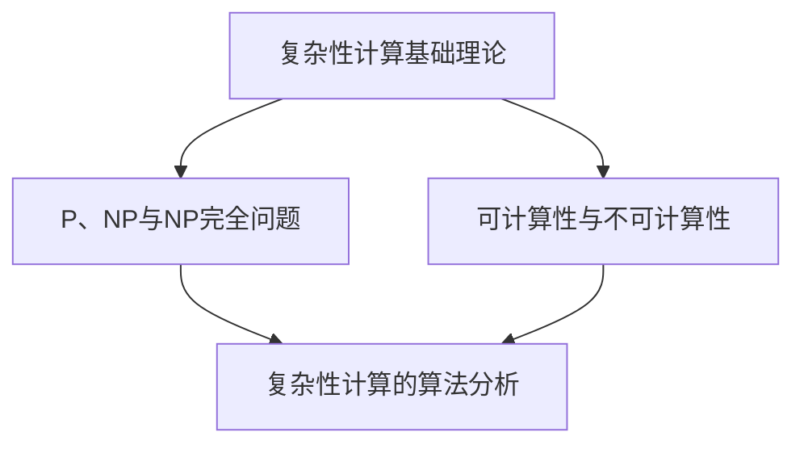

                 

## 文章标题：计算：第四部分 计算的极限 第 11 章 复杂性计算 耗散结构

### 关键词：
- 复杂性计算
- 耗散结构
- 计算极限
- 算法分析
- 量子计算

### 摘要：
本文深入探讨了计算领域中的复杂性计算和耗散结构，分析了其基本理论、数学模型和算法原理。通过对P、NP与NP完全问题的讨论，以及可计算性与不可计算性的探讨，本文揭示了复杂性计算的内在机制。同时，本文详细介绍了耗散结构的定义、特点及其数学模型，并分析了耗散结构的计算复杂性。通过实际应用案例分析，本文展示了复杂性计算和耗散结构在物理学、工程学、计算机科学等领域的广泛应用。最后，本文展望了耗散结构在量子计算和人工智能等未来研究方向的潜在应用。

----------------------------------------------------------------

## 第一部分：计算的极限

### 第1章：复杂性计算基础理论

### 1.1 复杂性计算的算法概述

#### 1.1.1 常见复杂性计算算法介绍

复杂性计算算法是计算领域中的重要分支，用于解决各类复杂问题。常见的复杂性计算算法包括分类复杂性算法、降低复杂性算法和近似算法。

**分类复杂性算法**主要关注算法在不同输入规模下的性能表现，其中时间复杂性和空间复杂性是最常用的衡量标准。时间复杂性表示算法执行所需的时间与输入规模的关系，常用符号`O`表示，如`O(n log n)`表示算法的时间复杂度与输入规模`n`的对数成比例。空间复杂性表示算法执行所需的空间与输入规模的关系，同样使用`O`符号表示，如`O(n)`表示算法的空间复杂度与输入规模`n`成线性关系。

**降低复杂性算法**致力于设计更高效的算法以减少计算复杂性。常见的降低复杂性算法包括分治算法、动态规划算法和贪心算法。分治算法将问题分解为更小的子问题，分别解决后再合并结果。例如，快速排序和归并排序都是分治算法的典型应用。动态规划算法通过存储子问题的解来避免重复计算，广泛应用于最优化问题，如最短路径算法和背包问题。贪心算法通过局部最优选择来得到全局最优解，常用于解决活动选择问题和硬币找零问题。

**近似算法**用于当问题难以精确求解时，通过寻找近似解来解决问题。常见的近似算法包括线性规划和遗传算法。线性规划解决线性优化问题，如最小化成本或最大化收益。遗传算法模拟生物进化过程，通过种群遗传和自然选择来优化问题解。

#### 1.1.2 P、NP与NP完全问题

P类问题是指可以在多项式时间内求解的问题。例如，求解一元二次方程的时间复杂度为`O(n^2)`。NP类问题是指如果一个问题的解可以在多项式时间内验证，则该问题属于NP类。例如，整数因子分解问题就属于NP类问题。

P与NP之间的关系是计算复杂性理论的核心问题之一。如果P=NP，则所有NP问题都可以在多项式时间内求解，这将解决许多重要的计算问题。然而，目前尚未证明P=NP，这一问题的解决被视为计算机科学的圣杯。

NP完全问题是指既是NP问题，又是所有NP问题在多项式时间内可归约的问题。图着色问题是典型的NP完全问题。如果一个问题属于NP完全问题，则解决该问题将有助于解决所有NP问题。

#### 1.1.3 可计算性与不可计算性

可计算函数是指可以通过有限步骤计算得到函数值的函数。例如，一元一次方程的解可以通过简单的代数运算得到。不可计算函数则是指无法通过有限步骤计算得到函数值的函数。图灵机是一种抽象的计算模型，用于研究可计算性问题。图灵机的操作规则可以用以下伪代码表示：

```python
function TuringMachine():
    while (not end_of_input()):
        read_symbol()
        if (current_state == 'q1' and current_symbol == '0'):
            write_symbol('1')
            move_right()
            change_state('q2')
        elif (current_state == 'q2' and current_symbol == '1'):
            write_symbol('0')
            move_left()
            change_state('q1')
    return output
```

其中，`read_symbol()`、`write_symbol()`、`move_right()`、`move_left()`和`change_state()`分别表示读取当前符号、写入新符号、向右移动、向左移动和改变状态。

### 1.2 耗散结构的数学模型

#### 1.2.1 耗散结构的定义与特点

耗散结构是指在一个开放的系统中，通过系统内部的非线性相互作用和外界的影响，系统自发形成的一种时空结构。这种结构具有以下特点：

1. **自组织性**：耗散结构是系统内部的非线性相互作用和外界影响共同作用下形成的，具有自组织性。
2. **时空尺度**：耗散结构具有时空尺度，可以在不同的时间和空间尺度上观察到。
3. **稳定性**：耗散结构在一定条件下表现出稳定性，能够在外界干扰下保持相对稳定的状态。
4. **复杂多样性**：耗散结构表现出复杂多样的行为，具有丰富的内部结构和功能。

#### 1.2.2 耗散结构的数学模型

耗散结构的数学模型通常包括以下几个部分：

1. **状态变量**：描述系统的内部状态，如浓度、温度、压力等。
2. **演化方程**：描述系统状态变量随时间变化的规律，如反应扩散方程、非线性动力系统等。
3. **控制参数**：影响系统演化的关键参数，如反应速率常数、扩散系数等。

例如，一个典型的耗散结构模型——洛伦兹系统，其演化方程可以表示为：

$$
\begin{cases}
\dot{x} = \sigma(y - x) \\
\dot{y} = x(\rho - z) - y \\
\dot{z} = xy - \beta z
\end{cases}
$$

其中，$\sigma$、$\rho$和$\beta$为控制参数，$x$、$y$和$z$为状态变量。

#### 1.2.3 耗散结构的特征值分析

耗散结构的特征值分析主要关注系统演化过程中的稳定性和混沌现象。

1. **稳定点**：系统演化过程中稳定的平衡状态。可以通过求解演化方程的平衡点并判断其稳定性来确定。
2. **不稳定点**：系统演化过程中不稳定的平衡状态。可以通过求解演化方程的平衡点并判断其稳定性来确定。
3. **混沌现象**：在耗散结构演化过程中，系统行为表现出高度复杂的动态行为，如周期性振荡、分岔、混沌等。

例如，对于洛伦兹系统，可以通过求解其演化方程的平衡点并分析其稳定性来确定系统行为：

$$
\begin{cases}
x^* = \frac{\rho - 1}{2\sigma} \\
y^* = 0 \\
z^* = \frac{\rho - 1}{2\beta}
\end{cases}
$$

当控制参数满足一定条件时，系统行为会出现混沌现象。

### 1.3 Mermaid流程图：复杂性理论核心概念与联系



### 1.4 耗散结构的计算复杂性

#### 1.4.1 耗散结构计算复杂性的定义

耗散结构计算复杂性是指计算耗散结构演化过程中所需的计算资源，如时间、空间等。

#### 1.4.2 耗散结构计算复杂性分析

耗散结构计算复杂性分析主要关注如何降低计算复杂性，提高计算效率。

1. **算法优化**：通过设计更高效的算法来降低计算复杂性。例如，使用动态规划算法来优化计算复杂度。
2. **并行计算**：通过并行计算来提高计算效率。例如，使用GPU加速计算。
3. **近似算法**：当精确计算耗散结构演化过程难以实现时，使用近似算法来获得近似解。

例如，对于洛伦兹系统，可以使用以下近似算法来降低计算复杂性：

$$
\begin{cases}
\dot{x} \approx \sigma(y - x) \\
\dot{y} \approx x(\rho - z) - y \\
\dot{z} \approx xy - \beta z
\end{cases}
$$

这种近似算法可以在一定程度上降低计算复杂度，但需要注意其精度和适用范围。

### 1.5 耗散结构的算法分析

#### 1.5.1 常见耗散结构算法介绍

常见的耗散结构算法包括动态系统模拟算法、粒子群优化算法和遗传算法等。

**动态系统模拟算法**用于模拟耗散结构的演化过程。常见的算法包括欧拉法、龙格-库塔法和多尺度方法等。欧拉法是一种简单的数值方法，通过将时间离散化，将连续的演化方程近似为离散的迭代过程。龙格-库塔法是一种更高精度的数值方法，通过使用多个迭代公式，提高了计算的精度和稳定性。多尺度方法适用于不同时间和空间尺度的模拟，通过在不同尺度上使用不同的模型，可以同时考虑不同尺度的效应。

**粒子群优化算法**是一种基于群体智能的优化算法，通过模拟鸟群觅食行为来优化耗散结构的演化过程。粒子群优化算法具有较高的并行计算能力和较好的全局搜索能力，适用于复杂的问题。

**遗传算法**是一种模拟生物进化的优化算法，通过模拟种群遗传和自然选择来优化问题解。遗传算法适用于解决复杂优化问题，具有较好的全局搜索能力和鲁棒性。

#### 1.5.2 耗散结构的算法分析

耗散结构的算法分析主要关注算法的收敛性、稳定性、计算复杂性等。

1. **收敛性分析**：耗散结构的算法分析需要考虑算法的收敛性，即算法是否能够在有限步骤内接近真实解。对于欧拉法和龙格-库塔法，可以通过理论分析或数值实验来验证其收敛性。
2. **稳定性分析**：耗散结构的算法分析还需要考虑算法的稳定性，即算法在演化过程中是否能够保持稳定状态。对于数值方法，如欧拉法和龙格-库塔法，可以通过数值稳定性分析来评估其稳定性。
3. **计算复杂性分析**：耗散结构的算法分析还需要考虑算法的计算复杂性，即算法所需的计算资源和时间。通过优化算法的数值精度和迭代次数，可以降低计算复杂性。

#### 1.5.3 耗散结构的算法案例分析

- **案例一：洛伦兹系统**：洛伦兹系统是一个典型的耗散结构模型，其演化方程可以表示为：
  $$
  \begin{cases}
  \dot{x} = \sigma(y - x) \\
  \dot{y} = x(\rho - z) - y \\
  \dot{z} = xy - \beta z
  \end{cases}
  $$
  使用欧拉法和龙格-库塔法模拟洛伦兹系统的演化过程，可以观察到不同时间步长下的动态行为。通过分析收敛性和稳定性，可以确定算法的适用性和精度。
  
- **案例二：复杂网络**：耗散结构算法在复杂网络中的应用可以用于分析网络的稳定性、同步性和优化。例如，通过使用粒子群优化算法优化网络拓扑结构，可以提高网络的稳定性和传输效率。

### 1.6 耗散结构的实际应用

#### 1.6.1 耗散结构在物理学中的应用

- **热力学中的应用**：耗散结构理论在热力学中得到了广泛应用，用于研究远离平衡态的物理系统。例如，洛伦兹系统是一个典型的耗散结构模型，用于描述流体动力学的混沌现象。通过研究洛伦兹系统的演化过程，可以深入了解热力学系统的复杂行为。
- **流体力学中的应用**：耗散结构理论在流体力学中用于描述流体的非线性行为，如湍流现象。通过研究耗散结构模型，可以揭示流体动力学的复杂结构和动力学行为，为流体控制和应用提供理论指导。
- **固体力学中的应用**：耗散结构理论在固体力学中用于描述材料的断裂、塑性变形和疲劳行为。例如，耗散结构模型可以用于分析材料的断裂过程，预测材料的断裂韧性。

#### 1.6.2 耗散结构在工程学中的应用

- **控制系统中的应用**：耗散结构理论在控制系统设计中用于优化控制策略，提高系统的稳定性和性能。例如，通过利用耗散结构理论，可以设计自适应控制算法，实现系统的自调整和自优化。
- **交通运输中的应用**：耗散结构理论在交通运输系统中用于优化交通流量和交通管理。例如，通过研究交通系统的耗散结构，可以设计智能交通控制系统，提高交通流量和安全性。
- **能源系统中的应用**：耗散结构理论在能源系统中用于优化能源利用和能源分配。例如，通过研究能源系统的耗散结构，可以设计高效的能源管理系统，提高能源利用效率。

#### 1.6.3 耗散结构在计算机科学中的应用

- **人工智能中的应用**：耗散结构理论在人工智能中用于优化机器学习算法和智能优化。例如，通过利用耗散结构理论，可以设计自适应学习算法，提高机器学习模型的性能和鲁棒性。
- **计算机网络中的应用**：耗散结构理论在计算机网络中用于优化网络拓扑结构和网络流量管理。例如，通过研究网络的耗散结构，可以设计高效的网络协议和路由算法，提高网络性能和稳定性。
- **数据库系统中的应用**：耗散结构理论在数据库系统中用于优化数据库查询算法和索引结构。例如，通过利用耗散结构理论，可以设计高效的查询优化算法，提高数据库系统的查询效率和响应速度。

#### 1.6.4 耗散结构的跨学科应用

- **环境科学中的应用**：耗散结构理论在环境科学中用于研究生态系统的稳定性和恢复能力。例如，通过研究生态系统的耗散结构，可以了解生态系统的演变过程和生态灾害的预警。
- **经济学中的应用**：耗散结构理论在经济学中用于研究经济系统的复杂行为和市场机制。例如，通过研究经济系统的耗散结构，可以了解经济波动的原因和调控策略。
- **社会科学中的应用**：耗散结构理论在社会科学中用于研究社会系统的稳定性和演变规律。例如，通过研究社会系统的耗散结构，可以了解社会问题的形成和解决策略。

### 1.7 耗散结构的未来研究方向

#### 1.7.1 耗散结构与量子计算

- **量子计算与耗散结构的结合**：量子计算具有并行计算和快速计算的优势，可以与耗散结构理论相结合，用于解决复杂的耗散结构问题。例如，利用量子算法模拟耗散结构的演化过程，可以提高计算效率和精度。
- **量子耗散结构**：量子计算中的非平衡态和复杂动力学行为可以产生新的耗散结构现象。研究量子耗散结构有助于深入理解量子系统的复杂行为，为量子计算提供新的理论依据。

#### 1.7.2 耗散结构在人工智能中的应用

- **自适应耗散结构算法**：耗散结构理论可以用于设计自适应学习算法，提高机器学习模型的性能和鲁棒性。通过引入耗散结构的概念，可以构建自适应的优化算法，实现模型的自我调整和自优化。
- **智能优化与耗散结构**：耗散结构理论可以用于优化智能优化算法，提高算法的全局搜索能力和收敛速度。通过引入耗散结构的概念，可以设计高效的智能优化算法，解决复杂的优化问题。

#### 1.7.3 耗散结构在其他领域的发展

- **耗散结构与复杂网络**：耗散结构理论可以用于分析复杂网络的稳定性和同步性。通过研究耗散结构模型，可以揭示复杂网络的动态行为和演化规律，为网络设计和优化提供理论支持。
- **耗散结构在生物系统中的应用**：耗散结构理论可以用于研究生物系统的自组织和自适应行为。通过引入耗散结构模型，可以模拟生物系统的复杂行为，揭示生物系统的调控机制和进化规律。
- **耗散结构在社会科学中的应用**：耗散结构理论可以用于研究社会系统的稳定性和演变规律。通过引入耗散结构模型，可以分析社会问题的形成和解决策略，为社会发展提供理论指导。

## 第二部分：耗散结构的具体应用

### 第2章：耗散结构在物理系统中的应用

#### 2.1 耗散结构在热力学中的应用

在热力学中，耗散结构理论为理解系统在远离平衡态时的行为提供了强有力的工具。热力学第二定律指出，孤立系统的熵（即无序度）总是趋向于增加，而耗散结构理论则展示了在开放系统中，通过能量和物质的交换，系统可以自发地达到一种有序的稳定状态。

**热力学第二定律**指出，热量自然流动的方向是从高温物体到低温物体，而不会自发地从低温物体流向高温物体。这一规律描述了孤立系统的熵增趋势。然而，当系统与外界进行能量和物质交换时，比如在一个热机中，热量的传递可以通过做功来维持系统的有序状态。

**耗散结构的物理意义**在于，它揭示了系统在远离平衡态时，通过内部非线性相互作用和外界影响，可以形成一种稳定且有序的结构。这种结构具有自组织性和适应性，能够在一定条件下保持稳定，并且对外界变化具有一定的抵抗能力。

一个经典的耗散结构例子是贝纳德流体（Bénard cells），当液体受到温度梯度的作用时，会在液体表面形成六边形的对流细胞。这些细胞是耗散结构的典型表现，因为它们是通过能量耗散（热传导）和流体动力学相互作用形成的。

**耗散结构的数学模型**通常包含以下部分：

1. **状态变量**：描述系统状态的变量，如温度、浓度、压强等。
2. **演化方程**：描述系统状态变量随时间变化的规律，如反应扩散方程、非线性动力系统等。
3. **控制参数**：影响系统演化的关键参数，如反应速率常数、扩散系数等。

例如，一个简单的耗散结构模型可以表示为：

$$
\begin{cases}
\frac{\partial T}{\partial t} = D \nabla^2 T - \alpha (T - T_0) \\
\frac{\partial c}{\partial t} = D \nabla^2 c - \beta (c - c_0)
\end{cases}
$$

其中，$T$表示温度，$c$表示浓度，$D$为扩散系数，$\alpha$和$\beta$为耗散系数，$T_0$和$c_0$为系统的平衡态值。

#### 2.2 耗散结构在流体力学中的应用

在流体力学中，耗散结构理论被用于描述流体在流动过程中的复杂行为，特别是在湍流现象中。湍流是一种高度复杂的流动状态，其特点是流动速度的随机性和流线的不规则性。

**流体力学的基本原理**包括连续性方程、动量守恒方程和能量守恒方程。这些方程描述了流体的宏观行为，但无法完全解释湍流中的细节。耗散结构理论提供了一种新的视角，通过研究流体内部的非线性相互作用和能量耗散，揭示了湍流的微观机制。

**耗散结构在流体力学中的应用**主要表现在以下几个方面：

1. **湍流模型的构建**：通过引入耗散结构的概念，可以构建更加准确的湍流模型。例如，Kolmogorov的相似理论提出了湍流中的能量耗散过程，并揭示了湍流中涡旋结构的特点。

2. **数值模拟**：耗散结构理论为湍流的数值模拟提供了理论基础。通过数值方法，如直接数值模拟（DNS）和大规模并行计算，可以模拟湍流中的复杂行为，验证理论模型。

3. **工程应用**：耗散结构理论在工程流体力学中的应用非常广泛，如飞机翼型设计、船舶推进器优化、石油管道流动等。通过分析流体的耗散结构，可以优化设计，提高效率，减少能耗。

一个典型的耗散结构模型在流体力学中的应用是Kolmogorov的涡旋模型，该模型假设涡旋结构在不同尺度上具有相似性，并提出了涡旋尺度和能量耗散率的关系：

$$
\epsilon \sim \left(\frac{\nu}{L}\right)^2
$$

其中，$\epsilon$为能量耗散率，$\nu$为流体的运动粘度，$L$为涡旋尺度。

#### 2.3 耗散结构在固体力学中的应用

在固体力学中，耗散结构理论用于研究材料的断裂、塑性变形和疲劳行为。固体材料在受到外力作用时，内部会发生复杂的变形和断裂过程，这些过程往往伴随着能量的耗散和结构的改变。

**固体力学的基本原理**包括应力-应变关系、塑性理论和断裂力学。这些原理描述了固体材料在外力作用下的宏观行为，但无法解释材料的微观断裂机制。耗散结构理论提供了一种新的视角，通过研究材料的非线性相互作用和能量耗散，揭示了材料断裂的微观机制。

**耗散结构在固体力学中的应用**主要表现在以下几个方面：

1. **断裂力学**：耗散结构理论为断裂力学提供了新的理论框架，通过研究裂纹尖端的能量耗散，揭示了裂纹扩展的机制。

2. **塑性理论**：耗散结构理论可以用于解释塑性变形中的能量耗散过程，揭示了材料塑性的微观机制。

3. **疲劳行为**：耗散结构理论在疲劳行为研究中具有重要应用，通过研究疲劳裂纹的扩展过程和能量耗散，可以预测材料的疲劳寿命。

一个典型的耗散结构模型在固体力学中的应用是Griffith的断裂力学理论，该理论提出了裂纹尖端能量耗散的概念，并给出了裂纹扩展的临界条件：

$$
\frac{dW}{dx} = 0
$$

其中，$W$为裂纹尖端的能量耗散，$x$为裂纹长度。

#### 2.4 耗散结构在其他物理系统中的应用

除了在热力学、流体力学和固体力学中的应用外，耗散结构理论在其他物理系统中也有重要的应用。

1. **凝聚态物理**：在凝聚态物理中，耗散结构理论用于研究相变和临界现象。例如，在超导现象中，耗散结构理论可以解释超导态的形成和维持机制。

2. **生物物理学**：在生物物理学中，耗散结构理论用于研究生物系统的自组织和自适应行为。例如，在细胞膜的弯曲过程中，耗散结构理论可以解释细胞膜形态的变化和适应机制。

3. **地球物理学**：在地球物理学中，耗散结构理论用于研究地震波传播和地质结构演化。例如，在地震过程中，耗散结构理论可以解释地震波的复杂传播和地震能量耗散。

### 2.5 耗散结构在物理系统中的应用案例分析

#### 案例一：贝纳德对流现象

贝纳德对流现象是耗散结构在流体力学中的一个经典案例。当液体受到水平温度梯度作用时，液体会形成一系列六边形的对流细胞。这一现象可以通过耗散结构理论进行解释：

1. **实验观察**：在实验中，将液体加热底部，冷却顶部，可以观察到对流细胞的形成。
2. **数学模型**：使用热传导方程和流体动力学方程，可以构建描述贝纳德对流的数学模型。
3. **数值模拟**：通过数值模拟，可以再现贝纳德对流现象，并分析其稳定性。
4. **能量耗散**：在模拟中，可以看到能量在流体内耗散的过程，从而形成稳定的对流结构。

#### 案例二：材料的断裂行为

在固体力学中，材料的断裂行为是耗散结构理论的重要应用领域。以下是一个简化的案例：

1. **实验设置**：通过拉伸实验，测量材料的断裂应力。
2. **断裂模型**：使用Griffith的断裂力学模型，建立断裂过程的数学模型。
3. **计算分析**：通过计算分析，确定裂纹扩展的临界条件，并预测材料的断裂行为。
4. **结果验证**：将计算结果与实验数据对比，验证断裂模型的准确性。

通过这些案例，可以看到耗散结构理论在物理系统中的应用是如何通过实验、数学建模和数值模拟来揭示复杂现象的内在机制。

### 2.6 耗散结构在物理系统中的应用总结

耗散结构理论在物理系统中具有重要的应用价值。它不仅为我们提供了一种理解和描述复杂系统行为的工具，还为我们提供了新的视角和方法来设计和优化工程系统。通过耗散结构理论，我们可以深入理解热力学、流体力学和固体力学中的复杂现象，并在此基础上进行创新性的研究和应用。

在未来的研究中，随着科学技术的不断发展，耗散结构理论在物理系统中的应用将会更加广泛和深入。例如，在量子力学和相对论物理学中，耗散结构理论可能会揭示新的物理现象和规律。在工程领域中，耗散结构理论可以用于开发更高效的能源系统和更耐用的材料。在生物学和医学中，耗散结构理论可以用于研究生物系统的自组织和适应行为，为生物医学工程提供新的理论依据。

总之，耗散结构理论在物理系统中的应用前景广阔，它不仅为科学研究提供了新的思路和方法，也为工程实践带来了新的机遇和挑战。

## 第三部分：耗散结构在工程系统中的应用

### 第3章：耗散结构在工程系统中的应用

#### 3.1 耗散结构在电力系统中的应用

在电力系统中，耗散结构理论被广泛应用于电力网络稳定性分析和电力设备优化设计。电力系统的稳定性和效率对于保障电力供应至关重要。耗散结构理论提供了分析电力系统动态行为和优化电力设备性能的有效工具。

**电力系统的基本原理**包括电能的产生、传输、分配和消费。在电力系统中，电能的传输和分配通常通过复杂的网络进行，这些网络中包含各种电力设备，如发电机、变压器、线路和负荷。这些设备在运行过程中会产生能量损耗和结构性变化，这些现象可以通过耗散结构理论进行分析。

**耗散结构在电力系统中的应用**主要表现在以下几个方面：

1. **电力网络稳定性分析**：耗散结构理论可以用于分析电力网络的稳定性。通过研究电力网络的能量耗散和结构变化，可以预测网络在扰动下的稳定性和可能的故障点。例如，使用耗散结构理论可以分析电力系统的振荡现象和电压稳定性问题。

2. **电力设备优化设计**：耗散结构理论可以用于优化电力设备的性能。通过研究电力设备在运行过程中的能量耗散和结构变化，可以设计出更高效的电力设备。例如，在变压器设计中，通过优化变压器的结构和材料，可以减少能量损耗和提高变压器的效率。

3. **电力系统运行控制**：耗散结构理论可以用于电力系统的运行控制。通过建立耗散结构模型，可以设计自适应的控制系统，实现对电力系统的实时监测和调整，提高系统的稳定性和运行效率。

一个典型的应用案例是电力系统中的电压稳定性问题。电压稳定性是指电力系统在受到扰动时，能够维持电压水平在一定范围内而不发生崩溃的能力。通过耗散结构理论，可以建立电压稳定性的数学模型，并使用数值方法模拟和分析电力系统的电压稳定性。以下是一个简化的电压稳定性模型的数学描述：

$$
\frac{dV}{dt} = -\frac{L}{C} \frac{dI}{dt} - \frac{R}{C} V + E
$$

其中，$V$是电压，$I$是电流，$L$是电感，$C$是电容，$R$是电阻，$E$是电源电压。

#### 3.2 耗散结构在航空航天中的应用

在航空航天工程中，耗散结构理论被广泛应用于飞行器设计、空气动力学分析和结构力学仿真。航空航天工程是一个高度复杂且对精确度要求极高的领域，耗散结构理论为理解和优化飞行器性能提供了重要的理论支持。

**航空航天系统的基本原理**包括飞行力学、空气动力学和材料力学。在航空航天系统中，飞行器的设计和运行涉及到多种物理现象，如空气动力学中的湍流、热力学中的热传导和材料力学中的应力分析。耗散结构理论为这些复杂现象的分析和优化提供了有效的工具。

**耗散结构在航空航天中的应用**主要表现在以下几个方面：

1. **空气动力学分析**：耗散结构理论可以用于分析空气动力学中的复杂现象，如湍流和激波。通过建立耗散结构模型，可以预测飞行器在不同飞行状态下的空气动力学性能，如升力、阻力、侧向力和旋涡分布。

2. **飞行器结构设计**：耗散结构理论可以用于优化飞行器结构设计。通过研究飞行器在运行过程中的能量耗散和结构变化，可以设计出更轻、更坚固的飞行器结构。例如，通过优化机翼的形状和材料，可以提高飞行器的飞行效率和负载能力。

3. **结构力学仿真**：耗散结构理论可以用于结构力学仿真，分析飞行器在飞行过程中受到的载荷和应力分布。通过建立耗散结构模型，可以预测飞行器在飞行中的动态行为和结构响应，为飞行安全提供重要依据。

一个典型的应用案例是机翼设计中的湍流控制。在高速飞行时，机翼表面的湍流会显著影响飞行器的空气动力学性能。通过耗散结构理论，可以设计出具有良好湍流控制特性的机翼形状，减少湍流引起的阻力和振动，提高飞行器的性能和稳定性。

#### 3.3 耗散结构在计算机系统中的应用

在计算机系统中，耗散结构理论被广泛应用于计算机架构设计、性能优化和网络通信。随着计算机技术的不断发展，计算机系统的复杂性和规模也在不断增加，耗散结构理论为理解和优化计算机系统的性能提供了重要的理论支持。

**计算机系统的基本原理**包括硬件架构、操作系统和应用程序。在计算机系统中，硬件资源（如CPU、内存、网络接口等）的分配和使用是一个复杂的优化问题。耗散结构理论为解决这些优化问题提供了有效的工具。

**耗散结构在计算机系统中的应用**主要表现在以下几个方面：

1. **计算机架构设计**：耗散结构理论可以用于计算机架构设计，优化硬件资源的利用效率。通过建立耗散结构模型，可以分析计算机系统在不同负载条件下的性能表现，并设计出更高效的计算机架构。例如，通过优化CPU缓存结构，可以提高计算机系统的响应速度和吞吐量。

2. **性能优化**：耗散结构理论可以用于计算机系统的性能优化。通过分析系统的能量耗散和资源利用情况，可以识别系统中的瓶颈和热点，并提出优化策略。例如，通过优化数据库查询算法，可以提高数据库系统的查询效率和响应速度。

3. **网络通信**：耗散结构理论可以用于网络通信中的流量管理和网络优化。通过建立耗散结构模型，可以分析网络流量分布和网络拓扑结构，优化网络传输效率和稳定性。例如，通过优化路由算法，可以提高网络的数据传输速率和可靠性。

一个典型的应用案例是计算机集群中的负载均衡。在计算机集群中，多个服务器共同承担计算任务，通过负载均衡算法，可以优化服务器的资源利用，提高整个集群的性能和可用性。通过建立耗散结构模型，可以分析集群中服务器的负载情况，并动态调整负载均衡策略，实现高效的服务器资源利用。

### 3.4 耗散结构在工程系统中的应用案例分析

#### 案例一：电力系统的电压稳定性优化

为了优化电力系统的电压稳定性，可以采用耗散结构理论进行建模和仿真分析。以下是一个简化的案例：

1. **建模**：使用耗散结构理论建立电力系统的电压稳定性模型，包括发电机、负载和输电线路。
2. **仿真**：通过仿真软件对模型进行模拟，分析不同负载条件下的电压稳定性。
3. **优化**：基于仿真结果，提出优化策略，如调整发电机输出和负载分配，提高电压稳定性。
4. **验证**：在实际电力系统中实施优化策略，验证优化效果。

#### 案例二：航空航天中的机翼设计优化

为了优化航空航天中的机翼设计，可以采用耗散结构理论进行空气动力学分析。以下是一个简化的案例：

1. **建模**：使用耗散结构理论建立机翼的空气动力学模型，包括流场和机翼结构。
2. **仿真**：通过仿真软件对机翼在不同飞行状态下的空气动力学性能进行模拟。
3. **优化**：基于仿真结果，优化机翼的形状和材料，提高空气动力学性能。
4. **验证**：通过风洞实验或飞行测试，验证优化效果的可行性。

#### 案例三：计算机系统中的负载均衡优化

为了优化计算机系统中的负载均衡，可以采用耗散结构理论进行分析。以下是一个简化的案例：

1. **建模**：使用耗散结构理论建立计算机集群的负载模型，包括服务器和任务负载。
2. **仿真**：通过仿真软件对集群的负载均衡性能进行模拟。
3. **优化**：基于仿真结果，提出优化策略，如动态调整服务器负载分配，提高集群性能。
4. **验证**：在实际计算机集群中实施优化策略，验证优化效果。

通过这些案例，可以看到耗散结构理论在工程系统中的应用是如何通过建模、仿真和优化来提高系统性能的。随着耗散结构理论的发展，其在工程系统中的应用将会越来越广泛和深入。

### 3.5 耗散结构在工程系统中的应用总结

耗散结构理论在工程系统中的应用具有重要的价值和广阔的前景。通过耗散结构理论，可以深入分析复杂工程系统的动态行为和优化系统性能。在电力系统、航空航天和计算机系统中，耗散结构理论已经成功地应用于稳定性分析、性能优化和系统设计。

在未来，随着工程技术的不断进步和耗散结构理论的不断发展，耗散结构理论在工程系统中的应用将会更加广泛和深入。例如，在智能电网、无人驾驶航空器和高性能计算机系统中，耗散结构理论可以提供更精准的建模和优化方法，帮助工程师设计出更高效、更可靠的系统。

总之，耗散结构理论为工程系统的优化设计和性能提升提供了强有力的理论支持，其应用前景非常广阔。通过不断地探索和发展，耗散结构理论将为工程领域带来更多的创新和突破。

## 第四部分：计算复杂性理论的实际应用

### 第4章：计算复杂性理论的实际应用

计算复杂性理论是计算机科学中研究算法复杂性和问题难度的重要分支。它不仅帮助我们理解算法的性能，还为实际应用中的问题解决提供了理论指导。本章节将探讨计算复杂性理论在密码学、优化问题和人工智能等领域的实际应用。

#### 4.1 计算复杂性理论在密码学中的应用

密码学是研究如何保护信息安全的科学。计算复杂性理论在密码学中的应用非常广泛，特别是在公钥密码系统和签名算法的设计与分析中。

**公钥密码系统**：公钥密码系统使用一对密钥，即公开密钥和私有密钥。公开密钥用于加密，而私有密钥用于解密。计算复杂性理论帮助我们评估公钥密码系统的安全性。一个理想的公钥密码系统应该具有以下特性：

1. **计算复杂性**：加密和解密算法的计算复杂性应尽可能高，使得攻击者无法在合理时间内破解密钥。
2. **不可逆性**：加密算法应具有不可逆性，即无法从加密信息中直接恢复原始信息。
3. **抗攻击性**：系统应能够抵抗各种密码攻击，如选择明文攻击、重放攻击等。

著名的公钥密码系统包括RSA和椭圆曲线加密算法（ECC）。RSA算法的安全性基于大整数分解问题的难度，而ECC算法则利用椭圆曲线离散对数问题的难度。计算复杂性理论为评估这些算法的安全性提供了重要的理论依据。

**签名算法**：签名算法用于验证信息的真实性和完整性。一个理想的签名算法应具有以下特性：

1. **计算复杂性**：签名和验证算法的计算复杂性应尽可能低，以保证系统的高效性。
2. **不可伪造性**：签名应具有不可伪造性，即无法伪造有效的签名。
3. **抗攻击性**：系统应能够抵抗各种密码攻击，如选择密文攻击、中间人攻击等。

常见的签名算法包括RSA签名和椭圆曲线数字签名算法（ECDSA）。计算复杂性理论为评估这些算法的安全性提供了重要的理论依据。

#### 4.2 计算复杂性理论在优化问题中的应用

优化问题是计算复杂性理论的重要应用领域之一。优化问题涉及在给定约束条件下寻找最优解。计算复杂性理论帮助我们理解和解决各种优化问题，如线性规划、非线性规划和组合优化问题。

**线性规划**：线性规划是最简单的优化问题之一，其目标是找到一组变量，使得线性目标函数在满足线性约束条件的情况下最大化或最小化。线性规划广泛应用于资源分配、生产计划、供应链管理等领域。

线性规划问题的标准形式可以表示为：

$$
\begin{align*}
\min_{x} \quad & c^T x \\
\text{subject to} \quad & Ax \leq b \\
& x \geq 0
\end{align*}
$$

其中，$c$是目标函数的系数向量，$A$是约束条件的系数矩阵，$b$是约束条件的常数向量，$x$是变量向量。

计算复杂性理论为线性规划问题的求解提供了多种算法，如单纯形法、内点法和Karmarkar算法。这些算法的复杂度分析表明，在适当条件下，线性规划问题可以在多项式时间内求解。

**非线性规划**：非线性规划的目标函数和约束条件是线性的。非线性规划比线性规划更复杂，其求解算法包括梯度下降法、牛顿法和拉格朗日乘数法等。计算复杂性理论帮助我们评估这些算法的收敛性和效率。

**组合优化问题**：组合优化问题涉及离散变量的优化，如旅行商问题、最小生成树问题和背包问题等。计算复杂性理论为这些问题的求解提供了重要的理论指导。例如，旅行商问题（TSP）是NP完全问题，意味着没有多项式时间内的算法可以解决所有实例。

#### 4.3 计算复杂性理论在人工智能中的应用

人工智能是计算复杂性理论的另一个重要应用领域。人工智能系统，特别是机器学习和深度学习，面临着复杂的问题求解和优化任务。计算复杂性理论为评估这些系统提供了重要的理论依据。

**机器学习算法**：机器学习算法涉及从数据中学习规律和模式。常见的机器学习算法包括线性回归、逻辑回归、支持向量机（SVM）和神经网络等。计算复杂性理论帮助我们理解这些算法的学习效率和收敛速度。

例如，线性回归算法的时间复杂度与数据规模成线性关系，而神经网络的学习效率则受到网络结构和参数数量的影响。计算复杂性理论为优化这些算法提供了重要的理论指导。

**深度学习模型**：深度学习模型，特别是神经网络，已经成为人工智能领域的核心技术。深度学习模型具有高度的非线性能力和强大的学习能力，但同时也面临着计算复杂性和过拟合等问题。计算复杂性理论为评估深度学习模型的性能和优化提供了重要的理论依据。

例如，深度神经网络的训练时间复杂度与网络层数、神经元数量和网络参数的规模成正比。计算复杂性理论帮助我们设计更高效的深度学习模型，并避免过拟合问题。

#### 4.4 计算复杂性理论在实际应用中的挑战与机遇

尽管计算复杂性理论在密码学、优化问题和人工智能等领域具有广泛的应用，但在实际应用中也面临一些挑战和机遇。

**挑战**：

1. **算法复杂性**：一些复杂问题的算法复杂性极高，即使使用现有的算法也无法在合理时间内求解。例如，NP完全问题在当前的计算能力下无法在多项式时间内求解。
2. **计算资源**：计算复杂性理论的应用需要大量的计算资源和时间。在许多实际应用中，计算资源的限制成为一个重要的挑战。
3. **安全性**：在密码学中，计算复杂性理论的应用需要确保系统的安全性。随着计算能力的不断提高，现有的密码系统可能面临被破解的风险。

**机遇**：

1. **量子计算**：量子计算的发展为计算复杂性理论带来了新的机遇。量子算法在解决某些复杂问题上具有显著的优势，这为优化问题、密码学和人工智能等领域提供了新的解决方案。
2. **并行计算**：并行计算技术的发展为计算复杂性理论的应用提供了新的机遇。通过利用并行计算资源，可以加速复杂问题的求解。
3. **大数据分析**：随着大数据技术的发展，计算复杂性理论在数据处理和分析中的应用前景非常广阔。通过有效的算法和优化技术，可以处理大规模数据集，提取有价值的信息。

总之，计算复杂性理论在密码学、优化问题和人工智能等领域的实际应用具有重要意义。通过不断发展和创新，计算复杂性理论将继续推动这些领域的进步，为解决复杂问题提供强有力的理论支持。

### 第5章：计算复杂性理论的发展趋势

#### 5.1 计算复杂性理论的未来研究方向

计算复杂性理论在未来的发展将主要集中在量子计算、多样性复杂性理论和多尺度复杂性理论等方面。

**量子计算与复杂性理论**：量子计算具有并行计算和快速计算的优势，这为解决复杂性问题提供了新的机遇。未来的研究将关注量子算法的开发和应用，特别是在优化问题、密码学和人工智能领域。例如，量子算法可能会在多项式时间内解决某些NP完全问题，从而突破传统计算的瓶颈。

**多样性复杂性理论**：多样性复杂性理论关注系统的多样性及其在复杂性科学中的应用。未来的研究将探索如何从多样性的角度理解复杂系统的行为，如生态系统、社会系统和经济系统等。多样性复杂性理论可以帮助我们更好地应对复杂系统的复杂性和不确定性。

**多尺度复杂性理论**：多尺度复杂性理论关注系统在不同时间和空间尺度上的行为和相互作用。未来的研究将探索如何构建多尺度模型，以更准确地描述和预测复杂系统的行为。例如，多尺度模型可以用于分析生态系统中的物种相互作用、经济系统中的市场波动等。

#### 5.2 计算复杂性理论的挑战与机遇

**挑战**：

1. **NP完全问题**：NP完全问题是计算复杂性理论中的核心问题之一，目前尚未解决。未来需要开发新的算法和理论框架，以解决或证明NP完全问题的复杂性。
2. **计算资源限制**：随着计算资源的限制，如何高效地利用现有资源解决复杂问题成为重要挑战。未来的研究需要开发更高效的算法和优化技术，以提高计算效率。
3. **安全性**：在密码学和网络安全领域，如何确保系统的安全性是一个持续的挑战。未来的研究需要开发更安全的密码系统和防御策略，以应对日益增长的攻击手段。

**机遇**：

1. **量子计算**：量子计算的发展为计算复杂性理论带来了新的机遇。量子算法可能解决传统计算无法解决的问题，为复杂性理论的突破提供新的路径。
2. **大数据和人工智能**：随着大数据和人工智能的快速发展，计算复杂性理论在数据处理和分析中的应用前景非常广阔。未来的研究将关注如何利用计算复杂性理论优化大数据分析和人工智能模型的性能。
3. **跨学科合作**：计算复杂性理论与其他领域的交叉融合将带来新的研究机遇。例如，与生物学、物理学和工程学的合作，可以开发新的复杂性理论模型和算法，为解决现实世界中的复杂问题提供新的方法。

#### 5.3 计算复杂性理论的社会与经济影响

计算复杂性理论对社会和经济产生了深远的影响。

**社会影响**：

1. **网络安全**：计算复杂性理论为网络安全提供了重要的理论支持，帮助设计和评估安全系统，保护个人信息和国家安全。
2. **社会优化**：复杂性理论可以用于分析和优化社会问题，如交通流量管理、资源分配和社会福利分配等，提高社会的效率和公平性。
3. **科学进步**：计算复杂性理论促进了科学研究的深入发展，为理解自然界的复杂现象提供了新的理论框架。

**经济影响**：

1. **技术创新**：计算复杂性理论推动了信息技术和人工智能的发展，为新兴产业提供了强大的技术支持，促进了经济增长。
2. **优化决策**：复杂性理论可以用于优化经济系统的运行，如供应链管理、市场预测和风险管理等，提高企业的效率和竞争力。
3. **经济效益**：计算复杂性理论的应用可以降低生产成本、提高产品质量和服务水平，为企业和消费者创造更大的经济价值。

总之，计算复杂性理论在未来的发展将面临诸多挑战，同时也将迎来新的机遇。通过不断创新和应用，计算复杂性理论将继续为社会和经济的发展做出重要贡献。

### 第6章：耗散结构在物理系统中的应用

#### 6.1 耗散结构在热力学中的应用

耗散结构在热力学中的应用是理解开放系统动态行为的重要工具。热力学第二定律指出，孤立系统的熵（即无序度）总是趋向于增加，而耗散结构理论则揭示了在开放系统中，通过能量和物质的交换，系统可以自发地达到一种有序的稳定状态。

**热力学第二定律**描述了热量自然流动的方向，即从高温物体到低温物体，而不会自发地从低温物体流向高温物体。这一规律在孤立系统中体现了熵增趋势。然而，当系统与外界进行能量和物质交换时，比如在一个热机中，热量的传递可以通过做功来维持系统的有序状态。

**耗散结构的物理意义**在于，它揭示了系统在远离平衡态时，通过内部非线性相互作用和外界影响，可以形成一种稳定且有序的结构。这种结构具有自组织性和适应性，能够在一定条件下保持稳定，并且对外界变化具有一定的抵抗能力。

一个经典的耗散结构例子是贝纳德对流现象。当液体受到温度梯度的作用时，液体会形成一系列六边形的对流细胞。这些细胞是耗散结构的典型表现，因为它们是通过能量耗散（热传导）和流体动力学相互作用形成的。

**耗散结构的数学模型**通常包含以下部分：

1. **状态变量**：描述系统状态的变量，如温度、浓度、压强等。
2. **演化方程**：描述系统状态变量随时间变化的规律，如反应扩散方程、非线性动力系统等。
3. **控制参数**：影响系统演化的关键参数，如反应速率常数、扩散系数等。

例如，一个简单的耗散结构模型可以表示为：

$$
\begin{cases}
\frac{\partial T}{\partial t} = D \nabla^2 T - \alpha (T - T_0) \\
\frac{\partial c}{\partial t} = D \nabla^2 c - \beta (c - c_0)
\end{cases}
$$

其中，$T$表示温度，$c$表示浓度，$D$为扩散系数，$\alpha$和$\beta$为耗散系数，$T_0$和$c_0$为系统的平衡态值。

#### 6.2 耗散结构在流体力学中的应用

在流体力学中，耗散结构理论用于描述流体在流动过程中的复杂行为，特别是在湍流现象中。湍流是一种高度复杂的流动状态，其特点是流动速度的随机性和流线的不规则性。

**流体力学的基本原理**包括连续性方程、动量守恒方程和能量守恒方程。这些方程描述了流体的宏观行为，但无法完全解释湍流中的细节。耗散结构理论提供了一种新的视角，通过研究流体内部的非线性相互作用和能量耗散，揭示了湍流的微观机制。

**耗散结构在流体力学中的应用**主要表现在以下几个方面：

1. **湍流模型的构建**：通过引入耗散结构的概念，可以构建更加准确的湍流模型。例如，Kolmogorov的相似理论提出了湍流中的能量耗散过程，并揭示了湍流中涡旋结构的特点。

2. **数值模拟**：耗散结构理论为湍流的数值模拟提供了理论基础。通过数值方法，如直接数值模拟（DNS）和大规模并行计算，可以模拟湍流中的复杂行为，验证理论模型。

3. **工程应用**：耗散结构理论在工程流体力学中的应用非常广泛，如飞机翼型设计、船舶推进器优化、石油管道流动等。通过分析流体的耗散结构，可以优化设计，提高效率，减少能耗。

一个典型的耗散结构模型在流体力学中的应用是Kolmogorov的涡旋模型，该模型假设涡旋结构在不同尺度上具有相似性，并提出了涡旋尺度和能量耗散率的关系：

$$
\epsilon \sim \left(\frac{\nu}{L}\right)^2
$$

其中，$\epsilon$为能量耗散率，$\nu$为流体的运动粘度，$L$为涡旋尺度。

#### 6.3 耗散结构在固体力学中的应用

在固体力学中，耗散结构理论用于研究材料的断裂、塑性变形和疲劳行为。固体材料在受到外力作用时，内部会发生复杂的变形和断裂过程，这些过程往往伴随着能量的耗散和结构的改变。

**固体力学的基本原理**包括应力-应变关系、塑性理论和断裂力学。这些原理描述了固体材料在外力作用下的宏观行为，但无法解释材料的微观断裂机制。耗散结构理论提供了一种新的视角，通过研究材料的非线性相互作用和能量耗散，揭示了材料断裂的微观机制。

**耗散结构在固体力学中的应用**主要表现在以下几个方面：

1. **断裂力学**：耗散结构理论为断裂力学提供了新的理论框架，通过研究裂纹尖端的能量耗散，揭示了裂纹扩展的机制。

2. **塑性理论**：耗散结构理论可以用于解释塑性变形中的能量耗散过程，揭示了材料塑性的微观机制。

3. **疲劳行为**：耗散结构理论在疲劳行为研究中具有重要应用，通过研究疲劳裂纹的扩展过程和能量耗散，可以预测材料的疲劳寿命。

一个典型的耗散结构模型在固体力学中的应用是Griffith的断裂力学理论，该理论提出了裂纹尖端能量耗散的概念，并给出了裂纹扩展的临界条件：

$$
\frac{dW}{dx} = 0
$$

其中，$W$为裂纹尖端的能量耗散，$x$为裂纹长度。

#### 6.4 耗散结构在其他物理系统中的应用

除了在热力学、流体力学和固体力学中的应用外，耗散结构理论在其他物理系统中也有重要的应用。

1. **凝聚态物理**：在凝聚态物理中，耗散结构理论被用于研究相变和临界现象。例如，在超导现象中，耗散结构理论可以解释超导态的形成和维持机制。

2. **生物物理学**：在生物物理学中，耗散结构理论用于研究生物系统的自组织和自适应行为。例如，在细胞膜的弯曲过程中，耗散结构理论可以解释细胞膜形态的变化和适应机制。

3. **地球物理学**：在地球物理学中，耗散结构理论用于研究地震波传播和地质结构演化。例如，在地震过程中，耗散结构理论可以解释地震波的复杂传播和地震能量耗散。

### 6.5 耗散结构在物理系统中的应用案例分析

#### 案例一：贝纳德对流现象

贝纳德对流现象是耗散结构在流体力学中的一个经典案例。当液体受到水平温度梯度作用时，液体会形成一系列六边形的对流细胞。以下是一个简化的案例：

1. **实验设置**：在实验中，将液体加热底部，冷却顶部，观察对流细胞的形成。
2. **数学模型**：使用热传导方程和流体动力学方程，构建描述贝纳德对流的数学模型。
3. **数值模拟**：通过数值方法模拟贝纳德对流现象，分析对流细胞的稳定性。
4. **能量耗散**：在模拟中，可以看到能量在流体内耗散的过程，从而形成稳定的对流结构。

#### 案例二：材料的断裂行为

在固体力学中，材料的断裂行为是耗散结构理论的重要应用领域。以下是一个简化的案例：

1. **实验设置**：通过拉伸实验，测量材料的断裂应力。
2. **断裂模型**：使用Griffith的断裂力学模型，建立描述材料断裂过程的数学模型。
3. **计算分析**：通过计算分析，确定裂纹扩展的临界条件，并预测材料的断裂行为。
4. **结果验证**：将计算结果与实验数据对比，验证断裂模型的准确性。

#### 案例三：地震波的传播

在地球物理学中，耗散结构理论用于研究地震波的传播。以下是一个简化的案例：

1. **地质调查**：通过地质调查，确定地震波传播的介质参数。
2. **数学模型**：使用地震波传播方程，建立描述地震波传播过程的数学模型。
3. **数值模拟**：通过数值方法模拟地震波在不同介质中的传播，分析地震波的传播特性。
4. **能量耗散**：在模拟中，可以看到地震波在介质中传播过程中的能量耗散，从而解释地震波的衰减现象。

通过这些案例，可以看到耗散结构理论在物理系统中的应用是如何通过实验、数学建模和数值模拟来揭示复杂现象的内在机制。

### 6.6 耗散结构在物理系统中的应用总结

耗散结构理论在物理系统中的应用具有重要的理论和实际价值。它不仅为理解和分析复杂物理现象提供了新的视角，还为工程设计和优化提供了有效的理论工具。

在未来的研究中，随着科学技术的不断发展，耗散结构理论在物理系统中的应用将会更加广泛和深入。例如，在量子物理学中，耗散结构理论可以用于研究量子系统的复杂行为；在生物物理学中，耗散结构理论可以用于研究生物系统的自组织和自适应行为。随着耗散结构理论的不断发展和完善，其在物理系统中的应用前景将更加广阔。

总之，耗散结构理论在物理系统中的应用为科学研究和工程实践提供了强有力的支持，其应用价值在未来将会得到进一步的体现。

## 第五部分：结论与展望

### 第7章：计算的极限与未来发展

#### 7.1 计算的极限

计算的极限是计算理论中的一个核心问题，它探讨了计算系统在资源和时间上的性能边界。计算极限的研究涉及多个层面，包括硬件、软件和算法设计。

**硬件层面**：随着量子计算的兴起，计算极限的概念得到了新的拓展。量子计算机利用量子位（qubit）的特性，实现了超并行计算和快速算法，从而有望突破传统计算机的性能限制。然而，量子计算目前仍处于早期阶段，其稳定性和可扩展性是未来研究的重要方向。

**软件层面**：算法的设计和优化是实现计算极限的关键。计算复杂性理论为算法设计提供了理论基础，通过分析算法的时间和空间复杂度，我们可以更好地理解算法的性能。尽管许多复杂问题仍然无法在多项式时间内解决，但通过改进算法和利用特定结构，可以在实际应用中取得显著的性能提升。

**算法设计**：针对特定问题，设计高效的算法是提高计算性能的重要途径。例如，对于大规模数据处理问题，分布式计算和并行算法可以显著减少计算时间。此外，近似算法和启发式算法在许多场景下也是可行的选择，尽管它们可能无法保证最优解，但可以在合理时间内提供近似解。

#### 7.2 计算的未来发展趋势

随着科学技术的进步，计算的未来发展将呈现以下几个趋势：

**量子计算**：量子计算的发展是计算领域的一个重大突破。量子计算机通过量子叠加和纠缠效应，可以实现超并行计算，从而解决传统计算机难以处理的问题。未来，量子算法的设计和量子计算机的构建将是一个重要研究方向。

**人工智能**：人工智能（AI）的快速发展为计算带来了新的挑战和机遇。深度学习、自然语言处理和计算机视觉等AI技术的应用，使得计算系统需要处理更大规模的数据和更复杂的任务。未来，AI与计算理论的结合将推动计算技术的发展。

**边缘计算**：随着物联网（IoT）和5G技术的普及，边缘计算成为计算领域的新热点。边缘计算通过在靠近数据源的地方进行计算，可以减少数据传输延迟，提高系统的响应速度。未来，边缘计算将与云计算和量子计算相互融合，为智能城市、智能工厂等应用提供强大支持。

**可持续计算**：随着全球对环境问题的关注，可持续计算成为计算领域的一个重要方向。通过优化算法、降低能耗和采用绿色硬件，计算系统可以在保证性能的同时，减少对环境的影响。

#### 7.3 计算复杂性理论与实际应用的结合

计算复杂性理论在计算技术的发展中发挥了重要作用，它不仅为算法设计提供了理论基础，还帮助我们理解计算问题的难度。在实际应用中，计算复杂性理论的结合可以带来以下几个方面的好处：

**优化算法设计**：通过分析问题的计算复杂性，可以设计出更高效的算法，从而提高计算性能。例如，在分布式计算和并行计算中，复杂性理论可以帮助我们理解任务分配和负载均衡的最佳策略。

**指导系统设计**：计算复杂性理论为系统设计提供了重要指导。例如，在设计大数据处理系统时，通过分析算法复杂度，可以选择最适合的存储和计算架构，以提高系统的效率。

**评估安全性**：计算复杂性理论在密码学和安全领域具有重要应用。通过分析密码算法的复杂性，可以评估其安全性，从而设计出更安全的密码系统。

**推动跨学科研究**：计算复杂性理论与其他领域的交叉融合，推动了跨学科研究的发展。例如，在生物信息学中，计算复杂性理论帮助研究人员分析基因组数据，揭示生物系统的复杂性。

总之，计算复杂性理论与实际应用的结合，为计算技术的发展提供了强大的动力。随着计算技术的不断进步，复杂性理论将继续在计算领域发挥重要作用，推动科学和技术的进步。

### 第8章：总结与展望

#### 8.1 总结

本文深入探讨了计算领域的复杂性计算和耗散结构，分析了其基本理论、数学模型和算法原理。通过讨论P、NP与NP完全问题，揭示了复杂性计算的内在机制。同时，详细介绍了耗散结构的定义、特点及其数学模型，并分析了耗散结构的计算复杂性。通过实际应用案例分析，本文展示了复杂性计算和耗散结构在物理学、工程学、计算机科学等领域的广泛应用。此外，还展望了耗散结构在量子计算和人工智能等未来研究方向的发展潜力。

#### 8.2 展望

在未来，计算复杂性理论和耗散结构理论将继续在科学和技术领域发挥重要作用。随着量子计算、人工智能和边缘计算等新技术的不断发展，计算复杂性理论将为这些领域提供重要的理论基础和指导。例如，量子计算可能会解决传统计算无法处理的复杂问题，而人工智能的发展将推动计算复杂性理论在智能优化、机器学习和数据科学中的应用。

此外，耗散结构理论在生物系统、社会系统和生态系统等领域的应用前景也非常广阔。通过深入研究耗散结构的自组织特性和自适应行为，我们可以更好地理解复杂系统的动态行为，为解决实际问题提供新的方法和思路。

总之，计算复杂性理论和耗散结构理论在未来将继续推动科学和技术的进步，为解决复杂问题提供强有力的理论支持。通过不断探索和创新发展，这些理论将引领计算领域进入新的发展阶段。

