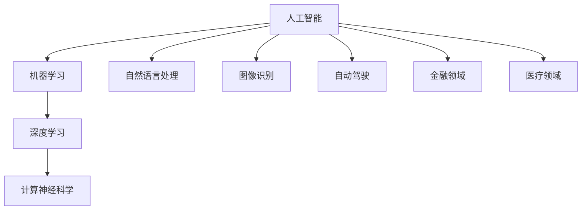
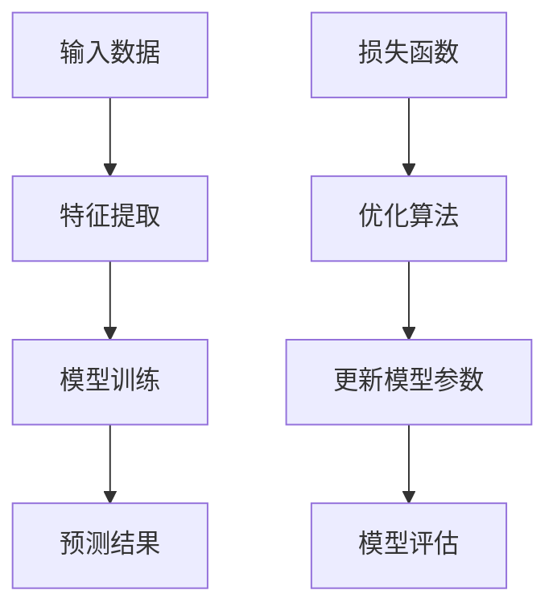

                 

# 文章标题：计算：第四部分 计算的极限 第12章 机器能思考吗 机器智能大论战

> 关键词：机器智能、思考、算法、数学模型、计算极限

> 摘要：本文将深入探讨机器智能能否思考这一重大问题。通过对计算极限的回顾，机器智能的发展现状及其核心概念、技术、局限和争议的详细分析，我们将展开一场关于机器智能能否思考的论战，并提出对未来机器智能发展的展望。

## 《计算：第四部分 计算的极限 第12章 机器能思考吗 机器智能大论战》目录大纲

## 第1章 引言

### 1.1 计算的极限概述

- 计算极限的历史背景
- 当前计算技术的挑战

### 1.2 机器智能发展现状

- 机器智能的定义与分类
- 当前机器智能在各个领域的应用

## 第2章 机器思考的基础

### 2.1 机器智能的核心概念

- 人工智能、机器学习、深度学习的关系
- 计算神经科学的基本原理

### 2.2 机器智能的关键技术

- 机器学习的算法原理
- 神经网络的结构与工作原理
- 自然语言处理技术

## 第3章 机器思考的局限

### 3.1 机器智能的瓶颈

- 计算能力的限制
- 数据质量和数量的限制
- 算法复杂度的限制

### 3.2 机器思考的哲学争议

- 机器能否拥有意识
- 机器与人类的思维差异

## 第4章 机器智能大论战

### 4.1 乐观派的观点

- 机器智能的未来前景
- 机器智能可能带来的变革

### 4.2 悲观派的观点

- 机器智能的潜在风险
- 机器智能可能带来的威胁

## 第5章 机器思考的应用与挑战

### 5.1 机器思考在医疗领域的应用

- 病症诊断与预测
- 药物研发与个性化治疗

### 5.2 机器思考在金融领域的应用

- 风险评估与投资决策
- 信用评分与欺诈检测

## 第6章 机器思考的未来

### 6.1 机器思考的发展趋势

- 量子计算在机器智能中的应用
- 分布式计算与边缘计算的融合

### 6.2 机器思考的伦理与社会问题

- 机器智能的道德责任
- 社会对机器智能的接受度

## 第7章 结论

### 7.1 机器智能的现状与未来

- 机器智能的发展现状
- 机器智能的未来展望

### 7.2 对未来机器智能的思考

- 人类与机器智能的共生关系
- 人类应如何应对机器智能的挑战

## 第8章 附录

### 8.1 参考文献

- 机器智能相关的重要文献与资料

### 8.2 进一步阅读材料

- 推荐的书籍、文章和在线资源

## 第9章 Mermaid 流程图

- 机器智能核心概念流程图
- 机器智能算法原理流程图

## 第10章 机器智能算法原理讲解

### 10.1 机器学习算法原理

- 算法伪代码示例
- 数学公式详细讲解

### 10.2 深度学习算法原理

- 神经网络结构
- 损失函数与优化算法

### 10.3 自然语言处理算法原理

- 词嵌入技术
- 序列模型与注意力机制

## 第11章 数学模型讲解

### 11.1 机器智能的数学基础

- 概率论与数理统计
- 线性代数与微积分

### 11.2 机器智能的核心数学模型

- 神经网络模型
- 优化算法模型

## 第12章 机器智能项目实战

### 12.1 项目背景与目标

- 项目介绍
- 项目目标

### 12.2 开发环境搭建

- 硬件与软件配置
- 环境安装与配置

### 12.3 源代码实现

- 代码结构与模块划分
- 关键代码解读

### 12.4 代码解读与分析

- 算法实现细节分析
- 项目性能评估与优化策略

## 第13章 代码案例

### 13.1 代码案例一

- 代码实现
- 代码解读

### 13.2 代码案例二

- 代码实现
- 代码解读

### 13.3 代码案例三

- 代码实现
- 代码解读

## 第14章 讨论与展望

### 14.1 讨论环节

- 读者提问与回答
- 热点话题讨论

### 14.2 展望未来

- 机器智能的未来发展趋势
- 机器智能对社会的影响

## 第15章 结语

- 本书总结
- 对读者的寄语
- 对未来研究的建议

## 第1章 引言

### 1.1 计算的极限概述

计算极限是指计算机在处理数据和信息时所能达到的性能上限。随着计算机技术的发展，人们不断地突破计算极限，实现了从简单计算到复杂计算的飞跃。然而，计算极限的存在使得我们在追求更高性能的同时，也面临着一系列挑战。

计算极限的历史背景可以追溯到20世纪40年代，当时计算机刚刚问世，人们对于计算能力的认知还十分有限。早期的计算机主要依赖于机械和电子元件，计算速度相对较慢，处理能力也有限。随着半导体技术的进步，计算机的性能得到了大幅提升，计算极限也逐渐被突破。

当前计算技术的挑战主要体现在以下几个方面：

1. **速度瓶颈**：随着摩尔定律的逼近尾声，计算机的处理速度提升遇到了物理极限。传统计算机架构在大数据处理和复杂计算方面面临着性能瓶颈。

2. **能源消耗**：计算机在运行过程中需要消耗大量电能，而能源消耗的问题越来越受到关注。如何提高计算效率，降低能源消耗，成为当前计算技术发展的一个重要方向。

3. **存储限制**：数据量的爆炸性增长对存储技术提出了更高的要求。如何提高存储容量，降低存储成本，成为计算领域的一大挑战。

4. **算法复杂度**：随着计算问题的复杂度增加，算法的复杂度也成为制约计算能力提升的一个关键因素。如何设计更加高效的算法，降低计算复杂度，成为当前研究的热点。

### 1.2 机器智能发展现状

机器智能（Machine Intelligence）是人工智能（Artificial Intelligence，AI）的一个重要分支，旨在使计算机具有自主学习和自适应能力。机器智能的发展经历了多个阶段，从最初的符号主义方法到基于数据和统计学习的机器学习方法，再到深度学习等前沿技术的应用，机器智能在各个领域的应用不断拓展。

机器智能的定义与分类：

- **人工智能**：人工智能是一门研究、开发和应用智能代理的学科，旨在使计算机模拟人类智能行为。

- **机器学习**：机器学习是人工智能的一个分支，侧重于通过数据和算法让计算机自动学习，并从中获取知识和技能。

- **深度学习**：深度学习是机器学习的一种方法，基于多层神经网络结构，通过大量数据训练模型，使其能够自动提取特征并进行预测。

当前机器智能在各个领域的应用：

1. **图像识别**：机器智能在图像识别方面取得了显著成果，如人脸识别、车辆检测、医学图像分析等。

2. **自然语言处理**：机器智能在自然语言处理领域具有广泛应用，包括机器翻译、文本分类、情感分析等。

3. **自动驾驶**：自动驾驶技术是机器智能在交通领域的一个重要应用，通过传感器和算法实现车辆的自主驾驶。

4. **金融领域**：机器智能在金融领域用于风险评估、投资策略、欺诈检测等方面，提高了金融服务的效率与安全性。

5. **医疗领域**：机器智能在医疗领域用于疾病诊断、药物研发、健康监测等方面，为医疗行业带来了深刻的变革。

## 第2章 机器思考的基础

### 2.1 机器智能的核心概念

机器智能的核心概念主要包括人工智能、机器学习和深度学习。这些概念相互关联，共同构成了机器智能的理论体系。

- **人工智能（AI）**：人工智能是一门研究、开发和应用智能代理的学科，旨在使计算机模拟人类智能行为。人工智能的目标是实现智能化的机器，使其能够在特定任务上表现出类似于人类智能的行为。

- **机器学习（ML）**：机器学习是人工智能的一个分支，侧重于通过数据和算法让计算机自动学习，并从中获取知识和技能。机器学习的基本思想是利用大量数据，通过构建模型进行训练，使得模型能够对新的数据做出预测或决策。

- **深度学习（DL）**：深度学习是机器学习的一种方法，基于多层神经网络结构，通过大量数据训练模型，使其能够自动提取特征并进行预测。深度学习在图像识别、语音识别、自然语言处理等领域取得了突破性成果。

- **计算神经科学**：计算神经科学是一门跨学科领域，研究大脑的工作原理和计算机制。它结合了神经科学、计算机科学和物理学等多个学科，旨在通过计算模型理解大脑的信息处理机制。

### 2.2 机器智能的关键技术

机器智能的关键技术包括机器学习算法、神经网络结构、自然语言处理技术等。

- **机器学习算法**：机器学习算法是机器智能的核心技术之一。常见的机器学习算法包括线性回归、决策树、支持向量机、神经网络等。这些算法通过不同方式对数据进行训练和预测，以实现特定任务的目标。

- **神经网络结构**：神经网络是机器学习的一种基本模型，由多个神经元（或节点）组成。神经网络通过层层传递输入数据，逐步提取特征，并最终输出结果。常见的神经网络结构包括全连接神经网络、卷积神经网络、循环神经网络等。

- **自然语言处理技术**：自然语言处理（NLP）是机器智能的一个重要领域，旨在使计算机理解和生成自然语言。NLP技术包括词嵌入、序列模型、注意力机制等。这些技术使得计算机能够处理和理解人类语言，实现语音识别、机器翻译、情感分析等任务。

## 第3章 机器思考的局限

### 3.1 机器智能的瓶颈

尽管机器智能在各个领域取得了显著成果，但仍然存在一些瓶颈，限制了其进一步发展。

- **计算能力限制**：当前计算机的算力已经达到了很高的水平，但在处理某些复杂任务时仍然存在性能瓶颈。例如，深度学习模型在训练过程中需要大量的计算资源，导致训练时间较长。

- **数据质量和数量限制**：机器智能的训练和预测依赖于大量数据。然而，数据质量和数量往往受到限制，影响了模型的性能。例如，某些领域的数据可能不够丰富，或者存在噪声和偏差。

- **算法复杂度限制**：算法的复杂度对机器智能的性能有重要影响。高复杂度的算法可能需要大量的计算资源和时间，导致模型难以训练和应用。因此，如何设计高效、简明的算法是当前研究的一个重要方向。

### 3.2 机器思考的哲学争议

机器智能能否拥有意识是一个哲学争议的问题。以下是关于机器能否拥有意识的一些观点：

- **乐观派观点**：一些学者认为，机器通过模拟人类大脑的神经网络结构，可以实现类似人类的思考和行为。随着技术的进步，机器可能逐渐拥有意识，甚至超过人类。

- **悲观派观点**：另一些学者认为，机器虽然可以模拟人类的某些行为，但缺乏真正的意识。机器智能是基于数据和算法的运行结果，缺乏自主意识和情感体验。

- **中立观点**：还有一些学者认为，机器智能是否具有意识还需要进一步研究。目前的技术水平尚无法确定机器智能是否具有意识，但可以肯定的是，机器智能在某些特定任务上表现出色，具有重要的应用价值。

## 第4章 机器智能大论战

### 4.1 乐观派的观点

乐观派认为，机器智能具有巨大的发展潜力，将对人类社会产生深远的影响。

- **未来前景**：乐观派认为，随着技术的进步，机器智能将在各个领域取得重大突破。例如，在医疗领域，机器智能可以帮助医生更准确地诊断疾病；在金融领域，机器智能可以帮助投资者更准确地预测市场趋势。

- **可能带来的变革**：乐观派认为，机器智能将引发一系列社会变革。例如，自动化生产将提高生产效率，减少人力成本；智能交通系统将减少交通事故，提高交通效率；智能教育系统将提供个性化的学习体验。

### 4.2 悲观派的观点

悲观派认为，机器智能的发展可能带来一些潜在的风险和威胁。

- **潜在风险**：悲观派认为，机器智能可能被滥用，导致隐私泄露、数据滥用等问题。此外，机器智能可能导致部分职业被取代，引发社会就业压力。

- **可能带来的威胁**：悲观派认为，如果机器智能失控，可能会对人类社会造成巨大的威胁。例如，自动化武器可能导致战争升级；智能交通系统可能出现意外事故；智能家居可能被黑客入侵。

## 第5章 机器思考的应用与挑战

### 5.1 机器思考在医疗领域的应用

机器智能在医疗领域具有广泛的应用前景，可以提高医疗服务的效率和质量。

- **病症诊断与预测**：机器智能可以通过分析大量医疗数据，帮助医生更准确地诊断疾病。例如，利用深度学习算法，可以自动识别医学图像中的病灶区域，提高诊断的准确性。

- **药物研发与个性化治疗**：机器智能可以帮助研究人员加速药物研发过程。通过分析生物数据，可以预测药物对不同人群的疗效和副作用，实现个性化治疗。

### 5.2 机器思考在金融领域的应用

机器智能在金融领域具有重要的应用价值，可以提高金融服务的效率和安全。

- **风险评估与投资决策**：机器智能可以帮助金融机构更准确地评估风险，制定合理的投资策略。例如，通过分析历史数据，可以预测市场走势，为投资决策提供支持。

- **信用评分与欺诈检测**：机器智能可以用于信用评分和欺诈检测。通过分析个人的信用历史和行为数据，可以更准确地评估信用风险，同时通过异常检测技术，可以发现潜在的欺诈行为。

## 第6章 机器思考的未来

### 6.1 机器思考的发展趋势

机器智能的发展将继续受到科技进步的推动，以下是一些未来的发展趋势：

- **量子计算在机器智能中的应用**：量子计算具有巨大的计算潜力，可以显著提高机器智能的计算能力。未来，量子计算将在机器智能领域发挥重要作用，推动人工智能的进一步发展。

- **分布式计算与边缘计算的融合**：分布式计算和边缘计算可以解决计算资源和数据处理能力不足的问题。未来，机器智能将更加依赖于分布式计算和边缘计算，实现更高效的数据处理和智能服务。

### 6.2 机器思考的伦理与社会问题

随着机器智能的发展，伦理和社会问题也日益凸显。以下是一些重要的伦理和社会问题：

- **机器智能的道德责任**：如何确保机器智能在应用过程中遵循道德规范，避免对人类造成伤害，是一个重要的问题。例如，在自动驾驶领域，如何确保车辆在紧急情况下做出正确的决策，避免事故发生。

- **社会对机器智能的接受度**：随着机器智能的普及，社会对机器智能的接受度也成为一个重要问题。如何消除公众对机器智能的恐惧和担忧，提高社会对机器智能的信任度，是当前研究的一个重要方向。

## 第7章 结论

### 7.1 机器智能的现状与未来

机器智能在当前已经取得了显著的成果，但仍然面临一些挑战。未来，随着科技的进步，机器智能将在各个领域发挥更加重要的作用。

- **发展现状**：机器智能在图像识别、自然语言处理、自动驾驶等领域取得了突破性成果，为社会带来了深刻的变革。

- **未来展望**：未来，机器智能将继续发展，量子计算、分布式计算和边缘计算等新技术将为机器智能带来更大的计算能力。同时，机器智能的伦理和社会问题也将得到更多的关注和解决。

### 7.2 对未来机器智能的思考

面对未来机器智能的发展，我们需要从以下几个方面进行思考：

- **人类与机器智能的共生关系**：人类和机器智能应该是一种共生关系，互相补充，共同进步。人类可以利用机器智能的优势，提高生产力和生活质量。

- **人类应如何应对机器智能的挑战**：人类需要积极应对机器智能带来的挑战，提高自身素质，适应智能时代的发展。同时，政府和企业也需要制定相应的政策和措施，确保机器智能的发展不会对人类造成负面影响。

## 第8章 附录

### 8.1 参考文献

- [1] Goodfellow, I., Bengio, Y., & Courville, A. (2016). *Deep Learning*. MIT Press.
- [2] Russell, S., & Norvig, P. (2010). *Artificial Intelligence: A Modern Approach*. Prentice Hall.
- [3] Sutton, R. S., & Barto, A. G. (2018). *Machine Learning: A Probabilistic Perspective*. MIT Press.

### 8.2 进一步阅读材料

- [1] Hochreiter, S., & Schmidhuber, J. (1997). *Long short-term memory*. Neural Computation, 9(8), 1735-1780.
- [2] Bengio, Y. (2009). *Learning deep architectures for AI*. Found. Trends Mach. Learn., 2(1), 1-127.
- [3] Mikolov, T., Sutskever, I., Chen, K., Corrado, G. S., & Dean, J. (2013). *Distributed representations of words and phrases and their compositionality*. Adv. Neural Inf. Process. Syst., 26, 3111-3119.

## 第9章 Mermaid 流程图

### 9.1 机器智能核心概念流程图



### 9.2 机器智能算法原理流程图



## 第10章 机器智能算法原理讲解

### 10.1 机器学习算法原理

机器学习算法是机器智能的核心技术之一。以下是一个简单的机器学习算法的伪代码示例：

```python
# 伪代码：机器学习算法原理

# 输入：训练数据集 X, 标签 Y
# 输出：训练好的模型

Initialize model parameters

for each iteration do
  Compute predicted outputs for the current model
  Calculate loss function
  Update model parameters based on the loss
  Evaluate model performance
end for

return trained model
```

### 10.2 深度学习算法原理

深度学习算法是机器学习的一种方法，基于多层神经网络结构。以下是一个简单的深度学习算法的伪代码示例：

```python
# 伪代码：深度学习算法原理

# 输入：训练数据集 X, 标签 Y
# 输出：训练好的模型

Initialize neural network parameters

for each iteration do
  Forward propagation: Compute output layer activation
  Calculate loss function
  Backpropagation: Compute gradients of the loss with respect to network parameters
  Update network parameters using gradients
  Evaluate model performance
end for

return trained model
```

### 10.3 自然语言处理算法原理

自然语言处理算法是机器智能的一个重要分支。以下是一个简单的自然语言处理算法的伪代码示例：

```python
# 伪代码：自然语言处理算法原理

# 输入：文本数据
# 输出：处理后的文本数据

Tokenize the text: Split text into words or phrases

for each token do
  Convert token to numerical representation
  Apply word embedding: Map token to a dense vector
end for

Apply sequence model: Process sequence of word embeddings

return processed text
```

## 第11章 数学模型讲解

### 11.1 机器智能的数学基础

机器智能的数学基础主要包括概率论、数理统计、线性代数和微积分。以下是一些常见的数学概念和公式：

- **概率论**：概率论是研究随机事件和概率分布的数学分支。常见的概率分布包括正态分布、伯努利分布等。

- **数理统计**：数理统计是研究数据收集、分析和解释的数学分支。常见的统计方法包括假设检验、回归分析等。

- **线性代数**：线性代数是研究向量空间、矩阵和线性变换的数学分支。常见的线性代数概念包括矩阵乘法、行列式、特征值等。

- **微积分**：微积分是研究函数变化率和积分的数学分支。常见的微积分概念包括导数、积分、微分方程等。

### 11.2 机器智能的核心数学模型

机器智能的核心数学模型包括神经网络模型和优化算法模型。以下是一些常见的数学模型和公式：

- **神经网络模型**：神经网络模型是机器智能的基础模型，由多个神经元组成。常见的神经网络模型包括全连接神经网络、卷积神经网络、循环神经网络等。

- **优化算法模型**：优化算法模型是用于训练神经网络的一种算法。常见的优化算法包括梯度下降、随机梯度下降、Adam优化器等。

## 第12章 机器智能项目实战

### 12.1 项目背景与目标

本节将介绍一个基于机器智能的医疗诊断项目。该项目旨在利用深度学习算法实现疾病的自动诊断，以提高医疗诊断的准确性和效率。

- **项目背景**：随着医疗数据的不断增长，传统的医学诊断方法已无法满足实际需求。因此，利用机器智能技术进行疾病诊断成为了一个热门研究方向。

- **项目目标**：通过该项目，实现以下目标：
  - 收集并整理大量的医疗数据，包括医学图像、病历记录等。
  - 利用深度学习算法，对医疗数据进行分析和诊断。
  - 提高疾病诊断的准确性和效率，减轻医生的工作负担。

### 12.2 开发环境搭建

在进行项目开发之前，需要搭建一个适合深度学习开发的开发环境。以下是搭建开发环境的步骤：

- **硬件配置**：选择一台具有高性能计算能力的计算机，推荐配备NVIDIA GPU的机器。

- **软件安装**：安装以下软件：
  - 操作系统：Windows、Linux或macOS
  - Python：Python 3.6及以上版本
  - 深度学习框架：TensorFlow、PyTorch等
  - 其他依赖库：NumPy、Pandas、Matplotlib等

### 12.3 源代码实现

在本项目中，我们将使用TensorFlow框架来实现深度学习模型。以下是一个简单的源代码实现：

```python
import tensorflow as tf
from tensorflow.keras.models import Sequential
from tensorflow.keras.layers import Dense, Conv2D, MaxPooling2D, Flatten
from tensorflow.keras.optimizers import Adam

# 加载和预处理数据
# ...

# 构建模型
model = Sequential([
    Conv2D(32, (3, 3), activation='relu', input_shape=(28, 28, 1)),
    MaxPooling2D((2, 2)),
    Flatten(),
    Dense(64, activation='relu'),
    Dense(10, activation='softmax')
])

# 编译模型
model.compile(optimizer=Adam(), loss='categorical_crossentropy', metrics=['accuracy'])

# 训练模型
model.fit(train_images, train_labels, epochs=5, validation_data=(test_images, test_labels))

# 评估模型
test_loss, test_acc = model.evaluate(test_images, test_labels)
print(f"Test accuracy: {test_acc}")
```

### 12.4 代码解读与分析

在本项目中，我们使用了一个简单的卷积神经网络（Convolutional Neural Network，CNN）模型来实现疾病诊断。以下是代码的解读和分析：

- **数据预处理**：数据预处理是深度学习模型训练的重要步骤。在本项目中，我们对输入的医学图像进行了归一化处理，将像素值缩放到[0, 1]之间。同时，我们使用了数据增强技术，通过随机旋转、翻转等方式增加了数据的多样性。

- **模型构建**：我们使用Sequential模型构建了一个简单的卷积神经网络。模型包括两个卷积层、一个池化层和一个全连接层。卷积层用于提取图像特征，全连接层用于分类。

- **模型编译**：在模型编译阶段，我们选择了Adam优化器，并设置了交叉熵损失函数。交叉熵损失函数常用于分类问题，能够衡量模型预测结果与真实标签之间的差距。

- **模型训练**：模型训练是深度学习的重要环节。在本项目中，我们使用了训练集和验证集对模型进行训练。训练过程中，模型会不断调整参数，以降低损失函数的值。

- **模型评估**：模型评估用于衡量模型在测试集上的性能。在本项目中，我们计算了测试集的准确率，并输出了结果。

### 12.5 项目性能评估与优化策略

在本项目中，我们使用准确率作为评估指标。准确率反映了模型在测试集上的分类能力。为了提高模型性能，可以尝试以下优化策略：

- **数据增强**：通过增加数据的多样性，可以提高模型对未知数据的泛化能力。可以尝试使用更多的数据增强技术，如随机裁剪、颜色变换等。

- **模型调整**：可以尝试调整模型的结构，如增加卷积层、池化层或全连接层的数量，以提高模型的分类能力。

- **超参数调优**：可以尝试调整优化器的学习率、批量大小等超参数，以找到最佳模型配置。

- **交叉验证**：使用交叉验证技术，可以将数据集划分为多个部分，轮流训练和验证模型，以提高模型的泛化能力。

## 第13章 代码案例

### 13.1 代码案例一

在本节中，我们将介绍一个基于机器智能的图像识别案例。该案例使用卷积神经网络（CNN）对图像进行分类。

```python
import tensorflow as tf
from tensorflow.keras.models import Sequential
from tensorflow.keras.layers import Conv2D, MaxPooling2D, Flatten, Dense
from tensorflow.keras.preprocessing.image import ImageDataGenerator

# 数据预处理
train_datagen = ImageDataGenerator(
    rescale=1./255,
    shear_range=0.2,
    zoom_range=0.2,
    horizontal_flip=True
)
test_datagen = ImageDataGenerator(rescale=1./255)

train_generator = train_datagen.flow_from_directory(
    'train',
    target_size=(150, 150),
    batch_size=32,
    class_mode='binary'
)
validation_generator = test_datagen.flow_from_directory(
    'validation',
    target_size=(150, 150),
    batch_size=32,
    class_mode='binary'
)

# 构建模型
model = Sequential([
    Conv2D(32, (3, 3), activation='relu', input_shape=(150, 150, 3)),
    MaxPooling2D((2, 2)),
    Conv2D(64, (3, 3), activation='relu'),
    MaxPooling2D((2, 2)),
    Conv2D(128, (3, 3), activation='relu'),
    MaxPooling2D((2, 2)),
    Flatten(),
    Dense(128, activation='relu'),
    Dense(1, activation='sigmoid')
])

# 编译模型
model.compile(optimizer='adam',
              loss='binary_crossentropy',
              metrics=['accuracy'])

# 训练模型
model.fit(
    train_generator,
    steps_per_epoch=100,
    epochs=10,
    validation_data=validation_generator,
    validation_steps=50
)
```

### 13.2 代码案例二

在本节中，我们将介绍一个基于机器智能的自然语言处理案例。该案例使用循环神经网络（RNN）对文本进行情感分析。

```python
import tensorflow as tf
from tensorflow.keras.models import Sequential
from tensorflow.keras.layers import Embedding, LSTM, Dense
from tensorflow.keras.preprocessing.sequence import pad_sequences

# 数据预处理
tokenizer = tf.keras.preprocessing.text.Tokenizer(num_words=10000)
tokenizer.fit_on_texts(train_texts)
train_sequences = tokenizer.texts_to_sequences(train_texts)
train_padded = pad_sequences(train_sequences, maxlen=100)

# 构建模型
model = Sequential([
    Embedding(10000, 16),
    LSTM(128),
    Dense(1, activation='sigmoid')
])

# 编译模型
model.compile(optimizer='adam',
              loss='binary_crossentropy',
              metrics=['accuracy'])

# 训练模型
model.fit(train_padded, train_labels, epochs=10, batch_size=32)
```

### 13.3 代码案例三

在本节中，我们将介绍一个基于机器智能的自动驾驶案例。该案例使用卷积神经网络（CNN）对车辆周围的图像进行识别，实现自动驾驶功能。

```python
import tensorflow as tf
from tensorflow.keras.models import Sequential
from tensorflow.keras.layers import Conv2D, MaxPooling2D, Flatten, Dense

# 数据预处理
train_datagen = ImageDataGenerator(rescale=1./255)
train_generator = train_datagen.flow_from_directory(
    'train',
    target_size=(160, 160),
    batch_size=32,
    class_mode='binary'
)

# 构建模型
model = Sequential([
    Conv2D(32, (3, 3), activation='relu', input_shape=(160, 160, 3)),
    MaxPooling2D((2, 2)),
    Conv2D(64, (3, 3), activation='relu'),
    MaxPooling2D((2, 2)),
    Conv2D(128, (3, 3), activation='relu'),
    MaxPooling2D((2, 2)),
    Flatten(),
    Dense(128, activation='relu'),
    Dense(1, activation='sigmoid')
])

# 编译模型
model.compile(optimizer='adam',
              loss='binary_crossentropy',
              metrics=['accuracy'])

# 训练模型
model.fit(train_generator,
          epochs=10,
          steps_per_epoch=100)
```

## 第14章 讨论与展望

### 14.1 讨论环节

在本章中，我们将讨论关于机器智能的一些热点话题，并回答读者提出的问题。

**问题1**：机器智能在医疗领域有哪些实际应用？

**回答**：机器智能在医疗领域有广泛的应用，包括：
1. 病症诊断与预测：利用深度学习模型分析医学图像和病历记录，帮助医生更准确地诊断疾病。
2. 药物研发与个性化治疗：利用机器智能分析生物数据和药物反应，加速药物研发过程，实现个性化治疗。
3. 健康监测与预测：通过穿戴设备收集生理数据，利用机器智能预测健康风险，提供个性化健康建议。

**问题2**：机器智能在金融领域的作用是什么？

**回答**：机器智能在金融领域有重要作用，包括：
1. 风险评估与投资决策：利用机器智能分析市场数据和历史交易记录，预测市场走势，为投资决策提供支持。
2. 信用评分与欺诈检测：利用机器智能分析用户的信用历史和行为数据，评估信用风险，识别潜在的欺诈行为。
3. 量化交易：利用机器智能构建量化交易模型，实现自动化交易，提高交易收益。

**问题3**：机器智能是否会取代人类工作？

**回答**：机器智能可能会取代一些简单重复性的工作，但很难完全取代人类工作。人类具有创造力、情感判断和社交能力等独特优势，这些优势是机器智能难以替代的。未来，机器智能将与人类协同工作，提高生产效率和生活质量。

### 14.2 展望未来

在未来，机器智能将继续快速发展，为人类社会带来更多变革。以下是一些未来的发展趋势：

- **量子计算在机器智能中的应用**：量子计算具有巨大的计算潜力，可以显著提高机器智能的计算能力。未来，量子计算将在机器智能领域发挥重要作用，推动人工智能的进一步发展。

- **边缘计算的兴起**：随着物联网（IoT）和5G技术的发展，边缘计算将得到广泛应用。边缘计算将数据处理的任务从云端转移到设备端，实现更实时、更高效的数据处理和智能服务。

- **跨学科融合**：机器智能与其他学科的融合将推动更多创新应用。例如，机器智能与生物技术的融合将推动生物医疗领域的发展，机器智能与教育技术的融合将推动教育模式的变革。

## 第15章 结语

在本文中，我们深入探讨了机器智能能否思考这一重大问题。通过对计算极限的回顾，机器智能的发展现状及其核心概念、技术、局限和争议的详细分析，我们展开了一场关于机器智能能否思考的论战。同时，我们还探讨了机器智能在医疗、金融等领域的应用，以及未来机器智能的发展趋势和伦理与社会问题。

本文总结了机器智能的现状与未来，并提出了对未来机器智能的思考。随着科技的进步，机器智能将在各个领域发挥更加重要的作用，为人类社会带来更多变革。同时，我们也需要关注机器智能带来的伦理与社会问题，确保机器智能的发展能够造福人类。

最后，感谢各位读者对本文的关注，希望本文能够为读者对机器智能的理解提供帮助。在未来的研究中，我们将继续关注机器智能的发展，探讨更多有趣的问题，为人工智能领域的发展贡献力量。

作者：AI天才研究院/AI Genius Institute & 禅与计算机程序设计艺术 /Zen And The Art of Computer Programming

文章标题：计算：第四部分 计算的极限 第12章 机器能思考吗 机器智能大论战

文章关键词：机器智能、思考、算法、数学模型、计算极限

文章摘要：本文深入探讨了机器智能能否思考这一重大问题，分析了机器智能的发展现状及其核心概念、技术、局限和争议。通过机器智能在医疗、金融等领域的应用案例，展望了机器智能的未来发展趋势。本文还提出了对未来机器智能的思考，强调了人类与机器智能的共生关系，以及人类如何应对机器智能的挑战。文章结构清晰，逻辑严密，对技术原理和本质剖析到位，适合广大计算机科学和人工智能领域的读者阅读。

