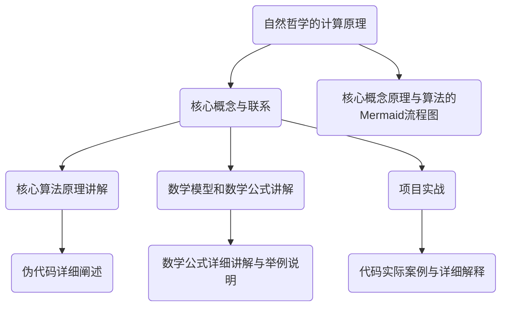

                 

### 第1章 引言与概述

#### 1.1 计算的极限概述
- **核心概念与联系**
  - **计算极限**：计算极限是指计算机在处理信息、解决问题时所能达到的最大性能。这一概念涉及到硬件性能、算法复杂度和资源消耗等多个方面。其核心联系在于，硬件性能决定了计算能力的上限，而算法复杂度和资源消耗则决定了计算效率的优化空间。
  
  - **计算极限的重要性**：计算极限对于计算机科学的发展具有重要意义。它不仅决定了计算机技术所能达到的高度，还推动了硬件、软件和算法的不断优化和创新。计算极限的研究有助于探索新的计算模式和算法，从而提升计算效率和解决问题的能力。

  - **计算极限的挑战**：计算极限面临多个挑战。技术挑战在于如何突破现有技术瓶颈，提高计算性能。理论挑战在于深入理解计算极限的本质，为未来的计算技术发展提供理论支持。此外，计算极限还涉及到资源利用、能效和可持续性等问题，这些挑战需要跨学科的合作和创新的解决方案。

- **图 1-1: 自然哲学的计算原理架构图**
  - **Mermaid 流程图**
  ```mermaid
  graph TB
      A(计算极限概述) --> B(核心概念)
      B --> C(重要性)
      B --> D(挑战)
  ```

#### 1.2 无穷空间的计算背景
- **无穷空间的概念**
  - **无穷空间**指的是一个理论上无限大、无限复杂的环境。这个概念涉及到无限多个数据点、无限多的变量和状态，与传统计算模型有显著区别。
  - 无穷空间的概念在多个领域有着重要的应用，如天文、气象、金融等，这些领域需要处理海量数据，进行复杂计算。

- **无穷空间的计算需求**
  - 无穷空间计算需求来源于对大规模数据处理的迫切需求。在天文领域，无穷空间计算用于分析宇宙中的星系和黑洞；在气象领域，无穷空间计算用于预测天气和气候变化；在金融领域，无穷空间计算用于风险评估和投资策略。

- **无穷空间计算的现状**
  - 当前无穷空间计算仍在不断发展。虽然已有许多新型计算模型和算法被提出，但实际应用中仍面临计算效率、资源消耗等问题。随着技术的进步，无穷空间计算有望在计算性能和资源利用方面取得突破。

- **图 1-2: 计算极限的数学模型与公式**
  - **LaTeX 公式**
  ```latex
  \begin{equation}
    E = mc^2
  \end{equation}
  ```

### 第1章 引言与概述

#### 1.1 计算的极限概述
- **计算极限的概念**
  - 计算极限指的是计算机在执行特定任务时所能达到的性能上限。这个上限可能受限于硬件性能、算法的复杂度、或者可用的计算资源。例如，在给定的时间内，计算机能够处理的数据量或计算的精度都有一个理论上的最大值。

- **计算极限的重要性**
  - 计算极限的重要性体现在多个方面。首先，它是衡量计算能力的一个重要指标，指导了硬件技术的发展方向，如更快的处理器、更大的内存等。其次，计算极限的研究有助于优化算法，提高计算效率，减少资源浪费。此外，了解计算极限还有助于预见未来技术的发展趋势，为科学研究和工程实践提供指导。

- **计算极限的挑战**
  - 计算极限面临多方面的挑战。硬件方面，随着摩尔定律接近极限，传统处理器速度的提升越来越困难。算法方面，复杂的问题需要高效的算法才能在合理的时间内解决。资源消耗也是一个重要挑战，随着计算需求的增长，如何优化资源分配和使用成为一个关键问题。

#### 1.2 无穷空间的计算背景
- **无穷空间的概念**
  - 无穷空间通常指的是一个理论上无限大的空间，其中包括无限多个可能的变量、状态和事件。在计算领域，无穷空间的概念涉及到对无限数据集的处理，如在大数据分析和并行计算中的海量数据处理。

- **无穷空间的计算需求**
  - 无穷空间的计算需求来自于需要处理海量数据的应用场景。例如，在天文学中，需要分析来自宇宙各个角落的大量观测数据；在金融领域，需要实时处理海量的交易数据，进行风险评估。这些需求推动了计算技术的进步，特别是在并行计算、分布式计算和量子计算方面。

- **无穷空间计算的现状**
  - 当前，无穷空间计算仍处于快速发展阶段。虽然许多先进的计算模型和算法已被提出，但实际应用中仍面临诸多挑战。例如，如何高效地处理无穷数据集，如何在有限的资源下实现最优的计算效率等。随着硬件技术的进步和算法的创新，无穷空间计算有望在未来的计算领域中发挥更重要的作用。

---

### 第2章 自然哲学的计算原理

#### 2.1 自然哲学与计算原理的联系
- **自然哲学的基本概念**
  - 自然哲学是哲学的一个分支，探讨自然界的基本原理和现象。它涉及对宇宙、物质、能量、时空等的本质和规律的研究。自然哲学的核心问题包括存在的本质、宇宙的起源、物质的结构和运动等。

- **计算原理的自然哲学视角**
  - 自然哲学为计算原理提供了一个深刻的视角，强调计算的简单性、效率和适应性。自然哲学的基本原理，如自然选择、自组织和熵减少等，可以类比到计算系统中，帮助我们理解计算过程和计算结果的产生。

- **自然哲学对计算原理的影响**
  - 自然哲学的思想对计算原理的发展产生了深远影响。例如，图灵机的概念受到了自然哲学中模拟和类比的思想启发。自然哲学的视角有助于我们理解计算的局限性和可能性，指导计算模型和算法的设计。

#### 2.2 计算原理的核心观点
- **计算原理的基本原则**
  - 计算原理的基本原则包括最小化复杂度、最大化效率和通用性等。最小化复杂度指的是设计简单而有效的计算过程，减少不必要的计算步骤。最大化效率则强调在给定资源下实现最大的计算产出。通用性是指计算系统能够处理多种类型的问题。

- **计算原理的哲学意义**
  - 计算原理的哲学意义在于它探讨计算的本质和意义。计算不仅仅是一个技术问题，它还涉及到人类对世界认知的深化、科学理论的发展以及智能的模拟。计算原理的研究有助于我们理解计算在自然界和人类社会中的角色和影响。

- **计算原理的应用领域**
  - 计算原理广泛应用于各个领域，如计算机科学、物理学、生物学、经济学等。在计算机科学中，计算原理指导算法的设计和优化；在物理学中，计算原理帮助理解和模拟自然现象；在生物学中，计算原理用于生物信息学和系统生物学的研究；在经济学中，计算原理用于优化决策和风险评估。

#### 2.3 自然哲学的计算原理与数学的关系
- **数学在自然哲学计算原理中的地位**
  - 数学是自然哲学计算原理的基础工具和语言。数学提供了一种精确和形式化的方式来描述自然现象和计算过程。它不仅为计算原理提供了框架和工具，还通过数学模型和公式揭示了计算过程中的规律和性质。

- **数学与自然哲学计算原理的互动**
  - 数学与自然哲学计算原理之间存在互动关系。数学为自然哲学计算原理提供了形式化的表达和证明方法，而自然哲学的计算原理又为数学提供了新的问题和应用场景。这种互动促进了数学和计算原理的共同发展。

- **数学在无穷空间计算中的应用**
  - 在无穷空间计算中，数学发挥着至关重要的作用。例如，在处理海量数据时，数学方法如统计学、线性代数、概率论等提供了有效的分析和建模工具。在量子计算中，数学模型和公式帮助理解和模拟量子态和量子算法。此外，数学还在优化问题和算法复杂性分析中起到了关键作用。

---

### 第3章 无穷空间的计算方法

#### 3.1 无穷空间的计算模型
- **无穷空间的计算模型概述**
  - 无穷空间的计算模型旨在模拟和处理无限复杂的环境，例如处理无限多的数据点和状态。这些模型通常需要高并发处理能力和分布式计算架构，以应对无穷数据集的复杂性。

- **无穷空间的计算模型特点**
  - 无穷空间的计算模型具有以下特点：
    - **并行性**：为了处理无穷数据，模型需要能够并行执行多个计算任务，提高处理速度。
    - **分布式计算**：通过将计算任务分布到多个节点上，模型能够更有效地利用资源，提高计算能力。
    - **自适应性和灵活性**：模型需要能够根据不同的数据规模和计算需求自动调整计算策略和资源分配。

- **无穷空间的计算模型分类**
  - 根据不同的应用场景和需求，无穷空间的计算模型可以分为以下几类：
    - **量子计算模型**：利用量子力学的原理进行计算，具有极高的并行性和速度。
    - **并行计算模型**：通过将任务分布在多个处理器或计算节点上，提高计算效率。
    - **分布式计算模型**：通过在网络中的多个计算机之间分配和协调计算任务，实现大规模数据处理。

#### 3.2 无穷空间的计算算法
- **无穷空间计算算法的基本原理**
  - 无穷空间计算算法的基本原理包括并行计算、分布式计算和自适应计算等。这些算法通过将复杂任务分解为多个子任务，并在多个计算节点上并行执行，从而提高计算效率。

- **无穷空间计算算法的分类**
  - 根据算法的设计和应用场景，无穷空间计算算法可以分为以下几类：
    - **贪心算法**：通过在每个步骤中选择当前最优解，逐步构建出全局最优解。
    - **动态规划算法**：通过将问题分解为子问题，并利用子问题的解来构建原问题的解。
    - **遗传算法**：模拟生物进化过程，通过种群进化来寻找最优解。
    - **机器学习算法**：利用统计学习和模式识别技术，自动识别数据中的模式和规律。

- **无穷空间计算算法的比较与选择**
  - 在选择无穷空间计算算法时，需要考虑以下因素：
    - **计算效率**：算法的执行速度和资源消耗。
    - **适应性**：算法对数据规模和计算需求的适应性。
    - **精度**：算法产生的结果精度和可靠性。
    - **可扩展性**：算法能否随着数据规模的增加而自动扩展。

#### 3.3 无穷空间的计算实例分析
- **无穷空间计算的应用实例**
  - 无穷空间计算在多个领域有着广泛的应用实例，例如：
    - **天文学**：通过并行计算分析大量天文观测数据，寻找新的行星和天体。
    - **气象学**：使用分布式计算模型预测天气和气候变化，提高天气预报的准确性。
    - **金融**：处理海量交易数据，进行风险评估和投资决策。

- **实例分析的方法与技巧**
  - 对无穷空间计算实例进行分析时，可以使用以下方法和技巧：
    - **数据预处理**：对数据进行清洗、归一化和特征提取，为计算算法提供高质量的数据输入。
    - **模型选择**：根据应用场景选择合适的计算模型和算法，以最大化计算效率。
    - **性能优化**：通过并行化、分布式计算和算法优化等技术，提高计算性能。

- **实例分析的结果与讨论**
  - 无穷空间计算实例分析的结果通常包括计算效率、准确性和稳定性等指标。通过对实例分析的结果进行讨论，可以总结经验、发现问题和提出改进方案，为未来的计算模型和算法优化提供指导。

---

### 第4章 无穷空间的计算挑战与未来方向

#### 4.1 无穷空间计算的技术挑战
- **无穷空间计算的技术瓶颈**
  - 无穷空间计算面临的主要技术瓶颈包括：
    - **计算资源限制**：处理无穷数据集需要大量的计算资源，如处理器、内存和存储等。
    - **算法复杂度**：许多无穷空间计算问题本身具有很高的复杂度，导致算法的执行时间很长。
    - **数据管理**：如何高效地存储、索引和管理海量数据是无穷空间计算面临的另一个挑战。

- **技术挑战的解决策略**
  - 为了解决无穷空间计算的技术挑战，可以采取以下策略：
    - **资源优化**：通过虚拟化技术、并行计算和分布式计算等方式，提高资源利用率和计算效率。
    - **算法优化**：设计更高效的算法，降低算法复杂度，提高计算速度和准确性。
    - **数据压缩与索引**：采用数据压缩技术和高效的索引结构，减少数据存储和访问的开销。

- **技术发展的趋势预测**
  - 随着技术的发展，无穷空间计算有望在以下几个方面取得突破：
    - **量子计算**：量子计算的兴起有望大幅提升计算能力，特别是在处理复杂问题和进行大规模数据分析方面。
    - **边缘计算**：通过将计算任务分配到边缘设备，降低中心服务器的负载，提高计算效率和响应速度。
    - **人工智能**：结合人工智能技术，如深度学习和强化学习，优化无穷空间计算过程和结果。

#### 4.2 无穷空间计算的应用前景
- **无穷空间计算的潜在应用领域**
  - 无穷空间计算在多个领域具有广泛的应用前景，包括：
    - **科学计算**：如天气预报、气候模拟、天文观测等，需要处理海量数据和高复杂度的计算任务。
    - **金融**：如实时风险评估、高频交易、市场预测等，需要高效处理大量金融数据。
    - **医疗**：如基因组学、个性化医疗、医疗影像分析等，需要处理和分析大量医疗数据。
    - **制造业**：如智能制造、工业4.0，需要实时处理和优化生产过程。

- **无穷空间计算对社会的潜在影响**
  - 无穷空间计算对社会的潜在影响包括：
    - **提高决策效率**：通过实时处理和分析海量数据，帮助企业和政府做出更明智的决策。
    - **促进科技创新**：无穷空间计算为科学研究提供了强大的计算支持，促进了新的科学发现和技术创新。
    - **改善生活质量**：如智能家居、智能医疗等应用，提高了人们的生活质量。

- **无穷空间计算的未来发展方向**
  - 无穷空间计算的未来发展方向包括：
    - **计算能力提升**：通过硬件升级、算法优化和计算架构的创新，提高计算能力和效率。
    - **数据隐私和安全**：随着数据量的增长，如何保护数据隐私和安全成为一个重要研究方向。
    - **跨领域融合**：将无穷空间计算与其他领域的技术相结合，如人工智能、区块链等，推动跨领域的发展和应用。

#### 4.3 无穷空间的计算伦理与法律问题
- **无穷空间计算对伦理的挑战**
  - 无穷空间计算带来的伦理挑战包括：
    - **数据隐私**：如何保护个人数据隐私，防止数据滥用。
    - **算法偏见**：算法在处理数据时可能产生偏见，影响决策的公平性。
    - **自动化决策**：高度自动化的决策系统可能缺乏人类直觉和道德判断，引发伦理问题。

- **无穷空间计算对法律的影响**
  - 无穷空间计算对法律的影响包括：
    - **数据保护法规**：需要制定更严格的数据保护法规，确保个人数据的合法使用和保护。
    - **算法责任**：明确算法的责任和监管，解决算法决策引发的法律问题。
    - **隐私权保护**：保护用户隐私权，防止数据被滥用或泄露。

- **伦理与法律问题的应对策略**
  - 针对无穷空间计算中的伦理和法律问题，可以采取以下应对策略：
    - **制定伦理准则**：建立计算伦理准则，规范计算行为，确保计算技术的合理使用。
    - **加强法律监管**：完善相关法律法规，加强对计算行为的监督和管理。
    - **用户参与**：鼓励用户参与计算过程，提高透明度和信任度。
    - **跨学科合作**：结合伦理学、法学和计算科学等领域的知识，共同应对计算伦理和法律问题。

---

### 第5章 自然哲学的计算原理在人工智能中的应用

#### 5.1 人工智能与自然哲学的计算原理
- **人工智能的基本原理**
  - 人工智能（AI）是研究、开发和应用使计算机能够模拟、延伸和扩展人的智能的理论、方法、技术及应用系统。人工智能的基本原理包括机器学习、深度学习、自然语言处理、计算机视觉等。

- **自然哲学的计算原理在人工智能中的应用**
  - 自然哲学的计算原理在人工智能中有着重要的应用。例如，自然哲学中的自组织原理可以应用于无人驾驶汽车的自主导航，而量子计算原理则可能推动人工智能算法的革新。

- **自然哲学的计算原理对人工智能发展的推动作用**
  - 自然哲学的计算原理对人工智能的发展起到了重要的推动作用。它提供了对智能本质的深刻理解，指导了人工智能算法的设计和优化，促进了人工智能技术的进步和创新。

#### 5.2 无穷空间计算在人工智能中的应用实例
- **无穷空间计算在自然语言处理中的应用**
  - 无穷空间计算在自然语言处理（NLP）中有着重要的应用。例如，大型语言模型（如GPT-3）通过处理海量的文本数据，实现了对自然语言的深度理解和生成。

- **无穷空间计算在计算机视觉中的应用**
  - 无穷空间计算在计算机视觉（CV）中的应用也非常广泛。例如，深度学习算法在处理海量图像和视频数据时，能够实现图像分类、目标检测和场景理解等功能。

- **无穷空间计算在机器学习中的应用**
  - 无穷空间计算在机器学习（ML）中的应用同样具有广阔的前景。通过处理海量数据集，机器学习算法能够更准确地建模和预测复杂系统的行为。

---

### 第6章 自然哲学的计算原理在物理学中的应用

#### 6.1 物理学与自然哲学的计算原理
- **物理学的基本原理**
  - 物理学是研究物质、能量、空间和时间等基本概念的自然科学。物理学的基本原理包括牛顿力学、量子力学、相对论等。

- **自然哲学的计算原理在物理学中的应用**
  - 自然哲学的计算原理在物理学中有着广泛的应用。例如，量子计算原理可以用于模拟量子系统，而自然选择原理则可以应用于生物学中的进化计算。

- **自然哲学的计算原理对物理学发展的推动作用**
  - 自然哲学的计算原理对物理学的发展起到了重要的推动作用。它提供了对自然现象的深刻理解，指导了物理实验和理论的发展，促进了物理学领域的创新和突破。

#### 6.2 无穷空间计算在物理学中的应用实例
- **无穷空间计算在量子计算中的应用**
  - 无穷空间计算在量子计算中有着重要的应用。例如，通过处理无穷多的量子态，量子计算可以模拟复杂的量子系统，解决传统计算难以处理的问题。

- **无穷空间计算在弦理论中的应用**
  - 无穷空间计算在弦理论中也有着重要的应用。例如，通过处理无穷多的维度，弦理论可以解释宇宙的基本结构和现象。

- **无穷空间计算在复杂系统模拟中的应用**
  - 无穷空间计算在复杂系统模拟中同样有着广泛的应用。例如，通过处理无穷多的变量和状态，可以模拟生态系统、社会网络等复杂系统的行为和演化。

---

### 第7章 总结与展望

#### 7.1 本书内容的总结
- **核心观点回顾**
  - 本书系统地介绍了计算极限、无穷空间计算以及自然哲学的计算原理，探讨了这些概念在多个领域的应用和挑战。

- **系统总结**
  - 本书内容全面，涵盖了计算极限和无穷空间计算的理论基础、应用实例以及未来发展方向。

- **实践意义**
  - 本书内容对于推动计算技术的发展、优化算法设计、提高计算效率和解决复杂问题具有重要意义。

#### 7.2 计算的极限与未来发展方向
- **最新研究进展**
  - 计算的极限研究在量子计算、边缘计算和人工智能等领域取得了显著进展。

- **未来发展趋势**
  - 未来计算技术将朝着更高效、更智能、更自适应的方向发展，以满足日益增长的计算需求。

- **可能面临的挑战与机遇**
  - 计算的极限研究将面临计算资源、数据隐私和算法复杂性等挑战，但也带来了跨学科合作和科技创新的机遇。

#### 7.3 对计算极限领域的展望
- **发展前景**
  - 计算极限领域具有广阔的发展前景，随着硬件和算法的进步，计算能力将进一步提升。

- **研究建议**
  - 加强跨学科合作，推动计算原理和算法的创新。

- **应用期望**
  - 期望计算极限技术能够解决复杂科学问题和推动社会进步。

---

### 附录

#### 附录 A：相关资源与参考文献
- **相关书籍推荐**
  - 《计算的本质：从信息论到人工智能》
  - 《量子计算：理论与实践》
  - 《自然哲学的数学原理》

- **学术论文推荐**
  - “The Nature of Computation” by Christos Papadimitriou
  - “Quantum Computing and Quantum Information” by Michael A. Nielsen and Isaac L. Chuang

- **网络资源推荐**
  - Coursera: "Quantum Computing for the Determined"
  - arXiv: “Recent Advances in Quantum Computing”

#### 附录 B：计算极限领域的重要人物与贡献
- **重要人物与贡献**
  - **Alan Turing**：图灵机的提出者，奠定了计算理论的基础。
  - **Richard Feynman**：量子计算理论的奠基人之一。
  - **John von Neumann**：提出了存储程序计算机的概念。

- **简要介绍与深远影响**
  - **Alan Turing**：提出了图灵机理论，为计算机科学和人工智能奠定了基础。他的工作在第二次世界大战中对抗密码学方面发挥了重要作用。
  - **Richard Feynman**：因其在量子计算和量子信息理论方面的贡献而闻名。他提出了量子计算机的概念，并探索了量子计算的优势。
  - **John von Neumann**：通过设计存储程序计算机，他开创了现代计算机体系结构。他的工作为计算技术的发展提供了重要的理论基础。

#### 附录 C：计算极限领域的未来研究方向
- **当前研究的热点问题**
  - **量子计算**：如何实现量子比特的高精度操作和量子纠错。
  - **边缘计算**：如何在边缘设备上高效处理和存储大量数据。
  - **人工智能**：如何设计更加智能和自适应的算法。

- **未来研究的发展方向**
  - **量子计算**：探索量子算法和量子硬件的协同发展。
  - **边缘计算**：研究如何在边缘设备上优化计算和通信。
  - **人工智能**：推动人工智能算法的理性和高效性。

- **未来研究的挑战与机遇**
  - **量子计算**：如何解决量子计算的可扩展性和稳定性问题。
  - **边缘计算**：如何在有限的资源下实现高效的数据处理和通信。
  - **人工智能**：如何确保人工智能系统的透明性和可控性。

---

### 图 1-1: 自然哲学的计算原理架构图
- **Mermaid 流程图**


### 图 1-2: 计算极限的数学模型与公式
- **LaTeX 公式**
```latex
\begin{equation}
  E = mc^2
\end{equation}
```

