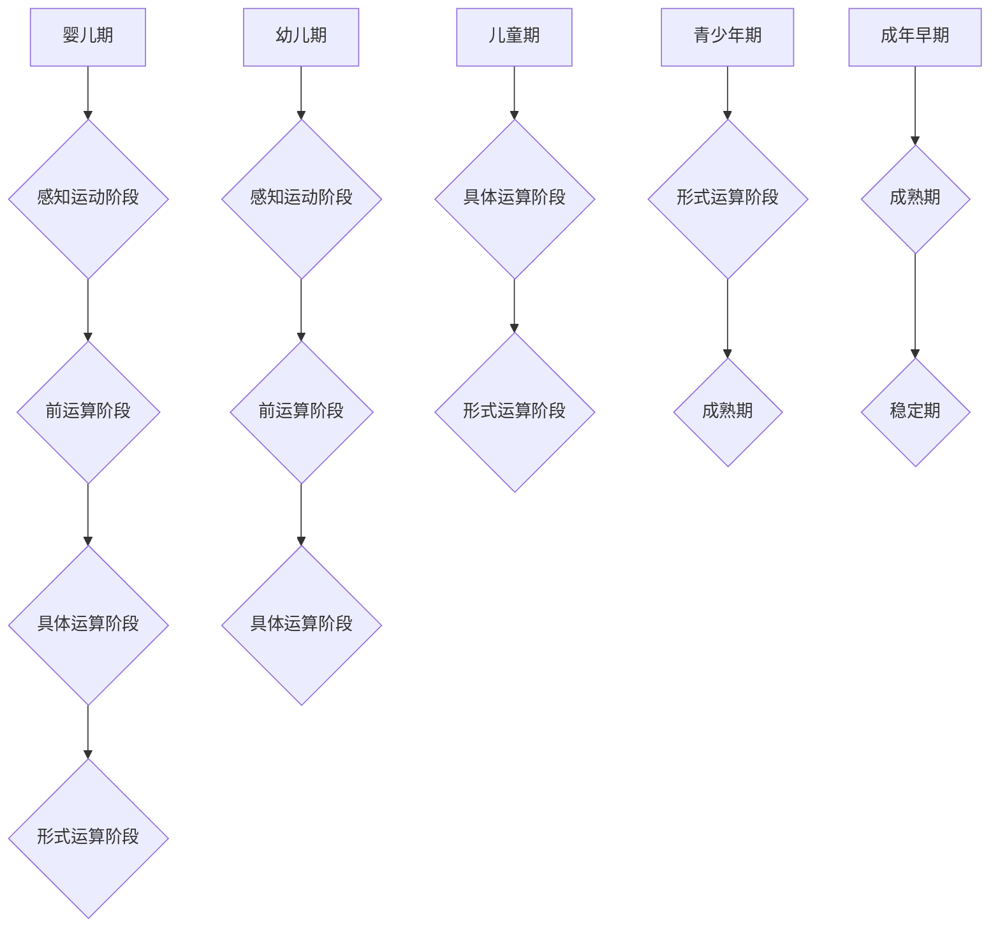

                 

## 文章标题：认知渐进发展的阶段性理论

> 关键词：认知渐进发展、阶段性理论、认知发展心理学、教育应用、心理咨询、跨学科应用

> 摘要：本文围绕认知渐进发展的阶段性理论展开，首先介绍了认知渐进发展的概念、背景与意义，然后深入探讨了认知渐进发展的理论基础和研究方法。随后，文章详细分析了不同阶段的认知发展特征及其关键期，包括婴儿期、幼儿期、儿童期、青少年期和成年早期。最后，文章探讨了认知渐进发展在教育、心理咨询以及跨学科领域的实践应用，并对未来进行了展望。通过本文的阅读，读者将深入了解认知渐进发展的理论体系及其在现实生活中的应用价值。

### 第1章：引言

#### 1.1 认知渐进发展的概念

认知渐进发展是指个体在成长过程中，其认知能力逐渐成熟和提高的过程。这一理论强调，个体的认知发展是一个连续、有序且阶段性的过程，每个阶段都有其独特的认知特征和关键期。认知渐进发展理论起源于20世纪60年代的认知发展心理学，其代表人物如皮亚杰（Jean Piaget）和维果茨基（Lev Vygotsky）对儿童认知发展的研究，为认知渐进发展理论奠定了基础。

认知渐进发展的核心概念包括：

1. **阶段性与连续性**：个体的认知发展具有阶段性，每个阶段有其特定的认知结构和功能，同时各个阶段之间又存在连续性，前一阶段的认知发展为后一阶段奠定基础。

2. **关键期**：关键期是指个体在特定年龄段内，某项认知能力发展最为迅速的时期。错过关键期，相关能力的培养和发展可能会受到影响。

3. **适应性与灵活性**：认知渐进发展不仅关注个体的认知结构，还强调个体在环境适应中的灵活性和创造性。

#### 1.2 认知渐进发展的历史背景

认知渐进发展理论的历史可以追溯到20世纪初期，当时心理学家们开始关注儿童的认知发展问题。皮亚杰是这一领域的重要人物，他提出了“发生认识论”（genetic epistemology）的概念，主张认知发展是通过对环境和经验的适应而产生的。皮亚杰将儿童的认知发展划分为四个阶段：感知运动阶段、前运算阶段、具体运算阶段和形式运算阶段。

维果茨基则提出了“文化-历史发展理论”，强调社会互动和文化背景在认知发展中的作用。他认为，认知发展不仅是个体内部过程，还与社会互动密切相关，通过语言和其他符号系统，个体能够获得和传递文化经验。

进入20世纪60年代，认知渐进发展理论逐渐受到重视，并被广泛应用于教育、心理学和认知科学等领域。近年来，随着认知神经科学的发展，人们对认知渐进发展的理解和应用也有了新的进展。

#### 1.3 认知渐进发展的现实意义

认知渐进发展理论在现实世界中具有重要的应用价值，主要体现在以下几个方面：

1. **教育**：认知渐进发展理论为教育实践提供了理论依据，帮助教育工作者更好地理解学生的认知特点和发展需求，从而设计更有效的教学策略和方法。

2. **心理咨询**：通过了解个体在不同阶段的认知发展特征，心理咨询师可以更准确地评估个体的认知状态，制定个性化的干预方案，帮助个体克服认知发展中的障碍。

3. **跨学科研究**：认知渐进发展理论为多个学科领域提供了共同的研究基础，促进了认知科学、教育心理学、认知神经科学等领域的交叉融合。

4. **社会发展**：认知渐进发展理论有助于我们理解个体在社会中的角色和功能，为制定社会政策、促进社会公平和提升社会福祉提供科学依据。

### 第2章：认知渐进发展的理论基础

#### 2.1 认知发展心理学的基本理论

认知发展心理学是研究个体认知能力如何随时间发展的学科。其核心理论包括皮亚杰的发生认识论和维果茨基的文化-历史发展理论。

**皮亚杰的发生认识论**

皮亚杰的发生认识论主要关注儿童认知发展的内在机制，他认为认知发展是由同化和顺应两种基本过程驱动的。同化是指个体将外界信息整合到已有的认知结构中；顺应是指个体调整或重构已有认知结构以适应新信息。皮亚杰将儿童的认知发展划分为四个阶段：

1. **感知运动阶段（0-2岁）**：个体主要通过感知和运动来理解世界。
2. **前运算阶段（2-7岁）**：个体开始使用符号和语言，但思维仍然以自我为中心，不能理解他人的观点。
3. **具体运算阶段（7-11岁）**：个体能够进行逻辑思维，理解守恒原理和分类，但思维仍依赖于具体情境。
4. **形式运算阶段（11岁及以上）**：个体能够进行抽象思维和假设推理，理解复杂概念和逻辑关系。

**维果茨基的文化-历史发展理论**

维果茨基的文化-历史发展理论强调社会互动和文化背景在认知发展中的作用。他认为，认知发展不仅仅是个体内部的过程，还受到社会文化因素的影响。维果茨基提出了“最近发展区”（ZPD）的概念，即个体在他人帮助下可以达到的认知发展水平与其独立发展的认知水平之间的差距。最近发展区揭示了社会互动在认知发展中的关键作用。

#### 2.2 认知渐进发展的理论基础

认知渐进发展的理论基础主要建立在皮亚杰和维果茨基的理论之上，同时结合了认知科学、神经科学和心理学的研究成果。

**认知渐进发展的理论框架**

认知渐进发展理论认为，认知发展是一个连续、有序且阶段性的过程，每个阶段都有其独特的认知结构和功能。这一过程受到遗传、环境、社会和文化等多种因素的影响。认知渐进发展理论将认知发展划分为多个阶段，每个阶段都有其特定的认知特征和关键期。

**关键期与敏感期**

关键期和敏感期是认知渐进发展的核心概念。关键期是指个体在特定年龄段内，某项认知能力发展最为迅速的时期。敏感期则是指个体在特定年龄段内，对某些经验和学习特别敏感的时期。关键期和敏感期强调认知发展的时效性，错过这些时期，相关的认知能力培养和发展可能会受到影响。

**认知结构的变化**

认知渐进发展理论认为，个体的认知结构随着发展阶段的不同而发生变化。每个阶段的认知结构都有其独特的组织方式，前一阶段的认知结构为后一阶段的认知发展奠定基础。这种认知结构的变化是认知渐进发展的关键特征。

#### 2.3 认知渐进发展的相关研究方法

认知渐进发展的研究方法主要包括实验研究、观察研究和跨学科研究。

**实验研究**

实验研究是认知渐进发展研究的主要方法之一。通过设计控制实验，研究者可以观察和测量个体在不同阶段的认知能力和行为表现。实验研究通常包括认知任务、行为观察、认知测试和脑成像技术等。

**观察研究**

观察研究是另一种重要的认知渐进发展研究方法。通过观察个体在不同环境中的行为和表现，研究者可以深入了解其认知发展的过程和特点。观察研究通常包括自然观察和实验室观察，以及记录和分析个体在特定情境中的行为。

**跨学科研究**

认知渐进发展涉及多个学科领域，如认知科学、心理学、神经科学和教育学。跨学科研究通过整合不同学科的理论和方法，可以更全面地理解认知渐进发展的机制和影响。例如，认知神经科学结合脑成像技术和心理学研究方法，可以揭示认知发展的神经基础。

### 第3章：婴儿期的认知发展

#### 3.1 婴儿期的认知发展特点

婴儿期是认知发展的关键阶段，这一时期的个体在认知上表现出显著的特点和变化。以下是婴儿期认知发展的主要特点：

**感知与运动技能的发展**

婴儿期的认知发展首先体现在感知和运动技能的逐步成熟。在出生后的头几个月，婴儿主要通过视觉、听觉和触觉来感知外部世界。他们能够识别熟悉的面孔，区分不同的声音，并开始学习控制自己的动作，如抓握和翻滚。

**空间认知的发展**

婴儿期的空间认知能力逐渐发展，他们开始理解物体的三维空间关系，能够区分上下、前后和左右。这种空间认知的发展对后续的智力发展具有重要意义。

**语言能力的萌芽**

在婴儿期，语言能力开始萌芽。婴儿通过模仿成人的语音和语调，逐渐掌握基本的语言规则和词汇。虽然他们刚开始只能发出简单的音节，但这一阶段的语言学习为其后续的语言发展奠定了基础。

**记忆能力的发展**

婴儿期的记忆能力也在不断发展。他们能够记住熟悉的事物和情境，并通过重复学习和强化记忆来巩固这些记忆。这种记忆能力的发展有助于婴儿在认知过程中更好地组织和理解信息。

**自我意识的形成**

婴儿期的自我意识逐渐形成。他们开始意识到自己与他人之间的差异，并逐渐建立自我认同。这一过程对个体的社会行为和情感发展具有重要影响。

#### 3.2 婴儿期的认知发展阶段

婴儿期的认知发展阶段可以分为以下几个阶段：

**感知运动阶段（0-6个月）**

在感知运动阶段，婴儿主要通过感知和运动来探索世界。他们开始学会控制自己的动作，如抓握和翻滚，并通过这些动作来感知外部环境。

**探索与发现阶段（6-12个月）**

在探索与发现阶段，婴儿的感知和运动技能进一步发展，他们开始尝试不同的动作和游戏，如爬行、跳跃和扔东西。这一阶段也是语言能力迅速发展的时期，婴儿开始尝试模仿成人的语言。

**认知形成阶段（12-24个月）**

在认知形成阶段，婴儿的思维能力逐渐发展，他们开始理解简单的因果关系，如物体消失和重现。此外，婴儿开始表现出记忆能力，能够记住熟悉的事物和情境。

**自我意识萌芽阶段（24-36个月）**

在自我意识萌芽阶段，婴儿的自我意识逐渐形成，他们开始意识到自己与他人之间的差异，并尝试通过语言和行为表达自己的需求和情感。

#### 3.3 婴儿期的认知发展关键期

婴儿期的认知发展关键期是指在这一时期内，婴儿的某些认知能力发展最为迅速的时期。以下是婴儿期的一些关键期：

**语言能力关键期**

语言能力在婴儿期的发展非常迅速，尤其是在出生后的前几年。错过这个关键期，儿童的语言能力可能会受到永久性的影响。因此，家庭和幼儿园应该为婴儿提供丰富的语言环境，鼓励他们多听、多说，从而促进语言能力的全面发展。

**空间认知关键期**

空间认知能力在婴儿期的发展也非常迅速。婴儿在出生后的前几个月开始学习区分上下、前后和左右，这一过程在12个月左右达到高峰。提供丰富的视觉刺激和运动机会，如玩具和游戏，可以有效地促进婴儿的空间认知能力。

**记忆能力关键期**

记忆能力在婴儿期的关键期大约在18个月左右。在这个时期，婴儿的记忆能力发展迅速，他们能够记住熟悉的事物和情境。通过重复学习和强化记忆，可以进一步巩固婴儿的记忆能力。

### 第4章：幼儿期的认知发展

#### 4.1 幼儿期的认知发展特点

幼儿期是儿童认知发展的关键阶段，这一时期的个体在认知上表现出显著的特点和变化。以下是幼儿期认知发展的主要特点：

**感官和运动能力的发展**

幼儿期的儿童在感官和运动能力方面继续发展。他们能够更精确地控制自己的动作，如奔跑、跳跃和攀爬。同时，他们的感官能力也变得更加敏锐，能够更好地区分颜色、形状和声音。

**语言能力的提升**

幼儿期的儿童语言能力迅速提升，他们开始掌握更多的词汇，并能使用复杂的句子进行表达。这一阶段也是语言习得的关键期，儿童通过模仿和与他人的交流，逐渐掌握语法规则和词汇。

**思维能力的提升**

幼儿期的儿童思维能力逐渐提升，他们开始理解抽象概念，如数字和形状。他们能够进行简单的逻辑推理，如分类和排序。这一阶段也是儿童认知结构发展的关键期，他们开始形成更加复杂的认知结构。

**社会认知能力的发展**

幼儿期的儿童社会认知能力也在快速发展。他们开始理解他人的情感和需求，学会分享和合作。这一阶段也是儿童自我意识和社会意识形成的关键期。

**记忆能力的发展**

幼儿期的儿童记忆能力继续发展，他们能够记住更多的信息，并通过重复学习和强化记忆来巩固这些记忆。这一阶段也是儿童记忆策略发展的关键期，他们开始学会使用记忆技巧来帮助记忆。

#### 4.2 幼儿期的认知发展阶段

幼儿期的认知发展阶段可以分为以下几个阶段：

**初步认知阶段（3-4岁）**

在初步认知阶段，儿童开始理解简单概念，如数字、颜色和形状。他们能够进行简单的分类和排序，并通过游戏和日常生活经验来巩固这些认知。

**感知运动阶段（4-5岁）**

在感知运动阶段，儿童的感官和运动能力继续发展，他们能够更好地控制自己的动作，并进行更复杂的运动任务，如跳跃和攀爬。同时，他们的感知能力也变得更加敏锐，能够区分更细微的颜色和声音。

**概念形成阶段（5-6岁）**

在概念形成阶段，儿童开始理解更复杂的抽象概念，如空间关系、时间和因果关系。他们能够进行更复杂的逻辑推理，如分类和排序。这一阶段也是儿童语言能力迅速提升的时期。

**社会认知阶段（6-7岁）**

在社会认知阶段，儿童开始理解他人的情感和需求，学会分享和合作。他们开始形成更复杂的认知结构，并能够更好地理解和解释社会行为。

#### 4.3 幼儿期的认知发展关键期

幼儿期的认知发展关键期是指在这一时期内，儿童的某些认知能力发展最为迅速的时期。以下是幼儿期的一些关键期：

**语言能力关键期**

语言能力在幼儿期的关键期大约在3-6岁之间。在这一时期，儿童的语言能力发展迅速，他们能够掌握更多的词汇和语法规则。提供丰富的语言环境和互动机会，如阅读故事和对话，可以有效地促进儿童的语言能力发展。

**思维能力关键期**

思维能力在幼儿期的关键期大约在4-7岁之间。在这一时期，儿童开始理解更复杂的抽象概念，并进行更复杂的逻辑推理。通过提供挑战性和启发性的学习材料，如数学游戏和科学实验，可以促进儿童的思维能力发展。

**社会认知能力关键期**

社会认知能力在幼儿期的关键期大约在4-7岁之间。在这一时期，儿童开始理解他人的情感和需求，学会分享和合作。通过参与团队合作活动和社交游戏，可以促进儿童的社会认知能力发展。

### 第5章：儿童期的认知发展

#### 5.1 儿童期的认知发展特点

儿童期是认知发展的关键时期，这一时期的个体在认知上表现出显著的特点和变化。以下是儿童期认知发展的主要特点：

**逻辑思维的发展**

儿童期的儿童开始发展逻辑思维能力，他们能够进行简单的分类、排序和推理。他们开始理解因果关系，能够通过观察和实验来验证自己的假设。

**抽象思维能力的提升**

随着儿童认知能力的提升，他们开始掌握更复杂的抽象概念，如数字、符号和公式。他们能够进行更复杂的数学运算和逻辑推理。

**记忆能力的发展**

儿童期的儿童记忆能力继续发展，他们能够记住更多的信息，并通过重复学习和强化记忆来巩固这些记忆。他们开始使用记忆策略，如联想记忆和分类记忆。

**社会认知能力的发展**

儿童期的儿童社会认知能力也在不断发展，他们开始理解他人的情感和需求，学会分享和合作。他们开始形成更复杂的认知结构，能够更好地理解和解释社会行为。

**自我意识的形成**

在儿童期，儿童的自我意识逐渐形成，他们开始认识到自己与他人之间的差异，并逐渐建立自我认同。他们开始理解社会规则和道德标准，学会自律和自我控制。

#### 5.2 儿童期的认知发展阶段

儿童期的认知发展阶段可以分为以下几个阶段：

**初期阶段（6-8岁）**

在初期阶段，儿童的认知发展主要表现在逻辑思维和抽象思维能力的发展。他们开始理解简单的因果关系，能够进行简单的分类和排序。他们的记忆能力也在提升，能够记住更多的信息。

**中期阶段（8-11岁）**

在中期阶段，儿童的认知发展进入一个新的阶段，他们开始掌握更复杂的抽象概念，如数字、符号和公式。他们的逻辑思维能力进一步提升，能够进行更复杂的数学运算和逻辑推理。他们的记忆能力也继续发展，能够记住更多的信息。

**后期阶段（11-14岁）**

在后期阶段，儿童的认知发展进入一个新的高峰。他们的抽象思维能力进一步提升，能够理解更复杂的数学概念和科学原理。他们的记忆能力也继续发展，能够记住更多的信息。他们的社会认知能力也在不断提升，能够更好地理解和解释社会行为。

#### 5.3 儿童期的认知发展关键期

儿童期的认知发展关键期是指在这一时期内，儿童的某些认知能力发展最为迅速的时期。以下是儿童期的一些关键期：

**逻辑思维关键期**

逻辑思维在儿童期的关键期大约在6-11岁之间。在这一时期，儿童开始理解简单的因果关系，能够进行简单的分类和排序。提供丰富的问题解决和逻辑推理活动，如数学游戏和科学实验，可以促进儿童逻辑思维的发展。

**抽象思维关键期**

抽象思维在儿童期的关键期大约在8-14岁之间。在这一时期，儿童开始掌握更复杂的抽象概念，如数字、符号和公式。提供丰富的数学和科学课程，以及挑战性和启发性的学习材料，可以促进儿童抽象思维能力的发展。

**记忆能力关键期**

记忆能力在儿童期的关键期大约在6-14岁之间。在这一时期，儿童的记忆能力迅速发展，他们能够记住更多的信息。通过重复学习和强化记忆，以及使用记忆策略，如联想记忆和分类记忆，可以促进儿童记忆能力的发展。

### 第6章：青少年期的认知发展

#### 6.1 青少年期的认知发展特点

青少年期是认知发展的关键时期，这一时期的个体在认知上表现出显著的特点和变化。以下是青少年期认知发展的主要特点：

**抽象思维能力的提升**

青少年期的个体抽象思维能力显著提升，他们能够理解更复杂的抽象概念，如哲学、社会和政治理论。他们的逻辑推理能力进一步加强，能够进行复杂的假设和推理。

**自我意识的发展**

在青少年期，个体的自我意识迅速发展，他们开始更加关注自己的内心世界，对自己的价值观和人生目标有更深刻的思考。他们开始形成自我认同，并在社会互动中展示出独特的个性。

**社会认知能力的提高**

青少年期的个体社会认知能力显著提高，他们开始理解复杂的社交规则和社会关系，能够更好地理解他人的情感和需求。他们开始独立思考和评估社会现象，形成自己的观点和立场。

**情绪管理能力的发展**

青少年期的个体情绪管理能力逐渐发展，他们开始学习如何调节和管理自己的情绪。尽管在这一阶段，情绪波动较大，但通过自我反思和情绪管理技巧，他们能够更好地应对压力和挑战。

#### 6.2 青少年期的认知发展阶段

青少年期的认知发展阶段可以分为以下几个阶段：

**初期阶段（12-14岁）**

在初期阶段，青少年开始面对身体和情绪上的变化，他们的认知发展主要表现在抽象思维能力的提升。他们开始理解复杂的数学概念和科学原理，能够进行更复杂的逻辑推理。

**中期阶段（14-17岁）**

在中期阶段，青少年的自我意识迅速发展，他们开始对自己的价值观和人生目标有更深刻的思考。他们的社会认知能力也在提升，能够更好地理解复杂的社交规则和社会关系。

**后期阶段（17-20岁）**

在后期阶段，青少年的认知发展进入一个新的高峰。他们的抽象思维能力进一步提升，能够理解更复杂的哲学和社会理论。他们的自我认同逐渐稳定，开始形成独立的人格和价值观。

#### 6.3 青少年期的认知发展关键期

青少年期的认知发展关键期是指在这一时期内，青少年的某些认知能力发展最为迅速的时期。以下是青少年期的一些关键期：

**抽象思维关键期**

抽象思维在青少年期的关键期大约在12-17岁之间。在这一时期，青少年开始掌握更复杂的抽象概念，如哲学、社会和政治理论。提供丰富的哲学、社会科学课程和挑战性的学习材料，可以促进青少年抽象思维能力的发展。

**自我意识关键期**

自我意识在青少年期的关键期大约在12-20岁之间。在这一时期，青少年的自我意识迅速发展，他们开始对自己的价值观和人生目标有更深刻的思考。通过自我反思和心理咨询等途径，可以促进青少年自我意识的发展。

**社会认知能力关键期**

社会认知能力在青少年期的关键期大约在14-18岁之间。在这一时期，青少年开始理解复杂的社交规则和社会关系，能够更好地理解他人的情感和需求。通过参与社会活动和团队合作，可以促进青少年社会认知能力的发展。

### 第7章：成年早期的认知发展

#### 7.1 成年早期的认知发展特点

成年早期是认知发展的重要阶段，这一时期的个体在认知上表现出显著的特点和变化。以下是成年早期认知发展的主要特点：

**抽象思维能力的提升**

成年早期的个体抽象思维能力显著提升，他们能够理解复杂的抽象概念，如科学研究中的假设和理论。他们的逻辑推理能力进一步加强，能够进行复杂的假设和推理。

**自我意识的发展**

在成年早期，个体的自我意识继续发展，他们开始对自己的价值观和人生目标有更深刻的思考。他们开始形成稳定的自我认同，并在社会互动中展示出独特的个性。

**社会认知能力的提高**

成年早期的个体社会认知能力显著提高，他们开始理解复杂的社交规则和社会关系，能够更好地理解他人的情感和需求。他们开始独立思考和评估社会现象，形成自己的观点和立场。

**情绪管理能力的发展**

成年早期的个体情绪管理能力逐渐发展，他们开始学习如何调节和管理自己的情绪。尽管在这一阶段，情绪波动仍然较大，但通过自我反思和情绪管理技巧，他们能够更好地应对压力和挑战。

#### 7.2 成年早期的认知发展阶段

成年早期的认知发展阶段可以分为以下几个阶段：

**初期阶段（20-24岁）**

在初期阶段，成年早期的个体开始进入职场或继续深造，他们的认知发展主要表现在抽象思维能力的提升。他们开始处理复杂的问题，进行复杂的逻辑推理。

**中期阶段（24-29岁）**

在中期阶段，成年早期的个体开始对自己的价值观和人生目标进行深入的思考。他们的自我意识进一步发展，开始形成稳定的自我认同。

**后期阶段（29-34岁）**

在后期阶段，成年早期的个体开始理解复杂的社交规则和社会关系，能够更好地理解他人的情感和需求。他们的情绪管理能力也在提升，能够更好地应对压力和挑战。

#### 7.3 成年早期的认知发展关键期

成年早期的认知发展关键期是指在这一时期内，成年早期的某些认知能力发展最为迅速的时期。以下是成年早期的一些关键期：

**抽象思维关键期**

抽象思维在成年早期的关键期大约在20-29岁之间。在这一时期，个体的抽象思维能力显著提升，能够理解复杂的抽象概念。通过丰富的学习经验和挑战性任务，可以促进抽象思维能力的发展。

**自我意识关键期**

自我意识在成年早期的关键期大约在20-34岁之间。在这一时期，个体的自我意识继续发展，开始形成稳定的自我认同。通过自我反思和心理咨询等途径，可以促进自我意识的发展。

**社会认知能力关键期**

社会认知能力在成年早期的关键期大约在24-34岁之间。在这一时期，个体开始理解复杂的社交规则和社会关系，能够更好地理解他人的情感和需求。通过参与社会活动和团队合作，可以促进社会认知能力的发展。

### 第8章：教育领域的认知渐进发展应用

#### 8.1 教育领域中的认知渐进发展原理

教育领域的认知渐进发展应用基于认知渐进发展的阶段性理论和关键期理论。认知渐进发展的原理强调，个体的认知能力在不同阶段有不同的特点和需求，教育应当根据不同阶段的认知特点进行针对性的设计。以下是一些关键的教育原则：

**阶段适宜性原则**：教育内容和方法应当与学生的认知发展阶段相适应。例如，对幼儿期的教育应以感官和运动技能培养为主，而对青少年期的教育则应侧重抽象思维和逻辑推理能力的发展。

**关键期原则**：教育应当抓住关键期，强化学生的认知能力。例如，在语言发展的关键期，应提供丰富的语言环境和互动机会，而在逻辑思维发展的关键期，则应设计挑战性和启发性的逻辑推理任务。

**最近发展区原则**：教育应通过引导和辅助，帮助学生达到其最近发展区的水平。教师应当了解学生的认知水平，并设计适当的教学策略，以促进学生认知能力的提升。

**个体差异原则**：教育应尊重学生的个体差异，因材施教。不同学生在同一阶段可能有不同的认知水平和需求，教育应灵活调整以适应每个学生的特点。

#### 8.2 教育方法与策略

为了有效应用认知渐进发展原理于教育实践中，以下是一些具体的教育方法和策略：

**差异化教学**：根据学生的认知发展阶段和个体差异，设计不同难度的教学活动。例如，对于抽象思维能力较强的学生，可以提供更复杂的数学问题或科学实验，而对于抽象思维能力较弱的学生，则可以提供更简单的概念和操作。

**项目式学习**：通过项目式学习，学生可以在实际操作中应用和提升其认知能力。这种方法鼓励学生自主探索和解决问题，有助于他们在真实情境中发展认知技能。

**合作学习**：通过小组合作和团队合作，学生可以在互动中学习和交流。这种方法不仅有助于提高认知能力，还能促进社会认知能力的发展。

**个性化辅导**：对于认知发展较慢的学生，可以提供个性化的辅导和指导，帮助他们克服困难，达到其最近发展区。

**家庭和社区参与**：教育不应仅限于课堂内，家庭和社区也应积极参与学生的认知发展。通过家庭作业、社区活动和文化体验，学生可以在不同环境中继续其认知发展。

#### 8.3 教育案例研究

以下是一个关于认知渐进发展在教育实践中应用的案例研究：

**案例：小学数学教育**

在某小学，教师根据学生的认知发展阶段，设计了以下教学策略：

- **一年级**：以感官和运动技能培养为主，通过实物操作和游戏活动，帮助学生建立基本的数学概念，如数数、排序和分类。
- **二年级**：在巩固一年级的基础上，引入简单的算术运算，如加法和减法。通过具体情境和操作，帮助学生理解算术运算的实际意义。
- **三年级**：在巩固二年级的基础上，引入抽象的数学概念，如乘法和除法。通过图表和模型，帮助学生理解这些概念，并培养他们的逻辑推理能力。
- **四年级**：在巩固三年级的基础上，引入几何和代数的基本概念。通过项目式学习和合作学习，学生可以应用这些概念解决实际问题。

通过这些针对性的教学策略，学生的数学能力得到了显著提升，尤其在关键期内，学生的认知发展得到了有效的促进。

### 第9章：心理咨询与干预中的认知渐进发展应用

#### 9.1 心理咨询中的认知渐进发展原理

认知渐进发展原理在心理咨询中的应用，主要体现在对个体认知发展的理解和干预上。认知渐进发展的理论框架为心理咨询师提供了以下几个重要的指导原则：

**阶段适宜性原则**：心理咨询师应当了解不同年龄段个体的认知特点和发展需求，设计适合其认知发展阶段的心理干预措施。例如，对儿童期的干预应侧重于感知和运动技能的发展，而对青少年期的干预则应侧重于自我意识和抽象思维能力的发展。

**关键期原则**：心理咨询师应当抓住个体的认知发展关键期，实施有针对性的干预。例如，在语言发展的关键期，通过语言训练和交流活动，可以有效提高个体的语言能力；在自我意识形成的关键期，通过自我反思和情感教育，可以帮助个体建立健康的自我认同。

**最近发展区原则**：心理咨询师应了解个体的最近发展区，通过引导和辅助，帮助个体达到新的认知水平。例如，通过提供适当的挑战性任务，可以促进个体的认知发展，使其在短时间内实现显著的进步。

**个体差异原则**：心理咨询师应尊重个体的认知差异，因人而异地制定干预方案。每个个体在认知发展阶段和需求上都有所不同，心理咨询师应通过个性化的评估和干预，满足个体的特殊需求。

#### 9.2 心理干预方法与策略

在心理咨询中，认知渐进发展原理的具体应用可以通过以下几种方法和策略实现：

**阶段性干预**：心理咨询师应根据个体的认知发展阶段，制定分阶段的干预计划。例如，对于儿童期的干预，可以通过游戏和互动活动，提高其感知和运动技能；对于青少年期的干预，可以通过自我探索和情感教育，增强其自我意识和社交能力。

**关键期干预**：心理咨询师应在关键期进行针对性的干预，以最大化个体的认知发展效果。例如，在语言发展的关键期，可以通过丰富的语言刺激和交流，促进语言能力的提升；在自我意识形成的关键期，可以通过自我反思和情感教育，培养健康的自我认同。

**个性化干预**：心理咨询师应根据个体的最近发展区，提供个性化的干预措施。例如，通过定制化的学习计划和挑战性任务，可以帮助个体在短时间内实现认知发展的跨越。

**家庭和学校合作**：心理咨询师应与家庭和学校紧密合作，共同促进个体的认知发展。例如，通过家长培训和家校沟通，可以确保干预措施的有效实施，并在家庭和学校环境中持续促进个体的认知发展。

#### 9.3 心理咨询案例研究

以下是一个关于认知渐进发展在心理咨询中应用的案例研究：

**案例：小学生注意力不集中问题**

某小学生小明，在课堂中经常无法集中注意力，导致学习成绩下降。心理咨询师对小明的认知发展进行了评估，发现他在感知和运动技能方面存在一定的不足，尤其是在注意力控制和空间认知方面。

**干预措施**：

1. **阶段性干预**：心理咨询师设计了一系列针对感知和运动技能的干预活动，如视觉追踪游戏、注意力训练和精细运动游戏，以提高小明的注意力控制能力。

2. **关键期干预**：在关键期，心理咨询师通过定期的反馈和指导，帮助小明建立正确的注意力控制习惯，并在家庭作业和课堂中持续练习。

3. **个性化干预**：心理咨询师根据小明的最近发展区，为他制定了个性化的学习计划，包括调整学习环境、减少干扰因素和提高学习兴趣。

4. **家庭和学校合作**：心理咨询师与家长和教师合作，共同实施干预措施。家长在家中通过建立有规律的学习时间和加强亲子互动，教师则在课堂中通过增加互动环节和个性化教学，共同促进小明的认知发展。

通过一系列的干预措施，小明的注意力问题得到了显著改善，学习成绩也有了明显提升。

### 第10章：认知渐进发展的跨学科应用

#### 10.1 认知渐进发展与神经科学

认知渐进发展与神经科学紧密相关，神经科学提供了对认知发展机制的深入理解。通过脑成像技术，如功能性磁共振成像（fMRI）和电生理记录（EEG），研究者能够观察和测量大脑在认知发展过程中的结构和功能变化。这些技术揭示了不同认知阶段大脑活跃区域的差异，以及神经元连接和突触可塑性的动态变化。例如，研究表明，婴儿期的大脑在感知和运动区域活动增强，而青少年期则在大脑的前额叶区域表现出显著的发育。

**神经科学与认知渐进发展研究的方法**

1. **脑成像技术**：通过fMRI和EEG等技术，研究者可以观察大脑在不同认知任务中的活动变化，了解认知发展的神经基础。
2. **脑电记录**：EEG记录可以帮助研究者测量大脑的电活动，揭示认知过程的电生理特征。
3. **脑刺激技术**：如经颅磁刺激（TMS）和电刺激（tDCS），可用于探索特定认知功能的发展及其与神经活动的关系。

**认知渐进发展在神经科学中的应用案例**

1. **婴儿认知发展的神经基础研究**：通过fMRI研究，揭示了婴儿在感知和运动技能发展过程中大脑活动区域的变化。
2. **青少年认知发展的神经基础研究**：研究表明，青少年大脑的前额叶区域在执行功能、情绪调控和社会认知方面表现出显著的发育。

#### 10.2 认知渐进发展与认知心理学

认知心理学是研究个体认知过程和认知能力的科学，与认知渐进发展理论密切相关。认知渐进发展理论为认知心理学提供了理论框架，帮助研究者理解认知能力的发展规律和机制。

**认知渐进发展与认知心理学研究的方法**

1. **实验心理学方法**：通过设计实验，研究者可以观察和测量个体在不同认知阶段的反应时间和准确性，以了解认知能力的发展。
2. **认知测验**：如认知能力测试、记忆测试和问题解决测试，用于评估个体在不同认知阶段的表现。
3. **神经心理学方法**：通过脑损伤患者或遗传性认知障碍患者的表现，研究者可以揭示特定认知功能的发展机制。

**认知渐进发展在认知心理学中的应用案例**

1. **儿童认知能力的发展研究**：通过认知测验，研究者发现儿童的认知能力在各个阶段有不同的表现，如记忆能力和逻辑推理能力的发展。
2. **成年认知能力的发展研究**：研究表明，成年人的认知能力在成年早期达到高峰，随后逐渐稳定或下降，但通过适当的训练，可以延缓认知功能的衰退。

#### 10.3 认知渐进发展与人工智能

认知渐进发展与人工智能（AI）密切相关，认知渐进发展的理论框架为AI的设计和应用提供了重要的理论基础。人工智能系统，特别是机器学习和深度学习模型，可以模拟和模仿人类认知过程的某些方面，如学习和适应能力、问题解决能力和抽象思维能力。

**认知渐进发展与人工智能研究的方法**

1. **机器学习算法**：通过机器学习算法，AI系统能够从数据中学习并改进其性能。例如，深度神经网络可以模拟人类大脑的某些功能，如图像识别和自然语言处理。
2. **强化学习**：在强化学习中，AI系统通过试错和奖励机制来学习任务，这种方法类似于人类在认知发展过程中通过试错和经验学习。
3. **生成对抗网络（GANs）**：GANs是一种能够生成新数据的人工智能模型，可以模拟人类的创造力，这与认知渐进发展中的抽象思维和创造性思维有相似之处。

**认知渐进发展在人工智能中的应用案例**

1. **教育AI系统**：通过认知渐进发展的理论，设计个性化的教育AI系统，可以根据学生的认知发展阶段和学习需求，提供针对性的教学内容和互动。
2. **辅助认知工具**：如智能助手和认知增强工具，可以模拟人类的认知功能，帮助个体在特定任务中提高效率和准确性。

### 第11章：未来展望

#### 11.1 认知渐进发展的未来趋势

随着科技的进步和社会的发展，认知渐进发展理论在未来的研究与应用中展现出以下趋势：

**跨学科融合**：认知渐进发展理论将继续与其他学科如神经科学、心理学、教育学和人工智能等深度融合，通过多学科的合作，揭示认知发展的复杂机制。

**个性化干预**：基于大数据和人工智能技术的发展，未来认知渐进发展的干预将更加个性化和精准，通过个性化算法和智能系统，为个体提供量身定制的发展方案。

**早期干预**：未来的研究将更加关注认知发展的早期阶段，特别是婴儿期和幼儿期的干预，通过早期干预，可以预防认知障碍和缺陷，促进健康的认知发展。

**文化多样性**：在全球化和多元化的背景下，认知渐进发展理论将考虑不同文化背景对认知发展的影响，提供更全面和包容的理论框架。

#### 11.2 认知渐进发展研究的新挑战

尽管认知渐进发展理论在过去几十年中取得了显著进展，但在未来仍面临以下新挑战：

**数据隐私与伦理**：随着大数据和人工智能技术的应用，如何保护个体数据隐私和遵守伦理标准，将成为认知渐进发展研究的重要问题。

**技术依赖性**：过度依赖技术和算法可能导致人类认知能力的退化和依赖，如何平衡技术干预和人类自主发展，是一个亟待解决的问题。

**认知偏差**：认知渐进发展研究需要考虑人类认知过程中的偏差和局限，如何在理论和实践中消除这些偏差，提高认知的准确性和有效性，是一个重要的挑战。

#### 11.3 认知渐进发展对人类社会的影响

认知渐进发展理论对人类社会的影响深远，具体体现在以下几个方面：

**教育改革**：认知渐进发展理论为教育改革提供了理论基础，推动了个性化教育和早期教育的普及，有助于提高教育质量和效率。

**心理健康**：通过理解和应用认知渐进发展原理，心理咨询和治疗将更加科学和有效，有助于改善个体的心理健康和认知能力。

**科技创新**：认知渐进发展理论为人工智能和认知增强技术提供了新的思路和方法，促进了科技的发展和创新，为人类社会带来了更多可能性和机会。

### 参考文献

1. Piaget, J. (1952). The Origins of Intelligence in Children. International Universities Press.
2. Vygotsky, L. S. (1978). Mind in Society: The Development of Higher Psychological Processes. Harvard University Press.
3. Gottlieb, G. (2002). The major stages of cognitive development. In Handbook of Child Psychology (6th ed., pp. 229-276). Wiley.
4. Lederer, V., & Bruck, M. (2011). Developmental psychology. Oxford University Press.
5. Anderson, M. C. (2002). Human cognitive growth: A conceptual framework. In Annual Review of Psychology, 53, 1-19.
6. Fan, J., & Thompson, R. A. (2010). Neurodevelopmental mechanisms of cognitive control in childhood and adolescence. Psychological Bulletin, 136(1), 101-136.
7. Lewis, T. (2000). The development of cognitive skills in school-age children. Cambridge University Press.
8. Braddick, O., & Cockburn, J. (2001). Cognitive development in infancy: Current issues and new directions. In Developmental Science, 4(4), 383-394.
9. Bowyer-Crane, C., Gray, C. A., & Cooper, P. A. (2007). Are cognitive and language delays in 4-year-olds predictive of school-age learning difficulties? Journal of Child Psychology and Psychiatry, 48(6), 612-619.
10. Piaget, J., & Inhelder, B. (1969). The growth of logical thinking from childhood to adolescence. Basic Books.

### 附录

#### 附录A：认知渐进发展的 Mermaid 流程图

#### 附录B：认知渐进发展相关术语解释

- **认知渐进发展**：指个体在成长过程中，其认知能力逐渐成熟和提高的过程。
- **关键期**：指个体在特定年龄段内，某项认知能力发展最为迅速的时期。
- **敏感期**：指个体在特定年龄段内，对某些经验和学习特别敏感的时期。
- **最近发展区**：指个体在他人帮助下可以达到的认知发展水平与其独立发展的认知水平之间的差距。
- **阶段性与连续性**：个体的认知发展具有阶段性，每个阶段有其特定的认知结构和功能，同时各个阶段之间又存在连续性，前一阶段的认知发展为后一阶段奠定基础。

#### 附录C：认知渐进发展研究方法介绍

- **实验研究**：通过设计控制实验，研究者可以观察和测量个体在不同阶段的认知能力和行为表现。
- **观察研究**：通过观察个体在不同环境中的行为和表现，研究者可以深入了解其认知发展的过程和特点。
- **跨学科研究**：结合认知科学、心理学、神经科学和人工智能等学科的理论和方法，研究者可以更全面地理解认知渐进发展的机制和影响。

