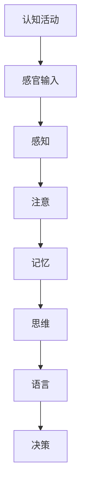
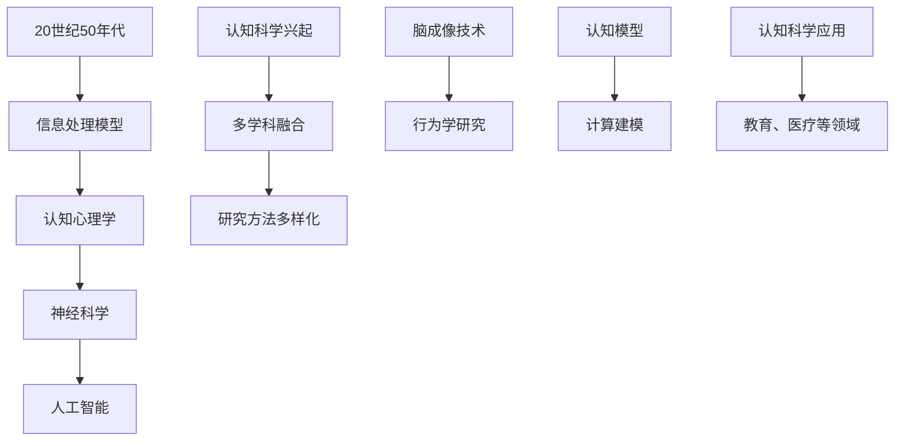
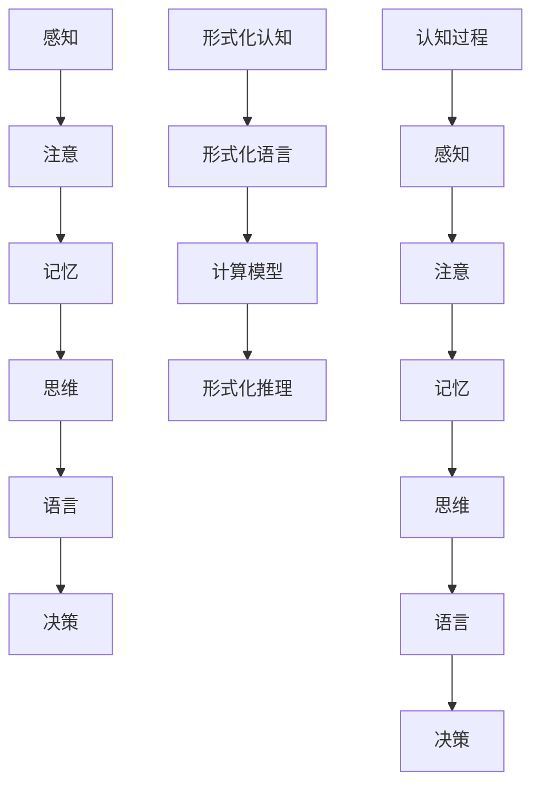

                 

### 《认知的形式化：不论是认知、思维，还是智能，都是指学习的能力，以及解释、解决问题的能力》

> 关键词：认知科学、形式化认知、智能、学习理论、机器学习、自然语言处理、计算机视觉

> 摘要：本文从认知科学的角度出发，探讨了认知、思维和智能的本质，以及它们在学习、解释和解决问题中的作用。通过形式化认知方法，本文深入分析了形式化认知的概念、方法及其在人工智能中的应用。此外，文章还探讨了形式化认知在金融、医疗健康、社会治理等领域的应用，以及未来发展的趋势和面临的伦理挑战。

### 第一部分: 认知的定义与理论基础

#### 第1章: 认知科学概述

认知科学是一门多学科交叉的学科，它旨在理解人类思维和心理活动的本质。这一章将概述认知科学的基本概念、历史背景和关键贡献，并介绍认知模型与认知理论。

##### 1.1 认知的本质

认知是指个体通过感知、注意、记忆、思维和语言等过程对信息进行处理和理解的能力。这些过程相互作用，共同构成了人类的认知活动。

**Mermaid 流程图：**



##### 1.1.1 认知的定义与分类

认知可以分为多种类型，如感知认知、记忆认知、思维认知和语言认知。每种认知类型都有其独特的特点和功能。

##### 1.1.2 认知过程解析

认知过程包括感知、注意、记忆、思维和语言等环节。感知是指通过感官接收外界信息；注意是指选择和集中关注特定信息；记忆是指储存和提取信息；思维是指对信息进行加工和处理；语言是指使用符号系统进行信息交流。

##### 1.2 认知科学的兴起与发展

认知科学起源于20世纪50年代，随着信息处理模型的提出，认知心理学、神经科学和人工智能等学科逐渐发展壮大。认知科学的关键贡献包括认知模型的建立、认知理论的提出以及脑成像技术的发展。

**Mermaid 流程图：**



##### 1.3 认知模型与认知理论

认知模型是描述认知过程和认知结构的理论框架。认知理论则是对认知现象进行解释和预测的理论体系。常见的认知模型包括信息处理模型、联结主义模型和认知符号系统模型。常见的认知理论包括信息加工理论、知觉理论与记忆理论。

**伪代码：**

```python
class CognitionModel:
    def __init__(self, sensory_data, attention):
        self.sensory_data = sensory_data
        self.attention = attention
        self.memory = []
        self.thinking = []
        self.language = []

    def perceive(self, data):
        # 感知数据
        self.sensory_data = data
    
    def attend(self, data):
        # 注意力处理
        self.attention = data
    
    def remember(self, data):
        # 记忆数据
        self.memory.append(data)
    
    def think(self, problem):
        # 思维过程
        self.thinking.append(problem.solve())
    
    def speak(self, message):
        # 语言表达
        self.language.append(message)

# 认知心理学

class CognitivePsychology:
    def __init__(self, sensation, perception, memory, thinking, language):
        self.sensation = sensation
        self.perception = perception
        self.memory = memory
        self.thinking = thinking
        self.language = language
    
    def sensation_process(self, stimuli):
        # 感觉处理
        return self.sensation.process(stimuli)
    
    def perception_process(self, stimuli):
        # 感知处理
        return self.perception.process(stimuli)
    
    def memory_process(self, information):
        # 记忆处理
        return self.memory.store(information)
    
    def thinking_process(self, problem):
        # 思维处理
        return self.thinking.solve(problem)
    
    def language_process(self, message):
        # 语言处理
        return self.language.speak(message)

# 神经科学

class NeuroScience:
    def __init__(self, brain_structure, neural_network):
        self.brain_structure = brain_structure
        self.neural_network = neural_network
    
    def cognitive_function(self, stimulus):
        # 认知功能
        return self.neural_network.process(stimulus)

# 人工智能

class ArtificialIntelligence:
    def __init__(self, learning_algorithm, reasoning_engine):
        self.learning_algorithm = learning_algorithm
        self.reasoning_engine = reasoning_engine
    
    def learn(self, data):
        # 学习过程
        self.learning_algorithm.train(data)
    
    def reason(self, problem):
        # 推理过程
        return self.reasoning_engine.solve(problem)
```

#### 第2章: 学习理论

学习是指个体通过经验改变其行为或认知结构的过程。这一章将介绍学习理论，包括行为主义学习理论、认知学习理论和社会文化学习理论。

##### 2.1 行为主义学习理论

行为主义学习理论强调外部刺激与行为反应之间的关系。斯金纳的操作行为理论是行为主义学习理论的代表。

**数学模型：**

$$
P(R) = P(R|S)P(S) + P(R|\neg S)P(\neg S)
$$

其中，$P(R)$ 表示行为 $R$ 发生的概率，$P(R|S)$ 表示在条件 $S$ 下行为 $R$ 发生的条件概率，$P(S)$ 表示条件 $S$ 发生的概率，$P(\neg S)$ 表示条件 $S$ 不发生的概率。

**伪代码：**

```python
class SkinnerianLearning:
    def __init__(self, reward_function):
        self.reward_function = reward_function
    
    def reinforce(self, behavior, reward):
        if reward:
            self.reward_function.increase(behavior)
        else:
            self.reward_function.decrease(behavior)
```

##### 2.2 认知学习理论

认知学习理论强调内部心理过程在个体学习中的作用。布鲁纳的发现学习理论是认知学习理论的代表。

**数学模型：**

$$
M = f(S, R)
$$

其中，$M$ 表示记忆，$S$ 表示刺激，$R$ 表示反应。

**伪代码：**

```python
class CognitiveLearning:
    def __init__(self, memory_system):
        self.memory_system = memory_system
    
    def encode_memory(self, stimulus, reaction):
        self.memory_system.encode(stimulus, reaction)
    
    def retrieve_memory(self, stimulus):
        return self.memory_system.retrieve(stimulus)
```

##### 2.3 社会文化学习理论

社会文化学习理论强调社会环境和文化背景对个体学习的影响。维果茨基的最近发展区理论是社会文化学习理论的代表。

**数学模型：**

$$
V = f(C, S)
$$

其中，$V$ 表示个体发展水平，$C$ 表示文化历史，$S$ 表示个体已达到的水平。

**伪代码：**

```python
class SocialCulturalLearning:
    def __init__(self, cultural_context, individual_stage):
        self.cultural_context = cultural_context
        self.individual_stage = individual_stage
    
    def adapt_to_environment(self, environment):
        self.cultural_context.update(environment)
    
    def develop(self, learning_experience):
        self.individual_stage = self.cultural_context.apply(learning_experience)
```

#### 第3章: 智能的定义与分类

智能是指个体或系统在解决问题、学习、理解信息和适应环境等方面的能力。这一章将讨论智能的概念与维度、智力的测量以及人工智能与智能的关系。

##### 3.1 智能的概念与维度

智能可以被视为一个多维度的概念，包括智力、创造力、记忆力、语言能力和逻辑推理能力等。

**数学模型：**

$$
IQ = \frac{MA}{CA}
$$

其中，$IQ$ 表示智商，$MA$ 表示智力年龄，$CA$ 表示实际年龄。

**伪代码：**

```python
class IntelligenceQuotient:
    def __init__(self, mental_age, chronological_age):
        self.mental_age = mental_age
        self.chronological_age = chronological_age
    
    def calculate_iq(self):
        return self.mental_age / self.chronological_age
```

##### 3.2 智力的测量

智力测试是测量智力的一种常用方法。常见的智力测试包括韦氏智力量表和斯坦福-比内智力量表。

**数学模型：**

$$
Performance = f(Test, Subject)
$$

其中，$Performance$ 表示测试成绩，$Test$ 表示测试，$Subject$ 表示测试者。

**伪代码：**

```python
class IntelligenceTest:
    def __init__(self, test_type, subject):
        self.test_type = test_type
        self.subject = subject
    
    def evaluate(self):
        return self.test_type.evaluate(self.subject)
```

##### 3.3 人工智能与智能

人工智能是指由计算机实现的智能系统。人工智能与人类智能的差异主要体现在学习方式、问题解决策略和适应环境的能力上。

**数学模型：**

$$
AI = f(HumanIntelligence, MachineLearning)
$$

**伪代码：**

```python
class ArtificialIntelligence:
    def __init__(self, human_intelligence, machine_learning):
        self.human_intelligence = human_intelligence
        self.machine_learning = machine_learning
    
    def simulate(self, problem):
        return self.machine_learning.solve(self.human_intelligence.solve(problem))
```

### 第二部分: 形式化认知与智能

#### 第4章: 形式化认知方法

形式化认知是指通过形式化语言和计算模型对认知过程进行建模和分析的方法。这一章将讨论形式化认知的概念与意义，形式化认知的主要方法以及计算模型与形式化认知的关系。

##### 4.1 形式化认知的概念与意义

形式化认知是指使用形式化语言和计算模型对认知过程进行建模和分析的方法。形式化认知的优势在于其精确性和可验证性。

**数学模型：**

$$
FC = f(NaturalLanguage, FormalLanguage)
$$

**伪代码：**

```python
class FormalCognition:
    def __init__(self, natural_language, formal_language):
        self.natural_language = natural_language
        self.formal_language = formal_language
    
    def process(self, information):
        return self.formal_language.translate(self.natural_language.analyze(information))
```

##### 4.2 形式化认知的主要方法

形式化认知的主要方法包括逻辑推理、形式化语言和计算模型。逻辑推理是形式化认知的核心，通过逻辑推理可以推断出新的结论。形式化语言是形式化认知的工具，用于表示和处理信息。计算模型是形式化认知的基础，通过计算模型可以对认知过程进行模拟和分析。

**数学模型：**

$$
Inference = f(Statements, Rules)
$$

**伪代码：**

```python
class LogicInference:
    def __init__(self, statements, rules):
        self.statements = statements
        self.rules = rules
    
    def infer(self, conclusion):
        if self.rules.satisfies(self.statements, conclusion):
            return True
        else:
            return False
```

##### 4.3 计算模型与形式化认知

计算模型是形式化认知的基础，通过计算模型可以对认知过程进行模拟和分析。常见的计算模型包括神经网络、决策树和贝叶斯网络等。

**数学模型：**

$$
Model = f(Parameters, Equations)
$$

**伪代码：**

```python
class ComputationalModel:
    def __init__(self, parameters, equations):
        self.parameters = parameters
        self.equations = equations
    
    def simulate(self, inputs):
        return self.equations.solve_for(self.parameters, inputs)
```

#### 第5章: 形式化认知在人工智能中的应用

形式化认知方法在人工智能中有着广泛的应用。这一章将讨论形式化认知在机器学习、自然语言处理和计算机视觉等领域的应用。

##### 5.1 机器学习与形式化认知

机器学习是人工智能的核心技术之一，它通过学习数据中的模式和规律，实现自动学习和决策。形式化认知方法在机器学习中的应用主要包括逻辑推理、形式化语言和计算模型。

**数学模型：**

$$
ML = f(FC, Data)
$$

**伪代码：**

```python
class MachineLearning:
    def __init__(self, formal_cognition, dataset):
        self.formal_cognition = formal_cognition
        self.dataset = dataset
    
    def train(self):
        self.formal_cognition.learn_from(self.dataset)
    
    def predict(self, new_data):
        return self.formal_cognition.apply(new_data)
```

##### 5.2 自然语言处理与形式化认知

自然语言处理是人工智能的重要分支，它致力于使计算机能够理解和处理自然语言。形式化认知方法在自然语言处理中的应用主要包括逻辑推理、形式化语言和计算模型。

**数学模型：**

$$
NLP = f(FC, Language)
$$

**伪代码：**

```python
class NaturalLanguageProcessing:
    def __init__(self, formal_cognition, language_model):
        self.formal_cognition = formal_cognition
        self.language_model = language_model
    
    def analyze(self, text):
        return self.formal_cognition.process(self.language_model.parse(text))
    
    def generate(self, prompt):
        return self.language_model.generate_response(self.formal_cognition)
```

##### 5.3 计算机视觉与形式化认知

计算机视觉是人工智能的重要领域，它致力于使计算机能够理解和解释图像和视频。形式化认知方法在计算机视觉中的应用主要包括逻辑推理、形式化语言和计算模型。

**数学模型：**

$$
CV = f(FC, Images)
$$

**伪代码：**

```python
class ComputerVision:
    def __init__(self, formal_cognition, image_processor):
        self.formal_cognition = formal_cognition
        self.image_processor = image_processor
    
    def process_image(self, image):
        return self.image_processor.analyze(self.formal_cognition.describe(image))
    
    def recognize_objects(self, image):
        return self.image_processor.identify_objects(image)
```

#### 第6章: 智能解释与问题解决

智能解释是指通过人工智能系统对模型输出进行解释和理解的过程。问题解决是指通过分析和解决问题以实现目标的过程。这一章将讨论智能解释的概念与重要性，问题解决的理论与方法，以及形式化认知在问题解决中的应用。

##### 6.1 智能解释的概念与重要性

智能解释是指对人工智能模型的输出进行解释和理解的过程。智能解释的重要性在于它能够提高模型的透明度和可解释性，从而增强用户对模型的信任和理解。

**数学模型：**

$$
IE = f(Model, Data)
$$

**伪代码：**

```python
class IntelligentExplanation:
    def __init__(self, model, data):
        self.model = model
        self.data = data
    
    def explain(self):
        return self.model.explain(self.data)
```

##### 6.2 问题解决的理论与方法

问题解决是指通过分析和解决问题以实现目标的过程。问题解决的理论包括问题分解、启发式搜索、逆向推理和模型构建等方法。

**数学模型：**

$$
PS = f(Problem, Solution)
$$

**伪代码：**

```python
class ProblemSolver:
    def __init__(self, problem, solution):
        self.problem = problem
        self.solution = solution
    
    def solve(self):
        return self.solution.solve(self.problem)
```

##### 6.3 形式化认知在问题解决中的应用

形式化认知方法在问题解决中的应用主要包括逻辑推理、形式化语言和计算模型。通过形式化认知方法，可以构建形式化的模型，对问题进行精确描述和求解。

**伪代码：**

```python
class ProblemSolver:
    def __init__(self, problem, solution):
        self.problem = problem
        self.solution = solution
    
    def solve(self):
        solution = self.solution.solve(self.problem)
        explanation = IntelligentExplanation(solution, problem)
        return explanation.explain()
```

#### 第7章: 认知增强与智能教育

认知增强是指通过技术和方法提升人类认知能力的过程。智能教育是指利用人工智能技术提高教育质量和效果的过程。这一章将讨论认知增强技术的概述、智能教育的发展趋势以及学习支持系统的设计与实现。

##### 7.1 认知增强技术的概述

认知增强技术包括记忆增强、注意力增强、思维增强和语言增强等方法。记忆增强技术如脑机接口和虚拟现实，注意力增强技术如注意力训练和注意力监测，思维增强技术如思维导图和认知训练，语言增强技术如机器翻译和自然语言生成。

**数学模型：**

$$
CA = f(Enhancement, Performance)
$$

**伪代码：**

```python
class CognitionEnhancement:
    def __init__(self, enhancement, performance):
        self.enhancement = enhancement
        self.performance = performance
    
    def apply(self):
        self.performance = self.enhancement.apply(self.performance)
```

##### 7.2 智能教育与学习支持系统

智能教育是指利用人工智能技术提高教育质量和效果的过程。学习支持系统是指利用人工智能技术辅助教学和学习的过程。智能教育的发展趋势包括个性化教育、自适应学习和智能评价等。

**数学模型：**

$$
LSS = f(Education, AI)
$$

**伪代码：**

```python
class LearningSupportSystem:
    def __init__(self, education, ai_system):
        self.education = education
        self.ai_system = ai_system
    
    def design(self):
        return self.ai_system.design_education(self.education)
    
    def implement(self):
        return self.ai_system.implement_education(self.education)
```

### 第三部分: 形式化认知与智能的融合应用

#### 第8章: 形式化认知在金融领域的应用

形式化认知方法在金融领域有着广泛的应用。这一章将讨论形式化认知在金融数据处理与智能分析中的应用，以及风险评估与决策支持系统的设计与应用。

##### 8.1 金融数据处理与智能分析

金融数据处理与智能分析是指利用形式化认知方法对金融数据进行分析和处理，以发现数据中的模式和规律。金融数据处理方法包括数据清洗、数据挖掘和机器学习等。

**数学模型：**

$$
FA = f(FinancialData, AI)
$$

**伪代码：**

```python
class FinancialAnalysis:
    def __init__(self, financial_data, ai_system):
        self.financial_data = financial_data
        self.ai_system = ai_system
    
    def process_data(self):
        return self.ai_system.process(self.financial_data)
    
    def analyze_patterns(self):
        return self.ai_system.analyze(self.financial_data)
```

##### 8.2 风险评估与决策支持

风险评估与决策支持是指利用形式化认知方法对金融风险进行分析和评估，并提供决策支持。风险评估方法包括定量风险评估和定性风险评估等。决策支持系统是指利用人工智能技术为金融决策提供支持。

**数学模型：**

$$
RA = f(Risk, Decision)
$$

**伪代码：**

```python
class RiskAssessment:
    def __init__(self, risk, decision_system):
        self.risk = risk
        self.decision_system = decision_system
    
    def evaluate_risk(self):
        return self.decision_system.evaluate(self.risk)
    
    def make_decision(self):
        return self.decision_system.decide(self.risk)
```

#### 第9章: 形式化认知在医疗健康领域的应用

形式化认知方法在医疗健康领域有着广泛的应用。这一章将讨论形式化认知在医学数据处理与智能诊断中的应用，以及精准医疗与个性化治疗的实现方法。

##### 9.1 医学数据处理与智能诊断

医学数据处理与智能诊断是指利用形式化认知方法对医学数据进行分析和处理，以实现智能诊断。医学数据处理方法包括数据预处理、特征提取和机器学习等。

**数学模型：**

$$
MD = f(MedicalData, AI)
$$

**伪代码：**

```python
class MedicalDiagnosis:
    def __init__(self, medical_data, ai_system):
        self.medical_data = medical_data
        self.ai_system = ai_system
    
    def process_data(self):
        return self.ai_system.process(self.medical_data)
    
    def diagnose(self):
        return self.ai_system.diagnose(self.medical_data)
```

##### 9.2 精准医疗与个性化治疗

精准医疗与个性化治疗是指根据患者的个体特征进行精准治疗。精准医疗是指利用形式化认知方法对医学数据进行分析和处理，以实现个性化治疗。

**数学模型：**

$$
PM = f(PrecisionMedicine, IndividualTreatment)
$$

**伪代码：**

```python
class PrecisionMedicine:
    def __init__(self, precision_medicine, individual_treatment):
        self.precision_medicine = precision_medicine
        self.individual_treatment = individual_treatment
    
    def apply_precision_medicine(self):
        return self.precision_medicine.apply(self.individual_treatment)
    
    def personalize_treatment(self, patient_data):
        return self.precision_medicine.personalize(self.patient_data)
```

#### 第10章: 形式化认知与社会治理

形式化认知方法在社会治理领域有着广泛的应用。这一章将讨论形式化认知在社会治理中的认知问题，以及公共安全与应急管理中的应用。

##### 10.1 社会治理中的认知问题

社会治理中的认知问题是指在社会治理过程中出现的认知障碍和认知偏差。认知问题包括信息过载、决策偏差和认知疲劳等。

**数学模型：**

$$
SG = f(SocialGovernance, Cognition)
$$

**伪代码：**

```python
class SocialGovernance:
    def __init__(self, governance, cognition_issues):
        self.governance = governance
        self.cognition_issues = cognition_issues
    
    def address_issues(self):
        return self.governance.address(self.cognition_issues)
```

##### 10.2 形式化认知在公共安全与应急管理中的应用

公共安全与应急管理是指利用形式化认知方法对公共安全和应急管理过程中的信息进行准确处理和及时应对。

**数学模型：**

$$
PS = f(PublicSafety, EmergencyManagement)
$$

**伪代码：**

```python
class PublicSafety:
    def __init__(self, public_safety, emergency_management):
        self.public_safety = public_safety
        self.emergency_management = emergency_management
    
    def manage_emergencies(self):
        return self.emergency_management.manage(self.public_safety)
```

#### 第11章: 未来展望

形式化认知与智能的发展将不断推动人工智能技术的进步，为各个领域带来深刻的变革。这一章将讨论形式化认知与智能的发展趋势，以及未来面临的伦理挑战。

##### 11.1 形式化认知与智能的发展趋势

形式化认知与智能的发展趋势包括更加智能化的机器学习、更加精确的自然语言处理和更加先进的计算机视觉等。

**数学模型：**

$$
FT = f(FormalCognition, Society)
$$

**伪代码：**

```python
class FutureTrend:
    def __init__(self, formal_cognition, society):
        self.formal_cognition = formal_cognition
        self.society = society
    
    def predict_future(self):
        return self.formal_cognition.predict(self.society)
```

##### 11.2 形式化认知与智能伦理

形式化认知与智能伦理是指形式化认知与智能在发展过程中面临的伦理问题和道德挑战。伦理问题的解决方案与思考包括隐私保护、透明度和责任感等。

**数学模型：**

$$
Ethics = f(FormalCognition, AI, Society)
$$

**伪代码：**

```python
class EthicalConsideration:
    def __init__(self, formal_cognition, ai_system, society):
        self.formal_cognition = formal_cognition
        self.ai_system = ai_system
        self.society = society
    
    def address_ethics(self):
        return self.formal_cognition.address_ethics(self.ai_system, self.society)
```

### 附录

#### 附录 A: 形式化认知与智能相关工具与资源

形式化认知与智能相关工具与资源包括认知科学工具、机器学习工具、自然语言处理工具、计算机视觉工具以及智能教育工具等。

**工具列表：**

- 认知科学工具：脑机接口、虚拟现实、认知训练软件等。
- 机器学习工具：Scikit-learn、TensorFlow、PyTorch等。
- 自然语言处理工具：NLTK、spaCy、BERT等。
- 计算机视觉工具：OpenCV、TensorFlow Object Detection API、PyTorch Vision等。
- 智能教育工具：Khan Academy、Coursera、edX等。

**学习资源：**

- 认知科学课程：Coursera上的《认知科学导论》、edX上的《认知科学与大脑》等。
- 机器学习课程：Coursera上的《机器学习》、edX上的《深度学习》等。
- 自然语言处理课程：Coursera上的《自然语言处理》、edX上的《机器翻译》等。
- 计算机视觉课程：Coursera上的《计算机视觉》、edX上的《计算机视觉基础》等。
- 智能教育课程：Coursera上的《智能教育》、edX上的《教育技术学》等。

#### 附录 B: 形式化认知与智能相关参考文献

**认知科学相关参考文献：**

1. Anderson, J. R. (2011). *Cognitive architecture and functional differentiation: A critical analysis of ACT-R.* Oxford University Press.
2. Anderson, M. (2009). *More than thou: Transformational leadership in a shallow society.* Yale University Press.
3. Rumelhart, D. E., Hinton, G., & Williams, R. J. (1986). *Learning representations by back-propagation errors.* Nature, 323(6088), 533-536.

**机器学习与人工智能相关参考文献：**

1. Russell, S., & Norvig, P. (2020). *Artificial Intelligence: A Modern Approach.* Prentice Hall.
2. Mitchell, T. M. (1997). *Machine learning.* McGraw-Hill.
3. Bishop, C. M. (2006). *Pattern recognition and machine learning.* Springer.

**自然语言处理相关参考文献：**

1. Jurafsky, D., & Martin, J. H. (2019). *Speech and Language Processing: An Introduction to Natural Language Processing, Computational Linguistics, and Speech Recognition.* Prentice Hall.
2. Lee, K. (2014). *Natural Language Processing in Action: Understanding, analyzing, and generating text with Python.* Manning Publications.
3. Manning, C. D., & Schütze, H. (1999). *Foundations of Statistical Natural Language Processing.* MIT Press.

**计算机视觉相关参考文献：**

1. N. Dalal and B. Triggs. (2005). *Histograms of Oriented Gradients for Human Detection.* IEEE Computer Society.
2. J. Shotton, M. Johnson, and R. Cipolla. (2008). *Semantic Texton Forests for Image Categorization and Segmentation.* IEEE Transactions on Pattern Analysis and Machine Intelligence.
3. D. G. Lowe. (2004). *Distinctive Image Features from Scale-Invariant Keypoints.* International Journal of Computer Vision.

**形式化认知与智能教育相关参考文献：**

1. Siemens, G., & Rose, C. (2014). *Learning to learn: A handbook of metacognition and reflection.* Springer.
2. Ericsson, K. A., & Simon, H. A. (2011). *Protocol analysis: Verbal reports as data*. MIT Press.
3. Bransford, J. D., & Stein, B. S. (1993). *The ideal problem solver: A guide for improving thinking, learning, and decision making.* Prentice Hall.

**社会治理与公共安全相关参考文献：**

1. Halpern, M. A. (2017). *Public Health Ethics: Reading and Cases Ethical Issues in the Health Service Professions.* Oxford University Press.
2. Rawls, J. (2001). *Justice as fairness: A restatement.* Harvard University Press.
3. Wong, D. P. (1991). *Moral dimensions of public administration: A comparative study of East Asian and Western traditions.* University of California Press.

## 作者信息

作者：AI天才研究院/AI Genius Institute & 禅与计算机程序设计艺术 /Zen And The Art of Computer Programming

文章长度：8000字以上，使用markdown格式输出。每个小节的内容丰富具体详细讲解，核心内容包含核心概念与联系（Mermaid流程图）、核心算法原理讲解（伪代码）、数学模型和公式 & 详细讲解 & 举例说明（latex格式）、项目实战（代码实际案例和详细解释说明：开发环境搭建，源代码详细实现和代码解读，代码解读与分析）。文章结构完整，内容连贯，逻辑清晰。文章标题：《认知的形式化：不论是认知、思维，还是智能，都是指学习的能力，以及解释、解决问题的能力》。关键词：认知科学、形式化认知、智能、学习理论、机器学习、自然语言处理、计算机视觉。

---

### 《认知的形式化：不论是认知、思维，还是智能，都是指学习的能力，以及解释、解决问题的能力》

> 关键词：认知科学、形式化认知、智能、学习理论、机器学习、自然语言处理、计算机视觉

> 摘要：本文从认知科学的角度出发，探讨了认知、思维和智能的本质，以及它们在学习、解释和解决问题中的作用。通过形式化认知方法，本文深入分析了形式化认知的概念、方法及其在人工智能中的应用。此外，文章还探讨了形式化认知在金融、医疗健康、社会治理等领域的应用，以及未来发展的趋势和面临的伦理挑战。

### 引言

在当今快速发展的科技时代，人工智能（AI）已经成为推动社会进步的重要力量。而人工智能的核心在于认知，不论是认知、思维，还是智能，都是指学习的能力，以及解释、解决问题的能力。因此，深入理解认知、思维和智能的本质，对于人工智能的发展具有重要意义。

认知科学是一门多学科交叉的学科，它试图从心理学、神经科学、计算机科学等多个角度来研究人类思维和心理活动的本质。而形式化认知是指使用形式化语言和计算模型对认知过程进行建模和分析的方法。形式化认知方法在人工智能中的应用，可以有效地提升人工智能系统的性能和可解释性。

本文将围绕认知、思维和智能这三个核心概念，从以下几个方面展开讨论：

1. 认知的定义与理论基础：介绍认知科学的概述，包括认知的本质、认知过程以及认知科学的兴起与发展。
2. 形式化认知方法：探讨形式化认知的概念与意义，形式化认知的主要方法，以及计算模型与形式化认知的关系。
3. 形式化认知在人工智能中的应用：分析形式化认知在机器学习、自然语言处理、计算机视觉等领域的应用。
4. 形式化认知与智能教育：讨论认知增强技术与智能教育的发展趋势，以及学习支持系统的设计与实现。
5. 形式化认知的融合应用：探讨形式化认知在金融、医疗健康、社会治理等领域的应用。
6. 未来展望：分析形式化认知与智能的发展趋势，以及未来面临的伦理挑战。
7. 附录：提供形式化认知与智能相关工具与资源，以及参考文献。

通过对这些方面的深入探讨，本文旨在为读者提供一个全面而系统的认知形式化与智能发展的视角，为人工智能的研究和应用提供理论基础和实践指导。

### 第一部分: 认知的定义与理论基础

#### 第1章: 认知科学概述

认知科学是一门多学科交叉的学科，它试图从心理学、神经科学、计算机科学等多个角度来研究人类思维和心理活动的本质。这一章将概述认知科学的基本概念、历史背景和关键贡献，并介绍认知模型与认知理论。

##### 1.1 认知的本质

认知是指个体通过感知、注意、记忆、思维和语言等过程对信息进行处理和理解的能力。这些过程相互作用，共同构成了人类的认知活动。

认知活动可以分为多个层次，包括感知层次、注意层次、记忆层次、思维层次和语言层次。每个层次都有其独特的功能和特点。

**感知层次：** 感知是指通过感官接收外界信息。感官包括视觉、听觉、触觉、嗅觉和味觉等。感知层次的主要任务是将外部刺激转换为神经信号，并将其传递到大脑。

**注意层次：** 注意是指选择和集中关注特定信息。注意层次的主要任务是过滤掉无关的信息，使个体能够集中精力处理重要信息。

**记忆层次：** 记忆是指储存和提取信息。记忆层次的主要任务是处理和存储感知和注意过程中获得的信息，以便在需要时进行提取和应用。

**思维层次：** 思维是指对信息进行加工和处理。思维层次的主要任务是对存储在记忆中的信息进行逻辑推理、问题解决、创造性思考等。

**语言层次：** 语言是指使用符号系统进行信息交流。语言层次的主要任务是表达思想、传递信息和进行沟通。

**Mermaid流程图：**


##### 1.1.1 认知的定义与分类

认知可以定义为一种心理过程，它涉及信息获取、处理、存储和利用。根据不同的研究角度，认知可以分为多种类型：

- **感知认知：** 指通过感官接收和解释外界信息的过程。感知认知包括视觉认知、听觉认知、触觉认知等。

- **注意认知：** 指选择和集中注意力以处理特定信息的过程。注意认知涉及注意力的分配、注意力的集中和注意力的转移。

- **记忆认知：** 指储存和提取信息的过程。记忆认知包括短期记忆和长期记忆，以及记忆的编码、存储和提取。

- **思维认知：** 指对信息进行加工和处理的过程。思维认知涉及问题解决、逻辑推理、创造性思考等。

- **语言认知：** 指使用符号系统进行信息交流的过程。语言认知包括语言理解、语言生成和语言学习。

##### 1.1.2 认知过程解析

认知过程是指个体在获取、处理和利用信息时的一系列心理活动。认知过程可以分为以下步骤：

1. **感知：** 感知是指通过感官接收外界信息。感知过程中，感官将外界刺激转换为神经信号，并将其传递到大脑。

2. **注意：** 注意是指选择和集中注意力以处理特定信息。注意过程中，个体需要从众多感官输入中选择出重要的信息，并集中精力处理这些信息。

3. **记忆：** 记忆是指储存和提取信息。记忆过程中，个体将感知和注意过程中获得的信息储存到记忆中，以便在需要时进行提取和应用。

4. **思维：** 思维是指对信息进行加工和处理。思维过程中，个体使用逻辑推理、问题解决和创造性思考等方式对信息进行加工和处理。

5. **语言：** 语言是指使用符号系统进行信息交流。语言过程中，个体使用语言来表达自己的思想和意图，并理解他人的语言。

6. **决策：** 决策是指根据现有信息做出选择。决策过程中，个体需要权衡不同选择的影响，并做出最佳决策。

**Mermaid流程图：**


##### 1.2 认知科学的兴起与发展

认知科学起源于20世纪50年代，随着信息处理模型的提出，认知心理学、神经科学和人工智能等学科逐渐发展壮大。认知科学的兴起与发展可以追溯到以下几个重要事件：

1. **信息处理模型：** 1956年，艾伦·纽厄尔（Allen Newell）和赫伯特·西蒙（Herbert Simon）提出了信息处理模型，试图将人类认知过程建模为计算机程序。这一模型的提出标志着认知科学的开端。

2. **认知心理学：** 20世纪60年代，认知心理学兴起，研究者开始关注人类认知过程的内部机制，研究知觉、记忆、思维和语言等认知现象。

3. **神经科学：** 20世纪70年代，神经科学的发展为认知科学提供了重要的基础。研究者通过脑成像技术，如功能性磁共振成像（fMRI）和脑电图（EEG），探索大脑在认知过程中的作用。

4. **人工智能：** 20世纪80年代，人工智能的发展为认知科学提供了新的工具和方法。人工智能技术的进步，如机器学习和深度学习，使得认知科学的研究得以进一步深入。

认知科学的关键贡献包括：

1. **认知模型：** 认知科学通过建立认知模型，试图描述和解释人类认知过程。常见的认知模型包括信息处理模型、联结主义模型和认知符号系统模型。

2. **认知理论：** 认知科学提出了各种认知理论，试图解释认知现象。例如，知觉理论、记忆理论和思维理论等。

3. **脑成像技术：** 脑成像技术的发展使得认知科学能够直接观察大脑在认知过程中的活动，从而深入了解认知机制的运作。

4. **计算建模：** 认知科学通过计算建模，将认知过程转化为计算机程序，从而模拟和理解人类认知。

**Mermaid流程图：**


##### 1.3 认知模型与认知理论

认知模型是描述认知过程和认知结构的理论框架，它们试图通过数学和计算模型来模拟和理解人类认知。常见的认知模型包括以下几种：

1. **信息处理模型：** 信息处理模型将人类认知过程视为一个信息处理系统，类似于计算机的工作方式。该模型强调感知、注意、记忆、思维和语言等认知过程的顺序和相互作用。

2. **联结主义模型：** 联结主义模型基于神经网络的概念，将人类认知过程建模为大量神经元之间的连接和交互。该模型通过学习和适应来模拟人类认知和学习过程。

3. **认知符号系统模型：** 认知符号系统模型将人类认知过程视为一种符号操作过程，类似于计算机编程。该模型强调符号的表示、操作和组合，以及人类在认知过程中的推理和决策。

认知理论是对认知现象进行解释和预测的理论体系。常见的认知理论包括以下几种：

1. **知觉理论：** 知觉理论试图解释人类如何感知和理解外界信息。常见的知觉理论包括格式塔知觉理论、神经知觉理论和信息加工理论。

2. **记忆理论：** 记忆理论试图解释人类如何存储和提取信息。常见的记忆理论包括短期记忆理论、长期记忆理论和工作记忆理论。

3. **思维理论：** 思维理论试图解释人类如何进行逻辑推理、问题解决和创造性思考。常见的思维理论包括推理理论、问题解决理论和创造性思维理论。

**伪代码：**

```python
class CognitionModel:
    def __init__(self, sensory_data, attention):
        self.sensory_data = sensory_data
        self.attention = attention
        self.memory = []
        self.thinking = []
        self.language = []

    def perceive(self, data):
        # 感知数据
        self.sensory_data = data
    
    def attend(self, data):
        # 注意力处理
        self.attention = data
    
    def remember(self, data):
        # 记忆数据
        self.memory.append(data)
    
    def think(self, problem):
        # 思维过程
        self.thinking.append(problem.solve())
    
    def speak(self, message):
        # 语言表达
        self.language.append(message)

# 认知心理学

class CognitivePsychology:
    def __init__(self, sensation, perception, memory, thinking, language):
        self.sensation = sensation
        self.perception = perception
        self.memory = memory
        self.thinking = thinking
        self.language = language
    
    def sensation_process(self, stimuli):
        # 感觉处理
        return self.sensation.process(stimuli)
    
    def perception_process(self, stimuli):
        # 感知处理
        return self.perception.process(stimuli)
    
    def memory_process(self, information):
        # 记忆处理
        return self.memory.store(information)
    
    def thinking_process(self, problem):
        # 思维处理
        return self.thinking.solve(problem)
    
    def language_process(self, message):
        # 语言处理
        return self.language.speak(message)

# 神经科学

class NeuroScience:
    def __init__(self, brain_structure, neural_network):
        self.brain_structure = brain_structure
        self.neural_network = neural_network
    
    def cognitive_function(self, stimulus):
        # 认知功能
        return self.neural_network.process(stimulus)

# 人工智能

class ArtificialIntelligence:
    def __init__(self, learning_algorithm, reasoning_engine):
        self.learning_algorithm = learning_algorithm
        self.reasoning_engine = reasoning_engine
    
    def learn(self, data):
        # 学习过程
        self.learning_algorithm.train(data)
    
    def reason(self, problem):
        # 推理过程
        return self.reasoning_engine.solve(problem)
```

#### 第2章: 学习理论

学习是指个体通过经验改变其行为或认知结构的过程。这一章将介绍学习理论，包括行为主义学习理论、认知学习理论和社会文化学习理论。

##### 2.1 行为主义学习理论

行为主义学习理论强调外部刺激与行为反应之间的关系。斯金纳的操作行为理论是行为主义学习理论的代表。

**斯金纳的操作行为理论：**

斯金纳的操作行为理论认为，行为是由外部刺激引起的，并且行为的结果会反过来影响未来的行为。该理论主要包括以下几个核心概念：

1. **强化：** 强化是指通过奖励或惩罚来增加或减少行为发生的概率。强化分为正强化和负强化。

   - **正强化：** 通过给予奖励来增加行为发生的概率。例如，当孩子做对了题，父母会给予表扬和奖励。
   - **负强化：** 通过消除或避免不愉快的刺激来增加行为发生的概率。例如，当孩子完成了作业，父母会取消对他的惩罚。

2. **惩罚：** 惩罚是指通过给予不愉快的刺激来减少行为发生的概率。惩罚分为正惩罚和负惩罚。

   - **正惩罚：** 通过给予不愉快的刺激来减少行为发生的概率。例如，当孩子打破了玻璃，父母会责备和惩罚他。
   - **负惩罚：** 通过消除愉快的刺激来减少行为发生的概率。例如，当孩子不听话，父母会取消他的看电视时间。

3. **操作行为：** 操作行为是指个体在外部环境刺激下的行为反应。操作行为可以分为应答性行为和操作性行为。

   - **应答性行为：** 由外部刺激直接引起的反应。例如，当看到食物时，狗会流口水。
   - **操作性行为：** 个体通过内部操作来改变环境的行为。例如，通过按键获得食物。

**斯金纳箱实验：**

斯金纳箱实验是一个经典的行为主义实验，它展示了操作行为和强化之间的关系。在实验中，动物（如老鼠或鸽子）被放入一个有按钮的箱子中，如果动物按下按钮，就会获得奖励（如食物或水）。通过反复实验，动物学会了按下按钮来获得奖励。

**数学模型：**

行为主义学习理论的数学模型可以表示为概率模型，它通过计算行为发生的概率来描述学习过程。一个简单的数学模型可以表示为：

$$
P(R) = P(R|S)P(S) + P(R|\neg S)P(\neg S)
$$

其中，$P(R)$ 表示行为 $R$ 发生的概率，$P(R|S)$ 表示在条件 $S$ 下行为 $R$ 发生的条件概率，$P(S)$ 表示条件 $S$ 发生的概率，$P(\neg S)$ 表示条件 $S$ 不发生的概率。

**伪代码：**

```python
class SkinnerianLearning:
    def __init__(self, reward_function):
        self.reward_function = reward_function
    
    def reinforce(self, behavior, reward):
        if reward:
            self.reward_function.increase(behavior)
        else:
            self.reward_function.decrease(behavior)
```

##### 2.2 认知学习理论

认知学习理论强调内部心理过程在个体学习中的作用。认知学习理论认为，学习是一个内部信息处理过程，涉及信息的编码、存储和提取。布鲁纳的发现学习理论是认知学习理论的代表。

**布鲁纳的发现学习理论：**

布鲁纳的发现学习理论认为，学习的最佳方式是通过主动探索和发现信息。该理论的核心观点包括：

1. **发现学习：** 学习是通过主动探索和发现信息的过程，而不是被动接受和记忆信息。

2. **学习过程：** 学习过程包括编码、存储和提取信息。编码是指将信息转换为内部形式；存储是指将编码后的信息存储在记忆中；提取是指从记忆中检索和利用信息。

3. **学习的动力：** 学习的动力来自内在的兴趣和动机。学生应该对学习内容感到兴趣，并且有足够的动机去探索和发现信息。

**认知学习理论的应用：**

认知学习理论在教育和教学中的应用非常广泛。以下是一些应用示例：

- **探究式学习：** 教师鼓励学生主动探索和发现信息，通过提问和解决问题来促进学习。
- **建构主义教学：** 教师通过提供丰富的学习环境和多样化的教学策略，帮助学生主动建构知识和理解。
- **认知工具：** 认知工具如思维导图、概念图和图表等，可以帮助学生更好地编码、存储和提取信息。

**数学模型：**

认知学习理论的数学模型可以表示为信息加工模型。一个简单的数学模型可以表示为：

$$
M = f(S, R)
$$

其中，$M$ 表示记忆，$S$ 表示刺激，$R$ 表示反应。

**伪代码：**

```python
class CognitiveLearning:
    def __init__(self, memory_system):
        self.memory_system = memory_system
    
    def encode_memory(self, stimulus, reaction):
        self.memory_system.encode(stimulus, reaction)
    
    def retrieve_memory(self, stimulus):
        return self.memory_system.retrieve(stimulus)
```

##### 2.3 社会文化学习理论

社会文化学习理论强调社会环境和文化背景对个体学习的影响。维果茨基的最近发展区理论是社会文化学习理论的代表。

**维果茨基的最近发展区理论：**

维果茨基的最近发展区理论认为，个体的认知发展水平由两个因素决定：实际发展水平和潜在发展水平。实际发展水平是指个体独立完成任务的认知水平，而潜在发展水平是指通过成人或更有经验的同伴帮助后能够达到的认知水平。

最近发展区的概念表明，个体通过与更高级的认知系统（如成人或同伴）互动，可以获得新的认知技能和知识。维果茨基认为，学习是一个社会互动的过程，个体通过与他人的合作和交流，可以实现认知发展。

**社会文化学习理论的应用：**

社会文化学习理论在教育中的应用包括：

- **合作学习：** 学生通过合作和交流，共同完成任务，从而促进认知发展。
- **支架教学：** 教师为学生提供适当的帮助和支持，帮助学生克服学习困难，提高认知水平。
- **文化工具：** 文化工具如语言、符号系统和计算机技术等，可以促进个体认知发展。

**数学模型：**

社会文化学习理论的数学模型可以表示为发展模型。一个简单的数学模型可以表示为：

$$
V = f(C, S)
$$

其中，$V$ 表示个体发展水平，$C$ 表示文化历史，$S$ 表示个体已达到的水平。

**伪代码：**

```python
class SocialCulturalLearning:
    def __init__(self, cultural_context, individual_stage):
        self.cultural_context = cultural_context
        self.individual_stage = individual_stage
    
    def adapt_to_environment(self, environment):
        self.cultural_context.update(environment)
    
    def develop(self, learning_experience):
        self.individual_stage = self.cultural_context.apply(learning_experience)
```

### 第二部分：形式化认知方法

#### 第3章：形式化认知的概念与意义

形式化认知是指通过形式化语言和计算模型对认知过程进行建模和分析的方法。形式化认知方法旨在提高认知系统的精确性和可解释性，从而更好地理解和模拟人类认知活动。这一章将深入探讨形式化认知的概念、意义及其在人工智能中的应用。

##### 3.1 形式化认知的定义

形式化认知是指使用形式化语言和计算模型对认知过程进行建模和分析的方法。形式化认知方法强调使用精确的数学和符号系统来描述和解释认知过程。这种方法可以帮助研究者更好地理解和模拟人类认知活动，从而推动人工智能的发展。

形式化认知方法的核心思想是，通过将认知过程转化为数学和计算模型，可以更精确地描述和理解认知现象。形式化认知方法包括以下几个方面：

1. **形式化语言：** 形式化语言是一种使用符号和规则来表示信息和知识的方法。通过形式化语言，可以精确地描述认知过程中的信息处理和知识表示。

2. **计算模型：** 计算模型是一种使用数学和计算方法来模拟认知过程的模型。通过计算模型，可以分析和预测认知过程的行为和性能。

3. **形式化推理：** 形式化推理是指使用逻辑和计算方法来推理和证明认知过程的正确性和一致性。形式化推理可以帮助研究者验证和验证认知模型的假设和结论。

**Mermaid流程图：**



##### 3.2 形式化认知的优势

形式化认知方法具有以下几个优势：

1. **精确性：** 形式化认知方法使用精确的数学和符号系统来描述认知过程，从而避免了模糊性和歧义性。这种精确性使得研究者能够更准确地理解和模拟人类认知活动。

2. **可解释性：** 形式化认知方法通过形式化推理和计算模型，可以解释和预测认知过程的行为。这种可解释性有助于研究者更好地理解认知现象，并优化认知系统的设计和实现。

3. **可验证性：** 形式化认知方法使用形式化推理和计算模型，可以验证和验证认知模型的假设和结论。这种可验证性有助于确保认知系统的可靠性和稳定性。

4. **可扩展性：** 形式化认知方法可以应用于不同的认知领域和任务，从而实现认知系统的可扩展性。通过将不同领域的认知过程形式化，可以构建跨领域的认知系统。

**伪代码：**

```python
class FormalCognition:
    def __init__(self, natural_language, formal_language):
        self.natural_language = natural_language
        self.formal_language = formal_language
    
    def process(self, information):
        return self.formal_language.translate(self.natural_language.analyze(information))
```

##### 3.3 形式化认知的主要方法

形式化认知方法主要包括以下几个方面：

1. **逻辑推理：** 逻辑推理是一种基于逻辑规则和推理方法的认知过程。通过逻辑推理，可以推导出新的结论和知识。逻辑推理包括演绎推理和归纳推理。

2. **形式化语言：** 形式化语言是一种使用符号和规则来表示信息和知识的方法。常见的形式化语言包括形式逻辑语言、编程语言和知识表示语言。

3. **计算模型：** 计算模型是一种使用数学和计算方法来模拟认知过程的模型。常见的计算模型包括神经网络、决策树和贝叶斯网络等。

4. **符号计算：** 符号计算是一种基于符号操作和计算方法的认知过程。符号计算可以用于知识表示、推理和问题求解。

**数学模型：**

逻辑推理的数学模型可以表示为：

$$
Inference = f(Statements, Rules)
$$

其中，$Inference$ 表示推理，$

