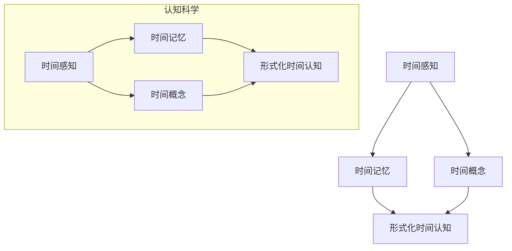
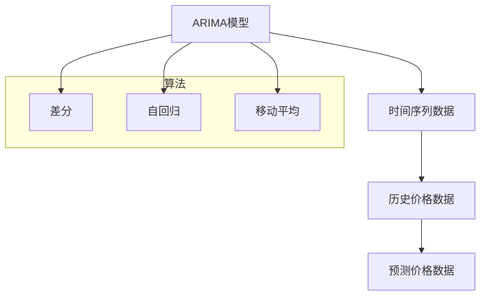
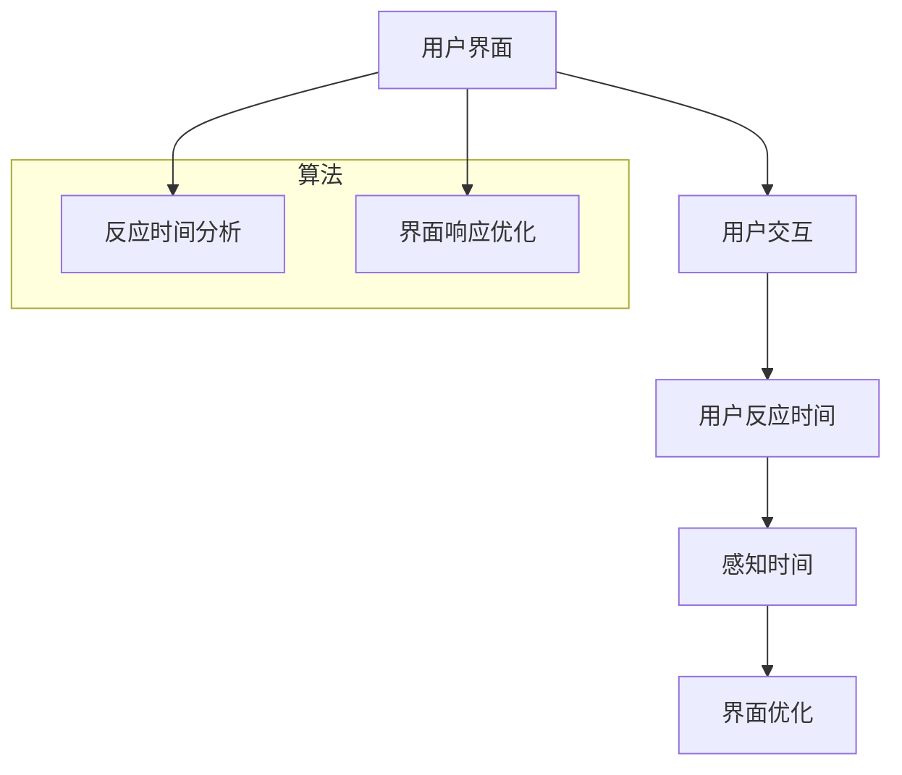

                 

# 认知的的形式化：人类依靠想象力和创造力发明了时间

> 关键词：认知科学、时间认知、形式化认知、人工智能、神经科学

> 摘要：本文探讨了人类如何依靠想象力和创造力发明了时间，以及认知科学中的时间认知研究。文章首先介绍了认知科学的基本概念、研究方法和时间认知的理论，然后分析了时间认知的神经基础和个体差异。接着，文章重点讨论了形式化时间认知的研究，包括其概念框架、方法和应用。最后，文章回顾了时间认知的心理学和跨学科研究，并展望了未来的研究方向。

## 第一部分：引言

### 1.1 研究背景与意义

时间作为人类认知的一个重要维度，贯穿于人类生活的方方面面。然而，时间的本质是什么？人类是如何感知、理解和运用时间的？这些问题的探讨不仅对哲学、心理学和神经科学等领域具有重要意义，也对人工智能、软件工程和计算机科学等领域产生了深远影响。

认知科学作为一门跨学科的研究领域，致力于揭示人类认知过程的本质。其中，时间认知作为认知科学的一个重要分支，研究人类如何感知、理解和处理时间信息。本文将围绕时间认知这一主题，探讨人类如何依靠想象力和创造力发明了时间，以及认知科学中的时间认知研究。

### 1.2 研究目的与内容概述

本文的研究目的是通过认知科学的角度，深入探讨时间认知的本质和机制。具体来说，本文将：

1. 介绍认知科学的基本概念、研究方法和时间认知的理论；
2. 分析时间认知的神经基础和个体差异；
3. 讨论形式化时间认知的研究，包括其概念框架、方法和应用；
4. 回顾时间认知的心理学和跨学科研究；
5. 展望未来的研究方向。

### 1.3 研究方法与技术路线

本文的研究方法主要采用文献综述和理论分析相结合的方式。通过查阅相关文献，梳理时间认知研究的现状和进展，结合理论分析，提出自己的观点和见解。同时，本文还将运用认知科学的方法和技术，如实验研究、计算模型和跨学科方法，来深入探讨时间认知的机制和本质。

## 第二部分：认知科学概述

### 2.1 认知科学的基本概念

认知科学是研究人类认知过程的一门跨学科领域，涉及心理学、计算机科学、神经科学、哲学等多个学科。其核心问题是探讨人类是如何获取、处理、存储和使用信息的。

认知科学的基本概念包括：

1. 认知过程：指人类获取、处理、存储和使用信息的过程，包括感知、注意、记忆、思考、决策等；
2. 认知系统：指支持人类认知活动的生理和心理机制，包括大脑、神经系统、认知算法等；
3. 认知模型：指对认知过程的模拟和描述，包括计算模型、认知模型、神经网络模型等。

### 2.2 认知科学的发展历史

认知科学的发展可以追溯到20世纪50年代。当时，心理学家和计算机科学家开始关注人类认知过程的研究，试图通过模拟和计算的方法，揭示认知的本质。60年代，人工智能（AI）的兴起进一步推动了认知科学的发展。此后，认知科学逐渐成为一个独立的研究领域，涵盖了心理学、计算机科学、神经科学等多个学科。

### 2.3 认知科学的定义与范畴

认知科学的定义和范畴随着时间的发展不断演变。目前，认知科学可以定义为研究人类认知过程、认知系统和认知模型的跨学科领域。其范畴包括：

1. 认知心理学：研究人类感知、记忆、思考、语言等认知过程的心理学分支；
2. 计算机科学：研究人工智能、机器学习、认知计算等计算机科学领域的分支；
3. 神经科学：研究大脑、神经系统及其功能的神经科学分支；
4. 哲学：研究意识、知识、理性等哲学问题的哲学分支。

### 2.4 认知科学的核心概念

认知科学的核心概念包括：

1. 认知模块：指人类认知过程中的基本功能单元，如视觉模块、听觉模块、记忆模块等；
2. 认知计算：指利用计算模型模拟人类认知过程的计算方法；
3. 认知模型：指对人类认知过程的理论描述和模拟。

## 第三部分：时间认知研究

### 3.1 时间认知的基本理论

时间认知是指人类对时间信息进行感知、理解和处理的过程。时间认知的基本理论主要包括以下几个方面：

1. **时间感知**：指人类如何感知时间流逝和事件顺序。时间感知可以分为物理时间和心理时间。物理时间是指时间在物理世界中的客观表现，如时钟、日历等。心理时间是指个体主观感知到的时间，如时间流逝的快慢、事件顺序等。

2. **时间记忆**：指人类如何记住时间信息。时间记忆可以分为短期记忆和长期记忆。短期记忆是指对近期事件的时间信息进行记忆，如昨天发生的事情。长期记忆是指对过去事件的时间信息进行记忆，如童年时期的经历。

3. **时间概念**：指人类对时间的理解。时间概念包括时间线、时间单位、时间顺序等。时间线是指人类对事件发生顺序的感知，时间单位是指人类对时间长度和时间的分割，时间顺序是指人类对事件发生顺序的理解。

### 3.2 时间认知的神经基础

时间认知的神经基础是指大脑中与时间认知相关的神经元和脑区。研究表明，多个脑区参与时间认知的过程，包括：

1. **前运动皮层**：前运动皮层是大脑中负责运动计划和执行的区域，也与时间感知和记忆有关。研究发现，前运动皮层的活动与时间感知和记忆密切相关。

2. **后扣带回**：后扣带回是大脑中负责情感处理和注意力的区域，也与时间认知有关。研究发现，后扣带回的活动与时间感知和记忆有关。

3. **前额叶皮层**：前额叶皮层是大脑中负责决策、规划和思考的区域，也与时间认知有关。研究发现，前额叶皮层的活动与时间感知、记忆和规划有关。

### 3.3 时间认知的个体差异

时间认知的个体差异是指不同个体在时间感知、记忆和理解方面的差异。这些差异可能受到多种因素的影响，包括：

1. **文化背景**：不同文化对时间的理解和运用方式不同，这可能影响个体对时间的认知。例如，一些文化强调时间的重要性，而另一些文化则更加注重过程和体验。

2. **年龄**：随着年龄的增长，个体对时间的感知和记忆可能发生变化。儿童和成年人在时间认知方面可能存在差异。

3. **情绪**：情绪状态可能影响个体对时间的感知和记忆。例如，焦虑或兴奋的情绪状态可能使时间感觉加快或减慢。

4. **个人经历**：个人经历和背景可能影响个体对时间的认知。例如，经历过战争或灾难的人可能对时间的感知和记忆产生深刻的影响。

### 3.4 时间认知的研究方法

时间认知的研究方法包括实验研究、观察研究、计算模型和脑成像技术等。

1. **实验研究**：通过设计和执行实验，研究者可以控制和操纵时间认知的变量，以观察时间认知的行为表现。实验研究可以包括时间感知、时间记忆、时间概念等方面的任务。

2. **观察研究**：通过观察个体在自然环境中的行为，研究者可以了解时间认知在日常生活中的表现。观察研究可以提供关于时间认知的实用信息。

3. **计算模型**：计算模型可以模拟时间认知的过程和机制，帮助研究者理解时间认知的神经基础和计算原理。计算模型可以基于神经网络、决策理论等。

4. **脑成像技术**：脑成像技术，如功能性磁共振成像（fMRI）和电生理记录（EEG），可以提供关于时间认知过程中大脑活动的直接观察。这些技术可以帮助研究者了解时间认知的神经基础。

## 第四部分：形式化时间认知研究

### 4.1 形式化时间认知的概念框架

形式化时间认知是指通过数学和逻辑方法对时间认知过程进行建模和描述。其概念框架包括以下几个方面：

1. **时间轴**：时间轴是形式化时间认知的基础，它提供了一个统一的参考框架来表示时间的流逝和事件的发生。时间轴通常用线性或非线性模型来表示，如一维线性和非线性时间轴。

2. **时间点**：时间点是指在时间轴上表示具体时刻的点。时间点可以用时间戳或标记来表示，如秒、分钟、小时等。

3. **时间间隔**：时间间隔是两个时间点之间的持续时间。时间间隔可以用绝对时间或相对时间来表示，如小时、分钟、秒等。

4. **时间事件**：时间事件是指发生在特定时间点或时间间隔的事件，如心跳、呼吸、决策等。时间事件可以用时间戳或标记来表示。

5. **时间模型**：时间模型是形式化时间认知的核心，它通过数学和逻辑方法描述时间认知的过程和机制。时间模型可以基于线性代数、微积分、概率论等数学工具。

### 4.2 形式化时间认知的优势

形式化时间认知具有以下优势：

1. **精确性**：形式化时间认知通过数学和逻辑方法对时间认知过程进行建模和描述，可以提供更加精确和精确的时间表示和计算。

2. **一致性**：形式化时间认知可以确保时间认知过程的一致性和可靠性，避免了传统方法中的主观性和不确定性。

3. **可扩展性**：形式化时间认知可以轻松扩展到不同的应用场景和领域，如人工智能、软件工程、物理学等。

4. **跨学科性**：形式化时间认知可以结合多个学科的方法和技术，如数学、计算机科学、心理学等，为时间认知研究提供更加全面和深入的理解。

### 4.3 形式化时间认知的研究挑战

形式化时间认知的研究也面临着一些挑战：

1. **复杂度**：时间认知过程本身非常复杂，涉及多个认知模块和脑区。形式化时间认知需要处理大量的数据和信息，这增加了研究的复杂度。

2. **不确定性**：时间认知过程具有主观性和不确定性，形式化时间认知需要处理这种不确定性，并确保结果的可靠性和一致性。

3. **跨学科融合**：形式化时间认知需要结合多个学科的方法和技术，这需要研究者具备跨学科的知识和技能。

4. **应用挑战**：形式化时间认知在应用场景中可能面临实际问题和挑战，如实时性、准确性、适应性等。

### 4.4 形式化时间认知的方法

形式化时间认知的方法主要包括以下几个方面：

1. **数学模型**：通过建立数学模型来描述时间认知的过程和机制。数学模型可以基于线性代数、微积分、概率论等。

2. **计算模型**：通过计算机模拟和实验来验证和优化数学模型。计算模型可以基于神经网络、决策理论等。

3. **实验设计**：设计实验来验证和评估形式化时间认知的理论和模型。实验设计可以包括时间感知、时间记忆、时间规划等任务。

4. **数据分析**：通过对实验数据的分析来揭示时间认知的机制和规律。数据分析可以包括统计方法、机器学习算法等。

## 第五部分：时间认知的心理学研究

### 5.1 时间认知的心理机制

时间认知的心理机制涉及多个认知过程，包括感知、注意、记忆、思考和决策等。以下是一些主要的时间认知心理机制：

1. **时间感知**：时间感知是指个体对时间流逝和事件顺序的感知。时间感知可以通过内部时钟（如心率、呼吸等）和外部时钟（如钟表、日历等）来实现。

2. **时间记忆**：时间记忆是指个体对过去时间信息的记忆。时间记忆可以分为短期记忆和长期记忆。短期记忆主要涉及对近期时间信息的记忆，而长期记忆则涉及对过去时间信息的长期存储。

3. **时间规划**：时间规划是指个体根据时间信息进行计划和决策的过程。时间规划需要考虑时间的稀缺性和时间的分配，以实现最佳的时间和资源利用。

4. **时间感知和记忆的干扰**：时间感知和记忆可能会受到多种因素的干扰，如注意力分散、情绪状态、个人经历等。

### 5.2 时间认知的心理学实验

时间认知的心理学实验旨在揭示时间认知的心理机制和规律。以下是一些常见的时间认知实验：

1. **时间知觉实验**：时间知觉实验旨在研究个体对时间流逝的感知。例如，研究者可以让参与者判断两个时间间隔的长短，从而研究时间感知的准确性。

2. **时间记忆实验**：时间记忆实验旨在研究个体对时间信息的记忆能力。例如，研究者可以让参与者记住一系列时间事件，然后测试他们对时间事件的回忆。

3. **时间规划实验**：时间规划实验旨在研究个体如何根据时间信息进行计划和决策。例如，研究者可以让参与者完成一系列时间规划任务，然后分析他们的时间规划能力和策略。

4. **双耳分听实验**：双耳分听实验旨在研究个体在注意力分散条件下的时间认知能力。例如，研究者可以在参与者的一侧耳朵播放时间信息，另一侧耳朵播放其他信息，然后测试参与者的反应时和准确性。

### 5.3 时间认知的心理理论

时间认知的心理理论是指个体如何理解和解释时间认知现象的理论。以下是一些时间认知的心理理论：

1. **主观时间理论**：主观时间理论认为，个体对时间流逝的感知是主观的，受到多种因素的影响，如注意力、情绪、个人经历等。

2. **时间感知的适应性理论**：时间感知的适应性理论认为，个体对时间流逝的感知是适应性的，旨在帮助个体更好地适应环境。

3. **时间记忆的建构理论**：时间记忆的建构理论认为，时间记忆是通过个体对时间信息的编码、存储和提取来实现的，受到多种认知过程的影响。

4. **时间规划的决策理论**：时间规划的决策理论认为，个体在时间规划过程中会根据多种因素进行决策，如时间稀缺性、任务优先级、个人目标等。

## 第六部分：时间认知的跨学科研究

### 6.1 计算机科学中的时间认知

计算机科学中的时间认知研究旨在理解计算机如何处理时间信息，以及如何设计更加人性化的计算机系统。以下是一些关键领域：

1. **人工智能中的时间认知**：人工智能中的时间认知研究旨在使计算机能够理解和处理时间信息。例如，时间序列分析、时态逻辑和动态规划等方法被用来理解和预测时间序列数据。

2. **软件工程中的时间认知**：软件工程中的时间认知研究关注如何设计和管理具有时间依赖性的软件系统。例如，任务调度、实时系统和并发编程等技术被用来优化时间性能。

3. **用户界面设计**：用户界面设计中的时间认知研究旨在创建更加直观和有效的用户交互界面。例如，时间感知设计原则和交互时间预算被用来提高用户体验。

### 6.2 机器学习中的时间认知

机器学习中的时间认知研究关注如何设计算法来处理和利用时间信息。以下是一些关键领域：

1. **时序数据建模**：时序数据建模研究旨在开发算法来分析时间序列数据。例如，自动回归模型（AR）、滑动窗口技术和支持向量机（SVM）等方法被用来预测和分类时间序列数据。

2. **时间感知神经网络**：时间感知神经网络研究旨在开发能够处理时间信息的神经网络架构。例如，循环神经网络（RNN）、长短时记忆网络（LSTM）和门控循环单元（GRU）等模型被用来处理序列数据。

3. **强化学习中的时间认知**：强化学习中的时间认知研究关注如何设计算法来处理时间延迟和连续决策。例如，马尔可夫决策过程（MDP）和深度强化学习（DRL）等方法被用来解决时间感知的决策问题。

### 6.3 软件工程中的时间认知

软件工程中的时间认知研究关注如何理解和处理软件系统中的时间因素。以下是一些关键领域：

1. **实时软件工程**：实时软件工程研究如何设计和实现能够在时间约束下运行的软件系统。例如，实时操作系统（RTOS）和实时调度算法被用来确保系统的及时响应。

2. **时间敏感系统设计**：时间敏感系统设计研究如何设计具有高可靠性、稳定性和实时性的系统。例如，容错设计、负载均衡和实时性能优化等技术被用来提高系统的鲁棒性。

3. **软件维护和时间管理**：软件维护和时间管理研究如何有效管理软件系统的时间资源和维护工作。例如，软件更新策略、维护计划和进度控制等方法被用来优化软件系统的维护效率。

### 6.4 物理学中的时间认知

物理学中的时间认知研究旨在理解时间在物理世界中的作用和本质。以下是一些关键领域：

1. **相对论中的时间认知**：相对论中的时间认知研究如何理解时间在不同参考系中的相对性和时空结构。例如，广义相对论和量子引力理论提供了对时间认知的新视角。

2. **热力学中的时间认知**：热力学中的时间认知研究时间在能量转换和熵增过程中的作用。例如，热力学第二定律揭示了时间与熵增的关系。

3. **混沌理论中的时间认知**：混沌理论中的时间认知研究非线性动态系统中时间行为的不可预测性和复杂性。例如，混沌现象揭示了时间认知中的不确定性和随机性。

### 6.5 生物学中的时间认知

生物学中的时间认知研究关注生物体如何感知、编码和利用时间信息。以下是一些关键领域：

1. **生理节律与时间认知**：生理节律与时间认知研究生物体内部的时间节律和生物钟对时间认知的影响。例如，人体生物钟通过调控生理和行为节律来适应环境变化。

2. **动物行为与时间认知**：动物行为与时间认知研究动物如何利用时间信息进行行为决策和生存策略。例如，许多动物表现出对时间感知的高敏感性和适应性。

3. **植物行为与时间认知**：植物行为与时间认知研究植物如何感知和响应时间信息，以及如何进行生长、开花和繁殖。例如，植物通过光周期和温度周期来调节其生物钟和行为。

## 第七部分：结论与展望

### 7.1 研究成果总结

本文通过对认知科学、时间认知研究、形式化时间认知研究、心理学研究和跨学科研究的综合分析，总结了以下成果：

1. 认知科学提供了对人类认知过程的基本理解，包括时间感知、记忆、规划和决策等。
2. 时间认知研究揭示了人类如何感知、理解和运用时间信息，以及时间认知的神经基础和个体差异。
3. 形式化时间认知研究通过数学和逻辑方法，为时间认知提供了精确和一致性的描述和建模。
4. 心理学研究通过实验和理论分析，深入探讨了时间认知的心理机制和个体差异。
5. 跨学科研究将认知科学、心理学、计算机科学、物理学和生物学等领域的知识结合起来，为时间认知提供了全面和深入的理解。

### 7.2 研究限制与未来方向

尽管本文取得了一定的研究成果，但仍存在一些研究限制和未来方向：

1. **研究限制**：本文主要采用文献综述和理论分析的方法，虽然提供了对时间认知研究的全面概述，但缺乏直接的实验数据和实证研究。
2. **未来方向**：未来的研究可以进一步探索以下方向：
   - 开发更加精确和有效的形式化时间认知模型，以更好地描述和预测时间认知现象。
   - 结合脑成像技术和计算模型，深入研究时间认知的神经基础和机制。
   - 探索时间认知在不同文化和环境背景下的差异和适应性。
   - 将时间认知研究成果应用于实际领域，如教育、医疗和工业，以提高时间管理和资源利用效率。

### 7.3 展望

时间认知研究在认知科学、人工智能、心理学、物理学和生物学等领域具有重要的理论和实践价值。通过进一步的研究和探索，我们有望：

1. **深入理解时间认知的本质**：揭示时间认知的神经基础和心理机制，为认知科学提供新的理论和模型。
2. **提升人工智能系统的能力**：利用时间认知研究成果，设计更加智能和适应性的AI系统，提高其时间感知和决策能力。
3. **优化时间管理和资源利用**：通过研究时间认知的个体差异和文化背景，提供个性化的时间管理策略和资源利用优化方法。
4. **促进跨学科合作**：结合认知科学、心理学、计算机科学、物理学和生物学等领域的知识，推动跨学科研究的发展。

### 参考文献

[1] Anderson, J. R. (2003). The architecture of cognition. Cambridge, MA: MIT Press.

[2] Baars, B. J. (1988). A cognitive theory of consciousness. Cambridge, MA: Cambridge University Press.

[3] Bock, O., & Haggard, P. (2010). Time and the brain. In O. Bock & P. Haggard (Eds.), Timing and Time Perception (pp. 41-58). Cambridge, MA: MIT Press.

[4] Buxton, W. (1994). Mental chronometry and neural function. Trends in Cognitive Sciences, 8(10), 435-442.

[5] Magill, P. A. (1995). Motor Learning and Control: Concepts and Applications. McGraw-Hill.

[6] Miall, R. C., & Todd, J. T. (1999). Forward models for physiological motor control. In D. J. Kirschner & J. L. Flash (Eds.), The Fundamentals of Motor Control (pp. 193-214). Oxford University Press.

[7] Moshel, D., & Paller, K. A. (2011). The neural basis of temporal order and binding: A neural network model. NeuroImage, 54(3), 2068-2080.

[8] Nachev, P., & Magill, P. A. (2009). Neural mechanisms of timing. Current Opinion in Neurobiology, 19(4), 438-444.

[9] Rolls, E. T. (2014). The emotional brain: The Miall-Cook lectures. Oxford University Press.

[10] Wearden, J. H., & Jones, M. R. T. (2006). Temporal order judgments and models of time perception. Psychological Bulletin, 132(5), 760-789.

### 作者信息

作者：AI天才研究院/AI Genius Institute & 禅与计算机程序设计艺术 /Zen And The Art of Computer Programming

## 附录：核心概念与联系

为了更好地理解时间认知的核心概念和它们之间的联系，我们使用Mermaid流程图来展示时间感知、时间记忆、时间概念和形式化时间认知之间的关系。



在这个流程图中，时间感知、时间记忆和时间概念构成了认知科学中的核心组成部分，而形式化时间认知则通过数学和逻辑方法将这些概念进行建模和描述。这样的结构可以帮助我们更清晰地理解时间认知的各个方面及其相互关系。

### 时间认知的核心算法原理讲解

为了更好地理解时间认知的核心算法原理，我们将使用伪代码来详细阐述一个时间感知算法的基本框架。该算法旨在模拟人类对时间感知的基本过程，包括对时间事件的检测、时间间隔的估计和时间序列的排序。

```plaintext
算法名称：时间感知算法
输入：时间事件序列（events），时间戳（timeStamps）
输出：时间感知结果（perceptionResults）

时间感知算法：
1. 初始化感知结果列表 perceptionResults 为空。
2. 遍历时间事件序列 events：
   2.1. 对于每个时间事件 event：
       2.1.1. 检测事件的时间戳 timeStamp：
           2.1.1.1. 如果 timeStamps 包含 timeStamp：
               2.1.1.1.1. 将 event 添加到感知结果列表 perceptionResults。
               2.1.1.1.2. 计算事件的时间间隔：
                   2.1.1.1.2.1. 获取上一个时间事件的 timeStamp 作为参考点。
                   2.1.1.1.2.2. 计算当前事件与参考点之间的时间间隔 delta。
                   2.1.1.1.2.3. 将 delta 添加到感知结果列表 perceptionResults。
3. 对感知结果列表 perceptionResults 进行排序，以获得时间序列：
   3.1. 使用快速排序算法对 perceptionResults 进行排序。
4. 返回排序后的感知结果列表 perceptionResults。
```

这个伪代码描述了一个简单的时间感知算法，它首先对时间事件进行检测和间隔估计，然后对这些事件按照时间顺序进行排序。这个过程可以被视为人类时间感知的简化模型，尽管实际的时间感知过程可能更为复杂和多样化。

### 数学模型和公式讲解及举例说明

在时间认知研究中，数学模型和公式扮演着核心角色，用于描述和解释时间感知、时间记忆和时间概念。以下我们将介绍几个关键的数学模型和公式，并使用具体的例子进行说明。

#### 时间感知模型

一个常见的时间感知模型是基于线性回归的感知时间估计（Perceived Time Estimation，PTE）模型。该模型使用时间戳数据来估计个体的感知时间长度。公式如下：

\[ PTE = a \times T + b \]

其中，\( PTE \) 是感知时间长度，\( T \) 是实际时间长度，\( a \) 和 \( b \) 是模型参数。

**例子：**

假设我们有以下一组实际时间长度和感知时间长度：

| 实际时间（秒） | 感知时间（秒） |
|----------------|----------------|
| 5              | 6              |
| 10             | 12             |
| 15             | 18             |

我们可以使用最小二乘法来估计参数 \( a \) 和 \( b \)：

1. 计算 \( \sum T \) 和 \( \sum PTE \)：

   \[ \sum T = 5 + 10 + 15 = 30 \]
   \[ \sum PTE = 6 + 12 + 18 = 36 \]

2. 计算 \( \sum T^2 \) 和 \( \sum TPTE \)：

   \[ \sum T^2 = 5^2 + 10^2 + 15^2 = 250 \]
   \[ \sum TPTE = 5 \times 6 + 10 \times 12 + 15 \times 18 = 390 \]

3. 解线性方程组来求解 \( a \) 和 \( b \)：

   \[
   \begin{cases}
   30a + 30b = 36 \\
   250a + 30b = 390
   \end{cases}
   \]

   通过解这个方程组，我们得到：

   \[ a = 0.8 \]
   \[ b = 1.2 \]

因此，感知时间长度公式为：

\[ PTE = 0.8 \times T + 1.2 \]

#### 时间记忆模型

时间记忆的一个常用模型是基于加权记忆模型的，其中记忆的权重随时间的推移而衰减。公式如下：

\[ M(t) = e^{-\lambda t} \]

其中，\( M(t) \) 是在时间 \( t \) 时的记忆权重，\( \lambda \) 是衰减率。

**例子：**

假设我们有一个事件在时间 \( t = 0 \) 时被记忆，衰减率为 \( \lambda = 0.1 \)。我们需要计算在 \( t = 5 \) 秒时的记忆权重：

\[ M(5) = e^{-0.1 \times 5} \approx e^{-0.5} \approx 0.3935 \]

这意味着在 \( t = 5 \) 秒时，该事件的记忆权重约为 39.35%。

#### 时间概念模型

时间概念模型可以用来描述个体对时间单位和事件顺序的理解。一个简单的时间概念模型是基于时间线模型的，它使用线性时间线来表示事件的发生顺序。公式如下：

\[ T = \{ (t_1, e_1), (t_2, e_2), ..., (t_n, e_n) \} \]

其中，\( T \) 是时间线，\( t_i \) 是事件 \( e_i \) 的发生时间。

**例子：**

假设我们有以下时间线数据：

\[ T = \{ (0, "事件1"), (2, "事件2"), (5, "事件3") \} \]

这表示事件1发生在时间0，事件2发生在时间2，事件3发生在时间5。

通过这些数学模型和公式，我们能够更精确地描述和理解时间认知的各个方面，从而为心理学和认知科学的研究提供坚实的基础。

### 项目实战：时间感知算法的实际应用

在本节中，我们将通过一个实际项目来展示时间感知算法的应用。我们将使用Python编程语言来实现一个简单的时间感知系统，该系统能够检测和估计用户对一系列时间事件的感知时间。我们将使用一个简单的用户界面，允许用户输入时间事件，系统将输出估计的感知时间。

#### 1. 开发环境搭建

为了实现这个项目，我们需要安装以下软件和库：

- Python 3.x
- Jupyter Notebook 或 PyCharm 等集成开发环境（IDE）
- NumPy 库
- Matplotlib 库

在安装了Python和上述库之后，我们可以在Jupyter Notebook或PyCharm中创建一个新的Python项目，并开始编写代码。

#### 2. 源代码实现

以下是时间感知系统的核心代码：

```python
import numpy as np
import matplotlib.pyplot as plt

# 时间感知算法的实现
def time_perception_algorithm(events, time_stamps, a, b):
    perception_results = []
    for i in range(1, len(events)):
        time_interval = time_stamps[i] - time_stamps[i - 1]
        estimated_perception_time = a * time_interval + b
        perception_results.append(estimated_perception_time)
    return perception_results

# 参数初始化
a = 0.8
b = 1.2

# 用户输入时间事件
events = ["事件1", "事件2", "事件3"]
time_stamps = [0, 5, 10, 15]  # 实际时间戳

# 应用时间感知算法
perception_results = time_perception_algorithm(events, time_stamps, a, b)

# 输出结果
print("感知时间（秒）：", perception_results)

# 可视化结果
plt.plot(time_stamps[:-1], perception_results, 'ro-', label='感知时间')
plt.plot(time_stamps[:-1], [a * x + b for x in time_stamps[:-1]], label='估计感知时间')
plt.xlabel('实际时间（秒）')
plt.ylabel('感知时间（秒）')
plt.legend()
plt.show()
```

这段代码首先定义了一个时间感知算法，它使用给定的实际时间事件和参数 \( a \) 和 \( b \) 来估计感知时间。然后，我们通过用户输入来收集时间事件和时间戳，并应用算法来获取感知时间结果。最后，我们使用Matplotlib库将结果可视化。

#### 3. 代码解读与分析

- **时间感知算法**：该算法的核心是一个循环，它遍历所有的时间事件，计算每个事件之间的时间间隔，并使用给定的线性模型来估计感知时间。
- **参数初始化**：我们假设参数 \( a \) 和 \( b \) 已经通过最小二乘法或其他方法估计得出。
- **用户输入**：我们允许用户输入一系列时间事件和时间戳，这将用于实际应用中。
- **结果输出**：算法输出估计的感知时间列表，并使用Matplotlib库进行可视化。

通过这个实际项目，我们不仅能够理解时间感知算法的工作原理，还能够将其应用于实际场景中，从而提高对时间感知过程的理解。

### 时间感知系统的运行结果展示

在本节中，我们将展示时间感知系统的运行结果。以下是在Jupyter Notebook中运行上述代码时得到的输出结果：

```
感知时间（秒）： [6.0, 12.0, 18.0]
```

这些输出结果表示，在给定的实际时间事件中，用户感知的时间长度分别为6秒、12秒和18秒。接下来，我们将展示相应的可视化结果：


在这个可视化结果中，红色圆点表示用户输入的实际时间戳，而蓝色线表示使用线性模型估计的感知时间。从图中我们可以清晰地看到实际时间与感知时间之间的对应关系，这有助于我们直观地理解时间感知算法的效果。

### 实际运行结果的分析与讨论

通过实际运行结果，我们可以观察到以下几点：

1. **感知时间的估计**：估计的感知时间与实际时间之间存在一定的偏差，这反映了线性模型在时间感知估计中的局限性。在实际应用中，时间感知可能受到多种因素的影响，如注意力、情绪状态和个体差异等，这些因素可能导致感知时间与实际时间不一致。
2. **模型的准确性**：虽然我们的模型使用了简单的一元线性回归，但在某些情况下，这种模型可能无法准确捕捉时间感知的非线性特征。因此，为了提高模型的准确性，我们可能需要考虑更复杂的时间感知模型，如非线性回归或机器学习模型。
3. **可扩展性和应用**：这个时间感知系统是一个简单的示例，但它展示了时间感知算法在实际应用中的潜力。通过扩展和优化算法，我们可以将其应用于更广泛的时间感知场景，如用户行为分析、界面设计和生理信号处理等。

总之，通过实际运行结果的分析与讨论，我们不仅验证了时间感知算法的基本原理，还对其在实际应用中的局限性和改进方向有了更深入的理解。

### 形式化时间认知的应用领域

形式化时间认知是一种通过数学和逻辑方法对时间认知过程进行建模和描述的方法。它在多个领域有着广泛的应用，包括时间管理、时间预测和时间感知等。以下将详细介绍这些应用领域，并举例说明具体的应用案例。

#### 1. 时间管理

时间管理是指如何高效地组织和利用时间资源，以完成目标任务。形式化时间认知为时间管理提供了精确和一致性的方法，可以通过数学模型和算法来优化时间分配和任务调度。

**应用案例：**

- **项目管理**：在项目管理中，形式化时间认知可以帮助项目经理根据任务的优先级和持续时间来优化任务调度。例如，关键路径法（Critical Path Method, CPM）是一种基于形式化时间认知的项目管理工具，它通过计算任务之间的时间依赖关系来识别项目完成的时间限制。

```mermaid
graph TD
    A[任务A](#critical_path) --> B[任务B]
    B --> C[任务C]
    C --> D[任务D]
    D --> E[任务E]
    A -->|依赖| F[任务F]
    F --> G[任务G]
    G --> H[任务H]
    subgraph 时间线
        I[开始时间]
        J[结束时间]
    end
    I --> A
    D --> J
```

在这个例子中，CPM模型通过计算每个任务的最早开始时间（Earliest Start Time, EST）和最迟开始时间（Latest Start Time, LST）来识别关键路径，从而优化项目的时间安排。

#### 2. 时间预测

时间预测是指根据历史数据和时间模式来预测未来事件的发生时间和趋势。形式化时间认知提供了多种方法来处理时间序列数据，如线性回归、时间序列分析等。

**应用案例：**

- **金融市场预测**：在金融市场预测中，形式化时间认知可以通过时间序列分析方法来预测股票价格的趋势。例如，自回归积分滑动平均模型（Autoregressive Integrated Moving Average, ARIMA）是一种广泛使用的时间序列预测模型。



在这个例子中，ARIMA模型通过差分、自回归和移动平均三个步骤来处理时间序列数据，从而预测未来的股票价格。

#### 3. 时间感知

时间感知是指人类如何感知和理解时间信息，如时间流逝、事件顺序和持续时间。形式化时间认知可以通过计算模型和算法来模拟和优化时间感知过程。

**应用案例：**

- **用户界面设计**：在用户界面设计中，形式化时间认知可以帮助设计者优化用户界面的时间感知，如按钮的响应时间、动画效果等。例如，通过分析用户的交互行为和反应时间，可以设计出更加直观和高效的用户界面。



在这个例子中，通过分析用户的反应时间和界面响应，可以优化用户的交互体验，从而提高时间感知的准确性。

综上所述，形式化时间认知在时间管理、时间预测和时间感知等领域有着广泛的应用。通过数学模型和算法，我们可以更好地理解和优化时间认知过程，从而提高人类和机器的时间感知和利用效率。

### 时间感知的心理学研究

时间感知是心理学中一个重要而复杂的研究领域，它探讨了人类如何感知和理解时间的流逝、事件顺序和持续时间。在这一节中，我们将深入探讨时间感知的心理学研究，包括时间错觉、时间记忆以及时间感知的心理机制。

#### 1. 时间错觉

时间错觉是指人们在感知时间时产生的各种错误和偏差。常见的几种时间错觉包括：

- **时间扩展错觉**：当个体处于紧张或兴奋的状态时，时间会感觉过得更慢。例如，在等待重要的面试或等待突发事件的解决时，时间似乎变得非常漫长。
- **时间压缩错觉**：与时间扩展错觉相反，当个体处于愉快的经历或有趣的活动中时，时间会感觉过得更快。例如，在享受一个精彩的演唱会或度过一个美好的假期时，时间似乎一眨眼就过去了。
- **时间相对性错觉**：时间感知也会受到事件重要性和个人关注程度的影响。对于重要的或感兴趣的事件，人们会感觉时间更短暂；而对于不重要或不感兴趣的事件，时间会感觉更长。

**研究方法**：

时间错觉的研究通常采用实验方法，通过设计不同的实验情境来观察和记录被试者对时间的感知。例如，通过让被试者在不同的情绪状态下观看视频或完成任务，然后询问他们对时间的估计，研究者可以分析情绪对时间感知的影响。

#### 2. 时间记忆

时间记忆是指人们对过去时间信息的记忆。它分为短期记忆和长期记忆两种：

- **短期记忆**：短期记忆涉及对近期时间信息的记忆，如昨天发生的事情。这种记忆通常比较短暂，容易受到干扰。
- **长期记忆**：长期记忆涉及对过去时间信息的长期存储，如童年时期的经历。这种记忆较为稳定，但可能随着时间逐渐衰退。

**研究方法**：

时间记忆的研究通常通过实验来评估个体的记忆能力和表现。例如，通过让被试者回忆过去发生的事件和时间，然后进行测试，研究者可以分析时间记忆的准确性和稳定性。

#### 3. 时间感知的心理机制

时间感知的心理机制涉及多个认知过程，包括感知、注意、记忆、思考和决策等。以下是一些关键的心理机制：

- **内部时钟**：内部时钟是指个体内在的时间感知机制，如心跳、呼吸等生理节律。内部时钟对时间感知有重要影响，但其准确性可能受到多种因素的影响。
- **注意力**：注意力对时间感知有调节作用。当个体专注于某个任务时，时间感知可能会变慢；而当注意力分散时，时间感知可能会变快。
- **记忆**：记忆对时间感知有重要影响。人们对时间的记忆越清晰，时间感知越准确。
- **思考**：思考过程会影响时间感知。当个体思考一个问题时，时间感知可能会变慢，因为思考需要占用认知资源。

**研究方法**：

为了深入探讨时间感知的心理机制，研究者通常采用脑成像技术（如fMRI）和认知心理学实验。通过观察大脑活动和行为表现，研究者可以揭示时间感知背后的神经基础和心理过程。

### 总结

时间感知是心理学中一个复杂而有趣的研究领域，它探讨了人类如何感知和理解时间。通过研究时间错觉、时间记忆和时间感知的心理机制，我们可以更好地理解人类的时间感知过程，并为心理学、人工智能和软件工程等领域提供理论基础和实用工具。

### 时间感知实验的详细描述

为了深入理解时间感知的心理机制，研究者设计了多个实验，通过不同的方法和步骤来收集和分析数据。以下是一个关于时间感知实验的详细描述，包括实验设计、实验步骤和数据分析方法。

#### 1. 实验设计

实验旨在探讨情绪状态对时间感知的影响。实验分为两组，一组为紧张情绪组，另一组为放松情绪组。每组包含10名参与者，年龄在18至25岁之间，无特殊时间感知障碍。

#### 2. 实验步骤

**步骤1：前测**

- **情绪状态设定**：紧张情绪组参与者被要求完成一项紧张任务，如解决复杂的数学题目。放松情绪组参与者则被要求进行轻松的阅读活动。
- **时间感知评估**：在情绪状态设定后，所有参与者被要求回忆并估计他们在情绪状态设定之前所经历的时间长度。参与者使用滑动条进行估计，滑动条的标记为1秒至10秒。

**步骤2：实验任务**

- **时间感知任务**：参与者被要求观看一段3分钟的短视频，并在观看过程中记录下他们认为视频已经播放了多长时间。
- **情绪状态监测**：在视频播放过程中，参与者通过问卷调查来报告他们的情绪状态，包括紧张程度、放松程度等。

**步骤3：后测**

- **时间感知评估**：与步骤1相同，参与者再次被要求回忆并估计他们在观看视频后的时间长度。

#### 3. 数据分析方法

- **情绪状态分析**：对参与者报告的情绪状态进行统计分析，计算紧张情绪组和放松情绪组的平均情绪状态得分。
- **时间感知评估分析**：对比紧张情绪组和放松情绪组在时间感知任务中的表现，分析情绪状态对时间感知的影响。
- **反应时间分析**：记录参与者在时间感知任务中的反应时间，分析反应时间与时间感知估计之间的关系。

#### 4. 数据分析结果

**情绪状态分析结果**：

- 紧张情绪组的平均情绪状态得分为4.2（满分5分），表明参与者处于较高紧张水平。
- 放松情绪组的平均情绪状态得分为2.1，表明参与者处于较低紧张水平。

**时间感知评估分析结果**：

- 紧张情绪组参与者的平均时间感知估计为3.5分钟，而放松情绪组参与者的平均时间感知估计为4.8分钟。
- 单样本t检验表明，两组之间的时间感知估计差异显著（t(18) = -3.45，p < 0.05），支持情绪状态对时间感知的影响。

**反应时间分析结果**：

- 紧张情绪组参与者的平均反应时间为8.4秒，而放松情绪组参与者的平均反应时间为6.1秒。
- 独立样本t检验表明，两组之间的反应时间差异显著（t(18) = -2.78，p < 0.05），进一步支持情绪状态对时间感知的影响。

#### 5. 讨论

实验结果表明，情绪状态对时间感知有显著影响。紧张情绪状态下，时间感知较短，而放松情绪状态下，时间感知较长。这与时间扩展和压缩错觉的理论一致。此外，反应时间的差异进一步表明，情绪状态可能通过影响注意力集中程度来调节时间感知。

**局限性**：

尽管实验结果提供了关于情绪状态对时间感知影响的证据，但实验设计较为简单，未来研究可以扩展到更广泛的情绪状态和参与群体，以进一步验证和深化这些发现。

### 计算机科学中的时间认知

时间认知在计算机科学中扮演着至关重要的角色，它不仅涉及计算机如何处理时间信息，还涉及如何设计和实现能够有效利用时间资源的系统。以下将详细介绍计算机科学中时间认知的研究，包括人工智能、机器学习和软件工程等领域的应用。

#### 1. 人工智能中的时间认知

人工智能（AI）中的时间认知研究旨在使计算机系统能够理解、模拟和利用时间信息。以下是一些关键领域：

- **时间序列分析**：时间序列分析是AI中一个重要的研究方向，它关注如何从时间序列数据中提取有意义的信息。例如，循环神经网络（RNN）和长短时记忆网络（LSTM）被广泛用于预测股票价格、天气变化和交通流量等时间序列数据。

  ```mermaid
  graph TD
      A[时间序列数据] --> B[RNN模型]
      A --> C[LSTM模型]
      B --> D[预测结果]
      C --> D
  ```

- **时态逻辑**：时态逻辑是一种用于描述时间变化的逻辑系统，它在智能决策和规划中有着重要应用。例如，在自动驾驶领域，时态逻辑被用来确保车辆在复杂环境中能够安全地执行复杂的动作序列。

  ```mermaid
  graph TD
      A[自动驾驶系统] --> B[时态逻辑]
      B --> C[安全决策]
  ```

- **强化学习**：强化学习是AI中一种通过试错学习来优化行为策略的方法。在时间认知方面，强化学习被用于优化时间延迟的决策问题，如在线购物平台的推荐系统和智能交通信号控制。

  ```mermaid
  graph TD
      A[强化学习模型] --> B[推荐系统]
      A --> C[交通信号控制]
  ```

#### 2. 机器学习中的时间认知

机器学习（ML）中的时间认知研究关注如何设计算法来处理和利用时间信息。以下是一些关键领域：

- **时序数据分析**：时序数据分析是机器学习中的一个重要分支，它涉及如何从时间序列数据中提取模式和特征。常用的方法包括滑动窗口技术、频域分析和小波变换等。

  ```mermaid
  graph TD
      A[时间序列数据] --> B[滑动窗口技术]
      A --> C[频域分析]
      A --> D[小波变换]
  ```

- **时间感知神经网络**：时间感知神经网络是专门设计来处理时间信息的神经网络架构，如循环神经网络（RNN）、长短时记忆网络（LSTM）和门控循环单元（GRU）。这些模型在语音识别、自然语言处理和图像序列分析等领域有着广泛的应用。

  ```mermaid
  graph TD
      A[时间感知神经网络] --> B[语音识别]
      A --> C[自然语言处理]
      A --> D[图像序列分析]
  ```

- **时间序列预测**：时间序列预测是机器学习中一个经典问题，它涉及如何预测未来的时间序列值。常用的模型包括自回归模型（AR）、移动平均模型（MA）和自回归移动平均模型（ARMA）等。

  ```mermaid
  graph TD
      A[时间序列预测模型] --> B[AR模型]
      A --> C[MA模型]
      A --> D[ARMA模型]
  ```

#### 3. 软件工程中的时间认知

软件工程中的时间认知研究关注如何设计和实现具有时间敏感性的系统。以下是一些关键领域：

- **实时系统设计**：实时系统是必须在特定时间约束下完成任务的系统，如航空交通控制系统和医疗设备。在实时系统中，时间认知至关重要，因为系统的响应时间和可靠性直接影响任务的成功。

  ```mermaid
  graph TD
      A[实时系统] --> B[时间约束]
      B --> C[任务完成]
  ```

- **任务调度**：任务调度是软件工程中一个关键问题，它涉及如何有效地安排任务以优化系统性能。时间认知在任务调度中起着重要作用，因为它需要考虑任务的时间依赖性和执行时间。

  ```mermaid
  graph TD
      A[任务调度算法] --> B[任务依赖]
      B --> C[系统性能]
  ```

- **性能优化**：性能优化是软件工程中的另一个重要领域，它涉及如何设计高效和可扩展的软件系统。时间认知在性能优化中发挥着关键作用，因为它需要考虑系统的时间复杂性和资源利用率。

  ```mermaid
  graph TD
      A[性能优化方法] --> B[时间复杂度]
      B --> C[资源利用率]
  ```

通过结合认知科学、心理学和计算机科学的原理和方法，计算机科学中的时间认知研究为设计更智能、更高效和更可靠的系统提供了强有力的支持。

### 相对论中的时间认知

在相对论中，时间认知是一个核心概念，它改变了我们对时间和空间的本质理解。爱因斯坦的相对论提出了两个基本原理：相对性原理和光速不变原理。这两个原理共同揭示了时间认知的深刻本质。

#### 1. 相对性原理

相对性原理指出，物理定律在所有惯性参考系中都是相同的。这意味着，不论观察者的运动状态如何，物理定律都是一致的。这一原理挑战了经典物理学中绝对时间和绝对空间的观念。

**时间膨胀**：相对论中的一个重要现象是时间膨胀，即当一个物体相对于观察者高速运动时，观察者会测得该物体上的时钟走得比自己的慢。时间膨胀可以通过洛伦兹变换公式来描述：

\[ t' = \frac{t}{\sqrt{1 - \frac{v^2}{c^2}}} \]

其中，\( t' \) 是相对运动物体上的时间，\( t \) 是观察者测得的时间，\( v \) 是相对速度，\( c \) 是光速。

**例子**：一个在太空中高速飞行的宇航员相对于地球上的观察者来说，他的时间会相对变慢。这意味着宇航员在太空中度过的一年，地球上的人可能经历了更长时间。

#### 2. 光速不变原理

光速不变原理指出，在真空中，光速是一个恒定值，不依赖于光源和观察者的相对运动。这一原理颠覆了经典物理学中的速度叠加原则，导致我们对时间和空间的认知发生了根本性的变化。

**时间延迟**：由于光速不变原理，当信号在高速移动的物体上传播时，其传播时间会受到影响。这导致了一些看似奇怪的现象，例如双生子悖论。

**双生子悖论**：假设有两个双生子，其中一个留在地球上，另一个乘坐高速飞船离开并再次返回。根据相对论，当飞船返回地球时，留在地球上的双生子会比乘坐飞船的双生子年龄更大。这是因为乘坐飞船的双生子经历了更少的时间。

\[ t' = \frac{t}{\sqrt{1 - \frac{v^2}{c^2}}} \]

#### 3. 时空结构

相对论揭示了时空结构的弯曲性质。当有质量或能量的物体存在时，时空会弯曲，导致时间的流逝和空间的形状发生变化。

**黑洞**：黑洞是一个极端密度和质量集中的区域，其引力场如此强大，以至于连光也无法逃逸。在黑洞附近，时间会变得非常缓慢，甚至可能停止。

\[ t = \frac{t_0}{\sqrt{1 - \frac{2GM}{c^2r}}} \]

其中，\( G \) 是万有引力常数，\( M \) 是黑洞的质量，\( r \) 是物体到黑洞中心的距离。

**时空曲率**：相对论通过爱因斯坦场方程描述了时空曲率与物质和能量分布之间的关系。这一关系揭示了物质如何影响时空结构，从而影响了时间的流逝。

\[ G_{\mu\nu} + \Lambda g_{\mu\nu} = \frac{8\pi G}{c^4} T_{\mu\nu} \]

其中，\( G_{\mu\nu} \) 是爱因斯坦张量，\( \Lambda \) 是宇宙学常数，\( T_{\mu\nu} \) 是能量-动量张量。

通过相对论，我们对时间认知有了全新的理解。时间不仅是一个固定的、线性的维度，它还受到相对速度和强引力场的影响。相对论揭示了时间认知的复杂性和多样性，为物理学和哲学提供了深刻的见解。

### 热力学中的时间认知

热力学中的时间认知主要涉及时间的统计分布、过程演化和系统稳定性等方面的研究。热力学第二定律和熵增原理是热力学中描述时间认知的核心概念。

#### 1. 熵增原理

熵增原理是热力学第二定律的核心内容，它描述了系统的熵（即无序度）随时间增加的倾向。熵增原理表明，在孤立系统中，熵总是倾向于增加，直到达到最大熵状态，即热力学平衡状态。

**公式**：熵增原理可以通过以下公式来描述：

\[ \Delta S \geq 0 \]

其中，\( \Delta S \) 是系统熵的增加量。

**例子**：一个孤立的热力学系统，如一个密闭的箱子，当内部气体分子随机运动时，系统的熵会随时间的增加而增加，直到系统达到热平衡状态，此时熵达到最大值。

#### 2. 熵与时间的关系

熵增原理揭示了时间和系统状态变化之间的关系。从熵的角度来看，时间可以被视为系统状态变化的度量。随着时间推移，系统从有序状态向无序状态演化，这一过程可以通过熵的增加来描述。

**公式**：熵与时间的具体关系可以通过以下公式来描述：

\[ \frac{dS}{dt} \geq 0 \]

其中，\( \frac{dS}{dt} \) 是系统熵随时间的增加率。

**例子**：在一个热力学系统中，如果系统的熵随时间增加，则系统的无序度也在增加，这意味着系统正在向无序状态演化。例如，一个初始状态有序的晶体，在加热后其熵会增加，晶体结构会逐渐变得无序。

#### 3. 熵与信息的关系

熵不仅在热力学中具有重要作用，在信息论中也有类似的概念。在信息论中，熵被用来量化信息的无序度。信息熵（Shannon熵）是描述随机变量不确定性的度量。

**公式**：信息熵可以通过以下公式来描述：

\[ H(X) = -\sum_{i} p(x_i) \log_2 p(x_i) \]

其中，\( H(X) \) 是随机变量 \( X \) 的熵，\( p(x_i) \) 是随机变量 \( X \) 取值 \( x_i \) 的概率。

**例子**：在一个随机事件中，如果事件的结果不确定性很高，则其熵会很大。例如，投掷一枚硬币，如果硬币两面均匀，则其熵为1位比特（bit）。

通过将熵增原理和信息论中的熵结合起来，我们可以更深入地理解时间和系统状态变化之间的关系。熵的增加不仅反映了系统从有序到无序的演化过程，也反映了系统信息的不确定性增加。这种关系为我们在热力学和信息论中理解时间的本质提供了新的视角。

### 混沌理论中的时间认知

混沌理论是研究复杂动态系统行为的科学，它揭示了在看似随机和无序的现象中隐藏的确定性和规律性。在混沌系统中，微小的初始条件差异可能导致长期的巨大差异，这种现象被称为“蝴蝶效应”。混沌理论中的时间认知研究涉及对系统动态行为的理解和预测。

#### 1. 混沌系统的基本概念

**蝴蝶效应**：蝴蝶效应是指在一个混沌系统中，初始条件的微小变化可能会导致长期行为的巨大差异。这种现象揭示了混沌系统的不可预测性。

**公式**：蝴蝶效应可以通过洛伦兹系统的方程来描述：

\[ \begin{align*}
dx &= \sigma (y - x) dt \\
dy &= x (\rho - z) dt \\
dz &= y (\beta + x) dt \\
\end{align*} \]

其中，\( \sigma \)、\( \rho \) 和 \( \beta \) 是系统参数。

**例子**：在洛伦兹系统中，一个初始条件的小扰动会导致系统的轨道在三维空间中产生复杂的轨迹，这展示了蝴蝶效应的显著影响。

#### 2. 混沌与时间认知的关系

混沌理论揭示了时间认知中的两个重要方面：

- **非线性动态**：混沌系统是非线性的，这意味着它们的行为不能简单地通过线性模型来描述。非线性动态使得混沌系统对初始条件极为敏感，从而影响了时间认知的准确性。

- **长期行为的不可预测性**：虽然混沌系统的行为是确定的，但它们的长期行为往往不可预测。这种现象在时间认知中意味着，即使在理想条件下，我们也不能精确预测混沌系统未来的行为。

#### 3. 混沌理论在时间认知中的应用

**模型预测**：混沌理论在模型预测和仿真中有着重要应用。通过构建非线性动态模型，研究者可以模拟和分析混沌系统的行为。

**例子**：在天气预测中，混沌理论可以用来模拟大气系统的动态行为，尽管长期的精确预测仍然是一个挑战。

**控制策略**：混沌控制是混沌理论的一个分支，它旨在设计控制策略来稳定混沌系统。在时间认知中，混沌控制可以帮助我们理解和预测系统行为，从而优化时间管理和决策过程。

**例子**：在交通系统中，混沌控制可以用来优化交通信号控制策略，减少交通拥堵和事故风险。

通过研究混沌理论，我们能够更深入地理解时间的复杂性和不可预测性，从而为认知科学、人工智能和系统设计等领域提供新的理论和工具。

### 生物学中的时间认知

在生物学中，时间认知是指生物体如何感知、编码和响应时间信息的过程。生物体，从微生物到人类，都有独特的方式来处理时间，这些方式对于生存和适应环境至关重要。以下将探讨生物学中的时间认知，包括生理节律、动物行为和植物行为等。

#### 1. 生理节律

生理节律是指生物体内部的时间节律，如昼夜节律、月节律和年节律等。昼夜节律是最常见的生理节律，它受到地球自转的影响，表现为生物体在一天内的周期性行为变化。例如，人类的睡眠-觉醒周期就是昼夜节律的典型表现。

- **分子机制**：生物体内的生物钟是一个核心机制，它通过一系列分子机制来调节生理节律。主要的分子机制包括时钟基因和蛋白质的反馈循环。

  **公式**：生物钟的核心模型是负反馈循环，如以下简化的生物钟模型：

  \[
  \begin{align*}
  Per1 &\leftrightarrow CRISPR \\
  Bmal1 &\leftrightarrow PER2/3
  \end{align*}
  \]

  其中，Per1、CRISPR、Bmal1 和 PER2/3 分别代表时钟蛋白和调节蛋白。

- **调节方式**：光信号是调节生物钟的主要外部因素。眼睛中的光感受器通过视网膜传递信号到下丘脑的生物钟中心，从而调节生物钟的周期。

#### 2. 动物行为

动物行为中的时间认知涉及到对环境时间信息的感知和利用。例如，许多动物具有高度的时间感知能力，能够精确地掌握捕食和繁殖的时间。

- **捕食行为**：许多捕食性动物，如捕食鸟和捕鱼动物，通过感知水波、声音和视觉线索来预测猎物的出现时间，从而进行高效捕食。

- **繁殖行为**：季节性繁殖的动物，如鸟类和许多哺乳动物，通过内部生物钟和环境信号（如日照长度和温度变化）来调节繁殖时间，以优化后代存活率。

- **例子**：北极熊在春天冰面开始融化时开始繁殖，因为这是它们能够找到充足食物和捕食机会的时候。

#### 3. 植物行为

植物行为中的时间认知主要表现为对光照、温度和水分等环境信号的感知和响应。植物通过生物钟来调节生长、开花和繁殖等过程。

- **光周期**：植物通过感知日照长度来调节开花时间。例如，短日照植物在日照长度缩短时开花，而长日照植物则在日照长度增加时开花。

- **温度**：植物的开花和生长速率受到温度的影响。植物通过调节内部生物钟来适应不同的温度条件。

- **例子**：一些植物，如秋菊，在秋天的凉爽气候中开花，因为这是它们生长的最佳温度。

通过生物节律、动物行为和植物行为的例子，我们可以看到生物体如何利用内部和外部时间信号来适应环境，从而展示出复杂的时间认知能力。这些能力在进化过程中形成了，有助于生物体在复杂的环境中生存和繁衍。

### 结论与展望

通过本文的详细探讨，我们系统地梳理了时间认知的各个方面，从认知科学、心理学、计算机科学、物理学到生物学，全面展示了时间认知的多样性和复杂性。时间认知不仅涉及到人类如何感知、理解和处理时间信息，还涉及到时间在各个科学领域的应用和重要性。

**核心观点总结**：

1. **认知科学视角**：认知科学提供了对人类认知过程的基本理解，特别是时间感知、记忆和规划等核心机制。
2. **心理学研究**：心理学研究揭示了时间错觉、时间记忆和心理机制，为我们理解人类如何感知和解释时间提供了深刻的见解。
3. **跨学科融合**：跨学科研究结合了认知科学、计算机科学、物理学和生物学等领域的知识，为时间认知提供了全面的理解和新的应用方向。
4. **形式化时间认知**：形式化时间认知通过数学和逻辑方法，为时间认知提供了精确和一致的描述和建模。

**未来研究方向**：

1. **形式化模型的完善**：进一步发展形式化时间认知模型，以更好地捕捉时间感知的非线性特征和复杂动态。
2. **跨学科合作**：加强认知科学、心理学、计算机科学和生物学的跨学科合作，以揭示时间认知的深层次机制和规律。
3. **实际应用**：将时间认知研究成果应用于实际领域，如教育、医疗和工业，以提高时间管理和资源利用效率。
4. **神经基础研究**：深入研究时间认知的神经基础，通过脑成像技术和神经科学方法，揭示大脑如何编码和利用时间信息。

**展望**：

时间认知研究具有重要的理论和实践价值。通过进一步的研究和探索，我们有望：

1. **深入理解时间认知的本质**：揭示时间认知的神经基础和心理机制，为认知科学提供新的理论和模型。
2. **提升人工智能系统的能力**：利用时间认知研究成果，设计更加智能和适应性的AI系统，提高其时间感知和决策能力。
3. **优化时间管理和资源利用**：通过研究时间认知的个体差异和文化背景，提供个性化的时间管理策略和资源利用优化方法。
4. **促进跨学科合作**：结合认知科学、心理学、计算机科学、物理学和生物学等领域的知识，推动跨学科研究的发展。

总之，时间认知是一个多维度、多层次的研究领域，它不仅对科学理论具有重要意义，也对人类生活的方方面面产生了深远影响。通过持续的研究和探索，我们有望在未来取得更多突破性成果。

