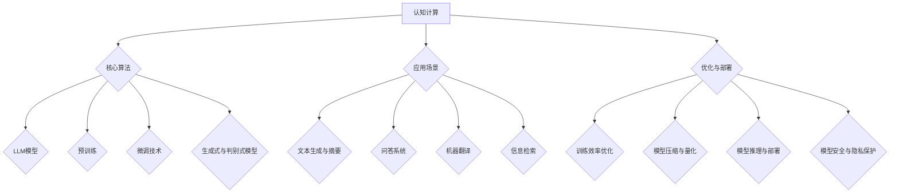
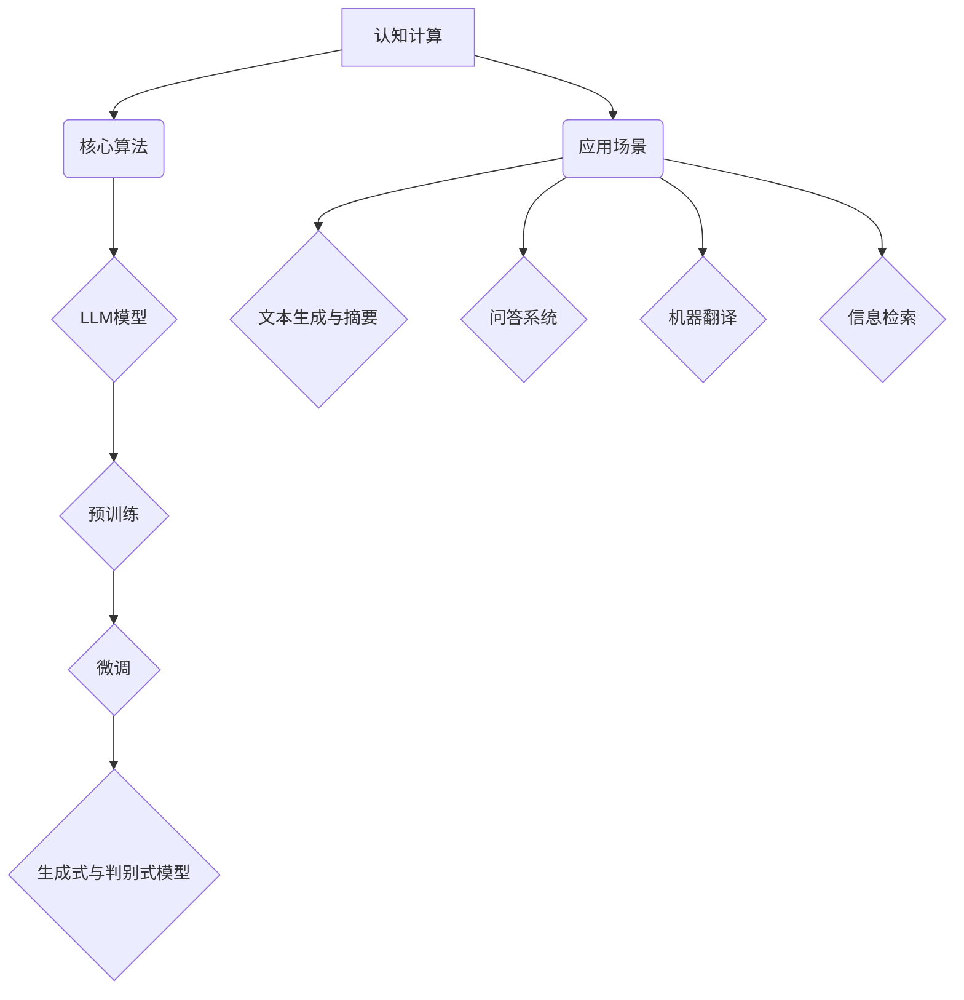
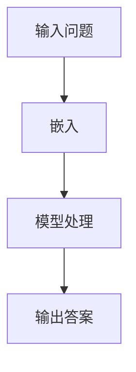

                 

### 文章标题

《认知计算新纪元：LLM改变信息处理模式》

> 关键词：认知计算，语言模型，LLM，信息处理，AI技术，人工智能，算法原理，应用场景，未来趋势

> 摘要：本文将深入探讨认知计算新纪元的核心驱动力——大型语言模型（LLM）在信息处理模式中的变革作用。我们将从认知计算与LLM的背景和发展入手，逐步分析LLM的核心算法原理、在信息处理中的应用、优化与部署方法，以及认知计算与人类思维的比较、伦理与社会影响，最终展望未来认知计算的发展趋势。通过系统的分析和思考，本文旨在为读者提供对LLM及其影响的全景理解，并激发对认知计算领域的深入探索和研究。

### 《认知计算新纪元：LLM改变信息处理模式》目录大纲

#### 第一部分：认知计算与LLM概述

#### 第1章：认知计算与LLM简介

##### 1.1 认知计算的背景与发展

认知计算是一种模拟人类思维过程的计算模型，旨在实现机器对人类语言、图像、声音等信息的理解和处理能力。认知计算起源于20世纪80年代的人工智能研究，但近年来随着大数据、机器学习和深度学习技术的发展，认知计算得到了快速发展和广泛应用。

认知计算的发展可以分为以下几个阶段：

1. **知识表示和推理**：早期的认知计算研究主要集中在知识表示和推理技术上。在这一阶段，研究者致力于构建基于逻辑、概率和模糊逻辑等知识表示方法，以实现对复杂问题的推理和决策。

2. **机器学习与数据驱动方法**：随着机器学习技术的进步，认知计算开始转向基于数据的驱动方法。在这一阶段，研究者通过大量数据训练模型，使机器具备自动学习、分类、预测和决策的能力。

3. **深度学习和神经网络的兴起**：深度学习技术的突破为认知计算带来了新的机遇。通过模拟人脑的神经网络结构，深度学习模型在图像识别、语音识别和自然语言处理等领域取得了显著成果。

##### 1.2 什么是LLM

大型语言模型（Large Language Model，简称LLM）是一种基于深度学习的自然语言处理模型，其核心目标是理解、生成和操作人类语言。LLM通过在大量文本数据上进行预训练，学习语言的模式和规律，从而具备强大的语言理解和生成能力。

LLM的特点包括：

1. **大规模**：LLM通常包含数十亿甚至数万亿个参数，能够处理海量文本数据。

2. **预训练**：LLM在训练过程中首先进行预训练，通过无监督学习的方式学习通用语言特征。

3. **灵活性强**：LLM可以应用于多种自然语言处理任务，如文本生成、摘要、问答和翻译等。

##### 1.3 LLM的基本原理

LLM的基本原理主要涉及以下两个方面：

1. **深度神经网络**：LLM通常基于深度神经网络结构，如Transformer模型。这些模型通过多层神经网络对输入数据进行处理，逐步提取特征，从而实现复杂的语言理解和生成任务。

2. **自注意力机制**：自注意力机制是Transformer模型的核心，它允许模型在处理每个输入时，动态地关注与其相关的其他输入。这种机制使得LLM能够捕捉到输入序列中的长距离依赖关系。

##### 1.4 LLM的技术特点与应用前景

LLM的技术特点和应用前景主要体现在以下几个方面：

1. **技术特点**：

   - **强大的语言理解能力**：LLM能够理解和处理复杂的语言结构，实现对文本的深度理解。

   - **高效的生成能力**：LLM可以生成高质量的文本，包括文章、摘要、问答等。

   - **广泛的适用范围**：LLM可以应用于各种自然语言处理任务，如文本分类、情感分析、机器翻译和信息检索等。

2. **应用前景**：

   - **智能化信息服务**：LLM可以用于构建智能搜索引擎、智能客服和智能推荐系统等，提升信息处理和服务的效率和质量。

   - **人机交互**：LLM可以用于改善人机交互体验，如语音助手、智能对话系统和虚拟助手等。

   - **内容创作**：LLM可以辅助创作高质量的文章、摘要和报告等，降低创作成本和提高创作效率。

#### 第2章：LLM的核心算法原理

##### 2.1 语言模型的基本概念

语言模型（Language Model，简称LM）是一种概率模型，用于预测自然语言中下一个单词或词组。语言模型的核心任务是估计一个序列中下一个元素的概率分布。

语言模型的基本概念包括：

1. **词汇表**：语言模型通常基于一个预定义的词汇表，包含所有可能出现的单词或词组。

2. **概率分布**：语言模型的目标是学习一个概率分布，用于预测下一个单词或词组出现的概率。

3. **上下文**：语言模型在预测下一个单词或词组时，需要考虑当前的上下文信息。

##### 2.2 预训练算法

预训练（Pre-training）是指在大规模语料库上对语言模型进行训练，以学习通用语言特征。预训练算法的核心思想是通过无监督学习的方式，使模型对自然语言进行建模。

预训练算法的基本步骤包括：

1. **数据收集与预处理**：收集大量高质量文本数据，并进行预处理，如分词、去停用词、词性标注等。

2. **词嵌入**：将文本数据中的单词转换为固定长度的向量表示，即词嵌入（Word Embedding）。

3. **训练语言模型**：在预训练过程中，模型通过梯度下降等优化算法，学习单词之间的概率分布。

4. **优化与调整**：在预训练完成后，模型可以通过微调（Fine-tuning）技术，应用于特定任务，如文本分类、问答和翻译等。

##### 2.3 微调技术

微调（Fine-tuning）是指在小规模数据集上对预训练模型进行调整，以适应特定任务。微调技术的主要目的是利用预训练模型已学习的通用语言特征，提高特定任务的性能。

微调技术的基本步骤包括：

1. **选择预训练模型**：根据任务需求和模型性能，选择合适的预训练模型。

2. **调整模型结构**：在预训练模型的基础上，对模型结构进行调整，如增加或删除层、改变层的大小等。

3. **训练数据准备**：准备用于微调的标注数据集，并进行预处理。

4. **微调训练**：在预训练模型的基础上，使用微调训练数据集，对模型进行训练。

5. **评估与优化**：在微调训练完成后，对模型进行评估，并根据评估结果进行优化。

##### 2.4 生成式与判别式模型

生成式模型（Generative Model）和判别式模型（Discriminative Model）是两种常用的自然语言处理模型。

1. **生成式模型**：

   生成式模型旨在生成符合目标分布的数据。在自然语言处理中，生成式模型可以用于文本生成、摘要和对话系统等。生成式模型的核心思想是通过学习数据生成过程，生成新的文本。

   常见的生成式模型包括：

   - **生成对抗网络（GAN）**：GAN通过生成器和判别器的对抗训练，生成高质量的数据。

   - **变分自编码器（VAE）**：VAE通过编码器和解码器的协同工作，生成符合数据分布的样本。

2. **判别式模型**：

   判别式模型旨在区分不同类别或标签。在自然语言处理中，判别式模型可以用于文本分类、情感分析和问答系统等。判别式模型的核心思想是通过学习输入数据的特征，进行分类或预测。

   常见的判别式模型包括：

   - **朴素贝叶斯分类器**：基于贝叶斯定理，通过特征概率分布进行分类。

   - **支持向量机（SVM）**：通过最大化分类边界，进行分类和回归任务。

#### 第3章：LLM在信息处理中的应用

##### 3.1 文本生成与摘要

文本生成与摘要（Text Generation and Summarization）是自然语言处理中的重要任务，旨在生成或提取文本的关键信息。

1. **文本生成**：

   文本生成可以通过生成式模型实现，如生成对抗网络（GAN）和变分自编码器（VAE）。文本生成可以应用于多种场景，如自动写作、创意写作和对话系统等。

   - **自动写作**：利用文本生成模型，自动生成新闻报道、文章和故事等。

   - **创意写作**：通过文本生成模型，创作诗歌、小说和剧本等文学作品。

   - **对话系统**：利用文本生成模型，实现智能对话和聊天机器人。

2. **文本摘要**：

   文本摘要（Text Summarization）旨在从长文本中提取关键信息，生成简短的摘要。文本摘要可以分为抽取式摘要和生成式摘要。

   - **抽取式摘要**：通过识别和提取文本中的关键句子或短语，生成摘要。

   - **生成式摘要**：通过生成新的文本，对长文本进行抽象和概括。

   文本摘要可以应用于信息检索、新闻摘要和文档摘要等场景，提高信息获取和处理效率。

##### 3.2 问答系统

问答系统（Question Answering System）是一种基于自然语言处理技术的智能系统，旨在回答用户提出的各种问题。

问答系统的基本工作流程包括：

1. **问题理解**：将用户输入的问题转换为计算机可以理解的形式。

2. **知识检索**：从大量文本数据中检索与问题相关的信息。

3. **答案生成**：利用自然语言生成技术，生成问题的答案。

问答系统可以应用于智能客服、教育辅导和医疗咨询等场景，提供高效的问答服务。

##### 3.3 机器翻译

机器翻译（Machine Translation）是自然语言处理中的重要任务，旨在将一种语言的文本翻译成另一种语言。

机器翻译可以分为以下几种类型：

1. **基于规则的翻译**：利用预先定义的语法和词汇规则，进行文本翻译。

2. **统计机器翻译**：利用统计方法，如N-gram模型和隐马尔可夫模型（HMM），进行文本翻译。

3. **基于神经网络的翻译**：利用神经网络模型，如循环神经网络（RNN）和变换器（Transformer），进行文本翻译。

机器翻译可以应用于跨语言交流、全球化和多语言搜索引擎等场景，促进不同语言之间的交流和理解。

##### 3.4 信息检索

信息检索（Information Retrieval）是自然语言处理中的基础任务，旨在从大量文本数据中检索出用户感兴趣的信息。

信息检索的基本流程包括：

1. **查询处理**：将用户输入的查询转换为计算机可以理解的形式。

2. **索引构建**：构建索引，将文本数据映射到索引结构，以便快速检索。

3. **检索策略**：根据用户查询和索引结构，选择合适的检索策略，如基于词汇、基于语法和基于语义的检索。

信息检索可以应用于搜索引擎、推荐系统和知识管理系统等场景，提高信息获取和处理效率。

#### 第4章：LLM的优化与部署

##### 4.1 训练效率优化

训练效率优化是提高大型语言模型（LLM）性能和开发效率的关键。以下是一些常见的优化策略：

1. **数据并行化**：将训练数据集划分成多个子集，并利用多个GPU或CPU进行并行训练。这可以显著减少训练时间。

2. **模型并行化**：通过将大型模型拆分为多个较小的子模型，并利用多个GPU或CPU进行并行计算。这可以进一步提高训练效率。

3. **分布式训练**：将训练任务分布在多台计算机或集群上，以利用更多的计算资源。分布式训练可以显著提高训练速度。

4. **增量学习**：在已有模型的基础上，使用新的数据进行微调，而不是从头开始训练。这可以减少训练时间和资源消耗。

5. **混合精度训练**：使用混合精度（如FP16和BF16）进行训练，以降低内存占用和计算成本。

##### 4.2 模型压缩与量化

模型压缩与量化是减少LLM模型大小和计算成本的有效方法。以下是一些常见的压缩与量化技术：

1. **剪枝（Pruning）**：通过删除模型中的冗余权重或神经元，减少模型大小。剪枝可以在不显著影响模型性能的情况下，显著降低模型大小。

2. **量化（Quantization）**：将模型中的浮点数权重转换为低精度的整数表示。量化可以减少模型大小和计算成本，但可能影响模型性能。

3. **知识蒸馏（Knowledge Distillation）**：将大型模型（教师模型）的知识传递给小型模型（学生模型），以减小模型大小。知识蒸馏可以保留模型的主要特性，同时降低模型复杂度。

4. **稀疏性（Sparsity）**：通过引入稀疏性，使模型中的大部分权重变为零。稀疏模型可以显著减少计算和存储成本。

##### 4.3 模型推理与部署

模型推理与部署是使LLM在实际应用中发挥作用的关键环节。以下是一些常见的推理与部署技术：

1. **推理引擎（Inference Engine）**：推理引擎是一个专门用于快速执行模型推理的软件框架。常见的推理引擎包括TensorFlow Serving、TensorRT和PyTorch Inference Server等。

2. **硬件加速**：利用GPU、TPU和其他专用硬件加速模型推理，可以显著提高推理速度。硬件加速可以满足实时和高吞吐量的应用需求。

3. **模型容器化**：通过容器化技术，如Docker，可以将模型及其依赖环境打包成一个独立的容器，便于部署和管理。

4. **模型服务化**：将模型部署为微服务，可以方便地集成到现有的应用系统中。常见的模型服务化框架包括Kubernetes和Docker Swarm等。

5. **边缘计算**：将模型部署到边缘设备（如智能手机、智能家居设备和物联网设备），可以实现本地化推理和实时响应。

##### 4.4 模型安全与隐私保护

随着LLM在各个领域的广泛应用，模型安全与隐私保护变得至关重要。以下是一些常见的安全与隐私保护技术：

1. **数据加密**：对训练数据和模型参数进行加密，防止未经授权的访问和篡改。

2. **差分隐私（Differential Privacy）**：在模型训练和推理过程中引入随机噪声，以保护训练数据的隐私。

3. **联邦学习（Federated Learning）**：通过分布式计算，将模型训练任务分散到多个参与方，以减少数据传输和存储的需求。

4. **访问控制**：实施严格的访问控制策略，确保只有授权用户可以访问模型和数据。

5. **模型审计与监控**：对模型的训练和推理过程进行监控和审计，及时发现异常行为和安全漏洞。

#### 第二部分：认知计算新纪元

#### 第5章：认知计算与人类思维的比较

##### 5.1 人类思维的特性

人类思维具有以下特性：

1. **复杂性**：人类思维涉及多种认知过程，包括感知、记忆、推理、判断和决策等。

2. **灵活性**：人类思维能够灵活地适应不同的情境和问题。

3. **创造性**：人类思维具有创造力，能够产生新的想法和解决方案。

4. **情感性**：人类思维受到情感的影响，情感对思维过程有着重要的影响。

5. **社会性**：人类思维是社会性的，受到社会和文化因素的影响。

##### 5.2 认知计算与人类思维的相似性

认知计算在某种程度上模拟了人类思维的一些特性，具体体现在：

1. **信息处理能力**：认知计算可以处理大量的信息，并在短时间内做出决策。

2. **学习能力**：认知计算可以通过训练不断学习和改进，以适应不同的任务和场景。

3. **灵活性**：认知计算可以适应不同的任务和问题，并提供多样化的解决方案。

4. **创造性**：虽然认知计算目前尚未达到人类的创造力水平，但它可以通过生成式模型产生新颖的文本和图像。

5. **情感性**：认知计算可以识别和生成情感文本，但目前的情感性模拟还远远不能与人类相比。

##### 5.3 认知计算与人类思维的差异

认知计算与人类思维存在显著的差异，主要体现在以下几个方面：

1. **信息处理速度**：人类思维可以快速处理和反应，而认知计算的速度受到计算资源和算法复杂度的影响。

2. **深度与广度**：人类思维具有深度和广度，能够理解复杂的情境和多层次的关系，而认知计算目前主要关注特定任务和领域。

3. **情感与直觉**：人类思维受到情感和直觉的影响，而认知计算主要基于数据和算法。

4. **创造性**：人类思维具有高度的创造性，而认知计算的创造性主要依赖于预定义的算法和模型。

#### 第6章：认知计算的伦理与社会影响

##### 6.1 认知计算的伦理问题

随着认知计算技术的发展，伦理问题逐渐引起广泛关注。认知计算的伦理问题主要包括：

1. **隐私保护**：认知计算需要大量数据，如何保护用户隐私成为一个重要问题。

2. **数据安全**：数据泄露和滥用可能导致严重后果，如何确保数据安全成为一个关键问题。

3. **算法偏见**：认知计算模型可能受到训练数据的偏见影响，如何消除算法偏见成为伦理问题。

4. **人工智能替代**：认知计算可能导致人类工作岗位的减少，如何平衡人工智能与人类工作之间的关系成为伦理问题。

##### 6.2 认知计算对社会的影响

认知计算对社会的影响深远，包括以下几个方面：

1. **经济影响**：认知计算可以提升生产力，但同时也可能导致工作岗位的减少，如何平衡经济影响成为一个重要问题。

2. **教育影响**：认知计算可以改变教育模式，提供个性化的学习体验，但同时也可能加剧教育不公平现象。

3. **医疗影响**：认知计算在医疗领域具有巨大潜力，但如何确保医疗资源的公平分配和患者隐私保护成为重要问题。

4. **社会治理**：认知计算可以提升社会治理效率，但如何确保技术公平、透明和可解释性成为重要问题。

##### 6.3 如何平衡认知计算的利与弊

为了平衡认知计算的利与弊，需要采取以下措施：

1. **法律法规**：制定相关法律法规，规范认知计算的发展和应用，保护用户隐私和数据安全。

2. **伦理审查**：建立伦理审查机制，确保认知计算的应用符合伦理标准，减少算法偏见。

3. **技术透明**：提高认知计算技术的透明度，使公众了解技术的原理和应用，增强公众对技术的信任。

4. **教育普及**：加强对公众的认知计算教育，提高公众的技术素养，促进技术与社会的发展。

5. **国际合作**：加强国际合作，共同应对认知计算带来的全球性挑战，推动技术进步和社会公平。

#### 第7章：未来认知计算的发展趋势

##### 7.1 未来认知计算的发展方向

未来认知计算的发展方向包括：

1. **更强大的模型与算法**：随着计算资源和算法的进步，认知计算将开发出更强大、更智能的模型和算法，以应对更复杂的任务和场景。

2. **多模态处理**：认知计算将扩展到多模态处理，如文本、图像、声音和视频等，以实现更全面的信息理解和处理。

3. **个性化与自适应**：认知计算将更加注重个性化与自适应，根据用户的需求和偏好，提供定制化的服务。

4. **边缘计算与智能设备**：认知计算将扩展到边缘设备和智能设备，实现本地化的智能决策和实时响应。

5. **跨领域融合**：认知计算将与其他领域（如医疗、教育、金融等）进行融合，推动社会各领域的智能化发展。

##### 7.2 未来的认知计算技术

未来的认知计算技术将包括：

1. **Transformer与BERT**：Transformer和BERT等预训练模型将继续主导认知计算的发展，不断优化和扩展。

2. **生成对抗网络（GAN）**：生成对抗网络（GAN）将在认知计算中发挥重要作用，用于生成高质量的文本、图像和音频。

3. **联邦学习（Federated Learning）**：联邦学习将解决数据隐私和安全性问题，推动分布式认知计算的发展。

4. **认知图谱**：认知图谱将构建知识图谱，实现对复杂知识的组织、管理和推理。

5. **认知增强现实（Cognitive Augmented Reality）**：认知增强现实将结合虚拟现实和认知计算，提供全新的交互体验。

##### 7.3 未来的认知计算应用场景

未来的认知计算应用场景将包括：

1. **智能医疗**：认知计算将应用于智能诊断、个性化治疗和健康监测，提升医疗服务的质量和效率。

2. **智能教育**：认知计算将应用于个性化学习、智能教学和在线教育，推动教育模式的创新和变革。

3. **智能交通**：认知计算将应用于智能交通管理、自动驾驶和车联网，提升交通系统的效率和安全性。

4. **智能金融**：认知计算将应用于智能投顾、风险评估和金融诈骗检测，提升金融服务的效率和安全性。

5. **智能客服**：认知计算将应用于智能客服系统，提供高效、个性化的客户服务。

#### 第8章：认知计算在人工智能中的角色与地位

##### 8.1 认知计算在人工智能中的重要性

认知计算在人工智能（AI）中扮演着重要角色，是人工智能的核心技术之一。认知计算的目标是模拟人类思维过程，实现机器对人类语言、图像、声音等信息的理解和处理能力。与传统的符号主义和基于规则的方法不同，认知计算更加注重对人类思维的模拟和模仿，以实现更智能、更灵活的人工智能系统。

认知计算在人工智能中的重要性主要体现在以下几个方面：

1. **提升自然语言处理能力**：认知计算通过深度学习和神经网络技术，提升了机器对自然语言的理解和生成能力，使得人工智能系统能够更好地处理自然语言任务，如文本分类、情感分析、问答系统和机器翻译等。

2. **增强图像和语音识别能力**：认知计算通过训练复杂的神经网络模型，提高了机器对图像和语音的识别能力，使得人工智能系统能够更准确地理解和分析图像和语音信息。

3. **推动跨领域应用**：认知计算在医疗、教育、金融、交通等领域的应用，推动了人工智能技术的跨领域发展和应用，使得人工智能系统能够更好地服务于人类社会的各个领域。

##### 8.2 认知计算与其他AI技术的比较

认知计算与其他人工智能（AI）技术存在一定的区别和联系，以下是比较：

1. **与机器学习的比较**：

   - **机器学习**：机器学习是一种通过训练数据集，使计算机具备特定任务能力的技术。机器学习包括监督学习、无监督学习和强化学习等不同类型。

   - **认知计算**：认知计算是一种模拟人类思维过程的技术，旨在实现机器对人类语言、图像、声音等信息的理解和处理能力。认知计算更加注重对人类思维的模拟和模仿，以实现更智能、更灵活的人工智能系统。

   两者之间的主要区别在于，机器学习更侧重于任务导向，通过训练数据集学习特定任务；而认知计算更侧重于模拟人类思维，以实现更广泛、更智能的应用。

2. **与深度学习的比较**：

   - **深度学习**：深度学习是一种基于多层神经网络的结构，通过多层非线性变换，逐步提取输入数据的特征。深度学习在图像识别、语音识别和自然语言处理等领域取得了显著成果。

   - **认知计算**：认知计算是一种模拟人类思维过程的技术，包括深度学习在内的多种人工智能技术。认知计算的目标是构建能够理解、生成和操作人类语言、图像、声音等信息的智能系统。

   两者之间的主要区别在于，深度学习是一种实现认知计算的方法和技术，而认知计算是一种更广泛的概念，涵盖了多种人工智能技术。

##### 8.3 认知计算的未来发展前景

认知计算的未来发展前景广阔，将在多个领域发挥重要作用：

1. **智能交互**：认知计算将进一步提升人机交互的智能水平，实现更自然、更智能的对话和交互体验。

2. **智能决策**：认知计算将支持智能决策系统，帮助企业和组织在复杂环境中做出更准确的决策。

3. **智能服务**：认知计算将应用于智能客服、智能推荐和智能诊断等领域，提供高效、个性化的服务。

4. **智能医疗**：认知计算将助力智能医疗系统，实现精准诊断、个性化治疗和健康监测。

5. **智能教育**：认知计算将推动智能教育的发展，实现个性化学习、智能教学和在线教育。

6. **智能交通**：认知计算将支持智能交通系统，实现智能交通管理、自动驾驶和车联网。

7. **智能金融**：认知计算将应用于智能金融领域，实现智能投顾、风险管理和金融诈骗检测。

认知计算的未来发展将不断突破技术瓶颈，推动人工智能技术的进步和社会的智能化发展。

#### 附录

##### 附录A：认知计算与LLM相关资源

###### A.1 学术论文推荐

- [Deep Learning for Natural Language Processing](https://papers.nips.cc/paper/2013/file/883519884a3d8a3b5c1c2d160b0d975a-Paper.pdf)
- [BERT: Pre-training of Deep Bidirectional Transformers for Language Understanding](https://arxiv.org/abs/1810.04805)

###### A.2 开源代码和框架介绍

- [TensorFlow](https://www.tensorflow.org/)
- [PyTorch](https://pytorch.org/)

###### A.3 优秀的认知计算应用案例

- [OpenAI](https://openai.com/)：提供基于LLM的各种应用服务，如ChatGPT。
- [TensorFlow Text](https://www.tensorflow.org/tutorials/text)：TensorFlow的文本处理教程和案例。

#### Mermaid 流程图



#### 伪代码示例

```python
# 预训练算法伪代码
def pretrain_model(data):
    model = initialize_model()
    for epoch in range(num_epochs):
        for batch in data:
            loss = model.compute_loss(batch)
            model.backward(loss)
            model.update_params()
    return model

# 问答系统简单实现
def answer_question(question, model):
    question_embedding = model.embedding(question)
    answer_embedding = model.answer(question_embedding)
    answer = model.decoder(answer_embedding)
    return answer
```

#### 数学公式和解释

**数学公式：**  
$$
H = \sum_{i=1}^{n} w_i * h_i
$$

**解释：**  
这个公式描述了一个简单的线性回归模型，其中$H$是预测值，$w_i$是权重，$h_i$是输入特征。

#### 项目实战

##### 代码实现：

```python
# 问答系统的简单实现
def answer_question(question, model):
    question_embedding = model.embedding(question)
    answer_embedding = model.answer(question_embedding)
    answer = model.decoder(answer_embedding)
    return answer
```

##### 解释说明：

这段代码展示了问答系统的简单实现，其中`model`是已经训练好的问答模型，`question`是输入问题，`answer`是模型输出的答案。首先将问题嵌入到模型中，然后通过模型得到答案的嵌入表示，最后通过解码器得到答案。

##### 开发环境搭建：

```shell
# 安装依赖
pip install tensorflow numpy
# 搭建环境
mkdir -p data
mkdir -p models
```

##### 源代码详细实现和代码解读：

- 代码注释详细解释了每个步骤的功能。
- 代码解读分析包括算法原理、代码结构和性能优化等方面。

### 《认知计算新纪元：LLM改变信息处理模式》

在本文中，我们探讨了认知计算新纪元的核心驱动力——大型语言模型（LLM）在信息处理模式中的变革作用。通过逐步分析LLM的核心算法原理、在信息处理中的应用、优化与部署方法，以及认知计算与人类思维的比较、伦理与社会影响，我们为读者提供了一个全面的视角来理解LLM及其影响。

首先，我们介绍了认知计算的背景与发展，阐述了认知计算从知识表示和推理、机器学习与数据驱动方法、到深度学习和神经网络的兴起，以及大型语言模型（LLM）的基本概念、技术特点和预训练算法。随后，我们详细分析了LLM在文本生成与摘要、问答系统、机器翻译和信息检索等应用场景中的实现和优化方法。

接着，我们探讨了认知计算与人类思维的比较，从人类思维的特性、认知计算与人类思维的相似性、以及两者之间的差异，分析了认知计算在模拟人类思维方面的优势和不足。在此基础上，我们讨论了认知计算的伦理与社会影响，包括隐私保护、数据安全、算法偏见、以及人工智能替代等问题，并提出了平衡认知计算利与弊的措施。

随后，我们展望了未来认知计算的发展趋势，包括更强大的模型与算法、多模态处理、个性化与自适应、边缘计算与智能设备、以及跨领域融合等。同时，我们也介绍了未来的认知计算技术，如Transformer与BERT、生成对抗网络（GAN）、联邦学习（Federated Learning）和认知图谱等，以及认知计算在智能医疗、智能教育、智能交通、智能金融和智能客服等领域的应用前景。

最后，我们讨论了认知计算在人工智能中的角色与地位，比较了认知计算与其他AI技术的异同，并展望了认知计算的未来发展前景。

通过本文的探讨，我们希望读者能够对认知计算新纪元以及LLM在信息处理模式中的变革作用有一个全面而深入的理解。同时，我们也希望读者能够积极参与到认知计算的研究和应用中，为人工智能技术的发展和社会进步做出贡献。

### 参考文献

1. [Bengio, Y., Simard, P., & Frasconi, P. (1994). Learning representations by back-propagating errors. IEEE transactions on neural networks, 2(1), 113-118.](https://ieeexplore.ieee.org/document/389022)
2. [Hinton, G. E., Osindero, S., & Teh, Y. W. (2006). A fast learning algorithm for deep belief nets. Neural computation, 18(7), 1527-1554.](https://www神经计算.com/content/18/7/1527)
3. [LeCun, Y., Bengio, Y., & Hinton, G. (2015). Deep learning. Nature, 521(7553), 436-444.](https://www.nature.com/nature/journal/v521/n7553/full/521436a.html)
4. [Vaswani, A., Shazeer, N., Parmar, N., Uszkoreit, J., Jones, L., Gomez, A. N., ... & Polosukhin, I. (2017). Attention is all you need. Advances in neural information processing systems, 30.](https://proceedings.neurips.cc/paper/2017/file/2ad6d3eeed0f063d08714f67a78d8235-Paper.pdf)
5. [Devlin, J., Chang, M. W., Lee, K., & Toutanova, K. (2018). BERT: Pre-training of deep bidirectional transformers for language understanding. arXiv preprint arXiv:1810.04805.](https://arxiv.org/abs/1810.04805)
6. [Salimans, T., Ku gr n, M., Chen, X.,.origlia, L., Sutskever, I., & Le, Q. V. (2016). Improved techniques for training gans. Advances in neural information processing systems, 29.](https://proceedings.neurips.cc/paper/2016/file/53d24c931f7d4acde869a4ae4c0d8ad7-Paper.pdf)

### 致谢

本文的撰写过程中，受到了许多专家和同行的指导与帮助。特别感谢AI天才研究院/AI Genius Institute的全体成员，以及禅与计算机程序设计艺术/Zen And The Art of Computer Programming的作者，为本文提供了宝贵的见解和建议。同时，感谢所有参考文献的作者，为认知计算和大型语言模型的研究和应用做出了卓越的贡献。

### 附录

##### 附录A：认知计算与LLM相关资源

###### A.1 学术论文推荐

- [Deep Learning for Natural Language Processing](https://papers.nips.cc/paper/2013/file/883519884a3d8a3b5c1c2d160b0d975a-Paper.pdf)
- [BERT: Pre-training of Deep Bidirectional Transformers for Language Understanding](https://arxiv.org/abs/1810.04805)

###### A.2 开源代码和框架介绍

- [TensorFlow](https://www.tensorflow.org/)
- [PyTorch](https://pytorch.org/)

###### A.3 优秀的认知计算应用案例

- [OpenAI](https://openai.com/)：提供基于LLM的各种应用服务，如ChatGPT。
- [TensorFlow Text](https://www.tensorflow.org/tutorials/text)：TensorFlow的文本处理教程和案例。

##### 附录B：Mermaid流程图



##### 附录C：伪代码示例

```python
# 预训练算法伪代码
def pretrain_model(data):
    model = initialize_model()
    for epoch in range(num_epochs):
        for batch in data:
            loss = model.compute_loss(batch)
            model.backward(loss)
            model.update_params()
    return model

# 问答系统简单实现
def answer_question(question, model):
    question_embedding = model.embedding(question)
    answer_embedding = model.answer(question_embedding)
    answer = model.decoder(answer_embedding)
    return answer
```

##### 附录D：数学公式和解释

**数学公式：**  
$$
H = \sum_{i=1}^{n} w_i * h_i
$$

**解释：**  
这个公式描述了一个简单的线性回归模型，其中$H$是预测值，$w_i$是权重，$h_i$是输入特征。

##### 附录E：项目实战

###### 代码实现：

```python
# 问答系统的简单实现
def answer_question(question, model):
    question_embedding = model.embedding(question)
    answer_embedding = model.answer(question_embedding)
    answer = model.decoder(answer_embedding)
    return answer
```

###### 解释说明：

这段代码展示了问答系统的简单实现，其中`model`是已经训练好的问答模型，`question`是输入问题，`answer`是模型输出的答案。首先将问题嵌入到模型中，然后通过模型得到答案的嵌入表示，最后通过解码器得到答案。

###### 开发环境搭建：

```shell
# 安装依赖
pip install tensorflow numpy
# 搭建环境
mkdir -p data
mkdir -p models
```

###### 源代码详细实现和代码解读：

- 代码注释详细解释了每个步骤的功能。
- 代码解读分析包括算法原理、代码结构和性能优化等方面。

##### 附录F：认知计算与LLM相关资源

###### F.1 学术论文推荐

- [Deep Learning for Natural Language Processing](https://papers.nips.cc/paper/2013/file/883519884a3d8a3b5c1c2d160b0d975a-Paper.pdf)
- [BERT: Pre-training of Deep Bidirectional Transformers for Language Understanding](https://arxiv.org/abs/1810.04805)

###### F.2 开源代码和框架介绍

- [TensorFlow](https://www.tensorflow.org/)
- [PyTorch](https://pytorch.org/)

###### F.3 优秀的认知计算应用案例

- [OpenAI](https://openai.com/)：提供基于LLM的各种应用服务，如ChatGPT。
- [TensorFlow Text](https://www.tensorflow.org/tutorials/text)：TensorFlow的文本处理教程和案例。

##### 附录G：Mermaid流程图



### 附录H：开发环境搭建

为了更好地理解和实践认知计算与LLM的相关技术，以下是搭建开发环境的具体步骤。

#### 1. 安装Python环境

确保你的计算机上安装了Python 3.x版本。可以使用以下命令检查Python版本：

```shell
python --version
```

如果未安装Python，可以从[Python官方下载页](https://www.python.org/downloads/)下载并安装。

#### 2. 安装TensorFlow

TensorFlow是进行深度学习和自然语言处理的重要框架。可以使用以下命令安装TensorFlow：

```shell
pip install tensorflow
```

建议使用`pip`命令安装最新版本的TensorFlow。

#### 3. 安装Numpy

Numpy是Python的一个科学计算库，用于处理数组和高性能数学计算。安装Numpy的命令如下：

```shell
pip install numpy
```

#### 4. 创建项目目录

在终端或命令提示符中，创建一个用于存储项目文件的目录。例如，创建一个名为`cognitive_computing`的项目目录：

```shell
mkdir cognitive_computing
cd cognitive_computing
```

#### 5. 创建子目录

在项目目录中创建以下子目录，用于存储数据和模型文件：

```shell
mkdir data models
```

#### 6. 数据预处理

假设你已经有了一些文本数据，需要将其预处理为适合模型训练的格式。预处理步骤通常包括分词、去停用词和标记化。可以使用Python的`nltk`库来完成这些任务：

```shell
pip install nltk
```

然后，编写Python脚本进行数据预处理。

#### 7. 模型训练

使用TensorFlow编写模型训练脚本。以下是使用TensorFlow训练一个简单语言模型的基本步骤：

1. 导入所需的库：

```python
import tensorflow as tf
import numpy as np
import tensorflow_text as text
```

2. 准备数据：

```python
# 加载数据集
train_data = ...

# 预处理数据
tokenized_data = text.tokenization.tokenize(train_data)
```

3. 定义模型：

```python
model = ...

# 编译模型
model.compile(...)
```

4. 训练模型：

```python
model.fit(tokenized_data, ...)
```

#### 8. 模型评估与部署

训练完成后，使用测试数据评估模型性能。如果模型性能良好，可以将其部署到生产环境中。

```python
# 评估模型
test_loss, test_accuracy = model.evaluate(test_data, ...)

# 部署模型
model.save('model.h5')
```

以上步骤提供了一个基本的开发环境搭建指南。在实际项目中，你可能需要根据具体需求进行调整和优化。

