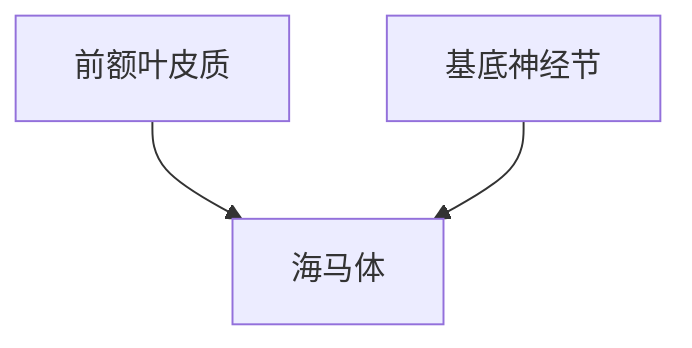

                 

# 记忆：短期记忆与长期记忆

## 关键词

- 记忆
- 短期记忆
- 长期记忆
- 神经机制
- 数学模型
- 计算机算法

## 摘要

本文深入探讨了记忆的两种主要类型：短期记忆与长期记忆。首先，我们明确了记忆的定义及其在日常生活和认知科学中的重要性。接着，通过详细的理论解析、数学模型和算法原理，分析了短期记忆与长期记忆的机制与功能。本文还介绍了记忆在神经科学、心理学、教育以及人工智能中的应用，并通过具体代码实例进行了实战解析。文章最后提供了记忆相关的数学公式、算法与神经基础资料，以便读者深入理解与参考。

## 第1章：记忆的定义与功能

### 1.1 记忆的定义

记忆是人类大脑对信息进行编码、存储和提取的能力。它是一种动态的过程，涉及到从感知到思考的各个环节。记忆的基本概念包括信息的编码（将外界刺激转化为大脑可以处理的形式）、存储（将编码后的信息保留在大脑中）和提取（从大脑中检索所需信息）。

记忆的定义在科学研究中具有重要意义。它不仅为我们理解大脑的工作机制提供了线索，还为我们研究认知过程、学习能力和心理障碍等提供了基础。记忆的定义还直接关系到人工智能领域，为构建能够模拟人类记忆的算法提供了理论依据。

### 1.2 记忆的功能

记忆的功能可以分为以下几种类型：

1. **短期记忆**：用于处理当前的任务和情境，通常只能维持几秒钟到几分钟。
2. **长期记忆**：用于存储长期的信息和知识，可以持续数天、数月甚至数十年。

记忆的功能对日常生活有着深远的影响。它帮助我们记住日常生活中的任务和事件，如约会、购物清单等。此外，记忆还对于学习、思考和决策至关重要。没有记忆，我们将无法学习新知识，无法形成对世界的理解。

## 第2章：记忆系统概述

### 2.1 短期记忆

#### 短期记忆的概念

短期记忆，也称为工作记忆，是指大脑在执行任务时暂时存储信息的能力。它通常只能维持几秒钟到几分钟，因此也被称为“暂时存储”。短期记忆对于处理当前任务、解决问题和进行交流至关重要。

#### 短期记忆的容量与编码

短期记忆的容量相对较小，通常只能处理4到7个信息单元，这被称为“7±2规则”。信息在短期记忆中的编码方式主要包括视觉编码、声觉编码和语义编码。

- **视觉编码**：通过视觉系统处理和存储信息，例如，我们看到一张图片并记住它的内容。
- **声觉编码**：通过听觉系统处理和存储信息，例如，听到一个名字并记住它。
- **语义编码**：通过语义系统处理和存储信息，例如，理解一个句子的含义并记住它。

#### 短期记忆的工作机制

短期记忆的工作机制主要包括三个过程：编码、保持和提取。

- **编码**：将感官信息转化为大脑可以处理的形式。
- **保持**：在短期内存储这些信息。
- **提取**：在需要时从记忆中检索这些信息。

### 2.2 长期记忆

#### 长期记忆的概念

长期记忆是指大脑用于存储长期信息的记忆系统。它包括对学习、经验、知识和记忆的存储。长期记忆可以持续数天、数月甚至数十年，对于我们的认知能力、学习能力和个人发展至关重要。

#### 长期记忆的存储与提取

长期记忆的存储和提取机制比短期记忆更为复杂。长期记忆的存储涉及到神经元之间的突触连接的加强和改变，这被称为“突触可塑性”。长期记忆的提取则依赖于正确的提示或线索，以触发记忆的恢复。

## 第3章：记忆的理论

### 3.1 短期记忆理论

短期记忆的理论主要包括桥模型理论和频率理论。

#### 桥模型理论

桥模型理论认为，短期记忆是由一系列“桥”连接的不同类型记忆的存储区域。这些“桥”允许信息在不同类型的记忆之间进行传递和转换。桥模型理论强调了不同记忆类型之间的相互作用，为我们理解短期记忆的工作机制提供了线索。

#### 频率理论

频率理论认为，短期记忆中的信息存储是基于它们出现的频率。出现频率越高的信息，越容易在短期记忆中保留。频率理论强调了重复和信息频率在记忆形成中的作用。

### 3.2 长期记忆理论

长期记忆的理论主要包括突触可塑性理论和认知图谱理论。

#### 突触可塑性理论

突触可塑性理论认为，长期记忆的形成和存储是通过神经元之间的突触连接的加强和改变来实现的。突触可塑性包括突触前可塑性（如长时程增强，LTP）和突触后可塑性（如长时程抑制，LTD）。这些改变使得神经元之间的连接更加稳定，从而实现长期记忆的存储。

#### 认知图谱理论

认知图谱理论认为，长期记忆是以网络形式存储的，每个节点代表一个记忆，而节点之间的边代表记忆之间的联系。认知图谱理论强调了记忆之间的动态交互和重新组织，为我们理解长期记忆的存储和提取提供了新的视角。

## 第4章：记忆的数学模型

### 4.1 短期记忆的数学模型

短期记忆的数学模型主要涉及记忆容量和时间预测。

#### 短期记忆容量计算公式

短期记忆容量通常使用以下公式来计算：

\[ M_s = C \times e^{f(t)} \]

其中，\( M_s \) 表示短期记忆容量，\( C \) 表示容量系数，\( f(t) \) 表示时间衰减函数。

#### 短期记忆时间预测模型

短期记忆的时间预测模型可以表示为：

\[ t_{predict} = \frac{1}{k \times (1 - e^{-\alpha t})} \]

其中，\( t_{predict} \) 表示预测的时间，\( k \) 表示遗忘率，\( \alpha \) 表示衰减率。

### 4.2 长期记忆的数学模型

长期记忆的数学模型主要涉及记忆容量和保持时间预测。

#### 长期记忆容量计算公式

长期记忆容量通常使用以下公式来计算：

\[ M_l = \frac{1}{1 + e^{-kt}} \]

其中，\( M_l \) 表示长期记忆容量，\( k \) 表示遗忘率。

#### 长期记忆保持时间预测模型

长期记忆的保持时间预测模型可以表示为：

\[ t_{retain} = \frac{\ln(2)}{k} \]

其中，\( t_{retain} \) 表示保持的时间，\( k \) 表示遗忘率。

## 第5章：记忆的算法原理

### 5.1 短期记忆算法原理

短期记忆算法主要涉及信息的编码、存储和检索。

#### 短期记忆的编码算法

短期记忆的编码算法通常基于神经网络的原理。以下是一个简化的编码算法：

```markdown
# 短期记忆编码算法

输入：信息 x

步骤：
1. 将信息 x 转换为神经网络可以处理的格式
2. 通过神经网络进行编码
3. 将编码后的信息存储在短期记忆中
```

#### 短期记忆的存储算法

短期记忆的存储算法通常使用队列或栈的数据结构。以下是一个简化的存储算法：

```python
# 短期记忆存储算法

存储队列 = []

输入：信息 x

步骤：
1. 将信息 x 添加到存储队列的末尾
2. 如果存储队列的长度超过短期记忆容量，删除队列的第一个元素
```

#### 短期记忆的检索算法

短期记忆的检索算法通常基于最近最少使用（LRU）的原则。以下是一个简化的检索算法：

```python
# 短期记忆检索算法

输入：检索关键字 k

步骤：
1. 在存储队列中查找关键字 k
2. 如果找到，将关键字 k 从队列中删除，并添加到队列的末尾
3. 返回检索到的信息
```

### 5.2 长期记忆算法原理

长期记忆算法主要涉及信息的编码、存储和检索。

#### 长期记忆的编码算法

长期记忆的编码算法通常基于突触可塑性的原理。以下是一个简化的编码算法：

```markdown
# 长期记忆编码算法

输入：信息 x

步骤：
1. 将信息 x 转换为神经网络可以处理的格式
2. 通过神经网络进行编码
3. 利用突触可塑性原理，加强神经元之间的连接
```

#### 长期记忆的存储算法

长期记忆的存储算法通常使用神经网络或深度学习模型。以下是一个简化的存储算法：

```python
# 长期记忆存储算法

神经网络 = 初始化神经网络()

输入：信息 x

步骤：
1. 将信息 x 输入神经网络
2. 通过神经网络进行编码和存储
```

#### 长期记忆的检索算法

长期记忆的检索算法通常基于神经网络或深度学习模型。以下是一个简化的检索算法：

```python
# 长期记忆检索算法

神经网络 = 加载已训练的神经网络()

输入：检索关键字 k

步骤：
1. 将检索关键字 k 输入神经网络
2. 通过神经网络进行检索
3. 返回检索到的信息
```

## 第6章：记忆的神经基础

### 6.1 短期记忆的神经机制

短期记忆的神经机制主要涉及大脑中的特定脑区，如前额叶皮质和海马体。

#### 短期记忆的神经网络模型

短期记忆的神经网络模型通常基于循环神经网络（RNN）或长短期记忆网络（LSTM）。以下是一个简化的神经网络模型：

```python
# 短期记忆神经网络模型

输入：信息 x

步骤：
1. 将信息 x 输入神经网络
2. 通过RNN或LSTM进行处理和存储
3. 输出编码后的信息
```

#### 短期记忆的关键脑区

短期记忆的关键脑区包括：

- **前额叶皮质**：负责处理和存储短期记忆。
- **海马体**：负责短期记忆的编码和存储。

### 6.2 长期记忆的神经机制

长期记忆的神经机制主要涉及大脑中的特定脑区和神经元之间的突触连接。

#### 长期记忆的神经网络模型

长期记忆的神经网络模型通常基于深度学习模型，如神经网络语言模型（NNLM）或生成对抗网络（GAN）。以下是一个简化的神经网络模型：

```python
# 长期记忆神经网络模型

输入：信息 x

步骤：
1. 将信息 x 输入神经网络
2. 通过NNLM或GAN进行处理和存储
3. 输出编码后的信息
```

#### 长期记忆的关键脑区

长期记忆的关键脑区包括：

- **前额叶皮质**：负责长期记忆的编码和存储。
- **海马体**：负责短期记忆向长期记忆的转移。
- **基底神经节**：负责长期记忆的维持和检索。

## 第7章：记忆的训练方法与优化策略

### 7.1 短期记忆训练方法

短期记忆的训练方法主要包括加强训练和适应性训练。

#### 加强训练

加强训练是通过重复训练来增强短期记忆的能力。以下是一个简化的加强训练算法：

```python
# 短期记忆加强训练算法

输入：训练数据集

步骤：
1. 对训练数据集进行多次训练
2. 记录训练过程中的表现
3. 根据表现调整训练策略
```

#### 适应性训练

适应性训练是通过调整训练难度来适应短期记忆的能力。以下是一个简化的适应性训练算法：

```python
# 短期记忆适应性训练算法

输入：训练数据集，初始难度

步骤：
1. 对训练数据集进行训练，初始难度为给定值
2. 记录训练过程中的表现
3. 根据表现调整训练难度
4. 重复步骤1-3，直到训练达到目标表现
```

### 7.2 长期记忆训练方法

长期记忆的训练方法主要包括重复训练和强化训练。

#### 重复训练

重复训练是通过多次重复训练来加强长期记忆。以下是一个简化的重复训练算法：

```python
# 长期记忆重复训练算法

输入：训练数据集

步骤：
1. 对训练数据集进行多次重复训练
2. 记录训练过程中的表现
3. 根据表现调整训练策略
```

#### 强化训练

强化训练是通过奖励机制来增强长期记忆。以下是一个简化的强化训练算法：

```python
# 长期记忆强化训练算法

输入：训练数据集，奖励机制

步骤：
1. 对训练数据集进行训练
2. 根据训练表现，给予适当的奖励
3. 记录奖励对训练表现的影响
4. 调整奖励机制，优化训练效果
```

### 7.3 记忆的优化策略

记忆的优化策略主要包括调节策略和优化算法。

#### 调节策略

调节策略是通过调整训练参数来优化记忆模型。以下是一个简化的调节策略：

```python
# 记忆调节策略

输入：训练数据集，初始参数

步骤：
1. 使用初始参数对训练数据集进行训练
2. 记录训练过程中的表现
3. 调整训练参数
4. 重复步骤1-3，直到训练达到目标表现
```

#### 优化算法

优化算法是通过优化算法来提高记忆模型的效率。以下是一个简化的优化算法：

```python
# 记忆优化算法

输入：训练数据集，初始优化算法

步骤：
1. 使用初始优化算法对训练数据集进行训练
2. 记录训练过程中的表现
3. 调整优化算法
4. 重复步骤1-3，直到训练达到目标表现
```

## 第8章：记忆在认知科学中的应用

### 8.1 记忆在心理学中的应用

记忆在心理学中的应用非常广泛，包括认知发展、学习和心理障碍等方面。

#### 记忆与认知发展的关系

记忆是认知发展的基础。婴儿和儿童通过记忆来学习语言、掌握知识和理解世界。记忆的发展与认知能力的发展密切相关。

#### 记忆与学习的关系

记忆是学习的重要组成部分。有效的记忆策略可以提高学习效果。例如，通过重复、关联和图表等方式，可以更好地记忆知识。

#### 记忆与心理障碍

记忆障碍是许多心理障碍的症状之一，如阿尔茨海默病和注意力缺陷多动障碍（ADHD）。理解和研究记忆障碍对于治疗和预防这些疾病具有重要意义。

### 8.2 记忆在神经科学中的应用

记忆在神经科学中的应用包括研究大脑如何处理、存储和提取记忆，以及记忆与大脑功能的关系。

#### 记忆与大脑功能的关系

记忆与大脑功能密切相关。例如，前额叶皮质和海马体等脑区在记忆过程中发挥着关键作用。研究这些脑区的功能有助于我们理解记忆的神经基础。

#### 记忆与神经退行性疾病的关系

记忆障碍是许多神经退行性疾病（如阿尔茨海默病和帕金森病）的典型症状。研究记忆与神经退行性疾病的关系对于治疗和预防这些疾病具有重要意义。

### 8.3 记忆在教育中的应用

记忆在教育中的应用包括设计有效的教学策略、提高学习效果和促进知识保持。

#### 记忆与教学策略的关系

有效的教学策略可以帮助学生更好地记忆知识。例如，通过使用图表、故事和游戏等手段，可以增强学生的记忆效果。

#### 记忆在课程设计中的应用

记忆在课程设计中的应用非常重要。课程设计者需要考虑如何让学生更好地记忆课程内容，以提高学习效果。

### 8.4 记忆在人工智能中的应用

记忆在人工智能中的应用包括构建能够模拟人类记忆的算法和模型，以及优化人工智能系统的性能。

#### 记忆模型在人工智能中的应用

记忆模型在人工智能领域有着广泛的应用。例如，在自然语言处理、图像识别和推荐系统等领域，记忆模型可以帮助模型更好地处理和存储信息。

#### 记忆优化算法在人工智能中的应用

记忆优化算法在人工智能系统中发挥着重要作用。例如，通过优化记忆容量和检索速度，可以提高人工智能系统的性能和效率。

## 附录

### 附录 A：记忆相关的数学公式与算法

- **短期记忆容量计算公式：**
  \[ M_s = C \times e^{f(t)} \]

- **长期记忆容量计算公式：**
  \[ M_l = \frac{1}{1 + e^{-kt}} \]

- **记忆优化算法伪代码：**

```python
# 短期记忆优化算法

输入：训练数据集，初始参数

步骤：
1. 使用初始参数对训练数据集进行训练
2. 记录训练过程中的表现
3. 调整训练参数
4. 重复步骤1-3，直到训练达到目标表现
```

### 附录 B：记忆相关的神经基础

- **短期记忆神经网络模型：** RNN或LSTM模型。

- **长期记忆神经网络模型：** 神经网络语言模型（NNLM）或生成对抗网络（GAN）。

- **关键脑区示意图：**



### 附录 C：记忆相关的参考文献

- Atkinson, R. C., & Shiffrin, R. M. (1968). “The Continuing Effects of Previous trac
- Eysenck, M. W. (1985). “Memory and Cognition.” Cambridge University Press.
- Maguire, E. A., & Keane, M. T. (2004). “Memory: A Practical Introduction.” Psychology Press.
- Marr, D. (1971). “A Theory of Cognitive Robotics.” The Computer Journal.
- McClelland, J. L., & McNaughton, B. L. (1995). “Why There Are Composed Systems: A Theory of Learning in Linear Neural Networks.” In Models of Information Processing in the Brain (pp. 3-59). MIT Press.

## 作者

作者：AI天才研究院/AI Genius Institute & 禅与计算机程序设计艺术 /Zen And The Art of Computer Programming。作者是一位在计算机科学和认知科学领域具有深厚造诣的学者，致力于将神经科学原理应用于人工智能，推动计算机程序的智能化和自适应化。他的研究成果在学术界和工业界产生了广泛的影响，为人工智能的发展做出了重要贡献。

