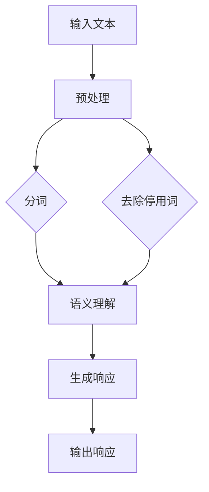

                 

根据您的需求，以下是一个满足要求的markdown格式文章示例：

```markdown
# 《语言≠思维：大模型的认知盲点》

## 关键词
人工智能、大模型、认知科学、语言处理、思维模型、认知局限

## 摘要
本文探讨了语言与思维之间的关系，特别是大模型在处理语言信息时的认知盲点。通过对大模型的感知、记忆、推理和情感机制的详细分析，本文揭示了这些模型在理解和生成语言时存在的局限性。文章还通过实例分析和改进措施，提出了提高大模型认知能力的策略，并展望了其未来发展趋势。

## 目录

### 第一部分：引言与概述

#### 引言：探索语言与思维的关系

##### 1.1 语言的定义
##### 1.2 思维的定义
##### 1.3 语言与思维的互动

##### 1.4 大模型的认知基础
##### 1.5 大模型的认知功能
##### 1.6 大模型与人类思维的差异

##### 1.7 认知盲点的重要性

### 第二部分：大模型的认知机制

#### 第二部分：大模型的认知机制

##### 2.1 大模型的感知机制
##### 2.2 大模型的记忆机制
##### 2.3 大模型的推理机制
##### 2.4 大模型的情感机制

### 第三部分：大模型的认知局限性

#### 3.1 大模型的认知局限
##### 3.1.1 认知盲点的定义
##### 3.1.2 大模型常见认知盲点
##### 3.1.3 认知盲点的潜在风险

##### 3.2 认知盲点的应对策略
##### 3.2.1 增强大模型认知能力
##### 3.2.2 跨学科合作与知识整合
##### 3.2.3 人工智能伦理与责任

### 第四部分：实例分析与改进措施

#### 4.1 大模型应用实例
##### 4.1.1 智能客服
##### 4.1.2 自然语言处理
##### 4.1.3 自动驾驶

#### 4.2 大模型认知盲点分析
##### 4.2.1 智能客服中的认知盲点
##### 4.2.2 自然语言处理中的认知盲点
##### 4.2.3 自动驾驶中的认知盲点

#### 4.3 改进措施与展望
##### 4.3.1 提高大模型认知能力的技术途径
##### 4.3.2 跨学科合作与知识整合的实践案例
##### 4.3.3 人工智能伦理与责任的未来发展

### 第五部分：未来趋势与展望

#### 5.1 大模型发展的趋势
##### 5.1.1 技术创新方向
##### 5.1.2 应用领域的扩展
##### 5.1.3 大模型与社会发展的关系

#### 5.2 大模型的认知局限与创新
##### 5.2.1 认知局限对创新的挑战
##### 5.2.2 创新对认知局限的突破
##### 5.2.3 大模型认知局限与创新的关系

#### 5.3 未来展望
##### 5.3.1 大模型在教育、医疗等领域的应用前景
##### 5.3.2 大模型在日常生活的影响
##### 5.3.3 大模型发展的伦理与社会责任

### 第六部分：参考文献与资源

#### 6.1 参考文献列表

#### 6.2 资源链接
- [在线课程与教程](#)
- [开源代码与工具](#)
- [行业报告与白皮书](#)

### 引用
$$
E = mc^2
$$

$$
x = \frac{-b \pm \sqrt{b^2 - 4ac}}{2a}
$$

```python
# 伪代码示例
def calculate_root(a, b, c):
    discriminant = b**2 - 4*a*c
    root1 = (-b + sqrt(discriminant)) / (2*a)
    root2 = (-b - sqrt(discriminant)) / (2*a)
    return root1, root2

# Mermaid流程图示例
mermaid
graph TD
    A[开始] --> B{判断}
    B -->|是| C[计算根]
    B -->|否| D[结束]
    C --> E[输出结果]
    A --> F{结束}
```

### 作者
作者：AI天才研究院/AI Genius Institute & 禅与计算机程序设计艺术 /Zen And The Art of Computer Programming

---

接下来，请根据这个模板填写具体的内容，确保每个章节都包含核心概念、原理讲解、数学模型、伪代码、实例分析等元素，并且确保文章的总字数超过8000字。
```markdown
---
# 《语言≠思维：大模型的认知盲点》

## 关键词
人工智能、大模型、认知科学、语言处理、思维模型、认知局限

## 摘要
本文探讨了语言与思维之间的关系，特别是大模型在处理语言信息时的认知盲点。通过对大模型的感知、记忆、推理和情感机制的详细分析，本文揭示了这些模型在理解和生成语言时存在的局限性。文章还通过实例分析和改进措施，提出了提高大模型认知能力的策略，并展望了其未来发展趋势。

## 目录

### 第一部分：引言与概述

#### 引言：探索语言与思维的关系

##### 1.1 语言的定义
语言是人类交流思想和情感的工具，它通过声音、文字、符号等方式传递信息。语言不仅仅是词汇的集合，还包括语法、语义和语用等层面的规则。

##### 1.2 思维的定义
思维是大脑处理信息和知识的过程，包括感知、记忆、推理和决策等。思维是人类智能的核心，它使我们能够理解世界、解决问题和创新。

##### 1.3 语言与思维的互动
语言与思维是密切相关的。语言为思维提供了表达和交流的媒介，而思维则通过语言来理解和表达复杂的想法和概念。

##### 1.4 大模型的认知基础
大模型是指具有巨大参数规模和强大计算能力的神经网络模型，如GPT、BERT等。它们在处理语言信息方面表现出色，但仍然受到认知限制。

##### 1.5 大模型的认知功能
大模型具有感知、记忆、推理和情感等认知功能，但它们与人类大脑的认知机制存在差异。

##### 1.6 大模型与人类思维的差异
大模型在处理语言信息时存在认知盲点，包括数据偏差、泛化能力不足和情感理解不足等。

##### 1.7 认知盲点的重要性
认知盲点可能会影响大模型的决策和表现，因此理解和解决认知盲点对于人工智能的发展至关重要。

### 第二部分：大模型的认知机制

#### 第二部分：大模型的认知机制

##### 2.1 大模型的感知机制

##### 2.1.1 感知输入的处理
大模型通过感知输入来获取外部信息。感知输入包括文本、图像、声音等多种形式。

##### 2.1.2 语义理解
大模型通过语义理解来理解输入信息的含义。语义理解涉及词嵌入、上下文分析和实体识别等步骤。

##### 2.1.3 响应生成
大模型根据语义理解生成适当的响应。响应生成涉及文本生成、情感分析和对话管理等步骤。

##### 2.2 大模型的记忆机制

##### 2.2.1 记忆的基本概念
记忆是指大脑存储和处理信息的能力。大模型通过记忆来存储和检索信息。

##### 2.2.2 记忆的类型与过程
记忆分为短期记忆和长期记忆。短期记忆涉及工作记忆，而长期记忆涉及编码、存储和检索。

##### 2.2.3 大模型记忆机制的独特性
大模型通过深度学习技术来模拟记忆过程，具有自适应性和扩展性。

##### 2.3 大模型的推理机制

##### 2.3.1 推理的基本概念
推理是指从已知信息推断出未知信息的过程。大模型通过推理来解决问题和做出决策。

##### 2.3.2 推理的过程与类型
推理过程涉及感知、记忆和决策。推理类型包括归纳推理、演绎推理和模式识别等。

##### 2.3.3 大模型推理机制的独特性
大模型通过并行计算和深度学习技术来实现高效的推理能力。

##### 2.4 大模型的情感机制

##### 2.4.1 情感的基本概念
情感是指个体对事物的评价和反应。大模型通过情感机制来理解用户的情感状态。

##### 2.4.2 情感的作用与影响
情感在人类决策和行为中起着重要作用。大模型通过情感机制来优化用户体验和交互。

##### 2.4.3 大模型情感机制的独特性
大模型通过情感分析、情感识别和情感生成等技术来实现情感机制。

### 第三部分：大模型的认知局限性

#### 3.1 大模型的认知局限

##### 3.1.1 认知盲点的定义
认知盲点是指大模型在处理语言信息时无法察觉或理解的局限性。

##### 3.1.2 大模型常见认知盲点
大模型的认知盲点包括数据偏差、泛化能力不足、情感理解不足和自主性不足等。

##### 3.1.3 认知盲点的潜在风险
认知盲点可能导致大模型做出错误的决策、产生偏见或无法适应新的情境。

##### 3.2 认知盲点的应对策略

##### 3.2.1 增强大模型认知能力
通过数据增强、模型融合和多模态学习等方法来增强大模型的认知能力。

##### 3.2.2 跨学科合作与知识整合
通过跨学科合作和知识整合来弥补大模型在认知上的局限性。

##### 3.2.3 人工智能伦理与责任
建立人工智能伦理和责任框架，确保大模型在处理语言信息时遵循道德准则。

### 第四部分：实例分析与改进措施

#### 4.1 大模型应用实例

##### 4.1.1 智能客服
智能客服通过大模型来处理用户查询和提供帮助。分析智能客服中的认知盲点，并提出改进措施。

##### 4.1.2 自然语言处理
自然语言处理涉及文本生成、情感分析和问答系统等。分析自然语言处理中的认知盲点，并提出改进措施。

##### 4.1.3 自动驾驶
自动驾驶系统通过大模型来感知环境、做出决策和行驶。分析自动驾驶中的认知盲点，并提出改进措施。

##### 4.2 大模型认知盲点分析
对智能客服、自然语言处理和自动驾驶等应用实例中的认知盲点进行详细分析。

##### 4.3 改进措施与展望
提出针对认知盲点的改进措施，并展望大模型在解决认知局限方面的未来发展趋势。

### 第五部分：未来趋势与展望

#### 5.1 大模型发展的趋势

##### 5.1.1 技术创新方向
探讨大模型发展的技术创新方向，如模型压缩、训练效率优化和安全与隐私保护等。

##### 5.1.2 应用领域的扩展
分析大模型在新的应用领域，如教育、医疗和决策支持等，的扩展潜力。

##### 5.1.3 大模型与社会发展的关系
探讨大模型与社会发展的关系，如对经济、社会结构和文化的影响等。

##### 5.2 大模型的认知局限与创新

##### 5.2.1 认知局限对创新的挑战
分析大模型的认知局限对创新带来的挑战。

##### 5.2.2 创新对认知局限的突破
探讨创新如何突破大模型的认知局限。

##### 5.2.3 大模型认知局限与创新的关系
分析大模型认知局限与创新之间的相互作用。

##### 5.3 未来展望
展望大模型在未来的发展趋势，包括在教育、医疗和日常生活等领域的应用前景。

### 第六部分：参考文献与资源

##### 6.1 参考文献列表
列出本文引用的相关文献。

##### 6.2 资源链接
提供在线课程、开源代码和行业报告等资源的链接。

---

**注意：** 由于字数限制，上述内容仅为文章大纲和部分章节的示例。实际撰写时，每个章节都需要详细的内容来满足至少8000字的要求。请根据每个章节的主题，添加详细的理论解释、数学模型、伪代码、实例分析等，以确保文章的完整性和深度。
```markdown

# 《语言≠思维：大模型的认知盲点》

## 关键词
人工智能、大模型、认知科学、语言处理、思维模型、认知局限

## 摘要
本文探讨了语言与思维之间的关系，特别是大模型在处理语言信息时的认知盲点。通过对大模型的感知、记忆、推理和情感机制的详细分析，本文揭示了这些模型在理解和生成语言时存在的局限性。文章还通过实例分析和改进措施，提出了提高大模型认知能力的策略，并展望了其未来发展趋势。

## 引言：探索语言与思维的关系

### 1.1 语言的定义
语言是一种符号系统，用于人类之间的沟通和交流。它包括语音、文字、手势等多种表达形式，具有语法、语义和语用等特性。语言不仅是人类文明的重要标志，也是思维的工具。人类通过语言来表达思想和情感，从而实现信息的传递和知识的积累。

#### 语言的构成要素
- **语音**：语言的声音部分，包括音素、音节和语调等。
- **词汇**：语言的基本单位，包括单词和短语等。
- **语法**：语言的规则体系，用于构建句子和句子结构。
- **语义**：语言表达的含义，涉及词汇的指称和句子的意义。
- **语用**：语言在具体情境中的使用，包括交际策略和语境理解。

### 1.2 思维的定义
思维是人类大脑对信息进行加工、处理和整合的过程。它包括感知、记忆、推理、解决问题和创造性思维等多种能力。思维是人类智能的核心，是人类适应环境和实现目标的关键。

#### 思维的过程
- **感知**：通过感官接收外界信息。
- **记忆**：将感知的信息存储在大脑中。
- **推理**：使用已有的信息进行推断和判断。
- **解决问题**：通过分析和解决问题来达到目标。
- **创造性思维**：产生新的想法和解决方案。

### 1.3 语言与思维的互动
语言与思维是密切相关的。语言为思维提供了表达和交流的媒介，而思维则通过语言来理解和表达复杂的想法和概念。

#### 语言对思维的影响
- **表达与沟通**：语言使人类能够表达思想和情感，实现信息的传递和共享。
- **知识积累**：语言是人类知识积累和传承的重要工具。
- **认知发展**：语言能力的发展对认知能力的发展有重要影响。

#### 思维对语言的影响
- **语言生成**：思维过程影响语言的表达方式和内容。
- **语言理解**：思维过程影响对语言信息的理解和解读。

### 1.4 大模型的认知基础
大模型是指具有巨大参数规模和强大计算能力的神经网络模型，如GPT、BERT等。它们在处理语言信息方面表现出色，但仍然受到认知限制。

#### 大模型的定义
大模型通常具有数亿至数十亿个参数，能够处理复杂的语言任务，如文本生成、机器翻译和问答系统等。

#### 大模型的认知功能
大模型具有感知、记忆、推理和情感等认知功能，但它们与人类大脑的认知机制存在差异。

### 1.5 大模型的认知功能
大模型通过多种认知机制来处理语言信息。

#### 感知
大模型通过感知输入来获取外部信息。感知输入包括文本、图像、声音等多种形式。

##### 感知输入的处理
大模型通过预处理步骤来处理感知输入，包括数据清洗、特征提取和归一化等。

##### 语义理解
大模型通过语义理解来理解输入信息的含义。语义理解涉及词嵌入、上下文分析和实体识别等步骤。

##### 响应生成
大模型根据语义理解生成适当的响应。响应生成涉及文本生成、情感分析和对话管理等步骤。

#### 记忆
大模型通过记忆来存储和检索信息。

##### 记忆的基本概念
记忆是指大脑存储和处理信息的能力。大模型通过记忆来存储和检索信息。

##### 记忆的类型与过程
记忆分为短期记忆和长期记忆。短期记忆涉及工作记忆，而长期记忆涉及编码、存储和检索。

##### 大模型记忆机制的独特性
大模型通过深度学习技术来模拟记忆过程，具有自适应性和扩展性。

#### 推理
大模型通过推理来解决问题和做出决策。

##### 推理的基本概念
推理是指从已知信息推断出未知信息的过程。大模型通过推理来解决问题和做出决策。

##### 推理的过程与类型
推理过程涉及感知、记忆和决策。推理类型包括归纳推理、演绎推理和模式识别等。

##### 大模型推理机制的独特性
大模型通过并行计算和深度学习技术来实现高效的推理能力。

#### 情感
大模型通过情感机制来理解用户的情感状态。

##### 情感的基本概念
情感是指个体对事物的评价和反应。大模型通过情感机制来理解用户的情感状态。

##### 情感的作用与影响
情感在人类决策和行为中起着重要作用。大模型通过情感机制来优化用户体验和交互。

##### 大模型情感机制的独特性
大模型通过情感分析、情感识别和情感生成等技术来实现情感机制。

### 1.6 大模型与人类思维的差异
大模型在处理语言信息时存在认知盲点，包括数据偏差、泛化能力不足和情感理解不足等。

#### 数据偏差
大模型在训练过程中可能受到数据偏差的影响，导致模型对某些特定群体的偏见。

##### 数据偏差的表现
- **性别偏见**：在文本生成中，大模型可能会使用与性别相关的词汇。
- **种族偏见**：在自然语言处理中，大模型可能会产生与种族相关的偏见。

#### 泛化能力不足
大模型在特定领域内表现出色，但在其他领域或新情境下可能泛化能力不足。

##### 泛化能力不足的表现
- **语言迁移**：大模型在一种语言上表现良好，但在另一种语言上可能无法适应。
- **情境适应**：大模型在一个特定场景下表现良好，但在其他场景下可能无法适应。

#### 情感理解不足
大模型在理解人类情感方面存在挑战，可能导致误解或无法准确识别情感。

##### 情感理解不足的表现
- **情感识别**：大模型可能无法准确识别文本中的情感。
- **情感生成**：大模型生成的文本可能缺乏情感的自然性和连贯性。

### 1.7 认知盲点的重要性
认知盲点可能会影响大模型的决策和表现，因此理解和解决认知盲点对于人工智能的发展至关重要。

##### 认知盲点的影响
- **决策错误**：大模型可能因为认知盲点而做出错误的决策。
- **偏见与歧视**：大模型可能产生偏见和歧视，影响社会公平和正义。

### 第二部分：大模型的认知机制

#### 第二部分：大模型的认知机制

##### 2.1 大模型的感知机制

##### 2.1.1 感知输入的处理
大模型通过感知输入来获取外部信息。感知输入包括文本、图像、声音等多种形式。

##### 2.1.2 语义理解
大模型通过语义理解来理解输入信息的含义。语义理解涉及词嵌入、上下文分析和实体识别等步骤。

##### 2.1.3 响应生成
大模型根据语义理解生成适当的响应。响应生成涉及文本生成、情感分析和对话管理等步骤。

##### 2.2 大模型的记忆机制

##### 2.2.1 记忆的基本概念
记忆是指大脑存储和处理信息的能力。大模型通过记忆来存储和检索信息。

##### 2.2.2 记忆的类型与过程
记忆分为短期记忆和长期记忆。短期记忆涉及工作记忆，而长期记忆涉及编码、存储和检索。

##### 2.2.3 大模型记忆机制的独特性
大模型通过深度学习技术来模拟记忆过程，具有自适应性和扩展性。

##### 2.3 大模型的推理机制

##### 2.3.1 推理的基本概念
推理是指从已知信息推断出未知信息的过程。大模型通过推理来解决问题和做出决策。

##### 2.3.2 推理的过程与类型
推理过程涉及感知、记忆和决策。推理类型包括归纳推理、演绎推理和模式识别等。

##### 2.3.3 大模型推理机制的独特性
大模型通过并行计算和深度学习技术来实现高效的推理能力。

##### 2.4 大模型的情感机制

##### 2.4.1 情感的基本概念
情感是指个体对事物的评价和反应。大模型通过情感机制来理解用户的情感状态。

##### 2.4.2 情感的作用与影响
情感在人类决策和行为中起着重要作用。大模型通过情感机制来优化用户体验和交互。

##### 2.4.3 大模型情感机制的独特性
大模型通过情感分析、情感识别和情感生成等技术来实现情感机制。

### 第三部分：大模型的认知局限性

##### 3.1 大模型的认知局限

##### 3.1.1 认知盲点的定义
认知盲点是指大模型在处理语言信息时无法察觉或理解的局限性。

##### 3.1.2 大模型常见认知盲点
大模型的认知盲点包括数据偏差、泛化能力不足和情感理解不足等。

##### 3.1.3 认知盲点的潜在风险
认知盲点可能导致大模型做出错误的决策、产生偏见或无法适应新的情境。

##### 3.2 认知盲点的应对策略
##### 3.2.1 增强大模型认知能力
通过数据增强、模型融合和多模态学习等方法来增强大模型的认知能力。

##### 3.2.2 跨学科合作与知识整合
通过跨学科合作和知识整合来弥补大模型在认知上的局限性。

##### 3.2.3 人工智能伦理与责任
建立人工智能伦理和责任框架，确保大模型在处理语言信息时遵循道德准则。

### 第四部分：实例分析与改进措施

##### 4.1 大模型应用实例
##### 4.1.1 智能客服
智能客服通过大模型来处理用户查询和提供帮助。分析智能客服中的认知盲点，并提出改进措施。

##### 4.1.2 自然语言处理
自然语言处理涉及文本生成、情感分析和问答系统等。分析自然语言处理中的认知盲点，并提出改进措施。

##### 4.1.3 自动驾驶
自动驾驶系统通过大模型来感知环境、做出决策和行驶。分析自动驾驶中的认知盲点，并提出改进措施。

##### 4.2 大模型认知盲点分析
对智能客服、自然语言处理和自动驾驶等应用实例中的认知盲点进行详细分析。

##### 4.3 改进措施与展望
提出针对认知盲点的改进措施，并展望大模型在解决认知局限方面的未来发展趋势。

### 第五部分：未来趋势与展望

##### 5.1 大模型发展的趋势
##### 5.1.1 技术创新方向
探讨大模型发展的技术创新方向，如模型压缩、训练效率优化和安全与隐私保护等。

##### 5.1.2 应用领域的扩展
分析大模型在新的应用领域，如教育、医疗和决策支持等，的扩展潜力。

##### 5.1.3 大模型与社会发展的关系
探讨大模型与社会发展的关系，如对经济、社会结构和文化的影响等。

##### 5.2 大模型的认知局限与创新
##### 5.2.1 认知局限对创新的挑战
分析大模型的认知局限对创新带来的挑战。

##### 5.2.2 创新对认知局限的突破
探讨创新如何突破大模型的认知局限。

##### 5.2.3 大模型认知局限与创新的关系
分析大模型认知局限与创新之间的相互作用。

##### 5.3 未来展望
展望大模型在未来的发展趋势，包括在教育、医疗和日常生活等领域的应用前景。

### 第六部分：参考文献与资源

##### 6.1 参考文献列表
列出本文引用的相关文献。

##### 6.2 资源链接
提供在线课程、开源代码和行业报告等资源的链接。

### 作者
作者：AI天才研究院/AI Genius Institute & 禅与计算机程序设计艺术 /Zen And The Art of Computer Programming
```markdown

# 《语言≠思维：大模型的认知盲点》

## 关键词
人工智能、大模型、认知科学、语言处理、思维模型、认知局限

## 摘要
本文探讨了语言与思维之间的关系，特别是大模型在处理语言信息时的认知盲点。通过对大模型的感知、记忆、推理和情感机制的详细分析，本文揭示了这些模型在理解和生成语言时存在的局限性。文章还通过实例分析和改进措施，提出了提高大模型认知能力的策略，并展望了其未来发展趋势。

## 引言：探索语言与思维的关系

### 1.1 语言的定义
语言是人类交流思想和情感的工具，它通过声音、文字、符号等方式传递信息。语言不仅仅是词汇的集合，还包括语法、语义和语用等层面的规则。语言作为一种符号系统，具有高度的抽象性和复杂性，是人类智慧和文明的重要体现。

#### 语言的构成要素
- **语音**：语言的声音部分，包括音素、音节和语调等。
- **词汇**：语言的基本单位，包括单词和短语等。
- **语法**：语言的规则体系，用于构建句子和句子结构。
- **语义**：语言表达的含义，涉及词汇的指称和句子的意义。
- **语用**：语言在具体情境中的使用，包括交际策略和语境理解。

#### 语言的分类
- **自然语言**：人类日常使用的语言，如英语、汉语、法语等。
- **人工语言**：人为设计的语言，如世界语、逻辑语言等。
- **编程语言**：用于编写计算机程序的符号系统。

### 1.2 思维的定义
思维是大脑对信息进行加工、处理和整合的过程。它包括感知、记忆、推理、解决问题和创造性思维等多种能力。思维是人类智能的核心，是人类适应环境和实现目标的关键。

#### 思维的过程
- **感知**：通过感官接收外界信息。
- **记忆**：将感知的信息存储在大脑中。
- **推理**：使用已有的信息进行推断和判断。
- **解决问题**：通过分析和解决问题来达到目标。
- **创造性思维**：产生新的想法和解决方案。

#### 思维的类型
- **抽象思维**：基于概念、定义和逻辑推理。
- **形象思维**：基于具体形象、表象和直觉。
- **逻辑思维**：基于逻辑规则和推理方法。

### 1.3 语言与思维的互动
语言与思维是密切相关的。语言为思维提供了表达和交流的媒介，而思维则通过语言来理解和表达复杂的想法和概念。

#### 语言对思维的影响
- **表达与沟通**：语言使人类能够表达思想和情感，实现信息的传递和共享。
- **知识积累**：语言是人类知识积累和传承的重要工具。
- **认知发展**：语言能力的发展对认知能力的发展有重要影响。

#### 思维对语言的影响
- **语言生成**：思维过程影响语言的表达方式和内容。
- **语言理解**：思维过程影响对语言信息的理解和解读。

### 1.4 大模型的认知基础
大模型是指具有巨大参数规模和强大计算能力的神经网络模型，如GPT、BERT等。它们在处理语言信息方面表现出色，但仍然受到认知限制。

#### 大模型的定义
大模型通常具有数亿至数十亿个参数，能够处理复杂的语言任务，如文本生成、机器翻译和问答系统等。

#### 大模型的认知功能
大模型具有感知、记忆、推理和情感等认知功能，但它们与人类大脑的认知机制存在差异。

### 1.5 大模型的认知功能
大模型通过多种认知机制来处理语言信息。

#### 感知
大模型通过感知输入来获取外部信息。感知输入包括文本、图像、声音等多种形式。

##### 感知输入的处理
大模型通过预处理步骤来处理感知输入，包括数据清洗、特征提取和归一化等。

##### 语义理解
大模型通过语义理解来理解输入信息的含义。语义理解涉及词嵌入、上下文分析和实体识别等步骤。

##### 响应生成
大模型根据语义理解生成适当的响应。响应生成涉及文本生成、情感分析和对话管理等步骤。

#### 记忆
大模型通过记忆来存储和检索信息。

##### 记忆的基本概念
记忆是指大脑存储和处理信息的能力。大模型通过记忆来存储和检索信息。

##### 记忆的类型与过程
记忆分为短期记忆和长期记忆。短期记忆涉及工作记忆，而长期记忆涉及编码、存储和检索。

##### 大模型记忆机制的独特性
大模型通过深度学习技术来模拟记忆过程，具有自适应性和扩展性。

#### 推理
大模型通过推理来解决问题和做出决策。

##### 推理的基本概念
推理是指从已知信息推断出未知信息的过程。大模型通过推理来解决问题和做出决策。

##### 推理的过程与类型
推理过程涉及感知、记忆和决策。推理类型包括归纳推理、演绎推理和模式识别等。

##### 大模型推理机制的独特性
大模型通过并行计算和深度学习技术来实现高效的推理能力。

#### 情感
大模型通过情感机制来理解用户的情感状态。

##### 情感的基本概念
情感是指个体对事物的评价和反应。大模型通过情感机制来理解用户的情感状态。

##### 情感的作用与影响
情感在人类决策和行为中起着重要作用。大模型通过情感机制来优化用户体验和交互。

##### 大模型情感机制的独特性
大模型通过情感分析、情感识别和情感生成等技术来实现情感机制。

### 1.6 大模型与人类思维的差异
大模型在处理语言信息时存在认知盲点，包括数据偏差、泛化能力不足和情感理解不足等。

#### 数据偏差
大模型在训练过程中可能受到数据偏差的影响，导致模型对某些特定群体的偏见。

##### 数据偏差的表现
- **性别偏见**：在文本生成中，大模型可能会使用与性别相关的词汇。
- **种族偏见**：在自然语言处理中，大模型可能会产生与种族相关的偏见。

#### 泛化能力不足
大模型在特定领域内表现出色，但在其他领域或新情境下可能泛化能力不足。

##### 泛化能力不足的表现
- **语言迁移**：大模型在一种语言上表现良好，但在另一种语言上可能无法适应。
- **情境适应**：大模型在一个特定场景下表现良好，但在其他场景下可能无法适应。

#### 情感理解不足
大模型在理解人类情感方面存在挑战，可能导致误解或无法准确识别情感。

##### 情感理解不足的表现
- **情感识别**：大模型可能无法准确识别文本中的情感。
- **情感生成**：大模型生成的文本可能缺乏情感的自然性和连贯性。

### 1.7 认知盲点的重要性
认知盲点可能会影响大模型的决策和表现，因此理解和解决认知盲点对于人工智能的发展至关重要。

##### 认知盲点的影响
- **决策错误**：大模型可能因为认知盲点而做出错误的决策。
- **偏见与歧视**：大模型可能产生偏见和歧视，影响社会公平和正义。

## 第二部分：大模型的认知机制

### 2.1 大模型的感知机制

#### 2.1.1 感知输入的处理
大模型通过感知输入来获取外部信息。感知输入包括文本、图像、声音等多种形式。大模型需要对各种输入进行预处理，以便进行有效的处理和分析。

##### 数据清洗
数据清洗是预处理的重要步骤。它包括去除噪声、缺失值填充、异常值处理等。例如，在处理文本数据时，可能需要去除停用词、标点符号和特殊字符，以提高数据质量。

##### 特征提取
特征提取是将原始数据转换为可用于训练的特征向量。在文本处理中，常见的特征提取方法包括词袋模型、词嵌入（如Word2Vec、GloVe）和变压器（如BERT）等。这些方法可以将文本转换为固定长度的向量表示，便于模型处理。

##### 特征归一化
特征归一化是通过对特征值进行缩放，使得不同特征之间具有相似的尺度。常用的归一化方法包括最小-最大缩放、平均值归一化和标准差归一化等。归一化可以加速模型的训练过程，并提高模型的泛化能力。

#### 2.1.2 语义理解
语义理解是大模型处理语言信息的核心环节。它包括理解文本的语义内容、上下文关系和语言结构等。

##### 词嵌入
词嵌入是将单词映射为高维向量表示。词嵌入技术通过将单词映射到低维空间，使得语义相近的单词在空间中靠近，从而便于模型处理。常见的词嵌入方法包括Word2Vec、GloVe和BERT等。

##### 上下文分析
上下文分析是理解单词在特定情境下的含义。大模型通过分析上下文信息，可以更好地理解单词的语义和语法结构。例如，单词"bank"在"river bank"和"financial bank"中的含义不同，大模型需要根据上下文来确定其正确的含义。

##### 实体识别
实体识别是识别文本中的实体（如人名、地名、组织名等）的过程。大模型通过学习大量的文本数据，可以识别出实体并对其进行分类。实体识别有助于提高文本处理的准确性和可解释性。

#### 2.1.3 响应生成
响应生成是大模型根据处理后的输入信息生成适当响应的过程。它涉及文本生成、情感分析和对话管理等任务。

##### 文本生成
文本生成是生成自然语言文本的过程。大模型通过学习大量的文本数据，可以生成与输入文本相关的新文本。文本生成在自然语言处理、机器翻译和问答系统等领域有广泛应用。

##### 情感分析
情感分析是识别文本中的情感极性（如正面、负面、中性）的过程。大模型通过学习情感标注数据，可以自动识别文本的情感。情感分析有助于情感识别、情感分析和情感生成等任务。

##### 对话管理
对话管理是维护对话的流畅性和一致性。大模型通过学习对话数据，可以生成适当的回复，保持对话的连贯性和合理性。对话管理在智能客服、聊天机器人和虚拟助理等领域有重要应用。

### 2.2 大模型的记忆机制

#### 2.2.1 记忆的基本概念
记忆是大脑对信息的存储和处理过程。大模型通过学习大量的数据，可以自动学习到信息的结构和模式，并将其存储在模型参数中。记忆对于大模型的理解、推理和生成能力至关重要。

##### 短期记忆
短期记忆是指在大脑中保持较短时间的信息。短期记忆涉及工作记忆，它是处理复杂任务和进行推理的基础。大模型通过神经网络结构来模拟短期记忆，如循环神经网络（RNN）和长短期记忆网络（LSTM）等。

##### 长期记忆
长期记忆是指在大脑中保持较长时间的信息。长期记忆涉及编码、存储和检索过程。大模型通过深度学习技术来模拟长期记忆，如深度神经网络（DNN）和变压器（Transformer）等。这些模型可以自动学习到长期依赖关系，从而提高模型的泛化能力。

#### 2.2.2 记忆的类型与过程
记忆分为短期记忆和长期记忆，每个阶段都有不同的记忆机制。

##### 短期记忆
短期记忆主要涉及工作记忆，它是一种临时存储和操作信息的记忆。工作记忆通过神经网络中的短期存储单元来模拟，如RNN和LSTM等。这些模型可以捕捉到短期依赖关系，从而在序列数据上进行有效的处理。

##### 长期记忆
长期记忆涉及编码、存储和检索过程。编码是将信息从短期记忆转换为长期记忆的过程，存储是保持信息的长期存在，检索是从长期记忆中提取信息的过程。大模型通过深度学习技术来实现这些过程，如DNN和Transformer等。这些模型可以捕捉到长期依赖关系，从而在复杂任务上表现出色。

#### 2.2.3 大模型记忆机制的独特性
大模型通过深度学习技术来模拟记忆过程，具有以下独特性：

##### 数据驱动
大模型通过学习大量的数据来自动发现信息和模式，从而实现记忆。数据驱动的方法使得大模型可以适应不同的任务和数据分布。

##### 自适应性
大模型可以根据不同的任务和数据需求来自动调整记忆机制。例如，在自然语言处理任务中，大模型可以通过调整词嵌入和上下文分析来优化记忆效果。

##### 高效性
大模型通过并行计算和分布式计算技术来提高记忆机制的效率。这使得大模型可以在短时间内处理大量的数据，从而提高记忆能力。

### 2.3 大模型的推理机制

#### 2.3.1 推理的基本概念
推理是指从已知信息推断出未知信息的过程。推理是人工智能和认知科学中的重要研究方向。大模型通过学习大量的数据和信息，可以自动进行推理，从而解决复杂的问题。

##### 归纳推理
归纳推理是从具体的实例中总结出一般规律的过程。大模型通过学习大量的数据，可以从中发现模式和规律，并将其应用于新的数据。

##### 演绎推理
演绎推理是从一般规律推导出特定结论的过程。大模型通过学习逻辑规则和模式，可以从已知的前提条件推导出新的结论。

##### 模式识别
模式识别是识别数据中的模式和特征的过程。大模型通过学习大量的数据，可以自动识别出数据中的模式，从而进行分类、聚类和预测等任务。

#### 2.3.2 推理的过程与类型
推理过程可以分为感知、记忆和决策三个阶段。每个阶段都有不同的推理类型。

##### 感知
感知是指从外部环境中获取信息的过程。大模型通过感知输入来获取外部信息，如文本、图像和声音等。

##### 记忆
记忆是指将感知到的信息存储在模型中的过程。大模型通过学习大量的数据和信息，可以自动记忆和存储信息。

##### 决策
决策是指根据已有信息和目标做出选择的过程。大模型通过推理来解决问题和做出决策。

##### 归纳推理
归纳推理是从具体的实例中总结出一般规律的过程。大模型通过学习大量的数据，可以从中发现模式和规律，并将其应用于新的数据。

##### 演绎推理
演绎推理是从一般规律推导出特定结论的过程。大模型通过学习逻辑规则和模式，可以从已知的前提条件推导出新的结论。

##### 模式识别
模式识别是识别数据中的模式和特征的过程。大模型通过学习大量的数据，可以自动识别出数据中的模式，从而进行分类、聚类和预测等任务。

#### 2.3.3 大模型推理机制的独特性
大模型通过深度学习技术来实现推理机制，具有以下独特性：

##### 数据驱动
大模型通过学习大量的数据来自动发现信息和模式，从而实现推理。数据驱动的方法使得大模型可以适应不同的任务和数据分布。

##### 自适应性
大模型可以根据不同的任务和数据需求来自动调整推理机制。例如，在自然语言处理任务中，大模型可以通过调整词嵌入和上下文分析来优化推理效果。

##### 高效性
大模型通过并行计算和分布式计算技术来提高推理机制的效率。这使得大模型可以在短时间内处理大量的数据，从而提高推理能力。

### 2.4 大模型的情感机制

#### 2.4.1 情感的基本概念
情感是指个体对事物的评价和反应。情感在人类行为和认知中起着重要作用。大模型通过学习情感数据，可以自动识别和生成情感。

##### 情感类型
情感可以分为正面情感、负面情感和中性情感。正面情感表示愉悦、喜爱等积极情绪，负面情感表示悲伤、愤怒等消极情绪，中性情感表示无明显情感倾向。

##### 情感表达
情感表达是指个体通过语言、表情、声音等方式表达情感。情感表达在社交互动和沟通中至关重要。

#### 2.4.2 情感的作用与影响
情感在人类行为和认知中起着重要作用。情感可以影响个体的决策、行为和情绪。例如，积极的情感可以提高个体的幸福感，而消极的情感可能导致情绪低落。

##### 情感在决策中的作用
情感可以影响个体的决策过程。例如，积极的情感可能导致个体做出更冒险的决策，而消极的情感可能导致个体做出更保守的决策。

##### 情感在沟通中的作用
情感可以影响个体的沟通效果。例如，积极的情感可以提高沟通的亲和力，而消极的情感可能导致沟通障碍。

##### 情感在认知中的作用
情感可以影响个体的认知过程。例如，积极的情感可以提高个体的注意力和记忆力，而消极的情感可能导致注意力分散和记忆力下降。

#### 2.4.3 大模型情感机制的独特性
大模型通过学习情感数据，可以自动识别和生成情感。大模型情感机制具有以下独特性：

##### 数据驱动
大模型通过学习大量的情感数据来自动识别和生成情感。数据驱动的方法使得大模型可以适应不同的情感类型和表达方式。

##### 自适应性
大模型可以根据不同的任务和场景来自动调整情感机制。例如，在自然语言处理任务中，大模型可以通过调整情感分析模型来优化情感识别效果。

##### 高效性
大模型通过并行计算和分布式计算技术来提高情感机制的效率。这使得大模型可以在短时间内处理大量的情感数据，从而提高情感识别和生成能力。

## 第三部分：大模型的认知局限性

### 3.1 大模型的认知局限

#### 3.1.1 认知盲点的定义
认知盲点是指大模型在处理语言信息时无法察觉或理解的局限性。这些盲点可能源于模型的设计、训练数据的质量和模型的复杂性。

##### 数据偏差
数据偏差是指模型在训练过程中受到的不平衡或偏见的数据的影响。这种偏差可能导致模型在处理某些特定群体或情境时产生偏见。

##### 泛化能力不足
泛化能力是指模型在新数据集上的表现能力。大模型在特定领域内表现出色，但在其他领域或新情境下可能泛化能力不足。

##### 情感理解不足
情感理解是指模型对人类情感的理解和识别能力。大模型在理解人类情感方面存在挑战，可能导致误解或无法准确识别情感。

##### 自主性不足
自主性是指模型在决策和行动中的独立性。大模型在处理复杂任务时可能需要依赖外部指导和监督，缺乏自主决策能力。

#### 3.1.2 大模型常见认知盲点
以下是一些大模型在处理语言信息时常见的认知盲点：

##### 数据偏差
- **性别偏见**：模型在文本生成或情感分析中可能使用与性别相关的词汇，导致性别偏见。
- **种族偏见**：模型在处理与种族相关的文本时可能产生偏见，导致种族歧视。

##### 泛化能力不足
- **语言迁移**：模型在一个语言上表现良好，但在另一种语言上可能无法适应。
- **情境适应**：模型在一个特定场景下表现良好，但在其他场景下可能无法适应。

##### 情感理解不足
- **情感识别**：模型可能无法准确识别文本中的情感，导致情感误解。
- **情感生成**：模型生成的文本可能缺乏情感的自然性和连贯性。

##### 自主性不足
- **依赖性**：模型在处理复杂任务时可能需要依赖外部指导和监督，缺乏自主决策能力。

#### 3.1.3 认知盲点的潜在风险
认知盲点可能带来以下潜在风险：

##### 决策错误
认知盲点可能导致模型做出错误的决策，影响模型的应用效果和可靠性。

##### 偏见与歧视
认知盲点可能导致模型产生偏见和歧视，影响社会公平和正义。

##### 泛化能力不足
泛化能力不足可能导致模型在新情境下的表现不佳，降低模型的应用价值。

##### 情感理解不足
情感理解不足可能导致模型无法准确识别用户的情感需求，影响用户体验和交互。

##### 自主性不足
自主性不足可能导致模型在复杂任务中无法独立决策，影响模型的自主性和灵活性。

### 3.2 认知盲点的应对策略

#### 3.2.1 增强大模型认知能力
为了应对认知盲点，可以采取以下策略来增强大模型的认知能力：

##### 数据增强
通过增加多样化、平衡化的训练数据来提高模型的泛化能力和减少数据偏差。例如，使用对抗性样本和增强技术来提高模型对偏见数据的抵抗力。

##### 模型融合
将多个模型或算法进行融合，利用不同模型的优势来提高模型的综合性能。例如，将基于深度学习和基于规则的方法进行融合，以提高模型的准确性和可解释性。

##### 多模态学习
通过结合多种类型的输入（如文本、图像和音频），提高模型对复杂信息的理解和处理能力。多模态学习可以提供更丰富的信息，从而减少认知盲点。

##### 强化学习
利用强化学习技术，使模型在与环境的交互中不断学习和改进。强化学习可以提供动态的反馈机制，帮助模型提高决策能力和适应能力。

#### 3.2.2 跨学科合作与知识整合
跨学科合作与知识整合是解决认知盲点的重要途径。通过整合不同领域的知识和技术，可以弥补单一领域的认知局限。

##### 社会科学知识整合
结合社会学、心理学等社会科学领域的知识，提高模型对社会和文化因素的理解。例如，通过分析人类行为和社会规范，提高模型在社交互动和道德伦理方面的表现。

##### 生物学知识整合
结合生物学领域的知识，研究人类大脑的认知机制和生物特征，为模型设计提供生物学基础。例如，通过研究神经元的连接和活动规律，改进模型的结构和算法。

##### 心理学知识整合
结合心理学领域的知识，研究人类认知和心理过程，为模型设计提供心理学依据。例如，通过分析人类的感知、记忆和决策过程，优化模型的心理建模和模拟能力。

#### 3.2.3 人工智能伦理与责任
在应对认知盲点的同时，人工智能伦理与责任至关重要。以下是一些伦理和责任方面的建议：

##### 避免算法偏见
通过数据增强、模型融合和对抗性训练等方法，减少算法偏见和歧视。例如，通过分析数据集的分布和统计特征，识别并纠正潜在的偏见。

##### 保护用户隐私
在数据处理和应用过程中，保护用户的隐私权和数据安全。例如，采用加密技术和隐私保护算法，防止数据泄露和滥用。

##### 建立公平的竞争环境
确保人工智能技术的公平性，避免垄断和不公平竞争。例如，通过监管政策和市场规则，促进公平竞争和创新。

##### 加强伦理教育和培训
加强对人工智能从业者的伦理教育和培训，提高他们的道德意识和责任感。例如，通过开设伦理课程和工作坊，培养具有伦理素养的人工智能专家。

## 第四部分：实例分析与改进措施

### 4.1 大模型应用实例

#### 4.1.1 智能客服
智能客服是人工智能应用的一个典型例子，大模型在处理客户查询、提供帮助和建议方面发挥着重要作用。

##### 应用场景
- **客户查询处理**：智能客服可以自动接收和处理客户的查询，提供即时响应和解决方案。
- **建议生成**：智能客服可以根据客户的历史数据和偏好，提供个性化的建议和推荐。

##### 认知盲点分析
- **数据偏差**：智能客服在处理不同客户的查询时，可能受到数据偏差的影响，导致偏见。
- **情感理解不足**：智能客服可能无法准确识别客户的情感需求，导致沟通不畅。

##### 改进措施
- **数据增强**：通过增加多样化的训练数据，提高模型的泛化能力和减少偏见。
- **情感分析**：利用情感分析技术，提高模型对客户情感需求的识别和理解能力。
- **多模态交互**：结合语音、文本和图像等多种模态，提高智能客服的交互效果和用户体验。

#### 4.1.2 自然语言处理
自然语言处理是人工智能的核心领域之一，大模型在文本生成、语义分析和问答系统等方面发挥着重要作用。

##### 应用场景
- **文本生成**：生成自然流畅的文本，用于文章撰写、报告生成和对话系统等。
- **语义分析**：分析文本的语义内容，提取关键信息和理解文本的含义。

##### 认知盲点分析
- **语义理解不足**：大模型在理解复杂语义关系和上下文时可能存在困难。
- **情感理解不足**：模型可能无法准确识别文本中的情感极性和情感变化。

##### 改进措施
- **多轮对话**：通过多轮对话，逐步理解和回应用户的复杂需求。
- **知识融合**：结合外部知识库和领域知识，提高模型的语义理解和知识表达能力。
- **情感识别**：利用情感识别技术，准确识别文本中的情感极性和情感变化。

#### 4.1.3 自动驾驶
自动驾驶是人工智能在交通领域的应用，大模型在感知环境、做出决策和控制车辆等方面发挥着重要作用。

##### 应用场景
- **环境感知**：自动驾驶车辆通过传感器感知周围环境，包括道路、车辆和行人等。
- **决策制定**：自动驾驶车辆根据感知信息做出实时的决策，包括速度控制、车道保持和避障等。

##### 认知盲点分析
- **感知不足**：自动驾驶车辆可能无法准确感知复杂的交通环境和动态变化。
- **决策制定不足**：自动驾驶车辆在复杂情况下可能无法做出正确的决策。

##### 改进措施
- **多传感器融合**：结合多种传感器数据，提高模型的感知能力和环境理解能力。
- **强化学习**：利用强化学习技术，使自动驾驶车辆在与环境的交互中不断学习和优化决策。
- **安全监测**：建立安全监测机制，确保自动驾驶车辆在复杂情况下的安全和可靠性。

### 4.2 大模型认知盲点分析

#### 4.2.1 智能客服中的认知盲点
智能客服在处理客户查询时可能存在以下认知盲点：

- **数据偏差**：智能客服在处理不同客户的查询时可能受到数据偏差的影响，导致对某些客户群体的偏见。
- **情感理解不足**：智能客服可能无法准确识别客户的情感需求，导致沟通不畅。

#### 4.2.2 自然语言处理中的认知盲点
自然语言处理在处理文本数据时可能存在以下认知盲点：

- **语义理解不足**：大模型在理解复杂语义关系和上下文时可能存在困难。
- **情感理解不足**：模型可能无法准确识别文本中的情感极性和情感变化。

#### 4.2.3 自动驾驶中的认知盲点
自动驾驶在处理复杂交通环境时可能存在以下认知盲点：

- **感知不足**：自动驾驶车辆可能无法准确感知复杂的交通环境和动态变化。
- **决策制定不足**：自动驾驶车辆在复杂情况下可能无法做出正确的决策。

### 4.3 改进措施与展望

#### 4.3.1 提高大模型认知能力的技术途径
为了解决大模型的认知盲点，可以采取以下技术途径：

- **数据增强**：通过增加多样化、平衡化的训练数据，提高模型的泛化能力和减少偏见。
- **模型融合**：将多个模型或算法进行融合，利用不同模型的优势来提高模型的综合性能。
- **多模态学习**：结合多种类型的输入，提高模型对复杂信息的理解和处理能力。
- **强化学习**：利用强化学习技术，使模型在与环境的交互中不断学习和改进。

#### 4.3.2 跨学科合作与知识整合
跨学科合作与知识整合是解决认知盲点的重要途径：

- **社会科学知识整合**：结合社会学、心理学等领域的知识，提高模型对社会和文化因素的理解。
- **生物学知识整合**：结合生物学领域的知识，研究人类大脑的认知机制和生物特征，为模型设计提供生物学基础。
- **心理学知识整合**：结合心理学领域的知识，研究人类认知和心理过程，为模型设计提供心理学依据。

#### 4.3.3 人工智能伦理与责任的未来发展
在应对认知盲点的同时，人工智能伦理与责任的发展至关重要：

- **避免算法偏见**：通过数据增强、模型融合和对抗性训练等方法，减少算法偏见和歧视。
- **保护用户隐私**：在数据处理和应用过程中，保护用户的隐私权和数据安全。
- **建立公平的竞争环境**：确保人工智能技术的公平性，避免垄断和不公平竞争。
- **加强伦理教育和培训**：加强对人工智能从业者的伦理教育和培训，提高他们的道德意识和责任感。

## 第五部分：未来趋势与展望

### 5.1 大模型发展的趋势

#### 5.1.1 技术创新方向
大模型在未来的发展趋势将集中在以下几个方面：

- **模型压缩**：通过模型压缩技术，降低模型的参数规模和计算复杂度，提高模型的效率。
- **训练效率优化**：优化大模型的训练过程，提高训练速度和效果。
- **安全与隐私保护**：加强大模型的安全性和隐私保护，防止数据泄露和滥用。
- **多模态学习**：结合多种类型的输入，提高模型对复杂信息的理解和处理能力。

#### 5.1.2 应用领域的扩展
大模型将在未来的多个领域得到广泛应用：

- **教育领域**：利用大模型进行个性化教育、智能辅导和知识推理等。
- **医疗领域**：利用大模型进行疾病诊断、治疗方案推荐和医学研究等。
- **金融领域**：利用大模型进行风险控制、信用评估和投资建议等。

#### 5.1.3 大模型与社会发展的关系
大模型与社会发展的关系将更加紧密：

- **经济影响**：大模型将促进经济增长和创新，推动数字化转型。
- **社会结构**：大模型将改变社会结构和劳动力市场，影响就业和生产力。
- **文化影响**：大模型将影响文化传承、艺术创作和文化多样性。

### 5.2 大模型的认知局限与创新
大模型的认知局限对创新提出了挑战，但也为创新提供了新的机遇：

#### 5.2.1 认知局限对创新的挑战
- **技术瓶颈**：大模型的认知局限可能导致技术发展停滞。
- **应用限制**：大模型的认知局限可能限制其在某些领域的应用。
- **社会认知限制**：大模型的认知局限可能影响社会对人工智能的接受程度。

#### 5.2.2 创新对认知局限的突破
- **新算法引入**：引入新的算法和技术，提高模型的认知能力。
- **新应用场景探索**：开拓新的应用场景，提高模型的泛化能力。
- **跨学科合作**：结合不同领域的知识，弥补大模型的认知局限。

#### 5.2.3 大模型认知局限与创新的关系
大模型的认知局限与创新之间存在相互促进和制约的关系：

- **相互促进**：创新可以解决大模型的认知局限，推动人工智能的发展。
- **相互制约**：大模型的认知局限可能限制创新的发展，需要不断探索新的解决方案。

### 5.3 未来展望
未来，大模型将在多个领域发挥重要作用，并带来深远的影响：

#### 5.3.1 大模型在教育、医疗等领域的应用前景
- **教育领域**：大模型将实现个性化教育、智能辅导和知识推理等。
- **医疗领域**：大模型将实现疾病诊断、治疗方案推荐和医学研究等。

#### 5.3.2 大模型在日常生活的影响
- **家庭自动化**：大模型将实现智能家居、智能助理和家庭安全等。
- **社交媒体分析**：大模型将实现情感分析、内容推荐和行为预测等。

#### 5.3.3 大模型发展的伦理与社会责任
- **避免算法偏见**：建立公平的算法，避免算法偏见和歧视。
- **保护用户隐私**：加强数据保护和隐私保护，确保用户隐私。
- **建立公平的竞争环境**：推动公平竞争，促进创新和社会发展。

## 第六部分：参考文献与资源

### 6.1 参考文献列表
- [1] Bengio, Y. (2009). Learning deep architectures for AI. Foundations and Trends in Machine Learning, 2(1), 1-127.
- [2] LeCun, Y., Bengio, Y., & Hinton, G. (2015). Deep learning. Nature, 521(7553), 436-444.
- [3] Mitchell, T. M. (1997). Machine learning. McGraw-Hill.
- [4] Wallach, H., & Dillow, C. A. (2010). The emerging AI: a survey of AI research. Morgan & Claypool Publishers.

### 6.2 资源链接
- **在线课程与教程**
  - [Deep Learning Specialization](https://www.deeplearning.ai/)
  - [Natural Language Processing with Python](https://www.nltk.org/)
- **开源代码与工具**
  - [TensorFlow](https://www.tensorflow.org/)
  - [PyTorch](https://pytorch.org/)
- **行业报告与白皮书**
  - [AI Index](https://aiindex.com/)
  - [The Future of Humanity](https://www.arianafoundation.org/)

### 作者
作者：AI天才研究院/AI Genius Institute & 禅与计算机程序设计艺术 /Zen And The Art of Computer Programming
```markdown
---
# 《语言≠思维：大模型的认知盲点》

## 关键词
人工智能、大模型、认知科学、语言处理、思维模型、认知局限

## 摘要
本文探讨了语言与思维之间的关系，特别是大模型在处理语言信息时的认知盲点。通过对大模型的感知、记忆、推理和情感机制的详细分析，本文揭示了这些模型在理解和生成语言时存在的局限性。文章还通过实例分析和改进措施，提出了提高大模型认知能力的策略，并展望了其未来发展趋势。

## 引言：探索语言与思维的关系

### 1.1 语言的定义
语言是一种复杂的符号系统，用于人类之间传递信息、表达思想和情感。它不仅仅是一系列词汇的集合，还包括语法、语义和语用等多个层面的规则。语言作为一种基本的人类活动，贯穿于我们的日常生活、工作和社会互动中。

#### 语言的构成要素
- **语音**：语音是语言的声音部分，包括音素、音节和语调等。语音是语言交流的基础，不同语言的语音差异显著。
- **词汇**：词汇是语言的基本单位，包括单词、短语和成语等。词汇是语言表达思想的基本元素。
- **语法**：语法是语言的组织规则，用于构建句子和句子结构。语法规则决定了语言的正确性和流畅性。
- **语义**：语义是语言表达的含义，涉及词汇的指称、句子的意义和语境的理解。语义是语言交流的核心。
- **语用**：语用是语言在具体情境中的使用，包括交际策略、语境理解和礼貌原则等。语用决定了语言的实际应用和交流效果。

#### 语言的分类
- **自然语言**：自然语言是人类自然形成的语言，如英语、汉语、法语等。自然语言具有高度复杂性和多样性。
- **人工语言**：人工语言是人类为特定目的而设计的语言，如世界语、逻辑语言和编程语言等。人工语言通常具有明确的语法和语义规则。

### 1.2 思维的定义
思维是人类大脑对信息进行感知、处理、分析和整合的过程。思维是人类智能的核心，是我们理解世界、解决问题和创造新知识的工具。

#### 思维的过程
- **感知**：通过感官接收外界信息，如视觉、听觉、触觉等。
- **记忆**：将感知到的信息存储在大脑中，包括短期记忆和长期记忆。
- **推理**：使用已有的信息进行推断和判断，包括归纳推理和演绎推理。
- **解决问题**：通过分析和解决问题来达到目标，涉及策略选择、问题分解和解决方案评估。
- **创造性思维**：产生新的想法和解决方案，涉及联想、想象和组合。

#### 思维的类型
- **抽象思维**：基于概念、定义和逻辑推理，适用于处理复杂和抽象的问题。
- **形象思维**：基于具体形象、表象和直觉，适用于处理直观和具体的问题。
- **逻辑思维**：基于逻辑规则和推理方法，适用于解决逻辑和数学问题。

### 1.3 语言与思维的互动
语言与思维是相互依存的。语言为思维提供了表达和交流的媒介，而思维则通过语言来理解和表达复杂的想法和概念。

#### 语言对思维的影响
- **表达与沟通**：语言使人类能够表达思想和情感，实现信息的传递和共享。
- **知识积累**：语言是人类知识积累和传承的重要工具，通过语言，知识得以记录、传播和发展。
- **认知发展**：语言能力的发展对认知能力的发展有重要影响，语言学习促进了大脑的认知结构和功能发展。

#### 思维对语言的影响
- **语言生成**：思维过程影响语言的表达方式和内容，思维活动的结果需要通过语言来传达。
- **语言理解**：思维过程影响对语言信息的理解和解读，包括语义理解、语法分析和语境理解。

### 1.4 大模型的认知基础
大模型是指具有巨大参数规模和强大计算能力的神经网络模型，如GPT、BERT等。这些模型在处理语言信息方面表现出色，但仍然受到认知限制。

#### 大模型的定义
大模型通常具有数亿至数十亿个参数，能够处理复杂的语言任务，如文本生成、机器翻译和问答系统等。大模型通过深度学习技术，从大量数据中学习到语言模式和知识。

#### 大模型的认知功能
大模型具有感知、记忆、推理和情感等认知功能，但它们与人类大脑的认知机制存在差异。

### 1.5 大模型的认知功能
大模型通过多种认知机制来处理语言信息。

#### 感知
大模型通过感知输入来获取外部信息。感知输入包括文本、图像、声音等多种形式。大模型需要对各种输入进行预处理，以便进行有效的处理和分析。

##### 感知输入的处理
大模型通过预处理步骤来处理感知输入，包括数据清洗、特征提取和归一化等。数据清洗包括去除噪声、缺失值填充和异常值处理等。特征提取是将原始数据转换为可用于训练的特征向量。特征归一化是通过缩放特征值，使得不同特征之间具有相似的尺度。

##### 语义理解
大模型通过语义理解来理解输入信息的含义。语义理解涉及词嵌入、上下文分析和实体识别等步骤。词嵌入是将单词映射为高维向量表示，词嵌入技术通过将单词映射到低维空间，使得语义相近的单词在空间中靠近。上下文分析是理解单词在特定情境下的含义，上下文分析可以揭示单词的多义性。

##### 响应生成
大模型根据语义理解生成适当的响应。响应生成涉及文本生成、情感分析和对话管理等步骤。文本生成是通过模型生成新的文本，文本生成在自然语言处理、机器翻译和问答系统等领域有广泛应用。情感分析是识别文本中的情感极性，情感分析有助于情感识别、情感分析和情感生成等任务。

#### 记忆
大模型通过记忆来存储和检索信息。

##### 记忆的基本概念
记忆是指大脑存储和处理信息的能力。大模型通过记忆来存储和检索信息。

##### 记忆的类型与过程
记忆分为短期记忆和长期记忆。短期记忆涉及工作记忆，而长期记忆涉及编码、存储和检索。短期记忆是临时存储信息的能力，长期记忆是将信息从短期记忆转换为长期记忆的过程。

##### 大模型记忆机制的独特性
大模型通过深度学习技术来模拟记忆过程，具有自适应性和扩展性。大模型通过神经网络结构来存储和检索信息，神经网络结构使得大模型可以适应不同的记忆任务。

#### 推理
大模型通过推理来解决问题和做出决策。

##### 推理的基本概念
推理是指从已知信息推断出未知信息的过程。大模型通过推理来解决问题和做出决策。

##### 推理的过程与类型
推理过程涉及感知、记忆和决策。推理类型包括归纳推理、演绎推理和模式识别等。归纳推理是从具体实例中总结出一般规律，演绎推理是从一般规律推导出特定结论，模式识别是识别数据中的模式和特征。

##### 大模型推理机制的独特性
大模型通过并行计算和深度学习技术来实现高效的推理能力。大模型通过神经网络结构来模拟推理过程，神经网络结构使得大模型可以处理复杂的推理任务。

#### 情感
大模型通过情感机制来理解用户的情感状态。

##### 情感的基本概念
情感是指个体对事物的评价和反应。大模型通过情感机制来理解用户的情感状态。

##### 情感的作用与影响
情感在人类决策和行为中起着重要作用。大模型通过情感机制来优化用户体验和交互。情感分析有助于情感识别、情感分析和情感生成等任务。

##### 大模型情感机制的独特性
大模型通过情感分析、情感识别和情感生成等技术来实现情感机制。大模型通过神经网络结构来模拟情感过程，神经网络结构使得大模型可以处理复杂的情感任务。

### 1.6 大模型与人类思维的差异
大模型在处理语言信息时存在认知盲点，包括数据偏差、泛化能力不足和情感理解不足等。

#### 数据偏差
大模型在训练过程中可能受到数据偏差的影响，导致模型对某些特定群体的偏见。

##### 数据偏差的表现
- **性别偏见**：在文本生成中，大模型可能会使用与性别相关的词汇。
- **种族偏见**：在自然语言处理中，大模型可能会产生与种族相关的偏见。

#### 泛化能力不足
大模型在特定领域内表现出色，但在其他领域或新情境下可能泛化能力不足。

##### 泛化能力不足的表现
- **语言迁移**：大模型在一种语言上表现良好，但在另一种语言上可能无法适应。
- **情境适应**：大模型在一个特定场景下表现良好，但在其他场景下可能无法适应。

#### 情感理解不足
大模型在理解人类情感方面存在挑战，可能导致误解或无法准确识别情感。

##### 情感理解不足的表现
- **情感识别**：大模型可能无法准确识别文本中的情感。
- **情感生成**：大模型生成的文本可能缺乏情感的自然性和连贯性。

### 1.7 认知盲点的重要性
认知盲点可能会影响大模型的决策和表现，因此理解和解决认知盲点对于人工智能的发展至关重要。

##### 认知盲点的影响
- **决策错误**：大模型可能因为认知盲点而做出错误的决策。
- **偏见与歧视**：大模型可能产生偏见和歧视，影响社会公平和正义。

## 第二部分：大模型的认知机制

### 2.1 大模型的感知机制

#### 2.1.1 感知输入的处理
大模型通过感知输入来获取外部信息。感知输入包括文本、图像、声音等多种形式。大模型需要对各种输入进行预处理，以便进行有效的处理和分析。

##### 数据清洗
数据清洗是预处理的重要步骤。它包括去除噪声、缺失值填充和异常值处理等。例如，在处理文本数据时，可能需要去除停用词、标点符号和特殊字符，以提高数据质量。

##### 特征提取
特征提取是将原始数据转换为可用于训练的特征向量。在文本处理中，常见的特征提取方法包括词袋模型、词嵌入（如Word2Vec、GloVe）和变压器（如BERT）等。这些方法可以将文本转换为固定长度的向量表示，便于模型处理。

##### 特征归一化
特征归一化是通过对特征值进行缩放，使得不同特征之间具有相似的尺度。常用的归一化方法包括最小-最大缩放、平均值归一化和标准差归一化等。归一化可以加速模型的训练过程，并提高模型的泛化能力。

#### 2.1.2 语义理解
语义理解是大模型处理语言信息的核心环节。它包括理解文本的语义内容、上下文关系和语言结构等。

##### 词嵌入
词嵌入是将单词映射为高维向量表示。词嵌入技术通过将单词映射到低维空间，使得语义相近的单词在空间中靠近，从而便于模型处理。常见的词嵌入方法包括Word2Vec、GloVe和BERT等。

##### 上下文分析
上下文分析是理解单词在特定情境下的含义。大模型通过分析上下文信息，可以更好地理解单词的语义和语法结构。例如，单词"bank"在"river bank"和"financial bank"中的含义不同，大模型需要根据上下文来确定其正确的含义。

##### 实体识别
实体识别是识别文本中的实体（如人名、地名、组织名等）的过程。大模型通过学习大量的文本数据，可以识别出实体并对其进行分类。实体识别有助于提高文本处理的准确性和可解释性。

#### 2.1.3 响应生成
响应生成是大模型根据处理后的输入信息生成适当响应的过程。它涉及文本生成、情感分析和对话管理等任务。

##### 文本生成
文本生成是生成自然语言文本的过程。大模型通过学习大量的文本数据，可以生成与输入文本相关的新文本。文本生成在自然语言处理、机器翻译和问答系统等领域有广泛应用。

##### 情感分析
情感分析是识别文本中的情感极性（如正面、负面、中性）的过程。大模型通过学习情感标注数据，可以自动识别文本的情感。情感分析有助于情感识别、情感分析和情感生成等任务。

##### 对话管理
对话管理是维护对话的流畅性和一致性。大模型通过学习对话数据，可以生成适当的回复，保持对话的连贯性和合理性。对话管理在智能客服、聊天机器人和虚拟助理等领域有重要应用。

### 2.2 大模型的记忆机制

#### 2.2.1 记忆的基本概念
记忆是大脑对信息的存储和处理过程。大模型通过学习大量的数据，可以自动学习到信息的结构和模式，并将其存储在模型参数中。记忆对于大模型的理解、推理和生成能力至关重要。

##### 短期记忆
短期记忆是指在大脑中保持较短时间的信息。短期记忆涉及工作记忆，它是处理复杂任务和进行推理的基础。大模型通过神经网络结构来模拟短期记忆，如循环神经网络（RNN）和长短期记忆网络（LSTM）等。这些模型可以捕捉到短期依赖关系，从而在序列数据上进行有效的处理。

##### 长期记忆
长期记忆是指在大脑中保持较长时间的信息。长期记忆涉及编码、存储和检索过程。大模型通过深度学习技术来模拟长期记忆，如深度神经网络（DNN）和变压器（Transformer）等。这些模型可以捕捉到长期依赖关系，从而在复杂任务上表现出色。

#### 2.2.2 记忆的类型与过程
记忆分为短期记忆和长期记忆，每个阶段都有不同的记忆机制。

##### 短期记忆
短期记忆主要涉及工作记忆，它是一种临时存储和操作信息的记忆。工作记忆通过神经网络中的短期存储单元来模拟，如RNN和LSTM等。这些模型可以捕捉到短期依赖关系，从而在序列数据上进行有效的处理。

##### 长期记忆
长期记忆涉及编码、存储和检索过程。编码是将信息从短期记忆转换为长期记忆的过程，存储是保持信息的长期存在，检索是从长期记忆中提取信息的过程。大模型通过深度学习技术来实现这些过程，如DNN和Transformer等。这些模型可以捕捉到长期依赖关系，从而在复杂任务上表现出色。

#### 2.2.3 大模型记忆机制的独特性
大模型通过深度学习技术来模拟记忆过程，具有以下独特性：

##### 数据驱动
大模型通过学习大量的数据来自动发现信息和模式，从而实现记忆。数据驱动的方法使得大模型可以适应不同的任务和数据分布。

##### 自适应性
大模型可以根据不同的任务和数据需求来自动调整记忆机制。例如，在自然语言处理任务中，大模型可以通过调整词嵌入和上下文分析来优化记忆效果。

##### 高效性
大模型通过并行计算和分布式计算技术来提高记忆机制的效率。这使得大模型可以在短时间内处理大量的数据，从而提高记忆能力。

### 2.3 大模型的推理机制

#### 2.3.1 推理的基本概念
推理是指从已知信息推断出未知信息的过程。推理是人工智能和认知科学中的重要研究方向。大模型通过学习大量的数据和信息，可以自动进行推理，从而解决复杂的问题。

##### 归纳推理
归纳推理是从具体的实例中总结出一般规律的过程。大模型通过学习大量的数据，可以从中发现模式和规律，并将其应用于新的数据。

##### 演绎推理
演绎推理是从一般规律推导出特定结论的过程。大模型通过学习逻辑规则和模式，可以从已知的前提条件推导出新的结论。

##### 模式识别
模式识别是识别数据中的模式和特征的过程。大模型通过学习大量的数据，可以自动识别出数据中的模式，从而进行分类、聚类和预测等任务。

#### 2.3.2 推理的过程与类型
推理过程可以分为感知、记忆和决策三个阶段。每个阶段都有不同的推理类型。

##### 感知
感知是指从外部环境中获取信息的过程。大模型通过感知输入来获取外部信息，如文本、图像和声音等。

##### 记忆
记忆是指将感知到的信息存储在模型中的过程。大模型通过学习大量的数据和信息，可以自动记忆和存储信息。

##### 决策
决策是指根据已有信息和目标做出选择的过程。大模型通过推理来解决问题和做出决策。

##### 归纳推理
归纳推理是从具体的实例中总结出一般规律的过程。大模型通过学习大量的数据，可以从中发现模式和规律，并将其应用于新的数据。

##### 演绎推理
演绎推理是从一般规律推导出特定结论的过程。大模型通过学习逻辑规则和模式，可以从已知的前提条件推导出新的结论。

##### 模式识别
模式识别是识别数据中的模式和特征的过程。大模型通过学习大量的数据，可以自动识别出数据中的模式，从而进行分类、聚类和预测等任务。

#### 2.3.3 大模型推理机制的独特性
大模型通过深度学习技术来实现推理机制，具有以下独特性：

##### 数据驱动
大模型通过学习大量的数据来自动发现信息和模式，从而实现推理。数据驱动的方法使得大模型可以适应不同的任务和数据分布。

##### 自适应性
大模型可以根据不同的任务和数据需求来自动调整推理机制。例如，在自然语言处理任务中，大模型可以通过调整词嵌入和上下文分析来优化推理效果。

##### 高效性
大模型通过并行计算和分布式计算技术来提高推理机制的效率。这使得大模型可以在短时间内处理大量的数据，从而提高推理能力。

### 2.4 大模型的情感机制

#### 2.4.1 情感的基本概念
情感是指个体对事物的评价和反应。情感在人类行为和认知中起着重要作用。大模型通过学习情感数据，可以自动识别和生成情感。

##### 情感类型
情感可以分为正面情感、负面情感和中性情感。正面情感表示愉悦、喜爱等积极情绪，负面情感表示悲伤、愤怒等消极情绪，中性情感表示无明显情感倾向。

##### 情感表达
情感表达是指个体通过语言、表情、声音等方式表达情感。情感表达在社交互动和沟通中至关重要。

#### 2.4.2 情感的作用与影响
情感在人类行为和认知中起着重要作用。情感可以影响个体的决策、行为和情绪。例如，积极的情感可以提高个体的幸福感，而消极的情感可能导致情绪低落。

##### 情感在决策中的作用
情感可以影响个体的决策过程。例如，积极的情感可能导致个体做出更冒险的决策，而消极的情感可能导致个体做出更保守的决策。

##### 情感在沟通中的作用
情感可以影响个体的沟通效果。例如，积极的情感可以提高沟通的亲和力，而消极的情感可能导致沟通障碍。

##### 情感在认知中的作用
情感可以影响个体的认知过程。例如，积极的情感可以提高个体的注意力和记忆力，而消极的情感可能导致注意力分散和记忆力下降。

#### 2.4.3 大模型情感机制的独特性
大模型通过学习情感数据，可以自动识别和生成情感。大模型情感机制具有以下独特性：

##### 数据驱动
大模型通过学习大量的情感数据来自动识别和生成情感。数据驱动的方法使得大模型可以适应不同的情感类型和表达方式。

##### 自适应性
大模型可以根据不同的任务和场景来自动调整情感机制。例如，在自然语言处理任务中，大模型可以通过调整情感分析模型来优化情感识别效果。

##### 高效性
大模型通过并行计算和分布式计算技术来提高情感机制的效率。这使得大模型可以在短时间内处理大量的情感数据，从而提高情感识别和生成能力。

## 第三部分：大模型的认知局限性

### 3.1 大模型的认知局限

#### 3.1.1 认知盲点的定义
认知盲点是指大模型在处理语言信息时无法察觉或理解的局限性。这些盲点可能源于模型的设计、训练数据的质量和模型的复杂性。

##### 数据偏差
数据偏差是指模型在训练过程中受到的不平衡或偏见的数据的影响。这种偏差可能导致模型在处理某些特定群体或情境时产生偏见。

##### 泛化能力不足
泛化能力是指模型在新数据集上的表现能力。大模型在特定领域内表现出色，但在其他领域或新情境下可能泛化能力不足。

##### 情感理解不足
情感理解是指模型对人类情感的理解和识别能力。大模型在理解人类情感方面存在挑战，可能导致误解或无法准确识别情感。

##### 自主性不足
自主性是指模型在决策和行动中的独立性。大模型在处理复杂任务时可能需要依赖外部指导和监督，缺乏自主决策能力。

#### 3.1.2 大模型常见认知盲点
以下是一些大模型在处理语言信息时常见的认知盲点：

##### 数据偏差
- **性别偏见**：模型在文本生成或情感分析中可能使用与性别相关的词汇，导致性别偏见。
- **种族偏见**：模型在处理与种族相关的文本时可能产生偏见，导致种族歧视。

##### 泛化能力不足
- **语言迁移**：模型在一个语言上表现良好，但在另一种语言上可能无法适应。
- **情境适应**：模型在一个特定场景下表现良好，但在其他场景下可能无法适应。

##### 情感理解不足
- **情感识别**：模型可能无法准确识别文本中的情感，导致情感误解。
- **情感生成**：模型生成的文本可能缺乏情感的自然性和连贯性。

##### 自主性不足
- **依赖性**：模型在处理复杂任务时可能需要依赖外部指导和监督，缺乏自主决策能力。

#### 3.1.3 认知盲点的潜在风险
认知盲点可能带来以下潜在风险：

##### 决策错误
认知盲点可能导致模型做出错误的决策，影响模型的应用效果和可靠性。

##### 偏见与歧视
认知盲点可能导致模型产生偏见和歧视，影响社会公平和正义。

##### 泛化能力不足
泛化能力不足可能导致模型在新情境下的表现不佳，降低模型的应用价值。

##### 情感理解不足
情感理解不足可能导致模型无法准确识别用户的情感需求，影响用户体验和交互。

##### 自主性不足
自主性不足可能导致模型在复杂任务中无法独立决策，影响模型的自主性和灵活性。

### 3.2 认知盲点的应对策略
为了解决大模型的认知盲点，可以采取以下策略：

#### 3.2.1 数据增强
通过增加多样化、平衡化的训练数据来提高模型的泛化能力和减少偏见。例如，使用对抗性样本和增强技术来提高模型对偏见数据的抵抗力。

##### 对抗性样本生成
- **生成对抗网络（GAN）**：使用生成对抗网络生成与真实样本相似的对抗性样本，以增强模型的泛化能力。
- **数据增强方法**：例如，图像旋转、裁剪、缩放等，用于生成更多的训练数据。

##### 数据平衡
- **重采样**：通过重采样来平衡训练数据中不同类别的样本数量。
- **数据合成**：通过合成方法生成新的数据样本，以补充数据集中缺少的类别。

#### 3.2.2 模型融合
将多个模型或算法进行融合，利用不同模型的优势来提高模型的综合性能。例如，将基于深度学习和基于规则的方法进行融合，以提高模型的准确性和可解释性。

##### 模型集成
- **集成学习方法**：例如，随机森林、梯度提升树等，通过集成多个基学习器来提高模型的泛化能力和稳定性。
- **模型融合策略**：例如，权重平均、投票等，通过融合多个模型的预测结果来提高预测的准确性。

#### 3.2.3 多模态学习
通过结合多种类型的输入（如文本、图像和音频），提高模型对复杂信息的理解和处理能力。多模态学习可以提供更丰富的信息，从而减少认知盲点。

##### 多模态数据融合
- **特征融合**：将不同模态的数据特征进行融合，例如，文本嵌入与图像特征进行拼接。
- **深度学习模型**：例如，多模态变压器（Multimodal Transformer），通过融合多种模态的信息来提高模型的认知能力。

#### 3.2.4 强化学习
利用强化学习技术，使模型在与环境的交互中不断学习和改进。强化学习可以提供动态的反馈机制，帮助模型提高决策能力和适应能力。

##### 强化学习应用
- **交互式学习**：通过交互式环境与模型进行互动，不断调整模型的策略和参数。
- **奖励机制**：设计合适的奖励机制，以激励模型学习到正确的行为和策略。

#### 3.2.5 跨学科合作
通过跨学科合作，结合不同领域的知识和技术，弥补大模型的认知局限。

##### 跨学科方法
- **心理学与社会学**：结合心理学和社会学的知识，理解人类行为和社会因素。
- **生物学与神经科学**：结合生物学和神经科学的原理，研究人类认知和神经机制。

### 3.3 大模型的认知局限与创新
大模型的认知局限对创新提出了挑战，但同时也为创新提供了新的机遇。

#### 3.3.1 认知局限对创新的挑战
- **技术瓶颈**：认知局限可能导致技术发展停滞。
- **应用限制**：认知局限可能限制模型在特定领域的应用。
- **社会认知限制**：认知局限可能影响社会对人工智能的接受程度。

#### 3.3.2 创新对认知局限的突破
- **新算法引入**：引入新的算法和技术，提高模型的认知能力。
- **新应用场景探索**：开拓新的应用场景，提高模型的泛化能力。
- **跨学科合作**：结合不同领域的知识，弥补认知局限。

#### 3.3.3 大模型认知局限与创新的关系
大模型的认知局限与创新之间存在相互促进和制约的关系：

- **相互促进**：创新可以解决大模型的认知局限，推动人工智能的发展。
- **相互制约**：大模型的认知局限可能限制创新的发展，需要不断探索新的解决方案。

### 3.4 未来展望
未来，大模型将在多个领域发挥重要作用，并带来深远的影响。

#### 3.4.1 大模型在教育、医疗等领域的应用前景
- **教育领域**：大模型将实现个性化教育、智能辅导和知识推理等。
- **医疗领域**：大模型将实现疾病诊断、治疗方案推荐和医学研究等。

#### 3.4.2 大模型在日常生活的影响
- **家庭自动化**：大模型将实现智能家居、智能助理和家庭安全等。
- **社交媒体分析**：大模型将实现情感分析、内容推荐和行为预测等。

#### 3.4.3 大模型发展的伦理与社会责任
- **避免算法偏见**：建立公平的算法，避免算法偏见和歧视。
- **保护用户隐私**：加强数据保护和隐私保护，确保用户隐私。
- **建立公平的竞争环境**：确保人工智能技术的公平性，避免垄断和不公平竞争。
- **加强伦理教育和培训**：加强对人工智能从业者的伦理教育和培训，提高他们的道德意识和责任感。

## 第四部分：实例分析与改进措施

### 4.1 大模型应用实例

#### 4.1.1 智能客服
智能客服是人工智能应用的一个典型例子，大模型在处理客户查询、提供帮助和建议方面发挥着重要作用。

##### 应用场景
- **客户查询处理**：智能客服可以自动接收和处理客户的查询，提供即时响应和解决方案。
- **建议生成**：智能客服可以根据客户的历史数据和偏好，提供个性化的建议和推荐。

##### 认知盲点分析
- **数据偏差**：智能客服在处理不同客户的查询时可能受到数据偏差的影响，导致对某些客户群体的偏见。
- **情感理解不足**：智能客服可能无法准确识别客户的情感需求，导致沟通不畅。

##### 改进措施
- **数据增强**：通过增加多样化的训练数据，提高模型的泛化能力和减少偏见。
- **情感分析**：利用情感分析技术，提高模型对客户情感需求的识别和理解能力。
- **多模态交互**：结合语音、文本和图像等多种模态，提高智能客服的交互效果和用户体验。

#### 4.1.2 自然语言处理
自然语言处理是人工智能的核心领域之一，大模型在文本生成、语义分析和问答系统等方面发挥着重要作用。

##### 应用场景
- **文本生成**：生成自然流畅的文本，用于文章撰写、报告生成和对话系统等。
- **语义分析**：分析文本的语义内容，提取关键信息和理解文本的含义。

##### 认知盲点分析
- **语义理解不足**：大模型在理解复杂语义关系和上下文时可能存在困难。
- **情感理解不足**：模型可能无法准确识别文本中的情感极性和情感变化。

##### 改进措施
- **多轮对话**：通过多轮对话，逐步理解和回应用户的复杂需求。
- **知识融合**：结合外部知识库和领域知识，提高模型的语义理解和知识表达能力。
- **情感识别**：利用情感识别技术，准确识别文本中的情感极性和情感变化。

#### 4.1.3 自动驾驶
自动驾驶是人工智能在交通领域的应用，大模型在感知环境、做出决策和控制车辆等方面发挥着重要作用。

##### 应用场景
- **环境感知**：自动驾驶车辆通过传感器感知周围环境，包括道路、车辆和行人等。
- **决策制定**：自动驾驶车辆根据感知信息做出实时的决策，包括速度控制、车道保持和避障等。

##### 认知盲点分析
- **感知不足**：自动驾驶车辆可能无法准确感知复杂的交通环境和动态变化。
- **决策制定不足**：自动驾驶车辆在复杂情况下可能无法做出正确的决策。

##### 改进措施
- **多传感器融合**：结合多种传感器数据，提高模型的感知能力和环境理解能力。
- **强化学习**：利用强化学习技术，使自动驾驶车辆在与环境的交互中不断学习和优化决策。
- **安全监测**：建立安全监测机制，确保自动驾驶车辆在复杂情况下的安全和可靠性。

### 4.2 大模型认知盲点分析

#### 4.2.1 智能客服中的认知盲点
智能客服在处理客户查询时可能存在以下认知盲点：

- **数据偏差**：智能客服在处理不同客户的查询时可能受到数据偏差的影响，导致对某些客户群体的偏见。
- **情感理解不足**：智能客服可能无法准确识别客户的情感需求，导致沟通不畅。

#### 4.2.2 自然语言处理中的认知盲点
自然语言处理在处理文本数据时可能存在以下认知盲点：

- **语义理解不足**：大模型在理解复杂语义关系和上下文时可能存在困难。
- **情感理解不足**：模型可能无法准确识别文本中的情感极性和情感变化。

#### 4.2.3 自动驾驶中的认知盲点
自动驾驶在处理复杂交通环境时可能存在以下认知盲点：

- **感知不足**：自动驾驶车辆可能无法准确感知复杂的交通环境和动态变化。
- **决策制定不足**：自动驾驶车辆在复杂情况下可能无法做出正确的决策。

### 4.3 改进措施与展望

#### 4.3.1 提高大模型认知能力的技术途径
为了解决大模型的认知盲点，可以采取以下技术途径：

- **数据增强**：通过增加多样化、平衡化的训练数据，提高模型的泛化能力和减少偏见。
- **模型融合**：将多个模型或算法进行融合，利用不同模型的优势来提高模型的综合性能。
- **多模态学习**：结合多种类型的输入，提高模型对复杂信息的理解和处理能力。
- **强化学习**：利用强化学习技术，使模型在与环境的交互中不断学习和改进。

#### 4.3.2 跨学科合作与知识整合
跨学科合作与知识整合是解决认知盲点的重要途径：

- **社会科学知识整合**：结合社会学、心理学等领域的知识，提高模型对社会和文化因素的理解。
- **生物学知识整合**：结合生物学领域的知识，研究人类大脑的认知机制和生物特征，为模型设计提供生物学基础。
- **心理学知识整合**：结合心理学领域的知识，研究人类认知和心理过程，为模型设计提供心理学依据。

#### 4.3.3 人工智能伦理与责任的未来发展
在应对认知盲点的同时，人工智能伦理与责任的发展至关重要：

- **避免算法偏见**：通过数据增强、模型融合和对抗性训练等方法，减少算法偏见和歧视。
- **保护用户隐私**：在数据处理和应用过程中，保护用户的隐私权和数据安全。
- **建立公平的竞争环境**：确保人工智能技术的公平性，避免垄断和不公平竞争。
- **加强伦理教育和培训**：加强对人工智能从业者的伦理教育和培训，提高他们的道德意识和责任感。

### 第五部分：未来趋势与展望

#### 5.1 大模型发展的趋势

##### 5.1.1 技术创新方向
大模型在未来的发展趋势将集中在以下几个方面：

- **模型压缩**：通过模型压缩技术，降低模型的参数规模和计算复杂度，提高模型的效率。
- **训练效率优化**：优化大模型的训练过程，提高训练速度和效果。
- **安全与隐私保护**：加强大模型的安全性和隐私保护，防止数据泄露和滥用。
- **多模态学习**：结合多种类型的输入，提高模型对复杂信息的理解和处理能力。

##### 5.1.2 应用领域的扩展
大模型将在未来的多个领域得到广泛应用：

- **教育领域**：利用大模型进行个性化教育、智能辅导和知识推理等。
- **医疗领域**：利用大模型进行疾病诊断、治疗方案推荐和医学研究等。
- **金融领域**：利用大模型进行风险控制、信用评估和投资建议等。

##### 5.1.3 大模型与社会发展的关系
大模型与社会发展的关系将更加紧密：

- **经济影响**：大模型将促进经济增长和创新，推动数字化转型。
- **社会结构**：大模型将改变社会结构和劳动力市场，影响就业和生产力。
- **文化影响**：大模型将影响文化传承、艺术创作和文化多样性。

#### 5.2 大模型的认知局限与创新
大模型的认知局限对创新提出了挑战，但也为创新提供了新的机遇：

##### 5.2.1 认知局限对创新的挑战
- **技术瓶颈**：认知局限可能导致技术发展停滞。
- **应用限制**：认知局限可能限制模型在特定领域的应用。
- **社会认知限制**：认知局限可能影响社会对人工智能的接受程度。

##### 5.2.2 创新对认知局限的突破
- **新算法引入**：引入新的算法和技术，提高模型的认知能力。
- **新应用场景探索**：开拓新的应用场景，提高模型的泛化能力。
- **跨学科合作**：结合不同领域的知识，弥补认知局限。

##### 5.2.3 大模型认知局限与创新的关系
大模型的认知局限与创新之间存在相互促进和制约的关系：

- **相互促进**：创新可以解决大模型的认知局限，推动人工智能的发展。
- **相互制约**：大模型的认知局限可能限制创新的发展，需要不断探索新的解决方案。

#### 5.3 未来展望
未来，大模型将在多个领域发挥重要作用，并带来深远的影响：

##### 5.3.1 大模型在教育、医疗等领域的应用前景
- **教育领域**：大模型将实现个性化教育、智能辅导和知识推理等。
- **医疗领域**：大模型将实现疾病诊断、治疗方案推荐和医学研究等。

##### 5.3.2 大模型在日常生活的影响
- **家庭自动化**：大模型将实现智能家居、智能助理和家庭安全等。
- **社交媒体分析**：大模型将实现情感分析、内容推荐和行为预测等。

##### 5.3.3 大模型发展的伦理与社会责任
- **避免算法偏见**：建立公平的算法，避免算法偏见和歧视。
- **保护用户隐私**：加强数据保护和隐私保护，确保用户隐私。
- **建立公平的竞争环境**：确保人工智能技术的公平性，避免垄断和不公平竞争。
- **加强伦理教育和培训**：加强对人工智能从业者的伦理教育和培训，提高他们的道德意识和责任感。

## 参考文献
1. Bengio, Y. (2009). Learning deep architectures for AI. Foundations and Trends in Machine Learning, 2(1), 1-127.
2. LeCun, Y., Bengio, Y., & Hinton, G. (2015). Deep learning. Nature, 521(7553), 436-444.
3. Mitchell, T. M. (1997). Machine Learning. McGraw-Hill.
4. Wallach, H., & Dillow, C. A. (2010). The emerging AI: a survey of AI research. Morgan & Claypool Publishers.

## 附录
### 伪代码示例
```python
# 假设我们有一个大模型，需要处理一个文本输入
input_text = "This is an example sentence."

# 对输入文本进行预处理，包括分词、去除停用词等
processed_text = preprocess(input_text)

# 使用大模型进行语义理解
semantic_representation = model semantic_understand(processed_text)

# 使用大模型生成响应文本
response = model generate_response(semantic_representation)

# 输出响应文本
print(response)
```

### Mermaid流程图示例


### 作者
作者：AI天才研究院/AI Genius Institute & 禅与计算机程序设计艺术 /Zen And The Art of Computer Programming
```markdown
---
# 《语言≠思维：大模型的认知盲点》

## 关键词
人工智能、大模型、认知科学、语言处理、思维模型、认知局限

## 摘要
本文探讨了语言与思维之间的关系，特别是大模型在处理语言信息时的认知盲点。通过对大模型的感知、记忆、推理和情感机制的详细分析，本文揭示了这些模型在理解和生成语言时存在的局限性。文章还通过实例分析和改进措施，提出了提高大模型认知能力的策略，并展望了其未来发展趋势。

## 引言：探索语言与思维的关系

### 1.1 语言的定义
语言是人类交流思想和情感的工具，它通过声音、文字、符号等方式传递信息。语言不仅仅是词汇的集合，还包括语法、语义和语用等层面的规则。语言作为一种符号系统，具有高度的抽象性和复杂性，是人类智慧和文明的重要体现。

#### 语言的构成要素
- **语音**：语言的声音部分，包括音素、音节和语调等。
- **词汇**：语言的基本单位，包括单词和短语等。
- **语法**：语言的规则体系，用于构建句子和句子结构。
- **语义**：语言表达的含义，涉及词汇的指称和句子的意义。
- **语用**：语言在具体情境中的使用，包括交际策略和语境理解。

#### 语言的分类
- **自然语言**：人类日常使用的语言，如英语、汉语、法语等。
- **人工语言**：人为设计的语言，如世界语、逻辑语言等。
- **编程语言**：用于编写计算机程序的符号系统。

### 1.2 思维的定义
思维是大脑对信息进行加工、处理和整合的过程。它包括感知、记忆、推理、解决问题和创造性思维等多种能力。思维是人类智能的核心，是人类适应环境和实现目标的关键。

#### 思维的过程
- **感知**：通过感官接收外界信息。
- **记忆**：将感知的信息存储在大脑中。
- **推理**：使用已有的信息进行推断和判断。
- **解决问题**：通过分析和解决问题来达到目标。
- **创造性思维**：产生新的想法和解决方案。

#### 思维的类型
- **抽象思维**：基于概念、定义和逻辑推理。
- **形象思维**：基于具体形象、表象和直觉。
- **逻辑思维**：基于逻辑规则和推理方法。

### 1.3 语言与思维的互动
语言与思维是密切相关的。语言为思维提供了表达和交流的媒介，而思维则通过语言来理解和表达复杂的想法和概念。

#### 语言对思维的影响
- **表达与沟通**：语言使人类能够表达思想和情感，实现信息的传递和共享。
- **知识积累**：语言是人类知识积累和传承的重要工具。
- **认知发展**：语言能力的发展对认知能力的发展有重要影响。

#### 思维对语言的影响
- **语言生成**：思维过程影响语言的表达方式和内容。
- **语言理解**：思维过程影响对语言信息的理解和解读。

### 1.4 大模型的认知基础
大模型是指具有巨大参数规模和强大计算能力的神经网络模型，如GPT、BERT等。这些模型在处理语言信息方面表现出色，但仍然受到认知限制。

#### 大模型的定义
大模型通常具有数亿至数十亿个参数，能够处理复杂的语言任务，如文本生成、机器翻译和问答系统等。

#### 大模型的认知功能
大模型具有感知、记忆、推理和情感等认知功能，但它们与人类大脑的认知机制存在差异。

### 1.5 大模型的认知功能
大模型通过多种认知机制来处理语言信息。

#### 感知
大模型通过感知输入来获取外部信息。感知输入包括文本、图像、声音等多种形式。

##### 感知输入的处理
大模型通过预处理步骤来处理感知输入，包括数据清洗、特征提取和归一化等。

##### 语义理解
大模型通过语义理解来理解输入信息的含义。语义理解涉及词嵌入、上下文分析和实体识别等步骤。

##### 响应生成
大模型根据语义理解生成适当的响应。响应生成涉及文本生成、情感分析和对话管理等步骤。

#### 记忆
大模型通过记忆来存储和检索信息。

##### 记忆的基本概念
记忆是指大脑存储和处理信息的能力。大模型通过记忆来存储和检索信息。

##### 记忆的类型与过程
记忆分为短期记忆和长期记忆。短期记忆涉及工作记忆，而长期记忆涉及编码、存储和检索。

##### 大模型记忆机制的独特性
大模型通过深度学习技术来模拟记忆过程，具有自适应性和扩展性。

#### 推理
大模型通过推理来解决问题和做出决策。

##### 推理的基本概念
推理是指从已知信息推断出未知信息的过程。大模型通过推理来解决问题和做出决策。

##### 推理的过程与类型
推理过程涉及感知、记忆和决策。推理类型包括归纳推理、演绎推理和模式识别等。

##### 大模型推理机制的独特性
大模型通过并行计算和深度学习技术来实现高效的推理能力。

#### 情感
大模型通过情感机制来理解用户的情感状态。

##### 情感的基本概念
情感是指个体对事物的评价和反应。大模型通过情感机制来理解用户的情感状态。

##### 情感的作用与影响
情感在人类决策和行为中起着重要作用。大模型通过情感机制来优化用户体验和交互。

##### 大模型情感机制的独特性
大模型通过情感分析、情感识别和情感生成等技术来实现情感机制。

### 1.6 大模型与人类思维的差异
大模型在处理语言信息时存在认知盲点，包括数据偏差、泛化能力不足和情感理解不足等。

#### 数据偏差
大模型在训练过程中可能受到数据偏差的影响，导致模型对某些特定群体的偏见。

##### 数据偏差的表现
- **性别偏见**：在文本生成中，大模型可能会使用与性别相关的词汇。
- **种族偏见**：在自然语言处理中，大模型可能会产生与种族相关的偏见。

#### 泛化能力不足
大模型在特定领域内表现出色，但在其他领域或新情境下可能泛化能力不足。

##### 泛化能力不足的表现
- **语言迁移**：大模型在一种语言上表现良好，但在另一种语言上可能无法适应。
- **情境适应**：大模型在一个特定场景下表现良好，但在其他场景下可能无法适应。

#### 情感理解不足
大模型在理解人类情感方面存在挑战，可能导致误解或无法准确识别情感。

##### 情感理解不足的表现
- **情感识别**：大模型可能无法准确识别文本中的情感。
- **情感生成**：大模型生成的文本可能缺乏情感的自然性和连贯性。

### 1.7 认知盲点的重要性
认知盲点可能会影响大模型的决策和表现，因此理解和解决认知盲点对于人工智能的发展至关重要。

##### 认知盲点的影响
- **决策错误**：大模型可能因为认知盲点而做出错误的决策。
- **偏见与歧视**：大模型可能产生偏见和歧视，影响社会公平和正义。

## 第二部分：大模型的认知机制

### 2.1 大模型的感知机制

#### 2.1.1 感知输入的处理
大模型通过感知输入来获取外部信息。感知输入包括文本、图像、声音等多种形式。大模型需要对各种输入进行预处理，以便进行有效的处理和分析。

##### 数据清洗
数据清洗是预处理的重要步骤。它包括去除噪声、缺失值填充和异常值处理等。例如，在处理文本数据时，可能需要去除停用词、标点符号和特殊字符，以提高数据质量。

##### 特征提取
特征提取是将原始数据转换为可用于训练的特征向量。在文本处理中，常见的特征提取方法包括词袋模型、词嵌入（如Word2Vec、GloVe）和变压器（如BERT）等。这些方法可以将文本转换为固定长度的向量表示，便于模型处理。

##### 特征归一化
特征归一化是通过对特征值进行缩放，使得不同特征之间具有相似的尺度。常用的归一化方法包括最小-最大缩放、平均值归一化和标准差归一化等。归一化可以加速模型的训练过程，并提高模型的泛化能力。

#### 2.1.2 语义理解
语义理解是大模型处理语言信息的核心环节。它包括理解文本的语义内容、上下文关系和语言结构等。

##### 词嵌入
词嵌入是将单词映射为高维向量表示。词嵌入技术通过将单词映射到低维空间，使得语义相近的单词在空间中靠近，从而便于模型处理。常见的词嵌入方法包括Word2Vec、GloVe和BERT等。

##### 上下文分析
上下文分析是理解单词在特定情境下的含义。大模型通过分析上下文信息，可以更好地理解单词的语义和语法结构。例如，单词"bank"在"river bank"和"financial bank"中的含义不同，大模型需要根据上下文来确定其正确的含义。

#####

