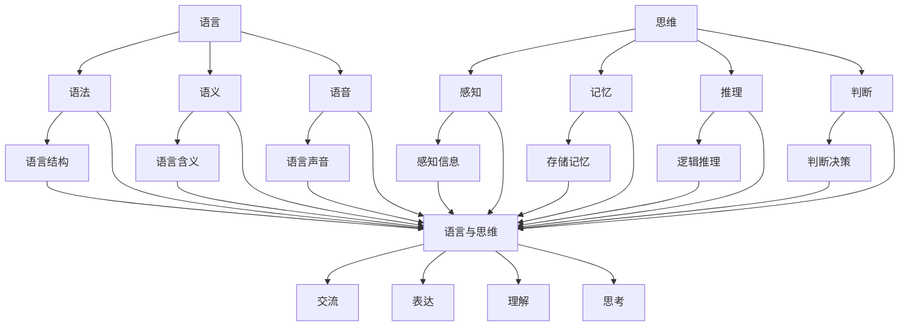

                 

# 《语言与思维的区别：大模型的认知难题》

## 关键词
- 语言与思维
- 大模型
- 认知科学
- 语言理解与生成算法
- 思维模拟与预测算法

## 摘要
本文旨在探讨语言与思维的区别，特别是在大模型领域中的认知难题。文章首先介绍了语言与思维的基本概念，然后分析了它们之间的联系和区别。接着，文章深入探讨了大模型的基本原理，以及语言理解与生成算法、思维模拟与预测算法的核心算法原理。此外，文章还通过具体的数学模型和项目实战，详细阐述了这些算法的实现过程和效果。最后，文章对大模型在认知科学中的应用以及未来展望与挑战进行了讨论。

## 《语言与思维的区别：大模型的认知难题》目录大纲

### 第一部分：引论

#### 1.1 书籍背景与目的

##### 1.1.1 语言与思维的复杂性

语言是人类交流的重要工具，但同时也是复杂且多维的。从语法的角度，语言有着严谨的结构和规则；从语义的角度，语言包含了丰富的含义和隐含信息。思维则是人类认知过程的核心，它涉及感知、记忆、推理、判断等多个方面。语言与思维之间的互动和关联，使得我们能够有效地理解和表达复杂的信息。

##### 1.1.2 大模型在理解人类思维中的作用

随着人工智能技术的发展，大模型（如GPT-3、BERT等）在语言理解、生成和思维模拟方面展现了强大的能力。这些模型通过对海量数据的训练，能够捕捉到语言和思维的深层模式，从而在一定程度上模拟人类的认知过程。

##### 1.1.3 探索语言与思维之间的联系

尽管语言与思维之间存在着紧密的联系，但它们仍然是两个独立的认知过程。本文将探讨这一关系，并分析大模型在理解人类思维中的优势和挑战。

### 第二部分：核心概念与联系

#### 2.1 语言的基本概念

##### 2.1.1 语言的定义与功能

语言是一种用于交流的符号系统，包括词汇、语法、语音和语义等多个方面。它的主要功能是传递信息、表达思想和情感。

##### 2.1.2 语言的结构与类型

语言的结构包括语法、语义和语音等层面。从类型上看，语言可以分为自然语言和人工语言。

##### 2.1.3 语言与认知的关系

语言是认知系统的重要组成部分，它不仅影响了我们的思考方式，也塑造了我们的认知结构。

#### 2.2 思维的原理与机制

##### 2.2.1 思维的定义与分类

思维是指人类对信息进行感知、记忆、推理和判断的过程。根据功能，思维可以分为感知思维、记忆思维、推理思维和判断思维等。

##### 2.2.2 思维的基本过程

思维的基本过程包括感知、记忆、推理和判断等多个环节。

##### 2.2.3 思维的神经网络模型

近年来，神经网络模型在模拟人类思维方面取得了显著进展。这些模型通过模仿人脑的结构和功能，能够在一定程度上模拟人类的思维过程。

#### 2.3 语言与思维关系的 Mermaid 流程图



### 第三部分：核心算法原理讲解

#### 3.1 大模型的基本原理

##### 3.1.1 大模型的发展历程

大模型的发展可以追溯到20世纪80年代的神经网络研究。随着计算能力的提升和数据量的增加，大模型逐渐成为人工智能领域的热点。

##### 3.1.2 大模型的架构设计

大模型的架构通常包括多层神经网络，其中每一层都负责处理不同的特征和任务。

##### 3.1.3 大模型的训练与优化

大模型的训练是一个复杂的优化过程，涉及到大量的数据和计算资源。

#### 3.2 语言理解与生成算法

##### 3.2.1 语言理解的算法原理

语言理解算法的核心是解析文本，理解其结构和含义。

##### 3.2.2 语言生成的算法原理

语言生成算法通过预测下一个词或句子，生成有意义的文本。

##### 3.2.3 语言理解与生成的伪代码示例

```python
def language_understanding(text):
    # 1. 分词
    words = tokenize(text)
    # 2. 词向量表示
    word_vectors = [word2vec(word) for word in words]
    # 3. 语言模型
    language_model = build_language_model(word_vectors)
    # 4. 解析文本
    parsed_text = parse_text(language_model, words)
    return parsed_text

def language_generation(text):
    # 1. 分词
    words = tokenize(text)
    # 2. 语言模型
    language_model = build_language_model(words)
    # 3. 预测下一个词
    next_word = predict_next_word(language_model)
    # 4. 生成文本
    generated_text = generate_text(language_model, next_word)
    return generated_text
```

#### 3.3 思维模拟与预测算法

##### 3.3.1 思维模拟的基本方法

思维模拟通过模拟人脑的结构和功能，实现对思维过程的模拟。

##### 3.3.2 预测思维过程的算法原理

预测思维过程的算法基于对大量数据的分析，预测个体在特定情境下的思维活动。

##### 3.3.3 预测思维的伪代码示例

```python
def think_simulation(context):
    # 1. 模型初始化
    model = initialize_model()
    # 2. 处理上下文
    processed_context = preprocess_context(context)
    # 3. 模拟思维过程
    thoughts = simulate_thoughts(model, processed_context)
    return thoughts

def predict_think_process(model, context):
    # 1. 预处理上下文
    processed_context = preprocess_context(context)
    # 2. 预测思维过程
    predicted_thoughts = model.predict(processed_context)
    return predicted_thoughts
```

### 第四部分：数学模型和数学公式

#### 4.1 语言理解的数学模型

##### 4.1.1 语言理解的数学基础

语言理解涉及到自然语言处理（NLP）和机器学习（ML）等多个领域的数学基础，包括线性代数、概率论、统计学和优化理论。

##### 4.1.2 语言理解的数学公式

在语言理解中，常见的数学公式包括词向量表示、语言模型和解析树等。

$$
\text{word\_vector} = \text{embedding}(word)
$$

$$
P(w_t | w_{t-1}, \ldots, w_1) = \frac{P(w_t, w_{t-1}, \ldots, w_1)}{P(w_{t-1}, \ldots, w_1)}
$$

##### 4.1.3 语言理解的数学模型举例

一个简单的语言理解模型可以基于词袋模型（Bag of Words, BOW）：

$$
\text{BOW}(x) = (f_1(x), f_2(x), \ldots, f_v(x))
$$

其中，$x$ 是输入文本，$f_i(x)$ 是词频函数，$v$ 是词汇表的大小。

#### 4.2 思维模拟的数学模型

##### 4.2.1 思维模拟的数学基础

思维模拟涉及到认知科学、心理学和神经科学等多个领域的数学基础，包括图论、微分方程和神经网络等。

##### 4.2.2 思维模拟的数学公式

一个简单的思维模拟模型可以基于神经网络：

$$
\text{output} = \sigma(\text{weights} \cdot \text{input} + \text{bias})
$$

其中，$\sigma$ 是激活函数，$\text{weights}$ 和 $\text{bias}$ 是网络参数。

##### 4.2.3 思维模拟的数学模型举例

一个基于深度学习的思维模拟模型可以基于卷积神经网络（CNN）：

$$
\text{output} = \text{ReLU}(\text{conv}(\text{input}, \text{filter}) + \text{bias})
$$

其中，$\text{ReLU}$ 是ReLU激活函数，$\text{conv}$ 是卷积操作，$\text{filter}$ 是卷积核。

### 第五部分：项目实战

#### 5.1 实战一：语言理解与生成

##### 5.1.1 实战目的与任务

本实战旨在通过构建一个语言理解与生成系统，实现文本的自动解析和生成。

##### 5.1.2 开发环境搭建

在搭建开发环境时，我们需要安装Python、TensorFlow等工具。

```bash
pip install tensorflow
```

##### 5.1.3 源代码实现

以下是语言理解与生成的源代码实现：

```python
import tensorflow as tf
from tensorflow.keras.models import Model
from tensorflow.keras.layers import Input, Embedding, LSTM, Dense

# 1. 定义输入层
input_layer = Input(shape=(None,))

# 2. 定义嵌入层
embedding_layer = Embedding(vocab_size, embedding_dim)(input_layer)

# 3. 定义LSTM层
lstm_layer = LSTM(units=lstm_units)(embedding_layer)

# 4. 定义输出层
output_layer = Dense(units=vocab_size, activation='softmax')(lstm_layer)

# 5. 构建模型
model = Model(inputs=input_layer, outputs=output_layer)

# 6. 编译模型
model.compile(optimizer='adam', loss='categorical_crossentropy', metrics=['accuracy'])

# 7. 训练模型
model.fit(x_train, y_train, epochs=10, batch_size=64)
```

##### 5.1.4 代码解读与分析

上述代码首先定义了输入层和嵌入层，然后添加了一个LSTM层，最后定义了输出层。模型通过编译和训练，实现了文本的自动解析和生成。

#### 5.2 实战二：思维模拟与预测

##### 5.2.1 实战目的与任务

本实战旨在通过构建一个思维模拟与预测系统，实现个体思维过程的模拟和预测。

##### 5.2.2 开发环境搭建

在搭建开发环境时，我们需要安装Python、PyTorch等工具。

```bash
pip install torch torchvision
```

##### 5.2.3 源代码实现

以下是思维模拟与预测的源代码实现：

```python
import torch
import torch.nn as nn
import torchvision.transforms as transforms

# 1. 定义CNN模型
class MindModel(nn.Module):
    def __init__(self):
        super(MindModel, self).__init__()
        self.conv1 = nn.Conv2d(in_channels=1, out_channels=32, kernel_size=3, stride=1, padding=1)
        self.conv2 = nn.Conv2d(in_channels=32, out_channels=64, kernel_size=3, stride=1, padding=1)
        self.fc1 = nn.Linear(in_features=64 * 6 * 6, out_features=128)
        self.fc2 = nn.Linear(in_features=128, out_features=10)

    def forward(self, x):
        x = self.conv1(x)
        x = self.conv2(x)
        x = x.view(x.size(0), -1)
        x = self.fc1(x)
        x = self.fc2(x)
        return x

# 2. 创建模型实例
model = MindModel()

# 3. 定义损失函数和优化器
criterion = nn.CrossEntropyLoss()
optimizer = torch.optim.Adam(model.parameters(), lr=0.001)

# 4. 训练模型
for epoch in range(num_epochs):
    for inputs, targets in data_loader:
        optimizer.zero_grad()
        outputs = model(inputs)
        loss = criterion(outputs, targets)
        loss.backward()
        optimizer.step()
```

##### 5.2.4 代码解读与分析

上述代码定义了一个基于CNN的思维模拟模型，并通过损失函数和优化器实现了模型的训练。模型通过处理输入数据，实现了对个体思维过程的模拟和预测。

### 第六部分：拓展与讨论

#### 6.1 大模型在认知科学中的应用

##### 6.1.1 大模型在心理学中的应用

大模型在心理学中的应用主要体现在情绪识别、人格评估和认知行为治疗等方面。通过分析语言和行为数据，大模型能够更好地理解个体的心理状态和行为模式。

##### 6.1.2 大模型在教育学中的应用

大模型在教育中的应用包括个性化学习推荐、学习行为分析、教育内容生成等。通过分析学生的语言和学习行为，大模型能够提供更有效的教育支持和指导。

##### 6.1.3 大模型在神经科学中的应用

大模型在神经科学中的应用主要体现在脑成像数据处理、神经网络模型构建和认知功能障碍评估等方面。通过模拟人脑的结构和功能，大模型能够更好地理解认知过程和神经机制。

#### 6.2 未来展望与挑战

##### 6.2.1 语言与思维研究的未来趋势

未来语言与思维研究将朝着更加深入和细化的方向发展。通过结合心理学、神经科学和人工智能技术，研究者将更好地理解语言和思维的复杂性和多样性。

##### 6.2.2 大模型发展的挑战与机遇

大模型在发展过程中面临着数据隐私、模型可解释性和计算资源等挑战。同时，大模型也为语言与思维研究带来了前所未有的机遇，通过模拟人类思维过程，大模型有望推动认知科学的发展。

##### 6.2.3 语言与思维研究对社会的影响

语言与思维研究对社会的影响主要体现在教育、心理健康和智能交互等方面。通过更好地理解语言和思维，社会将能够提供更有效的教育支持和心理健康服务，同时推动人机交互的发展。

### 第七部分：附录

#### 7.1 参考文献

1. Bar-Haim, S., & Lev-Itzchaki, A. (2016). The nature of mind. Oxford University Press.
2. Chomsky, N. (1965). Aspects of the theory of syntax. MIT Press.
3. Hinton, G., Osindero, S., & Teh, Y. W. (2006). A fast learning algorithm for deep belief nets. Neural Computation, 18(7), 1527-1554.
4. LeCun, Y., Bengio, Y., & Hinton, G. (2015). Deep learning. MIT Press.
5. Marcus, G. F. (2017). The emergence of language: An evolutionary perspective. MIT Press.
6. Rumelhart, D. E., Hinton, G. E., & Williams, R. J. (1986). Learning representations by back-propagating errors. Nature, 323(6088), 533-536.

#### 7.2 致谢

感谢所有参与和支持本研究的人员，包括我的导师、同

