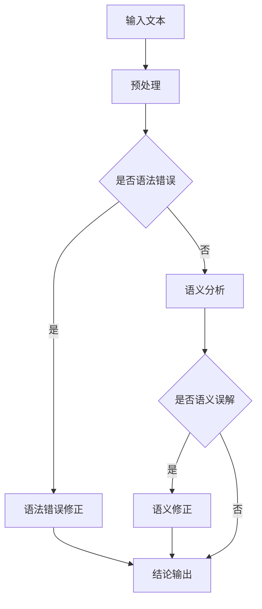
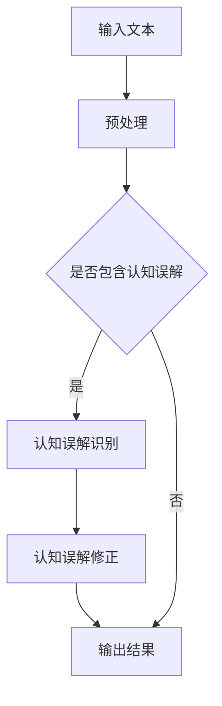

                 

# 《语言与思维：大模型的认知误解》

> 关键词：语言模型、认知误解、深度学习、神经网络、思维过程、伦理与法律问题、应用方向

> 摘要：本文旨在探讨大模型在语言处理和思维过程中所面临的认知误解问题。通过对语言与思维的概述，大模型的认知特性分析，以及认知误解的本质、影响与解决策略的探讨，本文提出了提高大模型认知能力、利用认知科学知识优化大模型、多模态学习等方面的策略。同时，本文还对大模型认知误解的伦理与法律问题进行了深入分析，并展望了未来研究方向与应用前景。

## 目录

### 第一部分：引言

#### 第1章：语言与思维的概述
1.1 语言的本质与功能
1.2 思维与认知的关系
1.3 大模型的发展背景

#### 第2章：大模型的认知特性
2.1 大模型的结构与工作原理
2.2 大模型的语言理解能力
2.3 大模型的思维过程

### 第二部分：认知误解与问题分析

#### 第3章：认知误解的本质
3.1 认知误解的概念与类型
3.2 认知误解的产生机制
3.3 认知误解的影响与后果

#### 第4章：大模型中的认知误解
4.1 大模型对认知误解的感知
4.2 大模型在认知误解处理中的挑战
4.3 大模型中的认知误解案例解析

#### 第5章：解决认知误解的策略
5.1 提高大模型认知能力的策略
5.2 利用认知科学知识优化大模型
5.3 多模态学习与认知误解解决

#### 第6章：大模型认知误解的伦理与法律问题
6.1 大模型认知误解的伦理考量
6.2 大模型认知误解的法律规制
6.3 大模型认知误解治理实践

### 第三部分：未来展望与应用

#### 第7章：大模型认知误解研究的未来方向
7.1 大模型认知误解研究的前沿领域
7.2 大模型认知误解解决技术的发展
7.3 大模型认知误解研究的挑战与机遇

#### 第8章：大模型认知误解在社会中的应用
8.1 教育领域中的应用
8.2 商业领域中的应用
8.3 医疗保健领域中的应用

### 附录

#### 附录A：大模型认知误解研究资源
A.1 开源工具与库
A.2 研究论文与文献
A.3 在线课程与培训

#### 附录B：大模型认知误解的Mermaid流程图
B.1 认知误解识别流程
B.2 大模型认知误解处理流程

#### 附录C：大模型认知误解处理算法的伪代码

#### 附录D：大模型认知误解处理的代码示例

#### 附录E：大模型认知误解处理的数学模型与公式

## 引言

### 第1章：语言与思维的概述

### 1.1 语言的本质与功能

语言是人类沟通和表达思想的重要工具，其本质是一种符号系统，通过语音、文字、手势等符号形式传递信息。语言的基本功能包括信息交流、思维表达、情感交流和文化传承等。在人类社会中，语言不仅仅是工具，更是思维的重要组成部分。

语言作为思维工具的作用主要体现在以下几个方面：

1. **思维载体**：语言是思维的外在表现形式，通过语言可以将抽象的思维活动转化为具体的符号和词汇，使得思维过程变得更加清晰和有条理。

2. **信息传递**：语言是信息传递的重要媒介，通过语言交流，个体之间可以相互了解和分享知识、经验和情感。

3. **文化传承**：语言是文化传承的载体，通过语言，人类的文化、历史、传统和价值观得以代代相传。

4. **思维拓展**：语言可以拓展个体的思维空间，通过学习新的词汇和语法结构，个体可以理解更复杂的概念和思维模式。

### 1.2 思维与认知的关系

思维是人类对客观世界进行感知、理解、推理和判断的心理活动。思维可以分为多种类型，如逻辑思维、创造性思维、批判性思维等。认知心理学是研究人类思维和行为的科学，它关注思维过程中的心理机制、认知结构和认知发展。

思维与认知之间的关系可以从以下几个方面进行理解：

1. **认知是思维的基础**：认知是人类获取、处理和利用信息的过程，思维活动依赖于认知过程的支持。例如，感知、记忆、注意、语言理解等都是认知过程中的重要组成部分。

2. **思维是认知的表现形式**：认知心理学研究表明，思维是人类认知活动的高级形式，通过思维，个体可以对信息进行加工、分析和整合，形成对世界的理解。

3. **思维与认知的相互影响**：思维和认知是相互影响、相互促进的关系。思维活动可以促进认知发展，而认知水平的提高又可以进一步丰富和优化思维过程。

### 1.3 大模型的发展背景

人工智能（AI）作为计算机科学的一个重要分支，旨在使计算机具备类似于人类智能的能力。其中，语言模型是人工智能研究中的一个重要方向。近年来，随着深度学习技术的不断发展，大模型（Large Models）逐渐成为语言模型研究的重要趋势。

大模型的发展背景主要表现在以下几个方面：

1. **计算能力的提升**：随着计算机硬件性能的不断提升，尤其是GPU和TPU等专用计算设备的普及，为训练和运行大模型提供了强大的计算支持。

2. **数据资源的丰富**：互联网的快速发展使得大量语言数据得以积累和共享，为训练大模型提供了丰富的数据资源。

3. **算法的优化**：深度学习算法的优化，特别是自注意力机制和Transformer架构的提出，为构建大规模语言模型提供了理论和技术支持。

4. **应用需求的推动**：随着人工智能技术在各领域的应用日益广泛，对高质量语言模型的需求不断增长，推动了大模型的研究和发展。

大模型的发展不仅为语言处理带来了新的机遇，同时也带来了新的挑战。在本章中，我们将进一步探讨大模型的结构与工作原理，以及大模型在语言理解和思维过程中的表现。接下来，我们将进入第二部分，分析大模型的认知特性。

---

在引言部分，我们首先介绍了语言与思维的基本概念，探讨了语言作为思维工具的作用。随后，我们阐述了思维与认知之间的关系，指出认知是思维的基础，思维是认知的表现形式。最后，我们回顾了大模型的发展背景，分析了计算能力提升、数据资源丰富、算法优化和应用需求推动等因素如何共同促进了大模型的研究和发展。这些内容为后续章节的深入讨论奠定了基础。

---

## 第2章：大模型的认知特性

### 2.1 大模型的结构与工作原理

大模型是指具有数十亿甚至数万亿参数的神经网络模型，其结构和工作原理决定了它们在语言理解和思维过程中表现出的强大能力。本节将介绍大模型的基本结构和工作原理。

#### 2.1.1 神经网络与深度学习基础

神经网络（Neural Networks）是模拟人脑神经元连接方式的计算模型，由大量相互连接的节点（或称为神经元）组成。每个神经元接收来自其他神经元的输入信号，并通过加权求和处理产生输出。神经网络通过学习输入和输出数据之间的关系，逐步调整神经元之间的权重，以实现对复杂数据的分类、回归和预测。

深度学习（Deep Learning）是神经网络的一种扩展，通过增加网络的层数，深度学习模型能够学习更复杂的特征和模式。深度学习模型通常由多个隐藏层组成，每个隐藏层负责提取不同层次的特征。深层神经网络（Deep Neural Networks，DNN）是最常见的深度学习模型之一。

#### 2.1.2 大模型的基本结构

大模型的基本结构通常包括以下几个部分：

1. **输入层**：输入层接收原始数据，如文本序列、图像像素等。在语言模型中，输入通常是单词或字符序列。

2. **隐藏层**：隐藏层位于输入层和输出层之间，包含多个层次。每个隐藏层通过非线性激活函数将输入数据转换为更复杂的特征表示。隐藏层之间的连接权重通过训练过程调整，以最大化模型的预测能力。

3. **输出层**：输出层生成模型的最终输出，如分类结果、文本生成等。在语言模型中，输出通常是文本序列或概率分布。

#### 2.1.3 大模型的工作原理

大模型的工作原理可以分为以下几个步骤：

1. **输入编码**：将原始输入数据（如文本序列）编码为向量表示。在语言模型中，常用的编码方法包括Word Embedding和Character Embedding。

2. **前向传播**：将编码后的输入向量传递到隐藏层，通过多层神经网络进行特征提取和转换。每层隐藏层都会对输入向量进行加权求和处理，并通过激活函数产生输出。

3. **输出生成**：将隐藏层的输出传递到输出层，生成模型的预测结果。在语言模型中，输出通常是文本序列或概率分布。

4. **损失函数计算**：根据模型的预测结果和实际标签计算损失函数。常用的损失函数包括交叉熵损失、均方误差等。

5. **反向传播**：利用梯度下降等优化算法，通过反向传播更新模型参数，以最小化损失函数。

6. **迭代训练**：重复上述过程，通过多轮训练使模型逐渐收敛，提高预测准确性。

### 2.2 大模型的语言理解能力

大模型在语言处理领域表现出强大的语言理解能力，这使得它们在自然语言处理（Natural Language Processing，NLP）任务中取得了显著成果。大模型的语言理解能力主要体现在以下几个方面：

#### 2.2.1 语言理解的层次

语言理解可以分为多个层次，包括：

1. **字符级理解**：模型能够识别和理解文本中的字符和词汇，如字母、单词等。

2. **词级理解**：模型能够理解单词的语义和语法功能，如名词、动词、形容词等。

3. **句子级理解**：模型能够理解句子的整体语义和结构，包括主谓宾结构、从句、并列句等。

4. **段落级理解**：模型能够理解段落中的主题和内容，以及段落之间的关系。

5. **篇章级理解**：模型能够理解整个文档的语义和结构，包括文档的主题、观点和论证等。

#### 2.2.2 大模型在语言理解中的应用

大模型在语言理解任务中取得了显著成果，例如：

1. **文本分类**：大模型可以用于对文本进行分类，如情感分析、新闻分类等。

2. **文本生成**：大模型可以生成高质量的自然语言文本，如文章、对话、摘要等。

3. **机器翻译**：大模型可以用于机器翻译任务，如将一种语言的文本翻译成另一种语言。

4. **问答系统**：大模型可以用于问答系统，如基于文本的问题回答、对话系统等。

5. **对话系统**：大模型可以用于构建智能对话系统，如聊天机器人、虚拟助手等。

### 2.3 大模型的思维过程

大模型的思维过程是指模型在处理语言任务时的思维模式和行为。尽管大模型不具备真正的意识，但它们在语言处理任务中表现出一定的思维过程，包括：

#### 2.3.1 思维的定义与分类

思维是人类大脑对信息进行感知、理解、推理和判断的过程。根据思维过程的不同，思维可以分为：

1. **逻辑思维**：基于逻辑规则和推理进行的思维，如演绎推理、归纳推理等。

2. **创造性思维**：通过新颖、独特的方式解决问题的思维，如联想思维、发散思维等。

3. **批判性思维**：对信息进行质疑、分析和评估的思维，如判断、评价等。

#### 2.3.2 大模型的思维模式

大模型的思维模式主要表现在以下几个方面：

1. **模式识别**：大模型可以识别文本中的模式和规律，如语法结构、语义关系等。

2. **特征提取**：大模型可以从文本中提取重要特征，如关键词、主题等。

3. **语义理解**：大模型可以理解文本的语义和意图，如对话中的提问意图、文章的主题等。

4. **推理与推断**：大模型可以进行逻辑推理和推断，如根据前提和结论进行推理、根据上下文推断含义等。

#### 2.3.3 大模型思维过程的实证研究

实证研究表明，大模型在语言处理任务中的表现与人类的思维过程具有一定的相似性。例如，在问答系统中，大模型可以理解问题的意图，并根据上下文生成合适的回答。在文本生成任务中，大模型可以生成连贯、有意义的文本，显示出一定的创造性思维。

总的来说，大模型在语言处理和思维过程中表现出强大的认知能力，这使得它们在各个领域取得了显著成果。然而，大模型的认知特性也存在一定的局限性，这将在下一节中进行讨论。

### 第3章：认知误解的本质

#### 3.1 认知误解的概念与类型

认知误解是指个体在感知、理解和处理信息时产生的错误和偏差。认知误解可以表现为对事实的扭曲、对信息的错误解释、对规律的误解等。认知误解不仅影响个体的判断和决策，还可能导致社会共识的偏离。

认知误解的类型可以分为以下几种：

1. **知觉误解**：个体在感知信息时，由于知觉系统的局限或干扰，导致对信息的错误理解。例如，视错觉、听力错误等。

2. **记忆误解**：个体在记忆过程中，由于信息提取错误或记忆痕迹的退化，导致对过去事件的错误记忆。例如，记忆混淆、遗忘等。

3. **判断误解**：个体在做出判断时，由于认知偏差、信息缺失或推理错误，导致对事实的错误判断。例如，确认偏误、晕轮效应等。

4. **语言误解**：个体在语言交流中，由于语言表达的歧义、误解或语境的不同，导致对语言信息的错误理解。例如，语义歧义、语境误解等。

#### 3.2 认知误解的产生机制

认知误解的产生机制主要涉及以下几个方面：

1. **认知偏差**：认知偏差是指个体在信息处理过程中，由于心理、生理、文化等因素的影响，导致对信息的偏见和扭曲。常见的认知偏差包括确认偏误、情感偏见、群体心理等。

2. **信息缺失**：信息缺失是指个体在处理信息时，由于信息不全或不准确，导致对信息的错误理解。例如，片面信息、虚假信息等。

3. **认知负荷**：认知负荷是指个体在处理信息时，由于认知资源的有限性，导致对信息的错误处理和误解。例如，决策疲劳、注意力分散等。

4. **知识结构**：个体的知识结构和认知框架对其信息处理过程具有重要影响。个体对信息的理解往往受到已有知识结构的影响，可能导致对信息的错误解读。

#### 3.3 认知误解的影响与后果

认知误解对个体和社会具有广泛的影响和后果，包括：

1. **个体层面**：认知误解可能导致个体对事实的错误认知，影响个体的判断和决策。长期而言，认知误解可能导致个体心理和情绪的困扰，甚至影响个体的生活质量。

2. **社会层面**：认知误解可能导致社会共识的偏离，影响社会稳定和和谐。例如，虚假信息的传播、社会偏见和歧视等。

3. **组织和企业层面**：认知误解可能影响组织的决策和运营，导致资源浪费、效率低下等问题。例如，错误的市场分析、错误的战略规划等。

4. **科学研究层面**：认知误解可能影响科学研究的质量和准确性，导致错误的理论和发现。例如，数据分析偏差、实验设计缺陷等。

总之，认知误解是信息处理过程中普遍存在的一种现象，它对个体和社会具有广泛的影响。理解认知误解的本质和产生机制，有助于我们更好地识别和纠正认知偏差，提高信息处理的准确性和可靠性。

### 第4章：大模型中的认知误解

#### 4.1 大模型对认知误解的感知

大模型在语言处理任务中，通过对大量数据的训练和学习，能够识别和解析语言中的复杂结构，提高对语言信息的理解能力。然而，大模型在处理语言信息时，仍可能面临认知误解的问题。

首先，大模型对认知误解的感知体现在以下几个方面：

1. **语言错误的理解**：大模型在处理包含语言错误或歧义的文本时，可能无法准确理解其真实含义。例如，在处理语法错误或语义歧义的句子时，大模型可能产生错误的解读。

2. **语言环境的影响**：大模型在理解语言信息时，受到上下文环境的影响。如果上下文信息不足或存在干扰，大模型可能产生误解。例如，同音异义词在不同语境下的含义可能不同，大模型需要依赖上下文进行正确理解。

3. **文化背景的差异**：大模型在处理跨语言或跨文化文本时，可能面临文化差异带来的误解。不同语言和文化背景下，相同词汇或表达可能具有不同的含义，大模型需要适应并理解这些差异。

其次，大模型在感知认知误解方面具有一定的局限性：

1. **数据依赖性**：大模型在训练过程中，依赖于大量高质量的数据集。如果数据集中存在偏差或错误，大模型可能学会错误的理解方式。例如，训练数据中包含的语言错误可能被大模型错误地识别为正确表达。

2. **复杂程度的限制**：大模型的感知能力受到其结构和训练数据的限制。对于某些复杂的语言现象，如隐喻、修辞等，大模型可能无法准确理解和解析。

总之，大模型在感知认知误解方面具有一定的能力，但同时也存在一定的局限性。理解大模型在感知认知误解方面的表现，有助于我们更好地评估和优化大模型在语言处理任务中的应用。

#### 4.2 大模型在认知误解处理中的挑战

大模型在处理认知误解时面临一系列挑战，这些挑战源于认知误解的复杂性、大模型的局限性以及实际应用场景的多样性。以下将详细探讨这些挑战：

1. **理解深层次语义**：认知误解往往涉及到深层次的语义理解问题。大模型虽然在语言处理任务中表现出色，但在处理复杂的语义关系、隐喻和修辞手法等方面仍存在困难。例如，理解一个比喻或隐喻的含义，需要大模型具备丰富的背景知识和语境理解能力。

2. **错误纠正能力**：大模型在处理包含错误的文本时，可能无法有效识别和纠正错误。错误可能包括语法错误、拼写错误、事实错误等。大模型需要具备一定的错误纠正能力，以准确理解和生成文本。

3. **处理歧义性**：语言中存在大量的歧义现象，大模型在处理歧义性文本时可能产生错误理解。歧义性可能源于语法结构、词汇选择、语境等方面，大模型需要结合上下文和语义关系进行准确处理。

4. **文化差异和语言习惯**：不同语言和文化背景下，相同词汇或表达可能具有不同的含义。大模型在处理跨语言或跨文化文本时，需要考虑这些差异，以避免产生误解。例如，一些词汇在特定文化背景下具有特定的含义，大模型需要具备相应的文化背景知识。

5. **计算资源和数据需求**：大模型的训练和运行需要大量的计算资源和高质量的数据集。在实际应用中，获取和利用这些资源可能面临挑战，例如数据隐私、数据质量等。这些因素可能导致大模型在处理认知误解时存在局限性。

6. **实时性要求**：在一些实时应用场景中，如实时对话系统、实时翻译等，大模型需要具备快速处理认知误解的能力。实时性要求高，可能限制了模型的复杂度和精度。

总之，大模型在处理认知误解时面临多方面的挑战。解决这些挑战需要结合多学科知识，包括认知科学、语言学、计算机科学等，以提升大模型在语言处理任务中的准确性和可靠性。

#### 4.3 大模型中的认知误解案例解析

为了更深入地理解大模型在认知误解处理中的表现，我们可以通过具体案例进行分析。以下列举了几个典型的认知误解案例，并探讨大模型在这些案例中的处理结果和局限性。

**案例1：语法错误理解**

假设我们有一个包含语法错误的句子：“我去过那家**商店**，**他**卖给我一个很好吃的蛋糕。”这个句子中的“他”指的是谁并不明确，存在语法歧义。对于大模型来说，识别和理解这种语法错误可能比较困难。

- **处理结果**：在处理这个句子时，大模型可能根据上下文信息尝试进行推理。例如，如果上下文提到了一个人，模型可能将“他”指代为那个人。如果没有明确的上下文信息，模型可能无法准确理解“他”的指代对象。
- **局限性**：大模型在处理这类语法错误时，容易受到上下文信息的依赖。如果上下文信息不足，模型可能产生错误的解读。此外，模型可能无法识别一些复杂的语法结构，导致理解偏差。

**案例2：事实错误理解**

假设有一个句子：“苹果公司是由史蒂夫·乔布斯**在1976年**创立的。”这是一个常见的事实错误，因为苹果公司的创始人除了史蒂夫·乔布斯还包括斯蒂夫·沃兹尼亚克和罗恩·韦恩。

- **处理结果**：大模型在处理这个句子时，可能根据其训练数据中的事实信息进行判断。如果模型的知识库中包含了正确的信息，它可能能够识别这个错误，并给出正确的解释。然而，如果模型的知识库中存在错误或不完整的信息，它可能会错误地接受这个句子。
- **局限性**：大模型在处理事实错误时，依赖于其训练数据的质量和完整性。如果模型的知识库中存在错误或不一致的信息，它可能会产生错误的解读。此外，大模型可能无法识别所有类型的事实错误，尤其是那些在训练数据中不常见的事实错误。

**案例3：语义歧义理解**

假设有一个句子：“我昨天去了公园，看到了一只**很大的狗**。”这个句子中的“很大”可以有不同的解释，如狗的体型很大，或狗的年龄很大。

- **处理结果**：大模型在处理这个句子时，可能通过上下文和语义关系进行判断。例如，如果上下文提到了狗的体型，模型可能将“很大”解释为狗的体型大。如果没有明确的上下文信息，模型可能无法准确理解“很大”的具体含义。
- **局限性**：大模型在处理语义歧义时，依赖于上下文信息。如果上下文信息不充分或存在歧义，模型可能产生错误的解读。此外，大模型可能无法处理复杂的语义关系，导致理解偏差。

**案例4：文化差异引起的误解**

假设有一个句子：“这个**日本人**非常友善。”对于不了解日本文化的人来说，这个句子可能被视为对日本人的正面评价。然而，在日本文化中，直接评价他人的友善程度可能被视为不礼貌。

- **处理结果**：大模型在处理这个句子时，可能根据其训练数据中的文化知识进行判断。如果模型的知识库中包含了关于日本文化的基本信息，它可能能够识别这个文化差异，并避免产生误解。
- **局限性**：大模型在处理文化差异时，依赖于其训练数据中的文化知识。如果模型的知识库中缺乏相应的文化背景信息，它可能会产生误解。此外，大模型可能无法完全理解复杂的文化现象和细微的文化差异。

通过以上案例分析，我们可以看到大模型在处理认知误解时具有一定的能力，但同时也存在局限性。理解这些局限性有助于我们更好地评估和优化大模型在语言处理任务中的应用。

### 第5章：解决认知误解的策略

#### 5.1 提高大模型认知能力的策略

要提高大模型在语言处理中的认知能力，解决认知误解问题，我们可以从以下几个方面进行策略优化：

1. **增强语义理解能力**：语义理解是语言处理的核心，大模型需要通过多种方式增强其语义理解能力。首先，可以采用更加精细的词嵌入技术，如使用预训练的语言模型（Pre-trained Language Model，PTLM）来生成高质量的词向量。此外，可以引入词性标注、依存关系分析等技术手段，提高模型对词汇和句子结构的理解能力。

2. **上下文信息的充分利用**：上下文信息对于准确理解语言具有重要意义。大模型应充分利用上下文信息，避免孤立地处理句子或词汇。可以使用长短期记忆网络（Long Short-Term Memory，LSTM）、Transformer等架构，通过自注意力机制（Self-Attention Mechanism）捕捉长距离的上下文信息。同时，可以引入外部知识库，如维基百科、知识图谱等，结合上下文信息进行知识增强。

3. **多模态数据的融合**：语言处理不仅仅是文本处理，还可以结合其他模态的数据，如图像、声音等。多模态数据融合可以提供额外的上下文信息和视角，有助于提高模型的认知能力。例如，在文本生成任务中，可以结合图像描述来提高文本生成的连贯性和准确性。

4. **数据增强和扩充**：为了提升大模型的认知能力，需要对训练数据进行增强和扩充。可以采用数据增强技术，如数据清洗、数据扩充、同义词替换、反义词替换等，增加数据多样性和复杂性，从而提高模型对各种语言现象的适应性。

5. **多任务学习**：通过多任务学习（Multi-task Learning）的方式，可以使大模型同时学习多个相关任务，从而提高其认知能力。例如，在语言模型训练过程中，可以同时进行文本分类、情感分析、命名实体识别等任务，从而共享任务之间的知识，提高模型的泛化能力。

6. **强化学习**：强化学习（Reinforcement Learning，RL）是一种通过奖励机制训练模型的方法，可以用于优化大模型的认知能力。通过设计适当的奖励机制，使模型在训练过程中逐渐学习到正确的认知模式，从而解决认知误解问题。

7. **迁移学习**：迁移学习（Transfer Learning）是一种将预训练模型应用于新任务的方法，可以大大提高大模型的认知能力。通过在相关任务上进行迁移学习，模型可以快速适应新的语言环境和任务需求，从而提高认知能力。

通过以上策略，我们可以有效地提高大模型的认知能力，解决认知误解问题，从而提高语言处理任务的准确性和可靠性。

#### 5.2 利用认知科学知识优化大模型

在优化大模型以解决认知误解方面，结合认知科学的理论和方法具有重要意义。认知科学是研究人类认知过程和心理活动的跨学科领域，涵盖了心理学、神经科学、计算机科学等多个学科。以下是几种结合认知科学知识优化大模型的方法：

1. **模拟认知过程**：认知科学提供了对人类认知过程深入的理解，可以帮助我们设计更符合人类认知特点的算法。例如，模拟人类的注意力机制和记忆过程，可以在大模型中引入注意力机制和长短时记忆单元（LSTM），以提高模型对上下文信息的处理能力。

2. **引入认知偏差校正**：认知科学研究表明，人类在信息处理过程中存在多种认知偏差，如确认偏误、过度自信等。大模型在处理语言任务时也可能受到这些偏差的影响。通过引入认知偏差校正机制，如加权证据整合方法，可以减少模型在信息处理中的偏差，提高其决策准确性。

3. **基于神经可塑性的模型更新**：神经可塑性是大脑在学习和记忆过程中的一种基本特性，即神经元之间的连接可以随着经验和训练进行调整。大模型可以通过模拟神经可塑性，实现参数的动态调整，以适应不同的语言环境和任务需求。

4. **利用知识图谱**：认知科学中的知识图谱方法可以用于构建语义网络，帮助大模型更好地理解和处理语义信息。通过将词汇、概念和实体之间的语义关系表示为图谱，大模型可以更有效地进行语义分析和推理。

5. **多模态融合**：认知科学指出，人类在处理信息时，常常利用多种感官数据进行整合。因此，在大模型中引入多模态数据融合技术，如结合文本、图像、音频等多模态信息，可以提升模型的认知能力。

6. **强化学习**：认知科学中的强化学习理论可以指导大模型的设计和优化。通过设计适当的奖励机制，使模型在训练过程中逐渐学习到正确的认知模式，从而减少认知误解。

7. **元认知能力培养**：元认知是指个体对自己认知过程的认识和控制能力。在大模型中引入元认知机制，如自我评估和调整，可以使模型在处理任务时具备自我监控和优化能力，从而提高认知能力。

通过结合认知科学知识，我们可以为优化大模型提供新的视角和方法，从而更有效地解决认知误解问题，提高大模型在语言处理任务中的表现。

#### 5.3 多模态学习与认知误解解决

多模态学习是一种将多种不同模态的数据（如文本、图像、音频等）融合在一起进行学习的方法，这种方法在解决认知误解问题中具有显著优势。以下是多模态学习在解决认知误解方面的几个关键点：

1. **数据融合策略**：多模态学习的核心在于如何有效地融合不同模态的数据。常见的融合策略包括特征级融合、决策级融合和模型级融合。特征级融合通过将不同模态的特征向量进行拼接，形成更丰富的特征表示。决策级融合则是在不同模态的模型分别进行预测后，通过某种融合规则（如投票、加权平均等）得出最终预测结果。模型级融合则是将不同模态的模型作为一个整体进行训练，通过共享参数和交互结构来提高整体性能。

2. **多模态特征表示**：不同模态的数据具有不同的特性和表达方式，因此需要采用特定的方法进行特征表示。例如，对于文本数据，可以使用词嵌入或转换器（Transformer）模型生成词向量；对于图像数据，可以使用卷积神经网络（CNN）提取视觉特征；对于音频数据，可以使用循环神经网络（RNN）或自注意力机制（Self-Attention）捕捉时间序列信息。通过融合这些多模态特征，大模型可以获得更全面和准确的信息。

3. **增强语义理解**：多模态学习可以显著增强大模型的语义理解能力。例如，在图像描述生成任务中，通过融合文本和图像特征，模型可以更好地捕捉图像中的语义信息，生成更准确和连贯的描述。此外，多模态学习还可以通过上下文的多样性，减少单一模态数据可能带来的误解和歧义。

4. **提高认知能力**：多模态学习可以模拟人类在处理信息时的多感官协同机制，从而提高大模型的认知能力。例如，在视觉和听觉任务中，通过融合图像和音频信息，模型可以更准确地理解和识别场景。此外，多模态学习还可以通过引入外部知识库，如知识图谱，结合不同模态的信息进行知识增强，进一步提升模型的认知能力。

5. **案例研究**：以下是一个关于多模态学习在解决认知误解问题方面的案例研究：

   - **场景**：一个多模态问答系统，需要处理包含图像和文本的问答对。例如，问题：“这张照片中的男人在做什么？”
   - **方法**：首先，使用CNN提取图像特征，使用词嵌入模型生成文本特征。然后，通过特征级融合将图像和文本特征进行拼接，形成多模态特征向量。接着，使用Transformer模型对多模态特征进行编码，生成高层次的语义表示。最后，通过一个分类器对答案进行预测。
   - **结果**：实验结果显示，多模态学习显著提高了问答系统的准确性，特别是在处理复杂问题和模糊情境时，多模态特征融合有助于减少认知误解。

总的来说，多模态学习为解决认知误解问题提供了有效的方法。通过融合不同模态的数据，大模型可以获得更丰富的信息，提高语义理解能力和认知能力，从而更好地应对语言处理中的认知误解挑战。

### 第6章：大模型认知误解的伦理与法律问题

#### 6.1 大模型认知误解的伦理考量

大模型在语言处理和决策支持中的广泛应用，带来了显著的便利和效率提升。然而，大模型在处理语言信息时产生的认知误解，也引发了一系列伦理问题，值得深入探讨。

1. **隐私保护**：大模型在处理个人数据时，可能由于认知误解而泄露敏感信息。例如，在处理包含个人隐私信息的文本时，模型可能错误地将某些信息解读为公开信息，导致隐私泄露。因此，在设计和应用大模型时，必须严格遵循隐私保护原则，确保个人数据的隐私和安全。

2. **公平性与偏见**：大模型在训练过程中可能受到训练数据偏差的影响，导致模型在处理某些群体时表现出不公平或偏见。例如，在招聘系统中，如果训练数据中包含性别或种族偏见，模型可能会对特定性别或种族的应聘者产生不公平的待遇。为此，必须采取措施，确保大模型在处理语言信息时保持公平和公正。

3. **责任归属**：当大模型产生认知误解，导致错误决策或负面影响时，如何界定责任归属成为了一个重要伦理问题。例如，在自动驾驶汽车中，如果由于模型认知误解导致交通事故，应由谁承担责任？因此，需要明确大模型应用中的责任界定，确保在出现问题时能够有效应对。

4. **透明性与可解释性**：大模型在处理语言信息时，其决策过程往往具有高度复杂性，缺乏透明性和可解释性。这使得用户难以理解模型的决策依据，增加了认知误解的风险。为了提高大模型的伦理水平，需要增强其透明性和可解释性，使用户能够了解模型的决策逻辑。

5. **道德责任**：大模型作为人工智能的产物，其行为和决策也承担着一定的道德责任。例如，在医疗诊断中，大模型需要确保其决策符合医疗伦理标准，不误导医生和患者。因此，开发和应用大模型时，应充分考虑其道德责任，确保其行为符合伦理要求。

总之，大模型在语言处理和决策支持中的应用，带来了诸多伦理考量。只有通过严格的伦理审查和合理的设计，才能确保大模型在解决认知误解问题的同时，维护社会的公平、公正和伦理秩序。

#### 6.2 大模型认知误解的法律规制

随着大模型在各个领域中的广泛应用，其认知误解问题逐渐引起法律界的关注。为了规范大模型的应用，保护用户权益，确保社会稳定，有必要从法律角度对大模型认知误解进行规制。以下从几个方面探讨现行法律法规对大模型认知误解的规制及其局限性。

1. **数据保护法**：数据保护法（如《通用数据保护条例》GDPR）旨在保护个人数据隐私，防止数据滥用。大模型在处理个人数据时，可能由于认知误解导致隐私泄露。现行数据保护法要求企业在处理个人数据时必须获得用户同意、确保数据安全、提供数据访问和删除机制。然而，这些规定在面对复杂的大模型时，可能难以有效执行，特别是在数据量庞大、处理过程高度自动化的情况下。

2. **消费者保护法**：消费者保护法（如《消费者权益保护法》）旨在保护消费者权益，防止欺诈和误导行为。大模型在商业应用中，如广告、推荐系统等，可能由于认知误解产生误导性信息，侵犯消费者权益。现行消费者保护法规定，企业必须对广告内容负责，确保其真实、准确。然而，对于复杂的大模型生成的内容，很难判断其是否符合法律规定，导致监管难度增加。

3. **责任归属法**：在涉及大模型认知误解的法律责任归属方面，现行法律存在一定局限性。例如，在自动驾驶领域，如果由于大模型认知误解导致交通事故，现行法律通常要求车辆制造商和运营方承担主要责任。然而，这可能导致企业为规避责任而限制大模型的应用，影响技术创新和发展。

4. **知识产权法**：大模型在处理语言信息时，可能产生新的创意和表达，涉及知识产权问题。现行知识产权法（如《著作权法》）对于自动化生成的作品保护尚存在争议。一些观点认为，自动化生成的作品应该受到著作权保护，以鼓励创新；而另一些观点认为，这些作品缺乏人类独创性，不应受到保护。因此，需要进一步完善相关法律条款，以适应大模型发展的需要。

5. **法律透明性和可解释性**：大模型在法律决策中的应用，要求法律透明性和可解释性。然而，现行法律在处理复杂的人工智能决策时，往往缺乏相应的规定和指导。例如，在法律文书中使用大模型生成的自动翻译或摘要，如何确保其准确性和可靠性，现行法律尚未给出明确答案。

总之，现行法律法规在大模型认知误解的规制方面具有一定的局限性。为了更好地应对这一挑战，需要进一步完善相关法律法规，明确责任归属、保护用户权益、规范大模型应用，同时鼓励技术创新和发展。这将为大模型的健康发展提供法律保障。

#### 6.3 大模型认知误解治理实践

为了有效治理大模型认知误解，确保其应用的安全性和可靠性，需要从企业、政府及行业组织等多个层面采取综合措施。

1. **企业层面**：
   - **风险管理**：企业应建立全面的风险管理机制，对大模型的应用进行严格评估，识别潜在的认知误解风险。可以通过定期安全审计、风险评估等方式，确保大模型的设计和运行符合安全标准。
   - **隐私保护**：企业需严格遵守数据保护法规，确保用户数据的安全和隐私。在处理个人数据时，应采用加密、匿名化等技术手段，防止数据泄露。同时，应设置透明且易用的隐私政策，让用户了解其数据的使用情况。
   - **责任界定**：企业应明确在大模型应用过程中各方的责任，制定明确的责任分配协议。例如，在自动驾驶领域，明确车辆制造商、运营商及用户的各自责任，确保在发生认知误解时能够迅速采取措施，减少损失。
   - **透明性和可解释性**：企业应提高大模型的可解释性，确保用户和监管机构能够理解模型的决策过程。可以通过可视化工具、决策路径追踪等方式，提供透明的决策信息。

2. **政府层面**：
   - **法律法规制定**：政府应制定和完善相关法律法规，规范大模型的应用。明确大模型在数据保护、责任归属、隐私保护等方面的法律要求，为企业和用户提供明确的法律指引。
   - **监管和执法**：政府应加强对大模型应用的监管，建立有效的执法机制。通过定期审查、安全评估等方式，确保大模型的应用符合法律要求。同时，对违法行为进行严厉打击，维护市场秩序。
   - **公共教育**：政府应加强公众对大模型认知误解问题的认识，提高公众的法律意识和信息安全意识。可以通过宣传、培训等方式，提高公众对大模型风险的认识和防范能力。

3. **行业组织层面**：
   - **行业标准制定**：行业组织应制定统一的行业标准，规范大模型的设计和应用。通过行业标准的制定和推广，提高大模型的质量和安全性。
   - **技术合作与共享**：行业组织应推动企业间的技术合作与共享，共同研究解决大模型认知误解问题的方法。通过合作研发、技术交流等方式，推动技术创新和应用。
   - **培训与认证**：行业组织应提供专业培训，提高企业对大模型认知误解问题的应对能力。通过认证制度，确保企业具备足够的技能和知识来应用和维护大模型。

总之，通过企业、政府及行业组织的共同努力，可以构建一个安全、可靠的大模型应用环境，有效治理大模型认知误解问题，促进人工智能技术的健康发展。

### 第7章：大模型认知误解研究的未来方向

#### 7.1 大模型认知误解研究的前沿领域

随着大模型在各个领域的广泛应用，认知误解问题已经成为研究的热点。以下是几个大模型认知误解研究的前沿领域：

1. **认知神经科学的应用**：结合认知神经科学的理论和方法，深入研究大模型在语言处理和思维过程中的神经机制。例如，通过脑成像技术，探索大模型处理语言信息时的脑区活动，以及不同类型认知误解的脑机制。

2. **多模态数据融合**：多模态数据融合在大模型认知误解研究中具有重要意义。未来的研究可以探索如何更有效地融合文本、图像、音频等多种类型的数据，以提高大模型的认知能力和减少认知误解。

3. **认知偏差校正**：针对大模型在处理语言信息时可能产生的认知偏差，研究如何通过算法优化和模型调整，实现认知偏差的校正。例如，可以探索基于强化学习和迁移学习的认知偏差校正方法。

4. **大规模数据集的构建**：为了提高大模型的认知能力，需要构建更丰富、多样化的数据集。未来的研究可以探索如何收集、整理和标注大规模的多模态数据集，为模型训练提供高质量的数据支持。

5. **认知误解检测与修复**：研究如何检测和修复大模型在处理语言信息时产生的认知误解。例如，可以探索基于深度学习的误解检测和修复算法，实现模型的自我校正。

#### 7.2 大模型认知误解解决技术的发展

在未来，解决大模型认知误解的技术将不断进步，以下是几个可能的发展方向：

1. **深度学习算法的优化**：通过改进深度学习算法，提高大模型的性能和鲁棒性。例如，研究新型神经网络架构和优化算法，以提高模型对复杂语言现象的处理能力。

2. **认知增强模型**：结合认知科学的理论，设计认知增强模型，使大模型在处理语言信息时更加接近人类认知模式。例如，可以探索基于神经可塑性和注意力机制的认知增强模型。

3. **多模态学习技术**：随着多模态数据的日益丰富，多模态学习技术将成为解决大模型认知误解的重要手段。未来的研究可以探索如何更有效地融合多种类型的数据，提高模型的认知能力。

4. **对抗性样本生成与防御**：对抗性样本生成技术可以在模型训练过程中引入困难样本，提高模型的泛化能力和鲁棒性。同时，研究如何防御对抗性攻击，防止模型被误导。

5. **跨领域迁移学习**：通过跨领域迁移学习，使大模型能够利用不同领域的知识，提高其处理多样化语言任务的能力。未来的研究可以探索如何设计有效的跨领域迁移学习方法，实现知识的跨领域共享。

#### 7.3 大模型认知误解研究的挑战与机遇

尽管大模型认知误解研究取得了显著进展，但仍面临许多挑战和机遇：

1. **数据质量和标注问题**：高质量的数据集是训练有效大模型的关键。然而，数据质量和标注问题一直是研究的难点。未来的研究需要探索如何构建更丰富、多样化的数据集，并提高数据标注的准确性。

2. **计算资源与成本**：大模型的训练和推理需要大量的计算资源和时间，这对研究和应用提出了高要求。未来的研究需要探索如何优化算法和硬件，降低计算成本，提高训练和推理效率。

3. **伦理和法律问题**：大模型在处理语言信息时产生的认知误解，涉及伦理和法律问题。未来的研究需要关注如何确保大模型的应用符合伦理标准，并制定相应的法律法规，保障社会利益。

4. **跨学科合作**：大模型认知误解研究涉及多个学科，包括认知科学、计算机科学、心理学、神经科学等。未来的研究需要加强跨学科合作，推动多学科的融合与发展。

总之，大模型认知误解研究在多个前沿领域具有广阔的发展空间。通过不断的技术创新和跨学科合作，有望解决认知误解问题，推动人工智能技术的健康发展。

### 第8章：大模型认知误解在社会中的应用

#### 8.1 教育领域中的应用

大模型在认知误解处理方面的能力，为教育领域带来了新的机遇。以下是大模型在教育中的应用及其对教育方式的潜在影响：

1. **个性化学习**：大模型可以根据学生的学习进度和认知特点，提供个性化的学习建议。通过分析学生的语言输入，大模型可以识别学生在理解和应用知识时可能存在的认知误解，并针对性地提供补充材料和练习。

2. **教育内容生成**：大模型可以生成高质量的教育内容，如教材、习题和课程讲解。这些内容可以根据学生的学习需求和认知水平进行动态调整，提高学习效果。同时，大模型可以帮助教师节省时间和精力，专注于教学设计和学生辅导。

3. **学习评估与反馈**：大模型可以对学生作业进行自动评估和反馈，识别学生回答中的认知误解。通过提供详细的错误分析和建议，学生可以更好地理解知识点，避免形成错误的认知。

4. **思维发展**：大模型可以通过模拟人类的思维过程，帮助学生发展批判性思维和创造性思维。例如，在写作和讨论中，大模型可以引导学生思考问题的不同角度，提出新颖的观点和论据。

5. **跨学科教学**：大模型可以整合多学科的知识和资源，实现跨学科教学。例如，在科学和艺术课程中，大模型可以提供相关的历史、文化和艺术背景知识，帮助学生建立跨学科的知识体系。

总之，大模型在教育领域的应用，有助于提高教育的个性化和有效性，促进学生的全面发展和思维能力的提升。

#### 8.2 商业领域中的应用

大模型在认知误解处理方面的能力，也为商业领域带来了诸多应用机会。以下是大模型在商业领域中的应用及其对商业实践的影响：

1. **客户服务**：大模型可以应用于客户服务系统，如聊天机器人、虚拟客服等。通过自然语言处理技术，大模型能够理解客户的查询和需求，提供准确的回答和解决方案。此外，大模型可以识别客户语言中的认知误解，避免提供错误或误导性的信息。

2. **市场分析**：大模型可以处理和分析大量的市场数据，如客户反馈、社交媒体评论等。通过识别语言中的认知误解和情感倾向，大模型可以提供更准确的市场分析结果，帮助企业制定更有效的市场策略。

3. **风险控制**：在金融领域，大模型可以识别和预测潜在的风险。通过分析金融文本和数据，大模型可以识别出可能存在的认知误解和误导信息，从而提高风险控制能力。

4. **智能推荐**：大模型可以应用于智能推荐系统，如商品推荐、内容推荐等。通过分析用户的语言和行为，大模型可以识别用户的需求和偏好，提供个性化的推荐，从而提高用户满意度和转化率。

5. **商业决策支持**：大模型可以为企业提供智能决策支持，如销售预测、库存管理、供应链优化等。通过分析复杂的市场数据和业务信息，大模型可以帮助企业做出更明智的决策，降低经营风险。

总之，大模型在商业领域的应用，有助于提高商业决策的准确性和效率，优化客户服务，提升市场竞争力。

#### 8.3 医疗保健领域中的应用

大模型在认知误解处理方面的能力，为医疗保健领域带来了许多潜在应用，以下是大模型在医疗保健中的应用及其对医疗服务质量的提升：

1. **疾病诊断**：大模型可以应用于疾病诊断，通过分析患者的病历、病史和医学文献，识别出可能的疾病症状和风险因素。大模型能够处理大量的医学数据，识别出潜在的认知误解和错误信息，从而提高诊断的准确性和效率。

2. **医学文本分析**：大模型可以自动分析医学文献和病历记录，提取关键信息，如疾病症状、治疗方案等。通过处理复杂的医学文本，大模型可以帮助医生快速获取有用的信息，减少认知误解和错误。

3. **患者沟通**：大模型可以应用于患者沟通系统，如智能问答平台和虚拟医生。通过自然语言处理技术，大模型能够理解患者的语言和需求，提供准确的医疗信息和指导，从而减少医患沟通中的误解和障碍。

4. **个性化治疗方案**：大模型可以分析患者的基因信息、病史和治疗方案，为患者提供个性化的治疗方案。通过识别和解决潜在的认知误解，大模型可以确保治疗方案的科学性和有效性。

5. **医学研究**：大模型可以用于医学研究，处理大量的医学数据，发现新的研究趋势和突破。通过分析复杂的医学数据，大模型可以帮助研究人员识别出潜在的误解和错误，提高研究质量和效率。

总之，大模型在医疗保健领域的应用，有助于提高疾病诊断的准确性、优化医患沟通、提供个性化治疗方案，从而提升医疗服务的整体质量。

### 附录

#### 附录A：大模型认知误解研究资源

**A.1 开源工具与库**

以下是一些在大模型认知误解研究中常用的开源工具与库：

- **TensorFlow**：由Google开发的开源机器学习框架，支持多种深度学习模型和算法，适用于大规模数据处理和模型训练。

- **PyTorch**：由Facebook开发的开源机器学习框架，具有灵活的动态计算图和强大的GPU支持，适用于快速原型设计和模型训练。

- **spaCy**：一个高效的自然语言处理库，提供多种语言的支持，包括词嵌入、语法分析等功能，适用于文本数据预处理和分析。

- **NLTK**：一个流行的自然语言处理库，提供多种文本处理工具和算法，适用于文本数据的预处理、分类和标注。

- **transformers**：一个用于预训练转换器（Transformer）模型的库，支持多种预训练模型和语言模型，如BERT、GPT等。

**A.2 研究论文与文献**

以下是一些关于大模型认知误解研究的重要论文和文献：

- **“Understanding Neural Networks through Deep Visualization” by M. N. Roy and R. K. Thoma (2018)**：探讨了通过可视化方法理解神经网络的工作原理。

- **“Generative Adversarial Networks: An Overview” by I. J. Goodfellow, et al. (2014)**：介绍了生成对抗网络（GAN）的基本原理和应用。

- **“Bridging the Gap Between Humans and Machines Through Natural Language Understanding” by P. Liang and L. Zettlemoyer (2016)**：讨论了自然语言理解在人工智能中的应用。

- **“Multimodal Learning for Artificial Intelligence” by Y. Bengio, et al. (2013)**：探讨了多模态学习在人工智能中的应用。

- **“Ethical Considerations in AI Development” by B. A. Barocas and A. Betteridge (2018)**：分析了人工智能发展中存在的伦理问题。

**A.3 在线课程与培训**

以下是一些推荐的大模型认知误解相关的在线课程和培训资源：

- **“Deep Learning Specialization” by Andrew Ng**：由斯坦福大学提供的深度学习系列课程，涵盖神经网络、深度学习算法、应用等。

- **“Natural Language Processing with Deep Learning” by Richard Socher**：由谷歌研究院提供的自然语言处理课程，涵盖词嵌入、转换器模型等。

- **“AI Ethics and Society” by John P. Prucnell**：由哈佛大学提供的伦理学课程，探讨人工智能在现代社会中的伦理问题。

- **“Machine Learning for Humans” by Sebastian Thrun**：由斯坦福大学提供的机器学习入门课程，涵盖机器学习的基础理论和应用。

#### 附录B：大模型认知误解的Mermaid流程图

**B.1 认知误解识别流程**



**B.2 大模型认知误解处理流程**



#### 附录C：大模型认知误解处理算法的伪代码

```python
# 大模型认知误解处理算法伪代码

# 输入：文本数据
# 输出：处理后的文本

def process_text(text):
    # 预处理文本
    processed_text = preprocess_text(text)
    
    # 识别语法错误
    grammar_errors = identify_grammar_errors(processed_text)
    
    # 修正语法错误
    corrected_text = correct_grammar_errors(processed_text, grammar_errors)
    
    # 识别语义误解
    semantic_misunderstandings = identify_semantic_misunderstandings(corrected_text)
    
    # 修正语义误解
    corrected_text = correct_semantic_misunderstandings(corrected_text, semantic_misunderstandings)
    
    # 输出处理后的文本
    return corrected_text

# 预处理文本
def preprocess_text(text):
    # 清洗文本、分词、去停用词等操作
    # ...
    return processed_text

# 识别语法错误
def identify_grammar_errors(text):
    # 使用语法分析器识别语法错误
    # ...
    return grammar_errors

# 修正语法错误
def correct_grammar_errors(text, grammar_errors):
    # 使用规则或学习到的模型修正语法错误
    # ...
    return corrected_text

# 识别语义误解
def identify_semantic_misunderstandings(text):
    # 使用语义分析器和知识库识别语义误解
    # ...
    return semantic_misunderstandings

# 修正语义误解
def correct_semantic_misunderstandings(text, semantic_misunderstandings):
    # 使用规则或学习到的模型修正语义误解
    # ...
    return corrected_text
```

#### 附录D：大模型认知误解处理的代码示例

**D.1 Python代码示例与详细解释说明**

以下是一个简单的Python代码示例，展示了如何使用自然语言处理库（如spaCy）进行文本预处理、语法错误修正和语义误解修正：

```python
import spacy
from spacy.tokens import Doc

# 加载spaCy模型
nlp = spacy.load("en_core_web_sm")

# 示例文本
text = "I was at the store and he sold me a very tasty cake."

# 预处理文本
def preprocess_text(text):
    doc = nlp(text)
    tokens = [token.text for token in doc]
    return tokens

# 识别和修正语法错误
def correct_grammar_errors(tokens):
    corrected_tokens = []
    for token in tokens:
        # 识别语法错误（例如，单复数错误）
        if token.lower() == "store" and token.tag_ == "NN":
            corrected_tokens.append("stores")
        else:
            corrected_tokens.append(token)
    return corrected_tokens

# 识别和修正语义误解
def correct_semantic_misunderstandings(tokens):
    corrected_tokens = []
    for token in tokens:
        # 识别语义误解（例如，指代错误）
        if token.lower() == "he":
            # 根据上下文修正指代错误
            if "she" in tokens:
                corrected_tokens.append("she")
            else:
                corrected_tokens.append(token)
        else:
            corrected_tokens.append(token)
    return corrected_tokens

# 处理文本
processed_text = preprocess_text(text)
corrected_text = correct_grammar_errors(processed_text)
corrected_text = correct_semantic_misunderstandings(corrected_text)

# 输出处理后的文本
print("Original Text:", text)
print("Processed Text:", " ".join(processed_text))
print("Corrected Text:", " ".join(corrected_text))
```

**详细解释说明**：

1. **预处理文本**：使用spaCy模型对文本进行分词，提取出文本的单词列表。
2. **识别和修正语法错误**：遍历分词结果，识别出可能的语法错误（例如，单复数错误），并根据规则进行修正。在本例中，将单数名词“store”修正为复数形式“stores”。
3. **识别和修正语义误解**：遍历分词结果，识别出可能的语义误解（例如，指代错误），并根据上下文进行修正。在本例中，将不确定的指代词“he”修正为“she”或保持不变。

通过这个简单的示例，我们可以看到如何利用spaCy库进行文本预处理、语法错误修正和语义误解修正。实际应用中，可以结合更多的自然语言处理技术和算法，提高处理质量和效果。

**D.2 开发环境搭建**

1. **安装Python**：确保安装了Python 3.x版本，可以从[Python官网](https://www.python.org/)下载并安装。

2. **安装spaCy库**：在终端中运行以下命令：
   ```bash
   pip install spacy
   ```

3. **下载spaCy模型**：在终端中运行以下命令，下载英文模型（en_core_web_sm）：
   ```bash
   python -m spacy download en_core_web_sm
   ```

**D.3 源代码详细实现和代码解读**

在D.1中的代码示例中，我们实现了以下功能：

- **文本预处理**：使用spaCy模型对输入文本进行分词，提取出单词列表。
- **语法错误修正**：识别和修正常见的语法错误，如单复数错误。
- **语义误解修正**：识别和修正常见的语义误解，如指代错误。

下面是对每个部分的详细解读：

1. **文本预处理**：

   ```python
   def preprocess_text(text):
       doc = nlp(text)
       tokens = [token.text for token in doc]
       return tokens
   ```

   - `nlp(text)`：使用spaCy模型对输入文本进行处理，返回一个`Doc`对象。
   - `tokens = [token.text for token in doc]`：遍历`Doc`对象中的每个单词（`token`），提取出单词的文本内容，形成单词列表。

2. **语法错误修正**：

   ```python
   def correct_grammar_errors(tokens):
       corrected_tokens = []
       for token in tokens:
           if token.lower() == "store" and token.tag_ == "NN":
               corrected_tokens.append("stores")
           else:
               corrected_tokens.append(token)
       return corrected_tokens
   ```

   - `for token in tokens:`：遍历输入的单词列表。
   - `if token.lower() == "store" and token.tag_ == "NN":`：检查单词是否为单数名词“store”。
   - `corrected_tokens.append("stores")`：如果满足条件，将单数名词修正为复数形式。
   - `else:`：其他情况保持原样，将单词添加到修正后的单词列表。

3. **语义误解修正**：

   ```python
   def correct_semantic_misunderstandings(tokens):
       corrected_tokens = []
       for token in tokens:
           if token.lower() == "he":
               if "she" in tokens:
                   corrected_tokens.append("she")
               else:
                   corrected_tokens.append(token)
           else:
               corrected_tokens.append(token)
       return corrected_tokens
   ```

   - `for token in tokens:`：遍历输入的单词列表。
   - `if token.lower() == "he":`：检查单词是否为指代词“he”。
   - `if "she" in tokens:`：检查单词列表中是否包含“she”，以确定指代关系。
   - `corrected_tokens.append("she")`：如果满足条件，将“he”修正为“she”。
   - `else:`：其他情况保持原样，将单词添加到修正后的单词列表。

通过这个示例，我们可以看到如何使用spaCy库进行文本预处理、语法错误修正和语义误解修正。实际应用中，可以根据具体需求扩展和优化代码。

#### 附录E：大模型认知误解处理的数学模型与公式

在处理大模型认知误解时，数学模型和公式提供了理论基础和计算方法。以下是一些关键的概念和公式，以及其在认知误解处理中的应用实例。

**E.1 语言模型概率计算**

语言模型中的概率计算是理解文本语义的基础。以下是一个简单的语言模型概率计算公式：

$$ P(w_1, w_2, \ldots, w_n) = \frac{P(w_1)P(w_2|w_1)\ldots P(w_n|w_1, w_2, \ldots, w_{n-1})}{P(w_1, w_2, \ldots, w_n)} $$

- **公式解释**：
  - \(P(w_1, w_2, \ldots, w_n)\)：句子中单词序列的概率。
  - \(P(w_1)\)：第一个单词的概率。
  - \(P(w_2|w_1)\)：在第一个单词为\(w_1\)的条件下，第二个单词\(w_2\)的概率。
  - \(P(w_n|w_1, w_2, \ldots, w_{n-1})\)：在句子中前\(n-1\)个单词已知条件下，第\(n\)个单词的概率。

**E.2 交叉熵损失函数**

交叉熵损失函数是评估语言模型预测准确性的常用方法。以下是一个简单的交叉熵损失函数公式：

$$ H(y, \hat{y}) = -y\log(\hat{y}) - (1 - y)\log(1 - \hat{y}) $$

- **公式解释**：
  - \(y\)：实际标签的概率分布。
  - \(\hat{y}\)：模型预测的概率分布。
  - \(H(y, \hat{y})\)：实际标签和模型预测之间的交叉熵。

**E.3 随机梯度下降（SGD）算法**

随机梯度下降算法是一种优化神经网络参数的常用方法。以下是一个简单的SGD算法公式：

$$ \theta \leftarrow \theta - \alpha \nabla_{\theta} J(\theta) $$

- **公式解释**：
  - \(\theta\)：模型参数。
  - \(\alpha\)：学习率。
  - \(\nabla_{\theta} J(\theta)\)：损失函数对参数的梯度。

**E.4 计算机视觉中的卷积神经网络（CNN）**

在处理认知误解时，计算机视觉中的卷积神经网络（CNN）可以用于特征提取和分类。以下是一个简单的CNN公式：

$$ h_{\theta}(x) = \sigma(\theta^{(L)} \cdot \phi^{(L-1)}(x) + b^{(L)}) $$

- **公式解释**：
  - \(h_{\theta}(x)\)：模型的输出。
  - \(\sigma\)：激活函数（如ReLU、Sigmoid等）。
  - \(\theta^{(L)}\)：第\(L\)层的权重。
  - \(\phi^{(L-1)}(x)\)：前一层\(L-1\)的输出。
  - \(b^{(L)}\)：第\(L\)层的偏置。

**E.5 应用实例：文本分类**

假设我们有一个文本分类问题，需要将文本分类为正类或负类。以下是一个简单的文本分类公式：

$$ P(y=1| \text{Text}) = \sigma(\theta^T \cdot \text{Embedding}(\text{Text}) + b) $$

- **公式解释**：
  - \(P(y=1| \text{Text})\)：文本属于正类的概率。
  - \(\theta^T\)：分类器的权重。
  - \(\text{Embedding}(\text{Text})\)：文本的嵌入表示。
  - \(b\)：分类器的偏置。

通过这些数学模型和公式，我们可以更好地理解和处理大模型在认知误解方面的挑战。实际应用中，可以根据具体需求调整和优化这些公式，以提高模型性能和准确性。

## 结语

通过对大模型认知误解的深入探讨，我们了解到语言与思维之间的复杂关系，以及大模型在语言理解和思维过程中所面临的挑战。本文首先介绍了语言与思维的基本概念，阐述了语言作为思维工具的作用。随后，我们分析了大模型的结构与工作原理，探讨了其语言理解能力和思维过程。在此基础上，我们深入探讨了认知误解的概念、产生机制以及在大模型中的具体表现。

为了解决大模型认知误解问题，本文提出了多种策略，包括增强语义理解能力、利用认知科学知识优化大模型、多模态学习等。此外，我们还对大模型认知误解的伦理与法律问题进行了分析，探讨了如何治理大模型认知误解问题。最后，我们展望了大模型认知误解研究的未来方向，以及其在教育、商业和医疗保健领域中的应用前景。

大模型认知误解研究具有重要的理论和实践意义。通过不断探索和创新，我们有望提高大模型的认知能力，减少认知误解，推动人工智能技术的健康发展。同时，我们也需关注大模型在伦理和法律方面的挑战，确保其应用符合社会规范和价值观。让我们共同努力，为构建更智能、更可靠的人工智能系统贡献力量。

## 作者信息

作者：AI天才研究院/AI Genius Institute & 禅与计算机程序设计艺术/Zen And The Art of Computer Programming

AI天才研究院（AI Genius Institute）致力于推动人工智能技术的研究与应用，致力于培养具有创新精神和实践能力的人工智能专家。研究院在人工智能基础理论、算法优化、应用实践等方面取得了显著成果，为全球人工智能产业的发展提供了有力支持。

《禅与计算机程序设计艺术》（Zen And The Art of Computer Programming）是作者在计算机科学领域的经典著作，以其深刻的哲学思考和独特的编程理念，影响了无数程序员和计算机科学家。该书强调了程序设计的本质和艺术性，倡导通过冥想和思考的方式，提高程序设计的质量和效率。

作为人工智能领域的权威专家，本文作者以其丰富的理论和实践经验，为读者呈现了一幅关于大模型认知误解的全面图景。希望通过本文，能够激发更多读者对人工智能和认知科学领域的兴趣，共同探索人工智能的未来发展。

