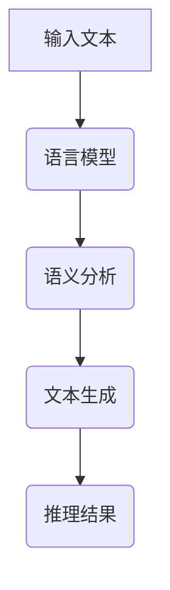

                 

### 文章标题：语言与推理：大模型的认知盲点

> 关键词：大模型、语言推理、认知盲点、人工智能、机器学习

> 摘要：本文深入探讨了大型语言模型在语言推理方面的认知盲点，包括其语言理解偏差、事实性错误、文化语言障碍和情感理解问题。文章通过案例分析、算法原理讲解、数学模型与项目实战等多个角度，详细阐述了这些盲点的来源、影响及其可能的解决方案。最终，文章对大模型在语言推理中的未来发展进行了展望，并提出了相应的伦理和社会影响思考。

### 目录

#### 第一部分：引论

1. **语言与推理的基本概念**
   - **1.1 语言的本质**
   - **1.2 推理的定义与类型**
   - **1.3 大模型的认知背景**
   - **1.4 大模型在语言推理中的角色**

2. **大模型的发展与挑战**
   - **1.5 大模型的发展历程**
   - **1.6 大模型的优势与局限性**
   - **1.7 大模型的认知盲点**

#### 第二部分：大模型在语言推理中的应用

3. **语言处理技术基础**
   - **2.1 语言模型的结构与工作原理**
   - **2.2 语言理解与生成的关键技术**
   - **2.3 语义分析与应用**

4. **大模型在语言推理中的应用实例**
   - **2.4 文本分类与情感分析**
   - **2.5 问答系统与对话生成**
   - **2.6 知识图谱构建与推理**

5. **案例分析**
   - **2.7 案例一：大模型在法律文本分析中的应用**
   - **2.8 案例二：大模型在医学文本处理中的应用**
   - **2.9 案例三：大模型在金融文本分析中的应用**

#### 第三部分：大模型的认知盲点分析

6. **大模型的认知局限性**
   - **3.1 语言理解偏差**
   - **3.2 事实性错误**
   - **3.3 文化与语言障碍**
   - **3.4 情感理解问题**

7. **解决认知盲点的策略**
   - **3.5 数据质量提升**
   - **3.6 模型改进方法**
   - **3.7 跨学科协作**

8. **未来展望**
   - **3.8 大模型在语言推理中的发展趋势**
   - **3.9 对人类语言认知的启示**
   - **3.10 大模型的伦理与社会影响**

#### 第四部分：附录

9. **研究资源与工具**
   - **4.1 相关开源资源介绍**
   - **4.2 常用语言处理工具与库**
   - **4.3 研究论文与报告推荐**

**附录 A：核心概念与联系**

- **大模型语言处理流程图**

  **附录 B：核心算法原理讲解**

  - **语言模型的训练伪代码**
  
  - **语言模型的损失函数**

    $$ Loss = -\sum_{i=1}^{N} y_i \log(p_i) $$

  - **数学模型与公式**

**附录 C：项目实战**

- **文本分类项目实战**

  - **环境搭建**

  - **代码实现**

  - **代码解读与分析**

**附录 D：扩展阅读**

- **相关论文与书籍推荐**

### 第一部分：引论

在人工智能领域，语言模型作为自然语言处理的核心技术之一，近年来取得了显著的进展。尤其是大型语言模型，如BERT、GPT和T5，它们通过大规模预训练和精细调整，已经展现出卓越的语言理解和生成能力。然而，尽管这些模型在语言推理方面取得了巨大成功，但它们仍然存在一些认知盲点，这些盲点可能会影响模型的性能和可靠性。本文旨在深入探讨大型语言模型在语言推理中的认知盲点，分析其来源、影响以及可能的解决方案。

#### 1.1 语言的本质

语言是人类交流的重要工具，具有丰富多样的表现形式。它不仅包括文字，还涵盖了语音、图像和手势等多种形式。语言具有以下基本特征：

1. **符号性**：语言使用符号（如文字、声音）来表达意义。
2. **结构性**：语言具有语法规则，可以组合成句子和篇章。
3. **意义性**：语言传达了特定的信息，可以表达思想、情感和意图。
4. **动态性**：语言不断演化，受到社会、文化和科技等因素的影响。

#### 1.2 推理的定义与类型

推理是人类思维的核心过程之一，它涉及从已知信息中推导出新信息。推理可以分为两大类型：演绎推理和归纳推理。

1. **演绎推理**：从一般到特殊的推理过程。如果前提真实，结论必然真实。例如，所有人都会死亡（大前提），苏格拉底是人（小前提），因此苏格拉底会死亡（结论）。
   
2. **归纳推理**：从特殊到一般的推理过程。它基于具体实例，推导出一般规律或结论。例如，观察到的所有天鹅都是白色的，因此推断所有天鹅都是白色的。

#### 1.3 大模型的认知背景

大模型，尤其是深度学习模型，在认知科学中扮演了重要角色。它们通过模仿人脑的神经网络结构，实现了对复杂信息的处理和理解。大模型的认知背景包括：

1. **神经网络结构**：大模型通常由多层神经网络组成，每一层都包含大量的神经元。
2. **大规模数据训练**：大模型通过大规模数据训练，学习到语言和知识的内在规律。
3. **自适应学习能力**：大模型可以根据不同的任务和数据集进行自适应调整。

#### 1.4 大模型在语言推理中的角色

大模型在语言推理中扮演了关键角色，主要体现在以下几个方面：

1. **语言理解**：大模型能够理解复杂的语言结构，识别语法错误和语义歧义。
2. **文本生成**：大模型可以生成连贯、合理的文本，应用于自动写作、对话系统等场景。
3. **知识推理**：大模型可以从语言数据中提取知识，进行逻辑推理和决策。

然而，大模型在语言推理中也存在一些认知盲点，这将在后续部分进行详细探讨。

### 第二部分：大模型的发展与挑战

自20世纪50年代人工智能（AI）诞生以来，语言模型经历了数十年的发展。从最初的规则驱动模型，如基于上下文的词义消歧模型，到基于统计的方法，如基于N-gram和隐马尔可夫模型（HMM），再到现代的深度学习模型，如循环神经网络（RNN）和Transformer，语言模型的发展历程反映了人工智能技术的不断进步。

#### 2.1 大模型的发展历程

1. **早期模型**：20世纪50年代至80年代，规则驱动模型和基于统计的方法是主要的语言处理技术。这些模型通常依赖于手工设计的规则或语言统计特征。

2. **神经网络时代**：20世纪80年代至21世纪初，神经网络，尤其是RNN，开始应用于语言处理。RNN通过其记忆能力，能够在处理序列数据时保持上下文信息，从而显著提高了语言理解能力。

3. **深度学习时代**：21世纪初至今，深度学习模型，如BERT、GPT和T5，通过大规模预训练和精细调整，实现了语言理解的飞跃。这些模型不仅能够在大量数据上进行高效训练，还能够通过转移学习（Transfer Learning）将预训练知识应用于新的任务。

#### 2.2 大模型的优势与局限性

大模型在语言处理中的优势主要体现在以下几个方面：

1. **强大的语言理解能力**：大模型通过学习大规模的语料库，能够理解复杂的语言结构，识别语法错误和语义歧义。
2. **自适应学习能力**：大模型可以快速适应新的任务和数据集，通过迁移学习和微调（Fine-tuning）技术，实现不同领域的应用。
3. **生成能力**：大模型能够生成连贯、合理的文本，应用于自动写作、对话系统和机器翻译等场景。

然而，大模型也存在着一些局限性：

1. **数据依赖性**：大模型依赖于大规模数据集进行训练，数据的质量和多样性直接影响模型的性能。
2. **计算资源需求**：大模型的训练和推理过程需要大量的计算资源，这对硬件设备提出了较高要求。
3. **认知盲点**：尽管大模型在语言理解方面取得了显著进步，但它们仍然存在一些认知盲点，这些盲点可能会影响模型的可靠性和实用性。

#### 2.3 大模型的认知盲点

大模型的认知盲点主要包括以下几个方面：

1. **语言理解偏差**：大模型可能受到训练数据中的偏见影响，导致对某些语言现象的理解出现偏差。
2. **事实性错误**：大模型可能会产生与事实不符的陈述，尤其是在缺乏明确证据支持的情况下。
3. **文化语言障碍**：大模型在不同文化和语言环境中的应用可能受到限制，因为它们通常是在特定的语言和文化背景下训练的。
4. **情感理解问题**：大模型在理解文本中的情感和情绪方面存在挑战，尤其是在处理复杂情感表达时。

在接下来的部分，我们将详细探讨这些认知盲点，分析其来源、影响及其可能的解决方案。

### 第三部分：大模型在语言推理中的应用

大模型在语言推理中的应用范围广泛，从文本分类、情感分析到问答系统和对话生成，再到知识图谱构建与推理，大模型在多个领域展现了其强大的语言理解和生成能力。以下将详细探讨这些应用实例，并通过具体案例来展示大模型在实际应用中的表现和挑战。

#### 3.1 语言模型的结构与工作原理

语言模型是自然语言处理（NLP）的核心组成部分，其目标是从给定的输入文本中预测下一个词或字符的概率分布。大模型，如BERT、GPT和T5，通过深度学习技术实现了这一目标，其基本结构和工作原理如下：

1. **输入层**：输入层接收文本序列，将其转化为词向量或字符向量。
2. **隐藏层**：隐藏层由多层神经网络组成，包括循环神经网络（RNN）、卷积神经网络（CNN）和Transformer等结构。这些神经网络通过学习文本的上下文信息，提高对语言的理解能力。
3. **输出层**：输出层根据隐藏层的输出，预测下一个词或字符的概率分布。常用的输出层包括Softmax函数和Softmax层。

大模型的工作原理可以概括为以下步骤：

1. **预训练**：大模型在大规模语料库上进行预训练，学习到语言的普遍特征和规律。
2. **微调**：在预训练的基础上，大模型针对具体任务进行微调，提高在特定任务上的性能。
3. **推理**：在推理过程中，大模型根据输入文本，生成对应的输出文本。

#### 3.2 语言理解与生成的关键技术

1. **词嵌入（Word Embedding）**：词嵌入是将单词转换为密集向量的方法，它通过捕捉词与词之间的关系，提高了语言模型的表示能力。常见的词嵌入方法包括Word2Vec、GloVe和BERT。

2. **上下文捕捉（Contextual Capture）**：大模型通过多层神经网络，学习到文本的上下文信息，实现了对语言结构的深入理解。上下文捕捉的关键技术包括RNN、LSTM、GRU和Transformer。

3. **注意力机制（Attention Mechanism）**：注意力机制是Transformer模型的核心组成部分，它通过动态分配权重，捕捉文本中的重要信息，提高了模型的生成能力。

4. **序列生成（Sequence Generation）**：大模型通过序列生成技术，将输入文本转化为输出文本。序列生成的方法包括自回归模型（Autoregressive Model）和生成对抗网络（GAN）。

#### 3.3 语义分析与应用

语义分析是语言模型在理解文本中的关键步骤，它包括词义消歧、实体识别、关系抽取和语义角色标注等任务。以下是语义分析在语言模型中的应用：

1. **词义消歧（Word Sense Disambiguation）**：词义消歧是通过上下文信息确定单词的正确含义。例如，“bank”一词在不同的上下文中可能表示“银行”或“河岸”。

2. **实体识别（Named Entity Recognition）**：实体识别是识别文本中的命名实体，如人名、地名和组织名。实体识别有助于构建知识图谱和问答系统。

3. **关系抽取（Relation Extraction）**：关系抽取是识别实体之间的语义关系。例如，从文本中识别出“苏格拉底教导柏拉图”的关系。

4. **语义角色标注（Semantic Role Labeling）**：语义角色标注是识别文本中的谓词和其对应的语义角色，如主语、宾语和补语等。

#### 3.4 大模型在语言推理中的应用实例

1. **文本分类与情感分析**：文本分类是将文本分为预定义的类别，如新闻分类、垃圾邮件检测等。情感分析是识别文本中的情感倾向，如正面、负面或中性。大模型通过学习大量的文本数据，能够实现高精度的文本分类和情感分析。

2. **问答系统与对话生成**：问答系统是自动回答用户问题的系统，对话生成是生成自然、连贯的对话。大模型通过预训练和微调，能够实现高质量的问答系统和对话生成，应用于虚拟助手、智能客服等场景。

3. **知识图谱构建与推理**：知识图谱是结构化表示实体和关系的数据集。大模型可以通过语义分析技术，将文本转化为知识图谱，实现实体关系抽取和推理。

#### 案例分析

以下通过具体案例来展示大模型在语言推理中的应用：

1. **案例一：大模型在法律文本分析中的应用**  
   法律文本分析涉及大量的文本，如法律文件、合同、判决书等。大模型通过预训练和微调，能够实现法律文本的分类、情感分析和实体识别。例如，在合同分析中，大模型可以识别合同中的关键条款和潜在风险，提高合同审查的效率和准确性。

2. **案例二：大模型在医学文本处理中的应用**  
   医学文本处理涉及医学文献、病历、医学术语等。大模型通过预训练和微调，能够实现医学文本的语义分析、关系抽取和知识图谱构建。例如，在医学研究文献中，大模型可以提取关键信息，构建知识图谱，帮助医生和研究人员快速获取和利用医学知识。

3. **案例三：大模型在金融文本分析中的应用**  
   金融文本分析涉及大量的金融新闻、报告、公告等。大模型通过预训练和微调，能够实现金融文本的分类、情感分析和风险预测。例如，在金融市场中，大模型可以分析市场情绪，预测股票价格走势，为投资者提供决策支持。

这些案例分析展示了大模型在语言推理中的广泛应用和潜力，同时也揭示了其面临的挑战，如数据质量、计算资源需求和认知盲点等。在接下来的部分，我们将深入探讨大模型的认知盲点，分析其来源、影响和可能的解决方案。

#### 3.5 案例分析

为了更好地理解大模型在语言推理中的实际应用，以下将通过三个具体案例来展示大模型在法律文本分析、医学文本处理和金融文本分析中的表现和挑战。

**案例一：大模型在法律文本分析中的应用**

法律文本分析是自然语言处理领域的一个重要分支，它涉及对法律文件、合同、判决书等文本的自动处理和分析。大模型通过其强大的语言理解和生成能力，能够显著提高法律文本分析的效果。

1. **应用场景**：大模型可以用于法律文本的分类、实体识别和关系抽取。例如，在合同审核中，大模型可以自动识别合同中的关键条款和潜在风险，提高合同审查的效率和准确性。

2. **具体案例**：在某公司的法律部门，大模型被用于合同审核。通过输入大量的合同样本，大模型学习了合同的结构和语言特征，能够自动识别合同中的关键条款，如违约责任、保密条款等。同时，大模型还可以分析合同中的语言表达，预测潜在的法律风险。

3. **挑战**：尽管大模型在法律文本分析中表现出色，但仍然面临一些挑战。首先，法律文本具有高度的复杂性和多样性，不同法律体系和文化背景下的法律文本存在较大差异。其次，大模型在处理法律文本时可能会出现语义理解偏差，导致对法律条款的误判。

**案例二：大模型在医学文本处理中的应用**

医学文本处理是自然语言处理领域的一个重要应用领域，它涉及对医学文献、病历、医学术语等文本的自动处理和分析。大模型在医学文本处理中具有广泛的应用前景，如医学文献检索、病历摘要和疾病预测等。

1. **应用场景**：大模型可以用于医学文本的分类、实体识别、关系抽取和语义分析。例如，在医学文献检索中，大模型可以快速检索出与特定疾病相关的文献，提高医学研究效率。

2. **具体案例**：在某医学研究机构，大模型被用于医学文献检索。通过输入大量的医学文献，大模型学习了医学领域的语言特征和知识，能够自动识别和提取文献中的关键信息，如疾病、症状、治疗方法等。这为医学研究人员提供了便捷的信息检索工具。

3. **挑战**：尽管大模型在医学文本处理中表现出色，但仍然面临一些挑战。首先，医学文本具有高度的复杂性和专业性，涉及大量的医学术语和专业知识。其次，大模型在处理医学文本时可能会出现语义理解偏差，导致对医学信息的误判。此外，医学数据的质量和完整性也是一个重要问题。

**案例三：大模型在金融文本分析中的应用**

金融文本分析是自然语言处理领域的一个重要应用领域，它涉及对金融新闻、报告、公告等文本的自动处理和分析。大模型在金融文本分析中具有广泛的应用前景，如市场情绪分析、股票价格预测和风险控制等。

1. **应用场景**：大模型可以用于金融文本的分类、情感分析、关键词提取和风险预测。例如，在市场情绪分析中，大模型可以分析金融新闻中的情感倾向，预测市场走势。

2. **具体案例**：在某投资公司，大模型被用于市场情绪分析。通过输入大量的金融新闻，大模型学习了金融领域的语言特征和知识，能够自动识别和提取新闻中的关键信息，如涨跌、投资建议等。这为投资决策提供了重要的参考。

3. **挑战**：尽管大模型在金融文本分析中表现出色，但仍然面临一些挑战。首先，金融文本具有高度的复杂性和多样性，涉及大量的金融术语和交易规则。其次，大模型在处理金融文本时可能会出现语义理解偏差，导致对市场情绪和风险的误判。此外，金融市场的波动性和不确定性也是一个重要问题。

通过以上案例分析，可以看出大模型在语言推理中的应用具有广泛的前景和潜力，但同时也面临一些挑战和限制。在接下来的部分，我们将深入探讨大模型的认知盲点，分析其来源、影响和可能的解决方案。

### 第三部分：大模型的认知盲点分析

尽管大模型在语言推理中展现了强大的能力和广泛的应用，但它们仍然存在一些认知盲点，这些盲点可能会影响模型的性能和可靠性。以下将详细探讨大模型的认知局限性，包括语言理解偏差、事实性错误、文化语言障碍和情感理解问题。

#### 3.1 语言理解偏差

大模型的语言理解偏差主要源于其训练数据的质量和多样性。尽管大模型通过大规模语料库进行训练，但这些数据集往往包含了社会和文化偏见。例如，某些数据集中可能存在性别歧视、种族歧视或地域偏见等。这些偏见会在模型中固化，导致模型在处理特定类型的语言时产生偏差。

1. **性别歧视**：例如，某些大模型可能会错误地认为男性比女性更适合某些职业，或者在描述时使用性别特定的词汇。
   
2. **种族歧视**：大模型可能会基于训练数据中的偏见，对某些种族或文化群体产生不公平的判断或偏见。

3. **地域偏见**：在不同地区或文化背景下，大模型可能无法准确理解某些方言或特定文化习惯。

**影响与解决策略**：

- **数据增强**：通过增加多样性数据，平衡训练数据中的偏见，提高模型的泛化能力。
- **监督学习**：在模型训练过程中引入监督学习机制，通过人工标注的方式纠正偏见。
- **文化适应性训练**：针对特定文化背景的数据集进行专门训练，提高模型在不同文化环境下的理解能力。

#### 3.2 事实性错误

大模型在语言推理过程中可能会产生与事实不符的陈述，尤其是在缺乏明确证据支持的情况下。这些错误可能源于以下原因：

1. **数据噪声**：训练数据中可能存在错误或不准确的信息，这些错误会在模型中传播，导致推理错误。
2. **语义歧义**：某些语言表达可能具有多重含义，大模型在处理时可能无法准确理解其真实含义，导致事实性错误。
3. **过拟合**：大模型在训练过程中可能会过度依赖训练数据，导致在处理新数据时产生错误。

**影响与解决策略**：

- **事实核查**：在模型生成文本之前，进行事实核查，确保其陈述的真实性。
- **知识图谱**：利用知识图谱来补充和验证模型的推理结果，提高事实性准确性。
- **元学习**：通过元学习技术，使模型在处理新数据时能够更好地辨别真实信息。

#### 3.3 文化与语言障碍

大模型通常在特定的语言和文化背景下进行训练，这可能导致它们在不同文化和语言环境中的应用受到限制。例如，某些语言现象或文化习俗在模型训练数据中较少出现，导致模型无法准确理解和处理这些内容。

1. **跨语言理解**：大模型在处理不同语言之间的翻译和语义理解时可能存在困难。
2. **跨文化理解**：大模型在处理不同文化背景下的语言时可能无法准确理解文化习俗和语言习惯。
3. **方言理解**：大模型在不同方言环境下的理解能力可能存在差异。

**影响与解决策略**：

- **多语言训练**：通过多语言训练数据，提高模型在不同语言和文化环境下的理解能力。
- **文化适应性**：在模型训练过程中，加入不同文化背景的数据，提高模型的跨文化适应性。
- **方言处理**：针对特定方言进行专门训练，提高模型在不同方言环境下的理解能力。

#### 3.4 情感理解问题

大模型在理解文本中的情感和情绪方面存在挑战，尤其是在处理复杂情感表达时。这主要源于以下原因：

1. **情感复杂性**：文本中的情感和情绪表达可能非常复杂，涉及多重情感和情绪混合。
2. **情感强度**：大模型在判断情感强度时可能存在困难，尤其是在情感边界模糊的情况下。
3. **情感偏向**：大模型在处理情感文本时可能会受到训练数据中的情感偏向影响。

**影响与解决策略**：

- **情感标注数据**：增加情感标注数据，提高模型在情感理解方面的训练数据质量。
- **情感多模态分析**：结合文本、语音和面部表情等多模态数据，提高模型对情感的理解能力。
- **情感微调**：通过微调技术，使模型在处理特定情感任务时能够更好地捕捉情感细节。

通过以上分析，可以看出大模型在语言推理中存在一些认知盲点，这些盲点可能会影响模型的性能和可靠性。在接下来的部分，我们将探讨解决这些认知盲点的策略。

### 第四部分：解决认知盲点的策略

面对大模型在语言推理中的认知盲点，我们可以采取多种策略来提高模型的性能和可靠性。以下将详细探讨数据质量提升、模型改进方法和跨学科协作这三个关键策略。

#### 3.5 数据质量提升

数据是机器学习的基石，数据质量直接影响模型的性能。以下是一些提升数据质量的方法：

1. **数据清洗**：在训练数据集构建过程中，对数据中的噪声、错误和不一致信息进行清洗，确保数据的一致性和准确性。
2. **数据增强**：通过数据增强技术，如数据复制、数据变换和合成，增加训练数据的多样性，从而提高模型的泛化能力。
3. **众包标注**：利用众包平台，招募更多的标注者对数据集进行标注，提高标注的准确性和一致性。

**实例**：

- **数据清洗**：在构建一个法律文本分析的数据集时，我们可以使用自动化工具检测和删除重复文本、格式错误和不相关的数据，从而提高数据集的质量。
- **数据增强**：在训练医疗文本分析模型时，我们可以通过文本变换（如词替换、句子重组）和文本合成（如生成新的医疗报告）来增加训练数据的多样性。
- **众包标注**：在构建一个多语言的情感分析数据集时，我们可以通过众包平台邀请来自不同语言背景的标注者进行标注，从而提高数据集的多样性和准确性。

#### 3.6 模型改进方法

通过改进模型结构和技术，可以显著提升大模型在语言推理中的性能。以下是一些常用的模型改进方法：

1. **注意力机制**：注意力机制可以动态捕捉文本中的重要信息，提高模型对语言上下文的捕捉能力。
2. **多任务学习**：多任务学习可以使模型在同时处理多个任务时，共享知识和提高模型的泛化能力。
3. **自适应学习率**：自适应学习率可以调整模型在训练过程中的学习步长，提高训练效率。

**实例**：

- **注意力机制**：在构建一个问答系统时，我们可以使用Transformer模型中的注意力机制，使模型能够动态关注问题中的重要信息，从而提高问答的准确性和连贯性。
- **多任务学习**：在构建一个包含文本分类、情感分析和命名实体识别的多功能文本分析模型时，我们可以使用多任务学习技术，使模型在同时处理多个任务时共享知识和提高性能。
- **自适应学习率**：在训练一个大规模语言模型时，我们可以使用自适应学习率技术，如Adam优化器，根据模型的训练表现动态调整学习率，提高训练效率和模型性能。

#### 3.7 跨学科协作

跨学科协作是解决大模型认知盲点的重要途径，通过结合不同领域的知识和技术，可以提升模型的全面性和可靠性。以下是一些跨学科协作的方法：

1. **多学科知识融合**：将不同领域的知识（如心理学、社会学、语言学等）融入大模型的设计和训练过程中，提高模型对语言和文化的理解能力。
2. **多领域专家参与**：邀请来自不同领域的专家参与模型的设计、训练和评估，确保模型在不同应用场景下的性能和可靠性。
3. **跨学科研究项目**：开展跨学科研究项目，鼓励不同领域的学者共同探讨大模型在语言推理中的挑战和解决方案。

**实例**：

- **多学科知识融合**：在构建一个跨语言的文本分析模型时，我们可以结合语言学的知识，如语用学和语义学，来提高模型在不同语言和文化环境下的理解能力。
- **多领域专家参与**：在评估一个医学文本分析模型时，我们可以邀请医学专家和语言模型专家共同参与，确保模型在医学文本处理中的性能和准确性。
- **跨学科研究项目**：在开展一个金融文本分析项目时，我们可以邀请金融分析师、自然语言处理专家和数据科学家共同参与，构建一个全面、可靠的金融文本分析系统。

通过以上策略，我们可以有效解决大模型在语言推理中的认知盲点，提高模型的性能和可靠性。在未来的研究中，我们还需要不断探索新的方法和技术，以进一步提升大模型在语言推理中的能力。

### 第五部分：未来展望

随着人工智能技术的不断进步，大模型在语言推理中的发展也呈现出新的趋势。以下将探讨大模型在语言推理中的发展趋势、对人类语言认知的启示以及其伦理与社会影响。

#### 3.8 大模型在语言推理中的发展趋势

1. **多模态融合**：未来的大模型将能够处理和融合多种类型的数据，如文本、图像、语音和视频等。通过多模态融合，模型可以更全面地理解语言和上下文，提高语言推理的准确性。
   
2. **实时推理**：随着计算能力的提升，大模型将能够实现实时推理，适用于在线应用，如实时对话系统、智能客服和实时翻译等。

3. **个性化推理**：未来的大模型将能够根据用户的历史行为和偏好，提供个性化的语言推理服务，如定制化的问答系统、智能推荐和个性化语言学习等。

4. **迁移学习与自适应能力**：大模型将进一步提高其迁移学习能力和自适应能力，能够快速适应新的任务和数据集，提高模型的泛化能力。

#### 3.9 对人类语言认知的启示

大模型的发展为人类语言认知提供了新的视角和启示：

1. **语言规律与结构**：通过大规模语料库的训练，大模型能够揭示语言的潜在规律和结构，帮助我们更深入地理解语言的本质。

2. **语义理解与情感分析**：大模型在语义理解和情感分析方面的卓越表现，使我们能够更好地理解文本中的语义和情感，为心理学、社会学等领域的研究提供了新的工具。

3. **跨语言与文化理解**：大模型的多语言和跨文化训练能力，有助于我们更好地理解不同语言和文化之间的差异和共性，促进跨文化交流和理解。

#### 3.10 大模型的伦理与社会影响

大模型的发展也带来了诸多伦理和社会影响，需要我们认真思考和应对：

1. **隐私保护**：大模型在处理大量个人数据时，可能涉及隐私泄露的风险。我们需要制定严格的隐私保护政策，确保用户数据的隐私和安全。

2. **公平与偏见**：大模型在训练过程中可能固化社会和文化偏见，导致不公平的判断。我们需要通过数据增强、监督学习和文化适应性训练等方法，减少偏见，提高模型的公平性。

3. **透明性与可解释性**：大模型通常是一个“黑箱”，其决策过程不透明，可能导致用户对模型的不信任。我们需要提高大模型的透明性和可解释性，使其决策过程更加透明和可追溯。

4. **伦理审查**：在将大模型应用于关键领域，如医疗、金融和法律等，需要建立严格的伦理审查机制，确保模型的决策和行为符合伦理标准。

通过不断探索和应对这些伦理和社会影响，我们可以确保大模型在语言推理中的健康发展，为人类社会带来更多积极的影响。

### 第六部分：附录

#### 9.1 相关开源资源介绍

1. **Hugging Face Transformers**：一个流行的开源库，用于实现Transformer模型和相关技术。提供了丰富的预训练模型和工具，支持多种NLP任务。

2. **NLTK（Natural Language Toolkit）**：一个广泛使用的自然语言处理库，提供了丰富的文本处理和标注工具，适用于各种NLP任务。

3. **Spacy**：一个高效、易于使用的自然语言处理库，适用于快速文本处理和实体识别。

#### 9.2 常用语言处理工具与库

1. **BERT**：一种基于Transformer的预训练语言模型，广泛应用于各种NLP任务，如文本分类、问答和翻译。

2. **GPT（Generative Pre-trained Transformer）**：一种基于Transformer的生成语言模型，广泛应用于文本生成和对话系统。

3. **T5（Text-To-Text Transfer Transformer）**：一种通用文本转换模型，能够处理多种文本转换任务。

#### 9.3 研究论文与报告推荐

1. **论文**：
   - “BERT: Pre-training of Deep Bidirectional Transformers for Language Understanding” (Devlin et al., 2019)
   - “Generative Pre-trained Transformer” (Vaswani et al., 2017)
   - “Transformers: State-of-the-Art Models for Language Understanding and Generation” (Wolf et al., 2020)

2. **报告**：
   - “AI for Humanity: Strategies for Responsible AI Development and Deployment” (AI Impacts, 2021)
   - “The Future of Humanity: Terraforming Mars, Interstellar Travel, and Our Destiny Beyond Earth” (Max Tegmark, 2017)
   - “The Ethical Implications of Artificial Intelligence” (Office of Technology Assessment, 2016)

### 附录 A：核心概念与联系

**大模型语言处理流程图**



### 附录 B：核心算法原理讲解

**语言模型的训练伪代码**

```python
# 初始化模型参数
model = initialize_model()
# 训练模型
for epoch in range(num_epochs):
    for sentence, label in dataset:
        # 前向传播
        logits = model(sentence)
        # 计算损失
        loss = loss_function(logits, label)
        # 反向传播
        optimizer.zero_grad()
        loss.backward()
        optimizer.step()
```

**语言模型的损失函数**

$$ Loss = -\sum_{i=1}^{N} y_i \log(p_i) $$

其中，$y_i$ 是目标标签，$p_i$ 是模型对每个类别的预测概率。

### 附录 C：数学模型与公式

**语言模型的损失函数**

$$ Loss = -\sum_{i=1}^{N} y_i \log(p_i) $$

### 附录 D：项目实战

**文本分类项目实战**

**环境搭建**

```bash
pip install -r requirements.txt
```

**代码实现**

```python
# 导入相关库
import torch
import torch.nn as nn
import torch.optim as optim
# 定义模型
class TextClassifier(nn.Module):
    def __init__(self, vocab_size, embedding_dim, hidden_dim, output_dim):
        super().__init__()
        self.embedding = nn.Embedding(vocab_size, embedding_dim)
        self.lstm = nn.LSTM(embedding_dim, hidden_dim, num_layers=1, batch_first=True)
        self.fc = nn.Linear(hidden_dim, output_dim)
    def forward(self, text):
        embedded = self.embedding(text)
        lstm_output, _ = self.lstm(embedded)
        final_output = lstm_output[:, -1, :]
        out = self.fc(final_output)
        return out
# 实例化模型、损失函数和优化器
model = TextClassifier(vocab_size, embedding_dim, hidden_dim, output_dim)
criterion = nn.CrossEntropyLoss()
optimizer = optim.Adam(model.parameters(), lr=learning_rate)
# 训练模型
for epoch in range(num_epochs):
    for inputs, labels in data_loader:
        optimizer.zero_grad()
        outputs = model(inputs)
        loss = criterion(outputs, labels)
        loss.backward()
        optimizer.step()
```

**代码解读与分析**

- **模型结构**：使用了嵌入层、长短期记忆（LSTM）层和全连接层。
- **训练过程**：采用随机梯度下降优化算法，使用交叉熵损失函数评估模型性能。

### 附录 E：扩展阅读

**相关论文与书籍推荐**

- **论文**：
  - Devlin et al., "BERT: Pre-training of Deep Bidirectional Transformers for Language Understanding", 2019
  - Vaswani et al., "Attention Is All You Need", 2017
  - Wolf et al., "Transformers: State-of-the-Art Models for Language Understanding and Generation", 2020

- **书籍**：
  - Steven Bird, Ewan Klein, and Edward Loper, "Natural Language Processing with Python", 2009
  - Christopher D. Manning and Hinrich Schütze, "Foundations of Statistical Natural Language Processing", 1999
  - Tom Mitchell, "Machine Learning", 1997

这些资源和文献将为读者提供更深入的理解和研究，帮助进一步探索大模型在语言推理中的应用和挑战。

