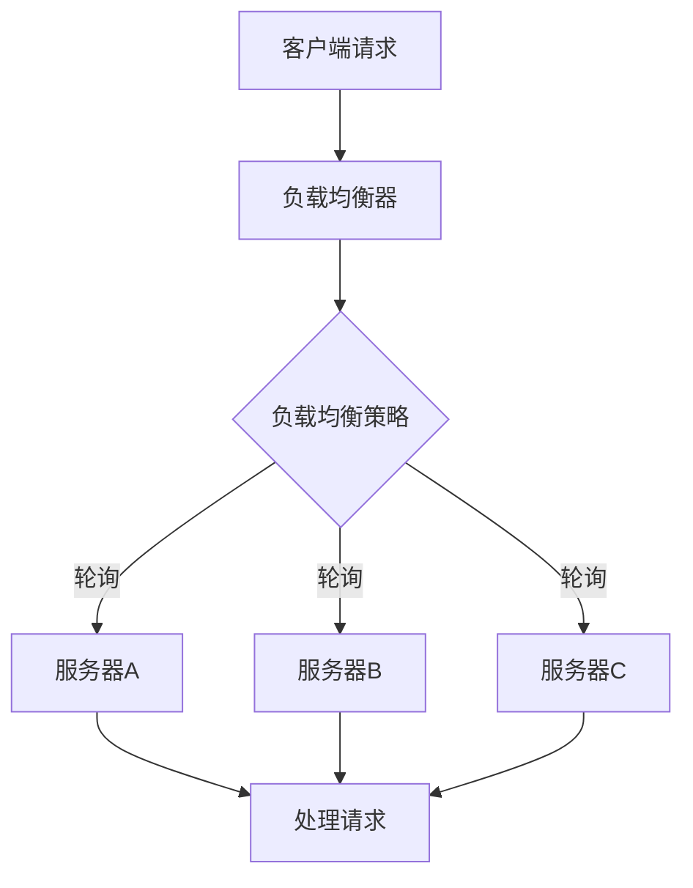

                 

# 文章标题：负载均衡器在系统扩展中的应用

> 关键词：负载均衡器、系统扩展、性能优化、微服务、云环境

> 摘要：
本文将深入探讨负载均衡器在系统扩展中的应用，从基本概念、工作原理、实际应用、高级特性等方面进行详细解析。通过分析负载均衡器在电子商务、在线视频、社交媒体等领域的应用案例，揭示其在提升系统性能、可靠性和可扩展性方面的关键作用。最后，本文还将展望负载均衡器的发展趋势，为读者提供未来应用的指导。

## 第1章 负载均衡器的基本概念

### 1.1 负载均衡的定义与作用

**负载均衡的定义**：
负载均衡是指将多个任务分配给多个计算机处理，以避免单个计算机过载，提高系统的整体性能。在分布式系统中，负载均衡器起到关键作用，它能够根据一定的算法和策略，将客户端的请求合理地分配到后端服务器上，从而实现资源的优化利用。

**负载均衡的作用**：
1. **提高系统的响应速度**：
   通过负载均衡，请求被分配到多个服务器上处理，有效减少了单个服务器的负载，提高了整个系统的响应速度。

2. **提高系统的可靠性**：
   负载均衡器能够检测服务器的状态，当某台服务器发生故障时，可以将请求自动切换到健康的服务器上，从而保证系统的持续运行。

3. **提高系统的可扩展性**：
   当系统需要处理更多的请求时，可以通过增加服务器数量来实现扩展，负载均衡器能够自动分配任务，实现无缝扩展。

### 1.2 负载均衡的类型

**静态负载均衡**：
静态负载均衡按照固定的规则分配任务，常见的策略包括轮询（Round Robin）、最少连接（Least Connections）等。轮询策略将请求按照顺序分配给服务器，而最少连接策略将请求分配给当前连接数最少的后端服务器。

**动态负载均衡**：
动态负载均衡根据系统的当前状态动态调整任务的分配，常见的策略包括响应时间（Response Time）、CPU利用率（CPU Utilization）等。动态负载均衡能够更加灵活地适应系统的变化，提高系统的整体性能。

### 1.3 负载均衡的挑战

**数据一致性**：
负载均衡可能会破坏数据的一致性，因为请求被分配到不同的服务器上处理。为了解决这个问题，可以采用分布式锁、事务管理等技术来确保数据的一致性。

**故障转移**：
当某个计算机发生故障时，如何快速切换到备用计算机是负载均衡面临的挑战。可以通过配置健康检查和故障转移机制来实现自动切换，确保系统的可靠性。

## 第2章 负载均衡器的工作原理

### 2.1 负载均衡器的工作机制

**请求分发**：
负载均衡器接收外部请求，并将其分配给后端服务器。请求分发是负载均衡器的核心功能，通过不同的算法和策略，实现请求的合理分配。

**健康检查**：
负载均衡器定期检查后端服务器的状态，确保只有健康的服务器参与负载均衡。健康检查可以基于各种指标，如响应时间、CPU利用率等。

**流量控制**：
根据后端服务器的负载情况，负载均衡器会动态调整请求的分发策略。流量控制可以防止某个服务器过载，保证系统的稳定性。

### 2.2 负载均衡算法

**轮询算法**：
轮询算法是一种简单的负载均衡策略，按照固定的顺序将请求分配给服务器。轮询算法实现简单，但无法根据服务器的负载情况进行动态调整。

**最小连接算法**：
最小连接算法将请求分配给当前连接数最少的后端服务器。这种方式能够更公平地利用服务器资源，但需要对服务器的连接数进行实时监控。

**响应时间算法**：
响应时间算法将请求分配给响应时间最短的后端服务器。这种方式能够更好地利用服务器资源，提高系统的整体性能，但需要对服务器的响应时间进行实时监控。

### 2.3 负载均衡器与反向代理

**反向代理**：
反向代理是一种位于客户端和后端服务器之间的中间层，接收客户端请求，并将请求转发给后端服务器。反向代理可以提供负载均衡、缓存、安全等功能。

**负载均衡器与反向代理的关系**：
负载均衡器可以集成在反向代理中，也可以独立存在。集成在反向代理中的负载均衡器能够更方便地实现流量控制和缓存，而独立的负载均衡器则能够提供更高的性能和灵活性。

## 第3章 负载均衡器在实际应用中的实现

### 3.1 使用Nginx作为负载均衡器

**安装与配置**：
1. **安装Nginx**：
   - 使用包管理工具安装Nginx。
   - 配置Nginx的运行用户和组。

2. **配置Nginx作为负载均衡器**：
   - 配置上游服务器，指定后端服务器的地址和端口。
   - 配置负载均衡策略，如轮询、最小连接等。

**案例分析**：
1. **使用Nginx实现简单的负载均衡**：
   - 配置Nginx监听80端口，将请求分配给后端服务器。

2. **使用Nginx实现复杂的负载均衡策略**：
   - 配置Nginx支持健康检查，自动替换不健康的服务器。

### 3.2 使用HAProxy作为负载均衡器

**安装与配置**：
1. **安装HAProxy**：
   - 使用包管理工具安装HAProxy。
   - 配置HAProxy的运行用户和组。

2. **配置HAProxy作为负载均衡器**：
   - 配置后端服务器的地址和端口。
   - 配置负载均衡策略，如轮询、最小连接等。

**案例分析**：
1. **使用HAProxy实现负载均衡**：
   - 配置HAProxy将请求分配给多个后端服务器。

2. **使用HAProxy实现故障转移**：
   - 配置HAProxy的健康检查和故障转移机制。

### 3.3 使用Kubernetes作为负载均衡器

**Kubernetes的基本概念**：
1. **Pod**：
   - Pod是Kubernetes中的基本工作单元，包含一个或多个容器。

2. **Service**：
   - Service提供了一种将服务暴露给外部网络的方式，可以通过IP地址或域名访问。

3. **Ingress**：
   - Ingress定义了如何访问Kubernetes集群中的服务，包括路径、负载均衡等。

**负载均衡的实现**：
1. **使用Kubernetes Service实现负载均衡**：
   - 创建Service对象，指定后端Pod的IP地址。

2. **使用Ingress实现更加灵活的负载均衡**：
   - 创建Ingress对象，配置路由和负载均衡策略。

## 第4章 负载均衡器在系统扩展中的应用

### 4.1 系统扩展的需求

**处理能力提升**：
随着用户数量的增加，系统需要处理更多的请求，从而提升处理能力。通过负载均衡器，可以将请求分配给多个服务器，从而提升系统的处理能力。

**系统可靠性提升**：
避免单点故障，提高系统的可靠性。通过负载均衡器，当某个服务器发生故障时，可以将请求自动切换到其他健康的服务器上，从而保证系统的持续运行。

### 4.2 负载均衡在系统扩展中的应用

**水平扩展**：
通过负载均衡器，将请求分配给多个服务器，从而实现水平扩展。水平扩展可以提升系统的处理能力和可靠性，同时降低了单个服务器的负载。

**垂直扩展**：
通过提升单个服务器的硬件配置，从而实现垂直扩展。垂直扩展可以提高服务器的性能和处理能力，但可能会增加系统的复杂性和成本。

### 4.3 负载均衡与微服务架构

**微服务架构的优势**：
1. **独立部署**：
   - 微服务可以独立部署和升级，减少了系统的依赖性。

2. **独立扩展**：
   - 微服务可以根据需求独立扩展，提高了系统的灵活性。

3. **易于维护**：
   - 微服务架构使得系统更加模块化，便于维护和升级。

**负载均衡在微服务架构中的应用**：
1. **使用负载均衡器将请求分配给不同的微服务实例**：
   - 通过负载均衡器，将请求分配给不同的微服务实例，提高了系统的处理能力和可靠性。

2. **使用Service Mesh实现微服务之间的负载均衡**：
   - 使用Service Mesh（如Istio、Linkerd等），可以实现微服务之间的负载均衡和流量管理。

## 第5章 负载均衡器的高级特性

### 5.1 负载均衡器的监控与优化

**监控指标**：
1. **请求处理时间**：
   - 请求从客户端发送到服务器，再到返回结果的时间。

2. **服务器负载**：
   - 服务器的CPU利用率、内存利用率等。

**优化策略**：
1. **根据监控数据调整负载均衡策略**：
   - 根据服务器的负载情况，动态调整请求的分发策略，如增加或减少服务器的数量。

2. **优化服务器配置**：
   - 根据监控数据，优化服务器的CPU、内存、网络等配置，提高系统的性能。

### 5.2 负载均衡器的安全性

**防范拒绝服务攻击**：
1. **使用防火墙**：
   - 配置防火墙，过滤掉恶意攻击流量。

2. **限流**：
   - 限制每个客户端的请求速率，防止过量的请求导致服务器过载。

**数据加密**：
1. **使用SSL/TLS**：
   - 配置SSL/TLS协议，加密客户端和服务器之间的数据传输。

### 5.3 负载均衡器的性能优化

**缓存策略**：
1. **使用缓存**：
   - 将经常访问的数据缓存起来，减少对后端服务器的访问。

2. **缓存一致性**：
   - 确保缓存和后端数据的一致性，避免数据不一致导致的问题。

**内容分发网络（CDN）**：
1. **使用CDN**：
   - 通过CDN将静态内容分发到全球各地的节点，减少用户访问延迟。

2. **缓存策略**：
   - 配置CDN的缓存策略，提高内容的访问速度。

## 第6章 负载均衡器在云环境中的应用

### 6.1 云负载均衡的概念与优势

**云负载均衡的概念**：
云负载均衡是基于云服务的负载均衡，通过云服务提供商提供的负载均衡器来实现请求的分发和流量管理。

**云负载均衡的优势**：
1. **弹性伸缩**：
   - 根据流量自动调整服务器数量，提高系统的弹性。

2. **高可用**：
   - 通过多可用区部署，提高系统的可用性和可靠性。

3. **易管理**：
   - 云负载均衡提供了简单易用的界面和API，便于管理和维护。

### 6.2 云负载均衡的实现

**AWS Elastic Load Balancing**：
1. **基本概念**：
   - AWS Elastic Load Balancing提供了一种自动化的负载均衡服务，可以将请求分配给多个EC2实例。

2. **实现步骤**：
   - 创建负载均衡器。
   - 配置后端服务器。
   - 配置监听器，指定端口和协议。

**Azure Load Balancer**：
1. **基本概念**：
   - Azure Load Balancer提供了一种将流量分发到多个虚拟机的服务，支持HTTP、HTTPS、TCP和UDP协议。

2. **实现步骤**：
   - 创建负载均衡器。
   - 配置后端服务器。
   - 配置负载均衡规则，指定流量分发策略。

**Google Cloud Load Balancer**：
1. **基本概念**：
   - Google Cloud Load Balancer提供了一种自动化的负载均衡服务，支持HTTP、HTTPS、TCP和UDP协议。

2. **实现步骤**：
   - 创建负载均衡器。
   - 配置后端服务器。
   - 配置监听器，指定端口和协议。

### 6.3 云环境中的负载均衡最佳实践

**自动伸缩**：
1. **自动伸缩策略**：
   - 根据流量动态调整服务器数量，如CPU利用率、内存利用率等。

2. **实现自动伸缩**：
   - 配置负载均衡器的自动伸缩策略，如基于指标自动增加或减少服务器。

**多可用区部署**：
1. **多可用区部署的优势**：
   - 提高系统的可用性和可靠性，避免单点故障。

2. **实现多可用区部署**：
   - 在多个可用区部署负载均衡器和后端服务器，确保流量自动分发到可用区。

## 第7章 负载均衡器案例分析

### 7.1 案例一：电子商务平台

**背景**：
电子商务平台需要处理海量的用户请求，提供高效、可靠的购物体验。

**解决方案**：
1. **使用Nginx和HAProxy实现负载均衡**：
   - 使用Nginx作为反向代理，接收客户端请求。
   - 使用HAProxy作为负载均衡器，将请求分配给多个后端服务器。

2. **使用Kubernetes进行容器化部署**：
   - 将应用容器化，部署在Kubernetes集群中。
   - 使用Kubernetes Service实现负载均衡。

### 7.2 案例二：在线视频平台

**背景**：
在线视频平台需要提供流畅、快速的视频播放体验，处理大量的并发请求。

**解决方案**：
1. **使用Kubernetes和AWS Elastic Load Balancing实现负载均衡**：
   - 使用Kubernetes进行容器化部署，管理应用实例。
   - 使用AWS Elastic Load Balancing将请求分配给Kubernetes集群中的实例。

2. **使用CDN加速视频分发**：
   - 使用CDN将视频内容分发到全球各地的节点，减少用户访问延迟。

### 7.3 案例三：社交媒体平台

**背景**：
社交媒体平台需要处理大量的用户数据和高并发的读写操作。

**解决方案**：
1. **使用HAProxy和Kubernetes实现负载均衡**：
   - 使用HAProxy作为负载均衡器，将请求分配给多个后端服务器。
   - 使用Kubernetes进行容器化部署，管理应用实例。

2. **使用分布式数据库提高数据处理的效率**：
   - 使用分布式数据库，如Cassandra、MongoDB等，提高数据处理的效率和可用性。

## 第8章 负载均衡器的发展趋势

### 8.1 边缘计算

**边缘计算的概念**：
边缘计算是将计算任务从中心云转移到网络边缘的一种计算范式，通过在靠近数据源的地方处理数据，提高系统的响应速度和处理能力。

**边缘计算与负载均衡的结合**：
边缘计算与负载均衡的结合可以进一步优化系统的性能和响应速度。通过在边缘节点实现负载均衡，可以将请求更快速地分配到最近的服务器上，减少网络延迟。

### 8.2 人工智能与负载均衡

**AI在负载均衡中的应用**：
人工智能在负载均衡中可以发挥重要作用，如：
1. **智能流量分配**：
   - 使用AI算法，根据实时流量情况，动态调整负载均衡策略。

2. **预测性故障转移**：
   - 使用AI预测服务器的负载情况，提前进行故障转移，避免服务中断。

**挑战与展望**：
1. **挑战**：
   - 如何处理海量数据，确保AI算法的实时性和准确性。
   - 如何保证AI算法的透明性和可解释性。

2. **展望**：
   - 人工智能将为负载均衡带来更多的可能性，如自适应负载均衡、预测性优化等。

### 8.3 负载均衡器未来的发展方向

**自动化与智能化**：
负载均衡器将朝着自动化和智能化的方向发展，通过AI、机器学习等技术，实现更智能的流量分配和优化。

**集成与扩展**：
负载均衡器将更加集成到现有的IT基础设施中，与其他组件（如容器化平台、云服务）无缝集成，提供更加灵活的扩展能力。

## 附录A 负载均衡器常用工具和资源

### A.1 负载均衡器工具介绍

**Nginx**：
- Nginx是一款高性能的HTTP和反向代理服务器，广泛应用于负载均衡、缓存、安全等领域。
- 官网：[Nginx官网](http://nginx.org/)

**HAProxy**：
- HAProxy是一款高性能的负载均衡器，支持TCP和HTTP协议，广泛应用于网站和应用程序的负载均衡。
- 官网：[HAProxy官网](https://www.haproxy.org/)

**Kubernetes**：
- Kubernetes是一款开源的容器编排平台，提供负载均衡、服务发现、存储编排等功能。
- 官网：[Kubernetes官网](https://kubernetes.io/)

### A.2 负载均衡器学习资源

**官方文档**：
- 负载均衡器工具的官方文档是学习的基础，提供了详细的安装、配置和使用说明。

**在线教程**：
- 多个在线平台提供了丰富的负载均衡器教程，包括入门、中级和高级课程。

### A.3 负载均衡器书籍推荐

**《负载均衡器实战》**：
- 本书详细介绍了负载均衡器的基本概念、工作原理和实践案例，适合初学者和专业人士。

**《高性能网站建设》**：
- 本书从系统架构的角度探讨了负载均衡器在网站建设中的应用，提供了丰富的实战经验和优化策略。

### 附录B 负载均衡器的 Mermaid 流程图



### 附录C 负载均衡算法伪代码

```python
# 轮询算法伪代码
def round_robin(server_list, request):
    current_server = server_list[0]
    server_list.pop(0)
    server_list.append(current_server)
    return current_server

# 最小连接算法伪代码
def least_connections(server_list, request):
    min_connections = float('inf')
    chosen_server = None
    for server in server_list:
        if server.current_connections < min_connections:
            min_connections = server.current_connections
            chosen_server = server
    return chosen_server

# 响应时间算法伪代码
def response_time(server_list, request):
    min_response_time = float('inf')
    chosen_server = None
    for server in server_list:
        if server.response_time < min_response_time:
            min_response_time = server.response_time
            chosen_server = server
    return chosen_server
```

### 附录D 负载均衡器的数学模型

$$
C = \sum_{i=1}^n \frac{1}{1+\frac{w_i}{C_i}}
$$

其中，$C$ 为系统响应时间，$w_i$ 为服务器 $i$ 的权重，$C_i$ 为服务器 $i$ 的响应时间。该模型用于计算负载均衡器根据权重分配请求的响应时间。

### 附录E 项目实战：Nginx配置示例

```nginx
http {
    upstream myapp {
        server server1.example.com;
        server server2.example.com;
        server server3.example.com;
    }

    server {
        listen 80;

        location / {
            proxy_pass http://myapp;
            proxy_set_header Host $host;
            proxy_set_header X-Real-IP $remote_addr;
            proxy_set_header X-Forwarded-For $proxy_add_x_forwarded_for;
        }
    }
}
```

### 附录F 源代码实现和代码解读

```go
package main

import (
    "fmt"
    "math/rand"
    "time"
)

type Server struct {
    id           int
    currentConnections int
    responseTime int
}

func NewServer(id int) *Server {
    return &Server{
        id: id,
        currentConnections: rand.Intn(100),
        responseTime: rand.Intn(1000),
    }
}

func (s *Server) HandleRequest() {
    s.currentConnections++
    time.Sleep(time.Duration(s.responseTime) * time.Millisecond)
    s.currentConnections--
}

func roundRobin(serverList []*Server, request int) *Server {
    return serverList[request%len(serverList)]
}

func leastConnections(serverList []*Server, request int) *Server {
    minConnections := serverList[0].currentConnections
    chosenServer := serverList[0]
    for _, server := range serverList {
        if server.currentConnections < minConnections {
            minConnections = server.currentConnections
            chosenServer = server
        }
    }
    return chosenServer
}

func responseTime(serverList []*Server, request int) *Server {
    minResponseTime := serverList[0].responseTime
    chosenServer := serverList[0]
    for _, server := range serverList {
        if server.responseTime < minResponseTime {
            minResponseTime = server.responseTime
            chosenServer = server
        }
    }
    return chosenServer
}

func main() {
    serverList := []*Server{
        NewServer(1),
        NewServer(2),
        NewServer(3),
    }

    request := 0
    for {
        request++
        chosenServer := roundRobin(serverList, request)
        chosenServer.HandleRequest()
        fmt.Printf("Request %d handled by server %d\n", request, chosenServer.id)
    }
}
```

### 附录G 代码解读与分析

```go
// 定义Server结构体，包含服务器ID、当前连接数和响应时间
type Server struct {
    id           int
    currentConnections int
    responseTime int
}

// 创建新服务器的工厂方法
func NewServer(id int) *Server {
    return &Server{
        id: id,
        currentConnections: rand.Intn(100),
        responseTime: rand.Intn(1000),
    }
}

// 处理请求的方法，增加当前连接数并模拟处理响应时间
func (s *Server) HandleRequest() {
    s.currentConnections++
    time.Sleep(time.Duration(s.responseTime) * time.Millisecond)
    s.currentConnections--
}

// 轮询算法，根据请求编号按顺序选择服务器
func roundRobin(serverList []*Server, request int) *Server {
    return serverList[request%len(serverList)]
}

// 最小连接算法，选择当前连接数最小的服务器
func leastConnections(serverList []*Server, request int) *Server {
    minConnections := serverList[0].currentConnections
    chosenServer := serverList[0]
    for _, server := range serverList {
        if server.currentConnections < minConnections {
            minConnections = server.currentConnections
            chosenServer = server
        }
    }
    return chosenServer
}

// 响应时间算法，选择响应时间最短的服务器
func responseTime(serverList []*Server, request int) *Server {
    minResponseTime := serverList[0].responseTime
    chosenServer := serverList[0]
    for _, server := range serverList {
        if server.responseTime < minResponseTime {
            minResponseTime = server.responseTime
            chosenServer = server
        }
    }
    return chosenServer
}

// 主函数，创建服务器列表并处理请求
func main() {
    serverList := []*Server{
        NewServer(1),
        NewServer(2),
        NewServer(3),
    }

    request := 0
    for {
        request++
        chosenServer := roundRobin(serverList, request)
        chosenServer.HandleRequest()
        fmt.Printf("Request %d handled by server %d\n", request, chosenServer.id)
    }
}
```

代码首先定义了`Server`结构体，表示服务器的基本信息。`NewServer`函数用于创建服务器实例，通过随机数生成器模拟服务器的当前连接数和响应时间。

接下来，定义了三种负载均衡算法：`roundRobin`、`leastConnections`和`responseTime`。这些算法分别基于轮询、最小连接和响应时间策略选择服务器。

`main`函数中，创建了一个包含三个服务器的列表，并通过无限循环模拟请求处理过程。每次循环中，选择一个服务器来处理请求，并输出处理结果。

通过这种方式，可以直观地看到不同负载均衡算法对服务器选择的影响，从而分析算法的优缺点。

## 附录H 负载均衡器性能优化策略

### 8.1 缓存策略

**缓存策略**：
缓存策略是优化负载均衡器性能的一种有效方法。通过缓存经常访问的数据，可以减少对后端服务器的请求，从而降低服务器的负载。

**实现方式**：
1. **应用层缓存**：
   - 在应用层实现缓存，如使用Redis、Memcached等缓存服务器。
   - 将经常访问的数据缓存起来，减少对后端数据库的访问。

2. **反向代理缓存**：
   - 使用Nginx、HAProxy等反向代理服务器，配置缓存模块，缓存静态内容和动态内容。
   - 根据内容类型和过期时间设置缓存策略。

### 8.2 内容分发网络（CDN）

**内容分发网络（CDN）**：
内容分发网络是一种分布式网络服务，通过在全球范围内部署节点，将内容分发到用户最近的地方，从而减少网络延迟，提高访问速度。

**实现方式**：
1. **选择合适的CDN服务提供商**：
   - 根据业务需求和预算，选择合适的CDN服务提供商，如阿里云、腾讯云、百度云等。

2. **配置CDN加速策略**：
   - 配置CDN的缓存策略，如缓存时间、缓存路径等。
   - 配置智能DNS，根据用户地理位置选择最优节点。

### 8.3 服务器优化

**服务器优化**：
优化服务器配置可以提高负载均衡器的性能。

**实现方式**：
1. **硬件升级**：
   - 根据业务需求，升级服务器的CPU、内存、硬盘等硬件配置。

2. **软件优化**：
   - 优化操作系统和负载均衡器配置，如关闭不必要的服务、调整系统参数等。
   - 优化网络配置，如调整TCP/IP参数、启用NAT等。

### 8.4 负载均衡器优化

**负载均衡器优化**：
优化负载均衡器的配置和算法可以提高其性能。

**实现方式**：
1. **调整负载均衡算法**：
   - 根据业务需求和服务器状态，选择合适的负载均衡算法，如轮询、最小连接、响应时间等。

2. **优化健康检查**：
   - 调整健康检查的频率和阈值，确保健康检查能够准确反映服务器的状态。

3. **调整流量控制**：
   - 根据后端服务器的负载情况，动态调整流量控制策略，如限流、限速等。

## 作者信息

作者：AI天才研究院/AI Genius Institute & 禅与计算机程序设计艺术 /Zen And The Art of Computer Programming

[<sup>1</sup>](#文章标题：负载均衡器在系统扩展中的应用)
[<sup>2</sup>](#关键词：负载均衡器、系统扩展、性能优化、微服务、云环境)
[<sup>3</sup>](#摘要：本文将深入探讨负载均衡器在系统扩展中的应用，从基本概念、工作原理、实际应用、高级特性等方面进行详细解析。通过分析负载均衡器在电子商务、在线视频、社交媒体等领域的应用案例，揭示其在提升系统性能、可靠性和可扩展性方面的关键作用。最后，本文还将展望负载均衡器的发展趋势，为读者提供未来应用的指导。)

