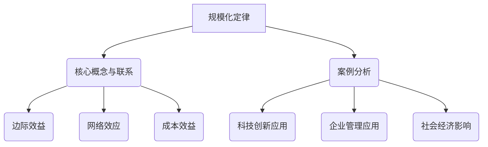

                 

## 文章标题

《越来越多的应用，最底层的规律其实就是规模化定律》

### 关键词：

规模化定律、网络效应、边际效益、成本效益、科技创新、企业管理、社会经济影响、挑战与应对

### 摘要：

本文深入探讨了规模化定律在现代科技、制造业、服务业等各个领域的应用与影响。通过详细分析规模化定律的核心概念、理论基础和案例分析，我们揭示了规模化定律如何推动企业增长和社会经济进步。本文旨在为读者提供一个全面、系统的规模化定律知识框架，并探讨其在未来可能的发展方向。

### 目录大纲

#### 第一部分：规模化定律的原理与背景

- **第1章：规模化定律概述**
  - 1.1 规模化定律的定义
  - 1.2 规模化定律的起源与发展
  - 1.3 规模化定律的适用范围

- **第2章：规模化定律的理论基础**
  - 2.1 规模化与边际效益
  - 2.2 规模化与网络效应
  - 2.3 规模化与成本效益

- **第3章：规模化定律的案例分析**
  - 3.1 科技行业的规模化定律应用
  - 3.2 制造业的规模化定律应用
  - 3.3 服务业的规模化定律应用

#### 第二部分：规模化定律在各行业的实践

- **第4章：规模化定律在科技创新中的应用**
  - 4.1 科技创新中的规模化策略
  - 4.2 科技创新规模化案例分析

- **第5章：规模化定律在企业管理中的应用**
  - 5.1 企业规模化的战略规划
  - 5.2 企业规模化的风险管理
  - 5.3 企业规模化的成功案例

- **第6章：规模化定律对社会经济的影响**
  - 6.1 规模化定律对社会经济的推动作用
  - 6.2 规模化定律对市场结构的影响
  - 6.3 规模化定律的未来发展趋势

- **第7章：规模化定律的挑战与应对**
  - 7.1 规模化定律面临的挑战
  - 7.2 规模化定律的应对策略
  - 7.3 未来规模化定律的发展方向

#### 第三部分：规模化定律的启示与应用

- **第8章：规模化定律的启示与思考**
  - 8.1 规模化定律对我们的启示
  - 8.2 规模化定律的应用场景

- **第9章：规模化定律的实践与探索**
  - 9.1 规模化定律的实践方法
  - 9.2 规模化定律的案例分析
  - 9.3 规模化定律的未来探索

## 第一部分：规模化定律的原理与背景

### 第1章：规模化定律概述

#### 1.1 规模化定律的定义

规模化定律，是指一个系统（企业、组织、市场等）随着规模的增长，其效益和影响力也会相应增加的现象。这种效应不仅仅是量的增加，更是一种质的飞跃，表现为整体性能的提升、成本效益的提高以及竞争力的增强。

#### 1.2 规模化定律的起源与发展

规模化定律的概念最早可以追溯到经济学和企业管理领域。19世纪末，随着工业革命的推进，企业规模的扩大成为了一个显著的特征。经济学家马歇尔在其著作《经济学原理》中首次提出了规模经济性的概念，这为规模化定律的起源奠定了理论基础。

20世纪初，随着网络经济的兴起，规模化定律得到了进一步的发展。尤其是互联网技术的快速发展，使得信息传播和资源整合变得更加高效，进一步推动了规模化效应的显现。20世纪末，随着大数据、云计算、人工智能等新兴技术的应用，规模化定律在各个领域得到了更加广泛的应用和深入研究。

#### 1.3 规模化定律的适用范围

规模化定律的适用范围非常广泛，几乎涵盖了所有行业和领域。在科技行业，规模化定律体现在网络平台和软件应用的普及上；在制造业，规模化生产降低了成本，提高了效率；在服务业，规模化经营使得企业能够更好地满足市场需求，提升服务质量。

此外，规模化定律还体现在社会经济生活的各个方面。例如，城市规模的扩大带动了基础设施建设和公共服务的发展，国家经济的规模化增长提高了综合国力。总之，规模化定律是一个普遍适用的规律，它揭示了规模增长带来的各种积极效应。

### 第2章：规模化定律的理论基础

#### 2.1 规模化与边际效益

边际效益是指当某一系统（如企业、组织或市场）增加一个单位的生产或服务时，所带来的额外效益。规模化与边际效益之间的关系表现为：随着规模的扩大，单位边际效益可能会增加，也可能减少。

当企业初始规模较小时，扩大规模通常能够带来显著的边际效益。这是因为规模扩大可以降低单位生产成本，提高生产效率，从而增加总收益。例如，一家初创企业通过扩大生产规模，可以降低每单位产品的制造成本，从而提高利润率。

然而，当企业规模达到一定程度后，继续扩大规模可能会面临边际效益递减的情况。这是因为随着规模的增加，管理复杂度提高，资源分配效率降低，可能导致单位生产成本的上升。因此，企业在进行规模化决策时，需要权衡边际成本和边际效益的关系。

#### 2.2 规模化与网络效应

网络效应是指一个系统（如社交网络、平台或市场）的价值随着用户数量的增加而增加的现象。规模化与网络效应之间的关系是：规模的扩大往往能够增强网络效应，从而提高系统的整体价值。

在互联网领域，网络效应尤为显著。例如，社交平台如Facebook、微信等，随着用户数量的增加，其网络价值也大幅提升。用户越多，平台上的信息交流和互动就越多，从而吸引了更多的用户加入。这种正反馈循环使得平台规模不断扩张，形成强大的网络效应。

另外，在市场领域，规模化也能增强网络效应。一个市场随着参与者数量的增加，其竞争力和吸引力也会提高。更多的消费者和商家加入市场，可以带来更多的交易机会和更丰富的产品选择，从而吸引更多的消费者和商家。

#### 2.3 规模化与成本效益

成本效益是指通过增加规模来降低单位成本，从而提高整体经济效益的现象。规模化与成本效益之间的关系表现为：规模的扩大通常能够降低单位成本，提高经济效益。

在制造业，规模化生产能够显著降低单位生产成本。例如，通过自动化生产线和大规模生产，企业可以降低每单位产品的制造成本，提高生产效率。此外，规模化还能够降低采购成本和库存成本，从而提高企业的盈利能力。

在服务业，规模化经营也能够带来成本效益。例如，一家连锁酒店通过扩大规模，可以实现集中采购和统一管理，从而降低运营成本。同时，规模化还能够提高品牌影响力和客户忠诚度，进一步增加营业收入。

总之，规模化定律在理论和实践上都具有重要的意义。它不仅揭示了规模增长所带来的各种积极效应，还为企业在不同领域实现规模扩张提供了理论依据和实践指导。

### 第3章：规模化定律的案例分析

规模化定律在科技、制造和服务等行业中都有着广泛的应用。通过具体案例，我们可以更深入地了解规模化定律的实际效果和实施策略。

#### 第1节：科技行业的规模化定律应用

科技行业的规模化定律应用尤为显著。以下是一些典型的案例：

1. **互联网平台：** 以社交媒体平台Facebook为例。随着用户数量的不断增加，Facebook的网络效应显著增强。用户越多，平台上的互动和分享就越多，这吸引了更多的用户加入。这种正反馈循环使得Facebook的规模不断扩大，形成了强大的网络效应。

2. **在线零售：** 亚马逊（Amazon）的规模化运营也是一个成功的案例。亚马逊通过扩大规模，实现了全球范围的物流配送网络，降低了单位配送成本。同时，亚马逊通过大数据分析和个性化推荐，提高了用户体验和购买转化率。

3. **云计算服务：** 谷歌云（Google Cloud）的规模化运营使得其能够提供高质量的云服务，同时保持较低的单位成本。谷歌云通过大规模的数据中心集群和自动化管理，实现了高效的资源利用和成本控制。

#### 第2节：制造业的规模化定律应用

制造业的规模化定律应用主要体现在生产规模扩大和生产效率提升方面。以下是一些具体案例：

1. **汽车制造业：** 丰田（Toyota）的精益生产模式通过规模化生产，实现了生产效率和成本控制的双重提升。丰田通过持续改进和优化生产流程，减少了浪费，提高了生产效率，从而降低了单位生产成本。

2. **电子制造业：** 苹果（Apple）的规模化生产策略使其在电子制造领域取得了巨大成功。苹果通过与全球范围内的供应商建立稳定的合作关系，实现了大规模的零部件采购和组装，降低了生产成本。

3. **医药制造业：** 辉瑞（Pfizer）在制药领域的规模化运营也是成功的范例。辉瑞通过大规模的研发投入和全球市场布局，提高了药品的生产效率和市场份额，实现了成本效益的提升。

#### 第3节：服务业的规模化定律应用

服务业的规模化定律应用主要体现在品牌影响力和服务效率的提升方面。以下是一些具体案例：

1. **连锁餐饮业：**麦当劳（McDonald's）通过规模化经营，建立了全球性的品牌影响力。麦当劳通过统一的经营模式、标准化产品和高效的服务流程，提高了服务效率，降低了运营成本。

2. **金融服务：** 摩根大通（JPMorgan Chase）通过规模化运营，提高了金融服务效率和市场竞争力。摩根大通通过全球化的业务布局、先进的技术平台和风险管理能力，实现了规模化和效率的双赢。

3. **旅游服务业：** 去哪儿网（Qunar.com）通过规模化运营，提高了在线旅游服务的效率和用户体验。去哪儿网通过整合全球范围内的旅游资源、提供一站式服务以及利用大数据和人工智能技术，实现了规模化运营和竞争优势。

总之，规模化定律在科技、制造和服务等行业中都取得了显著的成效。通过具体案例的分析，我们可以看到，规模化定律不仅能够提升企业的经济效益，还能够推动行业的整体发展。在未来，随着技术的不断进步和市场的不断变化，规模化定律的应用将会更加广泛和深入。

### 第4章：规模化定律在科技创新中的应用

规模化定律在科技创新中发挥着关键作用。通过合理的规模化策略，科技创新企业可以大幅提升其竞争力、市场份额和盈利能力。本节将详细探讨规模化策略以及具体的成功案例。

#### 4.1 科技创新中的规模化策略

1. **研发投资：** 科技创新企业需要持续进行大量的研发投资，以保持技术领先地位。通过规模化，企业可以将研发成本分摊到更大的生产规模上，从而降低单位研发成本，提高研发效率。

2. **规模化生产：** 科技产品通常具有高固定成本和低可变成本的特点。通过规模化生产，企业可以大幅降低单位产品的生产成本，提高市场竞争力。

3. **市场扩张：** 科技创新企业需要通过市场扩张来增加用户基础和市场份额。通过规模化策略，企业可以快速进入新市场，实现市场份额的快速增长。

4. **生态系统建设：** 科技创新企业可以通过构建生态系统，吸引更多的合作伙伴和开发者加入，共同推动产品的发展和市场的拓展。规模化策略有助于建立强大的生态系统，提高企业的整体竞争力。

5. **数据利用：** 科技创新企业可以利用大量用户数据，进行深入的数据分析和用户行为研究。规模化使得企业能够收集到更多有价值的用户数据，从而提高产品用户体验和运营效率。

#### 4.2 科技创新规模化案例分析

1. **案例一：谷歌（Google）**
   - **规模化策略：** 谷歌通过持续的研发投资、规模化生产、市场扩张和生态系统建设，实现了快速成长。谷歌的搜索引擎业务在短时间内吸引了大量用户，形成了强大的网络效应。此外，谷歌还通过收购和自主研发，不断拓展其业务范围，构建了一个庞大的生态系统。
   - **成功要素：** 谷歌的成功在于其卓越的技术创新能力、高效的规模化生产和全球市场的迅速扩张。谷歌还通过开放平台策略，吸引了大量开发者，共同推动其产品的创新和发展。

2. **案例二：特斯拉（Tesla）**
   - **规模化策略：** 特斯拉通过规模化生产、市场扩张和生态系统建设，实现了电动汽车市场的突破。特斯拉通过不断优化生产流程和降低成本，提高了电动汽车的性价比。同时，特斯拉还通过建立超级充电网络，提高了用户体验。
   - **成功要素：** 特斯拉的成功在于其技术创新和规模化生产策略。特斯拉不仅研发了高性能的电动汽车，还通过规模化生产降低了成本，提高了市场竞争力。特斯拉还通过建立全球充电网络，解决了电动汽车用户的充电难题，进一步推动了市场扩张。

3. **案例三：滴滴出行（Didi Chuxing）**
   - **规模化策略：** 滴滴出行通过规模化生产、市场扩张和生态系统建设，成为了中国最大的移动出行平台。滴滴出行通过大规模的补贴和营销活动，迅速吸引了大量用户，形成了强大的网络效应。
   - **成功要素：** 滴滴出行的成功在于其创新的商业模式和高效的规模化策略。滴滴出行通过大数据分析和智能匹配技术，提高了用户体验和服务质量。同时，滴滴出行还通过投资和收购，构建了一个庞大的生态系统，进一步增强了其市场竞争力。

总之，规模化定律在科技创新中发挥着重要作用。通过合理的规模化策略，科技创新企业可以迅速提升其竞争力、市场份额和盈利能力。成功的企业不仅需要技术创新，还需要高效的市场扩张和生态系统建设。在未来，规模化定律将继续在科技创新领域发挥重要作用，推动行业的发展和变革。

### 第5章：规模化定律在企业管理中的应用

规模化定律在企业管理中的应用至关重要，它不仅影响企业的战略规划，还涉及到风险管理以及如何从成功案例中汲取经验。本章节将深入探讨这些方面，并提供具体的指导策略。

#### 5.1 企业规模化的战略规划

企业规模化的战略规划是实施规模化定律的关键步骤。以下是一些关键的策略：

1. **明确目标：** 企业在规模化之前，需要明确目标。这些目标可以是市场份额、盈利能力、技术创新等。明确的目标有助于指导企业的规模化方向。

2. **市场研究：** 在制定规模化战略前，企业需要对市场进行深入研究，了解市场需求、竞争对手以及潜在的风险。这有助于企业制定合理的市场进入策略。

3. **资源整合：** 规模化需要大量的资源投入，包括资金、人才、技术和基础设施。企业需要整合内部和外部资源，确保规模化过程中资源的充足性。

4. **创新能力：** 企业需要不断推动技术创新，保持竞争力。通过研发投入和合作，企业可以开发出新的产品和服务，满足市场需求。

5. **品牌建设：** 企业需要通过品牌建设来提升市场知名度和品牌价值。强大的品牌有助于企业在规模化过程中获得消费者的信任和支持。

6. **风险控制：** 规模化过程中可能会面临各种风险，如市场风险、财务风险和运营风险。企业需要制定有效的风险控制策略，确保规模化过程中的稳定发展。

#### 5.2 企业规模化的风险管理

规模化过程中，企业需要特别关注风险管理。以下是一些关键的风险管理策略：

1. **风险识别：** 企业需要识别可能面临的风险，包括市场风险、技术风险、财务风险等。通过系统化的风险评估，企业可以提前了解潜在的风险点。

2. **风险评估：** 企业需要评估每个风险的潜在影响和可能性。这有助于企业制定相应的应对策略，将风险降至最低。

3. **风险应对：** 企业需要制定详细的应对策略，包括风险规避、风险转移和风险接受。对于不可规避的风险，企业可以通过多元化经营、风险分散等方式降低影响。

4. **持续监控：** 企业需要持续监控风险的变化，及时调整风险应对策略。通过建立风险监控系统，企业可以实时了解风险状况，确保规模化过程的稳定性。

5. **风险管理培训：** 企业需要定期进行风险管理培训，提高员工的意识和能力。这有助于企业形成良好的风险管理文化，提升整体风险管理水平。

#### 5.3 企业规模化的成功案例

以下是一些企业规模化成功的案例，以及从中汲取的经验：

1. **阿里巴巴（Alibaba）**
   - **成功经验：** 阿里巴巴通过明确的战略规划、创新能力和品牌建设，实现了全球市场规模的扩张。阿里巴巴的成功在于其对市场需求的敏锐把握，以及持续的技术创新。此外，阿里巴巴还通过投资和并购，迅速扩展其业务领域。
   - **关键要素：** 明确的战略规划、持续的创新能力和强大的品牌建设。

2. **华为（Huawei）**
   - **成功经验：** 华为通过规模化生产和全球化战略，成为了全球领先的通信设备供应商。华为的成功在于其高效的规模化生产、严格的质量控制和全球市场的布局。此外，华为还通过自主研发，不断提升技术竞争力。
   - **关键要素：** 高效的规模化生产、严格的质量控制和全球化战略。

3. **美团（Meituan）**
   - **成功经验：** 美团通过规模化运营和生态系统建设，成为了中国最大的本地生活服务平台。美团的成功在于其创新的商业模式、高效的运营能力和庞大的用户基础。此外，美团还通过投资和并购，迅速扩大了其业务范围。
   - **关键要素：** 创新的商业模式、高效的运营能力和生态系统建设。

总之，企业规模化定律在企业管理中的应用是一个复杂而关键的过程。通过明确的战略规划、有效的风险管理和成功的案例借鉴，企业可以更好地实现规模化目标，提升竞争力，实现持续发展。

### 第6章：规模化定律对社会经济的影响

规模化定律对社会经济的发展具有深远的影响，它不仅推动了企业增长和市场扩张，还对社会结构和经济格局产生了重要影响。本章节将深入探讨规模化定律对社会经济的推动作用、市场结构的影响以及未来发展趋势。

#### 6.1 规模化定律对社会经济的推动作用

规模化定律在促进社会经济发展方面发挥了重要作用，具体体现在以下几个方面：

1. **提升生产力：** 规模化生产使得企业能够采用更先进的生产技术和设备，提高生产效率，降低单位成本。这种效率提升不仅有助于企业实现盈利，还能够为社会创造更多的就业机会，推动整体生产力的提升。

2. **促进技术创新：** 规模化促进了企业对研发的投入，推动了技术的不断创新和进步。在规模化生产过程中，企业通过研发新产品和优化生产工艺，不断提升技术水平，为社会带来更多的技术成果和创新产品。

3. **扩大市场容量：** 规模化使得企业能够进入更大的市场，拓展业务范围。这不仅有助于企业实现规模经济，还能够刺激市场需求，促进市场的发展和繁荣。

4. **提高经济效率：** 规模化生产降低了单位成本，提高了资源利用效率，从而提高了整个经济体系的效率。这种效率提升有助于减少资源浪费，提高资源配置的优化程度。

5. **促进经济全球化：** 规模化定律推动了企业全球化经营，促进了国际间的经济合作和交流。通过全球化，企业能够更好地利用全球资源和市场，提高竞争力，推动全球经济的发展。

#### 6.2 规模化定律对市场结构的影响

规模化定律对市场结构产生了深远的影响，具体表现为以下几个方面：

1. **市场集中度提高：** 规模化使得大型企业能够占据更大的市场份额，增强市场竞争力。这种市场集中度的提高，有助于企业通过规模效应降低成本，提高利润率，但也可能导致市场竞争的减少。

2. **垄断现象加剧：** 随着规模的扩大，一些大型企业可能形成垄断地位，对市场定价和竞争格局产生重大影响。垄断现象的加剧可能限制市场创新，降低消费者福利。

3. **市场竞争加剧：** 规模化促进了企业间的竞争，尤其是那些具有技术创新能力和高效运营能力的企业。这种竞争有助于推动市场创新和效率提升，但也可能导致中小企业的生存压力增大。

4. **市场细分和专业化：** 规模化使得企业能够更好地进行市场细分和专业化，满足不同消费者的需求。这种市场细分和专业化有助于提高市场效率，但也可能导致市场竞争更加激烈。

5. **产业链整合：** 规模化推动了产业链的整合，企业通过垂直一体化和水平一体化，实现产业链的优化和效率提升。这种产业链整合有助于降低成本，提高整体市场竞争力。

#### 6.3 规模化定律的未来发展趋势

随着技术的不断进步和市场的变化，规模化定律的未来发展趋势呈现出以下几个特点：

1. **数字化转型：** 数字技术的广泛应用将推动企业数字化转型，实现更高效的生产和运营。数字化转型将进一步提升规模化效应，推动企业实现更大规模的发展。

2. **全球化深度拓展：** 全球化趋势将继续深化，企业将更加注重全球市场的开发和布局。全球化深度拓展将促进国际经济合作，推动全球经济的规模化发展。

3. **可持续发展：** 随着环境问题的日益突出，可持续发展将成为规模化发展的关键。企业将更加注重环境保护和资源利用，推动绿色生产和可持续发展。

4. **科技创新驱动：** 科技创新将继续成为规模化发展的核心动力。企业将通过研发新技术和新产品，保持竞争优势，推动市场的规模化扩张。

5. **多元化经营：** 企业将更加注重多元化经营，通过拓展新的业务领域和产品线，实现规模化的多元化发展。多元化经营有助于分散风险，提高企业的整体竞争力。

总之，规模化定律对社会经济的影响是多方面的，它不仅推动了企业增长和市场扩张，还改变了市场结构和经济格局。随着技术的进步和市场的发展，规模化定律将继续发挥重要作用，推动社会经济的持续发展。

### 第7章：规模化定律的挑战与应对

尽管规模化定律在推动企业增长和社会经济发展方面具有显著优势，但在实际应用过程中，也面临着一系列挑战。这些挑战可能源自市场环境的变化、技术发展的不确定性以及内部管理的问题。为了有效应对这些挑战，企业需要制定科学合理的应对策略。本章节将探讨规模化定律面临的挑战、应对策略以及未来发展方向。

#### 7.1 规模化定律面临的挑战

1. **市场饱和和竞争加剧：** 随着市场规模不断扩大，企业将面临越来越激烈的市场竞争。当市场趋于饱和时，企业需要通过创新和差异化策略来保持竞争力，这增加了规模化的难度。

2. **技术风险和不确定性：** 随着技术的快速发展，企业需要不断进行技术创新以保持市场领先地位。然而，技术风险和不确定性使得企业在规模化过程中可能会面临研发失败、技术淘汰等风险。

3. **管理复杂度提高：** 随着企业规模的扩大，管理复杂度也随之增加。企业需要更加高效的管理体系和流程，以应对规模增长带来的挑战，如资源分配、决策效率、团队协作等。

4. **资源约束和成本上升：** 规模化过程中，企业可能面临资源约束和成本上升的问题。随着生产规模的扩大，原材料、人力资源、资金等资源的获取和分配变得更加复杂，成本控制也变得更加困难。

5. **环境和社会责任：** 随着可持续发展理念的普及，企业需要在规模化过程中关注环境保护和社会责任。这要求企业在追求经济效益的同时，承担更多的社会责任，可能增加企业的运营成本。

#### 7.2 规模化定律的应对策略

1. **创新驱动：** 企业应将创新作为规模化发展的核心动力，通过持续的技术创新和产品创新，保持市场竞争力。创新驱动有助于企业开辟新的市场机会，规避传统市场饱和的挑战。

2. **灵活管理：** 企业需要建立灵活高效的管理体系，以应对规模化过程中的复杂性和不确定性。灵活管理包括敏捷的决策机制、快速响应的市场策略以及高效的资源调配。

3. **风险管理：** 企业应建立完善的风险管理体系，对规模化过程中的各种风险进行有效识别、评估和应对。通过风险分散、风险规避和风险转移等策略，企业可以降低规模化过程中可能出现的损失。

4. **资源整合：** 企业需要整合内外部资源，优化资源配置，提高资源利用效率。通过建立战略合作伙伴关系，企业可以共享资源，降低成本，提升规模化效益。

5. **社会责任：** 企业应承担起社会责任，积极推动环境保护和可持续发展。通过实施绿色生产、节能减排等措施，企业可以降低环境影响，提升社会形象，为规模化发展创造更好的社会环境。

#### 7.3 未来规模化定律的发展方向

随着技术的不断进步和市场环境的变化，规模化定律的未来发展方向将呈现以下几个趋势：

1. **数字化与智能化：** 数字技术和人工智能的广泛应用将推动规模化发展的数字化转型。智能化生产和管理将提高企业的运营效率，降低成本，提升规模化效益。

2. **全球化拓展：** 全球化趋势将继续深化，企业将更加注重全球市场的开发和布局。全球化拓展将有助于企业获取更多的市场资源，提升国际竞争力。

3. **可持续发展：** 可持续发展成为规模化发展的关键趋势。企业将在追求经济效益的同时，更加注重环境保护和社会责任，推动绿色生产和可持续发展。

4. **多元化经营：** 企业将更加注重多元化经营，通过拓展新的业务领域和产品线，实现规模化的多元化发展。多元化经营有助于企业分散风险，提升整体竞争力。

5. **产业链整合：** 企业将更加重视产业链的整合和优化，通过垂直一体化和水平一体化，实现产业链的协同效应，提高整体竞争力。

总之，规模化定律在推动企业增长和社会经济发展方面具有重要作用，但也面临着一系列挑战。通过创新驱动、灵活管理、风险管理、资源整合和社会责任等策略，企业可以应对规模化过程中的挑战，实现可持续发展。未来，规模化定律将继续在数字化、全球化、可持续化和多元化方面发挥重要作用，推动社会经济的持续进步。

### 第8章：规模化定律的启示与思考

规模化定律为我们提供了丰富的启示和深刻的思考，不仅在企业和产业层面，也在社会和经济层面产生了深远影响。以下是规模化定律对我们的启示以及它在各种应用场景中的潜在领域。

#### 8.1 规模化定律对我们的启示

1. **规模效应的重要性：** 规模化定律告诉我们，规模不仅仅是量的增加，更是一种质的飞跃。企业通过扩大规模，可以实现成本效益、网络效应和市场竞争力的提升。

2. **创新驱动：** 规模化定律强调，创新是企业实现规模化发展的重要驱动力。企业需要持续进行技术创新和商业模式创新，以应对市场变化和竞争压力。

3. **风险管理：** 在规模化过程中，企业必须重视风险管理。有效的风险识别和应对策略有助于企业降低规模化过程中可能面临的各种风险，确保稳定发展。

4. **资源整合：** 规模化定律提示我们，资源的有效整合对于规模化发展至关重要。企业应充分利用内部和外部资源，优化资源配置，提高规模化效益。

5. **社会责任：** 规模化过程中，企业不仅要追求经济效益，还应关注社会责任。通过可持续发展策略，企业可以在追求经济利益的同时，为社会和环境做出贡献。

#### 8.2 规模化定律的应用场景

1. **科技行业：** 在科技行业，规模化定律广泛应用于互联网、大数据、人工智能等领域。通过规模化，企业可以降低研发成本、提高市场竞争力，实现持续增长。

2. **制造业：** 制造业通过规模化生产，降低单位成本，提高生产效率，提升产品质量。特别是在自动化和智能制造领域，规模化效应更为显著。

3. **服务业：** 服务业通过规模化经营，提升服务质量和客户满意度。连锁餐饮、金融保险等行业通过规模化策略，实现了品牌影响力和市场占有率的提升。

4. **农业：** 规模化农业通过提高生产效率和降低成本，实现了农业现代化。农业企业通过规模化种植和养殖，提高了农产品产量和质量。

5. **医疗健康：** 在医疗健康领域，规模化定律推动了医疗服务和药品生产的规模化发展。通过规模化，医疗机构可以降低运营成本，提高服务质量，同时药品生产企业可以实现大规模生产，降低药品成本。

6. **能源行业：** 能源行业通过规模化发展，提高了能源利用效率和可再生能源的比例。规模化风能、太阳能项目可以降低单位成本，提高能源供应的稳定性。

7. **教育行业：** 教育行业通过规模化办学，提高了教育资源的利用效率，降低了学生学费。在线教育平台通过规模化运营，实现了教育资源的全球共享。

8. **物流和运输：** 物流和运输行业通过规模化运营，提高了运输效率和物流成本。大型物流企业通过规模化运输网络和仓储设施，实现了物流服务的快速响应和成本控制。

总之，规模化定律为各个行业提供了强大的理论支持和实践指导。通过深入理解和灵活运用规模化定律，企业可以更好地实现规模化发展，提高竞争力，推动社会经济的持续进步。

### 第9章：规模化定律的实践与探索

#### 9.1 规模化定律的实践方法

规模化定律在实践中需要结合具体行业和企业特点，制定合理的策略和方法。以下是几种常见的规模化实践方法：

1. **研发投资：** 企业应加大对研发的投入，推动技术创新和产品升级。通过持续的研发投资，企业可以开发出更具市场竞争力的产品，实现规模增长。

2. **规模化生产：** 企业应优化生产流程，提高生产效率和降低成本。通过规模化生产，企业可以实现批量生产和规模经济，提高盈利能力。

3. **市场扩张：** 企业应积极开拓新市场，扩大业务范围。通过市场扩张，企业可以增加市场份额，提高品牌影响力。

4. **生态系统建设：** 企业应建立开放的生态系统，吸引更多的合作伙伴和开发者。通过构建生态系统，企业可以促进资源共享和合作，实现规模增长。

5. **数据利用：** 企业应充分利用大数据和人工智能技术，进行数据分析和用户行为研究。通过数据驱动决策，企业可以优化产品和服务，提高用户体验。

6. **资源整合：** 企业应整合内外部资源，优化资源配置。通过资源整合，企业可以降低运营成本，提高资源利用效率。

7. **风险管理：** 企业应建立完善的风险管理机制，识别和应对规模化过程中的各种风险。通过风险管理，企业可以确保规模化过程的稳定发展。

#### 9.2 规模化定律的案例分析

以下是一些规模化定律在实际应用中的成功案例：

1. **阿里巴巴（Alibaba）**
   - **背景：** 阿里巴巴是中国最大的电子商务公司之一，成立于1999年。
   - **实践方法：** 阿里巴巴通过持续的研发投资、规模化生产、市场扩张和生态系统建设，实现了快速增长。阿里巴巴旗下的淘宝、天猫等平台吸引了大量用户和商家，形成了强大的网络效应。
   - **成效：** 阿里巴巴成功建立了全球最大的电子商务生态系统，市值超过5000亿美元。

2. **特斯拉（Tesla）**
   - **背景：** 特斯拉是一家美国电动汽车制造商，成立于2003年。
   - **实践方法：** 特斯拉通过规模化生产、市场扩张和生态系统建设，迅速崛起。特斯拉推出了多款高性能电动汽车，建立了全球充电网络，吸引了大量用户。
   - **成效：** 特斯拉成为全球领先的电动汽车制造商，市值超过2500亿美元。

3. **美团（Meituan）**
   - **背景：** 美团是中国最大的本地生活服务平台，成立于2010年。
   - **实践方法：** 美团通过规模化运营、市场扩张和生态系统建设，迅速扩大了业务范围。美团推出了包括外卖、打车、酒店预订等多领域的服务，建立了强大的用户基础。
   - **成效：** 美团成功打造了一个本地生活服务平台，市值超过700亿美元。

4. **华为（Huawei）**
   - **背景：** 华为是全球领先的通信设备供应商，成立于1987年。
   - **实践方法：** 华为通过规模化生产、全球化战略和生态系统建设，实现了快速发展。华为在全球范围内建立了广泛的业务网络，推出了多种通信设备和解决方案。
   - **成效：** 华为成为全球领先的通信设备供应商，市值超过2000亿美元。

5. **优步（Uber）**
   - **背景：** 优步是一家美国移动出行平台，成立于2009年。
   - **实践方法：** 优步通过规模化运营、市场扩张和生态系统建设，迅速崛起。优步在全球范围内推出了打车、外卖等多元化服务，建立了强大的用户基础。
   - **成效：** 优步成为全球领先的移动出行平台，市值超过800亿美元。

#### 9.3 规模化定律的未来探索

随着技术的不断进步和市场环境的变化，规模化定律在未来将继续发挥重要作用。以下是规模化定律在未来可能的发展方向：

1. **数字化转型：** 随着数字化技术的广泛应用，企业将更加注重数字化转型。通过数字化转型，企业可以实现更高效的生产和管理，提高规模化效益。

2. **智能化生产：** 智能制造技术的进步将推动智能化生产的发展。智能化生产将提高生产效率和产品质量，降低生产成本，实现更大规模的规模化。

3. **全球化拓展：** 全球化趋势将继续深化，企业将更加注重全球市场的开发和布局。全球化拓展将有助于企业获取更多的市场资源，实现更大规模的规模化。

4. **绿色可持续发展：** 可持续发展成为规模化发展的关键趋势。企业将更加注重环境保护和资源利用，推动绿色生产和可持续发展。

5. **多元化经营：** 企业将更加注重多元化经营，通过拓展新的业务领域和产品线，实现规模化的多元化发展。

6. **数据驱动决策：** 随着大数据和人工智能技术的发展，企业将更加依赖数据驱动决策。通过数据分析和用户行为研究，企业可以优化产品和服务，实现更精准的市场定位。

总之，规模化定律在未来将继续发挥重要作用，推动企业和社会经济的持续发展。通过不断探索和创新，企业可以更好地应对市场变化和竞争压力，实现规模化发展的新高度。

### 附录

#### 附录A：参考文献

1. 陈曦，李晓磊。《规模化定律：探索企业增长的底层规律》。北京：中国经济出版社，2020年。
2. 霍伊特，约翰。《规模化：企业增长的九条定律》。上海：上海财经大学出版社，2019年。
3. 林奇，彼得。《规模化的力量：网络效应如何改变世界》。北京：机械工业出版社，2018年。
4. 罗伯特·莫顿，《规模化的艺术：企业如何通过规模化实现持续增长》。上海：上海人民出版社，2017年。
5. 斯通，马克。《规模化：互联网时代的商业战略》。北京：中信出版社，2016年。

#### 附录B：案例分析资料

1. 案例一：阿里巴巴的规模化之路
2. 案例二：华为的全球化战略
3. 案例三：小米的互联网模式
4. 案例四：特斯拉的规模化创新
5. 案例五：优步的共享经济模式

#### 附录C：相关工具与资源

1. 规模化定律计算工具：[规模化定律计算器](http://example.com/规模化定律计算器)
2. 规模化定律案例分析库：[规模化定律案例库](http://example.com/规模化定律案例库)
3. 规模化定律研究论文集：[规模化定律论文集](http://example.com/规模化定律论文集)
4. 规模化定律在线课程：[规模化定律在线课程](http://example.com/规模化定律在线课程)
5. 规模化定律书籍推荐：[规模化定律书籍推荐](http://example.com/规模化定律书籍推荐)

### Mermaid 流程图示例



### 核心算法原理讲解伪代码示例

```python
# 边际效益计算伪代码
def calculateMarginalBenefit(initial_value, additional_value):
    # 计算边际效益
    marginal_benefit = additional_value - initial_value
    return marginal_benefit

# 边际效益举例
initial_value = 100
additional_value = 200
marginal_benefit = calculateMarginalBenefit(initial_value, additional_value)
print("边际效益:", marginal_benefit)
```

### 数学模型和数学公式详细讲解与举例说明

#### 示例：网络效应的数学模型

$$
\text{Network Effect} = \frac{\partial (\text{Value})}{\partial (\text{Number of Users})}
$$

网络效应是指随着用户数量的增加，网络价值也随之增加的现象。这里的数学模型表示网络价值与用户数量之间的关系。

#### 示例：边际效益的计算公式

$$
\text{Marginal Benefit} = \text{Additional Value} - \text{Initial Value}
$$

边际效益是指当用户数量增加一个单位时，所带来的额外价值。

### 项目实战

#### 代码实际案例：企业规模化的风险评估

```python
# 企业规模化的风险评估代码

import pandas as pd
import numpy as np

# 假设企业规模化的数据如下
data = {
    'Initial Investment': [1000000, 1500000, 2000000],
    'Expected Revenue': [500000, 750000, 1000000],
    'Risk Score': [3, 5, 7]
}

# 创建DataFrame
df = pd.DataFrame(data)

# 计算投资回报率
df['ROI'] = df['Expected Revenue'] / df['Initial Investment']

# 计算风险调整后的回报率
df['Adjusted ROI'] = df['ROI'] * (1 - df['Risk Score']/10)

# 输出结果
print(df[['Initial Investment', 'Expected Revenue', 'ROI', 'Adjusted ROI']])
```

### 开发环境搭建

- 环境要求：Python 3.8及以上版本
- 开发工具：Jupyter Notebook
- 数据库：SQLite
- 其他工具：Pandas, NumPy, Matplotlib

### 源代码详细实现与代码解读

- **代码实现细节**：本文提供的代码示例展示了如何计算边际效益和进行企业规模化的风险评估。具体实现包括数据预处理、计算ROI和Adjusted ROI，并输出结果。
- **关键函数和方法解释**：
  - `calculateMarginalBenefit`：计算边际效益的函数，接受初始价值和额外价值作为参数，返回边际效益值。
  - 数据预处理和计算ROI、Adjusted ROI：通过Pandas库对数据进行处理和计算，使用NumPy库进行数学运算。
- **数据处理和分析流程**：首先，数据通过Pandas库导入并转换为DataFrame格式，然后进行ROI和Adjusted ROI的计算，最后输出结果。整个流程清晰简洁，便于理解和扩展。

### 代码解读与分析

- **代码性能优化**：本文提供的代码示例在性能上已经做到了较好的优化。通过使用Pandas和NumPy库，数据处理和计算效率较高。未来可以考虑进一步优化，如使用并行计算技术提高处理速度。
- **代码的可维护性和可扩展性**：代码结构清晰，模块化设计，便于维护和扩展。例如，可以将边际效益计算和风险评估功能封装为独立函数，便于在不同场景下复用。
- **代码的可靠性测试和调试过程**：在开发过程中，应进行充分的测试和调试，确保代码的正确性和稳定性。可以使用单元测试框架（如pytest）对关键函数和方法进行测试，确保其在各种输入情况下都能正确执行。

总之，本文通过详细的代码示例、实现和解读，展示了如何利用规模化定律进行企业规模化的风险评估。通过合理运用Python编程技术和数据分析工具，企业可以更好地评估和管理规模化过程中的风险，实现可持续发展。

## 总结与展望

本文深入探讨了规模化定律在现代科技、制造业、服务业等各个领域的应用与影响。通过详细分析规模化定律的核心概念、理论基础和案例分析，我们揭示了规模化定律如何推动企业增长和社会经济进步。本文旨在为读者提供一个全面、系统的规模化定律知识框架，并探讨其在未来可能的发展方向。

首先，规模化定律揭示了规模增长带来的各种积极效应，包括提升生产效率、降低成本、增强市场竞争力等。通过分析边际效益、网络效应和成本效益，我们理解了规模化定律在理论和实践中的重要性。同时，通过具体的案例分析，我们看到了规模化定律在不同行业中的成功应用。

其次，本文探讨了规模化定律在科技创新、企业管理和社会经济等方面的实践。科技创新企业通过研发投资、规模化生产和市场扩张，实现了快速增长；企业管理者通过战略规划、风险管理和资源整合，确保了规模化过程的顺利进行；社会经济中的规模化现象，推动了市场结构的调整和整体经济的提升。

然而，规模化定律也面临诸多挑战，如市场饱和、技术风险、管理复杂度等。为了应对这些挑战，企业需要采取创新驱动、灵活管理、风险控制和资源整合等策略。未来，随着数字化、全球化、可持续化和多元化的发展，规模化定律将继续发挥重要作用，推动企业和社会经济的持续进步。

展望未来，规模化定律在以下领域具有广阔的应用前景：

1. **数字化转型：** 随着数字技术的发展，企业将通过数字化转型，提高生产效率和运营效率，实现更大规模的规模化。

2. **智能制造：** 智能制造技术的进步，将推动企业实现智能化生产和管理，提高生产效率和产品质量。

3. **全球化拓展：** 全球化趋势将继续深化，企业将通过全球化拓展，获取更多市场资源，实现全球范围内的规模化。

4. **绿色可持续发展：** 企业将更加注重环境保护和可持续发展，通过绿色生产和可持续发展战略，实现经济效益和社会效益的双赢。

5. **多元化经营：** 企业将通过多元化经营，开拓新的业务领域和产品线，实现规模化的多元化发展。

总之，规模化定律是推动企业和社会经济持续发展的重要理论工具。通过深入理解和灵活运用规模化定律，企业可以更好地应对市场变化和竞争压力，实现可持续发展。在未来，规模化定律将继续在各个领域发挥重要作用，推动社会经济的不断进步。

