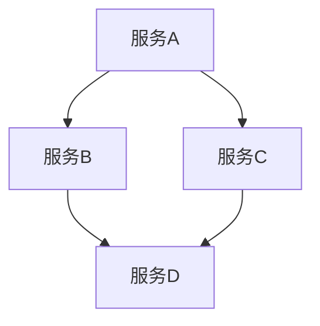

                 

# 《软件2.0的价值：提升效率、创造价值》

> 关键词：软件2.0、提升效率、价值创造、技术基础、应用场景

> 摘要：本文旨在探讨软件2.0的概念、价值及其在现代信息技术中的应用。通过对软件2.0的定义、技术基础、核心编程范式以及实际应用场景的分析，本文将阐述软件2.0如何提升效率、创造价值，并展望其未来的发展前景。

## 目录

### 第一部分：软件2.0概述

#### 第1章：软件2.0的时代背景与价值

##### 1.1 软件2.0的定义与发展

##### 1.2 软件2.0与传统软件的区别

##### 1.3 软件2.0的价值体现

##### 1.4 软件2.0的主要特征

##### 1.5 软件2.0的发展趋势

### 第二部分：软件2.0的技术基础

#### 第2章：软件2.0的技术架构

##### 2.1 软件2.0的架构设计原则

##### 2.2 软件2.0的技术栈

##### 2.3 软件2.0的微服务架构

##### 2.4 软件2.0的云计算与大数据技术

##### 2.5 软件2.0的安全与隐私保护

#### 第3章：软件2.0的核心技术

##### 3.1 软件定义网络（SDN）

##### 3.2 软件定义存储（SDS）

##### 3.3 软件定义数据中心（SDDC）

##### 3.4 软件定义网络功能虚拟化（NFV）

##### 3.5 容器与容器编排

#### 第4章：软件2.0的编程范式

##### 4.1 函数式编程

##### 4.2 面向服务的架构（SOA）

##### 4.3 服务网格（Service Mesh）

##### 4.4 自动化与持续集成/持续部署（CI/CD）

##### 4.5 DevOps文化与实践

### 第三部分：软件2.0的实际应用

#### 第5章：软件2.0在效率提升中的应用

##### 5.1 软件2.0在软件开发中的应用

##### 5.2 软件2.0在业务流程优化中的应用

##### 5.3 软件2.0在数据管理和分析中的应用

##### 5.4 软件2.0在市场营销和客户服务中的应用

#### 第6章：软件2.0在价值创造中的应用

##### 6.1 软件2.0在创新商业模式中的应用

##### 6.2 软件2.0在新兴行业中的应用

##### 6.3 软件2.0在提升用户体验中的应用

##### 6.4 软件2.0在可持续发展和社会责任中的应用

#### 第7章：软件2.0的未来展望

##### 7.1 软件2.0的技术展望

##### 7.2 软件2.0的产业变革

##### 7.3 软件2.0对社会的影响

##### 7.4 软件2.0的未来趋势

### 附录

#### 附录A：软件2.0相关工具与资源

##### A.1 主流软件2.0框架介绍

##### A.2 软件2.0相关开源项目

##### A.3 软件2.0技术社区和资源

---

接下来，我们将逐步深入探讨软件2.0的概念、价值及其应用，通过详细的分析和解释，帮助读者理解软件2.0的核心技术基础和实际应用场景。让我们一起，Let's Think Step by Step。

## 第一部分：软件2.0概述

### 第1章：软件2.0的时代背景与价值

随着信息技术的飞速发展，软件产业经历了多次重大的变革。从最初的操作系统软件、办公软件到Web 1.0时代的网站开发，再到Web 2.0时代的社交媒体和在线服务，每一次技术的进步都带来了软件产业的革新。而如今，我们正站在软件2.0的门槛上，迎接新一轮的技术革命。

#### 1.1 软件2.0的定义与发展

软件2.0是对传统软件的升级与扩展，它不仅包含了传统的功能，还引入了更多先进的技术，如云计算、大数据、人工智能等，实现了更高效、更智能、更灵活的应用开发。软件2.0的发展可以追溯到云计算的兴起，随着云计算技术的成熟，软件的部署、管理和运营变得更加简便和高效。

#### 1.2 软件2.0与传统软件的区别

与传统软件相比，软件2.0具有以下几个显著特点：

1. **服务化**：软件2.0更注重服务的提供，而不是单一的软件产品。
2. **灵活性**：软件2.0支持快速迭代和灵活部署，能够快速响应市场变化。
3. **智能化**：软件2.0利用人工智能和大数据分析，提供更加智能的服务。
4. **可扩展性**：软件2.0能够轻松扩展和升级，以适应不断增长的业务需求。

#### 1.3 软件2.0的价值体现

软件2.0的价值体现在以下几个方面：

1. **提升效率**：通过自动化和智能化，软件2.0显著提升了生产效率。
2. **降低成本**：云计算等技术的应用，使得软件2.0的部署和运营成本大大降低。
3. **创新驱动**：软件2.0为企业和开发者提供了更多创新的机会和空间。
4. **用户体验**：软件2.0通过更好的服务和功能，提升了用户体验。

#### 1.4 软件2.0的主要特征

软件2.0的主要特征包括：

1. **微服务架构**：微服务架构使得软件系统更加模块化和灵活。
2. **容器化**：容器化技术如Docker，使得软件部署和迁移更加方便。
3. **服务网格**：服务网格（Service Mesh）提供了更高效的服务管理和监控。
4. **自动化与CI/CD**：自动化和持续集成/持续部署（CI/CD）大幅提升了开发效率。

#### 1.5 软件2.0的发展趋势

未来，软件2.0的发展趋势将包括：

1. **云计算与大数据的深度融合**：这将进一步推动软件服务的智能化和个性化。
2. **人工智能的深度应用**：人工智能将更好地融入软件2.0，提供更智能的服务。
3. **区块链技术**：区块链将为软件2.0提供更安全、更可靠的交易和管理方式。
4. **边缘计算**：边缘计算将使软件2.0更好地服务于物联网和智能制造等领域。

### 小结

软件2.0是信息技术发展的重要方向，它通过引入更多先进技术，实现了更高效、更智能、更灵活的应用开发。理解软件2.0的概念和价值，对于企业和开发者来说，是把握未来技术趋势、提升竞争力的关键。在下一章中，我们将进一步探讨软件2.0的技术基础，包括其架构设计原则、技术栈、核心技术和编程范式。

---

在下一部分中，我们将深入探讨软件2.0的技术基础，从架构设计原则到核心技术，再到编程范式，全面分析软件2.0的技术内涵。让我们一起继续，Let's Think Step by Step。

## 第二部分：软件2.0的技术基础

### 第2章：软件2.0的技术架构

软件2.0的技术基础是其强大竞争力的关键，它不仅依赖于单一技术的突破，更在于多种技术的有机结合，形成一套完整的生态系统。在这一章中，我们将详细探讨软件2.0的架构设计原则、技术栈、微服务架构、云计算与大数据技术，以及安全与隐私保护。

#### 2.1 软件2.0的架构设计原则

软件2.0的架构设计原则主要体现在以下几个方面：

1. **模块化与解耦**：通过将系统划分为多个模块，每个模块独立运行，降低系统间的耦合度，提高系统的可维护性和可扩展性。
2. **服务化**：将系统功能划分为多个服务，每个服务负责特定的业务功能，服务之间通过接口进行通信，实现功能的独立开发和部署。
3. **弹性与容错**：系统设计应具备弹性，能够根据业务需求自动扩展或缩小资源规模，同时具备容错能力，确保系统在故障情况下仍能正常运行。
4. **自动化**：利用自动化工具和流程，提高开发、测试、部署和运维的效率，降低人工干预的可能性。

#### 2.2 软件2.0的技术栈

软件2.0的技术栈是一个多元化、不断演进的集合，主要包括以下关键技术：

1. **编程语言**：如Python、Java、Go、Kotlin等，它们提供了丰富的库和框架，支持快速开发。
2. **数据库技术**：关系型数据库（如MySQL、PostgreSQL）和非关系型数据库（如MongoDB、Cassandra）广泛应用于软件2.0的应用场景。
3. **中间件**：中间件如消息队列（如RabbitMQ、Kafka）、缓存（如Redis）和搜索引擎（如Elasticsearch）提供了高效的数据处理和存储能力。
4. **容器化技术**：Docker和Kubernetes等容器化技术，使得软件2.0的应用部署和运维变得更加简便。
5. **服务网格**：服务网格（如Istio、Linkerd）提供了高效的服务管理和监控能力。

#### 2.3 软件2.0的微服务架构

微服务架构是软件2.0的核心架构之一，它将应用程序划分为多个小型、自治的服务，每个服务负责特定的业务功能。微服务架构的特点包括：

1. **独立性**：每个服务独立开发、测试和部署，降低了系统的复杂性。
2. **分布式**：服务之间通过网络进行通信，实现了系统的分布式部署和扩展。
3. **灵活性**：服务可以独立升级和扩展，满足不同业务需求。
4. **容器化**：微服务通常使用容器（如Docker）进行部署，提高了系统的可移植性和可扩展性。

#### 2.4 软件2.0的云计算与大数据技术

云计算和大数据技术是软件2.0的重要组成部分，它们为软件2.0提供了强大的计算和存储能力。关键点包括：

1. **云计算平台**：如AWS、Azure、Google Cloud等，它们提供了丰富的云服务和基础设施。
2. **大数据处理**：Hadoop、Spark等大数据处理框架，使得大规模数据处理变得更加高效和便捷。
3. **数据存储**：如Amazon S3、Azure Blob Storage等，它们提供了可靠、高效的数据存储解决方案。
4. **数据分析和可视化**：利用机器学习和数据挖掘技术，从海量数据中提取有价值的信息，并进行可视化展示。

#### 2.5 软件2.0的安全与隐私保护

在软件2.0的时代，安全与隐私保护变得尤为重要。关键点包括：

1. **身份认证与授权**：使用OAuth、OpenID Connect等协议，确保用户身份的合法性和权限的合规性。
2. **数据加密**：使用SSL/TLS等加密技术，保护数据在传输过程中的安全性。
3. **网络安全**：部署防火墙、入侵检测系统（IDS）和入侵防御系统（IPS）等，保护系统不受网络攻击。
4. **数据隐私**：遵守相关法律法规，如GDPR、CCPA等，保护用户数据的隐私权。

### 小结

软件2.0的技术基础是其实现高效、智能、灵活应用的关键。通过模块化与解耦、服务化、弹性与容错、自动化等架构设计原则，软件2.0实现了更高效、更可靠的技术体系。在下一章中，我们将深入探讨软件2.0的核心技术，包括软件定义网络、软件定义存储、软件定义数据中心、软件定义网络功能虚拟化和容器与容器编排。让我们一起，Let's Think Step by Step。

### 第3章：软件2.0的核心技术

软件2.0的核心技术是其实现高效、智能、灵活应用的关键。在这一章中，我们将深入探讨软件2.0的五大核心技术：软件定义网络（SDN）、软件定义存储（SDS）、软件定义数据中心（SDDC）、软件定义网络功能虚拟化（NFV）和容器与容器编排。

#### 3.1 软件定义网络（SDN）

软件定义网络（Software-Defined Networking，简称SDN）是一种新型的网络架构，它通过将网络控制层与数据层分离，使得网络管理更加灵活和高效。在SDN架构中，网络控制层由SDN控制器负责，而数据层则由网络设备（如交换机和路由器）执行。以下是SDN的关键点：

1. **控制层与数据层的分离**：SDN通过将网络控制层与数据层分离，实现了网络的集中控制和动态管理。
2. **开放的接口**：SDN控制器通过网络设备提供的南向接口与数据层交互，南向接口通常使用OpenFlow协议。
3. **灵活的网络策略**：SDN控制器可以根据业务需求动态调整网络策略，实现更高效的网络管理。
4. **可编程的网络**：SDN允许开发者通过编程方式定义网络行为，使得网络具备更高的灵活性和可扩展性。

#### 3.2 软件定义存储（SDS）

软件定义存储（Software-Defined Storage，简称SDS）是一种通过软件实现存储资源的管理和优化，以提供高效、灵活的存储解决方案。SDS的关键点包括：

1. **去硬件化**：SDS通过软件管理存储资源，无需依赖于特定的硬件设备，降低了存储成本。
2. **自动化与弹性**：SDS利用自动化技术，实现存储资源的动态扩展和负载均衡，提高了存储系统的性能和可用性。
3. **数据管理和保护**：SDS提供了数据备份、恢复、快照和复制等功能，确保数据的完整性和可靠性。
4. **云存储集成**：SDS与云存储技术相结合，实现了数据的云存储和共享，为云计算提供了强大的支持。

#### 3.3 软件定义数据中心（SDDC）

软件定义数据中心（Software-Defined Data Center，简称SDDC）是一种通过软件实现数据中心资源的管理和优化，以提供高效、灵活的数据中心解决方案。SDDC的关键点包括：

1. **虚拟化**：SDDC通过虚拟化技术，将计算、存储、网络资源抽象化为虚拟资源，实现了资源的灵活分配和调度。
2. **自动化与智能化**：SDDC利用自动化和智能化技术，实现数据中心的自动部署、运维和管理，降低了人力成本。
3. **资源池化**：SDDC将数据中心资源池化，实现了资源的共享和优化利用，提高了资源利用率。
4. **高可用性和可靠性**：SDDC通过冗余设计和高可用性机制，确保数据中心的稳定运行和数据的安全。

#### 3.4 软件定义网络功能虚拟化（NFV）

软件定义网络功能虚拟化（Network Function Virtualization，简称NFV）是一种通过虚拟化技术实现网络功能模块的部署和运行，以提供灵活、高效的网络解决方案。NFV的关键点包括：

1. **功能模块化**：NFV将传统的网络功能模块（如防火墙、负载均衡、DNS等）虚拟化为软件模块，实现了网络功能的灵活部署和升级。
2. **虚拟化平台**：NFV通过虚拟化平台，如KVM、Xen等，实现虚拟机的创建和管理，为网络功能模块的部署提供了基础设施。
3. **分布式部署**：NFV支持网络功能模块的分布式部署，提高了网络系统的可靠性和性能。
4. **自动化与弹性**：NFV利用自动化技术，实现网络功能模块的动态扩展和负载均衡，提高了网络系统的灵活性和可用性。

#### 3.5 容器与容器编排

容器（Container）是一种轻量级、可移植的运行时环境，它封装了应用程序及其依赖的库和文件，实现了应用程序的隔离和独立运行。容器编排（Container Orchestration）则是一种管理容器集群的机制，它通过自动化工具，如Kubernetes，实现容器的部署、扩展和管理。

1. **容器化**：容器化通过将应用程序及其依赖打包为容器镜像，实现了应用程序的轻量级、快速部署和移植。
2. **容器编排**：容器编排工具（如Kubernetes）提供了容器集群的管理功能，包括容器的部署、监控、自动扩展和故障恢复。
3. **微服务架构**：容器与微服务架构相结合，使得微服务应用的开发、部署和运维变得更加高效和灵活。
4. **云原生应用**：容器和容器编排技术推动了云原生应用的发展，使得应用程序能够更好地适应云计算环境。

### 小结

软件2.0的核心技术是其实现高效、智能、灵活应用的关键。软件定义网络（SDN）、软件定义存储（SDS）、软件定义数据中心（SDDC）、软件定义网络功能虚拟化（NFV）和容器与容器编排等技术，共同构建了软件2.0的技术基础，为企业和开发者提供了强大的技术支持。在下一章中，我们将探讨软件2.0的编程范式，包括函数式编程、面向服务的架构（SOA）、服务网格、自动化与持续集成/持续部署（CI/CD）和DevOps文化与实践。让我们一起，Let's Think Step by Step。

### 第4章：软件2.0的编程范式

软件2.0的编程范式是在传统编程基础上，结合现代信息技术的发展，形成的更高效、更智能的编程方式。在这一章中，我们将探讨软件2.0的几种核心编程范式：函数式编程、面向服务的架构（SOA）、服务网格、自动化与持续集成/持续部署（CI/CD）和DevOps文化与实践。

#### 4.1 函数式编程

函数式编程是一种基于数学函数和逻辑的编程范式，它强调表达式的计算而不是改变状态或可变数据。以下是函数式编程的关键点：

1. **不可变数据**：函数式编程强调使用不可变数据，通过创建新的数据结构来避免状态改变。
2. **高阶函数**：函数式编程中的函数可以接受其他函数作为参数，或者返回函数，提高了代码的复用性和可读性。
3. **递归**：函数式编程通常使用递归而非循环来处理重复任务，使得代码更加简洁和易读。
4. **惰性求值**：函数式编程中的惰性求值，只在需要时才进行计算，提高了代码的效率和性能。

示例：使用伪代码解释函数式编程中的高阶函数和递归。

```python
# 高阶函数示例
def apply_function(func, x):
    return func(x)

# 递归示例
def factorial(n):
    if n == 0:
        return 1
    else:
        return n * factorial(n-1)
```

#### 4.2 面向服务的架构（SOA）

面向服务的架构（Service-Oriented Architecture，简称SOA）是一种基于服务构建应用程序的架构风格，它将应用程序分解为多个独立的服务，通过接口进行通信。以下是SOA的关键点：

1. **服务分解**：将应用程序的功能分解为多个独立的服务，每个服务负责特定的业务功能。
2. **服务接口**：服务通过接口进行通信，接口定义了服务的输入和输出，确保了服务的独立性和互操作性。
3. **服务组合**：通过组合不同的服务，可以构建复杂的业务流程和应用程序。
4. **服务管理**：服务需要进行管理，包括服务的注册、发现、监控和部署。

示例：使用Mermaid流程图表示SOA中的服务分解和组合。



#### 4.3 服务网格（Service Mesh）

服务网格（Service Mesh）是一种基础设施层，用于处理服务之间的通信和安全性。它是为了解决微服务架构中的通信问题而设计的。以下是服务网格的关键点：

1. **服务发现**：服务网格负责服务之间的发现和通信，确保服务能够找到并连接到其他服务。
2. **负载均衡**：服务网格可以根据流量需求，动态分配负载到不同的服务实例上，提高了系统的性能和可用性。
3. **安全通信**：服务网格通过加密、认证和授权机制，确保服务之间的通信安全可靠。
4. **监控与日志**：服务网格提供了监控和日志收集功能，帮助开发者和服务管理员了解服务的运行状况。

示例：使用伪代码解释服务网格中的负载均衡和安全性。

```python
# 负载均衡示例
def load_balance(service_list, request):
    return service_list[random.randint(0, len(service_list)-1)]

# 安全性示例
def encrypt_request(request):
    return AES.encrypt(request, secret_key)

def authenticate_user(user, password):
    return verify_password(password, stored_hash)
```

#### 4.4 自动化与持续集成/持续部署（CI/CD）

自动化和持续集成/持续部署（Continuous Integration/Continuous Deployment，简称CI/CD）是软件开发生命周期中的关键环节，它通过自动化工具和流程，实现代码的持续集成、测试和部署。以下是CI/CD的关键点：

1. **持续集成**：通过自动化测试，确保代码的集成不会引入新的错误，提高了代码的质量和稳定性。
2. **持续部署**：通过自动化部署，实现代码的快速上线和更新，提高了交付效率。
3. **版本控制**：版本控制系统（如Git）确保了代码的历史版本和安全存储，方便了代码的管理和回溯。
4. **容器化与编排**：容器化和容器编排技术（如Docker和Kubernetes）使得CI/CD过程更加高效和可靠。

示例：使用伪代码解释CI/CD中的自动化测试和部署。

```python
# 自动化测试示例
def run_tests():
    if all(tests_passed):
        return "测试通过"
    else:
        return "测试失败"

# 部署示例
def deploy_application(version):
    print(f"部署版本：{version}")
    run_tests()
    if "测试通过" == run_tests():
        print("部署成功")
    else:
        print("部署失败")
```

#### 4.5 DevOps文化与实践

DevOps文化是一种以客户为中心的软件开发和运营文化，它强调开发团队和运维团队的紧密合作，通过自动化和协作，实现高效的软件交付和运营。以下是DevOps的关键点：

1. **团队协作**：DevOps强调跨职能团队的协作，通过共同的目标和责任，提高团队的效率和创新能力。
2. **自动化**：DevOps通过自动化工具和流程，实现代码的自动化测试、部署和监控，提高了交付效率和质量。
3. **持续反馈**：DevOps鼓励持续反馈和改进，通过监控和日志分析，及时发现问题并解决，确保系统的稳定运行。
4. **持续学习**：DevOps强调团队成员的持续学习和技能提升，以适应不断变化的技术和业务需求。

示例：使用伪代码解释DevOps中的团队协作和自动化。

```python
# 团队协作示例
def team_collaboration(task):
    dev_team.execute_task(task)
    ops_team.execute_task(task)
    return "任务完成"

# 自动化示例
def deploy_application_with_automation(version):
    team_collaboration("部署应用程序")
    deploy_application(version)
```

### 小结

软件2.0的编程范式是其在现代信息技术环境中实现高效、智能和灵活应用的关键。函数式编程、面向服务的架构（SOA）、服务网格、自动化与持续集成/持续部署（CI/CD）和DevOps文化与实践，共同构成了软件2.0的编程基础。在下一章中，我们将探讨软件2.0在实际应用中的具体场景，包括在效率提升和价值创造中的应用。让我们一起，Let's Think Step by Step。

### 第5章：软件2.0在效率提升中的应用

软件2.0通过其先进的技术基础和编程范式，为各行业提供了显著提升效率的解决方案。在这一章中，我们将深入探讨软件2.0在软件开发、业务流程优化、数据管理和分析以及市场营销和客户服务中的应用，展示其如何通过技术手段提升效率。

#### 5.1 软件2.0在软件开发中的应用

软件开发是软件2.0最早和最常见的应用场景之一。软件2.0通过以下方式显著提升了软件开发效率：

1. **微服务架构**：微服务架构允许开发团队将大型应用程序分解为多个小型、独立的服务，每个服务可以单独开发和部署。这种模式提高了开发的并行性，缩短了开发周期，同时降低了系统的复杂性。
   - **Mermaid流程图**：
     ```mermaid
     graph TD
     A[需求分析] --> B[服务拆分]
     B --> C[服务开发]
     C --> D[服务集成]
     D --> E[测试与部署]
     ```

2. **容器化**：容器化技术如Docker，使得开发者可以将应用程序及其依赖环境打包成一个独立的容器镜像，实现了环境的一致性和可移植性。这使得开发者可以在任何地方快速部署应用程序，提高了开发效率和稳定性。
   - **伪代码示例**：
     ```python
     def build_and_deploy приложение:
         build_image("app_image")
         deploy_to_kubernetes("app_namespace", "app_image")
     ```

3. **自动化与CI/CD**：自动化和持续集成/持续部署（CI/CD）流程通过自动化工具和脚本，实现了代码的自动化测试、构建和部署。这大大减少了手动操作的工作量，提高了开发效率和代码质量。
   - **伪代码示例**：
     ```python
     def run_ci_pipeline():
         run_tests()
         if tests_passed:
             build_and_deploy_app()
         else:
             raise BuildFailureException()
     ```

#### 5.2 软件2.0在业务流程优化中的应用

业务流程优化是软件2.0的另一个重要应用场景，通过自动化和智能化技术，软件2.0帮助企业和组织优化业务流程，提高效率。

1. **流程自动化**：通过工作流管理系统（如Camunda），企业可以将业务流程自动化，减少人工干预，提高流程的效率和准确性。
   - **Mermaid流程图**：
     ```mermaid
     graph TD
     A[客户下单] --> B[订单处理]
     B --> C[库存检查]
     C --> D[发货]
     D --> E[客户通知]
     ```

2. **业务智能**：软件2.0利用大数据分析和人工智能技术，为企业提供业务洞察，帮助企业做出更明智的决策。例如，通过分析销售数据，企业可以优化库存管理，降低库存成本。
   - **数学模型**：
     $$ \text{库存成本} = \frac{\text{库存量} \times \text{库存成本}}{\text{销售量}} $$
   - **伪代码示例**：
     ```python
     def optimize_inventory(sales_data, inventory_data):
         optimal_stock_level = calculate_optimal_stock(sales_data, inventory_data)
         update_inventory_level(optimal_stock_level)
     ```

3. **实时监控与反馈**：软件2.0提供了实时监控工具，如Prometheus和Grafana，帮助企业实时了解业务流程的状态，快速响应异常情况，减少流程中断时间。
   - **伪代码示例**：
     ```python
     def monitor_business_process(process_status):
         if process_status == "异常":
             alert_admin()
         else:
             log_status()
     ```

#### 5.3 软件2.0在数据管理和分析中的应用

数据管理和分析是现代企业的重要业务需求，软件2.0通过其先进的技术手段，提供了高效的数据管理和分析解决方案。

1. **大数据处理**：软件2.0利用Hadoop和Spark等大数据处理框架，实现了海量数据的快速存储和处理。这为企业提供了强大的数据处理能力，支持复杂的业务分析和决策。
   - **伪代码示例**：
     ```python
     def process_large_data(data):
         processed_data = spark.sql("SELECT * FROM data")
         return processed_data
     ```

2. **数据仓库**：软件2.0提供了高效的数据仓库解决方案，如Amazon Redshift和Google BigQuery，支持企业存储和管理大规模数据，并进行复杂的查询和分析。
   - **伪代码示例**：
     ```python
     def query_data_warehouse(warehouse, query):
         result = warehouse.query(query)
         return result
     ```

3. **数据可视化**：软件2.0提供了丰富的数据可视化工具，如Tableau和Power BI，帮助企业将数据转化为直观的可视化报表，支持业务洞察和决策。
   - **伪代码示例**：
     ```python
     def visualize_data(data):
         chart = create_chart(data)
         display_chart(chart)
     ```

#### 5.4 软件2.0在市场营销和客户服务中的应用

软件2.0在市场营销和客户服务中的应用，通过智能化和个性化的技术手段，提升了客户体验和营销效果。

1. **客户关系管理（CRM）**：软件2.0提供了先进的CRM解决方案，如Salesforce和Microsoft Dynamics 365，支持企业全面管理客户信息，实现个性化的客户服务和营销。
   - **伪代码示例**：
     ```python
     def manage_customer Relationship(customer_data):
         update_customer_profile(customer_data)
         send_personalized_offer(customer_data)
     ```

2. **人工智能客服**：通过人工智能技术，软件2.0可以实现智能客服，如聊天机器人和语音助手，提供24/7的客户服务，提高客户满意度。
   - **伪代码示例**：
     ```python
     def handle_customer_query(query):
         response = chatbot.respond_to_query(query)
         return response
     ```

3. **营销自动化**：软件2.0提供了营销自动化工具，如Marketo和HubSpot，支持企业自动化营销活动，提高营销效果和客户转化率。
   - **伪代码示例**：
     ```python
     def automate_marketing_campaign(campaign_data):
         schedule_email_campaign(campaign_data)
         track_campaign_performance(campaign_data)
     ```

### 小结

软件2.0在效率提升中的应用非常广泛，通过微服务架构、容器化、自动化与CI/CD、流程自动化和大数据分析等技术，软件2.0显著提升了软件开发、业务流程优化、数据管理和分析以及市场营销和客户服务的效率。在下一章中，我们将探讨软件2.0在价值创造中的应用，包括创新商业模式、新兴行业应用、用户体验提升和可持续发展等方面的应用。让我们一起，Let's Think Step by Step。

### 第6章：软件2.0在价值创造中的应用

软件2.0不仅提升了效率和生产力，还在创造新的商业价值方面发挥了重要作用。在这一章中，我们将探讨软件2.0在创新商业模式、新兴行业应用、用户体验提升和可持续发展中的应用，展示软件2.0如何通过技术手段创造价值。

#### 6.1 软件2.0在创新商业模式中的应用

软件2.0通过其灵活性和可扩展性，为企业提供了创新商业模式的可能。

1. **平台即服务（PaaS）**：软件2.0支持平台即服务（Platform as a Service，PaaS）的模式，企业可以通过云平台提供开发工具、数据库和中间件等服务，为第三方开发者提供快速构建和部署应用程序的环境。
   - **伪代码示例**：
     ```python
     def create_app_on_paaS(platform, app_config):
         platform.deploy_app(app_config)
         return platform.get_app_url()
     ```

2. **供应链金融**：软件2.0可以帮助企业构建基于区块链的供应链金融平台，通过智能合约和分布式账本技术，实现供应链中各环节的资金流转和风险控制，提高供应链的透明度和效率。

3. **共享经济**：共享经济模式得益于软件2.0的便捷性和可扩展性，如共享单车、共享住宿等，这些模式通过软件平台实现了资源的高效配置和利用。

#### 6.2 软件2.0在新兴行业中的应用

软件2.0在新兴行业的应用推动了这些行业的快速发展。

1. **物联网（IoT）**：软件2.0通过物联网平台，实现了设备之间的数据传输和智能管理，推动了智能家居、智能城市、智能制造等领域的应用。
   - **伪代码示例**：
     ```python
     def manage_iot_device(device_data):
         device.connect_to_iot_platform()
         device.send_data_to_platform(device_data)
     ```

2. **区块链**：区块链技术作为软件2.0的重要组成部分，在金融、供应链管理、版权保护等领域具有广泛的应用，通过分布式账本和智能合约，提高了数据的安全性和透明度。

3. **人工智能**：软件2.0与人工智能（AI）的结合，推动了AI在图像识别、自然语言处理、预测分析等领域的应用，为企业提供了更智能的数据分析和决策支持。

#### 6.3 软件2.0在提升用户体验中的应用

软件2.0通过个性化、智能化技术，提升了用户体验。

1. **个性化推荐系统**：软件2.0利用大数据分析和机器学习技术，实现个性化推荐系统，根据用户行为和历史数据，为用户提供个性化的产品和服务推荐。
   - **伪代码示例**：
     ```python
     def generate_recommendations(user_profile, product_data):
         recommendations = recommend_products(user_profile, product_data)
         return recommendations
     ```

2. **沉浸式体验**：虚拟现实（VR）和增强现实（AR）技术的发展，使得软件2.0能够提供更加沉浸式的用户体验，如在线购物、旅游导览、教育培训等。

3. **实时交互**：软件2.0支持实时交互技术，如WebRTC，实现了实时视频通信和协作，提升了用户的沟通和协作效率。

#### 6.4 软件2.0在可持续发展和社会责任中的应用

软件2.0在可持续发展和社会责任方面的应用，体现了其对环境和社会的积极影响。

1. **绿色IT**：软件2.0通过优化数据中心和云计算资源的使用，降低了能源消耗和碳排放，实现了绿色IT。
   - **伪代码示例**：
     ```python
     def optimize_data_center_usage():
         adjust_server_power_consumption()
         utilize Renewable Energy Sources()
     ```

2. **数据隐私保护**：软件2.0通过加密技术、访问控制和隐私保护机制，确保用户数据的安全和隐私，促进了数据驱动决策的可持续性。

3. **社会影响力投资**：一些企业通过软件2.0平台，实现了社会影响力投资，支持教育、医疗、环保等社会事业的发展，推动了社会的进步。

### 小结

软件2.0在价值创造中的应用涵盖了多个方面，从创新商业模式、新兴行业应用，到用户体验提升和可持续发展，软件2.0通过技术手段创造了新的商业价值和社会价值。在下一章中，我们将探讨软件2.0的未来展望，包括其技术发展趋势、产业变革、对社会的影响以及未来的趋势。让我们一起，Let's Think Step by Step。

### 第7章：软件2.0的未来展望

随着技术的不断进步，软件2.0的未来充满无限可能。在这一章中，我们将探讨软件2.0的技术发展趋势、产业变革、对社会的影响以及未来的趋势。

#### 7.1 软件2.0的技术展望

软件2.0的技术发展将继续沿着智能化、自动化和融合化的方向前进。

1. **人工智能与机器学习的深度融合**：人工智能和机器学习将在软件2.0中得到更广泛的应用，推动自动化和智能化水平的进一步提升。通过深度学习、强化学习等技术，软件2.0将能够实现更加智能的决策和优化。

2. **量子计算**：量子计算作为一种颠覆性技术，将在未来对软件2.0产生深远影响。量子计算的高并行性和高效能将大幅提升数据处理和分析能力，为软件2.0的应用提供新的可能性。

3. **区块链技术的进一步成熟**：区块链技术将在软件2.0中发挥更重要的作用，特别是在数据安全和隐私保护方面。随着区块链技术的不断成熟，其将在供应链管理、金融、版权保护等领域得到更广泛的应用。

4. **边缘计算**：边缘计算作为一种分布式计算架构，将在未来与软件2.0紧密结合。边缘计算将数据处理的近源化，降低了延迟，提高了实时性和效率，特别是在物联网和智能制造等领域具有广泛的应用前景。

#### 7.2 软件2.0的产业变革

软件2.0的兴起将引发整个软件产业的深刻变革。

1. **云计算与大数据的进一步融合**：云计算和大数据技术的深度融合，将推动软件2.0向云原生应用方向发展。云原生应用将具备更高的弹性、可扩展性和灵活性，满足复杂业务需求。

2. **开源生态的快速发展**：开源生态将继续快速发展，成为软件2.0的重要支撑。随着开源技术的普及和成熟，企业和开发者将更多地依赖开源技术，推动软件2.0的创新和发展。

3. **软件企业的转型与重构**：软件2.0将推动软件企业向更高效、更灵活的方向转型。企业将更多地采用微服务架构、容器化、自动化等技术，实现业务的快速迭代和交付。

4. **新的商业模式的出现**：软件2.0将催生新的商业模式，如平台即服务（PaaS）、软件即服务（SaaS）、服务化架构等。这些新的商业模式将为企业提供更多的创新机会和商业价值。

#### 7.3 软件2.0对社会的影响

软件2.0对社会的影响将是深远和多方面的。

1. **提高生产效率**：软件2.0通过自动化和智能化技术，将显著提高生产效率，推动各行各业的数字化转型。

2. **改变工作方式**：软件2.0将改变传统的工作方式，推动远程办公、灵活工作等新工作模式的普及，提高工作效率和员工满意度。

3. **促进信息共享与透明度**：软件2.0通过区块链技术等，将促进信息的共享与透明度，提高社会资源的利用效率，推动社会公平和发展。

4. **教育公平与普及**：软件2.0将推动在线教育的发展，使教育资源更加公平和普及，提高全民的教育水平和素质。

#### 7.4 软件2.0的未来趋势

软件2.0的未来趋势将呈现出以下特点：

1. **全面智能化**：软件2.0将实现更加全面和深入的智能化，通过人工智能、大数据等技术，提供更加智能的服务和体验。

2. **生态化发展**：软件2.0将形成更加丰富和完善的生态系统，包括技术、平台、服务、应用等多个层面，推动软件产业的协同发展。

3. **跨领域融合**：软件2.0将与其他领域的技术（如物联网、生物技术、新材料等）深度融合，推动新兴产业的快速发展。

4. **可持续发展**：软件2.0将注重可持续发展，通过绿色IT、环保技术等，实现环境保护和社会责任。

### 小结

软件2.0的未来充满机遇和挑战，它将继续推动信息技术的发展，为社会带来更多的价值和创新。理解软件2.0的技术发展趋势、产业变革以及对社会的影响，对于企业和个人来说，是把握未来、迎接变革的关键。在下一章中，我们将提供一些软件2.0相关的工具与资源，帮助读者进一步了解和学习软件2.0的技术和应用。让我们一起，Let's Think Step by Step。

### 附录A：软件2.0相关工具与资源

软件2.0技术的发展离不开各种工具和资源的支持。以下是一些主流的软件2.0框架、开源项目和技术社区，供读者参考和学习。

#### A.1 主流软件2.0框架介绍

1. **Kubernetes**：Kubernetes是一个开源的容器编排平台，用于自动化部署、扩展和管理容器化应用程序。它是实现软件2.0的核心工具之一。

2. **Docker**：Docker是一个开源的应用容器引擎，它允许开发者打包应用程序及其依赖环境到一个可移植的容器中，实现快速部署和扩展。

3. **Apache Kafka**：Apache Kafka是一个分布式流处理平台，用于构建实时数据流应用，它是大数据处理和实时分析的关键组件。

4. **Elasticsearch**：Elasticsearch是一个开源的全文搜索引擎，用于构建大规模的数据搜索和分析应用。

5. **Service Mesh**：如Istio和Linkerd等，提供服务网格功能，用于服务发现、负载均衡和安全通信。

#### A.2 软件2.0相关开源项目

1. **Spring Boot**：Spring Boot是一个开源的微服务框架，用于简化Spring应用程序的创建和部署。

2. **Spring Cloud**：Spring Cloud是一套开源的微服务工具集，提供了服务发现、配置管理、断路器等微服务功能。

3. **Spring Cloud Kubernetes**：Spring Cloud Kubernetes是一个基于Spring Boot的Kubernetes客户端，用于简化在Kubernetes上部署Spring应用程序。

4. **Apache Hadoop**：Apache Hadoop是一个开源的大数据处理框架，用于分布式存储和处理大规模数据。

5. **Apache Spark**：Apache Spark是一个开源的分布式数据处理引擎，提供了高级的API用于大规模数据处理和分析。

#### A.3 软件2.0技术社区和资源

1. **GitHub**：GitHub是全球最大的开源代码托管平台，提供了大量的软件2.0相关的开源项目和技术文档。

2. **Stack Overflow**：Stack Overflow是一个问答社区，开发者可以在这里提问和回答问题，解决软件开发中的难题。

3. **Cloud Native Computing Foundation (CNCF)**：CNCF是一个开源基金会，致力于推广云原生技术，提供了丰富的云原生相关资源。

4. **Software AG**：Software AG是一家全球领先的技术公司，提供了多个软件2.0相关的解决方案和产品。

5. **InfoQ**：InfoQ是一个专注于软件技术和IT行业的社区，提供了大量的技术文章、讲座和会议记录。

通过使用这些工具和资源，开发者可以更好地理解和应用软件2.0的技术，推动自身的职业发展和技术创新。附录A提供了丰富的学习和实践资源，是软件2.0学习者不可或缺的指南。

