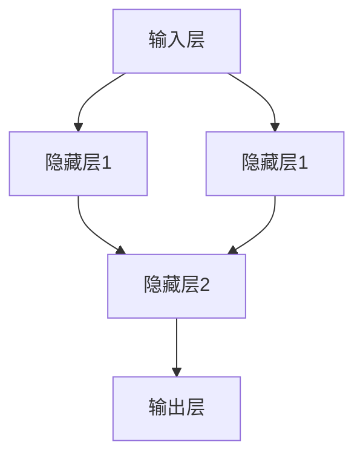

                 

### 文章标题：软件2.0的伦理规范：人工智能的责任

#### 关键词：
- 软件2.0
- 人工智能伦理
- 大模型
- 责任与合规

#### 摘要：
随着人工智能技术的迅猛发展，软件2.0时代的到来带来了前所未有的变革。本文旨在探讨在软件2.0时代，特别是大模型应用中，伦理规范的重要性及其实施方法。文章首先概述了软件2.0和AI大模型的基本概念，随后深入分析了深度学习、自然语言处理和大规模预训练模型等核心技术。接着，本文重点讨论了AI大模型的伦理问题，包括安全隐患、隐私保护和法律法规。此外，文章还探讨了AI大模型的可持续发展，提出了资源优化、环境影响评估和未来趋势展望。最后，文章通过具体案例和实践，展示了AI大模型伦理规范在企业中的应用，并提出了未来AI大模型发展的挑战和机遇。通过本文，读者将更好地理解AI大模型在软件2.0时代中的责任和伦理规范，为实际应用提供指导。

### 第一部分：软件2.0时代的AI大模型基础

#### 第1章：软件2.0与AI大模型概述

软件2.0时代是一个以用户为中心、数据驱动的时代。在这个时代，软件不再是简单的工具，而是变成了具有智能和自主学习能力的系统。AI大模型作为软件2.0的核心组件，扮演着至关重要的角色。这一章将首先介绍软件2.0时代的到来及其特点，然后分析AI大模型在软件2.0中的核心地位，并探讨企业级应用开发的新范式。

#### 1.1 软件2.0时代的到来

软件1.0时代主要是指计算机软件的早期阶段，这一时期软件的功能相对简单，主要依赖于程序员手动编写代码来完成任务。随着计算机技术的进步，软件1.0逐渐演变为软件2.0。软件2.0时代的到来，标志着软件从以功能为核心转向以用户体验和数据为核心。这一转变主要源于以下几个方面的原因：

1. **互联网的普及**：互联网的普及使得软件可以更加便捷地访问和使用，推动了软件向用户为中心的转变。
2. **大数据的兴起**：大数据技术的成熟，使得软件能够处理和分析大量的数据，从而实现更智能的决策和更个性化的服务。
3. **云计算的发展**：云计算提供了强大的计算能力和存储空间，使得软件的开发和部署变得更加灵活和高效。

在软件2.0时代，软件不再仅仅是一个静态的工具，而是变成了一个动态的、智能的、不断进化的系统。这个系统可以根据用户的行为和反馈，不断学习和优化自己的功能，提供更加个性化的服务。这种变化不仅改变了软件的形态，也改变了软件的开发和运营模式。

#### 1.1.1 从软件1.0到软件2.0的演进

软件1.0时代的特点是功能简单、依赖手工编程、注重性能优化。软件1.0的应用场景主要是在特定的业务领域，如财务管理、人事管理等领域。软件1.0的特点决定了其应用的范围和深度都受到限制。随着计算机技术的发展，软件1.0逐渐无法满足日益复杂的业务需求，这促使了软件2.0的出现。

软件2.0的特点是用户为中心、数据驱动、智能化。软件2.0的应用不再局限于特定的业务领域，而是扩展到了更多的场景，如社交媒体、电子商务、智能医疗等。软件2.0通过大数据和人工智能技术，能够实现更加智能化的决策和个性化服务。例如，在电子商务领域，软件2.0可以通过分析用户的行为数据，为用户提供个性化的购物建议。

软件2.0与软件1.0的区别主要体现在以下几个方面：

1. **开发模式**：软件2.0采用了更加灵活的开发模式，如敏捷开发和DevOps，强调快速迭代和持续交付。
2. **数据处理**：软件2.0能够处理和分析大量的数据，实现数据驱动决策。
3. **用户体验**：软件2.0注重用户体验，通过智能化的交互方式，提供更加便捷和个性化的服务。
4. **功能范围**：软件2.0的应用范围更加广泛，不再局限于特定的业务领域。

#### 1.1.2 大模型在软件2.0中的核心地位

在软件2.0时代，AI大模型成为软件系统的核心组件。AI大模型具有以下几个方面的特点：

1. **强大的学习能力**：AI大模型通过深度学习和大规模数据训练，可以自主学习并优化自己的功能，提高系统的智能化水平。
2. **广泛的应用场景**：AI大模型可以应用于各种场景，如语音识别、图像处理、自然语言处理等，为软件系统提供强大的智能支持。
3. **个性化服务能力**：AI大模型可以通过分析用户数据，提供个性化的服务，提升用户体验。

AI大模型在软件2.0中的应用，使得软件系统具备了更高的智能和自主性，能够更好地适应和满足用户需求。例如，在电子商务领域，AI大模型可以通过分析用户行为数据，为用户提供个性化的商品推荐，提高转化率和客户满意度。在医疗领域，AI大模型可以通过分析医疗数据，为医生提供诊断建议，提高诊断准确率。

#### 1.1.3 企业级应用开发的新范式

在软件2.0时代，企业级应用开发也发生了巨大的变化。传统企业级应用开发注重的是功能完整性、性能优化和安全性，而软件2.0时代的企业级应用开发更加注重用户体验、数据驱动和敏捷开发。

1. **用户体验优先**：软件2.0时代的企业级应用开发，将用户体验放在首位。通过智能化的交互设计和个性化服务，提升用户满意度。
2. **数据驱动**：软件2.0时代的企业级应用开发，通过大数据和人工智能技术，实现数据驱动决策。通过对用户数据的分析，优化产品和服务，提高业务效率。
3. **敏捷开发**：软件2.0时代的企业级应用开发，采用了敏捷开发模式，强调快速迭代和持续交付。通过不断收集用户反馈，快速调整和优化产品功能。

#### 总结

软件2.0时代是一个以用户和数据为中心的时代，AI大模型是其核心组件。在这个时代，企业级应用开发也发生了巨大的变化，更加注重用户体验、数据驱动和敏捷开发。通过AI大模型的应用，企业可以提供更加智能和个性化的服务，提升用户满意度，提高业务效率。

## 第2章：AI大模型技术基础

AI大模型技术是软件2.0时代的核心技术之一，其重要性不言而喻。本章将详细探讨AI大模型的技术基础，包括深度学习与神经网络、自然语言处理技术、大规模预训练模型原理，以及大模型构建与训练的相关技术。

### 2.1 深度学习与神经网络基础

深度学习是AI大模型的核心技术之一，它通过模拟人脑的神经网络结构，实现数据的自动学习和特征提取。神经网络是深度学习的基础，理解神经网络的基本结构和原理，对于深入掌握深度学习至关重要。

#### 2.1.1 神经网络的基本结构

神经网络由大量的神经元（或节点）组成，这些神经元通过连接（或边）相互连接，形成复杂的网络结构。一个基本的神经网络包括以下几个主要部分：

1. **输入层**：输入层接收外部数据，并将其传递给下一层。
2. **隐藏层**：隐藏层是神经网络的核心部分，负责数据的处理和特征提取。隐藏层的数量和规模可以根据任务的需求进行调整。
3. **输出层**：输出层生成最终的预测结果或决策。

神经网络的每个神经元都可以看作是一个简单的计算单元，它接收多个输入信号，通过权重和偏置进行加权求和，然后通过激活函数进行非线性变换，产生输出信号。这个过程中，神经元的输出将传递给下一层的神经元，直到最终生成输出层的输出。

以下是一个神经网络的Mermaid流程图：



#### 2.1.2 神经网络的工作原理

神经网络的工作原理可以概括为以下几个步骤：

1. **前向传播**：输入数据通过输入层进入神经网络，逐层传递到隐藏层，最后传递到输出层。在每个层次，神经元通过加权求和和激活函数生成输出。
2. **损失函数**：输出结果与真实标签进行比较，计算损失值。损失函数用于衡量预测结果与真实结果之间的差异。
3. **反向传播**：通过反向传播算法，将损失值反向传播回网络，更新神经元的权重和偏置，从而优化网络的参数。
4. **迭代训练**：重复前向传播和反向传播的过程，直到网络参数收敛，达到预设的损失值。

以下是一个神经网络工作原理的伪代码：

```python
# 前向传播
for each layer in network:
    z = weights * inputs + bias
    a = activation(z)

# 损失函数
loss = loss_function(y_true, y_pred)

# 反向传播
dz = d激活函数(z)
dweights = dz * inputs
dbias = dz

# 更新参数
weights -= learning_rate * dweights
bias -= learning_rate * dbias
```

#### 2.1.3 常见的深度学习架构

深度学习架构种类繁多，每种架构都有其独特的特点和应用场景。以下介绍几种常见的深度学习架构：

1. **卷积神经网络（CNN）**：CNN是用于图像识别和处理的主要架构，其核心思想是通过卷积操作提取图像特征。CNN的基本结构包括卷积层、池化层和全连接层。以下是一个CNN的Mermaid流程图：

    ```mermaid
    graph TD
        A[输入图像] --> B[卷积层1]
        B --> C[池化层1]
        C --> D[卷积层2]
        D --> E[池化层2]
        E --> F[全连接层]
    ```

2. **循环神经网络（RNN）**：RNN是用于序列数据处理的主要架构，其核心思想是保留历史信息，通过循环结构实现序列数据的传递。RNN包括简单的RNN、长短期记忆网络（LSTM）和门控循环单元（GRU）。以下是一个LSTM的Mermaid流程图：

    ```mermaid
    graph TD
        A[输入序列] --> B[遗忘门]
        B --> C[输入门]
        C --> D[细胞状态]
        D --> E[输出门]
        E --> F[隐藏状态]
    ```

3. **生成对抗网络（GAN）**：GAN是一种用于生成模型的主要架构，其核心思想是通过对抗训练生成与真实数据相似的数据。GAN由生成器和判别器组成，以下是一个GAN的Mermaid流程图：

    ```mermaid
    graph TD
        A[随机噪声] --> B[生成器]
        B --> C[生成数据]
        C --> D[判别器]
        D --> E[真实数据]
    ```

#### 2.1.4 深度学习优化算法

在深度学习中，优化算法用于更新网络参数，以最小化损失函数。以下介绍几种常见的深度学习优化算法：

1. **梯度下降法**：梯度下降法是最基本的优化算法，其思想是沿着损失函数的梯度方向更新参数，以最小化损失。以下是一个梯度下降的伪代码：

    ```python
    # 初始化参数
    weights = initialize_weights()

    # 迭代更新参数
    for epoch in range(num_epochs):
        for data, label in dataset:
            # 前向传播
            predicted = forward_pass(data, weights)

            # 计算损失
            loss = loss_function(label, predicted)

            # 反向传播
            gradients = backward_pass(predicted, label)

            # 更新参数
            weights -= learning_rate * gradients
    ```

2. **随机梯度下降（SGD）**：SGD是对梯度下降法的一种改进，其思想是在每个梯度计算时，随机选择一个数据样本。以下是一个SGD的伪代码：

    ```python
    # 初始化参数
    weights = initialize_weights()

    # 迭代更新参数
    for epoch in range(num_epochs):
        for sample in dataset:
            # 前向传播
            predicted = forward_pass(sample, weights)

            # 计算损失
            loss = loss_function(sample.label, predicted)

            # 反向传播
            gradients = backward_pass(predicted, sample.label)

            # 更新参数
            weights -= learning_rate * gradients
    ```

3. **Adam优化器**：Adam优化器是梯度下降法和SGD的结合体，其思想是在不同迭代次数上计算指数加权平均，以提高收敛速度。以下是一个Adam的伪代码：

    ```python
    # 初始化参数
    weights = initialize_weights()
    m = 0
    v = 0

    # 迭代更新参数
    for epoch in range(num_epochs):
        for sample in dataset:
            # 前向传播
            predicted = forward_pass(sample, weights)

            # 计算损失
            loss = loss_function(sample.label, predicted)

            # 反向传播
            gradients = backward_pass(predicted, sample.label)

            # 更新指数加权平均
            m = beta1 * m + (1 - beta1) * gradients
            v = beta2 * v + (1 - beta2) * gradients ** 2

            # 均值偏差修正
            m_hat = m / (1 - beta1 ** epoch)
            v_hat = v / (1 - beta2 ** epoch)

            # 更新参数
            weights -= learning_rate * m_hat / (sqrt(v_hat) + epsilon)
    ```

### 2.2 自然语言处理技术概览

自然语言处理（NLP）是AI大模型的重要组成部分，其目标是使计算机能够理解、生成和处理人类自然语言。NLP技术主要包括词嵌入、序列模型和注意力机制等。

#### 2.2.1 词嵌入技术

词嵌入是将单词映射到高维空间中的向量表示，用于表示单词的语义信息。常见的词嵌入方法包括：

1. **Word2Vec**：Word2Vec是刘俊仁等人在2013年提出的一种基于神经网络的语言模型，其核心思想是将单词映射到向量空间中，使得语义相似的单词在向量空间中靠近。Word2Vec包括连续词袋（CBOW）和Skip-Gram两种模型。

2. **GloVe**：GloVe（Global Vectors for Word Representation）是杰瑞·莱文斯顿等人在2014年提出的一种基于全局上下文的词嵌入方法。GloVe通过计算单词的共现矩阵，生成词向量，能够更好地捕捉单词的语义信息。

以下是一个Word2Vec的伪代码：

```python
# 初始化词向量
word_vectors = initialize_word_vectors()

# 前向传播
for context in context_words:
    prediction = dot(context_vector, word_vectors)

# 损失函数
loss = loss_function(target_word, prediction)

# 反向传播
gradients = backward_pass(prediction, target_word)

# 更新词向量
word_vectors -= learning_rate * gradients
```

#### 2.2.2 序列模型与注意力机制

序列模型是用于处理序列数据（如文本、音频、视频等）的神经网络模型，主要包括循环神经网络（RNN）和长短期记忆网络（LSTM）。

1. **RNN**：RNN是一种基于序列数据递归处理的前馈网络，其核心思想是在每个时间步上，将当前输入与上一个时间步的隐藏状态进行结合，生成当前时间步的隐藏状态。RNN的基本结构如下：

    ```mermaid
    graph TD
        A[输入序列] --> B1[RNN层1]
        B1 --> B2[RNN层2]
        B2 --> C[输出序列]
    ```

2. **LSTM**：LSTM是RNN的一种改进，其核心思想是通过引入遗忘门、输入门和输出门，有效地解决RNN的梯度消失和梯度爆炸问题。LSTM的基本结构如下：

    ```mermaid
    graph TD
        A[输入序列] --> B1[遗忘门]
        B1 --> B2[输入门]
        B2 --> B3[细胞状态]
        B3 --> B4[输出门]
        B4 --> C[隐藏状态]
    ```

注意力机制是序列模型的一种重要扩展，其核心思想是让模型能够根据当前任务的需要，自动选择关注序列中的关键部分。注意力机制通常通过计算一个权重向量，将序列中的每个元素与权重向量相乘，生成加权序列，从而实现序列的注意力分配。以下是一个简单的注意力机制的伪代码：

```python
# 初始化权重
weights = initialize_weights()

# 注意力计算
attention_weights = softmax(weights * hidden_state)

# 加权序列
weighted_sequence = attention_weights * hidden_state

# 输出
output = dot(weighted_sequence, weights_output)
```

#### 2.2.3 转换器架构详解

转换器架构（Transformer）是一种基于自注意力机制的序列到序列模型，其核心思想是通过多头自注意力机制和前馈神经网络，实现序列的建模和转换。转换器架构的基本结构如下：

1. **多头自注意力机制**：多头自注意力机制通过多个独立的注意力头，对序列中的每个元素进行自注意力计算，从而捕捉序列中的长距离依赖关系。以下是一个多头自注意力的伪代码：

    ```python
    # 输入序列
    input_sequence = ...

    # 计算自注意力
    attention_scores = dot(input_sequence, Q) * dot(input_sequence, K) / sqrt(d_k)

    # 应用softmax函数
    attention_weights = softmax(attention_scores)

    # 加权序列
    weighted_sequence = attention_weights * input_sequence

    # 输出
    output = dot(weighted_sequence, V)
    ```

2. **编码器与解码器**：编码器负责将输入序列编码成固定长度的向量表示，解码器负责将编码后的向量解码成输出序列。编码器和解码器通常由多个Transformer层堆叠而成，以下是一个简单的编码器与解码器架构的伪代码：

    ```python
    # 编码器
    for layer in encoder_layers:
        # 多头自注意力
        attention_output = multi_head_attention(input_sequence, layer)

        # 前馈神经网络
        feedforward_output = feedforward_network(attention_output)

        # 输出
        encoder_output = layer_output

    # 解码器
    for layer in decoder_layers:
        # 自注意力
        decoder_output = multi_head_attention(encoder_output, layer)

        # 编码器-解码器注意力
        attention_output = multi_head_attention(input_sequence, layer)

        # 前馈神经网络
        feedforward_output = feedforward_network(attention_output)

        # 输出
        decoder_output = layer_output
    ```

### 2.3 大规模预训练模型原理

大规模预训练模型是AI大模型技术的重要发展方向，其核心思想是在大规模数据集上进行预训练，然后微调到具体任务上。大规模预训练模型主要包括自监督学习、迁移学习和微调技术。

#### 2.3.1 预训练的概念与意义

预训练是指在大规模数据集上对神经网络进行预训练，使其具备一定的语言理解能力或特征提取能力。预训练的意义在于：

1. **提高模型性能**：通过在大规模数据集上进行预训练，模型可以学习到丰富的语言知识和特征，从而提高在具体任务上的性能。
2. **减少训练数据需求**：预训练模型可以在少量数据上进行微调，从而减少训练数据的需求，降低训练成本。
3. **通用性**：预训练模型可以在不同的任务和数据集上应用，具有较好的通用性。

以下是一个预训练的基本流程：

```python
# 预训练
for epoch in range(num_epochs):
    for batch in data_loader:
        # 前向传播
        output = model(batch.input)

        # 损失函数
        loss = loss_function(batch.label, output)

        # 反向传播
        gradients = backward_pass(output, batch.label)

        # 更新参数
        optimizer.step(gradients)

# 微调
for epoch in range(num_epochs):
    for batch in data_loader:
        # 前向传播
        output = model(batch.input)

        # 损失函数
        loss = loss_function(batch.label, output)

        # 反向传播
        gradients = backward_pass(output, batch.label)

        # 更新参数
        optimizer.step(gradients)
```

#### 2.3.2 自监督学习方法

自监督学习是一种无需人工标注数据，利用未标记数据进行训练的方法。自监督学习方法包括：

1. **掩码语言建模（MLM）**：掩码语言建模是一种常用的自监督学习方法，其核心思想是在输入序列中随机掩码一部分单词，然后通过预测掩码单词来训练模型。

    ```python
    # 掩码语言建模
    for epoch in range(num_epochs):
        for batch in data_loader:
            # 掩码输入
            masked_input = mask_input(batch.input)

            # 前向传播
            output = model(masked_input)

            # 损失函数
            loss = masked_loss_function(batch.input, output)

            # 反向传播
            gradients = backward_pass(output, batch.input)

            # 更新参数
            optimizer.step(gradients)
    ```

2. **掩码图像建模（MIM）**：掩码图像建模是一种用于图像识别的自监督学习方法，其核心思想是在图像中随机掩码一部分像素，然后通过预测掩码像素来训练模型。

    ```python
    # 掩码图像建模
    for epoch in range(num_epochs):
        for batch in data_loader:
            # 掩码输入
            masked_input = mask_input(batch.input)

            # 前向传播
            output = model(masked_input)

            # 损失函数
            loss = masked_loss_function(batch.input, output)

            # 反向传播
            gradients = backward_pass(output, batch.input)

            # 更新参数
            optimizer.step(gradients)
    ```

#### 2.3.3 迁移学习与微调技术

迁移学习是指将已经在大规模数据集上预训练好的模型，迁移到新的任务或数据集上进行微调。微调技术包括：

1. **固定权重微调**：在迁移学习过程中，只对模型的最后一层或少数层进行微调，而其他层的权重保持不变。

    ```python
    # 固定权重微调
    for epoch in range(num_epochs):
        for batch in data_loader:
            # 前向传播
            output = model(batch.input)

            # 损失函数
            loss = loss_function(batch.label, output)

            # 反向传播
            gradients = backward_pass(output, batch.label)

            # 更新参数
            optimizer.step(gradients)
    ```

2. **全层微调**：在迁移学习过程中，对模型的全部层进行微调。

    ```python
    # 全层微调
    for epoch in range(num_epochs):
        for batch in data_loader:
            # 前向传播
            output = model(batch.input)

            # 损失函数
            loss = loss_function(batch.label, output)

            # 反向传播
            gradients = backward_pass(output, batch.label)

            # 更新参数
            optimizer.step(gradients)
    ```

### 2.4 AI大模型构建与训练

构建和训练AI大模型是一个复杂的过程，需要考虑数据预处理、模型架构设计、训练与评估等多个方面。以下介绍AI大模型构建与训练的相关技术。

#### 2.4.1 数据预处理

数据预处理是构建AI大模型的重要步骤，其目标是清洗、格式化和增强数据，以提高模型的性能。数据预处理包括以下几个步骤：

1. **数据清洗**：去除数据中的噪声和异常值，提高数据质量。
2. **数据格式化**：将数据转换为适合模型训练的格式，如将文本数据转换为词向量，将图像数据转换为像素矩阵等。
3. **数据增强**：通过增加数据的多样性，提高模型的泛化能力。数据增强方法包括随机旋转、翻转、缩放等。

以下是一个简单的数据预处理流程：

```python
# 数据清洗
cleaned_data = clean_data(raw_data)

# 数据格式化
formatted_data = format_data(cleaned_data)

# 数据增强
augmented_data = augment_data(formatted_data)
```

#### 2.4.2 大模型架构设计

大模型架构设计是构建AI大模型的关键步骤，其目标是选择合适的模型架构，以实现最佳的性能和效率。大模型架构设计包括以下几个步骤：

1. **确定任务类型**：根据任务类型（如分类、回归、序列生成等），选择合适的模型架构。
2. **选择基础模型**：选择具有较好性能和通用性的基础模型，如CNN、RNN、Transformer等。
3. **模型扩展与调整**：根据任务需求，对基础模型进行扩展和调整，如增加隐藏层、调整网络结构等。

以下是一个简单的模型架构设计流程：

```python
# 确定任务类型
task_type = determine_task_type()

# 选择基础模型
base_model = select_base_model(task_type)

# 模型扩展与调整
custom_model = extend_and_adjust_model(base_model, task_type)
```

#### 2.4.3 训练与评估

训练与评估是构建AI大模型的最后一步，其目标是训练模型并评估其性能。训练与评估包括以下几个步骤：

1. **数据集划分**：将数据集划分为训练集、验证集和测试集，用于模型训练和性能评估。
2. **模型训练**：使用训练集对模型进行训练，通过优化算法更新模型参数。
3. **性能评估**：使用验证集和测试集评估模型性能，选择最佳模型。

以下是一个简单的训练与评估流程：

```python
# 数据集划分
train_data, validation_data, test_data = split_data(data)

# 模型训练
model.train(train_data)

# 性能评估
validation_loss = model.evaluate(validation_data)
test_loss = model.evaluate(test_data)
```

#### 2.4.4 大模型应用场景分析

AI大模型在各个领域都有广泛的应用，以下分析几个典型应用场景：

1. **自然语言处理**：AI大模型在自然语言处理领域有广泛的应用，如文本分类、情感分析、机器翻译等。通过预训练模型（如BERT、GPT）进行微调，可以实现高精度的文本处理。
2. **计算机视觉**：AI大模型在计算机视觉领域有广泛的应用，如图像分类、目标检测、图像生成等。通过预训练模型（如ResNet、VGG）进行微调，可以实现高精度的图像识别。
3. **语音识别**：AI大模型在语音识别领域有广泛的应用，如语音转文字、语音合成等。通过预训练模型（如WaveNet、Transformer）进行微调，可以实现高精度的语音处理。
4. **推荐系统**：AI大模型在推荐系统领域有广泛的应用，如商品推荐、音乐推荐、新闻推荐等。通过预训练模型（如DIN、BERT）进行微调，可以实现高精度的推荐。

#### 2.4.5 大模型安全与隐私保护

随着AI大模型的应用越来越广泛，其安全与隐私保护问题也日益突出。以下介绍大模型安全与隐私保护的相关技术：

1. **数据加密**：通过数据加密技术，保护数据在传输和存储过程中的安全性。常用的加密算法包括AES、RSA等。
2. **隐私保护算法**：通过隐私保护算法，保护数据隐私。常用的隐私保护算法包括差分隐私、联邦学习等。
3. **安全协议**：通过安全协议，确保数据在传输过程中的完整性和真实性。常用的安全协议包括SSL/TLS等。

#### 2.4.6 法规与标准

随着AI大模型的应用越来越广泛，相关的法规和标准也日益完善。以下介绍国内外与AI大模型相关的法规和标准：

1. **国内法规**：国内与AI大模型相关的法规包括《网络安全法》、《数据安全法》等。这些法规明确了数据安全、隐私保护等方面的要求。
2. **国际法规**：国际与AI大模型相关的法规包括《通用数据保护条例》（GDPR）、《加州消费者隐私法案》（CCPA）等。这些法规也提供了数据安全、隐私保护等方面的规范。
3. **行业标准**：国内外还制定了多个与AI大模型相关的行业标准，如《人工智能伦理规范》、《人工智能数据安全标准》等。这些标准为AI大模型的应用提供了指导和规范。

### 2.5 大模型安全与隐私保护

随着AI大模型的广泛应用，其安全性和隐私保护问题愈发突出。这一节将深入探讨大模型在安全与隐私保护方面的挑战和解决方案。

#### 2.5.1 大模型安全隐患

AI大模型在带来巨大便利的同时，也伴随着一系列安全隐患。这些隐患主要包括以下几个方面：

1. **数据泄露风险**：大模型通常需要大量的数据来进行训练和优化，这些数据可能包含敏感信息，如个人身份信息、金融数据等。一旦数据泄露，可能会导致严重的隐私侵犯和财产损失。
2. **模型攻击**：AI大模型可能受到各种形式的攻击，如对抗性攻击、模型抽取和重放攻击等。对抗性攻击可以通过微调输入数据，使得模型产生错误的预测结果；模型抽取和重放攻击则可以通过获取模型的内部结构和参数，对模型进行恶意利用。
3. **模型篡改**：恶意用户可能试图篡改模型，以实现非法目的。例如，在金融风控模型中，恶意用户可能试图通过篡改模型参数，使得风险控制失效。

#### 2.5.2 隐私保护措施

为了应对AI大模型的安全和隐私保护挑战，可以采取以下几种措施：

1. **数据加密技术**：数据加密是保护数据安全的基本措施。通过使用强加密算法（如AES、RSA），可以将数据加密存储和传输，防止数据泄露。
2. **差分隐私**：差分隐私是一种有效的隐私保护方法，其核心思想是在数据处理过程中引入噪声，使得单个数据的贡献无法被单独识别。通过差分隐私，可以保护用户隐私，同时保证数据的可用性。
3. **联邦学习**：联邦学习是一种分布式学习方法，其核心思想是多个参与方共同训练模型，而不需要交换原始数据。通过联邦学习，可以在保护数据隐私的同时，实现模型的协同训练和优化。

#### 2.5.3 法规与标准

随着AI大模型的应用日益普及，相关法律法规和标准也逐步完善。以下介绍国内外与AI大模型相关的法规和标准：

1. **国内法规**：中国已经出台了多项与AI大模型相关的法律法规，如《网络安全法》、《数据安全法》等。这些法规对数据安全、隐私保护等方面提出了具体要求，为AI大模型的应用提供了法律依据。
2. **国际法规**：国际上，欧盟的《通用数据保护条例》（GDPR）和美国的《加州消费者隐私法案》（CCPA）等法规对数据隐私保护提出了严格的要求。这些法规不仅对企业的数据处理行为进行了规范，也对AI大模型的应用提出了挑战。
3. **行业标准**：国内外还制定了多项与AI大模型相关的行业标准，如《人工智能伦理规范》、《人工智能数据安全标准》等。这些标准为AI大模型的应用提供了具体的指导和规范。

#### 2.5.4 安全与隐私保护框架

为了有效地应对AI大模型的安全和隐私保护挑战，可以构建一个综合的安全与隐私保护框架。这个框架包括以下几个关键组成部分：

1. **数据安全**：确保数据在采集、存储、传输和处理过程中的安全性。具体措施包括数据加密、访问控制、身份认证等。
2. **模型安全**：保护模型免受各种形式的攻击，如对抗性攻击、模型抽取和重放攻击等。具体措施包括对抗训练、模型混淆、差分隐私等。
3. **隐私保护**：通过数据去标识化、差分隐私、联邦学习等技术，保护用户隐私。同时，确保数据的可用性和模型的可解释性。
4. **合规管理**：确保AI大模型的应用符合相关法律法规和行业标准。具体措施包括建立合规管理组织、制定合规流程和标准等。

#### 2.5.5 实际案例分析

以下通过几个实际案例分析AI大模型在安全与隐私保护方面的应用：

1. **金融风控**：在金融风控领域，AI大模型可以用于信用评分、欺诈检测等。为了保护用户隐私，可以采用差分隐私和联邦学习等技术，确保数据隐私的同时，实现模型的协同训练和优化。
2. **医疗健康**：在医疗健康领域，AI大模型可以用于疾病诊断、药物研发等。为了保护患者隐私，可以采用数据加密、差分隐私等技术，确保数据在传输和存储过程中的安全性。
3. **社交网络**：在社交网络领域，AI大模型可以用于内容推荐、用户行为分析等。为了保护用户隐私，可以采用数据去标识化、差分隐私等技术，防止用户数据被滥用。

#### 2.5.6 未来发展趋势

随着AI大模型技术的不断进步，其安全与隐私保护也将面临新的挑战和机遇。未来，以下几个发展趋势值得关注：

1. **隐私计算**：隐私计算是一种在保护数据隐私的前提下，实现数据计算和共享的技术。未来，隐私计算将在AI大模型应用中发挥重要作用，为数据隐私保护提供新的解决方案。
2. **联邦学习**：联邦学习作为一种分布式学习方法，将在AI大模型的安全与隐私保护中发挥关键作用。未来，随着联邦学习技术的不断成熟，其应用范围将更加广泛。
3. **法律法规完善**：随着AI大模型应用的增加，相关法律法规和标准也将逐步完善。未来，法律法规将在AI大模型的安全与隐私保护中发挥更加重要的作用，为AI大模型的应用提供法律保障。

### 2.6 大模型可持续发展

随着AI大模型技术的快速发展，其可持续发展问题日益受到关注。可持续发展不仅关乎技术本身的进步，还涉及到社会、经济和环境等多个方面。本节将探讨大模型可持续发展的重要性和实践策略。

#### 2.6.1 资源优化与节能

AI大模型的训练和推理过程需要大量的计算资源和能源消耗，这给环境带来了巨大的负担。为了实现可持续发展，需要采取以下资源优化和节能措施：

1. **模型压缩**：通过模型压缩技术，如剪枝、量化、蒸馏等，可以显著减少模型参数的数量，降低模型的计算复杂度。这不仅可以提高模型训练和推理的效率，还可以减少能源消耗。
2. **异构计算**：异构计算是指利用不同类型的计算资源（如CPU、GPU、TPU等）进行分布式计算。通过合理分配计算任务，可以提高整体计算效率，降低能源消耗。
3. **节能优化**：通过优化算法和数据存储，降低AI大模型的能耗。例如，可以采用节能的神经网络架构，减少不必要的计算和内存占用。

#### 2.6.2 环境影响评估

为了实现可持续发展，需要对AI大模型的环境影响进行全面的评估。这包括以下几个方面：

1. **能耗评估**：评估AI大模型在训练和推理过程中的能源消耗，包括计算资源、存储资源和网络资源。
2. **碳排放评估**：计算AI大模型在训练和推理过程中产生的碳排放量，评估其对环境的影响。
3. **环境影响报告**：发布AI大模型的环境影响报告，公开模型能耗和碳排放数据，提高透明度。

#### 2.6.3 未来趋势展望

未来，AI大模型的可持续发展将面临以下趋势：

1. **绿色计算**：随着环保意识的提高，绿色计算将成为AI大模型可持续发展的重要方向。绿色计算旨在通过优化计算资源和能源利用，实现AI大模型的环境友好型发展。
2. **可再生能源**：为了减少AI大模型对环境的影响，可以采用可再生能源（如太阳能、风能）供电，减少对化石燃料的依赖。
3. **协同创新**：可持续发展需要政府、企业和研究机构等各方的协同创新。通过跨学科合作和资源整合，可以推动AI大模型技术的可持续发展。

#### 2.6.4 可持续发展实践案例

以下是一些AI大模型可持续发展的实践案例：

1. **百度文心大模型**：百度文心大模型采用绿色计算和异构计算技术，实现高效节能。同时，百度还致力于推动绿色数据中心的建设，提高整体能源利用效率。
2. **谷歌AI大模型**：谷歌AI大模型在训练过程中采用节能的神经网络架构和分布式计算技术，降低能源消耗。此外，谷歌还承诺到2030年实现100%使用可再生能源。
3. **微软AI大模型**：微软AI大模型采用模型压缩和异构计算技术，提高计算效率和能源利用效率。同时，微软还积极参与环保项目，推动可持续发展。

#### 总结

AI大模型的可持续发展是一个复杂而重要的课题，涉及到技术、环境、社会等多个方面。通过资源优化、节能优化和环境影响评估，可以推动AI大模型技术的可持续发展。未来，随着绿色计算和可再生能源技术的发展，AI大模型将在实现可持续发展的道路上发挥更加重要的作用。

### 2.7 AI大模型开发工具与资源

在AI大模型开发过程中，选择合适的工具和资源是成功的关键。本节将介绍主流的深度学习框架、开发环境搭建、实用资源与教程，帮助开发者高效地构建和优化AI大模型。

#### 2.7.1 主流深度学习框架对比

目前，市面上有多个流行的深度学习框架，每个框架都有其独特的优势和特点。以下对比几个主流深度学习框架：

1. **TensorFlow**：由谷歌开发，是目前最受欢迎的深度学习框架之一。TensorFlow提供丰富的API和工具，支持多种类型的神经网络结构，并具有良好的生态系统。其优势在于可扩展性和灵活性，但相较于其他框架，TensorFlow的配置和使用相对复杂。

2. **PyTorch**：由Facebook开发，近年来在学术界和工业界取得了显著的地位。PyTorch以其动态计算图和简洁的API著称，使得模型设计和调试更加直观。其优势在于易用性和灵活性，但相较于TensorFlow，PyTorch的分布式训练和性能优化方面有待改进。

3. **JAX**：由谷歌开发，是一种新兴的深度学习框架，具有自动微分和高性能计算的特点。JAX的优势在于其强大的自动微分能力和高效的计算性能，适用于大规模和复杂模型的训练。但其生态系统和社区支持相对较弱。

4. **其他框架**：除了上述框架，还有如Keras、MXNet、Theano等深度学习框架。Keras作为TensorFlow和Theano的高层API，提供了简洁的接口和丰富的工具，适用于快速原型开发和模型实验。MXNet是由亚马逊开发的深度学习框架，具有高性能和灵活的模型定义能力。

在选择深度学习框架时，开发者应根据项目需求、开发经验和团队技能进行综合考虑。

#### 2.7.2 开发环境搭建

搭建深度学习开发环境是AI大模型开发的第一步。以下介绍如何在常见操作系统上搭建深度学习环境：

1. **硬件要求**：深度学习模型训练通常需要高性能的计算资源。建议使用GPU（如NVIDIA显卡）来加速训练过程。此外，需要安装CUDA和cuDNN，这两个库是GPU加速训练的关键组件。

2. **软件安装与配置**：
   - **Windows**：在Windows上，可以安装Visual Studio，然后通过命令行安装CUDA和cuDNN。接下来，安装Python和深度学习框架（如TensorFlow或PyTorch）。
   - **Linux**：在Linux上，可以通过包管理器（如apt或yum）安装CUDA、cuDNN和深度学习框架。安装完成后，需要配置环境变量，以便在命令行中调用相关库。
   - **MacOS**：在MacOS上，可以通过Homebrew安装CUDA和cuDNN。安装深度学习框架（如PyTorch）时，建议使用conda环境管理器，以便更好地管理依赖关系。

以下是一个简单的开发环境搭建步骤：

```bash
# 安装CUDA
sudo apt-get install cuda

# 安装cuDNN
sudo apt-get install libnvinfer-dev

# 安装Python
sudo apt-get install python3

# 安装PyTorch
pip3 install torch torchvision torchaudio

# 检查安装
python3 -c "import torch; print(torch.cuda.is_available())"
```

#### 2.7.3 实用资源与教程

为了帮助开发者更好地掌握AI大模型开发，以下推荐一些实用的资源与教程：

1. **在线课程**：Coursera、edX、Udacity等在线教育平台提供了丰富的深度学习和AI课程，适合不同层次的开发者。例如，斯坦福大学的《深度学习》课程和fast.ai的《深度学习基础》课程都是很好的学习资源。

2. **论坛与社群**：GitHub、Stack Overflow、Reddit等平台是开发者交流和学习的好去处。在这些平台上，开发者可以提问、解答问题、分享经验和资源。

3. **相关书籍推荐**：以下推荐几本深度学习和AI领域的经典书籍：
   - 《深度学习》（Ian Goodfellow、Yoshua Bengio、Aaron Courville著）
   - 《Python深度学习》（François Chollet著）
   - 《深度学习与计算机视觉》（张三丰著）

4. **优秀论文与研究报告**：阅读顶级会议和期刊的论文是了解最新研究成果和趋势的有效途径。NIPS、ICML、CVPR等会议和《Nature》等期刊是重要的学术资源。

5. **国际会议与研讨会信息**：参加国际会议和研讨会是拓宽视野、结识同行的机会。例如，NeurIPS、ICML、CVPR等会议是深度学习和AI领域的顶级会议，开发者可以关注这些会议的最新动态。

#### 总结

AI大模型开发是一个复杂而富有挑战性的过程，需要开发者具备扎实的理论基础和实践经验。通过选择合适的深度学习框架、搭建高效的开发环境，并利用丰富的学习资源和工具，开发者可以更高效地构建和优化AI大模型，为实际应用创造价值。

### 第3章：AI大模型应用实践

在AI大模型技术日益发展的今天，其实际应用已经深入到各行各业，带来了前所未有的变革。本章将详细探讨AI大模型在不同领域中的应用实践，通过具体项目案例，展示大模型的开发过程、关键技术以及实际效果。

#### 3.1 实践项目概述

为了更好地理解AI大模型的应用，我们将介绍以下几个实际项目案例：

1. **智能问答系统**：该项目旨在构建一个能够回答用户问题的智能问答系统，为用户提供及时、准确的答案。
2. **语音识别与合成**：该项目旨在实现高准确率的语音识别和自然流畅的语音合成，提升用户体验。
3. **图像识别与分类**：该项目旨在构建一个能够自动识别和分类图像内容的系统，应用于图像识别和智能监控等领域。

#### 3.2 项目开发流程

以下是AI大模型项目开发的典型流程：

1. **需求分析**：明确项目目标和需求，确定应用场景和业务目标。
2. **数据收集与预处理**：收集相关数据，并进行数据清洗、格式化和增强，为模型训练提供高质量的数据集。
3. **模型设计**：根据应用需求，选择合适的模型架构和算法，设计大模型的结构。
4. **模型训练与优化**：使用高质量的数据集对模型进行训练，并通过调整超参数和优化算法，提高模型性能。
5. **测试与评估**：使用验证集和测试集对模型进行评估，确保模型在不同数据集上的表现稳定和可靠。
6. **部署与运维**：将训练好的模型部署到生产环境中，进行实时推理和预测，并提供用户接口。
7. **迭代优化**：根据用户反馈和实际应用效果，不断优化模型和系统，提升用户体验和系统性能。

#### 3.3 项目案例分析

以下是几个具体项目的详细分析：

##### 案例一：智能问答系统

智能问答系统是一个基于自然语言处理和大规模预训练模型的应用。其核心目标是实现高效的问答匹配和回答生成。

1. **需求分析**：用户在搜索引擎、论坛或社交媒体上提出问题，系统需要快速、准确地提供答案。需求包括多语言支持、多领域覆盖和高准确率。
2. **数据收集与预处理**：收集大量的问题和答案数据，并进行清洗、格式化和标注。数据来源包括公开数据集、社交媒体和用户反馈等。
3. **模型设计**：采用转换器架构（Transformer），如BERT或GPT，构建问答系统模型。模型包括编码器（处理输入问题）和解码器（生成答案）两部分。
4. **模型训练与优化**：使用大规模预训练模型，如BERT，进行微调和优化。通过自监督学习和迁移学习技术，提高模型在不同领域和语言上的性能。
5. **测试与评估**：使用验证集和测试集对模型进行评估，指标包括准确率、响应时间和用户满意度。通过迭代优化，不断提升模型性能。
6. **部署与运维**：将训练好的模型部署到服务器，提供API接口供前端应用调用。系统运行在云平台上，确保高可用性和可扩展性。
7. **迭代优化**：根据用户反馈和实际应用效果，不断优化模型和系统，如增加新的领域、提升回答质量等。

**关键技术和挑战**：
- **多语言支持**：实现多语言问答，需要处理不同语言的语法和语义差异，增加模型的复杂性。
- **高准确率**：确保模型能够准确理解和回答各种类型的问题，需要大量高质量的数据集和有效的模型训练策略。
- **实时响应**：在满足准确率和响应时间之间找到平衡，确保系统能够快速响应用户提问。

##### 案例二：语音识别与合成

语音识别与合成是一个集自然语言处理和语音技术于一体的应用。其核心目标是实现准确、流畅的语音识别和自然流畅的语音合成。

1. **需求分析**：语音识别和合成为用户提供便捷的语音交互方式，适用于智能助手、车载导航和智能音箱等领域。需求包括高准确率、低延迟和多语言支持。
2. **数据收集与预处理**：收集大量的语音数据和文本数据，并进行标注和清洗。数据来源包括公开语音数据集、用户语音记录和合成语音库。
3. **模型设计**：采用深度神经网络（如RNN、LSTM、Transformer）构建语音识别模型，采用WaveNet或GPT等模型进行语音合成。
4. **模型训练与优化**：使用大规模数据集对语音识别模型进行训练，通过优化算法（如SGD、Adam）和超参数调整，提高模型性能。对语音合成模型进行预训练和微调，确保合成语音的自然流畅性。
5. **测试与评估**：使用测试集评估模型性能，包括准确率、延迟和用户满意度。通过交叉验证和A/B测试，优化模型参数和系统架构。
6. **部署与运维**：将训练好的模型部署到服务器，提供语音识别和合成的API接口。系统运行在分布式计算环境中，确保高效处理大量语音请求。
7. **迭代优化**：根据用户反馈和应用效果，不断优化模型和系统，提升语音识别和合成的准确率和用户体验。

**关键技术和挑战**：
- **多语言支持**：处理不同语言的语音特征和语调，实现多语言语音识别和合成。
- **低延迟**：优化模型结构和算法，确保语音识别和合成的响应时间满足实时交互需求。
- **高准确率**：通过大量数据训练和模型优化，提高语音识别的准确率和稳定性。

##### 案例三：图像识别与分类

图像识别与分类是一个广泛应用于计算机视觉领域的应用。其核心目标是自动识别和分类图像中的对象和场景。

1. **需求分析**：图像识别与分类应用于安防监控、医疗诊断、自动驾驶等领域。需求包括高准确率、实时处理能力和多类别识别。
2. **数据收集与预处理**：收集大量的标注图像数据，包括不同类别和场景的图像。数据来源包括公开数据集、用户上传和第三方数据提供商。
3. **模型设计**：采用卷积神经网络（如VGG、ResNet、Inception）构建图像识别模型，通过卷积层、池化层和全连接层进行特征提取和分类。
4. **模型训练与优化**：使用大规模图像数据集对模型进行训练，通过梯度下降和优化算法调整模型参数，提高分类准确率。采用迁移学习和数据增强技术，提高模型在不同类别和场景上的泛化能力。
5. **测试与评估**：使用测试集对模型进行评估，包括准确率、召回率和F1分数。通过交叉验证和误差分析，优化模型结构和超参数。
6. **部署与运维**：将训练好的模型部署到边缘设备或云计算平台，提供图像识别和分类的API接口。系统采用分布式计算和负载均衡，确保高效处理图像数据。
7. **迭代优化**：根据实际应用效果和用户反馈，不断优化模型和系统，提高图像识别的准确率和处理速度。

**关键技术和挑战**：
- **多类别识别**：处理不同类别和场景的图像，实现高精度的分类。
- **实时处理**：优化模型结构和算法，确保图像识别系统能够实时处理大量图像数据。
- **鲁棒性**：提高模型对光照、视角和噪声的鲁棒性，确保在不同环境下稳定运行。

#### 总结

AI大模型在智能问答系统、语音识别与合成、图像识别与分类等领域具有广泛的应用。通过实际项目案例，我们可以看到AI大模型在开发过程中需要关注需求分析、数据收集与预处理、模型设计、训练与优化、测试与评估、部署与运维等关键环节。随着AI大模型技术的不断进步，其在各行业中的应用将更加深入和广泛，为各领域带来巨大的变革和创新。

### 第4章：AI大模型伦理规范实践

随着AI大模型技术的广泛应用，其伦理问题日益凸显。AI大模型的决策过程和结果可能对个人和社会产生深远影响，因此，伦理规范的制定和实践至关重要。本章将深入探讨AI大模型伦理规范的框架、审查流程及具体案例。

#### 4.1 伦理规范框架

AI大模型伦理规范框架旨在确保AI大模型的设计、开发、部署和应用过程中，遵守道德原则和法律法规。以下是一个典型的AI大模型伦理规范框架：

1. **基本原则**：
   - **透明性**：确保AI大模型的决策过程和结果对用户和公众透明。
   - **公平性**：避免AI大模型对特定群体造成歧视和不公平待遇。
   - **责任性**：明确AI大模型开发者和使用者的责任，确保对模型决策和行为负责。
   - **隐私保护**：保护用户隐私，确保数据的安全性和保密性。
   - **可持续性**：关注AI大模型的环境影响，推动可持续发展。

2. **应用场景**：
   - **智能医疗**：确保AI大模型在医疗诊断、药物研发等方面的公正性和准确性。
   - **自动驾驶**：确保AI大模型在自动驾驶中的安全性和可靠性。
   - **金融风控**：确保AI大模型在信用评估、欺诈检测等方面的公平性和透明性。
   - **社会媒体**：确保AI大模型在内容审核、推荐算法等方面的公正性和透明性。

#### 4.2 伦理审查流程

伦理审查是确保AI大模型符合伦理规范的重要环节。以下是一个典型的AI大模型伦理审查流程：

1. **审查组织**：成立专门的伦理审查委员会，负责审查AI大模型项目。
2. **审查标准**：
   - **透明性**：审查模型的决策过程和结果，确保对用户和公众透明。
   - **公平性**：评估模型对特定群体的影响，确保不存在歧视和不公平。
   - **隐私保护**：审查数据处理和存储过程，确保用户隐私得到保护。
   - **责任性**：明确模型开发者和使用者的责任，确保对决策和行为负责。
   - **可持续性**：评估模型对环境的影响，确保符合可持续发展原则。
3. **审查流程**：
   - **项目申请**：开发者提交AI大模型项目申请，包括项目背景、目标、模型设计等。
   - **初步审查**：伦理审查委员会对项目申请进行初步审查，确保符合审查标准。
   - **详细审查**：伦理审查委员会对项目进行详细审查，包括模型算法、数据处理、应用场景等。
   - **反馈与修改**：开发者根据审查意见进行修改，重新提交审查。
   - **最终审查**：伦理审查委员会对修改后的项目进行最终审查，决定是否通过。

#### 4.3 案例分析

以下是几个具体的AI大模型伦理规范实践案例：

##### 案例一：智能驾驶中的伦理问题

智能驾驶是AI大模型应用的重要领域，但其伦理问题不容忽视。以下是一个关于智能驾驶中的伦理问题分析：

1. **情境描述**：在自动驾驶车辆中，当遇到无法同时满足所有安全需求的情况时，如紧急避让行人或车辆，需要由AI大模型做出决策。
2. **伦理挑战**：如何在确保最大程度保护乘客和行人安全的同时，遵守交通规则和伦理原则？
3. **解决方案**：
   - **多目标优化**：设计AI大模型，在决策过程中综合考虑多个目标，如行人安全、车辆安全、交通规则遵守等。
   - **情景模拟**：通过大量模拟实验，测试AI大模型在不同情境下的决策效果，确保其符合伦理要求。
   - **伦理审查**：在模型开发和应用过程中，进行伦理审查，确保模型设计和决策符合伦理规范。

##### 案例二：医疗AI系统的伦理考量

医疗AI系统在疾病诊断、药物研发等方面具有巨大潜力，但也面临伦理挑战。以下是一个关于医疗AI系统的伦理问题分析：

1. **情境描述**：在医疗AI系统中，模型可能基于患者历史数据和基因信息进行诊断，但这些数据可能包含敏感信息。
2. **伦理挑战**：如何保护患者隐私，确保数据的安全性和保密性？
3. **解决方案**：
   - **数据保护**：采用加密技术保护患者数据，确保数据在传输和存储过程中的安全性。
   - **隐私保护算法**：采用差分隐私等算法，确保在数据分析和模型训练过程中，无法单独识别出特定个体。
   - **伦理审查**：在模型开发和应用过程中，进行伦理审查，确保数据处理和模型决策符合伦理规范。

##### 案例三：社会媒体AI算法的伦理影响

社会媒体AI算法在内容审核、推荐算法等方面具有重要作用，但也可能带来伦理问题。以下是一个关于社会媒体AI算法的伦理问题分析：

1. **情境描述**：社会媒体平台使用AI算法进行内容审核和推荐，可能对用户的行为和观点产生影响。
2. **伦理挑战**：如何确保AI算法的公正性和透明性，避免对特定群体进行歧视？
3. **解决方案**：
   - **透明算法设计**：公开AI算法的设计原理和决策过程，提高算法的透明度和可信度。
   - **公平性评估**：定期评估AI算法的公平性和偏见，确保算法对用户和内容提供商公平。
   - **用户参与**：鼓励用户参与算法设计和优化，提高算法的多样性和公正性。

#### 总结

AI大模型的伦理规范实践是确保其合理、公正和可持续发展的关键。通过建立伦理规范框架、制定审查流程和具体案例分析，可以引导AI大模型开发者和使用者遵守道德原则和法律法规，保障用户权益和社会利益。随着AI大模型技术的不断进步，伦理规范的实践将日益重要，为AI大模型的应用提供可靠保障。

### 第5章：AI大模型责任与法律规范

随着AI大模型的广泛应用，其带来的社会影响和法律挑战也日益增加。AI大模型在各个领域，如医疗、金融、自动驾驶等，发挥着越来越重要的作用，但同时也带来了责任归属、法律风险等方面的复杂问题。本章将深入探讨AI大模型的责任与法律规范，分析相关法律法规及其在实践中的挑战和应对策略。

#### 5.1 法律责任与伦理责任

在讨论AI大模型的责任时，我们首先需要区分法律责任和伦理责任。法律责任是指根据法律条款，AI大模型开发者和使用者应承担的法定责任；而伦理责任则是指根据道德原则和社会价值观，AI大模型开发者和使用者应承担的道德责任。

1. **法律责任定义**：
   - **产品责任**：AI大模型作为一种产品，开发者需要对其性能、安全性和可靠性承担法律责任。如果AI大模型导致用户或第三方遭受损失，开发者可能需要承担法律责任。
   - **侵权责任**：AI大模型可能侵犯他人的知识产权、隐私权等，开发者需要承担侵权责任。
   - **合同责任**：AI大模型在合同履行过程中，如未按照约定提供产品或服务，开发者需要承担合同责任。

2. **伦理责任定义**：
   - **透明性**：开发者有责任确保AI大模型的决策过程透明，使公众能够理解和监督模型的行为。
   - **公平性**：开发者有责任确保AI大模型不会对特定群体产生歧视和不公平待遇，促进社会公平。
   - **隐私保护**：开发者有责任保护用户的隐私，确保数据的安全性和保密性。
   - **可持续性**：开发者有责任关注AI大模型对环境和社会的影响，推动可持续发展。

3. **法律责任与伦理责任关系**：
   - 法律责任和伦理责任是相互关联的。在某些情况下，伦理责任可能转化为法律责任，如违反隐私保护规定可能导致侵权诉讼。
   - 在其他情况下，伦理责任可能先于法律责任，如开发者根据道德原则主动改进模型，从而减少潜在的法律风险。

#### 5.2 相关法律法规

在全球范围内，各国已开始制定与AI大模型相关的法律法规，以确保其合法、合规的应用。以下介绍一些主要的国内外法律法规：

1. **国内相关法律法规**：
   - **《中华人民共和国网络安全法》**：该法明确了网络运营者的安全保护义务，包括数据安全、用户隐私保护等方面。
   - **《中华人民共和国数据安全法》**：该法强化了对数据安全的保护，包括数据收集、存储、处理和传输等环节。
   - **《中华人民共和国个人信息保护法》**：该法明确了个人信息保护的基本原则和操作规范，对个人信息处理者的行为进行了严格规范。
   - **《中华人民共和国人工智能发展行动计划（2021-2025年）》**：该计划提出了一系列政策目标和措施，推动AI健康、可持续发展。

2. **国际相关法律法规**：
   - **《通用数据保护条例》（GDPR）**：欧盟推出的GDPR是世界上最严格的数据保护法之一，对数据收集、处理和传输等行为进行了详细规范。
   - **《加州消费者隐私法案》（CCPA）**：美国加州的CCPA保护了消费者的隐私权利，对数据收集和处理行为提出了严格要求。
   - **《人工智能伦理准则》**：联合国教科文组织发布了《人工智能伦理准则》，为全球人工智能伦理提供了指导。
   - **《欧洲人工智能法案》**：欧盟正在制定《欧洲人工智能法案》，旨在规范AI的开发、部署和应用，确保其符合伦理和社会标准。

#### 5.3 案例分析

以下是几个具体的AI大模型法律责任和伦理责任案例分析：

##### 案例一：自动驾驶事故责任划分

自动驾驶事故责任划分是一个备受关注的问题。以下是一个关于自动驾驶事故责任划分的案例分析：

1. **情境描述**：在自动驾驶车辆发生事故时，如何划分责任？
2. **法律责任分析**：
   - **制造商责任**：如果事故是由于自动驾驶系统设计缺陷导致的，制造商可能需要承担产品责任。
   - **车主责任**：如果车主未能按照说明正确操作自动驾驶系统，导致事故，车主可能需要承担一定的责任。
   - **第三方责任**：如果事故是由于第三方（如行人、其他车辆）的过错导致的，第三方可能需要承担主要责任。
3. **伦理责任分析**：
   - **安全性**：开发者有责任确保自动驾驶系统的安全性和可靠性，以最大程度减少事故发生的风险。
   - **透明性**：开发者需要向公众明确自动驾驶系统的功能、限制和操作方法，确保用户了解系统的行为。

##### 案例二：AI医疗诊断的法律争议

AI医疗诊断在医疗领域具有巨大潜力，但也引发了一系列法律争议。以下是一个关于AI医疗诊断的法律争议案例分析：

1. **情境描述**：在AI医疗诊断中，如果诊断结果与实际诊断结果不一致，如何处理法律责任和伦理责任？
2. **法律责任分析**：
   - **医疗机构责任**：如果AI医疗诊断系统由医疗机构使用，医疗机构可能需要承担法律责任，如因诊断错误导致的医疗事故。
   - **开发者责任**：如果AI医疗诊断系统存在设计缺陷或未按照规定进行测试和验证，开发者可能需要承担法律责任。
3. **伦理责任分析**：
   - **准确性**：开发者有责任确保AI医疗诊断系统的准确性和可靠性，确保其能够为患者提供正确的诊断建议。
   - **透明性**：开发者需要向医疗机构和患者明确AI医疗诊断系统的性能和局限性，确保各方了解系统的使用方法。

##### 案例三：AI算法歧视的法律应对

AI算法歧视问题在就业、金融、教育等领域引起了广泛关注。以下是一个关于AI算法歧视的法律应对案例分析：

1. **情境描述**：在AI算法决策中，如果出现对特定群体的歧视，如何应对法律责任和伦理责任？
2. **法律责任分析**：
   - **开发者责任**：开发者需要确保AI算法的公平性和透明性，避免对特定群体产生歧视。
   - **企业责任**：企业需要承担因AI算法歧视导致的法律责任，如因歧视行为引发的侵权诉讼。
3. **伦理责任分析**：
   - **公平性**：开发者有责任确保AI算法在不同群体中的公平性，避免因算法偏见导致的不公平待遇。
   - **责任意识**：开发者需要提高责任意识，关注AI算法对特定群体的潜在影响，并采取措施防止歧视。

#### 总结

AI大模型的责任与法律规范是一个复杂而重要的话题。通过区分法律责任和伦理责任，分析相关法律法规，以及具体案例分析，我们可以更好地理解和应对AI大模型带来的法律责任和伦理挑战。在制定和完善法律规范的过程中，需要各方共同努力，确保AI大模型的应用合法、合规、公正，为社会带来积极影响。

### 第6章：AI大模型合规与监管

随着AI大模型的广泛应用，其合规和监管问题日益突出。合规是指AI大模型在开发、部署和应用过程中，遵守法律法规和行业标准的过程。监管是指政府、行业协会和其他机构对AI大模型进行监督和管理的行为。本章将深入探讨AI大模型的合规要求、监管框架、企业合规策略以及监管挑战与应对策略。

#### 6.1 合规要求与监管框架

AI大模型的合规要求主要包括以下几个方面：

1. **数据合规**：数据是AI大模型的核心资产，数据合规是确保AI大模型合法、合规应用的基础。数据合规的要求包括：
   - **数据收集和处理**：明确数据收集和处理的目的、范围和方式，确保数据的合法性和合规性。
   - **数据存储和安全**：确保数据存储的安全性，防止数据泄露、丢失和滥用。
   - **数据隐私保护**：遵守数据隐私保护法律法规，保护用户个人信息的安全和隐私。

2. **模型合规**：AI大模型的设计、开发和部署也需要符合相关法律法规和行业标准。模型合规的要求包括：
   - **算法公平性**：确保AI大模型在不同群体中的公平性，避免对特定群体产生歧视。
   - **透明性**：确保AI大模型的可解释性，使决策过程透明，便于公众监督。
   - **安全性**：确保AI大模型的安全性和可靠性，防止模型被恶意攻击或篡改。

3. **伦理合规**：AI大模型在开发、部署和应用过程中，需要遵守伦理规范，确保其行为符合道德原则和社会价值观。伦理合规的要求包括：
   - **透明性**：确保AI大模型的决策过程和结果对用户和社会透明。
   - **公正性**：确保AI大模型不会对特定群体产生不公平待遇，促进社会公平。
   - **责任性**：明确AI大模型开发者和使用者的责任，确保对模型决策和行为负责。

监管框架是指政府、行业协会和其他机构对AI大模型进行监督和管理的法律、法规和规章制度。以下是一些常见的监管框架：

1. **国内监管框架**：
   - **《中华人民共和国网络安全法》**：该法明确了网络运营者的安全保护义务，包括数据安全、用户隐私保护等方面。
   - **《中华人民共和国数据安全法》**：该法强化了对数据安全的保护，包括数据收集、存储、处理和传输等环节。
   - **《中华人民共和国个人信息保护法》**：该法明确了个人信息保护的基本原则和操作规范，对个人信息处理者的行为进行了严格规范。

2. **国际监管框架**：
   - **《通用数据保护条例》（GDPR）**：欧盟推出的GDPR是世界上最严格的数据保护法之一，对数据收集、处理和传输等行为进行了详细规范。
   - **《加州消费者隐私法案》（CCPA）**：美国加州的CCPA保护了消费者的隐私权利，对数据收集和处理行为提出了严格要求。
   - **《联合国人工智能全球契约》**：联合国教科文组织发布了《人工智能全球契约》，旨在推动全球人工智能的合法、公正和可持续发展。

#### 6.2 企业合规策略

企业合规策略是指企业为遵守法律法规和行业标准，确保AI大模型合法、合规应用所采取的措施。以下是企业合规策略的关键要素：

1. **合规管理组织**：建立专门的合规管理组织，负责制定和执行合规策略，确保企业各层级都能遵守合规要求。

2. **合规流程设计**：设计合规流程，包括数据收集、处理、存储、使用和销毁等环节，确保每个环节都符合法律法规和行业标准。

3. **合规培训与意识提升**：定期对员工进行合规培训，提高员工的合规意识和技能，确保员工了解合规要求，并能够在工作中遵守。

4. **合规审计与监督**：定期进行合规审计，确保AI大模型的开发、部署和应用过程符合法律法规和行业标准。同时，建立监督机制，及时发现和纠正合规问题。

5. **合规报告与公示**：定期向政府、行业协会和其他利益相关方报告合规情况，公开AI大模型的合规信息，提高透明度和公信力。

#### 6.3 监管挑战与应对策略

AI大模型的监管面临诸多挑战，以下是一些主要挑战及应对策略：

1. **数据隐私保护**：
   - **挑战**：AI大模型通常需要处理大量的个人数据，如何保护这些数据的安全性和隐私性是一个重大挑战。
   - **应对策略**：采用加密技术保护数据传输和存储过程中的安全性；采用隐私保护算法（如差分隐私）确保数据处理的合规性。

2. **算法公平性**：
   - **挑战**：AI大模型可能在不同群体中产生歧视，如何确保算法的公平性是一个重要问题。
   - **应对策略**：采用公平性评估方法（如统计测试、可视化分析）评估算法的公平性；通过数据增强和算法改进消除偏见。

3. **透明性和可解释性**：
   - **挑战**：AI大模型的决策过程通常复杂且不透明，如何提高模型的透明性和可解释性是一个难题。
   - **应对策略**：采用可解释性方法（如决策树、可视化分析）解释模型的决策过程；采用透明性设计（如模型日志、透明接口）提高模型的透明度。

4. **监管法律滞后**：
   - **挑战**：随着AI大模型技术的快速发展，相关法律法规和标准可能无法及时跟上技术的步伐。
   - **应对策略**：积极参与政策制定和标准制定过程，提供技术解决方案和合规建议；建立内部合规制度，确保AI大模型在法律出现之前就符合合规要求。

5. **全球监管差异**：
   - **挑战**：不同国家和地区的监管政策和法规可能存在较大差异，如何在全球范围内确保合规是一个复杂问题。
   - **应对策略**：了解和遵守不同国家和地区的法律法规，建立全球合规策略；建立跨地区合作机制，共同推动全球AI合规标准的制定。

#### 总结

AI大模型的合规与监管是确保其合法、公正和可持续发展的重要保障。通过建立合规要求、监管框架、企业合规策略以及应对监管挑战，可以确保AI大模型在开发、部署和应用过程中遵守法律法规和行业标准，保护用户权益，促进社会公平。随着AI大模型技术的不断进步，合规和监管将越来越重要，为AI大模型的应用提供坚实的法律和社会基础。

### 第7章：AI大模型伦理与可持续发展

在AI大模型技术的快速发展背景下，伦理与可持续发展问题日益成为关注焦点。AI大模型的广泛应用不仅带来了技术进步和商业价值，同时也对人类社会的伦理道德和环境产生深远影响。本章将探讨AI大模型伦理与可持续发展的理念、融合以及实践案例，为未来技术发展提供指导和借鉴。

#### 7.1 可持续发展理念

可持续发展理念强调在满足当前需求的同时，不损害后代满足自身需求的能力。在AI大模型领域，可持续发展理念主要体现在以下几个方面：

1. **技术公平性**：确保AI大模型的应用不会加剧社会不平等，使不同群体都能公平地享受技术带来的便利。
2. **环境友好性**：优化AI大模型的技术架构和算法，减少能源消耗和碳排放，推动绿色计算的发展。
3. **数据伦理**：在数据处理和共享过程中，尊重用户隐私，确保数据的合法、合规使用。
4. **社会责任**：企业和社会应承担AI大模型带来的社会责任，包括公平就业、环境保护、社会福祉等方面。

#### 7.2 伦理与可持续发展的融合

AI大模型伦理与可持续发展的融合，需要从技术、法律、社会等多个层面进行协调和推进。以下是一些关键点：

1. **技术伦理规范**：在AI大模型的设计和开发过程中，融入伦理考量，制定符合伦理原则的技术规范，确保技术应用的合法性和道德性。
2. **数据伦理管理**：建立数据伦理管理制度，包括数据收集、处理、存储和共享等方面的伦理规范，确保数据使用符合法律法规和道德原则。
3. **社会责任履行**：企业和社会应积极履行社会责任，通过技术创新和合作，推动可持续发展目标的实现。
4. **法律与政策支持**：政府应制定和完善与AI大模型相关的法律法规和政策，为AI大模型伦理与可持续发展提供法律保障。

#### 7.3 可持续发展实践案例

以下是一些AI大模型伦理与可持续发展的实践案例：

##### 案例一：AI在环境保护中的应用

AI大模型在环境保护中的应用，有助于提高环境监测和管理效率，推动可持续发展。以下是一个关于AI大模型在环境保护中应用的案例：

1. **项目背景**：某环保组织希望通过AI大模型实现对空气质量、水质等环境参数的实时监测和预测。
2. **技术实现**：
   - **数据收集**：收集空气质量、水质等环境数据，包括历史数据和实时数据。
   - **模型训练**：采用深度学习技术，训练空气质量预测模型和水质监测模型。
   - **结果分析**：通过模型分析，实时监测和预测环境参数，为环境保护决策提供数据支持。
3. **伦理考量**：
   - **数据隐私**：确保数据收集和处理过程符合隐私保护法律法规，保护用户隐私。
   - **公平性**：确保模型在不同地区和群体中的公平性，避免对特定群体产生不利影响。
   - **透明性**：模型决策过程和结果对公众透明，便于监督和反馈。

##### 案例二：AI在医疗健康领域的贡献

AI大模型在医疗健康领域的应用，有助于提高诊断准确性、优化治疗方案，从而改善患者的生活质量。以下是一个关于AI大模型在医疗健康领域应用的案例：

1. **项目背景**：某医院希望通过AI大模型辅助医生进行疾病诊断和治疗方案设计。
2. **技术实现**：
   - **数据收集**：收集大量医学影像和病例数据，包括各种疾病的诊断结果和治疗记录。
   - **模型训练**：采用深度学习技术，训练疾病诊断模型和治疗方案优化模型。
   - **结果应用**：通过模型分析，辅助医生进行疾病诊断和治疗方案设计，提高医疗服务的质量和效率。
3. **伦理考量**：
   - **数据安全**：确保医学数据的安全性和保密性，防止数据泄露和滥用。
   - **患者隐私**：保护患者个人信息，确保患者隐私权得到尊重。
   - **透明性**：确保模型决策过程和结果对医生和患者透明，便于患者了解和监督。

##### 案例三：AI在扶贫领域的实践

AI大模型在扶贫领域的应用，有助于提高扶贫工作的精准度和效率，推动贫困地区的可持续发展。以下是一个关于AI大模型在扶贫领域应用的案例：

1. **项目背景**：某公益组织希望通过AI大模型实现贫困人口的精准识别和扶贫资源的优化配置。
2. **技术实现**：
   - **数据收集**：收集贫困人口的基本信息、收入状况、教育资源等数据。
   - **模型训练**：采用深度学习技术，训练贫困人口识别模型和资源优化模型。
   - **结果应用**：通过模型分析，精准识别贫困人口，优化扶贫资源的配置，提高扶贫工作的效果。
3. **伦理考量**：
   - **数据隐私**：确保数据收集和处理过程符合隐私保护法律法规，保护用户隐私。
   - **公平性**：确保模型在不同地区和群体中的公平性，避免对特定群体产生不利影响。
   - **透明性**：模型决策过程和结果对公众透明，便于监督和反馈。

#### 总结

AI大模型伦理与可持续发展的融合，是确保技术健康、公正和可持续发展的关键。通过在技术、法律、社会等多个层面进行协调和推进，可以推动AI大模型在环境保护、医疗健康、扶贫等领域发挥更大的作用。实践案例展示了AI大模型在实现可持续发展中的潜力，同时也揭示了伦理考量的重要性。随着技术的不断进步，AI大模型伦理与可持续发展的实践将更加深入和广泛，为构建美好未来提供有力支持。

### 第8章：未来展望

随着AI大模型技术的不断进步，其应用领域也将不断扩展，为各行业带来前所未有的变革。本章将探讨AI大模型的发展趋势、伦理规范面临的挑战以及AI大模型与企业战略的融合。

#### 8.1 AI大模型发展趋势

AI大模型的发展趋势主要体现在以下几个方面：

1. **技术革新**：AI大模型将继续朝着模型规模更大、计算能力更强的方向迈进。随着计算能力和存储技术的提升，大规模预训练模型将变得更加普及，并在各个领域发挥关键作用。
2. **多模态融合**：未来AI大模型将实现多模态数据的处理和融合，如将文本、图像、音频等多种类型的数据整合在一起，实现更加智能化和综合化的应用。
3. **自主进化**：AI大模型将具备自主学习和进化能力，通过不断学习用户行为和需求，实现自我优化和适应性提升，提供更加个性化、高效的服务。
4. **分布式与边缘计算**：为了提高AI大模型的实时性和响应速度，分布式和边缘计算技术将在AI大模型中得到广泛应用，实现计算资源的灵活调配和高效利用。

#### 8.2 伦理规范挑战

随着AI大模型技术的快速发展，伦理规范面临的挑战也日益严峻。以下是一些主要的伦理规范挑战：

1. **透明性和可解释性**：当前AI大模型的决策过程通常非常复杂，缺乏透明性和可解释性。如何提高AI大模型的透明性和可解释性，使其决策过程更加公开和透明，是一个亟待解决的问题。
2. **算法公平性**：AI大模型在处理数据时可能存在偏见，导致对特定群体的歧视。如何确保算法的公平性，避免算法偏见，是AI大模型伦理规范面临的重要挑战。
3. **数据隐私**：AI大模型通常需要处理大量的个人数据，如何保护用户隐私，防止数据泄露和滥用，是另一个重要的伦理问题。
4. **责任归属**：在AI大模型导致事故或损失时，如何明确责任归属，确保相关方承担相应的责任，是一个复杂的法律和伦理问题。

#### 8.3 AI大模型与企业战略

AI大模型技术的快速发展，为企业提供了巨大的机遇，同时也带来了新的挑战。企业应如何制定和实施AI大模型战略，以抓住机遇、应对挑战？

1. **战略规划**：企业应制定清晰的AI大模型战略，明确AI大模型在业务发展中的角色和定位。战略规划应包括技术路线、应用场景、人才引进和资金投入等方面。
2. **技术创新**：企业应积极投入AI大模型技术的研究和开发，不断探索新的应用场景和解决方案，保持技术领先优势。
3. **数据管理**：企业应建立完善的数据管理体系，确保数据的质量、安全和合规性。通过数据治理，实现数据的有序管理和有效利用。
4. **人才引进与培养**：企业应重视AI大模型领域的人才引进和培养，建立专业化的团队，为AI大模型项目的成功提供人才保障。
5. **伦理合规**：企业应高度重视AI大模型的伦理合规问题，建立健全的伦理规范体系，确保AI大模型的应用符合道德原则和法律法规。

#### 总结

AI大模型技术的发展趋势将不断扩展其应用领域，为社会带来巨大的变革。同时，AI大模型伦理规范面临的挑战也需要企业和社会共同努力，确保技术的健康、公正和可持续发展。企业应制定明确的AI大模型战略，积极投入技术创新，建立完善的数据管理和人才引进体系，同时高度重视伦理合规问题，为AI大模型的应用提供坚实的基础。

### 附录：AI大模型开发工具与资源

在AI大模型开发过程中，选择合适的工具和资源是成功的关键。以下将对主流深度学习框架、开发环境搭建、实用资源与教程进行详细介绍。

#### A.1 主流深度学习框架对比

当前市场上主流的深度学习框架包括TensorFlow、PyTorch和JAX等。以下对比这些框架的优缺点：

1. **TensorFlow**：
   - **优点**：TensorFlow具有丰富的API和工具，支持多种类型的神经网络结构，并具有良好的生态系统。其与Google Cloud的集成较好，适合大规模分布式训练。
   - **缺点**：TensorFlow的配置和使用相对复杂，动态计算图可能影响调试和性能优化。
   - **适用场景**：适合科研和工业界，特别是在大规模分布式训练和模型部署方面有优势。

2. **PyTorch**：
   - **优点**：PyTorch以其动态计算图和简洁的API著称，使得模型设计和调试更加直观。其与CUDA的良好集成，有助于提升训练速度。
   - **缺点**：相较于TensorFlow，PyTorch在分布式训练和性能优化方面有待改进。
   - **适用场景**：适合快速原型开发和模型实验，尤其是在研究和工业界得到广泛应用。

3. **JAX**：
   - **优点**：JAX具有强大的自动微分能力和高效的计算性能，适用于大规模和复杂模型的训练。其与Python的深度集成，便于开发和调试。
   - **缺点**：JAX的生态系统和社区支持相对较弱，适用于特定场景。
   - **适用场景**：适用于需要高性能自动微分和高计算性能的应用，如科学计算和机器学习。

4. **其他框架**：
   - **Keras**：Keras作为TensorFlow和Theano的高层次API，提供了简洁的接口和丰富的工具，适用于快速原型开发和模型实验。
   - **MXNet**：MXNet是由亚马逊开发的深度学习框架，具有高性能和灵活的模型定义能力，适用于大规模分布式训练。

#### A.2 开发环境搭建

搭建深度学习开发环境是AI大模型开发的第一步。以下介绍如何在常见操作系统上搭建深度学习环境：

1. **Windows**：
   - **安装Python**：通过官方网站下载并安装Python。
   - **安装CUDA和cuDNN**：从NVIDIA官方网站下载CUDA和cuDNN，根据系统版本进行安装。
   - **配置环境变量**：将CUDA和cuDNN的路径添加到系统环境变量中，以便在命令行中调用相关库。
   - **安装深度学习框架**：使用pip命令安装TensorFlow或PyTorch。

2. **Linux**：
   - **安装CUDA和cuDNN**：使用包管理器（如apt或yum）安装CUDA和cuDNN。
   - **安装Python**：通过包管理器安装Python。
   - **安装深度学习框架**：使用pip命令安装TensorFlow或PyTorch。

3. **MacOS**：
   - **安装CUDA和cuDNN**：通过Homebrew安装CUDA和cuDNN。
   - **安装Python**：通过包管理器安装Python。
   - **安装深度学习框架**：使用pip命令安装TensorFlow或PyTorch。

以下是一个简单的开发环境搭建步骤：

```bash
# 安装CUDA
sudo apt-get install cuda

# 安装cuDNN
sudo apt-get install libnvinfer-dev

# 安装Python
sudo apt-get install python3

# 安装TensorFlow
pip3 install tensorflow

# 检查安装
python3 -c "import tensorflow as tf; print(tf.reduce_sum(tf.random.normal([1000, 1000])))"
```

#### A.3 实用资源与教程

为了帮助开发者更好地掌握AI大模型开发，以下推荐一些实用的资源与教程：

1. **在线课程**：
   - **《深度学习》**（斯坦福大学）：由Andrew Ng教授主讲，是深度学习领域的经典课程。
   - **《自然语言处理与深度学习》**（慕尼黑大学）：由Yoav Goldberg教授主讲，专注于自然语言处理和深度学习。

2. **论坛与社群**：
   - **GitHub**：提供丰富的深度学习和AI项目代码和资源。
   - **Stack Overflow**：开发者可以在此平台提问和解答深度学习和AI相关问题。

3. **相关书籍推荐**：
   - **《深度学习》**（Ian Goodfellow、Yoshua Bengio、Aaron Courville著）：深度学习领域的经典教材。
   - **《Python深度学习》**（François Chollet著）：适合初学者和实践者。

4. **优秀论文与研究报告**：
   - **NeurIPS、ICML、CVPR等会议**：发布最新的深度学习和AI研究成果。
   - **《Nature》等期刊**：报道深度学习和AI领域的最新进展。

5. **国际会议与研讨会信息**：
   - **NeurIPS**：国际神经网络大会，是深度学习和AI领域的顶级会议。
   - **ICML**：国际机器学习大会，涵盖了广泛的机器学习和深度学习研究领域。
   - **CVPR**：计算机视觉和模式识别会议，是计算机视觉领域的顶级会议。

通过以上资源与教程，开发者可以更好地掌握AI大模型开发的核心技术和最佳实践，为实际应用提供有力支持。

### 附录 B：AI大模型常见问题与解答

在AI大模型开发过程中，开发者可能会遇到各种技术难题和常见问题。以下是一些常见问题及其解答，以帮助开发者更好地应对这些挑战。

#### 1. 什么是AI大模型？

AI大模型是指通过深度学习技术，利用大量数据进行训练的复杂神经网络模型。这些模型具有强大的学习能力，可以处理和解决各种复杂任务，如图像识别、自然语言处理、语音识别等。

#### 2. 如何选择合适的AI大模型框架？

选择合适的AI大模型框架取决于具体应用场景和需求。以下是几种常见框架的优缺点：

- **TensorFlow**：适用于大规模分布式训练和模型部署，具有良好的生态系统和工具支持，但配置和使用较为复杂。
- **PyTorch**：以简洁的API和动态计算图著称，适合快速原型开发和模型调试，但分布式训练和性能优化方面有待改进。
- **JAX**：具有强大的自动微分能力和高效的计算性能，适用于大规模和复杂模型的训练，但社区支持相对较弱。

#### 3. 如何处理AI大模型的过拟合问题？

过拟合是AI大模型在训练数据上表现良好，但在未知数据上表现不佳的问题。以下是一些解决过拟合问题的方法：

- **增加数据量**：收集更多的训练数据，以提高模型的泛化能力。
- **数据增强**：通过旋转、缩放、翻转等操作，增加数据的多样性。
- **正则化**：添加正则项（如L1、L2正则化）到损失函数中，降低模型复杂度。
- **Dropout**：在训练过程中随机丢弃部分神经元，减少模型对特定训练样本的依赖。

#### 4. 如何优化AI大模型的训练速度？

优化AI大模型的训练速度是提高研发效率的重要手段。以下是一些优化策略：

- **批量大小**：选择合适的批量大小可以提高训练速度和准确性。
- **学习率调度**：使用学习率调度策略（如余弦退火、指数衰减）调整学习率，以避免模型过早饱和。
- **并行计算**：利用GPU、TPU等并行计算资源，加速模型训练。
- **模型压缩**：通过剪枝、量化、蒸馏等技术，减少模型参数和计算量。

#### 5. AI大模型在医疗领域有哪些应用？

AI大模型在医疗领域具有广泛的应用，包括：

- **疾病诊断**：利用图像识别技术，辅助医生进行疾病诊断，如癌症筛查、肺炎检测等。
- **药物研发**：通过分子对接、生成对抗网络等技术，加速新药研发和筛选。
- **个性化治疗**：根据患者的基因信息、病历数据等，提供个性化的治疗方案。

#### 6. 如何确保AI大模型的安全和隐私保护？

确保AI大模型的安全和隐私保护是应用AI技术的重要保障。以下是一些关键措施：

- **数据加密**：使用加密算法保护数据传输和存储过程中的安全性。
- **隐私保护算法**：采用差分隐私、联邦学习等技术，保护用户隐私。
- **安全协议**：使用SSL/TLS等安全协议，确保数据传输的完整性和真实性。
- **合规管理**：建立合规管理组织，制定合规流程和标准，确保AI大模型的应用符合法律法规和道德规范。

通过以上常见问题与解答，开发者可以更好地应对AI大模型开发过程中的挑战，提高研发效率和模型性能。

