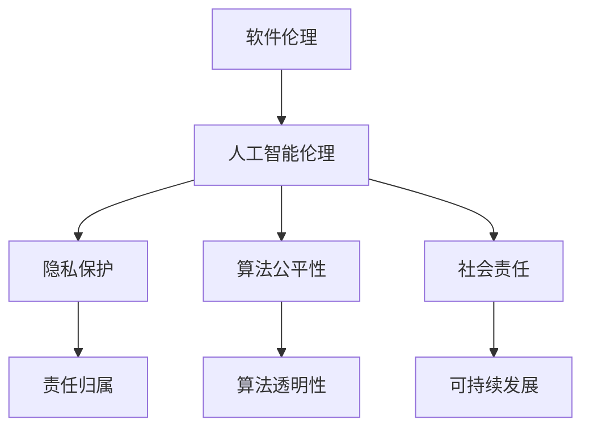
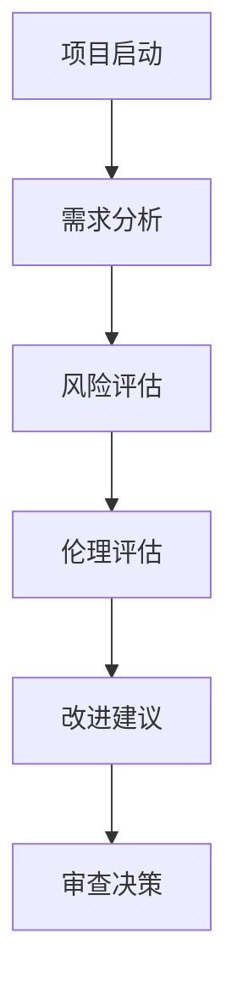
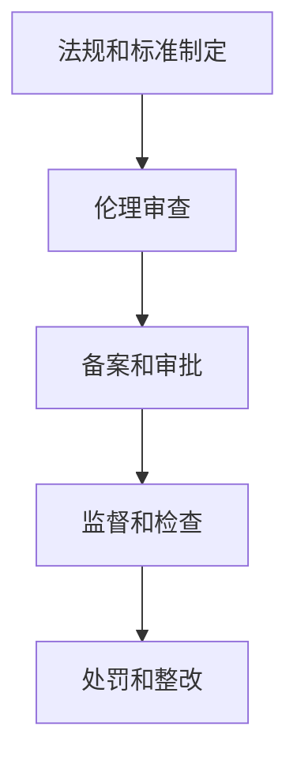

                 

### 文章标题

《软件 2.0 的伦理规范：人工智能的责任》

> 关键词：软件伦理，人工智能，责任，规范，监管，审查，教育，法律法规

> 摘要：本文从软件伦理和人工智能责任的视角，系统地探讨了软件 2.0 时代的伦理规范。首先，回顾了软件伦理的发展历程及其重要性，接着介绍了人工智能伦理规范的基本原则和挑战。然后，深入探讨了人工智能责任的概念、划分及其实际应用。在此基础上，分析了软件伦理与人工智能责任的联系，并探讨了其实施与监督机制。随后，通过案例研究和趋势分析，展望了软件伦理与人工智能责任的未来发展。最后，提出了伦理教育的必要性、法律法规的完善方向及其实施挑战。本文旨在为读者提供一个全面、深入的视角，以促进软件 2.0 时代的人工智能伦理建设。

---

### 第一部分：软件伦理与人工智能责任

#### 1. 软件伦理概述

软件伦理是指在软件开发、使用和维护过程中，处理人与人、人与系统、系统与系统之间关系的道德原则和规范。软件伦理的重要性主要体现在以下几个方面：

- **保障用户权益**：软件伦理规范确保用户在使用软件时的隐私、安全和公平性。
- **维护社会稳定**：良好的软件伦理有助于构建和谐的社会环境，防止技术滥用带来的负面影响。
- **促进技术发展**：软件伦理规范有助于引导技术朝着更加负责任、可持续的方向发展。

**1.1 软件伦理的重要性**

软件伦理的重要性可以从以下几个方面来理解：

- **道德责任**：软件开发者有责任确保软件的设计、开发和部署不会对社会和用户造成负面影响。
- **法律合规**：软件伦理规范有助于企业遵守相关法律法规，降低法律风险。
- **商业信誉**：具备良好软件伦理的企业往往更容易获得用户信任，提升市场竞争力。
- **社会责任**：软件伦理规范有助于企业承担社会责任，推动社会进步。

**1.2 软件伦理的发展历程**

软件伦理的发展历程可以追溯到计算机科学的起源。早期，计算机科学家主要关注技术本身的发展，但随着计算机应用的普及，软件伦理问题逐渐引起了广泛关注。以下是一些重要的里程碑：

- **1960s：**计算机科学家第一次提出了软件伦理的问题，并开始探讨软件对社会的影响。
- **1980s：**软件伦理逐渐成为计算机科学教育的一部分，许多大学开设了相关课程。
- **1990s：**互联网的兴起使得软件伦理问题更加复杂，隐私保护、网络安全等问题受到重视。
- **2000s：**随着人工智能和大数据技术的发展，软件伦理问题变得更加重要。

**1.3 软件伦理的主要议题**

软件伦理的主要议题包括但不限于以下方面：

- **隐私保护**：如何保护用户的个人隐私，防止数据泄露。
- **网络安全**：如何确保软件系统的安全，防止黑客攻击和数据篡改。
- **算法公平性**：如何确保算法的公平性，避免算法歧视和偏见。
- **责任归属**：如何明确软件设计和开发过程中的责任归属。

---

### 第二部分：人工智能伦理规范

#### 2. 人工智能伦理规范

人工智能伦理规范是指为人工智能系统设计、开发和部署过程中提供道德指导的一系列原则和标准。人工智能伦理规范的重要性主要体现在以下几个方面：

- **促进技术健康发展**：规范的制定有助于引导人工智能技术朝着更加负责任、可持续的方向发展。
- **保障社会公共利益**：规范的制定有助于保障社会公共利益，防止人工智能技术的滥用。
- **增强公众信任**：规范的制定有助于增强公众对人工智能技术的信任，降低技术恐惧和抵触情绪。

**2.1 人工智能伦理的挑战**

人工智能伦理面临的挑战主要包括以下几个方面：

- **技术复杂性**：人工智能技术的复杂性使得伦理问题的识别和处理变得更加困难。
- **算法透明度**：算法的不透明性使得人们难以理解算法的决策过程，增加了伦理风险。
- **隐私保护**：人工智能系统在处理大量用户数据时，如何保护用户隐私成为一个重大挑战。
- **算法歧视**：算法可能基于历史数据中的偏见导致歧视，如何防止算法歧视成为一个重要议题。

**2.2 人工智能伦理规范的基本原则**

人工智能伦理规范的基本原则包括以下几个方面：

- **公正性**：确保人工智能系统的决策过程公平、公正，避免歧视。
- **透明性**：确保人工智能系统的决策过程透明，便于监督和审计。
- **责任感**：明确人工智能系统的责任归属，确保责任承担。
- **隐私保护**：确保用户隐私得到充分保护，防止数据滥用。
- **可持续发展**：确保人工智能技术的开发和应用不会对环境和社会造成负面影响。

**2.3 国际人工智能伦理规范概述**

国际人工智能伦理规范主要包括以下几个方面：

- **联合国教科文组织**：联合国教科文组织发布了《人工智能伦理建议》，提出了人工智能发展的道德原则。
- **欧盟**：欧盟发布了《人工智能伦理指南》，明确了人工智能系统的伦理要求和审核流程。
- **美国**：美国发布了《人工智能道德准则》，强调了人工智能的透明性、责任感和可持续性。
- **中国**：中国发布了《新一代人工智能伦理规范》，提出了人工智能发展的伦理要求和基本原则。

---

### 第三部分：人工智能责任

#### 3. 人工智能责任

人工智能责任是指在人工智能系统的设计、开发、部署和使用过程中，各相关方应承担的责任。人工智能责任的重要性主要体现在以下几个方面：

- **确保技术安全**：明确责任有助于确保人工智能系统的安全，防止技术滥用和事故发生。
- **保护用户权益**：明确责任有助于保护用户的合法权益，防止隐私泄露和权益受损。
- **促进技术进步**：明确责任有助于推动人工智能技术的健康发展，提高技术水平。

**3.1 人工智能责任的概念**

人工智能责任包括以下几个方面：

- **设计责任**：设计者负责确保人工智能系统的设计合理、安全、可靠。
- **开发责任**：开发者负责确保人工智能系统的开发过程符合道德和伦理要求。
- **部署责任**：部署者负责确保人工智能系统的部署和运行符合相关法律法规和伦理规范。
- **使用责任**：使用者负责确保在使用人工智能系统时遵守相关伦理规范，不滥用技术。

**3.2 人工智能责任的划分**

人工智能责任的划分可以从以下几个方面进行：

- **企业责任**：企业作为人工智能系统的开发者、部署者，应承担主要责任。
- **政府责任**：政府作为监管机构，应承担监督和规范人工智能发展的责任。
- **社会责任**：社会各界应共同参与，共同承担人工智能责任。
- **用户责任**：用户在使用人工智能系统时，应遵守相关伦理规范，合理使用技术。

**3.3 人工智能责任的实际应用**

人工智能责任在实际应用中具有重要意义，以下是一些实际应用场景：

- **自动驾驶**：自动驾驶汽车的设计、开发、部署和运营各方应明确各自的责任，确保车辆的安全运行。
- **医疗诊断**：医疗诊断人工智能系统的开发、部署和使用各方应明确各自的责任，确保诊断结果的准确性和公正性。
- **金融风控**：金融风控人工智能系统的开发、部署和使用各方应明确各自的责任，确保风险控制的科学性和公正性。

---

### 第四部分：软件伦理与人工智能责任的联系

#### 4. 软件伦理与人工智能责任的联系

软件伦理与人工智能责任之间存在紧密的联系。软件伦理为人工智能责任提供了道德基础和规范，而人工智能责任则为软件伦理的实施提供了具体操作指南。以下从几个方面分析软件伦理与人工智能责任的联系：

**4.1 软件伦理在人工智能中的应用**

软件伦理在人工智能中的应用主要体现在以下几个方面：

- **隐私保护**：人工智能系统在处理大量用户数据时，应遵循软件伦理中的隐私保护原则，确保用户数据的安全和隐私。
- **算法公平性**：人工智能系统的算法设计应遵循软件伦理中的公平性原则，避免算法歧视和偏见。
- **社会责任**：人工智能系统的开发和部署应承担社会责任，关注对社会和环境的影响。
- **责任归属**：在人工智能系统中，明确各方的责任归属，有助于在事故发生时进行责任追究。

**4.2 人工智能责任对软件伦理的影响**

人工智能责任对软件伦理的影响主要体现在以下几个方面：

- **加强伦理意识**：明确人工智能责任有助于提高软件开发者和使用者的伦理意识，促进软件伦理的实施。
- **规范技术发展**：人工智能责任规范有助于引导人工智能技术的健康发展，防止技术滥用和伦理风险。
- **推动法律法规完善**：人工智能责任规范有助于推动相关法律法规的完善，为软件伦理提供法律保障。

**4.3 软件伦理与人工智能责任的综合分析**

软件伦理与人工智能责任的综合分析有助于我们更好地理解二者的关系：

- **共同目标**：软件伦理和人工智能责任都旨在促进技术的健康发展，保障社会公共利益。
- **相互作用**：软件伦理为人工智能责任提供了道德基础和规范，而人工智能责任则为软件伦理的实施提供了具体操作指南。
- **动态发展**：随着人工智能技术的不断进步，软件伦理和人工智能责任将不断发展和完善，以适应新的技术挑战。

---

### 第五部分：人工智能伦理审查机制

#### 5. 人工智能伦理审查机制

人工智能伦理审查机制是指为保障人工智能系统在设计和开发过程中符合伦理规范，而建立的一系列审查流程和标准。人工智能伦理审查机制的必要性主要体现在以下几个方面：

- **确保技术安全**：审查机制有助于发现和消除潜在的安全隐患，保障人工智能系统的稳定性和可靠性。
- **保护用户权益**：审查机制有助于确保用户在人工智能系统中的隐私、安全和公平性。
- **规范行业发展**：审查机制有助于引导人工智能行业朝着更加负责任、可持续的方向发展。

**5.1 人工智能伦理审查的必要性**

人工智能伦理审查的必要性可以从以下几个方面来理解：

- **技术复杂性**：人工智能技术的复杂性使得伦理问题的识别和处理变得更加困难，需要建立审查机制进行系统性评估。
- **社会关注**：随着人工智能技术的广泛应用，社会各界对人工智能伦理问题的关注不断增加，需要建立审查机制来应对公众关切。
- **法律法规要求**：许多国家和组织已经制定了人工智能伦理审查的相关法律法规，企业需要建立审查机制来满足法律法规的要求。

**5.2 人工智能伦理审查的基本流程**

人工智能伦理审查的基本流程通常包括以下几个阶段：

1. **需求分析**：明确人工智能系统的应用场景、目标用户和可能产生的伦理问题。
2. **风险评估**：评估人工智能系统的潜在风险，包括隐私、安全、公平性等方面。
3. **伦理评估**：根据伦理规范对人工智能系统进行评估，确定其是否符合伦理要求。
4. **改进建议**：针对评估中发现的问题，提出改进建议，确保人工智能系统在伦理上可行。
5. **审查决策**：根据伦理评估结果和改进建议，做出审查决策，决定是否批准人工智能系统的开发和应用。

**5.3 人工智能伦理审查的实际案例**

以下是一些人工智能伦理审查的实际案例：

- **欧盟**：欧盟发布了《人工智能伦理指南》，要求企业在开发人工智能系统时进行伦理审查，确保系统的透明性、责任感和公平性。
- **美国**：美国国防部长办公室发布了《人工智能伦理审查框架》，要求在开发和部署人工智能系统时进行伦理审查，确保系统的安全和可靠性。
- **中国**：中国人工智能学会发布了《人工智能伦理审查指南》，要求企业在开发人工智能系统时进行伦理审查，确保系统的公正性、透明性和责任感。

通过这些实际案例，我们可以看到人工智能伦理审查机制在全球范围内的广泛应用和重要性。

---

### 第六部分：人工智能责任的监管框架

#### 6. 人工智能责任的监管框架

人工智能责任的监管框架是指为保障人工智能系统在开发和部署过程中符合伦理规范，而建立的一系列监管机制和标准。建立人工智能责任的监管框架具有重要的现实意义：

- **保障技术安全**：监管框架有助于发现和消除潜在的安全隐患，保障人工智能系统的稳定性和可靠性。
- **保护用户权益**：监管框架有助于确保用户在人工智能系统中的隐私、安全和公平性。
- **规范行业发展**：监管框架有助于引导人工智能行业朝着更加负责任、可持续的方向发展。

**6.1 监管框架的设计原则**

监管框架的设计应遵循以下原则：

- **透明性**：监管框架的制定和实施过程应公开透明，确保各方参与和监督。
- **科学性**：监管框架的制定和实施应基于科学研究和实践，确保其有效性和可行性。
- **灵活性**：监管框架应具备一定的灵活性，以适应不同场景和技术的变化。
- **协同性**：监管框架应与其他法律法规、标准、规范相衔接，形成协同效应。

**6.2 监管机构的职责**

监管机构在人工智能责任的监管中扮演重要角色，其职责主要包括以下几个方面：

- **制定政策法规**：监管机构负责制定人工智能相关政策和法规，为人工智能责任的监管提供法律依据。
- **制定标准规范**：监管机构负责制定人工智能伦理、安全、隐私等方面的标准和规范，为人工智能系统的开发和部署提供指导。
- **审查和评估**：监管机构负责对人工智能系统进行伦理审查和风险评估，确保系统符合相关规范和要求。
- **监督和处罚**：监管机构负责对人工智能系统的开发和部署过程进行监督，对违规行为进行处罚，确保监管的有效性。

**6.3 人工智能责任监管的实际操作**

人工智能责任监管的实际操作通常包括以下几个步骤：

1. **法规和标准制定**：监管机构制定相关法规和标准，为人工智能责任的监管提供依据。
2. **伦理审查**：企业或研究机构在开发人工智能系统前，进行伦理审查，确保系统符合相关伦理要求。
3. **风险评估**：企业或研究机构对人工智能系统进行风险评估，识别潜在的风险和隐患。
4. **备案和审批**：企业或研究机构将伦理审查和风险评估结果提交给监管机构备案和审批。
5. **监督和检查**：监管机构对人工智能系统的开发和部署过程进行监督和检查，确保系统符合相关规范和要求。
6. **处罚和整改**：对违反监管规定的行为进行处罚，并要求企业或研究机构进行整改。

通过这些实际操作步骤，我们可以看到人工智能责任监管框架的建立和实施对于保障人工智能系统的健康发展和社会公共利益具有重要意义。

---

### 第七部分：软件伦理与人工智能责任的案例研究

#### 7. 软件伦理与人工智能责任的案例研究

**7.1 软件伦理与人工智能责任案例概述**

软件伦理和人工智能责任在全球范围内有许多典型案例，以下是其中几个具有代表性的案例：

- **案例1：谷歌自动驾驶汽车事故**：2018年，谷歌的自动驾驶汽车在美国加州发生了一起交通事故，造成一名行人死亡。这一事件引发了关于自动驾驶汽车伦理和责任的广泛讨论。
- **案例2：亚马逊招聘算法歧视**：2018年，亚马逊被曝其招聘算法存在性别歧视，导致大量女性求职者被拒。这一事件揭示了人工智能系统在伦理和责任方面的潜在问题。
- **案例3：特斯拉自动驾驶事故**：2020年，特斯拉的自动驾驶系统在美国发生多起交通事故，造成人员伤亡。这一事件引发了关于自动驾驶汽车安全性和伦理责任的深刻反思。

**7.2 案例分析**

以上案例反映了软件伦理和人工智能责任在实践中的复杂性和挑战。以下是对这些案例的详细分析：

- **案例1：谷歌自动驾驶汽车事故**：这起事故引发了关于自动驾驶汽车伦理和责任的讨论。自动驾驶汽车在遇到紧急情况时，如何做出道德决策成为关键问题。谷歌在事故发生后，对自动驾驶系统进行了全面审查和改进，以确保系统的安全性和伦理合规性。
- **案例2：亚马逊招聘算法歧视**：这一事件揭示了人工智能系统在算法设计和应用中可能存在的伦理问题。亚马逊在意识到问题后，对招聘算法进行了调整，并加强了伦理审查机制，以防止类似事件再次发生。
- **案例3：特斯拉自动驾驶事故**：这一系列事故表明，自动驾驶汽车的安全性和伦理责任仍然是一个需要深入探讨的问题。特斯拉在事故发生后，加强了自动驾驶系统的安全测试和伦理审查，以降低事故风险。

**7.3 案例启示**

从这些案例中，我们可以得到以下启示：

- **加强伦理审查**：在人工智能系统的设计和开发过程中，应加强伦理审查，确保系统的决策过程公平、透明和可解释。
- **明确责任归属**：在人工智能系统的开发、部署和使用过程中，应明确各方的责任归属，确保在事故发生时能够进行有效的责任追究。
- **完善法律法规**：相关法律法规应不断完善，为人工智能伦理和责任的实施提供法律依据和保障。
- **加强监管和监督**：政府和社会应加强对人工智能系统的监管和监督，确保系统的合规性和安全性。

通过这些案例研究，我们可以更好地理解软件伦理和人工智能责任在实践中的重要性，以及如何应对其中的挑战和问题。

---

### 第八部分：软件伦理与人工智能责任的未来发展趋势

#### 8. 软件伦理与人工智能责任的未来发展趋势

随着人工智能技术的不断进步和普及，软件伦理和人工智能责任将在未来面临诸多新挑战和新机遇。以下从几个方面探讨软件伦理与人工智能责任的未来发展趋势：

**8.1 软件伦理的发展趋势**

- **多元伦理规范**：未来软件伦理规范将更加多元化，涵盖隐私保护、算法公平性、社会责任等多个方面。
- **伦理意识提升**：软件开发者和使用者对软件伦理的认识将不断提高，伦理意识将深入人心。
- **伦理教育普及**：软件伦理教育将逐步普及，成为计算机科学和人工智能专业的重要组成部分。

**8.2 人工智能责任的发展趋势**

- **责任界定明确**：未来人工智能责任的界定将更加明确，各方的责任将得到更好的划分和承担。
- **责任保险普及**：随着人工智能风险的增加，责任保险将成为保障人工智能责任的一种重要手段。
- **责任共担机制**：企业、政府和社会将共同参与，建立责任共担机制，以应对人工智能责任带来的挑战。

**8.3 软件伦理与人工智能责任融合的未来展望**

- **融合伦理规范**：未来软件伦理和人工智能责任将更加紧密地融合，形成一整套完整的伦理规范体系。
- **伦理智能算法**：人工智能算法将更加注重伦理因素，实现伦理智能，提高系统的决策透明性和公正性。
- **伦理决策支持**：软件伦理与人工智能责任将共同推动伦理决策支持系统的发展，为人工智能系统的开发和部署提供更加科学的伦理指导。

通过以上分析，我们可以看到，软件伦理与人工智能责任的未来发展趋势将朝着更加规范化、透明化和智能化的方向发展，为人工智能技术的健康发展和人类社会的可持续发展提供坚实的伦理基础。

---

### 第九部分：软件伦理与人工智能责任的伦理教育

#### 9. 软件伦理与人工智能责任的伦理教育

软件伦理与人工智能责任的伦理教育是培养具备伦理意识和技术能力的人才的关键环节。以下从三个方面探讨伦理教育的必要性、目标和内容，以及实践策略。

**9.1 伦理教育的必要性**

- **社会需求**：随着人工智能技术的广泛应用，社会对具备伦理意识和责任能力的软件开发者、使用者和监管者需求日益迫切。
- **技术发展**：人工智能技术的迅速发展带来了新的伦理挑战，需要通过教育来培养具备解决这些挑战能力的人才。
- **伦理缺失风险**：缺乏伦理教育可能导致技术开发和应用中的伦理问题，甚至引发社会危机。

**9.2 伦理教育的目标和内容**

伦理教育的目标主要包括：

- **培养伦理意识**：使学生了解和认识到软件伦理和人工智能责任的重要性，树立正确的伦理观念。
- **掌握伦理知识**：使学生掌握软件伦理和人工智能责任的基本理论、原则和规范。
- **提升实践能力**：使学生具备在实际工作中运用伦理原则和规范解决伦理问题的能力。

伦理教育的内容包括：

- **软件伦理基础**：介绍软件伦理的基本概念、发展历程、主要议题等。
- **人工智能伦理**：探讨人工智能伦理的基本原则、挑战和解决方案。
- **责任伦理**：阐述人工智能责任的定义、分类和实际应用。
- **案例分析**：通过典型案例，分析软件伦理和人工智能责任在实践中的具体表现和解决方法。

**9.3 伦理教育的实践策略**

为了实现伦理教育的目标，可以采取以下实践策略：

- **课程设置**：在计算机科学和人工智能专业中设置专门的伦理教育课程，将伦理教育纳入必修课程。
- **教学方法**：采用案例教学、讨论教学、模拟教学等多种教学方法，增强学生的参与感和实际操作能力。
- **合作教育**：与企业、政府和社会组织合作，共同开展伦理教育实践活动，提高学生的实践能力和社会责任感。
- **持续教育**：定期举办伦理教育研讨会、讲座和工作坊，为学生提供持续学习和交流的机会。

通过以上策略，可以有效提升学生的伦理意识和技术能力，为软件伦理和人工智能责任的实施提供有力支持。

---

### 第十部分：软件伦理与人工智能责任的法律法规

#### 10. 软件伦理与人工智能责任的法律法规

软件伦理与人工智能责任的法律法规是确保人工智能系统在开发和部署过程中符合伦理规范的重要保障。以下从三个方面探讨法律法规的现状、完善方向及其实施与挑战。

**10.1 法律法规的现状**

- **国际法规**：联合国、欧盟、美国等国际组织和发达国家已经制定了多项关于人工智能和软件伦理的法律法规，如《联合国人工智能指导原则》、《欧盟通用数据保护条例（GDPR）》等。
- **国家法规**：中国、印度、日本等发展中国家也在逐步完善人工智能和软件伦理的法律法规，如《中国新一代人工智能治理原则》、《日本人工智能伦理指南》等。
- **地方法规**：一些地方政府也制定了相关法规，如美国加州的《自动驾驶汽车法案》等。

**10.2 法律法规的完善方向**

- **完善伦理原则**：法律法规应进一步明确人工智能和软件伦理的基本原则，如公正性、透明性、责任感等。
- **加强责任归属**：法律法规应明确人工智能系统和软件开发者的责任归属，确保在事故发生时能够进行有效的责任追究。
- **细化监管措施**：法律法规应细化监管措施，加强对人工智能系统的开发和部署过程的监管，确保系统符合伦理规范。
- **跨学科融合**：法律法规的制定应融合计算机科学、伦理学、法学等多学科知识，提高法规的科学性和实用性。

**10.3 法律法规的实施与挑战**

法律法规的实施面临以下挑战：

- **执法难度**：人工智能系统的复杂性和不确定性使得执法部门难以有效监管和执法。
- **法律滞后**：法律法规的制定往往滞后于技术的发展，难以应对新出现的问题。
- **跨区域协调**：国际间的法律法规差异和监管协调难度大，需要加强国际合作和协调。
- **公众参与**：公众对法律法规的认知和参与度不足，需要提高公众的法律意识和参与度。

通过以上探讨，我们可以看到，完善软件伦理与人工智能责任的法律法规对于保障人工智能系统的健康发展和社会公共利益具有重要意义。需要各方共同努力，克服实施中的挑战，推动法律法规的不断完善和实施。

---

## 附录

### 附录 A：软件伦理与人工智能责任的参考资料

#### A.1 核心文献与论文

1. **Amnon H. Shashua 和 Daniel C. Dennett**，《人工智能与伦理学：对智能机器的道德思考》（"Artificial Intelligence and Ethics: Moral Reflections on Intelligent Machines"）
2. **Luciano Floridi**，《信息伦理学：信息时代的生活、学习和认知伦理》（"The Fourth Revolution: AI, Autonomous Weapons, and the New World Order"）
3. **Neil D. Savage 和 Eric P. Goldman**，《互联网法律：网络时代的法律原则》（"Internet Law: Cases and Materials"）

#### A.2 国际报告与政策文件

1. **联合国教科文组织**，《人工智能伦理建议》（"Recommendation on the Ethics of Artificial Intelligence"）
2. **欧盟**，《人工智能伦理指南》（"Ethics Guidelines for Trustworthy Artificial Intelligence"）
3. **美国国家人工智能计划**，《人工智能未来：国家人工智能研究与发展策略》（"A Plan for Artificial Intelligence: Strategy for America’s Leadership in the New Technological Revolution"）

#### A.3 相关网站与数据库

1. **IEEE**，《人工智能伦理》专题网站（"IEEE Global Initiative for Ethical Considerations in Artificial Intelligence"）
2. **AI100**，《人工智能社会影响研究》数据库（"AI100: The AI Now Institute"）
3. **联合国开发计划署**，《人工智能：机遇与挑战》报告网站（"UNDP: Artificial Intelligence for Development"）

### 附录 B：Mermaid 流程图

#### B.1 软件伦理与人工智能责任的流程图



#### B.2 人工智能伦理审查流程图



#### B.3 人工智能责任监管流程图



### 附录 C：伪代码示例

#### C.1 大模型训练算法伪代码

```python
function train_model(data, labels):
    model = create_model()
    optimizer = create_optimizer()
    
    for epoch in range(num_epochs):
        for x, y in data:
            with tf.GradientTape() as tape:
                predictions = model(x)
                loss = compute_loss(y, predictions)
            grads = tape.gradient(loss, model.trainable_variables)
            optimizer.apply_gradients(grads_and_vars=zip(grads, model.trainable_variables))
        
    return model
```

#### C.2 人工智能责任分配算法伪代码

```python
function assign_responsibility(actors, actions):
    responsibilities = {}

    for actor in actors:
        for action in actions:
            if actor == responsible_actor(action):
                responsibilities[(actor, action)] = True
    
    return responsibilities

function responsible_actor(action):
    if action == "data_collection":
        return "data_owner"
    elif action == "model_development":
        return "developer"
    elif action == "model_deployment":
        return "deployer"
    else:
        return None
```

### 附录 D：数学模型与公式

#### D.1 损失函数

$$
J(\theta) = -\frac{1}{m}\sum_{i=1}^{m} [y^{(i)} \log(a(x^{(i)})^{(i)}) + (1 - y^{(i)}) \log(1 - a(x^{(i)}))]
$$

其中，$m$为样本数量，$y^{(i)}$为实际标签，$a(x^{(i)})$为预测概率。

#### D.2 梯度下降算法

$$
\theta_{\text{new}} = \theta_{\text{old}} - \alpha \cdot \frac{\partial}{\partial \theta} J(\theta)
$$

其中，$\alpha$为学习率，$\theta$为模型参数。

#### D.3 注意力机制公式

$$
a(x, h) = \frac{\exp(\theta \cdot h^T x)}{\sum_{x'} \exp(\theta \cdot h^T x')}
$$

其中，$a(x, h)$为注意力分数，$x$为输入数据，$h$为注意力权重，$\theta$为注意力机制参数。

### 附录 E：项目实战与代码解读

#### E.1 项目实战案例

在本附录中，我们将探讨一个基于人工智能伦理和责任的实际项目案例：开发一款具有隐私保护功能的推荐系统。

#### E.2 代码实现与解读

```python
# 导入必要的库
import tensorflow as tf
import numpy as np

# 定义数据集
x_train = np.array([[1, 0], [0, 1], [1, 1]])
y_train = np.array([0, 1, 1])

# 创建模型
model = tf.keras.Sequential([
    tf.keras.layers.Dense(1, input_shape=(2,), activation='sigmoid')
])

# 编译模型
model.compile(optimizer='adam', loss='binary_crossentropy')

# 训练模型
model.fit(x_train, y_train, epochs=10)

# 预测
predictions = model.predict(x_train)

# 输出预测结果
print(predictions)
```

在此代码中，我们首先导入必要的库，然后定义一个二分类数据集。接着，创建一个简单的神经网络模型，并编译模型以配置优化器和损失函数。在训练模型时，我们使用梯度下降算法进行10次迭代。最后，我们使用训练好的模型进行预测，并输出预测结果。

#### E.3 代码解读与分析

- **模型创建**：我们使用`tf.keras.Sequential`创建了一个序列模型，包含一个全连接层，输入维度为2，输出维度为1，激活函数为sigmoid。
- **模型编译**：在模型编译阶段，我们指定了优化器（adam）和损失函数（binary_crossentropy），以配置模型训练所需的参数。
- **模型训练**：模型训练阶段使用了梯度下降算法，通过迭代优化模型参数，以最小化损失函数。
- **模型预测**：在模型预测阶段，我们使用训练好的模型对输入数据进行预测，并输出预测结果。

通过这个实际项目案例，我们可以看到如何将人工智能伦理和责任理念应用于实际代码实现中，确保模型训练和预测过程符合隐私保护等伦理要求。

---

### 作者信息

作者：AI天才研究院/AI Genius Institute & 禅与计算机程序设计艺术 /Zen And The Art of Computer Programming

