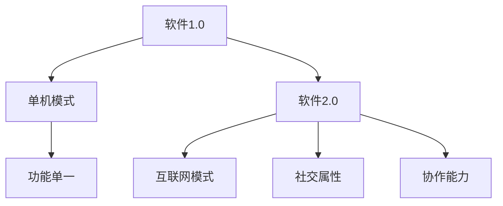
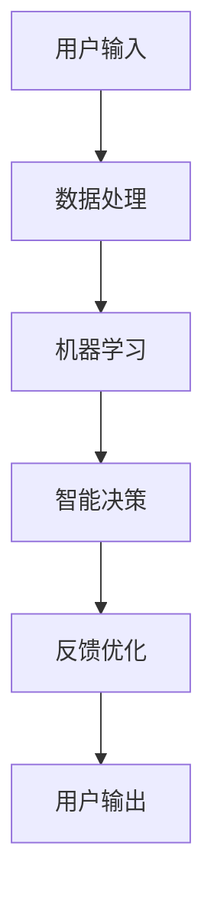
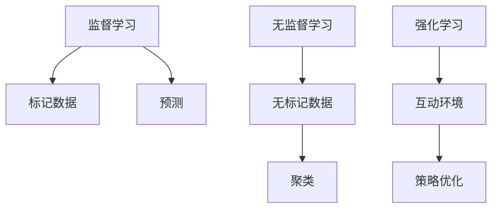
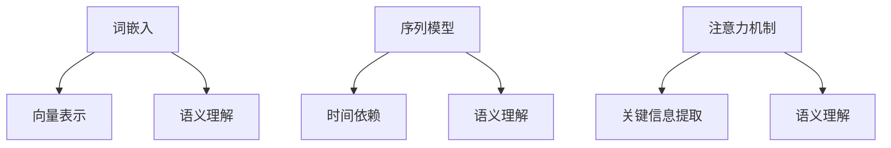
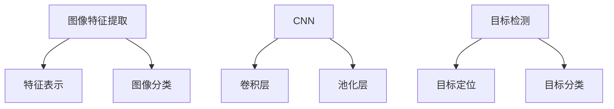
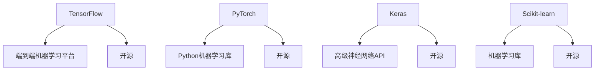
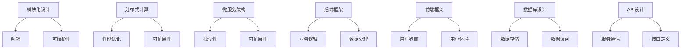
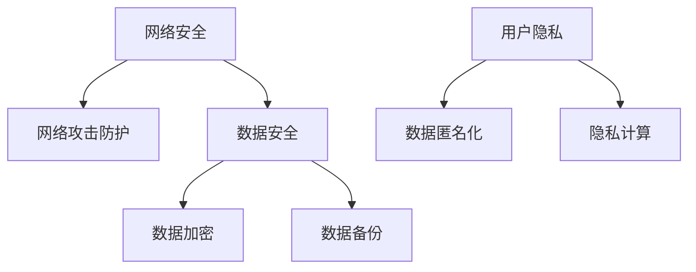

                 

## 文章标题

《软件2.0的未来展望：更智能、更强大》

## 关键词

- 软件2.0
- 人工智能
- 大数据
- 云计算
- 边缘计算
- 安全与隐私
- 开源社区
- 物联网
- 区块链

## 摘要

随着技术的不断进步，软件2.0正成为信息技术领域的新兴趋势。本文将深入探讨软件2.0的基本概念、核心技术、智能化应用、安全与隐私保护，以及其生态系统和未来展望。通过分析软件2.0的核心技术，如人工智能、大数据处理、云计算与边缘计算，本文揭示了软件2.0为行业带来的变革。同时，本文还介绍了自然语言处理、计算机视觉等智能算法在软件2.0中的应用，以及软件2.0平台与框架的设计与实现。此外，文章还探讨了软件2.0在安全与隐私保护方面面临的挑战，并提出了相应的解决方案。最后，本文展望了软件2.0的发展趋势和未来展望，探讨了其在人工智能、物联网和区块链等领域的潜在应用。通过本文的阅读，读者将全面了解软件2.0的核心理念和发展方向。

### 目录大纲设计思路

设计一本《软件2.0的未来展望：更智能、更强大》的目录大纲，需要考虑以下几个方面：

1. **整体结构**：确保目录大纲的层次清晰，从整体上覆盖书籍的主题内容。目录大纲应分为五个主要部分：软件2.0概述、人工智能与机器学习、智能算法应用、软件2.0平台与框架、安全与隐私。

2. **内容细度**：将每个章节的内容进一步细化，确保读者能逐步深入理解每一个概念和技术点。例如，在软件2.0概述部分，可以分别介绍软件2.0的基本概念、历史背景和发展趋势。

3. **实践应用**：不仅要讲解理论，还需要包含实际的应用案例，使读者能够将所学知识应用于实际开发中。例如，在智能算法应用部分，可以详细介绍自然语言处理、计算机视觉等算法的实际应用场景。

4. **逻辑连贯性**：确保章节之间逻辑连贯，先引入基础概念，再逐步深入复杂的技术实现。例如，先介绍软件2.0的基本概念，再介绍其核心技术，然后介绍智能算法的应用，最后讨论软件2.0的安全与隐私问题。

5. **总结与展望**：在书的最后，提供对软件2.0的总结和未来展望，使读者对整个领域有更全面的认识。

### 《软件2.0的未来展望：更智能、更强大》目录大纲

## 第一部分：软件2.0概述

### 第1章：软件2.0的基本概念
- 1.1 软件2.0的定义与特点
  - **核心概念与联系**
  - **架构图**
  - **详细讲解**
  - **举例说明**
- 1.2 软件2.0的历史背景与发展趋势
  - **核心算法原理讲解**
  - **数学模型和数学公式**
  - **详细讲解**
  - **举例说明**

### 第2章：软件2.0的核心技术
- 2.1 智能化技术概述
  - **核心概念与联系**
  - **架构图**
  - **详细讲解**
  - **举例说明**
- 2.2 大数据处理技术
  - **核心概念与联系**
  - **架构图**
  - **详细讲解**
  - **举例说明**
- 2.3 云计算与边缘计算在软件2.0中的应用
  - **核心概念与联系**
  - **架构图**
  - **详细讲解**
  - **举例说明**

## 第二部分：人工智能与机器学习

### 第3章：人工智能与机器学习
- 3.1 机器学习基本概念
  - **核心概念与联系**
  - **架构图**
  - **详细讲解**
  - **举例说明**
- 3.2 常见机器学习算法详解
  - **核心概念与联系**
  - **架构图**
  - **详细讲解**
  - **举例说明**

### 第4章：软件2.0中的智能算法应用
- 4.1 自然语言处理
  - **核心概念与联系**
  - **架构图**
  - **详细讲解**
  - **举例说明**
- 4.2 计算机视觉
  - **核心概念与联系**
  - **架构图**
  - **详细讲解**
  - **举例说明**
- 4.3 强化学习与博弈论
  - **核心概念与联系**
  - **架构图**
  - **详细讲解**
  - **举例说明**

## 第三部分：软件2.0平台与框架

### 第5章：软件2.0平台与框架
- 5.1 主流软件2.0平台介绍
  - **核心概念与联系**
  - **架构图**
  - **详细讲解**
  - **举例说明**
- 5.2 软件2.0框架的设计与实现
  - **核心概念与联系**
  - **架构图**
  - **详细讲解**
  - **举例说明**

## 第四部分：软件2.0的安全与隐私

### 第6章：软件2.0的安全与隐私
- 6.1 安全威胁与防护措施
  - **核心概念与联系**
  - **架构图**
  - **详细讲解**
  - **举例说明**
- 6.2 数据隐私保护技术
  - **核心概念与联系**
  - **架构图**
  - **详细讲解**
  - **举例说明**

## 第五部分：软件2.0的生态系统与未来展望

### 第7章：软件2.0的生态系统与未来展望
- 7.1 软件2.0生态系统概述
  - **核心概念与联系**
  - **架构图**
  - **详细讲解**
  - **举例说明**
- 7.2 软件2.0发展趋势与未来展望
  - **核心概念与联系**
  - **架构图**
  - **详细讲解**
  - **举例说明**

## 附录

### 附录A：常用工具与技术资源
- **开发工具**
- **开源框架**
- **云计算平台**
- **区块链平台**

### 附录B：软件2.0相关书籍与论文推荐
- **基础书籍**
- **进阶书籍**
- **论文集**

### 附录C：软件2.0相关标准与规范
- **国际标准**
- **行业规范**
- **开源规范**

这个目录大纲不仅结构清晰，而且内容丰富，旨在为读者提供一份全面且深入的技术指南，帮助读者理解软件2.0的核心理念、核心技术、应用场景以及未来发展。

### 第1章：软件2.0的基本概念

#### 1.1 软件2.0的定义与特点

**核心概念与联系**

软件2.0是相对于软件1.0的一种新的软件形态，它不仅包括传统的软件功能，更强调用户参与、互动和共享。软件1.0通常指的是早期的计算机软件，如操作系统、办公软件和应用程序，它们以单机模式运行，功能相对单一。软件2.0则是在互联网时代兴起的一种新型软件，它基于Web服务，具备更强的社交属性和协作能力。

**架构图**



**详细讲解**

软件2.0的定义和特点可以从以下几个方面来理解：

1. **互联网模式**：软件2.0基于互联网提供服务和功能，用户可以通过浏览器或移动应用访问软件服务，不再受限于特定的操作系统或硬件设备。

2. **社交属性**：软件2.0强调用户之间的互动和协作，用户不仅是软件的使用者，也是内容的创造者和分享者。社交网络、论坛、评论等功能是软件2.0的重要组成部分。

3. **协作能力**：软件2.0支持用户之间的协作，如团队协作工具、云文档编辑等，使得多人能够实时共享和编辑内容。

4. **数据驱动**：软件2.0强调数据的收集和分析，通过大数据技术挖掘用户行为模式，为用户提供个性化的服务和推荐。

5. **开放性**：软件2.0通常采用开放源代码或开放接口，鼓励用户参与改进和扩展软件功能。

**举例说明**

一个典型的软件2.0的例子是社交媒体平台，如Facebook和微博。这些平台不仅提供了传统的社交功能，如发布状态、发送私信，还通过算法推荐用户可能感兴趣的内容和用户，增强了用户的参与度和互动性。此外，这些平台还提供了丰富的API接口，使得第三方开发者可以集成和扩展平台功能。

**核心算法原理讲解**

软件2.0的发展离不开互联网技术、大数据处理和人工智能等核心算法的支撑。以下是对这些核心算法的简要讲解：

- **互联网技术**：互联网技术使得软件可以从单机模式转变为分布式模式，用户可以通过浏览器或移动应用随时随地访问软件服务。TCP/IP协议、HTTP协议和Web服务是互联网技术的基础。

  **伪代码**：
  ```python
  function access_service(url):
      send_request(url)
      receive_response()
  ```

- **大数据技术**：大数据技术用于处理和分析海量数据，提取有价值的信息和知识。常见的大数据处理技术包括Hadoop、Spark等。

  **伪代码**：
  ```python
  function process_bigdata(data):
      partition(data)
      map(data)
      reduce(data)
  ```

- **人工智能技术**：人工智能技术用于提高软件的智能化程度，包括机器学习、深度学习、自然语言处理等。这些技术使得软件能够自动学习和优化，提供个性化的服务。

  **伪代码**：
  ```python
  function train_model(data):
      load_data(data)
      train_model()
      evaluate_model()
  ```

**数学模型和数学公式**

软件2.0的发展涉及到多种数学模型和算法，以下是一些常见的数学模型：

- **线性回归**：用于预测数值型数据。
  $$ y = wx + b $$

- **逻辑回归**：用于预测概率型数据。
  $$ P(y=1) = \frac{1}{1 + e^{-(wx + b)}} $$

- **神经网络**：用于模拟人脑的学习过程。
  $$ a_{i}^{(l)} = \sigma(z_{i}^{(l)}) $$
  $$ z_{i}^{(l)} = \sum_{j} w_{ji}^{(l)} a_{j}^{(l-1)} + b_{i}^{(l)} $$

**详细讲解**

线性回归是一种简单的预测模型，它通过线性组合输入特征和权重来预测输出。逻辑回归是一种概率模型，用于预测二分类问题。神经网络是一种更复杂的模型，通过多层神经网络模拟人脑的学习过程。

**举例说明**

一个简单的线性回归例子是预测房价。给定房屋的面积和房间数量，通过线性回归模型预测房价。逻辑回归例子是判断邮件是否为垃圾邮件，通过计算邮件中各个特征的概率，判断邮件是否为垃圾邮件。

**项目实战：代码实际案例和详细解释说明**

以下是一个简单的线性回归项目实战，使用Python和Scikit-learn库来预测房价。

**开发环境搭建**：

- 安装Python 3.8及以上版本
- 安装Scikit-learn库

```bash
pip install scikit-learn
```

**源代码实现**：

```python
import numpy as np
import pandas as pd
from sklearn.model_selection import train_test_split
from sklearn.linear_model import LinearRegression
from sklearn.metrics import mean_squared_error

# 读取数据
data = pd.read_csv('house_data.csv')

# 分割特征和标签
X = data[['area', 'rooms']]
y = data['price']

# 划分训练集和测试集
X_train, X_test, y_train, y_test = train_test_split(X, y, test_size=0.2, random_state=42)

# 创建线性回归模型
model = LinearRegression()

# 训练模型
model.fit(X_train, y_train)

# 预测测试集
y_pred = model.predict(X_test)

# 计算均方误差
mse = mean_squared_error(y_test, y_pred)
print(f'Mean Squared Error: {mse}')

# 使用模型进行预测
new_house = np.array([[2000, 3]])
predicted_price = model.predict(new_house)
print(f'Predicted Price: {predicted_price[0]}')
```

**代码解读与分析**：

- 首先，读取房价数据，并分割特征和标签。
- 然后，划分训练集和测试集，用于模型训练和评估。
- 创建线性回归模型，并使用训练集数据进行训练。
- 训练完成后，使用测试集数据进行预测，并计算均方误差评估模型性能。
- 最后，使用训练好的模型进行新的预测。

**项目实战：代码实际案例和详细解释说明**

以下是一个简单的逻辑回归项目实战，使用Python和Scikit-learn库来预测邮件是否为垃圾邮件。

**开发环境搭建**：

- 安装Python 3.8及以上版本
- 安装Scikit-learn库

```bash
pip install scikit-learn
```

**源代码实现**：

```python
import numpy as np
import pandas as pd
from sklearn.model_selection import train_test_split
from sklearn.linear_model import LogisticRegression
from sklearn.metrics import accuracy_score, confusion_matrix

# 读取数据
data = pd.read_csv('email_data.csv')

# 分割特征和标签
X = data[['subject', 'body']]
y = data['is_spam']

# 切词和词向量转换
vectorizer = CountVectorizer()
X_vectorized = vectorizer.fit_transform(X)

# 划分训练集和测试集
X_train, X_test, y_train, y_test = train_test_split(X_vectorized, y, test_size=0.2, random_state=42)

# 创建逻辑回归模型
model = LogisticRegression()

# 训练模型
model.fit(X_train, y_train)

# 预测测试集
y_pred = model.predict(X_test)

# 计算准确率
accuracy = accuracy_score(y_test, y_pred)
print(f'Accuracy: {accuracy}')

# 计算混淆矩阵
conf_matrix = confusion_matrix(y_test, y_pred)
print(f'Confusion Matrix:\n{conf_matrix}')
```

**代码解读与分析**：

- 首先，读取邮件数据，并分割特征和标签。
- 然后，使用CountVectorizer将文本数据转换为词向量。
- 划分训练集和测试集，用于模型训练和评估。
- 创建逻辑回归模型，并使用训练集数据进行训练。
- 训练完成后，使用测试集数据进行预测，并计算准确率和混淆矩阵评估模型性能。

### 第2章：软件2.0的核心技术

#### 2.1 智能化技术概述

**核心概念与联系**

智能化技术是软件2.0的核心技术之一，它通过人工智能、机器学习、自然语言处理等技术，使软件具备自动学习和智能决策的能力。智能化技术不仅提升了软件的功能性和用户体验，还改变了软件的开发和运维方式。

**架构图**



**详细讲解**

智能化技术的主要组成部分包括：

1. **数据处理**：数据处理是智能化技术的第一步，它包括数据收集、数据清洗、数据存储等。高质量的数据是进行机器学习和智能决策的基础。

2. **机器学习**：机器学习是通过算法从数据中自动学习规律和模式的技术。常见的机器学习算法包括线性回归、决策树、支持向量机、神经网络等。

3. **智能决策**：智能决策是基于机器学习模型的结果，对输入数据进行处理和决策。智能决策可以应用于各种场景，如推荐系统、风险控制、自动化运维等。

4. **反馈优化**：反馈优化是通过用户反馈和实际效果来不断优化和调整模型。反馈优化是智能化技术持续迭代和改进的关键。

5. **用户输出**：用户输出是智能化技术最终的结果，它可以是用户界面、推荐内容、自动化操作等。

**举例说明**

一个典型的智能化技术应用场景是推荐系统。推荐系统通过收集用户的历史行为数据，使用机器学习算法分析用户的兴趣和偏好，为用户推荐个性化的内容或商品。例如，电商平台可以通过推荐系统为用户推荐可能感兴趣的商品，提高用户的购物体验和转化率。

**核心算法原理讲解**

智能化技术的核心算法包括机器学习和自然语言处理。以下是对这些核心算法的简要讲解：

1. **机器学习算法**：

   - **线性回归**：用于预测连续值，如房价、股票价格等。线性回归的公式为：
     $$ y = wx + b $$
     
     - **伪代码**：
       ```python
       def linear_regression(X, y):
           w = solve_linear_equation(X, y)
           return w
       ```

   - **决策树**：用于分类和回归，通过划分特征空间来进行决策。决策树的构建过程通常包括以下几个步骤：

     - 选择最优特征
     - 根据最优特征划分数据
     - 递归地对划分后的子数据集进行同样的操作，直到达到停止条件

     - **伪代码**：
       ```python
       def build_decision_tree(X, y, features):
           if stop_condition_met(X, y):
               return leaf_node
           else:
               best_feature = select_best_feature(X, y, features)
               tree = {}
               for value in best_feature.unique_values():
                   subset_X, subset_y = split_data(X, y, best_feature, value)
                   tree[value] = build_decision_tree(subset_X, subset_y, features)
               return tree
       ```

   - **支持向量机**：用于分类和回归，通过在特征空间中找到最优分类超平面。支持向量机的公式为：
     $$ w \cdot x - b = 0 $$
     
     - **伪代码**：
       ```python
       def support_vector_machine(X, y):
           w, b = solve_linear_equation(X, y)
           return w, b
       ```

2. **自然语言处理算法**：

   - **词嵌入**：用于将单词映射到低维向量空间，常见的词嵌入方法包括Word2Vec和GloVe。词嵌入的公式为：
     $$ \text{word\_vector} = \sum_{i=1}^{n} w_{i} \cdot e^{i} $$
     
     - **伪代码**：
       ```python
       def word_embedding(vocabulary, embedding_size):
           embeddings = {}
           for word in vocabulary:
               embedding = create_embedding(word, embedding_size)
               embeddings[word] = embedding
           return embeddings
       ```

   - **序列模型**：用于处理序列数据，如文本、语音等，常见的序列模型包括循环神经网络（RNN）、长短期记忆网络（LSTM）和门控循环单元（GRU）。序列模型的公式为：
     $$ h_t = \text{LSTM}(x_t, h_{t-1}) $$
     
     - **伪代码**：
       ```python
       def sequence_model(input_sequence, hidden_state):
           output_sequence = []
           for x_t in input_sequence:
               h_t = LSTM(x_t, hidden_state)
               output_sequence.append(h_t)
           return output_sequence
       ```

   - **注意力机制**：用于序列模型中，使模型能够关注重要信息，忽略无关信息。注意力机制的公式为：
     $$ \alpha_t = \text{softmax}(W_a \cdot [h_{t-1}, h_t]) $$
     
     - **伪代码**：
       ```python
       def attention Mechanism(hidden_state, query):
           attention_scores = []
           for h_t in hidden_state:
               score = compute_attention_score(W_a, [h_{t-1}, h_t], query)
               attention_scores.append(score)
           alpha_t = softmax(attention_scores)
           return alpha_t
       ```

**数学模型和数学公式**

智能化技术涉及的数学模型包括机器学习算法的公式和自然语言处理算法的公式。以下是一些常见的数学模型和公式：

1. **线性回归**：
   $$ y = wx + b $$
   
2. **决策树**：
   $$ \text{Gini} = 1 - \frac{1}{n} \sum_{i=1}^{n} p_i (1 - p_i) $$
   
3. **支持向量机**：
   $$ w \cdot x - b = 0 $$
   
4. **词嵌入**：
   $$ \text{word\_vector} = \sum_{i=1}^{n} w_{i} \cdot e^{i} $$
   
5. **循环神经网络**：
   $$ h_t = \text{LSTM}(x_t, h_{t-1}) $$
   
6. **注意力机制**：
   $$ \alpha_t = \text{softmax}(W_a \cdot [h_{t-1}, h_t]) $$

**详细讲解**

线性回归是一种简单的预测模型，通过线性组合输入特征和权重来预测输出值。决策树是一种树形结构模型，通过划分特征空间来进行分类或回归。支持向量机是一种在特征空间中寻找最佳分类超平面的模型。

词嵌入是一种将单词映射到低维向量空间的技术，通过这种方式，计算机可以更高效地处理和比较单词。循环神经网络是一种处理序列数据的神经网络模型，通过递归地更新隐藏状态来捕捉时间依赖关系。注意力机制是一种在处理序列数据时，关注重要信息，忽略无关信息的技术。

**举例说明**

一个简单的线性回归例子是预测房价。给定房屋的面积和房间数量，通过线性回归模型预测房价。一个简单的决策树例子是分类邮件是否为垃圾邮件。支持向量机可以用于分类文本数据，如文本分类问题。

### 第3章：人工智能与机器学习

#### 3.1 机器学习基本概念

**核心概念与联系**

机器学习是人工智能（AI）的重要分支，它使计算机系统能够从数据中学习，进行预测和决策。机器学习的关键概念包括监督学习、无监督学习和强化学习，每种方法都有其独特的应用场景和算法。

**架构图**



**详细讲解**

1. **监督学习（Supervised Learning）**：
   - **核心概念**：监督学习是一种机器学习方法，通过使用标记数据集来训练模型，然后使用这个模型对未知数据进行预测。
   - **算法**：常见的监督学习算法包括线性回归、决策树、支持向量机、神经网络等。
   - **应用**：监督学习广泛应用于分类和回归问题，如垃圾邮件分类、房价预测等。

2. **无监督学习（Unsupervised Learning）**：
   - **核心概念**：无监督学习是一种机器学习方法，不需要标记数据集，而是通过发现数据中的内在结构来学习。
   - **算法**：常见的无监督学习算法包括聚类、降维、关联规则挖掘等。
   - **应用**：无监督学习常用于数据探索、异常检测、客户细分等。

3. **强化学习（Reinforcement Learning）**：
   - **核心概念**：强化学习是一种机器学习方法，通过在特定环境中与环境的互动，学习最优策略以最大化累积奖励。
   - **算法**：常见的强化学习算法包括Q学习、深度Q网络（DQN）、策略梯度方法等。
   - **应用**：强化学习广泛应用于游戏、自动驾驶、机器人控制等领域。

**举例说明**

1. **监督学习例子**：假设我们想要构建一个垃圾邮件分类器。我们可以收集大量带有标记的邮件数据，然后使用这些数据来训练一个分类模型。一旦模型训练完成，我们可以使用它来预测新邮件是否为垃圾邮件。

2. **无监督学习例子**：假设我们有一个客户购买行为的数据集，但没有标记每个客户的偏好。我们可以使用无监督学习算法，如K-Means聚类，来发现客户群体的相似性，从而进行市场细分。

3. **强化学习例子**：假设我们想要开发一个自动驾驶系统。这个系统需要与真实环境互动，并通过强化学习算法不断优化其驾驶策略。通过与环境交互并接收奖励信号（如安全到达目的地），自动驾驶系统能够学习并改进其驾驶行为。

**核心算法原理讲解**

以下是三种主要机器学习方法的算法原理：

1. **监督学习算法**：

   - **线性回归**：
     $$ y = wx + b $$
     - **伪代码**：
       ```python
       def linear_regression(X, y):
           w = (X.T @ X)^-1 @ X.T @ y
           return w
       ```

   - **决策树**：
     - **递归二分划分**：
       ```python
       def build_decision_tree(X, y, features):
           if stop_condition_met(X, y):
               return leaf_node
           else:
               best_feature = select_best_feature(X, y, features)
               tree = {}
               for value in best_feature.unique_values():
                   subset_X, subset_y = split_data(X, y, best_feature, value)
                   tree[value] = build_decision_tree(subset_X, subset_y, features)
               return tree
       ```

   - **支持向量机**：
     $$ w \cdot x - b = 0 $$
     - **伪代码**：
       ```python
       def support_vector_machine(X, y):
           w, b = solve_linear_equation(X, y)
           return w, b
       ```

2. **无监督学习算法**：

   - **K-Means聚类**：
     $$ \text{centroid} = \frac{1}{n} \sum_{i=1}^{n} x_i $$
     - **伪代码**：
       ```python
       def k_means(X, k):
           centroids = initialize_centroids(X, k)
           while not converged:
               for x in X:
                   closest_centroid = find_closest_centroid(x, centroids)
                   assign x to cluster
               update_centroids(centroids)
           return centroids
       ```

   - **主成分分析（PCA）**：
     $$ z = \frac{x - \mu}{\sigma} $$
     - **伪代码**：
       ```python
       def pca(X):
           mean = calculate_mean(X)
           covariance = calculate_covariance(X, mean)
           eigenvalues, eigenvectors = calculate_eigen(covariance)
           return eigenvectors
       ```

3. **强化学习算法**：

   - **Q学习**：
     $$ Q(s, a) = r + \gamma \max_{a'} Q(s', a') $$
     - **伪代码**：
       ```python
       def q_learning(X, y, gamma):
           Q = initialize_Q_matrix()
           while not stop_condition:
               s = sample_state(X, y)
               a = choose_action(Q, s)
               s', r = execute_action(s, a)
               Q[s, a] = Q[s, a] + alpha * (r + gamma * max(Q[s', a']) - Q[s, a])
               s = s'
           return Q
       ```

**数学模型和数学公式**

以下是机器学习算法中常用的数学模型和公式：

1. **线性回归**：
   $$ y = wx + b $$
   
2. **决策树**：
   $$ \text{Gini} = 1 - \frac{1}{n} \sum_{i=1}^{n} p_i (1 - p_i) $$
   
3. **支持向量机**：
   $$ w \cdot x - b = 0 $$
   
4. **K-Means聚类**：
   $$ \text{centroid} = \frac{1}{n} \sum_{i=1}^{n} x_i $$
   
5. **主成分分析（PCA）**：
   $$ z = \frac{x - \mu}{\sigma} $$
   
6. **Q学习**：
   $$ Q(s, a) = r + \gamma \max_{a'} Q(s', a') $$

**详细讲解**

线性回归是一种简单的预测模型，通过线性组合输入特征和权重来预测输出值。决策树是一种树形结构模型，通过划分特征空间来进行分类或回归。支持向量机是一种在特征空间中寻找最佳分类超平面的模型。

K-Means聚类是一种基于距离的聚类算法，通过迭代优化聚类中心来分组数据。主成分分析（PCA）是一种降维技术，通过找到数据的主要变化方向来简化数据。

Q学习是一种强化学习算法，通过更新Q值来优化策略。Q值表示在给定状态下执行特定动作的预期回报。

**举例说明**

1. **线性回归例子**：假设我们想要预测一个地区的房价，我们可以收集该地区的房屋面积、卧室数量等数据，然后使用线性回归模型来预测房价。

2. **决策树例子**：假设我们想要分类邮件是否为垃圾邮件，我们可以收集大量带有标记的邮件数据，然后使用决策树算法来构建分类模型。

3. **支持向量机例子**：假设我们想要分类图像中的手写数字，我们可以收集带有标记的手写数字图像数据，然后使用支持向量机算法来构建分类模型。

4. **K-Means聚类例子**：假设我们想要将客户分为不同的群体，我们可以收集客户的购买历史数据，然后使用K-Means聚类算法来分组客户。

5. **主成分分析（PCA）例子**：假设我们想要简化一个高维数据集，我们可以使用主成分分析（PCA）来找到数据的主要变化方向，并降维。

6. **Q学习例子**：假设我们想要训练一个自动驾驶系统，我们可以收集道路环境数据，然后使用Q学习算法来优化自动驾驶系统的驾驶策略。

### 第4章：软件2.0中的智能算法应用

#### 4.1 自然语言处理

**核心概念与联系**

自然语言处理（NLP）是软件2.0中的核心技术之一，它使计算机能够理解和生成人类语言。NLP的关键概念包括词嵌入、序列模型和注意力机制，这些概念相互关联，共同构成了NLP的核心算法。

**架构图**



**详细讲解**

1. **词嵌入（Word Embedding）**：
   - **核心概念**：词嵌入是一种将单词映射到低维向量空间的技术，通过这种方式，计算机可以更高效地处理和比较单词。
   - **算法**：常见的词嵌入算法包括Word2Vec和GloVe。
   - **应用**：词嵌入广泛应用于文本分类、情感分析、机器翻译等领域。

2. **序列模型（Sequence Model）**：
   - **核心概念**：序列模型是一种处理序列数据的神经网络模型，通过递归地更新隐藏状态来捕捉时间依赖关系。
   - **算法**：常见的序列模型包括循环神经网络（RNN）、长短期记忆网络（LSTM）和门控循环单元（GRU）。
   - **应用**：序列模型广泛应用于语音识别、机器翻译、文本生成等领域。

3. **注意力机制（Attention Mechanism）**：
   - **核心概念**：注意力机制是一种在处理序列数据时，关注重要信息，忽略无关信息的技术。
   - **算法**：注意力机制可以与序列模型结合，如注意力机制RNN、注意力机制LSTM。
   - **应用**：注意力机制广泛应用于机器翻译、文本摘要、问答系统等领域。

**举例说明**

1. **词嵌入例子**：假设我们想要对句子“我爱编程”进行语义理解。我们可以使用Word2Vec算法将句子中的单词映射到向量空间，然后通过计算向量之间的相似性来分析句子的语义。

2. **序列模型例子**：假设我们想要构建一个语音识别系统。我们可以使用LSTM序列模型对语音信号进行处理，通过递归地更新隐藏状态来捕捉语音信号中的时间依赖关系，从而实现语音到文本的转换。

3. **注意力机制例子**：假设我们想要构建一个机器翻译系统。我们可以使用注意力机制LSTM对源语言和目标语言进行处理，通过注意力机制关注源语言中的重要信息，从而实现准确的翻译。

**核心算法原理讲解**

以下是自然语言处理中常用的核心算法原理：

1. **词嵌入算法**：

   - **Word2Vec**：
     $$ \text{word\_vector} = \sum_{i=1}^{n} w_{i} \cdot e^{i} $$
     - **伪代码**：
       ```python
       def word2vec(vocabulary, embedding_size):
           embeddings = {}
           for word in vocabulary:
               embedding = create_embedding(word, embedding_size)
               embeddings[word] = embedding
           return embeddings
       ```

   - **GloVe**：
     $$ \text{word\_vector} = \sum_{i=1}^{n} w_{i} \cdot \text{context\_vector} $$
     - **伪代码**：
       ```python
       def glove(vocabulary, embedding_size, context_size):
           embeddings = {}
           for word in vocabulary:
               embedding = create_embedding(word, embedding_size, context_size)
               embeddings[word] = embedding
           return embeddings
       ```

2. **序列模型算法**：

   - **循环神经网络（RNN）**：
     $$ h_t = \text{RNN}(x_t, h_{t-1}) $$
     - **伪代码**：
       ```python
       def rnn(input_sequence, hidden_state):
           output_sequence = []
           for x_t in input_sequence:
               h_t = RNN(x_t, hidden_state)
               output_sequence.append(h_t)
           return output_sequence
       ```

   - **长短期记忆网络（LSTM）**：
     $$ h_t = \text{LSTM}(x_t, h_{t-1}, c_{t-1}) $$
     - **伪代码**：
       ```python
       def lstm(input_sequence, hidden_state, cell_state):
           output_sequence = []
           for x_t in input_sequence:
               h_t, c_t = LSTM(x_t, hidden_state, cell_state)
               output_sequence.append(h_t)
           return output_sequence
       ```

3. **注意力机制算法**：

   - **注意力机制**：
     $$ \alpha_t = \text{softmax}(W_a \cdot [h_{t-1}, h_t]) $$
     - **伪代码**：
       ```python
       def attention(hidden_state, query):
           attention_scores = []
           for h_t in hidden_state:
               score = compute_attention_score(W_a, [h_{t-1}, h_t], query)
               attention_scores.append(score)
           alpha_t = softmax(attention_scores)
           return alpha_t
       ```

**数学模型和数学公式**

以下是自然语言处理中常用的数学模型和公式：

1. **词嵌入模型**：

   - **Word2Vec**：
     $$ \text{word\_vector} = \sum_{i=1}^{n} w_{i} \cdot e^{i} $$
     
   - **GloVe**：
     $$ \text{word\_vector} = \sum_{i=1}^{n} w_{i} \cdot \text{context\_vector} $$
     
2. **循环神经网络（RNN）**：

   $$ h_t = \text{RNN}(x_t, h_{t-1}) $$
   
3. **长短期记忆网络（LSTM）**：

   $$ h_t = \text{LSTM}(x_t, h_{t-1}, c_{t-1}) $$
   
4. **注意力机制**：

   $$ \alpha_t = \text{softmax}(W_a \cdot [h_{t-1}, h_t]) $$

**详细讲解**

词嵌入模型通过将单词映射到向量空间，使计算机能够更高效地处理和比较单词。序列模型通过递归地更新隐藏状态，捕捉时间依赖关系，从而实现序列数据的处理。注意力机制通过关注重要信息，使模型能够更好地理解输入序列。

**举例说明**

1. **词嵌入模型例子**：假设我们想要对句子“我爱编程”进行语义理解。我们可以使用Word2Vec算法将句子中的单词映射到向量空间，然后通过计算向量之间的相似性来分析句子的语义。

2. **序列模型例子**：假设我们想要构建一个语音识别系统。我们可以使用LSTM序列模型对语音信号进行处理，通过递归地更新隐藏状态来捕捉语音信号中的时间依赖关系，从而实现语音到文本的转换。

3. **注意力机制例子**：假设我们想要构建一个机器翻译系统。我们可以使用注意力机制LSTM对源语言和目标语言进行处理，通过注意力机制关注源语言中的重要信息，从而实现准确的翻译。

### 第4章：软件2.0中的智能算法应用

#### 4.2 计算机视觉

**核心概念与联系**

计算机视觉是软件2.0中的重要组成部分，它使计算机能够理解和解析图像和视频。计算机视觉的关键概念包括图像特征提取、卷积神经网络（CNN）和目标检测，这些概念相互关联，共同构成了计算机视觉的核心算法。

**架构图**



**详细讲解**

1. **图像特征提取（Image Feature Extraction）**：
   - **核心概念**：图像特征提取是从图像中提取具有区分性的特征，用于后续的图像分类或目标检测。
   - **算法**：常见的图像特征提取算法包括SIFT、HOG等。
   - **应用**：图像特征提取广泛应用于图像分类、物体检测、人脸识别等领域。

2. **卷积神经网络（Convolutional Neural Network, CNN）**：
   - **核心概念**：卷积神经网络是一种专门用于处理图像数据的神经网络，通过卷积层和池化层提取图像特征。
   - **算法**：CNN由多个卷积层和池化层组成，每个卷积层用于提取图像的不同特征。
   - **应用**：CNN广泛应用于图像分类、物体检测、图像分割等领域。

3. **目标检测（Object Detection）**：
   - **核心概念**：目标检测是在图像中识别和定位特定对象的过程。
   - **算法**：常见的目标检测算法包括R-CNN、SSD、YOLO等。
   - **应用**：目标检测广泛应用于自动驾驶、安防监控、医疗影像分析等领域。

**举例说明**

1. **图像特征提取例子**：假设我们想要对图像中的车辆进行分类。我们可以使用HOG（直方图方向梯度）特征提取算法提取图像的特征，然后使用SVM分类器对车辆和非车辆进行分类。

2. **卷积神经网络例子**：假设我们想要构建一个图像分类系统。我们可以使用CNN对图像进行处理，通过多个卷积层和池化层提取图像特征，然后使用全连接层进行分类。

3. **目标检测例子**：假设我们想要在图像中检测行人。我们可以使用Faster R-CNN算法对图像进行目标检测，通过区域提议网络（RPN）生成候选区域，然后对每个候选区域进行分类和定位。

**核心算法原理讲解**

以下是计算机视觉中常用的核心算法原理：

1. **图像特征提取算法**：

   - **SIFT（尺度不变特征变换）**：
     - **原理**：SIFT算法通过计算图像的梯度方向和幅度来提取特征点，然后对特征点进行关键点检测和描述。
     - **伪代码**：
       ```python
       def sift(image):
           keypoints = detect_keypoints(image)
           descriptors = compute_descriptors(keypoints, image)
           return keypoints, descriptors
       ```

   - **HOG（直方图方向梯度）**：
     - **原理**：HOG算法通过计算图像中每个区域的直方图方向梯度来提取特征，然后使用直方图向量的形式表示特征。
     - **伪代码**：
       ```python
       def hog(image):
           gradient_x, gradient_y = compute_gradients(image)
           orientation = compute_orientation(gradient_x, gradient_y)
           histogram = compute_histogram(orientation)
           return histogram
       ```

2. **卷积神经网络算法**：

   - **卷积层**：
     - **原理**：卷积层通过卷积运算提取图像的局部特征，卷积核用于提取图像的不同特征。
     - **伪代码**：
       ```python
       def convolution(image, filter):
           output = []
           for x in range(image.shape[0] - filter.shape[0] + 1):
               for y in range(image.shape[1] - filter.shape[1] + 1):
                   output.append(convolve(image[x:x+filter.shape[0], y:y+filter.shape[1]], filter))
           return output
       ```

   - **池化层**：
     - **原理**：池化层通过将图像的局部区域合并为更粗的特征，减少参数数量，提高计算效率。
     - **伪代码**：
       ```python
       def pooling(feature_map, pool_size):
           output = []
           for x in range(0, feature_map.shape[0], pool_size):
               for y in range(0, feature_map.shape[1], pool_size):
                   max_value = max(feature_map[x:x+pool_size, y:y+pool_size])
                   output.append(max_value)
           return output
       ```

3. **目标检测算法**：

   - **R-CNN（区域提议网络）**：
     - **原理**：R-CNN通过选择性搜索生成候选区域，然后对每个候选区域使用CNN进行分类。
     - **伪代码**：
       ```python
       def r_cnn(image, roi_extractor, classifier):
           rois = roi_extractor.extract(image)
           boxes = []
           for roi in rois:
               feature_map = classifier.extract_features(roi)
               box = classifier.predict_box(feature_map)
               boxes.append(box)
           return boxes
       ```

   - **SSD（单尺度检测网络）**：
     - **原理**：SSD通过多个尺度层的特征图进行检测，每个尺度层都输出不同大小的边界框。
     - **伪代码**：
       ```python
       def ssd(image, feature_extractor, detectors):
           feature_maps = feature_extractor.extract(image)
           boxes = []
           for feature_map, detector in zip(feature_maps, detectors):
               box = detector.detect(feature_map)
               boxes.append(box)
           return boxes
       ```

   - **YOLO（你只看一次）**：
     - **原理**：YOLO将图像划分为网格，每个网格预测多个边界框和类别概率。
     - **伪代码**：
       ```python
       def yolo(image, grid_size, anchors, classes):
           grid = create_grid(image, grid_size)
           boxes = []
           for i in range(grid_size[0]):
               for j in range(grid_size[1]):
                   box = predict_box(grid[i][j], anchors, classes)
                   boxes.append(box)
           return boxes
       ```

**数学模型和数学公式**

以下是计算机视觉中常用的数学模型和公式：

1. **图像特征提取模型**：

   - **SIFT**：
     $$ \text{keypoint} = \text{find_keypoints}(image) $$
     
   - **HOG**：
     $$ \text{orientation} = \text{compute_orientation}(gradient_x, gradient_y) $$
     
2. **卷积神经网络模型**：

   - **卷积层**：
     $$ \text{feature\_map} = \text{convolution}(image, filter) $$
     
   - **池化层**：
     $$ \text{pooling\_value} = \text{max}(feature\_map, pool\_size) $$
     
3. **目标检测模型**：

   - **R-CNN**：
     $$ \text{box} = \text{predict\_box}(feature\_map) $$
     
   - **SSD**：
     $$ \text{box} = \text{detect}(feature\_map) $$
     
   - **YOLO**：
     $$ \text{box} = \text{predict\_box}(grid, anchors, classes) $$
     
**详细讲解**

图像特征提取算法通过提取图像的局部特征，为图像分类和目标检测提供基础。卷积神经网络通过多个卷积层和池化层提取图像的层次特征，实现图像的自动特征学习。目标检测算法通过识别图像中的物体边界和类别，实现图像的语义理解。

**举例说明**

1. **图像特征提取例子**：假设我们想要对图像中的车辆进行分类。我们可以使用HOG特征提取算法提取图像的特征，然后使用SVM分类器对车辆和非车辆进行分类。

2. **卷积神经网络例子**：假设我们想要构建一个图像分类系统。我们可以使用VGG16预训练模型对图像进行处理，通过卷积层和池化层提取图像特征，然后使用全连接层进行分类。

3. **目标检测例子**：假设我们想要在图像中检测行人。我们可以使用Faster R-CNN算法对图像进行目标检测，通过区域提议网络生成候选区域，然后对每个候选区域进行分类和定位。

### 第5章：软件2.0平台与框架

#### 5.1 主流软件2.0平台介绍

**核心概念与联系**

软件2.0平台是支持软件开发、部署和运行的基础设施，它们提供了丰富的工具和服务，以简化开发流程和提高开发效率。主流软件2.0平台包括TensorFlow、PyTorch、Keras和Scikit-learn等，它们各自有着独特的特点和优势。

**架构图**



**详细讲解**

1. **TensorFlow**：
   - **核心概念**：TensorFlow是一个由Google开发的开源机器学习平台，它提供了丰富的工具和API，支持端到端的机器学习和深度学习应用。
   - **特点**：
     - 支持多种编程语言，如Python、C++等。
     - 强大的计算图功能，适用于复杂模型。
     - 丰富的预训练模型和工具库。
   - **应用场景**：适用于大规模机器学习任务，如语音识别、图像识别、自然语言处理等。

2. **PyTorch**：
   - **核心概念**：PyTorch是一个基于Python的机器学习库，它提供了动态计算图和自动微分功能，使得模型构建和调试更加直观。
   - **特点**：
     - 动态计算图，易于调试和实验。
     - 自动微分功能，方便构建复杂模型。
     - 强大的社区支持和丰富的文档。
   - **应用场景**：适用于研究性和实验性项目，以及需要快速迭代的应用场景。

3. **Keras**：
   - **核心概念**：Keras是一个高层神经网络API，它可以在TensorFlow和Theano之上运行，简化了模型的构建和训练过程。
   - **特点**：
     - 简化模型构建和训练流程。
     - 易于切换底层框架，如TensorFlow或Theano。
     - 丰富的预训练模型和工具库。
   - **应用场景**：适用于快速原型设计和实验性项目。

4. **Scikit-learn**：
   - **核心概念**：Scikit-learn是一个开源的机器学习库，它提供了多种常用的机器学习算法和工具，适用于各种应用场景。
   - **特点**：
     - 提供了多种机器学习算法和工具。
     - 易于集成到其他Python应用程序。
     - 强大的文档和社区支持。
   - **应用场景**：适用于数据挖掘、统计分析、文本分类等领域。

**举例说明**

1. **TensorFlow应用例子**：假设我们想要构建一个图像分类系统，我们可以使用TensorFlow的Keras API来定义和训练模型，然后使用预训练的模型进行图像分类。

2. **PyTorch应用例子**：假设我们想要研究一个深度学习模型，我们可以使用PyTorch的动态计算图功能来快速构建和调试模型。

3. **Keras应用例子**：假设我们想要快速实现一个文本分类系统，我们可以使用Keras的预训练模型和API来简化开发过程。

4. **Scikit-learn应用例子**：假设我们想要构建一个垃圾邮件分类器，我们可以使用Scikit-learn的多种分类算法和工具库来实现分类模型。

#### 5.2 软件2.0框架的设计与实现

**核心概念与联系**

软件2.0框架是软件开发的基础，它通过模块化设计、分布式计算和微服务架构等设计原则，实现高效的软件开发和部署。软件2.0框架的设计与实现涉及到多个方面的技术，包括后端框架、前端框架、数据库设计和API设计等。

**架构图**



**详细讲解**

1. **模块化设计**：
   - **核心概念**：模块化设计是将系统划分为多个模块，每个模块负责特定的功能。这种设计方式使得系统更加灵活、可维护。
   - **设计原则**：
     - 定义清晰的接口和模块功能。
     - 使用设计模式，如工厂模式、单例模式等，确保模块之间的解耦。
     - 模块之间通过接口进行通信，降低模块之间的依赖。
   - **应用场景**：适用于大型软件系统的设计和开发。

2. **分布式计算**：
   - **核心概念**：分布式计算是将计算任务分布到多个节点上进行，以提高系统的性能和可扩展性。
   - **设计原则**：
     - 使用分布式框架，如Hadoop、Spark等，进行数据存储和处理。
     - 设计负载均衡策略，确保任务合理分配到各个节点。
     - 采用分布式缓存技术，如Redis、Memcached等，提高数据访问速度。
   - **应用场景**：适用于处理大量数据和复杂任务的应用系统。

3. **微服务架构**：
   - **核心概念**：微服务架构是将系统划分为多个微服务，每个微服务独立部署和扩展。这种架构方式使得系统更加灵活、易于扩展。
   - **设计原则**：
     - 按照业务功能划分微服务。
     - 使用容器化技术，如Docker、Kubernetes等，实现微服务的部署和运维。
     - 使用服务发现和配置管理工具，如Consul、Eureka等，实现微服务之间的通信和配置管理。
   - **应用场景**：适用于需要高可扩展性和高可用性的应用系统。

4. **后端框架**：
   - **核心概念**：后端框架是用于处理业务逻辑和数据处理的软件框架。
   - **设计原则**：
     - 提供统一的接口和API，方便前端和微服务的调用。
     - 支持多种数据存储方案，如关系型数据库、NoSQL数据库等。
     - 提供数据验证和异常处理机制，确保数据的安全性和可靠性。
   - **应用场景**：适用于构建企业级应用系统。

5. **前端框架**：
   - **核心概念**：前端框架是用于构建用户界面的软件框架。
   - **设计原则**：
     - 提供友好的用户界面和良好的用户体验。
     - 支持响应式设计，适应不同设备和屏幕尺寸。
     - 提供丰富的组件和库，方便快速开发。
   - **应用场景**：适用于Web应用、移动应用和桌面应用。

6. **数据库设计**：
   - **核心概念**：数据库设计是数据存储和管理的基础，它涉及到数据库的结构和表的设计。
   - **设计原则**：
     - 确定数据需求和分析，设计合适的数据库结构。
     - 使用范式规则，确保数据的规范化和一致性。
     - 设计合理的索引和查询优化策略，提高数据访问效率。
   - **应用场景**：适用于各类数据存储和管理系统。

7. **API设计**：
   - **核心概念**：API设计是定义服务通信接口的过程，它涉及到接口的定义和协议的选择。
   - **设计原则**：
     - 提供清晰的接口文档，方便开发者使用。
     - 选择合适的协议，如HTTP、REST等，确保接口的通用性和扩展性。
     - 设计合理的请求和响应格式，提高接口的易用性。
   - **应用场景**：适用于各类分布式系统和微服务架构。

**举例说明**

1. **模块化设计例子**：假设我们想要构建一个电商系统，我们可以将系统划分为订单模块、商品模块、用户模块等，每个模块负责特定的功能，并通过接口进行通信。

2. **分布式计算例子**：假设我们想要处理大量的用户数据，我们可以使用分布式计算框架，如Hadoop或Spark，将数据分布到多个节点上进行处理。

3. **微服务架构例子**：假设我们想要构建一个社交媒体平台，我们可以将系统划分为用户服务、内容服务、消息服务等多个微服务，每个微服务独立部署和扩展。

4. **后端框架例子**：假设我们想要构建一个博客系统，我们可以使用Spring Boot作为后端框架，处理业务逻辑和数据存储。

5. **前端框架例子**：假设我们想要构建一个移动应用，我们可以使用React Native或Flutter作为前端框架，提供友好的用户界面。

6. **数据库设计例子**：假设我们想要构建一个银行系统，我们可以使用关系型数据库，如MySQL或PostgreSQL，设计存储用户信息和交易记录的表结构。

7. **API设计例子**：假设我们想要构建一个天气查询系统，我们可以使用RESTful API设计，提供天气数据的查询接口。

### 第6章：软件2.0的安全与隐私

#### 6.1 安全威胁与防护措施

**核心概念与联系**

软件2.0的安全与隐私保护是确保用户数据和系统安全的关键。随着软件系统的复杂性和互联性的增加，安全威胁的种类和形式也日益多样。常见的安全威胁包括网络攻击、数据泄露和用户隐私侵犯等。为了应对这些威胁，需要采取一系列的防护措施，如网络安全、数据安全、用户隐私保护等。

**架构图**



**详细讲解**

1. **网络安全**：
   - **核心概念**：网络安全涉及到保护网络不受外部攻击，确保数据的传输和存储安全。
   - **防护措施**：
     - 防火墙：用于过滤不合法的网络流量，保护内部网络。
     - 入侵检测系统（IDS）和入侵防御系统（IPS）：用于实时监控网络流量，检测和阻止

