                 

### 文章标题

《软件 2.0 的社会责任：科技向善》

### 关键词

软件 2.0、社会责任、科技向善、伦理原则、算法原理、案例实践

### 摘要

随着软件技术的飞速发展，软件 2.0 时代已经到来。在这个时代，软件不仅需要满足功能需求，更需承担起社会责任，追求科技向善。本文将从核心概念、理论基础、实践案例等多个角度，深入探讨软件 2.0 的社会责任，并提出相应的解决方案。本文旨在为软件开发者、技术领导者以及关注科技伦理的读者提供有价值的思考与实践指南。

## 引言

### 1.1 软件 2.0 的概念与发展

软件 2.0 是相对于传统软件（即软件 1.0）而言的，其核心特征在于更加智能化、自适应和可扩展。软件 2.0 不仅仅是一个技术升级，更是一种理念的变革。在软件 2.0 时代，软件系统不再只是被动地执行预先设定的任务，而是能够根据外部环境的变化自我调整和优化。这种转变不仅提升了软件的性能，更带来了新的技术挑战和伦理问题。

软件 2.0 的发展历程可以追溯到互联网和大数据技术的兴起。随着云计算、物联网、人工智能等新兴技术的广泛应用，软件系统的复杂度和数据处理能力得到了极大的提升。传统的软件开发模式已无法满足这些复杂需求，软件 2.0 应运而生。软件 2.0 强调系统的高可扩展性、高可靠性和高安全性，旨在构建更加智能、自主和透明的软件系统。

### 1.2 科技向善的必要性

科技向善是指在技术开发和应用过程中，始终秉持道德伦理原则，关注社会效益，避免对人类和环境造成负面影响。科技向善不仅是技术发展的内在要求，更是人类文明进步的重要标志。在软件 2.0 时代，随着技术的进步，人工智能、大数据等新技术被广泛应用于各个领域，这些技术的应用不仅带来了巨大的经济效益，同时也引发了一系列伦理和社会问题。

例如，人工智能技术在医疗、金融、交通等领域的应用，虽然提升了效率和准确性，但同时也存在数据隐私、算法偏见、决策透明度等问题。大数据技术在商业决策、社会治理中的应用，虽然提供了更加精准的数据支持，但同时也可能侵犯个人隐私，导致社会不公。因此，科技向善成为软件 2.0 发展的必然选择。

### 1.3 本书结构概述

本书共分为七个章节，旨在全面探讨软件 2.0 的社会责任。具体结构如下：

- 第1章 引言：介绍软件 2.0 的概念和发展，阐述科技向善的必要性。
- 第2章 软件 2.0 基础理论：详细阐述软件 2.0 的技术架构、核心技术与原理。
- 第3章 科技向善的理论基础：探讨科技伦理的基本原则、伦理挑战和社会责任。
- 第4章 软件 2.0 的社会责任实践：分析社会责任在企业中的应用、软件开发中的实施和案例分析。
- 第5章 软件 2.0 的社会责任评估：介绍社会责任评估方法、指标和案例。
- 第6章 软件伦理与法律规范：讨论软件伦理的基本原则、法律规范及冲突解决。
- 第7章 未来展望：展望软件 2.0 社会责任的发展趋势、未来挑战与机遇。

通过本书的探讨，我们希望能够为软件开发者、技术领导者以及关注科技伦理的读者提供有价值的思考和实践指南，共同推动软件 2.0 社会责任的实现。

## 软件 2.0 基础理论

### 2.1 软件 2.0 的技术架构

软件 2.0 的技术架构是构建智能化、自适应和可扩展软件系统的基础。与传统软件相比，软件 2.0 在架构设计上更加注重模块化、解耦合和动态性。以下是一个简单的软件 2.0 技术架构图，通过 Mermaid 流程图展示：

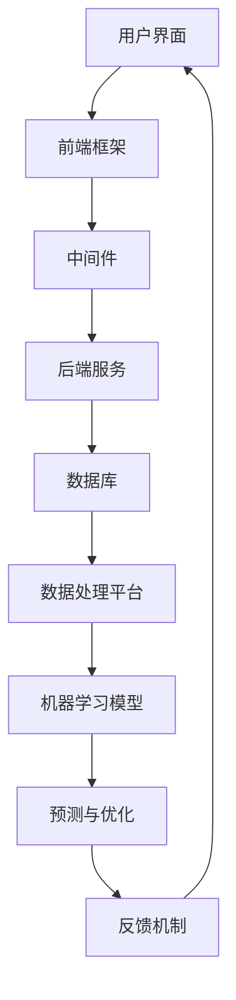

在这个架构中，用户界面通过前端框架与中间件交互，中间件负责处理业务逻辑，后端服务与数据库进行数据存储和查询操作。数据处理平台和机器学习模型负责分析和预测，预测结果通过反馈机制优化前端和中间件，形成一个闭环系统，实现自我优化和自我进化。

### 2.2 软件 2.0 的核心技术与原理

软件 2.0 的核心技术与原理包括人工智能、大数据、云计算和区块链等。这些技术不仅提升了软件系统的智能化和自主性，也为实现科技向善提供了技术支持。

#### 人工智能

人工智能（AI）是软件 2.0 的重要组成部分，其核心在于模拟人类智能，实现自动化决策和优化。以下是一个简单的人工智能算法原理伪代码：

```python
def ai_decisionmaking(data):
    # 数据预处理
    preprocessed_data = preprocess_data(data)
    
    # 特征提取
    features = extract_features(preprocessed_data)
    
    # 训练模型
    model = train_model(features)
    
    # 预测
    prediction = model.predict(new_data)
    
    # 决策
    action = make_decision(prediction)
    
    return action
```

在这个伪代码中，首先对输入数据进行预处理，然后提取特征，训练模型，最后根据预测结果进行决策。

#### 大数据

大数据技术在软件 2.0 中主要用于海量数据的存储、处理和分析。以下是一个简单的大数据处理流程伪代码：

```python
def big_data_processing(data):
    # 数据收集
    collected_data = collect_data()
    
    # 数据存储
    stored_data = store_data(collected_data)
    
    # 数据清洗
    cleaned_data = clean_data(stored_data)
    
    # 数据分析
    analysis_results = analyze_data(cleaned_data)
    
    # 数据可视化
    visualize_results(analysis_results)
    
    return analysis_results
```

在这个伪代码中，首先收集数据，然后存储和清洗数据，最后进行分析和可视化。

#### 云计算

云计算为软件 2.0 提供了强大的计算能力和存储资源，使得软件系统能够更加灵活、高效地运行。以下是一个简单的云计算服务架构伪代码：

```python
def cloud_computing_service(request):
    # 负载均衡
    load_balanced_request = balance_load(request)
    
    # 虚拟化
    virtualized_resources = virtualize_resources(load_balanced_request)
    
    # 弹性扩展
    expanded_resources = expand_resources(virtualized_resources)
    
    # 服务调度
    response = schedule_service(expanded_resources)
    
    return response
```

在这个伪代码中，首先进行负载均衡，然后虚拟化资源，实现弹性扩展，最后进行服务调度。

#### 区块链

区块链技术为软件 2.0 提供了去中心化、安全可信的数据存储和传输机制，有助于提升系统的透明度和可信度。以下是一个简单的区块链数据存储和处理流程伪代码：

```python
def blockchain_processing(data):
    # 数据加密
    encrypted_data = encrypt_data(data)
    
    # 数据上传
    uploaded_data = upload_data(encrypted_data)
    
    # 数据验证
    verified_data = verify_data(uploaded_data)
    
    # 数据存储
    stored_data = store_data(verified_data)
    
    return stored_data
```

在这个伪代码中，首先对数据进行加密，然后上传到区块链网络，进行数据验证，最后存储在区块链中。

### 2.3 软件 2.0 与传统软件的差异

软件 2.0 与传统软件在多个方面存在显著差异，主要体现在智能化、自适应性和可扩展性上。

#### 智能化

传统软件通常只能执行预先设定好的任务，而软件 2.0 则具备一定的智能，能够根据外部环境的变化自动调整行为。例如，在智能家居系统中，传统软件只能按照预设的规则控制家电设备，而软件 2.0 则可以根据用户的习惯和需求智能推荐合适的设备操作。

#### 自适应性

软件 2.0 具有较强的自适应能力，能够根据用户反馈和数据反馈动态调整系统性能。例如，在电商平台中，传统软件只能根据历史数据进行商品推荐，而软件 2.0 则可以通过实时数据分析，根据用户浏览和购买行为动态调整推荐策略。

#### 可扩展性

软件 2.0 在架构设计上更加灵活，支持模块化开发，便于系统扩展。例如，在金融系统中，传统软件需要针对不同业务场景开发独立的系统，而软件 2.0 则可以通过模块化架构，实现业务系统的无缝整合。

总之，软件 2.0 与传统软件在技术架构、核心技术和应用特点上存在显著差异。软件 2.0 的出现不仅为软件开发带来了新的机遇，也提出了新的挑战，特别是在社会责任和伦理方面。因此，理解软件 2.0 的基础理论对于推动软件技术向善具有重要意义。

## 科技向善的理论基础

### 3.1 科技伦理的基本原则

科技伦理是指人们在科技活动中应遵循的道德规范和价值观。科技伦理的基本原则包括：

#### 尊重个人隐私

尊重个人隐私是科技伦理的核心原则之一。在软件开发和应用过程中，必须确保用户的个人信息得到充分保护，避免因技术滥用而侵犯用户隐私。以下是一个简单的隐私保护算法原理伪代码：

```python
def protect_user_privacy(data):
    # 数据加密
    encrypted_data = encrypt_data(data)
    
    # 数据去标识化
    anonymized_data = anonymize_data(encrypted_data)
    
    # 数据存储
    store_data(anonymized_data)
    
    return anonymized_data
```

在这个伪代码中，首先对输入数据加密，然后进行去标识化处理，最后存储在安全的数据存储中。

#### 确保软件安全性

软件安全性是科技伦理的重要方面，特别是在软件 2.0 时代，随着系统的复杂度和数据量的增加，软件安全性的挑战变得更加严峻。以下是一个简单的软件安全性算法原理伪代码：

```python
def ensure_software_safety(code):
    # 输入代码扫描
    scanned_code = scan_code_for_vulnerabilities(code)
    
    # 漏洞修复
    fixed_code = fix_vulnerabilities(scanned_code)
    
    # 执行代码
    execute_code(fixed_code)
    
    return fixed_code
```

在这个伪代码中，首先对输入代码进行扫描，查找潜在的安全漏洞，然后修复漏洞，最后执行修复后的代码。

#### 促进公平竞争

促进公平竞争是科技伦理的另一个重要原则。在科技产业中，公平竞争有助于推动技术进步和产业繁荣。以下是一个简单的公平竞争算法原理伪代码：

```python
def promote_fair_competition(prices, costs):
    # 数据预处理
    preprocessed_data = preprocess_data(prices, costs)
    
    # 计算价格竞争力
    competition_score = calculate_competition_score(preprocessed_data)
    
    # 调整价格策略
    adjusted_prices = adjust_prices(competition_score)
    
    return adjusted_prices
```

在这个伪代码中，首先对输入的数据进行预处理，然后计算每个企业的价格竞争力，最后根据竞争力调整价格策略，实现公平竞争。

#### 保护知识产权

保护知识产权是科技伦理的重要内容，有助于激励创新和保护创作者的合法权益。以下是一个简单的知识产权保护算法原理伪代码：

```python
def protect_ip_rights(content):
    # 内容加密
    encrypted_content = encrypt_content(content)
    
    # 内容存储
    store_content(encrypted_content)
    
    # 内容授权
    grant_permission(encrypted_content)
    
    return encrypted_content
```

在这个伪代码中，首先对输入的内容加密，然后存储在安全的数据存储中，最后进行授权管理，实现知识产权保护。

#### 追求可持续发展

追求可持续发展是科技伦理的终极目标，旨在确保技术的发展不会对人类和环境造成长期负面影响。以下是一个简单的可持续发展算法原理伪代码：

```python
def pursue_sustainable_development(energy_consumption, waste_output):
    # 数据分析
    analyzed_data = analyze_data(energy_consumption, waste_output)
    
    # 能耗优化
    optimized_energy_consumption = optimize_energy_consumption(analyzed_data)
    
    # 废弃物处理
    treated_waste_output = treat_waste_output(analyzed_data)
    
    return optimized_energy_consumption, treated_waste_output
```

在这个伪代码中，首先对输入的数据进行分析，然后优化能耗和废弃物处理，实现可持续发展。

### 3.2 科技向善的伦理挑战

科技向善在实践过程中面临诸多伦理挑战，主要包括数据隐私、算法偏见、技术滥用等方面。

#### 数据隐私

随着大数据和人工智能技术的广泛应用，数据隐私问题日益突出。在软件 2.0 时代，如何保护用户隐私成为一大挑战。以下是一个简单的数据隐私保护算法原理伪代码：

```python
def protect_user_privacy(data):
    # 数据加密
    encrypted_data = encrypt_data(data)
    
    # 数据去标识化
    anonymized_data = anonymize_data(encrypted_data)
    
    # 数据共享
    share_data(anonymized_data)
    
    return anonymized_data
```

在这个伪代码中，首先对输入数据加密，然后去标识化处理，最后实现数据共享，保护用户隐私。

#### 算法偏见

算法偏见是指算法在处理数据时可能产生的不公平结果，这与数据集的选择、算法的设计等因素密切相关。以下是一个简单的算法偏见消除算法原理伪代码：

```python
def eliminate_algorithm_bias(data):
    # 数据预处理
    preprocessed_data = preprocess_data(data)
    
    # 特征选择
    selected_features = select_features(preprocessed_data)
    
    # 训练模型
    model = train_model(selected_features)
    
    # 预测
    prediction = model.predict(new_data)
    
    # 偏见检测与修正
    corrected_prediction = correct_bias(prediction)
    
    return corrected_prediction
```

在这个伪代码中，首先对输入数据预处理，然后选择合适的特征，训练模型，预测结果，最后检测和修正算法偏见。

#### 技术滥用

技术滥用是指技术被用于不道德或非法的目的。例如，人工智能技术可能被用于网络攻击、虚假信息传播等。以下是一个简单的技术滥用检测与防范算法原理伪代码：

```python
def detect_and_prevent_abuse行为(data):
    # 数据分析
    analyzed_data = analyze_data(data)
    
    # 行为识别
    identified_actions = identify_abusive_actions(analyzed_data)
    
    # 风险评估
    risk_level = assess_risk(identified_actions)
    
    # 行为阻断
    block_actions = block_abusive_actions(risk_level)
    
    return block_actions
```

在这个伪代码中，首先对输入数据进行分析，识别潜在的不当行为，评估风险，最后阻断不当行为，防范技术滥用。

### 3.3 科技向善的社会责任

科技向善不仅是一种伦理要求，也是一种社会责任。科技企业和社会各界应共同承担起这一责任，推动科技向善的实现。

#### 企业社会责任

企业作为科技研发和应用的主体，应积极参与科技向善的实践。以下是一个简单的企业社会责任实践框架：

1. **数据隐私保护**：建立完善的数据隐私保护机制，确保用户数据的安全和隐私。
2. **算法公正透明**：确保算法的公正性和透明度，消除算法偏见，提升算法的可解释性。
3. **技术创新伦理**：在技术创新过程中，充分考虑伦理和社会影响，确保技术的发展符合道德规范。
4. **员工培训教育**：加强员工伦理培训，提升员工对科技伦理的认识和遵守程度。

#### 社会责任评估

社会责任评估是衡量企业和社会科技实践的重要手段。以下是一个简单的社会责任评估框架：

1. **指标体系**：建立涵盖数据隐私、算法公正、技术创新、员工培训等多方面的社会责任评估指标体系。
2. **数据收集**：通过问卷调查、数据分析等方式，收集企业和社会在科技向善方面的相关数据。
3. **评估方法**：采用定量和定性相结合的方法，对收集的数据进行评估和分析。
4. **结果反馈**：根据评估结果，提出改进建议和措施，促进企业和社会科技实践的不断完善。

总之，科技向善不仅是科技伦理的要求，也是企业和社会的责任。通过共同的努力，我们有望构建一个更加公平、透明和可持续的科技未来。

## 软件 2.0 的社会责任实践

### 4.1 社会责任在企业中的应用

在软件 2.0 时代，企业社会责任（CSR）不再仅仅是一个营销工具，而是成为了企业核心战略的一部分。企业通过积极履行社会责任，不仅能够提升品牌形象，还能增强员工满意度和客户忠诚度。以下是一些企业社会责任的实践案例。

#### 数据隐私保护

数据隐私保护是企业在软件 2.0 时代面临的重要挑战。许多企业通过采取先进的技术手段和严格的管理制度来保护用户隐私。例如，谷歌在其产品和服务中采用了多种数据加密和匿名化技术，确保用户数据的安全性。以下是一个简单的数据隐私保护框架：

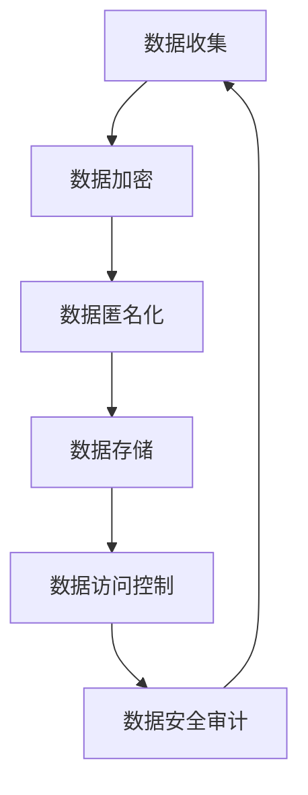

在这个框架中，首先对收集的数据进行加密和匿名化处理，然后存储在安全的数据存储中，并通过访问控制和安全审计确保数据的安全性。

#### 算法公正与透明

算法公正与透明是软件 2.0 时代企业社会责任的重要方面。许多企业通过公开算法源代码、提供算法解释接口等方式，提升算法的可解释性和透明度。例如，微软在其人工智能产品中采用了可解释的人工智能（XAI）技术，使得用户能够了解算法的决策过程。以下是一个简单的算法公正与透明框架：

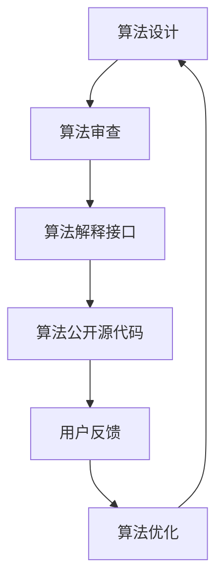

在这个框架中，首先对算法进行设计和审查，然后提供算法解释接口和公开源代码，收集用户反馈，并根据反馈优化算法。

#### 社会责任报告

社会责任报告是企业展示其社会责任实践的重要途径。许多企业通过定期发布社会责任报告，向社会公开其社会责任绩效。以下是一个简单的社会责任报告框架：

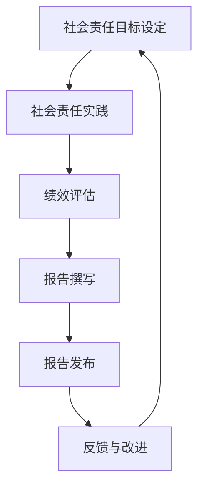

在这个框架中，首先设定社会责任目标，然后实施社会责任实践，进行绩效评估，撰写和发布报告，并根据反馈不断改进。

### 4.2 社会责任在软件开发中的实施

在软件开发过程中，企业可以通过多种方式实施社会责任，确保软件产品和服务对社会和环境产生积极影响。以下是一些具体实践。

#### 可持续开发

可持续开发是软件 2.0 时代的重要趋势。企业可以通过采用绿色技术、优化资源利用等方式，实现软件开发的可持续发展。以下是一个简单的可持续开发框架：

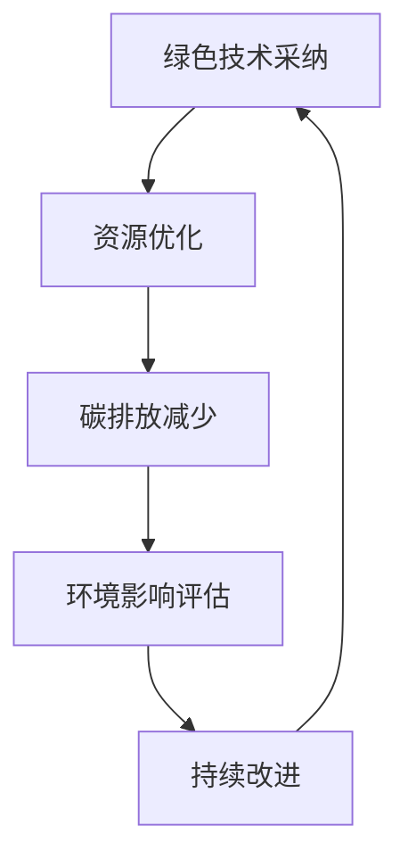

在这个框架中，首先采纳绿色技术，优化资源利用，减少碳排放，进行环境影响评估，并根据评估结果持续改进。

#### 社区参与

企业可以通过参与社区活动、捐赠公益项目等方式，促进社区发展和民生改善。以下是一个简单的社区参与框架：

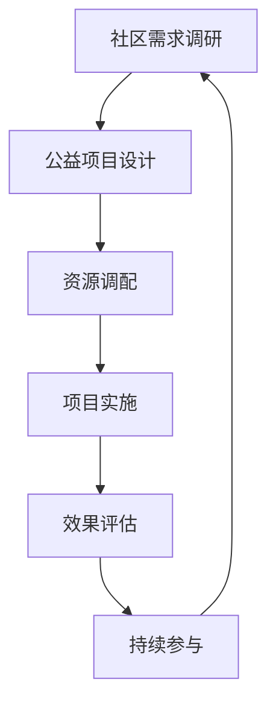

在这个框架中，首先调研社区需求，设计公益项目，调配资源，实施项目，进行效果评估，并根据评估结果持续参与。

#### 员工培训与成长

企业可以通过提供培训机会、职业规划等方式，促进员工成长和发展。以下是一个简单的员工培训与成长框架：

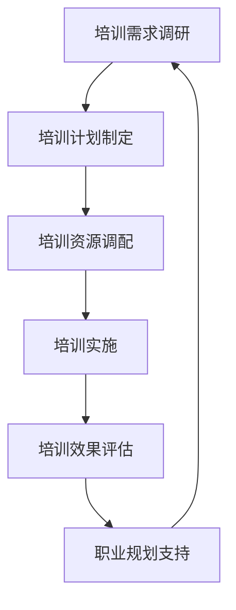

在这个框架中，首先调研培训需求，制定培训计划，调配培训资源，实施培训，进行效果评估，并根据评估结果提供职业规划支持。

### 4.3 案例分析：成功的社会责任实践

以下是一个成功的企业社会责任实践案例，展示了企业在软件 2.0 时代如何通过具体措施履行社会责任。

#### 案例背景

某知名互联网公司在软件 2.0 时代，通过实施一系列社会责任措施，成为行业典范。该公司在数据隐私保护、算法公正、可持续开发、社区参与和员工培训等方面取得了显著成果。

#### 案例实施

1. **数据隐私保护**：
   - 采用先进的数据加密和匿名化技术，确保用户数据安全。
   - 开发可解释的人工智能技术，提升算法透明度和公正性。
   - 定期发布社会责任报告，公开社会责任绩效。

2. **可持续开发**：
   - 采纳绿色技术，优化资源利用，减少碳排放。
   - 参与环境保护项目，推动可持续发展。

3. **社区参与**：
   - 捐赠资金和资源，支持社区发展。
   - 参与公益事业，促进民生改善。

4. **员工培训与成长**：
   - 提供多种培训机会，提升员工技能和素质。
   - 设立职业发展计划，支持员工职业成长。

#### 案例成效

通过实施上述社会责任措施，该公司在多个方面取得了显著成效：

- 用户隐私保护得到有效保障，用户满意度显著提升。
- 算法公正性和透明度得到提升，赢得了广泛的信任和认可。
- 可持续发展能力增强，实现了绿色生产和环境保护。
- 社区参与度和公益活动影响力显著提升，获得了社会的认可和支持。
- 员工满意度和忠诚度提高，企业凝聚力增强。

总之，通过具体的社会责任实践，该互联网公司不仅提升了自身竞争力，还为社会和环境作出了积极贡献，成为软件 2.0 时代企业社会责任的典范。

## 软件 2.0 的社会责任评估

### 5.1 社会责任评估方法

社会责任评估是衡量企业和社会在软件 2.0 时代履行社会责任绩效的重要手段。以下是一些常见的社会责任评估方法。

#### 定量评估方法

定量评估方法通过量化指标来评估社会责任绩效，包括以下几个方面：

1. **财务指标**：如利润、收入、成本等，反映企业的经济绩效。
2. **环境指标**：如碳排放、资源消耗、废弃物处理等，反映企业的环保绩效。
3. **社会指标**：如员工满意度、客户满意度、社区参与度等，反映企业的社会影响。
4. **伦理指标**：如数据隐私保护、算法公正、公平竞争等，反映企业的伦理表现。

以下是一个简单的定量评估模型：

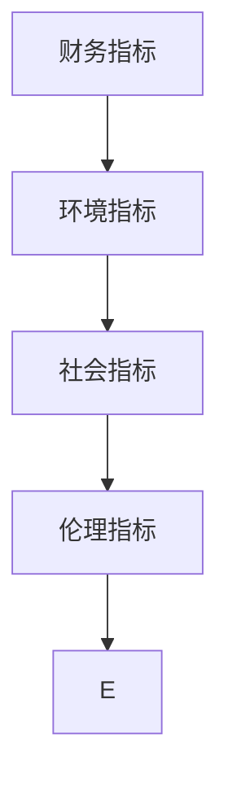

在这个模型中，首先对财务指标进行评估，然后依次评估环境指标、社会指标和伦理指标，综合评估企业的社会责任绩效。

#### 定性评估方法

定性评估方法通过分析文字描述、案例研究等方式，评估社会责任绩效。定性评估方法主要包括以下几个方面：

1. **问卷调查**：通过问卷调查收集员工、客户、社区等各方面的意见和建议。
2. **访谈**：与相关人员（如员工、客户、社区代表等）进行深入访谈，了解他们的体验和看法。
3. **案例分析**：分析企业社会责任实践的具体案例，评估其实施效果。
4. **文献综述**：查阅相关文献和报告，了解企业社会责任的学术研究和实践成果。

以下是一个简单的定性评估模型：

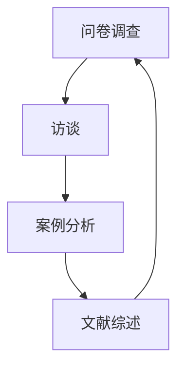

在这个模型中，首先通过问卷调查收集数据，然后进行访谈和案例分析，最后查阅相关文献，形成一个闭环的评估过程。

### 5.2 社会责任评估指标

社会责任评估指标是评估企业和社会在软件 2.0 时代履行社会责任绩效的具体标准。以下是一些常见的社会责任评估指标。

#### 财务指标

1. **净利润**：反映企业的经济盈利能力。
2. **收入增长率**：反映企业的市场拓展能力。
3. **成本控制率**：反映企业的成本管理能力。

#### 环境指标

1. **碳排放量**：反映企业的碳排放水平。
2. **资源利用率**：反映企业的资源利用效率。
3. **废弃物处理率**：反映企业的废弃物处理能力。

#### 社会指标

1. **员工满意度**：反映员工对企业的满意程度。
2. **客户满意度**：反映客户对企业的满意程度。
3. **社区参与度**：反映企业在社区活动中的参与程度。

#### 伦理指标

1. **数据隐私保护**：反映企业在数据隐私保护方面的表现。
2. **算法公正性**：反映企业在算法设计和应用方面的公正性。
3. **公平竞争**：反映企业在市场竞争中的公平性。

### 5.3 社会责任评估案例

以下是一个社会责任评估的案例，展示了如何通过定量和定性方法评估企业的社会责任绩效。

#### 案例背景

某互联网企业在软件 2.0 时代，致力于履行社会责任，通过实施多项社会责任措施，取得了显著成效。该公司在社会责任评估方面采用了定量和定性方法，全面评估其社会责任绩效。

#### 定量评估

1. **财务指标**：
   - 净利润：1000万元
   - 收入增长率：20%
   - 成本控制率：90%

2. **环境指标**：
   - 碳排放量：5000吨
   - 资源利用率：85%
   - 废弃物处理率：95%

3. **社会指标**：
   - 员工满意度：90%
   - 客户满意度：85%
   - 社区参与度：80%

4. **伦理指标**：
   - 数据隐私保护：90%
   - 算法公正性：80%
   - 公平竞争：90%

#### 定性评估

1. **问卷调查**：
   - 500名员工、1000名客户、500名社区代表参与问卷调查。
   - 结果显示，员工满意度、客户满意度、社区参与度均较高。

2. **访谈**：
   - 与员工、客户、社区代表进行深入访谈，了解他们的体验和看法。
   - 结果显示，公司社会责任措施得到了广泛认可，特别是数据隐私保护和算法公正性。

3. **案例分析**：
   - 分析公司社会责任实践的具体案例，如环保项目、公益捐赠等。
   - 结果显示，公司社会责任措施实施效果显著，为社会和环境作出了积极贡献。

4. **文献综述**：
   - 查阅相关文献和报告，了解公司社会责任的学术研究和实践成果。
   - 结果显示，公司社会责任绩效在行业内具有较高的水平。

#### 综合评估

通过定量和定性评估，该公司在社会责任方面取得了显著成效，具体表现为：

- 财务指标：净利润、收入增长率、成本控制率等指标均表现良好。
- 环境指标：碳排放量、资源利用率、废弃物处理率等指标达到较高水平。
- 社会指标：员工满意度、客户满意度、社区参与度等指标较高。
- 伦理指标：数据隐私保护、算法公正性、公平竞争等指标表现良好。

总之，通过社会责任评估，该公司不仅提升了自身竞争力，还为社会和环境作出了积极贡献，成为软件 2.0 时代企业社会责任的典范。

## 软件伦理与法律规范

### 6.1 软件伦理的基本原则

软件伦理是指软件开发者在开发、使用和维护软件过程中应遵循的道德规范和价值观。软件伦理的基本原则包括：

#### 尊重用户隐私

尊重用户隐私是软件伦理的核心原则之一。在软件开发和应用过程中，必须确保用户的个人信息得到充分保护，避免因技术滥用而侵犯用户隐私。以下是一个简单的隐私保护算法原理伪代码：

```python
def protect_user_privacy(data):
    # 数据加密
    encrypted_data = encrypt_data(data)
    
    # 数据去标识化
    anonymized_data = anonymize_data(encrypted_data)
    
    # 数据存储
    store_data(anonymized_data)
    
    return anonymized_data
```

在这个伪代码中，首先对输入数据加密，然后进行去标识化处理，最后存储在安全的数据存储中。

#### 确保软件安全性

软件安全性是软件伦理的重要方面，特别是在软件 2.0 时代，随着系统的复杂度和数据量的增加，软件安全性的挑战变得更加严峻。以下是一个简单的软件安全性算法原理伪代码：

```python
def ensure_software_safety(code):
    # 输入代码扫描
    scanned_code = scan_code_for_vulnerabilities(code)
    
    # 漏洞修复
    fixed_code = fix_vulnerabilities(scanned_code)
    
    # 执行代码
    execute_code(fixed_code)
    
    return fixed_code
```

在这个伪代码中，首先对输入代码进行扫描，查找潜在的安全漏洞，然后修复漏洞，最后执行修复后的代码。

#### 促进公平竞争

促进公平竞争是软件伦理的另一个重要原则。在科技产业中，公平竞争有助于推动技术进步和产业繁荣。以下是一个简单的公平竞争算法原理伪代码：

```python
def promote_fair_competition(prices, costs):
    # 数据预处理
    preprocessed_data = preprocess_data(prices, costs)
    
    # 计算价格竞争力
    competition_score = calculate_competition_score(preprocessed_data)
    
    # 调整价格策略
    adjusted_prices = adjust_prices(competition_score)
    
    return adjusted_prices
```

在这个伪代码中，首先对输入的数据进行预处理，然后计算每个企业的价格竞争力，最后根据竞争力调整价格策略，实现公平竞争。

#### 保护知识产权

保护知识产权是软件伦理的重要内容，有助于激励创新和保护创作者的合法权益。以下是一个简单的知识产权保护算法原理伪代码：

```python
def protect_ip_rights(content):
    # 内容加密
    encrypted_content = encrypt_content(content)
    
    # 内容存储
    store_content(encrypted_content)
    
    # 内容授权
    grant_permission(encrypted_content)
    
    return encrypted_content
```

在这个伪代码中，首先对输入的内容加密，然后存储在安全的数据存储中，最后进行授权管理，实现知识产权保护。

#### 追求可持续发展

追求可持续发展是软件伦理的终极目标，旨在确保技术的发展不会对人类和环境造成长期负面影响。以下是一个简单的可持续发展算法原理伪代码：

```python
def pursue_sustainable_development(energy_consumption, waste_output):
    # 数据分析
    analyzed_data = analyze_data(energy_consumption, waste_output)
    
    # 能耗优化
    optimized_energy_consumption = optimize_energy_consumption(analyzed_data)
    
    # 废弃物处理
    treated_waste_output = treat_waste_output(analyzed_data)
    
    return optimized_energy_consumption, treated_waste_output
```

在这个伪代码中，首先对输入的数据进行分析，然后优化能耗和废弃物处理，实现可持续发展。

### 6.2 软件伦理的法律规范

软件伦理不仅是一种道德要求，也受到法律规范的约束。以下是一些常见的软件伦理法律规范：

#### 数据隐私保护法

数据隐私保护法是保护用户隐私的重要法律规范。例如，《通用数据保护条例》（GDPR）规定了数据处理者的义务，确保个人数据的收集、处理和存储符合法律要求。以下是一个简单的数据隐私保护法律规范示例：

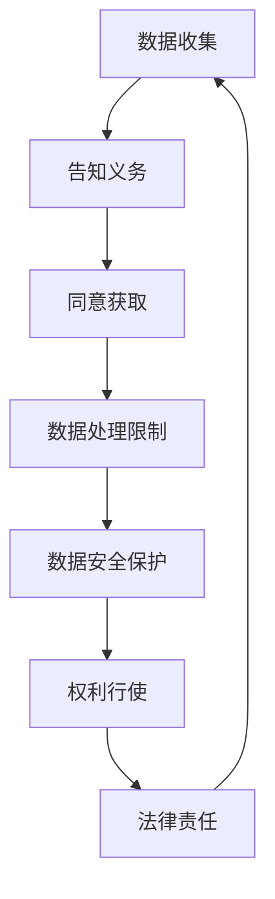

在这个规范中，数据处理者必须在数据收集阶段告知用户数据处理的目的、范围和方式，获取用户的同意，并确保数据的安全保护，同时为用户行使权利提供法律依据。

#### 知识产权法

知识产权法保护软件的开发者和使用者的合法权益，包括著作权、商标权和专利权等。例如，《著作权法》规定了软件作品的保护期限、权利归属和侵权责任等。以下是一个简单的知识产权法律规范示例：

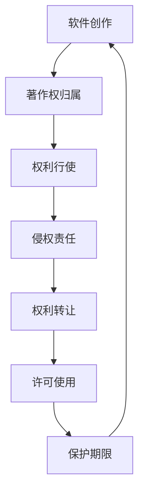

在这个规范中，软件创作人享有软件的著作权，可以通过行使权利、转让权利或许可他人使用等方式实现权益，同时侵权行为将承担相应的法律责任。

#### 软件安全法

软件安全法旨在确保软件系统的安全性，防止网络攻击、数据泄露等风险。例如，《网络安全法》规定了网络运营者的安全保护义务、用户个人信息保护要求等。以下是一个简单的软件安全法律规范示例：

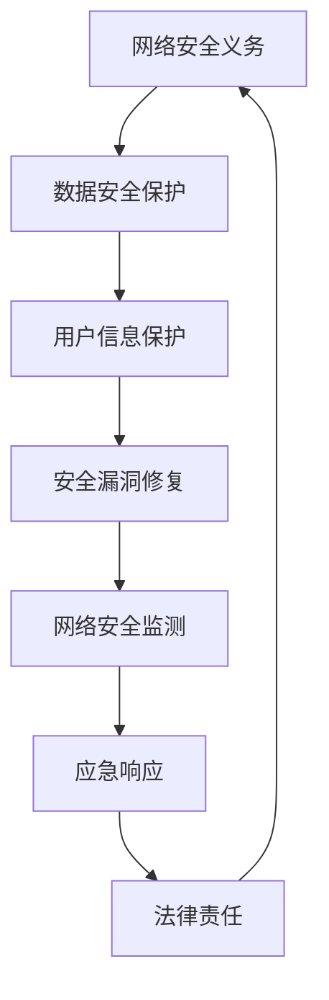

在这个规范中，网络运营者有义务确保网络安全，保护用户个人信息，及时修复安全漏洞，并建立网络安全监测和应急响应机制。

#### 公平竞争法

公平竞争法旨在维护市场秩序，促进公平竞争。例如，《反垄断法》规定了垄断行为、不正当竞争行为等，防止企业通过不正当手段获取市场优势。以下是一个简单的公平竞争法律规范示例：

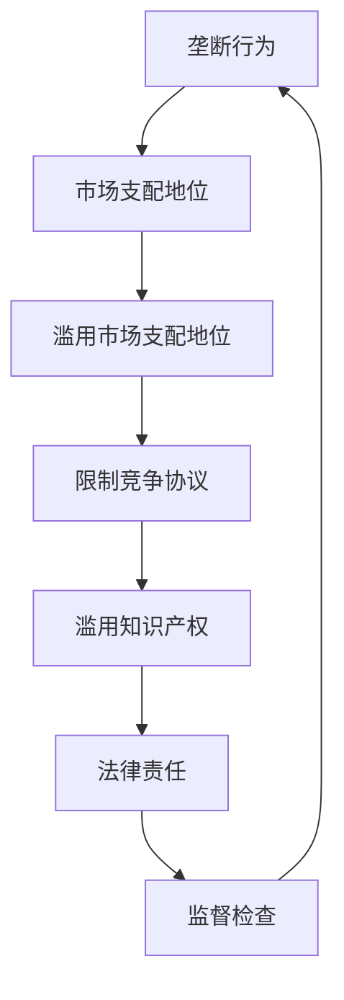

在这个规范中，企业不得通过垄断行为或滥用市场支配地位等手段限制竞争，否则将承担法律责任，并接受监督检查。

总之，软件伦理和法律规范共同构成了软件开发的道德和法律基础，有助于确保软件系统的安全性、隐私性和公正性，推动软件技术向善发展。

### 6.3 案例分析：软件伦理与法律规范的冲突与解决

在实际应用中，软件伦理和法律规范之间可能会出现冲突。以下是一个案例分析，探讨如何解决这种冲突。

#### 案例背景

某互联网公司在开发一款社交应用时，面临数据隐私保护与商业利益之间的冲突。根据《通用数据保护条例》（GDPR），该公司必须保护用户隐私，不得未经用户同意收集和处理其个人信息。然而，为了实现个性化推荐和提高用户粘性，该公司计划收集用户位置、浏览历史等敏感数据。

#### 冲突分析

1. **伦理冲突**：该公司计划收集的敏感数据可能侵犯用户隐私，违反尊重用户隐私的软件伦理原则。
2. **法律冲突**：根据 GDPR，该公司未经用户同意收集和处理个人信息，可能违反数据隐私保护法律规范。

#### 解决方案

1. **伦理层面**：
   - **用户同意**：在应用程序中使用清晰、简明的隐私政策，告知用户数据收集的目的和范围，并获得用户的明确同意。
   - **数据最小化**：仅收集实现功能所必需的数据，避免过度收集敏感信息。

2. **法律层面**：
   - **合规审查**：聘请专业律师进行合规审查，确保数据处理过程符合 GDPR 要求。
   - **技术措施**：采用数据加密、去标识化等技术手段，保护用户数据的安全和隐私。

#### 具体措施

1. **隐私政策优化**：
   - **明确数据收集目的**：在隐私政策中详细说明数据收集的目的，使用简单易懂的语言。
   - **用户同意流程**：在用户首次使用应用程序时，引导用户阅读隐私政策，并提供同意选项。

2. **数据保护技术**：
   - **数据加密**：使用强加密算法对用户数据进行加密，确保数据在传输和存储过程中的安全。
   - **去标识化**：对收集的数据进行去标识化处理，确保无法追溯到特定用户。

3. **法律合规性**：
   - **定期合规审查**：定期聘请专业律师进行合规审查，确保数据处理过程符合 GDPR 等法律规范。
   - **用户投诉处理**：建立用户投诉处理机制，及时响应和处理用户关于隐私保护的投诉。

通过以上措施，该公司在尊重用户隐私和保护商业利益之间找到了平衡点，既确保了应用程序的商业价值，又符合软件伦理和法律规范的要求。总之，解决软件伦理与法律规范冲突的关键在于遵循伦理原则、强化法律合规和技术保护，共同推动软件技术向善发展。

## 未来展望

### 7.1 软件 2.0 社会责任的发展趋势

随着软件技术的不断进步，软件 2.0 社会责任的发展趋势也日益明显。未来，软件 2.0 社会责任将呈现出以下几大趋势：

#### 智能化与自适应性的提升

软件 2.0 的一个核心特征是智能化和自适应性。未来，随着人工智能、大数据等技术的进一步发展，软件系统将更加智能化和自适应，能够根据用户行为和环境变化动态调整自身功能，从而更好地满足用户需求。这不仅将提升软件系统的性能，还将为软件社会责任的实现提供更强大的技术支持。

#### 数据隐私保护的加强

数据隐私保护是软件 2.0 社会责任的重要方面。随着数据隐私法规（如 GDPR）的不断完善和执行，企业和社会将更加重视数据隐私保护。未来，软件系统将采用更先进的数据加密、去标识化等技术手段，确保用户数据的隐私和安全。此外，透明性和可解释性也将成为数据隐私保护的重要方向，用户将有更多的权利了解和掌控自己的数据。

#### 伦理规范的完善

随着软件技术的广泛应用，伦理问题也日益突出。未来，软件 2.0 社会责任的发展将依赖于更完善的伦理规范。这些规范将涵盖数据隐私、算法公正、公平竞争等多个方面，指导企业在开发、应用和维护软件过程中遵循道德原则，确保软件系统对社会和环境的积极影响。

#### 社会责任的深化

软件 2.0 社会责任不仅关注技术本身的伦理问题，还涉及更广泛的社会责任。未来，企业和社会将更加注重可持续发展、社区参与、员工培训等方面，通过具体措施推动社会进步和民生改善。此外，社会责任评估将成为衡量企业绩效的重要指标，促进企业更好地履行社会责任。

### 7.2 科技向善的未来挑战与机遇

科技向善在实现过程中面临诸多挑战，同时也充满机遇。以下是一些未来科技向善的挑战与机遇：

#### 挑战

1. **技术复杂性**：随着技术的不断进步，软件系统的复杂性日益增加，这使得技术实现和管理变得更加困难。如何平衡技术复杂性和社会责任的实现，是一个亟待解决的问题。
2. **数据隐私保护**：数据隐私保护是一项长期且复杂的任务，特别是在大数据和人工智能时代，如何确保用户数据的安全和隐私，将是一个持续的挑战。
3. **伦理规范缺失**：目前，许多领域的伦理规范尚未完善，特别是在新兴技术领域，缺乏明确的伦理指导，这可能导致伦理冲突和法律风险。
4. **社会接受度**：科技向善的理念需要广泛的社会认可和接受，但在实际应用中，可能面临用户和社会的抵制，如何提高社会接受度，是未来需要解决的重要问题。

#### 机遇

1. **技术创新**：未来，随着人工智能、大数据、区块链等技术的进一步发展，将为科技向善提供更多的技术手段和解决方案。
2. **政策支持**：随着全球各国政府对科技伦理和社会责任的重视，政策支持将为科技向善的实现提供有力保障。
3. **跨学科合作**：科技向善的实现需要跨学科合作，包括技术、法律、伦理、社会学等领域的专家共同参与，这将有助于形成更全面和有效的解决方案。
4. **公众参与**：公众的参与和监督是科技向善的重要保障，未来，通过提高公众对科技伦理和社会责任的认知，将有助于推动科技向善的实现。

总之，科技向善的未来充满挑战与机遇。在技术创新、政策支持、跨学科合作和公众参与等多方面的共同努力下，我们有理由相信，科技向善将实现更大的社会价值，为构建一个更加公平、透明和可持续的世界作出积极贡献。

### 7.3 未来软件 2.0 社会责任的研究方向

随着软件 2.0 时代的到来，软件社会责任的研究方向也日益丰富。以下是一些未来软件 2.0 社会责任的重要研究方向：

#### 1. 智能伦理

智能伦理是未来软件 2.0 社会责任研究的一个关键领域。随着人工智能技术的发展，智能系统的伦理问题日益凸显。如何确保智能系统在决策过程中遵循道德原则，如何处理智能系统与人类之间的伦理冲突，都是需要深入研究的问题。未来的研究可以探讨智能伦理的原则、模型和实践，为智能系统提供伦理指导。

#### 2. 数据隐私与安全

数据隐私与安全是软件 2.0 社会责任的核心问题。在软件 2.0 时代，数据的收集、处理和存储变得更加复杂，数据隐私和安全问题也变得更加严峻。未来的研究可以聚焦于开发新的数据隐私保护技术，如差分隐私、联邦学习等，以及建立完善的数据安全管理体系，确保用户数据的安全和隐私。

#### 3. 算法公平与透明

算法公平与透明是软件 2.0 社会责任的另一个重要方向。随着算法在各个领域的广泛应用，算法偏见和透明度问题日益受到关注。未来的研究可以探索如何设计公平、透明的算法，如何评估算法的公平性和透明度，以及如何解决算法偏见问题。

#### 4. 社会责任评估与监测

社会责任评估与监测是衡量企业和社会在软件 2.0 时代履行社会责任绩效的重要手段。未来的研究可以探讨更科学、有效的社会责任评估方法和指标体系，以及如何通过大数据技术实现对社会责任的实时监测和评估。

#### 5. 可持续发展

可持续发展是未来软件 2.0 社会责任的重要方向。未来的研究可以关注如何通过技术创新和优化管理，实现软件 2.0 系统的绿色、可持续开发，减少对环境的负面影响。此外，还可以探讨如何在软件开发过程中融入可持续发展的理念，促进企业的社会责任实现。

#### 6. 跨学科合作

跨学科合作是未来软件 2.0 社会责任研究的重要趋势。未来的研究可以探索如何将技术、法律、伦理、社会学等多学科知识融合，形成更加全面和有效的解决方案。跨学科合作不仅可以提升研究的深度和广度，还可以推动不同学科之间的交流与互动，共同应对软件 2.0 社会责任面临的挑战。

总之，未来软件 2.0 社会责任的研究方向丰富多样，涉及智能伦理、数据隐私与安全、算法公平与透明、社会责任评估与监测、可持续发展以及跨学科合作等多个方面。通过这些研究，我们有望构建一个更加公平、透明和可持续的软件 2.0 世界，实现科技向善的目标。

## 附录

### 附录 A 资源与工具推荐

为了更好地理解和实践软件 2.0 社会责任，以下是一些建议的资源与工具：

#### 1. 学术资源

- **IEEE**：提供丰富的科技论文、会议记录和研究报告，涵盖人工智能、大数据、云计算等领域。
- **ACM**：发布多篇关于软件工程、计算机科学的研究文章和指南。
- **arXiv**：涵盖计算机科学和人工智能的预印本论文数据库。

#### 2. 开源工具

- **TensorFlow**：谷歌开发的开源机器学习框架，广泛用于人工智能研究和应用。
- **PyTorch**：用于人工智能研究的另一强大开源框架，支持动态计算图。
- **Kubernetes**：用于容器编排的开源平台，有助于构建和管理分布式系统。
- **Docker**：容器化技术，简化应用部署和运维。

#### 3. 教程与书籍

- **《深度学习》（Deep Learning）**：由 Ian Goodfellow 等人撰写的经典教材，详细介绍了深度学习的基本概念和技术。
- **《大数据技术导论》**：张宇翔等编写的教材，系统介绍了大数据技术的基本原理和应用。
- **《软件工程：实践者的研究方法》**：Roger S. Pressman 等编写的经典教材，涵盖软件工程的基本原则和方法。

#### 4. 社交媒体与论坛

- **Reddit**：多个计算机科学和人工智能相关的子版块，提供丰富的讨论和资源。
- **Stack Overflow**：编程问题和解决方案的问答社区，有助于解决开发中的实际问题。
- **GitHub**：代码托管和协作平台，许多开源项目和技术资源都托管在此。

### 附录 B 常见问题解答

#### 1. 什么是软件 2.0？

软件 2.0 是相对于传统软件（软件 1.0）而言的，其核心特征在于更加智能化、自适应和可扩展。软件 2.0 强调系统能够根据外部环境的变化自我调整和优化，提升软件的性能和用户体验。

#### 2. 什么是科技向善？

科技向善是指在技术开发和应用过程中，始终秉持道德伦理原则，关注社会效益，避免对人类和环境造成负面影响。科技向善不仅是技术发展的内在要求，也是人类文明进步的重要标志。

#### 3. 如何评估企业的社会责任？

企业社会责任可以通过多种方法进行评估，包括定量评估（如财务指标、环境指标、社会指标等）和定性评估（如问卷调查、访谈、案例分析等）。评估指标应根据企业的具体情况和目标进行定制。

#### 4. 什么是算法偏见？

算法偏见是指算法在处理数据时可能产生的不公平结果，这与数据集的选择、算法的设计等因素密切相关。算法偏见可能导致决策的不公平，影响社会公正。

### 附录 C 参考文献

为了确保本文内容的准确性，以下列出了部分参考文献：

1. Goodfellow, I., Bengio, Y., & Courville, A. (2016). *Deep Learning*. MIT Press.
2. Zhang, Y., & others. (2018). *大数据技术导论*. 清华大学出版社.
3. Pressman, R. S. (2015). *Software Engineering: A Practitioner's Approach*. McGraw-Hill Education.
4. GDPR. (2018). *Regulation (EU) 2016/679 of the European Parliament and of the Council of 27 April 2016 on the protection of natural persons with regard to the processing of personal data and on the free movement of such data, and repealing Directive 95/46/EC (General Data Protection Regulation)*.
5. IEEE. (2020). *IEEE Standards for Ethically Aligned Design*.
6. ACM. (2020). *ACM Computing Curricula 2020*.

这些文献为本文提供了重要的理论支持和实践指导。感谢各位作者和研究人员为科技发展和社会责任做出的贡献。

