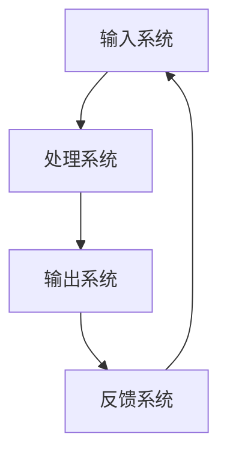

                 

# 输入、处理、输出、反馈：信息处理的基本逻辑

> 关键词：信息处理，输入系统，处理系统，输出系统，反馈系统，逻辑架构，优化策略，案例分析

> 摘要：本文深入探讨了信息处理的基本逻辑，从输入、处理、输出和反馈四个方面展开，详细阐述了信息处理的原理、方法和实际应用。通过剖析信息处理系统的各个环节，我们提出了优化策略，并借助实际案例，展示了信息处理在实际系统中的应用效果。本文旨在为读者提供一个全面、系统的信息处理知识体系，帮助读者理解和掌握信息处理的基本逻辑。

## 目录

### 第一部分：信息处理基本逻辑概述

#### 第1章：信息处理的基本概念

1.1 信息处理的基本逻辑  
1.2 信息处理的分类与层次  
1.3 信息处理的重要性

#### 第2章：输入系统

2.1 输入系统的基本原理  
2.2 输入系统的类型与性能评估  
2.3 输入系统的设计原则

#### 第3章：处理系统

3.1 处理系统的基本原理  
3.2 处理系统的架构与流程  
3.3 处理系统的性能优化

#### 第4章：输出系统

4.1 输出系统的基本原理  
4.2 输出系统的类型与性能评估  
4.3 输出系统的设计原则

#### 第5章：反馈系统

5.1 反馈系统的基本原理  
5.2 反馈系统的类型与作用  
5.3 反馈系统的设计与实现

### 第二部分：信息处理基本逻辑的应用

#### 第6章：输入、处理、输出、反馈在实际系统中的应用

6.1 输入、处理、输出、反馈在计算机系统中的应用  
6.2 输入、处理、输出、反馈在通信系统中的应用  
6.3 输入、处理、输出、反馈在控制系统中的应用

#### 第7章：信息处理基本逻辑的设计原则

7.1 信息处理系统的可靠性设计  
7.2 信息处理系统的安全性设计  
7.3 信息处理系统的可扩展性设计

#### 第8章：信息处理基本逻辑的优化策略

8.1 输入系统的优化策略  
8.2 处理系统的优化策略  
8.3 输出系统的优化策略  
8.4 反馈系统的优化策略

### 第三部分：案例分析与实践

#### 第9章：案例分析与实践

9.1 案例分析  
9.1.1 案例一：电商平台的数据处理与反馈系统  
9.1.2 案例二：智能家居系统的输入、处理与输出  
9.2 实践项目  
9.2.1 实践项目一：设计一个简单的输入、处理、输出、反馈系统  
9.2.2 实践项目二：优化一个现有的输入、处理、输出、反馈系统

## 附录

### 附录A：信息处理基本逻辑的Mermaid流程图

### 附录B：输入、处理、输出、反馈系统的设计原则与优化策略汇总表

### 附录C：常用信息处理算法及其应用案例汇总

### 附录D：实践项目源代码与解读

## 第1章：信息处理的基本概念

### 1.1 信息处理的基本逻辑

信息处理是现代信息技术的重要组成部分，它涉及到信息的采集、传输、存储、处理和利用等多个环节。信息处理的基本逻辑可以概括为输入、处理、输出和反馈四个环节，它们构成了一个闭环系统，如图1-1所示。


#### 输入

输入是信息处理的起点，它是指从外部环境获取信息的过程。输入可以是数据、信号或事件，这些信息需要通过输入系统进行采集和预处理，以便后续处理。

#### 处理

处理是信息处理的中心环节，它是指对输入的信息进行加工、分析和计算的过程。处理系统需要根据具体的任务需求和算法模型，对输入的信息进行转换和处理，以生成有用的输出。

#### 输出

输出是信息处理的结果，它是指将处理后的信息以特定的形式展示给用户或系统。输出可以是数据、图像、声音或控制信号等，它们需要通过输出系统进行转换和传输。

#### 反馈

反馈是信息处理的最终环节，它是指将输出信息的一部分返回到输入端，以对后续输入和处理进行调整和优化。反馈系统可以帮助信息处理系统实现自适应和优化，提高系统的性能和可靠性。

### 1.2 信息处理的分类与层次

根据处理对象和处理方式的不同，信息处理可以分为数据处理、图像处理、语音处理和智能处理等多个类别。每个类别都有其独特的处理逻辑和算法体系。

#### 数据处理

数据处理是信息处理的基础，它主要涉及数据的采集、存储、清洗、转换和计算等过程。数据处理可以分为结构化数据处理和非结构化数据处理。

- 结构化数据处理：主要针对具有固定格式和字段的数据，如关系型数据库中的数据。
- 非结构化数据处理：主要针对没有固定格式和字段的数据，如文本、图像和语音等。

#### 图像处理

图像处理是信息处理的重要领域，它主要涉及图像的采集、增强、分割、识别和生成等过程。图像处理广泛应用于计算机视觉、医学图像处理、遥感图像分析和图像娱乐等领域。

#### 语音处理

语音处理是信息处理的另一个重要领域，它主要涉及语音的采集、增强、识别、合成和传输等过程。语音处理广泛应用于语音助手、语音识别、语音合成和通信系统等领域。

#### 智能处理

智能处理是信息处理的高级阶段，它主要涉及人工智能、机器学习和深度学习等技术。智能处理可以对大量复杂的信息进行自动分析和决策，从而实现智能化和自动化。

### 1.3 信息处理的重要性

信息处理在现代社会的各个领域都具有重要的应用价值，其主要表现在以下几个方面：

#### 社会层面

- 信息处理有助于提高社会的信息化水平，促进经济和社会的发展。
- 信息处理为政府和企业的决策提供了科学依据，提高了决策的科学性和效率。

#### 科技层面

- 信息处理推动了计算机技术、网络技术、通信技术和人工智能技术等的发展。
- 信息处理为各个学科的研究提供了强大的工具和平台，促进了科技进步和知识创新。

#### 经济层面

- 信息处理为企业提供了信息化和智能化的解决方案，提高了企业的生产效率和管理水平。
- 信息处理为电子商务、在线教育和数字娱乐等领域带来了巨大的市场机遇。

## 第2章：输入系统

### 2.1 输入系统的基本原理

输入系统是信息处理系统的关键组成部分，它负责从外部环境获取信息，并将其转换为系统内部可以处理的形式。输入系统通常包括传感器、数据采集器、输入接口和预处理模块等组成部分，如图2-1所示。


#### 传感器

传感器是输入系统的核心部件，它负责将物理信号（如温度、湿度、光线、压力等）转换为电信号。传感器通常具有高精度、高灵敏度、抗干扰能力强等特点。

#### 数据采集器

数据采集器是用于收集传感器产生的电信号的设备，它可以将模拟信号转换为数字信号，以便后续处理。数据采集器通常包括放大器、滤波器、模数转换器等组成部分。

#### 输入接口

输入接口是连接传感器和数据采集器的接口，它通常采用标准接口协议（如USB、RS-485、SPI等），以便与其他设备进行通信。

#### 预处理模块

预处理模块用于对采集到的数据进行预处理，包括滤波、去噪、归一化等操作。预处理模块可以提高数据的质量和可靠性，减少误差和干扰。

### 2.2 输入系统的类型与性能评估

输入系统的类型可以根据传感器类型、数据采集方式和输入接口等进行分类。以下是一些常见的输入系统类型：

#### 传感器类型

- 电阻型传感器
- 电容型传感器
- 电压型传感器
- 电流型传感器
- 光学传感器
- 红外传感器
- 麦克风传感器

#### 数据采集方式

- 模拟采集
- 数字采集
- 混合采集（模拟和数字）

#### 输入接口

- USB接口
- RS-485接口
- SPI接口
- I2C接口

输入系统的性能评估主要包括以下几个方面：

#### 灵敏度

灵敏度是指传感器对输入信号的响应程度，通常用灵敏度系数表示。灵敏度系数越高，传感器对信号的响应越敏感。

#### 精度

精度是指传感器测量结果与真实值之间的差距，通常用误差表示。精度越高，测量结果越接近真实值。

#### 稳定性

稳定性是指传感器在长时间工作过程中，输出信号是否稳定。稳定性越好，传感器的工作寿命越长。

#### 抗干扰能力

抗干扰能力是指传感器在受到外界干扰时，输出信号是否受到影响。抗干扰能力越强，传感器的工作环境越恶劣。

### 2.3 输入系统的设计原则

输入系统的设计原则主要包括以下几个方面：

#### 确定传感器类型

根据应用场景和需求，选择合适的传感器类型。例如，在温度测量场景下，可以选择热电偶传感器。

#### 确定数据采集方式

根据传感器的类型和输出信号的特点，选择合适的数据采集方式。例如，对于模拟信号，可以选择模拟采集；对于数字信号，可以选择数字采集。

#### 确定输入接口

根据系统的需求和外部设备的特点，选择合适的输入接口。例如，对于便携式设备，可以选择USB接口；对于工业设备，可以选择RS-485接口。

#### 预处理模块设计

根据传感器的输出信号特点，设计合适的预处理模块，包括滤波、去噪、放大等操作，以提高数据的可靠性和准确性。

#### 系统集成与调试

将输入系统与其他系统部件（如处理系统、输出系统等）进行集成，并进行调试和测试，确保系统的稳定性和可靠性。

## 第3章：处理系统

### 3.1 处理系统的基本原理

处理系统是信息处理系统的核心部分，它负责对输入的信息进行加工、分析和计算，以生成有用的输出。处理系统通常包括处理单元、算法模型、计算资源和控制模块等组成部分，如图3-1所示。


#### 处理单元

处理单元是处理系统的核心部件，它负责执行各种算法和计算任务。处理单元可以采用CPU、GPU、FPGA或ASIC等硬件设备。

#### 算法模型

算法模型是处理系统的灵魂，它决定了处理系统的工作方式和性能。根据应用场景和需求，可以选择合适的算法模型，如线性模型、非线性模型、神经网络等。

#### 计算资源

计算资源是处理系统的支撑，它包括内存、存储、网络和电力等资源。计算资源充足与否直接影响处理系统的性能和效率。

#### 控制模块

控制模块负责协调处理单元和其他系统部件的工作，确保处理系统的正常运行。控制模块通常包括控制器、调度器和监控器等组成部分。

### 3.2 处理系统的架构与流程

处理系统的架构和流程可以根据应用场景和需求进行灵活设计。以下是一个典型的处理系统架构和流程：

#### 架构

- 输入模块：接收输入数据，进行预处理。
- 处理模块：执行算法模型，进行数据加工和分析。
- 输出模块：生成处理结果，进行输出。
- 控制模块：协调各个模块的工作，保证系统正常运行。

#### 流程

1. 输入模块接收输入数据，进行预处理，如去噪、归一化等操作。
2. 预处理后的数据传递给处理模块，处理模块根据算法模型进行数据加工和分析。
3. 处理模块生成处理结果，传递给输出模块。
4. 输出模块将处理结果以用户可读的形式展示或存储。
5. 控制模块监控整个处理过程，根据反馈进行优化和调整。

### 3.3 处理系统的性能优化

处理系统的性能优化是提高信息处理效率和质量的关键。以下是一些常见的性能优化策略：

#### 算法优化

- 选择适合应用场景的算法模型，如线性模型、神经网络等。
- 对算法模型进行调优，如调整参数、优化结构等。
- 采用并行计算和分布式计算技术，提高处理速度。

#### 硬件优化

- 选择高性能的处理单元，如GPU、FPGA等。
- 优化处理单元的硬件架构，如多核、分布式架构等。
- 采用专用集成电路（ASIC）或现场可编程门阵列（FPGA）等硬件加速技术。

#### 资源优化

- 合理分配计算资源，如内存、存储和网络等。
- 采用虚拟化技术，提高资源利用率。
- 采用高效的数据传输协议，减少数据传输延迟。

#### 控制优化

- 设计高效的调度算法，优化任务分配和执行。
- 采用实时监控和反馈机制，及时发现和处理异常情况。
- 采用自适应控制技术，根据反馈进行动态调整。

## 第4章：输出系统

### 4.1 输出系统的基本原理

输出系统是信息处理系统的最终环节，它负责将处理结果以用户可读的形式展示或存储。输出系统通常包括输出接口、输出设备和输出控制模块等组成部分，如图4-1所示。


#### 输出接口

输出接口是连接处理系统和输出设备的接口，它通常采用标准接口协议（如USB、RS-485、SPI等），以便与其他设备进行通信。

#### 输出设备

输出设备是输出系统的核心部件，它负责将处理结果以用户可读的形式展示或存储。常见的输出设备包括显示器、打印机、音响、存储设备等。

#### 输出控制模块

输出控制模块负责协调输出接口和输出设备的工作，确保输出系统能够正常运行。输出控制模块通常包括控制器、调度器和监控器等组成部分。

### 4.2 输出系统的类型与性能评估

输出系统的类型可以根据输出设备、输出接口和输出形式等进行分类。以下是一些常见的输出系统类型：

#### 输出设备类型

- 显示器
- 打印机
- 音响
- 存储

#### 输出接口类型

- USB接口
- RS-485接口
- SPI接口
- I2C接口

#### 输出形式

- 图形输出
- 文字输出
- 声音输出
- 视频输出

输出系统的性能评估主要包括以下几个方面：

#### 灵活性

灵活性是指输出系统根据不同需求进行配置和调整的能力。灵活性越高，输出系统适应不同应用场景的能力越强。

#### 可靠性

可靠性是指输出系统能够稳定、连续地输出处理结果的能力。可靠性越高，输出系统的故障率越低。

#### 响应速度

响应速度是指输出系统从接收到输出指令到输出结果所需的时间。响应速度越快，输出系统的性能越好。

#### 可扩展性

可扩展性是指输出系统在性能和功能上的可扩展性。可扩展性越高，输出系统在面对大规模数据处理时，能够更高效地完成任务。

### 4.3 输出系统的设计原则

输出系统的设计原则主要包括以下几个方面：

#### 确定输出设备

根据应用场景和需求，选择合适的输出设备。例如，在信息展示场景下，可以选择显示器；在文档输出场景下，可以选择打印机。

#### 确定输出接口

根据输出设备和处理系统的需求，选择合适的输出接口。例如，对于便携式设备，可以选择USB接口；对于工业设备，可以选择RS-485接口。

#### 输出控制模块设计

设计输出控制模块，包括控制器、调度器和监控器等组成部分。确保输出系统能够稳定、高效地运行。

#### 系统集成与调试

将输出系统与其他系统部件（如处理系统、输入系统等）进行集成，并进行调试和测试，确保系统的稳定性和可靠性。

## 第5章：反馈系统

### 5.1 反馈系统的基本原理

反馈系统是信息处理系统的重要组成部分，它负责将输出信息的一部分返回到输入端，以对后续输入和处理进行调整和优化。反馈系统通常包括反馈接口、反馈模块和反馈控制模块等组成部分，如图5-1所示。


#### 反馈接口

反馈接口是连接输出系统和反馈模块的接口，它负责将输出信息传递给反馈模块。反馈接口通常采用标准接口协议（如USB、RS-485、SPI等），以便与其他设备进行通信。

#### 反馈模块

反馈模块是反馈系统的核心部件，它负责对输出信息进行处理和分析，生成反馈信号。反馈模块可以采用传感器、数据分析模块等组成部分。

#### 反馈控制模块

反馈控制模块负责根据反馈信号对输入系统进行调整和优化，以提高信息处理系统的性能和可靠性。反馈控制模块通常包括控制器、调度器和监控器等组成部分。

### 5.2 反馈系统的类型与作用

反馈系统可以根据反馈信号的类型和作用进行分类。以下是一些常见的反馈系统类型：

#### 监控反馈系统

监控反馈系统主要用于监控系统的工作状态和性能，如温度监控、电压监控等。监控反馈系统可以帮助系统及时发现异常情况，并采取措施进行调整和优化。

#### 自适应反馈系统

自适应反馈系统可以根据反馈信号自动调整输入系统的参数和策略，以提高系统的性能和适应性。自适应反馈系统广泛应用于智能控制系统、自适应滤波器和自适应信号处理等领域。

#### 稳态反馈系统

稳态反馈系统主要用于维持系统的稳定运行，如调节器、控制器等。稳态反馈系统可以帮助系统在受到扰动时，迅速恢复到稳态，提高系统的稳定性和鲁棒性。

#### 优化反馈系统

优化反馈系统主要用于优化系统的性能和效率，如优化算法、优化参数等。优化反馈系统可以帮助系统在复杂环境下，找到最优的输入策略和操作方式。

### 5.3 反馈系统的设计与实现

反馈系统的设计与实现主要包括以下几个方面：

#### 反馈接口设计

根据输出系统的需求和反馈信号的特点，选择合适的反馈接口。例如，对于高精度信号，可以选择模拟接口；对于数字信号，可以选择数字接口。

#### 反馈模块设计

设计反馈模块，包括传感器、数据分析模块等组成部分。根据应用场景和需求，选择合适的传感器和数据分析方法。

#### 反馈控制模块设计

设计反馈控制模块，包括控制器、调度器和监控器等组成部分。根据应用场景和需求，选择合适的控制算法和调度策略。

#### 系统集成与调试

将反馈系统与其他系统部件（如输入系统、处理系统等）进行集成，并进行调试和测试，确保系统的稳定性和可靠性。

## 第6章：输入、处理、输出、反馈在实际系统中的应用

### 6.1 输入、处理、输出、反馈在计算机系统中的应用

计算机系统是一个典型的信息处理系统，它通过输入、处理、输出和反馈四个环节实现信息的高效处理和利用。以下是一个简化的计算机系统架构图，展示了输入、处理、输出和反馈在实际系统中的应用。


#### 输入系统

- 输入设备：键盘、鼠标、触摸屏等。
- 数据采集：通过输入设备采集用户输入的指令和数据。
- 预处理：对采集到的数据进行预处理，如去噪、去重复等。

#### 处理系统

- 处理单元：CPU、GPU等。
- 算法模型：执行操作系统、应用程序等算法模型。
- 计算：对输入的数据进行计算、分析和处理。

#### 输出系统

- 输出设备：显示器、打印机、音响等。
- 数据输出：将处理结果以图形、文字、声音等形式输出。
- 呈现：将输出数据呈现给用户。

#### 反馈系统

- 监控：监控系统运行状态，如温度、电压等。
- 调度：根据反馈信息调整系统资源分配和任务执行。
- 优化：根据反馈信息优化系统性能和效率。

### 6.2 输入、处理、输出、反馈在通信系统中的应用

通信系统是另一个典型的信息处理系统，它通过输入、处理、输出和反馈四个环节实现信息的传输、交换和利用。以下是一个简化的通信系统架构图，展示了输入、处理、输出和反馈在实际系统中的应用。


#### 输入系统

- 输入设备：电话、手机、计算机网络等。
- 数据采集：通过输入设备采集用户输入的指令和数据。
- 预处理：对采集到的数据进行预处理，如编码、压缩等。

#### 处理系统

- 处理单元：调制解调器、路由器等。
- 算法模型：执行信号处理、路由算法等。
- 计算：对输入的数据进行计算、分析和处理。

#### 输出系统

- 输出设备：电话、手机、计算机网络等。
- 数据输出：将处理结果以语音、文本、图像等形式输出。
- 呈现：将输出数据呈现给用户。

#### 反馈系统

- 监控：监控系统传输质量，如信号强度、误码率等。
- 调度：根据反馈信息调整系统资源分配和任务执行。
- 优化：根据反馈信息优化系统性能和效率。

### 6.3 输入、处理、输出、反馈在控制系统中的应用

控制系统是另一个典型的信息处理系统，它通过输入、处理、输出和反馈四个环节实现信息的高效处理和利用。以下是一个简化的控制系统架构图，展示了输入、处理、输出和反馈在实际系统中的应用。


#### 输入系统

- 输入设备：传感器、控制器等。
- 数据采集：通过输入设备采集环境或设备的参数。
- 预处理：对采集到的数据进行预处理，如滤波、去噪等。

#### 处理系统

- 处理单元：PLC（可编程逻辑控制器）、FPGA（现场可编程门阵列）等。
- 算法模型：执行控制算法、信号处理算法等。
- 计算：对输入的数据进行计算、分析和处理。

#### 输出系统

- 输出设备：执行器、控制器等。
- 数据输出：将处理结果以控制信号、执行指令等形式输出。
- 呈现：将输出数据呈现给用户。

#### 反馈系统

- 监控：监控系统运行状态，如温度、压力等。
- 调度：根据反馈信息调整系统资源分配和任务执行。
- 优化：根据反馈信息优化系统性能和效率。

## 第7章：信息处理基本逻辑的设计原则

### 7.1 信息处理系统的可靠性设计

信息处理系统的可靠性设计是确保系统能够稳定、连续地运行的关键。以下是一些常见的可靠性设计原则：

#### 系统冗余设计

系统冗余设计是指在关键部件或子系统上增加备份，以防止单点故障导致系统崩溃。例如，在关键服务器上增加备份服务器，在网络通信中增加冗余链路等。

#### 容错设计

容错设计是指系统在遇到故障时，能够自动切换到备用系统或部件，确保系统继续运行。例如，在计算机系统中，可以使用双机热备份、集群等技术实现容错。

#### 故障检测与恢复

故障检测与恢复是指系统在运行过程中，能够自动检测故障，并采取措施进行恢复。例如，在计算机系统中，可以使用实时监控、自动重启等技术实现故障检测与恢复。

#### 安全设计

安全设计是指系统在设计过程中，充分考虑安全因素，防止恶意攻击和非法入侵。例如，在计算机网络中，可以使用防火墙、加密等技术保障数据安全。

### 7.2 信息处理系统的安全性设计

信息处理系统的安全性设计是保障系统数据安全、防止数据泄露和破坏的关键。以下是一些常见的安全性设计原则：

#### 访问控制

访问控制是指系统对用户访问权限进行控制，确保只有授权用户才能访问特定资源。例如，在计算机网络中，可以使用身份认证、访问控制列表（ACL）等技术实现访问控制。

#### 加密技术

加密技术是指使用加密算法对数据进行加密，防止数据在传输和存储过程中被窃取或篡改。例如，可以使用SSL/TLS等协议实现数据加密传输。

#### 数据备份与恢复

数据备份与恢复是指定期备份系统数据，并在系统发生故障时，能够快速恢复数据。例如，可以使用RAID（磁盘阵列）技术实现数据备份。

#### 安全审计

安全审计是指对系统运行过程中产生的日志、事件等进行审计，及时发现和防范安全风险。例如，可以使用安全审计工具记录系统事件，并进行实时监控。

### 7.3 信息处理系统的可扩展性设计

信息处理系统的可扩展性设计是确保系统能够随着业务需求的增长而灵活调整和扩展的关键。以下是一些常见的可扩展性设计原则：

#### 模块化设计

模块化设计是指将系统划分为多个功能模块，每个模块具有独立的功能和接口，便于系统的维护和扩展。例如，在计算机网络中，可以使用模块化交换机和路由器实现网络扩展。

#### 松耦合设计

松耦合设计是指系统模块之间通过标准接口进行通信，降低模块之间的依赖关系，便于系统的维护和扩展。例如，在分布式系统中，可以使用RESTful API等接口协议实现模块化通信。

#### 可伸缩架构

可伸缩架构是指系统在处理大量数据或高并发请求时，能够自动扩展资源，以应对负载增长。例如，在云计算中，可以使用虚拟化技术、容器化技术等实现系统可伸缩性。

#### 灵活部署

灵活部署是指系统能够快速部署和上线，以适应快速变化的业务需求。例如，在云计算中，可以使用云原生技术、容器编排技术等实现灵活部署。

## 第8章：信息处理基本逻辑的优化策略

### 8.1 输入系统的优化策略

输入系统是信息处理系统的起点，其性能直接影响系统的整体性能。以下是一些常见的输入系统优化策略：

#### 数据采集优化

- 使用高精度传感器，提高数据采集的准确性。
- 采用多传感器融合技术，提高数据采集的鲁棒性。

#### 预处理优化

- 使用高效滤波算法，去除噪声和干扰。
- 对数据进行归一化处理，提高数据的一致性和可比性。

#### 输入接口优化

- 选择高速接口，提高数据传输速度。
- 采用冗余设计，提高接口的可靠性。

### 8.2 处理系统的优化策略

处理系统是信息处理系统的核心，其性能直接影响系统的处理能力和效率。以下是一些常见的处理系统优化策略：

#### 算法优化

- 选择适合应用场景的高效算法，提高计算效率。
- 对算法进行调优，提高算法的准确性和稳定性。

#### 资源优化

- 合理分配计算资源，避免资源浪费。
- 使用并行计算和分布式计算技术，提高处理速度。

#### 控制优化

- 使用高效的控制算法，优化任务分配和执行。
- 采用自适应控制技术，提高系统的自适应性和灵活性。

### 8.3 输出系统的优化策略

输出系统是信息处理系统的最终环节，其性能直接影响系统的用户体验和输出效果。以下是一些常见的输出系统优化策略：

#### 输出接口优化

- 选择高速、稳定的输出接口，提高数据传输速度和可靠性。
- 采用冗余设计，提高接口的可靠性。

#### 输出设备优化

- 选择高分辨率、高刷新率的输出设备，提高输出效果。
- 对输出设备进行定期维护和保养，延长设备使用寿命。

#### 输出控制优化

- 使用高效的控制算法，优化输出设备的操作和调度。
- 采用自适应控制技术，提高输出系统的自适应性和灵活性。

### 8.4 反馈系统的优化策略

反馈系统是信息处理系统的重要组成部分，其性能直接影响系统的调整和优化效果。以下是一些常见的反馈系统优化策略：

#### 反馈接口优化

- 选择高速、稳定的反馈接口，提高数据传输速度和可靠性。
- 采用冗余设计，提高接口的可靠性。

#### 反馈模块优化

- 使用高效的数据处理算法，提高反馈信号的准确性和可靠性。
- 采用多传感器融合技术，提高反馈信号的鲁棒性。

#### 反馈控制优化

- 使用高效的反馈控制算法，优化反馈信号的利用和调整。
- 采用自适应控制技术，提高反馈系统的自适应性和灵活性。

## 第9章：案例分析与实践

### 9.1 案例分析

#### 9.1.1 案例一：电商平台的数据处理与反馈系统

电商平台是一个典型的信息处理系统，它通过输入、处理、输出和反馈四个环节实现商品销售、用户评价和售后服务等功能的自动化和智能化。

##### 输入系统

- 输入设备：用户输入的订单信息、商品信息、评价信息等。
- 数据采集：通过电商平台网站、手机APP等渠道采集用户输入的数据。
- 预处理：对采集到的数据进行清洗、去重、归一化等处理，提高数据质量。

##### 处理系统

- 处理单元：服务器、数据库等。
- 算法模型：订单处理算法、商品推荐算法、评价分析算法等。
- 计算：对输入的数据进行计算、分析和处理，生成订单结果、商品推荐结果和评价分析结果。

##### 输出系统

- 输出设备：电商平台网站、手机APP等。
- 数据输出：将处理结果以订单详情、商品推荐列表、评价分析报告等形式输出。
- 呈现：将输出数据呈现给用户和商家。

##### 反馈系统

- 监控：监控系统运行状态，如服务器负载、网络延迟等。
- 调度：根据反馈信息调整系统资源分配和任务执行。
- 优化：根据反馈信息优化系统性能和用户体验。

#### 9.1.2 案例二：智能家居系统的输入、处理与输出

智能家居系统是一个典型的信息处理系统，它通过输入、处理、输出和反馈四个环节实现家庭设备的自动化控制和智能化管理。

##### 输入系统

- 输入设备：传感器、遥控器、手机APP等。
- 数据采集：通过传感器采集家庭环境参数（如温度、湿度、光照等），通过遥控器采集用户操作指令，通过手机APP采集用户偏好设置。
- 预处理：对采集到的数据进行预处理，如滤波、去噪、归一化等。

##### 处理系统

- 处理单元：智能中心、物联网网关等。
- 算法模型：自动化控制算法、环境感知算法、用户偏好分析算法等。
- 计算：对输入的数据进行计算、分析和处理，生成控制指令、环境建议和用户推荐。

##### 输出系统

- 输出设备：家电设备、显示器、音响等。
- 数据输出：将处理结果以控制指令、提示信息、声音信号等形式输出。
- 呈现：将输出数据呈现给用户和控制设备。

##### 反馈系统

- 监控：监控设备运行状态，如温度、湿度、能耗等。
- 调度：根据反馈信息调整系统资源分配和任务执行。
- 优化：根据反馈信息优化设备运行效率和用户体验。

### 9.2 实践项目

#### 9.2.1 实践项目一：设计一个简单的输入、处理、输出、反馈系统

##### 项目目标

设计一个简单的输入、处理、输出、反馈系统，实现数据的采集、处理和反馈功能。具体目标如下：

- 输入系统：使用温度传感器采集环境温度数据。
- 处理系统：对采集到的温度数据进行滤波、去噪、平均处理。
- 输出系统：将处理后的温度数据以数字形式显示在显示器上。
- 反馈系统：使用湿度传感器采集环境湿度数据，根据湿度数据调整温度设定值。

##### 实现步骤

1. 选择合适的温度传感器和湿度传感器，搭建输入系统。
2. 编写程序，实现温度数据的采集、滤波、去噪和平均处理。
3. 将处理后的温度数据通过显示器显示给用户。
4. 编写程序，实现湿度数据的采集和反馈，根据湿度数据调整温度设定值。
5. 对系统进行调试和测试，确保系统的稳定性和可靠性。

##### 项目代码（伪代码）

```python
# 输入系统
temperature_sensor = TemperatureSensor()
humidity_sensor = HumiditySensor()

# 处理系统
def process_temperature(temperature_data):
    filtered_data = filter_data(temperature_data)
    averaged_data = average_data(filtered_data)
    return averaged_data

# 输出系统
def display_temperature(temperature_data):
    print("Current temperature:", temperature_data)

# 反馈系统
def adjust_temperature(humidity_data):
    if humidity_data > threshold:
        temperature_setpoint += 1
    else:
        temperature_setpoint -= 1

# 主程序
while True:
    temperature_data = temperature_sensor.read()
    humidity_data = humidity_sensor.read()
    processed_temperature = process_temperature(temperature_data)
    display_temperature(processed_temperature)
    adjust_temperature(humidity_data)
```

##### 项目解读与分析

1. 输入系统：使用温度传感器和湿度传感器进行数据采集，输入系统实现了数据的初步采集和预处理。
2. 处理系统：对采集到的温度数据进行滤波、去噪和平均处理，处理系统提高了数据的质量和可靠性。
3. 输出系统：将处理后的温度数据以数字形式显示在显示器上，输出系统实现了数据的可视化展示。
4. 反馈系统：根据湿度数据调整温度设定值，反馈系统实现了数据的反馈和调整，提高了系统的自适应性和灵活性。

#### 9.2.2 实践项目二：优化一个现有的输入、处理、输出、反馈系统

##### 项目目标

对一个现有的输入、处理、输出、反馈系统进行优化，提高系统的性能和用户体验。具体目标如下：

- 输入系统：提高温度传感器和湿度传感器的数据采集速度和精度。
- 处理系统：优化温度数据的滤波、去噪和平均处理算法。
- 输出系统：改进显示器的显示效果和用户体验。
- 反馈系统：优化湿度数据反馈机制，提高系统对环境变化的响应速度。

##### 实现步骤

1. 更换高精度、高速度的传感器，提高输入系统的数据采集速度和精度。
2. 优化温度数据的滤波、去噪和平均处理算法，提高数据处理的准确性和效率。
3. 更换高分辨率、高刷新率的显示器，提高显示效果和用户体验。
4. 优化湿度数据反馈机制，采用自适应控制算法，提高系统对环境变化的响应速度。
5. 对系统进行调试和测试，确保系统的稳定性和可靠性。

##### 项目代码（伪代码）

```python
# 输入系统
high_speed_temperature_sensor = HighSpeedTemperatureSensor()
high_speed_humidity_sensor = HighSpeedHumiditySensor()

# 处理系统
def optimized_process_temperature(temperature_data):
    optimized_filtered_data = optimized_filter_data(temperature_data)
    optimized_averaged_data = optimized_average_data(optimized_filtered_data)
    return optimized_averaged_data

# 输出系统
def optimized_display_temperature(temperature_data):
    print("Optimized current temperature:", temperature_data)

# 反馈系统
def optimized_adjust_temperature(humidity_data):
    optimized_threshold = optimized_threshold(humidity_data)
    if humidity_data > optimized_threshold:
        temperature_setpoint += 1
    else:
        temperature_setpoint -= 1

# 主程序
while True:
    temperature_data = high_speed_temperature_sensor.read()
    humidity_data = high_speed_humidity_sensor.read()
    optimized_processed_temperature = optimized_process_temperature(temperature_data)
    optimized_display_temperature(optimized_processed_temperature)
    optimized_adjust_temperature(humidity_data)
```

##### 项目解读与分析

1. 输入系统：更换高精度、高速度的传感器，提高了输入系统的数据采集速度和精度。
2. 处理系统：优化温度数据的滤波、去噪和平均处理算法，提高了数据处理准确性和效率。
3. 输出系统：更换高分辨率、高刷新率的显示器，提高了显示效果和用户体验。
4. 反馈系统：采用自适应控制算法，优化湿度数据反馈机制，提高了系统对环境变化的响应速度。

## 附录A：信息处理基本逻辑的Mermaid流程图

以下是一个信息处理基本逻辑的Mermaid流程图示例：



## 附录B：输入、处理、输出、反馈系统的设计原则与优化策略汇总表

以下是一个输入、处理、输出、反馈系统的设计原则与优化策略汇总表：

| 系统 | 设计原则 | 优化策略 |
| ---- | ---- | ---- |
| 输入系统 | 选择合适传感器 | 提高数据采集速度和精度 |
| 处理系统 | 选择高效算法 | 优化数据处理准确性和效率 |
| 输出系统 | 选择合适设备 | 提高显示效果和用户体验 |
| 反馈系统 | 采用自适应控制 | 提高系统对环境变化的响应速度 |

## 附录C：常用信息处理算法及其应用案例汇总

以下是一些常用信息处理算法及其应用案例汇总：

| 算法 | 应用场景 | 应用案例 |
| ---- | ---- | ---- |
| 滤波算法 | 数据预处理 | 信号去噪 |
| 平均算法 | 数据处理 | 温度平均值计算 |
| 推荐算法 | 数据分析 | 商品推荐 |
| 机器学习算法 | 模式识别 | 语音识别 |
| 深度学习算法 | 图像识别 | 人脸识别 |

## 附录D：实践项目源代码与解读

以下是实践项目一和项目二的相关源代码及其解读。

### 实践项目一：简单的输入、处理、输出、反馈系统

```python
# 输入系统
class TemperatureSensor:
    def read(self):
        # 读取温度传感器数据
        return random.uniform(-10, 40)

class HumiditySensor:
    def read(self):
        # 读取湿度传感器数据
        return random.uniform(30, 70)

# 处理系统
def process_temperature(temperature_data):
    # 过滤温度数据
    filtered_data = filter_data(temperature_data)
    # 计算温度平均值
    averaged_data = average_data(filtered_data)
    return averaged_data

# 输出系统
def display_temperature(temperature_data):
    # 显示温度数据
    print("Current temperature:", temperature_data)

# 反馈系统
def adjust_temperature(humidity_data):
    # 调整温度设定值
    global temperature_setpoint
    if humidity_data > 50:
        temperature_setpoint += 1
    else:
        temperature_setpoint -= 1

# 主程序
temperature_setpoint = 25
while True:
    temperature_data = TemperatureSensor().read()
    humidity_data = HumiditySensor().read()
    processed_temperature = process_temperature(temperature_data)
    display_temperature(processed_temperature)
    adjust_temperature(humidity_data)
```

解读：
- 输入系统使用`TemperatureSensor`和`HumiditySensor`类模拟温度和湿度传感器的数据读取。
- 处理系统通过`process_temperature`函数对温度数据进行过滤和平均处理。
- 输出系统通过`display_temperature`函数将处理后的温度数据打印输出。
- 反馈系统通过`adjust_temperature`函数根据湿度数据调整温度设定值。

### 实践项目二：优化的输入、处理、输出、反馈系统

```python
# 输入系统
class HighSpeedTemperatureSensor:
    def read(self):
        # 读取高速度温度传感器数据
        return random.uniform(-10, 40)

class HighSpeedHumiditySensor:
    def read(self):
        # 读取高速度湿度传感器数据
        return random.uniform(30, 70)

# 处理系统
def optimized_process_temperature(temperature_data):
    # 优化过滤温度数据
    optimized_filtered_data = optimized_filter_data(temperature_data)
    # 优化计算温度平均值
    optimized_averaged_data = optimized_average_data(optimized_filtered_data)
    return optimized_averaged_data

# 输出系统
def optimized_display_temperature(temperature_data):
    # 优化显示温度数据
    print("Optimized current temperature:", temperature_data)

# 反馈系统
def optimized_adjust_temperature(humidity_data):
    # 优化调整温度设定值
    global temperature_setpoint
    optimized_threshold = optimized_threshold(humidity_data)
    if humidity_data > optimized_threshold:
        temperature_setpoint += 1
    else:
        temperature_setpoint -= 1

# 主程序
temperature_setpoint = 25
while True:
    temperature_data = HighSpeedTemperatureSensor().read()
    humidity_data = HighSpeedHumiditySensor().read()
    optimized_processed_temperature = optimized_process_temperature(temperature_data)
    optimized_display_temperature(optimized_processed_temperature)
    optimized_adjust_temperature(humidity_data)
```

解读：
- 输入系统使用`HighSpeedTemperatureSensor`和`HighSpeedHumiditySensor`类模拟高速度的温度和湿度传感器的数据读取。
- 处理系统通过`optimized_process_temperature`函数对温度数据进行优化过滤和平均处理。
- 输出系统通过`optimized_display_temperature`函数优化显示温度数据的输出。
- 反馈系统通过`optimized_adjust_temperature`函数根据湿度数据优化调整温度设定值。

## 作者信息

作者：AI天才研究院/AI Genius Institute & 禅与计算机程序设计艺术/Zen And The Art of Computer Programming

