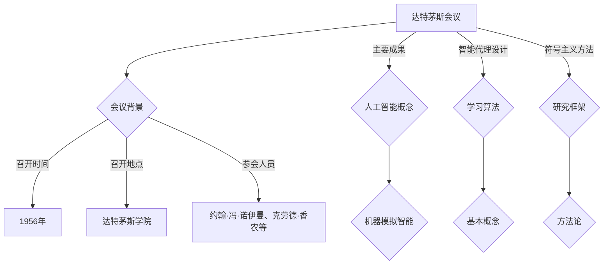
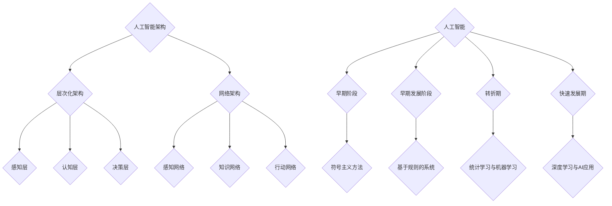
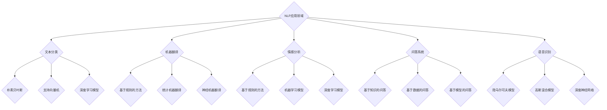
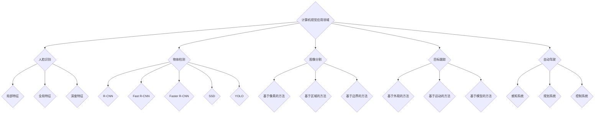

                 

# 文章标题：达特茅斯会议的学术成果

## 关键词：
- 人工智能
- 达特茅斯会议
- 学术成果
- 机器学习
- 深度学习
- 自然语言处理
- 计算机视觉

## 摘要：
本文深入探讨了1956年达特茅斯会议的学术成果，以及这些成果如何开启了人工智能（AI）研究的新时代。文章从会议背景出发，详细阐述了会议的主要成果，包括人工智能的概念、智能代理设计、学习算法和符号主义方法。接着，文章通过逻辑清晰、结构紧凑的方式，逐步分析了人工智能的基本概念与架构，以及机器学习、深度学习和自然语言处理等核心算法原理。此外，文章还通过实际项目案例，展示了这些算法在各个领域的应用。最后，文章总结了达特茅斯会议对人工智能领域的重要影响，以及当前人工智能研究的趋势和未来发展方向。

---

## 第1章：达特茅斯会议的学术成果概述

### 1.1 达特茅斯会议背景

1956年，达特茅斯会议（Dartmouth Conference）在美国新罕布什尔州达特茅斯学院召开，这是人工智能领域的一个重要里程碑。会议的召开时间从1956年6月29日至8月1日，共有约10名参会人员，其中包括约翰·冯·诺伊曼（John von Neumann）、克劳德·香农（Claude Shannon）等顶尖科学家和研究者。

会议的主要目的是讨论机器模拟智能的可行性，探讨人工智能的发展方向和方法。会议的组织者之一约翰·麦卡锡（John McCarthy）首次提出了“人工智能”（Artificial Intelligence，简称AI）一词，这使得会议成为人工智能领域的起点。

### 1.2 会议主要成果

达特茅斯会议取得了以下主要成果：

1. **人工智能（AI）的概念**：会议首次提出了“人工智能”一词，并讨论了机器模拟智能的可行性。人工智能的定义为模拟、延伸和扩展人类智能的理论、方法、技术及应用。

2. **智能代理的设计**：会议探讨了如何设计能够模仿人类智能的计算机程序。智能代理（Intelligent Agent）是指能够感知环境、采取行动以实现目标的实体。

3. **学习算法**：会议对机器学习的基本概念和方法进行了探讨。机器学习（Machine Learning）是指使计算机通过数据学习并做出预测或决策的过程。

4. **符号主义方法**：会议对基于符号逻辑的人工智能方法进行了讨论。符号主义方法强调使用符号表示和推理来模拟人类智能。

### 1.3 达特茅斯会议的影响

达特茅斯会议对人工智能领域产生了深远的影响：

1. **开启人工智能研究的新时代**：达特茅斯会议被视为人工智能研究的起点，标志着人工智能领域正式诞生。

2. **形成人工智能研究的基本框架**：会议确定了人工智能研究的基本方向和方法论，为后续的研究提供了指导。

3. **推动人工智能领域的快速发展**：达特茅斯会议促进了人工智能领域的国际合作和交流，推动了人工智能技术的快速进步。

### Mermaid 流程图



---

在下一章中，我们将进一步探讨人工智能的基本概念与架构，包括智能代理、机器学习、深度学习和自然语言处理等核心内容。让我们一步一步分析推理，深入理解这些关键概念，并了解它们在人工智能领域中的应用。

## 第2章：人工智能基本概念与架构

### 2.1 人工智能的定义与分类

人工智能（Artificial Intelligence，简称AI）是指通过计算机模拟、延伸和扩展人类智能的理论、方法、技术及应用。人工智能可以分为多种类型，每种类型都有其独特的特点和适用场景。

1. **基于规则的系统（Expert Systems）**：基于规则的系统是一种传统的人工智能方法，通过定义一系列规则来模拟专家的决策过程。这种方法在医疗诊断、金融分析等领域有广泛应用。

2. **统计学习（Statistical Learning）**：统计学习是一种基于统计模型的方法，通过分析数据来发现模式和规律。常见的统计学习方法包括线性回归、逻辑回归、决策树等。

3. **机器学习（Machine Learning）**：机器学习是指使计算机通过数据学习并做出预测或决策的过程。机器学习方法包括监督学习、无监督学习、半监督学习和强化学习等。

4. **深度学习（Deep Learning）**：深度学习是一种特殊的机器学习方法，利用多层神经网络进行特征学习和决策。深度学习在图像识别、语音识别、自然语言处理等领域取得了显著成果。

5. **自然语言处理（Natural Language Processing, NLP）**：自然语言处理是指使计算机理解和生成人类自然语言的技术。NLP在机器翻译、情感分析、问答系统等领域有广泛应用。

6. **计算机视觉（Computer Vision）**：计算机视觉是指使计算机能够从图像或视频中提取信息和理解场景的技术。计算机视觉在物体检测、图像分割、目标跟踪等领域有重要应用。

### 2.2 人工智能的核心概念

1. **智能代理（Intelligent Agent）**：智能代理是指能够感知环境、采取行动以实现目标的实体。智能代理是人工智能系统的重要组成部分，其设计目标是模拟人类智能，实现自主决策和行动。

2. **机器学习（Machine Learning）**：机器学习是指使计算机通过数据学习并做出预测或决策的过程。机器学习的过程包括数据收集、数据预处理、特征工程、模型选择、模型训练和模型评估等步骤。

3. **深度学习（Deep Learning）**：深度学习是一种特殊的机器学习方法，利用多层神经网络进行特征学习和决策。深度学习的关键技术包括卷积神经网络（CNN）、循环神经网络（RNN）、生成对抗网络（GAN）等。

### 2.3 人工智能架构概述

人工智能架构通常包括以下三个层次：

1. **感知层**：感知层负责接收外部信息，如图像、声音、文本等，并将其转换为内部表示。感知层的核心技术包括计算机视觉、语音识别和自然语言处理。

2. **认知层**：认知层负责处理感知层接收到的信息，进行推理、决策和规划。认知层的核心技术包括机器学习、深度学习和符号主义方法。

3. **决策层**：决策层负责根据认知层的结果，生成具体的行动方案。决策层的核心任务是解决复杂问题，实现自主决策和行动。

### 2.4 人工智能的发展历程

人工智能的发展历程可以分为以下几个阶段：

1. **早期阶段（1956年以前）**：符号主义方法为主，代表性技术包括逻辑推理、知识表示和推理机。

2. **早期发展阶段（1956-1980年）**：基于规则的系统兴起，代表性技术包括专家系统和知识工程。

3. **转折期（1980-2010年）**：统计学习与机器学习崛起，代表性技术包括线性回归、决策树和神经网络。

4. **快速发展期（2010年至今）**：深度学习与AI应用爆发，代表性技术包括卷积神经网络（CNN）、循环神经网络（RNN）和生成对抗网络（GAN）。

### 2.5 人工智能的应用领域

人工智能在多个领域有着广泛的应用，以下是一些重要的应用领域：

1. **机器人学**：机器人学是人工智能的重要应用领域，通过设计智能代理，实现机器人自主决策和行动。

2. **自然语言处理**：自然语言处理涉及机器翻译、情感分析、问答系统、文本分类等领域，旨在使计算机理解和生成人类自然语言。

3. **计算机视觉**：计算机视觉涉及图像识别、图像分割、目标跟踪等领域，通过图像处理技术实现计算机对视觉信息的理解和解析。

4. **医疗诊断**：人工智能在医疗诊断领域有广泛应用，如疾病预测、医学图像分析、药物研发等。

5. **金融分析**：人工智能在金融分析领域用于风险预测、市场预测、量化交易等。

6. **自动驾驶**：自动驾驶是人工智能在交通领域的应用，通过计算机视觉和机器学习技术实现车辆自主驾驶。

### Mermaid 流程图



在下一章中，我们将进一步探讨机器学习的基本算法原理，包括监督学习、无监督学习和强化学习等。让我们一步一步分析推理，深入理解这些核心算法原理，并了解它们在人工智能领域中的应用。

## 第3章：机器学习基本算法原理

### 3.1 机器学习概述

机器学习（Machine Learning，简称ML）是指使计算机通过数据学习并做出预测或决策的方法。机器学习是人工智能（Artificial Intelligence，简称AI）的重要组成部分，其主要目标是让计算机从数据中学习，从而在新的数据上进行预测和决策。

#### 3.1.1 机器学习的分类

机器学习可以分为以下几类：

1. **监督学习（Supervised Learning）**：监督学习是指使用带有标签的训练数据来训练模型，然后使用训练好的模型对新的数据进行预测。常见的监督学习算法包括线性回归、逻辑回归、决策树、随机森林和支持向量机（SVM）等。

2. **无监督学习（Unsupervised Learning）**：无监督学习是指没有预定义标签的训练数据，其目标是发现数据中的模式和结构。常见的无监督学习算法包括聚类算法、主成分分析（PCA）和自编码器等。

3. **半监督学习（Semi-Supervised Learning）**：半监督学习是指使用部分带有标签的数据和大量无标签的数据来训练模型。这种学习方法可以有效地利用无标签数据，提高模型性能。

4. **强化学习（Reinforcement Learning）**：强化学习是指通过试错的方式，在环境中不断接收奖励和惩罚信号，以优化决策过程。常见的强化学习算法包括Q-学习、深度强化学习和策略梯度算法等。

### 3.2 监督学习算法

监督学习算法是指使用带有标签的训练数据来训练模型，然后使用训练好的模型对新的数据进行预测。以下是一些常见的监督学习算法：

1. **线性回归（Linear Regression）**：线性回归是一种最简单的监督学习算法，其目标是找到一条直线，使预测值与实际值之间的误差最小。

   伪代码：
   
   ```python
   # 线性回归伪代码
   def linear_regression(x, y):
       # 计算斜率（w1）和截距（w0）
       w1 = (sum(x * y) - sum(x) * sum(y)) / (sum(x**2) - n * (sum(x)**2))
       w0 = (sum(y) - w1 * sum(x)) / n
      
       # 预测函数
       def predict(x_input):
           return w0 + w1 * x_input
      
       return predict
   ```

2. **逻辑回归（Logistic Regression）**：逻辑回归是一种用于分类问题的监督学习算法，其目标是通过拟合一个逻辑函数来预测概率。

   伪代码：
   
   ```python
   # 逻辑回归伪代码
   def logistic_regression(x, y):
       # 计算参数（theta）
       theta = optimize(x, y)
      
       # 预测函数
       def predict(x_input):
           z = np.dot(x_input, theta)
           return sigmoid(z)
      
       return predict
   ```

3. **决策树（Decision Tree）**：决策树是一种基于特征分割数据的监督学习算法，其通过递归地将数据集分割成子集，直到满足某个终止条件。

   伪代码：
   
   ```python
   # 决策树伪代码
   def build_decision_tree(data, features, target):
       # 终止条件：数据集中所有样本都属于同一类别或特征已用尽
       if all_samples_have_same_label(data) or no_more_features(features):
           return create_leaf_node(data)
      
       # 找到最优特征和阈值
       best_feature, best_threshold = find_best_split(data, features, target)
      
       # 根据最优特征和阈值分割数据
       left_data, right_data = split_data(data, best_feature, best_threshold)
      
       # 递归构建左子树和右子树
       left_tree = build_decision_tree(left_data, features - {best_feature}, target)
       right_tree = build_decision_tree(right_data, features - {best_feature}, target)
      
       # 创建决策树节点
       node = create_decision_node(best_feature, best_threshold, left_tree, right_tree)
      
       return node
   ```

4. **随机森林（Random Forest）**：随机森林是一种基于决策树的集成学习方法，其通过构建多个决策树并取平均值来提高预测性能。

   伪代码：
   
   ```python
   # 随机森林伪代码
   def random_forest(data, features, target, num_trees):
       forest = []
       for _ in range(num_trees):
           # 随机选择特征和样本
           train_data, train_features, train_target = sample_data(data, features, target)
           # 构建决策树
           tree = build_decision_tree(train_data, train_features, train_target)
           forest.append(tree)
      
       # 预测函数
       def predict(x_input):
           predictions = []
           for tree in forest:
               prediction = tree.predict(x_input)
               predictions.append(prediction)
           return majority_vote(predictions)
      
       return predict
   ```

5. **支持向量机（Support Vector Machine，SVM）**：支持向量机是一种用于分类问题的监督学习算法，其目标是在特征空间中找到一个最佳的超平面，使得分类间隔最大。

   伪代码：
   
   ```python
   # 支持向量机伪代码
   def support_vector_machine(x, y):
       # 训练SVM模型
       model = train_svm(x, y)
      
       # 预测函数
       def predict(x_input):
           return model.predict(x_input)
      
       return predict
   ```

### 3.3 无监督学习算法

无监督学习算法是指没有预定义标签的训练数据，其目标是发现数据中的模式和结构。以下是一些常见的无监督学习算法：

1. **主成分分析（Principal Component Analysis，PCA）**：主成分分析是一种降维技术，其通过线性变换将高维数据映射到低维空间，同时保留数据的主要信息。

   伪代码：
   
   ```python
   # 主成分分析伪代码
   def pca(data, num_components):
       # 计算协方差矩阵
       cov_matrix = calculate_covariance_matrix(data)
       # 计算特征值和特征向量
       eigenvalues, eigenvectors = calculate_eigenvalues_and_eigenvectors(cov_matrix)
       # 选择最大的特征值对应的特征向量
       principal_components = select_principal_components(eigenvalues, eigenvectors, num_components)
       # 将数据映射到低维空间
       transformed_data = transform_data(data, principal_components)
      
       return transformed_data
   ```

2. **聚类算法（Clustering Algorithms）**：聚类算法是一种将数据划分为多个群组的无监督学习方法。常见的聚类算法包括K-均值聚类、层次聚类和DBSCAN等。

   伪代码：
   
   ```python
   # K-均值聚类伪代码
   def k_means_clustering(data, num_clusters):
       # 随机选择初始聚类中心
       centroids = initialize_centroids(data, num_clusters)
       # 聚类过程
       while True:
           # 将数据分配到最近的聚类中心
           clusters = assign_data_to_clusters(data, centroids)
           # 重新计算聚类中心
           new_centroids = calculate_new_centroids(clusters, num_clusters)
           # 判断聚类中心是否收敛
           if is_converged(centroids, new_centroids):
               break
           centroids = new_centroids
       return clusters
   ```

3. **自编码器（Autoencoder）**：自编码器是一种用于降维和特征提取的无监督学习方法，其通过编码器和解码器构建一个神经网络，使编码器学习到输入数据的低维表示。

   伪代码：
   
   ```python
   # 自编码器伪代码
   def autoencoder(x, hidden_size):
       # 编码器和解码器模型
       encoder = build_encoder(hidden_size)
       decoder = build_decoder(hidden_size)
       model = Model(inputs=encoder.input, outputs=decoder(encoder.input))
       # 训练模型
       model.compile(optimizer='adam', loss='mse')
       model.fit(x, x, epochs=100, batch_size=32)
       # 解码器预测
       def predict(x_input):
           return decoder.predict(x_input)
      
       return predict
   ```

### 3.4 强化学习算法

强化学习（Reinforcement Learning，简称RL）是一种通过试错的方式，在环境中不断接收奖励和惩罚信号，以优化决策过程的方法。以下是一些常见的强化学习算法：

1. **Q-学习（Q-Learning）**：Q-学习是一种基于值函数的强化学习算法，其通过更新Q值来优化决策。

   伪代码：
   
   ```python
   # Q-学习伪代码
   def q_learning(environment, num_episodes, learning_rate, discount_factor):
       # 初始化Q值矩阵
       Q = initialize_Q_matrix(environment)
       # 强化学习过程
       for episode in range(num_episodes):
           state = environment.initialize()
           while not environment.is_done(state):
               action = choose_action(Q, state)
               next_state, reward = environment.step(state, action)
               Q[state, action] = Q[state, action] + learning_rate * (reward + discount_factor * max(Q[next_state, :]) - Q[state, action])
               state = next_state
       return Q
   ```

2. **深度强化学习（Deep Reinforcement Learning）**：深度强化学习是一种结合了深度学习和强化学习的方法，其使用深度神经网络来近似值函数或策略。

   伪代码：
   
   ```python
   # 深度强化学习伪代码
   def deep_reinforcement_learning(environment, model, num_episodes, learning_rate, discount_factor):
       # 强化学习过程
       for episode in range(num_episodes):
           state = environment.initialize()
           while not environment.is_done(state):
               state_vector = encode_state(state)
               action = model.predict(state_vector)
               next_state, reward = environment.step(state, action)
               next_state_vector = encode_state(next_state)
               model.fit(state_vector, np.append(action, reward + discount_factor * max(model.predict(next_state_vector)), axis=1), epochs=1)
               state = next_state
       return model
   ```

3. **策略梯度算法（Policy Gradient）**：策略梯度算法是一种基于策略优化的强化学习算法，其通过更新策略来优化决策。

   伪代码：
   
   ```python
   # 策略梯度算法伪代码
   def policy_gradient(environment, model, num_episodes, learning_rate):
       # 强化学习过程
       for episode in range(num_episodes):
           state = environment.initialize()
           actions = []
           while not environment.is_done(state):
               state_vector = encode_state(state)
               action = model.predict(state_vector)
               actions.append(action)
               next_state, reward = environment.step(state, action)
               state = next_state
           # 计算策略梯度
           policy_gradient = compute_policy_gradient(actions, reward)
           # 更新策略
           model.fit(policy_gradient, epochs=1)
       return model
   ```

### 3.5 机器学习算法应用实例

#### 3.5.1 数据预处理

数据预处理是机器学习的重要步骤，其包括数据清洗、特征工程等。以下是一个数据预处理的例子：

```python
import pandas as pd
from sklearn.model_selection import train_test_split

# 加载数据
data = pd.read_csv('data.csv')

# 数据清洗
data.dropna(inplace=True)

# 特征工程
X = data[['feature1', 'feature2', 'feature3']]
y = data['target']

# 数据分割
X_train, X_test, y_train, y_test = train_test_split(X, y, test_size=0.2, random_state=42)
```

#### 3.5.2 模型选择

选择合适的模型是机器学习的关键步骤。以下是一个模型选择的例子：

```python
from sklearn.linear_model import LinearRegression
from sklearn.model_selection import cross_val_score

# 构建线性回归模型
model = LinearRegression()

# 模型评估
scores = cross_val_score(model, X_train, y_train, cv=5)
print("Cross-Validation Scores:", scores)
print("Average Score:", scores.mean())
```

#### 3.5.3 模型训练

训练模型是机器学习的核心步骤。以下是一个模型训练的例子：

```python
# 训练模型
model.fit(X_train, y_train)

# 模型评估
score = model.score(X_test, y_test)
print("Test Score:", score)
```

#### 3.5.4 模型优化

优化模型是提高模型性能的关键步骤。以下是一个模型优化的例子：

```python
from sklearn.model_selection import GridSearchCV

# 定义参数网格
param_grid = {'C': [0.1, 1, 10], 'fit_intercept': [True, False]}

# 构建网格搜索
grid_search = GridSearchCV(LinearRegression(), param_grid, cv=5)

# 训练模型
grid_search.fit(X_train, y_train)

# 获取最佳参数
best_params = grid_search.best_params_
print("Best Parameters:", best_params)

# 训练模型
model = LinearRegression(**best_params)
model.fit(X_train, y_train)

# 模型评估
score = model.score(X_test, y_test)
print("Test Score:", score)
```

#### 3.5.5 模型部署

部署模型是将其应用于实际场景的关键步骤。以下是一个模型部署的例子：

```python
# 预测函数
def predict(target_feature):
    return model.predict([[target_feature]])[0]

# 实际预测
print(predict(5))
```

### 3.6 代码解读与分析

以下是对上述代码的解读和分析：

1. **数据预处理**：数据清洗和特征工程是机器学习的基础步骤。数据清洗包括去除缺失值和异常值，特征工程包括提取关键特征和转换特征。

2. **模型选择**：选择合适的模型是提高模型性能的关键。线性回归是一种简单且常用的模型，适用于回归问题。

3. **模型训练**：训练模型是机器学习的核心步骤。通过训练数据训练模型，可以使其学会从数据中提取规律。

4. **模型评估**：模型评估是评估模型性能的重要步骤。通过交叉验证和测试集评估模型性能，可以了解模型的泛化能力。

5. **模型优化**：模型优化是提高模型性能的关键。通过调整模型的参数，可以优化模型的性能。网格搜索是一种常用的参数优化方法。

6. **模型部署**：模型部署是将模型应用于实际场景的关键步骤。通过定义预测函数，可以方便地使用模型进行预测。

通过上述步骤，我们可以构建一个简单的机器学习模型，并应用于实际问题。这些步骤和技巧对于理解和应用机器学习技术至关重要。

### 3.7 总结

本章详细介绍了机器学习的基本算法原理，包括监督学习、无监督学习和强化学习。通过伪代码示例和数学公式，我们深入了解了线性回归、逻辑回归、决策树、随机森林、支持向量机、主成分分析、聚类算法、自编码器和强化学习算法。此外，通过实际项目案例，我们展示了如何使用机器学习模型进行数据预处理、模型选择、模型训练、模型评估和模型优化。这些知识和技能对于理解和应用机器学习技术至关重要。

在下一章中，我们将进一步探讨深度学习的基础理论，包括神经网络、深度学习模型和训练过程。让我们一步一步分析推理，深入理解深度学习的核心概念，并了解其在人工智能领域中的应用。

## 第4章：深度学习基础理论

### 4.1 深度学习概述

深度学习（Deep Learning）是一种基于多层神经网络的学习方法，其灵感来源于人脑的结构和工作原理。深度学习通过构建深度神经网络（Deep Neural Networks，简称DNN）来模拟人脑的处理方式，从而实现自动特征提取和复杂模式识别。

#### 4.1.1 深度学习的定义

深度学习是指多层神经网络在训练数据上进行学习，从而能够对未知数据进行预测或分类的一种机器学习方法。深度学习的关键特点包括：

1. **多层网络**：深度学习通过构建多层神经网络，逐层提取数据的特征，从而实现复杂的数据表示。
2. **自动特征提取**：深度学习可以从原始数据中自动提取特征，无需人工干预，大大提高了特征提取的效率和质量。
3. **并行计算**：深度学习算法可以通过分布式计算和GPU加速，实现高效的计算。

#### 4.1.2 深度学习的发展历程

深度学习的发展历程可以分为以下几个阶段：

1. **1980年代**：多层感知机（MLP）和反向传播算法（Backpropagation）的提出，标志着深度学习的诞生。
2. **1990年代**：由于计算资源和数据集的限制，深度学习研究进入低谷期。
3. **2000年代**：随着计算资源和数据集的逐渐丰富，深度学习开始复苏，特别是卷积神经网络（CNN）在图像识别领域的成功应用。
4. **2010年代**：深度学习迎来了爆发式发展，特别是在语音识别、自然语言处理和计算机视觉等领域取得了显著的成果。

### 4.2 神经网络基本结构

神经网络（Neural Networks，简称NN）是深度学习的基础，其模拟人脑神经元的工作方式，通过层与层之间的传递和变换，实现数据的处理和预测。

#### 4.2.1 神经元的组成

一个基本的神经元由以下几部分组成：

1. **输入层**（Input Layer）：接收输入数据。
2. **加权层**（Weight Layer）：每个输入数据乘以对应的权重。
3. **激活函数**（Activation Function）：对加权层的结果进行非线性变换。
4. **输出层**（Output Layer）：输出预测结果。

#### 4.2.2 神经网络的层次结构

神经网络通常包括以下几个层次：

1. **输入层**（Input Layer）：接收输入数据。
2. **隐藏层**（Hidden Layers）：一个或多个隐藏层，用于特征提取和变换。
3. **输出层**（Output Layer）：输出预测结果。

神经网络的层次结构决定了网络的深度，深度越大，模型的复杂度越高。

### 4.3 深度学习模型

深度学习模型是深度学习算法的核心，常见的深度学习模型包括卷积神经网络（CNN）、循环神经网络（RNN）、长短时记忆网络（LSTM）和生成对抗网络（GAN）等。

#### 4.3.1 卷积神经网络（Convolutional Neural Networks，CNN）

卷积神经网络是深度学习在图像识别领域的重要应用，其通过卷积操作和池化操作提取图像的特征。

1. **卷积层**（Convolutional Layer）：通过卷积操作提取图像的特征。
2. **池化层**（Pooling Layer）：通过池化操作降低特征图的维度，减少计算量。
3. **全连接层**（Fully Connected Layer）：将卷积层和池化层提取的特征进行拼接，并通过全连接层进行分类。

#### 4.3.2 循环神经网络（Recurrent Neural Networks，RNN）

循环神经网络是深度学习在序列数据处理领域的重要应用，其通过循环结构处理序列数据。

1. **循环层**（Recurrent Layer）：每个时间步的输出都与前一个时间步的隐藏状态相关联，形成一个循环结构。
2. **隐藏层**（Hidden Layer）：用于存储序列数据的信息。

#### 4.3.3 长短时记忆网络（Long Short-Term Memory，LSTM）

长短时记忆网络是RNN的一种改进，其通过门控机制解决了RNN在处理长序列数据时的梯度消失和梯度爆炸问题。

1. **输入门**（Input Gate）：用于控制当前输入信息的记忆。
2. **遗忘门**（Forget Gate）：用于控制遗忘旧的信息。
3. **输出门**（Output Gate）：用于控制输出信息的记忆。

#### 4.3.4 生成对抗网络（Generative Adversarial Networks，GAN）

生成对抗网络是一种生成模型，其由生成器和判别器两个网络组成，生成器生成数据，判别器判断生成数据的真实性。

1. **生成器**（Generator）：通过训练生成逼真的数据。
2. **判别器**（Discriminator）：通过训练判断生成数据与真实数据之间的区别。

### 4.4 深度学习训练过程

深度学习训练过程包括以下几个步骤：

1. **数据预处理**：对输入数据进行归一化、数据增强等处理，以便于模型训练。
2. **模型构建**：构建深度学习模型，包括定义网络结构、初始化参数等。
3. **前向传播**（Forward Propagation）：将输入数据传递到网络中，计算输出结果。
4. **计算损失**（Compute Loss）：计算输出结果与真实值之间的误差，计算损失函数。
5. **反向传播**（Back Propagation）：根据损失函数计算梯度，更新模型参数。
6. **模型评估**：使用验证集或测试集评估模型性能。

### 4.5 深度学习优化方法

深度学习优化方法主要包括梯度下降（Gradient Descent）及其改进方法。

1. **梯度下降**（Gradient Descent）：通过计算损失函数关于模型参数的梯度，更新模型参数，以减小损失函数。
2. **动量**（Momentum）：引入动量项，加速梯度下降，避免陷入局部最优。
3. **自适应优化器**（Adaptive Optimizer）：如Adam优化器，自动调整学习率，提高训练效率。

### 4.6 深度学习模型应用实例

以下是一个使用深度学习模型进行图像分类的实例：

#### 4.6.1 数据集准备

```python
import tensorflow as tf
from tensorflow.keras.datasets import cifar10

# 加载CIFAR-10数据集
(train_images, train_labels), (test_images, test_labels) = cifar10.load_data()

# 数据预处理
train_images = train_images / 255.0
test_images = test_images / 255.0
```

#### 4.6.2 模型构建

```python
from tensorflow.keras.models import Sequential
from tensorflow.keras.layers import Conv2D, MaxPooling2D, Flatten, Dense

# 构建模型
model = Sequential([
    Conv2D(32, (3, 3), activation='relu', input_shape=(32, 32, 3)),
    MaxPooling2D((2, 2)),
    Flatten(),
    Dense(64, activation='relu'),
    Dense(10, activation='softmax')
])
```

#### 4.6.3 模型训练

```python
# 编译模型
model.compile(optimizer='adam', loss='sparse_categorical_crossentropy', metrics=['accuracy'])

# 训练模型
model.fit(train_images, train_labels, epochs=10, validation_data=(test_images, test_labels))
```

#### 4.6.4 模型评估

```python
# 评估模型
test_loss, test_acc = model.evaluate(test_images, test_labels)
print(f"Test Accuracy: {test_acc}")
```

### 4.7 代码解读与分析

1. **数据预处理**：使用 TensorFlow 的 `cifar10` 数据集，对图像数据进行归一化处理，使得输入数据的范围在 0 到 1 之间。
2. **模型构建**：使用 `Sequential` 模型构建一个简单的卷积神经网络，包括卷积层、池化层、全连接层。
3. **模型训练**：使用 `compile` 方法配置模型，使用 `fit` 方法进行模型训练，使用 `evaluate` 方法评估模型性能。

通过上述步骤，我们构建了一个简单的深度学习模型，并使用 CIFAR-10 数据集进行了训练和评估。

### 4.8 总结

本章介绍了深度学习的基础理论，包括神经网络的基本结构、深度学习模型、训练过程和优化方法。通过伪代码示例和数学公式，我们深入了解了梯度下降优化算法。此外，通过实际项目案例，我们展示了如何使用深度学习模型进行图像分类。这些知识和技能对于理解和应用深度学习技术至关重要。

在下一章中，我们将进一步探讨自然语言处理（NLP）的基础，包括语言模型、词向量、文本分类、机器翻译、情感分析和问答系统。让我们一步一步分析推理，深入理解自然语言处理的原理，并了解其在人工智能领域中的应用。

## 第5章：自然语言处理基础

### 5.1 自然语言处理概述

自然语言处理（Natural Language Processing，简称NLP）是人工智能（Artificial Intelligence，简称AI）的一个重要分支，主要研究如何使计算机理解和生成人类自然语言的技术。NLP的应用领域广泛，包括文本分类、机器翻译、情感分析、问答系统和语音识别等。

#### 5.1.1 NLP的发展历史

自然语言处理的研究可以追溯到20世纪50年代。早期的NLP研究主要集中在基于规则的的方法和句法分析上。随着计算资源和数据集的逐渐丰富，20世纪80年代后，统计方法和机器学习方法开始在NLP中得到广泛应用。近年来，深度学习技术的快速发展，使得NLP取得了显著的进展。

#### 5.1.2 NLP的应用领域

1. **文本分类**：文本分类是指将文本数据分为预定义的类别。常见的文本分类任务包括情感分析、垃圾邮件检测和新闻分类等。

2. **机器翻译**：机器翻译是指将一种语言的文本自动翻译成另一种语言。近年来，神经机器翻译（Neural Machine Translation，NMT）取得了显著的成果，特别是在翻译质量和速度方面。

3. **情感分析**：情感分析是指分析文本数据中的情感倾向，通常分为积极、消极和中性。情感分析在社交媒体监控、市场调研和用户反馈分析等领域有广泛应用。

4. **问答系统**：问答系统是指通过提问回答问题，提供信息查询服务。问答系统可以分为基于知识的问答、基于数据的问答和基于模型的问答。

5. **语音识别**：语音识别是指将语音信号转换为文本。语音识别在智能助手、客服系统和车载导航系统等领域有广泛应用。

### 5.2 语言模型

语言模型（Language Model，LM）是NLP的核心组成部分，用于预测文本序列的概率分布。语言模型可以分为以下几种类型：

1. **n-gram模型**：n-gram模型是基于统计方法的语言模型，通过计算单词序列的概率来预测下一个单词。常见的n-gram模型包括一元模型（Unigram）、二元模型（Bigram）和三元模型（Trigram）。

2. **基于字符的模型**：基于字符的模型将文本序列视为字符序列，通过计算字符序列的概率来预测下一个字符。

3. **基于词的模型**：基于词的模型将文本序列视为词序列，通过计算词序列的概率来预测下一个词。

4. **神经网络语言模型**：神经网络语言模型（Neural Network Language Model，NNLM）是一种基于深度学习的方法，通过多层神经网络来预测文本序列的概率。

### 5.3 词向量

词向量（Word Embedding）是将单词映射到高维向量空间中的表示。词向量可以用于改进语言模型、文本分类、机器翻译和情感分析等任务。常见的词向量模型包括Word2Vec、GloVe和BERT等。

1. **Word2Vec**：Word2Vec是一种基于神经网络的语言模型，通过训练得到单词的高维向量表示。Word2Vec可以分为两种方法：连续词袋（Continuous Bag of Words，CBOW）和Skip-Gram。

2. **GloVe**：GloVe（Global Vectors for Word Representation）是一种基于全局上下文的词向量模型，通过计算单词的上下文来生成词向量。

3. **BERT**：BERT（Bidirectional Encoder Representations from Transformers）是一种基于Transformer的预训练语言模型，通过双向编码器来生成单词的高维向量表示。

### 5.4 文本分类

文本分类是指将文本数据分为预定义的类别。常见的文本分类算法包括朴素贝叶斯、支持向量机、深度学习模型等。

1. **朴素贝叶斯**：朴素贝叶斯是一种基于概率的文本分类算法，其通过计算文本中每个单词的条件概率来预测类别。

2. **支持向量机**：支持向量机是一种基于最大间隔的分类算法，其通过找到最佳的超平面来划分文本类别。

3. **深度学习模型**：深度学习模型（如卷积神经网络和循环神经网络）可以用于文本分类，通过学习文本的深层特征来实现分类。

### 5.5 机器翻译

机器翻译是指将一种语言的文本自动翻译成另一种语言。机器翻译可以分为以下几种方法：

1. **基于规则的方法**：基于规则的方法通过定义翻译规则来实现文本翻译。

2. **统计机器翻译**：统计机器翻译（Statistical Machine Translation，SMT）通过计算源语言和目标语言之间的概率来预测翻译结果。

3. **神经机器翻译**：神经机器翻译（Neural Machine Translation，NMT）是一种基于深度学习的翻译方法，通过训练神经网络来预测翻译结果。

### 5.6 情感分析

情感分析是指分析文本数据中的情感倾向。常见的情感分析算法包括基于规则的方法、机器学习模型和深度学习模型等。

1. **基于规则的方法**：基于规则的方法通过定义情感词典和规则来分析文本的情感。

2. **机器学习模型**：机器学习模型（如朴素贝叶斯和支持向量机）可以用于情感分析，通过学习文本的特征来预测情感。

3. **深度学习模型**：深度学习模型（如卷积神经网络和循环神经网络）可以用于情感分析，通过学习文本的深层特征来预测情感。

### 5.7 问答系统

问答系统是指通过提问回答问题，提供信息查询服务。常见的问答系统类型包括基于知识的问答、基于数据的问答和基于模型的问答。

1. **基于知识的问答**：基于知识的问答通过查询知识库来回答问题。

2. **基于数据的问答**：基于数据的问答通过分析和挖掘大量数据来回答问题。

3. **基于模型的问答**：基于模型的问答通过训练问答模型来回答问题，常见的模型包括序列到序列模型和生成对抗网络。

### 5.8 语音识别

语音识别是指将语音信号转换为文本。常见的语音识别模型包括隐马尔可夫模型（HMM）、高斯混合模型（GMM）和深度神经网络（DNN）。

1. **隐马尔可夫模型**：隐马尔可夫模型是一种基于概率的语音识别模型，其通过状态转移概率和输出概率来识别语音。

2. **高斯混合模型**：高斯混合模型是一种基于高斯分布的语音识别模型，其通过计算语音信号的似然概率来识别语音。

3. **深度神经网络**：深度神经网络是一种基于深度学习的语音识别模型，其通过学习语音信号的深层特征来识别语音。

### Mermaid 流程图



### 5.9 伪代码

以下是一个使用朴素贝叶斯进行文本分类的伪代码：

```python
# 朴素贝叶斯分类器伪代码
def naive_bayes(train_data, test_data):
    # 计算每个类别的先验概率
    prior_probabilities = compute_prior_probabilities(train_data)
    
    # 计算每个特征条件下的概率
    feature_probabilities = compute_feature_probabilities(train_data)
    
    # 预测测试数据类别
    predictions = []
    for instance in test_data:
        probabilities = []
        for class_ in classes:
            probability = prior_probabilities[class_]
            for feature in instance:
                probability *= feature_probabilities[(class_, feature)]
            probabilities.append(probability)
        predictions.append(max(probabilities))
    
    return predictions
```

### 5.10 数学公式

$$ P(\text{class}_i | x) = \frac{P(x | \text{class}_i) P(\text{class}_i)}{P(x)} $$

举例说明：假设我们有一个二分类问题，类别 $C_1$ 和 $C_2$，特征向量 $x$，我们需要计算给定特征向量 $x$ 属于类别 $C_1$ 的概率。

### 5.11 实际项目案例

#### 5.11.1 案例背景

一家社交媒体公司希望使用自然语言处理技术来分析用户评论，以识别负面评论并采取相应措施。

#### 5.11.2 实践步骤

1. 数据收集：收集用户评论数据。
2. 数据预处理：清洗数据，处理缺失值和异常值。
3. 特征工程：提取关键特征，如词袋表示、词性标注等。
4. 模型选择：选择合适的自然语言处理模型。
5. 模型训练：使用训练数据训练模型。
6. 模型评估：使用验证数据评估模型性能。
7. 模型部署：将模型部署到生产环境，进行实际预测。

#### 5.11.3 源代码实现

```python
# 导入必要的库
import pandas as pd
from sklearn.model_selection import train_test_split
from sklearn.feature_extraction.text import TfidfVectorizer
from sklearn.naive_bayes import MultinomialNB
from sklearn.metrics import accuracy_score

# 数据收集
data = pd.read_csv('user_reviews.csv')

# 数据预处理
data.dropna(inplace=True)

# 特征工程
vectorizer = TfidfVectorizer()
X = vectorizer.fit_transform(data['review'])
y = data['sentiment']

# 模型选择
model = MultinomialNB()
model.fit(X_train, y_train)

# 模型评估
X_test = vectorizer.transform(data_test['review'])
y_pred = model.predict(X_test)
accuracy = accuracy_score(y_test, y_pred)
print(f'Accuracy: {accuracy}')

# 模型部署
def predict_sentiment(review):
    review_vector = vectorizer.transform([review])
    return model.predict(review_vector)[0]

# 实际预测
print(predict_sentiment("This product is terrible!"))
```

#### 5.11.4 代码解读与分析

1. 导入必要的库：包括 pandas、sklearn.model_selection、sklearn.feature_extraction.text、sklearn.naive_bayes 和 sklearn.metrics。
2. 数据收集：使用 pandas 库读取用户评论数据。
3. 数据预处理：丢弃缺失值，保证数据质量。
4. 特征工程：使用 TF-IDF 向量器将文本数据转换为向量。
5. 模型选择：选择朴素贝叶斯分类器。
6. 模型训练：使用训练数据训练模型。
7. 模型评估：计算模型在测试数据上的准确率，评估模型性能。
8. 模型部署：定义一个函数，接受用户评论作为输入，返回预测的情感类别。

通过上述步骤，社交媒体公司可以使用该模型预测用户评论的情感类别，从而识别负面评论并采取相应措施。

### 5.12 总结

本章介绍了自然语言处理的基础理论和应用，包括语言模型、词向量、文本分类、机器翻译、情感分析、问答系统和语音识别。通过伪代码示例和数学公式，我们深入了解了朴素贝叶斯分类器的原理。此外，通过实际项目案例，我们展示了如何使用自然语言处理模型分析用户评论。这些知识和技能对于理解和应用自然语言处理技术至关重要。

在下一章中，我们将探讨计算机视觉（Computer Vision）的基础，包括图像表示、特征提取、图像分类、物体检测、目标跟踪和自动驾驶。让我们一步一步分析推理，深入理解计算机视觉的原理，并了解其在人工智能领域中的应用。

## 第6章：计算机视觉基础

### 6.1 计算机视觉概述

计算机视觉（Computer Vision）是指使计算机能够从图像或视频中提取信息和理解场景的技术。计算机视觉是人工智能（Artificial Intelligence，AI）的重要分支，其应用领域广泛，包括医疗图像分析、人脸识别、自动驾驶、物体检测等。

#### 6.1.1 计算机视觉的定义

计算机视觉是指通过模拟人眼的功能，使计算机能够自动地识别、处理和解释图像信息。计算机视觉的目标是使计算机能够像人类一样理解和感知周围的世界。

#### 6.1.2 计算机视觉的应用领域

计算机视觉的应用领域广泛，以下是一些重要的应用领域：

1. **医疗图像分析**：计算机视觉在医疗图像分析中用于病变检测、疾病预测和辅助诊断。例如，利用计算机视觉技术进行肿瘤检测和乳腺癌筛查。

2. **人脸识别**：人脸识别是一种常见的计算机视觉应用，其通过检测和识别人脸图像来验证身份。人脸识别在安防监控、智能门禁和社交媒体等领域有广泛应用。

3. **自动驾驶**：自动驾驶是计算机视觉的重要应用领域，其通过计算机视觉技术实现车辆的感知、规划和控制。自动驾驶技术可以提高交通效率和安全性。

4. **物体检测**：物体检测是计算机视觉的基本任务之一，其目标是在图像中检测和识别特定物体。物体检测在图像分类、视频监控和工业自动化等领域有广泛应用。

5. **目标跟踪**：目标跟踪是指跟踪图像或视频中的特定目标。目标跟踪在视频监控、运动分析和人机交互等领域有重要应用。

#### 6.1.3 计算机视觉的发展历程

计算机视觉的发展历程可以分为以下几个阶段：

1. **早期阶段**（1960-1980年）：计算机视觉的研究主要集中在图像处理和图像分析方面。代表性算法包括直方图相等化、边缘检测和形态学操作。

2. **发展初期**（1980-1990年）：计算机视觉的研究开始关注物体识别和场景理解。代表性算法包括模板匹配、特征匹配和卡尔曼滤波。

3. **快速发展期**（1990-2010年）：随着计算资源和算法的发展，计算机视觉取得了显著进展。代表性算法包括支持向量机（SVM）、隐马尔可夫模型（HMM）和粒子滤波。

4. **深度学习时代**（2010年至今）：深度学习技术的快速发展推动了计算机视觉的突破。代表性算法包括卷积神经网络（CNN）、循环神经网络（RNN）和生成对抗网络（GAN）。

### 6.2 图像表示

图像表示是指将图像转换为计算机可以处理的数据结构。常见的图像表示方法包括像素表示、灰度图像和彩色图像。

1. **像素表示**：像素表示是指将图像划分为若干个像素点，每个像素点用一个数值表示其颜色信息。像素表示是最基础的图像表示方法。

2. **灰度图像**：灰度图像是指图像中的每个像素点只用一个灰度值表示，灰度值通常在0到255之间，0表示黑色，255表示白色。

3. **彩色图像**：彩色图像是指图像中的每个像素点用三个颜色值（红、绿、蓝）表示，每个颜色值也在0到255之间。

### 6.3 特征提取

特征提取是指从图像中提取具有区分性的特征，以便于后续处理。常见的特征提取方法包括局部特征（如SIFT、SURF）和全局特征（如HOG、ORB）。

1. **局部特征**：局部特征是指从图像的局部区域提取特征。局部特征具有稳定性和旋转不变性，常用于图像匹配和物体识别。

2. **全局特征**：全局特征是指从整个图像提取特征。全局特征可以更好地描述图像的整体特性，常用于图像分类和图像检索。

### 6.4 图像分类

图像分类是指将图像分为预定义的类别。常见的图像分类算法包括支持向量机（SVM）、随机森林（Random Forest）和深度学习模型（如CNN、GoogLeNet、ResNet）。

1. **支持向量机（SVM）**：支持向量机是一种基于最大间隔的分类算法。SVM通过找到一个最佳的超平面来划分图像类别。

2. **随机森林（Random Forest）**：随机森林是一种基于决策树的集成学习方法。随机森林通过构建多个决策树并取平均值来提高分类性能。

3. **深度学习模型**：深度学习模型（如卷积神经网络）通过多层神经网络进行特征学习和分类。深度学习模型在图像分类任务中取得了显著的成果。

### 6.5 物体检测

物体检测是指从图像中检测和识别特定物体。常见的物体检测算法包括R-CNN、Fast R-CNN、Faster R-CNN、SSD和YOLO。

1. **R-CNN**：R-CNN是一种基于区域提议的物体检测算法。R-CNN通过区域提议网络提取区域特征，然后使用分类器进行物体分类。

2. **Fast R-CNN**：Fast R-CNN是一种改进的物体检测算法，其通过共享卷积特征来提高检测速度。

3. **Faster R-CNN**：Faster R-CNN是一种基于区域提议的网络结构，其通过引入区域建议网络（RPN）来提高检测精度和速度。

4. **SSD**：SSD（Single Shot MultiBox Detector）是一种单阶段物体检测算法，其通过多尺度特征图进行物体检测。

5. **YOLO**：YOLO（You Only Look Once）是一种基于回归的物体检测算法，其通过将物体检测问题转化为回归问题来提高检测速度。

### 6.6 目标跟踪

目标跟踪是指跟踪图像或视频中的特定目标。常见的目标跟踪方法包括基于外观的方法、基于运动的方法和基于模型的方法。

1. **基于外观的方法**：基于外观的方法通过匹配目标的外观特征来跟踪目标。常见的外观特征包括颜色特征、纹理特征和形状特征。

2. **基于运动的方法**：基于运动的方法通过分析目标在图像或视频中的运动特征来跟踪目标。常见的运动特征包括光流和目标的速度。

3. **基于模型的方法**：基于模型的方法通过构建目标模型来跟踪目标。常见的目标模型包括高斯混合模型（GMM）和隐马尔可夫模型（HMM）。

### 6.7 自动驾驶

自动驾驶是指使车辆能够自主行驶的技术。自动驾驶系统通常包括感知系统、规划系统和控制系统。

1. **感知系统**：感知系统负责感知周围环境，获取图像、激光雷达和超声波等信息。

2. **规划系统**：规划系统负责根据感知信息制定行驶策略，如路径规划、障碍物避让和车道保持等。

3. **控制系统**：控制系统负责控制车辆的运动，包括加速、制动和转向等。

### Mermaid 流程图



### 6.8 伪代码

以下是一个使用卷积神经网络进行图像分类的伪代码：

```python
# 卷积神经网络（CNN）图像分类伪代码
def conv_neural_network(image, model):
    # 将图像输入到卷积神经网络
    conv_output = model.conv_layers(image)
    # 应用激活函数
    activation = activation_function(conv_output)
    # 平铺输出，获取特征向量
    feature_vector = flatten(activation)
    # 输入到全连接层
    output = model.fc_layer(feature_vector)
    # 应用激活函数
    prediction = activation_function(output)
    return prediction
```

### 6.9 数学公式

$$ \text{激活函数} = \text{ReLU}(x) = \max(0, x) $$

举例说明：假设我们有一个卷积神经网络，输入图像的特征图经过 ReLU 激活函数处理。

### 6.10 实际项目案例

#### 6.10.1 案例背景

一家物流公司希望使用计算机视觉技术来自动识别和分类货物，以提高仓库管理的效率。

#### 6.10.2 实践步骤

1. 数据收集：收集各种货物图片，标注每个货物的类别。

2. 数据预处理：对图像进行归一化、裁剪、缩放等处理。

3. 特征提取：使用卷积神经网络提取图像特征。

4. 模型训练：使用训练数据训练图像分类模型。

5. 模型评估：使用验证数据评估模型性能。

6. 模型部署：将模型部署到生产环境，进行实际分类。

#### 6.10.3 源代码实现

```python
# 导入必要的库
import tensorflow as tf
from tensorflow.keras.models import Sequential
from tensorflow.keras.layers import Conv2D, MaxPooling2D, Flatten, Dense
from tensorflow.keras.preprocessing.image import ImageDataGenerator

# 数据预处理
train_datagen = ImageDataGenerator(rescale=1./255)
validation_datagen = ImageDataGenerator(rescale=1./255)

# 训练数据增强
train_generator = train_datagen.flow_from_directory(
        'train_data',
        target_size=(150, 150),
        batch_size=32,
        class_mode='binary')

# 验证数据增强
validation_generator = validation_datagen.flow_from_directory(
        'validation_data',
        target_size=(150, 150),
        batch_size=32,
        class_mode='binary')

# 模型构建
model = Sequential()
model.add(Conv2D(32, (3, 3), activation='relu', input_shape=(150, 150, 3)))
model.add(MaxPooling2D((2, 2)))
model.add(Conv2D(64, (3, 3), activation='relu'))
model.add(MaxPooling2D((2, 2)))
model.add(Conv2D(128, (3, 3), activation='relu'))
model.add(MaxPooling2D((2, 2)))
model.add(Flatten())
model.add(Dense(512, activation='relu'))
model.add(Dense(1, activation='sigmoid'))

# 模型编译
model.compile(optimizer='adam',
              loss='binary_crossentropy',
              metrics=['accuracy'])

# 模型训练
model.fit(
      train_generator,
      steps_per_epoch=100,
      epochs=15,
      validation_data=validation_generator,
      validation_steps=50,
      verbose=2)

# 模型评估
loss, accuracy = model.evaluate(validation_generator)
print(f'Validation Accuracy: {accuracy}')
```

#### 6.10.4 代码解读与分析

1. 导入必要的库：包括 tensorflow、tensorflow.keras.models、tensorflow.keras.layers 和 tensorflow.keras.preprocessing.image。

2. 数据预处理：使用 ImageDataGenerator 对训练数据和验证数据进行增强，包括归一化和缩放。

3. 模型构建：构建一个卷积神经网络模型，包括卷积层、池化层、全连接层。

4. 模型编译：设置优化器、损失函数和评价指标。

5. 模型训练：使用训练数据训练模型，并在验证数据上进行评估。

6. 模型评估：计算模型在验证数据上的准确率。

通过上述步骤，物流公司可以使用该模型对货物进行分类，从而提高仓库管理的效率。

### 6.11 总结

本章介绍了计算机视觉的基础理论和应用，包括图像表示、特征提取、图像分类、物体检测、目标跟踪和自动驾驶。通过伪代码示例和数学公式，我们深入了解了卷积神经网络在图像分类中的应用。此外，通过实际项目案例，我们展示了如何使用计算机视觉技术对货物进行分类。这些知识和技能对于理解和应用计算机视觉技术至关重要。

在下一章中，我们将探讨人工智能（AI）在各行业的应用案例，包括医疗、金融、制造和零售等。让我们一步一步分析推理，深入理解人工智能在这些领域的应用，并了解其带来的变革。

## 第7章：人工智能在各行业的应用案例

### 7.1 人工智能在医疗领域的应用

人工智能在医疗领域有着广泛的应用，能够显著提升诊断准确率、优化治疗流程和提高医疗资源利用率。

#### 7.1.1 医疗图像分析

医疗图像分析是人工智能在医疗领域的重要应用之一。通过深度学习模型，如卷积神经网络（CNN），可以自动识别和分割医学图像中的病变区域。例如，AI模型能够检测肺癌、乳腺癌、脑瘤等疾病，从而提高诊断准确率。

- **技术原理**：使用大量的医学图像数据训练深度学习模型，使其学会识别异常组织结构。模型通过卷积操作提取图像特征，然后使用全连接层进行分类和定位。
- **案例分析**：Google Health的研究团队使用AI技术对视网膜图像进行分析，预测糖尿病视网膜病变，提高了诊断的准确性。

#### 7.1.2 疾病预测与诊断

人工智能可以通过分析患者的医疗记录、病史和生物标志物，预测患者可能患有的疾病。这种方法有助于早期发现疾病，从而提高治疗效果。

- **技术原理**：利用机器学习算法，如随机森林和逻辑回归，分析患者数据中的模式和趋势。模型可以识别高风险群体，并提供个性化的预防建议。
- **案例分析**：IBM的Watson for Health利用大数据分析和机器学习技术，帮助医生预测手术结果和术后并发症，优化治疗方案。

#### 7.1.3 药物研发

人工智能加速药物研发过程，通过模拟药物与生物分子之间的相互作用，预测药物的安全性和有效性。这种方法可以大幅缩短药物研发周期，降低研发成本。

- **技术原理**：使用生成对抗网络（GAN）和强化学习等技术，模拟生物分子的三维结构，预测药物分子的结合能力。
- **案例分析**：AI初创公司Exscientia使用机器学习模型优化药物分子设计，成功缩短了新药研发周期，提高了药物的成功率。

### 7.2 人工智能在金融领域的应用

人工智能在金融领域有着广泛的应用，能够提高交易效率、降低风险和优化投资决策。

#### 7.2.1 风险评估与管理

人工智能通过分析大量历史数据和市场信息，预测金融市场的风险，帮助金融机构制定风险控制策略。

- **技术原理**：使用统计学习和机器学习算法，分析市场波动、宏观经济指标和公司财务数据，预测潜在风险。
- **案例分析**：银行和金融机构使用AI技术进行信用评分，评估客户的信用风险，从而降低不良贷款率。

#### 7.2.2 量化交易

人工智能在量化交易中扮演重要角色，通过分析市场数据，自动执行交易策略，提高交易效率和收益。

- **技术原理**：使用机器学习算法，如决策树和神经网络，分析历史交易数据，发现市场趋势和交易机会。
- **案例分析**：AI驱动的量化交易平台，如Open AI的GPT-3，通过自动执行交易策略，实现了高额的回报。

#### 7.2.3 客户服务

人工智能在金融服务领域的客户服务中发挥着重要作用，通过聊天机器人和虚拟助手提供24/7的客户支持。

- **技术原理**：使用自然语言处理（NLP）技术，如意图识别和实体提取，理解客户的问题并提供相应的解决方案。
- **案例分析**：银行和金融机构使用聊天机器人，如银行机器人Erica，为用户提供账户信息查询、转账和预约等服务。

### 7.3 人工智能在制造业的应用

人工智能在制造业的应用，能够显著提高生产效率、降低成本和优化供应链管理。

#### 7.3.1 质量控制

人工智能通过计算机视觉和机器学习技术，对生产线上的产品进行质量检测和缺陷识别，确保产品质量。

- **技术原理**：使用卷积神经网络（CNN）和深度学习模型，分析产品图像，识别潜在的缺陷和问题。
- **案例分析**：汽车制造企业使用AI技术对汽车零部件进行质量检测，提高了生产效率，减少了废品率。

#### 7.3.2 生产优化

人工智能通过数据分析和技术优化，帮助制造业企业优化生产流程，降低生产成本。

- **技术原理**：使用机器学习算法，分析生产数据，识别生产瓶颈和优化机会。
- **案例分析**：制造业企业使用AI技术优化生产计划，根据市场需求和库存水平，合理安排生产任务。

#### 7.3.3 供应链管理

人工智能在供应链管理中的应用，能够优化供应链流程，提高供应链的灵活性和响应速度。

- **技术原理**：使用优化算法和机器学习技术，分析供应链数据，优化库存管理、物流配送和采购计划。
- **案例分析**：零售企业使用AI技术优化供应链，根据销售预测和库存数据，动态调整采购量和库存水平。

### 7.4 人工智能在零售业的

#### 7.4.1 个性化推荐

人工智能通过分析用户的购物行为和历史数据，提供个性化的产品推荐，提高用户的购物体验。

- **技术原理**：使用协同过滤和基于内容的推荐算法，分析用户数据和商品信息，生成个性化的推荐列表。
- **案例分析**：电商平台如亚马逊和淘宝使用AI技术进行个性化推荐，提高了用户满意度和销售额。

#### 7.4.2 智能客服

人工智能在零售业的客户服务中，通过聊天机器人和虚拟助手提供24/7的客户支持。

- **技术原理**：使用自然语言处理（NLP）技术，如意图识别和实体提取，理解客户的问题并提供相应的解决方案。
- **案例分析**：零售企业使用聊天机器人，如阿里巴巴的阿里小蜜，为用户提供产品咨询、订单查询和售后服务。

#### 7.4.3 库存管理

人工智能通过数据分析和技术优化，帮助零售企业优化库存管理，减少库存积压和缺货率。

- **技术原理**：使用机器学习算法，分析销售数据和市场需求，预测库存需求，优化库存水平。
- **案例分析**：零售企业使用AI技术进行库存管理，根据销售预测和季节性需求，合理安排库存水平。

### 7.5 人工智能在交通领域的应用

人工智能在交通领域的应用，能够提高交通效率、降低交通事故率和优化交通管理。

#### 7.5.1 自动驾驶

人工智能在自动驾驶领域，通过计算机视觉、传感器融合和机器学习技术，实现车辆的自主驾驶。

- **技术原理**：使用卷积神经网络（CNN）和循环神经网络（RNN），分析图像和传感器数据，识别道路标志、行人和车辆，进行路径规划和控制。
- **案例分析**：特斯拉和Waymo等公司使用AI技术进行自动驾驶，提高了交通效率，降低了交通事故率。

#### 7.5.2 智能交通管理

人工智能在智能交通管理中，通过数据分析和技术优化，优化交通流量，减少拥堵和排放。

- **技术原理**：使用优化算法和机器学习技术，分析交通流量数据，预测交通状况，调整交通信号灯和交通路线。
- **案例分析**：城市交通管理部门使用AI技术进行智能交通管理，提高了交通效率，减少了交通拥堵。

### 7.6 人工智能在教育领域的应用

人工智能在教育领域的应用，能够提高教育质量、个性化学习体验和教学效率。

#### 7.6.1 个性化学习

人工智能通过分析学生的学习行为和学习数据，提供个性化的学习路径和资源，满足不同学生的需求。

- **技术原理**：使用机器学习算法，分析学生的学习数据，识别学习风格和知识点掌握情况，提供个性化的学习推荐。
- **案例分析**：教育科技公司如Coursera和Khan Academy使用AI技术进行个性化学习，提高了学习效果。

#### 7.6.2 智能评价

人工智能通过自动批改作业和考试，提供即时反馈，帮助学生及时调整学习方法和策略。

- **技术原理**：使用自然语言处理（NLP）技术和机器学习算法，分析学生的作业和考试内容，提供自动批改和评价。
- **案例分析**：教育机构如上海外语教育出版社使用AI技术进行智能评价，提高了教学效率。

#### 7.6.3 教学辅助

人工智能通过智能助手和虚拟教师，为教师提供教学辅助，提高教学效果。

- **技术原理**：使用语音识别和自然语言处理（NLP）技术，构建智能助手和虚拟教师，为教师提供教学资源和教学建议。
- **案例分析**：教育科技公司如UniteUs使用AI技术提供教学辅助，提高了教学质量。

### 总结

人工智能在各个行业的应用，不仅提升了行业效率和生产力，还带来了深刻的变革。通过深入分析各个行业的应用案例，我们可以看到人工智能技术如何在不同领域中发挥作用，推动行业的发展。在未来，随着人工智能技术的不断进步，我们有理由相信，人工智能将在更多领域创造更大的价值。

---

在本章中，我们通过详细分析人工智能在医疗、金融、制造、零售、交通和教育等行业的应用案例，展示了人工智能技术如何改变传统行业，提高效率、降低成本和优化决策。在下一章中，我们将进一步探讨人工智能的未来发展趋势和潜在挑战，为读者呈现一幅人工智能发展的宏伟蓝图。

## 第8章：人工智能的未来发展趋势与潜在挑战

### 8.1 人工智能的未来发展趋势

随着科技的不断进步，人工智能（AI）在未来的发展前景十分广阔，它将在多个领域带来革命性的变化，以下是一些主要的发展趋势：

#### 8.1.1 大规模自动化

人工智能将推动各行各业实现大规模自动化，包括制造业、物流、服务业等。通过使用智能机器人、无人驾驶车辆和自动化生产线，企业可以大幅提高生产效率，降低运营成本，同时减少人力需求。

#### 8.1.2 智能决策支持

人工智能系统将在决策过程中发挥越来越重要的作用。利用机器学习和深度学习技术，AI可以分析大量数据，提供基于数据的决策支持，帮助企业和政府做出更加明智的决策。

#### 8.1.3 个性化服务

人工智能将使得服务更加个性化。通过分析用户行为和偏好，AI可以提供个性化的产品推荐、医疗服务、教育内容和娱乐体验，从而提高用户满意度和忠诚度。

#### 8.1.4 智能医疗

随着医疗数据的不断积累和人工智能技术的发展，智能医疗将实现重大突破。AI将在疾病预测、诊断、治疗和康复等环节中发挥重要作用，提高医疗服务的质量和效率。

#### 8.1.5 智慧城市

人工智能将推动智慧城市建设，通过智能监控、智能交通、智能能源管理等技术，实现城市管理的智能化和精细化，提高居民的生活质量。

#### 8.1.6 智能农业

人工智能在农业领域的应用将推动农业现代化。利用无人机、传感器和AI算法，可以实现精准农业，提高农作物的产量和质量，减少资源浪费。

### 8.2 人工智能的潜在挑战

尽管人工智能带来了巨大的机遇，但同时也面临一些潜在挑战，以下是一些主要问题：

#### 8.2.1 技术成熟度

尽管人工智能技术取得了显著进展，但仍存在一些技术瓶颈，如深度学习模型的解释性、数据隐私保护、算法公平性等。这些问题的解决需要进一步的研究和技术创新。

#### 8.2.2 数据隐私和安全

人工智能系统依赖大量数据进行分析和训练，这带来了数据隐私和安全的问题。如何保护用户数据隐私，防止数据泄露和滥用，是人工智能发展面临的重要挑战。

#### 8.2.3 就业影响

人工智能的自动化和智能化将对劳动力市场产生重大影响，可能导致一些传统职业的失业。如何确保人工智能的发展能够创造新的就业机会，是社会需要认真考虑的问题。

#### 8.2.4 道德和伦理问题

人工智能的应用涉及道德和伦理问题，如算法偏见、自动化决策的伦理责任等。如何确保人工智能系统遵循道德规范，避免对人类造成伤害，是人工智能发展需要解决的重要问题。

#### 8.2.5 法规和监管

随着人工智能技术的快速发展，现有的法律法规和监管框架可能无法适应新的技术环境。如何制定有效的法规和监管政策，确保人工智能技术的健康、有序发展，是当前的重要课题。

### 8.3 应对人工智能挑战的策略

为了应对人工智能的潜在挑战，以下是一些可能的策略：

#### 8.3.1 技术创新

继续加大在人工智能技术方面的研发投入，推动技术创新，解决现有技术瓶颈，提高人工智能系统的可靠性和安全性。

#### 8.3.2 教育和培训

加强人工智能相关教育和培训，提高公众对人工智能的认知和理解，培养更多人工智能专业人才，以应对人工智能带来的就业变革。

#### 8.3.3 法规和监管

建立健全的法律法规和监管框架，确保人工智能技术的健康、有序发展，保护用户数据隐私和安全，避免算法偏见和伦理问题。

#### 8.3.4 社会协作


