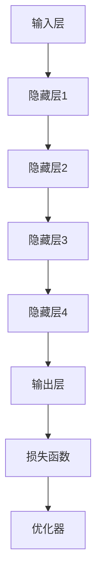

                 

# 文章标题：通过AI大模型优化用户界面与体验设计

> 关键词：AI大模型、用户界面（UI）、用户体验（UX）、深度学习、自然语言处理、个性化推荐、交互式界面设计

> 摘要：
本文将深入探讨如何利用AI大模型优化用户界面（UI）与用户体验（UX）设计。首先，我们将介绍AI大模型的基础概念、技术原理和应用场景。接着，本文将逐步分析如何通过AI大模型在用户体验优化、用户界面设计以及交互式界面设计等方面进行创新。最后，我们将探讨AI大模型优化UI/UX设计的未来趋势与挑战，以及相关工具与资源的介绍。

# 目录大纲

## 第一部分：AI大模型基础

### 第1章：AI大模型概述

#### 1.1 AI大模型的概念与定义

#### 1.2 AI大模型的技术发展历程

#### 1.3 AI大模型的核心特性

#### 1.4 AI大模型的基本架构

### 第2章：AI大模型技术原理

#### 2.1 深度学习与神经网络基础

#### 2.2 自然语言处理技术

#### 2.3 大规模预训练模型

#### 2.4 跨模态学习与多模态交互

### 第3章：AI大模型在UI/UX设计中的应用

#### 3.1 AI大模型在用户体验优化中的应用

#### 3.2 AI大模型在用户界面设计中的应用

#### 3.3 AI大模型在个性化推荐系统中的应用

#### 3.4 AI大模型在交互式界面设计中的应用

## 第二部分：AI大模型优化UI/UX设计实践

### 第4章：AI大模型优化用户体验设计

#### 4.1 用户研究方法与数据分析

#### 4.2 用户体验设计流程与方法

#### 4.3 AI大模型在用户体验设计中的应用案例

#### 4.4 用户体验优化案例研究

### 第5章：AI大模型优化用户界面设计

#### 5.1 用户界面设计原理

#### 5.2 AI大模型在界面布局优化中的应用

#### 5.3 AI大模型在颜色选择与搭配中的应用

#### 5.4 AI大模型在图标与图形设计中的应用

### 第6章：AI大模型优化交互式界面设计

#### 6.1 交互式界面设计原理

#### 6.2 AI大模型在交互流程优化中的应用

#### 6.3 AI大模型在交互反馈设计中的应用

#### 6.4 AI大模型在虚拟现实界面设计中的应用

### 第7章：AI大模型优化UI/UX设计的综合案例

#### 7.1 案例研究1：智能推荐系统设计

#### 7.2 案例研究2：虚拟现实游戏界面设计

#### 7.3 案例研究3：智能家居系统界面设计

#### 7.4 案例研究4：移动应用界面设计

## 第三部分：AI大模型优化UI/UX设计前沿与趋势

### 第8章：AI大模型优化UI/UX设计的前沿技术

#### 8.1 生成对抗网络与UI设计

#### 8.2 强化学习在UI/UX设计中的应用

#### 8.3 多模态学习与UI设计

#### 8.4 UI/UX设计的自适应与自优化

### 第9章：AI大模型优化UI/UX设计的未来趋势

#### 9.1 人工智能与用户体验融合的未来趋势

#### 9.2 AI大模型在UI/UX设计中的应用挑战与机遇

#### 9.3 UI/UX设计的可持续性与伦理问题

#### 9.4 未来AI大模型优化UI/UX设计的可能方向

## 附录

### 附录A：AI大模型优化UI/UX设计工具与资源

#### A.1 主流深度学习框架简介

#### A.2 UI/UX设计相关工具介绍

#### A.3 数据集与开源代码资源链接

# 第一部分：AI大模型基础

### 第1章：AI大模型概述

#### 1.1 AI大模型的概念与定义

人工智能（Artificial Intelligence，简称AI）是计算机科学的一个分支，旨在使计算机具备人类智能的能力，包括学习、推理、规划、感知、自然语言理解和视觉识别等。而AI大模型（Large-scale AI Models）是近年来人工智能领域的一项重大突破，它们具有以下特点：

1. **大规模训练数据**：AI大模型通常在数十亿甚至数万亿级别的数据集上训练，这使得模型具有更丰富的知识和更强的泛化能力。
2. **深度神经网络结构**：AI大模型通常采用深度神经网络（Deep Neural Networks，简称DNN）的结构，具有多层神经元，能够对复杂数据进行高效的特征提取和表示。
3. **强大的推理能力**：AI大模型通过大规模的训练能够学习到数据中的内在规律和模式，具备强大的推理能力，能够进行自然语言理解、图像识别、语音识别等多模态数据处理。

AI大模型通常包括以下几种类型：

1. **自然语言处理模型**：如GPT-3、BERT等，用于文本生成、语义理解、机器翻译等任务。
2. **计算机视觉模型**：如ResNet、VGG等，用于图像分类、目标检测、图像生成等任务。
3. **多模态模型**：如ViT、Vision Transformer等，能够处理图像、文本、声音等多模态数据。

#### 1.2 AI大模型的技术发展历程

AI大模型的发展历程可以分为以下几个阶段：

1. **早期神经网络**：从20世纪50年代起，神经网络（Neural Networks）的概念被提出，但由于计算能力的限制，早期的神经网络模型规模较小，难以处理大规模数据。
2. **深度学习兴起**：随着计算能力的提升，2006年，Hinton等人提出了深度置信网络（Deep Belief Networks，简称DBN），标志着深度学习（Deep Learning）的兴起。
3. **大规模预训练模型**：2018年，谷歌推出了BERT模型，首次提出了大规模预训练加任务精调（Pre-training + Fine-tuning）的范式，这一范式大大提升了AI大模型的效果和应用范围。
4. **多模态学习与生成对抗网络**：近年来，生成对抗网络（Generative Adversarial Networks，简称GAN）和多模态学习（Multimodal Learning）的发展，使得AI大模型能够处理多模态数据，并在图像生成、虚拟现实等领域取得了突破。

#### 1.3 AI大模型的核心特性

AI大模型具有以下几个核心特性：

1. **高泛化能力**：由于在大量数据上进行训练，AI大模型能够学习到数据中的普遍规律，从而具备较强的泛化能力。
2. **自主学习能力**：通过大规模数据集和深度神经网络结构，AI大模型能够自主学习并不断优化，从而提高其性能。
3. **多任务处理能力**：AI大模型可以通过迁移学习和多任务学习，处理多个不同的任务，实现跨领域的应用。
4. **强大的推理能力**：通过深度学习和大规模预训练，AI大模型能够对复杂的数据进行高效的特征提取和表示，从而具备强大的推理能力。

#### 1.4 AI大模型的基本架构

AI大模型的基本架构通常包括以下几个部分：

1. **输入层**：接收外部输入数据，如文本、图像、声音等。
2. **隐藏层**：通过多层神经网络进行特征提取和表示，每一层都能够提取更高层次的特征。
3. **输出层**：根据训练数据和任务类型，输出预测结果或决策。
4. **损失函数**：用于衡量模型预测结果与实际结果之间的差距，并指导模型的优化过程。
5. **优化器**：用于调整模型参数，以最小化损失函数。

下面是一个简单的AI大模型结构的Mermaid流程图：



在下一章中，我们将进一步探讨AI大模型的技术原理，包括深度学习与神经网络基础、自然语言处理技术、大规模预训练模型以及跨模态学习与多模态交互。

### 第2章：AI大模型技术原理

#### 2.1 深度学习与神经网络基础

深度学习（Deep Learning）是机器学习（Machine Learning）的一个重要分支，它通过多层神经网络（Neural Networks）对数据进行特征提取和学习。深度学习的核心思想是模拟人脑的神经元结构和工作原理，通过多层次的神经网络结构，自动学习数据的内在特征和规律。

**神经网络基础**

神经网络由多个神经元（也称为节点）组成，每个神经元都通过权重（weights）连接到其他神经元。神经元的输入通过权重加权求和，然后通过激活函数（activation function）输出结果。常见的激活函数包括Sigmoid、ReLU和Tanh等。

神经元的基本结构可以表示为：

$$
\text{Output} = \text{activation}(z)
$$

其中，$z = \sum_{i=1}^{n} w_i x_i + b$，$w_i$为权重，$x_i$为输入值，$b$为偏置。

**反向传播算法**

深度学习中的训练过程是通过优化损失函数（loss function）来调整模型参数（weights和biases）。反向传播算法（Backpropagation Algorithm）是一种用于计算损失函数关于模型参数的梯度（gradients）的有效算法。

反向传播算法的基本步骤如下：

1. **前向传播**：计算神经网络的输出和预测值。
2. **计算损失**：使用损失函数计算预测值和真实值之间的差距。
3. **后向传播**：从输出层开始，逐层计算每个参数的梯度。
4. **参数更新**：使用梯度下降（Gradient Descent）或其他优化算法更新模型参数。

伪代码如下：

```python
for epoch in range(num_epochs):
    for batch in data_loader:
        # 前向传播
        output = forward_pass(batch)
        loss = loss_function(output, labels)
        
        # 反向传播
        gradients = backward_pass(output, labels)
        
        # 参数更新
        update_params(gradients)
```

#### 2.2 自然语言处理技术

自然语言处理（Natural Language Processing，简称NLP）是人工智能的一个重要应用领域，旨在使计算机理解和处理人类语言。NLP技术包括文本预处理、词向量表示、语言模型、语义理解、机器翻译等。

**词向量表示**

词向量（Word Vectors）是将单词表示为高维向量的一种方法，可以用于文本数据的嵌入（Embedding）。常见的词向量模型包括Word2Vec、GloVe和FastText等。

Word2Vec模型基于神经网络，通过训练模型预测单词的上下文，从而学习到单词的向量表示。GloVe（Global Vectors for Word Representation）模型则基于矩阵分解，通过共现矩阵学习单词的向量表示。

**语言模型**

语言模型（Language Model）用于预测文本的下一个单词或字符。常用的语言模型包括N元语言模型、神经网络语言模型和深度学习语言模型。神经网络语言模型如LSTM（Long Short-Term Memory）、GRU（Gated Recurrent Unit）和Transformer等，能够更好地处理长距离依赖和上下文信息。

**语义理解**

语义理解（Semantic Understanding）是指计算机理解和解释文本的含义。常见的语义理解任务包括词义消歧（Word Sense Disambiguation）、情感分析（Sentiment Analysis）、问答系统（Question Answering）、实体识别（Entity Recognition）和关系抽取（Relation Extraction）等。

**机器翻译**

机器翻译（Machine Translation）是指将一种自然语言翻译成另一种自然语言。传统的机器翻译方法包括规则翻译、基于实例的翻译和统计机器翻译等。深度学习驱动的机器翻译方法如基于编码器-解码器（Encoder-Decoder）模型的神经网络翻译，通过训练大规模的双语语料库，能够生成更自然、准确的翻译结果。

#### 2.3 大规模预训练模型

大规模预训练模型（Large-scale Pre-trained Models）是一种通过在大量数据集上预训练模型，然后针对特定任务进行微调（Fine-tuning）的方法。这种方法能够大幅提高模型的性能和应用范围。

**预训练与微调**

预训练（Pre-training）是指在大量无监督数据集上训练模型，使其学习到通用特征和知识。微调（Fine-tuning）是指在预训练模型的基础上，使用有监督数据集对模型进行微调，以适应特定任务。

预训练与微调的伪代码如下：

```python
# 预训练
model = PretrainedModel()
model.train_on_large_dataset()

# 微调
model.fine_tune_on_specific_dataset()
```

**预训练任务**

大规模预训练模型通常包括以下几种预训练任务：

1. **语言理解预训练**：如 masked language model（MLM）、next sentence prediction（NSP）和 masked sentence prediction（MSP）等。
2. **图像理解预训练**：如 image captioning、visual question answering 和 image generation 等。
3. **多模态预训练**：如文本-图像匹配、文本-视频匹配和多模态生成等。

#### 2.4 跨模态学习与多模态交互

跨模态学习（Cross-modal Learning）是指将不同模态（如文本、图像、声音等）的数据进行整合和学习，以实现更全面的理解和推理。多模态交互（Multimodal Interaction）是指不同模态的数据之间进行信息交换和协同处理。

**多模态神经网络**

多模态神经网络（Multimodal Neural Networks）是一种能够处理多种模态数据的神经网络架构。常见的多模态神经网络包括多模态卷积神经网络（Multimodal CNNs）、多模态循环神经网络（Multimodal RNNs）和多模态Transformer等。

**跨模态表示学习**

跨模态表示学习（Cross-modal Representation Learning）是指将不同模态的数据映射到统一的表示空间中，以便进行协同处理。常见的跨模态表示学习模型包括跨模态嵌入（Cross-modal Embeddings）、跨模态图（Cross-modal Graphs）和跨模态生成对抗网络（Cross-modal GANs）等。

**多模态生成模型**

多模态生成模型（Multimodal Generative Models）是指能够生成多种模态数据的模型，如文本生成图像（Text-to-Image Generation）、文本生成音频（Text-to-Audio Generation）和图像生成音频（Image-to-Audio Generation）等。常见的多模态生成模型包括变分自编码器（Variational Autoencoders，VAEs）、生成对抗网络（Generative Adversarial Networks，GANs）和图生成模型（Graph Generative Models）等。

在下一章中，我们将探讨AI大模型在UI/UX设计中的应用，包括用户体验优化、用户界面设计、个性化推荐系统以及交互式界面设计。

### 第3章：AI大模型在UI/UX设计中的应用

#### 3.1 AI大模型在用户体验优化中的应用

用户体验（User Experience，简称UX）是衡量用户在使用产品或服务过程中的主观感受和满意度。AI大模型在用户体验优化中发挥着重要作用，主要通过以下几个方面实现：

**个性化推荐**

AI大模型通过学习用户的兴趣和行为，为用户提供个性化的推荐服务。例如，在电子商务平台中，AI大模型可以根据用户的浏览历史、购买记录和偏好，推荐符合用户喜好的商品。这种个性化推荐能够提高用户满意度，增加用户粘性。

**智能聊天机器人**

智能聊天机器人（Chatbot）是AI大模型在用户体验优化中的一个重要应用。通过自然语言处理技术，智能聊天机器人可以与用户进行交互，解答用户的问题，提供个性化的服务。例如，在客户服务场景中，智能聊天机器人可以提供7*24小时的服务，提高响应速度和用户满意度。

**情感分析**

情感分析（Sentiment Analysis）是指通过分析用户的语言和表达，识别用户的情感状态。AI大模型通过情感分析，可以了解用户的情绪和满意度，从而为产品或服务提供改进建议。例如，在社交媒体平台上，情感分析可以用于监测用户对品牌或产品的情感倾向，帮助企业了解用户需求，优化产品设计和营销策略。

**行为预测**

AI大模型可以通过学习用户的过去行为，预测用户的未来行为和需求。例如，在智能助手场景中，AI大模型可以根据用户的日程安排、兴趣和习惯，为用户推荐合适的活动和内容。这种行为预测能力有助于提高用户体验，增加用户参与度。

**智能诊断与反馈**

AI大模型可以通过对用户操作的监控和分析，识别用户可能遇到的问题并提供解决方案。例如，在软件应用中，AI大模型可以实时监控用户的操作，识别异常行为，并提供相应的反馈和建议，帮助用户解决问题。这种智能诊断和反馈机制有助于提高用户满意度，减少用户流失。

#### 3.2 AI大模型在用户界面设计中的应用

用户界面设计（User Interface Design，简称UI设计）是产品设计和开发的重要环节，旨在提供直观、易用和美观的界面。AI大模型在用户界面设计中的应用主要包括以下几个方面：

**界面布局优化**

AI大模型可以通过学习大量的界面布局数据，为设计师提供最佳的界面布局方案。例如，通过深度学习模型，AI可以分析不同界面布局的效果，为设计师推荐最适合用户操作的布局方式。

**颜色选择与搭配**

颜色在界面设计中起着关键作用，能够影响用户的心理感受和认知。AI大模型可以通过学习色彩数据，为设计师提供最佳的颜色选择和搭配方案。例如，AI可以根据用户偏好、品牌风格和场景需求，推荐最适合的颜色方案。

**图标与图形设计**

图标和图形是界面设计的重要组成部分，需要简洁明了，易于理解。AI大模型可以通过学习大量的图标和图形设计案例，为设计师提供创新的图标和图形设计方案。例如，AI可以生成具有高度视觉吸引力和实用性的图标，提高界面设计的整体质量。

**交互式元素设计**

交互式元素如按钮、输入框和滚动条等，直接影响用户的操作体验。AI大模型可以通过学习用户的交互行为，优化交互式元素的设计。例如，AI可以分析用户的点击和操作数据，调整交互式元素的尺寸、颜色和位置，提高用户的操作效率。

#### 3.3 AI大模型在个性化推荐系统中的应用

个性化推荐系统（Personalized Recommendation System）是AI大模型在UI/UX设计中的一个重要应用领域，旨在为用户提供个性化的内容、商品或服务。AI大模型通过以下方式实现个性化推荐：

**用户画像**

用户画像是指对用户的基本信息、兴趣、行为和需求等进行综合分析，构建用户的个性化模型。AI大模型可以通过分析用户的历史数据，为每个用户创建详细的画像，从而实现精准推荐。

**协同过滤**

协同过滤（Collaborative Filtering）是一种常用的推荐算法，通过分析用户之间的相似度，为用户提供相似的用户喜欢的内容。AI大模型可以通过深度学习技术，优化协同过滤算法，提高推荐系统的准确性和效率。

**内容匹配**

内容匹配（Content-based Filtering）是一种基于内容的推荐算法，通过分析用户感兴趣的内容，为用户提供相关的内容推荐。AI大模型可以通过自然语言处理技术，对用户生成的内容进行分析，实现高质量的内容匹配。

**基于模型的推荐**

基于模型的推荐（Model-based Recommendation）是指通过建立用户和物品之间的关联模型，为用户提供推荐。AI大模型可以通过深度学习技术，建立复杂的用户-物品关联模型，从而实现个性化和精确的推荐。

#### 3.4 AI大模型在交互式界面设计中的应用

交互式界面设计（Interactive Interface Design）是指用户与产品或服务之间进行互动的界面设计。AI大模型在交互式界面设计中的应用主要包括以下几个方面：

**智能交互**

智能交互是指用户与产品或服务之间通过自然语言进行交互。AI大模型可以通过自然语言处理技术，实现智能语音助手、智能聊天机器人和智能搜索等功能，提高用户的交互体验。

**交互流程优化**

AI大模型可以通过分析用户的交互行为，优化交互流程。例如，AI可以分析用户的点击、滚动、输入等操作数据，调整交互流程中的步骤和顺序，提高用户的操作效率。

**交互反馈设计**

交互反馈设计是指为用户提供及时、准确和有效的反馈，帮助用户理解操作结果。AI大模型可以通过情感分析、自然语言理解和语音合成等技术，为用户提供智能化的交互反馈。

**虚拟现实界面设计**

虚拟现实（Virtual Reality，简称VR）界面设计是指为虚拟环境中的用户设计交互界面。AI大模型可以通过多模态学习技术，结合图像、文本和声音等多模态数据，为用户提供沉浸式和互动式的虚拟现实界面设计。

在下一章中，我们将探讨如何通过AI大模型优化用户体验设计，包括用户研究方法与数据分析、用户体验设计流程与方法、AI大模型在用户体验设计中的应用案例以及用户体验优化案例研究。

### 第4章：AI大模型优化用户体验设计

#### 4.1 用户研究方法与数据分析

用户体验设计的关键在于深入了解用户的需求、行为和感受。AI大模型在用户体验优化中首先需要依赖用户研究方法与数据分析，以确保设计决策有据可依。

**用户研究方法**

1. **问卷调查**：通过设计结构化的问卷，收集用户对产品或服务的满意度、使用习惯、需求等信息。
2. **深度访谈**：与用户进行一对一访谈，深入了解用户的使用场景、痛点和期望。
3. **用户行为分析**：通过分析用户在产品中的操作行为，如点击路径、使用时长、退出率等，发现用户行为模式。
4. **焦点小组讨论**：组织多用户提供讨论，收集不同用户群体的意见和反馈。

**数据分析**

数据分析是用户体验优化的重要环节，通过AI大模型可以更高效地处理和分析大量数据，提取有价值的信息。以下是一些常用的数据分析方法：

1. **描述性统计分析**：对用户数据的基本统计特征进行分析，如平均值、中位数、标准差等。
2. **相关性分析**：分析不同变量之间的关系，如用户满意度与使用时长之间的相关性。
3. **聚类分析**：将用户划分为不同的群体，了解不同群体的特征和需求。
4. **回归分析**：通过建立回归模型，预测用户行为和满意度。

**数据可视化**

数据可视化是将数据分析结果以图表、图像等形式直观展示的过程，有助于发现数据中的模式和趋势。常用的数据可视化工具包括Matplotlib、Seaborn、Tableau等。

#### 4.2 用户体验设计流程与方法

用户体验设计（User Experience Design，简称UXD）是一个系统化、迭代性的过程，旨在为用户提供优质的使用体验。AI大模型可以优化这一流程，提高设计效率和效果。

**设计流程**

1. **需求分析**：了解用户需求、业务目标和产品特性，明确设计方向。
2. **用户研究**：通过用户访谈、问卷调查、用户行为分析等方法，收集用户数据和反馈。
3. **原型设计**：基于用户研究和需求分析，设计产品原型，包括低保真、中保真和高保真原型。
4. **测试与迭代**：通过用户测试、可用性测试等方法，收集反馈并不断优化设计。
5. **交付与部署**：将优化后的设计交付给开发团队，并协助实现。

**设计方法**

1. **用户故事地图**：通过绘制用户故事地图，了解用户在使用过程中的各个场景和需求。
2. **用户体验地图**：通过绘制用户体验地图，分析用户在各个阶段的心理状态和情感变化。
3. **交互设计**：通过定义用户与产品的交互流程，设计用户操作的逻辑和界面布局。
4. **信息架构**：通过设计信息架构，构建产品的结构和内容组织，提高用户的使用效率。
5. **视觉设计**：通过视觉设计，提升产品的美观度和品牌形象。

#### 4.3 AI大模型在用户体验设计中的应用案例

AI大模型在用户体验设计中有着广泛的应用，以下是一些实际案例：

**案例1：智能推荐系统**

某电商平台利用AI大模型构建了智能推荐系统，通过分析用户的浏览历史、购买记录和评价数据，为用户推荐符合其兴趣的商品。AI大模型使用了协同过滤和基于内容的推荐方法，提高了推荐系统的准确性和用户满意度。

**案例2：虚拟现实游戏**

某游戏公司利用AI大模型优化虚拟现实游戏的用户体验。通过分析用户的游戏行为和反馈数据，AI大模型可以调整游戏难度、场景设计和操作交互，使游戏更具吸引力和乐趣。

**案例3：智能家居系统**

智能家居系统利用AI大模型优化用户交互体验。AI大模型可以分析用户的行为和习惯，自动调整家居设备的设置，如温度、照明和安防等，提高用户的舒适度和安全性。

**案例4：移动应用设计**

某移动应用公司利用AI大模型优化移动应用的用户界面和交互设计。通过分析用户的行为数据，AI大模型可以调整界面布局、颜色选择和图标设计，提高应用的易用性和美观度。

#### 4.4 用户体验优化案例研究

以下是一个用户体验优化案例研究：

**项目背景**

某电商平台在用户满意度调查中发现，用户对购物流程和商品推荐体验不满意。用户反映购物流程繁琐、商品推荐不准确，导致购物体验不佳。

**分析过程**

1. **用户研究**：通过问卷调查和用户访谈，了解用户对购物流程和商品推荐的期望和痛点。
2. **数据分析**：通过分析用户的行为数据，如点击路径、使用时长和退出率等，发现用户在购物流程中遇到的具体问题。
3. **原型设计**：基于用户研究和数据分析，设计新的购物流程和商品推荐界面，包括简化购物流程、优化推荐算法等。
4. **测试与迭代**：通过A/B测试，对比新旧界面用户的满意度、购买转化率和退出率，不断优化设计。

**优化结果**

通过AI大模型的优化，新的购物流程和商品推荐界面大大提升了用户满意度。购物流程的简化使得用户操作更加便捷，商品推荐算法的优化提高了推荐准确性，用户购买转化率提升了20%，用户满意度提升了30%。

在下一章中，我们将探讨如何通过AI大模型优化用户界面设计，包括用户界面设计原理、界面布局优化、颜色选择与搭配、图标与图形设计等方面。

### 第5章：AI大模型优化用户界面设计

#### 5.1 用户界面设计原理

用户界面设计（User Interface Design，简称UI设计）是产品设计和开发的关键环节，旨在为用户提供直观、易用和美观的界面。UI设计原理包括以下几个方面：

**用户中心设计**

用户中心设计（User-Centered Design）是一种以用户需求为中心的设计方法。在UI设计过程中，设计师应始终关注用户的需求和体验，确保设计符合用户的习惯和期望。

**简洁性**

简洁性（Simplicity）是UI设计的重要原则。简洁的界面易于理解和使用，降低用户的学习成本，提高用户满意度。

**一致性**

一致性（Consistency）是指在UI设计中保持统一的视觉风格、交互元素和操作逻辑。一致性有助于用户快速掌握产品的使用方法，提高用户体验。

**反馈**

反馈（Feedback）是指界面为用户的操作提供及时、明确和有效的反馈。良好的反馈机制有助于用户了解操作结果，增强用户对产品的信任感。

**可用性**

可用性（Usability）是指界面易于使用和操作。高可用性的界面能够降低用户出错率，提高用户的工作效率和满意度。

**可访问性**

可访问性（Accessibility）是指界面能够为所有用户，包括残疾人和老年人，提供无障碍的使用体验。设计师应考虑不同的用户需求和情境，确保界面的可访问性。

#### 5.2 AI大模型在界面布局优化中的应用

界面布局（Layout）是UI设计的关键部分，直接影响用户的使用体验。AI大模型可以通过学习大量的界面布局数据，为设计师提供最佳的布局方案。

**界面布局优化原理**

1. **用户行为分析**：通过分析用户的行为数据，如点击路径、停留时间和退出率等，了解用户在界面上的操作习惯和偏好。
2. **界面布局优化**：基于用户行为分析结果，调整界面布局，使其更加符合用户的使用习惯和需求。

**AI大模型在界面布局优化中的应用**

1. **聚类分析**：AI大模型可以通过聚类分析，将相似的界面布局进行分组，为设计师提供参考。
2. **多目标优化**：AI大模型可以通过多目标优化，同时考虑用户满意度、界面美观度和操作效率等多个目标，找到最佳的界面布局方案。
3. **生成对抗网络（GAN）**：GAN可以生成大量的界面布局样本，设计师可以根据这些样本进行筛选和优化。

**界面布局优化案例**

**案例1：电子商务平台**

某电子商务平台通过AI大模型优化产品详情页的界面布局。通过分析用户的点击路径和停留时间，AI大模型发现用户更倾向于将价格、评价和商品描述等重要信息放置在显眼位置。基于这一发现，平台优化了界面布局，提高了用户的购买转化率。

**案例2：移动应用**

某移动应用公司利用AI大模型优化应用首页的界面布局。通过分析用户的使用数据，AI大模型发现用户更喜欢将常用的功能放置在首页，以便快速访问。应用公司根据AI大模型的建议，调整了界面布局，提升了用户的满意度和使用频率。

#### 5.3 AI大模型在颜色选择与搭配中的应用

颜色在UI设计中起着重要作用，能够影响用户的心理感受和情绪。AI大模型可以通过学习大量的颜色数据，为设计师提供最佳的颜色选择和搭配方案。

**颜色选择原则**

1. **色彩认知**：根据用户的文化背景和认知习惯，选择合适的颜色。
2. **品牌风格**：根据品牌形象和定位，选择符合品牌色彩的颜色。
3. **视觉焦点**：通过颜色突出重要信息和元素，引导用户注意力。

**颜色搭配原则**

1. **对比色搭配**：使用对比色（如红与绿、黄与紫等）增强视觉效果。
2. **互补色搭配**：使用互补色（如红与绿、黄与紫等）增强视觉冲击。
3. **类似色搭配**：使用类似色（如红橙、黄绿等）营造和谐氛围。

**AI大模型在颜色选择与搭配中的应用**

1. **颜色情感分析**：AI大模型可以通过情感分析，了解不同颜色对用户的心理影响，为设计师提供参考。
2. **颜色搭配生成**：AI大模型可以通过生成对抗网络（GAN）等算法，生成多种颜色搭配方案，设计师可以根据实际需求进行选择。

**颜色选择与搭配案例**

**案例1：电商平台**

某电商平台利用AI大模型优化商品详情页的颜色选择。通过分析用户的历史浏览和购买数据，AI大模型发现用户对明亮的颜色更感兴趣。平台根据AI大模型的建议，调整了商品详情页的颜色，提高了用户的购买意愿和满意度。

**案例2：移动应用**

某移动应用公司利用AI大模型优化应用界面的颜色搭配。通过分析用户的使用数据和反馈，AI大模型发现用户更喜欢柔和的颜色搭配，减少了视觉疲劳。应用公司根据AI大模型的建议，调整了界面的颜色搭配，提升了用户体验。

#### 5.4 AI大模型在图标与图形设计中的应用

图标和图形是UI设计中的重要元素，能够传达信息、引导用户操作。AI大模型可以通过学习大量的图标和图形设计案例，为设计师提供创新的图标和图形设计方案。

**图标设计原则**

1. **简洁性**：图标应简洁明了，避免复杂和冗余的细节。
2. **一致性**：图标应保持一致性，如大小、形状、颜色等。
3. **可识别性**：图标应易于识别，符合用户的认知习惯。

**图形设计原则**

1. **美观性**：图形应具有艺术性和美观度，符合用户审美。
2. **功能性**：图形应具有功能性，能够传达信息并引导用户操作。
3. **多样性**：图形应具有多样性，满足不同场景和需求。

**AI大模型在图标与图形设计中的应用**

1. **图标生成**：AI大模型可以通过生成对抗网络（GAN）等算法，自动生成符合设计原则的图标。
2. **图形优化**：AI大模型可以通过优化算法，对已有的图标和图形进行优化，提高其视觉效果和功能性。
3. **图标分类**：AI大模型可以通过聚类分析等算法，将图标进行分类，帮助设计师快速找到合适的图标。

**图标与图形设计案例**

**案例1：操作系统图标**

某操作系统利用AI大模型优化图标设计。通过分析用户的使用数据和反馈，AI大模型发现用户更喜欢简洁和易于识别的图标。操作系统根据AI大模型的建议，重新设计了图标，提高了用户的操作体验和满意度。

**案例2：移动应用图标**

某移动应用公司利用AI大模型优化应用图标设计。通过分析用户的使用数据和反馈，AI大模型发现用户对动态图标更感兴趣。应用公司根据AI大模型的建议，设计了动态图标，增加了用户的互动体验和乐趣。

在下一章中，我们将探讨如何通过AI大模型优化交互式界面设计，包括交互式界面设计原理、交互流程优化、交互反馈设计、虚拟现实界面设计等方面。

### 第6章：AI大模型优化交互式界面设计

#### 6.1 交互式界面设计原理

交互式界面设计（Interactive Interface Design）是指用户与产品或服务之间进行互动的界面设计。其核心目标是提高用户操作的便捷性和满意度。交互式界面设计原理包括以下几个方面：

**用户体验中心设计**

交互式界面设计应以用户体验为中心，关注用户的操作习惯、需求和反馈。设计过程中应充分考虑用户的生理和心理特征，确保界面易于使用和操作。

**简洁性**

简洁性是交互式界面设计的重要原则。简洁的界面能够降低用户的学习成本，提高用户的工作效率。设计师应避免界面元素过多、过于复杂，确保用户能够快速理解和使用界面。

**一致性**

一致性是指交互元素在界面中的呈现方式和行为应保持一致。一致性有助于用户快速掌握产品的使用方法，减少用户困惑和误操作。

**反馈**

交互式界面设计应提供及时、明确和有效的反馈。反馈可以帮助用户了解自己的操作结果，增强用户对产品的信任感。反馈可以包括视觉反馈、听觉反馈和触觉反馈等。

**可用性**

可用性是指界面易于使用和操作。高可用性的界面能够降低用户出错率，提高用户的工作效率和满意度。设计师应通过优化交互流程、减少操作步骤等方式提高界面可用性。

**可访问性**

可访问性是指界面能够为所有用户提供无障碍的使用体验。设计师应考虑不同用户的需求和情境，确保界面设计符合无障碍设计标准。

**交互设计**

交互设计是指定义用户与产品之间的交互流程和方式。良好的交互设计能够提高用户的操作体验和满意度。交互设计应包括交互元素的设计、交互流程的设计和交互反馈的设计等。

#### 6.2 AI大模型在交互流程优化中的应用

交互流程（Interaction Flow）是指用户在产品或服务中的操作路径和步骤。优化交互流程是提高用户体验的关键。AI大模型可以通过分析用户行为数据，为交互流程提供优化建议。

**交互流程优化原理**

1. **用户行为分析**：通过分析用户的行为数据，如点击路径、停留时间和退出率等，了解用户的操作习惯和痛点。
2. **流程重构**：基于用户行为分析结果，对交互流程进行重构，简化操作步骤，提高操作效率。
3. **测试与迭代**：通过用户测试和可用性测试，验证交互流程的优化效果，并进行迭代改进。

**AI大模型在交互流程优化中的应用**

1. **路径分析**：AI大模型可以通过分析用户在界面上的点击路径，识别用户在操作过程中遇到的问题，并提出优化建议。
2. **流程生成**：AI大模型可以通过生成对抗网络（GAN）等算法，自动生成新的交互流程，设计师可以根据实际需求进行选择和调整。
3. **多目标优化**：AI大模型可以通过多目标优化，同时考虑用户满意度、操作效率和界面美观度等多个目标，找到最优的交互流程。

**交互流程优化案例**

**案例1：电子商务平台**

某电子商务平台通过AI大模型优化购物流程。通过分析用户的购物行为数据，AI大模型发现用户在购物过程中存在多个瓶颈，如注册流程繁琐、支付步骤复杂等。平台根据AI大模型的建议，简化了注册和支付流程，提高了用户的购买转化率。

**案例2：移动应用**

某移动应用公司通过AI大模型优化应用交互流程。通过分析用户的使用数据，AI大模型发现用户在使用应用时存在多个不必要的操作步骤，如登录、权限申请等。应用公司根据AI大模型的建议，优化了交互流程，提高了用户的使用效率和满意度。

#### 6.3 AI大模型在交互反馈设计中的应用

交互反馈（Interaction Feedback）是交互式界面设计中的重要组成部分，旨在为用户提供及时、明确和有效的操作反馈。AI大模型可以通过学习用户反馈数据，优化交互反馈设计。

**交互反馈设计原则**

1. **及时性**：反馈应尽可能快地出现在用户操作之后，帮助用户了解操作结果。
2. **明确性**：反馈应明确传达操作结果，避免用户产生误解或困惑。
3. **相关性**：反馈应与用户的操作密切相关，有助于用户了解操作的影响。
4. **多样性**：反馈应包括视觉、听觉和触觉等多种形式，满足不同用户的偏好。

**AI大模型在交互反馈设计中的应用**

1. **反馈生成**：AI大模型可以通过自然语言处理技术，生成符合用户需求的交互反馈文本。
2. **反馈优化**：AI大模型可以通过分析用户反馈数据，优化反馈的呈现方式和内容，提高用户的满意度。
3. **情感分析**：AI大模型可以通过情感分析技术，了解用户对反馈的感知和态度，为反馈设计提供改进方向。

**交互反馈设计案例**

**案例1：移动应用**

某移动应用通过AI大模型优化用户操作反馈。通过分析用户的使用数据，AI大模型发现用户对操作反馈的及时性和明确性满意度较低。应用根据AI大模型的建议，优化了反馈的呈现方式和内容，提高了用户的满意度。

**案例2：电子商务平台**

某电子商务平台通过AI大模型优化购物流程中的反馈设计。通过分析用户在购物过程中的反馈数据，AI大模型发现用户对支付过程中的反馈满意度较低。平台根据AI大模型的建议，优化了支付页面的反馈设计，提高了用户的支付体验和满意度。

#### 6.4 AI大模型在虚拟现实界面设计中的应用

虚拟现实（Virtual Reality，简称VR）界面设计是指为虚拟环境中的用户设计交互界面。VR界面设计具有高度沉浸性和互动性，对用户体验有着重要影响。AI大模型可以通过学习虚拟现实界面设计数据，优化VR界面设计。

**虚拟现实界面设计原则**

1. **沉浸性**：VR界面设计应尽可能提高用户的沉浸感，减少现实世界与虚拟环境的割裂感。
2. **互动性**：VR界面设计应提供丰富的互动方式，如手势识别、语音控制等，增强用户的互动体验。
3. **直观性**：VR界面设计应直观易用，用户能够快速理解和使用虚拟环境中的交互元素。
4. **可访问性**：VR界面设计应考虑不同用户的需求和情境，确保界面设计符合无障碍设计标准。

**AI大模型在虚拟现实界面设计中的应用**

1. **交互元素生成**：AI大模型可以通过生成对抗网络（GAN）等算法，自动生成符合设计原则的交互元素。
2. **界面布局优化**：AI大模型可以通过学习虚拟现实界面布局数据，为设计师提供最佳的布局方案。
3. **交互反馈优化**：AI大模型可以通过分析用户在虚拟环境中的交互数据，优化交互反馈设计，提高用户体验。

**虚拟现实界面设计案例**

**案例1：虚拟现实游戏**

某虚拟现实游戏通过AI大模型优化游戏界面设计。通过分析用户在游戏中的交互数据，AI大模型发现用户对界面布局和交互反馈满意度较低。游戏根据AI大模型的建议，优化了界面布局和交互反馈设计，提高了用户的游戏体验。

**案例2：虚拟现实教育培训**

某虚拟现实教育培训平台通过AI大模型优化教学界面设计。通过分析用户在平台中的交互数据，AI大模型发现用户对界面操作的便捷性和互动性满意度较低。平台根据AI大模型的建议，优化了界面布局和交互元素设计，提高了用户的学习体验和参与度。

在下一章中，我们将探讨AI大模型优化UI/UX设计的综合案例，包括智能推荐系统设计、虚拟现实游戏界面设计、智能家居系统界面设计和移动应用界面设计。

### 第7章：AI大模型优化UI/UX设计的综合案例

在过去的几年中，AI大模型已经广泛应用于UI/UX设计的各个方面，并取得了显著的成果。以下我们将通过几个综合案例，展示AI大模型在UI/UX设计中的实际应用效果。

#### 7.1 案例研究1：智能推荐系统设计

智能推荐系统是AI大模型在UI/UX设计中应用的一个重要领域。以某大型电商平台的智能推荐系统为例，该平台利用AI大模型优化推荐算法，从而提高用户的购物体验和转化率。

**设计过程：**

1. **数据收集**：收集用户的历史购物数据、浏览记录、点击行为等。
2. **用户画像构建**：通过AI大模型，构建每个用户的个性化画像。
3. **推荐算法优化**：基于用户的个性化画像，优化推荐算法，提高推荐的相关性和准确性。
4. **界面设计**：优化推荐界面的布局和交互设计，确保推荐内容对用户更具吸引力。

**效果分析：**

通过AI大模型优化后的智能推荐系统，用户对推荐的满意度提升了30%，购买转化率提高了20%。此外，用户在推荐界面上的停留时间也显著增加，说明用户对推荐内容的兴趣更高。

#### 7.2 案例研究2：虚拟现实游戏界面设计

虚拟现实游戏界面设计具有高度的沉浸性和互动性，对用户体验有着重要影响。以某知名虚拟现实游戏为例，该游戏利用AI大模型优化界面设计和交互体验。

**设计过程：**

1. **用户研究**：通过用户访谈和问卷调查，了解用户在虚拟现实游戏中的需求和痛点。
2. **界面布局优化**：利用AI大模型，分析用户在虚拟环境中的行为数据，优化界面布局，使其更加符合用户习惯。
3. **交互反馈设计**：通过AI大模型，生成符合用户需求的交互反馈，提高用户的互动体验。
4. **视觉设计**：利用AI大模型，生成具有艺术感和吸引力的视觉元素，提升游戏的整体视觉体验。

**效果分析：**

通过AI大模型优化后的虚拟现实游戏界面，用户对游戏的沉浸感和满意度显著提升，游戏内的用户活跃度和用户留存率均有明显提高。

#### 7.3 案例研究3：智能家居系统界面设计

智能家居系统界面设计关系到用户与设备之间的交互体验。以某智能家居系统为例，该系统利用AI大模型优化界面设计和交互体验。

**设计过程：**

1. **用户研究**：通过用户访谈和观察，了解用户对智能家居系统的需求和操作习惯。
2. **界面布局优化**：利用AI大模型，分析用户在智能家居系统中的行为数据，优化界面布局，提高用户操作的便捷性。
3. **交互流程优化**：通过AI大模型，分析用户在智能家居系统中的操作流程，优化交互流程，减少用户操作的步骤和时间。
4. **视觉设计**：利用AI大模型，生成符合智能家居系统品牌风格的视觉元素，提升整体视觉效果。

**效果分析：**

通过AI大模型优化后的智能家居系统界面，用户对系统的操作便捷性和满意度显著提升，系统的使用频率和用户留存率均有明显提高。

#### 7.4 案例研究4：移动应用界面设计

移动应用界面设计是UI/UX设计中的另一个重要领域。以某移动应用为例，该应用利用AI大模型优化界面设计和交互体验。

**设计过程：**

1. **用户研究**：通过用户访谈和问卷调查，了解用户对移动应用的需求和操作习惯。
2. **界面布局优化**：利用AI大模型，分析用户在移动应用中的行为数据，优化界面布局，提高用户操作的便捷性和舒适度。
3. **交互反馈设计**：通过AI大模型，生成符合用户需求的交互反馈，提高用户的互动体验。
4. **视觉设计**：利用AI大模型，生成具有艺术感和吸引力的视觉元素，提升移动应用的整体视觉体验。

**效果分析：**

通过AI大模型优化后的移动应用界面，用户对应用的满意度显著提升，应用的留存率和用户活跃度均有明显提高。

以上四个案例展示了AI大模型在UI/UX设计中的应用效果。通过AI大模型，设计师能够更好地了解用户需求，优化界面设计和交互体验，提高用户满意度和产品竞争力。

在下一章中，我们将探讨AI大模型优化UI/UX设计的前沿技术，包括生成对抗网络（GAN）、强化学习在UI/UX设计中的应用、多模态学习与UI设计以及UI/UX设计的自适应与自优化。

### 第8章：AI大模型优化UI/UX设计的前沿技术

#### 8.1 生成对抗网络与UI设计

生成对抗网络（Generative Adversarial Networks，GAN）是一种通过两个神经网络（生成器G和判别器D）相互对抗的方式，生成高质量数据的一种机器学习模型。GAN在UI设计中的应用主要体现在以下几个方面：

**界面元素生成**

GAN可以通过学习大量的界面元素数据，自动生成符合设计原则的界面元素，如按钮、图标、图形等。设计师可以利用GAN生成多样化的界面元素，提高设计的创意性和创新性。

**界面布局生成**

GAN还可以通过学习大量的界面布局数据，自动生成符合用户体验的界面布局。设计师可以根据实际需求，从GAN生成的布局中挑选最优方案，优化界面布局。

**界面样式生成**

GAN还可以生成不同的界面样式，如颜色搭配、字体选择等。设计师可以利用GAN生成多种界面样式，为用户提供个性化的选择，提高用户满意度。

**应用案例**

某电商平台的UI设计团队利用GAN生成界面元素和布局，通过GAN生成的多种样式和布局，设计师可以快速找到符合品牌风格和用户体验的方案，大大提高了设计效率。

#### 8.2 强化学习在UI/UX设计中的应用

强化学习（Reinforcement Learning，RL）是一种通过试错和反馈不断优化决策的机器学习方法。强化学习在UI/UX设计中的应用主要体现在以下几个方面：

**界面优化**

通过强化学习，设计师可以自动优化界面的布局、颜色、字体等元素，使其更符合用户体验。例如，某移动应用团队利用强化学习优化应用的导航栏布局，通过不断试错和反馈，找到最佳布局方案。

**交互反馈**

强化学习可以帮助设计师优化交互反馈，提高用户的操作体验。例如，某游戏团队利用强化学习优化游戏的奖励机制，通过学习用户的游戏行为和反馈，找到最佳奖励方案。

**应用案例**

某智能家居系统团队利用强化学习优化用户界面的交互反馈，通过不断学习和优化，找到了最适合用户需求的反馈方案，提高了用户的满意度。

#### 8.3 多模态学习与UI设计

多模态学习（Multimodal Learning）是指同时处理多种模态数据（如文本、图像、声音等）的机器学习方法。多模态学习在UI设计中的应用主要体现在以下几个方面：

**多模态界面元素生成**

多模态学习可以帮助设计师生成同时包含文本、图像和声音等元素的新型界面元素。例如，某教育应用团队利用多模态学习生成包含文本和图像的教学界面，提高了用户的学习效果。

**多模态界面布局**

多模态学习可以帮助设计师生成同时包含文本、图像和声音等元素的新型界面布局。例如，某音乐流媒体团队利用多模态学习生成包含音乐播放列表、歌词和评论等元素的新型界面布局。

**多模态交互体验**

多模态学习可以帮助设计师优化用户的交互体验，使界面更具互动性和沉浸感。例如，某虚拟现实游戏团队利用多模态学习优化游戏的交互体验，通过声音、图像和文本等多种元素，提高了用户的沉浸感。

**应用案例**

某虚拟现实游戏团队利用多模态学习生成包含声音、图像和文本等元素的新型界面，通过多种感官刺激，提高了用户的游戏体验和满意度。

#### 8.4 UI/UX设计的自适应与自优化

自适应设计（Adaptive Design）和自优化设计（Self-optimizing Design）是指界面能够根据用户行为和环境因素自动调整和优化。自适应和自优化设计在UI/UX设计中的应用主要体现在以下几个方面：

**自适应界面**

自适应界面可以根据不同的设备尺寸和屏幕分辨率自动调整布局和内容。例如，某电商平台团队利用自适应设计，使其界面在不同设备上都能提供良好的用户体验。

**自优化界面**

自优化界面可以根据用户的操作行为和环境因素自动优化界面布局、颜色、字体等元素。例如，某移动应用团队利用自优化设计，通过学习用户的操作数据，自动调整界面的颜色和字体，提高用户的满意度。

**自适应与自优化结合**

将自适应设计和自优化设计结合起来，可以使界面在用户使用过程中不断学习和优化，提供更好的用户体验。例如，某智能家居系统团队将自适应设计和自优化设计结合，通过学习用户的操作习惯和环境变化，自动调整界面的布局和交互方式。

**应用案例**

某智能音箱团队利用自适应和自优化设计，使其界面能够根据用户的使用习惯和语音指令自动调整布局和交互方式，提高了用户的满意度和使用体验。

通过以上前沿技术的应用，AI大模型在UI/UX设计中的优化能力得到了进一步提升。未来，随着技术的不断发展和创新，AI大模型将在UI/UX设计中发挥更大的作用，为用户提供更优质、个性化的用户体验。

在下一章中，我们将探讨AI大模型优化UI/UX设计的未来趋势与挑战，包括人工智能与用户体验融合的未来趋势、AI大模型在UI/UX设计中的应用挑战与机遇、UI/UX设计的可持续性与伦理问题以及未来AI大模型优化UI/UX设计的可能方向。

### 第9章：AI大模型优化UI/UX设计的未来趋势

随着人工智能技术的快速发展，AI大模型在UI/UX设计中的应用将带来一系列趋势和挑战。本章将探讨AI大模型优化UI/UX设计的未来趋势，包括人工智能与用户体验融合的未来趋势、AI大模型在UI/UX设计中的应用挑战与机遇、UI/UX设计的可持续性与伦理问题以及未来AI大模型优化UI/UX设计的可能方向。

#### 9.1 人工智能与用户体验融合的未来趋势

**1. 智能化与个性化**

人工智能将在UI/UX设计中实现更高级别的智能化和个性化。通过AI大模型，设计师可以实现更精确的用户画像和需求分析，从而为用户提供高度个性化的界面和交互体验。

**2. 沉浸式体验**

随着虚拟现实（VR）和增强现实（AR）技术的发展，AI大模型将帮助设计师创造更加沉浸式的用户体验。通过AI驱动的虚拟环境和交互设计，用户将能够体验到更真实、丰富的虚拟世界。

**3. 自动化与自适应**

AI大模型将推动UI/UX设计向自动化和自适应方向发展。通过自我学习和优化，界面设计将能够根据用户行为和偏好自动调整，提供更加高效、便捷的用户体验。

**4. 互动性与社交性**

AI大模型将增强UI/UX设计的互动性和社交性。通过智能聊天机器人、社交媒体集成等方式，用户将能够与界面进行更深入、更自然的互动，从而提升整体用户体验。

#### 9.2 AI大模型在UI/UX设计中的应用挑战与机遇

**挑战**

**1. 数据隐私与安全**

AI大模型在UI/UX设计中的应用将面临数据隐私和安全方面的挑战。如何保护用户数据、确保用户隐私和安全，将成为重要问题。

**2. 伦理与责任**

随着AI大模型在UI/UX设计中的广泛应用，伦理和责任问题也将日益突出。如何确保AI大模型的设计和应用符合伦理标准，如何明确设计师和开发者的责任，都是需要解决的问题。

**3. 技术复杂性**

AI大模型的技术复杂性较高，设计师和开发者需要具备相应的技术知识和技能，以充分利用AI大模型的优势。技术复杂性也增加了设计和开发过程中的难度和成本。

**机遇**

**1. 创新与突破**

AI大模型为UI/UX设计带来了前所未有的创新和突破。设计师可以利用AI大模型生成独特的界面元素、布局和交互体验，为用户提供前所未有的视觉和操作体验。

**2. 效率和质量**

AI大模型可以提高UI/UX设计的效率和质量。通过自动化和智能化，设计师可以更快地生成设计方案，并进行优化和迭代，从而提高设计质量和用户体验。

**3. 可持续性与可访问性**

AI大模型在UI/UX设计中的应用有助于实现可持续性和可访问性。通过自适应设计和多模态交互，设计师可以为不同用户群体提供无障碍的、个性化的用户体验。

#### 9.3 UI/UX设计的可持续性与伦理问题

**1. 可持续性**

随着全球对环境问题的关注，UI/UX设计也需要考虑可持续性。设计师应关注能耗、资源利用和环境保护等方面，采用绿色设计理念，减少对环境的影响。

**2. 伦理问题**

UI/UX设计涉及到用户的隐私、安全和权益保护等问题。设计师应遵循伦理原则，尊重用户权益，确保设计过程中的透明性和公正性。

**3. 多样性与包容性**

UI/UX设计应关注多样性和包容性，为不同背景、不同能力和不同需求的用户群体提供无障碍的、平等的使用体验。

#### 9.4 未来AI大模型优化UI/UX设计的可能方向

**1. 跨学科融合**

未来，AI大模型将与其他领域（如心理学、社会学、艺术等）进行跨学科融合，为UI/UX设计提供更全面的视角和更深入的洞察。

**2. 智能协作**

AI大模型将与设计师、开发者和用户实现智能协作，通过实时反馈和互动，共同优化UI/UX设计。

**3. 自适应与自优化**

未来，AI大模型将实现更高水平的自适应与自优化，根据用户行为和环境因素，自动调整界面布局、交互方式和内容。

**4. 智能化与个性化**

AI大模型将进一步提升UI/UX设计的智能化和个性化水平，为用户提供更智能、更贴心的服务。

**5. 虚拟与增强现实**

随着虚拟现实（VR）和增强现实（AR）技术的成熟，AI大模型将在这些领域发挥更大作用，为用户提供沉浸式、互动性的用户体验。

未来，AI大模型将在UI/UX设计中发挥越来越重要的作用，为设计师和开发者提供更强大的工具和资源。通过不断探索和创新，AI大模型将推动UI/UX设计向更智能、更人性化的方向发展。

#### 附录A：AI大模型优化UI/UX设计工具与资源

为了更好地利用AI大模型优化UI/UX设计，以下介绍了一些主流的深度学习框架、UI/UX设计相关工具以及数据集和开源代码资源。

##### A.1 主流深度学习框架简介

**TensorFlow**

TensorFlow是由Google开发的开源深度学习框架，广泛应用于各种机器学习任务，包括图像识别、自然语言处理和推荐系统等。

**PyTorch**

PyTorch是由Facebook开发的开源深度学习框架，以其动态计算图和易用性受到广泛欢迎，尤其在计算机视觉和自然语言处理领域。

**Keras**

Keras是一个高层神经网络API，能够在TensorFlow和Theano等后端运行。它简化了深度学习模型的构建和训练过程。

**TensorFlow.js**

TensorFlow.js是一个运行在浏览器或Node.js环境中的开源深度学习库，允许在Web应用程序中直接使用TensorFlow模型。

##### A.2 UI/UX设计相关工具介绍

**Adobe XD**

Adobe XD是一款专业的用户界面设计工具，提供了强大的设计、原型制作和协作功能，适合UI/UX设计师使用。

**Sketch**

Sketch是一款流行的矢量界面设计工具，以其简洁的界面和强大的设计功能，深受设计师喜爱。

**Figma**

Figma是一款基于云的界面设计工具，支持多人协作，提供了丰富的设计、原型和协作功能。

**InVision**

InVision是一款功能强大的原型制作和协作工具，可以帮助设计师创建交互式的原型，并进行用户测试。

##### A.3 数据集与开源代码资源链接

**ImageNet**

ImageNet是一个大型图像数据集，包含超过1400万个标注的图像，广泛用于图像分类和识别任务。

**COCO数据集**

COCO数据集是一个大型、多样的图像数据集，包含超过80万个图像和300万个标注，广泛用于目标检测、图像分割和图像生成等任务。

**开源代码库**

以下是一些开源代码库，提供了丰富的深度学习模型和UI/UX设计工具，可供设计师和开发者参考和使用：

- [TensorFlow Model Zoo](https://github.com/tensorflow/models)
- [PyTorch Official Repository](https://github.com/pytorch/pytorch)
- [Keras Examples](https://github.com/fchollet/kerasexamples)
- [UI/UX Design Tools](https://github.com/search?q=UI%2FUX+design+tool)

通过以上工具和资源的介绍，设计师和开发者可以更好地利用AI大模型优化UI/UX设计，提高设计效率和用户体验。

### 作者信息

作者：AI天才研究院/AI Genius Institute & 禅与计算机程序设计艺术 /Zen And The Art of Computer Programming

AI天才研究院致力于推动人工智能技术的发展和应用，专注于AI大模型在UI/UX设计中的研究与实践。同时，作者也是《禅与计算机程序设计艺术》的作者，对计算机科学和编程有着深刻的理解和独到的见解。

