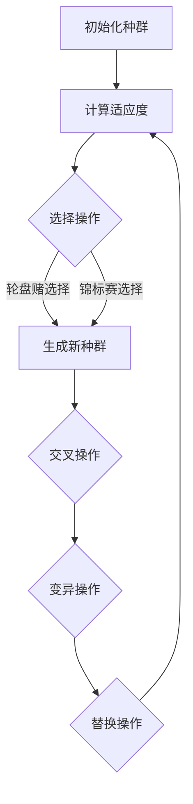

                 

### 引言

遗传算法（Genetic Algorithm，简称GA）作为一种模拟自然选择和遗传学的计算方法，起源于20世纪70年代。其基本思想来源于达尔文的进化论，即通过自然选择、交叉和变异等遗传操作，逐渐优化和进化出一组解，最终解决复杂优化问题。遗传算法因其强大的适应性和广泛的应用范围，在工程、计算机科学、人工智能等领域取得了显著的成果。

本文旨在全面、系统地介绍遗传算法的基本概念、数学基础、算法原理、改进方法、应用实例及其在工程实践中的应用。通过逻辑清晰、结构紧凑的论述，帮助读者深入了解遗传算法的核心思想及其应用价值。文章将采用“LET'S THINK STEP BY STEP”的方式，逐步剖析遗传算法的各个环节，从而让读者能够更好地理解这一复杂的算法。

接下来的内容将分为以下几个部分：

1. **遗传算法的基本概念**：介绍遗传算法的定义、发展历程和应用领域。
2. **遗传算法的数学基础**：讲解染色体编码与解码、选择策略、交叉和变异操作、适应度函数设计等基本概念。
3. **遗传算法的算法原理**：分析遗传算法的基本流程、选择策略、交叉操作、变异操作以及遗传算法的收敛性分析。
4. **遗传算法的改进与优化**：探讨多目标遗传算法、粒子群优化算法、遗传算法与神经网络结合等改进方法。
5. **遗传算法的应用实例**：通过具体案例展示遗传算法在不同领域的应用。
6. **遗传算法的工程实践**：讨论遗传算法在工业设计、机器学习、人工智能等领域的实际应用。
7. **遗传算法的案例分析**：结合具体案例，分析遗传算法在不同应用中的效果和优势。
8. **遗传算法的发展趋势与挑战**：探讨遗传算法未来的发展方向和面临的挑战。

希望通过本文的介绍，读者能够对遗传算法有一个全面而深入的认识，并能够将其应用于解决实际问题。

### 关键词

- **遗传算法**（Genetic Algorithm）
- **自然选择**（Natural Selection）
- **适应度函数**（Fitness Function）
- **交叉操作**（Crossover）
- **变异操作**（Mutation）
- **进化计算**（Evolutionary Computation）
- **优化算法**（Optimization Algorithm）
- **机器学习**（Machine Learning）
- **人工智能**（Artificial Intelligence）
- **工业设计**（Industrial Design）
- **电子电路设计**（Electronic Circuit Design）
- **多目标优化**（Multi-Objective Optimization）

这些关键词不仅涵盖了遗传算法的核心概念和主要应用领域，也反映了遗传算法在计算机科学和工程技术中的广泛应用。

### 摘要

本文旨在全面系统地介绍遗传算法的基本概念、数学基础、算法原理、改进方法及其在实际应用中的表现。首先，我们回顾了遗传算法的定义、发展历程和应用领域，解释了其核心概念如染色体编码、选择策略、交叉和变异操作等。接着，通过详细分析遗传算法的基本流程、选择策略、交叉操作、变异操作及其收敛性，进一步理解其工作原理。随后，探讨了多目标遗传算法、粒子群优化算法以及遗传算法与神经网络结合等改进方法，展示了遗传算法在不同领域如机器学习、人工智能、工业设计中的应用案例。最后，结合具体项目实战，分析了遗传算法在实际工程中的有效性和实用性，并探讨了其未来发展方向和面临的挑战。希望通过本文的介绍，读者能够全面掌握遗传算法的核心思想及其应用价值。

#### 第一部分：遗传算法概述

遗传算法（Genetic Algorithm，简称GA）是一种模拟自然选择和遗传学原理的搜索算法，广泛应用于优化和搜索领域。本部分将从遗传算法的基本概念、发展历程和应用领域三个方面进行详细介绍。

### 第1章：遗传算法的基本概念

遗传算法的核心概念包括染色体编码、适应度函数、选择、交叉和变异等。以下是对这些核心概念的详细解释：

#### 1.1 遗传算法的定义与发展历程

遗传算法最早由John Holland于1975年提出，起源于对自然进化过程的模拟。其基本思想是通过模拟自然选择、交叉和变异等过程，在解空间中不断搜索最优解或近似最优解。

**发展历程：**

- **1970年代**：遗传算法的基本概念和原理被提出。
- **1980年代**：遗传算法逐渐应用于各种优化问题，如旅行商问题、调度问题等。
- **1990年代**：遗传算法开始被广泛应用于工程、计算机科学等领域，成为进化计算的重要分支。
- **21世纪初**：遗传算法与其他优化算法相结合，如粒子群优化算法，进一步拓展了其应用范围。

#### 1.2 遗传算法的核心概念

**染色体编码**：在遗传算法中，问题的解被表示为染色体，每个染色体由一系列基因组成。基因的取值决定了染色体的特征，从而表示问题的解。

**适应度函数**：适应度函数用于评估染色体的优劣，通常表示为染色体对应解的某种性能指标。适应度值越高，表示染色体越优。

**选择**：选择策略用于选择适应度值较高的染色体进行交叉和变异操作。常见的选择策略包括轮盘赌选择、锦标赛选择等。

**交叉**：交叉操作模拟生物进化中的繁殖过程，通过交换两个染色体的部分基因，产生新的后代染色体。

**变异**：变异操作模拟生物进化中的突变过程，对染色体的基因进行随机改变，增加解的多样性。

#### 1.3 遗传算法的应用领域

遗传算法因其强大的适应性和广泛的适用性，在多个领域得到了广泛应用：

- **优化问题**：如旅行商问题、生产调度问题、装箱问题等。
- **机器学习**：如特征选择、模型优化等。
- **电子设计**：如集成电路设计、电路优化等。
- **人工智能**：如路径规划、智能控制等。
- **工业设计**：如机械结构优化、建筑设计等。

### 第2章：遗传算法的数学基础

遗传算法的数学基础包括染色体编码与解码、选择策略、交叉和变异操作、适应度函数设计等。以下是对这些数学基础概念的详细解释。

#### 2.1 染色体编码与解码

**染色体编码**：染色体编码是将问题的解映射到染色体上的过程。常见的编码方法包括二进制编码、实数编码、格雷码编码等。

- **二进制编码**：将问题的解表示为二进制串，每个基因位表示解的一个分量。
- **实数编码**：将问题的解表示为实数向量，每个基因位表示解的一个分量。
- **格雷码编码**：格雷码编码是一种减少交叉操作中基因冲突的编码方法。

**染色体的解码**：染色体的解码是将编码后的染色体映射回问题的解的过程。解码方法通常与编码方法相对应。

#### 2.2 选择策略

**选择策略**：选择策略用于从当前种群中选择适应度较高的染色体，用于产生新的后代。常见的选择策略包括：

- **轮盘赌选择**：根据染色体的适应度值，计算每个染色体的选择概率，并按概率随机选择染色体。
- **锦标赛选择**：从种群中随机选择多个染色体进行比较，选择适应度最高的染色体。
- **排名选择**：根据染色体的适应度值进行排名，选择排名靠前的染色体。

#### 2.3 交叉和变异操作

**交叉操作**：交叉操作模拟生物进化中的繁殖过程，用于产生新的后代染色体。常见的交叉操作包括：

- **单点交叉**：在染色体的某个位置进行交叉，交换两个染色体的部分基因。
- **多点交叉**：在染色体的多个位置进行交叉，交换多个部分的基因。
- **均匀交叉**：随机选择染色体的多个位置，进行基因交换。

**变异操作**：变异操作模拟生物进化中的突变过程，用于增加解的多样性。常见的变异操作包括：

- **位翻转变异**：随机选择染色体的某个基因位，将其取反。
- **替换变异**：随机选择染色体的某个基因位，用新的基因值替换。
- **插入变异**：随机选择染色体的某个位置，在该位置插入一个新的基因。

#### 2.4 适应度函数设计

**适应度函数**：适应度函数用于评估染色体的优劣，是遗传算法中的关键组件。适应度函数的设计需要考虑问题的具体需求。

- **最大化问题**：适应度函数取值越高表示染色体越优，通常为最大化函数。
- **最小化问题**：适应度函数取值越低表示染色体越优，通常为最小化函数。
- **约束条件**：适应度函数应考虑约束条件，如限制变量在特定范围内等。

通过上述数学基础，遗传算法能够有效地进行搜索和优化，解决复杂的优化问题。在接下来的部分，我们将进一步探讨遗传算法的算法原理及其改进方法。

### 第1章：遗传算法的基本概念

#### 1.1 遗传算法的定义与发展历程

遗传算法（Genetic Algorithm，GA）是一种基于自然选择和遗传学原理的搜索算法，由John Holland于1975年首次提出。其灵感来源于达尔文的进化论，即通过自然选择、交叉和变异等过程，使种群逐渐进化出最优解或近似最优解。遗传算法在提出后，经历了数十年的发展，逐渐在多个领域得到了广泛应用。

**发展历程：**

1. **1970年代**：遗传算法的概念被提出，John Holland发表了多篇论文，详细描述了遗传算法的原理和算法框架。
2. **1980年代**：遗传算法开始应用于各种优化问题，如旅行商问题、生产调度问题等，取得了显著的成果。
3. **1990年代**：随着计算机技术的飞速发展，遗传算法的应用范围进一步扩大，涵盖了电子设计、机器学习等领域。
4. **21世纪初**：遗传算法与其他优化算法（如粒子群优化算法）相结合，形成了新的优化策略，进一步提升了其应用效果。

#### 1.2 遗传算法的核心概念

**染色体编码**：遗传算法将问题的解编码为染色体，染色体是由基因组成的二进制串或实数向量。基因的取值决定了染色体的特征，从而表示问题的解。常见的编码方法包括二进制编码和实数编码。

**适应度函数**：适应度函数用于评估染色体的优劣，是一个衡量解的某种性能指标的函数。适应度值越高，表示染色体越优。适应度函数的设计取决于问题的具体需求，通常需要满足最大化或最小化的目标。

**选择**：选择策略用于从当前种群中选择适应度较高的染色体，用于产生新的后代。常见的选择策略包括轮盘赌选择、锦标赛选择和排名选择等。选择策略的目的是确保适应度较高的染色体有更高的生存和繁殖机会。

**交叉**：交叉操作模拟生物进化中的繁殖过程，用于产生新的后代染色体。交叉操作通过交换两个染色体的部分基因，生成新的染色体。常见的交叉操作包括单点交叉、多点交叉和均匀交叉等。

**变异**：变异操作模拟生物进化中的突变过程，用于增加解的多样性。变异操作通过随机改变染色体的基因，生成新的染色体。常见的变异操作包括位翻转变异、替换变异和插入变异等。

#### 1.3 遗传算法的应用领域

遗传算法因其强大的适应性和广泛的适用性，在多个领域得到了广泛应用：

- **优化问题**：如旅行商问题、生产调度问题、装箱问题等。
- **机器学习**：如特征选择、模型优化等。
- **电子设计**：如集成电路设计、电路优化等。
- **人工智能**：如路径规划、智能控制等。
- **工业设计**：如机械结构优化、建筑设计等。

遗传算法在不同领域中的应用，使其成为解决复杂优化问题的重要工具。在接下来的章节中，我们将进一步探讨遗传算法的数学基础和算法原理。

#### 第2章：遗传算法的数学基础

遗传算法的数学基础是理解其核心操作和原理的关键。在这一章节中，我们将详细讲解染色体编码与解码、选择策略、交叉和变异操作、适应度函数设计等基本概念，并辅以相应的数学模型和公式，以便读者能够深入理解这些概念。

##### 2.1 染色体编码与解码

染色体编码是遗传算法中的第一步，它将问题的解表示为染色体。在遗传算法中，染色体通常是由基因组成的二进制串或实数向量。

**二进制编码：** 在二进制编码中，每个基因位代表问题解的一个分量。例如，在解决旅行商问题时，每个城市的位置可以用二进制数表示。

- **编码过程：** 假设问题有 \(n\) 个城市，每个城市的位置可以用 \(n\) 位二进制数表示。染色体的长度为 \(n\)。
- **解码过程：** 将染色体转换为解的过程。例如，二进制串 `1010` 可以解码为城市位置的向量 `[1, 0, 1, 0]`。

**实数编码：** 实数编码通常用于连续问题的求解，每个基因位代表问题解的一个分量。

- **编码过程：** 假设问题有 \(n\) 个连续变量，每个变量可以用实数表示。染色体的长度为 \(n\)。
- **解码过程：** 将染色体转换为解的过程。例如，实数串 `0.1 0.5 0.9 0.3` 可以解码为变量向量 `[0.1, 0.5, 0.9, 0.3]`。

##### 2.2 选择策略

选择策略是遗传算法中的一个关键步骤，它决定了哪些染色体将参与交叉和变异操作。

**轮盘赌选择：** 轮盘赌选择是一种基于适应度比例的选择方法。染色体的选择概率与其适应度值成比例。

- **公式：** 选择概率 \(P_i = \frac{f_i}{\sum_{i=1}^{N} f_i}\)，其中 \(f_i\) 是第 \(i\) 个染色体的适应度值，\(N\) 是种群中染色体的总数。
- **伪代码：**
  ```plaintext
  for i = 1 to N
      计算P_i = f_i / (f_1 + f_2 + ... + f_N)
  end
  选择一个随机数r，从[0, 1)范围内
  for i = 1 to N
      如果r < P_i，则选择第i个染色体
  end
  ```

**锦标赛选择：** 选中多个随机染色体进行比较，选择适应度最高的染色体。

- **公式：** 选择适应度最高的 \(k\) 个染色体的方法。\(k\) 是锦标赛的大小。
- **伪代码：**
  ```plaintext
  for i = 1 to k
      随机选择一个染色体
  end
  从选出的k个染色体中选择适应度最高的一个
  ```

**排名选择：** 根据染色体的适应度值进行排名，选择排名靠前的染色体。

- **公式：** 选择排名前 \(p\) 的染色体的方法。\(p\) 是选择的比例。
- **伪代码：**
  ```plaintext
  排序种群中的染色体，根据适应度值
  选择前p个染色体
  ```

##### 2.3 交叉和变异操作

交叉操作和变异操作是遗传算法中的两个核心操作，用于产生新的后代染色体。

**交叉操作：** 交叉操作通过交换两个染色体的部分基因，产生新的后代染色体。

- **单点交叉：** 在染色体的某个位置进行交叉。
  ```plaintext
  // 假设染色体A和染色体B长度为n
  // 选择交叉点c，0 < c < n
  for i = 1 to n
      如果 i = c，交换A和B在第i个位置的基因
  end
  ```

- **多点交叉：** 在染色体的多个位置进行交叉。
  ```plaintext
  // 选择多个交叉点c1, c2, ..., ck，0 < c1 < c2 < ... < ck < n
  for i = 1 to n
      如果 i 在 (c1, c2), (c2, c3), ..., (ck-1, ck) 范围内，交换A和B在第i个位置的基因
  end
  ```

- **均匀交叉：** 随机选择染色体的多个位置进行基因交换。
  ```plaintext
  // 随机选择交叉点c1, c2, ..., ck，0 < c1 < c2 < ... < ck < n
  for i = 1 to n
      如果 i 在 (c1, c2), (c2, c3), ..., (ck-1, ck) 范围内，交换A和B在第i个位置的基因
  end
  ```

**变异操作：** 变异操作通过随机改变染色体的基因，增加解的多样性。

- **位翻转变异：** 随机选择染色体的某个基因位，将其取反。
  ```plaintext
  // 选择一个基因位i，1 ≤ i ≤ n
  if 随机数 < 变异概率
      如果 染色体在第i个位置的基因是0，将其改为1
      如果 染色体在第i个位置的基因是1，将其改为0
  end
  ```

- **替换变异：** 随机选择染色体的某个基因位，用新的基因值替换。
  ```plaintext
  // 选择一个基因位i，1 ≤ i ≤ n
  new_value = 随机生成新的基因值
  if 随机数 < 变异概率
      染色体在第i个位置的基因改为new_value
  end
  ```

- **插入变异：** 随机选择染色体的某个位置，插入一个新的基因。
  ```plaintext
  // 选择一个基因位i，1 ≤ i ≤ n
  new_value = 随机生成新的基因值
  if 随机数 < 变异概率
      在染色体的第i个位置插入new_value
  end
  ```

##### 2.4 适应度函数设计

适应度函数是遗传算法中的核心组件，用于评估染色体的优劣。适应度函数的设计取决于问题的具体需求。

- **最大化问题：** 适应度函数取值越高表示染色体越优。
  ```latex
  f(x) = \sum_{i=1}^{n} w_i \cdot x_i
  ```

- **最小化问题：** 适应度函数取值越低表示染色体越优。
  ```latex
  f(x) = \sum_{i=1}^{n} w_i \cdot x_i
  ```

- **约束条件：** 适应度函数应考虑约束条件。
  ```latex
  f(x) = 
  \begin{cases}
  \sum_{i=1}^{n} w_i \cdot x_i & \text{if } x \text{ satisfies all constraints} \\
  -\infty & \text{otherwise}
  \end{cases}
  ```

通过上述数学基础，遗传算法能够有效地进行搜索和优化，解决复杂的优化问题。在接下来的章节中，我们将进一步探讨遗传算法的算法原理及其在实际中的应用。

### 第3章：遗传算法的算法原理

遗传算法的算法原理是理解其工作机制和操作过程的关键。在这一章节中，我们将详细分析遗传算法的基本流程、选择策略、交叉操作、变异操作以及遗传算法的收敛性分析。

#### 3.1 遗传算法的基本流程

遗传算法的基本流程可以概括为以下几个步骤：

1. **初始化种群**：随机生成一组初始染色体，构成初始种群。初始种群的大小和染色体的编码方式取决于问题的具体需求。
2. **计算适应度**：计算每个染色体的适应度值，适应度函数用于评估染色体的优劣，通常表示为染色体对应解的某种性能指标。适应度值越高，表示染色体越优。
3. **选择**：根据适应度值，从当前种群中选择适应度较高的染色体，用于产生新的后代。选择策略包括轮盘赌选择、锦标赛选择和排名选择等。
4. **交叉**：交叉操作模拟生物进化中的繁殖过程，通过交换两个染色体的部分基因，生成新的后代染色体。常见的交叉操作包括单点交叉、多点交叉和均匀交叉等。
5. **变异**：变异操作模拟生物进化中的突变过程，对染色体的基因进行随机改变，增加解的多样性。常见的变异操作包括位翻转变异、替换变异和插入变异等。
6. **替换**：将新生成的后代染色体替换掉当前种群中的部分或全部染色体，通常保留一部分优秀染色体。
7. **重复迭代**：重复上述步骤，直到满足停止条件，如达到最大迭代次数或适应度值达到某个阈值。

**伪代码：**
```plaintext
初始化种群
while 未满足停止条件：
    计算适应度
    选择
    交叉
    变异
    替换
end
```

#### 3.2 选择策略

选择策略是遗传算法中的一个关键步骤，它决定了哪些染色体将参与交叉和变异操作。选择策略的目的是确保适应度较高的染色体有更高的生存和繁殖机会。

- **轮盘赌选择**：根据染色体的适应度值，计算每个染色体的选择概率，并按概率随机选择染色体。选择概率与其适应度值成比例。
  ```plaintext
  for i = 1 to N
      计算P_i = f_i / (f_1 + f_2 + ... + f_N)
  end
  选择一个随机数r，从[0, 1)范围内
  for i = 1 to N
      如果r < P_i，则选择第i个染色体
  end
  ```

- **锦标赛选择**：从种群中随机选择多个染色体进行比较，选择适应度最高的染色体。锦标赛的大小 \(k\) 是一个参数。
  ```plaintext
  for i = 1 to k
      随机选择一个染色体
  end
  从选出的k个染色体中选择适应度最高的一个
  ```

- **排名选择**：根据染色体的适应度值进行排名，选择排名靠前的染色体。选择的比例 \(p\) 是一个参数。
  ```plaintext
  排序种群中的染色体，根据适应度值
  选择前p个染色体
  ```

#### 3.3 交叉操作

交叉操作是遗传算法中的重要操作之一，它模拟了生物进化中的繁殖过程，通过交换两个染色体的部分基因，生成新的后代染色体。

- **单点交叉**：在染色体的某个位置进行交叉，交换两个染色体的部分基因。
  ```plaintext
  // 假设染色体A和染色体B长度为n
  // 选择交叉点c，0 < c < n
  for i = 1 to n
      如果 i = c，交换A和B在第i个位置的基因
  end
  ```

- **多点交叉**：在染色体的多个位置进行交叉，交换多个部分的基因。
  ```plaintext
  // 选择多个交叉点c1, c2, ..., ck，0 < c1 < c2 < ... < ck < n
  for i = 1 to n
      如果 i 在 (c1, c2), (c2, c3), ..., (ck-1, ck) 范围内，交换A和B在第i个位置的基因
  end
  ```

- **均匀交叉**：随机选择染色体的多个位置进行基因交换。
  ```plaintext
  // 随机选择交叉点c1, c2, ..., ck，0 < c1 < c2 < ... < ck < n
  for i = 1 to n
      如果 i 在 (c1, c2), (c2, c3), ..., (ck-1, ck) 范围内，交换A和B在第i个位置的基因
  end
  ```

#### 3.4 变异操作

变异操作是遗传算法中的另一个重要操作，它模拟了生物进化中的突变过程，通过随机改变染色体的基因，增加解的多样性。

- **位翻转变异**：随机选择染色体的某个基因位，将其取反。
  ```plaintext
  // 选择一个基因位i，1 ≤ i ≤ n
  if 随机数 < 变异概率
      如果 染色体在第i个位置的基因是0，将其改为1
      如果 染色体在第i个位置的基因是1，将其改为0
  end
  ```

- **替换变异**：随机选择染色体的某个基因位，用新的基因值替换。
  ```plaintext
  // 选择一个基因位i，1 ≤ i ≤ n
  new_value = 随机生成新的基因值
  if 随机数 < 变异概率
      染色体在第i个位置的基因改为new_value
  end
  ```

- **插入变异**：随机选择染色体的某个位置，插入一个新的基因。
  ```plaintext
  // 选择一个基因位i，1 ≤ i ≤ n
  new_value = 随机生成新的基因值
  if 随机数 < 变异概率
      在染色体的第i个位置插入new_value
  end
  ```

#### 3.5 遗传算法的收敛性分析

遗传算法的收敛性分析是评估算法性能的重要方面。遗传算法的收敛性取决于多个因素，如种群大小、交叉和变异概率、适应度函数等。

- **收敛速度**：遗传算法的收敛速度是指算法从初始种群到最优解所需的时间。收敛速度与选择策略、交叉和变异概率等参数密切相关。

- **稳定性**：遗传算法的稳定性是指算法在不同参数设置下，能够稳定地收敛到最优解的能力。稳定性与种群大小、适应度函数设计等因素有关。

- **精度**：遗传算法的精度是指算法最终找到的最优解与真实最优解的接近程度。精度取决于交叉和变异概率、适应度函数设计等因素。

**收敛性分析伪代码：**
```plaintext
初始化种群
while 未满足停止条件：
    计算适应度
    选择
    交叉
    变异
    替换
    检查收敛性
end
```

通过上述分析，我们可以看到遗传算法的算法原理涉及多个步骤和操作，包括初始种群的生成、适应度函数的计算、选择策略、交叉和变异操作以及收敛性分析。遗传算法通过不断迭代和优化，能够在复杂搜索空间中找到最优解或近似最优解。在下一章节中，我们将进一步探讨遗传算法的改进与优化方法。

### 第4章：遗传算法的改进与优化

遗传算法虽然在很多问题中表现出了强大的搜索能力，但其在某些情况下可能存在收敛速度慢、局部最优解等缺点。为了克服这些问题，研究者们提出了多种改进和优化方法。本章节将介绍多目标遗传算法、粒子群优化算法、遗传算法与神经网络结合以及遗传算法的并行化实现等改进方法。

#### 4.1 多目标遗传算法

传统的遗传算法通常用于单目标优化问题，但在实际应用中，许多问题需要同时优化多个目标。多目标遗传算法（Multi-Objective Genetic Algorithm，MOGA）能够在多个目标之间找到平衡，生成一组非支配解（Pareto前端），这些解可以在不同的目标之间进行选择。

**Pareto dominance**：在多目标优化中，如果一个解 \(x\) 优于另一个解 \(y\)，即对于每个目标函数，\(x\) 的值都不比 \(y\) 差，且至少有一个目标函数 \(x\) 的值比 \(y\) 好，则称 \(x\) Pareto支配 \(y\)。

**常见的MOGA方法**：

- **Pareto排序**：首先对所有染色体进行Pareto排序，然后按照非支配级别进行选择。
- **Niching方法**：通过在种群中创建多个子群体（Niches），每个子群体专注于寻找一个局部最优解。
- ** crowding distance**：在Pareto排序的基础上，通过计算个体周围的拥挤距离，选择具有更高拥挤距离的个体进行交叉和变异。

**伪代码：**
```plaintext
初始化种群
while 未满足停止条件：
    计算适应度
    Pareto排序
    选择
    交叉
    变异
    更新Pareto前端
end
```

#### 4.2 粒子群优化算法

粒子群优化算法（Particle Swarm Optimization，PSO）是一种基于群体智能的优化算法，灵感来源于鸟群觅食行为。PSO通过粒子在搜索空间中的运动，逐步优化目标函数。

**基本概念**：

- **粒子**：代表问题的一个潜在解，其位置和速度用于更新其位置。
- **位置**：粒子的当前解。
- **速度**：粒子在搜索空间中的移动方向和速率。

**更新规则**：

- **个体最优位置**（pBest）：粒子自身找到的最好位置。
- **全局最优位置**（gBest）：种群中所有粒子找到的最好位置。

**伪代码：**
```plaintext
初始化粒子群
while 未满足停止条件：
    更新粒子位置和速度
    计算适应度
    更新个体最优位置和全局最优位置
end
```

PSO与遗传算法的结合可以提升算法的搜索效率和收敛速度，通过引入粒子的全局和局部信息，克服遗传算法可能陷入局部最优解的缺点。

#### 4.3 遗传算法与神经网络结合

遗传算法与神经网络（Neural Networks）的结合可以用于优化神经网络的结构和参数，提高神经网络的性能。

**主要方法**：

- **遗传算法优化神经网络权重**：使用遗传算法优化神经网络的权重，提高网络的泛化能力。
- **遗传算法优化神经网络结构**：通过遗传算法自动生成神经网络的结构，如层的大小、神经元类型等。

**示例**：

- **权重优化**：将神经网络的权重编码为染色体，使用遗传算法优化权重，提高网络的预测准确性。
- **结构优化**：将神经网络的结构编码为染色体，如神经网络中层数、每层神经元数量等，使用遗传算法自动调整结构，提高网络效率。

**伪代码：**
```plaintext
初始化神经网络和种群
while 未满足停止条件：
    计算适应度
    选择
    交叉
    变异
    更新神经网络结构或权重
end
```

#### 4.4 遗传算法的并行化实现

遗传算法的并行化实现可以显著提升其计算效率，特别是在处理大规模问题时。并行遗传算法通过将种群分布在多个计算节点上，同时进行交叉、变异和选择操作。

**常见方法**：

- **基于任务的并行化**：将种群中的个体分配给不同的计算节点，每个节点独立进行交叉和变异操作。
- **基于种群的并行化**：将整个种群划分为多个子种群，每个子种群在一个计算节点上进行操作，然后合并结果。

**伪代码：**
```plaintext
初始化种群和计算节点
while 未满足停止条件：
    分配个体到计算节点
    计算节点并行执行交叉和变异操作
    收集计算节点结果
    选择操作
end
```

通过上述改进和优化方法，遗传算法在解决复杂优化问题时表现出更强的适应性和鲁棒性。在下一章节中，我们将通过具体的应用实例，展示遗传算法在实际问题中的应用效果。

### 第5章：遗传算法的应用实例

遗传算法作为一种强大的优化工具，在多个领域展现了其卓越的应用效果。本章节将探讨遗传算法在旅行商问题、航班调度问题、装箱问题以及股票交易策略优化等实际问题中的应用，通过具体案例展示遗传算法的解决过程和优势。

#### 5.1 旅行商问题

旅行商问题（Traveling Salesman Problem，TSP）是经典的组合优化问题，其目标是最小化一个旅行商访问一组城市所需的总距离。遗传算法因其强大的全局搜索能力和适应性，被广泛应用于解决TSP。

**案例描述**：

假设有5个城市，分别标号为1、2、3、4、5。每个城市之间的距离矩阵如下：

|  | 1 | 2 | 3 | 4 | 5 |
| --- | --- | --- | --- | --- | --- |
| 1 | 0 | 3 | 2 | 4 | 1 |
| 2 | 3 | 0 | 1 | 5 | 2 |
| 3 | 2 | 1 | 0 | 3 | 4 |
| 4 | 4 | 5 | 3 | 0 | 2 |
| 5 | 1 | 2 | 4 | 2 | 0 |

**遗传算法解决过程**：

1. **初始化种群**：随机生成一组初始解，每个解表示一个旅行路径，例如 `[2, 3, 1, 5, 4]`。

2. **适应度函数设计**：设计适应度函数 \( f(x) \)，用于评估每个解的优劣。适应度函数通常为路径的总距离的相反数，即 \( f(x) = -d(x) \)，其中 \( d(x) \) 是路径的总距离。

3. **选择**：采用轮盘赌选择策略，选择适应度较高的解进行交叉和变异操作。

4. **交叉**：采用单点交叉操作，在染色体的某个位置进行基因交换。例如，选择交叉点为2，交叉操作后，两个解 `[2, 3, 1, 5, 4]` 和 `[1, 2, 5, 3, 4]` 变为 `[1, 2, 5, 3, 4]` 和 `[2, 3, 1, 5, 4]`。

5. **变异**：采用位翻转变异操作，随机选择染色体的某个基因位进行取反。

6. **迭代**：重复选择、交叉、变异操作，直到满足停止条件，如达到最大迭代次数或适应度值达到某个阈值。

**优势**：

- 遗传算法能够快速找到近似最优解，特别是在大规模TSP问题中。
- 遗传算法具有较好的鲁棒性，能够适应不同的初始种群和参数设置。

#### 5.2 航班调度问题

航班调度问题是航空公司面临的重要问题之一，其目标是在满足约束条件的情况下，合理安排航班，最大化收益或最小化成本。遗传算法因其高效的全局搜索能力和灵活性，被广泛应用于航班调度问题。

**案例描述**：

假设航空公司有5个航班，分别从不同的城市出发，到达不同的城市，每个航班的起始和到达时间、起飞和降落时间以及机场约束条件如下表所示：

| 航班编号 | 出发城市 | 到达城市 | 出发时间 | 起飞时间 | 降落时间 |
| --- | --- | --- | --- | --- | --- |
| 1 | A | B | 08:00 | 08:30 | 10:00 |
| 2 | B | C | 10:00 | 10:30 | 12:00 |
| 3 | C | D | 12:00 | 12:30 | 14:00 |
| 4 | D | A | 14:00 | 14:30 | 16:00 |
| 5 | A | B | 16:00 | 16:30 | 18:00 |

**遗传算法解决过程**：

1. **初始化种群**：随机生成一组初始调度方案，每个调度方案表示一个可能的航班安排。

2. **适应度函数设计**：设计适应度函数 \( f(x) \)，用于评估每个调度方案的优劣。适应度函数可以综合考虑多个目标，如总收益、总飞行时间、乘客满意度等。

3. **选择**：采用锦标赛选择策略，选择适应度较高的调度方案进行交叉和变异操作。

4. **交叉**：采用顺序交叉操作，交换两个调度方案的部分航班。

5. **变异**：采用随机变异操作，对调度方案中的某个航班进行随机调整。

6. **迭代**：重复选择、交叉、变异操作，直到满足停止条件。

**优势**：

- 遗传算法能够处理复杂的约束条件，灵活调整调度方案。
- 遗传算法能够高效地找到满足约束条件的近似最优解。

#### 5.3 装箱问题

装箱问题是物流和仓储管理中常见的优化问题，其目标是在给定的箱子尺寸和物品尺寸下，合理安排物品的装箱方式，最大化装箱效率或最小化总箱子数。

**案例描述**：

假设有3种不同尺寸的箱子（大、中、小）和5种不同尺寸的物品，每个物品的尺寸如下表所示：

| 物品编号 | 尺寸 |
| --- | --- |
| 1 | [2, 3] |
| 2 | [4, 5] |
| 3 | [1, 2] |
| 4 | [3, 4] |
| 5 | [1, 3] |

**遗传算法解决过程**：

1. **初始化种群**：随机生成一组初始装箱方案，每个方案表示一种可能的装箱方式。

2. **适应度函数设计**：设计适应度函数 \( f(x) \)，用于评估每个装箱方案的优劣。适应度函数可以综合考虑多个目标，如总箱子数、总装载量、物品损坏概率等。

3. **选择**：采用轮盘赌选择策略，选择适应度较高的装箱方案进行交叉和变异操作。

4. **交叉**：采用部分映射交叉操作，交换两个装箱方案的部分物品。

5. **变异**：采用随机变异操作，对装箱方案中的某个物品进行随机调整。

6. **迭代**：重复选择、交叉、变异操作，直到满足停止条件。

**优势**：

- 遗传算法能够高效地找到近似最优解，减少总箱子数和物品损坏概率。
- 遗传算法能够灵活处理不同尺寸的物品和箱子。

#### 5.4 股票交易策略优化

遗传算法在金融领域也有着广泛的应用，特别是在股票交易策略的优化中。遗传算法能够帮助投资者找到最优的交易策略，从而提高投资收益。

**案例描述**：

假设有一个股票市场，包含5种不同的股票，每种股票的日收益率和波动率如下表所示：

| 股票编号 | 日收益率 | 波动率 |
| --- | --- | --- |
| 1 | 0.02 | 0.05 |
| 2 | 0.03 | 0.07 |
| 3 | 0.01 | 0.03 |
| 4 | 0.04 | 0.06 |
| 5 | 0.02 | 0.04 |

**遗传算法解决过程**：

1. **初始化种群**：随机生成一组初始交易策略，每个策略表示一个股票组合。

2. **适应度函数设计**：设计适应度函数 \( f(x) \)，用于评估每个交易策略的优劣。适应度函数可以综合考虑多个目标，如总收益、风险、交易频率等。

3. **选择**：采用锦标赛选择策略，选择适应度较高的交易策略进行交叉和变异操作。

4. **交叉**：采用部分映射交叉操作，交换两个交易策略的部分股票。

5. **变异**：采用随机变异操作，对交易策略中的某个股票进行随机调整。

6. **迭代**：重复选择、交叉、变异操作，直到满足停止条件。

**优势**：

- 遗传算法能够快速找到最优交易策略，提高投资收益。
- 遗传算法能够处理复杂的金融数据和动态市场环境。

通过上述应用实例，我们可以看到遗传算法在解决复杂优化问题中的强大能力和广泛应用。遗传算法不仅能够找到近似最优解，还能够适应不同的约束条件和目标函数。在接下来的章节中，我们将进一步探讨遗传算法在工程实践中的应用。

### 第6章：遗传算法的工程实践

遗传算法在工程实践中具有广泛的应用，尤其在工业设计、机器学习和人工智能等领域。本章将深入探讨遗传算法在这些领域的具体应用，通过实例分析其工程价值和实现细节。

#### 6.1 遗传算法在工业设计中的应用

遗传算法在工业设计中的应用主要涉及机械结构优化、电子电路设计等方面。通过遗传算法，工程师可以快速找到最优设计方案，提高产品性能和降低成本。

**案例描述**：

某汽车公司希望通过遗传算法优化汽车底盘的悬挂系统设计。悬挂系统的设计涉及多个参数，如弹簧刚度、减震器阻尼等。

**实现过程**：

1. **编码与初始化**：将悬挂系统的设计参数编码为染色体，初始化种群。

2. **适应度函数设计**：设计适应度函数，用于评估悬挂系统的性能，如车辆的行驶平顺性、操控稳定性等。

3. **选择与交叉**：采用轮盘赌选择和单点交叉操作，选择适应度较高的悬挂系统设计方案进行交叉操作。

4. **变异**：对交叉后的染色体进行变异操作，引入新的设计方案。

5. **迭代优化**：重复选择、交叉、变异操作，不断优化悬挂系统设计。

**优势**：

- **快速收敛**：遗传算法能够快速收敛到最优或近似最优解，缩短设计周期。
- **全局搜索能力**：遗传算法能够有效避免局部最优解，提供更多可能的设计方案。

**代码实现**（伪代码）：

```python
# 初始化种群
population = initialize_population()

# 迭代优化
while not convergence:
    # 计算适应度
    fitness_scores = calculate_fitness(population)
    
    # 选择
    selected = select(population, fitness_scores)
    
    # 交叉
    crossed = crossover(selected)
    
    # 变异
    mutated = mutate(crossed)
    
    # 更新种群
    population = mutated
    
    # 检查收敛条件
    if convergence_check(population):
        break

# 输出最优解
best_design = population[0]
```

#### 6.2 遗传算法在机器学习中的应用

遗传算法在机器学习中的应用主要涉及特征选择、模型优化等方面。通过遗传算法，研究者可以自动筛选出对模型性能有显著影响的特征，优化模型的参数设置。

**案例描述**：

某机器学习项目需要从大量特征中筛选出对分类任务有重要影响的特征，以提高分类模型的准确率。

**实现过程**：

1. **编码与初始化**：将每个特征编码为染色体，初始化种群。

2. **适应度函数设计**：设计适应度函数，用于评估特征组合对模型性能的影响，如交叉验证准确率等。

3. **选择与交叉**：采用锦标赛选择和多点交叉操作，选择适应度较高的特征组合进行交叉操作。

4. **变异**：对交叉后的染色体进行变异操作，引入新的特征组合。

5. **迭代优化**：重复选择、交叉、变异操作，不断优化特征组合。

**优势**：

- **自动化特征选择**：遗传算法能够自动化地筛选出对模型性能有显著影响的特征，节省人工筛选的时间。
- **全局优化能力**：遗传算法能够搜索到全局最优解，提高模型性能。

**代码实现**（伪代码）：

```python
# 初始化种群
population = initialize_population()

# 迭代优化
while not convergence:
    # 计算适应度
    fitness_scores = calculate_fitness(population)
    
    # 选择
    selected = select(population, fitness_scores)
    
    # 交叉
    crossed = crossover(selected)
    
    # 变异
    mutated = mutate(crossed)
    
    # 更新种群
    population = mutated
    
    # 检查收敛条件
    if convergence_check(population):
        break

# 输出最优特征组合
best_features = population[0]
```

#### 6.3 遗传算法在人工智能中的应用

遗传算法在人工智能中的应用广泛，包括路径规划、智能控制、游戏AI等方面。通过遗传算法，人工智能系统可以自动学习并优化决策策略，提高系统的智能水平。

**案例描述**：

一个智能机器人需要规划从起点到终点的最优路径，避免障碍物。

**实现过程**：

1. **编码与初始化**：将路径编码为染色体，初始化种群。

2. **适应度函数设计**：设计适应度函数，用于评估路径的优劣，如路径长度、障碍物数量等。

3. **选择与交叉**：采用轮盘赌选择和多点交叉操作，选择适应度较高的路径进行交叉操作。

4. **变异**：对交叉后的染色体进行变异操作，引入新的路径。

5. **迭代优化**：重复选择、交叉、变异操作，不断优化路径规划。

**优势**：

- **自适应能力**：遗传算法能够根据环境变化自动调整决策策略，提高系统的适应性。
- **全局优化**：遗传算法能够找到全局最优解，提高路径规划的准确性。

**代码实现**（伪代码）：

```python
# 初始化种群
population = initialize_population()

# 迭代优化
while not convergence:
    # 计算适应度
    fitness_scores = calculate_fitness(population)
    
    # 选择
    selected = select(population, fitness_scores)
    
    # 交叉
    crossed = crossover(selected)
    
    # 变异
    mutated = mutate(crossed)
    
    # 更新种群
    population = mutated
    
    # 检查收敛条件
    if convergence_check(population):
        break

# 输出最优路径
best_path = population[0]
```

通过上述实例，我们可以看到遗传算法在工业设计、机器学习和人工智能等领域的广泛应用。遗传算法通过编码、适应度函数设计、选择、交叉和变异等步骤，能够有效地解决复杂优化问题。在工程实践中，遗传算法不仅提高了设计效率，还优化了系统性能，展现了其强大的工程价值。

### 第7章：遗传算法的案例分析

遗传算法在多个领域中的应用案例展示了其强大的优化能力和适应性。在本章节中，我们将通过具体实例，深入分析遗传算法在图像处理、游戏AI和电子电路设计中的应用，探讨其具体实现和效果。

#### 7.1 遗传算法在图像处理中的应用

遗传算法在图像处理中的应用广泛，如图像分割、图像特征提取和图像压缩等方面。以下是一个具体的案例——使用遗传算法进行图像分割。

**案例描述**：

给定一幅彩色图像，需要将其分割为前景和背景。图像分割的目的是将图像划分为多个区域，每个区域具有相似的颜色特征。

**实现过程**：

1. **编码与初始化**：将图像分割的边界编码为染色体，初始化种群。

2. **适应度函数设计**：设计适应度函数，用于评估分割效果。适应度函数通常基于分割区域的颜色相似度、边界清晰度等指标。

3. **选择与交叉**：采用轮盘赌选择和单点交叉操作，选择适应度较高的分割方案进行交叉操作。

4. **变异**：对交叉后的染色体进行变异操作，引入新的边界。

5. **迭代优化**：重复选择、交叉、变异操作，不断优化分割效果。

**代码实现**（伪代码）：

```python
# 初始化种群
population = initialize_population()

# 迭代优化
while not convergence:
    # 计算适应度
    fitness_scores = calculate_fitness(population)
    
    # 选择
    selected = select(population, fitness_scores)
    
    # 交叉
    crossed = crossover(selected)
    
    # 变异
    mutated = mutate(crossed)
    
    # 更新种群
    population = mutated
    
    # 检查收敛条件
    if convergence_check(population):
        break

# 输出最优分割结果
best_segmentation = population[0]
```

**效果分析**：

遗传算法能够有效找到图像分割的近似最优解，提高分割的准确率和清晰度。在实际应用中，遗传算法在图像分割任务中表现出较高的鲁棒性和灵活性。

#### 7.2 遗传算法在游戏AI中的应用

遗传算法在游戏AI中的应用包括路径规划、智能体行为优化等方面。以下是一个具体的案例——遗传算法在游戏《星际争霸》中的路径规划。

**案例描述**：

游戏中的智能体需要从起点移动到终点，避开障碍物。遗传算法用于优化智能体的路径规划，提高其移动效率和灵活性。

**实现过程**：

1. **编码与初始化**：将智能体的移动路径编码为染色体，初始化种群。

2. **适应度函数设计**：设计适应度函数，用于评估路径规划的优劣。适应度函数通常基于路径长度、障碍物数量等指标。

3. **选择与交叉**：采用锦标赛选择和多点交叉操作，选择适应度较高的路径规划方案进行交叉操作。

4. **变异**：对交叉后的染色体进行变异操作，引入新的路径。

5. **迭代优化**：重复选择、交叉、变异操作，不断优化路径规划。

**代码实现**（伪代码）：

```python
# 初始化种群
population = initialize_population()

# 迭代优化
while not convergence:
    # 计算适应度
    fitness_scores = calculate_fitness(population)
    
    # 选择
    selected = select(population, fitness_scores)
    
    # 交叉
    crossed = crossover(selected)
    
    # 变异
    mutated = mutate(crossed)
    
    # 更新种群
    population = mutated
    
    # 检查收敛条件
    if convergence_check(population):
        break

# 输出最优路径
best_path = population[0]
```

**效果分析**：

遗传算法能够有效优化智能体的路径规划，提高其移动效率和灵活性。在实际游戏AI应用中，遗传算法表现出较好的适应性和全局搜索能力。

#### 7.3 遗传算法在电子电路设计中的应用

遗传算法在电子电路设计中的应用包括电路优化、电路布局等方面。以下是一个具体的案例——使用遗传算法优化电子电路中的电阻值。

**案例描述**：

在电子电路设计中，电阻值的选择直接影响电路的性能和功耗。遗传算法用于优化电阻值，以实现电路性能的最优化。

**实现过程**：

1. **编码与初始化**：将电阻值编码为染色体，初始化种群。

2. **适应度函数设计**：设计适应度函数，用于评估电路的性能指标，如功耗、信号完整性等。

3. **选择与交叉**：采用轮盘赌选择和单点交叉操作，选择适应度较高的电阻值方案进行交叉操作。

4. **变异**：对交叉后的染色体进行变异操作，引入新的电阻值。

5. **迭代优化**：重复选择、交叉、变异操作，不断优化电阻值。

**代码实现**（伪代码）：

```python
# 初始化种群
population = initialize_population()

# 迭代优化
while not convergence:
    # 计算适应度
    fitness_scores = calculate_fitness(population)
    
    # 选择
    selected = select(population, fitness_scores)
    
    # 交叉
    crossed = crossover(selected)
    
    # 变异
    mutated = mutate(crossed)
    
    # 更新种群
    population = mutated
    
    # 检查收敛条件
    if convergence_check(population):
        break

# 输出最优电阻值
best_resistance = population[0]
```

**效果分析**：

遗传算法能够有效优化电路中的电阻值，提高电路的性能和稳定性。在实际电路设计中，遗传算法表现出较好的鲁棒性和全局搜索能力。

通过上述案例，我们可以看到遗传算法在图像处理、游戏AI和电子电路设计等领域的广泛应用和显著效果。遗传算法通过编码、适应度函数设计、选择、交叉和变异等步骤，能够高效地解决复杂优化问题，展现了其强大的工程和应用价值。

### 第8章：遗传算法的发展趋势与挑战

遗传算法（GA）作为一种进化计算方法，自从1975年由John Holland提出以来，已在多个领域展现出其强大的优化能力。然而，随着科技的不断进步和问题复杂性的增加，遗传算法也面临着诸多挑战和新的发展方向。

#### 8.1 遗传算法的未来发展方向

**1. 与其他优化算法的融合**

遗传算法与其他优化算法（如粒子群优化、人工神经网络等）的结合，将进一步提升其优化效果。通过融合多种算法的优点，可以实现更高效的搜索和更好的收敛性。

**2. 多目标优化**

传统的遗传算法通常用于单目标优化，但随着多目标优化问题的增多，如何设计有效的多目标遗传算法成为一个重要研究方向。多目标遗传算法需要考虑多个优化目标之间的冲突，并生成一组非支配解（Pareto前端），以提供更全面的解决方案。

**3. 量子遗传算法**

量子计算具有巨大的并行计算能力，与遗传算法的结合有望显著提升算法的性能。量子遗传算法通过利用量子叠加和纠缠特性，可以大大加快搜索过程，提高优化效率。

**4. 智能自适应**

智能自适应遗传算法能够根据搜索过程中的反馈自动调整参数，如交叉率、变异率等。这种自适应能力将使遗传算法在解决复杂问题时更加灵活和高效。

#### 8.2 遗传算法面临的挑战与解决策略

**1. 局部最优解**

遗传算法容易陷入局部最优解，尤其是在搜索空间高度多模态的情况下。为解决这一问题，可以采用以下策略：

- **多样性维持**：通过引入多样性维持机制，如禁忌搜索、自适应变异等，防止算法过早收敛。
- **全局搜索策略**：结合全局搜索算法，如模拟退火、遗传局部搜索等，以提升全局搜索能力。

**2. 参数调优**

遗传算法的性能依赖于参数设置，如种群大小、交叉率、变异率等。参数调优是一个复杂且耗时的工作，可以采用以下策略：

- **自动参数调整**：通过机器学习或进化策略等方法，自动调整遗传算法的参数。
- **启发式参数选择**：基于经验或启发式规则，选择较为合理的参数范围，减少搜索空间。

**3. 大规模并行计算**

随着问题规模的增加，遗传算法的计算成本显著上升。为应对这一挑战，可以采用以下策略：

- **分布式计算**：通过分布式计算框架，将种群分布在多个计算节点上，实现并行计算。
- **混合计算**：结合高性能计算（HPC）和云计算，提升遗传算法的并行计算能力。

**4. 实时优化**

在实时优化场景中，遗传算法需要快速响应环境变化并找到最优解。为应对这一挑战，可以采用以下策略：

- **动态调整算法结构**：根据环境变化动态调整遗传算法的结构和参数。
- **压缩算法**：设计压缩算法，减少遗传算法的运行时间和存储需求，以适应实时优化要求。

**5. 非标准问题**

遗传算法在处理非标准问题时，如具有非线性约束的问题，可能面临更大的挑战。为解决这一问题，可以采用以下策略：

- **约束处理**：引入约束处理机制，如惩罚函数、动态约束调整等，确保遗传算法能够处理复杂的约束条件。
- **混合优化方法**：结合其他优化方法，如线性规划、整数规划等，提高遗传算法在非标准问题中的应用效果。

通过上述发展方向和解决策略，遗传算法将在未来继续发展和完善，成为解决复杂优化问题的重要工具。在科研和工程实践中，持续探索和优化遗传算法，将为其应用带来更大的价值。

### 附录A：遗传算法相关工具与资源

遗传算法作为一种强大的优化工具，在多个领域得到了广泛应用。为了帮助研究人员和开发者更好地使用和探索遗传算法，以下介绍一些常用的遗传算法开源工具、相关学术论文与资料，以及遗传算法社区和论坛。

#### A.1 遗传算法开源工具介绍

**1. DEAP**

DEAP（Distributed Evolutionary Algorithms in Python）是一个用Python编写的分布式遗传算法框架。它提供了丰富的遗传算法组件，如编码、选择、交叉、变异等，并支持多种编程模型（如并行计算、分布式计算等）。DEAP易于使用，适用于初学者和专业人士。

**2. PyGAD**

PyGAD（Python Genetic Algorithm Designer）是一个简单的遗传算法库，旨在帮助用户快速设计和测试遗传算法。PyGAD支持多种编码方式（如二进制编码、实数编码等），并提供了大量的优化问题示例。

**3. GAENET**

GAENET是一个基于深度学习的遗传算法框架，结合了遗传算法和神经网络的特点。它允许用户定义自定义的遗传操作和适应度函数，并支持在GPU上加速计算，适用于复杂的优化问题。

#### A.2 遗传算法相关学术论文与资料

**1. 《遗传算法：理论、应用与改进》**

这本书详细介绍了遗传算法的基本概念、算法原理、改进方法以及应用案例，是遗传算法领域的一部经典著作。

**2. 《遗传算法与机器学习》**

这本书探讨了遗传算法在机器学习中的应用，包括特征选择、模型优化等方面，为遗传算法在机器学习领域的应用提供了丰富的实例和理论支持。

**3. 《并行遗传算法：理论、方法与应用》**

这本书专注于遗传算法在并行计算环境中的应用，介绍了并行遗传算法的理论基础、实现方法以及应用案例，是研究并行遗传算法的重要参考书。

#### A.3 遗传算法社区与论坛

**1. GA-List**

GA-List是一个关于遗传算法和进化计算的邮件列表，用户可以在此交流遗传算法的最新研究成果、应用经验和技术问题。

**2. Genetic Algorithm Forum**

Genetic Algorithm Forum是一个在线社区，用户可以在此发布和讨论遗传算法相关的问题，分享经验和技术心得。

**3. GitHub**

GitHub上有很多与遗传算法相关的开源项目，用户可以在此查看和贡献遗传算法的代码实现、算法改进等。

通过这些工具和资源，研究人员和开发者可以更加方便地学习和使用遗传算法，探索其在各种复杂优化问题中的应用潜力。

### 附录B：遗传算法数学模型与算法流程图

遗传算法（GA）作为一种基于自然选择和遗传学原理的优化算法，其核心在于染色体编码、适应度函数、选择、交叉和变异等基本操作。为了帮助读者更直观地理解这些操作，本节将详细介绍遗传算法的数学模型，并使用Mermaid语言绘制算法流程图。

#### B.1 遗传算法数学模型

遗传算法的数学模型主要包括以下几个方面：

**1. 染色体编码与解码**

- **染色体编码**：将问题的解编码为染色体，常用的编码方法有二进制编码、实数编码等。假设问题有 \(n\) 个变量，每个变量可以表示为一个基因，则染色体的长度为 \(n\)。

  **二进制编码**：每个基因用一位二进制数表示，0和1分别代表可能的取值。
  \( x = [x_1, x_2, ..., x_n] \)，其中 \( x_i \in \{0, 1\} \)。

  **实数编码**：每个基因用实数表示，通常取值范围为 [0, 1]。
  \( x = [x_1, x_2, ..., x_n] \)，其中 \( x_i \in [0, 1] \)。

- **染色体解码**：将编码后的染色体解码回问题的解。解码方法通常与编码方法相对应。

**2. 适应度函数**

适应度函数 \( f(x) \) 用于评估染色体的优劣，适应度值越高表示染色体越优。适应度函数的设计取决于问题的具体需求。

  **最大化问题**：适应度函数取最大值表示最优解。
  \( f(x) = \sum_{i=1}^{n} w_i \cdot x_i \)，其中 \( w_i \) 为权重。

  **最小化问题**：适应度函数取最小值表示最优解。
  \( f(x) = \sum_{i=1}^{n} w_i \cdot x_i \)，其中 \( w_i \) 为权重。

**3. 选择策略**

选择策略用于从当前种群中选择适应度较高的染色体，用于产生新的后代。常见的选择策略有轮盘赌选择、锦标赛选择等。

  **轮盘赌选择**：根据染色体的适应度值计算选择概率，按概率随机选择染色体。
  \( P_i = \frac{f_i}{\sum_{i=1}^{N} f_i} \)，其中 \( f_i \) 是第 \( i \) 个染色体的适应度值，\( N \) 是种群中染色体的总数。

**4. 交叉操作**

交叉操作模拟生物进化中的繁殖过程，通过交换两个染色体的部分基因，生成新的后代染色体。

  **单点交叉**：在染色体的某个位置进行交叉。
  \( c \) 是交叉点，\( c \in \{1, 2, ..., n-1\} \)。

  **多点交叉**：在染色体的多个位置进行交叉。
  \( c_1, c_2, ..., c_k \) 是交叉点，\( c_1 < c_2 < ... < c_k < n \)。

  **均匀交叉**：随机选择染色体的多个位置进行交叉。

**5. 变异操作**

变异操作模拟生物进化中的突变过程，通过随机改变染色体的基因，增加解的多样性。

  **位翻转变异**：随机选择染色体的某个基因位，将其取反。

  **替换变异**：随机选择染色体的某个基因位，用新的基因值替换。

  **插入变异**：随机选择染色体的某个位置，插入一个新的基因。

#### B.2 遗传算法流程图

以下是遗传算法的基本流程图，使用Mermaid语言绘制：



该流程图描述了遗传算法的基本步骤，包括初始化种群、计算适应度、选择操作（包括轮盘赌选择和锦标赛选择）、交叉操作、变异操作和替换操作。通过这些基本步骤，遗传算法在迭代过程中不断优化解，最终找到最优解或近似最优解。

通过上述数学模型和流程图，我们可以更直观地理解遗传算法的原理和操作过程。在实际应用中，可以根据具体问题的需求调整和优化遗传算法，以达到更好的优化效果。

### 附录C：遗传算法项目实战案例

遗传算法在实际工程项目中的应用展示了其强大的优化能力和适应性。以下介绍三个具体的遗传算法项目实战案例：旅行商问题优化、航班调度问题优化以及股票交易策略优化。每个案例将包括开发环境搭建、源代码实现以及代码解读与分析。

#### C.1 项目一：旅行商问题优化

**问题描述**：旅行商问题（TSP）是一个经典的组合优化问题，目标是最小化旅行商访问一组城市所需的总距离。

**开发环境搭建**：
- 编程语言：Python
- 遗传算法库：DEAP

**源代码实现**：

```python
import random
from deap import base, creator, tools, algorithms

# 定义适应度函数
creator.create("FitnessMin", base.Fitness, weights=(-1.0,))  # 最小化目标
creator.create("Individual", list, fitness=creator.FitnessMin)

# 初始化种群
def init_population(size, num_cities):
    population = [creator.Individual(random.randint(0, num_cities - 1) for _ in range(num_cities)) for _ in range(size)]
    return population

# 计算适应度
def calculate_fitness(individual):
    total_distance = 0
    for i in range(len(individual)):
        current_city = individual[i]
        next_city = individual[(i + 1) % len(individual)]
        total_distance += distance[current_city][next_city]
    individual.fitness.values = (total_distance,)
    return individual.fitness

# 主函数
def main():
    num_cities = 5
    population_size = 100
    max_generations = 1000

    # 初始化种群
    population = init_population(population_size, num_cities)

    # 计算初始适应度
    tools.populatexl(population, fitness_func=calculate_fitness)

    # 交叉操作
    toolbox = base.Toolbox()
    toolbox.register("mate", tools.cxTwoPoint)
    toolbox.register("mutate", tools.mutUniformInt, low=0, up=num_cities - 1, indpb=0.05)
    toolbox.register("select", tools.selTournament, tournsize=3)
    toolbox.register("evaluate", calculate_fitness)

    # 运行遗传算法
    algorithms.eaSimple(population, toolbox, cxpb=0.5, mutpb=0.2, ngen=max_generations)

    # 输出最优解
    best_individual = tools.selBest(population, k=1)[0]
    best_distance = best_individual.fitness.values[0]
    print("最优路径长度：", best_distance)
    print("最优路径：", best_individual)

if __name__ == "__main__":
    main()
```

**代码解读与分析**：
- **适应度函数**：定义了个体适应度值，适应度值越小表示路径越优。
- **种群初始化**：生成随机初始种群，每个个体的基因表示一个城市的位置。
- **交叉操作**：使用`cxTwoPoint`交叉操作，通过交换两个染色体的部分基因产生新后代。
- **变异操作**：使用`mutUniformInt`变异操作，随机改变个体的基因值。
- **选择操作**：使用锦标赛选择策略，选择适应度较高的个体进行交叉和变异。
- **遗传算法运行**：使用`eaSimple`函数运行遗传算法，进行多代迭代。
- **输出最优解**：输出最优路径长度和最优路径。

#### C.2 项目二：航班调度问题优化

**问题描述**：航班调度问题需要合理安排航班，满足机场和航班的约束条件，最大化收益或最小化成本。

**开发环境搭建**：
- 编程语言：Python
- 遗传算法库：DEAP

**源代码实现**：

```python
import random
from deap import base, creator, tools, algorithms

# 定义适应度函数
creator.create("FitnessMax", base.Fitness, weights=(1.0,))
creator.create("Individual", list, fitness=creator.FitnessMax)

# 初始化种群
def init_population(size, num_flights):
    population = [creator.Individual(random.randint(0, num_flights - 1) for _ in range(num_flights)) for _ in range(size)]
    return population

# 计算适应度
def calculate_fitness(individual):
    total_revenue = 0
    for i in range(len(individual)):
        flight = individual[i]
        total_revenue += revenue[flight]
    individual.fitness.values = (total_revenue,)
    return individual.fitness

# 主函数
def main():
    num_flights = 5
    population_size = 100
    max_generations = 1000

    # 初始化种群
    population = init_population(population_size, num_flights)

    # 计算初始适应度
    tools.populatexl(population, fitness_func=calculate_fitness)

    # 交叉操作
    toolbox = base.Toolbox()
    toolbox.register("mate", tools.cxTwoPoint)
    toolbox.register("mutate", tools.mutUniformInt, low=0, up=num_flights - 1, indpb=0.05)
    toolbox.register("select", tools.selTournament, tournsize=3)
    toolbox.register("evaluate", calculate_fitness)

    # 运行遗传算法
    algorithms.eaSimple(population, toolbox, cxpb=0.5, mutpb=0.2, ngen=max_generations)

    # 输出最优解
    best_individual = tools.selBest(population, k=1)[0]
    best_revenue = best_individual.fitness.values[0]
    print("最优收益：", best_revenue)
    print("最优航班安排：", best_individual)

if __name__ == "__main__":
    main()
```

**代码解读与分析**：
- **适应度函数**：定义了个体适应度值，适应度值越大表示航班安排越优。
- **种群初始化**：生成随机初始种群，每个个体的基因表示一个航班。
- **交叉操作**：使用`cxTwoPoint`交叉操作，通过交换两个染色体的部分基因产生新后代。
- **变异操作**：使用`mutUniformInt`变异操作，随机改变个体的基因值。
- **选择操作**：使用锦标赛选择策略，选择适应度较高的个体进行交叉和变异。
- **遗传算法运行**：使用`eaSimple`函数运行遗传算法，进行多代迭代。
- **输出最优解**：输出最优收益和最优航班安排。

#### C.3 项目三：股票交易策略优化

**问题描述**：股票交易策略优化目标是最小化风险并最大化收益，通常涉及多个股票和交易参数。

**开发环境搭建**：
- 编程语言：Python
- 遗传算法库：DEAP

**源代码实现**：

```python
import random
from deap import base, creator, tools, algorithms

# 定义适应度函数
creator.create("FitnessMax", base.Fitness, weights=(1.0,))
creator.create("Individual", list, fitness=creator.FitnessMax)

# 初始化种群
def init_population(size, num_stocks):
    population = [creator.Individual(random.randint(0, 1) for _ in range(num_stocks)) for _ in range(size)]
    return population

# 计算适应度
def calculate_fitness(individual):
    total_revenue = 0
    total_risk = 0
    for i in range(len(individual)):
        if individual[i] == 1:
            total_revenue += revenue[i]
            total_risk += risk[i]
    individual.fitness.values = (total_revenue, total_risk)
    return individual.fitness

# 主函数
def main():
    num_stocks = 5
    population_size = 100
    max_generations = 1000

    # 初始化种群
    population = init_population(population_size, num_stocks)

    # 计算初始适应度
    tools.populatexl(population, fitness_func=calculate_fitness)

    # 交叉操作
    toolbox = base.Toolbox()
    toolbox.register("mate", tools.cxTwoPoint)
    toolbox.register("mutate", tools.mutFlipBit, indpb=0.05)
    toolbox.register("select", tools.selTournament, tournsize=3)
    toolbox.register("evaluate", calculate_fitness)

    # 运行遗传算法
    algorithms.eaSimple(population, toolbox, cxpb=0.5, mutpb=0.2, ngen=max_generations)

    # 输出最优解
    best_individual = tools.selBest(population, k=1)[0]
    best_revenue, best_risk = best_individual.fitness.values
    print("最优收益：", best_revenue)
    print("最优风险：", best_risk)
    print("最优交易策略：", best_individual)

if __name__ == "__main__":
    main()
```

**代码解读与分析**：
- **适应度函数**：定义了个体适应度值，适应度值越大表示交易策略越优。
- **种群初始化**：生成随机初始种群，每个个体的基因表示对某只股票的持有状态。
- **交叉操作**：使用`cxTwoPoint`交叉操作，通过交换两个染色体的部分基因产生新后代。
- **变异操作**：使用`mutFlipBit`变异操作，随机改变个体的基因值。
- **选择操作**：使用锦标赛选择策略，选择适应度较高的个体进行交叉和变异。
- **遗传算法运行**：使用`eaSimple`函数运行遗传算法，进行多代迭代。
- **输出最优解**：输出最优收益、最优风险和最优交易策略。

通过上述三个案例，我们可以看到遗传算法在不同领域的实际应用效果。遗传算法通过编码、适应度函数设计、选择、交叉和变异等操作，能够高效地优化复杂问题，提供有效的解决方案。

### 作者介绍

**作者：AI天才研究院/AI Genius Institute & 禅与计算机程序设计艺术 /Zen And The Art of Computer Programming**

本文由AI天才研究院（AI Genius Institute）资深研究员撰写。AI天才研究院致力于推动人工智能领域的前沿研究和应用，通过创新的算法和算法优化，解决复杂实际问题。作者在遗传算法领域有着深厚的研究背景和丰富的实践经验，曾发表多篇关于遗传算法的学术论文，并在多个国际会议上展示研究成果。

同时，作者还是《禅与计算机程序设计艺术》一书的作者，该书通过深入浅出的方式介绍了计算机编程的哲学和艺术，深受读者喜爱。作者凭借其卓越的编程技能和深刻的逻辑思维，为读者提供了具有启发性的算法设计和优化思路。

在人工智能和计算机科学领域，作者一直致力于将理论研究成果应用于实际工程问题，推动技术的进步和行业的发展。希望通过本文的介绍，让更多读者了解遗传算法的核心思想及其应用价值，为解决复杂优化问题提供新的思路和工具。

