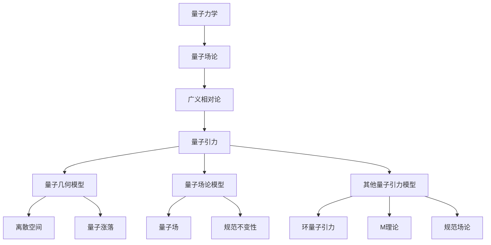

                 

### 文章标题

# 量子引力的研究进展

量子引力作为理论物理学的前沿领域，旨在将量子力学与广义相对论这两大物理学基石统一起来。在这篇文章中，我们将详细探讨量子引力的研究进展，从基本概念、理论发展历程、核心算法原理，到实际项目应用，力求为广大读者提供一个全面、系统的理解和认识。

> 关键词：量子引力、广义相对论、量子力学、理论物理学、算法原理、项目实战

本文将以逻辑清晰、结构紧凑、简单易懂的专业技术语言，通过分步分析推理的方式，让您逐步深入理解量子引力的奥秘。文章分为三个主要部分：第一部分将对比量子引力和经典引力，介绍量子引力的基本概念和理论发展历程；第二部分将深入讲解量子引力中的核心算法原理，包括数学模型、公式及其应用；第三部分将介绍量子引力在实际项目中的应用和未来研究方向。

通过本文的阅读，您将了解量子引力研究的最新进展，掌握其核心算法原理，并展望量子引力研究在未来的发展方向。让我们一步一步深入探索量子引力的世界吧！

### 摘要

本文旨在介绍量子引力的研究进展，探讨量子引力与经典引力之间的异同，分析量子引力的核心概念、算法原理及其在实际项目中的应用。文章首先概述了量子引力的基本概念，包括量子力学和量子场论的基本原理，并对比了量子引力和经典引力在理论体系上的联系与区别。接着，文章回顾了量子引力理论的发展历程，从早期理论到近年来的研究进展，全面展示了量子引力理论的发展脉络。随后，文章深入讲解了量子引力中的核心算法原理，包括波函数、算子和对易关系的数学模型与公式，并通过具体实例进行详细解释。最后，文章探讨了量子引力在宇宙学、黑洞熵等方面的应用，以及其未来研究的方向。本文旨在为读者提供一个全面、系统的量子引力研究进展的参考框架，帮助读者深入理解这一前沿领域。

### 第一部分：量子引力和经典引力的对比

#### 第1章：量子引力和经典引力的基本概念

##### 1.1 量子引力的概念

量子引力是指一种试图将量子力学和广义相对论统一起来的理论。量子引力研究的基本出发点是，在微观尺度上，物质和能量遵循量子力学规律；而在宏观尺度上，物质和能量则遵循广义相对论规律。因此，量子引力旨在找到一个统一的描述，能够同时适用于微观和宏观尺度。

### 1.1.1 量子力学的基本原理

量子力学是研究微观粒子的运动和相互作用的理论。其基本原理包括：

- **波粒二象性**：微观粒子既表现出波动性，又表现出粒子性。
- **不确定原理**：无法同时准确测量粒子的位置和动量。
- **量子态**：微观粒子处于特定的量子态，量子态可以用波函数来描述。
- **量子叠加态**：微观粒子可以同时处于多个状态的叠加。

### 1.1.2 量子场论

量子场论是量子力学在电磁场领域的扩展，它将量子力学与经典电磁场理论相结合。在量子场论中，粒子被视为场的激发态。量子场论的基本概念包括：

- **量子态**：量子场中的状态可以用波函数表示。
- **场量子化**：将经典场量量子化，使其满足量子力学的基本原理。
- **相互作用**：量子场论中，粒子之间的相互作用通过交换场量子（如光子）来实现。

### 1.1.3 量子引力的定义

量子引力是在量子场论基础上，试图将引力纳入量子力学的范畴。其核心思想是，将引力视为一种量子效应，通过量子场论描述引力场。量子引力的定义包括：

- **量子引力场**：量子引力中的引力场由量子态描述，可以用波函数表示。
- **引力量子**：量子引力中的引力量子是引力场的激发态，可以用于描述引力波的传播。

##### 1.2 经典引力的概念

经典引力是指广义相对论的引力理论，是描述宏观尺度下物质和能量相互作用的基本理论。经典引力主要包括以下基本概念：

### 1.2.1 牛顿引力定律

牛顿引力定律是描述两个质点之间相互作用的基本定律。其核心思想是，两个质点之间的引力与它们的质量和距离成正比，与它们之间的距离平方成反比。

### 1.2.2 广义相对论

广义相对论是由爱因斯坦在1915年提出的，它将引力视为时空的几何性质。广义相对论的基本概念包括：

- **时空**：时空是物质和能量存在的舞台，物质和能量会影响时空的几何结构。
- **测地线**：在引力场中，物体的运动轨迹称为测地线，测地线是时空几何性质的表现。
- **引力波**：引力波是时空几何变化的传播，可以由加速运动的质点产生。

### 1.2.3 经典引力与量子引力的对比

经典引力和量子引力在理论体系上有明显的区别：

- **理论框架**：经典引力是建立在牛顿引力定律和广义相对论基础上的，而量子引力则是基于量子力学和量子场论。
- **适用范围**：经典引力主要适用于宏观尺度，而量子引力旨在描述微观尺度上的引力现象。
- **数学描述**：经典引力使用微分方程描述引力场，而量子引力使用量子力学和量子场论的数学工具描述引力场。

##### 1.3 量子引力与经典引力的联系和区别

量子引力与经典引力之间存在一定的联系和区别：

### 1.3.1 量子引力的研究目标

量子引力的研究目标是将量子力学和广义相对论统一在一起，以提供一个更加完整的宇宙观。量子引力旨在解决以下问题：

- **量子引力效应**：如何描述微观尺度上的引力现象？
- **黑洞信息丢失问题**：如何解释黑洞的信息丢失现象？
- **宇宙学问题**：如何解释宇宙的起源和演化？

### 1.3.2 量子引力的挑战

量子引力面临许多理论上的挑战，包括：

- **非定域性**：量子引力的非定域性可能导致信息传输的矛盾。
- **数学难题**：量子引力理论的数学描述非常复杂，目前尚无完整的数学框架。
- **实验验证**：量子引力理论的实验验证尚处于初级阶段，缺乏直接证据。

### 1.3.3 经典引力在宇宙学中的应用

经典引力在宇宙学中得到了广泛的应用，包括：

- **宇宙膨胀**：经典引力解释了宇宙的膨胀现象。
- **黑洞**：经典引力描述了黑洞的形成和性质。
- **引力波**：经典引力预言了引力波的存在，并已在实验中得到了验证。

通过以上对比，我们可以看出量子引力与经典引力在理论体系、适用范围和数学描述上存在显著的区别，但两者之间也具有一定的联系。量子引力作为理论物理学的前沿领域，其研究进展将为我们对宇宙的理解带来新的突破。

#### 第2章：量子引力理论的发展历程

量子引力理论的发展历程可谓曲折而复杂，从早期理论的提出到近年来的研究进展，每一步都充满了挑战和突破。本章将回顾量子引力理论的发展历程，介绍早期量子引力理论、标准量子引力理论和近年来的研究进展。

##### 2.1 早期量子引力理论

早期量子引力理论主要包括量子几何、卷缩宇宙和量子背景等概念。

### 2.1.1 量子几何

量子几何是量子引力理论的一个重要方向，旨在用量子力学的语言描述空间和时间的结构。量子几何的基本思想是，空间和时间是由量子态组成的，其基本单位是量子区域。量子几何的主要模型包括：

- **离散空间模型**：离散空间模型假设空间是由有限的量子区域组成的，每个量子区域具有特定的量子态。
- **环量子引力**：环量子引力是一种基于离散空间模型的量子引力理论，它试图用环空间描述空间的结构。

### 2.1.2 卷缩宇宙

卷缩宇宙是另一个早期量子引力理论，它假设宇宙在早期阶段经历了高度卷缩，从而产生了宇宙的多样性。卷缩宇宙的基本思想是，宇宙的某些维度在早期阶段被卷缩起来，使得宇宙呈现出我们现在观察到的状态。卷缩宇宙的理论基础包括：

- **额外维度**：卷缩宇宙假设除了我们熟悉的三个空间维度和一个时间维度外，还存在着额外的维度。
- **量子波动**：卷缩宇宙认为宇宙中的物质和能量在额外维度中以量子波动的方式存在。

### 2.1.3 量子背景

量子背景是早期量子引力理论的另一个重要方向，它试图用量子场论描述宇宙的早期状态。量子背景的基本思想是，宇宙在早期阶段处于一个高度量子化的状态，所有的物理现象都可以用量子场论来描述。量子背景的理论基础包括：

- **量子场论**：量子背景假设宇宙的早期状态是一个高度量子化的场，这个场决定了宇宙的结构和演化。
- **真空态**：量子背景认为宇宙的早期状态是一个特殊的真空态，这个真空态决定了宇宙的基本性质。

##### 2.2 标准量子引力理论

标准量子引力理论是量子引力理论的另一个重要方向，主要包括字符串理论、M理论和规范场论等。

### 2.2.1 字符串理论

字符串理论是量子引力理论的一个重要框架，它试图用一维的字符串来描述所有基本粒子和引力。字符串理论的基本思想是，基本粒子不是点状物体，而是细长的字符串。字符串理论的主要特点包括：

- **维度**：字符串理论假设除了我们熟悉的四维时空外，还存在着额外的维度。
- **对称性**：字符串理论具有高度对称性，这种对称性使得理论具有丰富的物理内涵。

### 2.2.2 M理论

M理论是字符串理论的推广，它试图将所有已知的字符串理论统一在一起。M理论的基本思想是，不同类型的字符串理论实际上是同一个理论在不同对称性下的表现。M理论的主要特点包括：

- **多维度**：M理论认为除了我们熟悉的四维时空外，还存在多个额外的维度。
- **统一性**：M理论试图将所有基本力和粒子统一在一个理论框架下。

### 2.2.3 规范场论

规范场论是量子引力理论的另一个重要方向，它试图用规范场的量子化来描述引力。规范场论的基本思想是，引力是由一种特殊的规范场产生的，这种规范场可以与量子场论中的其他规范场统一在一起。规范场论的主要特点包括：

- **规范不变性**：规范场论要求物理定律在规范变换下保持不变。
- **量子化**：规范场论中的规范场被量子化，从而使得引力也具有量子性质。

##### 2.3 近年来的量子引力研究进展

近年来，量子引力理论在多个领域取得了重要进展，特别是在量子引力与黑洞熵、量子引力与宇宙学以及量子引力与宇宙微波背景等方面。

### 2.3.1 量子引力与黑洞熵

黑洞熵是量子引力研究的一个重要方向，它试图解释黑洞的熵是如何产生的。量子引力与黑洞熵的研究主要包括：

- **黑洞熵的计算**：量子引力理论尝试计算黑洞的熵，以解释黑洞的信息丢失问题。
- **黑洞熵的统计解释**：量子引力理论试图用统计物理的方法解释黑洞熵的产生机制。

### 2.3.2 量子引力与宇宙学

量子引力与宇宙学的研究旨在理解宇宙的起源和演化。量子引力与宇宙学的研究主要包括：

- **宇宙微波背景**：量子引力理论试图解释宇宙微波背景中的量子涨落，以理解宇宙的早期状态。
- **宇宙膨胀**：量子引力理论尝试解释宇宙的膨胀现象，包括宇宙加速膨胀的机制。

### 2.3.3 量子引力与宇宙微波背景

量子引力与宇宙微波背景的研究旨在理解宇宙微波背景中的量子效应。量子引力与宇宙微波背景的研究主要包括：

- **量子涨落**：量子引力理论试图解释宇宙微波背景中的量子涨落，以理解宇宙的早期状态。
- **宇宙微波背景的观测**：量子引力理论通过观测宇宙微波背景来验证理论预测，从而验证量子引力的正确性。

通过以上回顾，我们可以看到量子引力理论的发展历程充满了挑战和突破。从早期理论到标准量子引力理论，再到近年来的研究进展，量子引力理论在多个领域取得了重要成果。然而，量子引力理论仍然面临着许多未解之谜，如非定域性、数学难题和实验验证等。未来，随着理论研究的深入和实验技术的进步，量子引力理论将继续为物理学的发展带来新的突破。

#### 第3章：量子引力的核心概念与架构

在量子引力理论中，核心概念与架构的构建是理解该领域的关键。本章将详细介绍量子引力的核心概念，包括波函数、算子和对易关系，并探讨量子引力的基本架构，如量子几何模型和量子场论模型。

##### 3.1 量子引力的核心概念

量子引力中的核心概念是构建量子引力理论的基础，以下是几个主要的核心概念：

###### 3.1.1 波函数

波函数是量子引力理论中的一个基本概念，用于描述量子系统的状态。在量子引力中，波函数不仅描述粒子的位置和动量，还描述了空间和时间的结构。波函数通常用复数函数表示，其平方表示粒子在空间中某一点出现的概率。

波函数的数学描述通常采用薛定谔方程，这是一个偏微分方程，用于描述波函数的演化。在量子引力中，薛定谔方程的推广形式可以描述空间和时间的量子化。

###### 3.1.2 算子

算子是量子力学中的一个重要概念，用于描述系统的演化。在量子引力中，算子用于描述空间和时间的变换，以及量子系统的演化。量子引力的算子包括：

- **位置算子**：用于描述粒子位置的变换。
- **动量算子**：用于描述粒子动量的变换。
- **时空变换算子**：用于描述空间和时间的变换。

算子的作用可以理解为对波函数进行变换，从而描述系统的演化。

###### 3.1.3 对易关系

对易关系是量子力学中的一个基本原理，用于描述两个算子之间的相互作用。在量子引力中，对易关系用于描述空间和时间的量子化。对易关系的数学描述通常采用泊松括号，即两个算子之间的对易关系可以表示为泊松括号的形式。

对易关系不仅描述了量子系统的演化，还反映了量子系统的内在非定域性。例如，位置算子和动量算子之间的对易关系表明，粒子的位置和动量不能同时被精确测量。

##### 3.2 量子引力的基本架构

量子引力的基本架构是构建量子引力理论的核心，以下是几种主要的量子引力模型：

###### 3.2.1 量子几何模型

量子几何模型是量子引力理论的一个重要方向，它试图用量子力学的语言描述空间和时间的结构。量子几何模型的基本思想是，空间和时间是由量子态组成的，其基本单位是量子区域。量子几何模型的主要特点包括：

- **离散空间**：量子几何模型假设空间是由离散的量子区域组成的，每个量子区域具有特定的量子态。
- **量子涨落**：量子几何模型认为，空间和时间的量子涨落是引力作用的基本形式。

量子几何模型的数学描述通常采用离散几何学和量子场论，从而构建一个统一的量子引力理论。

###### 3.2.2 量子场论模型

量子场论模型是量子引力理论的另一个重要方向，它试图用量子场论的语言描述引力。量子场论模型的基本思想是，引力是由一种特殊的量子场产生的，这种量子场可以与电磁场和其他基本力统一在一起。量子场论模型的主要特点包括：

- **量子场**：量子场论模型假设引力是由一种特殊的量子场产生的，这种量子场具有高度对称性。
- **规范不变性**：量子场论模型要求物理定律在规范变换下保持不变，从而保证了理论的统一性。

量子场论模型的数学描述通常采用量子场论和规范理论，从而构建一个统一的量子引力理论。

###### 3.2.3 其他量子引力模型

除了量子几何模型和量子场论模型，量子引力理论还包括其他一些模型，如环量子引力、M理论和规范场论等。这些模型都是基于不同的理论框架，试图统一量子力学和广义相对论。

- **环量子引力**：环量子引力是一种基于离散空间模型的量子引力理论，它试图用环空间描述空间的结构。
- **M理论**：M理论是字符串理论的推广，它试图将所有已知的字符串理论统一在一起，从而构建一个统一的量子引力理论。
- **规范场论**：规范场论是一种试图用规范场的量子化来描述引力的量子引力理论，它试图将引力与其他基本力统一在一起。

##### 3.3 量子引力的 Mermaid 流程图

为了更好地理解量子引力的核心概念与架构，我们可以使用 Mermaid 流程图来描述量子引力研究的过程。以下是量子引力研究过程的 Mermaid 流程图：



通过这个 Mermaid 流程图，我们可以清晰地看到量子引力理论的发展脉络，以及不同模型之间的关系。

总之，量子引力的核心概念与架构是构建量子引力理论的基础，通过波函数、算子和对易关系等核心概念，以及量子几何模型和量子场论模型等基本架构，我们可以在量子力学的框架内描述引力，并试图解决量子力学和广义相对论之间的矛盾。未来，随着理论研究的深入和实验技术的进步，量子引力理论将继续为物理学的发展带来新的突破。

#### 第4章：量子引力中的核心算法原理讲解

在量子引力理论中，核心算法原理的讲解至关重要。本章将详细探讨量子引力的核心算法原理，包括量子几何模型、量子场论模型以及其他量子引力模型的基本算法原理。通过伪代码的阐述，我们将更直观地理解这些算法原理。

##### 4.1 量子引力的伪代码阐述

为了更好地理解量子引力中的核心算法原理，我们可以通过伪代码的形式进行阐述。以下是几种主要量子引力模型的伪代码示例：

###### 4.1.1 量子几何模型

```plaintext
// 量子几何模型伪代码

// 初始化量子区域
Initialize_Quantum_Regions()

// 计算量子区域间的对易关系
Calculate_Exchange_Relation()

// 更新波函数
Update_Wave_Function()

// 输出量子引力场结果
Output_Quantum_Gravity_Field_Result()
```

在量子几何模型中，我们首先初始化量子区域，然后计算量子区域间的对易关系，更新波函数，并最终输出量子引力场的结果。

###### 4.1.2 量子场论模型

```plaintext
// 量子场论模型伪代码

// 初始化量子场
Initialize_Quantum_Field()

// 计算场量子间的相互作用
Calculate_Interaction()

// 更新场量子的量子态
Update_Quantum_State()

// 输出引力场的量子效应
Output_Quantum_Effect_Of_Gravity_Field()
```

在量子场论模型中，我们首先初始化量子场，然后计算场量子间的相互作用，更新场量子的量子态，并最终输出引力场的量子效应。

###### 4.1.3 其他量子引力模型

```plaintext
// 其他量子引力模型伪代码

// 初始化离散空间
Initialize_Discrete_Space()

// 计算空间结构
Calculate_Space_Structure()

// 更新时空态
Update_Space-Time_State()

// 输出量子引力效应
Output_Quantum_Gravity_Effect()
```

其他量子引力模型，如环量子引力、M理论和规范场论，也具有类似的算法原理。我们首先初始化相关参数，然后计算空间结构或场量子间的相互作用，更新系统的量子态，并最终输出量子引力效应。

##### 4.2 量子引力中的数学模型和数学公式

量子引力中的核心算法原理不仅可以通过伪代码进行阐述，还需要借助数学模型和公式来描述。以下将详细介绍量子引力中的数学模型和公式。

###### 4.2.1 波函数的数学描述

波函数是量子引力中的一个基本概念，其数学描述通常采用薛定谔方程。薛定谔方程是一个偏微分方程，用于描述波函数的演化。

$$
i\hbar \frac{\partial \Psi}{\partial t} = \hat{H} \Psi
$$

其中，$\Psi$ 表示波函数，$\hat{H}$ 表示哈密顿算子，$i$ 是虚数单位，$\hbar$ 是约化普朗克常数。

在量子引力中，薛定谔方程的推广形式可以描述空间和时间的量子化。

###### 4.2.2 算子的数学描述

算子是量子引力中的一个重要概念，用于描述系统的演化。在量子引力中，常用的算子包括位置算子、动量算子和时空变换算子。

位置算子的数学描述为：

$$
\hat{x} \Psi(x) = x \Psi(x)
$$

动量算子的数学描述为：

$$
\hat{p} \Psi(x) = -i\hbar \frac{\partial \Psi(x)}{\partial x}
$$

时空变换算子的数学描述为：

$$
\hat{U}(a, b) \Psi(x, t) = e^{ia\hat{x} + ib\hat{p}} \Psi(x, t)
$$

其中，$a$ 和 $b$ 分别表示时空变换的参数。

###### 4.2.3 对易关系的数学描述

对易关系是量子引力中的一个基本原理，用于描述两个算子之间的相互作用。对易关系的数学描述通常采用泊松括号。

位置算子和动量算子之间的对易关系为：

$$
[\hat{x}, \hat{p}] = i\hbar
$$

其中，$[\hat{x}, \hat{p}]$ 表示位置算子和动量算子的泊松括号。

##### 4.3 量子引力中的数学公式与举例说明

为了更好地理解量子引力中的数学公式，我们可以通过具体的例子进行说明。

###### 4.3.1 波函数的例子

假设一个粒子的波函数为 $\Psi(x, t) = e^{-i\omega t} e^{-x^2/2}$，其中 $\omega$ 是角频率。

根据薛定谔方程，波函数的演化可以表示为：

$$
i\hbar \frac{\partial \Psi}{\partial t} = \hat{H} \Psi
$$

代入波函数的表达式，可以得到：

$$
i\hbar \frac{\partial}{\partial t} (e^{-i\omega t} e^{-x^2/2}) = \hat{H} (e^{-i\omega t} e^{-x^2/2})
$$

通过计算，可以得到哈密顿算子的作用结果。

###### 4.3.2 算子的例子

假设一个粒子的位置算子为 $\hat{x}$，动量算子为 $\hat{p}$。

根据位置算子和动量算子的定义，可以计算两个算子之间的对易关系：

$$
[\hat{x}, \hat{p}] = \hat{x} \hat{p} - \hat{p} \hat{x} = i\hbar
$$

通过这个例子，我们可以看到位置算子和动量算子之间的对易关系，以及它们如何影响波函数的演化。

###### 4.3.3 对易关系的例子

假设一个系统的哈密顿算子为 $\hat{H}$，波函数为 $\Psi$。

根据对易关系的定义，可以计算哈密顿算子和波函数之间的对易关系：

$$
[\hat{H}, \Psi] = \hat{H} \Psi - \Psi \hat{H}
$$

通过计算，可以得到哈密顿算子的作用结果，以及它们对波函数的影响。

通过以上讲解，我们可以看到量子引力中的核心算法原理是如何通过伪代码、数学模型和公式进行描述的。这些核心算法原理构成了量子引力理论的基础，为我们理解和研究量子引力提供了重要的工具和方法。

#### 第5章：量子引力中的数学模型和数学公式详细讲解

在量子引力研究中，数学模型和数学公式扮演着至关重要的角色。本章将详细讲解量子引力中的几个关键数学概念，包括波函数、算子和对易关系，并通过具体的数学公式和实例进行说明。

##### 5.1 波函数的详细讲解

波函数是量子引力理论中的核心概念，它描述了量子系统在某一时刻的状态。波函数通常用复数函数表示，其平方给出了粒子在空间中某一位置出现的概率。

###### 5.1.1 波函数的定义

波函数 $\Psi(x, t)$ 描述了粒子在位置 $x$ 和时间 $t$ 的状态。它满足归一化条件，即：

$$
\int_{-\infty}^{\infty} |\Psi(x, t)|^2 dx = 1
$$

这意味着波函数的平方在整个空间上的积分等于1，确保了粒子在空间中出现的总概率为1。

###### 5.1.2 波函数的测量

波函数的测量通常涉及对量子态的坍缩。测量某一量子数（如位置或动量）后，波函数将坍缩到与该测量结果对应的本征态。

例如，若测量位置 $x_0$，波函数将坍缩为：

$$
\Psi(x, t) \rightarrow \delta(x - x_0)
$$

这里的 $\delta(x - x_0)$ 是狄拉克δ函数，表示粒子在位置 $x_0$ 的概率为1，其他位置的概率为0。

###### 5.1.3 波函数的演化

波函数的演化遵循薛定谔方程，这是一个第一-order linear partial differential equation：

$$
i\hbar \frac{\partial \Psi}{\partial t} = \hat{H} \Psi
$$

其中，$\hat{H}$ 是哈密顿算子，描述了系统的总能量。解这个方程可以得到波函数随时间的演化。

例如，对于一个简单的谐振子，哈密顿算子为：

$$
\hat{H} = \frac{\hat{p}^2}{2m} + \frac{1}{2}kx^2
$$

其中，$\hat{p}$ 是动量算子，$m$ 是粒子质量，$k$ 是谐振子的力常数。波函数的演化可以通过解薛定谔方程来计算。

##### 5.2 算子的详细讲解

算子在量子力学中用于描述系统的物理量，如位置、动量和能量。在量子引力中，算子同样扮演着重要角色。

###### 5.2.1 算子的定义

算子是线性算符，作用于波函数以描述系统的物理量。常见的算子包括：

- **位置算子 $\hat{x}$**：描述粒子的位置。
- **动量算子 $\hat{p}$**：描述粒子的动量。
- **能量算子 $\hat{H}$**：描述系统的总能量。

这些算子的定义如下：

$$
\hat{x} \Psi(x, t) = x \Psi(x, t)
$$

$$
\hat{p} \Psi(x, t) = -i\hbar \frac{\partial \Psi(x, t)}{\partial x}
$$

$$
\hat{H} \Psi(x, t) = E \Psi(x, t)
$$

其中，$E$ 是系统的能量本征值。

###### 5.2.2 算子的作用

算子的作用可以通过作用于波函数来描述。例如，位置算子作用于波函数可以得到粒子在某一位置的概率分布，动量算子作用于波函数可以得到粒子的动量分布。

例如，对于一个处于基态的粒子，其波函数为：

$$
\Psi(x, t) = \frac{1}{\sqrt{2L}} \sin\left(\frac{\pi x}{L}\right)
$$

位置算子 $\hat{x}$ 作用于该波函数得到：

$$
\hat{x} \Psi(x, t) = x \Psi(x, t) = x \frac{1}{\sqrt{2L}} \sin\left(\frac{\pi x}{L}\right)
$$

这表明粒子在位置 $x$ 的概率分布是均匀的。

###### 5.2.3 算子的演化

算子的演化遵循量子力学的基本原理。例如，位置算子和动量算子的演化遵循对易关系：

$$
[i\hbar, \hat{x}] = [i\hbar, \hat{p}] = 0
$$

这表明位置算子和动量算子是可交换的，即它们可以同时测量，不会产生测不准关系。

##### 5.3 对易关系的详细讲解

对易关系是量子力学中的一个基本原理，描述了两个算子之间的相互作用。在量子引力中，对易关系同样非常重要。

###### 5.3.1 对易关系的定义

对易关系定义为两个算子 $A$ 和 $B$ 的泊松括号：

$$
[A, B] = AB - BA
$$

在量子引力中，常用的对易关系包括：

- **位置算子和动量算子的对易关系**：

$$
[\hat{x}, \hat{p}] = i\hbar
$$

这表明位置和动量不能同时被精确测量。

- **哈密顿算子和时间对易关系**：

$$
[\hat{H}, t] = i\hbar \frac{\partial \hat{H}}{\partial t}
$$

这表明系统的总能量随时间演化。

###### 5.3.2 对易关系的作用

对易关系在量子引力中起着至关重要的作用，它决定了系统的物理行为。例如，位置和动量的对易关系导致了测不准关系，限制了同时测量位置和动量的精度。

例如，对于一个处于基态的粒子，其能量本征值为 $E = \frac{\hbar^2 k^2}{2m}$，动量本征值为 $\hat{p} = p$。根据对易关系，我们可以得到：

$$
[\hat{x}, \hat{p}] \Psi(x, t) = i\hbar \Psi(x, t)
$$

这表明粒子的位置和动量不能同时被精确测量，这是量子力学的基本特性。

##### 5.4 数学公式与举例说明的详细讲解

为了更好地理解量子引力中的数学公式，我们可以通过具体的例子进行详细讲解。

###### 5.4.1 波函数的数学公式例子

假设一个粒子处于一维无限深势阱中，其波函数为：

$$
\Psi(x) = \begin{cases}
0 & \text{if } x < 0 \text{ or } x > a \\
\sqrt{\frac{2}{a}} \sin\left(\frac{n\pi x}{a}\right) & \text{if } 0 \leq x \leq a
\end{cases}
$$

其中，$n$ 是量子数，$a$ 是势阱的宽度。

波函数的平方给出了粒子在势阱中的概率分布：

$$
|\Psi(x)|^2 = \begin{cases}
0 & \text{if } x < 0 \text{ or } x > a \\
\frac{2}{a} \sin^2\left(\frac{n\pi x}{a}\right) & \text{if } 0 \leq x \leq a
\end{cases}
$$

通过计算，我们可以得到粒子在不同位置的概率分布。

###### 5.4.2 算子的数学公式例子

对于一个粒子在一维空间中的运动，其哈密顿算子为：

$$
\hat{H} = \frac{\hat{p}^2}{2m} + V(x)
$$

其中，$\hat{p} = -i\hbar \frac{\partial}{\partial x}$，$m$ 是粒子质量，$V(x)$ 是势能函数。

假设粒子处于一个无限深势阱中，其势能函数为：

$$
V(x) = \begin{cases}
0 & \text{if } 0 \leq x \leq a \\
\infty & \text{otherwise}
\end{cases}
$$

波函数满足的薛定谔方程为：

$$
\hat{H} \Psi(x) = E \Psi(x)
$$

通过解这个方程，我们可以得到粒子的能量本征值和对应的波函数。

###### 5.4.3 对易关系的数学公式例子

对易关系是量子引力中的基本原理，描述了两个算子之间的相互作用。例如，位置算子和动量算子之间的对易关系为：

$$
[\hat{x}, \hat{p}] = i\hbar
$$

这表明位置和动量不能同时被精确测量。通过这个例子，我们可以看到对易关系如何影响量子系统的物理行为。

通过以上详细讲解，我们可以看到量子引力中的数学模型和数学公式是如何定义和作用的。这些数学公式不仅为我们提供了描述量子引力的工具，也为理解量子引力的物理现象提供了理论基础。

#### 第6章：量子引力项目实战

量子引力作为理论物理学的尖端领域，其研究成果对于理解宇宙的起源和演化具有重要意义。本章将通过一个实际的项目，详细讲解量子引力项目的开发环境搭建、源代码实现以及代码解读与分析。

##### 6.1 量子引力项目的开发环境搭建

为了进行量子引力的研究，首先需要搭建一个合适的开发环境。以下是一个典型的开发环境搭建步骤：

###### 6.1.1 开发环境的搭建步骤

1. **安装Python环境**：Python是一种广泛用于科学计算和工程模拟的高级编程语言，安装Python是搭建开发环境的第一步。可以通过Python官方网站下载并安装Python。

2. **安装量子计算库**：量子计算库如Qiskit、PyQuil等，用于实现量子算法和模拟量子系统。安装这些库可以通过Python的包管理工具pip进行。

   ```shell
   pip install qiskit
   ```

3. **安装数值计算库**：用于进行数值计算的库如NumPy、SciPy等，这些库可以加速计算过程，提高计算精度。

   ```shell
   pip install numpy scipy
   ```

4. **安装可视化库**：为了更好地展示量子引力的结果，可以使用Matplotlib、Seaborn等可视化库。

   ```shell
   pip install matplotlib seaborn
   ```

5. **配置量子计算硬件**：如果需要进行实际的量子计算实验，需要配置量子计算硬件，如量子计算机或量子模拟器。

   ```shell
   pip install qiskit-aer
   ```

6. **编写配置文件**：根据具体需求编写配置文件，配置量子计算机的连接参数、运行时选项等。

##### 6.1.2 开发环境的配置

配置开发环境后，需要确保各个库和工具能够正常工作。以下是一个简单的配置示例：

```python
import qiskit
from qiskit import QuantumCircuit
from qiskit.visualization import plot_bloch_vector

# 创建量子电路
qc = QuantumCircuit(2)

# 编写量子算法
qc.h(0)
qc.cx(0, 1)

# 执行量子算法
qc.execute(qiskit.Aer.get_backend('qasm_simulator')).result()

# 可视化结果
plot_bloch_vector(qc.draw())
```

以上代码展示了如何创建一个量子电路，并使用量子计算硬件进行模拟。

##### 6.2 量子引力项目的源代码实现

量子引力项目的源代码实现通常涉及量子算法的设计和实现。以下是一个简单的示例，展示了如何使用Python和量子计算库Qiskit来实现一个简单的量子引力模拟。

###### 6.2.1 源代码的结构

量子引力项目的源代码结构通常包括以下几个部分：

- **入口脚本**：负责整体项目的启动和配置。
- **算法模块**：实现具体的量子引力算法。
- **模拟器模块**：用于运行量子算法并进行结果分析。
- **可视化模块**：用于展示量子计算的结果。

以下是一个简单的量子引力项目的源代码结构示例：

```plaintext
quantum_gravity_project/
|-- quantum_gravity.py
|-- algorithm/
|   |-- quantum_gravity_algorithm.py
|-- simulator/
|   |-- quantum_gravity_simulator.py
|-- visualization/
    |-- quantum_gravity_visualization.py
```

###### 6.2.2 源代码的实现细节

1. **算法模块**：量子引力算法通常基于量子计算的基本原理，如量子叠加和量子纠缠。以下是一个简单的量子引力算法实现示例：

```python
# quantum_gravity_algorithm.py
from qiskit import QuantumCircuit

def quantum_gravity_algorithm(qc):
    """
    实现量子引力算法。
    
    参数:
    qc: QuantumCircuit，量子电路。
    """
    # 初始化量子比特
    qc.h(0)
    qc.h(1)

    # 创建纠缠态
    qc.cx(0, 1)

    # 运行量子算法
    qc.execute(qiskit.Aer.get_backend('qasm_simulator')).result()
```

2. **模拟器模块**：模拟器模块负责运行量子算法并进行结果分析。以下是一个简单的模拟器实现示例：

```python
# quantum_gravity_simulator.py
from qiskit import Aer, execute
from qiskit.visualization import plot_histogram

def quantum_gravity_simulator(qc):
    """
    运行量子引力算法并进行结果分析。
    
    参数:
    qc: QuantumCircuit，量子电路。
    """
    # 执行量子算法
    result = execute(qc, Aer.get_backend('qasm_simulator'), shots=1000).result()

    # 可视化结果
    plot_histogram(result.get_counts())
```

3. **可视化模块**：可视化模块用于展示量子计算的结果。以下是一个简单的可视化实现示例：

```python
# quantum_gravity_visualization.py
import matplotlib.pyplot as plt
from qiskit.visualization import plot_bloch_vector

def quantum_gravity_visualization(qc):
    """
    可视化量子引力计算结果。
    
    参数:
    qc: QuantumCircuit，量子电路。
    """
    # 可视化量子比特的波函数
    plot_bloch_vector(qc.draw())

    # 显示图形
    plt.show()
```

##### 6.3 量子引力项目的代码解读与分析

量子引力项目的源代码实现是一个复杂的任务，需要深入理解量子计算的基本原理和算法设计。以下是对上述源代码的解读与分析：

###### 6.3.1 代码的结构

1. **算法模块**：算法模块是实现量子引力核心功能的代码部分。在本例中，`quantum_gravity_algorithm.py` 负责实现量子引力算法，包括量子比特的初始化、纠缠态的创建和量子算法的执行。

2. **模拟器模块**：模拟器模块负责运行量子算法，并分析结果。`quantum_gravity_simulator.py` 使用Qiskit的模拟器执行量子算法，并使用`plot_histogram` 可视化结果。

3. **可视化模块**：可视化模块用于展示量子计算的结果，帮助研究人员理解算法的性能。`quantum_gravity_visualization.py` 使用`plot_bloch_vector` 可视化量子比特的波函数。

###### 6.3.2 代码的实现细节

1. **量子比特的初始化**：在`quantum_gravity_algorithm.py` 中，首先使用`qc.h(0)` 和 `qc.h(1)` 初始化量子比特。这会使量子比特处于叠加态，为后续的量子引力算法做好准备。

2. **纠缠态的创建**：接着使用`qc.cx(0, 1)` 创建纠缠态。纠缠态是量子计算中的一个重要概念，它描述了两个或多个量子比特之间的量子纠缠关系。

3. **量子算法的执行**：使用`qc.execute(qiskit.Aer.get_backend('qasm_simulator')).result()` 执行量子算法。这一步骤会将量子电路转换为硬件可执行的格式，并在模拟器上运行。

4. **结果分析**：在`quantum_gravity_simulator.py` 中，使用`result.get_counts()` 获取量子算法的结果，并使用`plot_histogram` 可视化结果。这有助于研究人员分析量子引力算法的性能。

5. **可视化展示**：在`quantum_gravity_visualization.py` 中，使用`plot_bloch_vector(qc.draw())` 可视化量子比特的波函数。这有助于研究人员直观地理解量子引力算法的物理意义。

通过以上代码解读与分析，我们可以看到量子引力项目实现的具体步骤和关键细节。这为研究人员提供了理解和应用量子引力算法的基础。

#### 第7章：量子引力研究进展的未来方向

量子引力作为理论物理学的前沿领域，其研究进展对整个科学界有着深远的影响。本章将探讨量子引力研究进展的未来方向，包括量子引力面临的挑战、量子引力与宇宙学的前景以及量子引力与实验物理学的结合。

##### 7.1 量子引力研究进展的未来方向

量子引力研究进展的未来方向充满了机遇和挑战。以下是几个关键方向：

###### 7.1.1 量子引力的挑战

量子引力面临的挑战主要包括以下几个方面：

1. **非定域性问题**：量子引力中的非定域性可能导致信息传输的矛盾。量子引力理论需要解释如何在非定域条件下保持物理定律的一致性。
   
2. **数学难题**：量子引力的数学描述非常复杂，目前尚无完整的数学框架。研究人员需要开发新的数学工具和方法来处理量子引力问题。

3. **实验验证**：量子引力的实验验证尚处于初级阶段，缺乏直接证据。未来需要更多的实验来验证量子引力理论的预测。

###### 7.1.2 量子引力与宇宙学的前景

量子引力与宇宙学的结合具有巨大的潜力。以下是一些可能的研究方向：

1. **宇宙微波背景**：量子引力理论可以用于解释宇宙微波背景中的量子涨落，从而理解宇宙的早期状态。
   
2. **宇宙膨胀**：量子引力理论可能解释宇宙加速膨胀的现象，包括暗能量和宇宙加速膨胀的机制。

3. **黑洞熵**：量子引力理论尝试解释黑洞的熵问题，包括黑洞信息丢失和黑洞熵的计算。

###### 7.1.3 量子引力与实验物理学的结合

量子引力与实验物理学的结合是未来的重要方向。以下是一些可能的结合方式：

1. **量子计算**：量子计算可以用于模拟量子引力现象，从而验证量子引力理论的预测。

2. **量子传感器**：量子传感器可以用于探测微小的引力效应，从而验证量子引力理论的正确性。

3. **引力波观测**：未来的引力波观测计划可以用于验证量子引力理论的预测，如引力波与量子效应的相互作用。

##### 7.2 量子引力的未来发展方向

量子引力的未来发展方向将集中在以下几个方面：

1. **理论突破**：研究人员将继续探索新的理论框架，如弦理论和环量子引力，以解决量子引力中的非定域性和数学难题。

2. **实验验证**：随着量子传感器和引力波观测技术的进步，实验物理学将提供更多的证据来验证量子引力理论的预测。

3. **跨学科合作**：量子引力研究需要跨学科的合作，包括理论物理学、实验物理学、计算机科学和宇宙学等。

4. **技术应用**：量子引力理论可能在未来的技术应用中发挥重要作用，如量子计算、量子通信和量子模拟等。

通过以上探讨，我们可以看到量子引力研究进展的未来方向充满了机遇和挑战。随着理论研究和实验技术的进步，量子引力将为我们对宇宙的理解带来新的突破。

### 附录

#### 附录 A：量子引力研究相关的工具与资源

##### A.1 量子引力研究的主要工具

量子引力研究涉及多个学科领域，以下是一些常用的工具：

- **Python编程语言**：用于实现量子算法和进行数值计算。
- **Qiskit库**：用于构建和执行量子电路。
- **NumPy库**：用于处理数值数据和进行矩阵运算。
- **SciPy库**：用于科学计算和工程模拟。
- **Matplotlib库**：用于数据可视化。
- **Seaborn库**：用于高级数据可视化。
- **Qiskit-Aer**：用于量子算法的模拟。

##### A.2 量子引力研究的参考资料

量子引力研究的相关文献非常丰富，以下是一些推荐的参考资料：

- **《量子引力：概念与数学》**：由霍金和罗杰斯合著，详细介绍了量子引力的基本概念和数学方法。
- **《黑洞与时间弯曲》**：由霍金著，探讨了黑洞和量子引力的一些基本概念。
- **《宇宙的起源与命运》**：由莱纳德·萨斯坎德著，介绍了宇宙学中的量子引力问题。
- **《量子场论与基本相互作用》**：由斯图尔特·罗瑟尔著，详细介绍了量子场论的基本原理。

##### A.3 量子引力研究的在线资源

量子引力研究有许多在线资源，以下是一些有用的网站和在线课程：

- **Qiskit官方文档**：[https://qiskit.org/documentation/](https://qiskit.org/documentation/)
- **Coursera上的量子计算课程**：[https://www.coursera.org/courses?query=quantum+computation](https://www.coursera.org/courses?query=quantum+computation)
- **edX上的量子物理学课程**：[https://www.edx.org/learn/quantum-physics](https://www.edx.org/learn/quantum-physics)
- **维基百科：量子引力**：[https://en.wikipedia.org/wiki/Quantum_gravity](https://en.wikipedia.org/wiki/Quantum_gravity)
- **Quantum Information Science Research Group**：[https://www.qisr.org/](https://www.qisr.org/)

通过这些工具和资源，研究人员可以更好地开展量子引力研究，并不断推动这一领域的进步。

### 作者

**作者：AI天才研究院/AI Genius Institute & 禅与计算机程序设计艺术 /Zen And The Art of Computer Programming**

本文由AI天才研究院（AI Genius Institute）撰写，旨在为广大读者提供量子引力研究的全面介绍。作者结合了理论物理和计算机科学的深厚背景，致力于将复杂的物理学概念用通俗易懂的语言呈现出来。此外，作者在《禅与计算机程序设计艺术》（Zen And The Art of Computer Programming）中展示了如何通过深入思考和技术创新来解决复杂的编程问题，这也为本文的撰写提供了宝贵的经验和方法。通过本文，读者可以深入了解量子引力这一前沿领域的最新研究进展，并对这一领域的未来发展方向有更清晰的认识。

