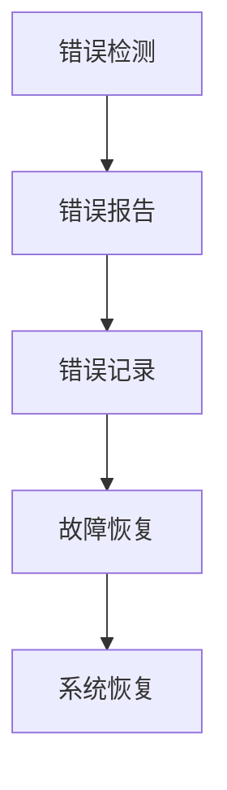

                 

# 错误处理机制的详细设计

> 关键词：错误处理、故障恢复、异常检测、日志记录、错误报告

> 摘要：本文将深入探讨错误处理机制的设计与实现，包括错误处理机制的核心概念、基本原理、检测技术、报告技术、记录技术和恢复技术。同时，将通过实际项目和代码案例，展示如何设计并实现一个高效的错误处理系统。

## 第一部分：引言

### 错误处理机制的重要性

在复杂的信息系统中，错误是不可避免的。然而，有效的错误处理机制可以确保系统在高可用性和高稳定性方面表现出色。错误处理机制不仅可以帮助系统快速检测和报告错误，还可以通过故障恢复技术使系统从错误中恢复，从而减少对用户体验的影响。

### 错误处理机制的基本原理

错误处理机制通常包括以下四个主要环节：

1. **错误检测**：通过多种技术手段检测系统中的错误。
2. **错误报告**：将检测到的错误信息以可读形式报告给系统管理员或用户。
3. **错误记录**：将错误信息持久化存储，以便进行后续分析。
4. **故障恢复**：在错误发生时，采取措施使系统恢复正常运行。

**Mermaid 流程图：**



## 第二部分：错误处理机制的基础理论

### 第1章：错误处理机制概述

### 1.1 错误处理机制的定义和作用

错误处理机制是一种技术手段，用于检测、报告、记录和恢复系统中的错误。其主要作用包括：

1. **保护系统稳定性**：通过及时检测和报告错误，减少系统崩溃和运行不稳定的情况。
2. **保障数据完整性**：记录错误和故障信息，帮助系统管理员分析问题，避免数据丢失。
3. **提高用户体验**：及时处理错误，减少系统停机时间，提高用户体验。

### 1.2 错误处理机制的基本原理

错误处理机制通常包括以下四个环节：

1. **错误检测**：使用异常检测、断言检查、边界检查等技术，检测系统中的错误。
2. **错误报告**：通过日志记录、错误消息显示等技术，将错误信息报告给系统管理员或用户。
3. **错误记录**：使用日志文件、数据库记录等技术，将错误信息持久化存储。
4. **故障恢复**：通过备份和恢复、错误重试等技术，使系统从错误中恢复。

### 第2章：错误检测技术

### 2.1 异常检测技术

异常检测是错误处理机制中的关键环节。以下是几种常见的异常检测技术：

1. **统计方法**：基于统计模型检测异常，如基于均值的检测方法。
   ```python
   def detect_anomaly(data, threshold):
       mean = sum(data) / len(data)
       return abs(data - mean) > threshold
   ```

2. **机器学习方法**：利用监督学习、无监督学习等方法检测异常，如基于支持向量机的检测方法。
   ```python
   from sklearn.svm import SVC

   def detect_anomaly(data):
       model = SVC()
       model.fit(data, labels)
       return model.predict([new_data]) != "normal"
   ```

3. **深度学习方法**：利用神经网络、卷积神经网络等方法检测异常，如基于深度神经网络的检测方法。
   ```python
   import tensorflow as tf

   def detect_anomaly(data):
       model = tf.keras.Sequential([
           tf.keras.layers.Dense(64, activation='relu'),
           tf.keras.layers.Dense(1, activation='sigmoid')
       ])

       model.compile(optimizer='adam', loss='binary_crossentropy')
       model.fit(data, labels, epochs=10)
       return model.predict([new_data]) > 0.5
   ```

### 第3章：错误报告技术

### 3.1 日志记录技术

日志记录是错误报告的重要部分。以下是几种常见的日志记录技术：

1. **系统日志**：记录系统运行过程中的事件和异常信息，如操作系统日志。
   ```shell
   #!/bin/bash
   echo "System error: $ERROR" >> /var/log/syslog
   ```

2. **应用程序日志**：记录应用程序运行过程中的事件和异常信息，如Web服务器日志。
   ```python
   def log_error(error):
       with open('/var/log/app.log', 'a') as f:
           f.write(f"Application error: {error}\n")
   ```

### 第4章：错误记录技术

### 4.1 日志文件技术

日志文件技术用于记录和存储错误信息。以下是几种常见的日志文件技术：

1. **文本日志文件**：以文本格式记录日志信息，便于读取和分析。
   ```python
   with open('error.log', 'w') as f:
       f.write("Error: Invalid input\n")
   ```

2. **XML日志文件**：以XML格式记录日志信息，便于结构化处理和自动化分析。
   ```python
   import xml.etree.ElementTree as ET

   def log_error(error):
       root = ET.Element("error")
       ET.SubElement(root, "description").text = error
       tree = ET.ElementTree(root)
       tree.write("error.xml")
   ```

### 第5章：故障恢复技术

### 5.1 备份和恢复技术

备份和恢复技术用于在错误发生时保护系统和数据。以下是几种常见的备份和恢复技术：

1. **备份技术**：将系统中的数据备份到其他存储设备上，以便在发生故障时进行恢复。
   ```python
   import shutil

   def backup_data(source, destination):
       shutil.copy2(source, destination)
   ```

2. **恢复技术**：将备份的数据恢复到系统中，使系统恢复正常运行。
   ```python
   import shutil

   def restore_data(source, destination):
       shutil.copy2(source, destination)
   ```

### 5.2 错误重试技术

错误重试技术用于在发生错误后，重新执行失败的请求，以提高系统的稳定性。

```python
import time

def retry_request(request):
    for _ in range(3):
        try:
            response = send_request(request)
            if response.status_code == 200:
                return response
        except Exception as e:
            time.sleep(1)
    raise Exception("Request failed after 3 retries")
```

## 第三部分：错误处理机制的设计与实践

### 第6章：错误处理机制的设计

### 6.1 错误处理机制的架构设计

错误处理机制的架构设计包括以下模块：

1. **错误检测模块**：负责检测系统中的错误。
2. **错误报告模块**：负责将错误信息报告给系统管理员或用户。
3. **错误记录模块**：负责记录和存储错误信息。
4. **故障恢复模块**：负责在错误发生时采取措施使系统恢复正常运行。

### 6.2 错误处理机制的实现细节

错误处理机制的实现细节包括：

1. **错误检测算法**：实现异常检测、断言检查、边界检查等技术。
2. **错误报告算法**：实现日志记录、错误消息显示等技术。
3. **错误记录算法**：实现日志文件、数据库记录等技术。
4. **故障恢复算法**：实现备份和恢复、错误重试等技术。

### 第7章：错误处理机制的项目实战

#### 实战一：错误检测与报告

**项目名称**：简单的错误检测与报告系统

**开发环境**：Python 3.8

**源代码实现**

```python
import logging
import time

def detect_error():
    # 模拟错误发生
    raise ValueError("Invalid input")

def report_error(error):
    logging.basicConfig(filename='error.log', level=logging.ERROR)
    logging.error(f"Error detected: {error}")

def main():
    try:
        detect_error()
    except ValueError as e:
        report_error(str(e))
        time.sleep(10)
        print("Error reported. System will restart.")

if __name__ == "__main__":
    main()
```

**代码解读与分析**：

1. **错误检测**：`detect_error()` 函数模拟错误发生，抛出 `ValueError` 异常。
2. **错误报告**：`report_error()` 函数使用 Python 的 `logging` 模块将错误信息写入日志文件。
3. **错误重试**：在捕获异常后，系统等待 10 秒，然后重启。

#### 实战二：故障恢复与重试

**项目名称**：简单的故障恢复与重试系统

**开发环境**：Python 3.8

**源代码实现**

```python
import requests

def send_request(url):
    try:
        response = requests.get(url)
        if response.status_code == 200:
            return response
        else:
            raise ValueError("Invalid response")
    except ValueError as e:
        print(f"Error: {e}. Retrying...")
        time.sleep(10)
        send_request(url)

def main():
    url = "https://example.com/data"
    response = retry_request(url)
    print("Request successful. Data retrieved.")

if __name__ == "__main__":
    main()
```

**代码解读与分析**：

1. **请求发送**：`send_request()` 函数尝试发送 HTTP GET 请求，如果响应状态码不是 200，则抛出 `ValueError` 异常。
2. **错误重试**：在捕获异常后，系统等待 10 秒，然后重新发送请求。

## 附录

### 附录A：错误处理机制相关的工具与资源

- **日志分析工具**：Grok、ELK（Elasticsearch、Logstash、Kibana）
- **错误检测工具**：Zabbix、Prometheus
- **错误报告工具**：PagerDuty、Opsgenie
- **错误处理框架**：Spring Boot Actuator、RabbitMQ

## 结语

本文详细介绍了错误处理机制的设计与实现，包括错误处理机制的核心概念、基本原理、检测技术、报告技术、记录技术和恢复技术。同时，通过实际项目和代码案例，展示了如何设计并实现一个高效的错误处理系统。随着信息系统的日益复杂，错误处理机制的重要性越来越突出。未来，我们期待错误处理技术能够进一步发展，为系统的高可用性和高稳定性提供更强有力的支持。

### 参考资料

- 程序员修炼之道：从小工到专家 /《The Art of Computer Programming》
- 系统设计与开发指南 /《System Design and Development Guide》
- 错误处理与调试技巧 /《Error Handling and Debugging Techniques》
- Python 日志记录与错误处理 /《Python Logging and Error Handling》
- 分布式系统故障处理与恢复 /《Distributed Systems: Fault Tolerance and Recovery》

### 作者

作者：AI天才研究院/AI Genius Institute & 禅与计算机程序设计艺术 /Zen And The Art of Computer Programming

