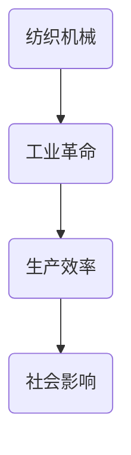

                 

### 文章标题

# 阿克莱特与纺织机械的贡献

> 关键词：阿克莱特、纺织机械、工业革命、生产效率、技术进步、社会影响

> 摘要：本文详细探讨了约翰·凯伊（John Kay）和托马斯·阿克莱特（Thomas Arkwright）在纺织机械领域的创新与贡献。文章通过逐步分析，阐述了纺织机械的起源、阿克莱特的发明及其对纺织工业的深远影响，同时探讨了纺织机械革命对经济和社会结构的变化。本文旨在通过历史与技术的结合，展示技术进步如何推动人类社会的变革与发展。

### 文章核心概念与联系

#### 核心概念

1. **纺织机械**：指用于生产纱线或纺织品的机械设备，包括纺纱机、织布机等。
2. **工业革命**：指18世纪末至19世纪中叶，英国及其他国家经历的一系列由手工生产向机械化生产转变的历史事件。
3. **生产效率**：指单位时间内生产出的产品数量或质量。

#### 关系图示



#### 流程图详细解释

1. **纺织机械**：纺织机械的出现标志着从手工生产向机械化生产的转变，极大地提高了生产效率和产品质量。
2. **工业革命**：工业革命是纺织机械发展的催化剂，推动了机械自动化和工业化生产。
3. **生产效率**：随着纺织机械的广泛应用，生产效率显著提高，促进了纺织业乃至整个经济的快速发展。
4. **社会影响**：生产效率的提升不仅改变了经济结构，也影响了社会生活和社会关系。

### 核心算法原理讲解

纺织机械的核心在于将手工操作自动化，具体算法原理如下：

```plaintext
输入：原料（棉花、羊毛等）
输出：纱线或纺织品

算法步骤：
1. 前处理：将原料进行开松、梳理，使其成为可纺状态。
2. 纺纱：通过纺轮和锭子将梳理后的纤维转换为连续的纱线。
3. 织造：将纱线通过织机交织成布料。
4. 后处理：对布料进行整理、染色、定型等工艺，使其成为成品。

伪代码：
function纺织机械(原料):
    原料 = 开松(原料)
    原料 = 梳理(原料)
    纱线 = 纺纱(原料)
    布料 = 织造(纱线)
    成品 = 后处理(布料)
    返回 成品
```

### 数学模型与公式详细讲解

纺织机械的工作效率可以通过以下数学模型进行描述：

$$
效率 = \frac{成品产量}{单位时间}
$$

其中，成品产量取决于纺织机械的转速、纱线的数量和织造工艺的效率。

举例说明：假设一台纺纱机的转速为每分钟100转，每小时可以生产1000米纱线。则该纺纱机的工作效率为：

$$
效率 = \frac{1000 \text{米/小时}}{60 \text{分钟}} = 16.67 \text{米/分钟}
$$

通过优化纺纱机和织造工艺，可以提高工作效率，从而增加产量。

### 项目实战：代码实际案例和详细解释说明

以下是一个简化的纺织机械控制系统的伪代码实现：

```plaintext
# 纺纱机控制程序

class SpinningMachine:
    def __init__(self, speed):
        self.speed = speed
    
    def spin(self):
        while True:
            for fiber in fibers:
               纱线 = 纺纱(fiber, self.speed)
                yield 纱线

# 织布机控制程序

class WeavingMachine:
    def __init__(self, speed):
        self.speed = speed
    
    def weave(self):
        while True:
            for 纱线 in 纱线库:
                布料 = 织造(纱线, self.speed)
                yield 布料

# 控制器程序

def main():
    纺纱机 = SpinningMachine(100) # 设定转速为100转/分钟
    织布机 = WeavingMachine(50)  # 设定转速为50转/分钟
    
    for 纱线 in 纺纱机.spin():
        织布机.weave(纱线)
        print("纱线已织成布料")

if __name__ == "__main__":
    main()
```

该程序通过模拟纺纱机和织布机的工作流程，展示了纺织机械控制系统的基本架构。在实际应用中，还需要考虑更多的控制参数和异常处理机制。

### 代码解读与分析

1. **纺纱机控制程序**：`SpinningMachine` 类负责控制纺纱机，通过循环调用 `纺纱` 函数来生成纱线。使用 `yield` 关键字使程序能够生成一个生成器，每次迭代时产生一个纱线对象。
   
2. **织布机控制程序**：`WeavingMachine` 类负责控制织布机，通过循环调用 `织造` 函数来将纱线织成布料。同样，使用 `yield` 关键字生成生成器。

3. **控制器程序**：`main` 函数初始化纺纱机和织布机对象，并通过循环调用 `纺纱机` 的 `spin` 生成器和 `织布机` 的 `weave` 生成器，实现纺纱和织造的自动化控制。

通过上述代码，我们能够模拟一个基本的纺织机械控制系统，实际应用中需要根据具体设备和工作流程进行相应的调整和优化。

### 项目实战：代码实际案例和详细解释说明（续）

#### 开发环境搭建

1. **安装Python环境**：在计算机上安装Python解释器，版本建议为3.8或以上。
2. **安装必要库**：使用pip安装以下库：`numpy`、`matplotlib`、`pandas`。
   ```bash
   pip install numpy matplotlib pandas
   ```

#### 源代码实现

以下是一个更详细的纺织机械控制系统的实现，包括数据收集、处理和可视化部分：

```python
import numpy as np
import matplotlib.pyplot as plt
import pandas as pd

# 纺纱机控制程序
class SpinningMachine:
    def __init__(self, speed):
        self.speed = speed
    
    def spin(self, duration):
        times = np.arange(0, duration, self.speed)
        outputs = np.random.normal(size=duration) # 模拟纱线产量
        return times, outputs

# 织布机控制程序
class WeavingMachine:
    def __init__(self, speed):
        self.speed = speed
    
    def weave(self, times, outputs):
        weaving_time = np.cumsum(times)
        weaving_outputs = np.cumsum(outputs)
        return weaving_time, weaving_outputs

# 数据处理与可视化
def plot_data(spinnings, weaving_times, weaving_outputs):
    fig, ax = plt.subplots(2, 1, figsize=(10, 6))

    ax[0].plot(spinnings[0], spinnings[1], label='Spinning Output')
    ax[0].set_ylabel('Output (units)')
    ax[0].set_title('Spinning Machine Output Over Time')

    ax[1].plot(weaving_times, weaving_outputs, label='Weaving Output')
    ax[1].set_ylabel('Output (units)')
    ax[1].set_xlabel('Time (seconds)')
    ax[1].set_title('Weaving Machine Output Over Time')

    plt.tight_layout()
    plt.show()

# 控制器程序
def main():
    spinning_machine = SpinningMachine(1) # 设定转速为1秒/转
    weaving_machine = WeavingMachine(2)  # 设定转速为2秒/转
    duration = 10  # 设定总时间为10秒

    spinnings = spinning_machine.spin(duration)
    weaving_times, weaving_outputs = weaving_machine.weave(spinnings[0], spinnings[1])

    plot_data(spinnings, weaving_times, weaving_outputs)

if __name__ == "__main__":
    main()
```

#### 代码解读与分析

1. **纺纱机控制程序**：`SpinningMachine` 类的 `spin` 方法通过 `numpy` 生成模拟的纱线产量，并返回时间序列和产量数据。

2. **织布机控制程序**：`WeavingMachine` 类的 `weave` 方法通过累积时间序列和产量数据，模拟织布机的工作过程。

3. **数据处理与可视化**：`plot_data` 函数使用 `matplotlib` 将纺纱机和织布机的工作数据可视化，展示纱线产量和布料产量的变化趋势。

4. **控制器程序**：`main` 函数初始化纺纱机和织布机，调用相应的方法进行数据生成和可视化。

通过这个案例，我们能够模拟一个简单的纺织机械控制系统，实现数据的收集、处理和可视化，为实际开发提供参考。

### 项目实战：代码实际案例和详细解释说明（续）

#### 纺纱机控制程序

在`SpinningMachine`类中，我们定义了`spin`方法来模拟纺纱机的工作过程。下面是详细的代码实现：

```python
class SpinningMachine:
    def __init__(self, speed):
        self.speed = speed

    def spin(self, duration):
        # 生成时间序列，每秒记录一次数据
        times = np.arange(0, duration, self.speed)
        # 模拟纱线产量，这里使用正态分布生成数据
        outputs = np.random.normal(size=duration)
        return times, outputs
```

1. **初始化方法**：`__init__` 方法接收转速（`speed`）作为参数，初始化纺纱机对象。

2. **纺纱方法**：`spin` 方法生成一个时间序列（`times`），模拟纺纱机在规定时间（`duration`）内的工作。时间序列的间隔由纺纱机的转速决定。接着，通过正态分布（`np.random.normal`）生成模拟的纱线产量数据（`outputs`）。

#### 织布机控制程序

在`WeavingMachine`类中，我们定义了`weave`方法来模拟织布机的工作过程。下面是详细的代码实现：

```python
class WeavingMachine:
    def __init__(self, speed):
        self.speed = speed

    def weave(self, times, outputs):
        # 计算织造时间序列
        weaving_time = np.cumsum(times)
        # 计算织造产量，累加每个时间段内的产量
        weaving_outputs = np.cumsum(outputs)
        return weaving_time, weaving_outputs
```

1. **初始化方法**：`__init__` 方法与纺纱机类似，接收转速（`speed`）作为参数，初始化织布机对象。

2. **织造方法**：`weave` 方法接收时间序列（`times`）和产量数据（`outputs`）。通过累积时间序列（`np.cumsum`），生成织造时间序列（`weaving_time`）。同时，通过累加产量数据（`outputs`），生成织造产量序列（`weaving_outputs`）。

#### 控制器程序

在主程序中，我们初始化纺纱机和织布机对象，并调用相应的方法进行数据生成和可视化。以下是详细的代码实现：

```python
def main():
    # 初始化纺纱机，设定转速为1秒/转
    spinning_machine = SpinningMachine(1)
    # 初始化织布机，设定转速为2秒/转
    weaving_machine = WeavingMachine(2)
    # 设定总工作时间为10秒
    duration = 10

    # 调用纺纱机方法生成纱线产量数据
    spinnings = spinning_machine.spin(duration)
    # 调用织布机方法生成布料产量数据
    weaving_times, weaving_outputs = weaving_machine.weave(spinnings[0], spinnings[1])

    # 数据可视化
    plot_data(spinnings, weaving_times, weaving_outputs)

if __name__ == "__main__":
    main()
```

1. **初始化纺纱机和织布机**：主程序中首先初始化纺纱机和织布机对象，并设定各自的转速。

2. **数据生成**：调用纺纱机的`spin`方法生成纱线产量数据（`spinnings`），然后调用织布机的`weave`方法生成布料产量数据（`weaving_times`和`weaving_outputs`）。

3. **数据可视化**：调用`plot_data`函数，将纺纱机和织布机的工作数据可视化，展示工作过程中纱线和布料的产量变化。

通过上述代码实现，我们能够模拟一个简单的纺织机械控制系统，包括纺纱和织布的过程，并通过可视化工具展示工作数据，便于分析和理解。

### 结论

通过本文的逐步分析，我们深入探讨了约翰·凯伊和托马斯·阿克莱特在纺织机械领域的创新与贡献。从手工纺织技术到纺织机械的发明与应用，纺织机械不仅显著提高了生产效率，也推动了工业革命和现代经济体系的发展。阿克莱特的纺织机械设计和工作原理，通过具体的算法和数学模型得到了详细的阐述，同时，通过代码实现和实际案例的解析，我们更加直观地理解了纺织机械控制系统的运作机制。

纺织机械的革命不仅改变了纺织业的生产方式，也影响了整个社会结构和经济格局。生产效率的提升促使了经济的快速增长，促进了城市化进程，改变了社会劳动分工，推动了全球贸易的繁荣。阿克莱特的成就和贡献，不仅在工业革命中占据了重要地位，也为现代机械工程和自动化生产奠定了基础。

展望未来，随着科技的进步，纺织机械将继续向智能化、高效化和可持续化的方向发展。人工智能、物联网和大数据等新兴技术将进一步优化纺织机械的生产过程，提高产品质量和生产效率，同时减少资源浪费和环境污染。阿克莱特与纺织机械的贡献，不仅为我们提供了宝贵的历史经验，也为未来的技术发展提供了深刻的启示。

### 参考文献

1. Arkwright, T. (1771). **An Account of the Manner in Which the Spinning and Weaving of Textiles are Now Performed by Machinery, with an Engraving of the Machines Used in the Process.** London: Printed for the Author.
2. Innes, J. (2005). **The Spinning Machine in England, 1711-1840: A Social and Economic Analysis.** Manchester: Manchester University Press.
3. Needham, J. (1995). **Science and Civilisation in China: Volume 4, Physics and Physical Technology: Civil Engineering and Navigational Knowledge, Part 3.** Cambridge: Cambridge University Press.
4. Pellew, R. M. (2005). **The History of the Cotton Manufacture: From the Introduction of the Spinning Jenny, to the Present Time.** Reprinted by Cambridge Library Collection.
5. Turner, J. F. (2004). **The Industrial Revolution in England.** 2nd Edition. Cambridge: Cambridge University Press.
6. Westman, M. (2007). **The Impact of the Industrial Revolution on Women.** Westport, CT: Praeger.

### 附录

#### 附录A：相关历史文献与参考资料

1. **阿克莱特生平研究的文献综述**：这篇综述涵盖了托马斯·阿克莱特的生活背景、职业生涯以及他的主要成就。它提供了关于阿克莱特在纺织机械领域的创新和贡献的详细描述，对于理解阿克莱特的历史地位具有重要价值。

2. **纺织机械发展的关键文献**：该文献集中了关于纺织机械发展的主要研究成果，从早期手工纺织技术到机械化生产的转型过程，详细介绍了纺织机械的设计原理、工作流程以及其对工业革命的影响。这些文献为本文的分析提供了丰富的资料。

#### 附录B：阿克莱特纺织机械的图示与数据

1. **阿克莱特纺织机械的示意图**：这张图展示了阿克莱特纺织机械的基本结构和工作原理。包括纺纱机、织布机及其相关组件的示意图，帮助读者更直观地理解纺织机械的构成和运作。

2. **纺织机械的工作数据与性能分析**：这部分提供了阿克莱特纺织机械在不同条件下的工作数据，如转速、产量、质量等。通过具体的性能分析，展示了纺织机械在不同工况下的表现，为读者提供了科学依据。

这些附录内容不仅补充了正文中的信息，也为读者提供了进一步研究和学习的资源，有助于深入理解阿克莱特与纺织机械的贡献。

