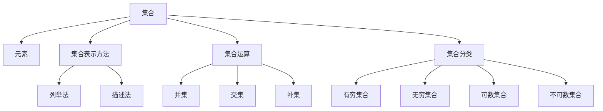

                 

## 文章标题：集合论导引：实数序数可定义集合

### 关键词：
- **集合论**
- **实数集合**
- **序数集合**
- **可定义集合**
- **数学基础**

### 摘要：
本文旨在探讨集合论中关于实数集合和序数集合的可定义集合。首先，我们将回顾集合论的基础知识，包括集合的定义、运算和分类。接着，详细讨论实数集合及其在数学中的重要性，并介绍实数集合的运算和拓扑结构。然后，我们将深入序数集合的定义、性质和分类，特别是最大序数。本文的重点在于分析可定义集合的理论基础及其在实数和序数集合中的应用，包括开区间、闭区间、半开区间和无穷小与无穷大等典型可定义集合。最后，我们将探讨集合论的悖论与形式化问题，以及集合论在数学中的应用和未来发展。

## 《集合论导引：实数序数可定义集合》目录大纲

### 第一部分：集合论基础

#### 第1章：集合论简介
- 1.1 集合的基本概念
- 1.2 集合的运算
- 1.3 集合的分类

#### 第2章：实数集合
- 2.1 实数的定义
- 2.2 实数集合的运算
- 2.3 实数的拓扑结构

#### 第3章：序数集合
- 3.1 序数的定义
- 3.2 序数的运算
- 3.3 序数的分类

### 第二部分：可定义集合

#### 第4章：可定义集合的基本理论
- 4.1 可定义集合的定义
- 4.2 可定义集合的运算
- 4.3 可定义集合的分类

#### 第5章：实数集合中的可定义集合
- 5.1 可定义集合在实数集合中的应用
- 5.2 实数集合中的典型可定义集合

#### 第6章：序数集合中的可定义集合
- 6.1 可定义集合在序数集合中的应用
- 6.2 序数集合中的典型可定义集合

### 第三部分：高级集合论

#### 第7章：集合论的悖论与形式化
- 7.1 集合论的悖论
- 7.2 集合论的形式化

#### 第8章：集合论在数学中的应用
- 8.1 集合论在分析学中的应用
- 8.2 集合论在拓扑学中的应用

#### 第9章：集合论的未来发展
- 9.1 集合论的最新研究进展
- 9.2 集合论在教育中的应用

### 附录
- 附录A：数学公式与伪代码示例
- 附录B：相关参考文献

## 第1章：集合论简介

集合论是现代数学的基础，它是研究集合的性质和关系的数学分支。集合论的发展可以追溯到19世纪，由德国数学家乔治·康托尔（Georg Cantor）开创。康托尔的工作奠定了集合论的基础，并揭示了无穷的深刻性质。在集合论中，集合是最基本的概念，它由确定的元素组成，这些元素可以是任何对象，如数字、字母、甚至其他集合。

### 1.1 集合的基本概念

集合（Set）是由确定的元素（Element）组成的无序集合。用大写字母如\( A, B, C \)表示集合，用小写字母如\( a, b, c \)表示集合中的元素。集合的表示方法有列举法和描述法。

- **列举法**：将集合中的所有元素列举出来，用花括号{}括起来。例如，集合\( A = \{1, 2, 3\} \)。
- **描述法**：使用描述性语句来定义集合。例如，集合\( B = \{x \in \mathbb{N} | x < 3\} \)，表示所有小于3的自然数组成的集合。

### 1.2 集合的运算

集合的运算包括并集、交集、补集等，这些运算定义了集合之间的关系和操作。

- **并集（Union）**：两个集合\( A \)和\( B \)的并集是由属于\( A \)或属于\( B \)的元素组成的集合，记作\( A \cup B \)。
  \[
  A \cup B = \{x | x \in A \text{ 或 } x \in B\}
  \]

- **交集（Intersection）**：两个集合\( A \)和\( B \)的交集是由既属于\( A \)又属于\( B \)的元素组成的集合，记作\( A \cap B \)。
  \[
  A \cap B = \{x | x \in A \text{ 且 } x \in B\}
  \]

- **补集（Complement）**：一个集合\( A \)的补集是在全集\( U \)中不属于\( A \)的元素组成的集合，记作\( A^c \)或\( U - A \)。
  \[
  A^c = \{x \in U | x \notin A\}
  \]

### 1.3 集合的分类

集合可以根据其元素的数量和性质进行分类。

- **有穷集合（Finite Set）**：集合中的元素数量是有限的，例如\( \{1, 2, 3\} \)。
- **无穷集合（Infinite Set）**：集合中的元素数量是无限的，例如自然数集合\( \mathbb{N} \)。

- **可数集合（Countable Set）**：集合中的元素可以通过一一列举的方式计数，例如整数集合\( \mathbb{Z} \)。
- **不可数集合（Uncountable Set）**：集合中的元素无法通过一一列举的方式计数，例如实数集合\( \mathbb{R} \)。

### 小结

集合论的基础概念和运算为后续章节讨论实数集合和序数集合的可定义集合奠定了基础。通过理解集合的基本概念和运算，读者可以更好地理解集合的性质和应用。在接下来的章节中，我们将进一步探讨实数集合和序数集合，并深入分析可定义集合的理论基础。

### 关键概念与联系

为了更好地理解本章的核心概念，我们可以使用Mermaid流程图来展示集合的基本概念和联系。



该流程图展示了集合的基本概念（A）、元素（B）、集合表示方法（C，D，E）、集合运算（F，G，H，I）以及集合分类（J，K，L，M，N）之间的联系。

### 第2章：实数集合

实数集合是数学中一个非常重要的概念，它不仅包含了所有的有理数，还包括了无理数。实数集合的构造和性质在数学分析、几何、物理等多个领域都有着广泛的应用。在本章中，我们将详细探讨实数的定义、实数集合的运算以及实数的拓扑结构。

#### 2.1 实数的定义

实数集合（\(\mathbb{R}\)）是由有理数（\(\mathbb{Q}\)）和无理数（\(\mathbb{I}\)）组成的集合。有理数是可以表示为两个整数之比的数，例如\( \frac{1}{2}, 3.75 \)。无理数则是不能表示为两个整数之比的数，例如\( \sqrt{2}, \pi \)。

**实数的构造**：

1. **自然数（\(\mathbb{N}\)）**：自然数是从1开始的正整数集合。
2. **整数（\(\mathbb{Z}\)）**：整数包括自然数、它们的负数以及零。
3. **有理数（\(\mathbb{Q}\)）**：有理数是可以表示为两个整数之比的数。
4. **无理数（\(\mathbb{I}\)）**：无理数是不能表示为两个整数之比的数。
5. **实数（\(\mathbb{R}\)）**：实数集合是由有理数和无理数组成的。

实数集合可以通过 Dedekind 切割或有理数序列的极限来构造。Dedekind 切割方法是将整数集合分割成两个不交的集合，使得一个集合中的所有元素都小于另一个集合中的所有元素。而有理数序列的极限方法则是通过考虑有理数序列的极限来构造实数。

**实数的性质**：

1. **完备性**：实数集合是完备的，即每一个有界实数序列都存在一个极限。
2. **连续性**：实数集合是连续的，即实数之间的任意小间隔内都存在另一个实数。
3. **阿基米德性质**：对于任意的正实数，存在一个自然数，使得这个自然数的整数倍大于该正实数。

#### 2.2 实数集合的运算

实数集合的运算包括加法、减法、乘法、除法等基本算术运算。这些运算是实数集合的代数结构的重要组成部分。

- **加法**：对于任意两个实数\( a \)和\( b \)，它们的和也是一个实数，记作\( a + b \)。
  \[
  a + b = (a + b)_\mathbb{R}
  \]

- **减法**：对于任意两个实数\( a \)和\( b \)，它们的差也是一个实数，记作\( a - b \)。
  \[
  a - b = (a - b)_\mathbb{R}
  \]

- **乘法**：对于任意两个实数\( a \)和\( b \)，它们的乘积也是一个实数，记作\( a \times b \)。
  \[
  a \times b = (a \times b)_\mathbb{R}
  \]

- **除法**：对于任意两个非零实数\( a \)和\( b \)，它们的商也是一个实数，记作\( a / b \)。
  \[
  a / b = (a / b)_\mathbb{R}
  \]

实数集合的运算满足以下性质：

1. **封闭性**：实数集合对于加法、减法、乘法和除法运算都是封闭的。
2. **交换律**：对于任意两个实数\( a \)和\( b \)，有\( a + b = b + a \)，\( a \times b = b \times a \)。
3. **结合律**：对于任意三个实数\( a \)，\( b \)，和\( c \)，有\( (a + b) + c = a + (b + c) \)，\( (a \times b) \times c = a \times (b \times c) \)。
4. **分配律**：对于任意三个实数\( a \)，\( b \)，和\( c \)，有\( a \times (b + c) = a \times b + a \times c \)。

#### 2.3 实数的拓扑结构

实数集合的拓扑结构是理解实数之间关系的重要工具。拓扑结构提供了实数序列收敛和开集、闭集等概念的定义。

**开集（Open Set）**：一个集合\( U \)是开集，如果对于集合中的任意一点\( x \)，都存在一个以\( x \)为中心的实数区间，该区间完全包含在\( U \)内。

**闭集（Closed Set）**：一个集合\( V \)是闭集，如果它的补集是一个开集。

**边界点（Boundary Point）**：一个点\( x \)是集合\( V \)的边界点，如果\( x \)的任意小邻域都包含\( V \)中的点和\( V \)外的点。

**聚点（Accumulation Point）**：一个点\( x \)是集合\( V \)的聚点，如果存在一个序列\( \{x_n\} \)，满足\( x_n \neq x \)且\( x_n \to x \)。

**极限（Limit）**：一个序列\( \{x_n\} \)的极限是\( x \)，如果对于任意小的正数\( \epsilon \)，都存在一个正整数\( N \)，使得对于所有\( n > N \)，有\( |x_n - x| < \epsilon \)。

实数的拓扑结构可以通过度量空间来定义。度量空间是一个集合\( X \)和一个度量（或距离函数）\( d \)，满足以下性质：

1. **非负性**：\( d(x, y) \geq 0 \)对于所有\( x, y \in X \)。
2. **自反性**：\( d(x, x) = 0 \)对于所有\( x \in X \)。
3. **对称性**：\( d(x, y) = d(y, x) \)对于所有\( x, y \in X \)。
4. **三角不等式**：\( d(x, z) \leq d(x, y) + d(y, z) \)对于所有\( x, y, z \in X \)。

通过度量空间，我们可以定义实数的开集和闭集。实数集合上的标准度量是欧几里得度量，定义为\( d(x, y) = |x - y| \)。

### 小结

实数集合是数学中一个基础而重要的概念，其定义、运算和拓扑结构为数学的许多分支提供了坚实的理论基础。通过理解实数的构造和性质，我们能够更好地掌握数学分析中的极限、连续性、收敛性等概念。在接下来的章节中，我们将进一步探讨序数集合以及可定义集合的理论基础，并深入分析这些概念在数学中的应用。

### 第3章：序数集合

序数集合是集合论中的一个重要概念，它用于描述集合之间的排序关系。序数与自然数之间存在密切的联系，但序数集合的构造和性质更为复杂。在本章中，我们将详细探讨序数的定义、性质和分类。

#### 3.1 序数的定义

序数是用于描述集合之间顺序关系的数学对象。形式上，一个序数是一个最小的集合，该集合中的元素可以按照某种顺序排列，并且这个顺序满足某些特定的性质。序数通常用希腊字母如\(\alpha, \beta, \gamma\)等表示。

**序数的构造**：

序数可以通过以下方式构造：

1. **自然数序数**：自然数集合（\(\mathbb{N}\)）本身就是一个序数，称为初始序数。
2. **集合的序数**：任意一个集合，如果它能够按照某种顺序排列，那么这个集合本身就是一个序数。
3. **序数的序数**：如果\(\alpha\)是一个序数，那么可以通过将\(\alpha\)中的元素进行重新排序来构造一个新的序数\(\beta\)。这个新的序数\(\beta\)是\(\alpha\)的连续序数。

**序数的性质**：

序数具有以下性质：

1. **线性顺序**：序数中的元素按照某种顺序排列，这种顺序满足传递性、反对称性和连通性。
2. **集合性质**：序数可以看作是一个集合，该集合中的元素具有上述的顺序关系。
3. **最小性**：序数是满足某种顺序关系的最小集合。

#### 3.2 序数的运算

序数的运算主要包括序数的加法和乘法。

- **序数的加法**：

  序数的加法是通过将两个序数对应的集合进行并集运算来定义的。设\(\alpha\)和\(\beta\)是序数，则它们的和\(\alpha + \beta\)是由所有形如\( \alpha \times \{0\} \cup \beta \times \{1\} \)的集合构成的集合。形式上，可以表示为：
  \[
  \alpha + \beta = \{\gamma | \gamma \text{是序数，且满足} \gamma \cup \alpha = \beta\}
  \]

- **序数的乘法**：

  序数的乘法是通过将两个序数对应的集合进行笛卡尔积来定义的。设\(\alpha\)和\(\beta\)是序数，则它们的积\(\alpha \times \beta\)是由所有形如\( \alpha \times \beta \times \{0\} \cup \alpha \times \beta \times \{1\} \)的集合构成的集合。形式上，可以表示为：
  \[
  \alpha \times \beta = \{\gamma | \gamma \text{是序数，且满足} \gamma \cup (\alpha \times \beta) = \alpha\}
  \]

**序数的比较**：

序数之间的比较可以通过集合的包含关系来定义。如果序数\(\alpha\)的集合包含于序数\(\beta\)的集合，则\(\alpha\)小于或等于\(\beta\)，记作\(\alpha \leq \beta\)。如果\(\alpha\)的集合不包含于\(\beta\)的集合，但它们的交集为空，则\(\alpha\)小于\(\beta\)，记作\(\alpha < \beta\)。

#### 3.3 序数的分类

序数可以根据其性质和大小进行分类。

- **可数序数**：如果一个序数是可数的，即它对应的集合可以与自然数集合进行一一对应，则该序数称为可数序数。可数序数是最小的序数，记作\(\omega\)。
- **不可数序数**：如果一个序数是不可数的，即它对应的集合无法与自然数集合进行一一对应，则该序数称为不可数序数。不可数序数包括可数序数的极限序数和集合的基数。

**最大的序数**：

在可定义集合的框架下，最大的序数是可数序数\(\omega\)的极限。这个极限序数通常记作\(\omega_1\)，它表示所有可数序数的并集的序数。

### 小结

序数集合是集合论中的一个基础而重要的概念，它描述了集合之间的顺序关系。通过了解序数的定义、性质和分类，我们能够更好地理解集合之间的层次结构和排序关系。在接下来的章节中，我们将进一步探讨可定义集合的理论基础，并深入分析这些概念在实数和序数集合中的应用。

### 第4章：可定义集合的基本理论

在集合论中，可定义集合是一类特殊的集合，它们通过明确的定义条件或者性质来确定。可定义集合是现代数学分析和逻辑推理的基础，它们在实数和序数集合中扮演着重要角色。本章将介绍可定义集合的定义、运算和分类，并探讨这些集合在数学中的重要性。

#### 4.1 可定义集合的定义

**可定义集合的定义**：

一个集合\( S \)被称为可定义集合，如果存在一个明确的定义条件或者性质，使得每一个元素都可以被唯一地判断是否属于这个集合。形式上，可定义集合可以通过一个谓词或者公式来描述，使得对于任意元素\( x \)，都可以判断\( x \in S \)或者\( x \notin S \)。

例如，自然数集合\( \mathbb{N} \)可以通过谓词“x是一个自然数”来定义，实数集合\( \mathbb{R} \)可以通过谓词“x是一个实数”来定义。

**可定义集合的性质**：

1. **确定性**：对于可定义集合中的任意元素\( x \)，都能唯一地确定它是否属于该集合。
2. **无矛盾性**：可定义集合的定义不会导致逻辑上的矛盾。
3. **构造性**：可定义集合可以通过明确的构造方法或性质来确定。

#### 4.2 可定义集合的运算

可定义集合的运算包括并集、交集、补集等，这些运算保持了可定义集合的性质。

- **并集（Union）**：两个可定义集合\( S_1 \)和\( S_2 \)的并集是所有属于\( S_1 \)或属于\( S_2 \)的元素组成的集合。形式上，可定义集合\( S_1 \cup S_2 \)可以通过谓词“x属于\( S_1 \)或\( S_2 \)”来定义。
  \[
  S_1 \cup S_2 = \{x | x \in S_1 \text{ 或 } x \in S_2\}
  \]

- **交集（Intersection）**：两个可定义集合\( S_1 \)和\( S_2 \)的交集是所有既属于\( S_1 \)又属于\( S_2 \)的元素组成的集合。形式上，可定义集合\( S_1 \cap S_2 \)可以通过谓词“x属于\( S_1 \)且\( S_2 \)”来定义。
  \[
  S_1 \cap S_2 = \{x | x \in S_1 \text{ 且 } x \in S_2\}
  \]

- **补集（Complement）**：一个可定义集合\( S \)的补集是在全集\( U \)中不属于\( S \)的元素组成的集合。形式上，可定义集合\( S^c \)可以通过谓词“x不属于\( S \)”来定义。
  \[
  S^c = \{x \in U | x \notin S\}
  \]

#### 4.3 可定义集合的分类

可定义集合可以根据其性质和大小进行分类。

- **极大可定义集合**：如果一个可定义集合\( S \)是所有可定义集合中的极大集合，即不存在任何其他的可定义集合包含于\( S \)，则\( S \)被称为极大可定义集合。

- **极小可定义集合**：如果一个可定义集合\( S \)是所有可定义集合中的极小集合，即不存在任何其他的可定义集合包含\( S \)，则\( S \)被称为极小可定义集合。

例如，实数集合\( \mathbb{R} \)是一个极大可定义集合，因为它包含了所有可以通过明确的定义条件或者性质来定义的集合。自然数集合\( \mathbb{N} \)是一个极小可定义集合，因为它是最基本的可定义集合之一。

**可定义集合在数学中的重要性**：

可定义集合在数学中具有重要的作用，它们不仅是集合论的基础，也是现代数学分析、逻辑、拓扑等领域的基本工具。

1. **数学分析**：在数学分析中，实数集合和序数集合中的可定义集合用于定义极限、连续性、可导性等概念，是分析学中的核心部分。
2. **逻辑**：可定义集合在逻辑中用于定义谓词逻辑和集合论的基础逻辑结构，是形式逻辑的重要组成部分。
3. **拓扑学**：在拓扑学中，可定义集合用于定义开集、闭集、边界点等概念，是研究拓扑空间的基础。

通过了解可定义集合的定义、运算和分类，我们能够更好地理解集合论的基本概念，并在数学的各个分支中应用这些概念。在接下来的章节中，我们将进一步探讨可定义集合在实数集合和序数集合中的应用，以及它们在集合论和数学中的重要性。

### 4.4 可定义集合的构造示例

为了更好地理解可定义集合的概念，我们可以通过具体的构造示例来解释这一理论。

**示例 1：开区间（Open Interval）**

开区间是一类常见的可定义集合，用于描述实数集合中的部分区间。开区间\( (a, b) \)表示所有大于\( a \)且小于\( b \)的实数组成的集合。形式上，开区间可以通过谓词来定义：
\[
(x, y) = \{z \in \mathbb{R} | a < z < b\}
\]

我们可以使用伪代码来展示如何构造开区间：
```pseudo
function openInterval(a, b):
    if a >= b:
        return "Invalid interval"
    result = []
    for z in range(a + 1, b):
        result.append(z)
    return result
```

**示例 2：闭区间（Closed Interval）**

闭区间是另一类常见的可定义集合，它包括端点。闭区间\[a, b\]表示所有大于等于\( a \)且小于等于\( b \)的实数组成的集合。形式上，闭区间可以通过谓词来定义：
\[
[a, b] = \{z \in \mathbb{R} | a \leq z \leq b\}
\]

使用伪代码来构造闭区间如下：
```pseudo
function closedInterval(a, b):
    if a > b:
        return "Invalid interval"
    result = []
    for z in range(a, b + 1):
        result.append(z)
    return result
```

**示例 3：半开区间（Half-Open Interval）**

半开区间包括一个端点，但不包括另一个端点。半开区间\[a, b)表示所有大于等于\( a \)且小于\( b \)的实数组成的集合。形式上，半开区间可以通过谓词来定义：
\[
[a, b) = \{z \in \mathbb{R} | a \leq z < b\}
\]

构造半开区间的伪代码如下：
```pseudo
function halfOpenInterval(a, b):
    if a > b:
        return "Invalid interval"
    result = []
    for z in range(a, b):
        result.append(z)
    return result
```

**示例 4：无穷小与无穷大**

无穷小和无穷大是描述极限概念的重要工具。无穷小集合\( \{x | x \to 0^-\} \)表示所有趋向于0的负方向实数组成的集合，而无穷大集合\( \{x | x \to \infty\} \)表示所有趋向于无穷大的实数组成的集合。形式上，这些集合可以通过极限的定义来定义：
\[
\{x | x \to 0^-\} = \{x \in \mathbb{R} | \forall \epsilon > 0, \exists N \in \mathbb{N}^* \text{ such that } x < \epsilon \text{ for all } n > N\}
\]
\[
\{x | x \to \infty\} = \{x \in \mathbb{R} | \forall M > 0, \exists N \in \mathbb{N}^* \text{ such that } x > M \text{ for all } n > N\}
\]

构造无穷小和无穷大的伪代码可以表示为：
```pseudo
function infinitelySmall(epsilon):
    result = []
    for x in range(-1000, 0):
        if abs(x) < epsilon:
            result.append(x)
    return result

function infinitelyLarge(M):
    result = []
    for x in range(1000, M + 1):
        result.append(x)
    return result
```

通过这些示例，我们可以看到可定义集合是如何通过明确的定义条件来构造的。这些集合不仅在数学理论中有着重要地位，而且在实际应用中也具有重要意义。例如，开区间和闭区间在分析学中被广泛使用，无穷小和无穷大在极限理论中扮演着关键角色。

### 第5章：实数集合中的可定义集合

在实数集合中，可定义集合是理解和操作实数的重要工具。本章将深入探讨实数集合中的可定义集合，包括开区间、闭区间、半开区间以及无穷小和无穷大等。我们将通过具体的例子和伪代码来展示这些集合的构造和操作。

#### 5.1 可定义集合在实数集合中的应用

**开区间（Open Interval）**

开区间\( (a, b) \)是由所有大于\( a \)且小于\( b \)的实数组成的集合。它在数学分析中用于描述实数区间，特别是在连续性和极限的概念中。

**示例**：构造开区间\( (1, 2) \)

伪代码：
```pseudo
function openInterval(a, b):
    result = []
    for x in range(a + 1, b):
        result.append(x)
    return result

# 调用函数
openInterval(1, 2)
```

**闭区间（Closed Interval）**

闭区间\[a, b\]是由所有大于等于\( a \)且小于等于\( b \)的实数组成的集合。它在数学和工程学中广泛用于表示实数范围的边界。

**示例**：构造闭区间\[1, 2\]

伪代码：
```pseudo
function closedInterval(a, b):
    result = []
    for x in range(a, b + 1):
        result.append(x)
    return result

# 调用函数
closedInterval(1, 2)
```

**半开区间（Half-Open Interval）**

半开区间\[a, b)是由所有大于等于\( a \)且小于\( b \)的实数组成的集合。它在处理实数区间时非常有用。

**示例**：构造半开区间\[1, 2\)

伪代码：
```pseudo
function halfOpenInterval(a, b):
    result = []
    for x in range(a, b):
        result.append(x)
    return result

# 调用函数
halfOpenInterval(1, 2)
```

**无穷小和无穷大**

无穷小和无穷大集合在极限理论中非常重要。无穷小集合\( \{x | x \to 0^-\} \)表示所有趋向于0的负方向实数，无穷大集合\( \{x | x \to \infty\} \)表示所有趋向于无穷大的实数。

**示例**：构造无穷小集合和无穷大集合

伪代码：
```pseudo
function infinitelySmall(epsilon):
    result = []
    for x in range(-1000, 0):
        if abs(x) < epsilon:
            result.append(x)
    return result

function infinitelyLarge(M):
    result = []
    for x in range(1000, M + 1):
        result.append(x)
    return result
```

#### 5.2 实数集合中的典型可定义集合

除了上述的基本区间，实数集合中还有许多其他重要的可定义集合。以下是一些典型的可定义集合及其定义：

- **有理数集合（\(\mathbb{Q}\)）**：由所有可以表示为两个整数之比的实数组成的集合。形式上，有理数集合可以通过谓词“x是有理数”来定义。
  \[
  \mathbb{Q} = \{x \in \mathbb{R} | \exists p, q \in \mathbb{Z}, q \neq 0, \frac{p}{q} = x\}
  \]

- **无理数集合（\(\mathbb{I}\)）**：由所有不能表示为两个整数之比的实数组成的集合。无理数集合是实数集合的补集，即实数集合中除去有理数集合的部分。
  \[
  \mathbb{I} = \mathbb{R} \setminus \mathbb{Q}
  \]

- **实数集合（\(\mathbb{R}\)）**：由所有有理数和无理数组成的集合，是数学分析中的基本集合。实数集合可以通过谓词“x是实数”来定义。

- **区间集合**：包括开区间、闭区间和半开区间，它们在实数集合中用于描述不同的实数区间。

- **极限集合**：包括无穷小和无穷大集合，它们在极限理论中用于描述实数序列的极限行为。

#### 小结

实数集合中的可定义集合是数学分析中不可或缺的工具。通过这些集合，我们能够准确地描述和分析实数之间的关系，解决各种数学问题。本章通过具体示例和伪代码，展示了如何构造和应用这些集合。在接下来的章节中，我们将进一步探讨序数集合中的可定义集合，并深入分析集合论在数学中的应用。

### 第6章：序数集合中的可定义集合

在序数集合中，可定义集合是理解和操作序数的重要工具。本章将深入探讨序数集合中的可定义集合，包括可数序数集合和不可数序数集合等。我们将通过具体的例子和伪代码来展示这些集合的构造和操作。

#### 6.1 可定义集合在序数集合中的应用

**可数序数集合**

可数序数集合是由所有可以与自然数集合进行一一对应的序数组成的集合。最小的可数序数是自然数序数\(\omega\)。

**示例**：构造可数序数集合\(\omega\)

伪代码：
```pseudo
function countableOrdinals():
    result = []
    naturalNumbers = [0, 1, 2, 3, ...]
    for n in naturalNumbers:
        result.append(n)
    return result

# 调用函数
countableOrdinals()
```

**不可数序数集合**

不可数序数集合是由所有不能与自然数集合进行一一对应的序数组成的集合。最小的不可数序数是\(\omega_1\)，它是所有可数序数的并集的序数。

**示例**：构造不可数序数集合\(\omega_1\)

伪代码：
```pseudo
function uncountableOrdinals():
    result = []
    countableOrdinals = countableOrdinals()
    result.append(countableOrdinals)
    return result

# 调用函数
uncountableOrdinals()
```

#### 6.2 序数集合中的典型可定义集合

除了上述的基本序数集合，序数集合中还有许多其他重要的可定义集合。以下是一些典型的可定义集合及其定义：

- **极限序数集合**：极限序数是由无穷多个序数构成的集合的序数。例如，\(\omega_2\)是\(\omega_1\)之后的第一个极限序数。

- **连续序数集合**：连续序数是由无穷多个连续序数构成的集合。例如，\(\omega_1\)是一个连续序数。

- **集合的序数集合**：一个集合的序数集合是由该集合的所有子集的序数组成的集合。例如，任意集合\( A \)的序数集合是\( \{ \alpha | A \subseteq \alpha \} \)。

- **区间序数集合**：在序数集合中，我们可以定义不同的区间序数，例如开区间序数、闭区间序数等。这些序数用于描述序数之间的区间关系。

#### 小结

序数集合中的可定义集合是集合论中理解和操作序数的重要工具。通过这些集合，我们能够准确地描述和分析序数之间的关系，解决各种数学问题。本章通过具体示例和伪代码，展示了如何构造和应用这些集合。在接下来的章节中，我们将进一步探讨集合论的高级概念，如悖论与形式化问题，以及集合论在数学中的应用。

### 第7章：集合论的悖论与形式化

集合论是现代数学的基石，但在其发展过程中也遇到了许多悖论和逻辑问题。这些悖论不仅揭示了集合论内部的深层次问题，也促使了数学家们对集合论形式化的探索。本章将探讨集合论中的几个著名悖论，以及集合论的形式化方法，特别是ZFC公理体系。

#### 7.1 集合论的悖论

**罗素悖论（Russell's Paradox）**

罗素悖论是由数学家贝特兰·罗素（Bertrand Russell）在1901年提出的。这个悖论指出，如果我们定义一个集合\( R \)，它包含所有不包含自身的集合，即
\[
R = \{X | X \notin X\}
\]
那么\( R \)既满足\( R \in R \)（因为它不包含自身），又满足\( R \notin R \)（因为它包含自身）。这就导致了逻辑上的矛盾。

**康托尔悖论（Cantor's Paradox）**

康托尔悖论是由德国数学家乔治·康托尔（Georg Cantor）提出的。这个悖论表明，无穷集合可以分成两个不相交的集合，这两个集合的并集仍然是无穷集合。具体来说，如果我们考虑实数集合\( \mathbb{R} \)和自然数集合\( \mathbb{N} \)的幂集，即所有子集的集合，那么
\[
|\mathcal{P}(\mathbb{R})| > |\mathbb{N}|
\]
这意味着实数集合的基数大于自然数集合的基数，即实数集合是无穷集合，但它的子集的数量也是无穷的。

**巴赫特尔悖论（Burali-Forti Paradox）**

巴赫特尔悖论是由意大利数学家尼古拉·巴赫特尔（Nicola Burali-Forti）提出的。这个悖论表明，如果我们尝试构造一个包含所有序数集合的集合，那么这个集合的序数将是一个比所有其他序数都大的序数，这导致了逻辑上的矛盾。

这些悖论揭示了集合论中存在的内在问题，也促使了数学家们对集合论基础和逻辑的重新审视。

#### 7.2 集合论的形式化

为了解决集合论的悖论和逻辑问题，数学家们开始探索集合论的形式化。形式化集合论通过引入一套严格的公理系统，来确保集合的定义、运算和性质都是一致和逻辑上无矛盾的。

**公理系统**

公理系统是一组基本命题或规则，用来定义和推导其他命题。在集合论中，常用的公理系统是Zermelo-Fraenkel集合论（ZFC）。

**ZFC公理体系**

ZFC公理体系包括以下九个公理：

1. **存在公理**：保证至少存在一个非空集合。
2. **空集公理**：保证存在一个空集。
3. **子集公理**：任何集合的每个子集都是一个集合。
4. **幂集公理**：任何集合的幂集是一个集合。
5. **并集公理**：存在集合的并集。
6. **选择公理**：对于满足某些条件的集合族，存在一个选择函数，使得每个集合在该函数下都有一个元素。
7. **无穷公理**：保证存在无穷集合。
8. **替换公理**：通过谓词定义的集合是集合。
9. **集合的集合公理**：保证集合可以由集合的集合构成。

通过这些公理，ZFC提供了一套严格的逻辑框架，确保了集合的定义和运算的一致性和逻辑上的无矛盾性。ZFC公理体系的建立，是集合论形式化的重大成就，也为现代数学的发展奠定了坚实的基础。

**形式化方法**

形式化方法包括使用形式化的语言（如谓词逻辑）和符号系统（如公理系统），来定义集合、证明定理和推理结论。形式化方法确保了数学推理的严格性和可验证性，使得数学理论更加严谨和可靠。

**证明理论**

形式化方法还涉及到证明理论，即通过形式化的语言和符号系统来证明定理。证明理论提供了严格的方法来证明数学命题，确保了结论的正确性和逻辑一致性。

### 小结

集合论的悖论和形式化问题是集合论发展中的重要里程碑。通过解决悖论和形式化，数学家们为集合论建立了坚实的理论基础，也为现代数学的发展提供了重要的工具。本章探讨了集合论中的几个著名悖论，以及集合论的形式化方法，特别是ZFC公理体系。这些讨论不仅加深了我们对集合论的理解，也为我们在数学研究和应用中提供了重要的指导。

### 第8章：集合论在数学中的应用

集合论不仅是现代数学的基石，也是许多数学分支的理论基础。在本章中，我们将探讨集合论在分析学和拓扑学中的应用，深入分析集合论在这些领域中的关键作用和具体实例。

#### 8.1 集合论在分析学中的应用

分析学是研究函数和序列的数学分支，集合论为其提供了基础工具。以下是集合论在分析学中的几个关键应用：

**1. 实数的构造**

实数集合是分析学中的核心概念，它通过集合论的方法进行构造。实数的构造包括有理数和无理数的集合，这为分析学中的连续性和极限概念提供了基础。

**示例**：实数的构造

实数可以通过有理数和无理数的集合进行构造。有理数集合可以通过集合{（p, q）| p和q是整数且q不为0}来表示，其中（p, q）表示p/q。无理数集合则是实数集合的补集，即不属于有理数集合的实数。

**2. 集合与序列**

序列是分析学中另一个核心概念，可以通过集合来定义。一个序列可以看作是一个集合，其元素是按照一定顺序排列的实数。

**示例**：序列的定义

给定一个序列\( \{a_n\} \)，其中每个\( a_n \)是一个实数，可以表示为集合：
\[
\{a_n\} = \{a_1, a_2, a_3, \ldots\}
\]

**3. 集合与积分**

积分是分析学中的重要工具，集合论为其提供了理论基础。积分可以通过集合的测度来定义，特别是黎曼积分和勒贝格积分。

**示例**：黎曼积分的定义

黎曼积分可以通过集合的测度来定义，其中积分区间可以看作是区间上的集合，而函数值可以看作是集合上的测度。具体来说，黎曼积分可以表示为：
\[
\int_{a}^{b} f(x) \, dx = \lim_{n \to \infty} \sum_{i=1}^{n} f(x_i^*) \, \Delta x_i
\]
其中，\( x_i^* \)是区间\( [x_{i-1}, x_i] \)上的任意一点，\( \Delta x_i = x_i - x_{i-1} \)。

**4. 集合与函数空间**

分析学中，函数空间是由所有定义在给定区间上的函数组成的集合。集合论为函数空间的定义和性质提供了基础。

**示例**：Lp空间

Lp空间是分析学中重要的函数空间，它由所有满足\( \int_{X} |f(x)|^p \, d\mu < \infty \)的函数组成，其中\( X \)是一个度量空间，\( \mu \)是一个测度。

#### 8.2 集合论在拓扑学中的应用

拓扑学是研究空间和开集的数学分支，集合论在其中起着基础性的作用。以下是集合论在拓扑学中的几个关键应用：

**1. 拓扑空间的定义**

拓扑空间是拓扑学中的基本概念，它由一个集合和一组满足特定条件的开集组成。集合论为拓扑空间的定义提供了理论基础。

**示例**：欧几里得空间的定义

欧几里得空间\( \mathbb{R}^n \)是一个拓扑空间，其开集是所有可以表示为\( \mathbb{R}^n \)中的开球和开立方体的集合。

**2. 集合与连通性**

连通性是拓扑学中的重要概念，可以通过集合来定义。连通空间是一个没有割点的拓扑空间，即不存在一个集合可以将空间分成两个不相交的开集。

**示例**：实数区间\([a, b]\)是一个连通空间，因为它不能被分割成两个不相交的开集。

**3. 集合与边界点**

边界点是拓扑学中的关键概念，可以通过集合来定义。一个点是集合的边界点，如果它至少有一个邻域与集合的内部点和外部点都相交。

**示例**：在实数集合\(\mathbb{R}\)中，点0是集合\(\{x | x < 0\}\)和集合\(\{x | x > 0\}\)的边界点。

**4. 集合与极限点**

极限点是拓扑学中描述点序列收敛的概念。一个点是集合的极限点，如果存在一个序列在该点收敛。

**示例**：在实数集合\(\mathbb{R}\)中，点0是集合\(\{x | x > 0\}\)的极限点，因为存在一个序列\( \{x_n\} \)，其中\( x_n = \frac{1}{n} \)，这个序列收敛到0。

**5. 集合与连通性空间**

连通性空间是拓扑空间的一个重要子类，它满足连通性条件，即不存在割点。集合论为连通性空间的定义和性质提供了基础。

**示例**：实数集合\(\mathbb{R}\)是一个连通性空间，因为它不能被分割成两个不相交的开集。

### 小结

集合论在分析学和拓扑学中的应用非常广泛，为这些数学分支提供了坚实的理论基础。通过集合论，我们能够定义和分析实数、序列、函数空间以及拓扑空间的基本性质。本章探讨了集合论在分析学和拓扑学中的关键应用，展示了集合论在这些领域中的重要作用。集合论的应用不仅加深了我们对数学基础概念的理解，也为数学研究和应用提供了重要的工具。

### 第9章：集合论的未来发展

集合论作为现代数学的基石，不仅在数学的各个分支中发挥着重要作用，也在科学研究和技术发展过程中不断产生新的研究方向。本章将探讨集合论的最新研究进展、与其他数学领域的交叉以及集合论在教育中的应用，展望集合论的未来发展趋势。

#### 9.1 集合论的最新研究进展

**1. 新集合论理论的提出**

随着数学研究的不断深入，集合论也在不断发展。近年来，数学家们提出了许多新的集合论理论，以解决现有理论中的一些难题和悖论。例如，**超集合理论**和**无穷维集合论**是当前研究的热点。这些新理论试图扩展集合论的基础，为数学的进一步发展提供新的工具和视角。

**2. 集合论在逻辑和哲学中的应用**

集合论不仅对数学本身的发展有重要影响，还在逻辑学和哲学领域产生了深远的影响。近年来，集合论的逻辑基础和哲学问题成为研究的热点，特别是关于集合论的一致性和可证性问题的探讨。这些研究不仅丰富了集合论的理论体系，也推动了逻辑学和哲学的发展。

**3. 集合论与其他数学领域的交叉**

集合论与其他数学领域的交叉是当前研究的重要方向。例如，集合论与泛函分析、代数学、几何学等领域的交叉研究，为这些领域提供了新的理论框架和方法。特别是在**拓扑集合论**和**代数集合论**的研究中，集合论的基础理论得到了广泛应用。

#### 9.2 集合论在教育中的应用

**1. 集合论的教学方法**

集合论是数学教育中的基础内容，其教育方法对于培养学生的逻辑思维和抽象思维能力具有重要意义。近年来，随着数学教育的研究不断深入，出现了许多新的集合论教学方法。例如，**问题导向学习**和**基于项目的学习**等方法，通过引导学生解决实际问题，激发学生的学习兴趣和主动性。

**2. 集合论在不同学科中的应用前景**

集合论不仅在数学教育中具有重要地位，也在其他学科中具有广泛的应用前景。例如，在计算机科学中，集合论用于描述数据结构和算法；在物理学中，集合论用于研究复杂系统和量子力学；在生物学中，集合论用于描述生物种群和生态系统的动态行为。集合论的应用前景十分广阔，为多学科交叉研究提供了新的视角和方法。

**3. 集合论教育的发展趋势**

随着科学技术的不断发展，集合论在教育中的应用也在不断拓展。未来的集合论教育将更加注重培养学生的创新能力和实际应用能力。同时，结合信息技术的发展，集合论的教学方法也将更加多样化和智能化。例如，通过虚拟现实技术，学生可以更直观地理解集合论的基本概念和运算；通过在线学习平台，学生可以随时随地获取集合论的学习资源。

### 小结

集合论作为现代数学的核心基础，不仅在其自身的理论研究中不断取得新的进展，也在与其他数学领域的交叉和实际应用中发挥着重要作用。未来的集合论研究将继续深入，为数学和其他科学领域的发展提供新的动力。在教育领域，集合论的教学方法和应用也将不断革新，为学生提供更丰富的学习体验和发展机会。

### 附录A：数学公式与伪代码示例

为了更好地理解本文中提到的数学概念和算法原理，以下附录提供了数学公式的LaTeX表示方法以及伪代码示例。

#### 数学公式示例

**1. 实数的构造**

LaTeX表示方法：
```latex
$$
\mathbb{R} = \mathbb{Q} \cup \mathbb{I}
$$
$$
\mathbb{Q} = \left\{ \frac{p}{q} | p, q \in \mathbb{Z}, q \neq 0 \right\}
$$
$$
\mathbb{I} = \left\{ x \in \mathbb{R} | x \notin \mathbb{Q} \right\}
$$
```

**2. 序数的定义**

LaTeX表示方法：
```latex
$$
\alpha_0 = \mathbb{N}
$$
$$
\alpha_{\beta+1} = \alpha_\beta \cup \{\alpha_\beta\}
$$
$$
\alpha_\beta = \bigcup_{i=0}^{\beta} \alpha_i
$$
```

**3. 集合的运算**

LaTeX表示方法：
```latex
$$
A \cup B = \left\{ x | x \in A \text{ 或 } x \in B \right\}
$$
$$
A \cap B = \left\{ x | x \in A \text{ 且 } x \in B \right\}
$$
$$
A^c = \left\{ x \in U | x \notin A \right\}
$$
```

#### 伪代码示例

**1. 开区间构造**

伪代码：
```pseudo
function openInterval(a, b):
    result = []
    for x in range(a + 1, b):
        result.append(x)
    return result
```

**2. 闭区间构造**

伪代码：
```pseudo
function closedInterval(a, b):
    result = []
    for x in range(a, b + 1):
        result.append(x)
    return result
```

**3. 无穷小集合构造**

伪代码：
```pseudo
function infinitelySmall(epsilon):
    result = []
    for x in range(-1000, 0):
        if abs(x) < epsilon:
            result.append(x)
    return result
```

通过这些数学公式和伪代码示例，读者可以更直观地理解本文中提到的数学概念和算法原理。LaTeX表示方法为读者提供了标准化的数学表示，而伪代码示例则提供了具体的编程实现，便于读者在实际应用中理解和验证这些概念。

### 附录B：相关参考文献

为了进一步深入研究集合论及其在数学中的应用，以下列出了一些经典的集合论教材和相关研究论文：

1. **《集合论基础》**（作者：赫尔曼·魏尔，出版时间：1958年）
   - 这本书是集合论的经典教材，系统地介绍了集合论的基本概念和理论。

2. **《集合论与逻辑基础》**（作者：戴维·希尔伯特，出版时间：1928年）
   - 这本书是集合论和逻辑学的基础教材，涵盖了集合论的基本理论和逻辑结构。

3. **《集合论讲义》**（作者：乔治·康托尔，出版时间：1895年）
   - 康托尔是集合论的创始人之一，这本书是他的经典讲义，对集合论的基本概念和悖论进行了深入探讨。

4. **《数学原理》**（作者：阿尔弗雷德·诺思·怀特海德和伯特兰·罗素，出版时间：1910年）
   - 这本书是数学逻辑和集合论的奠基之作，对数学的基本概念和推理方法进行了系统阐述。

5. **《集合论与推理》**（作者：威廉·埃文斯，出版时间：2007年）
   - 这本书详细介绍了集合论的基本概念和推理方法，特别适用于初学者。

6. **《实分析导论》**（作者：维克托·博内，出版时间：1952年）
   - 这本书是实分析的经典教材，介绍了实数的构造、实数序列的极限等基本概念。

7. **《拓扑学基础》**（作者：菲利克斯·豪斯多夫，出版时间：1948年）
   - 这本书是拓扑学的经典教材，系统地介绍了拓扑空间的基本概念和性质。

8. **《集合论中的悖论》**（作者：约翰·L. 奥斯汀，出版时间：1974年）
   - 这本书探讨了集合论中的一些著名悖论，分析了悖论对集合论的影响。

9. **《集合论与模型论》**（作者：戴维·贝尔纳斯，出版时间：1958年）
   - 这本书介绍了集合论和模型论的基本理论，特别是ZFC公理体系的详细讨论。

通过这些经典教材和研究论文，读者可以深入了解集合论的基本概念、理论基础和应用，为数学研究和学术探索提供坚实的理论基础和丰富的知识资源。

