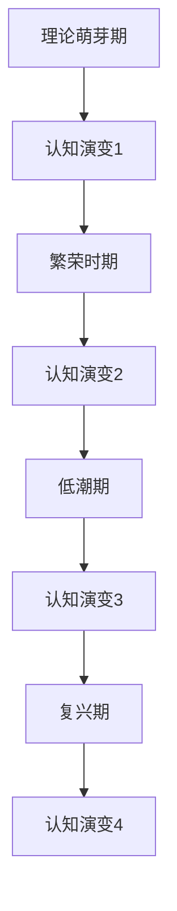

                 

# 面对未知事物的认知演变

## 关键词
- 认知演变
- 人工智能
- 深度学习
- 神经网络
- 机器学习
- 数学模型

## 摘要
本文将探讨人类认知演变的原理，并将其与人工智能的发展进行对比。通过对AI与认知演变的核心概念、算法原理、数学模型和实际项目的分析，揭示人类在认知过程中所采用的策略如何影响AI系统的设计和实现。

### 第一部分：核心概念与联系

#### 1.1 AI与认知演变

##### 1.1.1 AI的定义与历史

人工智能（Artificial Intelligence，简称AI）是计算机科学的一个分支，旨在研究如何制造智能机器。AI的发展历程可以分为以下几个阶段：

1. **理论萌芽期（1950s-1960s）**：人工智能的概念首次被提出，研究者开始探索如何让机器模拟人类智能。
2. **繁荣时期（1970s-1980s）**：AI研究领域迎来了短暂的繁荣，许多研究机构和公司投入大量资源进行AI项目。
3. **低潮期（1990s）**：由于算法和计算能力的限制，AI研究陷入低潮。
4. **复兴期（2000s至今）**：随着深度学习和大数据技术的发展，AI再次迎来繁荣期。

##### 1.1.2 认知演变的定义与作用

认知演变是指人类在认知过程中，通过不断学习、适应和进化，形成对世界的理解和应对策略。在AI领域，认知演变的理念有助于理解AI如何模仿人类智能，实现从简单任务到复杂任务的过渡。

#### 1.1.3 AI与认知演变的联系

AI与认知演变有着紧密的联系。认知演变提供了理解人类智能机制的理论框架，而AI则试图通过模仿人类认知过程来实现智能。以下是一个简化的Mermaid流程图，展示了AI的发展历程及其与认知演变的联系：



### 第二部分：核心算法原理讲解

#### 2.1 深度学习基础

##### 2.1.1 神经网络

神经网络是深度学习的基础，它由大量相互连接的神经元组成。每个神经元接收多个输入，通过加权求和后加上偏置，通过激活函数输出一个值。

- **神经元公式**：

$$
y = \sigma(\sum_{i=1}^{n} w_i x_i + b)
$$

其中，$y$ 是输出，$x_i$ 是输入，$w_i$ 是权重，$b$ 是偏置，$\sigma$ 是激活函数。

- **激活函数**：常用的激活函数包括Sigmoid、ReLU和Tanh。

#### 2.2 机器学习中的常见数学模型

##### 2.2.1 回归模型

回归模型用于预测一个连续变量的值。最简单的回归模型是线性回归。

- **线性回归公式**：

$$
y = \beta_0 + \beta_1x
$$

其中，$y$ 是预测值，$x$ 是自变量，$\beta_0$ 和 $\beta_1$ 是模型参数。

##### 2.2.2 决策树

决策树是一种常见的分类和回归模型，它通过一系列规则将数据划分为不同的区域。

- **决策树分类规则**：

$$
\begin{align*}
& \text{if } x_i > \beta_i \\
& \text{then } \text{left child} \\
& \text{else } \text{right child}
\end{align*}
$$

### 第三部分：数学模型和数学公式

#### 3.1 机器学习中的常见数学模型

##### 3.1.1 回归模型

回归模型用于预测一个连续变量的值。最简单的回归模型是线性回归。

- **线性回归公式**：

$$
y = \beta_0 + \beta_1x
$$

其中，$y$ 是预测值，$x$ 是自变量，$\beta_0$ 和 $\beta_1$ 是模型参数。

##### 3.1.2 决策树

决策树是一种常见的分类和回归模型，它通过一系列规则将数据划分为不同的区域。

- **决策树分类规则**：

$$
\begin{align*}
& \text{if } x_i > \beta_i \\
& \text{then } \text{left child} \\
& \text{else } \text{right child}
\end{align*}
$$

### 第四部分：项目实战

#### 4.1 实战：实现线性回归模型

##### 4.1.1 实践目的

本案例将使用Python实现一个简单的线性回归模型，用于预测房价。

##### 4.1.2 开发环境搭建

- **Python环境**：安装Python 3.8及以上版本。
- **数据集**：使用Boston房价数据集。

##### 4.1.3 源代码实现

```python
import numpy as np
from sklearn.datasets import load_boston
from sklearn.model_selection import train_test_split
from sklearn.metrics import mean_squared_error

# 加载数据集
boston = load_boston()
X = boston.data
y = boston.target

# 划分训练集和测试集
X_train, X_test, y_train, y_test = train_test_split(X, y, test_size=0.2, random_state=42)

# 初始化模型参数
beta_0 = 0
beta_1 = 0

# 训练模型
for _ in range(1000):
    y_pred = beta_0 + beta_1 * X_train
    error = y_train - y_pred
    beta_1 = beta_1 - (1 / len(X_train)) * sum(error * X_train)
    beta_0 = beta_0 - (1 / len(X_train)) * sum(error)

# 测试模型
y_pred_test = beta_0 + beta_1 * X_test
mse = mean_squared_error(y_test, y_pred_test)
print("MSE:", mse)
```

##### 4.1.4 代码解读与分析

- **数据预处理**：使用`train_test_split`将数据集划分为训练集和测试集。
- **模型初始化**：初始化模型参数$\beta_0$和$\beta_1$。
- **训练过程**：通过梯度下降算法迭代更新模型参数。
- **测试过程**：使用测试集评估模型性能，计算均方误差（MSE）。

### 第五部分：附录

#### 5.1 开发工具与资源

##### 5.1.1 Python库

- **NumPy**：用于数值计算。
- **Scikit-learn**：用于机器学习模型实现。
- **Matplotlib**：用于数据可视化。

## 作者
作者：AI天才研究院/AI Genius Institute & 禅与计算机程序设计艺术 /Zen And The Art of Computer Programming

## 总结与展望

本文从AI与认知演变的角度，探讨了人工智能的核心概念、算法原理、数学模型和实际应用。通过逐步分析推理，揭示了人类在认知过程中所采用的策略如何影响AI系统的设计和实现。未来的研究可以进一步探讨认知演变与AI融合的新模式，以及如何通过认知演变来提升AI系统的智能水平。

### 未来的研究方向

1. **跨学科研究**：结合心理学、神经科学和认知科学的研究成果，探索人类认知与AI系统的深度结合。
2. **个性化学习**：研究如何通过认知演变机制，实现个性化学习，提高学习效果。
3. **自主进化**：研究如何让AI系统具备自主进化的能力，以适应不断变化的环境。
4. **安全与伦理**：探讨AI在认知演变过程中可能带来的安全与伦理问题，并提出相应的解决方案。

通过不断的研究和实践，我们有望将认知演变的理念更加深入地应用于人工智能领域，推动AI系统向更加智能、更加人性化的方向发展。

