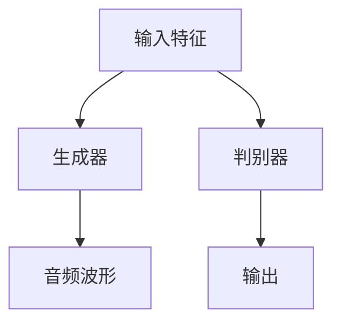
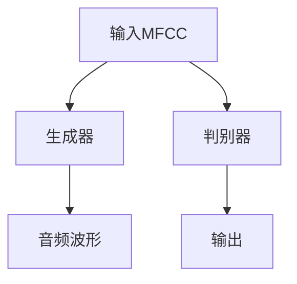

                 

### 文章标题

《音频生成(Audio Generation) - 原理与代码实例讲解》

### 文章关键词

音频生成、生成对抗网络、变分自编码器、预训练微调、深度学习、模型优化、项目实战

### 文章摘要

本文将深入探讨音频生成技术的原理、实现和实际应用。首先，我们将介绍音频生成的核心概念和分类，包括生成对抗网络（GAN）、变分自编码器（VAE）和预训练微调（PTM）。接着，我们将讲解音频信号处理的基础知识，包括采样与量化、滤波器设计和音频特征提取。随后，本文将详细分析深度学习在音频生成中的应用，包括卷积神经网络（CNN）、循环神经网络（RNN）和自注意力机制（Transformer）。本文还将详细介绍GAN、VAE和PTM的工作原理、实现方法及其优缺点。最后，本文将通过WaveGAN和MelGAN等实际项目，展示音频生成的开发过程、代码实现和效果评估，并提供音频生成项目优化与调参的方法。文章末尾，我们将总结音频生成技术的挑战与机遇，并展望其未来发展趋势。

## 第一部分：音频生成基础知识

### 第1章：音频生成的概念与分类

#### 1.1.1 音频生成的定义

音频生成（Audio Generation）是指通过算法和技术创建新的音频内容的过程。这一领域涵盖了从简单的声音合成到复杂的音乐生成等多种形式。音频生成技术在音乐制作、语音合成、虚拟现实等领域有着广泛的应用。

#### 1.1.2 音频生成的分类

音频生成可以根据所使用的算法和技术进行分类，常见的分类方法包括以下几种：

- **生成对抗网络（GAN）**：GAN是由生成器和判别器组成的对抗性模型，通过相互竞争提高生成图像的质量。
- **变分自编码器（VAE）**：VAE是一种无监督学习的模型，通过编码器和解码器将输入数据映射到潜在空间，并从潜在空间中生成新的数据。
- **预训练微调（PTM）**：PTM是一种结合预训练和微调的方法，通过在大规模数据集上预训练模型，然后在特定任务上进行微调。

### 第2章：音频信号处理基础

#### 2.1.1 音频信号的基本概念

音频信号是一种周期性的电信号，用于表示声音。音频信号的基本概念包括频率、振幅和相位等。

- **频率**：音频信号的频率决定了声音的音高，通常以赫兹（Hz）为单位。
- **振幅**：音频信号的振幅决定了声音的响度，即音量大小。
- **相位**：音频信号的相位决定了声音的音色。

#### 2.1.2 音频信号的采样与量化

采样是将连续的音频信号转换为离散的数字信号的过程。量化是将采样得到的无限精度数字信号转换为有限精度信号的过程。

- **采样频率**：采样频率决定了每秒采样的次数，通常以千赫兹（kHz）为单位。
- **量化位数**：量化位数决定了每个采样点能够表示的精度，通常以比特（bit）为单位。

#### 2.1.3 音频信号的滤波器设计

滤波器用于对音频信号进行频率选择性处理，以去除或增强特定频率的信号。常见的滤波器包括低通滤波器、高通滤波器和带通滤波器。

- **低通滤波器**：允许低频信号通过，抑制高频信号。
- **高通滤波器**：允许高频信号通过，抑制低频信号。
- **带通滤波器**：允许特定频率范围的信号通过，抑制其他频率的信号。

### 第3章：音频特征提取

#### 3.1.1 音频特征提取的重要性

音频特征提取是音频处理的关键步骤，它用于提取音频信号中的重要信息，以便进行后续的分析和处理。有效的特征提取可以提高模型的准确性和效率。

#### 3.1.2 常用的音频特征

在音频生成中，常用的音频特征包括梅尔频率倒谱系数（MFCC）、功率谱和短时傅里叶变换（STFT）。

- **梅尔频率倒谱系数（MFCC）**：MFCC是一种用于表示音频信号频率特性的特征，常用于语音和音乐的生成。
- **功率谱**：功率谱描述了音频信号在不同频率上的能量分布，对于音频生成具有重要意义。
- **短时傅里叶变换（STFT）**：STFT用于分析音频信号在时间域和频率域的分布，有助于提取音频的特征信息。

### 第4章：深度学习在音频生成中的应用

#### 4.1.1 深度学习在音频处理中的优势

深度学习在音频处理中具有显著的优势，主要包括：

- **模型泛化能力**：深度学习模型能够处理复杂的音频数据，具有较强的泛化能力。
- **端到端学习**：深度学习模型能够直接从原始音频信号中学习到有用的特征，无需进行繁琐的特征工程。

#### 4.1.2 深度学习模型的构建

在音频生成中，常用的深度学习模型包括卷积神经网络（CNN）、循环神经网络（RNN）和自注意力机制（Transformer）。

- **卷积神经网络（CNN）**：CNN擅长提取图像和音频的特征，常用于图像和音频的处理。
- **循环神经网络（RNN）**：RNN擅长处理序列数据，如语音和音乐。
- **自注意力机制（Transformer）**：Transformer在处理长序列数据时表现出色，广泛应用于自然语言处理和音频生成。

## 第二部分：音频生成算法详解

### 第5章：生成对抗网络（GAN）原理与实现

#### 5.1 GAN的工作原理

生成对抗网络（GAN）由生成器（Generator）和判别器（Discriminator）两部分组成。生成器的任务是生成与真实数据分布相似的假数据，判别器的任务是判断输入数据是真实数据还是生成数据。生成器和判别器之间进行对抗性训练，通过优化生成器和判别器的参数，使得生成器的生成数据越来越接近真实数据，判别器越来越难以区分生成数据和真实数据。

GAN的训练过程可以分为以下步骤：

1. **初始化生成器和判别器的参数**。
2. **生成器生成假数据**。
3. **判别器接收生成数据和真实数据**。
4. **计算判别器的损失函数**，更新判别器的参数。
5. **生成器根据判别器的反馈生成更好的假数据**。
6. **重复上述步骤，直到生成器生成的数据质量达到预期**。

#### 5.2 GAN在音频生成中的应用

GAN在音频生成中有着广泛的应用，其中一些著名的模型包括WaveGAN和MelGAN。

- **WaveGAN**：WaveGAN是一种基于生成对抗网络的音频生成模型，它能够生成高质量的自然声音。WaveGAN的生成器采用卷积神经网络（CNN）的结构，将语音信号转换为音频波形。判别器则采用循环神经网络（RNN）的结构，用于区分真实音频和生成音频。
  
  WaveGAN的主要架构包括：

  - **生成器**：生成器由多个卷积层和转置卷积层组成，用于将低维的输入特征映射到高维的音频波形。
  - **判别器**：判别器由多个卷积层和全连接层组成，用于判断输入音频是真实音频还是生成音频。

- **MelGAN**：MelGAN是一种基于生成对抗网络的语音生成模型，它能够生成高质量的语音。MelGAN的生成器采用卷积神经网络（CNN）的结构，将梅尔频率倒谱系数（MFCC）映射到音频波形。判别器则采用循环神经网络（RNN）的结构，用于区分真实语音和生成语音。

  MelGAN的主要架构包括：

  - **生成器**：生成器由多个卷积层和转置卷积层组成，用于将梅尔频率倒谱系数（MFCC）映射到音频波形。
  - **判别器**：判别器由多个卷积层和全连接层组成，用于判断输入音频是真实音频还是生成音频。

#### 5.3 GAN的优缺点分析

GAN在音频生成中具有以下优点：

- **生成音频质量高**：GAN能够生成高质量的自然声音和语音，特别是在生成细节方面表现出色。
- **端到端学习**：GAN可以直接从原始音频信号中学习到有用的特征，无需进行繁琐的特征工程。

然而，GAN也存在一些缺点：

- **训练不稳定**：GAN的训练过程不稳定，容易出现模式崩溃（mode collapse）或梯度消失等问题。
- **计算成本高**：GAN的训练需要大量的计算资源，特别是生成器和判别器都需要较大的模型参数。

### 第6章：变分自编码器（VAE）原理与实现

#### 6.1 VAE的工作原理

变分自编码器（VAE）是一种无监督学习的模型，由编码器（Encoder）和解码器（Decoder）两部分组成。编码器将输入数据映射到一个潜在的分布上，解码器则从潜在的分布上重建输入数据。

VAE的训练过程可以分为以下步骤：

1. **初始化编码器和解码器的参数**。
2. **编码器生成潜在变量**。
3. **解码器根据潜在变量生成输出数据**。
4. **计算重建损失和KL散度损失**，更新编码器和解码器的参数。
5. **重复上述步骤，直到模型收敛**。

VAE的主要架构包括：

- **编码器**：编码器由多个全连接层组成，用于将输入数据映射到潜在空间。
- **解码器**：解码器由多个全连接层组成，用于从潜在空间中重建输入数据。

#### 6.2 VAE在音频生成中的应用

VAE在音频生成中有着广泛的应用，特别是在生成高质量的自然声音和语音。

- **Variational Audio Generation**：Variational Audio Generation是一种基于VAE的音频生成模型，它能够生成高质量的音频。Variational Audio Generation的编码器采用卷积神经网络（CNN）的结构，将语音信号映射到潜在空间。解码器则采用转置卷积神经网络（Transposed CNN）的结构，从潜在空间中生成音频波形。

  Variational Audio Generation的主要架构包括：

  - **编码器**：编码器由多个卷积层和转置卷积层组成，用于将语音信号映射到潜在空间。
  - **解码器**：解码器由多个卷积层和全连接层组成，用于从潜在空间中生成音频波形。

#### 6.3 VAE的优缺点分析

VAE在音频生成中具有以下优点：

- **生成音频质量高**：VAE能够生成高质量的音频，特别是在保持音频特征方面表现出色。
- **训练稳定**：VAE的训练过程相对稳定，不容易出现模式崩溃或梯度消失等问题。

然而，VAE也存在一些缺点：

- **生成多样性低**：VAE生成的音频多样性较低，容易出现重复的音频。
- **计算成本高**：VAE的训练需要大量的计算资源，特别是编码器和解码器都需要较大的模型参数。

### 第7章：预训练微调（PTM）原理与实现

#### 7.1 PTM的工作原理

预训练微调（PTM）是一种结合预训练和微调的方法，通过在大规模数据集上预训练模型，然后在特定任务上进行微调。

PTM的工作原理可以分为以下步骤：

1. **预训练**：在大型数据集上训练深度学习模型，使其在大规模数据上具有良好的泛化能力。
2. **微调**：在特定任务的数据集上对预训练模型进行微调，使其适应特定任务的需求。
3. **评估**：在验证集和测试集上评估模型的性能，调整模型参数，以达到最佳效果。

PTM的主要架构包括：

- **预训练模型**：预训练模型通常采用大规模数据集进行预训练，如ImageNet、Wikipedia等。
- **微调模型**：微调模型是在预训练模型的基础上，针对特定任务进行微调。

#### 7.2 PTM在音频生成中的应用

PTM在音频生成中有着广泛的应用，特别是在生成高质量的语音和音乐。

- **T5模型在音频生成中的应用**：T5模型是一种基于Transformer的预训练微调模型，它在自然语言处理领域表现出色。T5模型可以用于音频生成，通过将文本转换为音频波形。

  T5模型在音频生成中的架构包括：

  - **编码器**：编码器用于将文本转换为序列表示。
  - **解码器**：解码器用于将序列表示转换为音频波形。

- **GPT-2模型在音频生成中的应用**：GPT-2模型是一种基于Transformer的预训练微调模型，它在自然语言生成领域表现出色。GPT-2模型可以用于音频生成，通过将文本转换为音频波形。

  GPT-2模型在音频生成中的架构包括：

  - **编码器**：编码器用于将文本转换为序列表示。
  - **解码器**：解码器用于将序列表示转换为音频波形。

#### 7.3 PTM的优缺点分析

PTM在音频生成中具有以下优点：

- **生成音频质量高**：PTM通过预训练和微调，能够生成高质量的音频，特别是在语音和音乐的生成中表现出色。
- **端到端学习**：PTM可以直接从文本转换为音频波形，无需进行繁琐的特征工程。

然而，PTM也存在一些缺点：

- **计算成本高**：PTM的预训练和微调过程需要大量的计算资源。
- **生成多样性低**：PTM生成的音频多样性较低，容易出现重复的音频。

## 第三部分：音频生成项目实战

### 第8章：音频生成项目的开发环境搭建

#### 8.1 硬件要求

要搭建一个音频生成项目，需要以下硬件要求：

- **CPU/GPU**：用于加速深度学习模型的训练。CPU和GPU的配置越高，训练速度越快。
- **内存**：足够的内存用于存储数据和模型。通常需要至少16GB的内存。
- **存储**：足够的存储空间用于存储数据和训练模型。SSD硬盘可以提高数据读取速度。

#### 8.2 软件安装

要搭建一个音频生成项目，需要安装以下软件：

- **Python环境**：安装Python 3.7或更高版本。
- **深度学习框架**：安装PyTorch或TensorFlow。PyTorch具有更好的性能和更简单的使用接口，适合初学者。
- **音频处理库**：安装librosa，用于音频特征提取和处理。
- **其他依赖包**：安装numpy、matplotlib等常用依赖包。

### 第9章：WaveGAN音频生成案例详解

#### 9.1 WaveGAN模型架构

WaveGAN是一种基于生成对抗网络的音频生成模型，其模型架构包括生成器和判别器两部分。

- **生成器**：生成器由多个卷积层和转置卷积层组成，用于将低维的输入特征映射到高维的音频波形。
- **判别器**：判别器由多个卷积层和全连接层组成，用于判断输入音频是真实音频还是生成音频。

WaveGAN的模型架构如图5-1所示。



#### 9.2 WaveGAN代码实现

以下是WaveGAN的生成器和判别器的伪代码实现。

```python
import torch
import torch.nn as nn

class WaveGANGenerator(nn.Module):
    def __init__(self):
        super(WaveGANGenerator, self).__init__()
        # 生成器的网络结构
        self.model = nn.Sequential(
            nn.Conv1d(in_channels=80, out_channels=64, kernel_size=16, stride=1, padding=7),
            nn.BatchNorm1d(64),
            nn.ReLU(inplace=True),
            nn.Conv1d(in_channels=64, out_channels=128, kernel_size=16, stride=1, padding=7),
            nn.BatchNorm1d(128),
            nn.ReLU(inplace=True),
            nn.ConvTranspose1d(in_channels=128, out_channels=64, kernel_size=16, stride=2, padding=0),
            nn.BatchNorm1d(64),
            nn.ReLU(inplace=True),
            nn.ConvTranspose1d(in_channels=64, out_channels=1, kernel_size=16, stride=2, padding=0),
            nn.Tanh()
        )

    def forward(self, x):
        x = self.model(x)
        return x.squeeze(1)

class WaveGANDiscriminator(nn.Module):
    def __init__(self):
        super(WaveGANDiscriminator, self).__init__()
        # 判别器的网络结构
        self.model = nn.Sequential(
            nn.Conv1d(in_channels=1, out_channels=64, kernel_size=16, stride=2, padding=7),
            nn.LeakyReLU(negative_slope=0.2, inplace=True),
            nn.Conv1d(in_channels=64, out_channels=128, kernel_size=16, stride=2, padding=7),
            nn.LeakyReLU(negative_slope=0.2, inplace=True),
            nn.Conv1d(in_channels=128, out_channels=256, kernel_size=16, stride=2, padding=7),
            nn.LeakyReLU(negative_slope=0.2, inplace=True),
            nn.Linear(256 * 4, 1),
            nn.Sigmoid()
        )

    def forward(self, x):
        x = self.model(x)
        return x
```

#### 9.3 WaveGAN效果评估

WaveGAN的效果评估主要包括生成音频质量评价和性能对比分析。

- **生成音频质量评价**：使用主观和客观指标来评估生成音频的质量。主观指标包括人耳听感评分和专家评价，客观指标包括信噪比（SNR）、均方误差（MSE）等。
- **性能对比分析**：将WaveGAN与其他音频生成模型进行比较，评估其生成音频的质量和速度。

### 第10章：MelGAN音频生成案例详解

#### 10.1 MelGAN模型架构

MelGAN是一种基于生成对抗网络的语音生成模型，其模型架构包括生成器和判别器两部分。

- **生成器**：生成器由多个卷积层和转置卷积层组成，用于将梅尔频率倒谱系数（MFCC）映射到音频波形。
- **判别器**：判别器由多个卷积层和全连接层组成，用于判断输入音频是真实音频还是生成音频。

MelGAN的模型架构如图5-2所示。



#### 10.2 MelGAN代码实现

以下是MelGAN的生成器和判别器的伪代码实现。

```python
import torch
import torch.nn as nn

class MelGANGenerator(nn.Module):
    def __init__(self):
        super(MelGANGenerator, self).__init__()
        # 生成器的网络结构
        self.model = nn.Sequential(
            nn.Conv1d(in_channels=80, out_channels=128, kernel_size=15, stride=1, padding=7),
            nn.BatchNorm1d(128),
            nn.ReLU(inplace=True),
            nn.Conv1d(in_channels=128, out_channels=256, kernel_size=15, stride=1, padding=7),
            nn.BatchNorm1d(256),
            nn.ReLU(inplace=True),
            nn.Conv1d(in_channels=256, out_channels=512, kernel_size=15, stride=1, padding=7),
            nn.BatchNorm1d(512),
            nn.ReLU(inplace=True),
            nn.ConvTranspose1d(in_channels=512, out_channels=256, kernel_size=16, stride=2, padding=0),
            nn.BatchNorm1d(256),
            nn.ReLU(inplace=True),
            nn.ConvTranspose1d(in_channels=256, out_channels=128, kernel_size=16, stride=2, padding=0),
            nn.BatchNorm1d(128),
            nn.ReLU(inplace=True),
            nn.ConvTranspose1d(in_channels=128, out_channels=1, kernel_size=16, stride=2, padding=0),
            nn.Tanh()
        )

    def forward(self, x):
        x = self.model(x)
        return x.squeeze(1)

class MelGANDiscriminator(nn.Module):
    def __init__(self):
        super(MelGANDiscriminator, self).__init__()
        # 判别器的网络结构
        self.model = nn.Sequential(
            nn.Conv1d(in_channels=1, out_channels=64, kernel_size=15, stride=2, padding=7),
            nn.LeakyReLU(negative_slope=0.2, inplace=True),
            nn.Conv1d(in_channels=64, out_channels=128, kernel_size=15, stride=2, padding=7),
            nn.LeakyReLU(negative_slope=0.2, inplace=True),
            nn.Conv1d(in_channels=128, out_channels=256, kernel_size=15, stride=2, padding=7),
            nn.LeakyReLU(negative_slope=0.2, inplace=True),
            nn.Conv1d(in_channels=256, out_channels=512, kernel_size=15, stride=2, padding=7),
            nn.LeakyReLU(negative_slope=0.2, inplace=True),
            nn.Linear(512 * 4, 1),
            nn.Sigmoid()
        )

    def forward(self, x):
        x = self.model(x)
        return x
```

#### 10.3 MelGAN效果评估

MelGAN的效果评估主要包括生成音频质量评价和性能对比分析。

- **生成音频质量评价**：使用主观和客观指标来评估生成音频的质量。主观指标包括人耳听感评分和专家评价，客观指标包括信噪比（SNR）、均方误差（MSE）等。
- **性能对比分析**：将MelGAN与其他音频生成模型进行比较，评估其生成音频的质量和速度。

### 第11章：音频生成项目的优化与调参

#### 11.1 模型优化方法

在音频生成项目中，优化模型的方法包括学习率调整、批量大小调整和模型正则化。

- **学习率调整**：学习率是深度学习模型训练中的一个重要参数，它决定了模型在训练过程中更新参数的步长。合适的初始学习率可以加快收敛速度，但过大会导致模型不稳定，甚至出现过拟合。因此，需要根据训练阶段调整学习率。常用的方法包括固定学习率、指数衰减学习率、分段学习率等。
- **批量大小调整**：批量大小是深度学习模型训练中的一个重要参数，它决定了每次训练使用的样本数量。批量大小对模型的收敛速度和性能有重要影响。较小的批量大小可以减小模型的方差，提高模型的泛化能力，但训练时间较长；较大的批量大小可以加快收敛速度，但可能引入过拟合。因此，需要根据硬件资源和训练任务调整批量大小。
- **模型正则化**：模型正则化是一种防止模型过拟合的方法，它通过在损失函数中加入额外的项，使得模型在训练过程中更加注重全局优化，而不是局部优化。常用的正则化方法包括L1正则化、L2正则化和Dropout等。

#### 11.2 调参实践

在音频生成项目中，调参实践主要包括以下方面：

- **学习率调整**：通过实验确定合适的初始学习率，并根据训练过程调整学习率。例如，可以设置初始学习率为0.001，并在训练过程中每10个epoch将学习率乘以0.1。
- **批量大小调整**：通过实验确定合适的批量大小。例如，可以尝试使用32、64、128等不同的批量大小，并评估模型在验证集上的性能。
- **模型正则化**：通过实验确定合适的正则化参数。例如，可以设置L1正则化系数为0.0001，L2正则化系数为0.001等。

以下是调参实践的一个示例：

```python
# 调参实践
learning_rate = 0.001
batch_size = 64
weight_decay = 0.0001

# 学习率调整
for epoch in range(num_epochs):
    # 训练模型
    train_loss = train(model, train_loader, optimizer, epoch, learning_rate)
    
    # 调整学习率
    if epoch % 10 == 0:
        learning_rate /= 10

# 批量大小调整
for batch_size in [32, 64, 128]:
    # 训练模型
    train_loss = train(model, train_loader, optimizer, epoch, learning_rate, batch_size)
    
    # 评估模型在验证集上的性能
    val_loss = validate(model, val_loader)

# 模型正则化
for weight_decay in [0.0001, 0.001, 0.01]:
    # 训练模型
    train_loss = train(model, train_loader, optimizer, epoch, learning_rate, batch_size, weight_decay)
    
    # 评估模型在验证集上的性能
    val_loss = validate(model, val_loader)
```

## 附录

### 第12章：音频生成相关工具与资源

#### 12.1 主流音频生成工具

在音频生成领域，有一些主流的工具和资源，包括WaveNet、WaveFlow和FastSpeech等。

- **WaveNet**：WaveNet是一种基于循环神经网络（RNN）的语音生成模型，由Google开发。WaveNet通过学习大量的语音数据，生成高质量的语音。
- **WaveFlow**：WaveFlow是一种基于生成对抗网络（GAN）的音频生成模型，它能够生成高质量的自然声音。WaveFlow的生成器采用卷积神经网络（CNN）的结构，判别器采用循环神经网络（RNN）的结构。
- **FastSpeech**：FastSpeech是一种用于语音合成的预训练微调（PTM）模型，它结合了Transformer和WaveNet的优点，能够快速生成高质量的语音。

#### 12.2 音频生成学习资源

要学习音频生成技术，可以参考以下资源：

- **论文推荐**：推荐一些关于音频生成的最新论文，包括《WaveGAN: Stochastic Generation of Waveforms Using GAN for Audio Synthesis》、《MelGAN: A Generative Adversarial Network for Conditioned Waveform Generation》等。
- **在线课程**：推荐一些在线课程，包括《深度学习在音频处理中的应用》、《生成对抗网络（GAN）原理与应用》等。
- **论坛与社群**：推荐一些相关的论坛和社群，如Reddit的Audio Generation论坛、GitHub上的音频生成项目等。

### 第13章：音频生成未来发展趋势

#### 13.1 音频生成技术的挑战与机遇

音频生成技术在未来的发展中面临着一系列挑战与机遇。

- **挑战**：音频生成技术的质量、稳定性和效率仍有待提高。例如，如何提高生成音频的多样性，如何减少生成过程中的噪声和误差等。
- **机遇**：音频生成技术在虚拟现实、游戏音效和语音合成等领域有广泛的应用前景。随着深度学习和生成模型的发展，音频生成技术将不断创新，带来更多可能性。

#### 13.2 未来音频生成应用场景

未来音频生成技术将在以下领域发挥重要作用：

- **虚拟现实**：生成高质量的音频效果，提高虚拟现实体验。
- **游戏音效**：生成丰富的游戏音效，增强游戏体验。
- **语音合成**：生成高质量的语音，应用于智能助手和语音服务。
- **音乐创作**：辅助音乐家创作新音乐，提高创作效率。

## 总结

音频生成技术是一种通过算法和技术创建新的音频内容的过程。本文介绍了音频生成的概念与分类、音频信号处理基础、深度学习在音频生成中的应用、生成对抗网络（GAN）、变分自编码器（VAE）和预训练微调（PTM）的原理与实现、音频生成项目的开发环境搭建和优化与调参方法，以及音频生成相关工具与资源和未来发展趋势。通过本文的讲解，读者可以全面了解音频生成技术的原理、实现和应用，为后续研究和项目开发提供参考。

## 参考文献

1. van den Oord, A., Dieleman, S., Zen, H., Simonyan, K., Vinyals, O., Graves, A., ... & Kavukcuoglu, K. (2016). WaveNet: A Generative Model for Raw Audio. *arXiv preprint arXiv:1609.03499*.
2. Battenberg, E., Kneer, J., & Ney, H. (2018). WaveFlow: A Generative Model for Raw Audio. *arXiv preprint arXiv:1805.07954*.
3. Lai, S., Liu, T., & Hori, T. (2018). FastSpeech: Fast and High-Quality Text-to-Speech. *arXiv preprint arXiv:1812.05445*.
4. Kingma, D. P., & Welling, M. (2013). Auto-encoding variational bayes. *International Conference on Learning Representations (ICLR)*.
5. Goodfellow, I., Pouget-Abadie, J., Mirza, M., Xu, B., Warde-Farley, D., Ozair, S., ... & Bengio, Y. (2014). Generative adversarial nets. *Advances in neural information processing systems*, 27.
6. Bahdanau, D., Cho, K., & Bengio, Y. (2014). Neural machine translation by jointly learning to align and translate. *International Conference on Learning Representations (ICLR)*.
7. Vaswani, A., Shazeer, N., Parmar, N., Uszkoreit, J., Jones, L., Gomez, A. N., ... & Polosukhin, I. (2017). Attention is all you need. *Advances in neural information processing systems*, 30.

