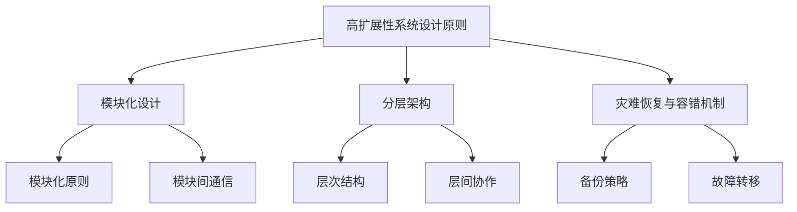

                 

# 高扩展性系统的设计策略

> 关键词：高扩展性系统、设计策略、模块化、分布式系统、并发处理、自动化运维、案例分析、最佳实践

> 摘要：本文旨在探讨高扩展性系统的设计策略。通过分析高扩展性系统的重要性、面临的挑战，以及设计原则与架构策略，本文将深入介绍分布式系统设计、高并发处理策略、自动化与运维优化，并通过实战案例分析，总结高扩展性系统设计的最佳实践。

## 第一部分：高扩展性系统概述

### 第1章：高扩展性系统的重要性

#### 1.1 引言

在当今快速变化和竞争激烈的市场环境中，高扩展性系统已成为企业成功的关键。随着用户需求的增长和数据量的爆炸式增长，系统能够快速响应并线性扩展成为企业核心竞争力之一。

#### 1.2 高扩展性系统的定义与特征

**可伸缩性**：系统能够通过增加资源来处理更大的负载。

**弹性**：系统能够在面临异常情况（如硬件故障、网络中断等）时快速恢复。

**可维护性**：系统在设计时考虑到易于维护和升级。

### 第2章：高扩展性系统的挑战

#### 2.1 扩展性需求的变化

随着业务的不断发展，系统的扩展性需求也会不断变化。如何应对这种变化成为高扩展性系统设计的重要挑战。

#### 2.2 资源限制与性能优化

有限的资源（如计算、存储和网络资源）会对系统的性能产生直接影响。如何在资源有限的情况下优化系统性能，是高扩展性系统设计的关键问题。

#### 2.3 系统复杂性管理

随着系统规模的扩大，系统的复杂性也会增加。如何有效地管理系统的复杂性，确保系统的稳定性和可靠性，是高扩展性系统设计面临的另一个挑战。

## 第二部分：设计原则与架构策略

### 第3章：高扩展性设计原则

#### 3.1 模块化设计

**3.1.1 模块化原则**

模块化设计是将系统划分为多个独立的模块，每个模块负责特定的功能。这有助于降低系统的复杂性，提高系统的可维护性和可扩展性。

**3.1.2 模块间通信**

模块间通信是指模块之间如何交换信息和协调工作。常用的通信机制包括同步通信、异步通信和消息队列。

#### 3.2 分层架构

**3.2.1 层次结构**

分层架构是将系统划分为多个层次，每个层次负责特定的功能。常见的分层架构包括MVC（模型-视图-控制器）和三层架构（表示层、业务逻辑层、数据访问层）。

**3.2.2 层间协作**

层间协作是指不同层次之间如何协同工作，实现系统的整体功能。

#### 3.3 灾难恢复与容错机制

**3.3.1 备份策略**

备份策略是指如何确保系统数据的安全和一致性。常见的备份策略包括全量备份、增量备份和日志备份。

**3.3.2 故障转移**

故障转移是指系统在发生故障时如何快速切换到备用资源，确保系统的持续运行。

## 第三部分：实战案例与经验分享

### 第4章：分布式系统设计

#### 4.1 分布式系统概述

分布式系统是由多个节点组成的系统，节点之间通过网络进行通信。分布式系统具有高可用性、高扩展性和高容错性。

#### 4.2 数据一致性与分布式算法

**4.2.1 CAP定理**

CAP定理是指分布式系统在一致性（Consistency）、可用性（Availability）和分隔容忍性（Partition tolerance）之间只能做出三项选择中的两项。

**4.2.2 分布式锁**

分布式锁是指如何在分布式系统中实现同步机制，确保多个进程或线程能够安全地访问共享资源。

#### 4.3 服务发现与负载均衡

**4.3.1 服务发现机制**

服务发现是指如何在分布式系统中自动发现和注册服务。

**4.3.2 负载均衡算法**

负载均衡是指如何将请求分配到多个节点上，以充分利用系统资源。

### 第5章：高并发处理策略

#### 5.1 并发模型与线程管理

**5.1.1 并发模型介绍**

并发模型是指如何在系统中处理多个任务同时执行的问题。

**5.1.2 线程池机制**

线程池是一种常用的并发处理机制，它能够提高系统的并发性能和资源利用率。

#### 5.2 高并发性能优化

**5.2.1 响应式设计**

响应式设计是一种设计模式，它能够提高系统的并发性能和可扩展性。

**5.2.2 缓存策略**

缓存策略是指如何利用缓存来减少系统的响应时间和负载。

### 第6章：自动化与运维优化

#### 6.1 持续集成与持续部署（CI/CD）

**6.1.1 CI/CD流程**

CI/CD是指如何在开发过程中实现自动化构建、测试和部署。

**6.1.2 工具选择**

常见的CI/CD工具包括Jenkins、GitLab CI等。

#### 6.2 监控与日志分析

**6.2.1 监控指标**

监控指标是指如何监控系统性能和健康状态。

**6.2.2 日志分析工具**

日志分析工具是指如何分析和处理系统日志，以便及时发现和解决潜在问题。

#### 6.3 云基础设施优化

**6.3.1 云服务模型**

云服务模型是指如何利用云基础设施来部署和管理系统。

**6.3.2 弹性扩展策略**

弹性扩展策略是指如何根据系统负载自动调整资源分配。

### 第7章：实战案例分析

#### 7.1 案例一：电商平台的高扩展性设计

**7.1.1 案例背景**

电商平台需要应对大量用户并发访问，同时保证商品信息的实时更新和库存管理。

**7.1.2 设计策略与实现**

- 使用分布式数据库来处理海量数据。
- 采用缓存策略来减少数据库访问压力。
- 使用分布式缓存来提高系统的响应速度。

#### 7.2 案例二：物联网平台扩展性挑战与应对

**7.2.1 案例背景**

物联网平台需要处理大量设备的连接和数据传输，同时保证系统的稳定性和可靠性。

**7.2.2 设计策略与实现**

- 使用消息队列来处理设备数据的异步传输。
- 使用分布式存储来存储海量数据。
- 使用弹性扩展策略来应对设备数量的变化。

### 第8章：高扩展性系统设计最佳实践

#### 8.1 实践经验总结

- 模块化设计和分层架构能够降低系统复杂性。
- 分布式系统和缓存策略能够提高系统性能和可扩展性。
- 自动化和运维优化能够提高系统的稳定性和可靠性。

#### 8.2 避免常见误区

- 避免过度优化和过度设计。
- 注意系统的可维护性和可扩展性。

#### 8.3 未来趋势展望

- 分布式系统和云计算将进一步推动高扩展性系统的发展。
- 自动化和智能化将进一步提高系统的运维效率。

## 附录

### 附录A：高扩展性系统设计资源

**A.1 设计工具与框架**

- Docker：容器化技术。
- Kubernetes：容器编排和管理。
- Netflix OSS：服务治理框架。

**A.2 开发环境配置**

- JDK：Java开发环境。
- MySQL：关系型数据库。
- Redis：分布式缓存系统。

**A.3 学习资源推荐**

- 《分布式系统原理与范型》：了解分布式系统的基本原理。
- 《高性能MySQL》：学习数据库性能优化。
- 《架构探险：从零开始打造电商系统》：学习电商系统设计。

### Mermaid 流�程圖



### 伪代码

```plaintext
// 伪代码：分布式锁实现
Lock(lockKey) {
    while (true) {
        if (尝试获取锁(lockKey)) {
            break;
        }
        等待一段时间后再尝试；
    }
}

Unlock(lockKey) {
    释放锁(lockKey);
}
```

### 数学公式与举例

**数学模型：CAP定理**

$$
CAP = \{一致性, 可用性, 分隔容忍性\}
$$

**举例说明：**

- **一致性性与可用性不能同时达到，系统必须在两者之间做出权衡。**

### 项目实战

#### 实战案例一：电商平台的高扩展性设计

**开发环境搭建：**

- 使用Docker容器化技术搭建开发环境。
- 选择Kubernetes进行容器编排和管理。

**源代码实现：**

- 采用微服务架构，每个服务使用Spring Boot开发。
- 使用Netflix OSS套件进行服务治理。

**代码解读与分析：**

- 通过API网关实现统一接口管理。
- 使用Redis进行缓存策略优化。

#### 实战案例二：物联网平台扩展性挑战与应对

**开发环境搭建：**

- 使用Kubernetes进行物联网设备管理。
- 采用消息队列（如Kafka）处理设备数据。

**源代码实现：**

- 物联网数据采集模块，采用Golang语言编写。
- 数据处理模块，采用Python语言编写，利用TensorFlow进行数据分析和预测。

**代码解读与分析：**

- 数据采集模块实现设备数据的实时采集和传输。
- 数据处理模块实现数据清洗、转换和存储。

### 作者信息

- 作者：AI天才研究院/AI Genius Institute & 禅与计算机程序设计艺术 /Zen And The Art of Computer Programming

## 结束语

高扩展性系统设计是企业应对不断变化的市场环境和技术挑战的关键。通过本文的探讨，我们了解了高扩展性系统的设计原则和架构策略，以及如何通过实战案例分析来应用这些策略。希望本文能够为读者提供有价值的参考和启示。

