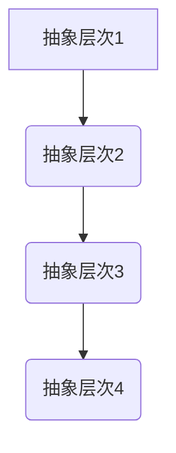
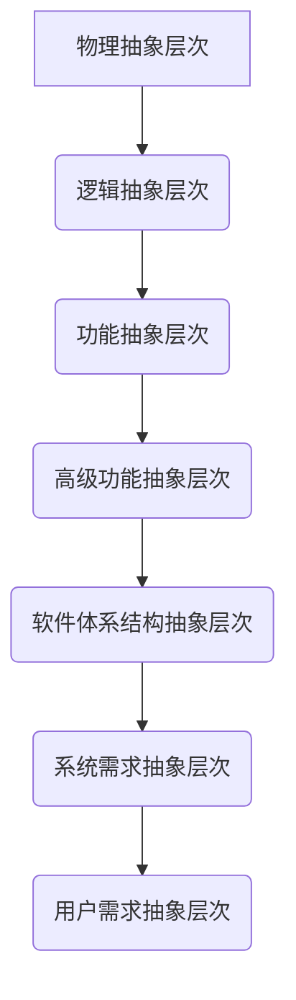

                 

# 《高抽象层次的核心》

> 关键词：抽象层次、高抽象层次、计算机科学、软件设计、算法原理、数学模型、项目实战

> 摘要：本文深入探讨了高抽象层次在计算机科学领域的核心概念、应用、算法原理、数学模型以及项目实战，通过逻辑清晰的步骤分析和深入剖析，旨在帮助读者理解并掌握高抽象层次的重要性及其应用场景。

## 第1章: 高抽象层次的概念

### 1.1 高抽象层次的定义与意义

#### 1.1.1 抽象层次的基本概念

在计算机科学中，抽象层次（Abstract Layer）是一种组织和理解复杂系统的工具。它通过简化复杂系统的细节，将系统的关键功能和功能之间的关系进行分层表示。抽象层次分为多个级别，从低到高分别为硬件、操作系统、网络、数据库、应用程序等。

#### 1.1.2 抽象层次的分类

- **物理抽象层次**：涉及硬件层面的抽象，如计算机的架构、处理器设计等。
- **逻辑抽象层次**：涉及软件层面的抽象，如操作系统、网络协议等。
- **功能抽象层次**：涉及软件功能模块的抽象，如应用程序、数据库管理系统等。

#### 1.1.3 高抽象层次的重要性

高抽象层次在计算机科学中具有重要意义，主要体现在以下几个方面：

- **简化复杂性**：通过抽象层次，可以简化系统的复杂性，使得设计和理解系统变得更加容易。
- **提高可维护性**：抽象层次使得系统的各个部分相互独立，降低了系统的维护难度。
- **促进创新**：高抽象层次为开发人员提供了更多的灵活性和创新空间，使得他们可以专注于系统的核心功能。

### 1.2 抽象层次在计算机科学中的应用

#### 1.2.1 软件开发中的抽象层次

在软件开发中，抽象层次的应用非常广泛。例如，使用面向对象编程语言（如Java、C++）进行开发时，可以将复杂的系统划分为多个对象，每个对象代表一个抽象层次。

#### 1.2.2 算法设计中的抽象层次

算法设计也依赖于抽象层次。通过将问题分解为多个层次，可以更有效地分析和解决复杂问题。

#### 1.2.3 数据结构与抽象层次

数据结构的设计和选择也依赖于抽象层次。例如，使用数组、链表、树等数据结构来表示和存储数据，每种数据结构都有其特定的抽象层次。

## 第2章: 高抽象层次的核心概念

### 2.1 核心概念原理与联系

为了更好地理解高抽象层次，我们需要探讨其核心概念原理以及它们之间的联系。以下是几个关键概念：

#### 2.1.1 Mermaid 流程图

Mermaid 是一种轻量级的 Markdown 图形语法，用于创建各种图表，如流程图、序列图、Git 图等。通过 Mermaid，我们可以直观地表示抽象层次之间的关系。



#### 2.1.2 高抽象层次的 Mermaid 图

以下是一个更详细的高抽象层次 Mermaid 图，展示了不同抽象层次之间的关联。



### 2.2 核心概念之间的关联

#### 2.2.1 高抽象层次与模块化设计

模块化设计是软件开发中常用的方法，它依赖于高抽象层次。通过将系统划分为多个模块，每个模块对应一个抽象层次，可以简化系统的设计和实现。

#### 2.2.2 高抽象层次与软件复用

高抽象层次有助于软件复用。通过将通用功能抽象为高层次模块，可以方便地在不同项目中复用这些模块，提高开发效率。

#### 2.2.3 高抽象层次与软件质量

高抽象层次有助于提高软件质量。通过将系统划分为多个层次，可以更好地进行测试和调试，从而减少系统中的错误和缺陷。

## 第3章: 高抽象层次的核心算法原理

### 3.1 算法概述与伪代码

为了更好地理解高抽象层次在算法设计中的应用，我们首先介绍一个简单的排序算法，并给出其伪代码。

```plaintext
算法：冒泡排序
输入：一个无序数组 A
输出：一个有序数组 A

冒泡排序（A）：
    n = 长度（A）
    for i = 1 to n-1 do
        for j = 1 to n-i do
            if A[j] > A[j+1] then
                交换 A[j] 和 A[j+1]
            end if
        end for
    end for
```

### 3.2 算法原理讲解

#### 3.2.1 算法的基本思想

冒泡排序的基本思想是通过比较和交换相邻的元素，将无序数组中的最大元素逐渐移动到数组的末尾，从而实现数组的有序排列。

#### 3.2.2 算法的数学模型

假设数组 A 的长度为 n，冒泡排序的时间复杂度为 O(n^2)。其中，O 表示大O符号，表示算法的时间复杂度。

## 第4章: 高抽象层次的数学模型和公式

### 4.1 数学模型的基本概念

数学模型是描述现实世界问题的一种抽象工具，它通过数学语言来表示问题中的变量、关系和约束条件。

### 4.2 公式详细讲解

以下是一个简单的数学公式，用于计算数组的和。

$$
\sum_{i=1}^{n} a_i = S
$$

这个公式表示从 i=1 到 i=n，将数组 A 中每个元素的值相加，得到总和 S。

### 4.3 公式举例说明

假设我们有一个数组 A = [1, 2, 3, 4, 5]，根据上述公式，我们可以计算出数组的和：

$$
\sum_{i=1}^{5} a_i = 1 + 2 + 3 + 4 + 5 = 15
$$

这个公式在算法中经常用于计算数组的和，例如在冒泡排序算法中，我们需要计算每个轮次交换的次数。

## 第5章: 高抽象层次的项目实战

### 5.1 实战背景介绍

在本章中，我们将通过一个实际项目来展示高抽象层次的应用。该项目是一个简单的图书管理系统，它包括以下功能：

- 添加图书信息
- 查询图书信息
- 更新图书信息
- 删除图书信息

### 5.2 开发环境搭建

为了完成这个项目，我们需要搭建一个开发环境。以下是搭建步骤：

1. 安装 Java 开发工具包（JDK）
2. 安装一个集成开发环境（IDE），如 Eclipse 或 IntelliJ IDEA
3. 创建一个新的 Java 项目

### 5.3 源代码实现与解读

在本节中，我们将详细介绍图书管理系统的源代码实现和解读。

#### 5.3.1 源代码结构

图书管理系统可以分为多个模块，每个模块对应一个抽象层次。以下是源代码的结构：

- **主模块**：负责程序的入口和退出
- **图书模块**：负责处理图书信息的添加、查询、更新和删除
- **数据库模块**：负责与数据库的连接和数据操作

#### 5.3.2 代码解读与分析

以下是一个简单的图书添加功能的代码示例：

```java
public class Book {
    private String title;
    private String author;
    private int year;

    public Book(String title, String author, int year) {
        this.title = title;
        this.author = author;
        this.year = year;
    }

    // 省略其他属性的 getter 和 setter 方法

    public void addBook(Book book) {
        // 连接数据库
        Connection conn = getConnection();
        // 创建 SQL 语句
        String sql = "INSERT INTO books (title, author, year) VALUES (?, ?, ?)";
        // 预编译 SQL 语句
        PreparedStatement pstmt = conn.prepareStatement(sql);
        // 设置参数
        pstmt.setString(1, book.getTitle());
        pstmt.setString(2, book.getAuthor());
        pstmt.setInt(3, book.getYear());
        // 执行 SQL 语句
        pstmt.executeUpdate();
        // 关闭资源
        pstmt.close();
        conn.close();
    }
}
```

这个代码示例展示了如何使用 Java 和 JDBC（Java Database Connectivity）连接数据库并执行 SQL 语句。这里使用了预处理语句（PreparedStatement）来防止 SQL 注入攻击，并提高了代码的健壮性。

## 第6章: 高抽象层次的应用领域与趋势

### 6.1 应用领域概述

高抽象层次在计算机科学的许多领域都有广泛应用，包括但不限于：

- **软件开发**：在软件开发中，抽象层次有助于模块化设计和提高代码的可维护性。
- **算法设计**：在算法设计中，抽象层次有助于理解和实现复杂的算法。
- **数据分析**：在数据分析中，抽象层次有助于处理大规模数据集和提高数据处理效率。
- **人工智能**：在人工智能领域，抽象层次有助于构建和优化复杂的机器学习模型。

### 6.2 趋势分析

随着计算机科学的发展，高抽象层次的应用趋势主要体现在以下几个方面：

- **自动化**：通过高抽象层次，可以自动化许多软件开发和算法设计的任务。
- **智能化**：通过高抽象层次，可以构建更智能的机器学习模型和人工智能系统。
- **云计算**：在云计算领域，高抽象层次有助于实现更高效的服务部署和管理。

## 第7章: 高抽象层次的实践建议与挑战

### 7.1 实践建议

为了有效地应用高抽象层次，我们提出以下实践建议：

- **理解抽象层次**：首先，要理解不同抽象层次的概念和作用，以便在实际项目中正确地应用它们。
- **模块化设计**：在软件开发中，采用模块化设计有助于提高代码的可维护性和复用性。
- **持续学习**：随着技术的发展，不断学习新的抽象层次和相关技术，以保持竞争力。

### 7.2 面临的挑战

尽管高抽象层次具有许多优势，但在实践中仍面临一些挑战：

- **复杂性**：高抽象层次可能导致系统的复杂性增加，需要更多的设计和实现工作。
- **性能**：高抽象层次可能会引入额外的性能开销，需要仔细优化。
- **灵活性**：高抽象层次可能限制了系统的灵活性，需要在设计时进行权衡。

## 附录

### 附录 A: 高抽象层次的工具与资源

#### A.1 工具概述

- **Mermaid**：用于创建图表的 Markdown 图形语法。
- **Eclipse**：一个流行的集成开发环境（IDE）。
- **IntelliJ IDEA**：一个强大的集成开发环境（IDE）。
- **JDK**：Java 开发工具包，用于开发 Java 应用程序。

#### A.2 资源推荐

- **《设计模式：可复用的面向对象软件的基础》**：一本经典的软件开发书籍，介绍了许多设计模式和应用。
- **《算法导论》**：一本经典的算法教材，涵盖了各种算法的设计和分析。
- **《高抽象层次的设计原则》**：一篇关于高抽象层次在软件开发中应用的文章。

#### A.3 学习资源列表

- **在线教程**：许多在线教程和博客提供了关于高抽象层次的详细信息和实例。
- **在线课程**：一些在线课程提供了关于高抽象层次的理论和实践。
- **书籍和论文**：许多书籍和论文探讨了高抽象层次在不同领域的应用和挑战。

