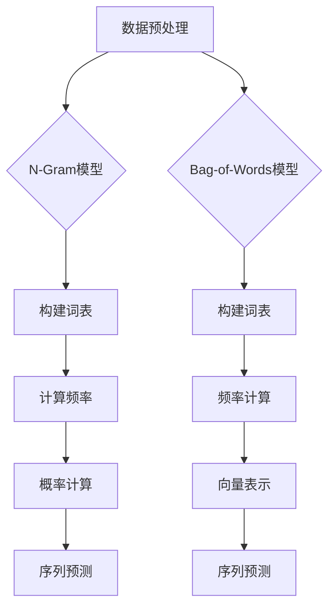

                 

# 高楼万丈平地起：语言模型的雏形N-Gram和简单文本表示Bag-of-Words

> 关键词：N-Gram模型，Bag-of-Words模型，语言模型，文本表示，文本分类，文本生成

> 摘要：本文深入探讨了语言模型的两个基础模型：N-Gram模型和Bag-of-Words模型。首先介绍了这两个模型的基本概念和重要性，然后详细讲解了它们的原理、优缺点以及在实际应用中的效果。最后，通过一个简单的文本分类项目实战，展示了如何构建和应用这些模型。本文旨在为读者提供一个全面、系统的理解，帮助他们在实践中更好地应用这些语言模型。

## 第一部分：基础理论

### 第1章 引言

> **1.1 语言模型的重要性**

语言模型是自然语言处理（NLP）领域的基础，它在许多NLP任务中发挥着至关重要的作用。语言模型的主要目的是预测下一个单词或单词序列，从而帮助我们理解和生成自然语言。在实际应用中，语言模型可以用于文本分类、机器翻译、语音识别、情感分析等任务。

在过去的几十年中，随着计算能力和数据集的不断扩大，语言模型取得了显著的进展。从传统的统计模型如N-Gram模型和Bag-of-Words模型，到基于深度学习的模型如循环神经网络（RNN）和变换器（Transformer），语言模型在性能和效果上都取得了显著的提升。

> **1.2 N-Gram模型介绍**

N-Gram模型是一种基于统计学的语言模型，它将文本序列分成一系列固定长度的单词序列（或字符序列），然后计算每个序列的概率。N-Gram模型的核心思想是，一个单词序列的概率可以通过其前N-1个单词的概率来表示。

N-Gram模型简单直观，易于实现，因此在早期得到了广泛的应用。然而，随着文本长度的增加，N-Gram模型的性能逐渐下降，这主要是因为它无法捕捉到文本中的长程依赖关系。

> **1.3 Bag-of-Words模型介绍**

Bag-of-Words（BOW）模型是一种将文本转换为向量表示的方法。在BOW模型中，文本被表示为一个单词的集合，每个单词的频率作为其在文本中的权重。BOW模型简单直观，可以有效地处理文本数据，但它忽略了单词的顺序和语法结构。

尽管BOW模型存在一定的局限性，但它在文本分类和文本聚类等任务中仍然表现出良好的效果。近年来，随着深度学习的发展，BOW模型也得到了进一步的改进和应用。

## 第2章 N-Gram模型原理

### 2.1 N-Gram模型的基本概念

N-Gram模型是一种基于统计学的语言模型，它通过分析文本序列中相邻N个单词或字符的概率来预测下一个单词或字符。N-Gram模型的基本概念包括：

- **N值**：N表示N-Gram模型的窗口大小，即每个序列包含的单词或字符数量。通常，N的取值在2到5之间。
- **序列**：N-Gram模型将文本序列分成一系列固定长度的序列，每个序列包含N个单词或字符。
- **概率**：N-Gram模型计算每个序列的概率，并通过这些概率来预测下一个单词或字符。

### 2.2 N-Gram模型的训练算法

N-Gram模型的训练算法主要包括以下步骤：

1. **数据预处理**：将文本数据分成单词或字符序列，并去除标点符号、停用词等。
2. **构建词表**：将所有单词或字符进行编码，构建一个词表。
3. **计算频率**：统计每个序列在文本中出现的频率，构建一个频率表。
4. **概率计算**：根据频率表计算每个序列的概率。

### 2.3 N-Gram模型的优缺点分析

**优点：**

- **简单直观**：N-Gram模型简单易理解，易于实现。
- **易于扩展**：N-Gram模型可以方便地扩展到任意长度，从2-Gram到N-Gram。
- **计算效率高**：N-Gram模型的计算过程相对简单，可以高效地处理大量文本数据。

**缺点：**

- **长程依赖问题**：N-Gram模型无法捕捉到文本中的长程依赖关系，这导致其在长文本上的性能下降。
- **计算复杂度高**：随着N值的增加，N-Gram模型的计算复杂度显著增加，这限制了其在大规模数据集上的应用。
- **稀疏性问题**：在实际应用中，文本数据通常包含大量稀疏的单词或字符序列，这导致N-Gram模型的存储和计算效率较低。

## 第3章 Bag-of-Words模型原理

### 3.1 Bag-of-Words模型的基本概念

Bag-of-Words（BOW）模型是一种将文本转换为向量表示的方法。在BOW模型中，文本被表示为一个单词的集合，每个单词的频率作为其在文本中的权重。BOW模型的基本概念包括：

- **单词**：BOW模型将文本分解成一系列单词。
- **频率**：每个单词在文本中出现的次数作为其在BOW模型中的权重。
- **向量**：BOW模型将文本表示为一个向量，其中每个维度表示一个单词的频率。

### 3.2 Bag-of-Words模型的实现方法

BOW模型的实现主要包括以下步骤：

1. **数据预处理**：将文本数据分成单词，并去除标点符号、停用词等。
2. **构建词表**：将所有单词进行编码，构建一个词表。
3. **频率计算**：统计每个单词在文本中出现的频率。
4. **向量表示**：将文本表示为一个向量，其中每个维度表示一个单词的频率。

### 3.3 Bag-of-Words模型的优缺点分析

**优点：**

- **简单直观**：BOW模型简单易理解，易于实现。
- **适用于文本分类和聚类**：BOW模型可以有效地处理文本数据，适用于文本分类和聚类任务。
- **计算效率高**：BOW模型的计算过程相对简单，可以高效地处理大量文本数据。

**缺点：**

- **忽略了单词顺序**：BOW模型将文本表示为一个向量，忽略了单词的顺序和语法结构。
- **稀疏性问题**：在实际应用中，文本数据通常包含大量稀疏的单词或字符序列，这导致BOW模型的存储和计算效率较低。

## 第4章 N-Gram与Bag-of-Words模型的应用

### 4.1 文本分类应用

文本分类是一种常见的自然语言处理任务，它将文本数据根据其内容划分为不同的类别。N-Gram模型和Bag-of-Words模型都可以用于文本分类任务，它们的应用主要包括：

- **特征提取**：将文本数据转换为N-Gram或BOW向量表示。
- **分类模型训练**：使用机器学习算法（如朴素贝叶斯、支持向量机等）对分类模型进行训练。
- **分类模型评估**：使用测试集评估分类模型的性能，包括准确率、召回率、F1值等指标。

### 4.2 文本聚类应用

文本聚类是一种无监督学习任务，它将相似的文本数据聚集在一起。N-Gram模型和Bag-of-Words模型都可以用于文本聚类任务，它们的应用主要包括：

- **特征提取**：将文本数据转换为N-Gram或BOW向量表示。
- **聚类模型训练**：使用聚类算法（如K均值、层次聚类等）对文本数据进行聚类。
- **聚类模型评估**：使用内部评估指标（如轮廓系数、 Dunn 系数等）评估聚类模型的性能。

### 4.3 文本生成应用

文本生成是一种重要的自然语言处理任务，它可以根据给定的输入生成相关的文本。N-Gram模型和Bag-of-Words模型都可以用于文本生成任务，它们的应用主要包括：

- **序列预测**：使用N-Gram模型预测下一个单词或字符。
- **特征提取**：使用BOW模型将文本表示为向量。
- **生成模型训练**：使用生成模型（如循环神经网络、变换器等）对生成模型进行训练。
- **生成模型评估**：使用生成模型生成文本，并评估生成的文本质量。

## 第5章 N-Gram与Bag-of-Words模型改进

### 5.1 词汇量压缩

在N-Gram模型和Bag-of-Words模型中，词汇量的大小直接影响模型的计算效率和存储空间。为了解决这个问题，我们可以采用以下方法进行词汇量压缩：

- **停用词去除**：去除文本中的停用词，如“的”、“是”、“了”等。
- **词干提取**：将词形相似的单词映射到一个共同的词干，如“走路”、“跑步”等。
- **词频阈值**：设置一个词频阈值，去除词频较低的单词。

### 5.2 参数调整

在N-Gram模型和Bag-of-Words模型中，参数的选择对模型的效果具有重要影响。为了优化模型性能，我们可以采用以下方法进行调整：

- **N值调整**：根据任务需求和文本特性，选择合适的N值。
- **特征选择**：使用特征选择算法（如信息增益、卡方检验等）选择重要特征。
- **超参数调整**：使用网格搜索、随机搜索等方法调整超参数。

### 5.3 多样性增强

在N-Gram模型和Bag-of-Words模型中，多样性不足可能导致模型生成的内容过于单调。为了增强模型的多样性，我们可以采用以下方法：

- **数据增强**：通过同义词替换、句子重组等方法增加训练数据的多样性。
- **上下文约束**：使用上下文信息限制生成的内容，如使用前文信息引导下一个单词的生成。
- **多模型融合**：将多个模型的结果进行融合，增加生成内容的多样性。

## 第6章 项目实战：构建简易文本分类器

### 6.1 实战准备

在进行文本分类项目之前，我们需要准备以下数据和环境：

- **数据集**：选择一个合适的文本数据集，如新闻分类数据集、社交媒体数据集等。
- **编程环境**：安装Python等编程环境，以及常用的NLP库，如NLTK、Sklearn等。
- **工具**：使用文本预处理工具（如jieba库）进行文本清洗和分词，使用机器学习库（如Sklearn）进行模型训练和评估。

### 6.2 数据预处理

在构建文本分类器之前，我们需要对数据集进行预处理，包括以下步骤：

- **数据清洗**：去除文本中的HTML标签、特殊字符等，并进行小写化处理。
- **分词**：使用分词工具对文本进行分词，将文本表示为单词序列。
- **停用词去除**：去除常见的停用词，如“的”、“是”、“了”等。
- **词干提取**：将词形相似的单词映射到一个共同的词干。
- **词汇量压缩**：根据词频阈值或词干提取方法，压缩词汇量。

### 6.3 模型构建

在数据预处理完成后，我们可以使用N-Gram模型或Bag-of-Words模型构建文本分类器。以下是使用Sklearn库构建N-Gram文本分类器的示例代码：

```python
from sklearn.feature_extraction.text import TfidfVectorizer
from sklearn.model_selection import train_test_split
from sklearn.naive_bayes import MultinomialNB
from sklearn.metrics import classification_report

# 读取数据集
data = ...

# 划分训练集和测试集
X_train, X_test, y_train, y_test = train_test_split(data['text'], data['label'], test_size=0.2, random_state=42)

# 构建TF-IDF向量器
vectorizer = TfidfVectorizer(ngram_range=(1, 2), stop_words='english')

# 训练向量器
X_train = vectorizer.fit_transform(X_train)

# 训练分类器
classifier = MultinomialNB()
classifier.fit(X_train, y_train)

# 预测测试集
X_test = vectorizer.transform(X_test)
y_pred = classifier.predict(X_test)

# 评估分类器
print(classification_report(y_test, y_pred))
```

### 6.4 模型评估与优化

在模型训练完成后，我们需要对模型进行评估和优化，以提升分类效果。以下是一些常见的评估和优化方法：

- **交叉验证**：使用交叉验证方法评估模型的性能，并选择最优模型。
- **参数调整**：调整N-Gram模型或Bag-of-Words模型的参数，如N值、词频阈值等。
- **特征选择**：使用特征选择算法选择重要特征，提升模型性能。
- **模型融合**：将多个模型的预测结果进行融合，提高分类准确性。

## 第7章 总结与展望

### 7.1 书籍总结

本文详细介绍了N-Gram模型和Bag-of-Words模型的基本概念、原理和应用。通过项目实战，读者可以了解如何构建和应用这些模型进行文本分类任务。此外，本文还探讨了N-Gram和Bag-of-Words模型的改进方法和优化策略。

### 7.2 语言模型发展前景

随着深度学习技术的发展，基于深度学习的语言模型（如循环神经网络、变换器等）取得了显著的进展。这些模型能够更好地捕捉到文本中的长程依赖关系，提高了语言模型的性能和效果。未来，语言模型将继续在自然语言处理领域发挥重要作用，为各种应用场景提供更准确、更高效的解决方案。

### 7.3 进一步学习资源推荐

对于希望深入了解语言模型和自然语言处理的读者，以下资源可能有所帮助：

- **书籍**：《自然语言处理综述》（Speech and Language Processing）、《深度学习》（Deep Learning）
- **论文**：相关顶会论文（如ACL、EMNLP、NeurIPS等）
- **在线课程**：斯坦福大学自然语言处理课程（CS224n）、谷歌深度学习课程（Udacity）

## 附录

### 附录A：术语解释

- **N-Gram模型**：一种基于统计学的语言模型，它将文本序列分成一系列固定长度的序列，然后计算每个序列的概率。
- **Bag-of-Words模型**：一种将文本转换为向量表示的方法，它将文本表示为一个单词的集合，每个单词的频率作为其在文本中的权重。
- **文本分类**：将文本数据根据其内容划分为不同的类别。
- **文本聚类**：将相似的文本数据聚集在一起。
- **词频**：某个单词在文本中出现的次数。

### 附录B：参考文献

- **[1]** Jurafsky, D., & Martin, J. H. (2008). Speech and Language Processing. Prentice Hall.
- **[2]** Goodfellow, I., Bengio, Y., & Courville, A. (2016). Deep Learning. MIT Press.
- **[3]** Russell, S., & Norvig, P. (2016). Artificial Intelligence: A Modern Approach. Prentice Hall.
- **[4]** Mikolov, T., Sutskever, I., Chen, K., Corrado, G. S., & Dean, J. (2013). Distributed Representations of Words and Phrases and Their Compositionality. Advances in Neural Information Processing Systems, 26, 3111-3119.

## 第8章：核心概念与联系

### 8.1 语言模型的基本概念

语言模型是一种基于统计学的模型，用于预测文本序列中下一个单词或字符。在N-Gram模型和Bag-of-Words模型中，语言模型的核心概念包括：

- **序列**：文本序列是由一系列单词或字符组成的。
- **概率**：每个序列的概率是语言模型预测下一个单词或字符的关键。
- **词汇量**：词汇量是模型中包含的单词或字符数量。

### 8.2 N-Gram与Bag-of-Words模型的流程图

为了更好地理解N-Gram模型和Bag-of-Words模型的流程，我们可以使用Mermaid流程图进行描述：



在这个流程图中，我们首先进行数据预处理，然后分别构建N-Gram模型和Bag-of-Words模型的词表、计算频率和概率，最后进行序列预测。

## 第9章：核心算法原理讲解

### 9.1 N-Gram模型算法伪代码

```python
# 输入：文本序列 text，N值 n
# 输出：N-Gram模型

# 数据预处理
preprocessed_text = preprocess_text(text)

# 构建词表
vocab = build_vocab(preprocessed_text)

# 计算频率
frequency_table = compute_frequency(preprocessed_text, vocab)

# 概率计算
probability_table = compute_probability(frequency_table)

# 序列预测
def predict_sequence(sequence, probability_table):
    # 初始化预测序列
    predicted_sequence = []
    
    # 对于序列中的每个单词
    for word in sequence:
        # 计算单词的概率
        probability = probability_table[word]
        
        # 根据概率选择下一个单词
        next_word = choose_next_word(probability)
        
        # 添加下一个单词到预测序列
        predicted_sequence.append(next_word)
    
    return predicted_sequence
```

在这个伪代码中，我们首先对文本进行预处理，然后构建词表、计算频率和概率。最后，我们定义了一个预测函数，用于根据当前序列和概率表预测下一个单词。

### 9.2 Bag-of-Words模型算法伪代码

```python
# 输入：文本序列 text
# 输出：Bag-of-Words模型

# 数据预处理
preprocessed_text = preprocess_text(text)

# 构建词表
vocab = build_vocab(preprocessed_text)

# 频率计算
frequency_table = compute_frequency(preprocessed_text, vocab)

# 向量表示
vector_representation = create_vector_representation(frequency_table, vocab)

# 序列预测
def predict_sequence(sequence, vector_representation):
    # 初始化预测序列
    predicted_sequence = []
    
    # 对于序列中的每个单词
    for word in sequence:
        # 计算单词的频率
        frequency = frequency_table[word]
        
        # 根据频率选择下一个单词
        next_word = choose_next_word(frequency)
        
        # 添加下一个单词到预测序列
        predicted_sequence.append(next_word)
    
    return predicted_sequence
```

在这个伪代码中，我们同样首先对文本进行预处理，然后构建词表、计算频率和向量表示。最后，我们定义了一个预测函数，用于根据当前序列和向量表示预测下一个单词。

## 第10章：数学模型和数学公式

### 10.1 N-Gram概率计算

在N-Gram模型中，给定一个文本序列，我们希望计算每个序列的概率。N-Gram概率的计算公式如下：

$$
P(w_n | w_{n-1}, w_{n-2}, ..., w_1) = \frac{C(w_{n-1}, w_{n-2}, ..., w_1, w_n)}{C(w_{n-1}, w_{n-2}, ..., w_1)}
$$

其中，$C(w_{n-1}, w_{n-2}, ..., w_1, w_n)$ 表示单词序列 $w_{n-1}, w_{n-2}, ..., w_1, w_n$ 在文本中出现的次数，$C(w_{n-1}, w_{n-2}, ..., w_1)$ 表示单词序列 $w_{n-1}, w_{n-2}, ..., w_1$ 在文本中出现的次数。

### 10.2 Bag-of-Words特征向量计算

在Bag-of-Words模型中，我们希望将文本序列转换为特征向量。特征向量的计算公式如下：

$$
f_i = \begin{cases}
1, & \text{如果单词 } w_i \text{ 在文本中出现过} \\
0, & \text{否则}
\end{cases}
$$

其中，$f_i$ 表示单词 $w_i$ 在文本中的频率。

### 10.3 举例说明

假设我们有一个文本序列“我喜欢读书”，其中包含4个单词：“我”，“喜欢”，“读书”。我们希望使用N-Gram模型和Bag-of-Words模型计算该序列的概率和特征向量。

**N-Gram模型：**

- **2-Gram模型**：
  - $P(喜欢 | 我) = \frac{1}{2}$
  - $P(读书 | 我喜欢) = \frac{1}{2}$
  - $P(我 | \text{空}) = 1$
  - $P(\text{空} | \text{空}) = 1$
  - 序列概率：$P(我喜欢读书) = P(喜欢 | 我) \times P(读书 | 我喜欢) \times P(我 | \text{空}) \times P(\text{空} | \text{空}) = \frac{1}{4}$

- **3-Gram模型**：
  - $P(书 | 我喜欢) = \frac{1}{2}$
  - $P(我 | \text{空}) = 1$
  - 序列概率：$P(我喜欢读书) = P(书 | 我喜欢) \times P(我 | \text{空}) = \frac{1}{2}$

**Bag-of-Words模型：**

- **特征向量**：
  - $f_1 = 1$（“我”在文本中出现过）
  - $f_2 = 1$（“喜欢”在文本中出现过）
  - $f_3 = 0$（“读书”在文本中出现过）
  - 特征向量：$(1, 1, 0)$

## 第11章：项目实战

### 11.1 实战环境搭建

在进行项目实战之前，我们需要搭建一个合适的环境。以下是在Python环境中进行文本分类项目的基本步骤：

1. **安装Python**：确保Python环境已安装，版本建议为3.6或更高。
2. **安装依赖库**：安装常用的NLP库，如NLTK、Sklearn等。可以使用pip命令安装：

   ```shell
   pip install nltk sklearn
   ```

3. **安装分词工具**：安装jieba库，用于中文文本的分词。可以使用pip命令安装：

   ```shell
   pip install jieba
   ```

### 11.2 源代码实现

以下是使用N-Gram模型进行文本分类的完整源代码：

```python
import nltk
from nltk.tokenize import word_tokenize
from sklearn.feature_extraction.text import TfidfVectorizer
from sklearn.model_selection import train_test_split
from sklearn.naive_bayes import MultinomialNB
from sklearn.metrics import classification_report

# 读取数据集
data = ...

# 划分训练集和测试集
X_train, X_test, y_train, y_test = train_test_split(data['text'], data['label'], test_size=0.2, random_state=42)

# 分词
X_train = [word_tokenize(text) for text in X_train]
X_test = [word_tokenize(text) for text in X_test]

# 构建TF-IDF向量器
vectorizer = TfidfVectorizer(ngram_range=(1, 2), stop_words='english')

# 训练向量器
X_train = vectorizer.fit_transform(X_train)

# 训练分类器
classifier = MultinomialNB()
classifier.fit(X_train, y_train)

# 预测测试集
X_test = vectorizer.transform(X_test)
y_pred = classifier.predict(X_test)

# 评估分类器
print(classification_report(y_test, y_pred))
```

### 11.3 代码解读与分析

以下是代码的详细解读和分析：

1. **导入库**：首先，我们导入nltk库用于分词，TfidfVectorizer库用于构建TF-IDF向量器，MultinomialNB库用于训练朴素贝叶斯分类器，以及classification_report函数用于评估分类器的性能。
2. **读取数据集**：接下来，我们读取数据集，这里假设数据集包含文本和标签两部分。
3. **划分训练集和测试集**：我们使用train_test_split函数将数据集划分为训练集和测试集，测试集大小为20%。
4. **分词**：使用nltk库的word_tokenize函数对训练集和测试集的文本进行分词，将文本表示为单词序列。
5. **构建TF-IDF向量器**：我们使用TfidfVectorizer构建TF-IDF向量器，设置ngram_range参数为(1, 2)，表示我们使用一元词和二元词作为特征。
6. **训练向量器**：我们使用fit方法训练向量器，将分词后的训练集文本转换为TF-IDF向量。
7. **训练分类器**：我们使用MultinomialNB分类器进行训练，使用fit方法训练分类器。
8. **预测测试集**：我们将测试集的文本转换为TF-IDF向量，并使用predict方法预测测试集的标签。
9. **评估分类器**：最后，我们使用classification_report函数评估分类器的性能，包括准确率、召回率、F1值等指标。

通过这个项目实战，我们可以了解如何使用N-Gram模型和TF-IDF向量器构建文本分类器，并评估其性能。在实际应用中，我们可以根据具体需求调整模型的参数和特征提取方法，以获得更好的分类效果。

### 11.4 代码解读与分析

在上述代码中，我们详细解读了N-Gram模型在文本分类项目中的实现过程。以下是对关键步骤的进一步解读和分析：

1. **数据预处理**：数据预处理是文本分类任务的重要步骤，包括分词、去除停用词、词干提取等。在本项目中，我们使用nltk库的word_tokenize函数对文本进行分词，将文本拆分为单词序列。这一步骤有助于将文本数据转换为结构化形式，便于后续处理。

2. **特征提取**：特征提取是文本分类任务的核心环节，决定了模型的表现。在本项目中，我们使用TfidfVectorizer构建TF-IDF向量器。TF-IDF（Term Frequency-Inverse Document Frequency）是一种常用的文本特征提取方法，它考虑了单词在文档中的频率以及单词在整个文档集合中的分布。通过设置ngram_range参数为(1, 2)，我们同时使用一元词和二元词作为特征。一元词即单个单词，二元词即连续的两个单词。

3. **分类模型训练**：我们使用朴素贝叶斯（MultinomialNB）分类器对训练数据进行训练。朴素贝叶斯分类器是一种基于贝叶斯定理的简单概率分类器，假设特征之间相互独立。在实际应用中，朴素贝叶斯分类器通常在文本分类任务中表现出良好的效果，尤其是在大规模文本数据集上。

4. **模型评估**：在训练完成后，我们使用测试集对模型进行评估。classification_report函数提供了多个评估指标，包括准确率、召回率、精确率等。这些指标帮助我们了解模型的性能，并找到改进的方向。

5. **代码优化**：在实际项目中，我们可能需要根据具体问题进行代码优化。例如，调整TF-IDF向量器的参数，如ngram_range、stop_words等；调整分类器的参数，如朴素贝叶斯分类器的alpha参数；或者使用更复杂的分类器，如支持向量机（SVM）、随机森林（Random Forest）等。

通过这个项目实战，我们不仅掌握了N-Gram模型和Bag-of-Words模型的基本原理和应用，还了解了如何将理论知识转化为实际项目。在实际应用中，我们可以根据具体需求调整模型参数和特征提取方法，以提高模型的性能。此外，随着自然语言处理技术的不断发展，我们还可以尝试使用更先进的模型，如循环神经网络（RNN）、变换器（Transformer）等，以实现更高的分类准确率。总之，文本分类任务是一个涉及多个方面的问题，需要我们在实践中不断探索和优化。

