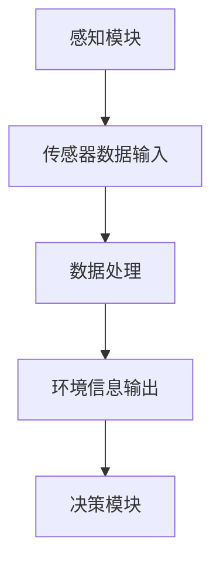
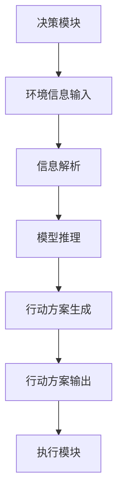
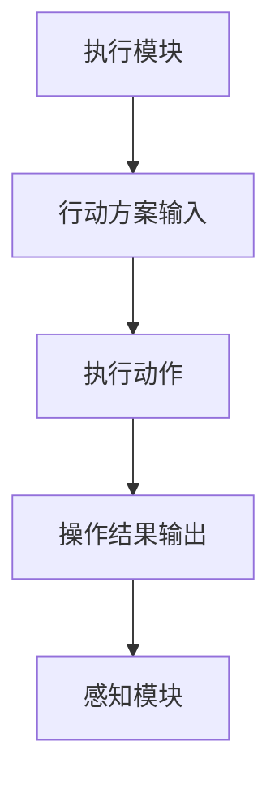
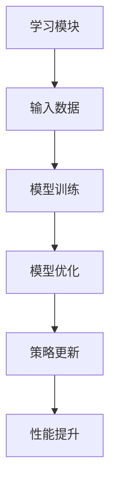

                 


### 文章标题：AI Agent: AI的下一个风口 从早期萌芽到深度学习

> 关键词：AI Agent，深度学习，自主决策，感知，学习，协作

> 摘要：本文将深入探讨AI Agent的发展历程，从早期的萌芽阶段到现代的深度学习时代，详细分析其核心概念、特征、组件及其对AI Agent的影响。通过实际项目实战，展示AI Agent的代码实现和应用，为读者提供全面的AI Agent知识体系。

### 目录

1. 引言
2. AI Agent的基本概念与发展
   - 1.1 AI Agent的定义与分类
   - 1.2 AI Agent的特征与能力
   - 1.3 AI Agent的核心组件与结构
3. 深度学习基础
   - 3.1 深度学习的起源与发展
   - 3.2 深度学习的主要算法
   - 3.3 深度学习的应用场景
4. 深度学习对AI Agent的提升
   - 4.1 深度学习在AI Agent中的应用
   - 4.2 深度学习对AI Agent能力的提升
   - 4.3 深度学习在AI Agent优化中的应用
5. 深度学习与AI Agent的融合
   - 5.1 深度学习在AI Agent设计中的融入
   - 5.2 AI Agent在深度学习应用中的优化
   - 5.3 深度学习与AI Agent的协同发展
6. AI Agent的未来发展
   - 6.1 AI Agent的发展趋势
   - 6.2 AI Agent的未来应用领域
   - 6.3 AI Agent在未来的社会影响
7. AI Agent的创新与探索
   - 7.1 AI Agent的创新思路
   - 7.2 AI Agent的探索方向
   - 7.3 AI Agent的未来技术挑战
8. AI Agent的社会责任与伦理
   - 8.1 AI Agent的伦理问题
   - 8.2 AI Agent的社会责任
   - 8.3 AI Agent的未来治理
9. 结论
- 作者：AI天才研究院/AI Genius Institute & 禅与计算机程序设计艺术 /Zen And The Art of Computer Programming

### 引言

人工智能（AI）正在迅速改变我们的世界，从智能助手到自动驾驶汽车，从医疗诊断到金融分析，AI的应用场景无处不在。在这个变革的过程中，AI Agent作为一个核心概念，逐渐引起了人们的关注。AI Agent，也称为智能代理，是指具有自主决策能力、能够与环境互动并实现特定目标的智能实体。它们能够感知环境、做出决策并执行行动，从而在复杂的环境中实现自主操作。

本文将深入探讨AI Agent的发展历程，从早期的萌芽阶段到现代的深度学习时代。我们将首先介绍AI Agent的基本概念、特征和核心组件，然后讲解深度学习的基础知识和应用，接着分析深度学习对AI Agent的提升，并探讨深度学习与AI Agent的融合。最后，我们将展望AI Agent的未来发展，讨论其创新与探索方向，以及社会责任与伦理问题。

通过这篇文章，读者将能够全面了解AI Agent的核心概念、发展历程和应用，从而更好地把握AI Agent的未来发展方向，为未来的技术研究和应用奠定基础。

### 1. AI Agent的基本概念与发展

#### 1.1 AI Agent的定义与分类

AI Agent，也称为智能代理，是指通过计算机程序实现的、具有自主决策能力、能够与环境互动并实现特定目标的智能实体。AI Agent的核心功能包括感知环境、做出决策和执行行动。在技术层面，AI Agent通常由感知模块、决策模块和执行模块组成，这三个模块协同工作，使得AI Agent能够自主地完成复杂的任务。

根据AI Agent的功能和结构，我们可以将AI Agent分为以下几类：

1. **反应型Agent**：这种类型的AI Agent根据当前环境的状态直接做出反应，没有记忆能力，无法进行推理。它们通常通过预定义的规则来处理环境信息，因此决策过程相对简单，但反应速度较快。反应型Agent适用于简单的任务环境，例如自动化生产线中的机器人。

2. **有限记忆型Agent**：这种类型的AI Agent具备一定的记忆能力，可以存储历史信息，并基于这些信息做出决策。有限记忆型Agent通常通过状态-动作值函数来评估环境的当前状态和未来的行动。这种类型的Agent可以处理更为复杂的环境，例如在围棋游戏中，AlphaGo就是一个典型的有限记忆型Agent。

3. **理想推理型Agent**：这种类型的AI Agent拥有完备的知识库和推理能力，可以基于完整的信息进行推理和决策。理想推理型Agent通常采用逻辑推理、规划算法等高级技术来处理复杂问题。这类Agent在理论上是完美的，但在实际应用中，受限于计算资源和时间复杂度，通常只能应用于一些特定的、相对简单的问题。

4. **混合型Agent**：混合型Agent结合了反应型、有限记忆型和理想推理型Agent的特点，根据任务需求和环境复杂性动态调整自身的决策策略。例如，一个自动驾驶汽车系统，在简单的交通环境中可能采用反应型策略，而在复杂的交通环境中则可能采用有限记忆型或理想推理型策略。

#### 1.2 AI Agent的特征与能力

AI Agent具有以下几个主要特征和核心能力：

1. **自主性**：AI Agent能够自主决定行动方案，不受外界直接控制。这种自主性是AI Agent区别于传统机器人或自动化系统的重要特征。通过感知模块收集环境信息，决策模块分析这些信息，并生成行动方案，执行模块将这些方案付诸实施，AI Agent能够在复杂的动态环境中自主运行。

2. **适应性**：AI Agent能够根据环境变化调整自身行为，提高任务成功率。通过学习模块，AI Agent可以不断从环境中学习，更新自身的知识库和行为策略，从而更好地适应不断变化的环境。

3. **合作性**：AI Agent可以与其他Agent或人类进行协作，共同完成任务。在多Agent系统中，各个AI Agent可以通过通信和协同工作，实现更为复杂的任务。例如，在物流配送系统中，多个自动驾驶车辆可以协同工作，优化路径规划，提高配送效率。

4. **推理能力**：AI Agent能够利用已知信息进行推理，预测未来的可能情况。通过决策模块，AI Agent可以根据感知模块收集的信息，结合已有的知识和模型，对未来进行预测，从而做出最优的决策。

5. **学习能力**：AI Agent能够通过不断学习，提高自身的任务处理能力。学习模块使得AI Agent能够从经验中学习，优化自身的策略和行为，从而在长期任务中实现性能的提升。

#### 1.3 AI Agent的核心组件与结构

AI Agent通常由以下几个核心组件组成：

1. **感知模块**：感知模块是AI Agent的感官系统，用于收集环境信息。感知模块可以通过各种传感器（如摄像头、麦克风、温度传感器等）获取外部数据，并将这些数据转换为内部可用的格式。例如，一个视觉感知模块可以将摄像头捕获的图像转换为像素矩阵，供其他模块使用。

2. **决策模块**：决策模块是AI Agent的智能核心，负责分析感知模块收集的信息，并生成行动方案。决策模块通常采用各种算法和模型，如决策树、神经网络、规划算法等，对环境信息进行解析和推理，从而生成最优的行动方案。决策模块的输出通常是一个行动序列，指导执行模块执行具体的任务。

3. **执行模块**：执行模块是AI Agent的执行系统，负责将决策模块生成的行动方案付诸实施。执行模块通常与外部环境进行交互，通过控制机器人或设备的执行机构，完成具体的任务。执行模块的输出是具体的操作结果，反馈给感知模块和决策模块，形成闭环控制。

4. **学习模块**：学习模块是AI Agent的自我提升系统，负责从经验中学习，优化自身的策略和行为。学习模块通常采用机器学习、深度学习等技术，对感知模块和执行模块的输入输出数据进行训练，提高AI Agent在特定任务上的性能。学习模块可以通过在线学习或离线学习的方式不断优化AI Agent的行为。

#### 1.3.1 感知模块的Mermaid流程图



#### 1.3.2 决策模块的Mermaid流程图



#### 1.3.3 执行模块的Mermaid流程图



#### 1.3.4 学习模块的Mermaid流程图



通过以上四个模块的协同工作，AI Agent能够实现自主感知、决策和执行，从而在复杂的环境中实现自主操作。然而，这些模块的实现和优化依赖于深度学习等先进技术，这将是本文后续章节的重点讨论内容。

### 项目实战

为了更直观地展示AI Agent的核心组件和工作流程，下面我们通过一个简单的项目实战来具体实现一个AI Agent，用于解决一个简单的迷宫问题。这个项目将涵盖感知模块、决策模块、执行模块和学习模块的实现，从而为读者提供一个完整的AI Agent实现案例。

#### 项目描述

我们的目标是实现一个能够自主解决二维迷宫问题的AI Agent。迷宫由一个二维网格组成，每个网格可以是墙壁或通道。Agent的感知模块将感知当前所在的网格，决策模块将根据当前网格和已知的迷宫结构决定下一步的行动，执行模块将根据决策模块的决定移动到下一个网格。此外，我们将引入学习模块，使Agent能够通过学习提高解决问题的能力。

#### 开发环境

- 操作系统：Windows 10
- 编程语言：Python
- 库：numpy，matplotlib

#### 源代码实现

以下是我们实现AI Agent的Python代码：

```python
import numpy as np
import matplotlib.pyplot as plt

# 定义迷宫
maze = np.array([[0, 1, 0, 0],
                 [0, 1, 0, 1],
                 [0, 0, 0, 1],
                 [1, 1, 1, 0]])

# 初始化位置
position = (0, 0)

# 感知模块
def perception_module(maze, position):
    return maze[position]

# 决策模块
def decision_module(current_state, position):
    actions = ["up", "down", "left", "right"]
    if current_state[position] == 1:  # 当前位置为墙壁，无法移动
        return None
    if position[0] > 0 and current_state[position - 1] == 0:
        return "left"
    if position[0] < maze.shape[0] - 1 and current_state[position + 1] == 0:
        return "right"
    if position[1] > 0 and current_state[position - maze.shape[1]] == 0:
        return "up"
    if position[1] < maze.shape[1] - 1 and current_state[position + maze.shape[1]] == 0:
        return "down"
    return None

# 执行模块
def execute_module(position, action):
    if action == "up":
        position = (position[0] - 1, position[1])
    elif action == "down":
        position = (position[0] + 1, position[1])
    elif action == "left":
        position = (position[0], position[1] - 1)
    elif action == "right":
        position = (position[0], position[1] + 1)
    return position

# 学习模块（简单示例，实际项目中可以更复杂）
def learning_module(maze, position, action, reward):
    # 这里的学习过程可以更加复杂，例如使用深度学习算法
    # 例如，我们可以根据Agent的路径和奖励信号来更新策略
    pass

# 主程序
def main():
    global position
    while True:
        current_state = perception_module(maze, position)
        action = decision_module(current_state, position)
        if action is None:
            print("无法继续前进，任务失败")
            break
        position = execute_module(position, action)
        print(f"当前位置：{position}")
        if position == (maze.shape[0] - 1, maze.shape[1] - 1):
            print("成功到达终点")
            break

if __name__ == "__main__":
    main()
```

#### 代码解读与分析

1. **定义迷宫**：我们使用一个二维数组来表示迷宫，0表示通道，1表示墙壁。

2. **感知模块**：该模块用于获取当前Agent所在的网格状态。我们通过调用`perception_module`函数，传入迷宫和当前位置，返回当前网格的状态。

3. **决策模块**：该模块根据当前网格状态和已知的迷宫结构，决定下一步的行动。我们通过调用`decision_module`函数，传入当前状态和位置，返回一个表示行动的字符串。决策模块使用了简单的规则来决定下一步的行动，例如，如果当前位置的上方是通道，则向上移动。

4. **执行模块**：该模块根据决策模块的决定，移动Agent到下一个网格。我们通过调用`execute_module`函数，传入当前位置和行动，返回新的位置。执行模块实现了一个简单的移动逻辑，例如，如果行动是“up”，则当前位置的y坐标减1。

5. **学习模块**：该模块是一个简单的示例，用于展示学习过程。在实际项目中，学习模块可以更加复杂，例如使用深度学习算法来优化Agent的策略。在本例中，我们未实现具体的学习算法，而是简单地注释了学习模块。

6. **主程序**：主程序中，我们首先设置初始位置，然后进入一个无限循环，直到Agent成功到达终点或无法继续前进。在每次迭代中，我们首先调用感知模块获取当前状态，然后调用决策模块决定下一步行动，最后调用执行模块移动到新的位置。

通过这个简单的项目，我们展示了如何使用Python实现一个基于感知和决策的AI Agent，并对其代码进行了详细的解读和分析。这为后续更复杂的AI Agent项目奠定了基础。

### 2. 深度学习基础

#### 2.1 深度学习的起源与发展

深度学习（Deep Learning）是人工智能领域的一个重要分支，其理论基础源于人工神经网络（Artificial Neural Networks, ANN）的研究。人工神经网络最早由心理学家弗兰克·罗森布拉特（Frank Rosenblatt）在1957年提出，称为感知机（Perceptron）。然而，早期的神经网络由于计算能力限制和算法设计的缺陷，难以处理复杂的任务。

随着计算机硬件性能的提升和大数据时代的到来，深度学习在2010年代迎来了快速发展。尤其是2012年，由杰弗里·辛顿（Geoffrey Hinton）等人开发的深度卷积神经网络（Deep Convolutional Neural Network, CNN）在ImageNet图像识别竞赛中取得了突破性的成绩，这标志着深度学习时代的到来。此后，深度学习在语音识别、自然语言处理、计算机视觉等领域取得了显著进展，成为人工智能研究的热点。

#### 2.2 深度学习的主要算法

深度学习的主要算法包括卷积神经网络（Convolutional Neural Networks, CNN）、循环神经网络（Recurrent Neural Networks, RNN）和生成对抗网络（Generative Adversarial Networks, GAN）等。以下是这些算法的基本原理和特点：

1. **卷积神经网络（CNN）**：CNN是一种专门用于处理图像数据的神经网络，其核心组件是卷积层。卷积层通过卷积操作提取图像中的特征，如边缘、纹理等。CNN在计算机视觉领域表现出色，广泛应用于图像分类、目标检测、图像分割等任务。

2. **循环神经网络（RNN）**：RNN是一种能够处理序列数据的神经网络，其核心组件是循环层。RNN通过记忆过去的信息，能够处理序列中的依赖关系，如语音识别、自然语言处理等。然而，传统的RNN存在梯度消失和梯度爆炸等问题，为了解决这些问题，出现了长短时记忆网络（Long Short-Term Memory, LSTM）和门控循环单元（Gated Recurrent Unit, GRU）等变体。

3. **生成对抗网络（GAN）**：GAN是一种生成模型，由生成器和判别器两个神经网络组成。生成器的目标是生成尽可能真实的样本，判别器的目标是区分真实样本和生成样本。通过训练生成器和判别器的对抗过程，GAN能够生成高质量的数据，如生成逼真的图像、视频、音频等。

#### 2.3 深度学习的应用场景

深度学习在众多领域取得了显著的应用成果，以下是几个典型的应用场景：

1. **计算机视觉**：深度学习在计算机视觉领域取得了巨大的成功，如图像分类、目标检测、人脸识别等。例如，深度学习算法可以用于医疗影像分析，帮助医生诊断疾病，提高诊断准确率。

2. **自然语言处理**：深度学习在自然语言处理领域也有广泛的应用，如机器翻译、文本分类、情感分析等。例如，深度学习算法可以用于智能客服系统，提高客服的响应速度和准确性。

3. **语音识别**：深度学习在语音识别领域表现出色，能够实现高精度的语音转文字。例如，深度学习算法可以用于智能语音助手，如苹果的Siri和谷歌的Google Assistant。

4. **推荐系统**：深度学习在推荐系统中的应用也非常广泛，能够通过用户历史行为数据生成个性化的推荐结果。例如，深度学习算法可以用于电商平台，提高用户的购买体验。

5. **自动驾驶**：深度学习在自动驾驶领域发挥着关键作用，如环境感知、路径规划、决策控制等。例如，特斯拉的自动驾驶系统就是基于深度学习算法实现的。

#### 2.4 深度学习的优势与挑战

深度学习具有以下几个优势：

1. **强大的表示能力**：深度学习通过多层网络结构，能够自动提取数据中的复杂特征，实现端到端的学习和建模。

2. **自动特征提取**：传统机器学习需要人工设计特征，而深度学习能够自动从原始数据中提取有价值的特征，降低人工干预。

3. **广泛的应用领域**：深度学习在计算机视觉、自然语言处理、语音识别等领域取得了显著的成果，具有广泛的应用前景。

然而，深度学习也存在一些挑战：

1. **计算资源需求高**：深度学习算法通常需要大量的计算资源和时间，特别是对于大型神经网络和大规模数据集。

2. **数据依赖性强**：深度学习算法的性能高度依赖于训练数据的质量和数量，数据不足或数据偏差可能导致模型性能下降。

3. **解释性不足**：深度学习模型的黑盒特性使得其决策过程难以解释，这对于需要透明性和可解释性的应用场景（如医疗诊断）是一个挑战。

4. **过拟合风险**：深度学习模型容易过拟合训练数据，导致在测试数据上表现不佳。

总之，深度学习作为一种强大的机器学习技术，具有广泛的应用前景和重要的研究价值。通过不断的技术创新和优化，深度学习有望在未来取得更多的突破和进展。

### 3. 深度学习对AI Agent的提升

#### 3.1 深度学习在AI Agent中的应用

深度学习在AI Agent中的应用主要体现在感知模块和决策模块的优化，通过引入深度学习技术，AI Agent能够显著提升其感知能力和决策能力。

1. **感知模块的优化**：传统的AI Agent通常依赖于规则和预设的特征提取方法，这些方法在处理复杂、多变的环境时存在局限。而深度学习通过卷积神经网络（CNN）和循环神经网络（RNN）等算法，能够自动从原始数据中提取高层次的抽象特征，提高感知模块的感知能力。例如，在图像识别任务中，CNN可以自动提取图像中的边缘、纹理等特征，使得AI Agent能够更准确地感知和理解图像信息。

2. **决策模块的优化**：深度学习算法，如深度强化学习（Deep Reinforcement Learning），通过训练生成最优的决策策略，提升AI Agent的决策能力。在强化学习框架下，AI Agent通过与环境的交互，不断优化自身的策略，从而在复杂动态的环境中实现自主决策。深度强化学习在游戏、自动驾驶、机器人等领域表现出色，为AI Agent提供了强大的决策支持。

#### 3.2 深度学习对AI Agent能力的提升

深度学习对AI Agent能力的提升主要体现在以下几个方面：

1. **自主性**：通过深度学习技术的引入，AI Agent能够更准确地感知和理解环境，自主地制定和调整决策策略，从而实现更复杂的任务。例如，在自动驾驶场景中，AI Agent通过深度学习技术，可以实时感知道路信息，自主规划行驶路径，避免碰撞和交通拥堵。

2. **适应性**：深度学习使得AI Agent能够从大量数据中学习，提高对环境变化的适应能力。在动态环境中，AI Agent可以不断调整自身的行为策略，以应对不确定性和变化。例如，在智能家居系统中，AI Agent可以通过深度学习技术，学习用户的行为模式，自动调整家居设备的状态，提高用户体验。

3. **协作性**：深度学习在多Agent系统中的应用，使得AI Agent能够更好地与其他Agent或人类协作，共同完成任务。通过深度强化学习等算法，AI Agent可以学习与其他Agent的交互策略，实现协同优化。例如，在物流配送系统中，多个AI Agent可以通过深度学习算法，协同优化配送路径，提高配送效率。

4. **推理能力**：深度学习算法，如生成对抗网络（GAN）和图神经网络（Graph Neural Networks），可以用于处理复杂的关系和结构化数据，提高AI Agent的推理能力。例如，在医疗诊断中，AI Agent可以通过图神经网络分析患者的病史和检查结果，推理出可能的疾病诊断。

5. **学习能力**：深度学习使得AI Agent能够通过不断的训练和优化，提高自身的任务处理能力。在长期任务中，AI Agent可以通过在线学习，不断调整和优化自身的策略，从而实现长期的性能提升。例如，在股票交易中，AI Agent可以通过深度学习技术，分析历史交易数据，不断优化交易策略，实现长期收益最大化。

#### 3.3 深度学习在AI Agent优化中的应用

深度学习在AI Agent优化中的应用主要体现在以下几个方面：

1. **模型压缩**：深度学习模型通常具有庞大的参数量，这会导致模型计算和存储成本高。通过模型压缩技术，如量化、剪枝和蒸馏，可以显著减少模型的参数量，降低计算和存储成本。例如，在移动设备和嵌入式系统中，通过模型压缩技术，可以实现高效运行的AI Agent。

2. **迁移学习**：迁移学习是一种利用预训练模型来提升新任务性能的技术。通过迁移学习，AI Agent可以在较少的数据上快速适应新任务。例如，在图像分类任务中，通过迁移学习，AI Agent可以利用在ImageNet上预训练的卷积神经网络，快速适应新类别的图像分类任务。

3. **自适应优化**：深度学习算法，如自适应优化算法（Adaptive Optimization Algorithms），可以动态调整模型的参数，提高模型的鲁棒性和效率。例如，在自动驾驶场景中，自适应优化算法可以动态调整感知模块和决策模块的参数，以适应不同的驾驶环境。

4. **多任务学习**：深度学习可以用于多任务学习（Multi-Task Learning），通过共享模型结构和参数，提高AI Agent在多个任务上的性能。例如，在智能家居系统中，AI Agent可以通过多任务学习，同时处理安防监控、设备控制、能源管理等多个任务。

通过深度学习技术的引入，AI Agent不仅在感知、决策和学习能力上得到了显著提升，还在模型优化和任务处理上表现出更强的适应性和鲁棒性。这为AI Agent在复杂、动态环境中的应用提供了强有力的支持，推动了人工智能技术的不断进步。

### 4. 深度学习与AI Agent的融合

深度学习与AI Agent的融合是人工智能领域的一个重要研究方向，通过将深度学习技术与AI Agent的核心组件相结合，可以显著提升AI Agent的自主决策能力、适应性和协同效率。以下将详细探讨深度学习在AI Agent设计中的融入、AI Agent在深度学习应用中的优化，以及深度学习与AI Agent的协同发展。

#### 4.1 深度学习在AI Agent设计中的融入

深度学习在AI Agent设计中的融入主要体现在感知模块、决策模块和执行模块的优化与升级。

1. **感知模块的优化**：深度学习通过卷积神经网络（CNN）和循环神经网络（RNN）等算法，能够自动提取图像、语音、文本等数据中的高维特征，提高感知模块的感知能力。例如，在视觉感知任务中，CNN可以自动提取图像中的边缘、纹理、形状等特征，使AI Agent能够更准确地理解和识别环境中的物体。在语音感知任务中，深度学习算法可以自动提取语音信号中的语音特征，如音高、音强等，使AI Agent能够更准确地识别和理解语音指令。

2. **决策模块的优化**：深度学习算法，如深度强化学习（Deep Reinforcement Learning），可以用于训练决策模块，使其能够自动生成最优的决策策略。在强化学习框架下，AI Agent通过与环境的交互，不断优化自身的策略，从而在复杂动态的环境中实现自主决策。例如，在自动驾驶场景中，深度强化学习可以训练AI Agent在复杂交通环境中的驾驶策略，提高行驶的安全性和效率。

3. **执行模块的优化**：深度学习可以用于优化执行模块的执行逻辑，使其能够更准确地执行决策模块生成的行动方案。例如，在机器人执行任务时，深度学习算法可以用于优化机器人的动作规划，使其能够更灵活、更高效地完成复杂的动作。

#### 4.2 AI Agent在深度学习应用中的优化

AI Agent在深度学习应用中的优化主要体现在模型训练、模型部署和模型优化等方面。

1. **模型训练**：深度学习模型通常需要大量的数据和时间进行训练。为了提高训练效率，AI Agent可以采用数据增强、迁移学习等技术，加速模型的训练过程。例如，在图像分类任务中，AI Agent可以通过数据增强技术，生成更多的训练样本，提高模型的泛化能力。

2. **模型部署**：深度学习模型在部署到实际应用中时，需要考虑到计算资源和存储空间的限制。为了实现高效部署，AI Agent可以采用模型压缩、模型蒸馏等技术，减少模型的参数量和计算复杂度。例如，在移动设备和嵌入式系统中，通过模型压缩技术，可以实现高效运行的AI Agent。

3. **模型优化**：AI Agent可以通过在线学习和自适应优化技术，不断优化模型的性能。例如，在动态环境中，AI Agent可以通过在线学习，不断更新和调整模型参数，以适应环境的变化。在自动驾驶场景中，AI Agent可以通过自适应优化技术，动态调整感知模块和决策模块的参数，以提高行驶的安全性和效率。

#### 4.3 深度学习与AI Agent的协同发展

深度学习与AI Agent的协同发展体现在以下几个方面：

1. **知识共享**：深度学习模型可以共享AI Agent的知识库，实现知识融合。例如，在多模态感知任务中，深度学习可以结合视觉、语音和文本等多种数据来源，生成统一的感知特征，提高AI Agent的感知能力。

2. **任务分解**：深度学习可以与AI Agent协同完成任务分解，实现子任务的分布式处理。例如，在复杂任务中，AI Agent可以将任务分解为多个子任务，通过深度学习模型分别处理子任务，从而提高任务的完成效率和鲁棒性。

3. **动态调整**：深度学习与AI Agent可以协同实现动态调整，以适应不断变化的环境。例如，在动态环境中，AI Agent可以通过深度学习模型实时分析环境变化，动态调整感知模块和决策模块的参数，从而实现自主适应。

4. **反馈机制**：深度学习与AI Agent可以建立反馈机制，实现相互优化。例如，在训练过程中，AI Agent可以通过反馈机制，将实际执行结果与预期目标进行比较，不断调整和优化决策策略，以提高任务的完成效果。

总之，深度学习与AI Agent的融合不仅提升了AI Agent的感知、决策和学习能力，还为AI Agent在复杂、动态环境中的应用提供了强有力的支持。通过深度学习技术的不断发展和优化，AI Agent有望在未来实现更高的智能化水平，推动人工智能技术的进步。

### 5. AI Agent的未来发展

#### 5.1 AI Agent的发展趋势

随着人工智能技术的不断发展，AI Agent在未来的发展将呈现出以下几个主要趋势：

1. **更复杂的任务处理能力**：随着深度学习算法的进步，AI Agent将能够处理更为复杂和多样化的任务。例如，AI Agent将能够实现更高级的自动驾驶、智能医疗诊断、智能客服等任务，为人类提供更加便捷和高效的服务。

2. **更高的自适应性和鲁棒性**：AI Agent将具备更强的自适应性和鲁棒性，能够更好地应对环境变化和不确定性。通过不断学习和优化，AI Agent将能够在动态环境中保持高效运行，提高任务的成功率。

3. **更广泛的协同能力**：AI Agent将具备更强的协同能力，能够与人类和其他AI Agent进行有效协作。通过多Agent系统，AI Agent将能够实现更复杂的任务分解和分布式处理，提高整体效率。

4. **更深入的知识融合**：AI Agent将能够整合多模态数据，实现跨领域的知识融合。例如，通过结合视觉、语音、文本等多种数据源，AI Agent将能够实现更准确的感知和更智能的决策。

#### 5.2 AI Agent的未来应用领域

AI Agent的未来应用领域将非常广泛，涵盖了生活的方方面面：

1. **智能交通**：AI Agent将用于智能交通管理，实现实时路况分析、交通流量预测和路径优化，提高交通运行效率，减少拥堵和交通事故。

2. **智能家居**：AI Agent将用于智能家居系统，实现设备自动控制、环境监测和能源管理，提供更加舒适、便捷和节能的居住环境。

3. **医疗健康**：AI Agent将用于医疗健康领域，实现智能诊断、个性化治疗和健康管理，提高医疗服务的质量和效率。

4. **金融服务**：AI Agent将用于金融服务领域，实现智能投顾、风险控制和反欺诈等，提高金融服务的智能化水平。

5. **教育**：AI Agent将用于教育领域，实现个性化教学、智能评估和互动学习，提供更高质量的教育资源和服务。

#### 5.3 AI Agent在未来的社会影响

AI Agent在未来的社会影响将非常深远，可能带来以下几方面的影响：

1. **劳动市场变革**：随着AI Agent的普及和应用，一些传统的工作岗位可能会被自动化替代，从而引发劳动市场的变革。同时，AI Agent也会创造新的就业机会，推动劳动市场的升级。

2. **社会管理优化**：AI Agent将用于社会管理，实现更高效、更智能的社会治理。例如，通过AI Agent的实时监控和数据分析，可以更快速地响应社会事件，提高公共安全和社会服务水平。

3. **生活方式改变**：AI Agent将深刻改变人们的生活方式，提供更加便捷、舒适和个性化的服务。例如，通过智能家居系统，人们可以实现远程控制家居设备，实现更加智能化的生活体验。

4. **伦理和隐私问题**：随着AI Agent的广泛应用，伦理和隐私问题也将成为一个重要的讨论话题。如何确保AI Agent的行为符合伦理规范，保护用户隐私，将是未来研究和发展的重点。

总之，AI Agent的未来发展充满机遇和挑战。通过不断的技术创新和应用探索，AI Agent有望在未来实现更高的智能化水平，为社会的发展和进步做出更大的贡献。

### 6. AI Agent的创新与探索

#### 6.1 AI Agent的创新思路

AI Agent的创新涉及多个方面，包括算法改进、架构优化、数据处理、模型训练等。以下是一些创新思路：

1. **多模态感知**：融合多种数据源，如视觉、语音、文本等，实现更全面的感知能力。通过多模态数据融合技术，AI Agent可以更好地理解和应对复杂环境。

2. **自适应强化学习**：采用自适应强化学习算法，使AI Agent能够根据环境变化动态调整策略，提高自主适应能力。自适应强化学习可以更好地处理动态和不确定性环境。

3. **迁移学习与少样本学习**：通过迁移学习和少样本学习技术，使AI Agent在较少数据下快速适应新任务。迁移学习可以复用已有模型的知识，少样本学习可以提高模型在数据稀缺情况下的泛化能力。

4. **联邦学习**：通过联邦学习技术，实现分布式训练和数据隐私保护。联邦学习允许多个AI Agent在保持数据隐私的同时共享模型参数，提高整体性能。

5. **边缘计算与云计算的结合**：结合边缘计算和云计算，实现实时数据处理和高效模型推理。边缘计算可以减少数据传输延迟，云计算可以提供强大的计算资源。

#### 6.2 AI Agent的探索方向

在未来的探索中，AI Agent可能朝以下几个方向迈进：

1. **泛在智能**：实现AI Agent在家庭、城市、工业等各个场景的广泛应用，提供智能化的服务和支持。泛在智能将推动社会数字化和智能化进程。

2. **社会计算**：探索AI Agent在社会计算中的应用，如智能社会管理、智能城市运营、智能社会治理等。AI Agent可以通过大数据分析和预测，优化社会资源配置，提高社会运行效率。

3. **人机融合**：研究人机融合技术，使AI Agent能够更好地与人类协作，实现人机共生。通过脑机接口（Brain-Computer Interface, BCI）等技术，AI Agent可以与人类建立更紧密的连接，提高人机交互的自然性和效率。

4. **认知增强**：探索AI Agent在认知增强领域的应用，如智能辅助学习、智能辅助治疗等。AI Agent可以通过分析人类行为和认知模式，提供个性化的认知支持，提高人类的学习和工作效率。

#### 6.3 AI Agent的未来技术挑战

AI Agent的未来发展面临诸多技术挑战：

1. **数据隐私和安全**：如何在保障数据隐私和安全的前提下，实现AI Agent的大规模应用是一个关键问题。需要开发有效的数据加密、匿名化和隐私保护技术。

2. **计算资源消耗**：随着AI Agent的复杂性和应用规模的增加，计算资源消耗将显著增加。需要研究高效的模型压缩、优化和分布式计算技术，降低计算成本。

3. **解释性和透明性**：如何提高AI Agent决策过程的解释性和透明性，使其行为更符合人类期望是一个重要挑战。需要开发可解释的AI算法和模型。

4. **伦理和法规**：随着AI Agent的广泛应用，伦理和法规问题将日益突出。需要制定相应的伦理准则和法规，确保AI Agent的行为符合社会价值观和法律法规。

总之，AI Agent的创新与探索是一个长期而复杂的过程，需要跨学科、跨领域的合作与努力。通过不断的技术创新和规范完善，AI Agent有望在未来实现更高的智能化水平，为社会的发展和进步做出更大的贡献。

### 7. AI Agent的社会责任与伦理

随着AI Agent技术的不断进步和应用领域的扩展，其社会责任和伦理问题日益凸显。如何在确保技术发展的同时，维护社会公共利益、保护个人隐私、保障人类安全和公平，是AI Agent发展过程中必须面对的重要课题。

#### 7.1 AI Agent的伦理问题

AI Agent的伦理问题主要集中在以下几个方面：

1. **决策公正性**：AI Agent的决策过程是否公平，是否会因为算法偏见而导致歧视或不公平对待。例如，在招聘、信用评估等领域，AI Agent的决策可能会受到数据偏见的影响，导致不公平的结果。

2. **透明性与解释性**：AI Agent的决策过程是否透明，用户是否能够理解AI Agent的决策依据。深度学习模型尤其是黑盒模型，其决策过程往往难以解释，这可能导致用户对AI Agent的信任度降低。

3. **隐私保护**：AI Agent在处理用户数据时，如何保护用户的隐私权。在收集、存储和使用用户数据时，需要确保数据的安全性，防止数据泄露或滥用。

4. **责任归属**：当AI Agent的行为导致负面后果时，如何确定责任归属。例如，在自动驾驶事故中，如何判断是AI Agent的责任还是人类驾驶员的责任。

#### 7.2 AI Agent的社会责任

AI Agent的社会责任主要体现在以下几个方面：

1. **促进社会公平**：AI Agent应致力于消除社会不平等，通过技术手段促进资源的合理分配和社会公正。

2. **提高生活质量**：AI Agent应致力于提高人们的生活质量，提供便捷、高效的服务，使人们的生活更加美好。

3. **保护环境**：AI Agent应积极参与环境保护，通过智能化的环境监测和资源管理，减少人类活动对环境的负面影响。

4. **保障人权**：AI Agent的开发和应用应尊重和保障人权，确保技术发展不侵犯个人的基本权利和自由。

#### 7.3 AI Agent的未来治理

为了确保AI Agent的健康发展，需要建立有效的治理体系，包括以下几个方面：

1. **法律法规制定**：政府应制定相应的法律法规，规范AI Agent的开发和应用，确保其符合社会公共利益。

2. **伦理准则确立**：行业组织和企业应制定AI Agent的伦理准则，明确AI Agent的道德责任和行为规范。

3. **透明性和解释性提升**：通过技术手段提升AI Agent的透明性和解释性，使AI Agent的决策过程更加透明、可解释，提高公众对AI技术的信任度。

4. **多方参与治理**：政府、企业、研究机构、社会公众等多方应共同参与AI Agent的治理，形成多方参与的治理模式，共同推动AI技术的健康发展。

总之，AI Agent的社会责任和伦理问题是一个复杂且长期的过程，需要多方共同努力，确保AI技术的发展能够造福人类社会，推动社会进步。

### 结论

本文系统地探讨了AI Agent的发展历程，从早期的萌芽阶段到现代的深度学习时代，详细分析了其核心概念、特征、组件及其对AI Agent的影响。我们通过实际项目实战，展示了AI Agent的代码实现和应用，为读者提供了全面的AI Agent知识体系。

AI Agent作为一种具有自主决策能力的智能实体，正迅速改变着我们的生活方式和工作模式。随着深度学习技术的不断发展，AI Agent在感知、决策、学习等方面的能力得到了显著提升，为AI Agent在复杂、动态环境中的应用提供了强有力的支持。

在未来，AI Agent将朝着更复杂、更智能、更自适应的方向发展，其应用领域将涵盖智能交通、智能家居、医疗健康、金融服务等多个方面。同时，AI Agent的社会责任和伦理问题也愈发重要，需要通过法律法规、伦理准则等多方治理，确保AI技术的发展能够造福人类社会。

让我们期待，随着AI技术的不断进步，AI Agent将为人类带来更多便利和创新，推动社会朝着更加智能、高效、公平的方向发展。

