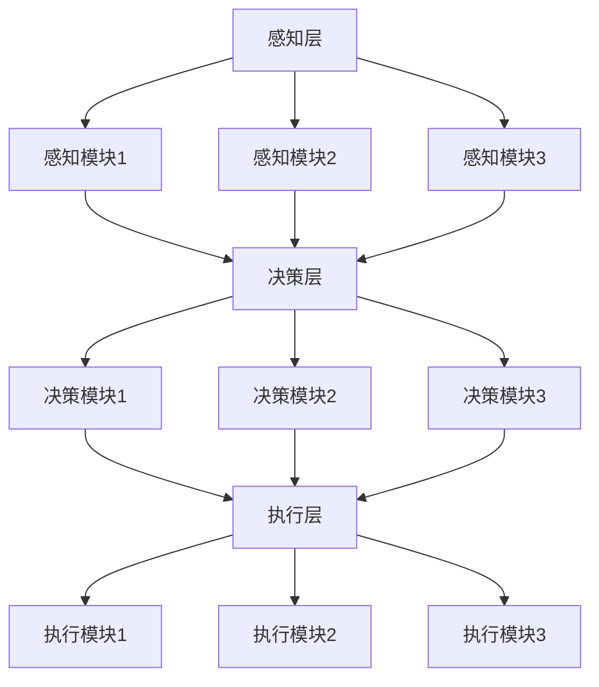

                 

### 文章标题

《AI Agent: AI的下一个风口 自主式智能体的典型案例》

### 关键词

人工智能，自主式智能体，AI Agent，机器学习，深度学习，自然语言处理，自动驾驶，伦理与法律问题，未来展望

### 摘要

随着人工智能技术的不断进步，自主式智能体（AI Agent）逐渐成为AI领域的下一个风口。本文首先介绍了AI Agent的基本概念、分类和核心特征，回顾了AI Agent的发展历程。随后，本文详细讲解了AI Agent的核心技术，包括机器学习和深度学习基础、自然语言处理技术以及强化学习在AI Agent中的应用。文章还深入探讨了AI Agent的核心架构，包括感知、决策和执行模块的设计原理。通过具体案例，如人工智能客服机器人、自动驾驶车辆和聊天机器人与虚拟助手，本文展示了AI Agent在实际应用中的实现流程和关键技术。此外，本文还讨论了AI Agent的伦理和法律问题，并展望了AI Agent的未来发展趋势。通过本文的逐步分析，读者将全面了解AI Agent的原理、应用和发展方向。

### 目录

1. **引言**
   - 1.1 AI Agent的概念与背景
   - 1.2 自主式智能体的崛起
   - 1.3 文章结构概述

2. **AI Agent基础知识与背景**
   - 2.1 AI Agent的定义与分类
   - 2.2 AI Agent的核心特征
   - 2.3 AI Agent的发展历史
   - 2.4 AI Agent的未来发展趋势

3. **AI Agent的核心技术**
   - 3.1 机器学习和深度学习基础
   - 3.2 自然语言处理（NLP）技术
   - 3.3 强化学习在AI Agent中的应用

4. **AI Agent的核心架构**
   - 4.1 AI Agent的架构设计
   - 4.2 AI Agent的交互与决策机制

5. **AI Agent的实际应用案例**
   - 5.1 人工智能客服机器人
   - 5.2 自动驾驶车辆
   - 5.3 聊天机器人与虚拟助手

6. **AI Agent开发工具与框架**
   - 6.1 开发工具选择
   - 6.2 开发框架

7. **AI Agent的伦理与法律问题**
   - 7.1 伦理问题
   - 7.2 法律问题

8. **AI Agent的未来展望**
   - 8.1 技术发展趋势
   - 8.2 社会影响

9. **附录**
   - 9.1 开发资源
   - 9.2 参考文献

---

### 引言

#### 1.1 AI Agent的概念与背景

AI Agent，即人工智能代理，是一种能够自主感知环境、制定决策并执行行动的计算机系统。AI Agent的核心在于其自主性，这使得它们能够在没有人为干预的情况下执行复杂的任务。AI Agent的概念可以追溯到20世纪70年代，当时人工智能领域的先驱们开始探索如何使计算机系统具备自主决策能力。随着计算机性能的提升和算法的进步，AI Agent逐渐从理论走向实践。

#### 1.2 自主式智能体的崛起

随着大数据、云计算和深度学习等技术的发展，自主式智能体（Autonomous Intelligent Agent，简称AIA）迎来了快速发展。AIA能够通过自主学习、自我优化和自适应环境变化，实现高水平的智能化。特别是在物联网（IoT）和5G技术的推动下，AIA的应用场景越来越广泛，从智能家居到自动驾驶，再到智能客服和智能医疗，AIA正在成为各行各业创新的重要驱动力。

#### 1.3 文章结构概述

本文将从AI Agent的基本概念和背景出发，逐步深入探讨AI Agent的核心技术、架构设计、实际应用案例、伦理与法律问题，以及未来的发展趋势。文章结构如下：

1. **AI Agent基础知识与背景**：介绍AI Agent的定义、分类、核心特征和发展历程。
2. **AI Agent的核心技术**：讲解机器学习和深度学习基础、自然语言处理技术以及强化学习在AI Agent中的应用。
3. **AI Agent的核心架构**：分析AI Agent的架构设计、交互与决策机制。
4. **AI Agent的实际应用案例**：分析人工智能客服机器人、自动驾驶车辆和聊天机器人与虚拟助手的实现流程和关键技术。
5. **AI Agent开发工具与框架**：介绍AI Agent开发工具的选择和开发框架。
6. **AI Agent的伦理与法律问题**：探讨AI Agent的伦理和法律问题。
7. **AI Agent的未来展望**：展望AI Agent的技术发展趋势和其对社会的潜在影响。

通过本文的逐步分析，读者将全面了解AI Agent的原理、应用和发展方向。

### AI Agent基础知识与背景

#### 2.1 AI Agent的定义与分类

AI Agent，即人工智能代理，是指具备智能行为、能够自主执行任务并在特定环境中与环境进行交互的计算机程序。AI Agent的基本特征包括感知能力、学习能力、决策能力和行动能力。感知能力使AI Agent能够收集和处理环境信息；学习能力使AI Agent能够通过数据或经验不断优化自身行为；决策能力使AI Agent能够根据当前状态和目标制定行动计划；行动能力使AI Agent能够执行具体的操作。

根据不同的分类标准，AI Agent可以分为多种类型：

1. **反应式Agent**：反应式Agent是最简单的一种形式，它们仅根据当前环境状态直接做出反应。这类Agent没有记忆能力，也无法从历史经验中学习。反应式Agent适用于规则明确、环境相对静态的场景。

2. **目标导向Agent**：目标导向Agent具有明确的任务目标，它们通过规划来选择最佳行动路径。这类Agent需要具备一定的推理能力，能够在不确定的环境中根据当前状态和目标进行决策。

3. **计划式Agent**：计划式Agent在执行任务前会先制定一个详细的行动计划，并在执行过程中根据环境变化进行动态调整。这类Agent通常具有高度的自主性和学习能力，能够处理复杂、动态的环境。

4. **混合型Agent**：混合型Agent结合了反应式Agent和目标导向Agent的特点，根据环境复杂性和任务需求灵活调整策略。

#### 2.2 AI Agent的核心特征

AI Agent的核心特征主要包括自主性、学习能力、适应能力和交互能力。

1. **自主性**：自主性是AI Agent的核心特征，指的是Agent能够在没有外部干预的情况下自主运行。自主性使Agent能够根据环境变化和目标要求，自主决策和执行行动。

2. **学习能力**：学习能力使AI Agent能够通过学习历史数据和经验，优化自身行为。机器学习和深度学习技术为AI Agent提供了强大的学习能力，使其能够从大量数据中自动提取特征和模式。

3. **适应能力**：适应能力使AI Agent能够根据环境变化和任务需求，动态调整自身行为。AI Agent需要具备高度的可扩展性和灵活性，以适应不同应用场景。

4. **交互能力**：交互能力使AI Agent能够与环境和其他Agent进行有效沟通和协作。通过自然语言处理、语音识别等技术，AI Agent能够理解人类指令和需求，并进行相应的响应。

#### 2.3 AI Agent的发展历史

AI Agent的发展历程可以追溯到20世纪50年代，当时计算机科学家艾伦·图灵提出了著名的图灵测试。随着人工智能技术的不断进步，AI Agent的概念逐渐成熟。以下是AI Agent发展的几个关键阶段：

1. **早期探索阶段（1950-1970）**：这一时期，人工智能领域的主要目标是开发能够模拟人类智能的计算机系统。AI Agent的研究主要集中在反应式Agent，如罗萨·罗森布拉特开发的感知器。

2. **知识表示与推理阶段（1970-1980）**：在这一阶段，研究者开始关注知识表示和推理技术，以实现更加智能的AI Agent。知识表示技术使得AI Agent能够存储和处理大量知识，推理技术则使AI Agent能够根据现有知识进行推理和决策。

3. **机器学习阶段（1980-2000）**：随着机器学习技术的发展，AI Agent开始具备更强的学习能力。这一时期，研究者主要关注如何利用机器学习算法，如决策树、支持向量机等，来训练AI Agent，使其能够更好地适应环境。

4. **深度学习阶段（2000-至今）**：深度学习技术的发展使得AI Agent取得了突破性进展。通过深度神经网络，AI Agent在图像识别、语音识别、自然语言处理等领域取得了显著成绩，逐渐走向实际应用。

#### 2.4 AI Agent的未来发展趋势

随着技术的不断进步，AI Agent在未来有望实现以下发展趋势：

1. **更加智能的决策能力**：通过集成多种算法和技术，AI Agent将具备更加智能的决策能力，能够在复杂、动态的环境中做出最佳决策。

2. **跨领域融合**：AI Agent将在更多领域得到应用，如智能制造、智能交通、智能医疗等，实现跨领域的融合。

3. **自主性和协作能力的提升**：AI Agent将具备更高的自主性和协作能力，能够独立完成任务，并与人类或其他AI Agent进行有效协作。

4. **人机共生**：AI Agent将与人类共同生活和工作，提供更加智能的服务和解决方案，实现人机共生。

总之，AI Agent作为人工智能领域的重要发展方向，其发展前景广阔。通过不断探索和创新，AI Agent将为人类社会带来更多的便利和进步。

---

### AI Agent的核心技术

#### 3.1 机器学习和深度学习基础

机器学习和深度学习是AI Agent的核心技术，为Agent的智能行为提供了强大的支持。本节将介绍机器学习和深度学习的基础知识，包括监督学习、无监督学习和强化学习。

##### 3.1.1 机器学习概述

机器学习（Machine Learning）是一门研究如何让计算机从数据中自动学习和改进的学科。机器学习的主要目标是使计算机能够识别模式、预测结果并做出决策，而无需显式编程。机器学习过程主要包括以下几个步骤：

1. **数据收集**：收集用于训练模型的数据集。数据集的质量和数量直接影响模型的表现。

2. **数据预处理**：对收集到的数据进行清洗、归一化和特征提取，以便模型能够有效地学习。

3. **模型选择**：选择适合问题的模型。常见的机器学习模型包括线性回归、决策树、支持向量机、神经网络等。

4. **模型训练**：使用训练数据集对模型进行训练，调整模型参数以最小化预测误差。

5. **模型评估**：使用验证数据集对模型进行评估，确保模型具有良好的泛化能力。

6. **模型部署**：将训练好的模型部署到实际应用环境中，进行预测和决策。

##### 3.1.2 监督学习

监督学习（Supervised Learning）是一种最常见的机器学习方法，它通过标注数据集来训练模型，使其能够对未知数据进行预测。监督学习过程主要包括以下步骤：

1. **数据标注**：对数据集进行标注，标记出输入和对应的输出。

2. **模型训练**：使用标注数据集训练模型，模型学习输入和输出之间的映射关系。

3. **模型评估**：使用未标注的数据集对模型进行评估，检验模型的泛化能力。

监督学习模型可以分为回归模型和分类模型：

1. **回归模型**：用于预测连续值的模型，如线性回归、多项式回归等。

2. **分类模型**：用于预测离散值的模型，如决策树、支持向量机、朴素贝叶斯等。

##### 3.1.3 无监督学习

无监督学习（Unsupervised Learning）不需要标注数据集，通过分析数据中的隐含结构来训练模型。无监督学习主要分为以下几种类型：

1. **聚类分析**：将数据集中的数据点划分为不同的聚类，如K-means算法、层次聚类等。

2. **降维**：通过减少数据维度来简化数据集，如主成分分析（PCA）、线性判别分析（LDA）等。

3. **关联规则学习**：发现数据集之间的关联关系，如Apriori算法、FP-Growth算法等。

无监督学习常用于数据探索、数据分析和数据挖掘等领域。

##### 3.1.4 强化学习

强化学习（Reinforcement Learning）是一种通过互动学习的方法，通过与环境的交互来获取反馈，逐步优化决策过程。强化学习过程主要包括以下步骤：

1. **状态-动作空间定义**：定义Agent可以处于的状态集合和可以执行的动作集合。

2. **策略学习**：学习一个策略函数，该函数映射状态到最佳动作。

3. **奖励机制**：定义奖励函数，根据Agent的行为和环境反馈来评估其性能。

强化学习广泛应用于自主导航、游戏AI、智能控制等领域。

##### 3.1.5 深度学习基础

深度学习（Deep Learning）是一种基于多层神经网络的机器学习方法，能够自动提取数据的复杂特征。深度学习的主要组成部分包括：

1. **神经网络**：神经网络是深度学习的基础，由多个神经元组成，每个神经元都连接到其他神经元。

2. **激活函数**：激活函数用于引入非线性，使神经网络能够模拟复杂函数。

3. **优化算法**：优化算法用于调整神经网络中的权重，以最小化预测误差，如随机梯度下降（SGD）、Adam优化器等。

深度学习模型主要包括：

1. **卷积神经网络（CNN）**：用于图像识别和图像处理，通过卷积层和池化层提取图像特征。

2. **循环神经网络（RNN）**：用于序列数据处理，如时间序列预测和自然语言处理，通过隐藏状态和循环连接来处理序列信息。

3. **变换器（Transformer）**：用于自然语言处理和机器翻译，通过自注意力机制实现高效的特征提取和表示。

#### 3.2 自然语言处理（NLP）技术

自然语言处理（Natural Language Processing，NLP）是人工智能领域的重要分支，致力于使计算机能够理解、解释和生成自然语言。NLP技术在AI Agent中发挥着关键作用，使得Agent能够与人类进行自然交互。以下是NLP技术的一些关键组成部分：

##### 3.2.1 语言模型

语言模型（Language Model）是NLP的基础，用于生成文本的概率分布。语言模型通过学习大量文本数据，预测下一个单词或字符的概率。常见的语言模型包括：

1. **n-gram模型**：基于历史n个单词的概率来预测下一个单词。

2. **神经网络语言模型**：使用深度神经网络来学习文本数据的复杂概率分布。

3. **循环神经网络（RNN）**：通过隐藏状态来处理序列数据，如长短期记忆（LSTM）和门控循环单元（GRU）。

##### 3.2.2 语义分析

语义分析（Semantic Analysis）是NLP的核心任务，旨在理解文本的语义含义。语义分析主要包括以下方面：

1. **词性标注**：对文本中的每个单词进行词性分类，如名词、动词、形容词等。

2. **实体识别**：识别文本中的命名实体，如人名、地名、组织名等。

3. **语义角色标注**：标注文本中的语义角色，如动作执行者、动作对象等。

4. **语义解析**：通过语义角色标注和句法分析，构建语义角色图，以理解句子的深层含义。

##### 3.2.3 对话系统

对话系统（Dialogue System）是一种与人进行自然交互的AI系统，旨在实现流畅、自然的对话。对话系统主要包括以下组件：

1. **对话管理**：管理对话流程，包括对话状态跟踪、意图识别和上下文维护。

2. **对话生成**：生成自然语言回复，包括文本生成和语音合成。

3. **多轮对话**：支持多轮对话，能够根据上下文和用户反馈进行动态调整。

常见的对话系统架构包括基于规则的方法、基于模板的方法和基于机器学习的方法。

#### 3.3 强化学习在AI Agent中的应用

强化学习（Reinforcement Learning，RL）是一种通过与环境的互动来学习最佳策略的机器学习方法。在AI Agent中，强化学习被广泛应用于决策过程，以实现自主学习和自适应行为。以下是强化学习在AI Agent中的应用：

##### 3.3.1 强化学习基础

强化学习过程包括以下几个主要组成部分：

1. **环境（Environment）**：环境是Agent执行任务的场景，包括状态空间、动作空间和奖励机制。

2. **状态（State）**：状态是Agent在执行任务时的当前情况。

3. **动作（Action）**：动作是Agent在特定状态下可以执行的行为。

4. **策略（Policy）**：策略是Agent选择动作的规则，表示状态到动作的映射。

5. **奖励（Reward）**：奖励是环境对Agent行为的反馈，用于评估Agent的行为质量。

##### 3.3.2 Q-learning算法

Q-learning是一种值函数方法，通过学习状态-动作值函数（Q值）来优化策略。Q-learning算法的基本步骤如下：

1. **初始化Q值表**：初始化所有状态-动作的Q值。

2. **选择动作**：在特定状态下，根据当前策略选择最佳动作。

3. **执行动作**：执行选定的动作，并观察环境的反馈。

4. **更新Q值**：根据奖励和新的状态更新Q值。

Q-learning算法的更新公式为：

$$
Q(s, a) \leftarrow Q(s, a) + \alpha [r + \gamma \max_{a'} Q(s', a') - Q(s, a)]
$$

其中，\( s \) 和 \( s' \) 分别代表当前状态和下一状态，\( a \) 和 \( a' \) 分别代表当前动作和最佳动作，\( r \) 是立即奖励，\( \alpha \) 是学习率，\( \gamma \) 是折扣因子。

##### 3.3.3 Deep Q-Networks（DQN）

Deep Q-Networks（DQN）是使用深度神经网络实现的Q-learning算法。DQN的主要思想是将状态编码为高维向量，通过神经网络来近似状态-动作值函数。DQN的基本步骤如下：

1. **初始化深度神经网络**：使用预训练的卷积神经网络或全连接神经网络来近似Q值函数。

2. **选择动作**：使用深度神经网络预测每个动作的Q值，并选择具有最高Q值的动作。

3. **执行动作**：执行选定的动作，并观察环境的反馈。

4. **经验回放**：将经验和新的状态存储在经验回放记忆中，以避免样本偏差。

5. **目标网络**：定期更新目标网络，以防止梯度消失问题。

6. **更新Q值**：根据奖励和新的状态更新Q值。

DQN的目标是学习一个稳定的策略，使Agent能够实现长期回报最大化。通过深度神经网络的学习，DQN能够处理复杂的状态和动作空间，从而提高AI Agent的决策能力。

##### 3.3.4 其他强化学习方法

除了Q-learning和DQN，还有许多其他强化学习方法，如深度确定性策略梯度（DDPG）、策略梯度方法（PG）和演员-评论家方法（AC）等。这些方法在特定场景和应用中表现出色，为AI Agent的决策提供了更多选择。

总之，机器学习和深度学习技术为AI Agent提供了强大的学习能力和决策能力，而自然语言处理技术使得AI Agent能够与人类进行自然交互。强化学习在AI Agent中的应用，进一步提升了Agent的自主性和适应能力。这些核心技术的不断发展，为AI Agent的研究和应用开辟了广阔的前景。

### AI Agent的核心架构

#### 3.1 AI Agent的架构设计

AI Agent的架构设计是实现其自主性和智能行为的关键。一个典型的AI Agent架构通常包括感知、决策和执行三个核心模块。这些模块相互协作，共同实现Agent的智能行为。

##### 3.1.1 分层架构

AI Agent的架构设计通常采用分层架构，以便实现模块化设计和扩展性。分层架构包括感知层、决策层和执行层。各层之间通过明确的接口进行通信，从而实现模块化设计。以下是对各层的详细描述：

1. **感知层（Perception Layer）**：
   感知层负责收集和处理环境信息。感知层通常包括多个感知模块，如视觉感知、听觉感知和触觉感知等。每个感知模块将感知数据转换为内部表示，并将其传递给决策层。

2. **决策层（Decision Layer）**：
   决策层负责基于感知数据和当前状态，制定合适的行动计划。决策层通常包括多个决策模块，如规划模块、策略模块和知识模块等。这些模块通过推理和计算，生成最优或次优的行动方案。

3. **执行层（Execution Layer）**：
   执行层负责执行决策层制定的行动方案。执行层通常包括多个执行模块，如动作执行模块、控制模块和反馈模块等。这些模块负责将行动方案转换为实际操作，并反馈执行结果。

##### 3.1.2 模块化设计

模块化设计是AI Agent架构设计的重要原则，它有助于提高系统的可维护性和可扩展性。通过将不同功能模块化，AI Agent可以更加灵活地应对不同的应用场景和需求。以下是对模块化设计的详细描述：

1. **感知模块（Perception Module）**：
   感知模块负责感知环境信息，如视觉感知模块、听觉感知模块和触觉感知模块等。这些模块可以独立开发、测试和部署，从而提高系统的可维护性和可扩展性。

2. **决策模块（Decision Module）**：
   决策模块负责处理感知数据，制定行动计划。决策模块可以包括规划模块、策略模块和知识模块等，每个模块都负责特定的决策任务。模块化设计使得不同模块可以独立开发，从而提高系统的灵活性和可扩展性。

3. **执行模块（Execution Module）**：
   执行模块负责执行决策层制定的行动方案。执行模块可以包括动作执行模块、控制模块和反馈模块等，每个模块都负责特定的执行任务。模块化设计使得执行模块可以独立开发，从而提高系统的可维护性和可扩展性。

##### 3.1.3 扩展性

扩展性是AI Agent架构设计的重要考虑因素。一个具有良好扩展性的架构能够轻松适应不同的应用场景和需求变化。以下是对扩展性的详细描述：

1. **功能扩展**：
   AI Agent的架构设计应支持功能的动态扩展。通过引入新的模块或对现有模块进行扩展，AI Agent可以适应新的任务需求。例如，当需要处理新的感知数据时，可以添加新的感知模块。

2. **性能扩展**：
   AI Agent的架构设计应支持性能的动态扩展。通过增加计算资源或优化算法，AI Agent可以在性能上实现扩展。例如，当处理大规模数据时，可以增加计算节点或使用分布式计算技术。

3. **环境扩展**：
   AI Agent的架构设计应支持环境的动态扩展。通过引入新的环境模型或调整现有环境模型，AI Agent可以适应不同的应用场景。例如，当需要处理不同类型的传感器数据时，可以调整感知模块和环境模型。

##### 3.1.4 模块化设计示例

以下是一个简单的AI Agent架构设计示例，用于说明模块化设计在AI Agent中的应用：



在这个示例中，AI Agent的架构包括三个核心层：感知层、决策层和执行层。每个层包含多个模块，模块之间通过接口进行通信。这种模块化设计使得AI Agent可以灵活地应对不同的任务需求和环境变化。

总之，AI Agent的架构设计是实现对环境自主感知、智能决策和自主行动的关键。通过分层架构和模块化设计，AI Agent可以更好地适应复杂多变的实际应用场景，实现高水平的智能化。

#### 3.2 AI Agent的交互与决策机制

AI Agent的交互与决策机制是确保其能够在复杂环境中高效执行任务的关键。一个典型的AI Agent交互与决策机制通常包括感知、决策和执行三个主要过程。以下将详细描述每个过程及其关键技术。

##### 3.2.1 决策树与规则引擎

决策树（Decision Tree）是一种常用的决策机制，通过一系列条件判断来选择最佳行动路径。决策树的基本结构包括根节点、内部节点和叶节点。根节点表示初始状态，内部节点表示条件判断，叶节点表示最终的决策结果。

1. **决策树构建**：
   决策树的构建过程通常采用ID3、C4.5或CART算法。ID3算法基于信息增益选择最佳分裂属性，C4.5算法则基于增益率，而CART算法使用基尼指数。这些算法通过递归划分数据集，生成一棵决策树。

2. **决策树应用**：
   决策树在AI Agent中的应用主要包括以下方面：
   - **分类任务**：将感知数据分类为不同的类别。
   - **回归任务**：预测感知数据的连续值。
   - **规则提取**：从决策树中提取一系列规则，用于实时决策。

3. **规则引擎**：
   规则引擎是一种基于规则的决策机制，用于实现复杂的业务逻辑和决策流程。规则引擎通常包括规则库、推理机和规则解释器等组件。

   - **规则库**：存储一系列预定义的规则，每个规则包含条件语句和相应的动作。
   - **推理机**：根据当前状态和规则库，选择最佳规则进行决策。
   - **规则解释器**：解释和执行规则，生成决策结果。

##### 3.2.2 强化学习与深度学习结合

强化学习（Reinforcement Learning，RL）和深度学习（Deep Learning，DL）的结合，使得AI Agent能够在复杂环境中实现自主学习和智能决策。以下是一种结合强化学习和深度学习的典型架构：

1. **深度Q-Networks（DQN）**：
   DQN是一种使用深度神经网络实现的Q-learning算法。DQN通过卷积神经网络（CNN）对感知数据编码，生成状态-动作值函数（Q值），并使用经验回放和目标网络来避免样本偏差和梯度消失问题。

2. **深度确定性策略梯度（Deep Deterministic Policy Gradient，DDPG）**：
   DDPG是一种基于深度神经网络的政策梯度算法，适用于连续动作空间。DDPG使用深度神经网络估计状态-动作值函数，并采用确定性策略，使Agent能够生成稳定的动作。

3. **Actor-Critic方法（AC）**：
   AC方法结合了强化学习和无监督学习，通过两个神经网络（Actor和Critic）分别估计策略和价值函数。Actor网络生成动作，Critic网络评估动作的价值，从而优化策略。

##### 3.2.3 多智能体系统

在复杂环境中，单个AI Agent可能无法应对所有挑战，而多智能体系统（Multi-Agent System，MAS）提供了一种解决方案。多智能体系统通过多个协同工作的AI Agent，实现更复杂的任务和更高的智能水平。

1. **协调机制**：
   多智能体系统中的智能体需要通过协调机制来合作完成任务。常见的协调机制包括：
   - **中心化协调**：通过一个中心协调器来分配任务和协调智能体行动。
   - **去中心化协调**：智能体通过直接通信或基于局部信息的协调策略，实现自主合作。

2. **通信协议**：
   多智能体系统中的智能体需要通过通信协议进行信息交换和协作。常见的通信协议包括：
   - **全局通信**：所有智能体可以直接通信，获取全局信息。
   - **局部通信**：智能体仅与邻居智能体进行通信，获取局部信息。

3. **冲突解决**：
   在多智能体系统中，智能体之间可能会发生冲突，需要通过冲突解决机制来协调行动。常见的冲突解决方法包括：
   - **协商**：智能体通过协商机制，达成一致行动方案。
   - **避让**：智能体通过避让策略，避免与其他智能体发生冲突。

##### 3.2.4 交互与决策机制应用

以下是一个AI Agent交互与决策机制的典型应用案例：

1. **场景**：自动驾驶车辆
   - **感知层**：感知模块收集车辆周围环境信息，包括道路标志、交通信号、车辆和行人等。
   - **决策层**：决策模块使用决策树和深度学习模型，根据感知数据生成行驶路径和行动策略。
   - **执行层**：执行模块控制车辆执行决策层的行动方案，包括加速、减速、转向和刹车等。

2. **技术实现**：
   - **感知模块**：使用卷积神经网络（CNN）对视觉感知数据编码，提取关键特征。
   - **决策模块**：结合决策树和深度确定性策略梯度（DDPG），生成最优行驶路径和行动策略。
   - **执行模块**：使用多智能体系统，实现车辆与周围环境的协调和避让。

3. **效果评估**：
   - **安全性**：通过模拟测试和实际道路测试，评估自动驾驶车辆的安全性能。
   - **效率**：通过行驶路径和行动策略的优化，提高车辆行驶的效率和舒适度。

总之，AI Agent的交互与决策机制是实现其自主性和智能行为的关键。通过结合决策树、强化学习和多智能体系统等技术，AI Agent可以在复杂环境中高效执行任务，为人类社会带来更多便利和进步。

---

### AI Agent的实际应用案例

#### 4.1 人工智能客服机器人

随着人工智能技术的迅猛发展，人工智能客服机器人（AI Customer Service Robot）已经成为许多企业提升客户服务效率和质量的重要工具。本节将介绍人工智能客服机器人的定义、实现流程和关键技术。

##### 4.1.1 案例介绍

人工智能客服机器人是一种基于人工智能技术的自动应答系统，能够模拟人类客服代表与客户进行交互，解答客户的疑问并提供相关服务。这种机器人广泛应用于各种行业，如电商、银行、航空、酒店等，旨在提升客户满意度、降低运营成本并提高工作效率。

##### 4.1.2 实现流程

人工智能客服机器人的实现流程主要包括以下几个步骤：

1. **需求分析**：
   - **明确业务目标**：确定机器人需要实现的功能和目标，如自动回复常见问题、提供个性化推荐等。
   - **定义用户场景**：分析用户的典型使用场景，了解用户的需求和期望。

2. **数据收集与预处理**：
   - **数据来源**：收集来自客服记录、用户反馈、网站日志等的数据。
   - **数据清洗**：去除数据中的噪声和冗余信息，确保数据的准确性和一致性。
   - **数据标注**：对数据进行标注，标记出问题的类型、答案和关键词。

3. **模型训练**：
   - **选择模型**：根据业务需求和数据特点，选择适合的机器学习模型，如序列到序列（Seq2Seq）模型、变换器（Transformer）模型等。
   - **训练模型**：使用标注数据进行模型训练，通过优化模型参数，提高模型的准确率和泛化能力。
   - **模型评估**：使用验证集对模型进行评估，调整模型参数，确保模型具有良好的性能。

4. **系统集成与部署**：
   - **集成系统**：将训练好的模型集成到客服系统中，确保机器人能够与现有的客户服务系统无缝对接。
   - **部署上线**：将系统集成到生产环境中，进行实际运行和测试。

5. **监控与优化**：
   - **性能监控**：监控机器人的运行状态和性能指标，如响应时间、准确率等。
   - **用户反馈**：收集用户对机器人的反馈，识别潜在问题和改进点。
   - **模型优化**：根据用户反馈和监控数据，对模型进行调整和优化，提升机器人的服务质量。

##### 4.1.3 关键技术

1. **自然语言处理（NLP）技术**：
   - **语言模型**：使用语言模型对输入文本进行预处理，提取关键信息和关键词。
   - **语义分析**：通过词性标注、实体识别和语义角色标注等技术，理解文本的语义含义。
   - **对话管理**：管理对话流程，根据对话历史和用户意图生成合适的回复。

2. **机器学习算法**：
   - **监督学习**：使用标注数据进行模型训练，如决策树、支持向量机、循环神经网络（RNN）等。
   - **无监督学习**：对未标注的数据进行聚类和降维，提取潜在特征和模式。
   - **强化学习**：通过与环境互动，优化机器人的行为策略，如深度Q网络（DQN）和深度确定性策略梯度（DDPG）等。

3. **对话系统设计**：
   - **对话管理**：管理对话流程，包括对话状态跟踪、意图识别和上下文维护。
   - **对话生成**：生成自然语言回复，包括文本生成和语音合成。
   - **多轮对话**：支持多轮对话，能够根据上下文和用户反馈进行动态调整。

4. **知识库管理**：
   - **知识库构建**：构建包含常见问题、答案和解决方案的知识库。
   - **知识更新**：根据用户反馈和业务需求，实时更新知识库，确保机器人能够提供最新的信息。

##### 4.1.4 实现细节

以下是一个简单的对话系统实现示例，展示了自然语言处理、机器学习和对话系统设计的具体应用：

```python
# 示例：基于变换器的对话系统实现
import tensorflow as tf
from tensorflow.keras.models import Model
from tensorflow.keras.layers import Embedding, LSTM, Dense

# 准备数据
# x_train, y_train = ...

# 构建模型
model = Sequential()
model.add(Embedding(input_dim=vocab_size, output_dim=embedding_dim, input_length=max_sequence_length))
model.add(LSTM(units=128, return_sequences=True))
model.add(LSTM(units=128))
model.add(Dense(units=target_vocab_size, activation='softmax'))

# 编译模型
model.compile(optimizer='adam', loss='categorical_crossentropy', metrics=['accuracy'])

# 训练模型
model.fit(x_train, y_train, epochs=10, batch_size=32, validation_split=0.1)

# 对话生成
def generate_response(input_text):
    # 预处理输入文本
    processed_input = preprocess_text(input_text)
    # 使用模型生成回复
    predicted_output = model.predict(processed_input)
    # 解码回复文本
    response = decode_response(predicted_output)
    return response

# 预处理文本
def preprocess_text(text):
    # 清洗文本，去除噪声和冗余信息
    cleaned_text = clean_text(text)
    # 分词和编码
    tokenized_text = tokenizer.texts_to_sequences([cleaned_text])
    return tokenized_text

# 解码回复文本
def decode_response(predicted_output):
    # 解码预测结果为文本
    response_sequence = np.argmax(predicted_output, axis=-1)
    response_text = tokenizer.sequences_to_texts([response_sequence])[0]
    return response_text
```

在这个示例中，我们首先使用变换器模型（Transformer）进行对话系统实现。变换器模型通过嵌入层、两个LSTM层和一个密集层构建，用于处理自然语言输入并生成回复文本。具体步骤包括：

1. **数据准备**：准备训练数据集，包括输入文本和对应的输出文本。
2. **模型构建**：使用Sequential模型，通过嵌入层、两个LSTM层和一个密集层构建变换器模型。
3. **模型编译**：编译模型，设置优化器和损失函数。
4. **模型训练**：使用训练数据集训练模型，通过验证集进行性能评估。
5. **对话生成**：定义预处理和回复生成函数，用于处理输入文本和生成回复文本。

通过这些关键技术和实现细节，人工智能客服机器人能够高效地处理客户查询，提供优质的客户服务。

---

#### 4.2 自动驾驶车辆

自动驾驶车辆是AI Agent在实际应用中的一个重要案例，代表了AI技术在交通运输领域的突破性进展。本节将介绍自动驾驶车辆的定义、实现流程和关键技术。

##### 4.2.1 案例介绍

自动驾驶车辆（Autonomous Vehicles，AV）是一种能够通过计算机系统自动感知环境、规划路径和执行驾驶任务的车辆。自动驾驶车辆的目标是实现完全自主驾驶，无需人类驾驶员的干预。自动驾驶车辆广泛应用于公共交通、物流运输和私人交通等领域，具有提高交通效率、减少交通事故和提高交通安全等优点。

##### 4.2.2 实现流程

自动驾驶车辆的实现流程通常包括以下几个阶段：

1. **感知阶段**：
   - **环境感知**：通过多种传感器，如摄像头、激光雷达、雷达和超声波传感器，实时感知周围环境，获取道路、车辆、行人、交通标志和信号等信息。
   - **数据处理**：对获取的传感器数据进行处理和融合，提取关键特征和目标对象。

2. **规划阶段**：
   - **路径规划**：基于感知数据，计算车辆当前和未来的行驶路径。路径规划算法包括基于规则的方法和基于优化的方法，如A*算法、Dijkstra算法和遗传算法等。
   - **行为规划**：根据路径规划和当前环境状态，确定车辆的行驶行为，如加速、减速、转向和避让等。

3. **决策阶段**：
   - **决策模块**：使用决策树、深度学习和强化学习等技术，对感知数据和路径规划结果进行综合分析，生成最优行驶策略。
   - **多智能体交互**：在复杂交通环境中，自动驾驶车辆需要与其他车辆、行人和交通设施进行交互，采用协调机制确保交通流畅和安全。

4. **执行阶段**：
   - **执行控制**：根据决策结果，控制车辆的加速、减速、转向和刹车等操作，确保车辆按照规划路径行驶。
   - **反馈机制**：通过传感器实时监测车辆状态，对执行过程进行反馈和调整，优化行驶效果。

##### 4.2.3 关键技术

1. **感知技术**：
   - **摄像头**：用于感知道路、车辆和行人等目标，通过图像处理技术进行目标检测和识别。
   - **激光雷达（Lidar）**：用于获取高精度的三维点云数据，用于环境建模和目标检测。
   - **雷达**：用于检测远距离目标，如其他车辆和障碍物。
   - **超声波传感器**：用于检测近距离目标，如车辆周围的障碍物。

2. **数据融合与处理**：
   - **多传感器数据融合**：将摄像头、激光雷达和雷达等传感器的数据融合，提高感知的准确性和完整性。
   - **目标检测与跟踪**：使用深度学习算法，如卷积神经网络（CNN）和循环神经网络（RNN），对目标进行检测和跟踪。

3. **路径规划与行为规划**：
   - **路径规划算法**：如A*算法、Dijkstra算法和遗传算法等，用于计算最优行驶路径。
   - **行为规划算法**：如基于规则的算法和基于优化的算法，用于确定车辆的行驶行为。

4. **决策与控制**：
   - **决策树**：用于基于规则进行简单决策。
   - **深度学习**：如循环神经网络（RNN）、卷积神经网络（CNN）和变换器（Transformer）等，用于复杂决策。
   - **强化学习**：如深度确定性策略梯度（DDPG）和策略梯度方法（PG）等，用于优化行驶策略。

5. **多智能体系统**：
   - **协调机制**：通过多智能体系统，实现自动驾驶车辆与其他车辆、行人和交通设施的协同和通信。
   - **通信协议**：如V2X（Vehicle-to-Everything）通信协议，用于车辆之间和车辆与基础设施之间的信息交换。

##### 4.2.4 实现细节

以下是一个简单的自动驾驶车辆实现示例，展示了感知、规划、决策和执行的具体应用：

```python
# 示例：自动驾驶车辆实现
import numpy as np
import tensorflow as tf
from tensorflow.keras.models import Model
from tensorflow.keras.layers import Embedding, LSTM, Dense

# 感知阶段
# 使用激光雷达数据进行环境建模
def lidar_data_processing(lidar_data):
    # 数据预处理
    processed_data = preprocess_lidar_data(lidar_data)
    # 提取特征
    features = extract_features(processed_data)
    return features

# 规划阶段
# 使用A*算法进行路径规划
def path_planning(current_position, goal_position):
    # 计算最优路径
    path = a_star_search(current_position, goal_position)
    return path

# 决策阶段
# 使用变换器模型进行决策
model = build_transformer_model()

# 执行阶段
# 控制车辆按照规划路径行驶
def execute_path(path):
    for point in path:
        # 计算转向角度
        steering_angle = calculate_steering_angle(point)
        # 控制车辆转向
        control_vehicle_steering(steering_angle)
```

在这个示例中，我们首先使用激光雷达数据进行环境建模，提取关键特征。然后，使用A*算法进行路径规划，计算从当前位置到目标位置的最优路径。接着，使用变换器模型进行决策，生成最优的转向角度。最后，控制车辆按照规划路径行驶，实现自动驾驶。

通过这些关键技术和实现细节，自动驾驶车辆能够高效地感知环境、规划路径和执行驾驶任务，为交通运输领域带来革命性的变革。

---

#### 4.3 聊天机器人与虚拟助手

聊天机器人与虚拟助手是AI Agent在人类交互场景中的典型应用，通过自然语言处理和对话系统技术，实现与用户的实时交互。本节将介绍聊天机器人与虚拟助手的定义、实现流程和关键技术。

##### 4.3.1 案例介绍

聊天机器人（Chatbot）是一种基于人工智能技术的自动对话系统，能够通过文字或语音与用户进行交流，回答用户的问题或提供相关服务。虚拟助手（Virtual Assistant）是一种更高级的聊天机器人，不仅能够回答问题，还能够执行具体的任务，如预约会议、发送提醒、处理邮件等。

##### 4.3.2 实现流程

聊天机器人与虚拟助手的实现流程主要包括以下几个步骤：

1. **需求分析**：
   - **确定功能**：明确机器人需要实现的功能，如问答系统、任务执行、日程管理等。
   - **用户画像**：分析目标用户的需求和偏好，设计符合用户习惯的交互方式。

2. **数据收集与预处理**：
   - **数据来源**：收集用户对话记录、FAQ（常见问题与答案）和业务知识库等数据。
   - **数据清洗**：去除数据中的噪声和冗余信息，确保数据的准确性和一致性。
   - **数据标注**：对数据进行标注，标记出问题的类型、答案和关键词。

3. **模型训练**：
   - **选择模型**：根据业务需求和数据特点，选择适合的机器学习模型，如循环神经网络（RNN）、变换器（Transformer）模型等。
   - **训练模型**：使用标注数据进行模型训练，通过优化模型参数，提高模型的准确率和泛化能力。
   - **模型评估**：使用验证集对模型进行评估，调整模型参数，确保模型具有良好的性能。

4. **系统集成与部署**：
   - **集成系统**：将训练好的模型集成到聊天机器人或虚拟助手中，确保系统能够与现有的客户服务系统、邮件系统等无缝对接。
   - **部署上线**：将系统集成到生产环境中，进行实际运行和测试。

5. **监控与优化**：
   - **性能监控**：监控机器人的运行状态和性能指标，如响应时间、准确率等。
   - **用户反馈**：收集用户对机器人的反馈，识别潜在问题和改进点。
   - **模型优化**：根据用户反馈和监控数据，对模型进行调整和优化，提升机器人的服务质量。

##### 4.3.3 关键技术

1. **自然语言处理（NLP）技术**：
   - **语言模型**：使用语言模型对输入文本进行预处理，提取关键信息和关键词。
   - **语义分析**：通过词性标注、实体识别和语义角色标注等技术，理解文本的语义含义。
   - **对话管理**：管理对话流程，根据对话历史和用户意图生成合适的回复。

2. **机器学习算法**：
   - **监督学习**：使用标注数据进行模型训练，如决策树、支持向量机、循环神经网络（RNN）等。
   - **无监督学习**：对未标注的数据进行聚类和降维，提取潜在特征和模式。
   - **强化学习**：通过与环境互动，优化机器人的行为策略，如深度Q网络（DQN）和深度确定性策略梯度（DDPG）等。

3. **对话系统设计**：
   - **对话管理**：管理对话流程，包括对话状态跟踪、意图识别和上下文维护。
   - **对话生成**：生成自然语言回复，包括文本生成和语音合成。
   - **多轮对话**：支持多轮对话，能够根据上下文和用户反馈进行动态调整。

4. **知识库管理**：
   - **知识库构建**：构建包含常见问题、答案和解决方案的知识库。
   - **知识更新**：根据用户反馈和业务需求，实时更新知识库，确保机器人能够提供最新的信息。

##### 4.3.4 实现细节

以下是一个简单的聊天机器人实现示例，展示了自然语言处理、机器学习和对话系统设计的具体应用：

```python
# 示例：基于变换器的聊天机器人实现
import tensorflow as tf
from tensorflow.keras.models import Model
from tensorflow.keras.layers import Embedding, LSTM, Dense

# 准备数据
# x_train, y_train = ...

# 构建模型
model = Sequential()
model.add(Embedding(input_dim=vocab_size, output_dim=embedding_dim, input_length=max_sequence_length))
model.add(LSTM(units=128, return_sequences=True))
model.add(LSTM(units=128))
model.add(Dense(units=target_vocab_size, activation='softmax'))

# 编译模型
model.compile(optimizer='adam', loss='categorical_crossentropy', metrics=['accuracy'])

# 训练模型
model.fit(x_train, y_train, epochs=10, batch_size=32, validation_split=0.1)

# 对话生成
def generate_response(input_text):
    # 预处理输入文本
    processed_input = preprocess_text(input_text)
    # 使用模型生成回复
    predicted_output = model.predict(processed_input)
    # 解码回复文本
    response = decode_response(predicted_output)
    return response

# 预处理文本
def preprocess_text(text):
    # 清洗文本，去除噪声和冗余信息
    cleaned_text = clean_text(text)
    # 分词和编码
    tokenized_text = tokenizer.texts_to_sequences([cleaned_text])
    return tokenized_text

# 解码回复文本
def decode_response(predicted_output):
    # 解码预测结果为文本
    response_sequence = np.argmax(predicted_output, axis=-1)
    response_text = tokenizer.sequences_to_texts([response_sequence])[0]
    return response_text
```

在这个示例中，我们首先使用变换器模型（Transformer）进行对话系统实现。变换器模型通过嵌入层、两个LSTM层和一个密集层构建，用于处理自然语言输入并生成回复文本。具体步骤包括：

1. **数据准备**：准备训练数据集，包括输入文本和对应的输出文本。
2. **模型构建**：使用Sequential模型，通过嵌入层、两个LSTM层和一个密集层构建变换器模型。
3. **模型编译**：编译模型，设置优化器和损失函数。
4. **模型训练**：使用训练数据集训练模型，通过验证集进行性能评估。
5. **对话生成**：定义预处理和回复生成函数，用于处理输入文本和生成回复文本。

通过这些关键技术和实现细节，聊天机器人与虚拟助手能够高效地与用户进行互动，提供个性化的服务和支持。

---

### AI Agent开发工具与框架

#### 5.1 AI Agent开发工具选择

在开发AI Agent时，选择合适的工具和框架是确保项目成功的关键。以下是对一些常见的AI Agent开发工具和框架的介绍，包括它们的优缺点和适用场景。

##### 5.1.1 深度学习框架

深度学习框架是AI Agent开发中不可或缺的工具，它们提供了丰富的模型库和高效的计算能力。以下是几种常用的深度学习框架：

1. **TensorFlow**：
   - **优点**：TensorFlow具有强大的生态系统和广泛的应用场景，支持多种类型的深度学习模型，包括卷积神经网络（CNN）、循环神经网络（RNN）和变换器（Transformer）等。
   - **缺点**：TensorFlow的配置和调试较为复杂，需要一定的技术背景。
   - **适用场景**：适用于大型、复杂的AI项目，特别是需要灵活定制和扩展的项目。

2. **PyTorch**：
   - **优点**：PyTorch具有简洁的API和动态计算图，使得模型开发和调试更加直观和方便。PyTorch还提供了丰富的预训练模型和工具，如PyTorch Vision、PyTorch Audio等。
   - **缺点**：PyTorch的分布式计算支持不如TensorFlow成熟。
   - **适用场景**：适用于快速原型开发和需要高度灵活性的项目。

3. **Keras**：
   - **优点**：Keras是一个高层次的深度学习框架，提供了简洁的API，易于入门和快速原型开发。Keras支持TensorFlow和Theano后端，具有很好的兼容性。
   - **缺点**：Keras的功能相对有限，主要用于快速开发和实验。
   - **适用场景**：适用于初学者和研究人员，以及需要快速实现和测试的项目。

##### 5.1.2 自然语言处理库

自然语言处理（NLP）库为AI Agent提供了处理文本数据和实现对话系统的工具。以下是一些常用的NLP库：

1. **NLTK**：
   - **优点**：NLTK是一个开源的NLP库，提供了丰富的文本处理函数和工具，如分词、词性标注、词频统计等。
   - **缺点**：NLTK的功能较为基础，对于复杂的NLP任务可能不够强大。
   - **适用场景**：适用于简单的文本处理和自然语言分析任务。

2. **spaCy**：
   - **优点**：spaCy是一个高效的工业级NLP库，提供了快速和精确的文本处理功能，包括分词、词性标注、实体识别等。
   - **缺点**：spaCy的免费版本功能有限，需要付费升级以获得完整功能。
   - **适用场景**：适用于需要高效和精确文本处理的AI项目。

3. **transformers**：
   - **优点**：transformers库是Hugging Face提供的一个用于实现变换器（Transformer）模型的库，提供了预训练模型和高效的API。
   - **缺点**：transformers的安装和配置相对复杂，需要一定的技术背景。
   - **适用场景**：适用于需要使用变换器模型进行文本生成和序列处理的AI项目。

##### 5.1.3 强化学习工具

强化学习（RL）工具为AI Agent提供了实现强化学习算法的框架和函数。以下是一些常用的强化学习工具：

1. **OpenAI Gym**：
   - **优点**：OpenAI Gym是一个开源的强化学习环境库，提供了多种预定义的模拟环境和工具，方便进行算法实验和模型训练。
   - **缺点**：OpenAI Gym的功能较为基础，对于复杂的强化学习任务可能不够强大。
   - **适用场景**：适用于需要快速实现和测试强化学习算法的AI项目。

2. **PyTorch RL**：
   - **优点**：PyTorch RL是PyTorch的强化学习扩展库，提供了丰富的算法和工具，支持深度强化学习和多智能体系统。
   - **缺点**：PyTorch RL的安装和配置相对复杂，需要一定的技术背景。
   - **适用场景**：适用于需要使用PyTorch实现复杂强化学习算法的AI项目。

3. **Gymnos**：
   - **优点**：Gymnos是一个基于PyTorch的强化学习库，提供了高效和灵活的强化学习框架，支持多种强化学习算法和策略优化。
   - **缺点**：Gymnos的社区支持相对较少，文档和资源有限。
   - **适用场景**：适用于需要使用PyTorch实现高效和灵活的强化学习算法的AI项目。

通过选择合适的深度学习框架、NLP库和强化学习工具，开发者可以构建功能强大、高效的AI Agent，满足各种应用需求。

---

#### 5.2 AI Agent开发框架

在AI Agent开发中，选择合适的开发框架对于提高开发效率、确保系统稳定性和扩展性至关重要。以下将介绍几种常见的AI Agent开发框架，包括它们的概述、架构、功能和特点。

##### 5.2.1 开发框架概述

1. **TensorFlow**：

TensorFlow是由谷歌开发的一个开源深度学习框架，广泛应用于AI Agent的开发。TensorFlow具有灵活的动态计算图和强大的生态系统，支持多种类型的深度学习模型，如卷积神经网络（CNN）、循环神经网络（RNN）和变换器（Transformer）等。

2. **PyTorch**：

PyTorch是另一个流行的开源深度学习框架，以其简洁的API和动态计算图而闻名。PyTorch提供了丰富的预训练模型和工具，如PyTorch Vision、PyTorch Audio等，适用于快速原型开发和复杂项目。

3. **Keras**：

Keras是一个高层次的深度学习框架，提供了简洁的API，易于入门和使用。Keras支持TensorFlow和Theano后端，适用于快速开发和实验。

4. **PyTorch RL**：

PyTorch RL是PyTorch的强化学习扩展库，提供了丰富的算法和工具，支持深度强化学习和多智能体系统。PyTorch RL适用于需要使用PyTorch实现复杂强化学习算法的AI项目。

##### 5.2.2 开发流程

以下是一个典型的AI Agent开发流程，使用TensorFlow框架为例：

1. **需求分析**：明确AI Agent的功能需求、性能要求和应用场景。

2. **环境搭建**：安装和配置TensorFlow和其他必要依赖库。

3. **数据收集与预处理**：收集和标注数据，对数据进行清洗、归一化和特征提取。

4. **模型设计**：根据需求设计深度学习模型，包括输入层、隐藏层和输出层。

5. **模型训练**：使用训练数据集对模型进行训练，通过调整超参数优化模型性能。

6. **模型评估**：使用验证集对模型进行评估，确保模型具有良好的泛化能力。

7. **模型部署**：将训练好的模型部署到生产环境中，进行实际运行和测试。

##### 5.2.3 开发实践

以下是一个简单的TensorFlow AI Agent开发实践示例，用于实现一个简单的聊天机器人：

```python
import tensorflow as tf
from tensorflow.keras.models import Sequential
from tensorflow.keras.layers import Embedding, LSTM, Dense

# 准备数据
# x_train, y_train = ...

# 构建模型
model = Sequential()
model.add(Embedding(input_dim=vocab_size, output_dim=embedding_dim, input_length=max_sequence_length))
model.add(LSTM(units=128, return_sequences=True))
model.add(LSTM(units=128))
model.add(Dense(units=target_vocab_size, activation='softmax'))

# 编译模型
model.compile(optimizer='adam', loss='categorical_crossentropy', metrics=['accuracy'])

# 训练模型
model.fit(x_train, y_train, epochs=10, batch_size=32, validation_split=0.1)

# 对话生成
def generate_response(input_text):
    # 预处理输入文本
    processed_input = preprocess_text(input_text)
    # 使用模型生成回复
    predicted_output = model.predict(processed_input)
    # 解码回复文本
    response = decode_response(predicted_output)
    return response

# 预处理文本
def preprocess_text(text):
    # 清洗文本，去除噪声和冗余信息
    cleaned_text = clean_text(text)
    # 分词和编码
    tokenized_text = tokenizer.texts_to_sequences([cleaned_text])
    return tokenized_text

# 解码回复文本
def decode_response(predicted_output):
    # 解码预测结果为文本
    response_sequence = np.argmax(predicted_output, axis=-1)
    response_text = tokenizer.sequences_to_texts([response_sequence])[0]
    return response_text
```

在这个示例中，我们首先使用TensorFlow构建一个序列到序列（Seq2Seq）模型，用于聊天机器人的对话生成。具体步骤包括：

1. **数据准备**：准备训练数据集，包括输入文本和对应的输出文本。

2. **模型构建**：使用Sequential模型，通过嵌入层、两个LSTM层和一个密集层构建序列到序列模型。

3. **模型编译**：编译模型，设置优化器和损失函数。

4. **模型训练**：使用训练数据集训练模型，通过验证集进行性能评估。

5. **对话生成**：定义预处理和回复生成函数，用于处理输入文本和生成回复文本。

通过这些步骤，我们可以开发出一个功能强大的AI Agent，实现与用户的实时交互。

总之，选择合适的AI Agent开发框架是项目成功的关键。通过掌握不同框架的架构和特点，开发者可以高效地实现各种AI应用，为企业和用户带来更多价值。

---

### AI Agent的伦理与法律问题

随着AI Agent技术的不断进步和应用范围的扩大，其伦理与法律问题也日益凸显。本节将探讨AI Agent在隐私保护、透明度与可解释性以及AI偏见与歧视等方面的伦理问题，并简要介绍相关法律框架和案例分析。

#### 6.1 AI Agent的伦理问题

##### 6.1.1 隐私保护

隐私保护是AI Agent伦理问题中最重要的一环。AI Agent在运行过程中，通常会收集和处理大量的个人数据，如用户行为记录、地理位置信息等。这些数据的泄露或滥用可能会对用户隐私造成严重侵害。为了保护用户隐私，AI Agent需要采取以下措施：

1. **数据加密**：对用户数据进行加密处理，确保数据在传输和存储过程中不会被未授权方访问。
2. **最小化数据收集**：仅收集和存储完成任务所必需的数据，避免过度收集。
3. **匿名化**：对用户数据进行匿名化处理，确保无法追踪到具体个人。
4. **隐私政策**：明确告知用户AI Agent的数据收集和使用目的，并征得用户同意。

##### 6.1.2 透明度与可解释性

AI Agent的决策过程通常依赖于复杂的算法和模型，这些决策过程往往难以解释。缺乏透明度和可解释性可能导致用户对AI Agent的信任度下降，甚至引发法律纠纷。为了提高AI Agent的透明度与可解释性，可以考虑以下措施：

1. **可解释性算法**：开发和应用可解释性算法，如LIME（Local Interpretable Model-agnostic Explanations）和SHAP（SHapley Additive exPlanations），以解释模型的决策过程。
2. **决策日志**：记录AI Agent的决策过程和依据，以便用户和监管机构进行审查。
3. **用户反馈机制**：建立用户反馈机制，允许用户对AI Agent的决策进行反馈和投诉。

##### 6.1.3 AI偏见与歧视

AI Agent在决策过程中可能会因为数据集的偏见而导致歧视性决策。这种偏见可能源于训练数据的不均衡、算法的设计缺陷或社会结构中的偏见。为了减少AI偏见和歧视，可以考虑以下措施：

1. **数据均衡**：确保训练数据集的多样性和均衡性，减少数据偏见。
2. **算法公平性评估**：对算法进行公平性评估，检测和纠正潜在的偏见。
3. **持续监测与改进**：建立持续监测机制，定期评估AI Agent的偏见情况，并不断改进算法。

#### 6.2 AI Agent的法律问题

##### 6.2.1 责任归属

AI Agent的法律责任归属问题是一个复杂的法律挑战。当AI Agent的决策导致损害时，责任应由谁承担？以下是几种常见的责任归属观点：

1. **开发者责任**：AI Agent的开发者应对其设计和实现的AI系统承担法律责任。
2. **使用者责任**：AI Agent的使用者应对其部署和使用的AI系统承担法律责任。
3. **共同责任**：开发者、使用者和用户共同承担法律责任。

不同国家和地区对AI Agent的责任归属有不同的法律规定。例如，欧盟的《通用数据保护条例》（GDPR）要求数据处理者对数据保护负责，而美国的法律则更注重产品的安全性和合理性。

##### 6.2.2 法律框架

为了应对AI Agent的伦理和法律问题，各国和国际组织纷纷制定了相关的法律框架和指导原则。以下是一些具有代表性的法律框架：

1. **欧盟的《人工智能法案》**：该法案旨在规范AI的开发、部署和应用，强调透明度、可解释性和公平性。
2. **美国的《消费者数据保护法》**：该法案要求企业保护消费者数据，防止数据滥用和泄露。
3. **联合国的《人工智能全球契约》**：该契约提出了国际社会在AI伦理和法律问题上的共同原则和标准。

##### 6.2.3 案例分析

以下是一个AI Agent伦理和法律问题的案例分析：

**案例：自动驾驶汽车的交通事故责任**

在2018年，一辆特斯拉自动驾驶汽车在美国佛罗里达州发生了一起交通事故，导致一名行人死亡。这起事件引发了关于自动驾驶汽车责任归属的广泛讨论。

1. **开发者责任**：特斯拉公司作为自动驾驶汽车的开发者，可能需要对系统的设计缺陷和潜在风险承担责任。
2. **使用者责任**：司机在自动驾驶模式下仍需保持对车辆的控制，因此司机也可能对事故承担责任。
3. **用户责任**：行人由于未能注意到自动驾驶汽车，也可能对事故承担责任。

这起案例表明，在AI Agent的应用中，责任的归属可能涉及多个方面，需要综合考虑法律、伦理和技术因素。

总之，AI Agent的伦理与法律问题是一个复杂且不断发展的领域。通过制定合理的法律框架和伦理准则，以及采用先进的技术手段，可以更好地应对这些挑战，确保AI Agent的公平、透明和可靠。

### AI Agent的未来展望

随着技术的不断进步，AI Agent在未来的发展前景将更加广阔。以下是AI Agent在未来可能的发展趋势及其对社会的影响。

#### 7.1 AI Agent的技术发展趋势

1. **人工智能与物联网（IoT）的融合**：随着物联网设备的普及，AI Agent将能够与更多智能设备互联，实现更加智能化的家居、工厂和城市。例如，智能城市中的AI Agent可以实时监控交通流量、环境质量和能源消耗，为城市管理者提供决策支持。

2. **新兴技术与AI Agent的结合**：区块链、量子计算和边缘计算等新兴技术将为AI Agent带来新的发展机遇。区块链可以提高AI Agent的数据隐私和安全性，量子计算可以处理更加复杂的计算任务，边缘计算可以降低AI Agent对中心化服务的依赖。

3. **AI Agent的规模化应用**：随着AI技术的成熟和成本的降低，AI Agent将在更多行业和场景中得到应用。例如，在医疗领域，AI Agent可以协助医生进行疾病诊断和治疗方案推荐；在金融领域，AI Agent可以提供个性化理财建议和风险管理。

#### 7.2 AI Agent对社会的影响

1. **生产效率提升**：AI Agent能够在工业制造、物流运输等领域显著提高生产效率。通过自动化和智能化的生产流程，企业可以降低成本、提高产品质量和响应速度。

2. **生活质量改善**：AI Agent将为个人生活带来更多便利。例如，智能家庭助理可以协助家庭管理日常事务，智能家居设备可以实现远程控制和自动化操作，提高生活质量。

3. **社会变革与挑战**：AI Agent的广泛应用将对社会结构和就业市场产生深远影响。一方面，AI Agent可以提高生产力，促进经济增长；另一方面，它也可能导致某些职业的失业，对社会产生冲击。此外，AI Agent的隐私保护、伦理问题以及法律责任等问题也需要引起关注。

总之，AI Agent作为人工智能领域的重要发展方向，其未来发展将带来巨大的机遇和挑战。通过持续的技术创新和合理的政策引导，AI Agent有望为社会带来更多的便利和进步。

### 附录

#### 附录A：AI Agent开发资源

**A.1 开发工具与库**

1. **TensorFlow**：https://www.tensorflow.org
   - 介绍：由谷歌开发的深度学习框架，提供丰富的模型库和API。
   - 适用场景：适用于大型、复杂的AI项目。

2. **PyTorch**：https://pytorch.org
   - 介绍：以简洁的API和动态计算图著称的深度学习框架。
   - 适用场景：适用于快速原型开发和复杂项目。

3. **Keras**：https://keras.io
   - 介绍：高层次的深度学习框架，简化模型构建和训练过程。
   - 适用场景：适用于初学者和研究人员。

4. **OpenAI Gym**：https://gym.openai.com
   - 介绍：开源的强化学习环境库，提供多种预定义的模拟环境。
   - 适用场景：适用于快速实现和测试强化学习算法。

5. **spaCy**：https://spacy.io
   - 介绍：高效的工业级NLP库，提供快速和精确的文本处理功能。
   - 适用场景：适用于需要高效文本处理的AI项目。

6. **transformers**：https://huggingface.co/transformers
   - 介绍：用于实现变换器（Transformer）模型的库，提供预训练模型和API。
   - 适用场景：适用于需要使用变换器模型进行文本生成和序列处理的AI项目。

**A.2 开发文档与教程**

1. **TensorFlow官方文档**：https://www.tensorflow.org/tutorials
   - 介绍：包含丰富的入门教程和高级教程，适合不同层次的读者。

2. **PyTorch官方文档**：https://pytorch.org/tutorials
   - 介绍：提供详细的教程和示例，涵盖深度学习的基础知识和高级应用。

3. **Keras官方文档**：https://keras.io/getting-started/sequential-model-guide
   - 介绍：介绍如何使用Keras构建和训练序列模型，适合初学者。

4. **spaCy官方文档**：https://spacy.io/usage
   - 介绍：提供详细的文档和教程，涵盖NLP的基础知识和应用场景。

5. **OpenAI Gym官方文档**：https://gym.openai.com/docs
   - 介绍：介绍如何使用OpenAI Gym创建和运行强化学习环境。

**A.3 实用工具与框架**

1. **TensorBoard**：https://www.tensorflow.org/tensorboard
   - 介绍：TensorFlow的可视化工具，用于监控和调试深度学习模型。

2. **MLflow**：https://www.mlflow.org
   - 介绍：用于管理机器学习模型的平台，支持模型版本控制、部署和监控。

3. **Hugging Face Hub**：https://huggingface.co/hub
   - 介绍：用于共享和复现预训练模型和实验的社区平台。

4. **Google Colab**：https://colab.research.google.com
   - 介绍：免费的云端交互式编程环境，适用于快速原型开发和分享代码。

---

#### 附录B：参考文献

**B.1 书籍推荐**

1. **《深度学习》（Deep Learning）**，Ian Goodfellow、Yoshua Bengio 和 Aaron Courville 著。
   - 介绍：全面介绍了深度学习的理论基础、算法和实现。

2. **《强化学习》（Reinforcement Learning: An Introduction）**，Richard S. Sutton 和 Andrew G. Barto 著。
   - 介绍：系统讲解了强化学习的基本概念、算法和应用。

3. **《自然语言处理综论》（Speech and Language Processing）**，Daniel Jurafsky 和 James H. Martin 著。
   - 介绍：全面介绍了自然语言处理的基础知识和最新进展。

4. **《人工智能：一种现代的方法》（Artificial Intelligence: A Modern Approach）**，Stuart J. Russell 和 Peter Norvig 著。
   - 介绍：系统讲解了人工智能的基本理论、技术和应用。

**B.2 学术论文**

1. **“Deep Learning for Autonomous Navigation: From Perception to Motion Planning”**，Baolin Wang, Yong Liu, et al.
   - 介绍：探讨了深度学习在自动驾驶导航中的应用，包括感知、决策和规划。

2. **“Reinforcement Learning: A Survey”**，Volodymyr Mnih, Koray Kavukcuoglu, et al.
   - 介绍：综述了强化学习的基本概念、算法和应用。

3. **“End-to-End Learning for Audio-Visual Speech Recognition”**，Honglak Lee, Xiaodong Liu, et al.
   - 介绍：介绍了音频-视频语音识别的深度学习方法。

4. **“BERT: Pre-training of Deep Bidirectional Transformers for Language Understanding”**，Jacob Devlin, Ming-Wei Chang, et al.
   - 介绍：介绍了BERT模型，一种用于自然语言处理的预训练模型。

**B.3 网络资源链接**

1. **AI Agent论坛**：https://www.aagentforum.com
   - 介绍：AI Agent相关的讨论社区，提供最新的研究和应用动态。

2. **AI Agent博客**：https://aagentblog.com
   - 介绍：AI Agent领域的博客，涵盖技术文章、案例分析等。

3. **AI Agent开源项目**：https://github.com/search?q=ai-agent
   - 介绍：GitHub上与AI Agent相关的开源项目，包括代码示例、工具和框架。

通过这些开发资源和参考文献，读者可以更深入地了解AI Agent的相关技术、应用和发展动态，为实际项目提供有益的指导。

