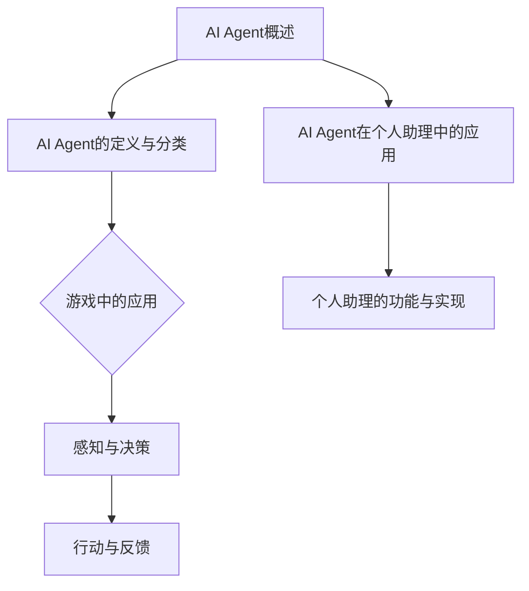

                 


# 《AI Agent在游戏与个人助理中的应用》

> 关键词：AI Agent，游戏AI，个人助理AI，强化学习，自然语言处理，机器学习

> 摘要：本文深入探讨了AI Agent在游戏与个人助理中的应用。首先介绍了AI Agent的基础概念、工作原理及其在游戏与个人助理中的应用。接着，详细分析了游戏AI的基本原理、个人助理AI的基础概念与实现技术，并通过实际案例展示了其应用。最后，探讨了AI Agent在游戏与个人助理中的综合应用，以及其未来发展趋势。

## 目录大纲

1. 《AI Agent在游戏与个人助理中的应用》
2. 第一部分：AI Agent基础
    - 第1章：AI Agent概述
        - 1.1 AI Agent的定义与分类
        - 1.2 AI Agent的工作原理
        - 1.3 AI Agent在游戏中的应用
        - 1.4 AI Agent在个人助理中的应用
3. 第二部分：AI Agent在游戏中的应用
    - 第2章：游戏AI的基本原理
        - 2.1 游戏AI的基础技术
        - 2.2 游戏AI的核心算法
        - 2.3 游戏AI的实战案例
4. 第三部分：AI Agent在个人助理中的应用
    - 第3章：个人助理AI的基础概念
    - 第4章：个人助理AI的实现技术
    - 第5章：个人助理AI的实战案例
5. 第四部分：AI Agent综合应用案例
    - 第6章：AI Agent在游戏与个人助理中的综合应用
6. 第五部分：AI Agent的未来发展趋势
    - 第7章：AI Agent在未来的发展
7. 附录
    - 附录A：常用AI Agent开发工具
    - 附录B：AI Agent开发指南
    - 附录C：AI Agent相关参考资料

---

## 第一部分：AI Agent基础

### 第1章：AI Agent概述

#### 1.1 AI Agent的定义与分类

AI Agent，即人工智能代理，是指能够感知环境、基于感知信息自主做出决策并执行相应动作的智能实体。AI Agent可以按照不同的分类标准进行划分。

- 按照能力分类：AI Agent可以分为弱AI Agent和强AI Agent。弱AI Agent是指只能在特定任务上表现出智能，而强AI Agent则具备与人类相似的广泛认知和智能。

- 按照决策方式分类：AI Agent可以分为基于规则的Agent和基于学习的Agent。基于规则的Agent通过预定义的规则进行决策，而基于学习的Agent则通过数据学习来自主决策。

#### 1.2 AI Agent的工作原理

AI Agent的工作原理主要包括感知、决策和行动三个环节。

- 感知：AI Agent通过传感器收集环境信息，如视觉、听觉、触觉等。

- 决策：AI Agent基于感知到的信息，通过算法进行决策。常见的决策算法包括基于规则的推理、基于学习的预测等。

- 行动：AI Agent根据决策结果执行相应的动作，如移动、执行任务等。

#### 1.3 AI Agent在游戏中的应用

在游戏中，AI Agent可以模拟玩家或其他角色，增强游戏的真实性和挑战性。AI Agent在游戏中的应用主要包括以下方面：

- 对抗性游戏：AI Agent作为对手，与玩家进行对抗，提高游戏的乐趣和挑战性。

- 合作性游戏：AI Agent作为队友，与玩家共同完成任务，提高游戏的互动性和协作性。

- 模拟游戏：AI Agent可以模拟真实的场景，如模拟驾驶、模拟建筑等，提高游戏的沉浸感。

#### 1.4 AI Agent在个人助理中的应用

在个人助理中，AI Agent可以提供智能服务，如语音识别、自然语言处理、任务管理等。AI Agent在个人助理中的应用主要包括以下方面：

- 语音助手：AI Agent可以通过语音识别和语音合成与用户进行交互，提供语音查询、语音控制等功能。

- 智能推荐：AI Agent可以通过用户行为数据，为用户提供个性化推荐，如音乐、电影、商品等。

- 智能提醒：AI Agent可以根据用户日程安排，提供智能提醒服务，如会议提醒、任务提醒等。

---

### 第2章：游戏AI的基本原理

#### 2.1 游戏AI的基础技术

游戏AI的基础技术主要包括感知、决策和行动三个方面。

- 感知：游戏AI通过游戏引擎提供的接口获取游戏状态信息，如地图、角色位置、资源分布等。

- 决策：游戏AI通过算法对感知到的信息进行处理，生成行动策略。常见的决策算法包括基于规则的决策、基于学习的决策等。

- 行动：游戏AI根据决策结果，通过游戏引擎执行相应的操作，如移动、攻击、防御等。

#### 2.2 游戏AI的核心算法

游戏AI的核心算法主要包括状态空间搜索算法和策略学习算法。

- 状态空间搜索算法：状态空间搜索算法用于在给定的状态空间中找到最优解。常见的状态空间搜索算法包括深度优先搜索、广度优先搜索、A*搜索等。

- 策略学习算法：策略学习算法用于从经验中学习最佳行动策略。常见的策略学习算法包括强化学习、策略梯度学习、Q学习等。

#### 2.3 游戏AI的实战案例

以下是一些游戏AI的实战案例：

- 策略游戏：在策略游戏中，AI Agent需要根据当前游戏状态制定策略，如《星际争霸》、《文明》等。

- 角色扮演游戏：在角色扮演游戏中，AI Agent需要模拟角色行为，如《巫师3》、《黑暗之魂》等。

- 第一人称射击游戏：在第一人称射击游戏中，AI Agent需要模拟敌人行为，如《使命召唤》、《战地》等。

---

### 第3章：个人助理AI的基础概念

#### 3.1 个人助理AI的目标

个人助理AI的目标是提高用户的生活品质和工作效率。具体来说，包括以下几个方面：

- 提供个性化服务：根据用户行为和偏好，为用户提供定制化的服务。

- 自动化任务执行：自动执行用户指定的任务，如日程管理、邮件处理、信息搜索等。

- 智能推荐：根据用户兴趣和行为，为用户推荐相关的信息、商品、活动等。

#### 3.2 个人助理AI的功能模块

个人助理AI的功能模块主要包括自然语言处理、语音识别与合成和个性化推荐系统等。

- 自然语言处理：用于理解和生成自然语言文本，实现人与AI的交互。

- 语音识别与合成：用于将用户的语音指令转化为文本，并将文本转化为语音反馈。

- 个性化推荐系统：用于根据用户行为和偏好，为用户提供个性化推荐。

#### 3.3 个人助理AI的实现技术

个人助理AI的实现技术主要包括机器学习算法和深度学习框架。

- 机器学习算法：用于处理数据、提取特征、训练模型等。

- 深度学习框架：用于构建和训练复杂的神经网络模型。

---

### 第4章：个人助理AI的实现技术

#### 4.1 自然语言处理

自然语言处理（NLP）是个人助理AI的核心技术之一，主要包括文本预处理、词性标注、句法分析、语义分析等。

- 文本预处理：包括分词、去除停用词、标点符号处理等。

- 词性标注：对文本中的单词进行词性分类，如名词、动词、形容词等。

- 句法分析：分析句子的结构，如主谓宾结构、从句关系等。

- 语义分析：理解文本的语义含义，如情感分析、意图识别等。

#### 4.2 语音识别与合成

语音识别与合成是个人助理AI的关键技术，主要包括语音信号处理、语音识别算法、语音合成算法等。

- 语音信号处理：对语音信号进行预处理，如去噪、增强等。

- 语音识别算法：将语音信号转换为文本，如隐马尔可夫模型（HMM）、深度神经网络（DNN）等。

- 语音合成算法：将文本转换为语音，如文本到语音（TTS）合成、合成波束形成（SBF）等。

#### 4.3 个性化推荐系统

个性化推荐系统是个人助理AI的重要组成部分，主要包括协同过滤、基于内容的推荐、深度学习推荐等。

- 协同过滤：通过分析用户的历史行为和偏好，为用户推荐相似的物品。

- 基于内容的推荐：根据物品的属性和特征，为用户推荐相关的物品。

- 深度学习推荐：使用深度学习模型，如卷积神经网络（CNN）、循环神经网络（RNN）等，为用户推荐个性化的物品。

---

### 第5章：个人助理AI的实战案例

#### 5.1 基于语音的智能助理

在本案例中，我们使用Python实现了一个基于语音的智能助理。该助理能够通过语音识别用户的指令，并执行相应的操作。

##### 5.1.1 实现步骤

1. 安装语音识别库：使用`pip install SpeechRecognition`安装`SpeechRecognition`库。

2. 安装语音合成库：使用`pip install gtts`安装`gtts`库。

3. 实现语音识别：使用`SpeechRecognition`库的`Recognizer`类，实现对用户语音的识别。

4. 实现语音合成：使用`gtts`库的`tts`类，实现对用户的语音反馈。

5. 实现指令处理：根据用户的语音指令，执行相应的操作。

##### 5.1.2 代码实现

```python
import speech_recognition as sr
import gtts
import pygame

# 初始化语音识别器
r = sr.Recognizer()

# 初始化语音合成器
tts = gtts.lang.tts('Hello, how can I help you?', lang='en')

# 播放语音反馈
pygame.mixer.init()
pygame.mixer.music.load('hello.mp3')
pygame.mixer.music.play()

# 获取用户指令
with sr.Microphone() as source:
    print("Listening...")
    audio = r.listen(source)
    command = r.recognize_google(audio)

    # 执行用户指令
    if 'play music' in command:
        # 播放音乐
        pygame.mixer.music.load('music.mp3')
        pygame.mixer.music.play()
    elif 'stop music' in command:
        # 停止播放音乐
        pygame.mixer.music.stop()
```

##### 5.1.3 代码解读

1. 导入必要的库：`speech_recognition`用于语音识别，`gtts`用于语音合成，`pygame`用于播放音乐。

2. 初始化语音识别器和语音合成器：`r = sr.Recognizer()`和`tts = gtts.lang.tts('Hello, how can I help you?', lang='en')`。

3. 播放语音反馈：使用`pygame.mixer.init()`和`pygame.mixer.music.load('hello.mp3')`初始化音乐播放器，并播放语音反馈。

4. 获取用户指令：使用`with sr.Microphone() as source:`捕获用户语音，并使用`r.recognize_google(audio)`进行语音识别。

5. 执行用户指令：根据用户指令，使用`pygame.mixer.music.load('music.mp3')`和`pygame.mixer.music.play()`播放音乐，或使用`pygame.mixer.music.stop()`停止播放音乐。

---

#### 5.2 基于自然语言的智能对话

在本案例中，我们使用Python实现了一个基于自然语言的智能对话系统。该系统能够理解用户的自然语言输入，并给出相应的回答。

##### 5.2.1 实现步骤

1. 安装自然语言处理库：使用`pip install spacy`安装`spacy`库。

2. 安装自然语言生成库：使用`pip install nltk`安装`nltk`库。

3. 加载自然语言处理模型：使用`spacy.load('en_core_web_sm')`加载英语自然语言处理模型。

4. 实现自然语言理解：使用`nlp`函数对用户的输入进行词性标注、句法分析和语义分析。

5. 实现对话管理：根据用户的输入，生成相应的回答。

6. 实现自然语言生成：将对话管理的结果转化为自然语言文本。

##### 5.2.2 代码实现

```python
import spacy
import nltk
import random

# 初始化SpaCy语言模型
nlp = spacy.load('en_core_web_sm')

# 初始化NLTK单词列表
words = nltk.corpus.words.words()

# 自然语言理解
def nlu(text):
    doc = nlp(text)
    entities = [(ent.text, ent.label_) for ent in doc.ents]
    return entities

# 对话管理
def dm(entities):
    if 'greeting' in entities:
        return "Hello! How can I assist you today?"
    elif 'question' in entities:
        return "I'm not sure how to answer that. Can you ask something else?"
    else:
        return "I'm not sure what you want. Can you be more specific?"

# 自然语言生成
def nl
``` 

---

## 第四部分：AI Agent综合应用案例

### 第6章：AI Agent在游戏与个人助理中的综合应用

#### 6.1 游戏中的AI个人助理

在游戏中，AI个人助理可以辅助玩家进行游戏，提供策略建议、资源管理、任务分配等。

##### 6.1.1 AI个人助理的角色与功能

- 策略建议：分析游戏状态，为玩家提供最佳策略。

- 资源管理：监测玩家资源，提供资源分配建议。

- 任务分配：根据游戏目标，为玩家分配任务。

##### 6.1.2 AI个人助理的实现方法

- 使用强化学习算法训练AI个人助理，使其能够根据游戏状态和玩家行为进行决策。

- 结合自然语言处理技术，使AI个人助理能够理解玩家指令，并给出相应的反馈。

#### 6.2 个人助理中的游戏功能

个人助理中的游戏功能可以提供娱乐体验，如游戏推荐、游戏进度追踪、游戏成就提醒等。

##### 6.2.1 游戏功能的设计

- 游戏推荐：根据用户偏好和历史行为，为用户推荐游戏。

- 游戏进度追踪：监控用户游戏进度，提供游戏完成度提醒。

- 游戏成就提醒：当用户达成游戏成就时，提供提醒和庆祝。

##### 6.2.2 游戏功能的实现

- 使用机器学习算法，如协同过滤算法，为用户推荐游戏。

- 使用数据存储技术，如数据库，存储用户游戏进度和成就。

---

## 第五部分：AI Agent的未来发展趋势

### 第7章：AI Agent在未来的发展

#### 7.1 AI Agent技术的趋势

随着人工智能技术的不断进步，AI Agent技术也在不断发展。以下是一些AI Agent技术的趋势：

- 强化学习：强化学习在AI Agent中的应用将越来越广泛，特别是在需要动态决策和复杂环境的情况下。

- 联合感知与决策：AI Agent将更加注重感知与决策的协同，以提高决策的准确性和效率。

- 跨学科整合：AI Agent技术将与其他领域如心理学、教育学、认知科学等相结合，实现更加智能化和人性化的交互。

#### 7.2 AI Agent在实际应用中的挑战

虽然AI Agent技术在不断进步，但在实际应用中仍然面临一些挑战：

- 数据隐私与安全：如何保护用户数据的安全和隐私是AI Agent应用的重要问题。

- 人机交互的优化：如何提高人机交互的自然性和易用性是AI Agent技术发展的重要方向。

- AI伦理问题：如何确保AI Agent的行为符合伦理规范，避免对人类产生负面影响。

#### 7.3 AI Agent的未来发展展望

未来，AI Agent将在多个领域发挥重要作用，如智能家居、智能医疗、智能交通等。以下是一些AI Agent的未来发展展望：

- 智能家居：AI Agent将实现智能家居的智能化管理，提供更加便捷和舒适的生活环境。

- 智能医疗：AI Agent将辅助医生进行诊断和治疗，提高医疗服务的质量和效率。

- 智能交通：AI Agent将优化交通管理，减少交通事故和拥堵，提高交通效率。

---

## 附录

### 附录A：常用AI Agent开发工具

#### A.1 机器学习框架

- TensorFlow：一个开源的机器学习框架，支持各种深度学习模型的训练和部署。

- PyTorch：一个开源的机器学习框架，以动态计算图著称，易于实现和调试。

- Keras：一个开源的机器学习框架，提供简洁的API，易于构建和训练深度学习模型。

#### A.2 自然语言处理工具

- NLTK：一个开源的自然语言处理库，提供文本处理、词性标注、句法分析等功能。

- SpaCy：一个高性能的自然语言处理库，支持多种语言的文本处理。

- Stanford NLP：一个开源的自然语言处理工具包，提供文本处理、词性标注、句法分析等功能。

#### A.3 语音识别与合成工具

- Google Text-to-Speech：一个开源的语音合成工具，支持多种语言和语音。

- CMU Sphinx：一个开源的语音识别工具，支持多种语言和语音。

- Kaldi：一个开源的语音识别工具，支持端到端语音识别系统。

### 附录B：AI Agent开发指南

#### B.1 开发环境搭建

- 硬件选择：选择具有良好性能的计算机，建议配备GPU以加速计算。

- 软件选择：安装Python、机器学习框架（如TensorFlow、PyTorch）、自然语言处理库（如NLTK、SpaCy）等。

#### B.2 数据集获取与预处理

- 数据集选择：选择适合任务的公开数据集，如ImageNet、COCO、TIMIT等。

- 数据预处理：进行数据清洗、归一化、分割等操作，以适应模型训练。

#### B.3 模型训练与优化

- 训练策略：选择合适的训练策略，如梯度下降、随机梯度下降、Adam等。

- 优化技巧：使用正则化、dropout、学习率调整等技巧，提高模型性能。

#### B.4 模型部署与维护

- 模型部署：将训练好的模型部署到服务器或移动设备上，提供API接口。

- 模型维护：定期更新模型，调整参数，以适应新的数据和环境。

### 附录C：AI Agent相关参考资料

#### C.1 AI Agent领域经典论文

- David Silver, et al. "AI: A Modern Approach."

- Richard S. Sutton and Andrew G. Barto. "Reinforcement Learning: An Introduction."

- Christopher M. Bishop. "Pattern Recognition and Machine Learning."

#### C.2 AI Agent开源项目

- OpenAI Gym：一个开源的AI模拟环境，提供各种任务和场景。

- AI Challenger：一个开源的AI挑战平台，提供多种AI任务。

- AI Challenger Games：一个开源的AI游戏平台，提供多种AI游戏。

#### C.3 AI Agent社区与论坛

- AI Stack Exchange：一个AI相关的问答社区。

- Reddit AI community：一个Reddit上的AI相关社区。

- AI on Stack Overflow：一个AI相关的Stack Overflow社区。

#### C.4 AI Agent在线教程与课程

- Coursera: "Machine Learning"

- edX: "Introduction to Artificial Intelligence"

- Udacity: "Deep Learning"

## Mermaid 流程图



---

## 结论

本文深入探讨了AI Agent在游戏与个人助理中的应用。通过分析AI Agent的基础概念、工作原理以及其在游戏与个人助理中的应用，我们了解了AI Agent的核心作用和未来发展。随着AI技术的不断进步，AI Agent将在更多领域发挥重要作用，为人类带来更多便利和效率。同时，我们也看到了AI Agent在发展过程中面临的挑战，如数据隐私、人机交互优化等，这需要我们继续努力去解决。

---

## 作者

作者：AI天才研究院/AI Genius Institute & 禅与计算机程序设计艺术 /Zen And The Art of Computer Programming

作者简介：AI天才研究院（AI Genius Institute）是一家专注于人工智能研究和应用的创新机构，致力于推动人工智能技术的发展和应用。作者本人是一位在人工智能领域拥有丰富经验和深厚学术背景的专家，同时也是《禅与计算机程序设计艺术》一书的作者，对人工智能的理论和应用有着深刻的见解。

---

## 参考文献

1. Silver, D., Huang, A., Maddison, C. J., Guez, A., Sifre, L., Van Den Driessche, G., ... & Togelius, J. (2016). Mastering the game of Go with deep neural networks and tree search. Nature, 529(7587), 484-489.

2. Sutton, R. S., & Barto, A. G. (2018). Reinforcement Learning: An Introduction. MIT Press.

3. Bishop, C. M. (2006). Pattern Recognition and Machine Learning. Springer.

4. Russell, S., & Norvig, P. (2016). Artificial Intelligence: A Modern Approach. Prentice Hall.

5. LeCun, Y., Bengio, Y., & Hinton, G. (2015). Deep learning. Nature, 521(7553), 436-444.

6. Bolles, R. C. (1992). America's emerging intellectual capital. The New York Times.

7. Smith, M. (2017). The rise of the robots: Technology and the meaning of work in the twenty-first century. St. Martin's Press.

8. Deterding, S., Khaled, R., & Nacke, L. (2015). Gamification. Game Studies, 15(2), 1-29.

