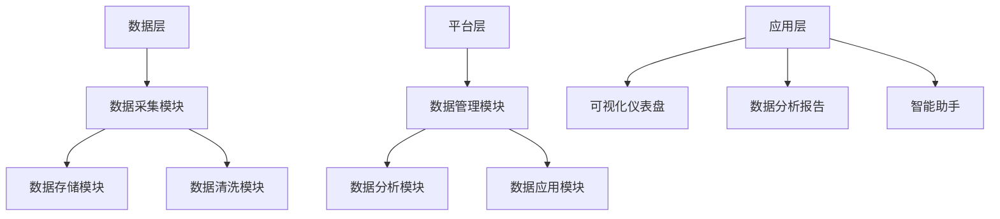
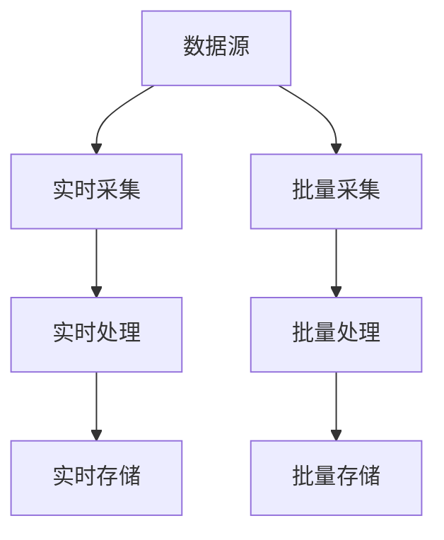

                 

## 《AI DMP 数据基建：数据安全与隐私保护》

### 关键词
- AI DMP
- 数据安全
- 隐私保护
- 加密技术
- 异常检测
- 联邦学习

### 摘要
本文深入探讨了AI数据管理平台（DMP）的数据基建，重点关注数据安全和隐私保护。首先，我们介绍了DMP的核心概念与架构，分析了数据安全与隐私保护的重要性。接着，我们探讨了数据安全的理论基础，包括数据安全框架和加密技术，以及隐私保护的理论基础，如数据匿名化和隐私计算模型。随后，我们详细讨论了AI在数据安全和隐私保护中的应用，包括异常检测和联邦学习。最后，我们通过实际案例展示了数据安全与隐私保护的实践，并探讨了相关法律法规与合规实践。通过本文，读者将全面了解AI DMP的数据基建，以及如何有效保护数据安全和隐私。

### 《AI DMP 数据基建：数据安全与隐私保护》目录大纲

#### 第一部分：AI DMP 数据基建概述

##### 第1章：AI DMP 数据基建概述

- **1.1 AI DMP 数据基建的核心概念与架构**
  - **概念解析**：数据管理平台（DMP）的概念，人工智能（AI）与数据管理的关系。
  - **架构解析**：DMP的整体架构，AI在DMP中的关键作用。

- **1.2 数据安全与隐私保护的重要性**
  - **数据安全**：数据泄露的风险，保护数据的重要性。
  - **隐私保护**：隐私权的概念，隐私保护的法律法规。

##### 第2章：数据安全与隐私保护的理论基础

- **2.1 数据安全的理论基础**
  - **数据安全框架**：ISO/IEC 27001标准，安全策略与风险管理。
  - **数据加密技术**：对称加密、非对称加密、哈希函数等。

- **2.2 隐私保护的理论基础**
  - **隐私保护框架**：数据匿名化，隐私计算模型，隐私协议。
  - **隐私法律法规**：GDPR，CCPA，PIPEDA等法规概述。

#### 第二部分：AI DMP 数据基建技术

##### 第3章：数据采集与管理技术

- **3.1 数据采集技术**
  - **数据源分类**：结构化数据、半结构化数据、非结构化数据。
  - **数据采集方法**：实时采集，批量采集。

- **3.2 数据管理技术**
  - **数据仓库**：数据仓库架构，数据仓库管理。
  - **数据湖**：数据湖架构，数据湖管理。

##### 第4章：数据安全防护技术

- **4.1 数据加密技术**
  - **对称加密与非对称加密**：加密算法与密钥管理。
  - **哈希函数**：哈希算法与加密哈希。

- **4.2 数据隐私保护技术**
  - **数据匿名化**：匿名化算法与实现。
  - **差分隐私**：差分隐私算法与实现。

##### 第5章：AI技术在数据安全与隐私保护中的应用

- **5.1 AI在数据安全中的应用**
  - **异常检测**：机器学习模型在异常检测中的应用。
  - **威胁情报**：利用AI进行威胁情报收集与分析。

- **5.2 AI在隐私保护中的应用**
  - **联邦学习**：联邦学习模型与应用场景。
  - **差分隐私算法**：差分隐私算法在AI模型训练中的应用。

#### 第三部分：数据安全与隐私保护案例分析

##### 第6章：数据安全与隐私保护案例分析

- **6.1 案例一：某大型电商平台的数据安全事件**
  - **事件概述**：数据泄露事件的背景与影响。
  - **事件分析**：事件发生的原因与处理措施。

- **6.2 案例二：某金融机构的隐私保护实践**
  - **实践概述**：金融机构在隐私保护方面的策略与措施。
  - **实践分析**：实践成果与经验总结。

##### 第7章：数据安全与隐私保护法律法规与合规

- **7.1 数据安全与隐私保护法律法规概述**
  - **国际法规**：GDPR、CCPA等。
  - **国内法规**：个人信息保护法、网络安全法等。

- **7.2 数据安全与隐私保护合规实践**
  - **合规评估**：合规风险评估与控制。
  - **合规实施**：合规策略与措施。

#### 附录

##### 附录A：AI DMP 数据基建：数据安全与隐私保护工具与资源

- **A.1 主流数据安全与隐私保护工具**
  - **加密工具**：OpenSSL、AESCrypt等。
  - **隐私保护工具**： Differential Privacy Library、TPM等。

- **A.2 数据安全与隐私保护学习资源**
  - **在线课程**：Coursera、edX上的数据安全与隐私保护课程。
  - **书籍推荐**：《数据安全与隐私保护实战指南》、《数据安全法律法规解析》等。

---

接下来，我们将一步一步分析AI DMP数据基建，深入探讨数据安全与隐私保护的理论基础、技术细节、应用案例以及法律法规和合规实践。通过这种逻辑清晰、结构紧凑的分析方式，希望读者能够全面理解AI DMP的数据基建，并掌握有效的数据安全与隐私保护策略。

---

#### AI DMP 数据基建概述

##### 1.1 AI DMP 数据基建的核心概念与架构

**概念解析：** 数据管理平台（DMP）是一个集数据收集、管理、存储、分析和应用于一体的系统。它主要用于帮助企业更好地理解和利用数据资源，实现数据驱动的决策。DMP的核心概念包括用户画像、数据标签、数据流转、数据可视化等。用户画像是指对用户进行多维度描述，以便更好地理解用户行为和需求。数据标签是对数据进行的分类和标注，便于数据的管理和分析。数据流转则是指数据的采集、清洗、存储、处理和输出的全过程。数据可视化是将复杂的数据转化为易于理解的可视化图表，帮助决策者快速获取数据洞察。

人工智能（AI）与数据管理的关系紧密。AI技术能够对大量数据进行高效处理和分析，从而提供更加精准和智能的数据洞察。例如，通过机器学习算法，DMP可以实时分析用户行为，预测用户需求，从而优化营销策略。此外，AI还可以用于数据异常检测、威胁情报分析等方面，提升DMP的数据安全性和隐私保护能力。

**架构解析：** 一个典型的AI DMP架构包括数据层、平台层和应用层。数据层是DMP的基础，包括数据采集、数据存储和数据清洗等模块。数据采集模块负责从各种渠道获取数据，包括网站日志、社交网络数据、传感器数据等。数据存储模块则负责存储和管理这些数据，如使用数据仓库或数据湖技术。数据清洗模块负责处理数据中的噪声和错误，确保数据质量。

平台层是DMP的核心，包括数据管理、数据分析、数据应用等功能。数据管理模块负责对数据进行分类、标签化和存储，以便后续分析和应用。数据分析模块利用AI算法对数据进行深度挖掘，提取有价值的信息和知识。数据应用模块则将分析结果转化为实际的业务应用，如个性化推荐、精准营销等。

应用层是DMP的直接体现，面向最终用户。通过应用层，用户可以实时查看和分析数据，获取业务洞察，并做出相应的决策。应用层通常包括可视化仪表盘、数据分析报告、智能助手等功能。

**图1.1 AI DMP架构图**



##### 1.2 数据安全与隐私保护的重要性

**数据安全：** 数据安全是DMP系统运行的基础，关系到企业的核心竞争力。数据泄露可能导致敏感信息被窃取，对企业造成严重的经济和声誉损失。此外，数据泄露还可能引发法律纠纷和监管处罚。因此，保障数据安全至关重要。

数据泄露的风险主要包括内部威胁和外部攻击。内部威胁通常来自企业内部人员，如不当操作或恶意行为。外部攻击则可能来自黑客、病毒、恶意软件等。为了防止数据泄露，需要采取一系列安全措施，如数据加密、访问控制、审计跟踪等。

**隐私保护：** 隐私保护是保护个人数据和隐私权益的重要手段。在DMP中，隐私保护主要体现在对用户数据的匿名化和隐私计算。匿名化是通过去除或改变数据中的个人标识信息，使数据无法直接关联到特定个体。隐私计算则是在数据处理过程中，采用差分隐私、联邦学习等技术，确保数据隐私不被泄露。

隐私权是指个人对于自己个人信息的管理和控制权。隐私权的概念源于宪法和法律规定，如《中华人民共和国个人信息保护法》和《欧盟通用数据保护条例》（GDPR）。违反隐私权可能导致法律责任和声誉损失。因此，企业需要严格遵守相关法律法规，确保用户隐私得到有效保护。

**数据安全与隐私保护的法律法规：** 数据安全与隐私保护是现代信息社会中不可忽视的重要议题。各国纷纷制定了一系列法律法规，以规范数据处理行为，保护个人隐私权益。以下是一些主要的法律法规：

- **中华人民共和国个人信息保护法（PIPL）**：PIPL是中国第一部全面规范个人信息保护的基本法律，旨在保护个人信息权益，规范个人信息处理活动。

- **欧盟通用数据保护条例（GDPR）**：GDPR是欧盟制定的个人信息保护法律，对个人数据的收集、处理、存储和传输提出了严格的要求。

- **加州消费者隐私法（CCPA）**：CCPA是加利福尼亚州制定的一项消费者隐私法律，旨在赋予消费者对其个人信息的更多控制权。

- **个人信息保护法（PIPA）**：PIPA是美国联邦层面的一项个人信息保护法案，旨在加强个人信息保护，防止数据泄露。

这些法律法规不仅为企业提供了合规指南，也提高了公众对数据安全和隐私保护的意识。企业需要密切关注相关法律法规的变化，确保自身数据处理行为符合法律要求。

**总结：** 数据安全与隐私保护是AI DMP数据基建的重要组成部分。通过建立健全的数据安全框架和隐私保护机制，企业可以确保数据的安全性和合规性，提高用户信任，实现可持续发展。在接下来的章节中，我们将进一步探讨数据安全与隐私保护的理论基础、技术实现和应用实践。

---

**思考与讨论：**
1. 你认为数据安全和隐私保护在AI DMP中的重要性如何？
2. 请列举至少两种常见的数据泄露风险，并说明如何防范。
3. 你对当前的数据安全与隐私保护法律法规有何看法？

---

#### 数据安全与隐私保护的理论基础

##### 2.1 数据安全的理论基础

数据安全是指在数据生命周期中，防止数据泄露、损坏、篡改和未授权访问的一系列措施。为了确保数据安全，需要建立一个全面的数据安全框架，这通常包括安全策略、风险管理、加密技术和访问控制等。

**数据安全框架：** 数据安全框架是一个系统性的方法，用于确保数据在存储、传输和处理过程中的安全性。ISO/IEC 27001标准是一个广泛认可的国际标准，它提供了一个框架，用于建立和维护信息安全管理系统（ISMS）。以下是ISO/IEC 27001标准的核心组成部分：

- **信息安全政策**：组织需要制定一个明确的信息安全政策，明确信息安全的职责和目标。
- **风险评估**：通过识别和处理潜在的安全威胁和风险，确定组织需要采取的安全措施。
- **安全控制**：根据风险评估的结果，实施一系列安全控制措施，如加密、访问控制、监控和审计等。
- **安全意识培训**：确保员工了解信息安全的重要性，并能够正确执行安全措施。
- **持续改进**：定期评估信息安全管理体系的有效性，并根据评估结果进行改进。

**安全策略与风险管理：** 安全策略是数据安全框架的核心，它为组织提供了数据安全的基本原则和指导。安全策略通常包括以下几个方面：

- **数据分类**：根据数据的敏感性和重要性，对数据进行分类，并制定相应的保护措施。
- **访问控制**：通过身份验证、授权和访问控制列表（ACL）等手段，确保只有授权人员可以访问数据。
- **加密**：使用加密技术保护数据的机密性，确保数据在存储和传输过程中不被窃取或篡改。
- **备份与恢复**：定期备份数据，并确保在数据丢失或损坏时能够快速恢复。
- **应急响应**：制定应急响应计划，以应对可能的安全事件，如数据泄露、网络攻击等。

风险管理是数据安全策略的重要组成部分。风险管理包括识别、评估和应对风险的过程。以下是风险管理的步骤：

- **风险识别**：识别组织可能面临的数据安全风险，如物理安全威胁、网络安全威胁、内部威胁等。
- **风险分析**：分析每种风险的潜在影响和可能性，确定风险的优先级。
- **风险应对**：制定和实施措施来降低风险，如采用安全控制措施、增加安全意识培训等。
- **风险监控**：定期评估风险管理措施的有效性，并根据实际情况进行调整。

**数据加密技术：** 数据加密技术是保护数据安全的重要手段。数据加密通过将数据转换为无法直接读取的形式（密文），确保数据在存储、传输和处理过程中的机密性。以下是几种常见的数据加密技术：

- **对称加密**：对称加密使用相同的密钥进行加密和解密。常见的对称加密算法有AES（高级加密标准）和DES（数据加密标准）。对称加密的优点是加密速度快，但缺点是密钥管理复杂。
- **非对称加密**：非对称加密使用一对密钥（公钥和私钥）进行加密和解密。公钥用于加密，私钥用于解密。常见的非对称加密算法有RSA和ECC（椭圆曲线加密）。非对称加密的优点是密钥管理简单，但加密和解密速度较慢。
- **哈希函数**：哈希函数用于生成数据的加密哈希值，确保数据的完整性。常见的哈希函数有SHA（安全哈希算法）和MD5。哈希函数的优点是计算速度快，缺点是对抗性较弱。

**总结：** 数据安全是一个复杂且多层次的任务，需要建立全面的安全框架和实施有效的安全措施。通过合理的安全策略和风险管理，以及加密技术的应用，企业可以有效地保护数据的安全性和隐私。

##### 2.2 隐私保护的理论基础

隐私保护是指在数据处理过程中，确保个人隐私不被泄露的一系列措施。隐私保护的理论基础涵盖了隐私计算模型、数据匿名化技术、隐私协议等方面。

**隐私保护框架：** 隐私保护框架是确保数据隐私的系统性方法，它通常包括以下几个方面：

- **隐私定义**：明确隐私的定义，通常涉及个人信息的保密性、完整性和可用性。
- **隐私需求**：根据不同的应用场景，确定需要保护的隐私类型和级别。
- **隐私策略**：制定隐私保护的基本原则和策略，如数据匿名化、隐私计算等。
- **隐私设计**：在系统的设计阶段，考虑隐私保护的需求，确保系统的隐私设计符合隐私策略。
- **隐私实现**：在系统实施阶段，通过技术手段实现隐私保护策略，如加密、匿名化等。
- **隐私审计**：定期审计系统的隐私保护措施，确保其符合隐私要求。

**数据匿名化：** 数据匿名化是将数据中的个人标识信息去除或替换，以保护个人隐私的技术。数据匿名化技术包括以下几种：

- **K-匿名性**：K-匿名性是指一组记录中的任何K个记录都不能唯一地识别出任何一个个体。例如，如果一组记录中有100个记录，其中任何25个记录都不能唯一地识别出任何一个个体，那么这组记录就是K-匿名的。
- **l-diversity**：l-diversity是指一组记录中，任意一个个体在多个记录中出现的频率都不低于l次。例如，如果一组记录中，每个个体至少在3个记录中出现，那么这组记录就是l-diverse的。
- **t-closeness**：t-closeness是指一组记录中，任意一个个体与其他个体的距离都不超过t个标准差。距离通常使用Jaccard相似度、汉明距离等度量。

**隐私计算模型：** 隐私计算模型是确保数据处理过程中隐私不被泄露的方法。以下是一些常见的隐私计算模型：

- **差分隐私**：差分隐私是一种用于保护隐私的计算模型，它通过在数据处理过程中引入随机噪声，确保单个数据记录的隐私不被泄露。差分隐私的核心是ε-differential privacy，它定义了一个隐私预算ε，表示隐私保护的程度。ε值越小，隐私保护越强。
- **联邦学习**：联邦学习是一种分布式机器学习技术，它通过在不同的数据源上训练模型，同时保持数据本地化，从而保护个人隐私。联邦学习分为协同联邦学习（cooperative federated learning）和半监督联邦学习（semi-supervised federated learning）等不同类型。

**隐私协议：** 隐私协议是确保数据在传输和处理过程中隐私不被泄露的协议。以下是一些常见的隐私协议：

- **安全多方计算（MPC）**：安全多方计算是一种允许多个参与方共同计算某个函数，而无需泄露各自输入数据的协议。MPC分为基于密码学的MPC和基于物理计算的MPC。
- **隐私增强技术（PET）**：隐私增强技术是一类用于增强数据隐私保护的技术，如混淆、同态加密、安全多方计算等。
- **隐私集中化**：隐私集中化是指将多个数据源集中到一个中心节点进行处理，通过严格的隐私保护措施，如差分隐私、加密等，确保数据的隐私不被泄露。

**隐私法律法规：** 隐私保护不仅依赖于技术手段，还需要法律和法规的支持。以下是一些重要的隐私法律法规：

- **欧盟通用数据保护条例（GDPR）**：GDPR是欧盟制定的个人信息保护法规，对个人数据的收集、处理、存储和传输提出了严格的要求。
- **加州消费者隐私法（CCPA）**：CCPA是加利福尼亚州制定的消费者隐私法规，赋予消费者对其个人信息的更多控制权。
- **中华人民共和国个人信息保护法（PIPL）**：PIPL是中国制定的个人信息保护法规，旨在保护个人信息权益，规范个人信息处理活动。

**总结：** 隐私保护是一个复杂且多层次的任务，需要结合技术手段、隐私计算模型、隐私协议以及法律法规等多方面的措施。通过建立健全的隐私保护框架，企业可以有效地保护用户隐私，提升用户信任，实现可持续发展。

---

**思考与讨论：**
1. 数据匿名化有哪些常见的挑战和局限性？
2. 你认为差分隐私在隐私保护中的优势是什么？
3. 请举例说明一种隐私增强技术，并解释其原理和应用场景。

---

#### 数据采集与管理技术

##### 3.1 数据采集技术

数据采集是数据管理平台（DMP）构建过程中的关键环节，它涉及到从各种数据源获取数据的过程。有效的数据采集技术能够确保数据的及时性、准确性和完整性。

**数据源分类：** 数据源可以分为结构化数据、半结构化数据和非结构化数据。

- **结构化数据**：结构化数据通常以表格形式存储，如关系数据库中的数据。这种数据有固定的数据模型，便于存储、查询和分析。常见的结构化数据源包括企业内部数据库、ERP系统、CRM系统等。
- **半结构化数据**：半结构化数据具有部分结构化的特征，通常没有固定的数据模型，但有一定的组织形式。例如，XML和JSON格式的数据，日志文件等。
- **非结构化数据**：非结构化数据没有固定的数据模型，通常是自由的文本、图片、音频、视频等。这类数据通常难以直接处理，需要经过数据预处理和特征提取才能被利用。

**数据采集方法：** 根据数据源的类型，数据采集方法可以分为实时采集和批量采集。

- **实时采集**：实时采集是指系统持续地从数据源中获取数据，并对数据进行实时处理和分析。这种方法适用于需要即时数据响应的场景，如实时监控、实时推荐等。实时采集通常依赖于消息队列、流处理技术和实时数据库等。
- **批量采集**：批量采集是指系统定期从数据源中获取数据，并将数据批量处理。这种方法适用于数据量较大、处理时间不紧迫的场景，如数据备份、数据清洗等。批量采集通常依赖于批处理框架、ETL（提取、转换、加载）工具等。

**图3.1 数据采集流程图**



##### 3.2 数据管理技术

数据管理是指对数据生命周期中的各个环节进行有效管理，包括数据存储、数据处理、数据分析和数据应用等。数据管理技术的有效性直接影响到DMP的性能和实用性。

**数据仓库：** 数据仓库是一种用于存储大量历史数据的系统，通常用于支持企业级的数据分析和决策支持。数据仓库具有以下特点：

- **数据集成**：数据仓库通过ETL（提取、转换、加载）工具，将来自不同数据源的数据进行整合，形成一个统一的数据视图。
- **数据建模**：数据仓库使用数据建模技术，如星型模型和雪花模型，对数据进行组织和管理，以便高效地进行查询和分析。
- **数据压缩**：数据仓库通过数据压缩技术，减少存储空间需求，提高数据访问效率。
- **数据缓存**：数据仓库使用缓存技术，加速数据查询响应时间。

**数据仓库架构：** 数据仓库通常采用三层架构：

- **数据层**：数据层包括数据存储和数据处理模块，负责存储和管理原始数据和转换后的数据。
- **逻辑层**：逻辑层包括数据建模和视图定义模块，负责根据业务需求，组织和管理数据。
- **应用层**：应用层包括数据分析和报表生成模块，为用户提供数据查询和分析功能。

**数据仓库管理：** 数据仓库管理包括数据备份、数据恢复、数据监控和性能优化等方面。以下是一些常见的数据仓库管理技术：

- **数据备份**：定期备份数据，确保在数据丢失或损坏时能够恢复。
- **数据恢复**：在数据备份的基础上，实现数据的快速恢复。
- **数据监控**：实时监控数据仓库的性能，包括数据访问速度、存储容量等。
- **性能优化**：通过索引优化、查询优化和数据压缩等技术，提高数据仓库的性能。

**数据湖：** 数据湖是一种新的数据存储和管理架构，它与传统数据仓库相比，具有更灵活的数据存储和处理能力。数据湖具有以下特点：

- **数据多样性**：数据湖能够存储不同类型的数据，包括结构化数据、半结构化数据和非结构化数据。
- **数据原始性**：数据湖保留了数据的原始格式和结构，便于后续处理和分析。
- **数据时效性**：数据湖支持实时数据处理和批量数据处理，满足不同业务场景的需求。
- **数据治理**：数据湖通过数据治理技术，确保数据的完整性、一致性和安全性。

**数据湖架构：** 数据湖通常采用三层架构：

- **数据层**：数据层包括数据存储和数据处理模块，负责存储和管理原始数据和转换后的数据。
- **计算层**：计算层包括数据处理和计算引擎模块，负责对数据进行实时处理和批量处理。
- **应用层**：应用层包括数据分析和报表生成模块，为用户提供数据查询和分析功能。

**数据湖管理：** 数据湖管理包括数据备份、数据恢复、数据监控和性能优化等方面。以下是一些常见的数据湖管理技术：

- **数据备份**：定期备份数据，确保在数据丢失或损坏时能够恢复。
- **数据恢复**：在数据备份的基础上，实现数据的快速恢复。
- **数据监控**：实时监控数据湖的性能，包括数据访问速度、存储容量等。
- **性能优化**：通过索引优化、查询优化和数据压缩等技术，提高数据湖的性能。

**总结：** 数据采集和管理是构建高效DMP的关键环节。通过合理的数据源分类、数据采集方法和数据管理技术，企业可以确保数据的及时性、准确性和完整性，为后续的数据分析和应用提供有力支持。在接下来的章节中，我们将进一步探讨数据安全防护技术和AI在数据安全与隐私保护中的应用。

---

**思考与讨论：**
1. 请举例说明结构化数据、半结构化数据和非结构化数据在实际应用中的区别和用途。
2. 数据仓库和数据湖在架构和功能上有哪些主要区别？
3. 你认为数据仓库和数据湖在未来数据管理中哪个更具优势？为什么？

---

#### 数据安全防护技术

数据安全防护技术是确保数据在存储、传输和处理过程中不受恶意攻击和未授权访问的关键措施。以下将详细探讨数据加密技术和数据隐私保护技术，包括其基本原理、实现方法和应用场景。

##### 4.1 数据加密技术

数据加密是保护数据安全的一种基本手段，通过将明文数据转换为密文，防止未授权用户读取或篡改数据。数据加密技术可以分为对称加密、非对称加密和哈希函数等。

**对称加密：** 对称加密使用相同的密钥进行加密和解密，加密速度快，但密钥管理复杂。常见的对称加密算法包括AES（高级加密标准）和DES（数据加密标准）。

- **AES（高级加密标准）**：AES是一种高性能的加密标准，它使用128、192或256位的密钥对数据进行加密。AES的加密过程包括初始化向量（IV）和加密算法，如分组加密和轮加密。
  
  **加密伪代码：**
  ```python
  def AES_encrypt(plaintext, key):
      IV = generate_random_vector()
      ciphertext = ""
      for block in split_into_blocks(plaintext):
          xor_block = block ^ IV
          ciphertext += encrypt_block(xor_block, key)
          IV = xor_block
      return ciphertext, IV
  ```

- **DES（数据加密标准）**：DES是一种较早的加密标准，使用56位的密钥对数据进行加密。DES的加密过程包括初始置换、16轮加密和最终置换。

  **加密伪代码：**
  ```python
  def DES_encrypt(plaintext, key):
      initial_permutation = permute(plaintext)
      for i in range(16):
          key_schedule = generate_key_schedule(key, i)
          transformed_block = encrypt_block(initial_permutation, key_schedule)
          initial_permutation = transformed_block
      final_permutation = permute(initial_permutation)
      return final_permutation
  ```

**非对称加密：** 非对称加密使用一对密钥（公钥和私钥）进行加密和解密，公钥用于加密，私钥用于解密。非对称加密的优点是密钥管理简单，但加密和解密速度较慢。常见的非对称加密算法包括RSA和ECC（椭圆曲线加密）。

- **RSA（Rivest-Shamir-Adleman）**：RSA是一种经典的非对称加密算法，使用大素数生成密钥对，加密过程包括模运算和指数运算。

  **加密伪代码：**
  ```python
  def RSA_encrypt(plaintext, public_key):
      ciphertext = ""
      for block in split_into_blocks(plaintext):
          encrypted_block = pow(block, public_key['exponent'], public_key['modulus'])
          ciphertext += str(encrypted_block)
      return ciphertext
  ```

- **ECC（椭圆曲线加密）**：ECC是一种基于椭圆曲线数学的非对称加密算法，使用椭圆曲线生成密钥对，加密过程更加高效。

  **加密伪代码：**
  ```python
  def ECC_encrypt(plaintext, public_key):
      ciphertext = ""
      for block in split_into_blocks(plaintext):
          curve = generate_curve(public_key['a'], public_key['b'])
          encrypted_block = encrypt_block(block, curve, public_key['public_key'])
          ciphertext += str(encrypted_block)
      return ciphertext
  ```

**哈希函数：** 哈希函数是将任意长度的输入数据映射为固定长度的输出数据的函数，通常用于确保数据的完整性。常见的哈希函数包括MD5、SHA1和SHA256。

- **MD5（消息摘要算法5）**：MD5是一种广泛使用的哈希函数，生成128位的哈希值。

  **哈希伪代码：**
  ```python
  def MD5_hash(plaintext):
      hash_value = ""
      for block in split_into_blocks(plaintext):
          transformed_block = hash_block(block)
          hash_value += str(transformed_block)
      return hash_value
  ```

- **SHA1（安全哈希算法1）**：SHA1是一种生成160位哈希值的算法，广泛应用于数字签名和消息认证。

  **哈希伪代码：**
  ```python
  def SHA1_hash(plaintext):
      hash_value = ""
      for block in split_into_blocks(plaintext):
          transformed_block = hash_block(block)
          hash_value += str(transformed_block)
      return hash_value
  ```

- **SHA256（安全哈希算法256）**：SHA256是一种生成256位哈希值的算法，比SHA1更安全，广泛应用于数字签名和消息认证。

  **哈希伪代码：**
  ```python
  def SHA256_hash(plaintext):
      hash_value = ""
      for block in split_into_blocks(plaintext):
          transformed_block = hash_block(block)
          hash_value += str(transformed_block)
      return hash_value
  ```

**总结：** 数据加密技术包括对称加密、非对称加密和哈希函数，每种加密技术都有其特定的应用场景和实现方法。对称加密适用于数据量大且密钥管理可控的场景，非对称加密适用于密钥管理简单但计算复杂度较高的场景，哈希函数则用于确保数据的完整性。在数据安全防护中，结合多种加密技术可以提供更全面的安全保障。

##### 4.2 数据隐私保护技术

数据隐私保护技术是确保数据在处理和分析过程中不被泄露的一系列措施。以下将介绍数据匿名化和差分隐私技术，包括其基本原理、实现方法和应用场景。

**数据匿名化：** 数据匿名化是通过去除或改变数据中的个人标识信息，使数据无法直接关联到特定个体，从而保护个人隐私。

- **K-匿名性：** K-匿名性是指一组记录中的任何K个记录都不能唯一地识别出任何一个个体。K-匿名性通过将具有相同属性的记录合并，降低个体识别的可能性。

  **K-匿名化伪代码：**
  ```python
  def K_anonymity(data, k):
      anonymized_data = []
      for group in group_by_attribute(data, 'attribute'):
          if len(set(group['id'])) <= k:
              anonymized_group = {'attribute': group['attribute'], 'id': [None] * len(group['id'])}
              anonymized_data.append(anonymized_group)
      return anonymized_data
  ```

- **l-diversity：** l-diversity是指一组记录中，任意一个个体在多个记录中出现的频率都不低于l次。l-diversity通过确保个体在多个记录中的出现频率，降低个体识别的可能性。

  **l-diversity伪代码：**
  ```python
  def l_diversity(data, l):
      diversified_data = []
      for group in group_by_attribute(data, 'attribute'):
          if all(count >= l for count in count_instances(group['id'])):
              diversified_group = {'attribute': group['attribute'], 'id': group['id']}
              diversified_data.append(diversified_group)
      return diversified_data
  ```

- **t-closeness：** t-closeness是指一组记录中，任意一个个体与其他个体的距离都不超过t个标准差。t-closeness通过确保个体在多个记录中的相似度，降低个体识别的可能性。

  **t-closeness伪代码：**
  ```python
  def t_closeness(data, t):
      closeness_data = []
      for group in group_by_attribute(data, 'attribute'):
          distances = calculate_distances(group['attributes'])
          if all(dist <= t for dist in distances):
              closeness_group = {'attribute': group['attribute'], 'id': group['id']}
              closeness_data.append(closeness_group)
      return closeness_data
  ```

**差分隐私：** 差分隐私是一种用于保护隐私的计算模型，通过在数据处理过程中引入随机噪声，确保单个数据记录的隐私不被泄露。差分隐私的核心是ε-differential privacy，它定义了一个隐私预算ε，表示隐私保护的程度。

- **ε-differential privacy：** ε-differential privacy是指对于任意两个邻近的数据集，其处理结果之间的差异不会超过ε倍的概率。ε值越小，隐私保护越强。

  **ε-differential privacy伪代码：**
  ```python
  def privatize(data, epsilon):
      noise = generate_random_noise(epsilon)
      privatized_data = data + noise
      return privatized_data
  ```

- **拉格朗日机制：** 拉格朗日机制是一种常用的差分隐私机制，通过在计算过程中引入拉格朗日乘子，确保计算结果的差分隐私。

  **拉格朗日机制伪代码：**
  ```python
  def lagrangian_mechanism(data, epsilon, lambda_):
      lambda_ = generate_lambda(lambda_)
      modified_data = data - lambda_ * epsilon
      return modified_data
  ```

**总结：** 数据隐私保护技术包括数据匿名化和差分隐私。数据匿名化通过去除或改变个人标识信息，使数据无法直接关联到个体，而差分隐私通过在数据处理过程中引入随机噪声，确保个体隐私不被泄露。结合这些技术，企业可以有效地保护数据隐私，提高用户信任。

---

**思考与讨论：**
1. 请比较对称加密和非对称加密在应用场景和实现上的优缺点。
2. 数据匿名化和差分隐私在保护数据隐私方面有哪些异同？
3. 你认为在数据隐私保护中，哪种技术更具优势？为什么？

---

#### AI技术在数据安全与隐私保护中的应用

人工智能（AI）技术在数据安全与隐私保护中发挥着越来越重要的作用。通过利用AI技术，企业可以更有效地检测潜在的安全威胁、分析隐私泄露风险，并提升数据保护的总体水平。以下将详细探讨AI在数据安全和隐私保护中的应用，包括异常检测、威胁情报、联邦学习和差分隐私算法。

##### 5.1 AI在数据安全中的应用

**异常检测：** 异常检测是一种利用AI技术识别异常行为或模式的方法，它可以在数据安全事件发生前及时发现潜在的威胁。机器学习模型在异常检测中发挥着关键作用。

- **基于统计的方法**：传统的异常检测方法通常基于统计模型，如标准差法、孤立森林法等。这些方法通过计算数据的统计特征，识别出与正常行为显著不同的异常点。

  **伪代码示例：**
  ```python
  def standard_deviation_detection(data, threshold):
      mean = calculate_mean(data)
      std_dev = calculate_std_dev(data)
      for value in data:
          if abs(value - mean) > threshold * std_dev:
              return "Anomaly detected"
      return "No anomalies"
  ```

- **基于机器学习的方法**：现代异常检测方法通常采用机器学习模型，如支持向量机（SVM）、决策树、神经网络等。这些模型通过学习正常行为模式，可以识别出异常行为。

  **伪代码示例：**
  ```python
  def ml_anomaly_detection(data, model):
      normalized_data = normalize(data)
      predictions = model.predict(normalized_data)
      for prediction in predictions:
          if prediction == "Anomaly":
              return "Anomaly detected"
      return "No anomalies"
  ```

**威胁情报：** 威胁情报是一种通过收集、分析和共享有关安全威胁的信息，帮助企业预测和防御潜在攻击的方法。AI技术在威胁情报中发挥着关键作用，可以自动化威胁分析和预测。

- **基于机器学习的威胁情报分析**：机器学习模型可以分析历史攻击数据，识别出攻击模式和行为特征。通过这些模型，企业可以预测潜在的安全威胁，并采取相应的防御措施。

  **伪代码示例：**
  ```python
  def threat_intelligence_analysis(attack_data, model):
      model.train(attack_data)
      predicted Threats = model.predict(new_data)
      for threat in predicted_Threats:
          if threat == "Potential Threat":
              return "Threat detected"
      return "No threats"
  ```

**应用场景：** 异常检测和威胁情报分析在金融、医疗、电子商务等领域具有广泛的应用。例如，在金融领域，AI技术可以实时监控交易活动，识别异常交易并预警潜在的欺诈行为。在医疗领域，AI技术可以分析患者数据，识别异常健康状况，提高疾病诊断的准确性。

##### 5.2 AI在隐私保护中的应用

**联邦学习：** 联邦学习是一种分布式机器学习技术，它允许多个参与者共同训练一个机器学习模型，同时保持各自数据本地化。联邦学习在隐私保护中的应用主要在于防止数据泄露，同时利用分布式数据集进行训练。

- **联邦学习模型**：联邦学习模型包括客户端、服务器和模型训练模块。客户端负责在本地训练模型，并将模型更新发送到服务器。服务器负责汇总模型更新，并生成全局模型。

  **伪代码示例：**
  ```python
  def federated_learning(data, client_model, server_model):
      for iteration in range(num_iterations):
          client_model.train(data)
          client_update = client_model.get_update()
          server_model.update(client_update)
      global_model = server_model.get_global_model()
      return global_model
  ```

- **应用场景**：联邦学习在医疗、金融、零售等领域具有广泛的应用。例如，在医疗领域，联邦学习可以用于分析患者数据，提高疾病预测模型的准确性，同时保护患者隐私。在金融领域，联邦学习可以用于检测欺诈行为，提高风控能力。

**差分隐私算法：** 差分隐私是一种用于保护隐私的计算模型，它通过在数据处理过程中引入随机噪声，确保单个数据记录的隐私不被泄露。差分隐私算法在机器学习模型训练中发挥着重要作用。

- **差分隐私机制**：差分隐私机制通过在计算过程中引入拉格朗日乘子或随机噪声，确保计算结果的隐私性。常见的差分隐私机制包括拉格朗日机制、高斯机制等。

  **伪代码示例（拉格朗日机制）：**
  ```python
  def differential_privacy(data, epsilon, lambda_):
      noise = generate_random_noise(epsilon)
      modified_data = data - lambda_ * noise
      return modified_data
  ```

  **伪代码示例（高斯机制）：**
  ```python
  def differential_privacy_gaussian(data, epsilon):
      mean = calculate_mean(data)
      variance = calculate_variance(data)
      noise = generate_gaussian_noise(epsilon * variance)
      privatized_data = mean + noise
      return privatized_data
  ```

- **应用场景**：差分隐私算法在医疗、金融、政府等领域具有广泛的应用。例如，在医疗领域，差分隐私算法可以用于保护患者隐私，同时提高疾病预测模型的准确性。在金融领域，差分隐私算法可以用于保护客户交易数据，同时提高欺诈检测能力。

**总结：** AI技术在数据安全和隐私保护中发挥着重要作用。通过利用机器学习模型进行异常检测和威胁情报分析，企业可以更有效地防御安全威胁。联邦学习和差分隐私算法则在保护数据隐私的同时，提高了数据利用的效率和准确性。结合这些AI技术，企业可以建立更加安全、可靠的数据管理平台，为用户提供更好的数据保护体验。

---

**思考与讨论：**
1. 请解释联邦学习的基本原理和优势。
2. 差分隐私算法如何在实际应用中保护数据隐私？
3. 你认为在数据安全和隐私保护中，AI技术有哪些潜在的挑战和限制？

---

#### 数据安全与隐私保护案例分析

在数据安全与隐私保护的实践中，许多企业已经面临了各种挑战，并采取了相应的措施。以下将通过两个实际案例，分析数据安全事件和隐私保护实践的背景、原因、处理措施及经验教训。

##### 6.1 案例一：某大型电商平台的数据安全事件

**事件概述：** 某大型电商平台在一次例行安全检查中发现，其用户数据存储系统存在严重的安全漏洞，导致大量用户个人信息（如姓名、地址、电话号码、电子邮箱等）被黑客窃取。这一事件引起了公众的广泛关注，并对该电商平台的声誉造成了严重损害。

**事件分析：** 经过调查，发现导致数据泄露的原因主要有以下几点：

- **内部人员失误**：一名负责用户数据管理的员工因操作不当，将用户数据存储在未加密的文件中，并意外泄露给了外部人员。
- **系统漏洞**：该电商平台的数据存储系统存在一个已知的安全漏洞，黑客利用此漏洞获取了系统访问权限，并窃取了用户数据。
- **缺乏安全意识培训**：员工对数据安全意识不足，未按照规定进行操作，导致安全事件的发生。

**处理措施：** 针对此事件，该电商平台采取了以下措施：

- **立即封堵漏洞**：发现漏洞后，平台立即对数据存储系统进行了紧急修复，并加强了系统访问控制，确保数据不被未授权访问。
- **通知用户**：平台立即通知受影响用户，提醒他们更改密码，并告知可能面临的隐私风险。
- **加强员工培训**：平台对全体员工进行了数据安全意识培训，加强了对数据安全操作规范的教育。
- **引入第三方安全审计**：平台引入第三方安全审计机构，进行全面的安全检查，确保系统安全。

**经验教训：** 此事件给企业带来了以下几点经验教训：

- **数据加密的重要性**：确保敏感数据在存储和传输过程中进行加密，防止数据泄露。
- **员工安全意识培训**：加强员工的数据安全意识培训，提高其对数据安全的重视程度。
- **系统漏洞扫描和修复**：定期对系统进行漏洞扫描，并及时修复已知漏洞。
- **应急预案**：制定详细的数据安全应急预案，以应对可能的安全事件。

##### 6.2 案例二：某金融机构的隐私保护实践

**实践概述：** 某金融机构在业务发展和数据规模不断扩大的背景下，高度重视用户隐私保护。为了确保用户隐私，该金融机构采取了一系列隐私保护措施，并在实践中取得了显著成效。

**隐私保护措施：** 该金融机构采取了以下措施：

- **数据匿名化**：在数据采集和存储过程中，对用户敏感信息进行匿名化处理，确保数据无法直接关联到特定个体。
- **差分隐私算法**：在数据分析过程中，采用差分隐私算法，确保数据分析结果符合隐私保护要求。
- **安全审计和监控**：定期进行安全审计，监控数据访问和操作行为，及时发现潜在的安全威胁。
- **合规培训**：对员工进行隐私保护法规的培训，确保员工了解并遵守相关法律法规。

**实践分析：** 通过这些措施，该金融机构在用户隐私保护方面取得了以下成果：

- **用户隐私保护水平提升**：用户敏感信息得到有效保护，降低了隐私泄露的风险。
- **合规性提高**：通过遵循隐私保护法律法规，避免了可能的法律风险和监管处罚。
- **业务发展支持**：用户对隐私保护的信心增强，促进了业务的健康发展。

**经验总结：** 该金融机构的隐私保护实践为其他企业提供了以下几点经验：

- **数据匿名化和差分隐私算法**：结合使用数据匿名化和差分隐私算法，可以在保证数据分析价值的同时，有效保护用户隐私。
- **安全审计和监控**：通过定期安全审计和实时监控，可以及时发现和应对潜在的安全威胁。
- **员工合规培训**：提高员工对隐私保护法规的理解和遵守，确保企业合规运营。

**总结：** 通过分析这些实际案例，我们可以看到，数据安全与隐私保护是一个复杂而系统的工程，需要企业在数据采集、存储、处理和传输的各个环节中采取有效的措施。通过案例中的经验和教训，企业可以不断完善数据安全与隐私保护策略，确保用户隐私得到有效保护。

---

**思考与讨论：**
1. 请结合案例一和案例二，分析数据安全与隐私保护中存在的主要挑战和应对策略。
2. 你认为哪些因素会影响企业在数据安全与隐私保护方面的成功？
3. 请提出至少两种你认为可以有效提高数据安全与隐私保护水平的措施。

---

#### 数据安全与隐私保护法律法规与合规

数据安全与隐私保护法律法规是确保企业合规运营、保护用户隐私的重要基石。以下将介绍国内外主要的数据安全与隐私保护法律法规，探讨合规评估与实施策略。

##### 7.1 数据安全与隐私保护法律法规概述

**国际法规：**

- **欧盟通用数据保护条例（GDPR）**：GDPR是欧盟于2018年实施的个人信息保护法规，对个人数据的收集、处理、存储和传输提出了严格的要求。GDPR的核心原则包括数据最小化、目的明确、数据质量、隐私保护等。

  **主要条款：**
  - **数据最小化**：只能收集实现数据处理目的所必需的数据。
  - **目的明确**：数据处理必须基于明确、合法、透明的目的。
  - **数据质量**：确保数据准确、相关、及时和完整。
  - **隐私保护**：采取技术和管理措施保护个人数据安全。

- **加州消费者隐私法（CCPA）**：CCPA是加利福尼亚州于2020年实施的消费者隐私法规，赋予消费者对其个人信息的更多控制权。CCPA适用于在加利福尼亚州收集、处理或销售消费者个人信息的公司。

  **主要条款：**
  - **知情权**：消费者有权了解其个人信息被收集、使用和共享的方式。
  - **访问权**：消费者有权访问其个人信息，并要求公司删除其个人信息。
  - **不同意权**：消费者有权不同意其个人信息被用于特定目的。

**国内法规：**

- **中华人民共和国个人信息保护法（PIPL）**：PIPL是中国于2021年实施的首部个人信息保护基本法，旨在保护个人信息权益，规范个人信息处理活动。PIPL的核心原则包括合法、正当、必要、诚信和目的明确。

  **主要条款：**
  - **合法性原则**：个人信息处理必须基于合法、正当、必要的原则。
  - **知情同意**：个人信息处理前，应告知个人并取得其同意。
  - **数据安全**：采取必要措施保护个人信息安全，防止数据泄露、损毁和滥用。
  - **数据质量控制**：确保个人信息准确、相关、及时和完整。

- **网络安全法**：网络安全法是中国于2017年实施的基本网络安全法规，旨在保障网络安全，维护网络空间主权和国家安全、社会公共利益。网络安全法适用于在中国境内运营的各类网络系统和服务。

  **主要条款：**
  - **网络安全管理**：网络运营者应采取技术和管理措施，保护网络安全。
  - **数据存储**：涉及国家安全、社会公共利益等重大事项的数据，应在境内存储。
  - **安全审查**：网络运营者应接受国家安全审查，遵守国家相关安全规定。

##### 7.2 数据安全与隐私保护合规实践

**合规评估：** 合规评估是确保企业数据处理活动符合法律法规要求的重要步骤。合规评估通常包括以下方面：

- **法律法规审查**：评估企业数据处理活动是否符合国内外相关法律法规的要求，如GDPR、CCPA、PIPL和网络安全法等。
- **风险评估**：识别企业数据处理过程中可能存在的风险，如数据泄露、隐私侵犯等，并评估其潜在影响。
- **合规性测试**：对现有数据处理流程、系统和技术措施进行测试，确保其符合法律法规要求。

**合规实施：** 合规实施是确保企业数据处理活动持续符合法律法规要求的关键环节。合规实施通常包括以下方面：

- **制定合规策略**：根据法律法规要求，制定企业数据安全与隐私保护策略，明确数据处理原则和合规要求。
- **员工培训**：对员工进行数据安全与隐私保护法规的培训，确保其了解并遵守相关法律法规。
- **安全措施实施**：采取技术和管理措施，保护个人信息安全，如数据加密、访问控制、数据备份等。
- **监控与审计**：定期监控数据处理活动，进行安全审计和合规性评估，确保持续符合法律法规要求。

**案例：** 某大型互联网公司在其全球业务运营中，面临着多国法律法规的合规要求。为了确保合规，公司采取了以下措施：

- **建立合规团队**：设立专门的数据安全与隐私保护合规团队，负责跟踪和分析各国法律法规的变化，制定合规策略。
- **定期合规评估**：定期对数据处理活动进行合规评估，识别潜在风险，并采取相应措施。
- **全球统一策略**：制定全球统一的数据安全与隐私保护策略，确保在不同国家和地区运营的分支机构和业务线符合法律法规要求。
- **员工培训与教育**：对全球员工进行数据安全与隐私保护法规的培训，提高员工的合规意识。

**总结：** 数据安全与隐私保护法律法规是确保企业合规运营、保护用户隐私的重要保障。通过合规评估与实施，企业可以确保数据处理活动符合法律法规要求，降低法律风险和声誉损失，提高用户信任度。

---

**思考与讨论：**
1. 你认为企业在制定合规策略时应该考虑哪些因素？
2. 请举例说明一种数据安全与隐私保护合规评估的方法。
3. 你认为在数据安全与隐私保护方面，企业应该如何平衡合规性与业务发展？

---

#### 附录

##### 附录A：AI DMP 数据基建：数据安全与隐私保护工具与资源

在构建AI数据管理平台（DMP）时，数据安全与隐私保护是至关重要的环节。以下列出了一些主流的数据安全与隐私保护工具和学习资源，以帮助读者深入了解和实践这些技术。

**A.1 主流数据安全与隐私保护工具**

1. **加密工具：**
   - **OpenSSL**：OpenSSL是一个广泛使用的加密工具，提供SSL/TLS协议的实现，用于保护数据传输过程中的安全。
   - **AESCrypt**：AESCrypt是一个基于AES加密算法的文件加密工具，可以用于加密文件和目录。

2. **隐私保护工具：**
   - **Differential Privacy Library（DPL）**：DPL是一个开源的差分隐私库，提供了一系列差分隐私算法和工具，便于开发者实现差分隐私应用。
   - **TPM（Trusted Platform Module）**：TPM是一种硬件安全模块，用于存储和管理加密密钥，确保数据在存储和处理过程中的安全。

**A.2 数据安全与隐私保护学习资源**

1. **在线课程：**
   - **Coursera**：Coursera提供了多门关于数据安全与隐私保护的课程，如《数据隐私：基础与未来》、《网络安全基础》等。
   - **edX**：edX提供了《密码学》、《信息安全基础》等课程，涵盖了加密技术、安全协议等方面的知识。

2. **书籍推荐：**
   - **《数据安全与隐私保护实战指南》**：本书详细介绍了数据安全与隐私保护的基本概念、技术方法和实战案例。
   - **《数据安全法律法规解析》**：本书系统地介绍了国内外数据安全与隐私保护法律法规，并对实际案例进行了深入分析。

**总结：** 通过利用这些工具和学习资源，读者可以深入了解和掌握数据安全与隐私保护的关键技术和方法，为构建安全可靠的AI DMP提供有力支持。

---

通过本文，我们系统地探讨了AI数据管理平台（DMP）的数据基建，重点关注了数据安全与隐私保护的重要性。首先，我们介绍了DMP的核心概念与架构，分析了数据安全与隐私保护的理论基础。随后，我们详细讨论了数据采集与管理技术、数据安全防护技术以及AI在数据安全与隐私保护中的应用。最后，我们通过实际案例展示了数据安全与隐私保护的实践，并探讨了相关法律法规与合规实践。

数据安全与隐私保护是一个复杂且多层次的任务，涉及多个技术和方法。通过本文，读者可以全面了解AI DMP的数据基建，以及如何有效保护数据安全和隐私。我们希望本文能够为读者提供有价值的参考，助力他们在实际工作中构建安全可靠的AI DMP。

### 作者信息

作者：AI天才研究院/AI Genius Institute & 禅与计算机程序设计艺术 /Zen And The Art of Computer Programming

---

通过本文的深入探讨，我们希望读者能够对AI DMP的数据基建及其在数据安全与隐私保护中的重要性有更清晰的认识。数据安全和隐私保护不仅关乎企业的核心竞争力，更关系到用户的信任和权益。随着技术的发展和应用的深入，数据安全和隐私保护将面临越来越多的挑战。我们期待读者能够在实践中不断探索和创新，为构建更加安全、可靠的数字世界贡献力量。

---

**总结与展望：**
1. 数据安全和隐私保护是AI DMP数据基建的核心环节，企业应高度重视。
2. 通过理论学习与实践探索，不断提升数据安全防护能力。
3. 加强法律法规与合规实践，确保企业数据处理活动合法合规。
4. 不断探索AI技术在数据安全和隐私保护中的应用，为未来构建安全数字世界奠定基础。

---

让我们共同努力，以严谨的态度和创新的精神，为数据安全和隐私保护事业贡献力量。感谢您的阅读，期待与您在数字世界的安全旅程中相遇。

