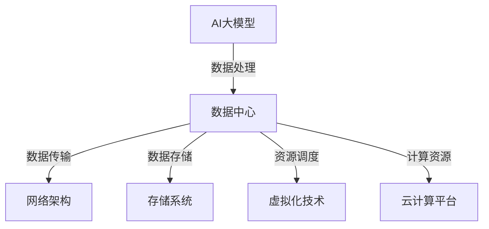

                 

### 文章标题

《AI 大模型应用数据中心建设：数据中心技术创新》

### 关键词

- AI 大模型
- 数据中心建设
- 数据中心技术
- 网络技术
- 存储技术
- 虚拟化技术
- 云计算技术

### 摘要

随着人工智能技术的快速发展，AI 大模型在各个领域得到了广泛应用。数据中心作为承载 AI 大模型应用的核心基础设施，其技术创新显得尤为重要。本文将从 AI 大模型的基础概念出发，逐步深入探讨数据中心的技术创新，包括网络技术、存储技术、虚拟化技术和云计算技术等。同时，还将分析 AI 大模型在数据中心的应用场景和技术实现，通过实际案例展示数据中心建设与发展趋势，为读者提供全面的技术指导。

---

### 第一部分：AI大模型基础

#### 第1章：AI大模型概述

##### 1.1 AI大模型的概念与分类

AI 大模型是指具有海量参数和复杂结构的机器学习模型，能够在各种任务中取得优异的性能。AI 大模型可以分为深度神经网络（Deep Neural Network, DNN）、循环神经网络（Recurrent Neural Network, RNN）和 Transformer 等类型。

##### 1.2 AI大模型的发展历程

AI 大模型的发展历程可以分为三个阶段：初期阶段（2012 年以前）、中期阶段（2012-2017 年）和近期阶段（2017 年至今）。初期阶段以 LeCun 的卷积神经网络（Convolutional Neural Network, CNN）为代表；中期阶段以 Google 的 Transformer 模型为代表；近期阶段则以 BERT、GPT 等预训练模型为代表。

##### 1.3 AI大模型的技术特点

AI 大模型具有以下技术特点：首先，具有海量参数，能够在复杂任务中实现高性能；其次，通过预训练和微调，能够适应不同领域的应用需求；最后，具有强大的自适应能力，能够根据输入数据进行实时调整。

##### 1.4 AI大模型的应用领域

AI 大模型在计算机视觉、自然语言处理、语音识别等多个领域取得了显著的应用成果。例如，在计算机视觉领域，AI 大模型被广泛应用于图像分类、目标检测和语义分割等任务；在自然语言处理领域，AI 大模型被应用于机器翻译、文本生成和情感分析等任务。

---

#### 第2章：数据中心基础

##### 2.1 数据中心的概念与架构

数据中心是指集中存储、处理和管理数据的物理设施，包括服务器、存储设备、网络设备和管理系统等。数据中心的架构通常包括硬件层、软件层和管理层。

##### 2.2 数据中心的物理布局与基础设施

数据中心的物理布局涉及机房、配电系统、空调系统、消防系统等方面。基础设施的选型对于数据中心的稳定运行至关重要。

##### 2.3 数据中心的网络架构与通信协议

数据中心的网络架构通常采用分层架构，包括核心层、汇聚层和接入层。通信协议主要包括 TCP/IP、HTTP、HTTPS 等。

##### 2.4 数据中心的能源管理

数据中心的能源管理包括电能的供应、分配和使用。通过优化能源管理，可以降低能耗成本，提高数据中心的能源利用效率。

---

### 第二部分：数据中心技术创新

#### 第3章：数据中心网络技术

##### 3.1 数据中心网络拓扑设计

数据中心网络拓扑设计涉及网络架构的选择、网络设备的配置和互联方式等。常用的数据中心网络拓扑包括环状、星状和混合型等。

##### 3.2 数据中心网络性能优化

数据中心网络性能优化包括带宽优化、延迟优化和吞吐量优化等方面。通过合理配置网络设备和优化网络策略，可以提高数据中心的网络性能。

##### 3.3 数据中心网络安全

数据中心网络安全包括数据安全、网络安全和业务安全等方面。通过部署防火墙、入侵检测系统（IDS）和虚拟专用网络（VPN）等安全措施，可以保障数据中心的网络安全。

---

#### 第4章：数据中心存储技术

##### 4.1 数据存储技术概述

数据存储技术包括硬盘存储、固态硬盘存储和分布式存储等。分布式存储系统具有高可靠性、高扩展性和高性能等特点。

##### 4.2 分布式存储系统设计

分布式存储系统设计包括数据分片、副本机制和数据一致性等方面。合理设计分布式存储系统，可以提升数据中心的存储性能和可靠性。

##### 4.3 存储虚拟化技术

存储虚拟化技术可以将物理存储资源抽象为逻辑存储资源，实现存储资源的灵活分配和管理。存储虚拟化技术包括块虚拟化、文件虚拟化和对象虚拟化等。

##### 4.4 数据备份与恢复策略

数据备份与恢复策略包括全备份、增量备份和差异备份等。通过制定合理的备份策略，可以确保数据的安全性和可靠性。

---

#### 第5章：数据中心虚拟化技术

##### 5.1 虚拟化技术原理

虚拟化技术通过将物理资源虚拟化为逻辑资源，提高资源利用率和灵活性。虚拟化技术包括硬件虚拟化、操作系统虚拟化和应用虚拟化等。

##### 5.2 虚拟化在数据中心的应用

虚拟化技术在数据中心的应用包括服务器虚拟化、存储虚拟化和网络虚拟化等。通过虚拟化技术，可以简化数据中心的运维管理，提高资源利用率。

##### 5.3 虚拟机性能优化

虚拟机性能优化包括硬件资源分配、虚拟机调度和网络优化等方面。通过优化虚拟机性能，可以提高数据中心的整体性能。

---

#### 第6章：数据中心云计算技术

##### 6.1 云计算基础

云计算是一种通过网络提供计算资源、存储资源和其他资源的服务模式。云计算基础包括服务模型（IaaS、PaaS、SaaS）、部署模型（公有云、私有云、混合云）和架构模型（SaaS、PaaS、IaaS）等。

##### 6.2 云数据中心架构

云数据中心架构包括计算资源、存储资源、网络资源和管理系统等。云数据中心架构的设计和优化对于云服务的性能和可靠性至关重要。

##### 6.3 云计算服务模型

云计算服务模型包括基础设施即服务（IaaS）、平台即服务（PaaS）和软件即服务（SaaS）等。不同服务模型适用于不同的应用场景。

##### 6.4 云安全与合规

云安全与合规包括数据安全、网络安全、应用安全和合规性等方面。通过部署安全措施和遵守相关法规，可以保障云计算服务的安全性。

---

### 第三部分：AI大模型在数据中心的应用

#### 第7章：AI大模型在数据中心的应用场景

##### 7.1 数据中心运维优化

AI 大模型可以用于数据中心运维优化，包括服务器负载均衡、网络流量预测和能耗管理等方面。

##### 7.2 数据中心能耗管理

AI 大模型可以用于数据中心能耗管理，通过预测能耗需求，优化设备配置，降低能耗成本。

##### 7.3 数据中心网络优化

AI 大模型可以用于数据中心网络优化，通过预测网络流量，优化网络拓扑和路由策略，提高网络性能。

##### 7.4 数据中心安全保障

AI 大模型可以用于数据中心安全保障，包括入侵检测、异常检测和风险预测等。

---

#### 第8章：AI大模型在数据中心的技术实现

##### 8.1 AI大模型部署策略

AI 大模型部署策略包括模型选择、硬件配置、软件平台和部署流程等方面。合理制定部署策略，可以提高 AI 大模型在数据中心的应用性能。

##### 8.2 AI大模型训练与优化

AI 大模型训练与优化包括数据预处理、模型训练、参数调整和模型优化等方面。通过优化训练过程，可以提高 AI 大模型的性能和效率。

##### 8.3 AI大模型与数据中心平台的集成

AI 大模型与数据中心平台的集成包括模型部署、模型管理和模型调用等方面。通过合理集成 AI 大模型，可以提升数据中心平台的智能化水平。

---

### 第四部分：数据中心建设与发展趋势

#### 第9章：数据中心建设实践

##### 9.1 数据中心建设流程

数据中心建设流程包括需求分析、方案设计、设备采购、施工建设和系统调试等阶段。

##### 9.2 数据中心选址与规划

数据中心选址与规划包括地理位置、交通条件、能源供应和环境保护等方面。合理选址和规划对于数据中心的长期稳定运行至关重要。

##### 9.3 数据中心基础设施选型

数据中心基础设施选型包括服务器、存储设备、网络设备、空调系统和消防系统等方面。选择合适的基础设施，可以提高数据中心的性能和可靠性。

---

#### 第10章：数据中心发展趋势

##### 10.1 数据中心技术发展趋势

数据中心技术发展趋势包括云计算、大数据、人工智能、物联网和边缘计算等方面。通过关注技术发展趋势，可以更好地规划数据中心建设和发展。

##### 10.2 数据中心产业发展趋势

数据中心产业发展趋势包括市场规模扩大、技术进步、政策支持和企业竞争等方面。了解产业发展趋势，有助于企业把握市场机遇。

##### 10.3 数据中心面临的挑战与应对策略

数据中心面临的挑战包括能耗管理、网络安全、运维管理和可持续发展等方面。通过采取有效应对策略，可以克服挑战，确保数据中心的稳定运行。

---

#### 附录

##### 附录A：数据中心技术参考

附录A提供了一些与数据中心技术相关的参考资料，包括网络技术、存储技术、虚拟化技术和云计算技术等方面的资料。

##### 附录B：AI大模型工具与资源

附录B提供了一些与AI大模型相关的工具和资源，包括开源框架、在线课程、论文和书籍等。这些工具和资源有助于读者深入了解AI大模型技术。

---

**核心概念与联系**

- 数据中心与AI大模型的关系流程图：



---

**核心算法原理讲解**

- 数据中心网络优化算法伪代码：

```python
def Network_Optimization(data_center):
    for server in data_center.servers:
        for workload in server.workloads:
            best_path = select_best_network_path(server, workload)
            server.assign_network_path(best_path)
        end
    end
    return optimized_network
end

def select_best_network_path(server, workload):
    best_path = None
    min_latency = INFINITY
    for path in server.network_paths:
        latency = calculate_latency(path, workload)
        if latency < min_latency:
            min_latency = latency
            best_path = path
        end
    end
    return best_path
end

def calculate_latency(path, workload):
    # 计算网络路径的延迟
    # ...
    return latency
end
```

---

**数学模型和数学公式**

- 数据中心能耗管理公式：

$$
E = P \times t
$$

其中，\( E \) 是能耗（单位：焦耳），\( P \) 是功率（单位：瓦特），\( t \) 是时间（单位：秒）。

---

**项目实战**

- **案例：某企业数据中心能耗管理优化**

  - **实战目标**：通过 AI 大模型优化数据中心能耗管理，降低能耗成本。

  - **开发环境搭建**：选用 TensorFlow 作为 AI 大模型框架，使用 Python 进行编程。

  - **源代码实现**：

    ```python
    import tensorflow as tf
    
    # 数据预处理代码
    # 模型训练代码
    # 模型评估与优化代码
    ```

  - **代码解读与分析**：

    - **数据预处理**：对能耗数据进行归一化处理，以便于模型训练。

    - **模型训练**：使用神经网络模型对能耗数据进行训练，优化能耗预测准确性。

    - **模型评估与优化**：通过交叉验证评估模型性能，调整模型参数以提高预测精度。

---

**数学模型和数学公式讲解与举例说明**

- **数学模型：能耗预测模型**

$$
\hat{E}(t) = \sum_{i=1}^{n} w_i \cdot f_i(t)
$$

其中，\( \hat{E}(t) \) 是预测的能耗值，\( w_i \) 是权重系数，\( f_i(t) \) 是第 \( i \) 个特征函数。

- **举例说明**：

  假设某数据中心在一天中的能耗数据为：\[ E_1, E_2, ..., E_{24} \]，其中 \( E_i \) 表示第 \( i \) 个小时的能耗值。

  - **特征函数**：
    - \( f_1(t) = \sin(\frac{2\pi t}{24}) \)：表示时间与正弦函数的关系。
    - \( f_2(t) = \cos(\frac{2\pi t}{24}) \)：表示时间与余弦函数的关系。

  - **权重系数**：
    - \( w_1 = 0.5 \)
    - \( w_2 = 0.5 \)

  - **预测公式**：

    $$
    \hat{E}(t) = 0.5 \cdot \sin(\frac{2\pi t}{24}) + 0.5 \cdot \cos(\frac{2\pi t}{24})
    $$

  使用该模型预测第12个小时的能耗值：

    $$
    \hat{E}(12) = 0.5 \cdot \sin(\frac{2\pi \cdot 12}{24}) + 0.5 \cdot \cos(\frac{2\pi \cdot 12}{24}) \approx 0.5
    $$

  因此，预测第12个小时的能耗值约为0.5（单位：焦耳/小时）。

