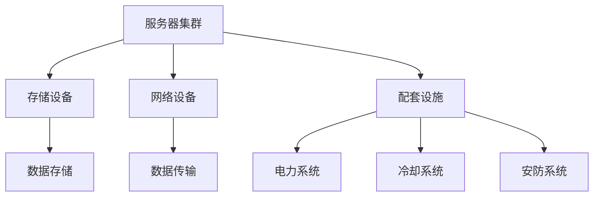
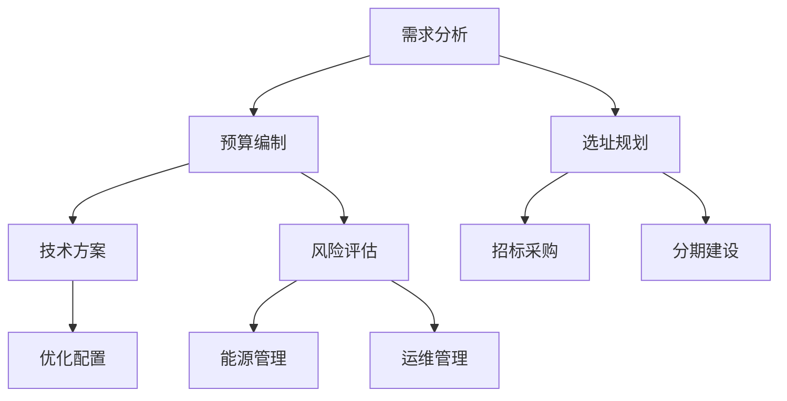
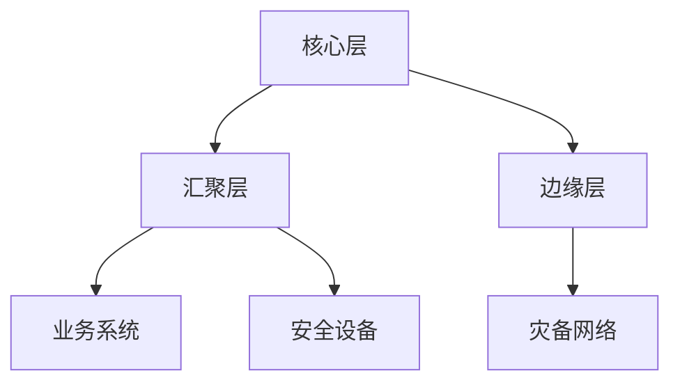
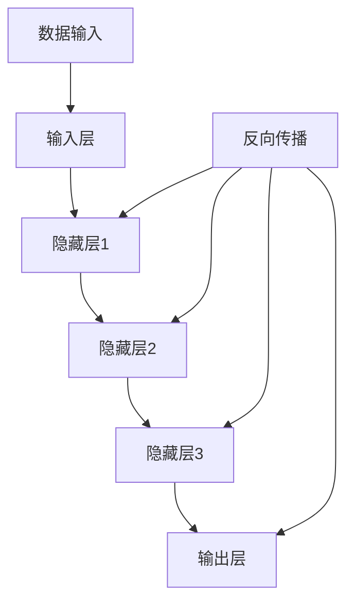
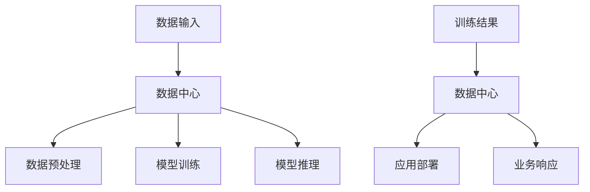
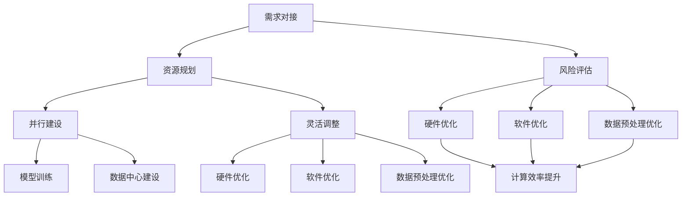
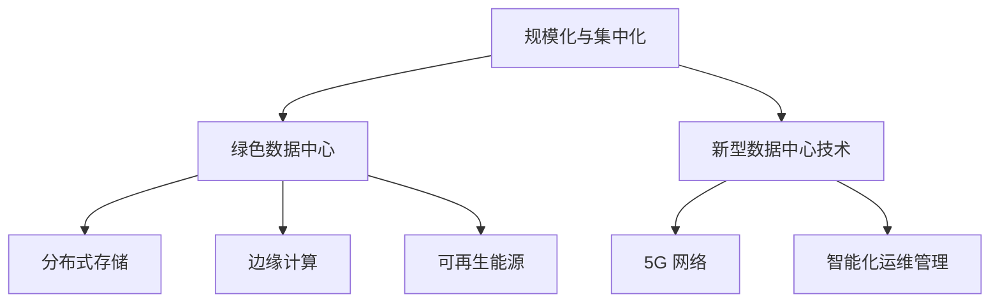
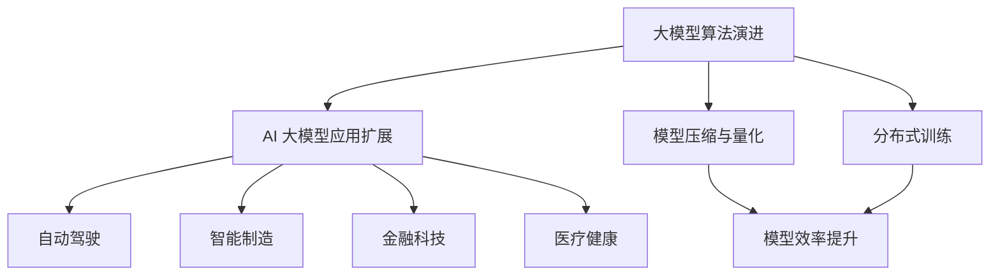
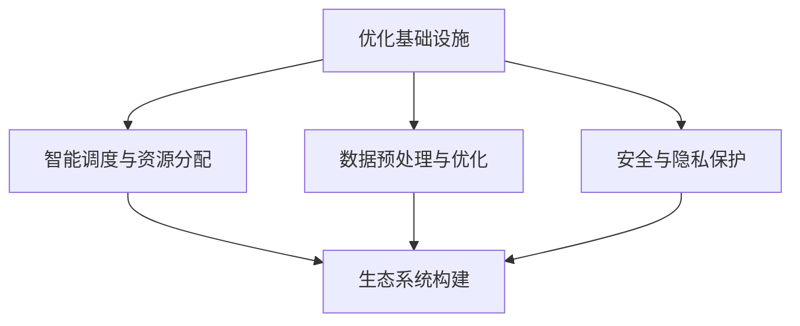

                 

### 文章标题

《AI 大模型应用数据中心建设：数据中心投资与建设》

### 关键词

AI 大模型、数据中心、投资、建设、效率、成本、风险管理

### 摘要

本文深入探讨了 AI 大模型应用数据中心的建设与投资问题。通过详细分析数据中心的基础概念、设计布局、投资策略、运营管理等核心内容，本文揭示了数据中心在 AI 大模型中的应用价值和重要性。同时，本文从数据中心投资预算制定、AI 大模型建设需求分析、协同规划等方面，阐述了数据中心投资与 AI 大模型建设的协同策略。结合实际案例，本文提供了数据中心建设与 AI 大模型应用的具体实践，并探讨了成本控制、风险管理等关键问题。最后，本文对未来数据中心与 AI 大模型建设趋势进行了展望，为相关领域的研究和实践提供了有价值的参考。

#### 第一部分: 数据中心建设基础

##### 第1章: 数据中心概述

###### 1.1 数据中心的核心概念与重要性

数据中心（Data Center）是指专门为存储、处理和管理大量数据而设计的建筑或设施。它是信息技术（IT）基础设施的核心，承载着各种业务应用和数据处理的任务。数据中心的重要性体现在其对业务连续性、数据安全性和性能的保障上。

**数据中心定义**：
数据中心是一个集中管理和处理数据的场所，它包括硬件设备（如服务器、存储设备、网络设备等）、软件系统（如数据库管理系统、网络管理系统等）以及相关的配套设施（如电力系统、冷却系统、安防系统等）。

**数据中心对业务的价值**：
1. **业务连续性**：数据中心提供了稳定可靠的计算和存储环境，确保关键业务系统的持续运行。
2. **数据安全性**：数据中心通过多种安全措施保护数据，包括物理安全、网络安全和数据加密等。
3. **数据处理能力**：数据中心提供了强大的计算能力和存储容量，支持大规模数据处理和分析。
4. **数据共享与协作**：数据中心支持跨部门、跨地域的数据共享和协作，提高工作效率和业务敏捷性。

**数据中心的分类与架构**：

数据中心根据不同的应用场景和规模可以分为多种类型，常见的分类方式如下：

- **按规模分类**：小型数据中心、中型数据中心、大型数据中心
- **按功能分类**：企业内部数据中心、云计算数据中心、数据中心集群
- **按地域分类**：本地数据中心、远程数据中心、边缘数据中心

数据中心的架构主要包括以下几个关键组件：

1. **服务器集群**：用于运行各种应用程序和存储大量数据。
2. **存储设备**：用于持久化存储数据，包括磁盘阵列、固态硬盘等。
3. **网络设备**：如交换机、路由器等，负责数据传输和网络连接。
4. **配套设施**：如电力系统、冷却系统、安防系统等，为数据中心提供必要的运行支持。

**Mermaid 流程图：数据中心基本架构与组件**



通过以上架构与组件的描述，我们可以清晰地了解数据中心的核心概念和组成部分。接下来，我们将进一步探讨数据中心的投资建设策略，为后续内容做好铺垫。

###### 1.2 数据中心的投资建设策略

**数据中心投资的关键因素**：

数据中心的建设投资涉及多个关键因素，包括硬件设备、软件系统、配套设施、人力资源和运营成本等。以下是主要的关键因素及其对投资决策的影响：

1. **硬件设备**：服务器、存储设备、网络设备等是数据中心的核心组件，其性能和容量直接影响数据中心的处理能力和可靠性。硬件设备的投资成本往往是数据中心建设中的最大部分。
2. **软件系统**：包括操作系统、数据库管理系统、网络管理系统等，这些软件系统的选择和配置对数据中心的稳定性和效率有重要影响。
3. **配套设施**：如电力系统、冷却系统、安防系统等，这些配套设施的建设和维护费用也是不可忽视的成本因素。
4. **人力资源**：数据中心需要专业的运维人员和管理团队，其薪资和培训费用也是投资建设中的重要考虑因素。
5. **运营成本**：包括能耗、网络带宽、维护保养等，这些运营成本会随着数据中心的运行时间而逐渐累积。

**数据中心建设的前期规划**：

在制定数据中心建设策略时，前期规划至关重要。以下是一些关键的前期规划步骤：

1. **需求分析**：明确数据中心的建设目标和需求，包括业务规模、数据处理能力、安全性要求等。
2. **预算编制**：根据需求分析结果，制定详细的预算计划，包括硬件设备、软件系统、配套设施和运营成本等。
3. **选址规划**：选择合适的地理位置，考虑电力供应、网络连接、环境因素等。
4. **技术方案**：选择适合的技术方案，包括硬件设备、软件系统和网络架构等。
5. **风险评估**：评估建设过程中可能遇到的风险，制定相应的应对措施。

**数据中心建设的成本控制策略**：

在数据中心建设过程中，成本控制是确保项目顺利进行的重要环节。以下是一些成本控制策略：

1. **招标采购**：通过招标采购，选择性价比高的硬件设备和服务提供商，降低采购成本。
2. **分期建设**：根据业务需求，分阶段实施数据中心建设，逐步投入，避免一次性投入过大。
3. **优化配置**：通过优化硬件设备和软件系统的配置，提高资源利用率，降低运营成本。
4. **能源管理**：采用节能技术，优化电力和冷却系统的运行，降低能耗成本。
5. **运维管理**：通过高效的运维管理，减少故障率，降低运维成本。

**Mermaid 流程图：数据中心投资决策流程**



通过以上流程，可以系统地规划数据中心的建设过程，确保投资的有效性和项目的顺利进行。

在接下来的章节中，我们将进一步探讨数据中心的详细设计与布局，为读者提供更全面的建设指导。

###### 1.3 数据中心设计与布局

数据中心的成功建设不仅依赖于合理的投资和前期规划，还需要精心设计和布局。本节将详细介绍数据中心基础设施设计、网络布局和运营管理，帮助读者全面了解数据中心的构建与优化策略。

**2.1 数据中心基础设施设计**

数据中心基础设施的设计是确保数据中心稳定、高效运行的基础。以下是基础设施设计的关键要素：

**硬件设备选择与配置**：

1. **服务器**：服务器是数据中心的计算核心，选择合适的服务器类型和配置至关重要。根据业务需求，可以选择高性能的专用服务器或者基于虚拟化技术的服务器集群。关键指标包括CPU性能、内存容量、存储性能和网络接口等。
2. **存储设备**：存储设备用于数据的持久化存储。常见的存储设备包括磁盘阵列（SAN）和直接附加存储（DAS）。在选择存储设备时，需要考虑存储容量、读写速度、数据冗余和备份等因素。
3. **网络设备**：网络设备包括交换机、路由器、防火墙等，它们负责数据传输和网络安全。在选择网络设备时，需要考虑设备的性能、可靠性、可扩展性以及网络协议支持等。

**冷却与供电系统的设计与实现**：

1. **电力系统**：电力系统是数据中心的动力来源，必须确保供电的稳定性和持续性。数据中心通常采用双路电力供应，即两路独立的电源线路，以避免单点故障。此外，备用电源（UPS）和备用发电机也是必要的配置。
2. **冷却系统**：冷却系统用于维持数据中心的适宜温度，避免设备过热。常见的冷却系统包括空气冷却和水冷却。在设计冷却系统时，需要考虑设备密度、散热需求和能源效率等因素。

**机房设计与安全措施**：

1. **物理安全**：机房的安全设计至关重要，包括门禁系统、视频监控系统、入侵检测系统等，以确保设备的安全。
2. **网络安全**：数据中心网络的安全设计包括防火墙、入侵防御系统（IPS）、虚拟专用网络（VPN）等，以保护数据不被未授权访问。
3. **备份与恢复**：数据中心需要定期进行数据备份，并制定灾难恢复计划，以应对数据丢失和系统故障。

**伪代码：数据中心基础设施设计关键参数计算**

```python
# 计算服务器性能需求
def calculate_server_requirements(workload):
    cpu_cores = workload * 2  # CPU核心数
    memory_size = workload * 4  # 内存大小（GB）
    storage_size = workload * 10  # 存储大小（TB）
    return cpu_cores, memory_size, storage_size

# 计算冷却系统容量
def calculate_cooling_capacity(heat_load):
    cooling_power = heat_load * 1.5  # 考虑冗余
    return cooling_power

# 计算电力系统需求
def calculate_power_supply需求(electricity_usage):
    backup_power = electricity_usage * 2  # 备用电源
    total_power = electricity_usage + backup_power
    return total_power
```

**2.2 数据中心网络布局**

数据中心网络布局是确保数据高效传输和安全的关键。以下是网络布局设计的关键原则和策略：

**网络架构设计原则**：

1. **高可用性**：设计冗余的网络架构，确保网络故障时业务连续性。
2. **高性能**：选择高性能的网络设备，确保数据传输速度和低延迟。
3. **可扩展性**：设计可扩展的网络架构，以适应未来业务增长。
4. **安全性**：加强网络安全措施，防止网络攻击和数据泄露。

**数据传输与网络带宽规划**：

1. **分层设计**：采用分层网络设计，包括核心层、汇聚层和边缘层，提高网络灵活性和可管理性。
2. **带宽分配**：根据业务需求，合理分配带宽资源，确保关键业务得到足够的网络带宽。
3. **负载均衡**：采用负载均衡技术，均衡网络负载，避免单点过载。

**安全与灾备网络策略**：

1. **防火墙与入侵检测**：部署防火墙和入侵检测系统，加强网络安全防护。
2. **灾备网络**：建立灾备网络，通过专线或VPN连接，实现数据中心间的数据备份和业务切换。

**Mermaid 流程图：数据中心网络布局方案**



通过以上设计原则和策略，数据中心网络可以实现高效、安全、可靠的运行。

**2.3 数据中心运营管理**

数据中心运营管理是确保数据中心稳定运行和高效服务的关键。以下是运营管理的核心内容和策略：

**数据中心运维管理流程**：

1. **日常运维**：包括服务器维护、网络监控、系统更新等，确保数据中心日常运行正常。
2. **故障处理**：建立故障处理流程，快速响应和处理故障，减少业务中断时间。
3. **性能监控**：实时监控数据中心各项性能指标，如CPU使用率、内存使用率、网络带宽等，及时发现和解决问题。

**故障处理与应急预案**：

1. **故障处理**：建立故障处理流程，包括故障上报、故障定位、故障修复等步骤。
2. **应急预案**：制定应急预案，包括停电、网络故障、设备故障等，确保在发生突发事件时能够迅速响应和恢复业务。

**能源效率管理**：

1. **能源监控**：实时监控能源使用情况，包括电力消耗、冷却系统运行状态等。
2. **节能措施**：采用节能技术和设备，如高效UPS、智能冷却系统等，降低能耗成本。

**伪代码：数据中心运维关键指标监控与优化**

```python
# 监控服务器性能指标
def monitor_server_performance(server_list):
    for server in server_list:
        print(f"Server {server['id']}: CPU usage {server['cpu_usage']}, Memory usage {server['memory_usage']}")

# 优化冷却系统
def optimize_cooling_system(heat_load, cooling_system):
    if heat_load > cooling_system['max_heat_load']:
        cooling_system['power'] += 10  # 增加冷却功率
    else:
        cooling_system['power'] -= 10  # 减少冷却功率

# 能源监控与优化
def monitor_energy_usage(electricity_usage, cooling_system):
    optimize_cooling_system(heat_load, cooling_system)
    if electricity_usage > threshold:
        print("Energy usage is high. Taking optimization measures.")
    else:
        print("Energy usage is within limit.")
```

通过以上运营管理流程和策略，数据中心可以保持稳定、高效、安全地运行，为业务提供可靠的支持。

在下一节中，我们将探讨 AI 大模型与数据中心的关系，深入分析数据中心在 AI 大模型中的应用和优化策略。

#### 第二部分: AI 大模型应用数据中心建设

##### 第3章: AI 大模型与数据中心的关系

AI 大模型，即人工智能大型模型，是当今人工智能领域的重要研究方向和应用方向。这些模型具有庞大的参数规模和计算需求，对数据中心的依赖性极高。本节将详细探讨 AI 大模型的基本原理、数据中心在其中的作用以及如何优化数据中心以提升 AI 大模型的计算效率。

**3.1 AI 大模型的基本原理**

AI 大模型，如深度学习中的大型神经网络，通过大量参数进行训练，以实现复杂的特征提取和决策能力。这些模型通常包含数十亿甚至数万亿个参数，因此对计算资源和存储资源的需求极为庞大。

**AI 大模型的基本概念**：

AI 大模型通常基于深度学习技术，是一种由多层神经网络组成的复杂模型。其核心思想是通过反向传播算法，从大量数据中学习到有效的特征表示和决策规则。常见的 AI 大模型包括卷积神经网络（CNN）、循环神经网络（RNN）、变换器（Transformer）等。

**AI 大模型的发展历程**：

AI 大模型的发展历程可以追溯到上世纪 80 年代，随着计算能力的提升和算法的进步，AI 大模型在近年来取得了突破性进展。从早期的简单神经网络到深度学习的兴起，再到如今的大型预训练模型，AI 大模型的发展推动了人工智能技术的快速进步。

**AI 大模型的应用场景**：

AI 大模型在诸多领域都有着广泛的应用，包括自然语言处理、计算机视觉、推荐系统、语音识别等。以下是几个典型的应用场景：

1. **自然语言处理**：AI 大模型可以用于文本分类、机器翻译、情感分析等任务，极大地提升了文本处理的效果和效率。
2. **计算机视觉**：AI 大模型在图像分类、目标检测、图像生成等方面表现出色，为计算机视觉应用提供了强大的支持。
3. **推荐系统**：AI 大模型可以用于用户行为分析，实现个性化的推荐服务，广泛应用于电子商务、社交媒体等领域。
4. **语音识别**：AI 大模型可以用于语音合成和语音识别，提升了人机交互的体验。

**Mermaid 流程图：AI 大模型的基本架构与流程**



在这个流程图中，输入层接收外部输入数据，通过隐藏层的逐层变换，最终在输出层生成预测结果。反向传播算法则用于根据预测误差调整模型参数，以优化模型性能。

**数据中心在 AI 大模型中的应用**

数据中心在 AI 大模型的训练和推理过程中发挥着至关重要的作用。以下是其主要应用：

**数据中心为 AI 大模型提供计算资源**：

数据中心提供了强大的计算能力，支持 AI 大模型的训练和推理任务。通过部署高性能服务器和 GPU 设备，数据中心可以满足 AI 大模型对计算资源的需求。

**数据中心在 AI 大模型训练与推理中的作用**：

1. **训练过程**：AI 大模型需要通过大量数据进行训练，数据中心提供了大规模的存储能力和高效的计算资源，可以加速模型的训练速度。
2. **推理过程**：在模型训练完成后，数据中心支持模型的高效推理，为各类应用场景提供实时响应。

**数据中心优化 AI 大模型计算效率的策略**：

1. **分布式计算**：通过分布式计算架构，将 AI 大模型的计算任务分布在多台服务器上，实现并行处理，提升计算效率。
2. **GPU 加速**：GPU 设备在 AI 大模型训练过程中具有显著的性能优势，数据中心可以部署 GPU 硬件，加速模型的训练和推理。
3. **数据预处理**：数据中心可以进行大规模的数据预处理任务，如数据清洗、数据增强等，提高模型的训练质量和效果。
4. **混合云架构**：通过混合云架构，数据中心可以灵活地调整计算资源，实现按需分配，降低计算成本。

**Mermaid 流程图：数据中心与 AI 大模型协同工作流程**



在这个协同工作流程中，数据输入经过数据中心预处理后，进行模型训练和推理。训练结果存储在数据中心，用于应用部署和业务响应。

通过以上分析，我们可以看到数据中心在 AI 大模型应用中的关键作用和优化策略。在下一节中，我们将进一步探讨数据中心投资与 AI 大模型建设的协同规划，为读者提供更全面的实施指导。

##### 第4章: 数据中心投资与 AI 大模型建设的协同规划

数据中心的建设和 AI 大模型的发展是当今信息技术领域中的两大热点。为了实现两者的高效协同，确保数据中心能够为 AI 大模型提供足够的计算资源和稳定运行环境，本节将详细探讨数据中心投资预算制定、AI 大模型建设需求分析以及协同规划策略。

**4.1 数据中心投资预算制定**

数据中心投资预算的制定是确保项目顺利实施和资源合理配置的关键步骤。以下是一些关键步骤和策略：

**数据中心投资预算的构成**：

数据中心投资预算通常包括以下几个主要组成部分：

1. **硬件设备成本**：包括服务器、存储设备、网络设备等硬件设备的采购和部署成本。
2. **软件系统成本**：包括操作系统、数据库管理系统、网络管理系统等软件系统的采购和许可费用。
3. **配套设施成本**：包括电力系统、冷却系统、安防系统等配套设施的建设和维护费用。
4. **人力资源成本**：包括数据中心运维人员、管理人员和技术支持人员的薪资和培训费用。
5. **运营成本**：包括日常运维、能源消耗、网络带宽、维护保养等运营费用。

**预算分配原则与策略**：

在制定预算时，应遵循以下原则和策略：

1. **优先级原则**：根据业务需求和优先级，合理分配预算。例如，硬件设备和软件系统的采购应优先考虑，以确保数据中心的计算能力和数据处理能力。
2. **分期投入**：根据数据中心的建设进度和业务需求，采取分期投入的策略，避免一次性投入过大，降低资金压力。
3. **成本效益分析**：在预算分配中，应进行成本效益分析，选择性价比高的设备和方案，降低总体成本。
4. **灵活调整**：根据项目实施情况和业务需求变化，灵活调整预算分配，确保资源得到最优配置。

**预算执行与监控方法**：

1. **预算执行**：在项目实施过程中，应严格按照预算计划执行，确保各项支出在预算范围内。
2. **监控与审计**：定期对预算执行情况进行监控和审计，及时发现和解决问题，确保预算的合理使用。

**伪代码：数据中心投资预算分配模型**

```python
# 设定预算总额
total_budget = 1000000

# 分配预算
def allocate_budget():
    hardware_cost = total_budget * 0.4  # 硬件设备成本
    software_cost = total_budget * 0.2  # 软件系统成本
    facility_cost = total_budget * 0.2  # 配设施成本
    hr_cost = total_budget * 0.1  # 人力资源成本
    operational_cost = total_budget * 0.1  # 运营成本
    return hardware_cost, software_cost, facility_cost, hr_cost, operational_cost

# 执行预算分配
hardware_cost, software_cost, facility_cost, hr_cost, operational_cost = allocate_budget()
print("硬件设备成本：", hardware_cost)
print("软件系统成本：", software_cost)
print("配套设施成本：", facility_cost)
print("人力资源成本：", hr_cost)
print("运营成本：", operational_cost)
```

通过以上策略和方法，可以确保数据中心投资预算的合理制定和执行，为数据中心的稳定运行提供资金保障。

**4.2 AI 大模型建设需求分析**

AI 大模型建设需求分析是数据中心投资与 AI 大模型建设协同规划的重要环节。以下是一些关键步骤和策略：

**AI 大模型建设需求评估**：

在建设 AI 大模型时，首先需要进行需求评估，明确模型的应用场景、性能要求和资源需求。以下是一些关键评估指标：

1. **计算需求**：根据模型训练和推理的计算复杂度，评估所需的计算资源，如CPU、GPU、FPGA等。
2. **存储需求**：根据模型参数和数据规模，评估所需的存储容量，包括临时存储和持久化存储。
3. **数据需求**：评估模型所需的训练数据和标注数据，包括数据来源、数据质量和数据规模。
4. **网络需求**：评估模型对网络带宽和延迟的要求，以确保数据传输的效率和稳定性。

**AI 大模型计算资源需求预测**：

为了更好地进行数据中心规划和资源分配，需要预测 AI 大模型的计算资源需求。以下是一些预测方法：

1. **历史数据分析**：通过分析历史训练和推理任务的数据，预测未来模型的资源需求。
2. **模型规模预测**：根据模型的规模和复杂度，预测其所需的计算资源和存储资源。
3. **趋势分析**：分析 AI 大模型的发展趋势和业务需求增长，预测未来模型的资源需求。

**数据中心扩展规划与 AI 大模型建设的协同**：

数据中心扩展规划应与 AI 大模型建设需求紧密协同，确保数据中心的计算能力和存储能力能够满足模型的需求。以下是一些协同策略：

1. **弹性扩展**：根据模型资源需求的变化，灵活扩展数据中心的计算和存储资源，避免资源浪费。
2. **混合云架构**：采用混合云架构，结合公有云和私有云资源，实现按需分配和弹性扩展。
3. **分阶段建设**：根据模型需求和预算，分阶段进行数据中心的建设和扩展，逐步满足模型的需求。

**伪代码：AI 大模型计算资源需求预测模型**

```python
# 计算模型计算资源需求
def predict_model_resources(model_size, complexity):
    # 根据模型规模和复杂度预测计算资源需求
    cpu_cores = model_size * complexity
    gpu_cores = model_size * complexity * 0.5  # 假设 GPU 约占 CPU 的一半
    storage_size = model_size * 10  # 假设模型存储需求为规模的一倍
    return cpu_cores, gpu_cores, storage_size

# 预测模型资源需求
model_size = 1000  # 模型规模
complexity = 3  # 模型复杂度
cpu_cores, gpu_cores, storage_size = predict_model_resources(model_size, complexity)
print("CPU 核心数需求：", cpu_cores)
print("GPU 核心数需求：", gpu_cores)
print("存储容量需求：", storage_size)
```

通过以上分析和预测，可以准确了解 AI 大模型的建设需求，为数据中心的投资和规划提供科学依据。

**4.3 数据中心与 AI 大模型建设协同策略**

数据中心与 AI 大模型建设需要紧密协同，确保资源的高效利用和业务的连续稳定运行。以下是一些关键协同策略：

**数据中心与 AI 大模型建设的前期协调**：

1. **需求对接**：在项目启动阶段，数据中心团队和 AI 大模型团队应进行深入的需求对接，明确双方的需求和期望。
2. **资源规划**：根据 AI 大模型的建设需求，数据中心团队应提前进行资源规划，确保计算、存储和网络资源能够满足模型的需求。
3. **风险评估**：在项目启动前，进行风险识别和评估，制定相应的应对措施，降低建设过程中的风险。

**数据中心建设与 AI 大模型训练的并行推进**：

1. **并行建设**：在数据中心建设过程中，可以与 AI 大模型训练任务并行推进，避免项目延期。
2. **灵活调整**：根据 AI 大模型训练任务的进度和资源需求，灵活调整数据中心的建设计划和资源配置，确保模型能够及时获取所需的计算资源。

**数据中心优化与 AI 大模型效率提升的协同策略**：

1. **优化硬件配置**：根据 AI 大模型的特点和需求，优化数据中心的硬件配置，选择适合的 CPU、GPU 和存储设备，提升计算效率。
2. **优化软件系统**：针对 AI 大模型的应用场景，优化数据中心软件系统的配置，提高数据处理和分析的效率。
3. **数据预处理优化**：在数据中心进行大规模数据预处理任务，提高数据的清洗、标注和增强效率，为模型训练提供高质量的训练数据。

**Mermaid 流程图：数据中心与 AI 大模型建设协同工作流程**



通过以上协同策略，可以确保数据中心与 AI 大模型建设的高效协同，实现资源的最优利用和业务连续稳定运行。

在下一节中，我们将通过实际案例，详细探讨 AI 大模型数据中心建设的实施过程，为读者提供实践指导。

##### 第5章: AI 大模型数据中心建设实践案例

在本节中，我们将通过一个实际案例，详细探讨 AI 大模型数据中心的建立过程，包括基础设施建设、AI 大模型建设实施以及代码实现与详细解读。通过这个案例，读者可以了解到 AI 大模型数据中心建设的具体步骤和关键细节。

**5.1 案例背景与目标**

案例企业是一家领先的科技公司，致力于开发和应用先进的人工智能技术。为了满足业务快速增长的需求，公司决定建设一个高性能的 AI 大模型数据中心，以支持大规模的数据处理和模型训练任务。

**案例建设目标与挑战**：

1. **建设目标**：
   - 提供强大的计算能力和存储容量，满足公司未来三年内 AI 大模型训练和推理的需求。
   - 确保数据中心的稳定性和安全性，降低故障率和停机时间。
   - 实现高效的数据处理和模型训练，提升公司 AI 应用的效率。

2. **挑战**：
   - 高性能硬件设备的采购和配置。
   - 网络架构的优化和安全性。
   - AI 大模型训练任务的调度和管理。
   - 数据中心的能耗管理和成本控制。

**5.2 数据中心基础设施建设**

**服务器与存储设备配置**：

为了满足 AI 大模型的计算和存储需求，公司选择了以下设备：

- **服务器**：采购了多台高性能服务器，包括专用的 GPU 服务器和 CPU 服务器。每台服务器配备了多个 CPU 核心、高内存容量和大容量硬盘。
- **存储设备**：部署了磁盘阵列（SAN）和固态硬盘（SSD）混合存储系统，确保数据的高效读写和持久化存储。

**网络架构设计与优化**：

公司采用分布式网络架构，包括核心层、汇聚层和边缘层，以确保数据的高效传输和网络的可靠性。关键步骤如下：

- **核心层**：配置高性能路由器和交换机，实现数据中心内部和外部网络的高速连接。
- **汇聚层**：部署多台交换机，连接核心层和边缘层，实现数据流的分层处理。
- **边缘层**：配置边缘服务器和设备，处理本地数据和实时任务，减少数据传输延迟。

**冷却与供电系统建设**：

为了确保数据中心的稳定运行，公司采取了以下措施：

- **电力系统**：建设了双路电力供应系统，包括主电源和备用电源，确保电力供应的连续性。
- **冷却系统**：采用了水冷和风冷相结合的冷却系统，确保服务器在高温环境下的散热效率。

**伪代码：数据中心基础设施建设方案设计与优化**

```python
# 服务器配置参数计算
def calculate_server_config(compute需求和storage需求):
    cpu_cores = compute需求 * 2
    memory_size = compute需求 * 4
    storage_size = storage需求 * 10
    return cpu_cores, memory_size, storage_size

# 网络架构优化
def optimize_network_architecture(data中心的规模):
    if data中心的规模 > 1000:
        core_layer_devices = "多台高性能路由器和交换机"
        aggregation_layer_devices = "多台交换机"
        edge_layer_devices = "边缘服务器和设备"
    else:
        core_layer_devices = "高性能路由器和交换机"
        aggregation_layer_devices = "交换机"
        edge_layer_devices = "服务器"
    return core_layer_devices, aggregation_layer_devices, edge_layer_devices

# 冷却系统优化
def optimize_cooling_system(heat_load):
    if heat_load > max_heat_load:
        cooling_system = "水冷和风冷相结合的冷却系统"
    else:
        cooling_system = "风冷冷却系统"
    return cooling_system

# 供电系统优化
def optimize_power_system(electricity_usage):
    backup_power = electricity_usage * 2
    total_power = electricity_usage + backup_power
    return total_power
```

通过以上方案设计和优化，数据中心的基础设施能够满足公司 AI 大模型的高性能需求，确保数据中心的稳定运行。

**5.3 AI 大模型建设实施**

**AI 大模型选型与配置**：

为了满足不同业务需求，公司选择了多种类型的 AI 大模型，包括卷积神经网络（CNN）、循环神经网络（RNN）和变换器（Transformer）。针对不同模型，进行了如下配置：

- **CNN 模型**：用于图像分类任务，选择了适合图像处理的高性能 GPU 服务器。
- **RNN 模型**：用于序列数据处理，选择了具有高内存容量和并行计算能力的 CPU 服务器。
- **Transformer 模型**：用于自然语言处理任务，选择了多 GPU 并行计算架构。

**数据预处理与模型训练**：

在模型训练前，公司对数据进行预处理，包括数据清洗、数据增强和批量处理。具体步骤如下：

- **数据清洗**：去除数据中的噪声和异常值，提高数据质量。
- **数据增强**：通过旋转、缩放、裁剪等操作，增加数据的多样性和丰富度，提高模型泛化能力。
- **批量处理**：将大规模数据进行批量处理，提高训练效率。

**模型推理与部署**：

在模型训练完成后，公司进行了模型推理和部署，确保模型能够高效地应用于实际业务场景。具体步骤如下：

- **模型推理**：使用推理服务器，对输入数据进行实时处理和预测，生成业务结果。
- **模型部署**：将训练好的模型部署到生产环境中，与业务系统进行集成，实现自动化运行。

**代码实现与详细解读**：

以下是一个简单的 AI 大模型训练和推理的伪代码示例，用于说明实施过程。

```python
# 导入必要的库和模块
import tensorflow as tf
from tensorflow.keras.models import Sequential
from tensorflow.keras.layers import Conv2D, MaxPooling2D, Flatten, Dense

# 数据预处理
def preprocess_data(data):
    # 数据清洗
    cleaned_data = clean_data(data)
    # 数据增强
    enhanced_data = enhance_data(cleaned_data)
    return enhanced_data

# CNN 模型训练
def train_cnn_model(data, labels):
    model = Sequential([
        Conv2D(filters=32, kernel_size=(3, 3), activation='relu', input_shape=(28, 28, 1)),
        MaxPooling2D(pool_size=(2, 2)),
        Conv2D(filters=64, kernel_size=(3, 3), activation='relu'),
        MaxPooling2D(pool_size=(2, 2)),
        Flatten(),
        Dense(units=128, activation='relu'),
        Dense(units=10, activation='softmax')
    ])

    model.compile(optimizer='adam', loss='categorical_crossentropy', metrics=['accuracy'])
    model.fit(data, labels, epochs=10, batch_size=32)
    return model

# 模型推理
def inference(model, test_data):
    predictions = model.predict(test_data)
    return predictions

# 主函数
def main():
    # 读取数据
    train_data, train_labels, test_data, test_labels = load_data()
    # 数据预处理
    processed_train_data = preprocess_data(train_data)
    processed_test_data = preprocess_data(test_data)
    # 训练模型
    model = train_cnn_model(processed_train_data, train_labels)
    # 模型推理
    predictions = inference(model, processed_test_data)
    # 输出结果
    print(predictions)

# 执行主函数
if __name__ == "__main__":
    main()
```

通过以上代码实现，公司能够高效地训练和部署 AI 大模型，为业务提供强大的支持。

**总结**：

通过本案例的详细探讨，我们了解了 AI 大模型数据中心建设的具体步骤和关键细节。从基础设施建设到 AI 大模型建设实施，再到代码实现与详细解读，每个环节都至关重要。通过科学规划和实施，公司成功建立了高性能的 AI 大模型数据中心，为业务的发展提供了强大的技术支持。

在下一节中，我们将进一步探讨数据中心投资与建设成本控制，帮助读者更好地管理数据中心建设中的成本。

##### 第6章: 数据中心投资与建设成本控制

数据中心的建设和运营涉及大量的资金投入，成本控制是确保项目顺利实施和投资回报的关键。本节将详细分析数据中心投资成本的构成，探讨成本控制策略与实施方法，并介绍成本效益分析的相关内容。

**6.1 数据中心投资成本构成分析**

数据中心投资成本包括硬件设备、软件系统、配套设施、人力资源和运营成本等多个方面，以下是主要成本的构成：

**1. 硬件设备成本**：

硬件设备是数据中心的核心组件，包括服务器、存储设备、网络设备等。硬件设备成本通常占数据中心总投资的较大比例。主要成本构成如下：

- **服务器**：包括 CPU、内存、硬盘等。
- **存储设备**：包括磁盘阵列、固态硬盘等。
- **网络设备**：包括交换机、路由器、防火墙等。

**2. 软件系统成本**：

软件系统包括操作系统、数据库管理系统、网络管理系统等。软件系统成本取决于选择的系统类型、功能需求以及许可费用。主要成本构成如下：

- **操作系统**：如 Windows Server、Linux 等。
- **数据库管理系统**：如 MySQL、Oracle 等。
- **网络管理系统**：用于监控和管理网络设备。

**3. 配套设施成本**：

配套设施包括电力系统、冷却系统、安防系统等，这些系统为数据中心的正常运行提供必要的支持。主要成本构成如下：

- **电力系统**：包括 UPS、备用发电机等。
- **冷却系统**：包括空气冷却和水冷却设备。
- **安防系统**：包括门禁系统、视频监控系统等。

**4. 人力资源成本**：

数据中心需要专业的运维人员和管理团队，人力资源成本包括员工的薪资、福利、培训等费用。主要成本构成如下：

- **运维人员**：负责日常运维和管理。
- **管理人员**：负责数据中心的建设和运营管理。

**5. 运营成本**：

运营成本包括日常运维、能耗、网络带宽、维护保养等。运营成本是数据中心长期运行中的主要开支。主要成本构成如下：

- **日常运维**：包括系统监控、故障处理、安全防护等。
- **能耗**：包括电力消耗、冷却系统能耗等。
- **网络带宽**：根据数据传输需求进行带宽采购。
- **维护保养**：包括设备维护、系统升级等。

**伪代码：数据中心投资成本计算模型**

```python
# 计算硬件设备成本
def calculate_hardware_cost(server_count, storage_count, network_count):
    server_cost = server_count * server_price
    storage_cost = storage_count * storage_price
    network_cost = network_count * network_price
    return server_cost, storage_cost, network_cost

# 计算软件系统成本
def calculate_software_cost(os_count, dbms_count, nms_count):
    os_cost = os_count * os_price
    dbms_cost = dbms_count * dbms_price
    nms_cost = nms_count * nms_price
    return os_cost, dbms_cost, nms_cost

# 计算配套设施成本
def calculate_facility_cost(power_cost, cooling_cost, security_cost):
    total_cost = power_cost + cooling_cost + security_cost
    return total_cost

# 计算人力资源成本
def calculate_hr_cost(employee_count, salary_per_employee):
    hr_cost = employee_count * salary_per_employee
    return hr_cost

# 计算运营成本
def calculate_operational_cost(energy_cost, bandwidth_cost, maintenance_cost):
    operational_cost = energy_cost + bandwidth_cost + maintenance_cost
    return operational_cost

# 综合计算数据中心投资成本
def calculate_total_investment_cost(server_count, storage_count, network_count, os_count, dbms_count, nms_count, employee_count, power_cost, cooling_cost, security_cost, energy_cost, bandwidth_cost, maintenance_cost):
    server_cost, storage_cost, network_cost = calculate_hardware_cost(server_count, storage_count, network_count)
    os_cost, dbms_cost, nms_cost = calculate_software_cost(os_count, dbms_count, nms_count)
    facility_cost = calculate_facility_cost(power_cost, cooling_cost, security_cost)
    hr_cost = calculate_hr_cost(employee_count, salary_per_employee)
    operational_cost = calculate_operational_cost(energy_cost, bandwidth_cost, maintenance_cost)
    total_cost = server_cost + storage_cost + network_cost + os_cost + dbms_cost + nms_cost + facility_cost + hr_cost + operational_cost
    return total_cost

# 输入参数
server_count = 100
storage_count = 50
network_count = 20
os_count = 10
dbms_count = 5
nms_count = 5
employee_count = 20
salary_per_employee = 50000
power_cost = 100000
cooling_cost = 80000
security_cost = 50000
energy_cost = 20000
bandwidth_cost = 30000
maintenance_cost = 50000

# 计算结果
total_investment_cost = calculate_total_investment_cost(server_count, storage_count, network_count, os_count, dbms_count, nms_count, employee_count, power_cost, cooling_cost, security_cost, energy_cost, bandwidth_cost, maintenance_cost)
print("数据中心投资总成本：", total_investment_cost)
```

通过以上计算模型，可以全面了解数据中心投资成本的构成，为成本控制提供科学依据。

**6.2 成本控制策略与实施**

为了有效地控制数据中心建设成本，可以采取以下策略：

**1. 招标采购**：

通过招标采购，选择性价比高的设备和供应商，降低采购成本。招标过程中应充分考虑设备性能、服务质量、价格等因素，确保采购的设备既经济又可靠。

**2. 分期建设**：

根据数据中心的建设进度和资金情况，采取分期建设的策略，避免一次性投入过大。分期建设可以降低资金压力，同时确保每一阶段的建设都能按计划进行。

**3. 优化配置**：

通过优化硬件设备和软件系统的配置，提高资源利用率，降低运营成本。例如，选择适合业务需求的硬件设备，避免过度配置；优化软件系统，减少不必要的功能，提高系统性能。

**4. 节能降耗**：

采用节能技术，优化电力和冷却系统的运行，降低能耗成本。例如，使用高效UPS和节能服务器，优化冷却系统的运行策略，减少能源浪费。

**5. 运维管理**：

通过高效的运维管理，减少故障率，降低运维成本。例如，建立完善的运维管理流程，提高故障处理效率；采用自动化运维工具，减少人工干预，提高运维效率。

**伪代码：数据中心成本控制策略与优化模型**

```python
# 优化配置
def optimize_configuration(hardware_config, software_config):
    optimized_hardware_config = optimize_hardware(hardware_config)
    optimized_software_config = optimize_software(software_config)
    return optimized_hardware_config, optimized_software_config

# 节能降耗
def reduce_energy_consumption(power_system, cooling_system):
    optimized_power_system = optimize_power_system(power_system)
    optimized_cooling_system = optimize_cooling_system(cooling_system)
    return optimized_power_system, optimized_cooling_system

# 运维管理优化
def optimize_operations(maintenance_process, operation_tools):
    optimized_maintenance_process = optimize_maintenance(maintenance_process)
    optimized_operation_tools = optimize_tools(operation_tools)
    return optimized_maintenance_process, optimized_operation_tools

# 综合优化成本
def optimize_total_cost(total_config, total_systems, total_processes):
    optimized_config = optimize_configuration(total_config[0], total_config[1])
    optimized_systems = reduce_energy_consumption(total_systems[0], total_systems[1])
    optimized_processes = optimize_operations(total_processes[0], total_processes[1])
    return optimized_config, optimized_systems, optimized_processes

# 输入参数
total_config = (hardware_config, software_config)
total_systems = (power_system, cooling_system)
total_processes = (maintenance_process, operation_tools)

# 优化结果
optimized_config, optimized_systems, optimized_processes = optimize_total_cost(total_config, total_systems, total_processes)
print("优化后的配置：", optimized_config)
print("优化后的系统：", optimized_systems)
print("优化后的流程：", optimized_processes)
```

通过以上成本控制策略和优化模型，可以有效降低数据中心的建设和运营成本，提高投资效益。

**6.3 成本效益分析**

成本效益分析是评估数据中心投资回报的重要手段。以下是一些成本效益分析方法：

**1. 成本效益评估方法**：

- **成本-效益分析法**：通过比较投资成本与预期收益，评估项目的经济效益。
- **投资回收期法**：计算项目投资回收所需的时间，用于评估项目的投资风险和收益。

**2. 成本效益案例分析**：

通过分析实际案例中的成本效益，可以为类似项目提供参考。以下是一个典型的成本效益分析案例：

- **投资成本**：数据中心总投资为 1000 万美元，包括硬件设备、软件系统、配套设施和人力资源等。
- **预期收益**：数据中心为公司带来的业务收入为 1500 万美元，减去运营成本 500 万美元，净收益为 1000 万美元。
- **投资回报率**：投资回报率为 100%。

**3. 数据中心投资回报分析模型**：

```python
# 计算投资回报率
def calculate_return_on_investment(investment_cost, net_income):
    return_on_investment = net_income / investment_cost
    return return_on_investment

# 案例数据
investment_cost = 10000000  # 投资成本（美元）
net_income = 15000000  # 净收益（美元）

# 计算投资回报率
roi = calculate_return_on_investment(investment_cost, net_income)
print("投资回报率：", roi)

# 计算投资回收期
def calculate_payback_period(investment_cost, net_income):
    payback_period = investment_cost / net_income
    return payback_period

# 计算投资回收期
payback_period = calculate_payback_period(investment_cost, net_income)
print("投资回收期：", payback_period)
```

通过以上模型，可以科学评估数据中心的成本效益，为投资决策提供依据。

**总结**：

数据中心投资与建设成本控制是确保项目顺利实施和投资回报的关键。通过详细分析成本构成、制定成本控制策略和进行成本效益分析，可以有效地降低数据中心建设成本，提高投资效益。在下一节中，我们将探讨数据中心建设中的风险管理，为数据中心的稳定运行提供保障。

##### 第7章: 数据中心建设中的风险管理

数据中心建设是一个复杂且高风险的过程，涉及众多技术和管理方面的挑战。为了确保数据中心的稳定运行和长期发展，有效的风险管理至关重要。本节将详细介绍数据中心建设中的风险识别与评估、风险管理流程、风险监控与预警机制以及应急预案的制定。

**7.1 风险识别与评估**

在数据中心建设过程中，首先需要识别和评估可能面临的各种风险。以下是一些常见的数据中心建设风险：

**1. 技术风险**：

- **硬件故障**：服务器、存储设备、网络设备等硬件设备可能存在故障风险。
- **软件风险**：软件系统可能存在漏洞、性能问题或兼容性问题。
- **技术升级风险**：技术升级可能影响现有系统的稳定性和性能。

**2. 运营风险**：

- **人员风险**：运维人员技能不足或操作失误可能导致系统故障或数据丢失。
- **业务连续性风险**：数据中心故障可能影响业务连续性，导致业务中断。
- **能源风险**：电力系统故障或停电可能影响数据中心的正常运行。

**3. 安全风险**：

- **网络安全**：数据中心可能面临网络攻击、数据泄露等安全威胁。
- **物理安全**：数据中心设施可能遭受自然灾害、火灾、水灾等物理威胁。

**4. 成本风险**：

- **预算超支**：项目成本可能超出预算，导致资金压力。
- **成本效益**：投资回报可能低于预期，影响项目效益。

为了有效地识别和评估风险，可以采用以下方法：

- **风险识别**：通过专家评审、访谈和文献调研等方法，识别数据中心建设过程中可能存在的风险。
- **风险评估**：采用风险矩阵等方法，对识别的风险进行定性或定量评估，确定风险的严重性和发生概率。

**伪代码：数据中心建设风险识别与评估模型**

```python
# 风险识别与评估
def identify_and_assess_risks():
    risks = ["硬件故障", "软件风险", "人员风险", "业务连续性风险", "网络安全", "物理安全", "预算超支", "成本效益"]
    severity = [高，中，低]  # 风险严重性
    probability = [高，中，低]  # 风险发生概率
    risk_matrix = []
    for risk in risks:
        risk_severity = input("请评估风险【" + risk + "】的严重性（高/中/低）：")
        risk_probability = input("请评估风险【" + risk + "】的发生概率（高/中/低）：")
        risk_matrix.append([risk, risk_severity, risk_probability])
    return risk_matrix

# 输出风险矩阵
risk_matrix = identify_and_assess_risks()
print("风险矩阵：")
for row in risk_matrix:
    print(row)
```

通过以上方法，可以全面识别和评估数据中心建设过程中的风险，为后续的风险管理提供依据。

**7.2 风险管理与控制**

有效的风险管理包括风险识别、评估、控制和监控等环节。以下是一些关键的风险管理流程：

**1. 风险管理计划**：

在项目启动阶段，制定详细的风险管理计划，明确风险管理目标、责任分配、风险应对措施和时间表。

**2. 风险应对策略**：

根据风险评估结果，制定相应的风险应对策略，包括风险规避、风险减轻、风险接受和风险转移等。

**3. 风险监控**：

建立持续的风险监控机制，实时跟踪风险状态，及时发现新的风险并采取措施。

**4. 风险报告**：

定期生成风险报告，向管理层和项目团队通报风险情况，确保各方及时了解风险动态。

**伪代码：数据中心风险管理流程**

```python
# 风险管理流程
def risk_management流程():
    # 风险识别
    risk_matrix = identify_and_assess_risks()
    # 风险评估
    risk_matrix = assess_risks(risk_matrix)
    # 风险应对
    risk_matrix = apply_risk_methods(risk_matrix)
    # 风险监控
    monitor_risks(risk_matrix)
    # 风险报告
    generate_risk_report(risk_matrix)
    return risk_matrix

# 执行风险管理流程
risk_management流程()
```

通过以上流程，可以系统地管理数据中心建设过程中的风险，确保项目的顺利进行。

**7.3 风险监控与预警机制**

为了及时发现和处理风险，数据中心需要建立有效的风险监控与预警机制。以下是一些关键措施：

**1. 风险监控工具**：

采用专业的风险监控工具，实时监控数据中心的各项性能指标，如硬件状态、网络流量、能源消耗等。

**2. 风险预警**：

设定关键风险指标阈值，当监控指标超过阈值时，自动触发预警，通知相关人员采取应对措施。

**3. 风险日志**：

记录所有风险事件和应对措施，形成风险日志，用于回顾和总结风险管理经验。

**伪代码：数据中心风险监控与预警机制**

```python
# 风险监控与预警
def monitor_and_alarm(risk_matrix):
    for row in risk_matrix:
        if row['status'] == '未解决':
            # 检查风险指标
            if check_risk_threshold(row['threshold'], row['current_value']):
                # 触发预警
                alarm(row['risk'])
                record_risk_event(row['risk'], '已触发预警')

# 检查风险阈值
def check_risk_threshold(threshold, current_value):
    if current_value > threshold:
        return True
    return False

# 触发预警
def alarm(risk):
    print("风险【" + risk + "】已触发预警，请立即处理！")

# 记录风险事件
def record_risk_event(risk, status):
    risk_log = {"risk": risk, "status": status, "timestamp": current_time()}
    save_risk_log(risk_log)

# 执行风险监控与预警
monitor_and_alarm(risk_matrix)
```

通过以上监控与预警机制，可以及时发现和处理风险，降低风险对数据中心运行的潜在影响。

**7.4 应急预案制定**

应急预案是应对突发事件的关键，确保数据中心的业务连续性和数据安全性。以下是一些关键步骤：

**1. 紧急响应流程**：

明确紧急响应流程，包括事件报告、应急团队召集、应急资源调配等。

**2. 灾难恢复计划**：

制定灾难恢复计划，包括数据备份和恢复、系统重建、业务恢复等步骤。

**3. 应急演练**：

定期进行应急演练，检验应急预案的有效性，提高应急响应能力。

**伪代码：数据中心应急预案**

```python
# 应急预案
def emergency_plan(event):
    # 紧急响应
    response_team = summon_response_team()
    allocate_resources(response_team)
    # 灾难恢复
    if event == '电力故障':
        recover_power()
    elif event == '网络故障':
        recover_network()
    # 业务恢复
    resume_business()

# 召集应急团队
def summon_response_team():
    team_members = ["运维人员", "管理人员", "安全人员", "技术支持"]
    return team_members

# 调配资源
def allocate_resources(team):
    print("分配应急资源给【" + team + "】团队。")

# 恢复电力
def recover_power():
    print("正在恢复电力供应。")

# 恢复网络
def recover_network():
    print("正在恢复网络连接。")

# 恢复业务
def resume_business():
    print("业务已恢复正常运行。")

# 执行应急预案
emergency_plan('电力故障')
```

通过以上应急预案，可以在突发事件发生时迅速响应，降低风险对数据中心的影响。

**总结**：

数据中心建设中的风险管理至关重要，通过风险识别与评估、风险管理流程、风险监控与预警机制以及应急预案的制定，可以有效地降低风险，确保数据中心的稳定运行。在下一节中，我们将探讨数据中心建设的未来发展趋势，为读者提供前瞻性的视角。

##### 第8章: 未来数据中心与 AI 大模型建设趋势

随着信息技术的飞速发展，数据中心和 AI 大模型建设也在不断演进。未来，数据中心和 AI 大模型将面临许多新的机遇和挑战。本节将探讨数据中心建设的发展趋势、AI 大模型的技术演进及其在数据中心建设中的应用，以及两者深度融合的未来方向。

**8.1 数据中心建设发展趋势**

**1. 规模化与集中化趋势**

未来，数据中心将朝着规模化与集中化的方向发展。大型数据中心和云数据中心将继续扩张，以满足不断增长的数据处理需求。集中化数据中心可以提供更高效的管理和运维，降低运营成本，提高资源利用率。

**2. 绿色数据中心建设与能源管理**

随着全球对环境保护的重视，绿色数据中心将成为未来发展的重要方向。数据中心将采用更多的节能技术和设备，如高效 UPS、智能冷却系统、能效管理软件等，降低能源消耗和碳排放。同时，可再生能源的使用也将逐渐增加，推动数据中心的绿色转型。

**3. 新型数据中心技术与应用**

未来，新型数据中心技术将不断涌现，如分布式存储、边缘计算、5G 网络等。分布式存储可以提供更高的数据可靠性和可用性，边缘计算可以降低数据传输延迟，提升实时数据处理能力，5G 网络将为数据中心提供更高速、低延迟的连接。

**4. 智能化运维管理**

智能化运维管理将进一步提升数据中心的运营效率。通过引入人工智能、机器学习等技术，实现自动化监控、故障预测、性能优化等，减少人工干预，降低运维成本。

**Mermaid 流程图：数据中心建设发展趋势预测**



通过以上趋势分析，我们可以看到未来数据中心建设将朝着更高效、更绿色、更智能的方向发展。

**8.2 AI 大模型发展趋势**

**1. 大模型算法与架构演进**

未来，AI 大模型将朝着更高效、更智能的方向发展。新的算法和架构，如变换器（Transformer）及其变种，将继续推动大模型的发展。同时，模型压缩、量化、分布式训练等技术也将被广泛应用，以提升模型的训练效率和推理速度。

**2. AI 大模型应用领域的扩展**

AI 大模型将在更多领域得到应用，如自动驾驶、智能制造、金融科技、医疗健康等。随着模型规模的不断扩大，AI 大模型将能够处理更复杂的问题，提供更精准的预测和分析。

**3. 数据中心与 AI 大模型的深度融合**

未来，数据中心将更加紧密地与 AI 大模型结合，提供定制化的计算和存储资源，以满足不同应用场景的需求。数据中心将不仅是一个计算和存储的场所，还将成为 AI 大模型训练和推理的核心平台。

**Mermaid 流程图：AI 大模型发展趋势预测**



通过以上分析，我们可以看到未来 AI 大模型将在算法、应用领域和与数据中心的深度融合方面取得显著进展。

**数据中心与 AI 大模型的深度融合**

数据中心与 AI 大模型的深度融合将是未来信息技术发展的关键方向。以下是数据中心与 AI 大模型深度融合的关键策略：

**1. 优化数据中心基础设施**

数据中心将根据 AI 大模型的需求，优化硬件设备和网络架构，提高计算和存储能力，降低能耗和成本。

**2. 智能调度与资源分配**

采用智能调度系统，根据 AI 大模型的负载需求，动态分配计算资源，提高资源利用率和系统效率。

**3. 数据预处理与优化**

在数据中心内进行大规模的数据预处理任务，优化数据质量和处理速度，为 AI 大模型训练提供高质量的训练数据。

**4. 安全与隐私保护**

加强数据中心的安全与隐私保护，确保数据安全和模型隐私，满足法律法规和业务需求。

**5. 生态系统构建**

构建数据中心与 AI 大模型的生态系统，包括开发工具、开源框架、行业合作等，促进技术的创新和应用的普及。

**Mermaid 流程图：数据中心与 AI 大模型深度融合策略**



通过以上深度融合策略，数据中心将能够更好地支持 AI 大模型的训练和推理，提升整体系统的性能和效率。

**总结**：

未来，数据中心与 AI 大模型建设将面临许多新的机遇和挑战。数据中心将朝着规模化、集中化、绿色化和智能化的方向发展，而 AI 大模型将不断演进，应用领域将不断扩展。通过深度融合，数据中心与 AI 大模型将共同推动信息技术的发展，为各行各业带来巨大的变革和机遇。

在本文的附录部分，我们将提供数据中心建设与 AI 大模型应用的相关资源推荐，帮助读者深入了解相关领域的技术和实践。

#### 附录

**附录 A: 数据中心建设与 AI 大模型应用资源推荐**

在数据中心建设和 AI 大模型应用领域，有许多优秀的资源可供参考。以下是一些建议的书籍、开源项目和社区资源，旨在帮助读者深入了解相关技术。

**数据中心建设资源**：

1. **书籍**：
   - 《数据中心设计：系统、技术和实践》（Data Center Design: Systems, Technologies, and Practices）
   - 《数据中心基础设施管理》（Data Center Infrastructure Management）
   - 《数据中心运维与管理》（Data Center Operations and Management）

2. **开源项目**：
   - OpenDCIM：一个开源的数据中心基础设施管理工具。
   - OpenNebula：一个开源的云基础设施管理平台。

3. **社区资源**：
   - Data Center Knowledge：提供数据中心行业新闻、分析和研究。
   - Uptime Institute：提供数据中心设计和运营的最佳实践。

**AI 大模型应用资源**：

1. **书籍**：
   - 《深度学习》（Deep Learning）
   - 《动手学深度学习》（Dive into Deep Learning）
   - 《强化学习》（Reinforcement Learning: An Introduction）

2. **开源项目**：
   - TensorFlow：一个开源的机器学习和深度学习框架。
   - PyTorch：一个开源的机器学习和深度学习库。

3. **社区资源**：
   - AI 政策与伦理国际会议（AAAI AI, Ethics, and Society）
   - AI 中心：提供 AI 领域的最新研究、资源和新闻。

**附录 B: 数据中心建设与 AI 大模型应用案例分析**

**成功案例**：

1. **阿里巴巴数据中心**：
   - 阿里巴巴通过建设大规模数据中心，实现了高效的计算和存储资源调度，支持了其电商、云计算等业务的快速发展。

2. **谷歌数据中心**：
   - 谷歌采用绿色数据中心技术和智能化运维管理，实现了高效的能源利用和运营成本控制。

**失败案例**：

1. **特斯拉数据中心**：
   - 特斯拉在数据中心建设过程中遇到了电力供应不足和设备故障等问题，导致业务中断和成本超支。

2. **亚马逊数据中心**：
   - 亚马逊在数据中心建设初期曾因网络架构设计不合理，导致数据传输延迟和系统性能下降。

**经验与教训**：

通过分析成功案例和失败案例，可以总结出以下经验与教训：

- **充分需求分析和规划**：在数据中心建设前，应进行充分的需求分析和规划，确保基础设施能够满足未来业务需求。
- **优化硬件和软件配置**：选择适合业务需求的硬件设备和软件系统，优化配置，提高资源利用率和系统性能。
- **智能化运维管理**：采用智能化的运维管理工具和系统，提高运维效率，降低运维成本。
- **持续监控与优化**：建立持续监控机制，实时跟踪系统性能和资源利用率，及时优化配置和策略。

**附录 C: 数据中心建设与 AI 大模型应用术语表**

以下是一些常见的数据中心建设和 AI 大模型应用术语及其解释：

- **数据中心**：专门为存储、处理和管理大量数据而设计的建筑或设施。
- **AI 大模型**：具有数十亿甚至数万亿个参数的大型神经网络模型，用于复杂的数据处理和预测任务。
- **分布式计算**：将计算任务分布到多个计算节点上，实现并行处理，提高计算效率。
- **边缘计算**：在数据产生的地方进行数据处理，减少数据传输延迟，提高实时性。
- **5G 网络**：第五代移动通信技术，提供更快的数据传输速度和更低延迟。
- **智能化运维管理**：采用人工智能和机器学习技术，实现自动化监控、故障预测和性能优化。
- **能耗管理**：通过优化能源消耗和利用，降低数据中心的能源成本和环境影响。

通过附录中提供的资源、案例分析和术语表，读者可以更加深入地了解数据中心建设和 AI 大模型应用的技术和实践，为相关领域的研究和项目实施提供有益的参考。

### 作者

作者：AI天才研究院/AI Genius Institute & 禅与计算机程序设计艺术 /Zen And The Art of Computer Programming

