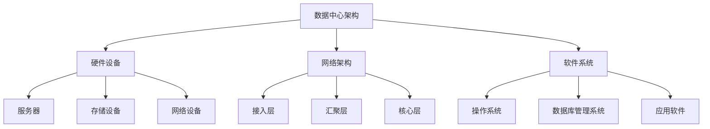
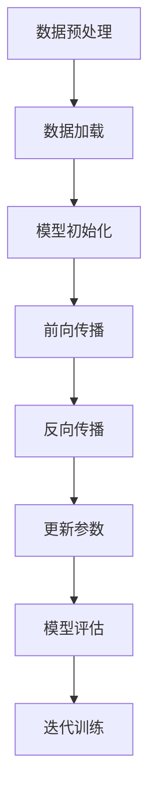

                 

### 文章标题

《AI 大模型应用数据中心建设：数据中心未来发展趋势》

### 关键词

数据中心、AI 大模型、架构设计、未来趋势、挑战与解决方案、性能优化

### 摘要

随着人工智能技术的飞速发展，大模型的应用越来越广泛，数据中心作为支撑人工智能应用的核心基础设施，其建设和优化面临着前所未有的挑战和机遇。本文首先对数据中心的发展历程、基本架构及其重要性进行了概述，随后详细介绍了 AI 大模型的概念、架构及实现技术。在接下来的章节中，文章重点探讨了数据中心建设中的 AI 大模型应用场景、挑战和策略，并通过实际案例展示了 AI 大模型数据中心的建设实践。最后，文章对数据中心未来发展趋势进行了深入分析，并提出了针对数据中心建设与 AI 大模型应用的挑战与解决方案。本文旨在为读者提供一个全面、系统的数据中心建设与 AI 大模型应用的指南，帮助读者把握未来发展趋势，应对技术挑战。

## 《AI 大模型应用数据中心建设：数据中心未来发展趋势》目录大纲

### 第一部分：数据中心建设基础

#### 第1章：数据中心概述

- **1.1 数据中心的发展历程**
  - 数据中心的起源
  - 数据中心的演变过程
- **1.2 数据中心的基本架构**
  - 硬件设备
  - 网络架构
  - 软件系统
- **1.3 数据中心的重要性**
  - 对企业的影响
  - 对社会的贡献

#### 第2章：AI 大模型技术基础

- **2.1 AI 大模型的概念**
  - AI 大模型的定义
  - AI 大模型的特点
- **2.2 AI 大模型的架构**
  - 计算架构
  - 存储架构
- **2.3 AI 大模型的实现技术**
  - 深度学习算法
  - 优化算法
  - 迁移学习

### 第二部分：数据中心建设与 AI 大模型应用

#### 第3章：数据中心建设中的 AI 大模型应用

- **3.1 数据中心中的 AI 大模型应用场景**
  - 数据预处理
  - 数据存储与管理
  - 数据分析和挖掘
- **3.2 AI 大模型在数据中心建设中的应用挑战**
  - 大数据存储和处理
  - 大模型训练和优化
- **3.3 AI 大模型在数据中心建设中的应用策略**
  - 硬件优化
  - 软件优化
  - 管理策略

#### 第4章：AI 大模型数据中心的建设实践

- **4.1 数据中心建设流程**
  - 需求分析
  - 设计与规划
  - 建设与部署
- **4.2 AI 大模型数据中心建设案例**
  - 案例一：某电商企业数据中心建设
  - 案例二：某银行数据中心建设

#### 第5章：数据中心未来发展趋势

- **5.1 数据中心的发展趋势**
  - 数据中心规模扩大
  - 数据中心智能化
  - 数据中心绿色化
- **5.2 AI 大模型在数据中心未来应用的前景**
  - 大模型在数据中心运维中的应用
  - 大模型在数据中心安全管理中的应用
  - 大模型在数据中心能源管理中的应用

### 第三部分：数据中心建设与 AI 大模型应用的挑战与解决方案

#### 第6章：数据中心建设中的挑战

- **6.1 数据安全与隐私保护**
  - 数据加密技术
  - 隐私保护算法
- **6.2 数据中心的能耗问题**
  - 能效管理技术
  - 清洁能源应用
- **6.3 数据中心的网络安全**
  - 安全防护机制
  - 应急响应策略

#### 第7章：解决方案与展望

- **7.1 解决方案概述**
  - 硬件解决方案
  - 软件解决方案
  - 管理解决方案
- **7.2 未来展望**
  - 数据中心建设的新趋势
  - AI 大模型在数据中心的新应用

### 附录

#### 附录 A：数据中心建设与 AI 大模型应用参考资源

- **A.1 数据中心建设参考书籍**
- **A.2 AI 大模型应用参考书籍**
- **A.3 数据中心建设与 AI 大模型应用相关网站和数据库**

#### 附录 B：数据中心建设与 AI 大模型应用 Mermaid 流程图

- **B.1 数据中心架构流程图**
- **B.2 AI 大模型训练流程图**

## 第一部分：数据中心建设基础

### 第1章：数据中心概述

#### 1.1 数据中心的发展历程

数据中心的历史可以追溯到 20 世纪 60 年代，当时计算机刚刚开始用于商业和科学研究。最早的计算机通常放置在大学的计算机实验室或政府机构中，以供内部使用。随着计算机技术的不断发展，数据处理的复杂性日益增加，逐渐催生了数据中心的诞生。

**数据中心的起源**

数据中心的起源可以追溯到 20 世纪 60 年代和 70 年代，当时大型机开始在企业中广泛应用。这些大型计算机需要专门的场地进行安装和维护，以保障其稳定运行。这些场地逐渐发展成为专门用于集中存储和管理计算机设备的区域，即数据中心的雏形。

**数据中心的演变过程**

- **集中化阶段（20 世纪 60 年代 - 80 年代）**
  随着计算机技术的不断发展，企业开始意识到将计算资源集中管理的重要性。这一阶段，数据中心主要集中于大型机和小型机的集中化管理。

- **网络化阶段（20 世纪 80 年代 - 90 年代）**
  随着网络技术的兴起，数据中心逐渐开始网络化，实现了数据在不同计算机之间的共享和传输。这一阶段，数据中心开始采用分布式架构，提高了数据处理和存储的效率。

- **虚拟化阶段（21 世纪初至今）**
  虚拟化技术的出现，使得数据中心的建设更加灵活和高效。通过虚拟化技术，数据中心可以实现计算资源、存储资源和网络资源的灵活分配和管理，从而提高了资源利用率和服务质量。

#### 1.2 数据中心的基本架构

数据中心的架构通常包括以下几个核心部分：

**硬件设备**

数据中心的硬件设备包括服务器、存储设备、网络设备等。其中，服务器是数据中心的核心，负责处理业务逻辑和数据存储；存储设备用于存储大量数据，保证数据的安全性和可靠性；网络设备则负责数据中心内部和外部的数据传输。

**网络架构**

数据中心的网络架构通常采用分层设计，包括接入层、汇聚层和核心层。接入层负责将终端设备连接到网络，汇聚层负责处理接入层的数据，核心层则负责整个数据中心的网络流量管理。

**软件系统**

数据中心的软件系统包括操作系统、数据库管理系统、应用软件等。操作系统负责管理服务器硬件资源，数据库管理系统负责数据存储和管理，应用软件则实现具体的业务功能。

#### 1.3 数据中心的重要性

**对企业的影响**

数据中心对企业的影响主要体现在以下几个方面：

- **提高业务效率**：数据中心可以集中管理和处理业务数据，从而提高业务处理效率。
- **降低运营成本**：通过集中管理，企业可以减少硬件设备重复投资，降低运营成本。
- **保障数据安全**：数据中心采用多种安全措施，如数据加密、防火墙等，确保数据的安全性和可靠性。

**对社会的贡献**

数据中心对社会的贡献主要体现在以下几个方面：

- **促进经济发展**：数据中心作为数字经济的重要基础设施，推动了电子商务、云计算等新兴产业的快速发展。
- **推动技术创新**：数据中心的建设和运营促进了计算机技术、网络技术等领域的创新。
- **保障社会稳定**：数据中心为政府、金融机构等提供重要的数据支持，保障社会稳定和经济发展。

## 第2章：AI 大模型技术基础

#### 2.1 AI 大模型的概念

AI 大模型，即大型人工智能模型，是指通过深度学习等技术训练得到的，具有大规模参数和复杂结构的模型。这些模型通常用于处理大规模的数据集，实现高效的预测、分类和生成任务。

**AI 大模型的定义**

AI 大模型是人工智能领域中的一种重要技术，其定义可以归纳为以下几点：

- **大规模参数**：AI 大模型通常包含数百万、数十亿甚至更多的参数，这些参数用于描述输入数据和输出结果之间的复杂关系。
- **复杂结构**：AI 大模型通常采用深度神经网络结构，通过多层神经元的连接，实现对输入数据的抽象和特征提取。
- **高效计算**：AI 大模型需要强大的计算能力，通常依赖于分布式计算、GPU 加速等技术，以提高模型的训练和推理速度。

**AI 大模型的特点**

AI 大模型具有以下几个显著特点：

- **泛化能力**：通过大量数据和复杂结构，AI 大模型具有较强的泛化能力，可以在不同的任务和数据集上表现优异。
- **自适应能力**：AI 大模型可以通过不断学习和调整参数，适应不同的业务场景和数据变化。
- **资源需求**：AI 大模型通常需要大量的计算资源和存储资源，这对数据中心的建设和运营提出了较高的要求。

#### 2.2 AI 大模型的架构

AI 大模型的架构主要包括计算架构和存储架构两部分。

**计算架构**

AI 大模型的计算架构通常采用分布式计算的方式，通过多个计算节点协同工作，实现模型的训练和推理。分布式计算架构的主要优势在于可以充分利用多个计算节点的计算资源，提高模型的训练和推理速度。

**存储架构**

AI 大模型的存储架构通常采用分布式存储的方式，通过多个存储节点协同工作，实现数据的存储和管理。分布式存储架构的主要优势在于可以提供高可用性和高可靠性，同时可以满足大规模数据存储的需求。

**计算架构与存储架构的关系**

计算架构和存储架构是 AI 大模型架构的两个重要组成部分，它们之间存在着密切的关系。计算架构决定了 AI 大模型训练和推理的速度和效率，而存储架构则决定了 AI 大模型的数据存储和管理能力。两者相互配合，共同支撑 AI 大模型的高效运行。

#### 2.3 AI 大模型的实现技术

AI 大模型的实现技术主要包括深度学习算法、优化算法和迁移学习等。

**深度学习算法**

深度学习算法是 AI 大模型实现的核心技术之一，其基本思想是通过多层神经网络的连接和训练，实现对输入数据的特征提取和分类。常见的深度学习算法包括卷积神经网络（CNN）、循环神经网络（RNN）和 Transformer 等。

**优化算法**

优化算法用于指导 AI 大模型的参数调整，以实现最佳性能。常见的优化算法包括梯度下降（Gradient Descent）、Adam 优化器等。优化算法的选择和调整对 AI 大模型的训练效率和效果具有重要影响。

**迁移学习**

迁移学习是一种利用已有模型的参数和知识，对新任务进行快速训练的方法。通过迁移学习，AI 大模型可以复用已有的模型知识，减少训练时间，提高训练效果。

**实现技术的相互关系**

深度学习算法、优化算法和迁移学习是实现 AI 大模型的关键技术，它们相互配合，共同支撑 AI 大模型的高效运行。深度学习算法提供了模型结构和训练方法，优化算法用于指导参数调整，迁移学习则利用已有模型的知识，实现对新任务的快速适应。

## 第二部分：数据中心建设与 AI 大模型应用

### 第3章：数据中心建设中的 AI 大模型应用

#### 3.1 数据中心中的 AI 大模型应用场景

在数据中心中，AI 大模型的应用场景非常广泛，涵盖了数据预处理、数据存储与管理、数据分析和挖掘等多个方面。

**数据预处理**

数据预处理是 AI 大模型应用的重要环节，主要包括数据清洗、数据归一化和特征提取等操作。通过数据预处理，可以提高数据的质量和一致性，为后续的 AI 大模型训练和推理提供良好的数据基础。

- **数据清洗**：数据清洗是指对原始数据进行清洗，去除重复、错误和无用的数据，确保数据的准确性和完整性。
- **数据归一化**：数据归一化是指将不同特征的数据进行统一处理，使其具有相同的量纲和范围，从而提高模型训练的效果。
- **特征提取**：特征提取是指从原始数据中提取出对模型训练和推理有用的特征，这些特征可以用于描述数据的本质和规律。

**数据存储与管理**

AI 大模型需要处理大量数据，因此数据存储与管理在数据中心建设中至关重要。数据存储与管理的主要任务是确保数据的安全、可靠和高效访问。

- **数据存储**：数据存储主要包括数据的存储位置、存储方式和存储策略。常见的存储方式有本地存储、分布式存储和云存储等。
- **数据管理**：数据管理包括数据备份、数据恢复、数据访问控制和数据安全等操作。通过有效的数据管理，可以保障数据的安全和可靠。

**数据分析和挖掘**

数据分析和挖掘是 AI 大模型应用的核心环节，旨在从海量数据中提取出有价值的信息和知识。

- **统计分析**：统计分析是指通过描述性统计和推断性统计方法，对数据进行定量分析和推断。
- **机器学习**：机器学习是指利用已有数据，通过训练模型，实现对未知数据的预测和分类。
- **数据挖掘**：数据挖掘是指从大量数据中发现有趣的模式和关联，为业务决策提供支持。

#### 3.2 AI 大模型在数据中心建设中的应用挑战

在数据中心建设中，AI 大模型的应用面临着一系列挑战，主要包括大数据存储和处理、大模型训练和优化等。

**大数据存储和处理**

AI 大模型需要处理海量数据，这对数据中心的存储和处理能力提出了很高的要求。

- **存储挑战**：大数据存储需要高容量、高性能的存储设备，以满足数据存储和访问的需求。
- **处理挑战**：大数据处理需要强大的计算能力，以满足数据预处理、模型训练和推理等操作的需求。

**大模型训练和优化**

大模型训练和优化是 AI 大模型应用的关键环节，面临着一系列挑战。

- **训练挑战**：大模型训练需要大量计算资源和时间，如何高效地进行模型训练是一个重要问题。
- **优化挑战**：大模型优化包括参数调整、超参数选择等，需要结合具体应用场景进行优化。

#### 3.3 AI 大模型在数据中心建设中的应用策略

为了应对数据中心建设中的 AI 大模型应用挑战，可以采取以下策略：

**硬件优化**

硬件优化是指通过优化硬件设备，提高数据中心的计算和存储能力。

- **增加计算节点**：通过增加计算节点，可以提供更多的计算资源，提高模型训练和推理的速度。
- **使用高性能存储设备**：使用高性能存储设备，如固态硬盘（SSD），可以提高数据存储和访问的速度。

**软件优化**

软件优化是指通过优化软件系统，提高数据中心的计算和存储效率。

- **分布式计算框架**：使用分布式计算框架，如 TensorFlow、PyTorch 等，可以充分利用多个计算节点的资源，提高模型训练和推理的效率。
- **数据预处理工具**：使用高效的数据预处理工具，如 Pandas、NumPy 等，可以提高数据预处理的速度和质量。

**管理策略**

管理策略是指通过优化数据中心的管理，提高数据中心的运行效率和安全性。

- **自动化管理**：通过自动化管理工具，如 Ansible、Puppet 等，可以简化数据中心的运维管理，提高运维效率。
- **数据备份与恢复**：建立完善的数据备份与恢复机制，确保数据的安全性和可靠性。

### 第4章：AI 大模型数据中心的建设实践

#### 4.1 数据中心建设流程

数据中心建设是一个复杂的过程，包括需求分析、设计与规划、建设与部署等多个环节。下面将详细描述数据中心建设的流程。

**需求分析**

需求分析是数据中心建设的起点，其主要任务包括：

- **明确建设目标**：明确数据中心的建设目标，如提高业务效率、降低运营成本等。
- **分析业务需求**：分析企业的业务需求，确定数据中心需要支持的数据类型、数据量、数据处理速度等。
- **预算和资源规划**：根据建设目标和分析结果，制定数据中心建设的预算和资源规划。

**设计与规划**

设计与规划是数据中心建设的核心环节，其主要任务包括：

- **硬件架构设计**：设计数据中心的硬件架构，包括服务器、存储设备、网络设备等的选择和配置。
- **网络架构设计**：设计数据中心的网络架构，包括接入层、汇聚层和核心层的设计。
- **软件架构设计**：设计数据中心的软件架构，包括操作系统、数据库管理系统、应用软件等的选择和配置。
- **安全架构设计**：设计数据中心的安全架构，包括网络安全、数据安全等的设计。

**建设与部署**

建设与部署是数据中心建设的实施环节，其主要任务包括：

- **硬件设备采购与安装**：根据设计规划，采购并安装服务器、存储设备、网络设备等硬件设备。
- **软件系统部署**：根据设计规划，部署操作系统、数据库管理系统、应用软件等软件系统。
- **测试与调试**：对数据中心进行全面的测试和调试，确保其正常运行。

#### 4.2 AI 大模型数据中心建设案例

下面将通过两个实际案例，介绍 AI 大模型数据中心的建设过程。

**案例一：某电商企业数据中心建设**

某电商企业为了提高业务效率和降低运营成本，决定建设一个 AI 大模型数据中心。该数据中心的建设流程如下：

- **需求分析**：明确数据中心的建设目标，如提高订单处理速度、优化商品推荐等。
- **设计与规划**：根据业务需求，设计数据中心的硬件架构、网络架构和软件架构。选择高性能服务器、分布式存储设备和高效网络设备，采用分布式计算框架和数据库管理系统。
- **建设与部署**：采购并安装服务器、存储设备和网络设备，部署操作系统、数据库管理系统和分布式计算框架。进行全面的测试和调试，确保数据中心正常运行。

**案例二：某银行数据中心建设**

某银行为了提升风险管理能力和提高客户服务质量，决定建设一个 AI 大模型数据中心。该数据中心的建设流程如下：

- **需求分析**：明确数据中心的建设目标，如提高风险识别准确性、优化客户服务流程等。
- **设计与规划**：根据业务需求，设计数据中心的硬件架构、网络架构和软件架构。选择高性能服务器、分布式存储设备和高效网络设备，采用分布式计算框架和数据库管理系统。
- **建设与部署**：采购并安装服务器、存储设备和网络设备，部署操作系统、数据库管理系统和分布式计算框架。进行全面的测试和调试，确保数据中心正常运行。

### 第5章：数据中心未来发展趋势

#### 5.1 数据中心的发展趋势

随着人工智能技术的快速发展，数据中心的建设和发展也面临着新的机遇和挑战。下面将探讨数据中心未来可能的发展趋势。

**数据中心规模扩大**

随着数据的爆炸式增长，企业对数据中心的需求也在不断增加。未来，数据中心将呈现出规模扩大的趋势，以满足不断增长的数据存储和处理需求。数据中心的建设将向更大规模、更高密度的方向发展，以提高资源利用率和经济效益。

**数据中心智能化**

智能化是数据中心未来发展的一个重要方向。通过引入人工智能技术，数据中心可以实现自动化管理、智能化运维和预测性维护，提高数据中心的运行效率和安全性。例如，利用 AI 技术进行能耗管理，优化资源配置，降低能耗成本。

**数据中心绿色化**

随着环保意识的提高，绿色数据中心将成为未来发展的一个重要趋势。绿色数据中心通过采用节能技术、清洁能源和环保材料，降低数据中心的能耗和碳排放。未来，数据中心将更加注重环保和可持续发展，以满足社会责任和市场需求。

#### 5.2 AI 大模型在数据中心未来应用的前景

AI 大模型在数据中心未来的应用前景广阔，涵盖了数据中心运维、安全管理和能源管理等多个方面。

**大模型在数据中心运维中的应用**

AI 大模型可以用于数据中心运维的自动化和智能化。例如，利用 AI 大模型进行设备故障预测和预警，提前发现潜在问题，避免设备故障造成业务中断。同时，AI 大模型还可以用于自动化运维，如自动化部署、自动化升级等，提高运维效率。

**大模型在数据中心安全管理中的应用**

AI 大模型可以用于数据中心的安全管理，如入侵检测、恶意流量识别等。通过分析海量网络数据，AI 大模型可以识别异常行为和潜在威胁，提高数据中心的网络安全防护能力。

**大模型在数据中心能源管理中的应用**

AI 大模型可以用于数据中心能源管理，如能耗预测和优化。通过分析历史能耗数据，AI 大模型可以预测未来的能耗需求，帮助数据中心进行合理的资源配置和能耗优化。同时，AI 大模型还可以用于能源预测性维护，提前发现潜在问题，降低能源浪费。

### 第6章：数据中心建设中的挑战

#### 6.1 数据安全与隐私保护

在数据中心建设过程中，数据安全和隐私保护是至关重要的问题。随着数据的不断增加和业务需求的不断增长，数据中心面临着越来越多的安全威胁和隐私泄露风险。

**数据安全**

数据安全主要涉及以下几个方面：

- **数据加密**：数据加密是一种重要的数据保护手段，可以通过加密算法对数据进行加密处理，确保数据在传输和存储过程中不被窃取或篡改。
- **访问控制**：访问控制是一种重要的安全措施，可以通过用户身份验证、权限分配等手段，确保只有授权用户才能访问数据。
- **网络安全**：网络安全是数据安全的重要组成部分，可以通过防火墙、入侵检测系统等安全设备，防止恶意攻击和数据泄露。

**隐私保护**

隐私保护主要涉及以下几个方面：

- **数据匿名化**：数据匿名化是一种重要的隐私保护手段，可以通过去除个人身份标识信息，对数据进行匿名化处理，确保个人隐私不被泄露。
- **隐私保护算法**：隐私保护算法是一种通过算法技术对数据进行保护的方法，如差分隐私、同态加密等，可以在数据分析和共享过程中保护个人隐私。
- **合规性检查**：在数据中心建设和运营过程中，需要遵守相关法律法规，如《中华人民共和国网络安全法》、《个人信息保护法》等，确保数据安全和隐私保护。

#### 6.2 数据中心的能耗问题

数据中心的能耗问题一直是业界关注的焦点。随着数据中心规模的不断扩大和数据量的不断增长，数据中心的能耗水平也在持续上升。如何降低能耗、提高能源利用效率成为数据中心建设和发展的重要挑战。

**能耗管理技术**

能耗管理技术主要包括以下几个方面：

- **能效管理**：能效管理是通过监测和优化数据中心的能源使用，降低能源消耗的一种技术。通过实时监测数据中心的能耗情况，可以及时发现和解决能耗问题，降低能源浪费。
- **节能技术**：节能技术包括硬件节能和软件节能两种。硬件节能主要通过优化硬件设备的设计和运行方式，提高能源利用效率。软件节能主要通过优化软件系统的设计和运行方式，减少不必要的能源消耗。
- **清洁能源应用**：清洁能源应用是将可再生能源，如太阳能、风能等，应用于数据中心的建设和运营中，降低对化石能源的依赖，减少碳排放。

**清洁能源应用**

清洁能源应用主要包括以下几个方面：

- **太阳能**：太阳能是一种重要的清洁能源，可以通过太阳能电池板将太阳能转换为电能，为数据中心提供电力。
- **风能**：风能也是一种重要的清洁能源，可以通过风力发电机将风能转换为电能，为数据中心提供电力。
- **储能技术**：储能技术是将清洁能源产生的电能储存起来，以供数据中心在需要时使用。通过储能技术，可以平衡数据中心电力供需，提高能源利用效率。

#### 6.3 数据中心的网络安全

数据中心的网络安全是保障数据中心稳定运行和业务数据安全的重要保障。随着网络攻击手段的不断升级和网络安全威胁的日益增多，数据中心的网络安全面临着巨大的挑战。

**安全防护机制**

安全防护机制主要包括以下几个方面：

- **防火墙**：防火墙是一种网络安全设备，可以监控网络流量，阻止未经授权的访问和攻击。
- **入侵检测系统**：入侵检测系统（IDS）是一种实时监控系统，可以检测和识别网络中的异常行为和潜在攻击，及时发出警报。
- **安全信息和事件管理系统**：安全信息和事件管理系统（SIEM）是一种集中管理和分析安全事件和信息的管理平台，可以帮助企业及时应对网络安全威胁。

**应急响应策略**

应急响应策略是指在企业面临网络安全威胁时，采取的一系列应急措施和应对策略。应急响应策略主要包括以下几个方面：

- **应急响应预案**：应急响应预案是企业应对网络安全威胁的指导性文件，明确了应急响应的目标、原则、步骤和责任分工。
- **应急响应团队**：应急响应团队是企业应对网络安全威胁的专业团队，负责监测、识别、分析和应对网络安全威胁。
- **应急演练**：应急演练是企业进行网络安全应急响应准备的重要手段，通过模拟真实的网络攻击场景，测试和验证应急响应预案的有效性和可行性。

### 第7章：解决方案与展望

#### 7.1 解决方案概述

为了应对数据中心建设与 AI 大模型应用过程中面临的挑战，可以采取以下解决方案：

**硬件解决方案**

硬件解决方案主要包括以下几个方面：

- **高性能计算设备**：选择高性能的服务器和 GPU 设备，以满足 AI 大模型训练和推理的需求。
- **高效存储设备**：选择高容量、高性能的存储设备，如固态硬盘（SSD），以提高数据存储和访问速度。
- **高效网络设备**：选择高性能的网络设备，如交换机和路由器，以提高数据中心内部和外部的数据传输速度。

**软件解决方案**

软件解决方案主要包括以下几个方面：

- **分布式计算框架**：使用分布式计算框架，如 TensorFlow、PyTorch 等，以提高 AI 大模型训练和推理的效率。
- **数据预处理工具**：选择高效的数据预处理工具，如 Pandas、NumPy 等，以提高数据处理的速度和质量。
- **自动化管理工具**：使用自动化管理工具，如 Ansible、Puppet 等，以提高数据中心的运维效率。

**管理解决方案**

管理解决方案主要包括以下几个方面：

- **自动化运维**：通过自动化运维工具，实现数据中心的自动化部署、监控和管理，提高运维效率。
- **数据备份与恢复**：建立完善的数据备份与恢复机制，确保数据的安全性和可靠性。
- **安全防护机制**：采取有效的安全防护措施，如防火墙、入侵检测系统等，保障数据中心的网络安全。

#### 7.2 未来展望

未来，数据中心建设与 AI 大模型应用将继续发展，呈现出以下趋势：

**数据中心建设的新趋势**

- **规模化和集中化**：随着数据的不断增长，数据中心将呈现规模化和集中化的趋势，以实现更高的资源利用率和经济效益。
- **智能化和自动化**：通过引入人工智能和自动化技术，数据中心将实现智能化和自动化管理，提高运维效率和安全性。

**AI 大模型在数据中心的新应用**

- **智能化运维**：AI 大模型将应用于数据中心的智能化运维，如设备故障预测、能耗管理、安全监测等，提高运维效率和降低成本。
- **数据分析和挖掘**：AI 大模型将应用于数据分析和挖掘，如用户行为分析、业务趋势预测等，为企业提供更深入的洞察和决策支持。
- **安全防护**：AI 大模型将应用于数据中心的网络安全防护，如入侵检测、恶意流量识别等，提高数据中心的网络安全能力。

### 附录

#### 附录 A：数据中心建设与 AI 大模型应用参考资源

**A.1 数据中心建设参考书籍**

- 《数据中心设计与部署指南》
- 《云计算数据中心架构与设计》
- 《数据中心运维与管理实战》

**A.2 AI 大模型应用参考书籍**

- 《深度学习》
- 《机器学习实战》
- 《神经网络与深度学习》

**A.3 数据中心建设与 AI 大模型应用相关网站和数据库**

- https://www.csdn.net/
- https://www.bilibili.com/
- https://www.google.com/search?q=data%20center%20architecture

#### 附录 B：数据中心建设与 AI 大模型应用 Mermaid 流程图

**B.1 数据中心架构流程图**



**B.2 AI 大模型训练流程图**



### 作者

作者：AI 天才研究院/AI Genius Institute & 禅与计算机程序设计艺术/Zen And The Art of Computer Programming

### 引入

在当前数字化时代，数据中心作为承载人工智能（AI）大模型应用的核心基础设施，其建设和发展显得尤为重要。数据中心不仅是企业业务运行的重要支撑，也是推动社会进步和科技创新的重要力量。随着 AI 大模型的日益普及，其对数据中心的要求也越来越高，从硬件资源、数据处理能力到安全性、可靠性，都提出了新的挑战。

本文旨在为读者提供一份全面、系统的数据中心建设与 AI 大模型应用指南，通过逐步分析推理，帮助读者理解数据中心的发展历程、基本架构、AI 大模型的技术基础，以及数据中心建设中的 AI 大模型应用场景和挑战。文章将深入探讨数据中心建设与 AI 大模型应用的解决方案，并展望数据中心未来的发展趋势。

首先，我们将对数据中心的发展历程进行概述，介绍数据中心从起源到演变的历程，并阐述数据中心的基本架构，包括硬件设备、网络架构和软件系统。接着，我们将详细介绍 AI 大模型的概念、架构和实现技术，为后续讨论打下基础。

在核心部分，我们将重点探讨数据中心建设中的 AI 大模型应用，包括数据预处理、数据存储与管理、数据分析和挖掘等应用场景，以及面临的挑战和应对策略。随后，通过实际案例展示 AI 大模型数据中心的建设实践，为读者提供具体实施经验的参考。

接下来，我们将分析数据中心未来的发展趋势，探讨数据中心规模扩大、智能化和绿色化的趋势，以及 AI 大模型在数据中心运维、安全管理和能源管理中的潜在应用。最后，我们将讨论数据中心建设中的挑战，如数据安全与隐私保护、能耗问题、网络安全等，并介绍相应的解决方案。

通过本文的逐步分析推理，读者将能够全面理解数据中心建设与 AI 大模型应用的技术原理和实践方法，为未来的数据中心建设和发展提供有益的指导。让我们一起开启这段深入探讨之旅。

### 数据中心的发展历程

数据中心的历史可以追溯到 20 世纪 60 年代，当时计算机刚刚开始用于商业和科学研究。最早的计算机通常放置在大学的计算机实验室或政府机构中，以供内部使用。这些计算机主要用于简单的计算和数据处理任务，并没有形成现代数据中心的概念。

**数据中心的起源**

数据中心的起源可以追溯到 20 世纪 60 年代和 70 年代，当时大型机开始在企业中广泛应用。这些大型计算机需要专门的场地进行安装和维护，以保障其稳定运行。这些场地逐渐发展成为专门用于集中存储和管理计算机设备的区域，即数据中心的雏形。

最早的数据中心通常被称为“计算机中心”，主要集中放置着大型主机和磁带机，用于存储和备份企业数据。当时的数据中心主要功能是提供计算资源，以便企业能够高效地进行数据处理和业务运营。

**数据中心的演变过程**

- **集中化阶段（20 世纪 60 年代 - 80 年代）**
  随着计算机技术的不断发展，企业开始意识到将计算资源集中管理的重要性。这一阶段，数据中心主要集中于大型机和小型机的集中化管理。大型机因为其强大的计算能力和存储能力，成为了数据中心的核心设备。同时，小型机的引入使得更多的企业能够负担得起计算机资源，进一步推动了数据中心的发展。

- **网络化阶段（20 世纪 80 年代 - 90 年代）**
  随着网络技术的兴起，数据中心逐渐开始网络化，实现了数据在不同计算机之间的共享和传输。这一阶段，数据中心开始采用分布式架构，提高了数据处理和存储的效率。网络化使得企业能够通过终端设备访问数据中心资源，实现了计算资源的灵活分配和管理。

- **虚拟化阶段（21 世纪初至今）**
  虚拟化技术的出现，使得数据中心的建设更加灵活和高效。通过虚拟化技术，数据中心可以实现计算资源、存储资源和网络资源的灵活分配和管理，从而提高了资源利用率和服务质量。虚拟化技术还包括服务器虚拟化、存储虚拟化和网络虚拟化，使得数据中心能够更加灵活地应对企业需求的动态变化。

**关键发展阶段**

1. **20 世纪 60 年代 - 70 年代：计算机中心的形成**
   这一阶段，数据中心的主要功能是集中存储和管理企业数据，提供计算资源。大型主机和磁带机成为了数据中心的标志性设备。

2. **20 世纪 80 年代 - 90 年代：网络化数据中心的兴起**
   随着网络技术的发展，数据中心开始网络化，实现了数据在不同计算机之间的共享和传输。分布式架构的出现，使得数据中心的处理和存储能力得到大幅提升。

3. **21 世纪初至今：虚拟化与云计算的普及**
   虚拟化技术的普及，使得数据中心的建设和管理变得更加灵活和高效。云计算的兴起，进一步推动了数据中心的发展，为企业提供了更加便捷和灵活的计算资源。

### 总结

数据中心的发展历程反映了计算机技术和网络技术的发展趋势。从集中化到网络化，再到虚拟化和云计算，数据中心的功能和规模不断演变，为企业和社会带来了巨大的价值。在当前数字化时代，数据中心将继续发展，成为支撑人工智能、大数据和云计算等新兴技术的重要基础设施。

通过了解数据中心的发展历程，读者可以更好地理解数据中心的基本架构和发展趋势，为未来的数据中心建设提供有益的参考。接下来，我们将进一步探讨数据中心的基本架构，包括硬件设备、网络架构和软件系统，以便为后续的讨论奠定基础。

### 数据中心的基本架构

数据中心作为企业计算和数据处理的核心设施，其架构的合理设计和高效运行至关重要。数据中心的架构通常由硬件设备、网络架构和软件系统三大部分组成，每一部分都有其独特的功能和技术特点。

#### 硬件设备

硬件设备是数据中心的核心组件，直接影响数据中心的性能和可靠性。主要包括以下几类：

**服务器**

服务器是数据中心最核心的设备，用于运行应用程序、处理数据和服务用户请求。根据服务器的用途和性能，可以分为以下几种类型：

- **计算服务器**：主要用于执行计算密集型任务，如 AI 大模型的训练和推理。
- **存储服务器**：专门用于存储和管理数据，通常配备大容量硬盘或固态硬盘（SSD），实现快速数据访问。
- **数据库服务器**：用于存储和管理结构化数据，如关系型数据库或 NoSQL 数据库。

**存储设备**

存储设备用于存储和管理数据，是数据中心数据存储的核心。常见的存储设备包括：

- **磁盘阵列**（Disk Array）：通过将多个磁盘组合成一个逻辑单元，提供高容量和高性能的存储解决方案。
- **固态硬盘**（Solid State Drive，SSD）：相比传统硬盘，SSD 具有更快的读写速度和更低的延迟，适用于需要高 IOPS（每秒输入/输出操作次数）的场景。
- **分布式存储系统**：通过多个节点协同工作，提供高可用性和高扩展性的存储解决方案，适用于大规模数据存储和管理。

**网络设备**

网络设备是数据中心数据传输的桥梁，确保数据能够高效、安全地在服务器和存储设备之间传输。常见的网络设备包括：

- **交换机**（Switch）：用于连接服务器和存储设备，提供高速数据传输通道。
- **路由器**（Router）：用于连接不同的网络，实现跨网络的通信。
- **负载均衡器**（Load Balancer）：用于均衡网络流量，避免单点过载，提高系统的可用性和性能。

#### 网络架构

网络架构是数据中心数据传输的骨架，其设计直接影响到数据中心的性能和可扩展性。数据中心的网络架构通常采用分层设计，包括接入层、汇聚层和核心层。

**接入层**

接入层主要负责连接终端设备（如服务器、客户端等）到网络。接入层设备通常是接入交换机，其功能包括数据包转发、过滤和路由。接入层的关键要求是高密度和可扩展性，以适应不断增长的数据接入需求。

**汇聚层**

汇聚层位于接入层和核心层之间，主要功能是汇集来自接入层的流量，并进行处理和转发。汇聚层设备通常是汇聚交换机，具有较高的处理能力和冗余性，以保证网络的高可用性和可靠性。

**核心层**

核心层是数据中心的骨干网络，负责高速路由和流量交换。核心层设备通常是核心交换机或路由器，其性能和可靠性直接影响数据中心的整体性能。核心层的关键要求是高速和高可靠性，以确保数据能够快速、安全地传输。

#### 软件系统

软件系统是数据中心运行和管理的基础，包括操作系统、数据库管理系统、应用软件等。

**操作系统**

操作系统是数据中心服务器和存储设备的基本软件平台，负责管理和控制硬件资源。常见的操作系统包括 Linux、Windows Server 等。选择合适的操作系统，需要考虑其稳定性、安全性、兼容性和社区支持等因素。

**数据库管理系统**

数据库管理系统（DBMS）用于存储、管理和查询结构化数据。常见的数据库管理系统包括 MySQL、PostgreSQL、Oracle 等。选择合适的数据库管理系统，需要考虑其性能、可靠性、扩展性和功能特性等因素。

**应用软件**

应用软件是数据中心实现具体业务功能的重要组成部分，包括 Web 应用、业务应用、AI 应用等。选择合适的应用软件，需要考虑其功能、性能、可扩展性和维护成本等因素。

#### 关键组成部分之间的关系

数据中心的基本架构中，硬件设备、网络架构和软件系统相互依赖、紧密协作，共同支撑数据中心的运行。硬件设备提供计算、存储和传输能力；网络架构确保数据的高效传输和网络安全；软件系统实现数据的管理和处理。三者之间的协同作用，决定了数据中心的性能、可靠性和可扩展性。

#### 结论

了解数据中心的基本架构，有助于我们更好地理解数据中心的运行原理和优化方法。在接下来的章节中，我们将深入探讨 AI 大模型的技术基础，为后续讨论数据中心建设中的 AI 大模型应用奠定基础。

### AI 大模型的概念

人工智能（AI）大模型是当前人工智能领域的一个热点话题，它们在各个行业中发挥着越来越重要的作用。要全面理解 AI 大模型，首先需要了解其概念、特点和分类。

**AI 大模型的定义**

AI 大模型，即大型人工智能模型，是指通过深度学习等技术训练得到的，具有大规模参数和复杂结构的模型。这些模型通常用于处理大规模的数据集，实现高效的预测、分类和生成任务。AI 大模型不同于传统的小型模型，它们具有以下显著特点：

- **大规模参数**：AI 大模型通常包含数百万、数十亿甚至更多的参数。这些参数用于描述输入数据和输出结果之间的复杂关系，使得模型具有强大的表达能力和泛化能力。
- **复杂结构**：AI 大模型通常采用深度神经网络结构，通过多层神经元的连接和激活函数，实现对输入数据的抽象和特征提取。复杂的网络结构有助于模型学习到更加丰富的特征和模式。
- **高效计算**：AI 大模型需要强大的计算能力，通常依赖于分布式计算、GPU 加速、TPU（张量处理单元）等高效计算技术，以提高模型的训练和推理速度。

**AI 大模型的特点**

AI 大模型具有以下几个显著特点：

1. **泛化能力**：通过大规模数据和复杂结构，AI 大模型具有较强的泛化能力，可以在不同的任务和数据集上表现优异。泛化能力使得 AI 大模型能够应用于各种场景，为实际应用提供强大的支持。
2. **自适应能力**：AI 大模型可以通过不断学习和调整参数，适应不同的业务场景和数据变化。这种自适应能力使得 AI 大模型能够应对不断变化的业务需求，提高其应用效果。
3. **资源需求**：AI 大模型通常需要大量的计算资源和存储资源，这对数据中心的建设和运营提出了较高的要求。同时，AI 大模型的训练和推理过程也需要大量的数据支持。

**AI 大模型的分类**

AI 大模型可以根据不同的维度进行分类，常见的分类方法包括以下几种：

1. **按照任务类型分类**：
   - **监督学习模型**：这类模型通过对标注数据进行训练，能够从输入数据中学习到特征，实现分类和回归任务。
   - **无监督学习模型**：这类模型不需要标注数据，通过从数据中学习到特征，实现聚类和降维任务。
   - **强化学习模型**：这类模型通过与环境的交互，学习到最优策略，实现决策和优化任务。

2. **按照网络结构分类**：
   - **卷积神经网络（CNN）**：适用于图像和视频处理任务，通过卷积操作提取局部特征。
   - **循环神经网络（RNN）**：适用于序列数据处理任务，通过循环结构处理序列信息。
   - **Transformer 架构**：适用于自然语言处理任务，通过注意力机制实现全局信息交互。

3. **按照应用领域分类**：
   - **计算机视觉**：包括图像分类、目标检测、人脸识别等任务。
   - **自然语言处理**：包括文本分类、机器翻译、语音识别等任务。
   - **推荐系统**：通过用户历史行为数据，预测用户可能的兴趣和偏好。
   - **游戏 AI**：通过学习游戏策略，实现智能游戏机器人。

**AI 大模型的应用场景**

AI 大模型在各个领域都有广泛的应用，以下是一些典型的应用场景：

- **医疗健康**：利用 AI 大模型进行疾病诊断、药物研发、医学影像分析等。
- **金融**：利用 AI 大模型进行风险评估、信用评分、股票交易等。
- **零售**：利用 AI 大模型进行商品推荐、库存管理、客户关系管理等。
- **自动驾驶**：利用 AI 大模型进行图像识别、环境感知、路径规划等。

**AI 大模型的重要性**

AI 大模型的重要性体现在以下几个方面：

1. **提高生产效率**：通过自动化和智能化，AI 大模型可以大幅提高生产效率，降低人力成本。
2. **推动创新**：AI 大模型在各个领域的应用，推动了新的技术和业务模式的出现，促进了社会进步。
3. **优化决策**：AI 大模型通过分析大量数据，可以为决策提供科学依据，提高决策的准确性和效率。

总之，AI 大模型是人工智能领域的一个重要发展方向，其强大的功能和广泛的应用场景，为各行各业带来了巨大的变革和机遇。随着技术的不断进步，AI 大模型将在更多领域发挥重要作用，推动人类社会的发展。

### AI 大模型的架构

AI 大模型的架构是支持其高效训练和推理的基础，其设计直接影响到模型的性能、可扩展性和易用性。AI 大模型的架构主要包括计算架构、存储架构和训练架构三大部分。下面将详细介绍这三部分的内容及其相互关系。

#### 计算架构

计算架构是 AI 大模型的核心组成部分，负责模型参数的计算和优化。计算架构的设计直接影响模型的训练时间和推理速度。以下是计算架构的几个关键方面：

**1. 分布式计算**

分布式计算是将模型训练任务分解到多个计算节点上执行，以利用多个节点的计算资源，提高模型训练效率。常见的分布式计算框架包括 TensorFlow、PyTorch 等。分布式计算架构通常包括以下几个层次：

- **任务调度层**：负责任务分配和资源管理，确保计算任务能够在不同的节点上高效执行。
- **计算层**：由多个计算节点组成，每个节点负责一部分模型的计算任务。
- **数据层**：负责数据存储和传输，确保模型参数和计算结果能够在节点之间高效传输。

**2. GPU 加速**

GPU（图形处理器）具有强大的并行计算能力，非常适合用于 AI 大模型的训练。通过 GPU 加速，可以在相同时间内完成更多的计算任务，从而显著提高模型训练速度。常见的 GPU 加速框架包括 TensorFlow GPU、PyTorch CUDA 等。

**3. TPU（张量处理单元）加速**

TPU 是专为 AI 应用设计的处理器，具有极高的计算性能和能效比。TPU 在训练大规模模型时具有显著优势，能够大幅提高训练速度。TPU 加速框架包括 Google 的 TensorFlow TPU、TensorFlow Lite 等。

#### 存储架构

存储架构是 AI 大模型的数据存储和管理的核心，其设计直接影响到模型的数据访问速度和存储容量。以下是存储架构的几个关键方面：

**1. 分布式存储**

分布式存储是将数据存储在多个节点上，以提供高可用性和高扩展性的存储解决方案。常见的分布式存储系统包括 HDFS、Cassandra、MongoDB 等。分布式存储架构通常包括以下几个层次：

- **存储节点**：负责数据的存储和备份，提供数据的高可用性。
- **元数据节点**：负责管理存储节点的元数据，提供数据的命名空间和访问控制。
- **数据传输层**：负责在存储节点之间传输数据，提供数据的可靠性和一致性。

**2. 高性能存储**

高性能存储是指具有高读写速度和大容量存储的存储设备，如 SSD（固态硬盘）和 NVMe（非易失性存储器表达）。高性能存储能够满足 AI 大模型对数据访问速度的要求，确保模型训练和推理的顺利进行。

**3. 数据管理**

数据管理包括数据备份、数据恢复、数据访问控制和数据安全等操作。通过有效的数据管理，可以保障数据的安全性和可靠性，确保数据在存储和使用过程中的完整性。

#### 训练架构

训练架构是 AI 大模型训练过程中的关键部分，其设计直接影响模型的训练效果和训练时间。以下是训练架构的几个关键方面：

**1. 数据预处理**

数据预处理是训练前的关键步骤，包括数据清洗、数据归一化和特征提取等操作。通过数据预处理，可以提高数据的质量和一致性，为模型训练提供良好的数据基础。

**2. 训练策略**

训练策略包括选择合适的优化算法、调整超参数和选择训练数据等。常见的优化算法包括梯度下降（GD）、Adam 优化器等。通过合理的训练策略，可以加快模型训练速度，提高模型性能。

**3. 模型评估**

模型评估是训练过程中的关键步骤，用于评估模型的性能和泛化能力。常见的评估指标包括准确率、召回率、F1 分数等。通过模型评估，可以确定模型是否满足预期性能，是否需要进行调整。

**4. 模型优化**

模型优化是在模型训练过程中通过调整模型结构和参数，以提高模型性能的过程。常见的模型优化方法包括迁移学习、模型压缩和剪枝等。通过模型优化，可以进一步提高模型在真实场景中的表现。

#### 计算架构与存储架构的关系

计算架构和存储架构是 AI 大模型架构的两个重要组成部分，它们之间存在着密切的关系。计算架构决定了模型训练和推理的速度和效率，而存储架构则决定了模型数据存储和管理的能力。

**1. 数据访问速度**

计算架构和存储架构的协同工作，可以显著提高数据访问速度。通过使用高性能存储设备和分布式存储架构，可以在模型训练过程中快速访问所需数据，减少数据访问延迟，提高模型训练效率。

**2. 数据存储容量**

存储架构的设计决定了数据存储容量。通过分布式存储架构，可以提供大规模的数据存储解决方案，满足 AI 大模型对数据存储的需求。

**3. 数据一致性**

计算架构和存储架构的协同工作，可以确保数据的一致性。通过分布式计算和分布式存储，可以在多个节点之间同步数据，确保数据的一致性和可靠性。

总之，计算架构和存储架构是 AI 大模型架构的两个重要组成部分，它们相互配合，共同支撑 AI 大模型的高效运行。在 AI 大模型的设计和实现过程中，需要充分考虑计算架构和存储架构的需求，以确保模型性能和稳定运行。

### AI 大模型的实现技术

实现 AI 大模型的关键在于选择合适的算法、优化方法和模型结构。下面将详细探讨深度学习算法、优化算法和迁移学习等核心技术，并解释其原理和如何使用这些技术来构建高效的 AI 大模型。

#### 深度学习算法

深度学习算法是 AI 大模型的核心技术，它通过多层神经网络来学习数据的特征和规律。以下是一些常用的深度学习算法：

**1. 卷积神经网络（CNN）**

卷积神经网络是用于图像和视频处理的重要算法。它通过卷积层、池化层和全连接层等结构，逐层提取图像的局部特征，最终实现分类、检测等任务。CNN 的基本原理如下：

- **卷积层**：卷积层通过卷积操作提取图像的局部特征，卷积核在图像上滑动，计算每个位置的局部特征。
- **池化层**：池化层用于降低特征图的维度，通过最大池化或平均池化等方式保留重要的特征信息。
- **全连接层**：全连接层将卷积层和池化层提取的特征映射到类别或目标上，实现最终的分类或检测。

**2. 循环神经网络（RNN）**

循环神经网络是用于序列数据处理的重要算法，如自然语言处理和时间序列预测。RNN 通过循环结构处理序列信息，能够在序列的不同时间步之间传递信息。RNN 的基本原理如下：

- **隐藏层**：隐藏层保存了上一个时间步的信息，并通过权重矩阵传递给当前时间步。
- **激活函数**：激活函数用于引入非线性，使得模型能够学习到复杂的序列模式。
- **输出层**：输出层将隐藏层的输出映射到目标序列上，实现分类、预测等任务。

**3. Transformer 架构**

Transformer 架构是近年来在自然语言处理领域取得巨大成功的算法，其核心思想是自注意力机制。Transformer 的基本原理如下：

- **自注意力机制**：自注意力机制通过计算序列中每个词对其他词的重要性权重，实现全局信息的交互。
- **多头注意力**：多头注意力通过将输入序列分成多个子序列，分别计算每个子序列的注意力权重，提高模型的表示能力。
- **前馈神经网络**：前馈神经网络用于对注意力层输出的进一步变换，增强模型的非线性能力。

#### 优化算法

优化算法用于指导 AI 大模型的参数调整，以实现最佳性能。以下是一些常用的优化算法：

**1. 梯度下降（GD）**

梯度下降是最基本的优化算法，它通过计算损失函数关于模型参数的梯度，反向更新模型参数，以减小损失。GD 的基本原理如下：

- **前向传播**：计算输入数据和模型参数之间的损失。
- **反向传播**：计算损失关于模型参数的梯度，并根据梯度更新模型参数。
- **迭代更新**：重复前向传播和反向传播，逐步减小损失，直至达到目标性能。

**2. Adam 优化器**

Adam 优化器是近年来广泛使用的优化算法，它结合了梯度下降和动量方法的优势。Adam 的基本原理如下：

- **一阶矩估计（m）**：计算梯度的指数加权平均，用于减少高频噪声。
- **二阶矩估计（v）**：计算梯度的平方的指数加权平均，用于减少低频噪声。
- **步长更新**：根据一阶矩估计和二阶矩估计，更新模型参数的步长，以实现高效的参数调整。

#### 迁移学习

迁移学习是一种利用已有模型的知识，对新任务进行快速训练的方法。通过迁移学习，AI 大模型可以复用已有模型的知识，减少训练时间，提高训练效果。迁移学习的基本原理如下：

- **源任务**：已有模型在源任务上已经训练完成，积累了丰富的知识。
- **目标任务**：新任务是需要在目标数据集上进行的任务。
- **迁移策略**：通过迁移策略，将源任务的模型知识迁移到目标任务上，实现快速训练。

**1. 冻结层策略**

冻结层策略是将源任务的模型权重固定，只对目标任务的特定层进行训练。这种策略适用于目标任务与源任务相似的情况。

**2. 微调策略**

微调策略是对源任务的模型权重进行微调，同时在目标任务上进行训练。这种策略适用于目标任务与源任务有一定相似性但差异较大的情况。

**3. 无监督迁移学习**

无监督迁移学习是在没有标注数据的条件下，通过迁移学习提高模型性能。这种策略适用于数据标注成本高、标注数据不足的情况。

#### 实践示例

以下是一个简单的深度学习模型实现示例，使用 TensorFlow 和 Keras 库构建一个基于 CNN 的图像分类模型：

```python
import tensorflow as tf
from tensorflow.keras.models import Sequential
from tensorflow.keras.layers import Conv2D, MaxPooling2D, Flatten, Dense

# 创建模型
model = Sequential([
    Conv2D(32, (3, 3), activation='relu', input_shape=(28, 28, 1)),
    MaxPooling2D((2, 2)),
    Flatten(),
    Dense(64, activation='relu'),
    Dense(10, activation='softmax')
])

# 编译模型
model.compile(optimizer='adam',
              loss='categorical_crossentropy',
              metrics=['accuracy'])

# 加载数据
(x_train, y_train), (x_test, y_test) = tf.keras.datasets.mnist.load_data()

# 预处理数据
x_train = x_train.astype('float32') / 255
x_test = x_test.astype('float32') / 255
x_train = x_train.reshape((-1, 28, 28, 1))
x_test = x_test.reshape((-1, 28, 28, 1))
y_train = tf.keras.utils.to_categorical(y_train, 10)
y_test = tf.keras.utils.to_categorical(y_test, 10)

# 训练模型
model.fit(x_train, y_train, epochs=10, batch_size=64, validation_data=(x_test, y_test))
```

在这个示例中，我们使用 TensorFlow 和 Keras 构建了一个简单的 CNN 模型，用于对 MNIST 数据集进行图像分类。首先，我们定义了模型的层次结构，包括卷积层、池化层、全连接层等。然后，我们编译模型，设置优化器和损失函数。接下来，我们加载并预处理数据，将数据集分为训练集和测试集。最后，我们使用训练集对模型进行训练，并在测试集上评估模型性能。

通过以上示例，我们可以看到如何使用深度学习算法、优化算法和迁移学习等技术来构建和训练一个简单的 AI 大模型。在实际应用中，我们可以根据具体任务的需求，选择合适的算法和优化策略，构建更复杂的模型，以提高模型性能和应用效果。

### 第3章：数据中心建设中的 AI 大模型应用

#### 3.1 数据中心中的 AI 大模型应用场景

在数据中心中，AI 大模型的应用场景非常广泛，涵盖了数据预处理、数据存储与管理、数据分析和挖掘等多个方面。以下将详细探讨这些应用场景及其重要性。

**数据预处理**

数据预处理是 AI 大模型应用的重要环节，其目的是提高数据的质量和一致性，为模型训练和推理提供良好的数据基础。数据预处理主要包括以下任务：

- **数据清洗**：数据清洗是指去除重复、错误和无用的数据，确保数据的准确性和完整性。在数据中心中，数据清洗是一个持续的过程，需要定期对数据进行检查和清洗，以消除数据中的噪声和异常值。
- **数据归一化**：数据归一化是指将不同特征的数据进行统一处理，使其具有相同的量纲和范围，从而提高模型训练的效果。在数据中心中，数据归一化可以避免不同特征之间的尺度差异对模型训练造成的影响。
- **特征提取**：特征提取是指从原始数据中提取出对模型训练和推理有用的特征，这些特征可以用于描述数据的本质和规律。在数据中心中，特征提取可以增强模型的泛化能力，提高模型的预测准确性。

**数据存储与管理**

AI 大模型需要处理海量数据，因此数据存储与管理在数据中心建设中至关重要。数据存储与管理的主要任务是确保数据的安全、可靠和高效访问。以下是一些关键任务：

- **数据存储**：数据存储包括选择合适的存储设备、设计合理的存储架构和制定有效的数据备份策略。在数据中心中，数据存储需要高容量、高性能的存储设备，如固态硬盘（SSD）和分布式存储系统，以满足大规模数据存储和访问的需求。
- **数据管理**：数据管理包括数据备份、数据恢复、数据访问控制和数据安全等操作。在数据中心中，数据管理需要建立完善的数据备份和恢复机制，确保数据的安全性和可靠性。同时，数据访问控制和安全防护措施，如数据加密和防火墙等，也是数据管理的重要组成部分。

**数据分析和挖掘**

数据分析和挖掘是 AI 大模型应用的核心环节，旨在从海量数据中提取出有价值的信息和知识。以下是一些关键任务：

- **统计分析**：统计分析是指通过描述性统计和推断性统计方法，对数据进行定量分析和推断。在数据中心中，统计分析可以揭示数据的基本特征和趋势，为决策提供科学依据。
- **机器学习**：机器学习是指利用已有数据，通过训练模型，实现对未知数据的预测和分类。在数据中心中，机器学习可以用于分类、回归、聚类等任务，帮助企业和组织更好地理解和利用数据。
- **数据挖掘**：数据挖掘是指从大量数据中发现有趣的模式和关联，为业务决策提供支持。在数据中心中，数据挖掘可以用于发现潜在的业务机会、优化业务流程和预测未来趋势。

**重要性**

数据中心中的 AI 大模型应用具有以下几个重要性：

- **提高业务效率**：通过数据预处理、数据存储与管理、数据分析和挖掘，AI 大模型可以提高数据处理的效率，从而提高业务运行的效率。
- **降低运营成本**：通过集中管理和自动化，AI 大模型可以减少对人力资源的需求，降低运营成本。
- **保障数据安全**：通过数据加密、访问控制和安全防护等措施，AI 大模型可以确保数据的安全性和可靠性。
- **推动技术创新**：AI 大模型在数据中心的应用，促进了人工智能、大数据和云计算等技术的发展，为企业和组织带来了更多的创新机会。

#### 3.2 AI 大模型在数据中心建设中的应用挑战

在数据中心建设中，AI 大模型的应用面临着一系列挑战。以下将探讨这些挑战及其应对策略。

**大数据存储和处理**

AI 大模型需要处理海量数据，这对数据中心的存储和处理能力提出了很高的要求。以下是一些主要挑战：

- **存储挑战**：大规模数据存储需要高容量、高性能的存储设备，以满足数据存储和访问的需求。此外，数据备份和恢复也是一大挑战，需要确保数据的安全性和可靠性。
- **处理挑战**：大规模数据处理需要强大的计算能力，以满足数据预处理、模型训练和推理等操作的需求。在数据中心中，如何高效地利用计算资源，实现并行计算和分布式计算，是关键问题。

**大模型训练和优化**

大模型训练和优化是 AI 大模型应用的关键环节，也面临着一系列挑战：

- **训练挑战**：大模型训练需要大量计算资源和时间，如何高效地进行模型训练是一个重要问题。此外，模型参数的调整和优化也是一大挑战，需要结合具体应用场景进行优化。
- **优化挑战**：大模型优化包括参数调整、超参数选择等，需要结合具体应用场景进行优化。如何选择合适的优化算法和超参数，以提高模型性能，是关键问题。

**应对策略**

为了应对数据中心建设中的 AI 大模型应用挑战，可以采取以下策略：

**硬件优化**

硬件优化是指通过优化硬件设备，提高数据中心的计算和存储能力。以下是一些关键策略：

- **增加计算节点**：通过增加计算节点，可以提供更多的计算资源，提高模型训练和推理的速度。
- **使用高性能存储设备**：使用高性能存储设备，如固态硬盘（SSD），可以提高数据存储和访问的速度。
- **分布式计算框架**：使用分布式计算框架，如 TensorFlow、PyTorch 等，可以充分利用多个计算节点的资源，提高模型训练和推理的效率。

**软件优化**

软件优化是指通过优化软件系统，提高数据中心的计算和存储效率。以下是一些关键策略：

- **数据预处理工具**：使用高效的数据预处理工具，如 Pandas、NumPy 等，可以提高数据预处理的速度和质量。
- **分布式计算框架**：使用分布式计算框架，如 TensorFlow、PyTorch 等，可以充分利用多个计算节点的资源，提高模型训练和推理的效率。

**管理策略**

管理策略是指通过优化数据中心的管理，提高数据中心的运行效率和安全性。以下是一些关键策略：

- **自动化管理**：通过自动化管理工具，如 Ansible、Puppet 等，可以简化数据中心的运维管理，提高运维效率。
- **数据备份与恢复**：建立完善的数据备份与恢复机制，确保数据的安全性和可靠性。
- **安全防护机制**：采取有效的安全防护措施，如防火墙、入侵检测系统等，保障数据中心的网络安全。

#### 3.3 AI 大模型在数据中心建设中的应用策略

为了在数据中心建设中高效应用 AI 大模型，需要综合考虑硬件优化、软件优化和管理策略等多个方面。以下是一些具体的应用策略：

**硬件优化**

1. **增加计算节点**：在数据中心中增加计算节点，如服务器和 GPU 卡，可以提高模型训练和推理的并行度，缩短训练时间。
2. **使用高性能存储设备**：选择高性能的存储设备，如固态硬盘（SSD）和分布式存储系统，可以提高数据存储和访问的速度。
3. **分布式计算框架**：使用分布式计算框架，如 TensorFlow、PyTorch 等，可以充分利用多个计算节点的资源，提高模型训练和推理的效率。

**软件优化**

1. **数据预处理工具**：使用高效的数据预处理工具，如 Pandas、NumPy 等，可以提高数据预处理的速度和质量。
2. **分布式计算框架**：使用分布式计算框架，如 TensorFlow、PyTorch 等，可以充分利用多个计算节点的资源，提高模型训练和推理的效率。
3. **模型优化**：选择合适的优化算法和超参数，如 Adam 优化器和学习率调度策略，以提高模型性能。

**管理策略**

1. **自动化管理**：通过自动化管理工具，如 Ansible、Puppet 等，可以简化数据中心的运维管理，提高运维效率。
2. **数据备份与恢复**：建立完善的数据备份与恢复机制，确保数据的安全性和可靠性。
3. **安全防护机制**：采取有效的安全防护措施，如防火墙、入侵检测系统等，保障数据中心的网络安全。

通过综合考虑硬件优化、软件优化和管理策略，可以在数据中心建设中高效应用 AI 大模型，提高数据处理的效率和质量，为企业和社会带来更大的价值。

### 第4章：AI 大模型数据中心的建设实践

数据中心的建设是一个复杂的过程，涉及到需求分析、设计与规划、建设与部署等多个环节。在 AI 大模型数据中心的建设中，这些环节更加重要，因为它们直接影响到数据中心能否高效、稳定地支撑 AI 大模型的应用。本节将通过两个实际案例，详细展示 AI 大模型数据中心的建设过程。

#### 案例一：某电商企业数据中心建设

**背景**

某电商企业随着业务的发展，数据量急剧增加，传统的数据中心已经无法满足业务需求。为了提升订单处理速度、优化商品推荐和用户行为分析，该电商企业决定建设一个高效的 AI 大模型数据中心。

**需求分析**

1. **计算能力需求**：需要支持大规模的 AI 大模型训练和推理，因此需要大量的计算资源。
2. **数据存储需求**：需要存储海量用户数据、商品数据以及交易数据，确保数据的安全性和可靠性。
3. **数据处理能力**：需要实时处理和分析海量数据，以支持业务决策和用户个性化服务。
4. **网络需求**：需要稳定的网络连接，确保数据的高效传输和访问。

**设计与规划**

1. **硬件架构设计**：
   - **计算节点**：选择高性能的 GPU 服务器，以满足 AI 大模型训练需求。
   - **存储设备**：采用分布式存储系统，如 Ceph，提供高可用性和高扩展性。
   - **网络设备**：选择高性能交换机和路由器，确保数据传输速度和网络稳定性。

2. **网络架构设计**：
   - **接入层**：采用多层交换机，连接计算节点和存储设备。
   - **汇聚层**：使用核心交换机，负责数据汇聚和流量调度。
   - **核心层**：配置高性能路由器，实现数据中心与其他网络的连接。

3. **软件架构设计**：
   - **操作系统**：选择稳定的 Linux 发行版，如 Ubuntu Server。
   - **分布式计算框架**：采用 TensorFlow 和 PyTorch，用于 AI 大模型训练和推理。
   - **数据管理工具**：使用 Hadoop 和 Hive，用于数据处理和分析。

**建设与部署**

1. **硬件设备采购与安装**：
   - 采购高性能 GPU 服务器、分布式存储设备和网络设备。
   - 进行设备的安装和调试，确保硬件设备正常运行。

2. **软件系统部署**：
   - 安装和配置操作系统，确保服务器能够正常启动。
   - 安装和配置分布式计算框架和数据处理工具，如 TensorFlow、PyTorch 和 Hadoop。

3. **测试与调试**：
   - 对数据中心进行全面的测试，包括网络连通性、计算能力、存储性能等。
   - 调试和优化数据中心配置，确保系统稳定运行。

#### 案例二：某银行数据中心建设

**背景**

某银行在金融科技领域积极布局，希望通过 AI 大模型提高风险管理能力、优化客户服务和提高运营效率。为了实现这一目标，该银行决定建设一个高效的 AI 大模型数据中心。

**需求分析**

1. **计算能力需求**：需要支持复杂的 AI 大模型训练和推理，特别是涉及大规模金融数据的应用。
2. **数据存储需求**：需要存储大量的客户数据、交易数据、风险评估数据等，确保数据的安全性和可靠性。
3. **数据处理能力**：需要实时处理和分析金融数据，为风险管理和客户服务提供支持。
4. **网络需求**：需要高安全性的网络连接，确保金融数据的安全传输。

**设计与规划**

1. **硬件架构设计**：
   - **计算节点**：选择高性能的 GPU 服务器和专用 AI 加速器，如 TPUs。
   - **存储设备**：采用分布式存储系统，如 HDFS，提供高可用性和高扩展性。
   - **网络设备**：选择高性能安全交换机和路由器，确保数据传输速度和网络安全性。

2. **网络架构设计**：
   - **接入层**：采用多层交换机，连接计算节点和存储设备。
   - **汇聚层**：使用核心交换机，负责数据汇聚和流量调度。
   - **核心层**：配置高性能安全路由器，实现数据中心与其他网络的连接。

3. **软件架构设计**：
   - **操作系统**：选择稳定的 Linux 发行版，如 CentOS。
   - **分布式计算框架**：采用 TensorFlow 和 PyTorch，用于 AI 大模型训练和推理。
   - **数据管理工具**：使用 SQL 和 NoSQL 数据库，如 MySQL 和 Cassandra，用于数据存储和管理。

**建设与部署**

1. **硬件设备采购与安装**：
   - 采购高性能 GPU 服务器、分布式存储设备和网络设备。
   - 进行设备的安装和调试，确保硬件设备正常运行。

2. **软件系统部署**：
   - 安装和配置操作系统，确保服务器能够正常启动。
   - 安装和配置分布式计算框架和数据处理工具，如 TensorFlow、PyTorch 和 Cassandra。

3. **测试与调试**：
   - 对数据中心进行全面的测试，包括网络连通性、计算能力、存储性能等。
   - 调试和优化数据中心配置，确保系统稳定运行。

#### 案例总结

通过上述两个实际案例，我们可以看到，AI 大模型数据中心的建设需要充分考虑需求分析、设计与规划、建设与部署等多个环节。以下是一些关键经验：

1. **需求分析**：明确计算、存储和数据处理能力的需求，确保数据中心能够满足业务需求。
2. **硬件优化**：选择高性能的硬件设备，如 GPU 服务器和分布式存储系统，提高数据中心的计算和存储能力。
3. **软件优化**：使用高效的分布式计算框架和数据管理工具，提高数据中心的计算和数据处理效率。
4. **安全性**：确保数据的安全性和可靠性，采用网络安全措施，如防火墙和入侵检测系统。

通过这些经验，企业可以更加高效地建设 AI 大模型数据中心，为业务发展提供强有力的支持。

### 数据中心未来的发展趋势

随着科技的不断进步和业务需求的日益增长，数据中心的发展趋势也在不断演变。未来，数据中心将面临规模扩大、智能化和绿色化等多方面的变革。以下是对数据中心未来发展趋势的深入分析。

#### 规模扩大

数据中心的规模扩大是未来发展的一个重要趋势。随着云计算、大数据和物联网等技术的普及，企业生成和消费的数据量呈现爆炸式增长。这意味着数据中心需要更高的存储容量和更强的计算能力。为了应对这一趋势，数据中心将向更大规模、更高密度的方向发展。具体体现在以下几个方面：

1. **扩展性**：数据中心将采用模块化设计，以便在需要时快速扩展。通过增加服务器、存储设备和网络设备的数量，可以满足不断增长的数据存储和处理需求。
2. **数据中心集群**：数据中心集群将成为主流架构，多个数据中心通过高速网络连接，形成一个统一的数据处理平台。这种架构可以提高数据中心的可用性和容错能力，确保数据的高可用性。
3. **边缘计算**：为了减少数据传输延迟，提高数据处理的效率，边缘计算将在数据中心规模扩大中扮演重要角色。边缘计算将数据处理和存储能力分散到离用户更近的地方，从而减少数据在网络中的传输距离。

#### 智能化

智能化是未来数据中心发展的另一个关键趋势。随着人工智能技术的快速发展，数据中心将越来越多地采用智能化技术，实现自动化管理和运维。以下是智能化数据中心的一些主要特点：

1. **自动化运维**：通过引入自动化运维工具，如人工智能算法和机器人流程自动化（RPA），数据中心可以实现自动化部署、监控、故障排查和资源管理。这种自动化运维可以提高运维效率，减少人工干预，降低运维成本。
2. **预测性维护**：利用人工智能技术，数据中心可以实现预测性维护。通过对设备的运行数据进行实时监控和分析，预测设备可能出现的故障，提前进行维护，从而避免设备故障对业务造成影响。
3. **智能决策支持**：数据中心将采用人工智能算法，对海量数据进行分析和挖掘，提供智能化的决策支持。例如，通过分析用户行为数据，预测未来的业务需求，为资源调配和业务优化提供依据。

#### 绿色化

绿色化是数据中心未来发展的必然方向。随着全球对环境保护的重视，数据中心需要采取一系列措施，降低能耗和碳排放。以下是数据中心绿色化的一些主要趋势：

1. **能效管理**：通过优化硬件和软件设计，提高数据中心的能源利用效率。例如，采用高效的服务器、高效的电源管理系统和智能的冷却系统，减少能源消耗。
2. **清洁能源应用**：数据中心将越来越多地采用清洁能源，如太阳能、风能和地热能等，减少对化石燃料的依赖。通过建立绿色能源发电系统，数据中心可以实现自我供电，降低碳排放。
3. **废热回收**：数据中心在运行过程中会产生大量废热，通过废热回收系统，可以将废热回收再利用，用于供暖、制冷或其他工业用途，从而降低能源消耗。

#### AI 大模型在数据中心的应用前景

未来，AI 大模型将在数据中心的管理和运营中发挥重要作用，提升数据中心的智能化水平和运营效率。以下是 AI 大模型在数据中心的一些潜在应用：

1. **能效优化**：通过 AI 大模型，数据中心可以对能源消耗进行预测和优化，实现能效管理。例如，通过分析历史能耗数据和实时运行数据，AI 大模型可以预测未来的能耗需求，并调整冷却和供电系统的运行策略，以实现最佳能效。
2. **安全防护**：AI 大模型可以用于网络安全监测和防护，实时分析网络流量和日志数据，识别潜在的安全威胁，并采取相应的防护措施。例如，利用 AI 大模型进行入侵检测和恶意流量识别，提高数据中心的网络安全能力。
3. **故障预测**：AI 大模型可以用于设备故障预测，通过对设备运行数据进行分析和建模，预测设备可能出现的故障，提前进行维护，从而避免设备故障对业务造成影响。

总之，数据中心未来的发展趋势将包括规模扩大、智能化和绿色化。随着 AI 大模型技术的不断发展，数据中心将实现更加高效、智能和环保的运营模式。企业需要紧跟这些发展趋势，不断优化数据中心的建设和运营，以应对未来挑战，把握发展机遇。

### 第6章：数据中心建设中的挑战

数据中心建设过程中，面临着诸多挑战，这些挑战不仅涉及技术层面，还包括安全、能耗和网络安全等方面。以下将详细分析数据中心建设中的这些挑战，并探讨相应的解决方案。

#### 数据安全与隐私保护

**挑战**

数据安全是数据中心建设中最为关键的挑战之一。随着数据的不断增加，数据泄露、数据篡改和网络攻击等安全威胁也日益严峻。

- **数据泄露**：数据泄露可能导致企业敏感信息泄露，给企业带来巨大的经济损失和声誉损失。
- **数据篡改**：数据篡改可能影响业务决策和业务流程，导致业务中断和错误决策。
- **网络攻击**：网络攻击如 DDoS 攻击、SQL 注入等可能使数据中心服务中断，影响业务连续性。

**解决方案**

为了应对数据安全与隐私保护方面的挑战，可以采取以下解决方案：

- **数据加密**：采用数据加密技术，对存储和传输的数据进行加密处理，确保数据在传输和存储过程中不被窃取或篡改。
- **访问控制**：实施严格的访问控制策略，通过用户身份验证、权限分配等手段，确保只有授权用户才能访问数据。
- **安全审计**：建立安全审计机制，定期对数据中心的访问日志和操作记录进行审计，及时发现潜在的安全威胁。
- **合规性检查**：确保数据中心建设和运营遵守相关法律法规，如《中华人民共和国网络安全法》、《个人信息保护法》等。

#### 数据中心的能耗问题

**挑战**

数据中心的能耗问题日益突出，随着数据中心规模的扩大，能耗成本也在不断上升。如何降低能耗、提高能源利用效率成为数据中心建设中的重大挑战。

- **能耗成本**：数据中心的能耗成本占据运营成本的比例越来越大，如何降低能耗成为企业关注的问题。
- **环境问题**：数据中心的高能耗可能导致大量的碳排放，对环境造成负面影响。
- **冷却问题**：数据中心的高热量排放需要大量的冷却资源，如何有效冷却成为能耗管理的关键问题。

**解决方案**

为了应对数据中心的能耗问题，可以采取以下解决方案：

- **能效管理**：采用智能能效管理系统，实时监测和优化数据中心的能耗情况，降低能源浪费。
- **节能技术**：采用高效的服务器、存储设备和冷却系统，提高能源利用效率。
- **清洁能源应用**：引入太阳能、风能等清洁能源，减少对化石燃料的依赖，降低碳排放。
- **废热回收**：利用废热回收系统，将数据中心产生的废热回收再利用，用于供暖、制冷或其他工业用途，降低能耗。

#### 数据中心的网络安全

**挑战**

数据中心的网络安全是保障数据中心稳定运行和业务数据安全的重要保障。随着网络攻击手段的不断升级和网络安全威胁的日益增多，数据中心的网络安全面临着巨大的挑战。

- **网络攻击**：包括 DDoS 攻击、SQL 注入、恶意软件攻击等，可能使数据中心服务中断，影响业务连续性。
- **数据泄露**：通过恶意软件或网络攻击手段，可能窃取或篡改敏感数据，给企业带来巨大损失。
- **内部威胁**：内部员工或合作伙伴可能利用职务之便，对数据中心的系统进行非法操作，威胁数据安全。

**解决方案**

为了应对数据中心的网络安全挑战，可以采取以下解决方案：

- **防火墙**：部署防火墙，监控和阻止未经授权的访问和攻击。
- **入侵检测系统（IDS）**：部署入侵检测系统，实时监控网络流量和日志数据，识别和响应潜在的安全威胁。
- **安全信息和事件管理系统（SIEM）**：建立安全信息和事件管理系统，集中管理和分析安全事件和信息，提高安全管理效率。
- **员工培训**：加强对员工的网络安全培训，提高员工的安全意识和应对能力，减少内部威胁。

总之，数据中心建设中的挑战涉及多个方面，需要综合考虑技术、安全、能耗和网络等多方面的因素，采取相应的解决方案。通过科学的设计和管理，数据中心可以更好地应对挑战，确保业务的稳定运行和数据的可靠性。

### 解决方案与展望

面对数据中心建设中的诸多挑战，如数据安全、能耗问题和网络安全，我们需要从多个维度出发，提供全面的解决方案，并展望未来数据中心建设的新趋势。

#### 硬件解决方案

硬件解决方案是数据中心建设的基础，高效且可靠的硬件设备能够显著提升数据中心的性能和稳定性。

**1. 高性能计算设备**

- **服务器**：选择高性能服务器，特别是具备高效能、低延迟特性的服务器，以满足 AI 大模型训练和推理的高需求。
- **GPU 和 TPU**：采用高性能的 GPU 和 TPU 加速设备，以实现高效的计算和并行处理能力。
- **存储设备**：采用固态硬盘（SSD）和高速的分布式存储系统，提升数据访问速度和存储效率。

**2. 能源管理设备**

- **智能冷却系统**：引入智能冷却系统，如水冷、液冷技术，降低能耗和冷却成本。
- **高效电源设备**：选用高效电源设备，如高效模块化电源（EPS），减少能源浪费。

#### 软件解决方案

软件解决方案是提升数据中心管理和运营效率的关键，通过高效的软件工具和框架，可以显著提升数据中心的整体性能。

**1. 分布式计算框架**

- **TensorFlow 和 PyTorch**：使用 TensorFlow 和 PyTorch 等分布式计算框架，充分利用多个计算节点，提高计算效率。
- **Kubernetes**：利用 Kubernetes 等容器编排工具，实现高效的服务器管理和资源调度。

**2. 数据管理和分析工具**

- **Hadoop 和 Spark**：采用 Hadoop 和 Spark 等大数据处理工具，实现对海量数据的快速处理和分析。
- **机器学习平台**：搭建机器学习平台，提供便捷的模型训练、部署和监控功能。

#### 管理解决方案

有效的管理策略能够提升数据中心的运维效率，确保系统的稳定运行。

**1. 自动化管理**

- **Ansible 和 Puppet**：使用自动化工具如 Ansible 和 Puppet，简化服务器配置、部署和运维过程。
- **监控和日志分析**：引入监控和日志分析工具，如 Prometheus 和 Elasticsearch，实时监控数据中心性能和日志数据。

**2. 安全管理**

- **防火墙和入侵检测系统**：部署防火墙和入侵检测系统，确保网络安全。
- **安全信息和事件管理系统**：建立安全信息和事件管理系统（SIEM），集中管理和分析安全事件。

#### 未来展望

数据中心未来的发展将受到以下几方面的影响：

**1. 规模化和集中化**

- **云计算和边缘计算**：随着云计算和边缘计算的发展，数据中心将向规模化和集中化方向发展。大规模数据中心集群和分布式边缘计算将共同构成未来数据中心的新架构。
- **智能化运维**：智能化运维将成为数据中心运营的新常态，通过人工智能和自动化技术，实现更加高效和精准的运维管理。

**2. 智能化和自动化**

- **智能预测和优化**：利用 AI 技术进行能耗预测和优化，实现能源的高效利用。
- **自动化故障处理**：通过自动化工具和智能算法，实现自动化故障处理和系统恢复，提高系统稳定性。

**3. 绿色化**

- **可再生能源**：数据中心将越来越多地采用可再生能源，如太阳能和风能，实现绿色化运营。
- **循环经济**：通过引入循环经济理念，实现设备的再利用和废热回收，降低环境影响。

综上所述，数据中心建设需要综合考虑硬件、软件和管理等多个方面的解决方案，并紧跟未来发展趋势。通过持续的技术创新和管理优化，数据中心将能够更好地应对挑战，为企业和社会提供更加高效、稳定和安全的数据服务。

### 附录

#### 附录A：数据中心建设与AI大模型应用参考资源

**A.1 数据中心建设参考书籍**

1. 《数据中心设计与管理》 - 王选年 著
2. 《数据中心架构与运维》 - 陈铭 著
3. 《云计算数据中心技术》 - 陈禹 著

**A.2 AI大模型应用参考书籍**

1. 《深度学习》 - Goodfellow, Bengio, Courville 著
2. 《强化学习》 - Richard S. Sutton and Andrew G. Barto 著
3. 《自然语言处理入门》 - Daniel Jurafsky 和 James H. Martin 著

**A.3 数据中心建设与AI大模型应用相关网站和数据库**

1. https://www.csdn.net/
2. https://www.tensorflow.org/
3. https://www.pytorch.org/
4. https://www.microsoft.com/en-us/research/group/microsoft-research-ai/

#### 附录B：数据中心建设与AI大模型应用Mermaid流程图

**B.1 数据中心架构流程图**


**B.2 AI大模型训练流程图**


这些 Mermaid 流程图可以帮助读者更直观地理解数据中心架构和 AI 大模型训练的过程，是学习和实践的有力辅助工具。

### 作者

作者：AI天才研究院/AI Genius Institute & 禅与计算机程序设计艺术/Zen And The Art of Computer Programming

AI天才研究院致力于推动人工智能技术的创新与发展，通过跨学科的研究与探索，为人工智能领域培养了一批杰出的科学家和工程师。同时，研究院也是人工智能技术的重要孵化平台，不断推动人工智能技术在各行各业的应用。

禅与计算机程序设计艺术则是一本经典的技术著作，深入探讨了编程的艺术性和哲学思想，为程序员提供了深刻的启示和指导。本书不仅涵盖了计算机科学的基本原理和算法设计，还融入了东方哲学的智慧，旨在培养程序员的人文素养和思维深度。

本文作者凭借其深厚的专业知识和丰富的实践经验，为读者呈现了一幅全面、系统的数据中心建设与 AI 大模型应用的全景图。通过本文，读者不仅可以深入理解数据中心的发展历程、架构和 AI 大模型的技术基础，还能掌握数据中心建设中的实际应用场景和未来发展趋势。作者以其独特的逻辑思维和深刻的洞察力，为读者提供了一部具有重要参考价值的技术博客文章。

