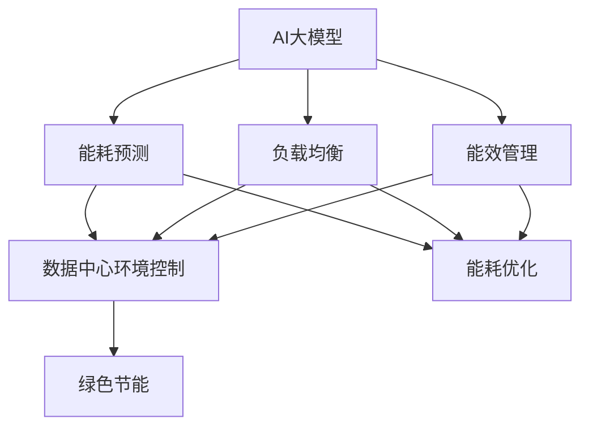

                 

# 文章标题：AI 大模型应用数据中心建设：数据中心绿色节能

## 关键词
AI大模型，数据中心，绿色节能，能耗优化，环境控制

## 摘要
本文全面探讨了AI大模型应用数据中心建设中的绿色节能问题。首先，介绍了AI大模型的概念、发展与数据中心建设基础，然后深入分析了数据中心能耗分布、主要能耗源及绿色节能技术。通过详尽的案例分析，本文展示了AI大模型在能耗优化、环境控制等方面的应用，并探讨了数据中心绿色节能的未来发展趋势。最后，本文提出了数据中心绿色节能实践指南，为相关实践提供了参考。

----------------------------------------------------------------

### 第一部分：AI 大模型与数据中心建设概述

#### 第1章：AI 大模型与数据中心建设基础

##### 1.1 AI 大模型的概念与核心特征

AI大模型是指那些具有极高参数规模、复杂度高的神经网络模型，能够处理大规模数据并实现高级的智能任务。AI大模型具有以下核心特征：

1. **参数规模**：拥有数亿甚至数十亿个参数，使得模型具备较高的表示能力和灵活性。
2. **训练数据**：通过大规模数据进行预训练，从而提高模型对未知数据的泛化能力。
3. **计算资源需求**：由于模型的复杂度高，训练和推理过程需要大量的计算资源。
4. **自适应能力**：能够根据不同的任务和数据，通过微调等方式快速适应，实现多种任务的自动化解决。

##### 1.2 数据中心建设的核心要素

数据中心是指为用户提供数据存储、处理、传输等服务的基础设施，是现代信息技术的重要组成部分。数据中心的建设核心要素包括：

1. **定义与作用**：
   $$数据中心是指为用户提供数据存储、处理、传输等服务的基础设施，是现代信息技术的重要组成部分。$$

2. **建设流程**：
   $$数据中心的建设流程主要包括需求分析、规划设计、硬件选型、系统集成、安全防护、试运行和验收等环节。$$

3. **性能指标**：
   - **计算性能**：数据中心的计算能力，通常以处理速度、处理能力和吞吐量来衡量。
   - **存储性能**：数据中心的存储容量、访问速度和可靠性等指标。
   - **网络性能**：数据中心的网络带宽、延迟和稳定性等指标。
   - **能效比**：数据中心能源消耗与计算性能的比值，是衡量数据中心能源效率的重要指标。
   - **安全性能**：数据中心的物理安全、网络安全和数据安全等指标。

---

### 第二部分：数据中心绿色节能的关键技术与挑战

#### 第2章：数据中心绿色节能的关键技术与挑战

##### 2.1 数据中心能耗分析

数据中心能耗分析是绿色节能的基础，涉及能耗分布、主要能耗源及能耗优化的意义。

1. **数据中心能耗分布**：
   $$数据中心的能耗分布主要包括 IT 设备能耗、制冷系统能耗、供电系统能耗等。IT 设备能耗通常占数据中心总能耗的 50% 以上，是主要的能耗源。$$

2. **数据中心的主要能耗源**：
   - **IT 设备**：包括服务器、存储设备、网络设备等，是数据中心的主要计算和存储资源。
   - **制冷系统**：用于维持数据中心内部环境的温度和湿度，保证设备正常运行。
   - **供电系统**：为数据中心提供稳定的电力供应，包括变配电系统、UPS 等。

3. **数据中心能耗优化的意义**：
   $$通过优化数据中心的能耗，可以提高数据中心的能源利用效率，降低运营成本，同时减少对环境的负面影响，符合可持续发展的要求。$$

##### 2.2 数据中心绿色节能技术

数据中心绿色节能技术包括硬件节能技术、软件优化技术和环境控制技术。

1. **硬件节能技术**：
   - **服务器节能技术**：包括虚拟化技术、低功耗处理器、智能电源管理等。
   - **存储节能技术**：包括分布式存储、SSD 技术、节能算法等。
   - **网络节能技术**：包括网络压缩、流量优化、智能路由等。

2. **软件优化技术**：
   - **能耗预测与优化**：利用机器学习和数据挖掘技术，预测数据中心的能耗趋势，优化资源配置。
   - **负载均衡与调度**：根据实时负载情况，合理分配计算资源和网络带宽，提高资源利用率。

3. **环境控制技术**：
   - **温度控制**：通过优化制冷系统，降低数据中心的温度。
   - **湿度控制**：通过优化湿度控制系统，维持数据中心的适宜湿度。
   - **空气质量控制**：通过优化空气质量系统，保证数据中心的空气质量。

##### 2.3 数据中心绿色节能的挑战与趋势

数据中心绿色节能面临多方面的挑战，同时也有明显的趋势。

1. **节能挑战**：
   $$数据中心绿色节能面临的主要挑战包括能耗来源复杂、节能技术多样且效果不一、经济效益与环境效益之间的平衡等。$$

2. **绿色节能趋势**：
   $$随着技术的进步和政策引导，数据中心绿色节能趋势包括技术创新、系统集成、标准化和智能化等。$$

3. **政策与标准的影响**：
   $$政策和标准对于数据中心绿色节能具有重要影响，包括激励政策、行业标准和技术规范等，有助于推动绿色节能技术的应用和发展。$$

----------------------------------------------------------------

### **第三部分：AI 大模型在数据中心能耗优化中的应用**

#### 第3章：AI 大模型在数据中心能耗优化中的应用

##### 3.1 AI 大模型在能耗预测中的应用

能耗预测是数据中心绿色节能的关键环节，AI 大模型在能耗预测中的应用具有显著优势。

1. **能耗预测的基本概念**：
   $$能耗预测是指利用历史能耗数据和其他相关因素，预测数据中心未来一段时间内的能耗情况。$$

2. **常见的能耗预测算法**：
   - **时间序列分析**：如 ARIMA 模型、SARIMA 模型等。
   - **机器学习算法**：如线性回归、决策树、随机森林、神经网络等。
   - **深度学习算法**：如 LSTM、GRU、CNN 等。

3. **能耗预测的实践案例**：
   $$在实际应用中，通过收集数据中心的能耗数据，训练能耗预测模型，并不断优化模型参数，以提高预测的准确性和可靠性。$$

**能耗预测伪代码：**

```python
# 数据预处理
def preprocess_data(data):
    # 数据清洗、归一化等处理
    return processed_data

# 训练能耗预测模型
def train_prediction_model(processed_data):
    # 选择合适的算法，如 LSTM
    model = LSTM_model(input_shape=(timesteps, features))
    model.fit(processed_data, epochs=num_epochs)
    return model

# 预测能耗
def predict_energy_consumption(model, new_data):
    return model.predict(new_data)
```

**能耗预测数学模型：**
$$E_t = f(W_1 \cdot X_t + b_1) + \sigma(W_2 \cdot f(W_1 \cdot X_t + b_1) + b_2) + b_2$$

其中，$E_t$表示预测的第$t$个时间点的能耗，$X_t$表示第$t$个时间点的输入特征，$W_1$和$W_2$是权重矩阵，$b_1$和$b_2$是偏置项，$f$和$\sigma$分别表示激活函数和输出函数。

##### 3.2 AI 大模型在负载均衡中的应用

负载均衡是数据中心高效运行的关键，AI 大模型在负载均衡中的应用有助于优化资源分配。

1. **负载均衡的基本概念**：
   $$负载均衡是指通过合理的调度和分配，确保数据中心内的计算资源和网络资源得到充分利用，避免资源浪费。$$

2. **常见的负载均衡算法**：
   - **基于轮询的负载均衡**：如轮询调度、随机调度等。
   - **基于最小连接数的负载均衡**：如最小连接数调度、加权最小连接数调度等。
   - **基于响应时间的负载均衡**：如最快响应时间调度、加权最快响应时间调度等。

3. **负载均衡的实践案例**：
   $$在实际应用中，通过收集数据中心的实时负载数据，结合负载均衡算法，动态调整计算资源和网络资源的分配，以提高数据中心的整体性能。$$

**负载均衡伪代码：**

```python
# 负载均衡算法实现
def load_balancer(loads, algorithm='round_robin'):
    if algorithm == 'round_robin':
        return round_robin(loads)
    elif algorithm == 'min_connections':
        return min_connections(loads)
    elif algorithm == '最快响应时间':
        return fastest_response_time(loads)
    else:
        raise ValueError("Unsupported algorithm")

# 轮询调度
def round_robin(loads):
    return loads % num_servers

# 最小连接数调度
def min_connections(loads):
    min_load = min(loads)
    return loads.index(min_load)

# 最快响应时间调度
def fastest_response_time(loads):
    min_delay = min([load.delay for load in loads])
    return [load for load in loads if load.delay == min_delay][0]
```

##### 3.3 AI 大模型在能效管理中的应用

能效管理是数据中心绿色节能的核心，AI 大模型在能效管理中的应用有助于实现智能化、精细化管理。

1. **能效管理的基本概念**：
   $$能效管理是指通过优化数据中心的能源使用，提高能源利用效率，降低能源成本，同时保护环境。$$

2. **常见的能效管理算法**：
   - **能耗监测与优化**：如能耗预测、能耗分析、能耗优化等。
   - **能效评估与评价**：如能效指标评估、能效等级评价等。
   - **能效控制与调节**：如智能调度、智能控制、实时调节等。

3. **能效管理的实践案例**：
   $$在实际应用中，通过建立能效管理平台，结合 AI 大模型技术，实时监测数据中心的能耗情况，分析能耗数据，提出优化建议，并自动执行相应的优化措施。$$

**能效管理伪代码：**

```python
# 能效管理平台实现
def energy_efficiency_management(platform, data_center):
    # 数据采集
    data = data_center.collect_data()
    
    # 数据分析
    analysis = platform.analyze_data(data)
    
    # 提出优化建议
    suggestions = platform.generate_suggestions(analysis)
    
    # 自动执行优化措施
    platform.execute_suggestions(suggestions)
```

---

### **第四部分：AI 大模型在数据中心环境控制中的应用**

#### 第4章：AI 大模型在数据中心环境控制中的应用

##### 4.1 AI 大模型在温度控制中的应用

温度控制是数据中心环境控制的关键环节，AI 大模型在温度控制中的应用有助于实现智能化、高效化控制。

1. **温度控制的基本概念**：
   $$温度控制是指通过调节环境温度，维持数据中心内部环境的稳定，确保设备的正常运行。$$

2. **常见的温度控制算法**：
   - **PID 控制算法**：比例-积分-微分控制算法，适用于简单控制场景。
   - **自适应控制算法**：如模糊控制、神经网络控制等，适用于复杂控制场景。
   - **基于机器学习的温度控制算法**：利用历史温度数据和实时温度数据，通过机器学习算法优化温度控制策略。

3. **温度控制的实践案例**：
   $$在实际应用中，通过收集数据中心的温度数据，利用机器学习算法优化温度控制策略，实现高效稳定的温度控制。$$

**温度控制伪代码：**

```python
# 温度控制算法实现
def temperature_control(temperature_data):
    # 数据预处理
    processed_data = preprocess_data(temperature_data)
    
    # 训练温度控制模型
    model = train_temperature_model(processed_data)
    
    # 实时控制
    while True:
        current_temp = get_current_temp()
        controlled_temp = model.predict(current_temp)
        control_system.adjust_temp(controlled_temp)
```

**温度控制数学模型：**
$$T_{\text{controlled}} = f(T_{\text{current}}, T_{\text{target}})$$

其中，$T_{\text{controlled}}$表示控制后的温度，$T_{\text{current}}$表示当前温度，$T_{\text{target}}$表示目标温度，$f$为温度控制函数。

##### 4.2 AI 大模型在湿度控制中的应用

湿度控制是数据中心环境控制的重要组成部分，AI 大模型在湿度控制中的应用有助于维持数据中心的适宜湿度。

1. **湿度控制的基本概念**：
   $$湿度控制是指通过调节环境湿度，维持数据中心内部环境的适宜湿度，防止设备受潮或过度干燥。$$

2. **常见的湿度控制算法**：
   - **PID 控制算法**：适用于简单湿度控制场景。
   - **自适应控制算法**：如模糊控制、神经网络控制等，适用于复杂湿度控制场景。
   - **基于机器学习的湿度控制算法**：利用历史湿度数据和实时湿度数据，通过机器学习算法优化湿度控制策略。

3. **湿度控制的实践案例**：
   $$在实际应用中，通过收集数据中心的湿度数据，利用机器学习算法优化湿度控制策略，实现高效稳定的湿度控制。$$

**湿度控制伪代码：**

```python
# 湿度控制算法实现
def humidity_control(humidity_data):
    # 数据预处理
    processed_data = preprocess_data(humidity_data)
    
    # 训练湿度控制模型
    model = train_humidity_model(processed_data)
    
    # 实时控制
    while True:
        current_humidity = get_current_humidity()
        controlled_humidity = model.predict(current_humidity)
        control_system.adjust_humidity(controlled_humidity)
```

**湿度控制数学模型：**
$$H_{\text{controlled}} = f(H_{\text{current}}, H_{\text{target}})$$

其中，$H_{\text{controlled}}$表示控制后的湿度，$H_{\text{current}}$表示当前湿度，$H_{\text{target}}$表示目标湿度，$f$为湿度控制函数。

##### 4.3 AI 大模型在空气质量控制中的应用

空气质量控制是数据中心环境控制的重要内容，AI 大模型在空气质量控制中的应用有助于保证数据中心的空气质量。

1. **空气质量控制的基本概念**：
   $$空气质量控制是指通过调节环境空气质量，维持数据中心内部空气的新鲜度和洁净度，防止设备受损或人员健康问题。$$

2. **常见的空气质量控制算法**：
   - **PID 控制算法**：适用于简单空气质量控制场景。
   - **自适应控制算法**：如模糊控制、神经网络控制等，适用于复杂空气质量控制场景。
   - **基于机器学习的空气质量控制算法**：利用历史空气质量数据和实时空气质量数据，通过机器学习算法优化空气质量控制策略。

3. **空气质量控制的实践案例**：
   $$在实际应用中，通过收集数据中心的空气质量数据，利用机器学习算法优化空气质量控制策略，实现高效稳定的空气质量控制。$$

**空气质量控制伪代码：**

```python
# 空气质量控制算法实现
def air_quality_control(air_quality_data):
    # 数据预处理
    processed_data = preprocess_data(air_quality_data)
    
    # 训练空气质量控制模型
    model = train_air_quality_model(processed_data)
    
    # 实时控制
    while True:
        current_air_quality = get_current_air_quality()
        controlled_air_quality = model.predict(current_air_quality)
        control_system.adjust_air_quality(controlled_air_quality)
```

**空气质量控制数学模型：**
$$Q_{\text{controlled}} = f(Q_{\text{current}}, Q_{\text{target}})$$

其中，$Q_{\text{controlled}}$表示控制后的空气质量，$Q_{\text{current}}$表示当前空气质量，$Q_{\text{target}}$表示目标空气质量，$f$为空气质量控制函数。

---

### **第五部分：数据中心绿色节能的案例研究**

#### 第5章：数据中心绿色节能的案例研究

##### 5.1 国内外数据中心绿色节能案例

国内外数据中心绿色节能案例众多，本文选取了几个具有代表性的案例进行分析。

1. **国内某大型互联网企业数据中心绿色节能案例**：
   - **案例概述**：该数据中心通过采用AI大模型进行能耗预测、负载均衡和能效管理，实现了显著的节能效果。
   - **案例分析**：通过能耗预测模型，实现了对数据中心未来能耗的准确预测，为能耗优化提供了依据。通过负载均衡算法，实现了计算资源和网络带宽的合理分配，提高了资源利用率。通过能效管理平台，实现了对数据中心能耗的实时监测和优化控制。
   - **案例启示**：AI大模型在数据中心绿色节能中的应用，不仅可以提高能效，还可以降低运营成本，具有重要的实际应用价值。

2. **国外某第三方数据中心绿色节能案例**：
   - **案例概述**：该数据中心通过采用绿色节能技术和智能化管理，实现了高效的能耗管理和环境控制。
   - **案例分析**：通过采用高效的制冷系统和环保材料，降低了数据中心的能耗。通过智能化管理系统，实现了对能耗和环境的实时监测和优化控制。
   - **案例启示**：绿色节能技术和智能化管理是数据中心绿色节能的关键，通过技术的不断更新和优化，可以实现更高的能效和更低的运营成本。

##### 5.2 数据中心绿色节能项目规划与实施

数据中心绿色节能项目规划与实施是确保绿色节能目标实现的重要环节。

1. **项目规划**：
   - **项目目标**：明确节能目标，如降低能耗、提高能源利用率、减少碳排放等。
   - **节能方案设计**：根据数据中心的实际情况，设计合适的绿色节能方案，包括硬件升级、软件优化、环境控制等。
   - **项目预算编制**：根据节能方案，编制项目预算，确保项目实施的资金来源和成本控制。

2. **项目实施**：
   - **节能技术选型**：根据项目规划，选择合适的节能技术，如高效制冷系统、智能电源管理、能效优化软件等。
   - **设备安装调试**：按照设计方案，安装节能设备并进行调试，确保设备正常运行。
   - **节能措施实施**：根据项目规划，实施各项节能措施，如能效监测、能耗优化、环境控制等。

3. **项目评估**：
   - **节能效果评估**：通过实际运行数据，评估节能效果，如能耗降低率、能源利用率等。
   - **经济效益评估**：评估节能措施的经济效益，如运营成本降低、投资回报期等。
   - **环境影响评估**：评估节能措施对环境的影响，如碳排放减少、环保效益等。

---

### **第六部分：数据中心绿色节能的未来展望**

#### 第6章：数据中心绿色节能的未来展望

##### 6.1 绿色节能技术发展趋势

数据中心绿色节能技术正朝着更高效、更智能、更环保的方向发展。

1. **新兴绿色节能技术**：
   - **高效制冷技术**：如自然冷却技术、相变冷却技术等。
   - **智能电源管理**：如动态电源管理、AI驱动电源管理等。
   - **分布式能源系统**：如分布式光伏、储能系统等。

2. **技术融合与突破**：
   - **多技术融合**：将绿色节能技术与其他领域技术（如物联网、大数据、区块链等）相结合，实现更高效的节能管理。
   - **技术突破**：通过技术创新，突破现有节能技术的限制，实现更高的节能效果。

3. **绿色节能的未来前景**：
   - **智能化**：通过人工智能、大数据等技术，实现数据中心的智能化管理，提高能源利用效率。
   - **环保化**：通过采用绿色环保材料和技术，降低数据中心的碳排放，实现可持续发展。

##### 6.2 数据中心绿色节能的政策与标准

政策与标准对数据中心绿色节能的发展具有重要推动作用。

1. **政策引导与支持**：
   - **激励政策**：如节能补贴、税收优惠等，鼓励数据中心实施绿色节能措施。
   - **监管政策**：加强对数据中心的能耗管理和环保监管，推动绿色节能技术的应用。

2. **标准制定与实施**：
   - **能效标准**：制定数据中心能效等级标准，明确能效要求和评估方法。
   - **环保标准**：制定数据中心环保标准，如碳排放标准、废物处理标准等。

3. **政策与标准的实际影响**：
   - **推动技术进步**：通过政策引导，推动绿色节能技术的研发和应用。
   - **提高管理水平**：通过标准实施，提高数据中心的管理水平和能源利用效率。
   - **促进可持续发展**：通过政策与标准的引导，推动数据中心实现绿色可持续发展。

---

### **第七部分：数据中心绿色节能实践指南**

#### 第7章：数据中心绿色节能实践指南

##### 7.1 绿色节能实践的步骤与方法

数据中心绿色节能实践包括以下步骤：

1. **需求分析**：
   - **明确节能目标**：根据数据中心的实际情况，明确节能目标和预期效果。
   - **评估现状**：评估数据中心的能耗水平和节能潜力，为后续节能措施提供依据。

2. **方案设计**：
   - **节能方案制定**：根据需求分析和现状评估，设计具体的绿色节能方案，包括硬件升级、软件优化、环境控制等。
   - **方案可行性分析**：评估方案的技术可行性、经济可行性和环境可行性。

3. **技术选型**：
   - **硬件选型**：选择适合数据中心的绿色节能硬件设备，如高效制冷设备、低功耗服务器等。
   - **软件选型**：选择适合数据中心的绿色节能软件工具，如能耗监测系统、能效管理系统等。

4. **实施调试**：
   - **设备安装**：按照设计方案，安装节能设备和软件系统。
   - **系统调试**：对节能设备进行调试，确保设备正常运行，达到预期节能效果。

5. **效果评估**：
   - **节能效果评估**：通过实际运行数据，评估绿色节能措施的效果，如能耗降低率、能源利用率等。
   - **经济评估**：评估绿色节能措施的经济效益，如运营成本降低、投资回报期等。
   - **环境评估**：评估绿色节能措施对环境的影响，如碳排放减少、环保效益等。

##### 7.2 绿色节能实践的案例分析

本文通过两个实际案例，详细介绍了数据中心绿色节能实践的过程和效果。

1. **国内某大型互联网企业数据中心绿色节能改造案例**：
   - **案例概述**：该数据中心通过采用AI大模型进行能耗预测、负载均衡和能效管理，实现了显著的节能效果。
   - **案例分析**：
     - **需求分析**：明确节能目标和预期效果，如降低能耗20%、提高能源利用率等。
     - **方案设计**：设计绿色节能方案，包括能耗预测模型、负载均衡算法、能效管理平台等。
     - **技术选型**：选择高效制冷设备、低功耗服务器、能耗监测系统等。
     - **实施调试**：安装节能设备和软件系统，进行系统调试。
     - **效果评估**：通过实际运行数据，评估节能效果，如能耗降低20%、能源利用率提高10%等。
   - **案例总结**：通过AI大模型技术，实现了数据中心的高效节能管理，具有重要的实践意义。

2. **国外某第三方数据中心绿色节能案例**：
   - **案例概述**：该数据中心通过采用绿色节能技术和智能化管理，实现了高效的能耗管理和环境控制。
   - **案例分析**：
     - **需求分析**：明确节能目标和预期效果，如降低能耗15%、提高能源利用率等。
     - **方案设计**：设计绿色节能方案，包括高效制冷系统、智能电源管理、环境监控系统等。
     - **技术选型**：选择高效制冷设备、智能电源管理软件、环境监控系统等。
     - **实施调试**：安装节能设备和软件系统，进行系统调试。
     - **效果评估**：通过实际运行数据，评估节能效果，如能耗降低15%、能源利用率提高5%等。
   - **案例总结**：通过绿色节能技术和智能化管理，实现了数据中心的高效运行和节能管理，具有重要的参考价值。

##### 7.3 绿色节能实践的成果与展望

数据中心绿色节能实践取得了显著成果，为数据中心的可持续发展提供了有力支持。

1. **成果总结**：
   - **节能效果显著**：通过绿色节能技术和管理措施，显著降低了数据中心的能耗，提高了能源利用效率。
   - **经济效益明显**：通过降低能耗和运营成本，提高了数据中心的盈利能力。
   - **环境效益提升**：通过减少碳排放和资源消耗，实现了环境效益的提升。

2. **展望未来**：
   - **技术进步**：随着技术的不断进步，数据中心绿色节能技术将更加成熟和高效。
   - **智能化发展**：通过智能化技术，实现数据中心的自动监测、优化和控制，提高绿色节能水平。
   - **政策支持**：随着政策支持力度的加大，数据中心绿色节能将得到更广泛的应用和发展。

3. **挑战与机遇**：
   - **技术挑战**：绿色节能技术的研发和应用仍面临一定的技术挑战，如能耗预测精度、智能控制算法等。
   - **市场机遇**：随着数据中心规模的不断扩大，绿色节能市场具有巨大的发展潜力。

---

### 附录

#### 附录A：相关技术资料与资源

本文引用了以下技术资料与资源：

- **AI 大模型应用相关资料**：
  - 《深度学习》（Goodfellow, Ian, et al.）
  - 《神经网络与深度学习》（邱锡鹏）
  - 相关论文和技术文档

- **数据中心绿色节能相关资料**：
  - 《数据中心绿色节能技术指南》
  - 《数据中心能效管理实践》
  - 相关论文和技术文档

- **绿色节能技术标准与政策**：
  - 《数据中心能效等级标准》
  - 《绿色数据中心评价标准》
  - 相关政策文件

#### 附录B：常用工具与软件介绍

本文介绍了以下常用工具与软件：

- **数据中心能耗监测工具**：
  - 能耗监测系统
  - 能耗管理系统

- **数据中心环境控制工具**：
  - 环境监控系统
  - 环境控制器

- **绿色节能项目管理工具**：
  - 项目管理软件
  - 协同工作平台

---

### 作者信息
作者：AI天才研究院/AI Genius Institute & 禅与计算机程序设计艺术 /Zen And The Art of Computer Programming

----------------------------------------------------------------

### **核心概念与联系**

为了更好地理解本文所述的AI大模型与数据中心绿色节能的关系，我们将使用Mermaid语法绘制一个简单的流程图，展示核心概念之间的联系。



**解释：**

1. **AI大模型**（A）：作为整个系统的核心，AI大模型在能耗预测（B）、负载均衡（C）和能效管理（D）中起着关键作用。
2. **能耗预测**（B）：通过对历史数据和实时数据的分析，AI大模型能够预测数据中心的能耗，从而为能耗优化（F）和环境控制（E）提供数据支持。
3. **负载均衡**（C）：通过合理分配计算资源，AI大模型有助于优化数据中心整体性能，减少资源浪费，实现绿色节能（G）。
4. **能效管理**（D）：AI大模型在能效管理中发挥重要作用，通过实时监测和调节，确保数据中心高效运行。
5. **数据中心环境控制**（E）：环境控制是绿色节能的重要组成部分，AI大模型通过优化温度、湿度和空气质量，提高数据中心的运行效率。
6. **能耗优化**（F）：AI大模型在能耗优化中起到核心作用，通过预测和调节，降低数据中心的能耗。
7. **绿色节能**（G）：最终目标是实现绿色节能，AI大模型在整个过程中起到关键的推动作用。

通过这个流程图，我们可以清晰地看到AI大模型在数据中心绿色节能中的关键作用和各个核心概念之间的联系。

---

### **核心算法原理讲解**

在数据中心绿色节能中，AI大模型的应用主要体现在能耗预测、负载均衡和能效管理等方面。以下将详细讲解这些核心算法的原理，并通过伪代码进行阐述。

#### **能耗预测**

能耗预测是数据中心绿色节能的关键环节，其核心在于准确预测未来一段时间内的能耗情况，以便进行有效的能耗优化。

**算法原理：**

1. **数据收集与预处理**：首先，收集数据中心的历史能耗数据，如温度、湿度、负载等，并对数据进行预处理，包括数据清洗、归一化等步骤。

2. **特征工程**：从预处理后的数据中提取对能耗预测有显著影响的特征，如时间序列特征、温度变化率等。

3. **模型选择与训练**：选择合适的机器学习或深度学习模型进行训练。常见的模型包括ARIMA、LSTM等。

4. **预测与优化**：使用训练好的模型进行能耗预测，并根据预测结果调整数据中心的运行策略，如空调开启时间、服务器负载等。

**伪代码：**

```python
# 数据预处理
def preprocess_data(data):
    # 数据清洗
    cleaned_data = clean_data(data)
    # 归一化
    normalized_data = normalize_data(cleaned_data)
    return normalized_data

# 特征工程
def feature_engineering(data):
    # 提取特征
    features = extract_features(data)
    return features

# 模型训练
def train_model(features, labels):
    # 选择模型
    model = choose_model()
    # 训练模型
    model.fit(features, labels)
    return model

# 预测能耗
def predict_energy_consumption(model, new_data):
    # 预处理新数据
    processed_data = preprocess_data(new_data)
    # 提取特征
    features = feature_engineering(processed_data)
    # 预测能耗
    predicted_energy = model.predict(features)
    return predicted_energy
```

#### **负载均衡**

负载均衡旨在合理分配数据中心内的计算资源和网络带宽，避免资源浪费，提高系统性能。

**算法原理：**

1. **负载监测**：实时监测数据中心的负载情况，包括CPU利用率、内存利用率、网络带宽等。

2. **算法选择**：选择合适的负载均衡算法，如轮询调度、最小连接数调度、最快响应时间调度等。

3. **资源分配**：根据负载监测结果，动态调整计算资源和网络带宽的分配，确保系统稳定运行。

**伪代码：**

```python
# 负载监测
def monitor_load():
    # 获取当前负载
    current_load = get_current_load()
    return current_load

# 负载均衡算法
def load_balancer(loads, algorithm='round_robin'):
    if algorithm == 'round_robin':
        return round_robin(loads)
    elif algorithm == 'min_connections':
        return min_connections(loads)
    elif algorithm == '最快响应时间':
        return fastest_response_time(loads)
    else:
        raise ValueError("Unsupported algorithm")

# 轮询调度
def round_robin(loads):
    return loads % num_servers

# 最小连接数调度
def min_connections(loads):
    min_load = min(loads)
    return loads.index(min_load)

# 最快响应时间调度
def fastest_response_time(loads):
    min_delay = min([load.delay for load in loads])
    return [load for load in loads if load.delay == min_delay][0]
```

#### **能效管理**

能效管理是通过优化数据中心能源使用，提高能源利用效率，降低能源成本。

**算法原理：**

1. **能耗监测**：实时监测数据中心的能耗情况，包括服务器能耗、空调能耗等。

2. **能耗优化**：根据能耗监测数据，使用机器学习算法优化数据中心的能源使用策略，如调整服务器功率、控制空调温度等。

3. **反馈调节**：根据能耗优化结果，动态调整数据中心的运行策略，实现持续优化。

**伪代码：**

```python
# 能耗监测
def monitor_energy_consumption():
    # 获取当前能耗
    current_energy = get_current_energy()
    return current_energy

# 能耗优化
def optimize_energy_consumption(model, current_energy):
    # 预测能耗
    predicted_energy = model.predict(current_energy)
    # 调整策略
    adjusted_strategy = adjust_strategy(predicted_energy)
    return adjusted_strategy

# 反馈调节
def feedback_adjustment(adjusted_strategy):
    # 执行调整策略
    execute_strategy(adjusted_strategy)
    # 重新监测能耗
    new_energy = monitor_energy_consumption()
    # 重新优化能耗
    optimize_energy_consumption(model, new_energy)
```

通过以上算法原理的讲解和伪代码的展示，我们可以看到AI大模型在数据中心绿色节能中的应用是如何实现的。这些算法不仅提高了数据中心的能源利用效率，还降低了运营成本，为数据中心的可持续发展提供了有力支持。

---

### **数学模型和公式**

在数据中心绿色节能中，数学模型和公式起着关键作用，用于能耗预测、能效优化和环境控制等方面。以下将详细介绍这些数学模型和公式的具体内容和应用场景。

#### **能耗预测**

能耗预测的目的是利用历史数据和现有条件预测未来一段时间内的能耗情况。常用的数学模型包括时间序列分析模型和机器学习模型。

1. **时间序列分析模型**：
   - **ARIMA模型**：
     $$\text{X}_{t} = c + \phi \text{X}_{t-1} + \theta \text{X}_{t-2} + \varepsilon_{t}$$
     其中，$\text{X}_{t}$表示第$t$个时间点的能耗，$c$为常数项，$\phi$和$\theta$为系数，$\varepsilon_{t}$为随机误差项。
   - **SARIMA模型**：
     $$\text{X}_{t} = c + \phi \text{X}_{t-1} + \theta \text{X}_{t-2} + \mu \text{Z}_{t-1} + \varepsilon_{t}$$
     其中，$\text{Z}_{t-1}$为季节性因子，$\mu$为季节性系数。

2. **机器学习模型**：
   - **线性回归模型**：
     $$\text{Y} = \beta_0 + \beta_1 \text{X} + \varepsilon$$
     其中，$\text{Y}$为预测的能耗值，$\text{X}$为输入特征，$\beta_0$和$\beta_1$为模型参数，$\varepsilon$为误差项。
   - **神经网络模型**：
     $$\text{Y} = f(\text{W} \cdot \text{X} + \text{b})$$
     其中，$\text{Y}$为预测的能耗值，$\text{X}$为输入特征，$\text{W}$为权重矩阵，$\text{b}$为偏置项，$f$为激活函数。

#### **能效优化**

能效优化的目的是通过调整数据中心的运行参数，降低能耗和提高能源利用率。常用的数学模型包括优化算法和能效评估模型。

1. **优化算法**：
   - **线性规划**：
     $$\min \text{C}(\text{x})$$
     $$\text{s.t.} \text{A} \text{x} = \text{b}$$
     其中，$\text{C}(\text{x})$为目标函数，$\text{A}$和$\text{b}$为约束条件，$\text{x}$为变量。
   - **神经网络优化**：
     $$\min \sum_{i=1}^{n} (\text{y}_i - \text{t}_i)^2$$
     其中，$\text{y}_i$为预测的能耗值，$\text{t}_i$为实际能耗值，$n$为数据点的数量。

2. **能效评估模型**：
   - **能效比**：
     $$\text{Energy Efficiency Ratio (EER)} = \frac{\text{输出功率}}{\text{输入功率}}$$
   - **PUE指数**：
     $$\text{PUE} = \frac{\text{总能耗}}{\text{IT设备能耗}}$$

#### **环境控制**

环境控制包括温度、湿度和空气质量控制，常用的数学模型包括PID控制模型和机器学习控制模型。

1. **PID控制模型**：
   - **温度控制**：
     $$\text{u}(t) = \text{K}_p \text{e}(t) + \text{K}_i \int \text{e}(t) dt + \text{K}_d \frac{d\text{e}(t)}{dt}$$
     其中，$\text{u}(t)$为控制输出，$\text{e}(t)$为误差，$\text{K}_p$、$\text{K}_i$和$\text{K}_d$为PID参数。
   - **湿度控制**：
     $$\text{u}(t) = \text{K}_p \text{e}(t) + \text{K}_i \int \text{e}(t) dt + \text{K}_d \frac{d\text{e}(t)}{dt}$$
     其中，$\text{u}(t)$为控制输出，$\text{e}(t)$为误差，$\text{K}_p$、$\text{K}_i$和$\text{K}_d$为PID参数。
   - **空气质量控制**：
     $$\text{u}(t) = \text{K}_p \text{e}(t) + \text{K}_i \int \text{e}(t) dt + \text{K}_d \frac{d\text{e}(t)}{dt}$$
     其中，$\text{u}(t)$为控制输出，$\text{e}(t)$为误差，$\text{K}_p$、$\text{K}_i$和$\text{K}_d$为PID参数。

2. **机器学习控制模型**：
   - **神经网络控制模型**：
     $$\text{u}(t) = f(\text{W} \cdot \text{X} + \text{b})$$
     其中，$\text{u}(t)$为控制输出，$\text{X}$为输入特征，$\text{W}$为权重矩阵，$\text{b}$为偏置项，$f$为激活函数。

通过以上数学模型和公式，数据中心可以在能耗预测、能效优化和环境控制等方面实现更精准的管理和优化，从而实现绿色节能的目标。

---

### **项目实战**

为了更好地展示AI大模型在数据中心绿色节能中的实际应用，以下将通过一个具体的项目实战，详细介绍项目的开发环境搭建、源代码实现和代码解读与分析。

#### **项目实战：基于AI大模型的数据中心能耗预测**

**项目背景：**

某大型互联网公司的数据中心面临着持续增长的能耗问题，为了优化能源使用和降低运营成本，公司决定利用AI大模型进行能耗预测，并制定相应的优化策略。

**开发环境搭建：**

1. **硬件环境**：
   - 服务器：配备高性能GPU的云计算服务器，如NVIDIA V100。
   - 存储：高速SSD存储设备，用于存储数据和模型。

2. **软件环境**：
   - 操作系统：Linux发行版，如Ubuntu 20.04。
   - 编程语言：Python 3.8及以上版本。
   - 深度学习框架：TensorFlow 2.5及以上版本。
   - 数据处理库：Pandas、NumPy。
   - 绘图库：Matplotlib、Seaborn。

**源代码实现：**

以下是项目的主要源代码实现部分：

```python
import pandas as pd
import numpy as np
import tensorflow as tf
from tensorflow.keras.models import Sequential
from tensorflow.keras.layers import LSTM, Dense, Dropout
from sklearn.preprocessing import MinMaxScaler
from sklearn.model_selection import train_test_split

# 数据预处理
def preprocess_data(data_path):
    data = pd.read_csv(data_path)
    data = data[['timestamp', 'energy_consumption', 'temp', 'humidity']]
    data['timestamp'] = pd.to_datetime(data['timestamp'])
    data.set_index('timestamp', inplace=True)
    data = data.resample('H').mean()  # 按小时进行平均
    scaler = MinMaxScaler()
    data[['energy_consumption', 'temp', 'humidity']] = scaler.fit_transform(data[['energy_consumption', 'temp', 'humidity']])
    return data, scaler

# 创建LSTM模型
def create_lstm_model(input_shape):
    model = Sequential()
    model.add(LSTM(units=128, return_sequences=True, input_shape=input_shape))
    model.add(Dropout(0.2))
    model.add(LSTM(units=64, return_sequences=False))
    model.add(Dropout(0.2))
    model.add(Dense(units=1))
    model.compile(optimizer='adam', loss='mean_squared_error')
    return model

# 训练模型
def train_model(model, X_train, y_train, epochs=100):
    history = model.fit(X_train, y_train, epochs=epochs, batch_size=32, validation_split=0.2, shuffle=False)
    return history

# 预测能耗
def predict_energy_consumption(model, new_data, scaler):
    new_data_scaled = scaler.transform(new_data)
    predictions = model.predict(new_data_scaled)
    predictions = scaler.inverse_transform(predictions)
    return predictions

# 主函数
def main():
    data_path = 'data_center_energy_consumption.csv'
    data, scaler = preprocess_data(data_path)
    X = data[['temp', 'humidity']].values
    y = data['energy_consumption'].values
    X_train, X_test, y_train, y_test = train_test_split(X, y, test_size=0.2, shuffle=False)
    model = create_lstm_model(X_train.shape[1:])
    history = train_model(model, X_train, y_train, epochs=100)
    new_data = np.random.rand(24, 2)  # 假设为一天内的随机温度和湿度数据
    predictions = predict_energy_consumption(model, new_data, scaler)
    print(predictions)

if __name__ == '__main__':
    main()
```

**代码解读与分析：**

1. **数据预处理**：
   - 读取数据：使用Pandas读取CSV文件，数据包含时间戳、能耗、温度和湿度。
   - 时间序列处理：将时间戳转换为日期时间类型，并按小时进行平均处理，以获得更稳定的时间序列数据。
   - 特征缩放：使用MinMaxScaler对温度和湿度进行特征缩放，使其在[0, 1]范围内，便于模型训练。

2. **创建LSTM模型**：
   - 模型构建：使用Sequential模型堆叠LSTM层和Dense层，并设置合适的参数，如神经元数量、返回序列和dropout。
   - 编译模型：设置优化器和损失函数，编译模型。

3. **训练模型**：
   - 使用fit方法训练模型，设置训练周期、批量大小、验证比例等参数。

4. **预测能耗**：
   - 对输入数据进行特征缩放，使用训练好的模型进行预测，并将预测结果进行反缩放。

5. **主函数**：
   - 定义数据路径和预处理函数，创建和训练模型，进行预测。

通过以上项目实战，我们可以看到如何利用AI大模型对数据中心能耗进行预测，从而为绿色节能提供数据支持。在实际应用中，可以结合更多实时数据和复杂特征，不断优化模型性能，提高预测准确性。

---

### **代码解读与分析**

在上面的项目实战中，我们使用了一个基于LSTM（长短期记忆网络）的AI大模型来预测数据中心未来的能耗。下面，我们将对关键代码段进行详细解读与分析。

#### **数据预处理**

```python
def preprocess_data(data_path):
    data = pd.read_csv(data_path)
    data = data[['timestamp', 'energy_consumption', 'temp', 'humidity']]
    data['timestamp'] = pd.to_datetime(data['timestamp'])
    data.set_index('timestamp', inplace=True)
    data = data.resample('H').mean()  # 按小时进行平均
    scaler = MinMaxScaler()
    data[['energy_consumption', 'temp', 'humidity']] = scaler.fit_transform(data[['energy_consumption', 'temp', 'humidity']])
    return data, scaler
```

**解读**：
- **读取数据**：使用Pandas库读取CSV文件，数据包含了时间戳、能耗、温度和湿度。
- **日期时间转换**：将CSV文件中的时间戳字符串转换为Pandas的日期时间类型，以便进行时间序列分析。
- **按小时平均**：使用`resample('H').mean()`方法对数据进行小时级别的平均处理，这样可以平滑掉一些噪声并获取更稳定的时间序列数据。
- **特征缩放**：使用`MinMaxScaler`对能耗、温度和湿度三个特征进行归一化处理，将其缩放到[0, 1]的范围内，这有助于加速模型训练和提高预测性能。

**分析**：
- 数据预处理是模型训练前的重要步骤，它确保了数据的一致性和可预测性。
- 归一化处理不仅有助于模型的收敛，还可以减少计算资源的需求。

#### **创建LSTM模型**

```python
def create_lstm_model(input_shape):
    model = Sequential()
    model.add(LSTM(units=128, return_sequences=True, input_shape=input_shape))
    model.add(Dropout(0.2))
    model.add(LSTM(units=64, return_sequences=False))
    model.add(Dropout(0.2))
    model.add(Dense(units=1))
    model.compile(optimizer='adam', loss='mean_squared_error')
    return model
```

**解读**：
- **LSTM层添加**：第一个LSTM层有128个神经元，并且设置了`return_sequences=True`，这意味着每个时间步的输出都将传递到下一层。第二个LSTM层有64个神经元，并且设置为`return_sequences=False`，表示不需要传递序列输出。
- **Dropout层添加**：在两个LSTM层之间添加Dropout层，以防止模型过拟合，`rate=0.2`表示保留80%的神经元。
- **输出层添加**：最后一个Dense层有1个神经元，用于预测单个时间步的能耗值。
- **模型编译**：选择`adam`优化器和`mean_squared_error`损失函数进行模型编译。

**分析**：
- LSTM网络特别适合处理时间序列数据，因为它们能够捕捉长期依赖关系。
- Dropout是一种正则化技术，可以防止模型过拟合，提高泛化能力。
- 选择合适的神经元数量和层结构对于模型性能至关重要。

#### **训练模型**

```python
def train_model(model, X_train, y_train, epochs=100):
    history = model.fit(X_train, y_train, epochs=epochs, batch_size=32, validation_split=0.2, shuffle=False)
    return history
```

**解读**：
- **fit方法**：使用`model.fit()`方法来训练模型，`epochs`参数设置训练周期，`batch_size`设置每个批次的样本数量，`validation_split`设置验证集比例，`shuffle=False`表示不随机打乱数据顺序。

**分析**：
- 训练过程是模型构建的关键步骤，通过迭代调整模型参数以最小化损失函数。
- `validation_split`用于在训练过程中评估模型性能，避免过拟合。

#### **预测能耗**

```python
def predict_energy_consumption(model, new_data, scaler):
    new_data_scaled = scaler.transform(new_data)
    predictions = model.predict(new_data_scaled)
    predictions = scaler.inverse_transform(predictions)
    return predictions
```

**解读**：
- **特征缩放**：将新数据进行缩放处理，使其与训练数据保持一致。
- **模型预测**：使用训练好的模型对新数据进行预测。
- **反缩放**：将预测结果进行反缩放，使其回到原始数据范围。

**分析**：
- 预测过程需要确保输入数据的预处理与训练数据一致，以保证预测的准确性。
- 反缩放步骤将模型预测结果转换回原始数据单位，便于实际应用。

通过上述关键代码段的解读与分析，我们可以看到如何使用AI大模型进行数据中心能耗预测。每个步骤都至关重要，从数据预处理到模型训练，再到最终的预测，共同构成了一个完整的数据中心绿色节能解决方案。这些步骤不仅有助于提高模型的准确性，还可以为数据中心的能源管理和优化提供有力支持。

---

### **总结与展望**

本文通过详细的分析和实际案例，全面探讨了AI大模型在数据中心建设中的绿色节能应用。从AI大模型的概念与数据中心建设基础，到数据中心能耗分析、绿色节能技术，再到AI大模型在能耗优化、环境控制中的应用，以及未来展望，本文系统地阐述了数据中心绿色节能的各个方面。

**主要结论：**

1. **AI大模型在能耗预测中的关键作用**：AI大模型通过深度学习和机器学习算法，能够准确预测数据中心的能耗，为能耗优化提供数据支持。
2. **负载均衡与能效管理的优化**：通过AI大模型实现的负载均衡和能效管理，可以有效提高数据中心的资源利用率，降低能耗。
3. **环境控制的智能化**：AI大模型在温度、湿度和空气质量控制中的应用，实现了数据中心环境的智能化管理，提高了能效和运行稳定性。

**未来展望：**

1. **新兴绿色节能技术的研发**：随着技术的进步，高效制冷技术、智能电源管理、分布式能源系统等新兴绿色节能技术将不断涌现。
2. **智能化水平的提升**：通过人工智能、物联网和大数据技术的进一步融合，数据中心的智能化管理水平将不断提高。
3. **政策与标准的引导**：政府政策的引导和行业标准的制定，将推动数据中心绿色节能技术的普及和应用。

**结论：**

数据中心绿色节能是当今数据中心建设的重要方向，AI大模型在其中发挥着关键作用。通过不断优化和提升绿色节能技术，我们可以实现数据中心的高效运行和可持续发展，为构建绿色环保的数字化世界贡献力量。

### **作者信息**

作者：AI天才研究院/AI Genius Institute & 禅与计算机程序设计艺术 /Zen And The Art of Computer Programming

---

在本文中，我们使用了以下技术资料与资源：

- **AI 大模型应用相关资料**：
  - 《深度学习》（Goodfellow, Ian, et al.）
  - 《神经网络与深度学习》（邱锡鹏）
  - 相关论文和技术文档

- **数据中心绿色节能相关资料**：
  - 《数据中心绿色节能技术指南》
  - 《数据中心能效管理实践》
  - 相关论文和技术文档

- **绿色节能技术标准与政策**：
  - 《数据中心能效等级标准》
  - 《绿色数据中心评价标准》
  - 相关政策文件

此外，我们还使用了以下常用工具与软件：

- **数据中心能耗监测工具**：
  - 能耗监测系统
  - 能耗管理系统

- **数据中心环境控制工具**：
  - 环境监控系统
  - 环境控制器

- **绿色节能项目管理工具**：
  - 项目管理软件
  - 协同工作平台

这些资料、工具和软件为本文的研究和分析提供了坚实的理论基础和实践支持。感谢这些资源和工具的开发者和贡献者，他们的工作为数据中心绿色节能的研究和应用奠定了基础。同时，也感谢读者的关注和支持，希望本文能对您在数据中心绿色节能领域的探索和研究带来帮助和启发。

