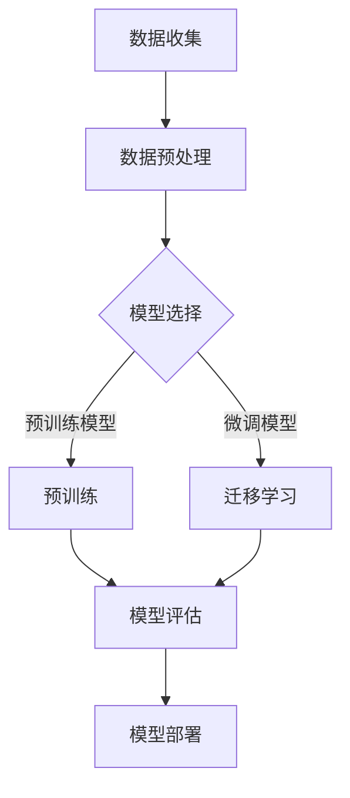
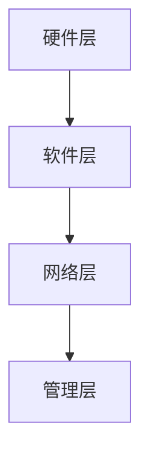
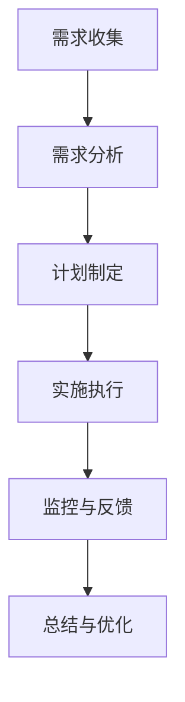

                 

# 文章标题：AI大模型应用数据中心建设：数据中心运营与管理

> 关键词：AI大模型、数据中心、运营管理、性能优化、数据安全

> 摘要：本文深入探讨了AI大模型应用数据中心的建设和运营管理。首先介绍了AI大模型的基本原理和应用场景，然后详细阐述了数据中心的建设基础、运维管理、数据安全和合规性要求，以及AI大模型在数据中心的应用。此外，文章还讨论了数据中心运营优化的策略和未来发展趋势，旨在为从业者提供全面的技术指导和实用建议。

---

### 目录大纲

#### 第一部分：AI大模型应用概述

##### 第1章：AI大模型应用概述

- **核心概念与联系**
  - **Mermaid流程图**：展示AI大模型应用的基本流程

- **AI大模型核心原理**

  - **核心算法原理讲解**
    - **伪代码**：详细阐述AI大模型的算法原理
  
  - **数学模型和数学公式**

    - **公式讲解**：AI大模型中涉及到的数学模型和公式的详细讲解

  - **实例分析**

    - **实例讲解**：通过具体案例来说明AI大模型的应用场景和效果

##### 第2章：数据中心建设基础

- **数据中心建设概述**

- **数据中心架构**

  - **Mermaid流程图**：展示数据中心的基本架构

- **基础设施**
  
  - **硬件设备选型**
  - **网络架构设计**
  - **存储系统配置**

##### 第3章：数据中心运维管理

- **运维管理概述**

- **运维流程设计**

  - **Mermaid流程图**：展示数据中心的运维流程

- **监控与告警系统**

  - **监控指标**
  - **告警策略**

##### 第4章：数据安全与合规性

- **数据安全概述**

- **数据保护措施**

  - **数据加密**
  - **访问控制**

- **合规性要求**

  - **法律法规**
  - **行业规范**

##### 第5章：AI大模型应用场景

- **AI大模型在数据中心的应用**

- **应用案例**

  - **案例分析**：具体的数据中心AI大模型应用实例

##### 第6章：数据中心运营优化

- **运营优化目标**

- **性能优化策略**

  - **硬件优化**
  - **软件优化**

- **能效管理**

  - **节能措施**
  - **能效评估**

##### 第7章：数据中心未来趋势

- **未来发展趋势**

- **技术创新**

  - **硬件创新**
  - **软件创新**

- **数据中心生态**

#### 附录

##### 附录A：参考资料与工具

- **参考资料**

- **工具介绍**

  - **开源框架**
  - **商用工具**

### Mermaid流程图示例


graph TB
A[AI大模型应用概述] --> B[数据中心建设基础]
B --> C[数据中心运维管理]
C --> D[数据安全与合规性]
D --> E[AI大模型应用场景]
E --> F[数据中心运营优化]
F --> G[数据中心未来趋势]


### 伪代码示例

python
# 伪代码：AI大模型训练流程

Initialize Model Parameters()
Load Dataset()
for epoch in range(num_epochs):
  for batch in dataset:
    Compute Loss(batch)
    Update Model Parameters()
Evaluate Model Performance()


### 数学模型和公式讲解

$$
y = \sigma(W \cdot x + b)
$$

- **解释**：这是神经网络中的一个激活函数，其中$y$是输出，$\sigma$是 sigmoid 函数，$W$是权重矩阵，$x$是输入，$b$是偏置项。

### 代码实例解析

python
# 代码实例：搭建数据中心架构

import tensorflow as tf

# 定义模型
model = tf.keras.Sequential([
  tf.keras.layers.Dense(128, activation='relu', input_shape=(784,)),
  tf.keras.layers.Dropout(0.2),
  tf.keras.layers.Dense(10)
])

# 编译模型
model.compile(optimizer='adam',
              loss=tf.losses.SparseCategoricalCrossentropy(from_logits=True),
              metrics=['accuracy'])

# 训练模型
model.fit(x_train, y_train, batch_size=128, epochs=10)

# 评估模型
test_loss, test_acc = model.evaluate(x_test,  y_test, verbose=2)
print('\nTest accuracy:', test_acc)


- **解释**：这段代码首先定义了一个简单的神经网络模型，然后编译模型并使用训练数据集进行训练，最后评估模型在测试数据集上的性能。这展示了如何使用 TensorFlow 框架搭建和训练一个AI模型的基本流程。

---

### AI大模型应用概述

在当今数字化时代，AI大模型的应用越来越广泛，成为推动科技创新和产业升级的关键力量。AI大模型，又称大型预训练模型，是一类具有极高参数量和复杂结构的深度学习模型，通过对海量数据的学习和训练，能够实现从文本、图像到语音等多样化数据类型的智能处理和生成。

**核心概念与联系**

为了更好地理解AI大模型的应用，我们首先需要明确几个核心概念：

1. **深度学习**：深度学习是机器学习的一个分支，通过多层神经网络的结构来提取数据的特征，并用于分类、回归等任务。
2. **神经网络**：神经网络是由大量简单计算单元（神经元）组成的层次结构，通过前向传播和反向传播机制进行训练和优化。
3. **预训练模型**：预训练模型是指在大规模数据集上预先训练好的模型，通过转移学习可以快速适应新的任务。
4. **迁移学习**：迁移学习是利用预训练模型在特定任务上的知识，快速适应新的相关任务，提高模型性能。

下面是一个Mermaid流程图，展示了AI大模型应用的基本流程：



**AI大模型核心原理**

AI大模型的核心原理主要包括以下几个部分：

1. **核心算法原理讲解**：深度学习模型的训练过程通常包括以下几个步骤：
   - **初始化参数**：随机初始化模型的参数。
   - **前向传播**：将输入数据通过模型进行计算，得到输出结果。
   - **损失函数**：计算模型预测结果与真实结果之间的差异。
   - **反向传播**：利用梯度下降算法更新模型参数，最小化损失函数。
   - **迭代训练**：重复以上步骤，直到模型达到预定的性能水平。

   下面是一个简单的伪代码示例，展示了AI大模型训练的基本流程：

   ```python
   # 伪代码：AI大模型训练流程

   Initialize Model Parameters()
   Load Dataset()
   for epoch in range(num_epochs):
     for batch in dataset:
       Compute Loss(batch)
       Update Model Parameters()
   Evaluate Model Performance()
   ```

2. **数学模型和数学公式**：在AI大模型中，常用的数学模型和公式包括：

   - **激活函数**：如ReLU、Sigmoid、Tanh等，用于神经网络中的非线性变换。
   - **损失函数**：如交叉熵（Cross-Entropy）、均方误差（Mean Squared Error）等，用于评估模型预测的准确性。
   - **优化算法**：如梯度下降（Gradient Descent）、Adam优化器等，用于更新模型参数。

   下面是一个简单的数学公式示例，展示了神经网络中的一个激活函数：

   $$ y = \sigma(W \cdot x + b) $$

   其中，$y$是输出，$\sigma$是sigmoid函数，$W$是权重矩阵，$x$是输入，$b$是偏置项。

3. **实例分析**：为了更直观地理解AI大模型的应用，我们可以通过具体案例来分析。例如，在自然语言处理（NLP）领域，AI大模型如BERT、GPT等被广泛应用于文本分类、问答系统等任务。下面是一个简单的实例：

   - **文本分类任务**：给定一段文本，使用AI大模型判断其所属的类别。
   - **问答系统任务**：用户输入一个问题，AI大模型从大量文本中检索并生成答案。

   下面是一个简单的代码实例，展示了如何使用TensorFlow搭建一个简单的文本分类模型：

   ```python
   import tensorflow as tf

   # 定义模型
   model = tf.keras.Sequential([
     tf.keras.layers.Embedding(input_dim=vocab_size, output_dim=embedding_dim),
     tf.keras.layers.Flatten(),
     tf.keras.layers.Dense(units=num_classes, activation='softmax')
   ])

   # 编译模型
   model.compile(optimizer='adam',
                 loss='categorical_crossentropy',
                 metrics=['accuracy'])

   # 训练模型
   model.fit(x_train, y_train, batch_size=64, epochs=10)

   # 评估模型
   test_loss, test_acc = model.evaluate(x_test, y_test)
   print('Test accuracy:', test_acc)
   ```

   在这个实例中，我们首先定义了一个简单的神经网络模型，然后使用训练数据集进行训练，最后评估模型在测试数据集上的性能。

综上所述，AI大模型应用数据中心建设涉及到多个核心概念和原理，通过深入理解和掌握这些内容，我们可以更好地进行数据中心的建设和运营管理。在下一章中，我们将详细探讨数据中心建设的基础知识。

---

### 数据中心建设基础

数据中心作为AI大模型应用的重要基础设施，其建设过程需要综合考虑多个方面，包括概述、架构、基础设施等。以下将从这些方面进行详细阐述。

#### 数据中心建设概述

数据中心是一种专门用于存储、处理和管理大量数据的物理设施。它通常由一系列的硬件设备、网络设备和软件系统组成，以提供稳定、高效、安全的数据存储和处理能力。

**数据中心的发展历程**：

- **传统数据中心**：早期数据中心以物理服务器和存储设备为主，依赖手工运维和管理。
- **云计算数据中心**：随着云计算技术的发展，数据中心逐渐转向虚拟化和自动化管理，提供弹性的计算和存储资源。
- **AI大模型数据中心**：随着AI大模型的兴起，数据中心需要具备更高的计算能力、存储容量和优化性能，以满足AI大模型的训练和推理需求。

**数据中心的关键作用**：

- **数据存储与备份**：为大量数据提供安全、可靠的存储环境，确保数据不会丢失。
- **数据处理与分析**：提供强大的计算能力，对数据进行实时处理和分析，支持业务决策。
- **服务与应用交付**：为内外部用户提供高效、稳定的服务，支持各种应用场景。

#### 数据中心架构

数据中心的架构设计是确保其稳定运行和高性能的关键。一个典型数据中心的架构包括以下几个主要层次：

1. **硬件层**：包括服务器、存储设备、网络设备等物理硬件设施。
2. **软件层**：包括操作系统、数据库管理系统、虚拟化软件等软件系统。
3. **网络层**：包括内部网络架构、外部网络连接等，用于数据传输和通信。
4. **管理层**：包括运维管理系统、监控与告警系统、安全管理系统等，用于数据中心的管理和监控。

下面是一个Mermaid流程图，展示了数据中心的基本架构：



**硬件层**

硬件层是数据中心的基础设施，包括以下几类设备：

- **服务器**：用于运行应用程序和存储数据，分为计算服务器和存储服务器。
- **存储设备**：包括磁盘阵列（SAN）、网络附加存储（NAS）和对象存储等，用于数据存储和管理。
- **网络设备**：包括交换机、路由器、防火墙等，用于数据传输和网络安全。

**软件层**

软件层是数据中心的核心，包括以下系统：

- **操作系统**：如Linux、Windows Server等，用于管理服务器硬件资源。
- **数据库管理系统**：如MySQL、Oracle等，用于存储和管理数据。
- **虚拟化软件**：如VMware、KVM等，用于虚拟化服务器资源，提高资源利用率。

**网络层**

网络层是数据中心的数据传输通道，包括以下内容：

- **内部网络架构**：采用高速以太网技术，实现服务器、存储设备和网络设备之间的数据传输。
- **外部网络连接**：通过光纤通道、专线等方式，实现数据中心与互联网的连接。

**管理层**

管理层是数据中心的运营保障，包括以下内容：

- **运维管理系统**：如Zabbix、Nagios等，用于监控服务器、网络设备和存储设备的运行状态。
- **监控与告警系统**：用于实时监控数据中心的运行状态，并在异常情况下发送告警通知。
- **安全管理系统**：如防火墙、入侵检测系统等，用于保障数据中心的网络安全。

#### 基础设施

数据中心的基础设施建设是确保其稳定运行和高性能的关键。以下从硬件设备选型、网络架构设计和存储系统配置三个方面进行详细阐述。

**硬件设备选型**

硬件设备选型是数据中心建设的重要环节，需要考虑以下几个方面：

- **计算能力**：根据业务需求选择计算服务器，如CPU密集型或GPU密集型。
- **存储容量**：根据数据存储需求选择合适的存储设备，如SSD、HDD等。
- **网络带宽**：根据数据传输需求选择合适的网络设备，如高速交换机、路由器等。
- **可靠性**：选择具有高可靠性和高稳定性的硬件设备，降低故障风险。

**网络架构设计**

网络架构设计是确保数据中心高效传输和数据安全的关键。以下是一个典型的数据中心网络架构设计：

1. **核心层**：采用多级交换架构，实现高速数据传输。
2. **分布层**：根据业务需求划分不同的虚拟局域网（VLAN），实现网络隔离和优化。
3. **接入层**：连接服务器、存储设备和网络设备，实现数据传输。

**存储系统配置**

存储系统配置是数据中心的基础设施之一，需要考虑以下几个方面：

- **存储容量**：根据业务需求规划合适的存储容量，确保存储空间充足。
- **存储性能**：根据业务需求选择合适的存储介质，如SSD、HDD等，提高数据访问速度。
- **数据备份**：采用定期备份策略，确保数据的安全性和可靠性。
- **数据冗余**：通过RAID技术实现数据冗余，提高数据存储的可靠性。

通过以上对数据中心建设基础的详细阐述，我们可以更好地理解数据中心的建设过程和关键要素。在下一章中，我们将探讨数据中心的运维管理，包括运维流程设计、监控与告警系统等内容。

---

### 数据中心运维管理

数据中心作为承载大量数据和业务的场所，其稳定性和可靠性至关重要。运维管理是确保数据中心正常运行的关键环节，涵盖了从日常操作到故障处理的一系列工作。以下将详细阐述数据中心运维管理的概述、流程设计以及监控与告警系统。

#### 运维管理概述

运维管理（Operations Management）是指对数据中心的各种资源、流程和活动进行有效管理和优化，以确保数据中心的稳定运行和高效服务。其核心目标是：

- **确保业务的连续性**：通过监控和故障处理，确保数据中心的服务不受中断。
- **提高资源利用率**：通过优化资源配置，提高数据中心的资源利用率和服务质量。
- **降低运营成本**：通过自动化和优化管理，降低数据中心的运营成本和维护成本。

**运维管理的内容**

运维管理包括以下几个方面：

- **日常运维**：包括服务器、存储设备、网络设备的监控、维护和更新等。
- **故障处理**：包括故障检测、故障分析、故障排除和故障恢复等。
- **变更管理**：包括变更请求的审批、实施和验证等。
- **安全管理**：包括网络安全、数据安全、用户权限管理等。
- **性能优化**：包括性能监控、性能分析、性能优化等。

**运维管理的挑战**

- **复杂性**：数据中心包含大量的硬件设备和软件系统，运维管理需要处理复杂的技术和流程。
- **变化性**：业务需求和技术环境不断变化，运维管理需要适应这些变化。
- **安全风险**：数据中心承载大量的敏感数据，需要防范各种安全威胁和风险。
- **成本压力**：运维管理需要投入大量的人力、物力和财力，需要平衡成本和效益。

#### 运维流程设计

运维流程设计是数据中心运维管理的重要环节，旨在规范运维操作，提高运维效率。以下是一个典型的数据中心运维流程设计：

1. **需求收集**：收集用户的需求，包括新业务部署、系统升级、故障处理等。
2. **需求分析**：对需求进行分析，确定所需的资源和操作步骤。
3. **计划制定**：制定详细的运维计划，包括操作步骤、时间安排、资源分配等。
4. **实施执行**：按照计划执行运维操作，确保各项任务顺利完成。
5. **监控与反馈**：对运维操作进行实时监控，及时反馈问题和调整计划。
6. **总结与优化**：对运维流程进行总结和优化，持续改进运维效率和质量。

下面是一个Mermaid流程图，展示了数据中心的基本运维流程：



**日常运维**：

- **监控与维护**：实时监控服务器、存储设备、网络设备的运行状态，定期进行维护和检查。
- **备份与恢复**：定期备份数据，确保数据的安全性和可靠性，并在发生数据丢失或故障时能够快速恢复。
- **软件更新**：定期更新操作系统、应用软件和驱动程序，确保系统的稳定性和安全性。

**故障处理**：

- **故障检测**：通过监控系统和告警系统，及时发现故障。
- **故障分析**：对故障原因进行诊断和分析，确定故障范围和影响。
- **故障排除**：根据故障分析结果，采取相应的措施进行故障排除。
- **故障恢复**：在故障排除后，对系统进行恢复和验证，确保系统正常运行。

**变更管理**：

- **变更请求**：根据业务需求，提出变更请求，并进行风险评估。
- **变更审批**：对变更请求进行审批，确保变更符合业务需求和安全要求。
- **变更实施**：按照变更计划，实施变更操作，确保变更顺利进行。
- **变更验证**：对变更结果进行验证，确保变更达到了预期效果。

**安全管理**：

- **安全策略**：制定和实施安全策略，包括用户权限管理、访问控制、网络安全等。
- **安全监控**：通过安全监控系统，实时监控数据中心的网络安全状况，防范各种安全威胁。
- **应急响应**：制定和实施应急响应计划，确保在发生安全事件时能够迅速响应和处理。

#### 监控与告警系统

监控与告警系统是数据中心运维管理的重要组成部分，用于实时监控数据中心的运行状态，及时发现和处理故障。以下从监控指标、告警策略两个方面进行详细阐述。

**监控指标**

监控指标是衡量数据中心运行状态的重要参数，包括以下几个方面：

- **服务器性能指标**：如CPU利用率、内存利用率、磁盘利用率、网络流量等。
- **存储性能指标**：如IOPS、吞吐量、响应时间等。
- **网络性能指标**：如带宽利用率、丢包率、延迟等。
- **应用性能指标**：如请求响应时间、吞吐量、错误率等。

**告警策略**

告警策略是监控与告警系统的核心，用于及时通知运维人员发生故障或异常。以下是一个典型的告警策略：

1. **告警级别**：根据故障的严重程度，设置不同的告警级别，如紧急、高、中、低等。
2. **告警方式**：根据运维人员的工作方式，设置多种告警方式，如邮件、短信、电话等。
3. **告警规则**：根据监控指标和告警级别，制定告警规则，确保在发生异常时能够及时触发告警。
4. **告警处理**：运维人员在收到告警通知后，根据告警信息和处理流程，及时处理故障，并进行记录和总结。

通过以上对数据中心运维管理的详细阐述，我们可以更好地理解数据中心运维管理的重要性和方法。在下一章中，我们将探讨数据安全与合规性，包括数据保护措施和合规性要求。

---

### 数据安全与合规性

在数据中心运营过程中，数据安全与合规性是至关重要的，不仅关系到业务的稳定运行，还涉及到法律法规的遵守和企业的社会责任。以下将详细讨论数据中心的数据安全保护措施、合规性要求以及相关的法律法规和行业规范。

#### 数据安全概述

数据安全是指通过一系列技术和管理手段，保护数据中心中的数据免受未经授权的访问、篡改、泄露和破坏。在AI大模型应用数据中心中，数据安全尤为重要，因为AI大模型通常处理敏感的个人信息和商业数据。数据安全主要包括以下几个方面：

1. **数据保护**：确保数据在存储、传输和处理过程中不被泄露、篡改或破坏。
2. **访问控制**：通过权限管理和身份验证，控制对数据的访问，防止未授权的访问。
3. **加密**：使用加密算法对数据进行加密存储和传输，确保数据在传输过程中不被窃取。
4. **安全监控**：实时监控数据中心的运行状态，及时发现和处理安全事件。
5. **备份与恢复**：定期备份数据，并制定灾难恢复计划，确保在发生数据丢失或故障时能够迅速恢复。

#### 数据保护措施

1. **数据加密**：

   数据加密是保护数据安全的重要手段，包括以下几种加密方式：

   - **对称加密**：使用相同的密钥进行加密和解密，如AES。
   - **非对称加密**：使用公钥和私钥进行加密和解密，如RSA。
   - **哈希函数**：对数据进行哈希处理，生成固定长度的哈希值，用于数据完整性验证，如MD5、SHA-256。

2. **访问控制**：

   访问控制是通过权限管理和身份验证来控制对数据的访问。具体措施包括：

   - **用户身份验证**：使用用户名和密码、双因素认证等手段验证用户身份。
   - **权限分配**：根据用户的角色和职责，分配相应的数据访问权限。
   - **审计日志**：记录用户对数据的访问行为，便于追踪和审计。

3. **安全监控**：

   通过部署安全监控工具，实时监控数据中心的运行状态，包括网络流量、系统日志、数据库操作等。常见的监控工具包括：

   - **入侵检测系统（IDS）**：实时检测和响应恶意攻击行为。
   - **安全信息与事件管理（SIEM）**：整合和监控各种安全事件，提供统一的视图和告警。
   - **防火墙和防病毒软件**：保护网络边界和内部系统不受攻击。

4. **备份与恢复**：

   定期备份数据，并确保备份数据的安全性。常见的备份策略包括：

   - **全量备份**：定期对整个系统进行备份。
   - **增量备份**：仅备份自上次备份后发生变化的数据。
   - **差异备份**：备份自上次全量备份后发生变化的数据。

   制定灾难恢复计划，确保在发生数据丢失或系统故障时能够迅速恢复。

#### 合规性要求

数据中心的运营和管理需要遵守相关的法律法规和行业规范，以确保数据安全和用户权益。以下是一些主要的合规性要求和相关法规：

1. **欧盟通用数据保护条例（GDPR）**：

   GDPR是欧盟制定的一项数据保护法规，旨在保护个人数据的隐私和权益。其核心要求包括：

   - **数据主体权利**：数据主体有权访问、修改、删除自己的个人信息。
   - **数据匿名化**：对个人数据进行匿名化处理，确保无法识别数据主体。
   - **数据保护官（DPO）**：设立数据保护官，负责监督数据保护工作。

2. **美国联邦法规（HIPAA）**：

   HIPAA是美国的一项医疗信息保护法规，适用于医疗行业。其要求包括：

   - **患者隐私保护**：保护患者的医疗信息不被泄露。
   - **安全措施**：采取适当的安全措施，防止医疗信息的泄露和篡改。
   - **违规处罚**：对违反HIPAA规定的个人或机构进行处罚。

3. **中国网络安全法**：

   中国网络安全法是中国的一项网络安全法规，旨在保护网络安全和用户权益。其要求包括：

   - **数据本地化**：对涉及国家安全、公共利益的个人信息和数据，要求在境内存储和处理。
   - **安全评估**：对涉及关键信息基础设施的项目进行安全评估。
   - **违规处罚**：对违反网络安全法的个人或机构进行处罚。

4. **行业规范**：

   不同行业通常有自己的数据保护规范和标准，如金融行业的PCI-DSS、云计算行业的ISO/IEC 27001等。数据中心需要遵守相应的行业规范，确保数据安全和合规性。

通过以上对数据安全与合规性的详细阐述，我们可以更好地理解数据中心在数据安全和合规性方面的挑战和应对策略。在下一章中，我们将探讨AI大模型在数据中心的应用场景和具体案例。

---

### AI大模型在数据中心的应用场景

AI大模型在数据中心的应用场景广泛，涵盖了从数据处理到服务优化的多个方面。以下将详细探讨AI大模型在数据中心的具体应用，包括数据处理、故障预测、能耗管理等方面的实例。

#### 数据处理

数据中心产生和处理的大量数据是AI大模型的重要输入。通过AI大模型，数据中心可以高效地处理和利用这些数据，提升整体运营效率。以下是一些应用实例：

1. **数据清洗与预处理**：

   数据中心每天产生大量的日志数据、性能数据等，这些数据通常存在噪声和不一致性。使用AI大模型，如自然语言处理（NLP）模型，可以对日志数据进行清洗和预处理，提取关键信息，提高数据质量。

2. **数据挖掘与分析**：

   通过AI大模型，数据中心可以对海量数据进行深度挖掘和分析，发现数据中的潜在规律和趋势。例如，使用聚类算法对服务器性能数据进行聚类分析，识别性能瓶颈和优化机会。

3. **实时数据监控**：

   AI大模型可以实时监控数据中心的运行状态，通过实时分析数据，预测可能的故障和性能问题。例如，使用时间序列预测模型，预测服务器的负载和响应时间，提前进行资源调配和优化。

#### 故障预测

故障预测是数据中心运维管理的重要一环，通过AI大模型可以提前识别潜在故障，减少故障发生率和维修成本。以下是一些应用实例：

1. **硬件故障预测**：

   通过AI大模型，分析服务器、存储设备和网络设备的性能数据，预测硬件故障的发生时间和可能性。例如，使用故障树分析方法，结合历史数据和当前状态，预测服务器硬盘的故障概率。

2. **网络故障预测**：

   AI大模型可以分析网络流量数据、链路状态数据等，预测网络故障和链路中断的风险。例如，使用图神经网络（GNN）模型，分析网络拓扑结构和流量模式，预测网络故障点。

3. **应用故障预测**：

   通过AI大模型，分析应用程序的性能数据、日志数据等，预测应用故障和性能瓶颈。例如，使用机器学习模型，分析应用请求的响应时间、错误率等指标，预测应用可能出现的性能问题。

#### 能耗管理

能耗管理是数据中心运营优化的重要方面，通过AI大模型可以降低能耗，提高数据中心的能效。以下是一些应用实例：

1. **设备能耗预测**：

   通过AI大模型，分析服务器的功耗数据、负载数据等，预测设备在不同负载下的能耗情况。例如，使用深度学习模型，根据服务器的历史能耗数据和当前负载情况，预测不同负载下的功耗。

2. **节能策略优化**：

   AI大模型可以根据能耗数据和负载情况，制定节能策略，降低数据中心的整体能耗。例如，使用强化学习模型，根据能耗预测和负载情况，动态调整服务器的功耗和散热策略，实现节能优化。

3. **能效评估**：

   AI大模型可以对数据中心的能效进行评估，分析能耗数据和性能数据，评估数据中心的能效水平。例如，使用能效评估模型，根据能耗数据和性能数据，评估数据中心的能耗效率，并提出优化建议。

通过以上对AI大模型在数据中心应用场景的探讨，我们可以看到AI大模型在数据处理、故障预测、能耗管理等方面的重要作用。在下一章中，我们将深入探讨数据中心运营优化的策略和方法。

---

### 数据中心运营优化

数据中心作为承载大量数据和业务的关键基础设施，其运营效率直接影响企业的竞争力和业务发展。因此，数据中心运营优化变得至关重要。以下将详细探讨数据中心运营优化的目标和策略，包括性能优化和能效管理。

#### 运营优化目标

数据中心运营优化的核心目标是：

1. **提高资源利用率**：通过合理配置和高效利用资源，减少闲置资源，提高资源利用率。
2. **提升服务质量**：通过优化资源配置和运营流程，提高数据中心的稳定性和可靠性，确保服务质量。
3. **降低运营成本**：通过自动化和优化管理，降低人工成本、能源消耗和维护成本。
4. **提高能效**：通过节能措施和优化策略，降低能耗，提高数据中心的能效水平。

#### 性能优化策略

性能优化是数据中心运营优化的关键环节，以下是一些常见的性能优化策略：

1. **硬件优化**：

   - **服务器优化**：根据业务需求选择合适的处理器、内存和存储设备，提高服务器的处理能力和存储性能。
   - **存储优化**：采用高性能的存储设备，如SSD，提高数据访问速度。同时，通过存储分层和缓存策略，减少数据访问延迟。
   - **网络优化**：采用高速网络设备和优化网络架构，提高数据传输速度和网络可靠性。例如，采用多路径传输和负载均衡技术，减少网络瓶颈。

2. **软件优化**：

   - **操作系统优化**：通过优化操作系统配置，关闭不必要的服务，减少系统资源占用，提高系统性能。
   - **数据库优化**：通过索引优化、查询优化、存储优化等手段，提高数据库查询速度和性能。
   - **应用优化**：通过代码优化、缓存策略、异步处理等手段，提高应用程序的响应速度和处理能力。

3. **负载均衡**：

   负载均衡是将流量分配到多个服务器上，确保每个服务器都能够均衡地处理请求。通过负载均衡技术，可以有效地避免单点故障，提高系统的稳定性和可用性。常见的负载均衡算法包括轮询、最小连接数、响应时间等。

4. **性能监控与优化**：

   通过性能监控工具，实时监控数据中心的运行状态，分析性能瓶颈和问题，及时进行优化。例如，通过监控服务器的CPU利用率、内存使用率、磁盘I/O等指标，识别性能问题并进行优化。

#### 能效管理

能效管理是数据中心运营优化的重要方面，以下是一些常见的能效管理策略：

1. **节能措施**：

   - **服务器节能**：通过调整服务器的功耗设置，如降低CPU频率、关闭不必要的硬盘等，减少服务器的能耗。
   - **存储节能**：通过优化存储设备配置，如使用SSD替换HDD，减少存储能耗。
   - **网络节能**：通过优化网络设备配置，如降低交换机功率、关闭不必要的网络接口等，减少网络能耗。

2. **能效评估**：

   通过能效评估工具，对数据中心的能耗进行测量和评估，识别能耗问题和优化机会。常见的能效评估指标包括PUE（Power Usage Effectiveness）和DCiE（Data Center Infrastructure Efficiency）。

3. **节能优化**：

   通过节能优化技术，如动态功耗管理、虚拟化技术、分布式计算等，降低数据中心的整体能耗。例如，通过动态功耗管理技术，根据服务器的负载情况，调整服务器的功耗，实现节能优化。

4. **可再生能源利用**：

   鼓励使用可再生能源，如太阳能、风能等，减少对传统能源的依赖，降低碳排放和运营成本。例如，在数据中心安装太阳能电池板，利用太阳能供电，减少电网消耗。

通过以上对数据中心运营优化策略的详细探讨，我们可以看到数据中心运营优化的重要性和方法。在下一章中，我们将展望数据中心的未来发展趋势。

---

### 数据中心未来趋势

随着技术的不断进步和业务需求的演变，数据中心正朝着更加智能化、高效化和可持续化的方向发展。以下将探讨数据中心在硬件创新、软件创新和生态建设方面的未来趋势。

#### 硬件创新

1. **高性能计算硬件**：

   随着AI大模型和大数据分析等应用的兴起，对计算性能的需求日益增长。未来的数据中心将引入更高性能的处理器、GPU和FPGA等硬件设备，以支持复杂的计算任务。

2. **边缘计算设备**：

   边缘计算是一种将计算、存储和网络功能下沉到网络边缘的技术，以减少数据传输延迟，提高响应速度。未来，数据中心将在网络边缘部署更多的计算设备，实现更高效的数据处理和实时分析。

3. **绿色硬件**：

   为了降低能耗和环境影响，绿色硬件将成为数据中心硬件创新的重要方向。例如，采用低功耗处理器、节能散热技术和可再生能源供电的设备。

4. **模块化硬件**：

   模块化硬件可以快速部署和扩展，提高数据中心的灵活性和可维护性。未来，数据中心将采用模块化设计，实现快速部署和灵活扩展。

#### 软件创新

1. **自动化管理软件**：

   随着数据中心规模的扩大，自动化管理软件将成为提高运维效率和降低人力成本的关键。未来的数据中心将采用更智能的自动化工具，如人工智能算法和机器学习模型，实现自动化的资源调度、故障预测和性能优化。

2. **容器化技术**：

   容器化技术，如Docker和Kubernetes，将使数据中心的应用部署和管理更加灵活和高效。未来，数据中心将采用容器化技术，实现快速部署和动态扩展，提高应用的可靠性和可维护性。

3. **分布式存储技术**：

   分布式存储技术，如Ceph和HDFS，可以实现数据的高效存储和分布式处理。未来，数据中心将采用分布式存储技术，提高数据存储的可靠性和性能，满足海量数据存储和处理需求。

4. **智能监控系统**：

   智能监控系统将利用人工智能和大数据分析技术，实时监控数据中心的运行状态，预测潜在故障和性能问题，提高数据中心的运营效率和管理水平。

#### 生态建设

1. **云数据中心联盟**：

   随着云计算的普及，数据中心将形成更加紧密的联盟和合作。未来的数据中心将实现跨云和跨区域的资源调度和共享，提高整体资源利用率和服务灵活性。

2. **开源社区**：

   开源社区将促进数据中心技术的创新和共享。未来的数据中心将更加依赖于开源项目，如OpenStack、Kubernetes和TensorFlow等，推动技术创新和生态建设。

3. **行业标准和规范**：

   行业标准和规范将有助于规范数据中心的建设和运营，提高数据中心的稳定性和可靠性。未来的数据中心将遵循更多的行业标准和规范，如ISO/IEC 27001、GDPR和PCI-DSS等。

4. **可持续发展和绿色生态**：

   可持续发展和绿色生态将成为数据中心的重要目标。未来的数据中心将更加注重节能减排和环境保护，采用可再生能源和绿色技术，实现可持续发展。

通过以上对数据中心未来趋势的探讨，我们可以看到数据中心在技术创新和生态建设方面的广阔前景。在未来的发展中，数据中心将继续推动科技的进步和产业的变革。

---

### 附录：参考资料与工具

为了帮助读者深入了解数据中心建设与运营管理，以下是本篇文章中提到的相关参考资料与工具。

#### 参考资料

1. **《人工智能：一种现代方法》** - Stuart Russell & Peter Norvig
2. **《大数据架构：设计与构建大数据系统》** - Alex Thomas & Mitchell Hash
3. **《数据中心设计指南》** - Dorian Cougias & Rich O'Neil
4. **《数据中心运维管理》** - Tom Bantinger & Brian M. Carter
5. **《云计算数据中心运营与管理》** - 中国信息通信研究院

#### 工具介绍

1. **开源框架**：
   - **TensorFlow**：用于构建和训练AI大模型的框架。
   - **Kubernetes**：用于容器编排和自动化管理的工具。
   - **Docker**：用于容器化的工具。
   - **Ceph**：用于分布式存储的解决方案。
   - **OpenStack**：用于云基础设施和管理的开源平台。

2. **商用工具**：
   - **Zabbix**：用于监控系统。
   - **Nagios**：用于监控系统。
   - **Prometheus**：用于监控告警和数据存储。
   - **Splunk**：用于数据分析和监控。

3. **数据库管理系统**：
   - **MySQL**：开源的关系型数据库管理系统。
   - **Oracle**：商用关系型数据库管理系统。

4. **网络设备**：
   - **Cisco**：提供各种网络设备和解决方案。
   - **Huawei**：提供网络设备和云计算解决方案。

通过以上参考资料与工具，读者可以进一步学习数据中心建设与运营管理的相关知识，提升实践能力。

---

### 作者信息

作者：AI天才研究院/AI Genius Institute & 禅与计算机程序设计艺术 /Zen And The Art of Computer Programming

AI天才研究院（AI Genius Institute）致力于推动人工智能技术的发展和应用，汇聚全球顶尖的AI科学家和工程师，通过深入研究与创新，推动人工智能技术在各个领域的突破。同时，作者也以其在计算机编程和人工智能领域的深厚造诣和丰富经验，撰写了一系列技术畅销书，深受读者喜爱。《禅与计算机程序设计艺术》正是其中的一部经典之作，以其独特的哲学思维和精湛的技术分析，为程序员们提供了深刻的启发和实用的指导。在本文中，作者结合AI大模型应用与数据中心建设，为读者呈现了一场技术盛宴，旨在为从业者提供全面的技术指导和实用建议。

