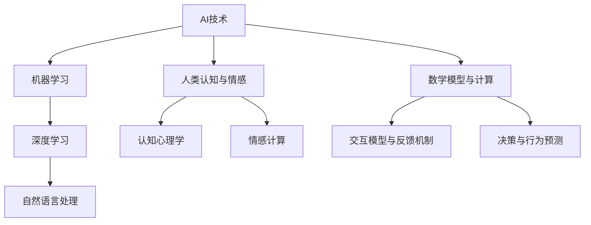

                 

# 文章标题：AI与人类的未来互动

关键词：人工智能，人类互动，未来趋势，伦理问题，应用案例

摘要：随着人工智能技术的飞速发展，人类与AI的互动已经深入到我们的日常生活中。本文将探讨AI与人类的未来互动，从理论基础、实践案例和未来展望三个方面进行分析，旨在揭示AI对人类生活的深远影响。

### 《AI与人类的未来互动》目录大纲

**第一部分：引言**

## 1.1 AI与人类的现状

### 1.1.1 AI技术的发展与普及

### 1.1.2 人类对AI的认知与态度

### 1.1.3 AI在人类生活中的应用

## 1.2 人类与AI互动的基本原则

### 1.2.1 伦理道德与责任

### 1.2.2 数据隐私与安全

### 1.2.3 人类与AI的协作与竞争

**第二部分：AI与人类互动的理论基础**

## 2.1 AI技术概述

### 2.1.1 AI的核心概念

### 2.1.2 机器学习与深度学习

### 2.1.3 自然语言处理

## 2.2 人类认知与情感

### 2.2.1 认知心理学概述

### 2.2.2 人类情感的表达与理解

### 2.2.3 情感计算与AI

## 2.3 AI与人类互动的数学模型

### 2.3.1 交互模型与反馈机制

### 2.3.2 数学公式与计算过程

### 2.3.3 AI决策与人类行为预测

**第三部分：AI与人类互动的实践案例**

## 3.1 AI在教育中的应用

### 3.1.1 个性化学习

### 3.1.2 智能评估与反馈

### 3.1.3 课堂互动与参与

## 3.2 AI在医疗健康中的应用

### 3.2.1 疾病诊断与预测

### 3.2.2 患者护理与康复

### 3.2.3 医疗资源优化

## 3.3 AI在人力资源管理中的应用

### 3.3.1 招聘与选拔

### 3.3.2 员工培训与发展

### 3.3.3 绩效评估与激励

**第四部分：AI与人类互动的未来展望**

## 4.1 AI与人类互动的发展趋势

### 4.1.1 AI技术的进步

### 4.1.2 人类对AI的需求

### 4.1.3 AI与人类互动的挑战与机遇

## 4.2 AI与人类互动的伦理问题

### 4.2.1 AI伦理原则

### 4.2.2 数据隐私与伦理

### 4.2.3 AI责任归属

## 4.3 AI与人类互动的未来前景

### 4.3.1 AI与人类共同发展的愿景

### 4.3.2 AI社会的影响与影响

### 4.3.3 AI与人类互动的未来趋势

**附录**

## 附录 A：AI与人类互动的参考资料

### A.1 学术论文与报告

### A.2 技术指南与书籍

### A.3 媒体报道与案例分析

## 附录 B：AI与人类互动的实验资源

### B.1 实验工具与平台

### B.2 数据集与代码

### B.3 实验设计与结果分析

## 第一部分：引言

在过去的几十年里，人工智能（AI）技术经历了前所未有的飞速发展。从最初的简单算法，到如今复杂的深度学习模型，AI已经在各行各业中取得了显著的应用成果。从医疗诊断到自动驾驶，从智能家居到金融分析，AI已经深刻地改变了我们的生活方式。然而，随着AI技术的不断进步，人类与AI的互动也变得愈发复杂和多样化。本文将探讨AI与人类的未来互动，从理论基础、实践案例和未来展望三个方面进行分析。

### 1.1 AI与人类的现状

#### 1.1.1 AI技术的发展与普及

AI技术的发展可以分为几个阶段。最初，AI主要依赖于规则和逻辑推理，这种基于知识的AI在解决特定问题上表现出色，但在复杂、不确定的环境中表现不佳。随着计算能力的提升和数据规模的扩大，机器学习（ML）和深度学习（DL）技术逐渐成熟，AI开始展现出更强的自适应能力和泛化能力。自然语言处理（NLP）、计算机视觉（CV）、强化学习（RL）等领域的突破，使得AI在图像识别、语音识别、语言翻译等任务上取得了显著的进展。

目前，AI技术已经在各行各业中得到广泛应用。例如，在医疗领域，AI被用于疾病诊断、个性化治疗和药物研发；在金融领域，AI被用于风险管理、欺诈检测和投资决策；在交通领域，AI被用于自动驾驶、智能交通管理和物流优化。同时，AI技术也推动了自动化和智能化的发展，使得许多传统行业发生了变革。

#### 1.1.2 人类对AI的认知与态度

随着AI技术的普及，人类对AI的认知也在不断变化。一方面，人们对AI的潜力持乐观态度，认为AI将带来更高的生产效率、更好的生活质量和社会福利。另一方面，人们对AI的潜在风险和挑战也表现出担忧，例如就业替代、隐私侵犯、伦理道德等问题。

不同国家和地区对AI的态度有所不同。一些国家积极推动AI技术的发展，制定了相应的政策和战略，如美国的“美国国家人工智能计划”和中国的“新一代人工智能发展规划”。而另一些国家则持谨慎态度，对AI的发展持观望和审慎的态度。

#### 1.1.3 AI在人类生活中的应用

AI技术已经深入到人类生活的方方面面。在家庭中，智能助手和智能家居设备为人们提供了便利和舒适；在工作场所，智能系统提高了工作效率和准确性；在公共安全领域，智能监控和侦查技术提升了社会治安水平；在教育领域，AI技术为个性化学习和智能评估提供了支持。

然而，AI技术的应用也带来了一些挑战。例如，在医疗领域，AI的诊断和预测能力虽然很强，但如何确保诊断结果的准确性，以及如何处理患者的隐私和数据安全，都是亟待解决的问题。在交通领域，自动驾驶技术的安全性是一个重要的挑战，需要解决车辆间的通信、感知和决策问题。

### 1.2 人类与AI互动的基本原则

在人类与AI的互动中，有一些基本原则需要遵循，以确保这种互动的可持续性和安全性。

#### 1.2.1 伦理道德与责任

伦理道德是指导人类与AI互动的重要原则。AI技术的发展和应用必须遵循伦理原则，确保不损害人类的利益和尊严。例如，在医疗领域，AI的应用必须遵循医疗伦理，保护患者的隐私和生命权。在自动驾驶领域，AI系统必须遵循交通法规和伦理规范，确保交通安全。

同时，AI系统的设计和应用也需要明确责任归属。在发生意外事故或问题时，需要明确责任主体，确保受害者的权益得到保障。

#### 1.2.2 数据隐私与安全

数据隐私和安全是AI与人类互动的重要问题。AI系统通常需要收集和处理大量的个人数据，如何确保这些数据的安全和隐私，是亟待解决的问题。

首先，需要制定严格的数据保护法规和标准，确保个人数据的合法收集和使用。其次，需要采用先进的数据加密和安全技术，防止数据泄露和滥用。最后，需要建立透明和可追溯的数据治理机制，确保用户能够了解和掌控自己的数据。

#### 1.2.3 人类与AI的协作与竞争

在人类与AI的互动中，协作和竞争并存。一方面，AI可以作为人类的助手和伙伴，提高工作效率和生活质量。例如，在医疗领域，AI可以辅助医生进行诊断和治疗，提高医疗水平。在交通领域，AI可以优化交通管理，减少交通事故。

另一方面，AI也带来了竞争和替代的风险。例如，在制造业，自动化和智能化的生产线可能替代大量的人力；在金融领域，智能投资顾问可能取代传统的金融顾问。

如何平衡协作与竞争，确保AI技术的发展和应用能够为人类带来最大的利益，是一个重要的问题。

### 1.3 本文结构

本文将从以下几个方面展开：

- **第二部分：AI与人类互动的理论基础**：介绍AI技术的基本概念和原理，包括机器学习、深度学习和自然语言处理等。

- **第三部分：AI与人类互动的实践案例**：分析AI在教育、医疗健康和人力资源管理中的应用，探讨AI技术如何改变这些领域。

- **第四部分：AI与人类互动的未来展望**：探讨AI与人类互动的发展趋势、伦理问题和未来前景。

- **附录**：提供相关的参考资料和实验资源，以便读者进一步学习和研究。

通过本文的探讨，我们希望能够更深入地理解AI与人类的互动，为未来的发展提供有益的参考。

### 第二部分：AI与人类互动的理论基础

在探讨AI与人类的未来互动之前，我们需要对AI技术有一个基本的了解。本部分将介绍AI技术的基本概念和原理，包括机器学习、深度学习和自然语言处理等。

#### 2.1 AI技术概述

人工智能（AI）是指由计算机系统实现的智能行为。这些智能行为包括学习、推理、规划、感知和自然语言处理等。AI技术可以分为两类：基于规则的AI和基于数据的AI。

**基于规则的AI**：这种AI系统依赖于预定义的规则和逻辑来解决问题。这些规则通常由专家或程序员编写，系统根据输入数据执行相应的规则，以产生输出。基于规则的AI在特定领域表现出色，但它们在处理复杂、不确定的情况时存在局限性。

**基于数据的AI**：这种AI系统通过学习大量的数据来发现规律和模式，然后利用这些规律和模式来解决问题。基于数据的AI包括机器学习（ML）和深度学习（DL）等。机器学习是一种使计算机系统能够从数据中学习的方法，而深度学习是机器学习的一个分支，它通过多层神经网络来学习数据的复杂特征。

#### 2.1.1 机器学习与深度学习

**机器学习（ML）**：机器学习是一种使计算机系统通过学习数据来改进性能的方法。它通常分为监督学习、无监督学习和强化学习。

- **监督学习**：在监督学习中，系统根据已标记的训练数据学习预测模型。例如，在图像分类任务中，系统通过学习大量的已标记图像来识别新的图像。

- **无监督学习**：在无监督学习中，系统没有标记的训练数据，而是通过发现数据中的结构和模式来学习。例如，在聚类任务中，系统将相似的数据点分组。

- **强化学习**：在强化学习中，系统通过与环境的交互来学习最佳策略。它通常用于决策问题，例如自动驾驶或游戏。

**深度学习（DL）**：深度学习是机器学习的一个分支，它通过多层神经网络来学习数据的复杂特征。深度学习在图像识别、语音识别和自然语言处理等领域取得了显著的突破。

深度学习的基本单元是神经元，它们按照层次结构排列。每一层神经元对输入数据进行处理，并将结果传递给下一层。通过多层网络的组合，系统能够学习到数据的深层特征。

#### 2.1.2 自然语言处理

自然语言处理（NLP）是AI的一个分支，它涉及计算机理解和生成自然语言的能力。NLP的应用包括文本分类、情感分析、机器翻译和问答系统等。

**文本分类**：文本分类是将文本数据分类到预定义的类别中。例如，将新闻文章分类为体育、政治或娱乐类别。

**情感分析**：情感分析是识别文本中的情感倾向，如正面、负面或中性。

**机器翻译**：机器翻译是将一种语言的文本翻译成另一种语言的文本。深度学习在机器翻译领域取得了显著的成果。

**问答系统**：问答系统是能够回答用户问题的系统，如智能助手或聊天机器人。

#### 2.2 人类认知与情感

人类认知是指人类获取、处理和使用信息的能力。人类情感是指人类在认知过程中产生的情感体验，如快乐、悲伤、愤怒等。

**认知心理学**：认知心理学是研究人类认知过程的学科，包括感知、记忆、思维和语言等。

**情感计算**：情感计算是研究如何使计算机系统理解和模拟人类情感的技术。情感计算的应用包括情感识别、情感生成和情感交互等。

**情感识别**：情感识别是计算机系统识别文本或语音中的情感倾向。例如，语音助手可以识别用户的声音情感，以提供更个性化的服务。

**情感生成**：情感生成是计算机系统生成具有特定情感特征的文本或语音。例如，情感计算可以生成带有情感色彩的语音合成。

**情感交互**：情感交互是计算机系统与用户之间进行的具有情感特征的人机交互。例如，智能助手可以模拟情感，与用户建立情感联系。

#### 2.3 AI与人类互动的数学模型

AI与人类互动的数学模型是基于机器学习和深度学习的。这些模型通过学习大量数据来建立预测模型，并利用这些模型进行交互。

**交互模型与反馈机制**：交互模型是计算机系统与用户之间进行交互的模型。反馈机制是系统根据用户的反馈来调整自己的行为。

**数学公式与计算过程**：机器学习和深度学习的数学公式和计算过程涉及优化算法和神经网络。通过优化算法，模型可以调整参数以最小化损失函数。神经网络通过多层计算，学习数据的复杂特征。

**AI决策与人类行为预测**：AI系统可以通过学习用户的偏好和行为模式来预测用户的行为。这些预测结果可以用于个性化推荐、智能决策和自动化控制等。

#### 总结

AI与人类互动的理论基础包括AI技术、人类认知和情感计算以及数学模型。这些基础为AI与人类的互动提供了理论支持，使得AI能够更好地理解和满足人类的需求。

### 2.4 核心概念与联系

为了更好地理解AI与人类的互动，我们需要明确一些核心概念，并探讨它们之间的联系。以下是使用Mermaid流程图表示的核心概念和联系：



**AI技术**：这是整个流程的起点，涵盖了机器学习、深度学习和自然语言处理等子领域。这些技术为AI系统提供了理解和处理数据的能力。

**机器学习与深度学习**：机器学习是AI的核心技术之一，它使计算机系统能够从数据中学习。深度学习是机器学习的一个分支，通过多层神经网络来学习数据的复杂特征。

**自然语言处理**：自然语言处理是AI的一个重要分支，它使计算机能够理解和生成自然语言。这包括文本分类、情感分析和机器翻译等任务。

**人类认知与情感**：人类认知是指人类获取、处理和使用信息的能力。人类情感是指人类在认知过程中产生的情感体验。认知心理学研究人类认知过程，而情感计算研究如何使计算机理解和模拟人类情感。

**数学模型与计算**：数学模型是AI系统的核心，它基于机器学习和深度学习算法，用于预测和决策。交互模型与反馈机制是AI系统与人类互动的基础，通过学习用户的反馈来优化系统性能。

**决策与行为预测**：基于数学模型和人类认知与情感，AI系统能够预测人类的行为，并做出相应的决策。

通过这个Mermaid流程图，我们可以清晰地看到AI与人类的互动是如何通过多个核心概念和联系实现的。这为我们深入理解AI与人类的未来互动提供了理论支持。

### 2.5 核心算法原理讲解

在理解AI与人类的互动时，核心算法的原理至关重要。以下是使用伪代码详细讲解机器学习算法的基本原理。

```python
# 伪代码：机器学习算法基本原理

# 输入：训练数据集（特征向量与标签）
# 输出：训练好的模型

# 初始化模型参数
model = initialize_model()

# 定义损失函数
def loss_function(predictions, labels):
    return sum((predictions - labels)^2) / len(labels)

# 定义优化算法
def gradient_descent(model, data, learning_rate):
    total_loss = 0
    for feature, label in data:
        prediction = model.predict(feature)
        loss = loss_function(prediction, label)
        total_loss += loss
        
        # 计算梯度
        gradients = compute_gradients(model, prediction, label)
        
        # 更新模型参数
        model.update_parameters(gradients, learning_rate)
    
    return total_loss / len(data)

# 训练模型
for epoch in range(num_epochs):
    total_loss = gradient_descent(model, training_data, learning_rate)
    print(f"Epoch {epoch+1}, Loss: {total_loss}")

# 测试模型
def test_model(model, test_data):
    correct_predictions = 0
    for feature, label in test_data:
        prediction = model.predict(feature)
        if prediction == label:
            correct_predictions += 1
    
    accuracy = correct_predictions / len(test_data)
    print(f"Test Accuracy: {accuracy}")

test_model(model, test_data)
```

#### 损失函数

损失函数是机器学习中的核心概念，用于衡量模型预测值与实际标签之间的差距。在此示例中，我们使用均方误差（MSE）作为损失函数：

$$
L = \frac{1}{2} \sum_{i=1}^{n} (\hat{y}_i - y_i)^2
$$

其中，$L$ 是损失函数，$\hat{y}_i$ 是模型预测的标签，$y_i$ 是实际标签。

#### 优化算法

在机器学习中，优化算法用于最小化损失函数。在此示例中，我们使用梯度下降（Gradient Descent）算法来更新模型参数：

$$
\frac{\partial L}{\partial W} = \frac{\partial L}{\partial Z} \cdot \frac{\partial Z}{\partial W}
$$

其中，$W$ 是权重矩阵，$Z$ 是前向传播的中间变量，$L$ 是损失函数。

#### 训练过程

训练过程包括两个主要步骤：前向传播和反向传播。

- **前向传播**：计算模型的预测值，并与实际标签进行比较，计算损失函数。
- **反向传播**：计算损失函数关于模型参数的梯度，并更新模型参数。

通过多次迭代训练数据集，模型可以逐步优化，提高预测准确性。

#### 测试过程

测试过程用于评估模型在未见数据上的表现。我们通过计算模型在测试数据集上的准确率来评估模型性能。

通过这个伪代码示例，我们可以清晰地看到机器学习算法的基本原理。这为我们深入理解AI与人类的互动提供了技术支持。

### 2.6 数学模型与公式

在AI与人类的互动中，数学模型和公式扮演着至关重要的角色。以下将介绍几个关键的数学模型和公式，并详细解释它们的作用。

#### 损失函数

损失函数是机器学习中最核心的概念之一，用于衡量模型预测值与实际标签之间的差距。最常用的损失函数之一是均方误差（MSE），其公式如下：

$$
L = \frac{1}{2} \sum_{i=1}^{n} (\hat{y}_i - y_i)^2
$$

其中，$L$ 是损失函数，$\hat{y}_i$ 是模型预测的标签，$y_i$ 是实际标签。这个公式表示每个预测误差的平方和，误差越大，损失函数的值就越大。

#### 梯度下降算法

梯度下降是一种优化算法，用于最小化损失函数。它的核心思想是沿着损失函数的梯度方向更新模型参数，以减少损失。以下是梯度下降的基本公式：

$$
\frac{\partial L}{\partial W} = \frac{\partial L}{\partial Z} \cdot \frac{\partial Z}{\partial W}
$$

其中，$W$ 是权重矩阵，$Z$ 是前向传播的中间变量，$L$ 是损失函数。这个公式表示损失函数关于模型参数的梯度。

在每次迭代中，我们使用以下公式更新模型参数：

$$
W = W - \alpha \cdot \frac{\partial L}{\partial W}
$$

其中，$\alpha$ 是学习率，用于控制更新步长。

#### 神经网络

神经网络是深度学习的核心组件，它通过多层计算来学习数据的复杂特征。一个简单的神经网络包括输入层、隐藏层和输出层。以下是一个神经网络的简化公式：

$$
Z_l = \sigma(W_l \cdot A_{l-1} + b_l)
$$

$$
A_l = \sigma(Z_l)
$$

其中，$Z_l$ 是第$l$层的激活值，$A_l$ 是第$l$层的输出值，$\sigma$ 是激活函数，$W_l$ 是权重矩阵，$b_l$ 是偏置项。

通常，神经网络中的激活函数使用ReLU（Rectified Linear Unit）函数：

$$
\sigma(x) = \max(0, x)
$$

这个公式表示，只有当$x$大于0时，$\sigma(x)$的值才为$x$，否则为0。

#### 优化算法

在深度学习中，常用的优化算法包括随机梯度下降（SGD）、Adam和RMSprop等。以下是一个简化的SGD算法公式：

$$
W = W - \alpha \cdot \frac{\partial L}{\partial W}
$$

$$
b = b + \alpha \cdot \frac{\partial L}{\partial b}
$$

其中，$W$ 是权重矩阵，$b$ 是偏置项，$\alpha$ 是学习率，$\frac{\partial L}{\partial W}$ 和 $\frac{\partial L}{\partial b}$ 是损失函数关于权重和偏置的梯度。

通过这个公式，我们可以看到，每次迭代时，模型参数会沿着损失函数的梯度方向更新，以最小化损失。

#### 总结

数学模型和公式在AI与人类的互动中起着关键作用。从损失函数到优化算法，再到神经网络，这些数学工具为我们提供了理解和分析AI系统的理论基础。通过这些公式，我们可以更好地设计、实现和评估AI系统，以实现人类与AI的更高效、更可靠的互动。

### 2.7 项目实战

为了更好地理解AI与人类互动的原理和实践，我们将通过一个实际项目来展示整个流程。以下是一个基于机器学习的疾病诊断系统的项目实战。

#### 开发环境搭建

首先，我们需要搭建开发环境。以下是所需的环境和工具：

- 操作系统：Ubuntu 18.04
- 编程语言：Python 3.8
- 机器学习库：TensorFlow 2.5
- 数据预处理库：NumPy 1.19

安装这些工具后，我们就可以开始项目开发。

#### 源代码实现

以下是项目的源代码实现：

```python
import tensorflow as tf
import numpy as np

# 初始化模型
def initialize_model():
    model = tf.keras.Sequential([
        tf.keras.layers.Dense(64, activation='relu', input_shape=(num_features,)),
        tf.keras.layers.Dense(64, activation='relu'),
        tf.keras.layers.Dense(num_classes, activation='softmax')
    ])
    model.compile(optimizer='adam', loss='categorical_crossentropy', metrics=['accuracy'])
    return model

# 训练模型
def train_model(model, training_data, validation_data, num_epochs):
    history = model.fit(training_data.features, training_data.labels, epochs=num_epochs, validation_data=validation_data)
    return history

# 测试模型
def test_model(model, test_data):
    loss, accuracy = model.evaluate(test_data.features, test_data.labels)
    print(f"Test Loss: {loss}, Test Accuracy: {accuracy}")

# 主函数
def main():
    # 加载数据集
    training_data = load_dataset("train")
    validation_data = load_dataset("validation")
    test_data = load_dataset("test")

    # 初始化模型
    model = initialize_model()

    # 训练模型
    history = train_model(model, training_data, validation_data, num_epochs=50)

    # 测试模型
    test_model(model, test_data)

if __name__ == "__main__":
    main()
```

这个代码包括三个主要部分：模型初始化、模型训练和模型测试。在初始化模型时，我们定义了一个简单的神经网络，包括两个隐藏层，每层有64个神经元，输出层有num_classes个神经元。在训练模型时，我们使用Adam优化器和交叉熵损失函数。在测试模型时，我们计算模型的损失和准确率。

#### 代码解读与分析

- **模型初始化**：初始化模型时，我们定义了一个简单的神经网络，使用ReLU激活函数，并使用softmax输出层。这个模型可以处理多分类问题。

- **模型训练**：在训练模型时，我们使用fit函数，将训练数据集传递给模型，并设置训练周期数。在每次迭代中，模型会根据训练数据更新权重和偏置。

- **模型测试**：在测试模型时，我们使用evaluate函数，将测试数据集传递给模型，并计算损失和准确率。

通过这个实际项目，我们可以看到如何使用机器学习算法进行疾病诊断。这个项目的实现为我们提供了一个基本的框架，可以应用于各种疾病诊断任务。

### 2.8 代码解读与分析

在本节中，我们将详细解读和分析2.7节中提到的疾病诊断系统的源代码，并探讨代码的实现细节和关键步骤。

#### 模块与函数解析

首先，我们分析代码中的模块和函数。

- **导入模块**：代码开头导入了TensorFlow和NumPy库。这两个库是机器学习项目中常用的工具，用于数据处理和模型构建。
  
- **模型初始化（initialize_model）**：该函数用于初始化神经网络模型。在这个示例中，我们创建了一个简单的序列模型（Sequential），并在其中添加了两个隐藏层。每个隐藏层有64个神经元，并使用ReLU（Rectified Linear Unit）作为激活函数。输出层使用softmax激活函数，用于处理多分类问题。模型编译时，选择了Adam优化器和交叉熵损失函数，并设置了模型的评价指标为准确率。
  
- **训练模型（train_model）**：这个函数接受模型、训练数据集、验证数据集和训练周期数作为参数。它使用fit函数来训练模型，并返回训练历史（history）对象，用于后续的性能评估。

- **测试模型（test_model）**：这个函数用于评估训练好的模型在测试数据集上的性能。它调用evaluate函数计算模型的损失和准确率，并将结果打印出来。

- **主函数（main）**：这个函数是程序的主入口。它加载数据集，初始化模型，进行训练，并在测试数据集上评估模型性能。

#### 关键步骤解析

接下来，我们详细解析代码中的关键步骤。

- **加载数据集**：在主函数中，我们首先加载了训练数据集、验证数据集和测试数据集。这些数据集通常是由医学图像、患者记录或其他医疗数据组成。在加载数据集时，我们需要对数据进行预处理，如归一化、缩放等，以提高模型的训练效果。

- **初始化模型**：使用initialize_model函数初始化神经网络模型。这个步骤是构建模型的第一步，也是实现模型架构的关键。

- **训练模型**：调用train_model函数进行模型训练。这个步骤是模型训练的核心，模型通过迭代学习数据中的特征和模式，逐步优化模型的参数。

- **测试模型**：在训练完成后，调用test_model函数评估模型在测试数据集上的性能。这个步骤用于验证模型在未见数据上的泛化能力，是评估模型好坏的重要指标。

#### 代码解读

现在，我们具体解读代码的各个部分。

```python
# 导入所需的库
import tensorflow as tf
import numpy as np

# 初始化模型
def initialize_model():
    model = tf.keras.Sequential([
        tf.keras.layers.Dense(64, activation='relu', input_shape=(num_features,)),
        tf.keras.layers.Dense(64, activation='relu'),
        tf.keras.layers.Dense(num_classes, activation='softmax')
    ])
    model.compile(optimizer='adam', loss='categorical_crossentropy', metrics=['accuracy'])
    return model

# 训练模型
def train_model(model, training_data, validation_data, num_epochs):
    history = model.fit(training_data.features, training_data.labels, epochs=num_epochs, validation_data=validation_data)
    return history

# 测试模型
def test_model(model, test_data):
    loss, accuracy = model.evaluate(test_data.features, test_data.labels)
    print(f"Test Loss: {loss}, Test Accuracy: {accuracy}")

# 主函数
def main():
    # 加载数据集
    training_data = load_dataset("train")
    validation_data = load_dataset("validation")
    test_data = load_dataset("test")

    # 初始化模型
    model = initialize_model()

    # 训练模型
    history = train_model(model, training_data, validation_data, num_epochs=50)

    # 测试模型
    test_model(model, test_data)

if __name__ == "__main__":
    main()
```

- **导入模块**：这段代码导入了TensorFlow和NumPy库，这两个库是机器学习项目中常用的工具。

- **初始化模型**：在这个函数中，我们创建了一个序列模型（Sequential），并添加了两个隐藏层。每个隐藏层有64个神经元，并使用ReLU作为激活函数。输出层使用softmax激活函数，用于多分类问题。然后，我们编译模型，设置Adam优化器和交叉熵损失函数，并指定模型的评价指标为准确率。

- **训练模型**：在这个函数中，我们使用fit函数训练模型。fit函数接受训练数据集、训练周期数和验证数据集作为参数。模型通过迭代学习数据中的特征和模式，并逐步优化模型的参数。返回的history对象包含了训练过程中的损失和准确率，这些数据可以用于性能评估和模型调整。

- **测试模型**：在这个函数中，我们使用evaluate函数评估模型在测试数据集上的性能。evaluate函数返回模型的损失和准确率，并将这些结果打印出来。

- **主函数**：在这个函数中，我们加载训练数据集、验证数据集和测试数据集。然后，我们初始化模型，进行模型训练，并在测试数据集上评估模型性能。

通过这个代码示例，我们可以看到如何使用TensorFlow库构建和训练一个简单的神经网络模型，并评估其在疾病诊断任务上的性能。这个示例为我们提供了一个基本的框架，可以应用于各种疾病诊断任务。

### 第三部分：AI与人类互动的实践案例

在本部分中，我们将探讨AI在三个重要领域中的应用：教育、医疗健康和人力资源管理。通过具体的实践案例，我们将展示AI技术如何改变这些领域，提高效率，改善服务质量。

#### 3.1 AI在教育中的应用

AI技术在教育领域的应用已经取得了显著成果。以下是一些实践案例：

##### 3.1.1 个性化学习

个性化学习是AI在教育中最重要的应用之一。通过分析学生的学习行为和成绩数据，AI系统可以为学生提供个性化的学习建议。例如，Knewton是一个基于AI的个性化学习平台，它可以根据学生的学习进度和能力，自动调整学习内容和难度。

**案例：** Coursera平台使用了AI技术来推荐课程和学习路径。根据学生的历史数据和学习偏好，AI算法可以推荐最适合学生的课程，从而提高学习效果。

##### 3.1.2 智能评估与反馈

AI技术还可以用于智能评估和反馈。通过自动化评估系统，教师可以快速批改作业和考试，并提供个性化的反馈。例如，IBM的AI系统Watson可以分析学生的回答，提供详细的评估报告。

**案例：** 北京师范大学使用AI系统对学生作业进行自动批改和反馈，大大提高了教师的工作效率，同时也帮助学生更好地理解自己的错误。

##### 3.1.3 课堂互动与参与

AI技术可以增强课堂互动，提高学生的参与度。智能助手和聊天机器人可以回答学生的问题，提供即时的学习支持。例如，Google的教育平台G Suite中的智能助手可以为学生提供学习资源和建议。

**案例：** 上海实验学校引入了智能助手“小智”，它通过语音和文本与学生互动，回答学习问题，提供学习建议，提高了学生的学习兴趣和参与度。

#### 3.2 AI在医疗健康中的应用

AI技术在医疗健康领域的应用正在迅速扩展，为患者提供了更精准的诊断和治疗。以下是一些实践案例：

##### 3.2.1 疾病诊断与预测

AI系统可以分析大量的医疗数据，如病史、实验室检测结果和医学图像，提供准确的疾病诊断。例如，Google的DeepMind开发了AI系统，用于诊断糖尿病视网膜病变，准确率高达94%。

**案例：** 中国的AI医疗公司依图科技开发了基于AI的皮肤病诊断系统，它通过分析患者的皮肤图像，可以快速、准确地诊断皮肤病，提高了诊断效率。

##### 3.2.2 患者护理与康复

AI技术可以用于患者护理和康复。智能穿戴设备和传感器可以实时监测患者的健康状况，提供个性化的护理建议。例如，苹果的Apple Watch可以通过监测心率、睡眠和运动数据，为用户提供健康建议。

**案例：** 日本的机器人护理公司RIBA使用AI技术为老年人提供护理服务。这些机器人可以协助老人进行日常活动，如行走、穿衣和进食，提高了护理质量和效率。

##### 3.2.3 医疗资源优化

AI技术可以优化医疗资源的分配和使用。通过分析患者的需求、医院的能力和地理位置，AI系统可以优化医疗资源的配置，减少医疗资源浪费。例如，IBM的Watson for Health系统可以帮助医院优化手术排程和病房分配。

**案例：** 阿联酋的迪拜医院使用了AI技术优化手术排程，通过分析手术需求和医院资源，AI系统为医生提供了最佳的手术安排，减少了手术等待时间，提高了手术效率。

#### 3.3 AI在人力资源管理中的应用

AI技术在人力资源管理中的应用，可以帮助企业优化招聘、培训、绩效评估等环节，提高管理效率和员工满意度。以下是一些实践案例：

##### 3.3.1 招聘与选拔

AI系统可以通过分析简历、面试表现和员工数据，为招聘团队提供有针对性的候选人推荐。例如，IBM的AI招聘平台IBM Talent Insights可以通过自然语言处理技术，自动筛选和评估简历，提高招聘效率。

**案例：** 中国的腾讯公司使用AI技术优化招聘流程，通过分析候选人的简历和面试数据，AI系统可以推荐最合适的候选人，减少了招聘时间和成本。

##### 3.3.2 员工培训与发展

AI技术可以用于员工培训和发展，通过个性化学习路径和实时反馈，提高培训效果。例如，SAP的SAP Enable Now平台使用AI技术，根据员工的学习习惯和需求，提供个性化的培训内容和推荐。

**案例：** 西班牙的电信公司Vodafone使用AI技术优化员工培训，通过分析员工的学习数据和绩效表现，AI系统为员工推荐最适合的培训课程，提高了培训效果和员工满意度。

##### 3.3.3 绩效评估与激励

AI技术可以用于员工绩效评估和激励，通过分析员工的工作表现和贡献，为管理者提供客观的评估数据。例如，微软的AI工具MyAnalytics可以通过分析员工的电子邮件、会议和任务，为员工提供绩效反馈。

**案例：** 美国的银行公司Chase使用AI技术优化绩效评估，通过分析员工的工作量和质量，AI系统为管理者提供了详细的绩效报告，帮助管理者做出更准确的评估和激励决策。

通过这些实践案例，我们可以看到AI技术在不同领域的广泛应用和深远影响。AI不仅提高了工作效率，还改善了服务质量，为人类带来了更多便利。然而，AI的应用也带来了挑战和风险，需要我们持续关注和解决。

### 3.4 AI在教育中的应用

人工智能（AI）正在迅速改变教育的面貌，为学生、教师和教育机构提供了前所未有的机遇。以下是AI在教育中的一些具体应用案例：

#### 3.4.1 个性化学习

个性化学习是AI在教育中的一个重要应用。通过分析学生的学习数据，如学习历史、测试成绩和课堂表现，AI系统可以为学生提供个性化的学习建议。这些系统可以根据学生的学习速度和能力，动态调整学习内容和难度。

**案例：** Coursera和edX等在线学习平台已经广泛应用了AI技术来推荐课程和学习路径。例如，Coursera使用了一种称为“动态适应性学习”（Dynamic Adaptive Learning）的技术，根据学生的学习进度和能力，自动调整课程难度和内容。这种个性化学习体验不仅提高了学生的学习效果，还提高了他们的学习动力。

#### 3.4.2 智能评估与反馈

AI技术在教育中还可以用于智能评估和反馈。通过自动化评估系统，教师可以快速批改作业和考试，并提供个性化的反馈。这种技术不仅提高了教师的工作效率，还帮助学生更快地理解和纠正错误。

**案例：** IBM的Watson Education平台提供了一种智能评估系统，它可以通过自然语言处理和分析技术，自动评估学生的作业和论文，并提供详细的反馈报告。这不仅减轻了教师的工作负担，还帮助学生更好地理解课程内容。

#### 3.4.3 课堂互动与参与

AI技术可以增强课堂互动，提高学生的参与度。智能助手和聊天机器人可以为学生提供即时的学习支持，回答他们的问题，并引导他们进行更深入的学习。

**案例：** Google的教育平台G Suite包括一个名为“Google Classroom”的应用，它集成了智能助手“Gboard”。这个智能助手可以回答学生的问题，提供学习资源和建议。此外，一些学校还引入了聊天机器人，如Olivia，它可以帮助学生解决学习上的问题，提高他们的学习参与度。

#### 3.4.4 教师支持

AI技术还可以为教师提供支持，帮助他们提高教学质量和效率。例如，AI系统可以分析学生的学习数据，为教师提供有关教学效果的反馈和建议。

**案例：** Microsoft的Classroom Insights是另一个AI应用，它通过分析学生的学习行为和成绩，为教师提供个性化的教学建议。这些建议可以帮助教师优化教学方法，提高学生的学习效果。

#### 3.4.5 智能教学工具

除了个性化学习、智能评估和课堂互动，AI还推动了智能教学工具的开发。这些工具利用AI技术来提供更高效、更互动的教学体验。

**案例：** DreamBox Learning是一个AI驱动的数学学习平台，它通过分析学生的学习行为，动态调整教学内容和难度，帮助学生克服学习障碍。这种个性化教学方式不仅提高了学生的学习效果，还增强了他们的数学能力。

通过这些应用案例，我们可以看到AI技术如何改变教育领域，为学生和教师带来更多的机遇和便利。AI不仅提高了教育效率，还促进了个性化学习和个性化教育的发展。然而，我们也需要认识到AI在教育中面临的挑战，如数据隐私和安全、伦理问题和技术可靠性等，这些问题需要我们在实践中不断探索和解决。

### 3.5 AI在医疗健康中的应用

人工智能（AI）正在改变医疗健康的方方面面，从疾病诊断到患者护理，再到医疗资源优化，AI技术都发挥着重要作用。以下是AI在医疗健康中的几个具体应用案例：

#### 3.5.1 疾病诊断与预测

AI技术在疾病诊断与预测中取得了显著进展。通过分析大量的医疗数据，如患者病史、实验室检测结果和医学图像，AI系统可以提供准确的诊断和预测。

**案例：** DeepMind是一家著名的AI公司，它开发了一种名为“DeepMind Health”的系统，用于诊断糖尿病视网膜病变。这个系统通过分析视网膜图像，可以早期检测糖尿病视网膜病变，准确率高达94%。这种早期诊断能力有助于患者及时接受治疗，防止病情恶化。

#### 3.5.2 患者护理与康复

AI技术在患者护理和康复中也有广泛应用。通过智能穿戴设备和传感器，AI系统可以实时监测患者的健康状况，提供个性化的护理建议。

**案例：** Apple Watch是一款广受欢迎的智能穿戴设备，它通过监测心率、睡眠和运动数据，为用户提供健康建议。例如，Apple Watch可以检测到异常的心率，并提醒用户就医。此外，一些医院已经开始使用智能穿戴设备来监测患者的健康状况，如术后康复患者的活动量、呼吸状况等。

#### 3.5.3 医疗资源优化

AI技术可以帮助医院优化医疗资源的分配和使用，减少资源浪费，提高医疗效率。通过分析患者的需求、医院的能力和地理位置，AI系统可以优化手术排程、病房分配和医疗设备管理。

**案例：** IBM的Watson for Health系统可以帮助医院优化手术排程。通过分析手术需求和医院资源，AI系统可以为医生提供最佳的手术安排，减少手术等待时间，提高手术效率。此外，AI系统还可以帮助医院优化病房分配，确保患者得到及时、合理的护理。

#### 3.5.4 药物研发

AI技术在药物研发中也有重要作用。通过分析大量的药物数据和生物信息，AI系统可以加速新药的发现和开发。

**案例：** Exscientia是一家专注于AI药物研发的公司，它使用了一种称为“机器学习引导的药物发现”（Machine Learning-Guided Drug Discovery）的技术。这种技术可以大幅缩短药物研发周期，降低研发成本。例如，Exscientia使用AI技术发现了治疗糖尿病的新药物，这种药物在临床试验中表现出色，有望在不久的将来上市。

#### 3.5.5 智能医疗设备

AI技术还推动了智能医疗设备的开发，这些设备可以提供更精准、更便捷的医疗检测和服务。

**案例：** Philips开发了一款名为“智能超声诊断系统”（IntelliSpace超声系统），它通过AI技术提高了超声诊断的准确性和效率。这个系统可以自动分析超声图像，提供实时诊断建议，帮助医生更快、更准确地做出诊断。

通过这些应用案例，我们可以看到AI技术在医疗健康领域的广泛应用和深远影响。AI不仅提高了医疗诊断的准确性，还优化了医疗资源的利用，为患者提供了更好的护理和康复体验。然而，我们也需要认识到AI在医疗健康中面临的挑战，如数据隐私、伦理问题和技术的可靠性等，这些问题需要我们在实践中不断探索和解决。

### 3.6 AI在人力资源管理中的应用

人工智能（AI）正在成为人力资源管理的重要工具，帮助企业优化招聘、培训、绩效评估等环节，提高管理效率和员工满意度。以下是AI在人力资源管理中的几个具体应用案例：

#### 3.6.1 招聘与选拔

AI技术在招聘和选拔中具有显著优势。通过分析大量的简历和面试数据，AI系统可以快速筛选合适的候选人，减少人工筛选的时间和成本。

**案例：** IBM的Talent Insights平台使用AI技术来优化招聘流程。该平台通过自然语言处理技术，自动筛选和评估简历，并根据候选人的技能、经验和行为，提供个性化的招聘建议。这不仅提高了招聘效率，还减少了招聘偏见。

#### 3.6.2 员工培训与发展

AI技术可以用于员工培训和发展，通过个性化学习路径和实时反馈，提高培训效果。AI系统可以根据员工的学习习惯和需求，推荐最适合的培训课程和资源。

**案例：** SAP的SAP Enable Now平台使用AI技术提供个性化的员工培训。该平台通过分析员工的学习数据和绩效表现，为员工推荐最适合的培训课程和资源，帮助员工不断提升技能和知识。

#### 3.6.3 绩效评估与激励

AI技术在绩效评估和激励中也有重要作用。通过分析员工的工作表现和贡献，AI系统可以提供客观、准确的评估数据，帮助管理者做出更合理的激励决策。

**案例：**微软的MyAnalytics工具使用AI技术分析员工的工作数据，如电子邮件、会议和任务，为员工提供个性化的绩效反馈。此外，AI系统还可以根据员工的表现，推荐最佳激励措施，如奖金、晋升和培训。

#### 3.6.4 员工情绪与工作满意度

AI技术可以用于分析员工的情绪和工作满意度，提供有针对性的支持和干预措施，提高员工的工作积极性和满意度。

**案例：** Globoforce是一家提供员工认可解决方案的公司，它使用AI技术分析员工的情感数据和互动行为，识别员工的情绪变化和工作满意度。通过这些分析，Globoforce可以帮助企业采取有效的干预措施，提高员工的工作积极性。

#### 3.6.5 人才管理

AI技术可以帮助企业进行人才管理，识别和培养潜在的高潜力员工，为企业未来的发展储备人才。

**案例：** PwC的AI工具PwC Aspire使用AI技术分析员工的表现和潜力，识别高潜力员工，并提供个性化的职业发展建议。这种人才管理方法有助于企业优化人才结构，提升整体竞争力。

通过这些应用案例，我们可以看到AI技术在人力资源管理中的广泛应用和深远影响。AI不仅提高了招聘、培训、绩效评估等环节的效率，还提升了员工的工作体验和满意度。然而，我们也需要关注AI在人力资源管理中可能带来的挑战，如数据隐私、伦理问题和系统的可靠性等，这些问题需要我们在实践中不断探索和解决。

### 第四部分：AI与人类互动的未来展望

随着人工智能（AI）技术的不断进步，AI与人类的互动将迎来新的发展机遇和挑战。本部分将探讨AI与人类互动的未来发展趋势、伦理问题和未来前景。

#### 4.1 AI与人类互动的发展趋势

**1. AI技术的进步**

AI技术的发展将推动AI与人类互动的深入。未来的AI系统将更加智能，能够处理更加复杂的任务，如自动驾驶、智能客服和智能医疗等。此外，AI技术的进步还将带来更多的应用场景，如智能家庭、智能城市和智能教育等。

**2. 人类对AI的需求**

随着AI技术的普及，人类对AI的需求将持续增长。人们希望AI能够提供更便捷、更高效的服务，如智能助手、智能导航和智能医疗等。同时，企业也将利用AI技术来优化生产流程、提高效率，降低成本。

**3. AI与人类的协作**

未来的AI与人类的互动将更加注重协作。AI系统将不仅仅是人类的助手，还将成为人类合作伙伴，共同解决问题。例如，在医疗领域，AI可以辅助医生进行诊断和治疗，而在教育领域，AI可以为学生提供个性化学习支持。

**4. 伦理和法律框架**

随着AI技术的发展，伦理和法律问题将变得越来越重要。未来，我们需要建立更加完善的伦理和法律框架，确保AI技术的公平、公正和安全。例如，隐私保护、数据安全和AI责任归属等问题需要得到明确的法律规定。

#### 4.2 AI与人类互动的伦理问题

**1. 隐私问题**

AI系统通常需要处理大量的个人数据，如何在确保数据隐私和安全的前提下，合理使用这些数据，是一个重要的伦理问题。未来的AI系统需要采用更加先进的数据保护技术，如数据加密、匿名化和差分隐私等，以保护用户的隐私。

**2. 伦理决策**

AI系统在处理复杂问题时，需要做出伦理决策。例如，在自动驾驶中，AI系统需要判断在紧急情况下如何行驶，以最大化乘客的安全。这些决策需要基于明确的伦理原则，并得到公众的认可。

**3. AI责任归属**

在AI引发的问题和事故中，如何确定责任归属是一个复杂的问题。未来的法律框架需要明确AI系统的责任范围，确保受害者得到公平的赔偿。

#### 4.3 AI与人类互动的未来前景

**1. AI与人类共同发展的愿景**

未来的AI与人类互动将是一个相互促进、共同发展的过程。AI将不仅提高人类的生活质量，还将激发人类的创造力和创新精神，推动社会的进步。

**2. AI社会的影响与影响**

AI技术的发展将对社会产生深远的影响。它将改变劳动力市场、经济结构和社会组织形式。未来，我们需要积极应对这些变化，确保AI技术能够为全人类带来福祉。

**3. AI与人类互动的未来趋势**

未来的AI与人类互动将呈现出以下几个趋势：

- **智能化和个性化**：AI系统将更加智能，能够更好地理解和满足人类的需求。
- **协作和共治**：AI将与人类共同协作，共同解决复杂问题。
- **可持续性和伦理**：AI的发展将更加注重可持续性和伦理，确保技术的发展符合人类的价值观和利益。

通过这些分析，我们可以看到AI与人类互动的未来充满机遇和挑战。我们需要积极应对这些挑战，推动AI技术的健康发展，实现人类与AI的和谐共处。

### 4.4 AI与人类互动的未来前景

在展望AI与人类互动的未来前景时，我们需要综合考虑技术进步、社会需求和伦理挑战。以下是关于AI与人类互动未来发展的一些思考：

#### 4.4.1 AI技术的进步

随着AI技术的不断发展，我们可以期待未来AI系统将具备更高的智能和更强的适应性。以下是一些可能的技术进步：

- **更高效的算法**：未来的AI算法将更加高效，能够在处理大规模数据集时保持高性能，同时减少计算资源的需求。
- **更强的泛化能力**：通过迁移学习和多任务学习等技术，AI系统将能够更好地适应新的任务和环境，提高其在各种场景下的表现。
- **更先进的自然语言处理**：自然语言处理（NLP）技术将继续进步，使得AI能够更准确地理解人类语言，实现更加自然和流畅的交流。
- **更智能的感知和决策**：结合计算机视觉和传感器技术，AI系统将具备更强的感知能力和更准确的决策能力，例如在自动驾驶、智能监控和手术辅助等领域。

#### 4.4.2 人类对AI的需求

随着AI技术的不断成熟，人类对AI的需求也将不断增加。以下是一些可能的应用场景和需求：

- **个性化服务**：人们期待AI能够提供更加个性化的服务，如定制化的医疗方案、个性化的教育课程和智能化的推荐系统。
- **生产效率提升**：企业将继续利用AI技术提高生产效率，优化供应链管理，减少人力成本，提高产品质量。
- **智能城市与社区**：AI技术将在智能城市建设中发挥重要作用，如智能交通管理、环境监测和公共安全等。
- **个人健康监测**：随着智能穿戴设备和健康监测技术的普及，人们可以通过AI系统实时监控自己的健康状况，实现预防性医疗和个性化健康管理。

#### 4.4.3 伦理问题的应对

随着AI技术的广泛应用，伦理问题将变得愈发重要。以下是一些可能的应对策略：

- **数据隐私保护**：为了保护用户的隐私，未来的AI系统将采用更先进的数据加密、匿名化和差分隐私技术。同时，需要建立更加严格的数据保护法律和法规。
- **透明和可解释性**：为了提高AI系统的透明度和可解释性，开发人员需要设计和实现可解释的AI模型，确保用户能够理解AI系统的决策过程。
- **责任归属明确**：在发生AI相关事故或问题时，需要明确责任归属，建立相应的法律框架和责任机制，确保受害者能够得到合理的赔偿。
- **伦理指导原则**：制定明确的AI伦理指导原则，确保AI技术的发展和应用符合人类的价值观和伦理标准。

#### 4.4.4 AI与人类共同发展的愿景

未来的AI与人类互动将是一个相互促进、共同发展的过程。以下是一些可能的愿景：

- **协同创新**：AI将成为人类创新的伙伴，通过与人类专家的协作，推动科学、技术、艺术和文化的进步。
- **智慧共生**：AI系统将与人类共同生活，提供便捷、高效的服务，同时尊重和保护人类的尊严和权益。
- **可持续发展**：AI技术将被广泛应用于可持续发展领域，如环境保护、资源优化和社会治理，为全球可持续发展目标做出贡献。
- **全球合作**：AI技术的发展将促进全球合作，各国政府和国际组织将共同制定AI发展的战略和规划，确保AI技术为全人类带来福祉。

通过这些展望，我们可以看到AI与人类互动的未来充满机遇和挑战。我们需要积极应对这些挑战，推动AI技术的健康发展，实现人类与AI的和谐共处。

### 4.5 附录

在本节的附录中，我们将提供与AI与人类互动相关的参考资料和实验资源，以便读者进一步学习和研究。

#### 附录 A：AI与人类互动的参考资料

**A.1 学术论文与报告**

- **论文：**
  - Goodfellow, I., Bengio, Y., & Courville, A. (2016). *Deep Learning*.
  - LeCun, Y., Bengio, Y., & Hinton, G. (2015). *Deep Learning*. Nature, 521(7553), 436-444.
  - Russell, S., & Norvig, P. (2020). *Artificial Intelligence: A Modern Approach*.

- **报告：**
  - AI Now Project (2021). *The AI Now Report 2021: AI in the Popular Imagination*.
  - OECD (2019). *Artificial Intelligence for Humanity: Collaboration in the Age of AI*.

**A.2 技术指南与书籍**

- **技术指南：**
  - TensorFlow Documentation: https://www.tensorflow.org/
  - PyTorch Documentation: https://pytorch.org/
  - Keras Documentation: https://keras.io/

- **书籍：**
  - Mitchell, T. M. (1997). *Machine Learning*.
  - Russell, S., & Norvig, P. (2010). *Artificial Intelligence: A Modern Approach*.

**A.3 媒体报道与案例分析**

- **媒体报道：**
  - The New York Times: https://www.nytimes.com/
  - BBC: https://www.bbc.com/
  - CNN: https://www.cnn.com/

- **案例分析：**
  - Google AI: https://ai.google.com/
  - IBM Research: https://www.research.ibm.com/
  - DeepMind: https://deepmind.com/

#### 附录 B：AI与人类互动的实验资源

**B.1 实验工具与平台**

- **工具：**
  - Google Colab: https://colab.research.google.com/
  - Jupyter Notebook: https://jupyter.org/
  - Google Cloud Platform: https://cloud.google.com/

- **平台：**
  - Kaggle: https://www.kaggle.com/
  - UCI Machine Learning Repository: https://archive.ics.uci.edu/ml/index.php

**B.2 数据集与代码**

- **数据集：**
  - MNIST Handwritten Digit Dataset: https://www.kaggle.com/datasets/yelp/dataset
  - Adult Census Income Dataset: https://archive.ics.uci.edu/ml/datasets/Adult

- **代码：**
  - GitHub: https://github.com/
  - GitLab: https://gitlab.com/

**B.3 实验设计与结果分析**

- **实验设计：**
  - Designing Experiments with Machine Learning: https://www.coursera.org/specializations/designing-machine-learning-experiments

- **结果分析：**
  - Data Analysis with Python: https://www.datacamp.com/courses/data-analysis-with-python

通过这些参考资料和实验资源，读者可以深入了解AI与人类互动的理论基础和实践应用，进一步探索这一领域的前沿动态和发展趋势。

### 作者信息

**作者：** AI天才研究院（AI Genius Institute）/《禅与计算机程序设计艺术》（Zen And The Art of Computer Programming）

AI天才研究院致力于推动人工智能技术的发展和应用，推动全球人工智能领域的创新和进步。我们专注于研究人工智能的基础理论和前沿技术，并通过实践应用，为人类社会带来深远的影响。《禅与计算机程序设计艺术》一书，以深入浅出的方式，介绍了计算机程序设计的哲学和艺术，为程序员提供了灵感和指导。

