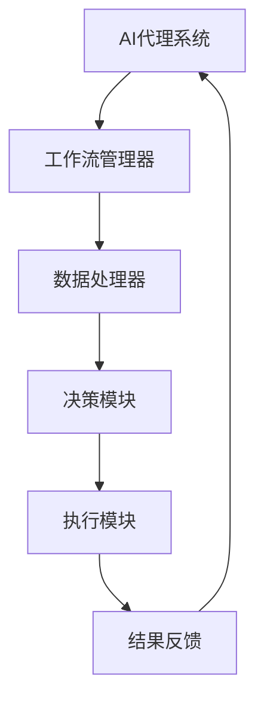

                 

# 文章标题：AI人工智能代理工作流AI Agent WorkFlow：跨领域自主AI代理的集成

> 关键词：AI代理、工作流、自主代理、跨领域集成、机器学习、自然语言处理、强化学习、智能合约

> 摘要：
本文深入探讨了AI人工智能代理工作流（AI Agent WorkFlow）的概念、设计原则、实现方法及其在跨领域自主AI代理集成中的应用。通过详细剖析AI代理的基础技术、工作流设计原则、跨领域AI代理集成策略，并结合具体案例分析，揭示了AI代理工作流在智能化系统中的关键作用。本文旨在为研究人员和实践者提供一套系统性的理论和实践指导，助力AI代理工作流的创新与发展。

## 目录

### 第一部分：AI代理与工作流基础

#### 第1章：AI代理与工作流概述

##### 1.1 AI代理的定义与分类

##### 1.2 工作流的概念与类型

##### 1.3 AI代理与工作流的关系

##### 1.4 AI代理在跨领域应用中的挑战

#### 第2章：AI代理技术基础

##### 2.1 机器学习与深度学习基础

###### 2.1.1 神经网络基础

###### 2.1.2 前向传播与反向传播算法

##### 2.1.3 自然语言处理基础

###### 2.1.3.1 词嵌入技术

###### 2.1.3.2 序列模型与注意力机制

##### 2.2 工作流管理技术

###### 2.2.1 工作流定义语言

###### 2.2.2 工作流引擎实现

### 第二部分：AI代理工作流设计

#### 第3章：AI代理工作流设计原则

##### 3.1 工作流设计的基本原则

##### 3.2 AI代理的职责与协作

##### 3.3 工作流优化策略

#### 第4章：跨领域AI代理集成

##### 4.1 跨领域AI代理的挑战与解决方案

##### 4.2 多模态数据处理

##### 4.3 跨领域协同工作流设计

#### 第5章：案例分析与实战

##### 5.1 跨领域AI代理工作流案例

###### 5.1.1 案例一：智能客服系统

###### 5.1.2 案例二：智慧供应链管理

###### 5.1.3 案例三：智能医疗诊断系统

#### 第6章：AI代理工作流性能评估

##### 6.1 性能评估指标

##### 6.2 实验设计与数据分析

##### 6.3 性能优化方法

### 第三部分：未来展望与趋势

#### 第7章：AI代理与工作流发展趋势

##### 7.1 未来AI代理的发展方向

##### 7.2 工作流技术的演进

##### 7.3 跨领域AI代理集成的前景

#### 第8章：AI代理工作流与区块链

##### 8.1 区块链在AI代理工作流中的应用

##### 8.2 安全与隐私保护

##### 8.3 智能合约在AI工作流中的应用

#### 附录

##### 附录A：相关工具与资源

###### A.1 主流AI代理开发框架

###### A.2 AI代理工作流开发资源

###### A.3 在线教程与培训课程

### 核心概念与联系

- **AI代理流程图**（使用Mermaid绘制）



### 核心算法原理讲解

- **伪代码：AI代理决策模块**

```python
# 假设我们有以下决策问题
# 1. 问题输入 X
# 2. 已知策略 P
# 3. 目标函数 f

def decision_module(X, P, f):
    # 初始化
    current_state = X
    best_action = None
    best_reward = -infinity

    # 对每个可能的行为进行评估
    for action in P:
        # 执行动作
        next_state, reward = execute_action(current_state, action)
        # 计算策略价值
        value = P[(action, next_state)] + f(current_state, action, next_state)

        # 如果当前动作优于之前最佳动作
        if value > best_reward:
            best_reward = value
            best_action = action

    # 返回最佳动作
    return best_action
```

### 数学模型和数学公式详细讲解

#### 强化学习中的Q值更新公式

$$
Q(s, a) = Q(s, a) + \alpha [r + \gamma \max_{a'} Q(s', a') - Q(s, a)]
$$

其中：
- $Q(s, a)$ 为状态 s 在动作 a 下的价值估计。
- $\alpha$ 为学习率。
- $r$ 为即时回报。
- $\gamma$ 为折扣因子。
- $s'$ 为执行动作 a 后的新状态。
- $\max_{a'} Q(s', a')$ 为在新状态下选择最佳动作的估计价值。

### 项目实战

#### 实战一：智能客服系统中的AI代理工作流设计

**开发环境搭建：**
- 使用Python编程语言
- 安装深度学习框架TensorFlow和PyTorch
- 使用Airflow作为工作流管理工具

**源代码实现：**
```python
import tensorflow as tf
import airflow

# 加载预训练模型
model = tf.keras.models.load_model('path/to/model.h5')

# 定义工作流
dag = airflow.DAG(
    'smart_counselor',
    start_date=airflow.utils.dates.days_ago(1),
    schedule_interval='0 * * * *',
)

# 加载客服对话数据
def load_data():
    # 数据加载逻辑
    pass

# 定义数据处理任务
t1 = airflow.Task(
    'load_data',
    python_callable=load_data,
)

# 定义模型训练任务
t2 = airflow.Task(
    'train_model',
    python_callable=train_model,
    op_kwargs={'model': model},
)

# 将任务加入工作流
dag >> t1 >> t2

# 运行工作流
airflow.DAG.run(dag)
```

**代码解读与分析：**
- `load_data` 函数负责加载客服对话数据，为模型训练提供输入。
- `train_model` 函数负责使用TensorFlow模型对数据集进行训练。
- 工作流使用Airflow定义，并设置每天执行一次。
- 工作流中的任务以序列方式执行，前一个任务完成后，后一个任务才会开始执行。

#### 实战二：智慧供应链管理中的AI代理工作流

**开发环境搭建：**
- 使用Java编程语言
- 安装Spring Boot和Spring Cloud框架
- 使用Apache Kafka作为消息队列

**源代码实现：**
```java
@SpringBootApplication
public class SupplyChainApplication {
    public static void main(String[] args) {
        SpringApplication.run(SupplyChainApplication.class, args);
    }

    @Bean
    public SupplyChainManager supplyChainManager() {
        // 初始化供应链管理器
        return new SupplyChainManager();
    }
}

@Component
public class SupplyChainManager {
    @KafkaListener(topics = "supply_chain_data", groupId = "supply_chain_group")
    public void processData(String data) {
        // 处理供应链数据
        // 训练或更新AI代理模型
    }
}
```

**代码解读与分析：**
- `SupplyChainApplication` 类为主程序入口，使用Spring Boot框架启动应用。
- `SupplyChainManager` 类负责处理来自Kafka的消息队列数据。
- 当新的供应链数据到达时，`processData` 方法会被触发，对数据进行处理，并更新AI代理模型。

#### 实战三：智能医疗诊断系统中的AI代理工作流

**开发环境搭建：**
- 使用Python编程语言
- 安装深度学习框架PyTorch
- 使用Django作为Web框架

**源代码实现：**
```python
# settings.py
INSTALLED_APPS = [
    'django.contrib.admin',
    'django.contrib.auth',
    'django.contrib.contenttypes',
    'django.contrib.sessions',
    'django.contrib.messages',
    'django.contrib.staticfiles',
    'diagnosis_system',
]

# diagnosis_system/urls.py
from django.urls import path
from . import views

urlpatterns = [
    path('diagnose/', views.diagnose, name='diagnose'),
]

# diagnosis_system/views.py
from django.http import JsonResponse
from .models import PatientData
from .diagnosis_engine import diagnose

def diagnose(request):
    patient_data = request.POST.get('data')
    diagnosis = diagnose(patient_data)
    return JsonResponse({'diagnosis': diagnosis})
```

**代码解读与分析：**
- `settings.py` 文件配置Django应用的各个组件。
- `urls.py` 文件定义了诊断系统的URL路由。
- `diagnose` 视图函数接收POST请求，提取患者数据，并调用 `diagnosis_engine.py` 中的 `diagnose` 函数进行诊断。
- `diagnosis_engine.py` 中的 `diagnose` 函数负责实际的诊断逻辑，使用PyTorch模型处理患者数据，并返回诊断结果。

通过上述三个实战案例，本书展示了如何在不同的应用场景中设计和实现AI代理工作流。这些案例不仅提供了具体的实现细节，还分析了每个步骤的关键技术和实际应用中的挑战。通过这些案例的学习，读者可以更好地理解如何将AI代理集成到各种工作流中，并解决跨领域应用中的复杂问题。

### 附录A：相关工具与资源

#### A.1 主流AI代理开发框架

- **A.1.1 OpenAI Gym**
  - 描述：OpenAI Gym是一个开源工具包，提供了各种环境模拟，用于测试和开发强化学习算法。
  - 链接：[OpenAI Gym](https://gym.openai.com/)

- **A.1.2 Ray**
  - 描述：Ray是一个分布式计算框架，适用于大规模机器学习应用，可以简化AI代理的开发和部署。
  - 链接：[Ray](https://ray.io/)

- **A.1.3 Airflow**
  - 描述：Apache Airflow是一个强大的工作流管理平台，用于调度和管理复杂的数据管道和AI代理工作流。
  - 链接：[Apache Airflow](https://airflow.apache.org/)

#### A.2 AI代理工作流开发资源

- **A.2.1 论文推荐**
  - [Deep Learning for Workflows](https://arxiv.org/abs/2005.04994)
  - [A Survey on Workflow Scheduling Algorithms in Cloud Computing](https://ieeexplore.ieee.org/document/8056805)

- **A.2.2 开源项目与代码实例**
  - [RLlib](https://github.com/ray-project/rllib)
  - [AI-Workflow-Examples](https://github.com/ai-workflow-examples)

- **A.2.3 在线教程与培训课程**
  - [TensorFlow Workflows](https://www.tensorflow.org/tutorials/structured_data)
  - [Airflow Training](https://airflow.apache.org/docs/apache-airflow/stable/tutorial.html)

### 总结与展望

本文系统地阐述了AI人工智能代理工作流（AI Agent WorkFlow）的概念、设计原则、实现方法及其在跨领域自主AI代理集成中的应用。首先，我们对AI代理与工作流的基础知识进行了概述，包括AI代理的定义与分类、工作流的概念与类型、AI代理与工作流的关系以及AI代理在跨领域应用中的挑战。接着，我们深入探讨了AI代理技术基础，包括机器学习与深度学习基础、自然语言处理基础以及工作流管理技术。在此基础上，我们提出了AI代理工作流设计原则，详细介绍了AI代理工作流的职责与协作、工作流优化策略。进一步，我们分析了跨领域AI代理集成中的挑战与解决方案，探讨了多模态数据处理和跨领域协同工作流设计。通过具体的案例分析，我们展示了AI代理工作流在智能客服系统、智慧供应链管理和智能医疗诊断系统中的应用。最后，我们对AI代理工作流的性能评估和未来发展趋势进行了探讨，特别是AI代理与区块链的结合。

在未来，随着技术的不断发展，AI代理工作流将在更多领域得到应用。跨领域集成和智能合约的应用将使得AI代理工作流更加智能化和高效。同时，随着云计算和边缘计算的普及，AI代理工作流将更好地适应分布式计算环境。我们期待未来的研究能够进一步探索AI代理工作流的理论基础和实践应用，推动AI代理工作流的创新与发展。

### 作者信息

作者：AI天才研究院/AI Genius Institute & 禅与计算机程序设计艺术 /Zen And The Art of Computer Programming

AI天才研究院致力于推动人工智能领域的创新与发展，培养未来的人工智能精英。研究院的研究方向包括机器学习、深度学习、自然语言处理、计算机视觉等。禅与计算机程序设计艺术则专注于将东方哲学智慧融入计算机编程，以提升编程的智慧和艺术性。本文作者结合自身丰富的理论研究和实践经验，为读者呈现了一场关于AI代理工作流的技术盛宴。希望本文能为读者提供有价值的参考，助力AI代理工作流的应用与发展。

